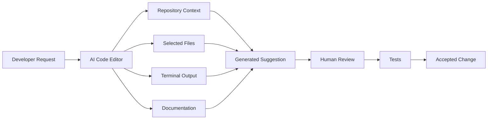
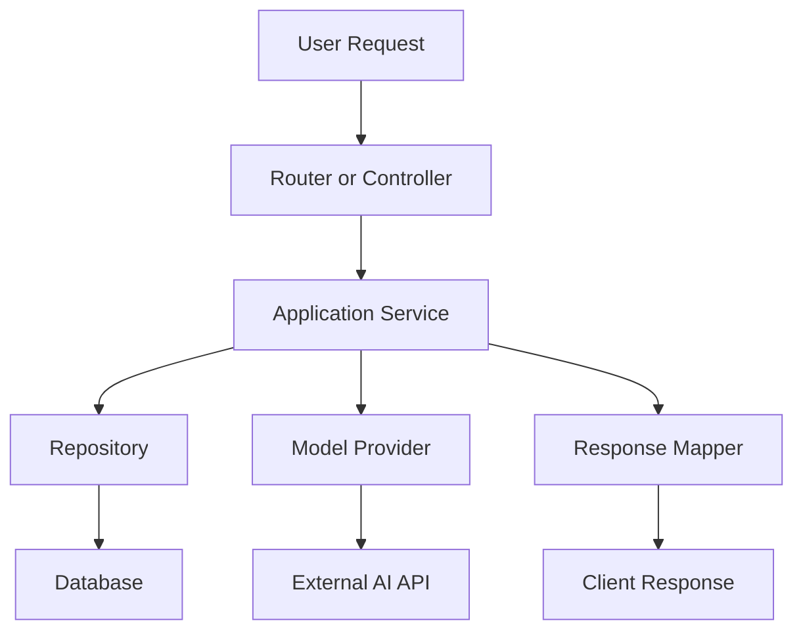
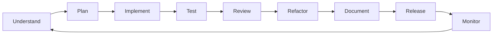
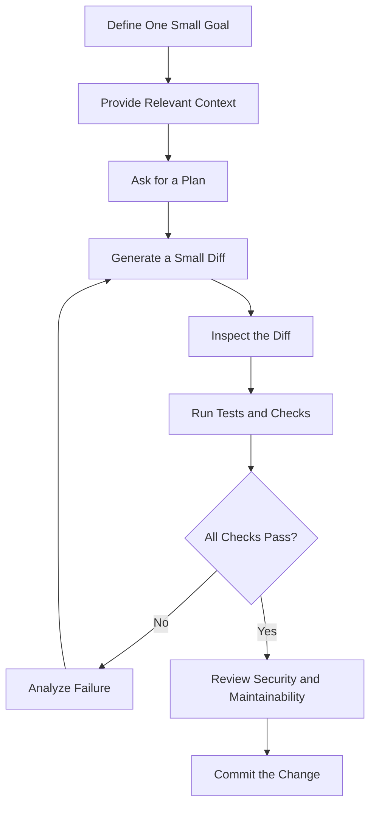

# 001 — AI Code Editors

**Course:** 04 — Agents, Multimodal, and Tools
**Module:** Module 12 — Development Tools
**Content Group:** Tool Categories
**Roadmap Source:** Development Tools / Tool Categories
**Lesson Type:** Development Tool
**Order in Module:** 001
**Suggested Duration:** 16 minutes

---

## 1. Overview

An **AI code editor** is a development environment that integrates artificial intelligence into the software engineering workflow.

Instead of only highlighting syntax and providing basic autocomplete, an AI code editor can help developers:

* Generate code from natural-language instructions.
* Explain unfamiliar code.
* Navigate large repositories.
* Find relevant files and functions.
* Refactor existing implementations.
* Generate unit and integration tests.
* Diagnose errors from logs or stack traces.
* Write documentation.
* Review code for correctness, security, and maintainability.

For an AI Engineer, these editors are especially useful because AI applications often combine many components:

* Model APIs
* Prompt templates
* Retrieval systems
* Vector databases
* Agent tools
* Backend services
* Frontend interfaces
* Evaluation pipelines
* Logging and monitoring

An AI code editor can accelerate work across these components, but it should be treated as an **engineering assistant**, not as an unquestionable source of truth.

The developer remains responsible for understanding, testing, reviewing, and maintaining the generated code.

---

## 2. Learning Objectives

By the end of this lesson, you should be able to:

1. Explain what an AI code editor is in your own words.
2. Identify where AI code editors fit into the software development lifecycle.
3. Use an AI code editor to explore, implement, test, and refactor a feature.
4. Write clear coding prompts with appropriate context and constraints.
5. Review AI-generated code for correctness, security, and maintainability.
6. Recognize tasks that should not be delegated entirely to an AI assistant.
7. Build a small portfolio demonstration of an AI-assisted coding workflow.

---

## 3. What Is an AI Code Editor?

A traditional code editor mainly helps with text editing, syntax highlighting, file navigation, and language-aware autocomplete.

An AI code editor adds a reasoning and generation layer on top of these capabilities.



The AI assistant may receive context from:

* The currently opened file
* Selected code
* Related files
* Repository structure
* Type definitions
* Configuration files
* Terminal output
* Compiler errors
* Test failures
* Version-control differences
* Project-specific instructions

The quality of the result depends heavily on the quality and relevance of this context.

---

## 4. Core Capabilities

### 4.1 Code Generation

An AI code editor can generate:

* Functions
* Classes
* API routes
* Database models
* Validation schemas
* Test cases
* CLI commands
* UI components
* Configuration files

Example prompt:

```text
Create a FastAPI POST endpoint at /api/v1/summaries.

Requirements:
- Accept a JSON object with a required "text" field.
- Reject text shorter than 20 characters.
- Call the existing SummaryService.
- Return the result using the project's standard response envelope.
- Do not call the model directly from the router.
- Add unit tests for valid and invalid requests.
```

This prompt is more effective than:

```text
Create a summary API.
```

The first prompt defines the framework, route, input, validation rules, architecture, output convention, and testing expectations.

---

### 4.2 Code Explanation

AI code editors can explain unfamiliar implementations at different levels.

Example:

```text
Explain this function to a junior backend developer.

Cover:
1. Its input and output.
2. Its control flow.
3. External side effects.
4. Possible failure cases.
5. Any security or performance concerns.
```

This capability is useful when:

* Joining an unfamiliar codebase
* Reviewing legacy code
* Investigating complex business logic
* Understanding generated code
* Learning a new framework

However, explanations should still be verified against the actual implementation.

---

### 4.3 Repository Navigation

In large repositories, finding the correct implementation location can be harder than writing the code itself.

An AI code editor can help answer questions such as:

```text
Where is user authentication validated?

Find:
- The main authentication middleware.
- Token decoding logic.
- User-loading logic.
- Relevant tests.
- Any routes that bypass authentication.
```

This can reduce the time required to understand how a feature flows through the system.



Before modifying a feature, the developer should understand which layers are involved.

---

### 4.4 Refactoring

AI code editors can identify duplicated logic and propose cleaner abstractions.

Common refactoring tasks include:

* Extracting a function
* Splitting a large class
* Moving logic out of a route
* Introducing an interface
* Removing duplication
* Improving naming
* Adding type annotations
* Replacing deeply nested conditions
* Separating model-provider logic from business logic

Example prompt:

```text
Refactor this route without changing its external behavior.

Goals:
- Keep the router thin.
- Move business logic into ForecastService.
- Move database access into ForecastRepository.
- Preserve existing response fields.
- Preserve logging and error handling.
- Make the smallest practical diff.
- Update the existing tests instead of replacing them.
```

A refactoring request should explicitly state that behavior must remain unchanged.

---

### 4.5 Test Generation

AI assistants are useful for generating an initial test suite, especially when the developer provides expected behavior.

Example prompt:

```text
Generate tests for this function using pytest.

Cover:
- Normal valid input.
- Empty input.
- Boundary-length input.
- Unsupported language.
- Provider timeout.
- Invalid provider response.
- Successful fallback behavior.

Use mocks only for external services.
Do not mock the function under test.
```

Generated tests should be reviewed carefully. A test is not useful merely because it passes.

A weak test may:

* Assert only that no exception occurs.
* Mock too much of the system.
* Repeat the implementation logic.
* Ignore edge cases.
* Test internal details instead of observable behavior.

---

### 4.6 Debugging

AI code editors can analyze:

* Stack traces
* Compiler errors
* Failed assertions
* HTTP responses
* Database exceptions
* Model-provider failures
* Logs
* Performance symptoms

A strong debugging prompt separates evidence from assumptions.

```text
Analyze this failure.

Observed behavior:
- POST /api/v1/chat returns HTTP 500.
- It happens only when citations are enabled.
- Requests without citations succeed.

Evidence:
- Include the stack trace below.
- The failing line accesses result.sources[0].
- Some provider responses return an empty sources array.

Tasks:
1. Identify the most likely root cause.
2. Show the smallest safe fix.
3. Add a regression test.
4. Explain any behavior change.
5. Do not hide the error with a broad exception handler.
```

Avoid prompts such as:

```text
Fix everything.
```

Broad prompts often lead to broad and risky changes.

---

### 4.7 Documentation

AI code editors can help generate:

* Docstrings
* README sections
* API documentation
* Architecture notes
* Migration guides
* Pull request summaries
* Changelog entries
* Setup instructions

Documentation should describe the final verified behavior, not the assistant's original assumptions.

---

## 5. Where AI Code Editors Fit in the Workflow

AI code editors can support nearly every stage of software development.



### Understand

Use the assistant to:

* Locate relevant files.
* Trace data flow.
* Explain existing behavior.
* Identify dependencies.
* Find similar implementations.

### Plan

Ask the assistant to produce:

* A file-level change plan.
* Expected risks.
* Required tests.
* Backward-compatibility concerns.
* Open questions.

### Implement

Use it to:

* Generate a small patch.
* Add one function or component at a time.
* Follow existing project patterns.
* Avoid unrelated modifications.

### Test

Ask it to:

* Add regression tests.
* Cover edge cases.
* Run static checks.
* Interpret failures.

### Review

Use the assistant as a second reviewer, not as the final reviewer.

### Refactor

Improve the implementation only after the behavior is verified.

### Document

Generate documentation from the final code and tests.

---

## 6. A Responsible AI Coding Loop

A reliable workflow uses small, reviewable iterations.



The most important principle is:

> Do not ask the assistant to make a large change before you understand the current system.

---

## 7. Prompt Structure for Coding Tasks

A useful coding prompt usually contains six parts.

### 7.1 Goal

Describe the exact outcome.

```text
Add language selection to the report-generation endpoint.
```

### 7.2 Current Context

Explain how the system works now.

```text
The endpoint currently generates English reports only.
The selected model is called through ReportService.
```

### 7.3 Constraints

Define what must not change.

```text
Do not change the response schema.
Do not access the model provider from the router.
```

### 7.4 Acceptance Criteria

Describe observable success.

```text
- "en" returns an English report.
- "vi" returns a Vietnamese report.
- Unsupported languages return HTTP 422.
- Existing clients that omit the field continue to receive English.
```

### 7.5 Verification

Specify tests and checks.

```text
Add unit tests and run the existing report test suite.
```

### 7.6 Scope

Limit the change.

```text
Only modify the report request schema, service, prompt builder, and related tests.
```

### Complete Prompt Template

```text
Goal:
[Describe one concrete engineering outcome.]

Current behavior:
[Explain what the system does now.]

Relevant architecture:
[List important files, services, interfaces, or patterns.]

Requirements:
- [Requirement 1]
- [Requirement 2]
- [Requirement 3]

Constraints:
- Preserve [existing behavior].
- Do not modify [out-of-scope component].
- Follow [project pattern or convention].
- Keep the diff small.

Acceptance criteria:
- [Observable result 1]
- [Observable result 2]
- [Failure behavior]

Verification:
- Add or update tests.
- Run relevant checks.
- Report any checks that cannot be completed.
```

---

## 8. Practical Demo: Adding a Small AI Feature

Suppose we have an application that exposes a text-summarization endpoint.

We want to add a configurable summary length.

### 8.1 Desired Request

```json
{
  "text": "A long article...",
  "length": "short"
}
```

Supported values:

* `short`
* `medium`
* `long`

The default should be `medium`.

---

### 8.2 Step 1: Ask the Editor to Explore

```text
Find the current summarization flow.

Identify:
1. The API route.
2. The request schema.
3. The service that calls the model.
4. The prompt builder.
5. Existing summarization tests.

Do not modify any files yet.
```

This prevents the assistant from making changes before understanding the architecture.

---

### 8.3 Step 2: Request a Plan

```text
Plan the smallest change required to support summary lengths:
short, medium and long.

Requirements:
- Default to medium.
- Reject unsupported values.
- Keep model calls inside SummaryService.
- Preserve the existing response schema.
- Include unit and API tests.

Return a file-by-file plan before editing.
```

Example plan:

```text
1. Update schemas/summary.py
   - Add a SummaryLength enum.
   - Add a length field with a medium default.

2. Update prompts/summary.py
   - Map each length to a clear output instruction.

3. Update services/summary_service.py
   - Pass the selected length to the prompt builder.

4. Update tests
   - Test the default value.
   - Test all valid values.
   - Test an unsupported value.
```

---

### 8.4 Step 3: Implement a Small Diff

Example Python schema:

```python
from enum import Enum

from pydantic import BaseModel, Field


class SummaryLength(str, Enum):
    SHORT = "short"
    MEDIUM = "medium"
    LONG = "long"


class SummaryRequest(BaseModel):
    text: str = Field(min_length=20)
    length: SummaryLength = SummaryLength.MEDIUM
```

Example prompt builder:

```python
from app.schemas.summary import SummaryLength


LENGTH_INSTRUCTIONS: dict[SummaryLength, str] = {
    SummaryLength.SHORT: "Summarize the text in no more than 3 sentences.",
    SummaryLength.MEDIUM: "Summarize the text in 1 to 2 concise paragraphs.",
    SummaryLength.LONG: (
        "Produce a detailed summary covering the main argument, "
        "supporting points, and conclusion."
    ),
}


def build_summary_prompt(text: str, length: SummaryLength) -> str:
    instruction = LENGTH_INSTRUCTIONS[length]

    return f"""
You are a precise summarization assistant.

Instructions:
- {instruction}
- Preserve important facts.
- Do not invent information.
- Return only the summary.

Text:
{text}
""".strip()
```

Example service:

```python
class SummaryService:
    def __init__(self, model_client):
        self.model_client = model_client

    async def summarize(self, request: SummaryRequest) -> str:
        prompt = build_summary_prompt(
            text=request.text,
            length=request.length,
        )

        response = await self.model_client.generate(prompt=prompt)
        return response.text
```

---

### 8.5 Step 4: Generate Tests

```python
import pytest
from pydantic import ValidationError

from app.schemas.summary import SummaryLength, SummaryRequest


def test_summary_length_defaults_to_medium() -> None:
    request = SummaryRequest(
        text="This is a sufficiently long piece of text for summarization."
    )

    assert request.length == SummaryLength.MEDIUM


@pytest.mark.parametrize(
    "value",
    ["short", "medium", "long"],
)
def test_summary_request_accepts_supported_lengths(value: str) -> None:
    request = SummaryRequest(
        text="This is a sufficiently long piece of text for summarization.",
        length=value,
    )

    assert request.length.value == value


def test_summary_request_rejects_unsupported_length() -> None:
    with pytest.raises(ValidationError):
        SummaryRequest(
            text="This is a sufficiently long piece of text for summarization.",
            length="extreme",
        )
```

---

### 8.6 Step 5: Review the Generated Change

Check whether the implementation:

* Uses the existing architecture.
* Preserves backward compatibility.
* Validates user input.
* Avoids provider-specific code in the route.
* Includes meaningful tests.
* Handles provider failures.
* Preserves logging.
* Avoids exposing prompts or secrets.
* Does not modify unrelated files.

---

## 9. Small Diffs Are Safer

One of the best practices for AI-assisted development is to request small changes.

Compare these two requests.

### Risky Request

```text
Rewrite the entire backend to improve the architecture.
```

### Safer Request

```text
Refactor only the POST /api/v1/summaries route.

Move business logic into SummaryService while preserving:
- The request schema
- The response schema
- HTTP status codes
- Existing logs
- Existing tests

Do not modify other routes.
```

Small diffs are easier to:

* Understand
* Test
* Review
* Revert
* Compare
* Debug

They also reduce the chance that the assistant will introduce unrelated behavior changes.

---

## 10. Human Review Responsibilities

AI-generated code must be reviewed like code written by any other contributor.

### 10.1 Correctness

Ask:

* Does the implementation satisfy the requirements?
* Does it handle invalid input?
* Are boundary conditions covered?
* Are errors returned correctly?
* Does it preserve existing behavior?

### 10.2 Security

Check for:

* SQL injection
* Command injection
* Path traversal
* Cross-site scripting
* Missing authorization
* Sensitive data exposure
* Unsafe deserialization
* Broad file-system access
* Unvalidated URLs
* Prompt injection
* Secret leakage

### 10.3 Maintainability

Ask:

* Does the code follow project conventions?
* Are names clear?
* Is logic duplicated?
* Are functions too large?
* Are dependencies introduced unnecessarily?
* Is the abstraction appropriate for the current problem?

### 10.4 Performance

Check for:

* Repeated model calls
* Unbounded loops
* Large context windows
* Missing pagination
* N+1 database queries
* Blocking operations in asynchronous code
* Loading entire files into memory
* Missing caching where appropriate

### 10.5 AI-Specific Concerns

For AI applications, also check:

* Prompt construction
* Token usage
* Model timeout behavior
* Retry policies
* Fallback behavior
* Output validation
* Hallucination risk
* Evaluation coverage
* Prompt-injection boundaries
* Logging of private input

---

## 11. Common Failure Patterns

### 11.1 Accepting Generated Code Without Understanding It

A developer accepts a large patch because it appears professional and passes one basic test.

Possible consequences:

* Hidden security weaknesses
* Broken edge cases
* Unnecessary dependencies
* Architecture violations
* Difficult future maintenance

**Better approach:** Ask the editor to explain each changed file and review the diff manually.

---

### 11.2 Providing Too Little Context

Weak prompt:

```text
Add caching.
```

The assistant does not know:

* What should be cached
* Where the cache should live
* How long entries should remain valid
* How cache keys should be constructed
* What invalidates the cache
* Whether user-specific data is involved

**Better approach:** Define the data, cache key, expiry, invalidation strategy, and failure behavior.

---

### 11.3 Asking for Too Much at Once

A single prompt asks the editor to:

* Redesign the architecture
* Add authentication
* Add a database
* Integrate a model provider
* Build a frontend
* Write tests
* Deploy the application

This creates a large, difficult-to-review result.

**Better approach:** Divide the work into independent, verifiable milestones.

---

### 11.4 Tests That Only Confirm the Happy Path

An endpoint may work with valid input but fail when:

* Input is empty
* A provider times out
* The model returns malformed output
* The database is unavailable
* A request is repeated
* Multiple users access the feature simultaneously

**Better approach:** Ask for failure-mode and boundary tests explicitly.

---

### 11.5 Broad Exception Handling

AI-generated code sometimes hides errors with patterns such as:

```python
try:
    result = await perform_operation()
except Exception:
    return None
```

This makes failures difficult to diagnose.

A safer implementation should:

* Catch expected exceptions.
* Preserve useful error context.
* Log with a request or trace identifier.
* Return a meaningful application-level error.
* Avoid exposing sensitive details to users.

---

### 11.6 Hallucinated APIs

The assistant may generate:

* Methods that do not exist
* Incorrect package imports
* Deprecated configuration
* Unsupported parameters
* Wrong response fields

**Better approach:** Verify generated code against installed types, official documentation, and executable tests.

---

### 11.7 Unnecessary Refactoring

An assistant may rewrite working code while adding a small feature.

This increases review effort and regression risk.

Use constraints such as:

```text
Make the smallest practical diff.
Do not rename unrelated symbols.
Do not reformat unrelated files.
```

---

## 12. When Not to Rely Entirely on an AI Code Editor

Extra caution is required for:

* Authentication
* Authorization
* Payment processing
* Encryption
* Database migrations
* Destructive operations
* Infrastructure changes
* Production incident response
* Personal-data handling
* Medical, financial, or legal systems
* Security-sensitive dependencies

The assistant can provide suggestions, but an experienced human should verify the final design and implementation.

---

## 13. AI Code Editor Review Prompt

Use this prompt after implementing a feature:

```text
Review the current diff as a senior software engineer.

Evaluate:
1. Correctness
2. Backward compatibility
3. Input validation
4. Error handling
5. Security
6. Performance
7. Maintainability
8. Test quality
9. Logging and observability
10. Unnecessary changes

For each issue:
- State the severity.
- Point to the relevant file or code.
- Explain the impact.
- Suggest the smallest safe correction.

Do not modify the code yet.
Do not invent issues without evidence.
```

Separating review from modification makes the findings easier to evaluate.

---

## 14. Production Debugging Example

### Symptom

The application works locally, but the production endpoint occasionally returns an empty AI response.

### Possible Causes

* Provider timeout
* Response parsing failure
* Empty provider output
* Rate limiting
* Incorrect retry behavior
* Context-length limit
* Safety filtering
* Network interruption

### Debugging Prompt

```text
Investigate why SummaryService occasionally returns an empty string.

Available evidence:
- The HTTP request succeeds.
- The provider status code is 200.
- The issue occurs in approximately 2% of requests.
- The current implementation reads response.output[0].text.
- Some logs contain an empty output array.

Tasks:
1. Trace the response-parsing path.
2. Identify unsafe assumptions.
3. Add structured logs without logging user text.
4. Add a regression test for an empty output array.
5. Return an explicit provider-response error instead of an empty string.
6. Keep the public API response schema unchanged.
```

### Likely Fix

Validate the provider response before accessing nested fields.

```python
class InvalidModelResponseError(RuntimeError):
    pass


def extract_text(response) -> str:
    if not response.output:
        raise InvalidModelResponseError(
            "Model provider returned no output items."
        )

    text = response.output[0].text.strip()

    if not text:
        raise InvalidModelResponseError(
            "Model provider returned empty text."
        )

    return text
```

The important lesson is not merely to prevent a crash. The system should produce enough evidence to diagnose why the provider response was invalid.

---

## 15. Practical Exercise

### Task

Use an AI code editor to add a small feature to an existing application.

Possible features:

* Add language selection to an AI endpoint.
* Add input-length validation.
* Add a model timeout.
* Add structured request logging.
* Add a health-check endpoint.
* Add output-schema validation.
* Add one retrieval metadata filter.
* Add a simple provider fallback.

### Required Workflow

1. Ask the editor to locate relevant files.
2. Ask for a file-by-file implementation plan.
3. Define acceptance criteria.
4. Generate a small diff.
5. Review every changed file.
6. Run tests.
7. Add at least one edge-case test.
8. Request a security and maintainability review.
9. Refactor only after tests pass.
10. Generate concise documentation.

### Required Evidence

Save the following in your portfolio:

* Original prompt
* Implementation plan
* Code diff
* Test output
* One discovered issue
* Final corrected implementation
* A short reflection

---

## 16. Five-Line Recall Exercise

Without looking at the lesson, write five lines explaining:

1. What an AI code editor is.
2. What context it can use.
3. Why small diffs are important.
4. Why generated tests still require review.
5. What responsibilities remain with the developer.

Example answer:

```text
An AI code editor integrates code generation and reasoning into an editor.
It can use files, repository structure, tests, logs and terminal output.
Small diffs make generated changes easier to understand and verify.
Generated tests may be incomplete or may test the wrong behavior.
The developer remains responsible for security, correctness and maintenance.
```

---

## 17. Common Mistakes

* Memorizing definitions without building a demo.
* Asking for a large feature in one prompt.
* Giving the assistant insufficient repository context.
* Accepting generated code without reading it.
* Testing only the happy path.
* Ignoring security and privacy risks.
* Allowing unrelated files to be modified.
* Trusting hallucinated APIs or package features.
* Refactoring before behavior is verified.
* Failing to document assumptions and limitations.
* Committing secrets, generated credentials, or sensitive logs.
* Treating passing tests as proof that the implementation is correct.

---

## 18. Completion Checklist

### Understanding

* [ ] I can explain AI code editors in one to two minutes.
* [ ] I can describe how they differ from traditional autocomplete.
* [ ] I understand that repository context affects output quality.

### Prompting

* [ ] I can define a concrete goal.
* [ ] I can provide relevant architectural context.
* [ ] I can specify constraints and acceptance criteria.
* [ ] I can request a small, reviewable diff.

### Implementation

* [ ] I have created a small AI-assisted feature.
* [ ] I reviewed every generated change.
* [ ] I verified that the code follows project conventions.
* [ ] I avoided unnecessary dependencies and unrelated refactoring.

### Testing

* [ ] I tested the happy path.
* [ ] I tested invalid input.
* [ ] I tested at least one external failure.
* [ ] I added a regression test for a realistic bug.

### Production Readiness

* [ ] I considered security risks.
* [ ] I considered model cost and latency.
* [ ] I considered logging and observability.
* [ ] I documented at least one limitation.
* [ ] I recorded at least one unanswered engineering question.

---

## 19. Related Outcome

Use AI coding tools responsibly to:

* Understand unfamiliar repositories.
* Plan implementation work.
* Generate small features.
* Write and improve tests.
* Review code.
* Refactor verified implementations.
* Produce technical documentation.
* Debug failures using concrete evidence.

The goal is not to maximize the amount of generated code.

The goal is to increase engineering speed while preserving correctness, security, and maintainability.

---

## 20. Related Project

### Project 11 — AI Coding Workflow

Build and document an end-to-end AI-assisted coding workflow.

### Suggested Feature

Add configurable language support to an AI text-processing API.

### Project Stages


### Portfolio Deliverables

```text
project-11-ai-coding-workflow/
├── README.md
├── prompts/
│   ├── 01-exploration.md
│   ├── 02-plan.md
│   ├── 03-implementation.md
│   └── 04-review.md
├── src/
├── tests/
├── docs/
│   ├── architecture.md
│   └── debugging-notes.md
└── evidence/
    ├── before.diff
    ├── after.diff
    └── test-results.txt
```

### README Questions

Your project README should answer:

1. What feature was implemented?
2. How did the AI code editor help?
3. Which suggestions were rejected?
4. Which bug or weakness was found during review?
5. How was the implementation tested?
6. What limitations remain?
7. What would you improve before production deployment?

---

## 21. Key Takeaways

* AI code editors can generate, explain, navigate, test, review, refactor, and document code.
* Their output quality depends on the context and constraints provided.
* Small, focused prompts usually produce safer changes than broad requests.
* Generated code must be inspected and tested.
* Generated tests are not automatically meaningful.
* Security-sensitive code requires additional human review.
* Evidence-based debugging is more reliable than asking the assistant to guess.
* The developer remains accountable for the final implementation.
* The best AI coding workflow combines automation with human judgment.

---

## 22. Summary

**AI Code Editors** are important tools in the modern AI Engineer workflow. They can reduce the time required to understand repositories, implement features, write tests, investigate failures, refactor code, and create documentation.

However, speed does not replace engineering discipline.

A responsible workflow is:

```text
Understand → Plan → Implement → Test → Review → Refactor → Document
```

Turn this lesson into a practical artifact by using an AI code editor to implement one small feature. Save the prompts, inspect the diff, test edge cases, record a production risk, and explain how you verified the final result.

The objective is not to let AI write the most code.

The objective is to build reliable software more effectively.

---

# Bài luyện tập

## Mục tiêu


## Đề bài


## Yêu cầu hoàn thành

- [ ] 
- [ ] 
- [ ] 

## Kết quả / lời giải


## Ghi chú
