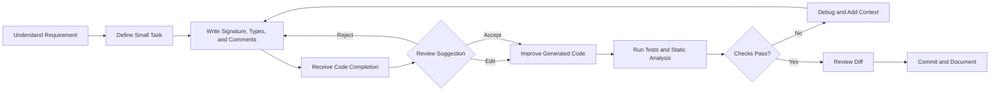

# 002 — Code Completion Tools

**Course:** 04 — Agents, Multimodal, and Tools
**Module:** Module 12 — Development Tools
**Content Group:** Tool Categories
**Roadmap Source:** Development Tools / Tool Categories
**Lesson Type:** Development Tool
**Order in Module:** 002
**Suggested Duration:** 16 minutes

---

## 1. Overview

**Code completion tools** use machine learning or large language models to predict, suggest, and generate code while a developer is working.

A basic completion tool may suggest the rest of a variable name or function call. A more advanced AI-powered tool can generate:

* Complete functions
* Classes and data models
* API routes
* Tests
* Documentation
* Error-handling logic
* Refactoring suggestions
* Configuration files
* Database queries

These tools reduce repetitive work and help developers move from an idea to a working implementation more quickly.

However, code completion is not the same as automatic software engineering. The developer is still responsible for:

* Understanding the generated code
* Verifying correctness
* Reviewing security risks
* Testing edge cases
* Maintaining architectural consistency
* Ensuring the code remains readable and maintainable

The best way to use code completion tools is to give them a **small, well-defined task**, provide relevant context, and verify the resulting code with tests and review.

---

## 2. Learning Objectives

By the end of this lesson, you should be able to:

* Explain code completion tools in your own words.
* Distinguish code completion from chat-based coding assistants and autonomous coding agents.
* Identify where code completion fits into a modern AI engineering workflow.
* Write useful comments, function signatures, and prompts that produce better suggestions.
* Review AI-generated code for correctness, security, and maintainability.
* Use code completion to implement and test a small feature.
* Recognize common failure modes and debug incorrect suggestions.

---

## 3. What Are Code Completion Tools?

Code completion tools predict the code that a developer is likely to write next.

Traditional code completion is usually based on:

* Programming language syntax
* Imported packages
* Type information
* Available variables and functions
* Static analysis
* Project symbols

AI-powered code completion adds contextual prediction based on:

* Existing source files
* Nearby comments
* Function names
* Type annotations
* Tests
* Documentation
* Common programming patterns
* Natural-language instructions

For example, after writing:

```python
def calculate_average(values: list[float]) -> float:
```

A completion tool may suggest:

```python
    if not values:
        raise ValueError("values must not be empty")

    return sum(values) / len(values)
```

The suggestion is based on the function name, parameter type, return type, and common implementation patterns.

---

## 4. Main Categories of Code Completion

### 4.1 Token and Symbol Completion

This is the simplest form of completion.

It predicts:

* Variable names
* Function names
* Method calls
* Class properties
* Imports
* Keywords

Example:

```python
user_repository.find_by_
```

Possible suggestion:

```python
user_repository.find_by_email(email)
```

This type of completion is usually fast and highly dependent on static project information.

---

### 4.2 Line Completion

Line completion predicts the rest of the current line.

Example:

```python
return JSONResponse(
```

Possible suggestion:

```python
return JSONResponse(status_code=404, content={"error": "User not found"})
```

It is useful for reducing repetitive syntax.

---

### 4.3 Multi-Line Completion

Multi-line completion generates several related lines at once.

Example input:

```python
def normalize_email(email: str) -> str:
    """Normalize and validate an email address."""
```

Possible suggestion:

```python
    normalized = email.strip().lower()

    if "@" not in normalized:
        raise ValueError("Invalid email address")

    return normalized
```

Multi-line completion is useful for small functions, validation logic, data transformations, and tests.

---

### 4.4 Function-Level Completion

The developer provides a function name, signature, type annotations, and documentation. The tool generates the implementation.

```python
def calculate_discount(
    original_price: float,
    discount_percent: float,
) -> float:
    """
    Return the final price after applying a percentage discount.

    Raises:
        ValueError: If the price is negative or the percentage is outside
        the range from 0 to 100.
    """
```

A good completion should:

1. Validate the inputs.
2. Calculate the discount.
3. Return the final price.
4. Preserve the expected return type.

---

### 4.5 Test Completion

Code completion tools can generate tests from an existing implementation or specification.

Given:

```python
def divide(a: float, b: float) -> float:
    if b == 0:
        raise ValueError("b must not be zero")

    return a / b
```

The tool may generate:

```python
import pytest


def test_divide_returns_correct_result() -> None:
    assert divide(10, 2) == 5


def test_divide_supports_negative_values() -> None:
    assert divide(-10, 2) == -5


def test_divide_rejects_zero_divisor() -> None:
    with pytest.raises(ValueError, match="b must not be zero"):
        divide(10, 0)
```

Generated tests must still be reviewed. A tool may produce tests that only confirm its own incorrect assumptions.

---

### 4.6 Next-Edit Prediction

Some tools predict not only the next code block but also the next location that may need to be changed.

For example, after adding a field to a data model, the tool may suggest updates to:

* The database schema
* A request model
* A response model
* A serializer
* Tests
* Documentation

This is useful for changes that affect multiple parts of a codebase.

---

## 5. Code Completion vs. Other AI Coding Tools

Code completion is part of a larger AI-assisted development ecosystem.

| Tool Type                | Main Interaction                    | Best For                             | Developer Control                 |
| ------------------------ | ----------------------------------- | ------------------------------------ | --------------------------------- |
| Traditional autocomplete | Select a symbol or method           | Syntax and API discovery             | Very high                         |
| AI code completion       | Accept or reject inline suggestions | Small local implementations          | High                              |
| Coding chat assistant    | Ask questions in natural language   | Explanation, debugging, and planning | Medium to high                    |
| Refactoring assistant    | Request structured code changes     | Improving existing code              | Medium                            |
| Coding agent             | Assign a multi-step task            | Cross-file implementation            | Lower unless carefully supervised |

Code completion is most effective when the developer already knows:

* What should be implemented
* Where the code belongs
* What interfaces must remain unchanged
* How the result will be tested

A coding agent may explore and modify many files. A completion tool usually works more locally and incrementally.

---

## 6. Where Code Completion Fits in the Development Workflow



The tool should not replace the workflow. It should accelerate individual steps inside the workflow.

A reliable sequence is:

1. Understand the requirement.
2. Define a small unit of work.
3. Write a clear interface.
4. Let the tool suggest an implementation.
5. Review every generated line.
6. Run tests and static analysis.
7. Inspect the final diff.
8. Document important assumptions.

---

## 7. How Context Affects Completion Quality

Code completion quality depends heavily on the information available near the cursor.

Weak context:

```python
def process(data):
```

This does not explain:

* The structure of `data`
* The expected output
* Validation requirements
* Possible errors
* Business rules

Better context:

```python
def extract_active_user_emails(
    users: list[dict[str, object]],
) -> list[str]:
    """
    Return normalized email addresses for active users.

    Rules:
    - Ignore inactive users.
    - Ignore users without an email address.
    - Convert email addresses to lowercase.
    - Remove duplicate email addresses.
    - Preserve the original user order.
    """
```

The second version provides a clear contract. It gives the completion system enough information to generate a more accurate implementation.

### Useful Sources of Context

Good code completion can be encouraged through:

* Descriptive function names
* Type annotations
* Docstrings
* Small comments
* Existing tests
* Example input and output
* Domain-specific exceptions
* Nearby interfaces
* Consistent code style

---

## 8. Practical Example: Completing a Small AI Application Feature

Assume we are building an API that stores user prompts.

The requirement is:

> Reject empty prompts, normalize surrounding whitespace, and return the cleaned prompt with its character count.

### 8.1 Define the Data Models

```python
from pydantic import BaseModel, Field


class PromptRequest(BaseModel):
    prompt: str = Field(min_length=1, max_length=4_000)


class PromptResponse(BaseModel):
    prompt: str
    character_count: int
```

### 8.2 Provide a Clear Function Contract

```python
def normalize_prompt(prompt: str) -> str:
    """
    Normalize a user prompt.

    Rules:
    - Remove whitespace from the beginning and end.
    - Reject prompts that become empty after normalization.
    - Preserve internal whitespace.
    """
```

A completion tool may generate:

```python
def normalize_prompt(prompt: str) -> str:
    """
    Normalize a user prompt.

    Rules:
    - Remove whitespace from the beginning and end.
    - Reject prompts that become empty after normalization.
    - Preserve internal whitespace.
    """
    normalized = prompt.strip()

    if not normalized:
        raise ValueError("Prompt must not be empty")

    return normalized
```

### 8.3 Create the API Route

```python
from fastapi import FastAPI, HTTPException

app = FastAPI()


@app.post("/prompts", response_model=PromptResponse)
def create_prompt(request: PromptRequest) -> PromptResponse:
    try:
        normalized_prompt = normalize_prompt(request.prompt)
    except ValueError as exc:
        raise HTTPException(status_code=400, detail=str(exc)) from exc

    return PromptResponse(
        prompt=normalized_prompt,
        character_count=len(normalized_prompt),
    )
```

### 8.4 Generate Tests

```python
from fastapi.testclient import TestClient

client = TestClient(app)


def test_create_prompt_returns_normalized_prompt() -> None:
    response = client.post(
        "/prompts",
        json={"prompt": "  Explain vector databases  "},
    )

    assert response.status_code == 200
    assert response.json() == {
        "prompt": "Explain vector databases",
        "character_count": 24,
    }


def test_create_prompt_rejects_whitespace_only_prompt() -> None:
    response = client.post(
        "/prompts",
        json={"prompt": "   "},
    )

    assert response.status_code == 400
    assert response.json() == {
        "detail": "Prompt must not be empty",
    }
```

### 8.5 Review the Generated Code

Before accepting the feature, verify:

* Is input length limited?
* Are whitespace-only prompts rejected?
* Is the correct HTTP status code returned?
* Does the character count use the normalized value?
* Are internal spaces preserved?
* Are exceptions exposed safely?
* Are both successful and unsuccessful cases tested?

This review is more important than the speed of code generation.

---

## 9. Using Comments as Completion Instructions

A short comment can act as a local prompt.

```python
# Return the three highest-scoring unique documents.
# Preserve the original order when scores are equal.
# Ignore documents with a score below 0.5.
```

The tool may then generate a sorting and filtering implementation.

However, comments must be precise. Consider the difference:

Weak comment:

```python
# Process documents
```

Better comment:

```python
# Remove documents with duplicate IDs.
# Keep the first occurrence.
# Return at most 10 documents.
```

The better comment defines observable behavior that can be tested.

After accepting the completion, remove unnecessary instruction comments or convert them into useful documentation.

---

## 10. Responsible Usage Principles

### 10.1 Keep the Scope Small

Ask the tool to complete one clear unit at a time:

* One function
* One validation rule
* One test case
* One database query
* One error handler

Large, vague tasks increase the probability of incorrect assumptions.

---

### 10.2 Review Before Accepting

Do not accept a suggestion only because it looks professional.

Check:

* Is the algorithm correct?
* Are all variables defined?
* Are external APIs used correctly?
* Are errors handled?
* Is the code consistent with the project architecture?
* Is the code more complicated than necessary?

---

### 10.3 Verify External APIs

A completion tool may invent:

* Package names
* Function parameters
* Configuration properties
* Framework methods
* Library versions
* Environment variables

Verify unfamiliar APIs using official documentation or the actual package source.

---

### 10.4 Run Automated Checks

Useful checks include:

```bash
pytest
ruff check .
mypy .
bandit -r app/
```

Depending on the project, you may also run:

* Unit tests
* Integration tests
* Type checking
* Linting
* Formatting checks
* Dependency scanning
* Security scanning
* Performance tests

---

### 10.5 Inspect the Diff

Always review the complete diff before committing:

```bash
git diff
```

Look for:

* Unexpected file changes
* Deleted validation
* Debug statements
* Hard-coded secrets
* Unnecessary dependencies
* Duplicated logic
* Inconsistent naming
* Changes outside the intended scope

---

### 10.6 Protect Sensitive Information

Do not expose sensitive information through completion context.

Examples include:

* API keys
* Access tokens
* Private certificates
* Production credentials
* Personal user data
* Internal customer records
* Proprietary algorithms

Use placeholder values and environment variables:

```python
import os

api_key = os.environ["MODEL_API_KEY"]
```

Do not write secrets directly into source code.

---

## 11. Common Failure Modes

### 11.1 Plausible but Incorrect Code

Generated code may look correct while implementing the wrong business rule.

Example:

```python
if positive_count >= negative_count:
    return "yes"
```

But the actual requirement may be:

* Return `"yes"` only when positive is greater than negative.
* Return `"maybe"` when the values are equal.

The generated code is syntactically correct but logically wrong.

**How to debug:**

1. Convert the business rule into explicit examples.
2. Add tests for equality and boundary cases.
3. Rewrite the comment or docstring.
4. Generate or edit the implementation again.

---

### 11.2 Missing Edge Cases

A completion may handle the happy path but ignore:

* Empty input
* `None`
* Duplicate values
* Timeouts
* Invalid formats
* Maximum lengths
* Unicode input
* Concurrent requests
* Partial failures

**How to debug:**

Create an edge-case table before implementation.

| Input                  | Expected Result          |
| ---------------------- | ------------------------ |
| Valid prompt           | Return normalized prompt |
| Empty string           | Reject                   |
| Whitespace only        | Reject                   |
| Maximum allowed length | Accept                   |
| Over maximum length    | Reject                   |
| Unicode text           | Preserve correctly       |

---

### 11.3 Invented APIs

A tool may generate code such as:

```python
result = vector_store.smart_similarity_search(query)
```

The method may not exist.

**How to debug:**

* Inspect the installed package version.
* Use editor symbol navigation.
* Check type-checker errors.
* Read official documentation.
* Search the package source code.
* Replace the invented method with a supported API.

---

### 11.4 Insecure Defaults

Generated code may:

* Disable authentication
* Accept unrestricted file uploads
* Build SQL queries using string interpolation
* Log sensitive information
* Trust user-provided filenames
* Deserialize unsafe objects
* Return internal exception details

Unsafe example:

```python
query = f"SELECT * FROM users WHERE email = '{email}'"
```

Safer alternative:

```python
cursor.execute(
    "SELECT * FROM users WHERE email = %s",
    (email,),
)
```

---

### 11.5 Tests That Confirm the Implementation Instead of the Requirement

An AI tool may generate tests after seeing the implementation. The tests may repeat the same incorrect assumptions.

**How to debug:**

Write tests from the requirement before generating the final implementation.

Prefer:

```text
Requirement → Test → Implementation
```

over:

```text
Implementation → Tests that copy the implementation
```

---

### 11.6 Unnecessary Complexity

The generated solution may introduce:

* Extra classes
* New abstraction layers
* Complex design patterns
* New dependencies
* Premature caching
* Unnecessary asynchronous code

Ask whether a simpler implementation would satisfy the same requirement.

---

## 12. Production Debugging Scenario

### Problem

A completion tool generates a cache key for an AI response:

```python
cache_key = f"forecast:{user_id}:{date}"
```

The application supports both English and Vietnamese, but language is not included in the key.

### Production Symptom

A user requests an English forecast but occasionally receives a Vietnamese cached response.

### Root Cause

Different language requests share the same cache key.

### Fix

```python
cache_key = f"forecast:{user_id}:{date}:{language}"
```

### Regression Test

```python
def test_forecast_cache_key_includes_language() -> None:
    english_key = build_forecast_cache_key(
        user_id="user-123",
        date="2026-07-28",
        language="en",
    )

    vietnamese_key = build_forecast_cache_key(
        user_id="user-123",
        date="2026-07-28",
        language="vi",
    )

    assert english_key != vietnamese_key
```

### Lesson

The generated implementation may be locally reasonable but incomplete because it lacks domain context.

Important dimensions such as language, timezone, permissions, model version, and tenant ID often need to be included explicitly.

---

## 13. Practical Exercise

### Exercise: Add a Model Selection Feature

Build a small function that selects an AI model based on task complexity.

Requirements:

* Accept `"simple"`, `"standard"`, or `"complex"`.
* Return a configured model name.
* Reject unsupported complexity levels.
* Keep the model mapping in one place.
* Add unit tests.
* Document one limitation.

Starter code:

```python
MODEL_BY_COMPLEXITY = {
    "simple": "small-model",
    "standard": "balanced-model",
    "complex": "reasoning-model",
}


def select_model(complexity: str) -> str:
    """
    Return the model configured for the requested complexity.

    The comparison should be case-insensitive and should ignore
    surrounding whitespace.
    """
```

Possible implementation:

```python
MODEL_BY_COMPLEXITY = {
    "simple": "small-model",
    "standard": "balanced-model",
    "complex": "reasoning-model",
}


def select_model(complexity: str) -> str:
    """
    Return the model configured for the requested complexity.

    The comparison is case-insensitive and ignores surrounding whitespace.
    """
    normalized = complexity.strip().lower()

    try:
        return MODEL_BY_COMPLEXITY[normalized]
    except KeyError as exc:
        supported = ", ".join(MODEL_BY_COMPLEXITY)
        raise ValueError(
            f"Unsupported complexity: {complexity!r}. "
            f"Supported values: {supported}"
        ) from exc
```

Tests:

```python
import pytest


def test_select_model_returns_configured_model() -> None:
    assert select_model("simple") == "small-model"
    assert select_model("standard") == "balanced-model"
    assert select_model("complex") == "reasoning-model"


def test_select_model_normalizes_input() -> None:
    assert select_model("  COMPLEX  ") == "reasoning-model"


def test_select_model_rejects_unsupported_value() -> None:
    with pytest.raises(ValueError, match="Unsupported complexity"):
        select_model("extreme")
```

### Suggested Limitation

The selection is based only on a manually supplied complexity label. It does not estimate complexity from the task itself, account for cost limits, or check model availability.

---

## 14. Completion Review Checklist

Before accepting AI-generated code, ask:

### Requirement

* [ ] Does the implementation match the written requirement?
* [ ] Are assumptions clearly stated?
* [ ] Are inputs and outputs well defined?

### Correctness

* [ ] Does the happy path work?
* [ ] Are boundary conditions handled?
* [ ] Are failure paths tested?
* [ ] Are return types correct?

### Security

* [ ] Is user input validated?
* [ ] Are secrets excluded from the code?
* [ ] Are queries parameterized?
* [ ] Are authorization checks preserved?
* [ ] Are internal errors hidden from users?

### Maintainability

* [ ] Is the solution easy to understand?
* [ ] Does it follow project conventions?
* [ ] Is duplicated logic avoided?
* [ ] Are abstractions necessary?
* [ ] Are names descriptive?

### Verification

* [ ] Do unit tests pass?
* [ ] Do integration tests pass?
* [ ] Does static analysis pass?
* [ ] Has the final diff been reviewed?

---

## 15. Common Learning Mistakes

### Memorizing Definitions Without Building Anything

Knowing that code completion predicts code is not enough. Build a small function, route, test suite, or refactoring exercise.

### Accepting Suggestions Too Quickly

Fast acceptance creates hidden technical debt. Read every generated line and understand why it is needed.

### Ignoring Edge Cases

A successful happy path does not prove production readiness. Test invalid inputs, limits, missing data, and dependency failures.

### Giving Vague Context

A vague function name or comment produces vague code. Add types, constraints, examples, and expected errors.

### Trusting Generated Tests Automatically

Tests can be incomplete or based on the same incorrect assumptions as the implementation.

### Failing to Record Limitations

Every AI-assisted implementation should document relevant assumptions, limitations, and unresolved questions.

---

## 16. Completion Criteria

You have completed this lesson when:

* [ ] I can explain code completion tools in one or two minutes.
* [ ] I can distinguish inline completion from chat assistants and coding agents.
* [ ] I can provide useful context through names, types, comments, and tests.
* [ ] I have created a small code completion demo.
* [ ] I have reviewed generated code for correctness and security.
* [ ] I have tested at least one edge case.
* [ ] I have recorded at least one limitation or open question.
* [ ] I understand that the developer remains responsible for the final code.

---

## 17. Related Outcome

Use AI coding tools responsibly to:

* Implement features
* Generate tests
* Review changes
* Refactor code
* Write documentation
* Investigate errors
* Improve development speed without reducing software quality

---

## 18. Related Project

### Project 11: AI Coding Workflow

Create a documented workflow in which an AI coding tool helps you:

1. Understand a small feature request.
2. Define acceptance criteria.
3. Create or update tests.
4. Implement the feature.
5. Run automated checks.
6. Review the generated diff.
7. Refactor the implementation.
8. Generate technical documentation.
9. Record limitations and unresolved risks.

### Suggested Project Structure

```text
ai-coding-workflow/
├── app/
│   ├── main.py
│   ├── models.py
│   └── services.py
├── tests/
│   ├── test_api.py
│   └── test_services.py
├── docs/
│   ├── feature-requirement.md
│   ├── ai-interactions.md
│   └── limitations.md
├── pyproject.toml
└── README.md
```

### Portfolio Evidence

Include:

* The original requirement
* The context given to the completion tool
* The initial generated code
* Problems found during review
* The corrected implementation
* Test results
* The final Git diff
* A reflection on where the tool helped and where human judgment was required

---

## 19. Five-Line Recall Summary

1. Code completion tools predict code using syntax, types, nearby code, comments, and project context.
2. They are most reliable for small, clearly defined, testable tasks.
3. Better names, type annotations, examples, and constraints produce better suggestions.
4. Generated code must be reviewed for correctness, security, edge cases, and maintainability.
5. The developer remains responsible for every accepted change.

---

## 20. Summary

**Code completion tools** are practical assistants that reduce repetitive coding and accelerate small implementation tasks.

Their value does not come from accepting the largest possible amount of generated code. Their value comes from combining fast suggestions with disciplined engineering practices:

```text
Clear requirement
    + Small scope
    + Strong context
    + Automated tests
    + Security review
    + Human judgment
    = Responsible AI-assisted development
```

Use code completion to move faster, but never allow speed to replace understanding.

The most effective workflow is:

> Define clearly, generate locally, review carefully, test thoroughly, and document honestly.
