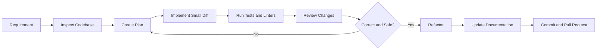
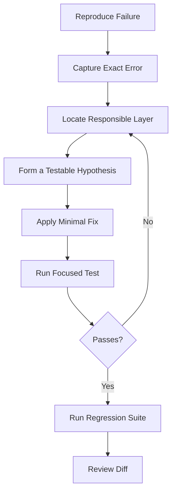

# 003 — Cursor

**Course:** 04 — Agents, Multimodal, and Tools
**Module:** Module 12 — Development Tools
**Content Group:** Tools to Know
**Roadmap Source:** Development Tools / Tools to Know
**Lesson Type:** Development Tool
**Module Order:** 003
**Suggested Duration:** 16 minutes

---

## 1. Overview

**Cursor** is an AI-powered development environment designed to help developers understand codebases, write code, modify multiple files, run commands, review changes, generate tests, and produce documentation.

Cursor is most valuable when it is treated as a **coding collaborator**, not as an autonomous source of truth. The developer still owns:

* Architecture decisions
* Security
* Correctness
* Testing
* Code quality
* Production readiness
* Final approval

Modern Cursor workflows combine code completion, agent-based task execution, repository context, project rules, command execution, code review, and integrations such as MCP and CLI tools. Cursor’s official documentation currently covers Agent, Rules, Skills, MCP servers, CLI workflows, models, and team configuration.

By the end of this lesson, you should understand where Cursor fits in an AI engineering workflow and how to use it responsibly to implement a small, reviewable feature.

---

## 2. Learning Objectives

After completing this lesson, you should be able to:

1. Explain Cursor in your own words.
2. Distinguish between code completion and agent-based coding.
3. Give Cursor enough context to work effectively.
4. Break a large feature into small, verifiable tasks.
5. Use Cursor to inspect, plan, implement, test, review, refactor, and document code.
6. Review AI-generated code before accepting it.
7. Identify security, correctness, and maintainability risks.
8. Build a small portfolio demo using an AI-assisted coding workflow.

---

## 3. What Is Cursor?

Cursor is an AI coding environment that combines a traditional code editor with AI-assisted development capabilities.

A developer can describe a task in natural language, provide relevant files and constraints, and ask Cursor to:

* Explain unfamiliar code
* Locate an implementation
* Suggest edits
* Modify several related files
* Generate unit tests
* Run development commands
* Investigate errors
* Refactor duplicated logic
* Review a code diff
* Update technical documentation

Cursor also provides predictive editing through **Cursor Tab**. Rather than only inserting text at the current cursor position, Cursor Tab can suggest edits around the current location and predict the next location where a developer may want to make a change.

The important distinction is:

| Capability          | Best suited for                                  |
| ------------------- | ------------------------------------------------ |
| Tab completion      | Small, local, predictable edits                  |
| Inline editing      | Rewriting a selected function or block           |
| Agent workflow      | Multi-file tasks requiring exploration and tools |
| Plan-first workflow | Complex changes with architectural decisions     |
| Code review         | Inspecting a completed diff for defects          |
| CLI or automation   | Scripted and repeatable development tasks        |

---

## 4. Cursor’s Role in an AI Engineering Workflow

Cursor does not replace the software development lifecycle. It accelerates selected steps within it.



For an AI Engineer, Cursor can assist with:

* LLM API integration
* Prompt management
* RAG pipelines
* Vector database adapters
* Agent tools
* Structured output schemas
* Evaluation scripts
* Multimodal upload pipelines
* Logging and observability
* Test generation
* API documentation
* Infrastructure configuration

However, an AI tool may produce code that is syntactically valid but architecturally wrong. The developer must evaluate whether the implementation fits the existing system.

---

## 5. The Core Mental Model

A useful way to understand Cursor is:

```text
Cursor output quality
    =
Task clarity
    × Relevant context
    × Repository quality
    × Verification signals
    × Human review
```

Cursor performs better when the repository provides clear signals such as:

* Type annotations
* Tests
* Linters
* Consistent file structure
* Existing implementation patterns
* API schemas
* Architecture documentation
* Explicit project rules
* Reproducible commands

An agent cannot reliably determine whether its work is correct when the repository has no tests, no types, unclear conventions, and no acceptance criteria.

Cursor’s own agent guidance emphasizes verifiable goals, typed code, linters, tests, review, and clear feedback signals.

---

## 6. Main Capabilities

### 6.1 Code Completion

Code completion is suitable for fast, local changes such as:

* Completing a function body
* Adding type hints
* Repeating an established pattern
* Filling in a test case
* Updating nearby variable names
* Adding simple validation

Example:

```python
def normalize_query(query: str) -> str:
    # Cursor may predict the following implementation.
    return " ".join(query.strip().lower().split())
```

Use code completion when the intended implementation is already clear.

Do not use it as a substitute for architecture analysis.

---

### 6.2 Codebase Exploration

Before asking Cursor to modify a system, ask it to inspect the repository.

A good exploration prompt:

```text
Inspect this repository and explain how API requests flow from the router
to the service and repository layers.

Do not modify any files.

Identify:
1. The relevant entry points
2. Existing patterns that should be reused
3. Tests related to this flow
4. Configuration or security concerns
5. Files that would probably need to change
```

This prevents the agent from immediately creating a parallel implementation that ignores the existing architecture.

---

### 6.3 Planning

For non-trivial tasks, separate planning from implementation.

```text
Create an implementation plan for adding request IDs to all API responses.

Constraints:
- Reuse the existing logging middleware.
- Do not change the public response body.
- Preserve streaming endpoints.
- Add tests.
- Avoid introducing a new dependency.

Do not edit files yet.
```

A useful plan should contain:

* Files to inspect
* Files to modify
* Proposed data flow
* Edge cases
* Test cases
* Risks
* Rollback considerations

Cursor has introduced planning-oriented workflows that allow agents to research a codebase and prepare a plan before implementing larger changes.

---

### 6.4 Multi-File Implementation

Agent-based coding is useful when one feature affects several layers.

For example:

```text
Feature
├── API route
├── Request schema
├── Service method
├── Repository query
├── Unit tests
├── Integration tests
└── Documentation
```

A good implementation request defines a narrow scope:

```text
Implement only the approved plan.

Requirements:
- Follow the existing router-service-repository structure.
- Do not rename unrelated files.
- Do not change existing public API behavior.
- Add focused tests for the new behavior.
- Run the relevant test command.
- Report every changed file and why it changed.
```

The goal is not to produce the largest possible diff. The goal is to produce the **smallest correct diff**.

---

### 6.5 Command Execution

An agent may use terminal commands to:

* Search the repository
* Run tests
* Execute linters
* Check types
* Inspect Git changes
* Build the application
* Reproduce a bug

Typical commands include:

```bash
pytest tests/api/test_health.py -q
ruff check app tests
mypy app
npm run test
npm run lint
git diff --stat
git diff
```

Commands can modify files or the development environment. Review destructive, privileged, network-related, or deployment commands before allowing them to run.

Examples requiring additional caution:

```bash
rm -rf
git reset --hard
git clean -fd
docker system prune
kubectl delete
terraform apply
alembic downgrade
DROP TABLE
```

---

### 6.6 Rules and Persistent Instructions

Project-level instructions can help Cursor follow repository conventions consistently.

Useful rules may describe:

* Project architecture
* Naming conventions
* Required test commands
* Error-handling patterns
* Dependency policies
* Security requirements
* Files that must not be modified
* Documentation standards
* API response conventions

Example project instruction:

```markdown
# Backend Development Rules

- Keep API routers thin.
- Put business logic in service classes.
- Access the database through repositories.
- Use Pydantic models for request validation.
- Never log API keys, tokens, passwords, or full prompts.
- Add tests for every public behavior change.
- Do not introduce dependencies without explaining why.
- Preserve backward compatibility unless the task explicitly allows a breaking change.
```

Rules improve consistency, but they do not guarantee correctness. The agent may misunderstand or ignore conflicting instructions, so the generated diff must still be reviewed.

---

### 6.7 Code Review

AI-generated code should be treated like code from an external contributor.

Review the implementation for:

* Unrelated changes
* Incorrect assumptions
* Missing validation
* Silent exception handling
* Security vulnerabilities
* Race conditions
* Broken API compatibility
* Inefficient database access
* Missing tests
* Hardcoded configuration
* Excessive abstraction
* Dead code
* Hallucinated methods or packages

Cursor provides diff-based review workflows and agent review features that can inspect proposed changes line by line. Its official guidance still states that AI-generated code requires developer review.

A useful review prompt is:

```text
Review the current diff as a strict senior backend engineer.

Do not modify files yet.

Look for:
- Incorrect behavior
- Security vulnerabilities
- Backward compatibility problems
- Missing edge cases
- Weak tests
- Unnecessary complexity
- Performance regressions

For each issue, provide:
1. Severity
2. File and location
3. Why it is a problem
4. A minimal fix
```

Do not rely exclusively on the same agent that created the code to verify it. Independent tests and human reasoning remain necessary.

---

## 7. A Responsible Cursor Workflow

Use the following sequence for production work.

### Step 1: Define the Task

Bad request:

```text
Improve the backend.
```

Better request:

```text
Add an optional max_results query parameter to GET /api/v1/search.

Acceptance criteria:
- Default value: 10
- Minimum: 1
- Maximum: 50
- Invalid values return HTTP 422
- The value is passed to the retrieval service
- Existing behavior remains unchanged when the parameter is omitted
- Add API tests
```

---

### Step 2: Ask for Repository Analysis

```text
Find the current search route, request validation, retrieval service,
and related tests.

Explain the existing flow.

Do not modify files.
```

---

### Step 3: Request a Plan

```text
Propose the smallest implementation plan.

List:
- Files to change
- Exact behavior changes
- Tests to add
- Risks
- Assumptions

Wait for approval before editing.
```

---

### Step 4: Implement a Small Diff

```text
Implement the approved plan only.

Do not refactor unrelated code.
Do not change dependency versions.
Preserve existing API behavior.
```

---

### Step 5: Run Verification

```text
Run the narrowest relevant tests first.

Then run:
- The full API test group
- The linter
- The type checker

Report exact commands and results.
Do not hide failures.
```

---

### Step 6: Review the Diff

Inspect every changed file manually.

```bash
git diff --stat
git diff
```

Ask:

* Is every changed line necessary?
* Does the code follow existing patterns?
* Are errors handled correctly?
* Are tests testing behavior rather than implementation details?
* Could user-controlled input reach a dangerous operation?
* Has any secret been exposed?
* Does the change affect streaming, concurrency, caching, or database transactions?

---

### Step 7: Refactor Separately

Do not combine feature development and broad refactoring unless necessary.

First make the feature work. Then request a focused refactor:

```text
Refactor only the duplicated parameter-validation logic introduced
by this feature.

Preserve behavior and tests.
Do not change public interfaces.
```

---

### Step 8: Generate Documentation

```text
Update the API documentation for max_results.

Include:
- Purpose
- Default
- Allowed range
- Example request
- Error behavior

Do not document behavior that is not implemented.
```

---

## 8. Practical Demo: Adding a Limited Search Endpoint

### 8.1 Feature Request

Assume a small FastAPI application has a retrieval service.

The feature request is:

> Add a search endpoint that accepts a query and an optional result limit. Validate the input and cover the behavior with tests.

### 8.2 Suggested Repository Structure

```text
app/
├── main.py
├── schemas.py
└── services/
    └── retrieval.py

tests/
└── test_search.py
```

### 8.3 Planning Prompt

```text
Inspect the current FastAPI application.

Plan a small GET /api/v1/search endpoint with:
- Required query parameter: query
- Optional limit: default 5
- Valid limit range: 1 to 20
- A retrieval service dependency
- JSON response containing query, limit, and results
- Tests for default, custom, and invalid limits

Follow existing project conventions.
Do not modify files yet.
```

### 8.4 Example Implementation

```python
# app/schemas.py

from pydantic import BaseModel


class SearchResponse(BaseModel):
    query: str
    limit: int
    results: list[str]
```

```python
# app/services/retrieval.py

class RetrievalService:
    def search(self, query: str, limit: int) -> list[str]:
        normalized_query = query.strip()

        if not normalized_query:
            return []

        demo_documents = [
            "Introduction to retrieval-augmented generation",
            "Vector database indexing strategies",
            "Evaluating semantic search quality",
        ]

        return demo_documents[:limit]
```

```python
# app/main.py

from typing import Annotated

from fastapi import FastAPI, Query

from app.schemas import SearchResponse
from app.services.retrieval import RetrievalService

app = FastAPI()
retrieval_service = RetrievalService()


@app.get("/api/v1/search", response_model=SearchResponse)
def search(
    query: Annotated[str, Query(min_length=1)],
    limit: Annotated[int, Query(ge=1, le=20)] = 5,
) -> SearchResponse:
    results = retrieval_service.search(query=query, limit=limit)

    return SearchResponse(
        query=query,
        limit=limit,
        results=results,
    )
```

### 8.5 Example Tests

```python
# tests/test_search.py

from fastapi.testclient import TestClient

from app.main import app

client = TestClient(app)


def test_search_uses_default_limit() -> None:
    response = client.get(
        "/api/v1/search",
        params={"query": "RAG"},
    )

    assert response.status_code == 200

    payload = response.json()
    assert payload["query"] == "RAG"
    assert payload["limit"] == 5
    assert isinstance(payload["results"], list)


def test_search_accepts_custom_limit() -> None:
    response = client.get(
        "/api/v1/search",
        params={
            "query": "vector database",
            "limit": 2,
        },
    )

    assert response.status_code == 200
    assert response.json()["limit"] == 2
    assert len(response.json()["results"]) <= 2


def test_search_rejects_limit_above_maximum() -> None:
    response = client.get(
        "/api/v1/search",
        params={
            "query": "agents",
            "limit": 21,
        },
    )

    assert response.status_code == 422


def test_search_rejects_empty_query() -> None:
    response = client.get(
        "/api/v1/search",
        params={"query": ""},
    )

    assert response.status_code == 422
```

### 8.6 Verification Commands

```bash
pytest tests/test_search.py -q
ruff check app tests
mypy app
```

### 8.7 Review Prompt

```text
Review the search endpoint implementation.

Check:
- Whether FastAPI validation matches the acceptance criteria
- Whether service responsibilities are separated correctly
- Whether tests cover public behavior
- Whether any edge case is missing
- Whether the response schema is stable
- Whether the demo service creates misleading production assumptions

Do not edit files. Return findings ordered by severity.
```

### 8.8 Important Demo Limitation

The demo retrieval service does not perform semantic search. It only returns items from a static list.

A production implementation may need:

* Embedding generation
* Vector search
* Metadata filters
* Authentication
* Rate limiting
* Timeouts
* Retries
* Observability
* Result ranking
* Tenant isolation
* Cost controls

The developer should explicitly document this limitation rather than allowing a demo implementation to be mistaken for a production-ready RAG system.

---

## 9. Prompting Patterns for Cursor

### Pattern 1: Explore Before Editing

```text
Find and explain the current implementation.
Do not modify files.
```

### Pattern 2: State the Scope

```text
Modify only the router, service, and related tests.
Do not change database models.
```

### Pattern 3: Define Acceptance Criteria

```text
The task is complete only when:
- Invalid input is rejected
- Existing tests pass
- New behavior has tests
- The public API remains backward compatible
```

### Pattern 4: State Non-Goals

```text
Non-goals:
- No UI changes
- No database migration
- No dependency upgrades
- No unrelated refactoring
```

### Pattern 5: Require Evidence

```text
Report:
- Changed files
- Commands executed
- Test results
- Remaining risks
- Assumptions
```

### Pattern 6: Separate Review from Implementation

```text
Review the diff first.
Do not apply fixes until the issues are approved.
```

---

## 10. Cursor Use Cases for AI Engineers

### 10.1 LLM API Integration

Cursor can help generate:

* Provider interfaces
* Request models
* Timeout handling
* Retry policies
* Structured output parsing
* Mock clients
* Unit tests

The developer must verify model names, SDK behavior, pricing assumptions, rate limits, and current API documentation.

---

### 10.2 Retrieval-Augmented Generation

Cursor can assist with:

* Document loaders
* Chunking strategies
* Embedding adapters
* Vector database repositories
* Retrieval services
* Citation formatting
* Evaluation datasets

The developer must verify retrieval quality with real evaluation queries. Passing unit tests does not prove that a RAG system returns useful evidence.

---

### 10.3 AI Agents

Cursor can help implement:

* Tool schemas
* Agent loops
* State management
* Tool permissions
* Retry limits
* Execution logs
* Human approval steps

The developer must prevent unrestricted tool execution, infinite loops, excessive costs, and unsafe side effects.

---

### 10.4 Multimodal Applications

Cursor can accelerate:

* Image upload routes
* Audio transcription pipelines
* File validation
* MIME-type handling
* Storage adapters
* Background processing
* Metadata extraction

The developer must validate file size, content type, storage permissions, malicious input risks, and privacy requirements.

---

### 10.5 Evaluation and Observability

Cursor can generate:

* Evaluation runners
* Latency measurements
* Token counters
* Cost estimators
* Structured logs
* Trace IDs
* Failure dashboards

Metrics should be verified against actual provider responses and production traffic.

---

## 11. Common Mistakes

### 11.1 Asking for Too Much at Once

Bad:

```text
Build the entire AI platform.
```

Better:

```text
Add one provider adapter and its unit tests.
```

Large prompts increase the probability of unrelated changes and hidden assumptions.

---

### 11.2 Accepting a Large Diff Without Review

A successful test run does not prove that every change is correct.

The agent may:

* Delete necessary behavior
* Weaken validation
* Modify unrelated configuration
* Change public APIs
* Add unused abstractions
* Introduce security issues

Always inspect the complete diff.

---

### 11.3 Letting the Agent Invent Repository Patterns

The agent may create:

```text
app/helpers/new_service_manager_v2.py
```

even though the repository already has:

```text
app/services/search_service.py
```

Ask the agent to identify and reuse existing patterns before writing code.

---

### 11.4 Running Only Generated Tests

An agent may generate tests that merely confirm its own incorrect assumptions.

Use:

* Existing regression tests
* Independently designed test cases
* Manual API checks
* Static analysis
* Realistic failure scenarios

---

### 11.5 Exposing Secrets

Do not paste secrets into prompts, source files, screenshots, or logs.

Examples include:

* API keys
* Database passwords
* Private certificates
* Access tokens
* Production environment variables
* Customer data
* Proprietary prompts
* Personally identifiable information

Use redacted examples and secret-management systems.

---

### 11.6 Allowing Uncontrolled Commands

Review commands that affect:

* Git history
* Databases
* Cloud infrastructure
* Production environments
* Local files
* Package versions
* Credentials

A command can be technically valid and still be dangerous in the current environment.

---

### 11.7 Confusing Fast Output With Correct Output

Cursor may generate a working happy path quickly while missing:

* Empty input
* Timeouts
* Partial failures
* Concurrent requests
* Duplicate events
* Invalid encoding
* Unauthorized access
* Provider outages
* Large files
* Cost limits

Production engineering starts where the happy path ends.

---

## 12. Debugging AI-Generated Code

When a generated implementation fails, avoid asking:

```text
Fix it.
```

Provide concrete evidence:

```text
The new search endpoint fails this command:

pytest tests/test_search.py::test_search_rejects_empty_query -q

Actual result:
- HTTP 200

Expected result:
- HTTP 422

Investigate the root cause.
Do not weaken the test.
Explain the failure before editing.
```

A reliable debugging loop is:



Useful evidence includes:

* Exact command
* Error message
* Stack trace
* Request payload
* Expected result
* Actual result
* Relevant environment
* Last known working commit

---

## 13. Security and Production Checklist

Before approving Cursor-generated code, verify:

### Input and Output

* [ ] User input is validated.
* [ ] Output schemas are explicit.
* [ ] Errors do not leak sensitive information.
* [ ] File uploads have size and type restrictions.
* [ ] Model output is treated as untrusted data.

### Authentication and Authorization

* [ ] Authentication is enforced where required.
* [ ] Authorization is checked at the resource level.
* [ ] Tenant data cannot cross boundaries.
* [ ] Admin operations require explicit permissions.

### Secrets and Privacy

* [ ] No secrets are committed.
* [ ] Logs exclude tokens and sensitive user data.
* [ ] Example configuration uses placeholders.
* [ ] Data retention assumptions are documented.

### Reliability

* [ ] External calls have timeouts.
* [ ] Retries are bounded.
* [ ] Failure behavior is defined.
* [ ] Streaming connections close correctly.
* [ ] Database operations use appropriate transactions.

### Cost and Performance

* [ ] Token or request limits exist.
* [ ] Expensive operations are controlled.
* [ ] Database queries are bounded.
* [ ] Caching behavior is understood.
* [ ] Large input behavior is tested.

### Maintainability

* [ ] The implementation follows existing architecture.
* [ ] The diff contains no unrelated changes.
* [ ] Tests describe public behavior.
* [ ] Documentation matches the implementation.
* [ ] Known limitations are recorded.

---

## 14. Practical Exercise

### Exercise: AI Coding Workflow

Choose a small feature from an existing project.

Possible features:

* Add pagination to an API endpoint
* Add request ID logging
* Add input-length validation
* Add a health-check route
* Add a mock LLM provider
* Add a timeout to an external API client
* Add tests for an existing bug
* Add documentation for an agent tool

Complete the following workflow:

1. Write the requirement.
2. Define acceptance criteria.
3. Ask Cursor to inspect the repository.
4. Ask for a plan without editing files.
5. Review the plan.
6. Request the smallest implementation.
7. Run focused tests.
8. Run regression tests and linters.
9. Review the complete diff.
10. Ask for a separate code-review pass.
11. Apply only approved fixes.
12. Refactor duplicated code.
13. Update documentation.
14. Record limitations and open questions.

### Required Portfolio Evidence

Save the following artifacts:

```text
cursor-workflow-demo/
├── 01-requirement.md
├── 02-analysis.md
├── 03-plan.md
├── 04-prompts.md
├── 05-diff.patch
├── 06-test-results.txt
├── 07-review-findings.md
├── 08-final-architecture.md
└── README.md
```

---

## 15. Production Failure Scenario

### Scenario

Cursor adds retry logic to an LLM API client:

```python
while True:
    try:
        return client.generate(prompt)
    except Exception:
        continue
```

### Why It Is Dangerous

The implementation has:

* No retry limit
* No delay
* No timeout
* No exception filtering
* No logging
* No cancellation handling
* Potential infinite cost
* Potential infinite request loops

### Safer Direction

```python
import time
from collections.abc import Callable
from typing import TypeVar

T = TypeVar("T")


def run_with_retry(
    operation: Callable[[], T],
    *,
    max_attempts: int = 3,
    initial_delay_seconds: float = 0.5,
) -> T:
    if max_attempts < 1:
        raise ValueError("max_attempts must be at least 1")

    delay = initial_delay_seconds
    last_error: Exception | None = None

    for attempt in range(1, max_attempts + 1):
        try:
            return operation()
        except TimeoutError as error:
            last_error = error

            if attempt == max_attempts:
                break

            time.sleep(delay)
            delay *= 2

    assert last_error is not None
    raise last_error
```

Even this example requires further decisions:

* Which exceptions are retryable?
* Should random jitter be added?
* What is the total timeout budget?
* Is the operation idempotent?
* How should retries be logged?
* Should a circuit breaker be used?
* How is cancellation propagated?

The important lesson is that generated code must be evaluated against production conditions, not only syntax.

---

## 16. Completion Checklist

* [ ] I can explain Cursor in one to two minutes.
* [ ] I understand the difference between completion and agent workflows.
* [ ] I can provide repository context before requesting changes.
* [ ] I can write explicit acceptance criteria.
* [ ] I can ask for a plan before implementation.
* [ ] I can restrict an AI coding task to a small scope.
* [ ] I can verify changes with tests, linters, and type checking.
* [ ] I can inspect and explain every changed file.
* [ ] I know that generated tests may also contain incorrect assumptions.
* [ ] I can identify at least one security or production risk.
* [ ] I have created a small demo or development artifact.
* [ ] I have documented limitations and unanswered questions.

---

## 17. Related Outcome

Use AI coding tools responsibly to:

* Implement features
* Generate tests
* Review code
* Debug failures
* Refactor safely
* Produce documentation
* Preserve security and maintainability

The expected outcome is not merely faster code generation. It is a more structured and verifiable engineering workflow.

---

## 18. Related Project

### Project 11: AI Coding Workflow

Build a project that demonstrates the complete lifecycle of an AI-assisted change:


The final project should show:

* The original requirement
* Prompts used
* The implementation plan
* The generated diff
* Test evidence
* Review findings
* Refactoring decisions
* Final documentation
* Known limitations

---

## 19. Five-Line Recall Summary

After studying the lesson, try to write these ideas without looking:

1. Cursor is an AI-assisted development environment, not a replacement for engineering judgment.
2. Small tasks with clear acceptance criteria produce more reviewable results.
3. Repository context, rules, tests, and types improve agent performance.
4. Every generated command, test, and code change must be verified.
5. The developer remains responsible for security, correctness, cost, and maintainability.

---

## 20. Conclusion

**Cursor** is an important development tool in the modern AI Engineer roadmap because it can accelerate code exploration, implementation, testing, debugging, review, refactoring, and documentation.

Its value does not come from accepting generated code as quickly as possible. Its value comes from creating a disciplined feedback loop:

```text
Understand
→ Plan
→ Implement
→ Test
→ Review
→ Refactor
→ Document
```

The most effective Cursor user is not the developer who generates the most code. It is the developer who provides clear context, limits scope, defines verifiable outcomes, reviews every important decision, and converts AI output into maintainable production software.
