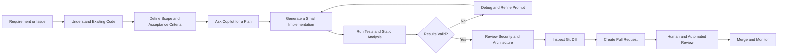

# 004 - GitHub Copilot

**Course:** 04 - Agents, Multimodal and Tools
**Module:** Module 12 - Development Tools
**Content Group:** Tools to Know
**Roadmap Source:** Development Tools / Tools to Know
**Lesson Type:** Development Tool
**Order in Module:** 004
**Suggested Duration:** 16 minutes

---

## 1. Overview

**GitHub Copilot** is an AI-powered software development assistant that helps developers write, understand, test, review, refactor, and document code.

It can provide:

* Inline code suggestions
* Natural-language programming assistance
* Code explanations
* Test generation
* Refactoring suggestions
* Documentation drafts
* Pull request reviews
* Agent-based implementation workflows
* Command-line assistance

GitHub describes Copilot as contextualized assistance across the software development lifecycle, including inline suggestions, chat, code explanations, code review, and agent-based development workflows.

However, Copilot is not a replacement for engineering judgment. Its output may be incomplete, incorrect, insecure, outdated, or inconsistent with the architecture of the repository.

A useful mental model is:

> GitHub Copilot is a fast junior pair programmer that can generate ideas and code, but every important decision must still be verified by a developer.

---

## 2. Learning Objectives

By the end of this lesson, you should be able to:

* Explain GitHub Copilot in your own words.
* Identify where Copilot fits into a modern AI engineering workflow.
* Write effective prompts that provide sufficient repository context.
* Use Copilot to implement a small, reviewable feature.
* Use Copilot to generate tests, review code, refactor implementations, and draft documentation.
* Recognize security, correctness, privacy, and maintainability risks.
* Decide which tasks should and should not be delegated to an AI coding assistant.

---

## 3. Core Concepts

### 3.1 What GitHub Copilot Does

GitHub Copilot receives instructions and available context, then predicts or generates a useful development response.

That response may be:

* A single line of code
* A complete function
* A test case
* A shell command
* A code explanation
* A refactoring plan
* A pull request review comment
* A multi-file implementation
* A documentation section

The quality of the result depends heavily on:

1. The clarity of the task
2. The context available to Copilot
3. The size of the requested change
4. The quality of the existing codebase
5. The constraints and acceptance criteria
6. The developer's verification process

---

### 3.2 Common Interaction Modes

| Mode               | Typical Use                                                    | Developer Responsibility                                    |
| ------------------ | -------------------------------------------------------------- | ----------------------------------------------------------- |
| Inline suggestions | Complete lines, functions, and repetitive code                 | Inspect the generated code before accepting it              |
| Copilot Chat       | Ask questions, explain code, debug errors, or generate plans   | Provide relevant files, constraints, and expected behavior  |
| Edit or agent mode | Modify multiple files and complete multi-step tasks            | Review the plan, changed files, commands, and final diff    |
| Code review        | Analyze a pull request or selected changes                     | Verify findings and check for missed problems               |
| CLI assistance     | Explain or generate terminal commands                          | Understand the command before executing it                  |
| Cloud coding agent | Research a repository, modify code, and prepare a pull request | Review the resulting branch and pull request before merging |

GitHub's current documentation describes workflows for chat, code review, CLI assistance, and cloud agents that can research repositories, modify code, and create pull requests for human review.

---

### 3.3 Context Is More Important Than Prompt Length

Copilot performs better when it understands:

* The relevant source files
* Existing interfaces
* Coding conventions
* Data models
* Test frameworks
* Error-handling patterns
* Security restrictions
* Runtime environment
* Expected inputs and outputs

A long prompt with irrelevant information is usually less useful than a focused prompt with the correct files and acceptance criteria.

```text
Weak context
    ↓
Generic or incompatible code
    ↓
Large manual correction effort

Relevant context
    ↓
Repository-aligned suggestion
    ↓
Smaller reviewable diff
```

---

### 3.4 Small Scope Produces Better Results

Copilot is most reliable when a task can be expressed as a small, verifiable unit.

A good task:

```text
Add input validation to chunk_text().
Reject chunk_size <= 0.
Reject overlap < 0.
Reject overlap >= chunk_size.
Add pytest coverage for all invalid values.
Do not modify public function names.
```

A weak task:

```text
Improve the RAG system.
```

The second request is too broad. It does not define:

* Which part of the system should change
* What problem exists
* What behavior is expected
* Which files may be modified
* How success will be tested

GitHub's prompt-engineering guidance recommends breaking complex work into smaller tasks, stating requirements precisely, providing examples, removing ambiguity, and iterating on the result.

---

### 3.5 The Developer Remains Accountable

Copilot can generate code quickly, but speed does not prove correctness.

The developer remains responsible for:

* Architecture
* Security
* Privacy
* Data protection
* Correctness
* Performance
* Accessibility
* Dependency selection
* Test coverage
* Licensing review
* Production readiness
* Long-term maintainability

Copilot code review may miss real problems, report false positives, or suggest inaccurate or insecure changes. GitHub therefore recommends treating its review output as supplementary rather than authoritative.

---

## 4. Position in the AI Engineering Workflow

GitHub Copilot is a **development-time assistant**.

It usually does not become part of the deployed AI application's runtime architecture. Instead, it helps engineers create and maintain that architecture.



Copilot can assist at several stages, but the engineer controls the workflow.

---

## 5. The Copilot Development Loop

A reliable Copilot workflow can be summarized as:

```text
Specify → Generate → Verify → Review → Refine → Commit
```

### Step 1: Specify

Define:

* The exact goal
* Relevant files
* Constraints
* Expected inputs and outputs
* Edge cases
* Acceptance criteria

### Step 2: Generate

Ask Copilot to:

* Propose a plan
* Implement one small change
* Produce a minimal diff
* Follow existing repository conventions

### Step 3: Verify

Run:

* Unit tests
* Integration tests
* Type checking
* Linters
* Formatters
* Security scanners
* Manual test cases

### Step 4: Review

Inspect:

* Every changed file
* New dependencies
* Error handling
* Logging behavior
* Data exposure
* Performance implications
* Backward compatibility

### Step 5: Refine

Ask Copilot to address one specific issue at a time.

### Step 6: Commit

Commit only code that you understand and can defend during review.

---

## 6. Prompt Structure

An effective coding prompt should contain six parts.

```text
1. Goal
2. Repository context
3. Constraints
4. Expected behavior
5. Edge cases
6. Validation method
```

### Reusable Prompt Template

```text
Goal:
Implement [specific behavior].

Relevant context:
- Main implementation: [file]
- Existing interface: [file or function]
- Tests: [test file]
- Follow the patterns used in [reference file].

Constraints:
- Do not change public interfaces.
- Do not add new dependencies.
- Keep the diff minimal.
- Preserve backward compatibility.

Expected behavior:
- Input: [...]
- Output: [...]
- Error behavior: [...]

Edge cases:
- [...]
- [...]
- [...]

Validation:
- Add or update pytest tests.
- Run the relevant test command.
- Explain any assumptions before changing code.
```

---

## 7. Example: AI Engineering Feature

### Scenario

You are building a Retrieval-Augmented Generation application.

The application needs a deterministic utility that divides text into overlapping word chunks before creating embeddings.

The function must:

* Accept a string
* Split it into word-based chunks
* Support overlap between chunks
* Reject invalid configuration
* Return an empty list for empty text
* Avoid external dependencies

---

### 7.1 Start with a Planning Prompt

```text
Review the current text-processing module and propose a plan for adding a
word-based chunk_text function.

Requirements:
- Accept text, chunk_size, and overlap.
- Return a list of strings.
- Preserve word order.
- Return an empty list for empty input.
- Reject chunk_size <= 0.
- Reject overlap < 0.
- Reject overlap >= chunk_size.
- Do not add dependencies.
- Use pytest for tests.

Do not write code yet. Identify relevant files, edge cases, and test cases.
```

Asking for a plan first helps reveal misunderstandings before code is modified.

---

### 7.2 Implementation Prompt

```text
Implement the approved plan.

Only modify:
- src/rag/chunking.py
- tests/rag/test_chunking.py

Keep the function deterministic and side-effect free.
Use ValueError for invalid configuration.
Add type hints and a concise docstring.
Do not refactor unrelated code.
```

---

### 7.3 Example Implementation

```python
def chunk_text(
    text: str,
    chunk_size: int = 200,
    overlap: int = 40,
) -> list[str]:
    """Split text into overlapping word-based chunks.

    Args:
        text: Source text to split.
        chunk_size: Maximum number of words in each chunk.
        overlap: Number of words shared by consecutive chunks.

    Returns:
        A list of text chunks.

    Raises:
        ValueError: If the chunk configuration is invalid.
    """
    if chunk_size <= 0:
        raise ValueError("chunk_size must be greater than zero")

    if overlap < 0:
        raise ValueError("overlap must not be negative")

    if overlap >= chunk_size:
        raise ValueError("overlap must be smaller than chunk_size")

    words = text.split()

    if not words:
        return []

    step = chunk_size - overlap

    return [
        " ".join(words[start : start + chunk_size])
        for start in range(0, len(words), step)
    ]
```

---

### 7.4 Generated Tests

```python
import pytest

from src.rag.chunking import chunk_text


def test_chunk_text_returns_empty_list_for_empty_text() -> None:
    assert chunk_text("") == []
    assert chunk_text("   ") == []


def test_chunk_text_returns_single_chunk_for_short_text() -> None:
    result = chunk_text(
        "retrieval augmented generation",
        chunk_size=10,
        overlap=2,
    )

    assert result == ["retrieval augmented generation"]


def test_chunk_text_preserves_overlap() -> None:
    result = chunk_text(
        "one two three four five six",
        chunk_size=4,
        overlap=2,
    )

    assert result == [
        "one two three four",
        "three four five six",
        "five six",
    ]


@pytest.mark.parametrize(
    ("chunk_size", "overlap"),
    [
        (0, 0),
        (-1, 0),
        (5, -1),
        (5, 5),
        (5, 6),
    ],
)
def test_chunk_text_rejects_invalid_configuration(
    chunk_size: int,
    overlap: int,
) -> None:
    with pytest.raises(ValueError):
        chunk_text(
            "sample text",
            chunk_size=chunk_size,
            overlap=overlap,
        )
```

---

### 7.5 Verification

```bash
pytest tests/rag/test_chunking.py -q
```

Additional checks may include:

```bash
ruff check src/rag/chunking.py tests/rag/test_chunking.py
mypy src/rag/chunking.py
```

The exact commands should match the repository's existing toolchain.

---

## 8. Reviewing Copilot-Generated Code

Never review generated code only by asking, “Does it look reasonable?”

Use a structured review.

### 8.1 Correctness

Check:

* Does the implementation satisfy every requirement?
* Are all branches reachable?
* Are boundary values handled correctly?
* Could a loop fail to terminate?
* Is the output deterministic?
* Does the implementation preserve existing behavior?

### 8.2 Security

Check:

* Are user inputs validated?
* Is untrusted content passed into a shell command?
* Could SQL, template, path, or prompt injection occur?
* Are credentials or tokens exposed?
* Does logging contain personal or confidential data?
* Are authorization checks preserved?

### 8.3 Performance

Check:

* Is the algorithm appropriate for expected input sizes?
* Does it load an entire large file into memory?
* Does it create unnecessary model, database, or network calls?
* Could retries generate duplicate side effects?
* Does the change introduce an unbounded loop or queue?

### 8.4 Maintainability

Check:

* Does the code follow repository conventions?
* Are names clear?
* Is the abstraction necessary?
* Is the diff larger than required?
* Are unrelated files modified?
* Are assumptions documented?

### 8.5 Tests

Check:

* Do tests validate behavior rather than implementation details?
* Are failure cases included?
* Are tests independent?
* Can tests pass even when the feature is incorrect?
* Did Copilot reproduce the same incorrect assumption in both code and tests?

---

## 9. Copilot for AI Engineering Tasks

### 9.1 Model API Integration

Copilot can help:

* Create request and response models
* Add timeout handling
* Implement retries
* Parse structured output
* Add provider abstractions
* Generate mocks for model calls

Review carefully:

* SDK versions
* Authentication
* Retry safety
* Rate-limit behavior
* Streaming cleanup
* Error classification
* Deprecated parameters

---

### 9.2 Prompt Engineering

Copilot can help:

* Draft prompt templates
* Convert prompts into structured files
* Add variables and validation
* Create few-shot examples
* Generate prompt evaluation cases

Review carefully:

* Prompt injection exposure
* Untrusted context boundaries
* Unsupported guarantees
* Token growth
* Sensitive information
* Output validation

---

### 9.3 Retrieval-Augmented Generation

Copilot can help:

* Implement document loaders
* Create chunking utilities
* Define metadata schemas
* Build retrieval interfaces
* Write vector-store adapters
* Generate retrieval tests

Review carefully:

* Tenant isolation
* Access control
* Document-level permissions
* Embedding consistency
* Duplicate documents
* Metadata filtering
* Retrieval evaluation

---

### 9.4 Agents and Tools

Copilot can help:

* Define tool schemas
* Implement tool wrappers
* Validate tool arguments
* Add execution traces
* Generate mocked tool responses

Review carefully:

* Tool permissions
* Shell or file-system access
* Side effects
* Idempotency
* Confirmation boundaries
* Infinite agent loops
* Maximum execution limits

---

### 9.5 Evaluation and Observability

Copilot can help:

* Build evaluation datasets
* Write scoring functions
* Create regression tests
* Add structured logging
* Generate dashboards or reports

Review carefully:

* Metric validity
* Dataset leakage
* Biased test samples
* Personal data in logs
* Cost accounting
* Correlation versus causation

---

## 10. Effective Copilot Prompts

### Explain Existing Code

```text
Explain how this request moves through the application.

Cover:
1. Entry-point route
2. Authentication
3. Validation
4. Service layer
5. Database or model calls
6. Error handling
7. Response serialization

Reference exact functions and files.
Do not propose changes yet.
```

---

### Debug an Error

```text
Analyze this failing test.

Expected:
The endpoint returns HTTP 400 when overlap is greater than or equal to
chunk_size.

Actual:
The request returns HTTP 500.

Use the stack trace and relevant files to identify the root cause.
Separate confirmed facts from hypotheses.
Propose the smallest fix and the regression test needed.
```

---

### Generate Tests

```text
Generate pytest tests for chunk_text.

Cover:
- Empty text
- Whitespace-only text
- Text shorter than chunk_size
- Exact chunk boundary
- Multiple chunks
- Correct overlap
- Invalid chunk_size
- Invalid overlap

Do not mock pure functions.
Use descriptive test names.
```

---

### Review a Diff

```text
Review only the changed lines in this diff.

Prioritize:
1. Correctness bugs
2. Security vulnerabilities
3. Breaking changes
4. Missing error handling
5. Missing tests
6. Performance regressions

For each finding, include:
- Severity
- File and line
- Why it matters
- A concrete failure example
- The smallest recommended fix

Do not comment on formatting unless it affects correctness.
```

---

### Refactor Safely

```text
Refactor this module to reduce duplication.

Constraints:
- Preserve all public interfaces.
- Preserve current exceptions and response formats.
- Do not add dependencies.
- Do not change behavior.
- Keep the diff below 100 changed lines.
- Run the existing tests after the change.

Explain why each modified file is necessary.
```

---

### Generate Documentation

```text
Create documentation for this endpoint.

Include:
- Purpose
- Request schema
- Response schema
- Validation rules
- Example request
- Example success response
- Error responses
- Authentication requirements
- Operational limitations

Derive details from the implementation and tests.
Mark anything that cannot be confirmed.
```

GitHub also supports reusable prompt files and repository-level customization so teams can encode repeated instructions for activities such as documentation and code review.

---

## 11. Weak and Improved Prompts

### Example 1: Implementation

**Weak**

```text
Create a RAG API.
```

**Improved**

```text
Add POST /api/v1/documents/chunk to the existing FastAPI router.

Input:
- text: non-empty string
- chunk_size: integer from 50 to 1000
- overlap: integer from 0 to chunk_size - 1

Output:
- chunks: list of strings
- chunk_count: integer

Use the existing response envelope.
Do not call an embedding model.
Add route and service tests.
Do not modify unrelated endpoints.
```

---

### Example 2: Debugging

**Weak**

```text
Fix this error.
```

**Improved**

```text
The test test_stream_closes_after_done_event hangs after receiving the final
SSE event.

Inspect:
- src/api/routes/chat.py
- src/services/chat_stream.py
- tests/api/test_chat_stream.py

Identify where the generator remains open.
Preserve the existing event schema.
Add a regression test proving the stream terminates.
Do not change timeout values to hide the problem.
```

---

### Example 3: Security Review

**Weak**

```text
Is this secure?
```

**Improved**

```text
Perform a security review of the document upload flow.

Focus on:
- File type validation
- File size limits
- Path traversal
- Malicious filenames
- Archive bombs
- Tenant isolation
- Sensitive logging
- Prompt injection from extracted text

Distinguish confirmed vulnerabilities from defense-in-depth recommendations.
```

---

## 12. Common Failure Modes

### 12.1 Accepting Code Without Understanding It

A suggestion may compile while still violating business requirements.

**Better approach:** Ask Copilot to explain the generated code, then verify the explanation against the implementation.

---

### 12.2 Requesting a Large Feature in One Prompt

Large requests produce large diffs that are difficult to inspect.

**Better approach:** Separate the work into planning, data models, service logic, API integration, tests, and documentation.

---

### 12.3 Letting Copilot Invent Repository Conventions

Generated code may introduce:

* A new exception hierarchy
* A different response format
* A second logging library
* A new architectural pattern
* An unnecessary dependency

**Better approach:** Point Copilot to an existing reference implementation.

---

### 12.4 Trusting Generated Tests Automatically

Copilot may encode the same misunderstanding in both implementation and tests.

**Better approach:** Write acceptance criteria before generating code and manually inspect whether each test represents a real requirement.

---

### 12.5 Ignoring Edge Cases

Happy-path code may work while production inputs cause failures.

Typical missing cases include:

* Empty input
* Null values
* Large payloads
* Unicode text
* Concurrent requests
* Network timeouts
* Partial model responses
* Duplicate events
* Cancellation
* Permission failures

---

### 12.6 Exposing Secrets

Do not paste unnecessary secrets, production credentials, private customer data, or sensitive logs into prompts.

Use:

* Environment variable names instead of values
* Sanitized stack traces
* Synthetic examples
* Minimal relevant context
* Organization-approved data policies

---

### 12.7 Executing Commands Blindly

A generated terminal command may:

* Delete files
* Change permissions
* Modify production data
* Expose secrets
* Install an unexpected package
* Rewrite Git history

Read and understand every command before execution.

---

### 12.8 Using Copilot as the Final Reviewer

Copilot can support code review, but it may miss defects or generate false positives. A human review and automated verification pipeline are still necessary.

---

## 13. Production Bug Example

### Bug

A generated chunking function calculates:

```python
step = chunk_size - overlap
```

but does not validate that:

```python
overlap < chunk_size
```

When both values are equal, `step` becomes zero.

Possible outcomes include:

* A runtime exception
* A non-terminating loop in another implementation
* Repeated chunks
* A failed ingestion pipeline

### Debugging Process

1. Reproduce the issue with the smallest failing input.
2. Inspect the values of `chunk_size`, `overlap`, and `step`.
3. Identify the missing invariant.
4. Add validation before processing.
5. Add a regression test.
6. Run the complete relevant test suite.
7. Search for other code paths using the same configuration.

### Regression Test

```python
def test_chunk_text_rejects_overlap_equal_to_chunk_size() -> None:
    with pytest.raises(
        ValueError,
        match="overlap must be smaller than chunk_size",
    ):
        chunk_text(
            "one two three",
            chunk_size=3,
            overlap=3,
        )
```

### Lesson

Do not ask only:

```text
Make the function work.
```

Include invariants explicitly:

```text
The function must reject every configuration where overlap >= chunk_size.
```

---

## 14. Practical Exercise

### Exercise: Copilot-Assisted Feature Workflow

Build a small feature using this sequence:

1. Select a small issue.
2. Write acceptance criteria manually.
3. Ask Copilot to inspect the repository and propose a plan.
4. Correct the plan before implementation.
5. Ask Copilot to implement the smallest valid diff.
6. Generate tests.
7. Add at least one manually designed edge case.
8. Run the project's quality checks.
9. Ask Copilot to review the diff.
10. Perform your own review.
11. Refactor only when the behavior is proven.
12. Generate a short documentation update.

### Suggested Feature Ideas

* Add validation to an AI provider request.
* Create a deterministic RAG chunking function.
* Add timeout handling to a model API wrapper.
* Add structured logging to an agent tool.
* Create a mock embedding provider for tests.
* Add a health-check endpoint.
* Generate API documentation from an existing route.
* Add regression tests for a streaming response.

---

## 15. Five-Line Recall Exercise

Without looking at the lesson, write five lines answering:

1. What is GitHub Copilot?
2. What context does it need?
3. Why should tasks be small?
4. How should generated code be verified?
5. What remains the developer's responsibility?

---

## 16. Completion Checklist

### Understanding

* [ ] I can explain GitHub Copilot in one or two minutes.
* [ ] I understand the difference between inline completion, chat, review, and agent workflows.
* [ ] I understand that Copilot is a development assistant, not a source of truth.

### Prompting

* [ ] My prompts include a clear goal.
* [ ] I provide relevant repository context.
* [ ] I define constraints and acceptance criteria.
* [ ] I describe important edge cases.
* [ ] I specify how the result will be validated.

### Implementation

* [ ] I keep AI-generated changes small and reviewable.
* [ ] I inspect every changed file.
* [ ] I understand the code before committing it.
* [ ] I do not allow unrelated refactoring.
* [ ] I avoid unnecessary dependencies.

### Verification

* [ ] I run tests independently of Copilot.
* [ ] I run linting and type checking when available.
* [ ] I manually test important boundaries.
* [ ] I perform a security review.
* [ ] I inspect the final Git diff.

### Production Readiness

* [ ] Inputs are validated.
* [ ] Errors are handled consistently.
* [ ] Sensitive information is not logged.
* [ ] Model and network calls have timeouts.
* [ ] Side effects are safe to retry.
* [ ] Limitations and assumptions are documented.

---

## 17. Related Outcome

Use AI coding tools responsibly to:

* Implement features
* Generate tests
* Review changes
* Debug failures
* Refactor safely
* Produce documentation
* Improve developer productivity

The objective is not to maximize the amount of generated code.

The objective is to create **correct, secure, maintainable, and reviewable software with less unnecessary effort**.

---

## 18. Related Project

### Project 11: AI Coding Workflow

Create a repository that demonstrates an end-to-end AI-assisted engineering workflow.

### Required Stages

```mermaid
flowchart LR
    A[Issue] --> B[Acceptance Criteria]
    B --> C[Copilot Plan]
    C --> D[Implementation]
    D --> E[Generated Tests]
    E --> F[Manual Edge Cases]
    F --> G[Automated Checks]
    G --> H[Copilot Review]
    H --> I[Human Review]
    I --> J[Refactor]
    J --> K[Documentation]
    K --> L[Pull Request]
```



### Suggested Repository Structure

```text
ai-coding-workflow/
├── src/
│   └── rag/
│       └── chunking.py
├── tests/
│   └── rag/
│       └── test_chunking.py
├── docs/
│   ├── feature-requirements.md
│   ├── copilot-prompts.md
│   ├── review-findings.md
│   └── limitations.md
├── README.md
└── pyproject.toml
```

### Portfolio Evidence

Include:

* The original issue
* Acceptance criteria
* Planning prompt
* Copilot's proposed plan
* Corrections made to the plan
* Initial generated implementation
* Final reviewed implementation
* Generated and manually written tests
* A production bug analysis
* The final pull request description
* Known limitations

---

## 19. Key Takeaways

1. GitHub Copilot is an AI-assisted development tool, not an autonomous source of truth.
2. Relevant context and explicit requirements improve output quality.
3. Small tasks produce safer and more reviewable diffs.
4. Generated code must be tested, inspected, and understood.
5. Generated tests are not automatically trustworthy.
6. Security, privacy, architecture, and maintainability remain human responsibilities.
7. Copilot is most valuable inside a disciplined workflow:

```text
Understand
→ Specify
→ Plan
→ Implement
→ Test
→ Review
→ Refactor
→ Document
→ Merge
```

---

## 20. Summary

**GitHub Copilot** is an important tool in the modern AI Engineer's workflow. It can accelerate implementation, testing, debugging, review, refactoring, and documentation.

Its value does not come from accepting suggestions as quickly as possible. Its value comes from combining fast generation with strong engineering controls.

The recommended working principle is:

> Give Copilot a small task, provide relevant context, require explicit tests, inspect the complete diff, and never merge code you do not understand.

Turn this lesson into a practical artifact: a small feature, its prompts, tests, review notes, production risks, and final pull request.

---

# Bài luyện tập

## Mục tiêu


## Đề bài


## Yêu cầu hoàn thành

- [ ] 
- [ ] 
- [ ] 

## Kết quả / lời giải


## Ghi chú
