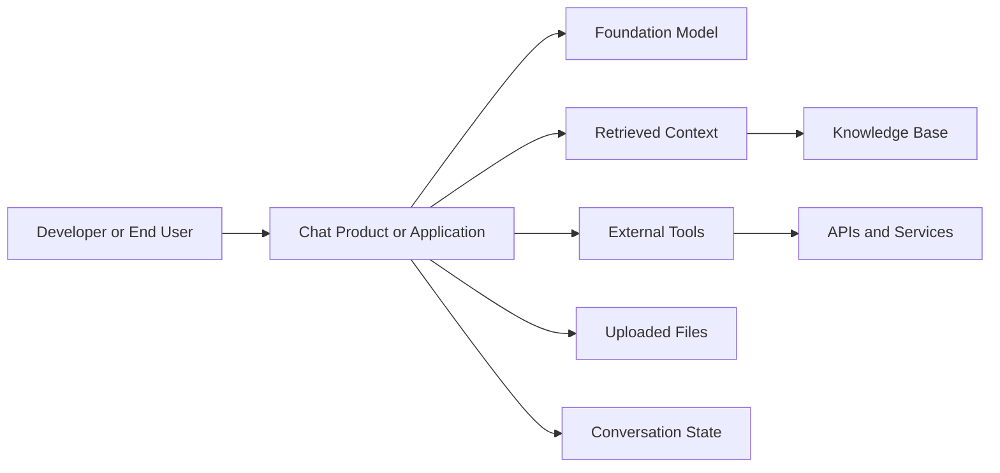
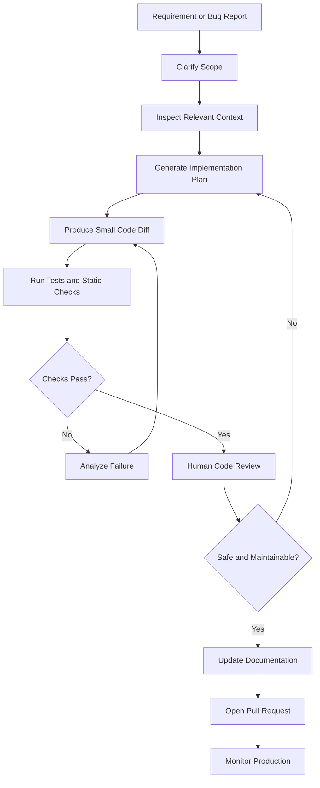
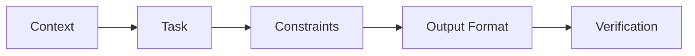
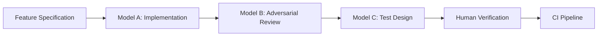
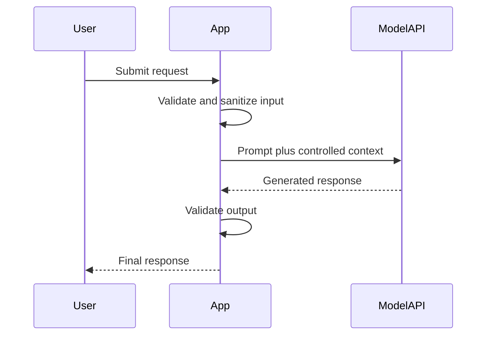
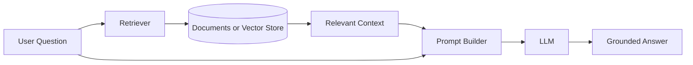
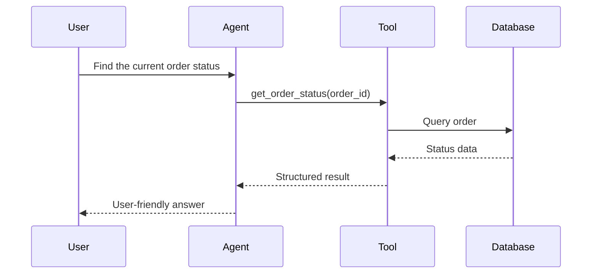
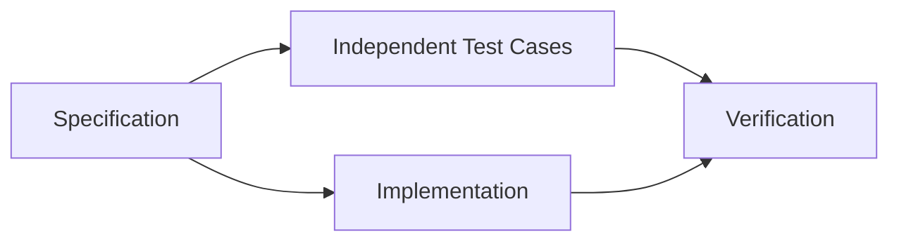
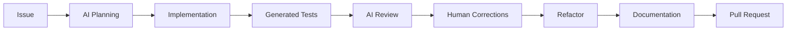

# 005 — ChatGPT / Claude / Gemini

| Field                  | Details                           |
| ---------------------- | --------------------------------- |
| **Course**             | 04 — Agents, Multimodal and Tools |
| **Module**             | Module 12 — Development Tools     |
| **Content Group**      | Tools to Know                     |
| **Roadmap Source**     | Development Tools / Tools to Know |
| **Lesson Type**        | Development Tool                  |
| **Order in Module**    | 005                               |
| **Suggested Duration** | 16 minutes                        |

---

## 1. Summary

**ChatGPT, Claude, and Gemini** are general-purpose AI assistants that can support many parts of software development:

* Understanding requirements
* Exploring unfamiliar code
* Generating implementation ideas
* Writing and reviewing code
* Creating tests
* Debugging errors
* Refactoring existing features
* Producing technical documentation
* Analyzing screenshots, diagrams, logs, and documents
* Designing prompts, RAG pipelines, and agent workflows

These tools should be treated as **engineering collaborators**, not autonomous sources of truth.

They can generate plausible code very quickly, but the developer remains responsible for:

* Correctness
* Security
* Architecture
* Testing
* Maintainability
* Privacy
* Production readiness

The main engineering skill is not simply knowing how to ask an AI tool to “write code.” It is knowing how to provide the right context, constrain the task, verify the output, and integrate the result safely.

---

## 2. Learning Objectives

After completing this lesson, you should be able to:

1. Explain the roles of ChatGPT, Claude, and Gemini in an AI engineering workflow.
2. Distinguish between a chat product, an API, a coding agent, and an underlying model.
3. Compare the three ecosystems without assuming that one tool is always the best.
4. Create a structured prompt for implementation, review, testing, or documentation.
5. Use AI assistance to complete a small coding task with verifiable acceptance criteria.
6. Identify security, correctness, cost, and maintainability risks.
7. Decide when to use a conversational assistant, an API integration, RAG, or an agent.

---

## 3. Core Concepts

## 3.1 Product, Model, API, and Agent Are Different

The terms are often mixed together, but they describe different layers.

| Layer                | Meaning                                                               | Example Use                                     |
| -------------------- | --------------------------------------------------------------------- | ----------------------------------------------- |
| **Model**            | The neural model that processes input and generates output            | Reasoning about code                            |
| **Chat product**     | A user interface built around one or more models                      | Discussing a feature interactively              |
| **API**              | A programmable interface for calling models from an application       | Building an AI support assistant                |
| **Coding agent**     | A system that can inspect files, edit code, run commands, and iterate | Implementing a repository-level change          |
| **Tool integration** | External functions or services available to the model                 | Database lookup, web search, test execution     |
| **RAG system**       | A pipeline that retrieves relevant information before generation      | Answering questions from internal documentation |



A chat application may provide capabilities that are not properties of the model itself, such as:

* File management
* Project memory
* Web research
* Code execution
* Repository access
* Connectors
* Artifact editing
* Permission controls

Therefore, comparing only model benchmark scores does not tell you which complete workflow will be best.

---

## 3.2 ChatGPT

ChatGPT can be used as a conversational assistant for coding, research, debugging, documentation, planning, and artifact creation. Its current ecosystem includes project-based context, Canvas for iterative writing and coding, deep research for documented investigation, and dedicated software-development workflows through Codex.

Typical engineering uses include:

* Converting requirements into an implementation plan
* Explaining unfamiliar code
* Generating or reviewing patches
* Analyzing logs and uploaded files
* Creating technical documents
* Researching libraries or architecture choices
* Building applications through the OpenAI API

### Example use

```text
I need to add request IDs to a FastAPI service.

Repository conventions:
- Request ID is stored in request.state.request_id
- Logs must include request_id
- Existing response schemas must not change
- Use pytest
- Do not add a new dependency

First inspect the requirements.
Then propose the smallest implementation plan.
Do not write code until the assumptions are listed.
```

---

## 3.3 Claude

Claude is designed for language, reasoning, analysis, coding, and multimodal tasks involving text, code, and images. Anthropic also provides Claude Code for repository-oriented development workflows and supports Model Context Protocol connections for external tools and services.

Typical engineering uses include:

* Reading and reasoning about large code sections
* Producing implementation plans
* Reviewing complex changes
* Editing repository files
* Running development workflows
* Generating documentation
* Connecting to external systems through tools or MCP

### Example use

```text
Analyze this service layer for responsibility leakage.

Return:
1. Responsibilities currently handled by the service
2. Responsibilities that belong in the repository layer
3. Responsibilities that belong in the router
4. A minimal refactoring sequence
5. Regression risks
6. Tests required before the refactor

Do not rewrite the entire module.
Prefer small reviewable changes.
```

---

## 3.4 Gemini

Gemini supports text and multimodal application development, including structured output, function calling, tool use, and real-time or streaming interfaces. In a function-calling workflow, the application defines available functions, the model proposes a function call, the application executes it, and the result is returned to the model for a final response.

Typical engineering uses include:

* Processing text, images, audio, video, or documents
* Building multimodal applications
* Producing schema-constrained output
* Connecting model reasoning to application functions
* Creating real-time voice or interactive systems
* Integrating with the Google developer ecosystem

### Example use

```text
Analyze the attached mobile UI screenshot.

Return JSON matching this schema:

{
  "screen_type": "string",
  "components": [
    {
      "name": "string",
      "type": "button | text | image | input | navigation",
      "position": "string",
      "possible_action": "string"
    }
  ],
  "accessibility_issues": ["string"],
  "implementation_notes": ["string"]
}

Do not include Markdown outside the JSON object.
```

---

## 3.5 High-Level Comparison

The following table describes common workflow tendencies rather than permanent rankings.

| Dimension                      | ChatGPT                                                       | Claude                                                         | Gemini                                                 |
| ------------------------------ | ------------------------------------------------------------- | -------------------------------------------------------------- | ------------------------------------------------------ |
| **Conversational development** | Strong general-purpose workspace                              | Strong analytical collaboration                                | Strong general and multimodal workflow                 |
| **Repository coding**          | ChatGPT and Codex workflows                                   | Claude Code workflows                                          | Gemini-based development tools and APIs                |
| **Long-form analysis**         | Useful for research, planning, and artifacts                  | Frequently used for detailed code and document analysis        | Useful for large and multimodal inputs                 |
| **Multimodal work**            | Text, files, images, voice, and other supported inputs        | Text, code, images, and supported files                        | Strong focus on multimodal application development     |
| **Tool calling**               | Available through application and API workflows               | Available through APIs, Claude Code, and MCP                   | Function calling and built-in tool workflows           |
| **Structured output**          | Suitable for schema-based application output                  | Suitable for structured application responses                  | Explicit structured-output workflows                   |
| **Best use**                   | General engineering, research, coding, and artifact workflows | Repository analysis, implementation, review, and documentation | Multimodal, structured, tool-connected applications    |
| **Main warning**               | Fluent output may still be incorrect                          | Detailed output may still contain incorrect assumptions        | Multimodal interpretation may still require validation |

Do not choose a provider from this table alone. Run an evaluation using your actual:

* Repository
* Prompt
* Data
* Latency requirement
* Output schema
* Security policy
* Budget
* Failure cases

---

## 4. Where These Tools Fit in the AI Engineer Workflow



AI can assist at every stage, but it should not automatically control every stage.

| Workflow Stage       | Good AI Task                       | Required Human Responsibility             |
| -------------------- | ---------------------------------- | ----------------------------------------- |
| Requirement analysis | Identify ambiguity and edge cases  | Confirm business intent                   |
| Planning             | Suggest files, sequence, and tests | Approve architecture                      |
| Implementation       | Generate a small patch             | Inspect every important change            |
| Testing              | Generate test cases                | Confirm tests represent real requirements |
| Debugging            | Interpret stack traces and logs    | Verify the root cause                     |
| Review               | Detect suspicious patterns         | Make the final approval decision          |
| Documentation        | Draft usage and architecture notes | Ensure documentation matches reality      |
| Deployment           | Generate a checklist               | Control credentials and release decisions |
| Monitoring           | Summarize incidents                | Decide remediation and escalation         |

---

## 5. The Most Important Prompt Structure

A reliable engineering prompt should contain five parts:

1. **Context**
2. **Task**
3. **Constraints**
4. **Output format**
5. **Verification method**



## 5.1 Reusable Prompt Template

```text
Role:
You are assisting with a production software repository.

Context:
- Application:
- Language and framework:
- Relevant files:
- Existing conventions:
- Current behavior:
- Desired behavior:

Task:
Describe the exact change to make.

Constraints:
- Do not change unrelated files.
- Do not introduce dependencies unless necessary.
- Preserve public API compatibility.
- Follow the existing architecture.
- Never expose secrets or private data.
- Prefer the smallest reviewable diff.

Acceptance criteria:
1.
2.
3.

Required tests:
1.
2.
3.

Output:
1. Assumptions
2. Implementation plan
3. Files to change
4. Patch or code
5. Tests
6. Risks
7. Verification commands
```

---

## 5.2 Weak Prompt Versus Strong Prompt

### Weak prompt

```text
Create a retry function.
```

Problems:

* No language is specified.
* Retry behavior is undefined.
* Error handling is undefined.
* Delay behavior is undefined.
* Maximum attempts are undefined.
* Expected tests are undefined.

### Strong prompt

```text
Implement a Python function named calculate_retry_delay.

Requirements:
- Input: attempt, base_delay, maximum_delay
- attempt is zero-based
- Formula: base_delay * 2 ** attempt
- Return the smaller value between the formula and maximum_delay
- Reject negative attempts
- Reject non-positive delay values
- Do not add randomness
- Include type hints and a docstring
- Include pytest tests for attempts 0, 1, 4, the maximum cap, and invalid input

Return:
1. Assumptions
2. Implementation
3. Tests
4. Verification command
```

The strong prompt creates an output that is easier to test and review.

---

## 6. Practical Demo: AI-Assisted Feature Development

## 6.1 Feature Request

Create a small utility for exponential retry delays.

### Acceptance criteria

* Attempt numbering starts at zero.
* Delay doubles after each failed attempt.
* Delay cannot exceed a maximum.
* Invalid values raise `ValueError`.
* The function contains no random jitter.
* Unit tests cover normal and invalid inputs.

---

## 6.2 Possible Implementation

```python
def calculate_retry_delay(
    attempt: int,
    base_delay: float = 0.5,
    maximum_delay: float = 8.0,
) -> float:
    """Calculate a capped exponential retry delay.

    Args:
        attempt: Zero-based retry attempt number.
        base_delay: Initial delay in seconds.
        maximum_delay: Maximum permitted delay in seconds.

    Returns:
        The calculated delay in seconds.

    Raises:
        ValueError: If attempt is negative or a delay is not positive.
    """
    if attempt < 0:
        raise ValueError("attempt must be non-negative")

    if base_delay <= 0:
        raise ValueError("base_delay must be positive")

    if maximum_delay <= 0:
        raise ValueError("maximum_delay must be positive")

    return min(base_delay * (2**attempt), maximum_delay)
```

---

## 6.3 Tests

```python
import pytest

from retry import calculate_retry_delay


@pytest.mark.parametrize(
    ("attempt", "expected"),
    [
        (0, 0.5),
        (1, 1.0),
        (4, 8.0),
        (5, 8.0),
    ],
)
def test_calculate_retry_delay(attempt: int, expected: float) -> None:
    assert calculate_retry_delay(attempt) == expected


def test_custom_delay_values() -> None:
    assert calculate_retry_delay(
        attempt=2,
        base_delay=1.0,
        maximum_delay=10.0,
    ) == 4.0


@pytest.mark.parametrize(
    ("attempt", "base_delay", "maximum_delay"),
    [
        (-1, 0.5, 8.0),
        (0, 0.0, 8.0),
        (0, -0.5, 8.0),
        (0, 0.5, 0.0),
        (0, 0.5, -8.0),
    ],
)
def test_invalid_values(
    attempt: int,
    base_delay: float,
    maximum_delay: float,
) -> None:
    with pytest.raises(ValueError):
        calculate_retry_delay(
            attempt=attempt,
            base_delay=base_delay,
            maximum_delay=maximum_delay,
        )
```

---

## 6.4 Verification

```bash
python -m pytest -q
```

AI generation is not the final verification step. The developer should also check:

* Does the function match the business definition of an attempt?
* Should `maximum_delay` be allowed to be smaller than `base_delay`?
* Does the application need jitter to avoid synchronized retries?
* Could a very large attempt create unnecessary computation?
* Should the return type be `float`, `Decimal`, or integer milliseconds?
* Is retry behavior safe for non-idempotent operations?

These questions demonstrate why generated code still requires engineering judgment.

---

## 7. Using Multiple Models as Reviewers

Using several tools does not automatically guarantee correctness. Models may repeat the same assumption or generate similar errors.

A better approach is to assign each tool a different role.



### Implementation prompt

```text
Implement the feature using the smallest possible diff.
Follow the existing repository conventions.
List every assumption before writing code.
```

### Adversarial review prompt

```text
Do not rewrite the code.

Try to find:
- Incorrect assumptions
- Security problems
- Race conditions
- Missing validation
- Breaking changes
- Weak error handling
- Missing test cases

For each issue, provide:
- Severity
- Evidence
- Failure scenario
- Smallest suggested fix
```

### Test design prompt

```text
Create a test matrix from the requirements.

Include:
- Happy path
- Boundary values
- Invalid input
- Dependency failure
- Timeout
- Concurrency, when relevant
- Authorization, when relevant
- Regression cases

Do not assume that the implementation is correct.
```

---

## 8. From Chat Assistant to Production AI Application

There are four common levels of adoption.

## Level 1 — Conversational Assistance

The developer manually provides context and receives advice or code.

```text
Developer → Chat Assistant → Suggested Output
```

Good for:

* Learning
* Brainstorming
* Small code snippets
* Debugging
* Documentation drafts

Limitation:

* Context must be supplied manually.
* Results may not follow repository conventions.
* The process is difficult to reproduce.

---

## Level 2 — API Integration

The application calls a model programmatically.



Good for:

* Chatbots
* Classification
* Extraction
* Summarization
* Content generation
* Structured data generation

Additional requirements:

* Authentication
* Rate limiting
* Timeouts
* Retries
* Cost controls
* Output validation
* Logging
* Safety filters
* Provider failure handling

---

## Level 3 — RAG Application

The application retrieves relevant information before calling the model.



Good for:

* Internal documentation assistants
* Product support
* Policy search
* Repository Q&A
* Technical knowledge systems

The model should be instructed to distinguish between:

* Retrieved evidence
* General knowledge
* Assumptions
* Missing information

---

## Level 4 — Agent with Tools

The model can choose and call external functions.



The model should not directly receive unrestricted infrastructure access.

Use:

* Tool allowlists
* Strict schemas
* Least-privilege credentials
* Confirmation for destructive actions
* Audit logs
* Idempotency controls
* Execution timeouts

---

## 9. Multimodal Development Workflows

ChatGPT, Claude, and Gemini can also assist with inputs beyond plain text, depending on the selected product, model, and API.

Examples include:

* UI screenshots
* Architecture diagrams
* Error screenshots
* PDF specifications
* Database diagrams
* Audio recordings
* Video frames
* Handwritten notes

### Screenshot review prompt

```text
Analyze this mobile application screenshot.

Focus on:
1. Visual hierarchy
2. Spacing consistency
3. Touch-target size
4. Contrast
5. Error-state visibility
6. Accessibility
7. Missing loading or empty states

Separate:
- Direct observations
- Likely interpretations
- Recommendations

Do not claim that an invisible interaction exists.
```

The final sentence is important because a screenshot does not prove how the application behaves.

---

## 10. Tool Selection Framework

Do not ask, “Which AI assistant is universally best?”

Ask, “Which workflow is best for this task under these constraints?”

Score each candidate using a repeatable evaluation.

| Criterion              | Example Question                                   |
| ---------------------- | -------------------------------------------------- |
| **Correctness**        | Does the output satisfy the acceptance criteria?   |
| **Code quality**       | Does it follow repository conventions?             |
| **Test quality**       | Are important failure cases covered?               |
| **Context handling**   | Can it use the required files and documentation?   |
| **Structured output**  | Does it reliably match the required schema?        |
| **Tool use**           | Can it safely call the required systems?           |
| **Multimodal ability** | Can it process the required media type?            |
| **Latency**            | Is the response fast enough for the UX?            |
| **Cost**               | Is the cost acceptable at expected traffic?        |
| **Privacy**            | Is the workflow allowed by company policy?         |
| **Observability**      | Can requests, failures, and usage be inspected?    |
| **Vendor risk**        | Can the application change providers if necessary? |

---

## 11. Provider Abstraction Pattern

Avoid placing provider-specific calls throughout the business logic.

```python
from typing import Protocol


class LanguageModel(Protocol):
    def generate(self, prompt: str) -> str:
        """Generate a response for the supplied prompt."""
        ...


class CodeReviewService:
    def __init__(self, model: LanguageModel) -> None:
        self._model = model

    def review(self, diff: str) -> str:
        prompt = f"""
You are reviewing a production code change.

Analyze the following diff:

{diff}

Return:
1. Critical issues
2. Correctness risks
3. Security risks
4. Missing tests
5. Maintainability concerns
"""
        return self._model.generate(prompt)
```

Possible adapters:

```text
OpenAIAdapter
AnthropicAdapter
GeminiAdapter
MockAdapter
```

Benefits:

* Easier unit testing
* Easier provider comparison
* Easier fallback implementation
* Reduced vendor lock-in
* Centralized timeout and retry handling
* Consistent logging and metrics

Do not force all provider features into the same abstraction. Keep provider-specific extensions available when they create real product value.

---

## 12. Production Risks

## 12.1 Hallucinated APIs

The assistant may generate:

* Nonexistent methods
* Removed configuration fields
* Incorrect package names
* Outdated SDK syntax
* Unsupported model parameters

### Mitigation

* Check the current official documentation.
* Pin dependency versions.
* Run the code.
* Add integration tests.
* Record the model and prompt version used during evaluation.

---

## 12.2 Excessive Changes

A model may rewrite unrelated files or redesign the architecture unnecessarily.

### Mitigation

```text
Modify only:
- app/services/retry.py
- tests/services/test_retry.py

Do not rename public functions.
Do not modify formatting outside the edited functions.
Return a summary of every changed line group.
```

---

## 12.3 Security Problems

Common risks include:

* Hard-coded secrets
* Unsafe shell commands
* SQL injection
* Missing authorization
* Sensitive log output
* Unvalidated tool parameters
* Prompt injection through retrieved documents
* Excessive agent permissions

### Mitigation

* Never paste real credentials into prompts.
* Redact customer information.
* Treat model-generated commands as untrusted.
* Use least-privilege tool access.
* Require confirmation for destructive operations.
* Validate model-generated arguments with application code.

---

## 12.4 False Confidence

Fluent explanations can sound more certain than the evidence supports.

### Mitigation prompt

```text
For every conclusion, label it as one of:

- Confirmed by provided code
- Inferred from context
- General recommendation
- Unknown

Do not convert an inference into a confirmed fact.
```

---

## 12.5 Tests That Confirm the Implementation Instead of the Requirement

An assistant may inspect its own implementation and generate tests that merely reproduce the same assumptions.

### Mitigation

Generate tests from the specification before generating the implementation.



---

## 12.6 Cost and Latency

Long prompts, large files, repeated retries, and multi-agent workflows can increase cost and response time.

### Mitigation

Track:

* Input tokens
* Output tokens
* Number of model calls
* Tool calls
* Retrieval count
* End-to-end latency
* Failure rate
* Cost per successful task

Optimize only after measuring real workloads.

---

## 13. Common Mistakes

### Mistake 1: Asking for an entire application in one prompt

Large tasks produce large, difficult-to-review changes.

**Better approach:** Divide the work into planning, implementation, testing, review, and documentation.

---

### Mistake 2: Providing no repository context

The model cannot reliably infer your conventions.

**Better approach:** Include relevant interfaces, schemas, neighboring code, and constraints.

---

### Mistake 3: Accepting code because it looks professional

Professional formatting does not prove correctness.

**Better approach:** Run tests, inspect edge cases, and compare the implementation against acceptance criteria.

---

### Mistake 4: Sharing sensitive production data

Source code, logs, prompts, or screenshots may contain confidential information.

**Better approach:** Follow the organization’s data policy and redact sensitive content.

---

### Mistake 5: Using one model as both author and final reviewer

The same reasoning failure may appear in both stages.

**Better approach:** Use independent tests, static analysis, CI, and human review.

---

### Mistake 6: Ignoring version changes

AI products, SDKs, model names, pricing, and capabilities evolve quickly.

**Better approach:** Verify current official documentation before implementing provider-specific code.

---

### Mistake 7: Asking for explanations without building anything

Reading about AI coding tools does not create practical skill.

**Better approach:** Complete a small feature from specification to tested pull request.

---

## 14. Practical Exercise

## Exercise: Three-Assistant Coding Evaluation

Choose a small feature such as:

* Input validation
* Retry delay calculation
* Pagination helper
* JSON schema parser
* Health-check endpoint
* Log sanitization utility

### Step 1 — Write one shared specification

Include:

* Current behavior
* Desired behavior
* Constraints
* Acceptance criteria
* Required tests

### Step 2 — Submit the same specification

Use ChatGPT, Claude, and Gemini with equivalent context.

### Step 3 — Save the outputs

Record:

* Proposed plan
* Generated code
* Tests
* Explanation
* Assumptions

### Step 4 — Evaluate independently

| Metric                      | Score |
| --------------------------- | ----: |
| Requirements satisfied      |    /5 |
| Code correctness            |    /5 |
| Test coverage               |    /5 |
| Repository consistency      |    /5 |
| Security awareness          |    /5 |
| Explanation quality         |    /5 |
| Size of unnecessary changes |    /5 |
| Ease of verification        |    /5 |

### Step 5 — Write a conclusion

Answer:

1. Which assistant produced the best first draft?
2. Which assistant found the most important risks?
3. Which assistant created the strongest tests?
4. Which output required the least correction?
5. Did the result change when more context was provided?
6. Which differences came from the prompt rather than the model?

---

## 15. Mini Portfolio Project

## Project 11 — AI Coding Workflow

Create a small repository demonstrating an AI-assisted development lifecycle.

### Required workflow



### Suggested repository structure

```text
ai-coding-workflow/
├── README.md
├── app/
│   ├── __init__.py
│   └── retry.py
├── tests/
│   └── test_retry.py
├── prompts/
│   ├── planning.md
│   ├── implementation.md
│   ├── review.md
│   └── documentation.md
├── evaluations/
│   ├── chatgpt.md
│   ├── claude.md
│   ├── gemini.md
│   └── comparison.md
└── docs/
    └── engineering-decisions.md
```

### Portfolio evidence

Include:

* Original issue
* Acceptance criteria
* Prompts used
* Generated proposal
* Final code
* Tests
* Review findings
* Corrections made by the developer
* Limitations
* Final comparison

The portfolio should demonstrate engineering judgment, not merely AI-generated code.

---

## 16. Completion Checklist

* [ ] I can explain the difference between a model, chat product, API, and coding agent.
* [ ] I can describe where ChatGPT, Claude, and Gemini fit in a development workflow.
* [ ] I can write a prompt containing context, task, constraints, output, and verification.
* [ ] I can limit an AI coding task to a small, reviewable scope.
* [ ] I can generate tests from requirements rather than from generated code.
* [ ] I can identify hallucinated APIs and unsupported assumptions.
* [ ] I know how RAG differs from direct prompting.
* [ ] I understand the basic model–tool–application interaction.
* [ ] I know that model output must be treated as untrusted input.
* [ ] I can evaluate providers using my real application workload.
* [ ] I have built one small AI-assisted feature.
* [ ] I have documented at least one limitation or unanswered question.

---

## 17. Five-Line Recall Exercise

Without looking at the lesson, complete these statements:

1. ChatGPT, Claude, and Gemini are useful for...
2. A chat product differs from an API because...
3. A strong engineering prompt contains...
4. AI-generated code must be verified by...
5. The developer remains responsible for...

---

## 18. Related Outcome

> Use AI coding tools responsibly to implement, test, review, refactor, and document software features.

---

## 19. Key Takeaways

1. **ChatGPT, Claude, and Gemini are engineering assistants, not final authorities.**
2. **The quality of the result depends heavily on task scope, context, constraints, and verification.**
3. **Small diffs with explicit acceptance criteria are safer than large one-shot generations.**
4. **Tests should be derived from requirements independently of the implementation.**
5. **Chat products are useful for interactive work, while APIs support production applications.**
6. **RAG adds retrieved knowledge, while agents add controlled tool execution.**
7. **Provider selection should be based on repeatable evaluation, not popularity or a single benchmark.**
8. **Security, privacy, maintainability, cost, and correctness remain human responsibilities.**

---

## 20. Final Summary

**ChatGPT, Claude, and Gemini** can accelerate almost every stage of modern software and AI engineering. They can help transform an idea into a plan, a plan into code, code into tests, tests into a review, and a completed feature into documentation.

However, speed is valuable only when the workflow remains controlled.

A responsible AI coding workflow is:

```text
Specify → Constrain → Generate → Test → Review → Correct → Document
```

The goal is not to let an AI tool replace engineering judgment. The goal is to use AI to increase development speed while preserving correctness, security, and maintainability.

---

# Bài luyện tập

## Mục tiêu


## Đề bài


## Yêu cầu hoàn thành

- [ ] 
- [ ] 
- [ ] 

## Kết quả / lời giải


## Ghi chú
