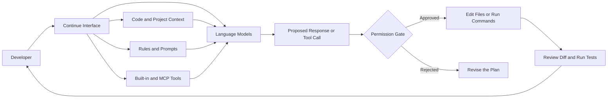
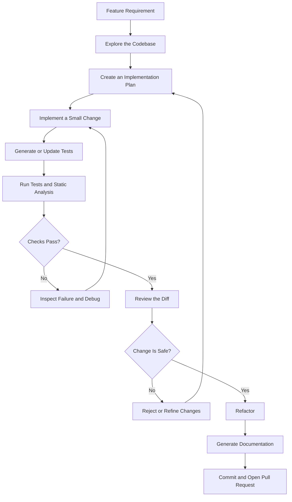
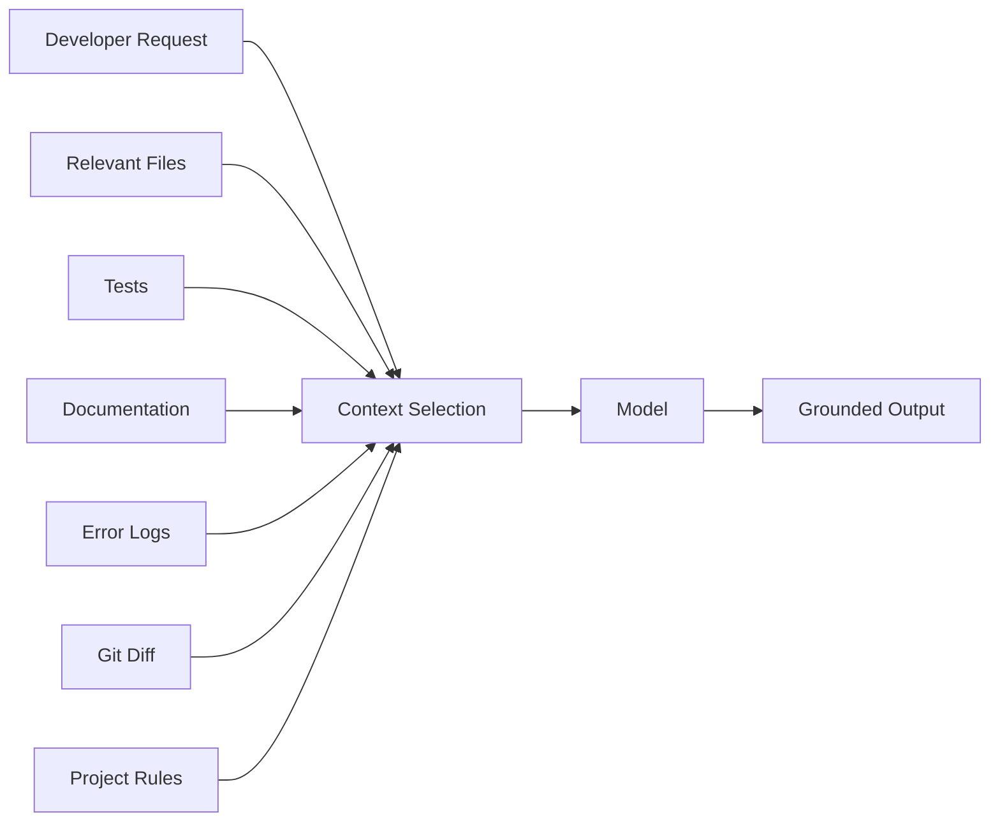
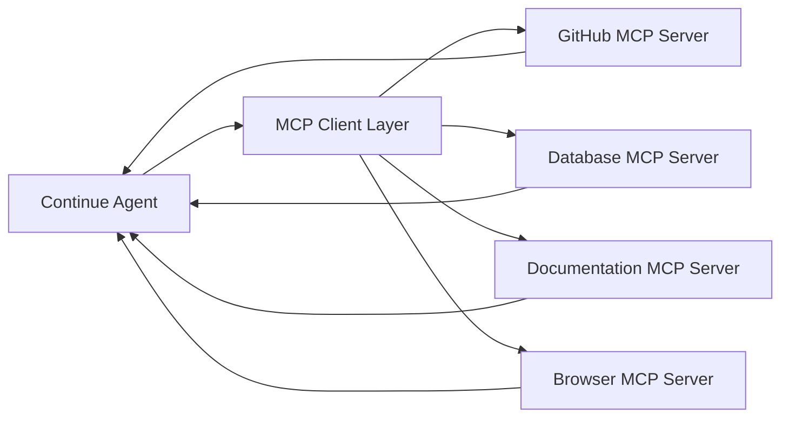
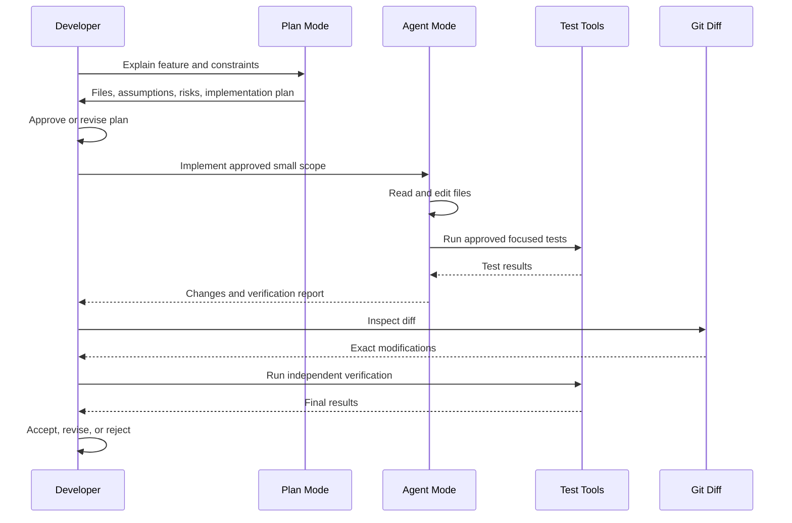

# 006 — Continue.dev

**Course:** 04 — Agents, Multimodal and Tools
**Module:** Module 12 — Development Tools
**Content Group:** Tools to Know
**Roadmap Source:** Development Tools / Tools to Know
**Lesson Type:** Development Tool
**Order in Module:** 006
**Suggested Duration:** 16 minutes

---

## Current Status Note

As of **July 28, 2026**, Continue has joined Cursor. The original `continuedev/continue` repository remains open source but is no longer actively maintained and is read-only. The maintainers published a final `2.0.0` release of the CLI, VS Code extension, and JetBrains plugin. Therefore, Continue is especially valuable as:

* A usable final-version coding agent.
* An open-source reference implementation.
* A learning tool for AI-assisted development workflows.
* A foundation for understanding coding agents, context management, rules, model routing, tool permissions, and MCP integration.

---

## 1. Summary

**Continue.dev** is an open-source AI coding agent that integrates language models into development environments.

It was made available through:

* A VS Code extension.
* A JetBrains plugin.
* The `cn` command-line interface.

Continue supports several development interactions, including autocomplete, targeted editing, codebase conversations, implementation planning, and agent-based execution. Its configuration system combines models, project rules, reusable prompts, and external tools.

The most important lesson is not simply how to generate code. It is how to build a **controlled AI coding workflow**:

```text
Understand → Plan → Implement → Test → Review → Refactor → Document
```

The AI proposes and performs work, but the developer remains responsible for correctness, security, maintainability, and the final decision to merge.

---

## 2. Learning Objectives

By the end of this lesson, you should be able to:

1. Explain Continue.dev in your own words.
2. Distinguish between Chat, Plan, Agent, Edit, and Autocomplete workflows.
3. Understand how models, rules, prompts, context, and tools work together.
4. Use Continue for a small, clearly scoped coding task.
5. Create project-specific coding rules.
6. Review AI-generated changes using diffs and tests.
7. Identify security and production risks.
8. Design a responsible AI coding workflow for a portfolio project.

---

## 3. What Is Continue.dev?

Continue is a coding-agent interface positioned between the developer, the codebase, one or more language models, and development tools.

It is **not itself a foundation model**. Instead, it connects models to development context and gives them controlled capabilities.



Continue configurations are built around three major concepts:

* **Models:** Language models assigned to tasks such as chat, editing, autocomplete, embeddings, reranking, and applying changes.
* **Rules:** Persistent instructions that shape how the model behaves.
* **Tools:** Built-in development tools or external capabilities exposed through MCP servers.

---

## 4. Where Continue Fits in an AI Engineer Workflow

Continue can assist throughout the software development lifecycle.



A strong workflow uses the AI for acceleration without transferring ownership to the AI.

### Appropriate tasks

Continue is useful for:

* Explaining unfamiliar code.
* Locating the files involved in a feature.
* Planning implementation steps.
* Generating boilerplate.
* Creating small functions or API routes.
* Adding unit tests.
* Refactoring a limited code section.
* Reviewing a diff.
* Generating documentation.
* Finding possible edge cases.
* Running approved development commands.

### Tasks requiring additional caution

Use additional review for:

* Authentication and authorization.
* Payment systems.
* Database migrations.
* Cryptography.
* Infrastructure changes.
* Dependency upgrades.
* Destructive terminal commands.
* Personal or confidential data.
* Security-sensitive configuration.
* Changes spanning many modules.

---

## 5. Core Interaction Modes

Continue’s IDE workflow includes Autocomplete, Edit, Chat, Plan, and Agent capabilities. The official quick-start documentation presents Autocomplete, Edit, Chat, and Agent as core features, while newer agent documentation also distinguishes a read-only Plan mode.

| Mode         | Main purpose                          |             Typical scope |                 Can modify files? |           Can run tools? |
| ------------ | ------------------------------------- | ------------------------: | --------------------------------: | -----------------------: |
| Autocomplete | Predict code while typing             |               A few lines | Only through accepted suggestions |       No agent tool loop |
| Edit         | Modify highlighted code               |       One selected region |     Yes, after reviewing the diff | Limited editing workflow |
| Chat         | Explain, discuss, or answer questions | Files supplied as context |                      Not directly |        No built-in tools |
| Plan         | Explore and design a solution         | Multiple files or modules |                                No |          Read-only tools |
| Agent        | Implement multi-step work             |    A small feature or bug |                               Yes |     Read and write tools |

### 5.1 Autocomplete

Autocomplete provides inline code suggestions based on the code around the cursor.

```python
def calculate_order_total(items):
    # Continue may suggest the implementation here
```

Autocomplete performs better when the code contains:

* Clear names.
* Type annotations.
* Comments describing intent.
* Consistent surrounding patterns.
* Small, predictable functions.

The developer accepts or rejects the proposed completion.

---

### 5.2 Edit

Edit mode is designed for targeted modifications.

A developer highlights a section and provides a concise instruction:

```text
Convert this function to async and add timeout handling.
```

Continue uses the selected code and the current file as context, generates a proposed replacement, and displays the result as a diff that can be accepted or rejected.

Use Edit when:

* The target code is already known.
* The requested change is local.
* The desired behavior can be described briefly.
* A small diff is preferable to autonomous codebase exploration.

---

### 5.3 Chat

Chat is appropriate for understanding and reasoning:

```text
Explain how authentication flows through this project.

Why does this service create two database transactions?

Which edge cases are missing from these tests?
```

Chat can incorporate highlighted code, active files, terminal content, and explicitly selected context. It is useful when the required output is an explanation or recommendation rather than an immediate file modification.

---

### 5.4 Plan Mode

Plan mode provides read-only access to the repository.

It can inspect files, search for symbols, examine directory structure, and construct an implementation plan without editing files or running modifying commands. The recommended pattern is to explore in Plan mode and switch to Agent mode only after the plan is acceptable.

Example prompt:

```text
Inspect the authentication flow.

Identify:
1. The route that receives login requests.
2. The service that validates credentials.
3. Where tokens are generated.
4. Existing tests for invalid credentials.
5. The smallest safe plan for adding login rate limiting.

Do not modify any files.
```

A good plan should identify:

* Relevant files.
* Existing architecture.
* Assumptions.
* Expected changes.
* Tests to add.
* Security concerns.
* Open questions.

---

### 5.5 Agent Mode

Agent mode gives the selected model access to development tools.

Depending on permissions, it may:

* Read files.
* Search the repository.
* Create files.
* Edit existing files.
* Run terminal commands.
* Inspect diffs.
* Use connected MCP tools.

Continue’s documentation distinguishes three permission levels for tools:

* **Ask First:** Request approval before execution.
* **Automatic:** Execute without requesting approval.
* **Excluded:** Do not expose the tool to the model.

The documentation recommends caution when automatically approving tools that can modify files or execute commands.

---

## 6. Continue’s Main Building Blocks

### 6.1 Models

Models may be assigned different roles.

```yaml
roles:
  - chat
  - edit
  - apply
  - autocomplete
  - embed
  - rerank
```

Different roles have different requirements:

| Role         | Important characteristic                         |
| ------------ | ------------------------------------------------ |
| Chat         | Strong reasoning and code understanding          |
| Agent        | Reliable instruction following and tool use      |
| Edit         | Accurate localized code transformation           |
| Apply        | Fast conversion of suggestions into file changes |
| Autocomplete | Very low latency                                 |
| Embed        | Good semantic code retrieval                     |
| Rerank       | Accurate ordering of retrieved context           |

The YAML reference lists roles such as `chat`, `edit`, `apply`, `autocomplete`, `embed`, and `rerank`. Agent workflows additionally depend on the model’s ability to work with tools.

---

### 6.2 Context

A coding model cannot reason reliably about a repository it has not seen.

Useful context can include:

* The current file.
* Highlighted code.
* Related interfaces.
* Existing tests.
* Repository structure.
* Terminal output.
* Git diffs.
* Documentation.
* Issue descriptions.
* Tool results.



Too little context causes guessing. Too much context increases cost, latency, and the chance that important details are lost.

A useful rule is:

> Provide the smallest context set that fully defines the task.

---

### 6.3 Rules

Rules are persistent project instructions used in Agent, Chat, and Edit requests. They are not applied to autocomplete or apply operations. Continue supports project rules stored under `.continue/rules/`, and Markdown rule files are the recommended format in the final documentation.

Example project rule:

```markdown
---
name: Python API quality rules
description: Standards for changes to the FastAPI backend
globs:
  - "app/**/*.py"
  - "tests/**/*.py"
alwaysApply: false
---

- Use Python type hints for public functions.
- Keep route handlers thin.
- Put business logic in service modules.
- Validate request data with Pydantic.
- Do not expose internal exception messages to clients.
- Add tests for success, validation failure, and authorization failure.
- Do not introduce a new dependency without explaining why.
```

Rules improve consistency, but they are not a replacement for:

* Linters.
* Type checkers.
* Unit tests.
* Security scanning.
* Code review.
* Architecture enforcement.

---

### 6.4 Reusable Prompts

Prompts represent repeatable workflows.

An invokable prompt can become a slash command in supported Continue interfaces. This allows a team to encode recurring tasks such as reviewing an endpoint, generating tests, or preparing documentation.

Example:

```markdown
---
name: Review API endpoint
description: Review a backend endpoint for correctness and security
invokable: true
---

Review the selected API endpoint.

Check:
1. Input validation.
2. Authentication and authorization.
3. Error handling.
4. Database transaction behavior.
5. Sensitive-data exposure.
6. Logging quality.
7. Unit and integration test coverage.

Do not edit the code.

Return:
- Critical issues
- Non-critical issues
- Missing tests
- Recommended fix order
```

This prompt might be invoked as:

```text
/review-api-endpoint
```

---

### 6.5 MCP Tools

Continue supports external tools through the **Model Context Protocol**.

An MCP server can connect an agent to systems such as:

* Browser automation.
* Documentation search.
* GitHub.
* Databases.
* Internal APIs.
* Issue trackers.
* Custom development tools.

In Continue, MCP tools are available through Agent mode. MCP servers can be defined through configuration or workspace files such as `.continue/mcpServers/`.



MCP expands an agent’s capabilities, but it also expands the security boundary.

Before enabling an MCP server, verify:

* Who maintains it.
* Which commands it can execute.
* Which files or services it can access.
* Whether it receives secrets.
* Whether operations are read-only or modifying.
* Whether tool calls require approval.
* Whether outputs are trusted or untrusted input.

---

## 7. Basic Configuration Concept

Continue agents use a YAML configuration containing metadata and optional sections for models, context, rules, prompts, documentation, MCP servers, and development data.

A simplified configuration may look like this:

```yaml
name: AI Engineer Workflow
version: 1.0.0
schema: v1

models:
  - name: Main Coding Model
    provider: your-provider
    model: your-model-name
    apiKey: ${{ secrets.MODEL_API_KEY }}
    roles:
      - chat
      - edit
      - apply

  - name: Fast Autocomplete Model
    provider: your-provider
    model: your-autocomplete-model
    apiKey: ${{ secrets.MODEL_API_KEY }}
    roles:
      - autocomplete
```

The exact provider name, model identifier, supported properties, and authentication method depend on the provider and final Continue version.

### Secret-management rule

Do not write real keys directly into committed configuration files.

Avoid:

```yaml
apiKey: sk-real-secret-value
```

Prefer environment variables or the secret mechanism supported by the configuration:

```yaml
apiKey: ${{ secrets.MODEL_API_KEY }}
```

Also add local secret files to `.gitignore`:

```gitignore
.env
.env.*
!.env.example
```

---

## 8. Practical Demo: Add a Health-Check Endpoint

### Goal

Use Continue to add a small FastAPI endpoint:

```http
GET /api/health
```

Expected response:

```json
{
  "status": "ok",
  "service": "example-api"
}
```

### Constraints

* Do not access the database.
* Do not call an external service.
* Use a typed response model.
* Add unit tests.
* Preserve the existing application architecture.
* Keep the diff small.

---

### Step 1: Explore in Plan Mode

Prompt:

```text
Inspect this FastAPI repository and plan the smallest safe implementation
for GET /api/health.

Requirements:
- Return status="ok" and service="example-api".
- Use a typed response model.
- Do not access the database.
- Add unit tests.
- Follow the existing router registration pattern.
- Do not modify files yet.

Return:
1. Relevant files.
2. Existing conventions.
3. Implementation steps.
4. Tests to add.
5. Risks or assumptions.
```

### Expected planning output

```text
Relevant files:
- app/main.py
- app/api/router.py
- app/api/routes/
- tests/api/

Plan:
1. Create a HealthResponse Pydantic model.
2. Add a health router.
3. Register the router under /api.
4. Add a success-response test.
5. Run the focused test file.
6. Run the full test suite.
```

Do not proceed when the plan:

* Invents nonexistent project structure.
* Adds unnecessary dependencies.
* Introduces database access.
* Changes unrelated files.
* Cannot explain how the router is registered.

---

### Step 2: Implement in Agent Mode

Prompt:

```text
Implement the approved health-check plan.

Requirements:
- GET /api/health
- HTTP 200
- Typed Pydantic response
- JSON fields:
  - status: "ok"
  - service: "example-api"
- No database or external-service calls
- Follow existing project patterns
- Add focused unit tests
- Do not modify unrelated files

After editing:
1. Show the changed files.
2. Run the focused tests.
3. Report the test result.
4. Do not create a commit.
```

---

### Step 3: Inspect the Diff

Example command:

```bash
git diff -- app tests
```

Review each changed line.

Questions to ask:

* Did the agent modify only relevant files?
* Is the route registered correctly?
* Is the response schema accurate?
* Was an unnecessary abstraction introduced?
* Are imports valid?
* Does the test assert the actual response contract?
* Were existing tests weakened or deleted?
* Did the agent hide errors using broad exception handling?

---

### Step 4: Run Verification

Example commands:

```bash
pytest tests/api/test_health.py -q
pytest -q
ruff check .
mypy app
```

Use the commands already supported by the project. Do not invent a toolchain merely because it appears in an AI-generated suggestion.

---

### Step 5: Request a Review

```text
Review the current diff without modifying files.

Check:
- Correctness
- API contract
- Type safety
- Test quality
- Unnecessary complexity
- Security concerns
- Unrelated modifications

Classify findings as:
- Blocking
- Important
- Optional

Reference exact files and lines where possible.
```

---

### Step 6: Generate Documentation

```text
Update the appropriate API documentation for GET /api/health.

Document:
- Method and path
- Purpose
- Response fields
- Example response
- Expected status code

Do not modify unrelated documentation.
```

---

## 9. Recommended AI Coding Workflow



### The developer should control five gates

1. **Scope gate:** Is the requested task small and specific?
2. **Plan gate:** Does the proposed approach fit the architecture?
3. **Permission gate:** Which tools and commands may run?
4. **Diff gate:** Are all modifications understood?
5. **Verification gate:** Do independent checks pass?

---

## 10. Prompting Patterns

### Weak request

```text
Improve the backend.
```

Problems:

* Undefined scope.
* No acceptance criteria.
* No file boundaries.
* No verification requirements.
* The agent may rewrite unrelated code.

### Better request

```text
Add validation to POST /api/users so that display_name must contain
between 2 and 50 non-whitespace characters.

Constraints:
- Preserve the existing response schema.
- Do not modify authentication.
- Use the existing validation style.
- Add tests for 1, 2, 50, and 51 characters.
- Do not add dependencies.
- Show the plan before editing.
```

### Recommended task structure

```text
Goal:
What should change?

Context:
Which feature, issue, or behavior is involved?

Scope:
Which files or modules may change?

Constraints:
What must remain unchanged?

Acceptance criteria:
How will success be measured?

Verification:
Which tests and checks should run?

Stop conditions:
When should the agent ask for developer input?
```

---

## 11. Responsible Use and Security

### 11.1 Treat generated code as untrusted

AI-generated code may:

* Compile but behave incorrectly.
* Miss authorization checks.
* Introduce race conditions.
* Use outdated APIs.
* Catch exceptions too broadly.
* Create inefficient queries.
* Add insecure defaults.
* Hallucinate project functions.
* Disable or weaken tests.

The correct mindset is:

```text
Generated code = proposed patch
```

not:

```text
Generated code = verified solution
```

---

### 11.2 Minimize terminal permissions

A coding agent with terminal access may be able to:

* Install packages.
* Delete files.
* Change Git state.
* Modify generated artifacts.
* Run migrations.
* Access environment variables.
* Make network requests.

Prefer approval-required execution for write operations.

Be especially cautious with:

```bash
rm -rf
git reset --hard
git clean -fd
docker system prune
npm install
pip install
terraform apply
kubectl apply
alembic upgrade head
```

A command does not become safe merely because an AI generated it.

---

### 11.3 Protect secrets and private code

Before connecting a hosted model, understand:

* Which content is sent to the provider.
* Whether prompts are retained.
* Whether data is used for training.
* Which region processes the data.
* Whether sensitive files can be excluded.
* Whether organization policy allows the provider.

Sensitive context may include:

* `.env` files.
* Cloud credentials.
* Private keys.
* Production database URLs.
* Customer information.
* Internal algorithms.
* Security incident details.
* Proprietary source code.

---

### 11.4 Keep changes reviewable

Prefer:

```text
One task → one small diff → focused tests → review
```

Avoid:

```text
Large request → dozens of changed files → unclear behavior → merge
```

Small diffs make it easier to identify:

* Hallucinated code.
* Unrelated cleanup.
* Missing tests.
* Architectural violations.
* Security regressions.

---

## 12. Common Mistakes and Debugging

| Problem                                       | Likely cause                                                       | Debugging approach                                                     |
| --------------------------------------------- | ------------------------------------------------------------------ | ---------------------------------------------------------------------- |
| Agent or Plan mode is unavailable             | Selected model cannot use tools, or tool support is not configured | Select a compatible model and inspect its capabilities                 |
| Agent changes too many files                  | Request scope is too broad                                         | Specify allowed files and require a plan first                         |
| Generated code references missing functions   | Insufficient repository context                                    | Provide interfaces, related implementations, and tests                 |
| Rules do not appear                           | Incorrect rule path or invalid file format                         | Check `.continue/rules/` and Markdown frontmatter                      |
| Rules are ignored by autocomplete             | Rules are not used in that operation                               | Apply rules through Chat, Edit, or Agent workflows                     |
| MCP tool is unavailable                       | MCP is not configured or the wrong mode is active                  | Verify `.continue/mcpServers/` and use Agent mode                      |
| Tool call repeatedly fails                    | Wrong arguments, environment issue, or unsupported command         | Inspect the exact tool input and reproduce manually                    |
| Tests pass but feature is wrong               | Tests assert the implementation instead of behavior                | Add contract, edge-case, and failure-path tests                        |
| Autocomplete quality is poor                  | Slow or unsuitable model, weak local context                       | Use a low-latency coding model and clearer names/types                 |
| Output consumes too many tokens               | Excessive context or repeated conversation history                 | Start a focused session and attach only relevant context               |
| Secret appears in a prompt or diff            | Sensitive file was included or generated accidentally              | Revoke the secret, remove it from history, and audit exposure          |
| Instructions conflict                         | Global, workspace, prompt, and user instructions disagree          | Simplify rules and define explicit priority                            |
| Documentation differs from installed behavior | Continue is in final, unmaintained status                          | Confirm behavior against the installed `2.0.0` release and source code |

The final Continue repository is read-only, so unresolved product defects should generally be treated as limitations to work around, debug locally, or address in a maintained fork.

---

## 13. Practical Exercises

### Exercise 1: Five-line explanation

Without looking at the lesson, write five lines covering:

1. What Continue is.
2. What context means.
3. How Plan mode differs from Agent mode.
4. Why diffs and tests are necessary.
5. Who owns the final code.

---

### Exercise 2: Small feature

Choose one task:

* Add a `/health` endpoint.
* Add input validation to an API route.
* Add pagination to an in-memory list.
* Add unit tests for an existing function.
* Improve error handling in one service.
* Generate documentation for one module.

Required workflow:

```text
Plan → Implement → Test → Review → Refactor → Document
```

Save the following artifacts:

```text
artifacts/
├── 01-plan.md
├── 02-implementation-prompt.md
├── 03-diff.patch
├── 04-test-output.txt
├── 05-review.md
└── 06-final-notes.md
```

---

### Exercise 3: Create a project rule

Create:

```text
.continue/rules/testing.md
```

Example:

```markdown
---
name: Testing standards
description: Test requirements for application changes
alwaysApply: true
---

- Every bug fix must include a regression test.
- Test externally observable behavior.
- Do not delete a failing test merely to make the suite pass.
- Include at least one failure-path test when applicable.
- Mock only true external boundaries.
- Keep tests deterministic.
```

Test the rule by asking the agent to implement a small bug fix.

---

### Exercise 4: Production-risk analysis

Write one production failure scenario.

Example:

```text
Failure:
The agent adds a broad `except Exception` block around payment processing.

Why it is dangerous:
The API returns success even when transaction persistence fails.

Detection:
Integration test the failure path and inspect logs.

Prevention:
Require explicit exception types and prohibit swallowed exceptions in rules.
```

---

## 14. Production Checklist

### Before using the agent

* [ ] The task has a clear objective.
* [ ] The allowed scope is defined.
* [ ] Acceptance criteria are measurable.
* [ ] Sensitive files are excluded.
* [ ] The working tree is clean or changes are committed.
* [ ] Destructive tools require approval.
* [ ] Relevant project rules are active.

### Before accepting changes

* [ ] I understand every changed file.
* [ ] The diff contains no unrelated modifications.
* [ ] No secrets were added.
* [ ] No test was weakened or removed without justification.
* [ ] New dependencies are necessary and reviewed.
* [ ] Error paths were considered.
* [ ] Security boundaries remain intact.
* [ ] Focused tests pass.
* [ ] The full required test suite passes.
* [ ] Linters and type checks pass.

### Before merging

* [ ] Documentation is updated.
* [ ] Logs do not expose sensitive information.
* [ ] Database changes have rollback plans.
* [ ] Performance implications were considered.
* [ ] A human reviewer approved the patch.
* [ ] The pull request explains assumptions and limitations.

---

## 15. Completion Checklist

* [ ] I can explain **Continue.dev** in one or two minutes.
* [ ] I can distinguish Chat, Plan, Agent, Edit, and Autocomplete.
* [ ] I understand models, context, rules, prompts, and tools.
* [ ] I can create a project-specific rule.
* [ ] I can scope an AI coding task clearly.
* [ ] I can inspect an AI-generated diff.
* [ ] I can verify a change using tests and static analysis.
* [ ] I understand the risks of automatic terminal execution.
* [ ] I have created a small demo or practical artifact.
* [ ] I documented at least one limitation or open question.
* [ ] I understand Continue’s final, read-only project status.

---

## 16. Five-Line Lesson Summary

1. Continue is an open-source coding agent that connects language models to development context and tools.
2. Plan mode is useful for safe repository exploration, while Agent mode can modify files and execute tools.
3. Models, rules, prompts, context, and MCP tools determine how the coding agent behaves.
4. AI-generated code must be reviewed through small diffs, tests, static analysis, and human judgment.
5. Continue is now an unmaintained final-version project, but it remains a useful reference for responsible AI coding workflows.

---

## 17. Related Outcome

Use AI coding tools responsibly to:

* Implement features.
* Generate tests.
* Review code.
* Refactor limited scopes.
* Debug failures.
* Produce documentation.
* Automate repeatable development checks.

The desired result is not maximum code generation. It is faster delivery while preserving control, correctness, security, and maintainability.

---

## 18. Related Project

### Project 11 — AI Coding Workflow

Build a documented workflow that uses an AI coding tool to:

1. Understand a feature request.
2. Explore the repository.
3. Propose an implementation plan.
4. Implement a small feature.
5. Add or update tests.
6. Run verification checks.
7. Review the generated diff.
8. Refactor the implementation.
9. Generate documentation.
10. Record limitations and production risks.

### Suggested portfolio structure

```text
ai-coding-workflow/
├── README.md
├── prompts/
│   ├── plan-feature.md
│   ├── implement-feature.md
│   ├── review-diff.md
│   └── generate-docs.md
├── .continue/
│   └── rules/
│       ├── architecture.md
│       ├── security.md
│       └── testing.md
├── app/
├── tests/
├── artifacts/
│   ├── implementation-plan.md
│   ├── generated-diff.patch
│   ├── test-results.txt
│   └── ai-review.md
└── docs/
    └── workflow-retrospective.md
```

### Portfolio questions to answer

* What did the AI do well?
* Where did it misunderstand the repository?
* Which rules improved the result?
* Which generated changes were rejected?
* Which tests detected mistakes?
* How much developer review was required?
* What would be unsafe to automate?
* Would the workflow remain useful with another coding agent?

---

## 19. Conclusion

Continue.dev demonstrates the main components of a modern AI coding agent:

```text
Model
+ Repository Context
+ Persistent Rules
+ Reusable Prompts
+ Development Tools
+ Permission Controls
+ Human Review
= Controlled AI-Assisted Development
```

Its most valuable lesson is that an AI coding tool should not be treated as an autonomous replacement for a developer.

Use it as a controlled collaborator:

1. Give it a small task.
2. provide relevant context.
3. Require a plan.
4. Limit permissions.
5. Review the diff.
6. Run independent verification.
7. Accept only changes you understand.

Continue is one milestone in the AI Engineer roadmap, but the workflow learned from it applies broadly to modern coding agents, IDE assistants, CLI agents, pull-request reviewers, and tool-using software-engineering systems.

---

# Bài luyện tập

## Mục tiêu


## Đề bài


## Yêu cầu hoàn thành

- [ ] 
- [ ] 
- [ ] 

## Kết quả / lời giải


## Ghi chú
