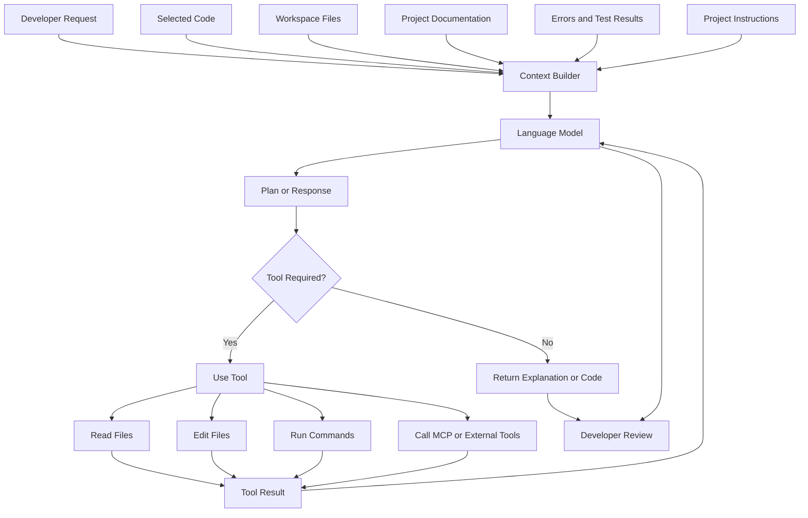
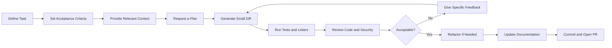
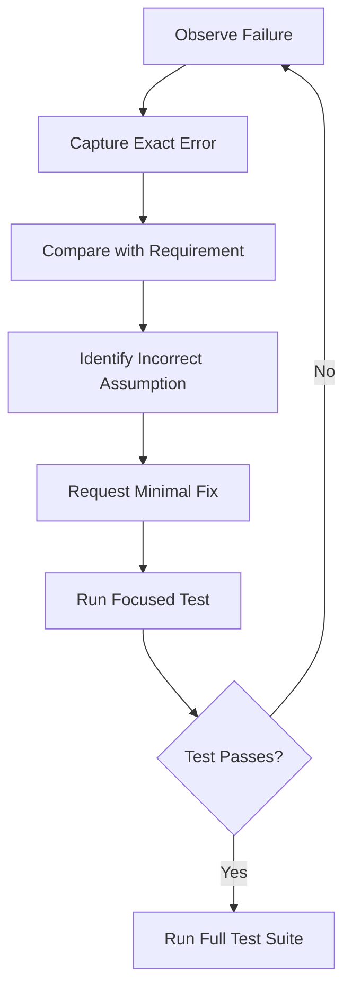

# 007 — VS Code AI Extensions

**Course:** 04 — Agents, Multimodal, and Tools
**Module:** Module 12 — Development Tools
**Content Group:** Tools to Know
**Roadmap Source:** Development Tools / Tools to Know
**Lesson Type:** Development Tool
**Order in Module:** 007
**Suggested Duration:** 16 minutes

---

## 1. Overview

**VS Code AI extensions** bring AI-assisted development directly into the code editor. They can help developers:

* Complete code while typing.
* Explain unfamiliar code.
* Generate tests and documentation.
* Refactor existing implementations.
* Diagnose errors.
* Search and understand a codebase.
* Modify multiple files.
* Run development commands.
* Connect to external tools and data sources.

Modern VS Code AI workflows range from lightweight inline suggestions to autonomous coding agents. Current VS Code AI capabilities include agents, chat, inline chat, inline suggestions, and task-specific smart actions. Agents can combine language models, project context, and tools to inspect files, modify code, execute commands, and iterate on a task.

The main lesson is not simply:

> “AI writes code faster.”

A more accurate principle is:

> **AI accelerates implementation, while the developer remains responsible for requirements, architecture, security, testing, and final approval.**

---

## 2. Learning Objectives

After completing this lesson, you should be able to:

1. Explain what VS Code AI extensions are.
2. Distinguish between completion, chat, editing, and agent-based workflows.
3. Select an appropriate AI interaction mode for a development task.
4. provide useful project context without overwhelming the model.
5. Use AI to implement, test, review, refactor, and document a small feature.
6. Review AI-generated changes for correctness and security.
7. Identify common limitations of AI-assisted development.
8. Build a small portfolio artifact demonstrating a responsible AI coding workflow.

---

## 3. What Are VS Code AI Extensions?

A VS Code AI extension is an editor extension that connects one or more AI models to the development environment.

Unlike a general chatbot, an editor extension can work with development context such as:

* The currently selected code.
* The active file.
* Open files.
* Workspace files.
* Compiler and linter errors.
* Terminal output.
* Test results.
* Git changes.
* Project instructions.
* External tools exposed through APIs or MCP servers.

Some AI capabilities are now integrated directly into the VS Code experience through GitHub Copilot. Developers can also install third-party extensions such as Continue or Cline. Continue describes itself as an open-source coding agent available through VS Code, JetBrains, and a CLI, while Cline provides agent-oriented development capabilities through its VS Code extension and related tools.

These products evolve quickly, so focus on their **capability categories** rather than memorizing a specific interface.

---

## 4. Main AI Interaction Modes

### 4.1 Inline Completion

Inline completion predicts code while you type.

```python
def calculate_total(items):
    # The extension may suggest the remaining implementation.
```

This mode works well for:

* Repetitive code.
* Common syntax.
* Small utility functions.
* Test case scaffolding.
* Data transformations.
* Boilerplate.

It is less suitable for:

* Complex architectural decisions.
* Security-sensitive logic.
* Requirements that are not clearly defined.
* Large cross-file changes.

Inline suggestions provide the highest developer control because each suggestion is accepted or rejected directly in the editor.

---

### 4.2 Chat

Chat allows the developer to ask questions about code using natural language.

Example:

```text
Explain how authentication works in this repository.

Focus on:
- token creation,
- token validation,
- refresh token handling,
- authorization middleware.
```

Chat is useful for:

* Understanding unfamiliar code.
* Comparing implementation options.
* Investigating errors.
* Generating examples.
* Reviewing algorithms.
* Learning a framework or library.
* Planning a feature before editing files.

Chat should often be used before agent mode because it helps clarify requirements and architecture without immediately changing the repository.

---

### 4.3 Inline Editing

Inline editing applies an instruction to a selected block of code.

Example:

```text
Refactor this function to reduce nesting.

Constraints:
- Preserve the public interface.
- Do not change error messages.
- Add no new dependencies.
```

This mode is suitable for focused changes such as:

* Renaming variables.
* Extracting functions.
* Adding validation.
* Improving error handling.
* Converting synchronous code to asynchronous code.
* Adding type annotations.
* Writing documentation.

---

### 4.4 Agent Mode

An AI coding agent can perform a multi-step loop:

1. Interpret the task.
2. Inspect relevant files.
3. Plan the change.
4. Edit one or more files.
5. Run commands or tests.
6. Observe the results.
7. Correct errors.
8. Present the final diff.

GitHub Copilot agent mode can determine which files need changes, propose terminal commands, edit multiple files, and iterate when errors occur. It is particularly useful for multi-step tasks or workflows involving external tools such as MCP servers.

Agent mode offers more autonomy, but it also creates more risk. Use it only when:

* The task has clear acceptance criteria.
* The repository is trusted.
* Tests are available.
* Commands and file changes can be reviewed.
* The expected scope is defined.

---

## 5. Choosing the Correct Mode

Use the lowest level of autonomy that can complete the task effectively.

| Task                           | Recommended Mode                      | Reason                        |
| ------------------------------ | ------------------------------------- | ----------------------------- |
| Complete a loop or condition   | Inline completion                     | Small and predictable         |
| Explain an unfamiliar service  | Chat                                  | No file changes required      |
| Refactor one function          | Inline editing                        | Limited, reviewable scope     |
| Generate tests for one module  | Chat or inline editing                | Clear inputs and outputs      |
| Add a small multi-file feature | Agent mode                            | Requires coordinated changes  |
| Migrate an entire application  | Plan first, then agent mode in stages | Large scope and high risk     |
| Review authentication code     | Read-only chat or reviewer agent      | Prevent accidental edits      |
| Fix one failing test           | Chat, then focused edit               | Error provides strong context |

### Autonomy Spectrum


As autonomy increases:

* The AI can complete larger tasks.
* More context and tool access may be required.
* The possible impact of a mistake increases.
* Review and security controls become more important.

---

## 6. How an AI Extension Works

A simplified AI coding workflow contains four main components:

1. **Instruction** — what the developer wants.
2. **Context** — the code, documentation, errors, and project rules.
3. **Model** — the system that interprets the task and generates decisions.
4. **Tools** — capabilities for reading files, editing code, running tests, or accessing external systems.



VS Code supports built-in tools, MCP tools supplied by Model Context Protocol servers, and tools contributed by extensions through its language-model tooling APIs.

---

## 7. Context Engineering for Coding Tasks

The quality of AI-generated code depends heavily on the context provided.

A weak request might be:

```text
Add authentication.
```

This leaves many unanswered questions:

* Which authentication method?
* Which framework?
* Where are users stored?
* Are refresh tokens required?
* What security requirements apply?
* What files may be changed?
* Which tests must pass?

A stronger request is:

```text
Implement access-token authentication for the existing FastAPI application.

Requirements:
- Use the JWT utility already defined in app/security/tokens.py.
- Add authentication only to routes under /api/v1/profile.
- Do not change the login response schema.
- Return HTTP 401 for missing, expired, or invalid tokens.
- Add unit tests for valid, missing, expired, and malformed tokens.
- Do not add new dependencies.

Before editing:
1. Inspect the existing authentication and routing structure.
2. List the files you expect to change.
3. Explain your implementation plan.
```

### Good Context Includes

* The exact objective.
* Relevant files or directories.
* Existing conventions.
* Input and output requirements.
* Constraints.
* Acceptance criteria.
* Required tests.
* Files that must not be changed.

### Avoid Context Overload

Providing the entire repository is not always helpful. Irrelevant context can distract the model and reduce output quality.

Official VS Code guidance recommends starting with limited, relevant project context and adding more detail only when necessary. Stale documentation should also be updated because outdated context can lead to outdated suggestions.

---

## 8. A Responsible AI Coding Workflow

The recommended workflow is:



### Step 1: Define the Task

Turn a vague feature into a concrete engineering task.

Instead of:

```text
Improve logging.
```

Use:

```text
Add a request ID to every HTTP request.

Acceptance criteria:
- Read X-Request-ID from the incoming request when present.
- Otherwise generate a UUID.
- Include the ID in the response header.
- Include the ID in application logs.
- Add middleware tests.
- Do not log request bodies.
```

---

### Step 2: Ask for Analysis Before Changes

Use a planning prompt:

```text
Inspect the repository and propose an implementation plan.

Do not modify files yet.

Return:
1. Relevant files.
2. Existing patterns to reuse.
3. Proposed changes.
4. Risks and edge cases.
5. Tests that should be added.
```

This separates reasoning from implementation and makes incorrect assumptions easier to detect.

---

### Step 3: Limit the Scope

```text
Implement only the middleware and its unit tests.

Do not:
- modify unrelated routes,
- rename existing public functions,
- add dependencies,
- reformat unrelated files.
```

Small diffs are easier to:

* Understand.
* Test.
* Review.
* Revert.
* Compare with the original requirements.

---

### Step 4: Run Verification Tools

Ask the extension or agent to run the project’s existing commands:

```bash
pytest
ruff check .
mypy app
```

For a JavaScript or TypeScript project:

```bash
npm test
npm run lint
npm run typecheck
```

Passing tests do not prove that the implementation is correct, but failing tests provide strong feedback for the next iteration.

---

### Step 5: Review the Diff Manually

Check:

* Does the change satisfy every acceptance criterion?
* Were unrelated files modified?
* Are public interfaces preserved?
* Are errors handled correctly?
* Are tests meaningful?
* Are edge cases covered?
* Are dependencies necessary?
* Does the code match project conventions?

Never approve a change only because the AI says that the task is complete.

---

## 9. Mini Demo: Add a Health Endpoint

Assume an existing FastAPI project contains:

```text
app/
├── main.py
└── routes/
    └── __init__.py

tests/
└── test_main.py
```

### Feature Request

Add a health-check endpoint:

```http
GET /health
```

Expected response:

```json
{
  "status": "ok",
  "service": "demo-api"
}
```

### Prompt for the AI Extension

```text
Add a health-check endpoint to this FastAPI project.

Requirements:
- Route: GET /health
- Status code: 200
- Response:
  {
    "status": "ok",
    "service": "demo-api"
  }
- Use a Pydantic response model.
- Add tests for the status code and exact JSON response.
- Do not add dependencies.
- Do not modify unrelated routes.

First inspect app/main.py and the existing test structure.
Then show the proposed file changes before implementing them.
```

### Possible Implementation

```python
# app/main.py

from fastapi import FastAPI
from pydantic import BaseModel

app = FastAPI()


class HealthResponse(BaseModel):
    status: str
    service: str


@app.get("/health", response_model=HealthResponse)
def health_check() -> HealthResponse:
    return HealthResponse(
        status="ok",
        service="demo-api",
    )
```

### Test

```python
# tests/test_health.py

from fastapi.testclient import TestClient

from app.main import app


client = TestClient(app)


def test_health_check_returns_expected_response() -> None:
    response = client.get("/health")

    assert response.status_code == 200
    assert response.json() == {
        "status": "ok",
        "service": "demo-api",
    }
```

### Review Prompt

After implementation, ask:

```text
Review the current diff without modifying files.

Check for:
- correctness,
- unnecessary changes,
- missing tests,
- inconsistent naming,
- framework misuse,
- maintainability issues.

Return findings grouped by severity:
- critical,
- warning,
- suggestion.
```

### Refactoring Prompt

```text
Apply only the critical and warning findings from the review.

Keep the public response unchanged.
Run the tests after editing.
Summarize every modified file.
```

### Documentation Prompt

```text
Add a short Health Check section to the project README.

Include:
- endpoint,
- HTTP method,
- example response,
- purpose.

Do not modify other README sections.
```

This demo demonstrates the complete loop:

```text
Requirement
→ Plan
→ Implementation
→ Test
→ Review
→ Refactor
→ Documentation
```

---

## 10. Using Project Instructions

Repeatedly explaining the same repository conventions wastes time and tokens.

Project-level instruction files can describe:

* Architecture.
* Naming conventions.
* Testing commands.
* Error-handling rules.
* Security requirements.
* Dependency policies.
* Documentation style.
* Files that should not be modified.

Example:

```markdown
# Project AI Instructions

## Architecture

- Keep API routes thin.
- Put business logic in service classes.
- Put database access in repositories.
- Do not access the database directly from route handlers.

## Python

- Use Python 3.12 syntax.
- Add type annotations to public functions.
- Use Pydantic models for API input and output.
- Do not introduce new dependencies without approval.

## Testing

- Use pytest.
- Add tests for success and failure paths.
- Run `pytest` and `ruff check .` before completing a task.

## Security

- Never log access tokens, passwords, or request bodies.
- Never edit `.env` files.
- Validate all external input.
```

VS Code supports reusable project instructions, prompt files, custom agents, skills, and other forms of AI customization. For example, project-wide Copilot instructions can be stored in `.github/copilot-instructions.md`.

---

## 11. Security and Privacy

AI coding extensions may have access to code, files, terminal commands, network resources, or external services. This makes them powerful but also security-sensitive.

### Essential Rules

1. Never paste passwords, API keys, private keys, or production tokens into prompts.
2. Do not allow agents to edit `.env`, secret stores, or deployment credentials.
3. Inspect terminal commands before approving them.
4. Review newly added dependencies.
5. Verify the publisher of every installed extension.
6. Review MCP servers before enabling them.
7. Open unknown repositories in restricted or untrusted mode.
8. Review every generated diff before committing.
9. Run security and dependency scans where available.
10. Give tools only the permissions needed for the current task.

VS Code recommends using Workspace Trust for untrusted projects, reviewing all edits, protecting sensitive files, limiting approvals to the current session, enabling sandboxing where supported, and verifying MCP servers before trusting them.

AI-generated code should also be checked for vulnerabilities such as:

* Injection flaws.
* Hardcoded secrets.
* Missing input validation.
* Unsafe deserialization.
* Broken authorization.
* Insecure file access.
* Weak cryptography.
* Excessive logging.

Official guidance explicitly warns that syntactically valid generated code may still be insecure and must be reviewed using normal secure-development practices.

---

## 12. Common Failure Modes

### 12.1 Vague Prompts

```text
Make the API better.
```

The AI cannot reliably infer what “better” means.

Define measurable acceptance criteria instead.

---

### 12.2 Excessive Scope

```text
Rewrite the entire backend using clean architecture.
```

Large prompts create large diffs, hidden regressions, and difficult reviews.

Divide the migration into small tasks:

```text
1. Extract the user repository.
2. Add repository tests.
3. Move profile business logic into a service.
4. Update one route.
5. Run regression tests.
```

---

### 12.3 Blindly Accepting Generated Code

Generated code may:

* Call nonexistent APIs.
* Use outdated library behavior.
* Duplicate existing functionality.
* Ignore edge cases.
* Add unnecessary dependencies.
* Pass tests while violating requirements.

Always inspect the implementation.

---

### 12.4 Asking AI to Test Its Own Assumptions

An AI may implement a function and generate tests that validate the same incorrect interpretation.

Tests should be derived from the original requirements, not only from the generated implementation.

---

### 12.5 Providing Too Much Context

Sending many irrelevant files can produce:

* Slower responses.
* Higher token usage.
* Confused reasoning.
* Changes outside the intended scope.

Start with the task, relevant interfaces, and nearby implementation files.

---

### 12.6 Letting the Agent Run Unsafe Commands

Be cautious with commands involving:

```bash
rm -rf
sudo
curl ... | sh
npm install <unknown-package>
pip install <unknown-package>
git reset --hard
git push --force
```

Understand the command and its consequences before approval.

---

### 12.7 Skipping Human Code Review

AI review can provide an additional perspective, but it does not replace:

* Developer review.
* Automated testing.
* Static analysis.
* Security scanning.
* Product acceptance testing.

GitHub’s responsible-use guidance states that developers remain responsible for reviewing and validating agent-generated changes.

---

## 13. Debugging AI-Generated Changes

When a generated change fails, avoid repeatedly asking:

```text
Fix it.
```

Provide structured feedback:

```text
The implementation fails this test:

tests/test_health.py::test_health_check_returns_expected_response

Expected:
{"status": "ok", "service": "demo-api"}

Received:
{"status": "healthy", "service": "demo-api"}

Do not modify the test.

Identify why the implementation violates the requirement, make the smallest
possible correction, and rerun only the relevant tests.
```

### Debugging Loop



Useful debugging context includes:

* The exact error message.
* The failing command.
* Expected behavior.
* Actual behavior.
* Relevant code.
* Constraints on what may change.

---

## 14. Practical Exercise

### Exercise: AI Coding Workflow

Choose a small feature such as:

* Add a health-check endpoint.
* Add input validation to one route.
* Generate unit tests for one utility.
* Add structured logging to one service.
* Add pagination to one list endpoint.
* Document one API module.

Complete the following workflow:

1. Write the task as acceptance criteria.
2. Ask the AI to inspect the relevant files.
3. Ask for a plan without file modifications.
4. Review and correct the plan.
5. Ask for a small implementation.
6. Run tests and linting.
7. Ask the AI for a read-only review.
8. Manually review the diff.
9. Fix valid findings.
10. Generate or update documentation.

### Required Artifact

Create a Markdown report containing:

```markdown
# AI Coding Workflow Report

## Feature

Describe the feature.

## Acceptance Criteria

List the measurable requirements.

## Initial Prompt

Record the prompt used.

## AI Plan

Summarize the proposed plan.

## Files Changed

List each modified file and its purpose.

## Verification

Record tests, linting, type checking, and manual checks.

## Review Findings

Document valid and invalid AI review findings.

## Final Limitations

State remaining risks, assumptions, or future improvements.
```

---

## 15. Production Failure Scenario

### Scenario

An agent adds request logging and records the complete HTTP request body.

The happy path works, but production logs now contain:

* Passwords.
* Access tokens.
* Personal information.
* Uploaded document contents.

### Why It Happened

The prompt requested “detailed logging” without defining data-handling restrictions.

### How to Debug and Fix It

1. Disable or reduce the affected logging immediately.
2. Identify which sensitive fields were recorded.
3. Rotate exposed credentials where necessary.
4. Remove or restrict access to unsafe logs.
5. Add field-level redaction.
6. Add tests confirming sensitive values are not logged.
7. Update project instructions:

```markdown
## Logging Security

- Never log passwords, tokens, cookies, authorization headers, or request bodies.
- Log identifiers and metadata only.
- Apply redaction before values reach the logger.
```

### Lesson

A technically correct feature can still create a serious production incident when security constraints are missing.

---

## 16. Completion Checklist

* [ ] I can explain VS Code AI extensions in one or two minutes.
* [ ] I understand inline completion, chat, inline editing, and agent mode.
* [ ] I can select the appropriate level of AI autonomy.
* [ ] I can write prompts with clear acceptance criteria.
* [ ] I can provide focused project context.
* [ ] I ask for a plan before large changes.
* [ ] I keep generated diffs small and reviewable.
* [ ] I run tests, linters, and type checks.
* [ ] I manually review AI-generated code.
* [ ] I protect secrets and sensitive files.
* [ ] I inspect terminal commands and dependencies.
* [ ] I have completed a small AI coding workflow artifact.
* [ ] I have documented at least one limitation or unresolved risk.

---

## 17. Related Outcome

Use AI coding tools responsibly to:

* Implement features.
* Generate and improve tests.
* Investigate failures.
* Review code.
* Refactor implementations.
* Produce documentation.
* Understand unfamiliar repositories.
* Automate repeatable development workflows.

The desired outcome is not maximum code generation.

The desired outcome is:

> **Faster delivery with preserved correctness, security, maintainability, and developer understanding.**

---

## 18. Related Project

### Project 11: AI Coding Workflow

Build a small project workflow in which an AI coding extension:

1. Analyzes a feature request.
2. Inspects the existing repository.
3. Produces an implementation plan.
4. Adds the feature.
5. Generates tests.
6. Runs verification commands.
7. Reviews the resulting diff.
8. Refactors valid issues.
9. Updates documentation.
10. Produces a final implementation summary.

### Recommended Repository Structure

```text
ai-coding-workflow/
├── app/
│   ├── main.py
│   ├── routes/
│   ├── services/
│   └── models/
├── tests/
├── docs/
│   └── ai-workflow-report.md
├── .github/
│   └── copilot-instructions.md
├── README.md
└── pyproject.toml
```

### Portfolio Evidence

Include:

* The original issue or requirement.
* The prompts used.
* The implementation plan.
* Before-and-after diffs.
* Test output.
* Review findings.
* Security considerations.
* Final documentation.
* A reflection on which decisions still required human judgment.

---

## 19. Five-Line Recall Summary

Without reading the lesson, try to reproduce these ideas in your own words:

1. VS Code AI extensions connect models to code, workspace context, and development tools.
2. Use the lowest level of autonomy appropriate for the task.
3. Good results require clear requirements, relevant context, and explicit constraints.
4. Generated code must be tested, reviewed, and checked for security problems.
5. The developer—not the AI extension—remains responsible for the final software.

---

## 20. Final Summary

**VS Code AI extensions** can accelerate nearly every stage of software development, from code completion and explanation to multi-file implementation, testing, review, and documentation.

Their effectiveness depends on the workflow around them:

```text
Clear requirement
+ Relevant context
+ Limited scope
+ Automated verification
+ Human review
= Responsible AI-assisted development
```

Treat an AI coding extension as a capable engineering assistant, not an unquestionable source of truth.

The most valuable skill is not learning how to generate the largest amount of code. It is learning how to divide work into reviewable tasks, provide precise context, verify results, identify unsafe assumptions, and retain human control over the final system.
