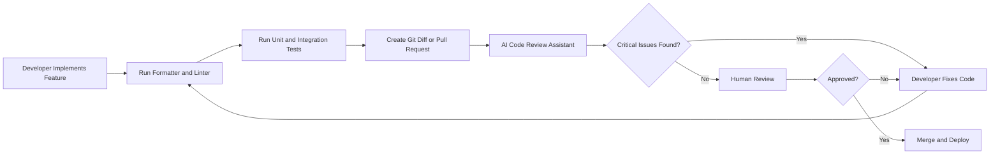
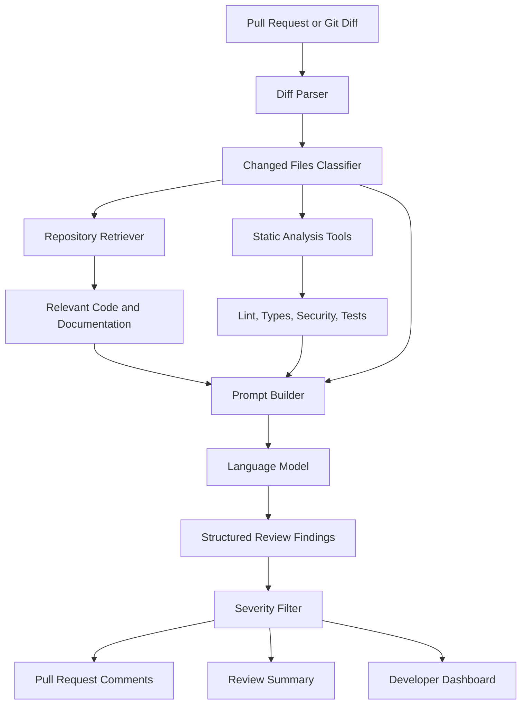
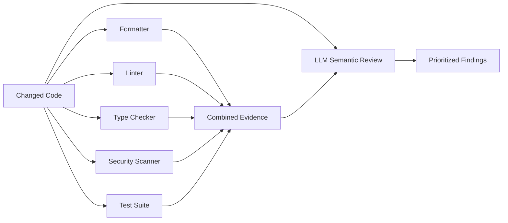
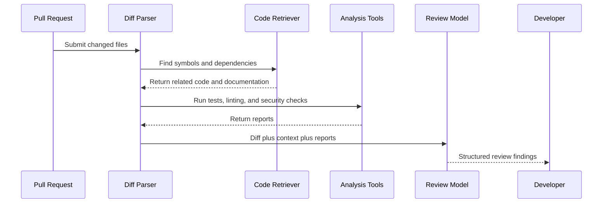
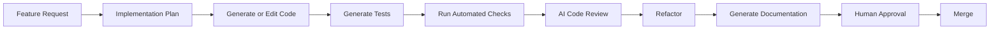

# 008 - Code Review Assistant

**Course:** 04 - Agents, Multimodal, and Tools
**Module:** Module 12 - Development Tools
**Content Group:** Tools to Know
**Roadmap Source:** Development Tools / Tools to Know
**Lesson Type:** Development Tool
**Order in Module:** 008
**Suggested Duration:** 16 minutes

---

## 1. Overview

A **Code Review Assistant** is an AI-powered tool that analyzes source code, code changes, pull requests, or Git diffs and provides structured feedback.

It can help developers:

* Detect potential bugs.
* Identify security risks.
* Find missing edge cases.
* Suggest cleaner implementations.
* Review naming and code readability.
* Check whether tests cover important behaviors.
* Generate documentation or pull request summaries.
* Enforce project-specific coding standards.

A Code Review Assistant does not replace human reviewers. Its main purpose is to perform an initial review quickly, consistently, and at scale.

The developer remains responsible for:

* Correctness.
* Security.
* Maintainability.
* Architecture decisions.
* Production impact.
* Final approval.

> A useful Code Review Assistant should not only say that code is “good” or “bad.” It should identify a specific issue, explain its impact, and recommend an actionable fix.

---

## 2. Learning Objectives

After completing this lesson, you should be able to:

* Explain what a Code Review Assistant does.
* Describe where it fits into a software development workflow.
* Distinguish between AI review, static analysis, automated testing, and human review.
* Write an effective prompt for reviewing a code change.
* Design a small AI-powered code review workflow.
* Identify the limitations and risks of automated code review.
* Build a small portfolio demo that reviews a Git diff or pull request.

---

## 3. What Is a Code Review Assistant?

A Code Review Assistant is a system that uses a language model, static analysis tools, repository context, or a combination of these techniques to review code.

Its input may include:

* A source code file.
* A Git diff.
* A pull request.
* Test results.
* Static analysis reports.
* Coding standards.
* Architecture documentation.
* Related source files.
* Previous review comments.

Its output may include:

* Review findings.
* Severity levels.
* Suggested patches.
* Missing test cases.
* Security warnings.
* Refactoring recommendations.
* A pull request summary.
* Questions for the author.

A simplified review function can be described as:

[
\text{Review} = f(\text{Code Diff}, \text{Repository Context}, \text{Requirements}, \text{Tests}, \text{Standards})
]

A model that only receives a small code snippet may produce generic feedback. A stronger system retrieves the relevant project context before generating its review.

---

## 4. Position in the Development Workflow

A Code Review Assistant usually works after code has been written but before it is merged.



The assistant should complement existing development tools rather than replace them.

A typical toolchain may include:

| Tool                  | Primary Responsibility                            |
| --------------------- | ------------------------------------------------- |
| Formatter             | Enforce code formatting                           |
| Linter                | Detect style problems and suspicious patterns     |
| Type checker          | Find type-related errors                          |
| Test framework        | Verify expected behavior                          |
| Security scanner      | Detect known vulnerabilities                      |
| Code Review Assistant | Analyze logic, intent, maintainability, and risks |
| Human reviewer        | Make contextual and architectural decisions       |

---

## 5. What Should the Assistant Review?

A useful Code Review Assistant should review several dimensions.

### 5.1 Correctness

The assistant should check whether the implementation matches the intended behavior.

Questions include:

* Does the code produce the correct result?
* Are boundary conditions handled?
* Are assumptions valid?
* Can the function return an unexpected value?
* Is error handling complete?
* Are asynchronous operations awaited correctly?

### 5.2 Security

The assistant should look for risks such as:

* SQL injection.
* Command injection.
* Path traversal.
* Hardcoded secrets.
* Missing authentication.
* Missing authorization.
* Unsafe deserialization.
* Sensitive information in logs.
* Weak input validation.
* Unrestricted file uploads.

### 5.3 Reliability

The assistant should identify conditions that may cause production failures:

* Missing timeouts.
* Missing retries.
* Infinite loops.
* Race conditions.
* Unhandled exceptions.
* Non-idempotent retry behavior.
* Partial database updates.
* Incorrect transaction handling.

### 5.4 Performance

Potential performance issues include:

* Repeated database queries.
* Loading unnecessary data.
* Blocking operations inside asynchronous code.
* Unbounded loops.
* Large prompts.
* Duplicate model calls.
* Missing caching.
* Inefficient data structures.

### 5.5 Maintainability

The assistant can evaluate:

* Function size.
* Naming quality.
* Code duplication.
* Excessive nesting.
* Hidden side effects.
* Dependency boundaries.
* Separation of concerns.
* Documentation quality.

### 5.6 Test Coverage

The assistant should not only ask whether tests exist. It should determine whether important behaviors are tested.

Examples include:

* Happy path.
* Empty input.
* Invalid input.
* Boundary values.
* Permission failure.
* External service timeout.
* Database failure.
* Retry behavior.
* Concurrent requests.

---

## 6. Review Scope

AI tools work best when the review scope is small and clearly defined.

Good review inputs include:

* One function.
* One module.
* One feature.
* One pull request.
* One Git diff.
* One bug fix.
* One API route.

Poor review inputs include:

* An entire repository without context.
* Thousands of unrelated changed lines.
* Generated files.
* Dependency lock files mixed with business logic.
* Code without requirements.
* Code without information about the expected behavior.

A practical rule is:

> Smaller diffs produce more precise, testable, and actionable reviews.

Large pull requests can be divided by:

* Feature.
* Layer.
* File type.
* Risk level.
* Dependency.
* Commit.

---

## 7. Code Review Architecture

A simple Code Review Assistant may send the code directly to a language model.

A production system usually includes more components.



### Core Components

#### 1. Diff Parser

Extracts:

* Added lines.
* Removed lines.
* Modified functions.
* Changed imports.
* Changed API contracts.

#### 2. Repository Retriever

Finds relevant context such as:

* Called functions.
* Data models.
* Interface definitions.
* Tests.
* Coding guidelines.
* Architecture documents.

#### 3. Analysis Tools

Runs deterministic checks:

* Linters.
* Type checkers.
* Test suites.
* Security scanners.
* Dependency scanners.

#### 4. Prompt Builder

Combines:

* Review instructions.
* Git diff.
* Requirements.
* Retrieved repository context.
* Tool outputs.
* Response schema.

#### 5. Language Model

Performs semantic analysis and generates findings.

#### 6. Severity Filter

Removes low-value comments and prioritizes high-impact findings.

---

## 8. Review Finding Structure

Review output should be structured and actionable.

A useful finding contains:

```json
{
  "severity": "high",
  "category": "correctness",
  "file": "services/payment.py",
  "line": 42,
  "title": "Duplicate payment may occur during retries",
  "explanation": "The endpoint retries the payment request without an idempotency key.",
  "impact": "A network timeout followed by a retry may charge the customer twice.",
  "recommendation": "Generate and persist an idempotency key before calling the payment provider.",
  "confidence": 0.91
}
```

Recommended severity levels:

| Severity   | Meaning                                                     |
| ---------- | ----------------------------------------------------------- |
| Critical   | Can cause severe security, data loss, or production failure |
| High       | Likely correctness, security, or reliability problem        |
| Medium     | Important maintainability, performance, or edge-case issue  |
| Low        | Minor improvement with limited production impact            |
| Suggestion | Optional style or readability improvement                   |

The system should avoid publishing too many low-confidence or low-impact comments.

---

## 9. Practical Demo

Consider the following Python function:

```python
def calculate_average(scores):
    total = sum(scores)
    return total / len(scores)
```

The function works for normal input:

```python
calculate_average([8, 9, 10])
```

However, it fails when the list is empty:

```python
calculate_average([])
```

The result is a `ZeroDivisionError`.

### Example AI Review

```text
Severity: Medium
Category: Correctness

The function divides by len(scores) without checking whether the list is empty.
An empty list will raise ZeroDivisionError.

Recommended fix:
- Reject empty input with a clear ValueError, or
- Return a documented default value.

A test should be added for an empty list.
```

### Improved Implementation

```python
from collections.abc import Sequence


def calculate_average(scores: Sequence[float]) -> float:
    """Return the arithmetic mean of a non-empty sequence of scores."""

    if not scores:
        raise ValueError("scores must contain at least one value")

    return sum(scores) / len(scores)
```

### Tests

```python
import pytest


def test_calculate_average_returns_mean() -> None:
    assert calculate_average([8, 9, 10]) == 9


def test_calculate_average_rejects_empty_input() -> None:
    with pytest.raises(ValueError, match="at least one"):
        calculate_average([])
```

This example demonstrates three important review outputs:

1. The exact defect.
2. The expected production impact.
3. A testable recommendation.

---

## 10. Reviewing a Git Diff

A Code Review Assistant should normally review the changed code instead of reviewing every file in the repository.

Example diff:

```diff
 def get_user(user_id):
-    return database.users.find_one({"id": user_id})
+    query = f"SELECT * FROM users WHERE id = '{user_id}'"
+    return database.execute(query)
```

A useful review should identify that the new implementation introduces SQL injection risk.

### Expected Finding

```text
Severity: Critical
Category: Security

The SQL query is created through string interpolation using user_id.
An attacker may modify the query by submitting malicious input.

Use a parameterized query instead:

database.execute(
    "SELECT * FROM users WHERE id = ?",
    [user_id],
)
```

A weak review may only say:

```text
Consider improving this query.
```

That comment is not useful because it does not explain:

* What is wrong.
* Why it matters.
* How to fix it.
* How serious the problem is.

---

## 11. Prompt Template

The following prompt can be used as a starting point.

```text
You are a senior software engineer reviewing a Git diff.

Review objectives:
1. Find correctness defects.
2. Find security vulnerabilities.
3. Identify missing edge-case handling.
4. Identify reliability and performance risks.
5. Check whether tests cover the changed behavior.
6. Avoid comments that only describe formatting or personal style.

For every finding, include:
- Severity: critical, high, medium, low, or suggestion
- Category
- File and line
- Problem
- Production impact
- Recommended fix
- Confidence from 0.0 to 1.0

Project requirements:
{{requirements}}

Project conventions:
{{coding_guidelines}}

Relevant repository context:
{{retrieved_context}}

Static analysis and test results:
{{tool_results}}

Git diff:
{{git_diff}}

Return valid JSON matching the provided schema.
Do not report an issue unless it is caused by or directly related to the diff.
```

### Why This Prompt Works

It defines:

* The reviewer role.
* The review scope.
* The review dimensions.
* The expected output.
* The project context.
* Rules for reducing noise.

---

## 12. Minimal API Demo

The following example demonstrates a small review API using Python and FastAPI.

```python
from typing import Literal

from fastapi import FastAPI
from pydantic import BaseModel, Field


app = FastAPI()


class ReviewRequest(BaseModel):
    diff: str = Field(min_length=1)
    requirements: str = ""
    language: str = "python"


class ReviewFinding(BaseModel):
    severity: Literal["critical", "high", "medium", "low", "suggestion"]
    category: str
    title: str
    explanation: str
    recommendation: str
    confidence: float = Field(ge=0, le=1)


class ReviewResponse(BaseModel):
    summary: str
    findings: list[ReviewFinding]


def build_review_prompt(request: ReviewRequest) -> str:
    return f"""
You are a senior software engineer.

Review the following {request.language} Git diff.

Requirements:
{request.requirements or "No additional requirements were supplied."}

Focus on:
- correctness
- security
- reliability
- performance
- missing tests

Git diff:
{request.diff}
""".strip()


@app.post("/reviews", response_model=ReviewResponse)
async def review_code(request: ReviewRequest) -> ReviewResponse:
    prompt = build_review_prompt(request)

    # Replace this mock result with a real model provider call.
    _ = prompt

    return ReviewResponse(
        summary="The diff was reviewed for correctness and production risks.",
        findings=[
            ReviewFinding(
                severity="medium",
                category="correctness",
                title="Empty input is not handled",
                explanation=(
                    "The modified function divides by the number of elements "
                    "without checking whether the collection is empty."
                ),
                recommendation=(
                    "Validate that the collection is non-empty and add an "
                    "edge-case unit test."
                ),
                confidence=0.94,
            )
        ],
    )
```

### Example Request

```json
{
  "language": "python",
  "requirements": "The function must reject an empty list with ValueError.",
  "diff": "- return sum(values) / max(len(values), 1)\n+ return sum(values) / len(values)"
}
```

### Example Response

```json
{
  "summary": "The change introduces an unhandled empty-input case.",
  "findings": [
    {
      "severity": "medium",
      "category": "correctness",
      "title": "Empty input is not handled",
      "explanation": "The function divides by zero when values is empty.",
      "recommendation": "Raise ValueError for empty input and add a unit test.",
      "confidence": 0.94
    }
  ]
}
```

---

## 13. Combining LLM Review with Deterministic Tools

A language model should not perform every type of analysis by itself.

Use deterministic tools for problems they can detect reliably.



For example:

* Use a linter for unused imports.
* Use a type checker for incompatible types.
* Use a security scanner for known dangerous functions.
* Use tests for behavioral verification.
* Use an LLM for intent, business logic, missing cases, and maintainability.

This hybrid approach is usually more reliable than asking a model to perform every check from raw code.

---

## 14. Repository-Aware Review with Retrieval

A review may require information outside the changed file.

Suppose a pull request changes this function:

```python
async def create_order(user_id: str, items: list[Item]) -> Order:
    return await repository.insert_order(user_id, items)
```

The reviewer may need to retrieve:

* The `Order` data model.
* The repository implementation.
* Inventory reservation logic.
* Transaction rules.
* Existing tests.
* API documentation.

A retrieval workflow can be represented as:



Retrieval improves the review because the model can compare the implementation against actual repository behavior instead of relying on generic assumptions.

---

## 15. Agent-Based Review Workflow

A more advanced Code Review Assistant may operate as an agent with several tools.

Possible tools include:

* `read_file`
* `search_symbol`
* `get_git_diff`
* `run_tests`
* `run_linter`
* `run_type_checker`
* `run_security_scan`
* `find_related_tests`
* `post_review_comment`

Example workflow:

```text
1. Read the pull request description.
2. Parse the Git diff.
3. Identify changed functions and interfaces.
4. Search for callers and related tests.
5. Run relevant static analysis tools.
6. Run targeted tests.
7. Analyze the evidence.
8. Generate high-confidence findings.
9. Ask for human approval before publishing comments.
```

A human approval step is especially important when the assistant can write comments directly to a pull request.

---

## 16. Production Safety Controls

A production Code Review Assistant should include several safeguards.

### 16.1 Read-Only by Default

The assistant should not automatically:

* Modify source code.
* Merge a pull request.
* Approve a deployment.
* Execute arbitrary repository commands.
* Publish comments without review.

### 16.2 Tool Allowlist

Only expose approved commands, such as:

```text
pytest tests/services/test_orders.py
ruff check src/services/orders.py
mypy src/services/orders.py
```

Avoid passing model-generated strings directly into a shell.

### 16.3 Secret Protection

Before sending code to an external model:

* Detect possible API keys.
* Remove credentials.
* Redact customer data.
* Exclude sensitive configuration files.
* Follow the organization's data policy.

### 16.4 Confidence Threshold

Low-confidence findings may be shown in a private report rather than posted as pull request comments.

Example policy:

```text
confidence >= 0.85:
    allow pull request comment

0.60 <= confidence < 0.85:
    include in review summary only

confidence < 0.60:
    suppress finding
```

### 16.5 Diff-Only Rule

The assistant should avoid reporting unrelated legacy issues unless the user explicitly requests a full repository audit.

---

## 17. Common Failure Modes

### 17.1 Generic Feedback

Bad output:

```text
This code could be cleaner.
```

Better output:

```text
The request validation, database operation, and response mapping are all
implemented in the route handler. Extracting the database operation into a
service would make transaction handling and unit testing easier.
```

### 17.2 Hallucinated APIs

The assistant may recommend a method or library feature that does not exist.

Mitigation:

* Retrieve the exact dependency version.
* Provide library documentation as context.
* Verify suggested methods before publishing them.

### 17.3 Excessive Style Comments

Too many minor comments reduce developer trust.

Mitigation:

* Let formatters and linters handle style.
* Focus the model on behavior and risk.
* Limit the number of comments.
* Rank findings by impact.

### 17.4 Missing Repository Context

The assistant may report a false issue because validation happens in another layer.

Mitigation:

* Retrieve callers, middleware, schemas, and related tests.
* Let the assistant state uncertainty.
* Require evidence for each finding.

### 17.5 Reviewing Too Much Code

Large diffs can exceed the context window or reduce attention quality.

Mitigation:

* Split the diff by file or component.
* Summarize low-risk files.
* Review security-sensitive code first.
* Merge and deduplicate findings afterward.

### 17.6 Treating Tests as Proof of Correctness

Passing tests do not guarantee that the implementation is correct.

Tests may:

* Miss edge cases.
* Assert incorrect behavior.
* Mock too much.
* Ignore concurrency.
* Ignore authorization.
* Ignore external service failures.

---

## 18. Production Bug Example

Consider an API route that calls an external payment provider:

```python
@app.post("/payments")
async def create_payment(request: PaymentRequest):
    result = await payment_provider.charge(
        amount=request.amount,
        customer_id=request.customer_id,
    )

    return {"payment_id": result.id}
```

The happy path may work correctly, but several production risks exist:

* No timeout.
* No idempotency key.
* No retry policy.
* No error mapping.
* No structured logging.
* No validation that the amount is positive.
* No protection against duplicate requests.

A Code Review Assistant should prioritize these issues based on production impact.

### Example Review

```text
Severity: High
Category: Reliability

The payment request does not include an idempotency key. If the client retries
after a timeout, the customer may be charged more than once.

Recommended fix:
1. Generate or accept a stable idempotency key.
2. Persist it before contacting the provider.
3. Pass it to the provider.
4. Return the original payment result for repeated requests.
5. Add a test that sends the same request twice.
```

### Debugging Approach

When investigating duplicate payments:

1. Search logs using the request ID.
2. Compare provider transaction IDs.
3. Check whether the client retried the request.
4. Inspect timeout and retry configuration.
5. Verify whether the idempotency key was reused.
6. Reproduce the behavior with a simulated timeout.
7. Add a regression test.

---

## 19. Evaluation Metrics

A Code Review Assistant should be evaluated instead of being trusted automatically.

Useful metrics include:

| Metric                 | Description                                           |
| ---------------------- | ----------------------------------------------------- |
| Precision              | Percentage of reported findings that are valid        |
| Recall                 | Percentage of real defects that the assistant detects |
| False-positive rate    | Percentage of findings that are incorrect             |
| Acceptance rate        | Percentage of suggestions accepted by developers      |
| Critical-defect recall | Ability to detect high-impact problems                |
| Review latency         | Time needed to generate a review                      |
| Cost per review        | Model and infrastructure cost                         |
| Comment usefulness     | Human rating of actionability                         |
| Duplicate rate         | Percentage of repeated findings                       |
| Suppression rate       | Percentage of findings removed by filters             |

A practical evaluation dataset should contain:

* Correct code.
* Known bugs.
* Security defects.
* Missing validation.
* Concurrency issues.
* Performance regressions.
* Misleading code that should not be flagged.
* Project-specific conventions.

---

## 20. Practical Exercise

Build a small Code Review Assistant that accepts a Git diff.

### Minimum Requirements

Your demo should:

1. Accept a Git diff as input.
2. Accept a short feature requirement.
3. Generate a structured review.
4. Classify findings by severity.
5. Include an explanation and suggested fix.
6. Return JSON.
7. Include at least three test cases.

### Suggested Test Cases

#### Test 1: Empty Input

```python
def average(values):
    return sum(values) / len(values)
```

Expected finding:

* Empty input causes division by zero.

#### Test 2: SQL Injection

```python
query = f"SELECT * FROM users WHERE email = '{email}'"
```

Expected finding:

* User-controlled input is inserted into SQL.

#### Test 3: Missing Authorization

```python
@app.delete("/users/{user_id}")
async def delete_user(user_id: str):
    await repository.delete(user_id)
```

Expected finding:

* The route does not verify whether the caller can delete the user.

### Optional Extensions

* Read a local Git diff.
* Retrieve related source files.
* Run tests automatically.
* Add a pull request summary.
* Generate suggested patches.
* Store review history.
* Build a small review dashboard.
* Add a human approval step before publishing comments.

---

## 21. Reflection Questions

After building the demo, answer the following questions:

1. Which defects can deterministic tools detect better than an LLM?
2. What repository context improved the review?
3. Which findings were false positives?
4. How did you prevent the model from generating too many comments?
5. What information should never be sent to an external model?
6. Should the assistant be allowed to modify code automatically?
7. How would you evaluate the system before using it in production?

---

## 22. Common Learning Mistakes

### Memorizing the Definition Without Building Anything

Knowing what a Code Review Assistant is does not demonstrate practical skill.

Build a small system that reviews a real diff.

### Testing Only the Happy Path

A review tool should be tested with:

* Empty diffs.
* Very large diffs.
* Invalid syntax.
* Generated files.
* Security-sensitive code.
* Missing requirements.
* Conflicting context.
* Model timeout.
* Invalid model output.

### Ignoring False Positives

A tool that reports too many incorrect findings will quickly be ignored.

Measure precision and developer acceptance.

### Trusting Suggested Code Without Verification

Suggested patches may:

* Fail to compile.
* Break existing behavior.
* Use unsupported APIs.
* Introduce new security issues.
* Violate architecture rules.

Every suggested change should be reviewed and tested.

### Failing to Record Assumptions

The assistant should clearly state assumptions such as:

```text
Assumption: Authentication middleware verifies that the request contains a
valid user identity.

Open question: Does the route also require resource-level authorization?
```

---

## 23. Completion Checklist

* [ ] I can explain a Code Review Assistant in one or two minutes.
* [ ] I understand where it fits in the development workflow.
* [ ] I can distinguish AI review from linting, testing, and static analysis.
* [ ] I can write a structured code review prompt.
* [ ] I can review a small Git diff.
* [ ] I can classify findings by severity.
* [ ] I can explain at least one production risk.
* [ ] I have built a small demo or portfolio artifact.
* [ ] I have tested both valid and invalid code changes.
* [ ] I understand the risks of false positives and hallucinated fixes.
* [ ] I know that humans remain responsible for the final review decision.

---

## 24. Related Outcome

Use AI coding tools responsibly to:

* Implement features.
* Generate tests.
* Review code changes.
* Refactor code.
* Detect risks.
* Generate documentation.
* Improve development workflows.

---

## 25. Related Project

### Project 11: AI Coding Workflow

Build an AI-assisted development workflow that:

1. Receives a feature request.
2. Creates an implementation plan.
3. Implements a small feature.
4. Generates tests.
5. Runs automated checks.
6. Reviews the Git diff.
7. Suggests improvements.
8. Refactors the implementation.
9. Generates technical documentation.
10. Requires human approval before merge.



### Suggested Portfolio Artifacts

Include:

* Architecture diagram.
* Prompt template.
* Example Git diff.
* Structured review output.
* Test results.
* False-positive analysis.
* Security notes.
* Cost and latency measurements.
* Screenshots or API examples.
* A short explanation of human approval controls.

---

## 26. Five-Line Summary

1. A Code Review Assistant analyzes code changes and generates structured feedback.
2. It can detect bugs, security risks, missing tests, and maintainability problems.
3. It works best with small diffs, clear requirements, repository context, and tool results.
4. AI review should complement formatters, linters, type checkers, tests, and human reviewers.
5. Developers remain responsible for correctness, security, and final approval.

---

## 27. Conclusion

A **Code Review Assistant** is an important development tool for modern AI Engineers and software teams.

Its value is not simply that it can read code. Its value comes from combining:

* Focused Git diffs.
* Clear requirements.
* Repository retrieval.
* Static analysis.
* Test results.
* Structured prompts.
* Severity classification.
* Human approval.

The best Code Review Assistants reduce repetitive review work while helping developers focus on architecture, product behavior, and high-risk decisions.

To make this topic practical, turn it into a small artifact such as:

* A Git diff review prompt.
* A review API endpoint.
* A repository-aware RAG workflow.
* A pull request review agent.
* A review dashboard.
* A security-focused review pipeline.
* A complete AI-assisted coding workflow.
