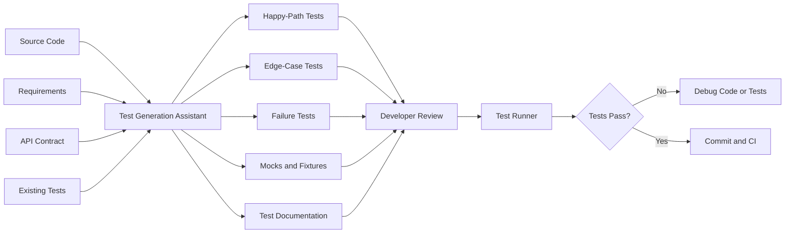
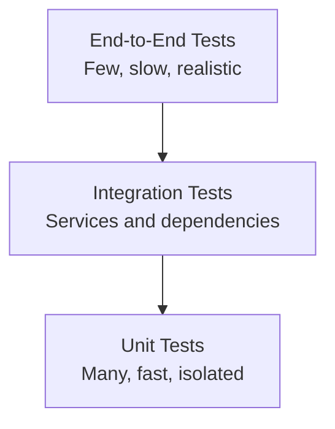
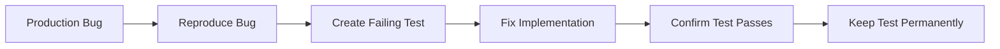
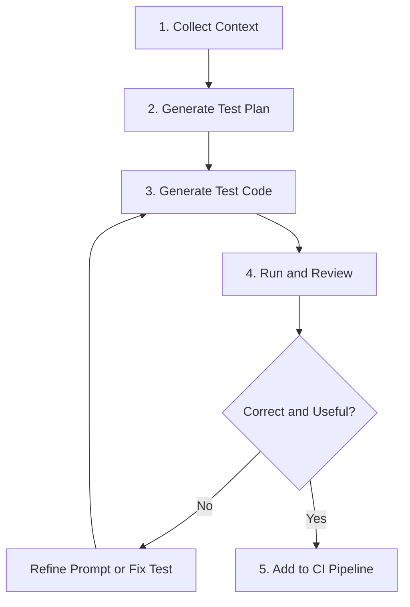
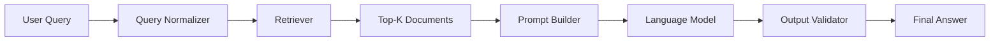
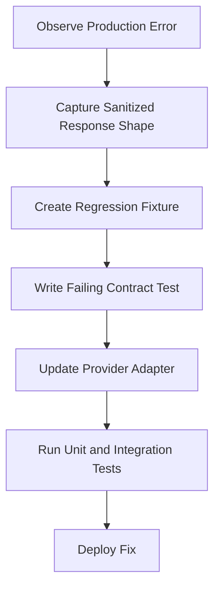
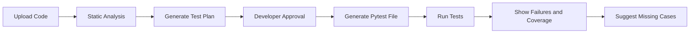

# 009 — Test Generation Assistant

**Course:** 04 — Agents, Multimodal, and Tools
**Module:** Module 12 — Development Tools
**Content Group:** Tools to Know
**Roadmap Source:** Development Tools / Tools to Know
**Lesson Type:** Development Tool
**Order in Module:** 009
**Suggested Duration:** 16 minutes

---

## 1. Overview

A **Test Generation Assistant** is an AI-powered development tool that helps developers create, improve, and review software tests.

It can analyze source code, API specifications, requirements, bug reports, or existing tests and then suggest:

* Unit tests
* Integration tests
* API tests
* Edge cases
* Error-handling tests
* Mock objects and fixtures
* Regression tests
* Property-based tests
* Test documentation

The assistant does not replace a developer or quality assurance engineer. Its purpose is to accelerate test design, expose missing cases, and reduce repetitive work.

For AI Engineers, test generation is especially useful because AI applications often contain several layers:

* Prompt construction
* Model API calls
* Retrieval pipelines
* Tool execution
* Structured output parsing
* Streaming responses
* Caching
* Safety filters
* Fallback logic

Each layer can fail differently and should be tested independently.

---

## 2. Learning Objectives

After completing this lesson, you should be able to:

* Explain what a Test Generation Assistant does.
* Identify where test generation belongs in a modern development workflow.
* Provide sufficient context for an AI assistant to generate useful tests.
* Distinguish between unit, integration, contract, and end-to-end tests.
* Review AI-generated tests for correctness and maintainability.
* Use generated tests as part of an AI application development workflow.
* Build a small test-generation demo for your portfolio.

---

## 3. Core Concept

A Test Generation Assistant converts development context into candidate test cases.



The quality of the generated tests depends heavily on the quality of the supplied context.

A vague request such as:

```text
Write tests for this function.
```

usually produces generic tests.

A better request explains:

* The expected behavior
* Input constraints
* Error conditions
* External dependencies
* Test framework
* Mocking strategy
* Known bugs
* Required coverage

---

## 4. Why Test Generation Matters

Writing tests manually can be repetitive, especially when a feature has many input combinations.

A Test Generation Assistant can improve productivity in several ways.

### 4.1 Faster Initial Coverage

The assistant can quickly generate a first set of tests for a new function, class, or API route.

### 4.2 Edge-Case Discovery

It can suggest cases developers may overlook, such as:

* Empty strings
* Missing fields
* Invalid types
* Boundary values
* Timeouts
* Duplicate requests
* Malformed model output
* Network failures
* Unauthorized access

### 4.3 Regression Protection

When a bug is discovered, the assistant can convert the bug report into a regression test.

### 4.4 Framework Translation

It can rewrite tests between frameworks, for example:

* `unittest` to `pytest`
* Jest to Vitest
* Java JUnit 4 to JUnit 5
* Synchronous tests to asynchronous tests

### 4.5 Test Documentation

The assistant can explain:

* What each test verifies
* Why a mock is required
* Which production failure the test prevents
* Which behavior remains untested

---

## 5. Types of Tests

A good Test Generation Assistant should understand the testing pyramid.



### 5.1 Unit Tests

Unit tests verify a small unit of behavior in isolation.

Examples:

* A parser returns the correct object.
* A validation function rejects invalid input.
* A prompt builder inserts the correct variables.
* A ranking function sorts documents correctly.

Unit tests should normally be:

* Fast
* Deterministic
* Independent
* Easy to understand

### 5.2 Integration Tests

Integration tests verify that multiple components work together.

Examples:

* An API route calls a service correctly.
* A retrieval pipeline connects to a vector database.
* A repository writes data to a test database.
* A model adapter correctly parses provider responses.

### 5.3 Contract Tests

Contract tests verify that a component respects an expected interface.

Examples:

* A model provider returns a normalized response schema.
* A tool returns the documented JSON structure.
* An endpoint preserves its response envelope.
* A streaming event contains required fields.

### 5.4 End-to-End Tests

End-to-end tests verify a complete user workflow.

Example:

```text
User submits a document
→ system creates embeddings
→ retrieval finds relevant passages
→ model generates an answer
→ UI displays the result
```

These tests are realistic but usually slower and more expensive.

### 5.5 Regression Tests

A regression test reproduces a previously observed bug.

A good workflow is:



---

## 6. What Makes a Good AI-Generated Test?

A useful test should verify meaningful behavior rather than merely execute code.

### Weak Test

```python
def test_calculate_score_runs():
    calculate_score(10, 20)
```

This test has no assertion. It only verifies that the function does not crash.

### Better Test

```python
def test_calculate_score_returns_weighted_total():
    result = calculate_score(10, 20)

    assert result == 16
```

### Stronger Test Suite

```python
import pytest


@pytest.mark.parametrize(
    ("quality", "relevance", "expected"),
    [
        (10, 20, 16),
        (0, 0, 0),
        (100, 100, 100),
    ],
)
def test_calculate_score_returns_weighted_total(
    quality: float,
    relevance: float,
    expected: float,
):
    result = calculate_score(quality, relevance)

    assert result == expected


def test_calculate_score_rejects_negative_quality():
    with pytest.raises(ValueError, match="quality"):
        calculate_score(-1, 20)
```

The stronger suite checks:

* Normal behavior
* Zero values
* Boundary values
* Invalid input
* Expected exceptions

---

## 7. Test Generation Workflow

A reliable workflow contains five stages.



### Stage 1: Collect Context

Provide:

* Source code
* Function signature
* Requirements
* Expected outputs
* Known edge cases
* External dependencies
* Existing test conventions

### Stage 2: Generate a Test Plan

Before asking for code, ask the assistant to identify test cases.

Example:

```text
Analyze this function and create a test plan.

Group the cases into:
1. Happy path
2. Boundary conditions
3. Invalid inputs
4. Dependency failures
5. Security-related cases

Do not write the test code yet.
```

This makes it easier to review the assistant's reasoning at a high level.

### Stage 3: Generate Test Code

After approving the test plan, ask for executable tests.

### Stage 4: Run and Review

Generated tests must be executed.

Check whether they:

* Import the correct modules
* Match the real API
* Contain meaningful assertions
* Fail when the implementation is broken
* Avoid unnecessary mocking
* Follow project conventions

### Stage 5: Add Tests to Continuous Integration

Once reviewed, run the tests automatically in the continuous integration pipeline.

---

## 8. Practical Demo: Generating Tests for an AI Response Parser

Consider a parser that converts model output into a normalized answer.

### 8.1 Implementation

```python
from typing import Any


class ModelOutputError(ValueError):
    """Raised when the model output cannot be normalized."""


def parse_model_output(payload: dict[str, Any]) -> dict[str, Any]:
    """Normalize a model response.

    Expected input:
    {
        "answer": "Paris",
        "confidence": 0.95,
        "sources": ["document-1"]
    }
    """

    answer = payload.get("answer")
    confidence = payload.get("confidence", 0.0)
    sources = payload.get("sources", [])

    if not isinstance(answer, str) or not answer.strip():
        raise ModelOutputError("answer must be a non-empty string")

    if not isinstance(confidence, (int, float)):
        raise ModelOutputError("confidence must be numeric")

    if not 0 <= confidence <= 1:
        raise ModelOutputError("confidence must be between 0 and 1")

    if not isinstance(sources, list):
        raise ModelOutputError("sources must be a list")

    normalized_sources = [
        source.strip()
        for source in sources
        if isinstance(source, str) and source.strip()
    ]

    return {
        "answer": answer.strip(),
        "confidence": float(confidence),
        "sources": normalized_sources,
    }
```

---

### 8.2 Test Plan

A Test Generation Assistant should identify cases such as:

| Category         | Test case                             | Expected result              |
| ---------------- | ------------------------------------- | ---------------------------- |
| Happy path       | Valid answer, confidence, and sources | Normalized dictionary        |
| Default behavior | Confidence is missing                 | Confidence becomes `0.0`     |
| Default behavior | Sources are missing                   | Sources become an empty list |
| Normalization    | Answer contains whitespace            | Whitespace is removed        |
| Normalization    | Sources contain empty values          | Empty values are removed     |
| Invalid input    | Answer is missing                     | Raise `ModelOutputError`     |
| Invalid input    | Answer is empty                       | Raise `ModelOutputError`     |
| Invalid input    | Confidence is a string                | Raise `ModelOutputError`     |
| Boundary         | Confidence equals `0`                 | Accepted                     |
| Boundary         | Confidence equals `1`                 | Accepted                     |
| Invalid input    | Confidence is below `0`               | Raise `ModelOutputError`     |
| Invalid input    | Confidence is above `1`               | Raise `ModelOutputError`     |
| Invalid input    | Sources is not a list                 | Raise `ModelOutputError`     |

---

### 8.3 Generated Pytest Suite

```python
import pytest

from app.parser import ModelOutputError, parse_model_output


def test_parse_model_output_returns_normalized_result():
    payload = {
        "answer": "  Paris  ",
        "confidence": 0.95,
        "sources": [" document-1 ", "document-2"],
    }

    result = parse_model_output(payload)

    assert result == {
        "answer": "Paris",
        "confidence": 0.95,
        "sources": ["document-1", "document-2"],
    }


def test_parse_model_output_uses_default_values():
    result = parse_model_output({"answer": "Paris"})

    assert result == {
        "answer": "Paris",
        "confidence": 0.0,
        "sources": [],
    }


def test_parse_model_output_removes_invalid_sources():
    payload = {
        "answer": "Paris",
        "sources": ["document-1", "", "   ", None, 123],
    }

    result = parse_model_output(payload)

    assert result["sources"] == ["document-1"]


@pytest.mark.parametrize(
    "payload",
    [
        {},
        {"answer": ""},
        {"answer": "   "},
        {"answer": None},
        {"answer": 123},
    ],
)
def test_parse_model_output_rejects_invalid_answers(payload):
    with pytest.raises(
        ModelOutputError,
        match="answer must be a non-empty string",
    ):
        parse_model_output(payload)


@pytest.mark.parametrize(
    "confidence",
    [-0.01, 1.01, -100, 100],
)
def test_parse_model_output_rejects_out_of_range_confidence(confidence):
    payload = {
        "answer": "Paris",
        "confidence": confidence,
    }

    with pytest.raises(
        ModelOutputError,
        match="confidence must be between 0 and 1",
    ):
        parse_model_output(payload)


@pytest.mark.parametrize("confidence", [0, 1, 0.5])
def test_parse_model_output_accepts_valid_confidence_boundaries(confidence):
    payload = {
        "answer": "Paris",
        "confidence": confidence,
    }

    result = parse_model_output(payload)

    assert result["confidence"] == float(confidence)


@pytest.mark.parametrize(
    "confidence",
    ["0.5", None, [], {}],
)
def test_parse_model_output_rejects_non_numeric_confidence(confidence):
    payload = {
        "answer": "Paris",
        "confidence": confidence,
    }

    with pytest.raises(
        ModelOutputError,
        match="confidence must be numeric",
    ):
        parse_model_output(payload)


@pytest.mark.parametrize(
    "sources",
    ["document-1", None, {}, 123],
)
def test_parse_model_output_rejects_non_list_sources(sources):
    payload = {
        "answer": "Paris",
        "sources": sources,
    }

    with pytest.raises(
        ModelOutputError,
        match="sources must be a list",
    ):
        parse_model_output(payload)
```

Run the tests with:

```bash
pytest tests/test_parser.py -v
```

Run them with coverage:

```bash
pytest --cov=app --cov-report=term-missing
```

---

## 9. Prompt Template for Test Generation

Use the following reusable prompt.

```text
You are a senior software test engineer.

Analyze the provided implementation and generate tests using pytest.

Context:
- Language: Python 3.12
- Test framework: pytest
- The tests must be deterministic.
- External services must not be called.
- Use mocks only at real dependency boundaries.
- Follow Arrange–Act–Assert.
- Prefer parameterized tests when several cases share the same structure.
- Include descriptive test names.
- Verify behavior, not private implementation details.

Generate tests for:
1. Normal behavior
2. Boundary values
3. Invalid inputs
4. Exceptions
5. Dependency failures
6. Previously reported regressions

Before writing code:
- List the assumptions you are making.
- Create a test-case table.
- Identify any behavior that cannot be inferred from the code.

Implementation:
<PASTE CODE HERE>

Requirements:
<PASTE REQUIREMENTS HERE>

Existing test conventions:
<PASTE EXAMPLE TEST HERE>
```

This prompt is stronger than simply asking the assistant to “write tests” because it defines:

* The role
* The framework
* The constraints
* The test categories
* The output process
* The available context

---

## 10. Testing AI Applications

AI systems introduce special testing challenges.

### 10.1 Avoid Testing Exact Natural-Language Output

This test is fragile:

```python
assert response == "The capital of France is Paris."
```

A model may produce:

```text
Paris is the capital of France.
```

The meaning is correct, but the exact text is different.

A better approach is to test structured or semantic properties.

```python
assert result["country"] == "France"
assert result["capital"] == "Paris"
```

### 10.2 Mock Model Calls in Unit Tests

Unit tests should not call a paid external model API.

```python
from unittest.mock import Mock


def test_answer_service_uses_model_response():
    model = Mock()
    model.generate.return_value = {
        "answer": "Paris",
        "confidence": 0.98,
    }

    service = AnswerService(model=model)

    result = service.answer("What is the capital of France?")

    assert result["answer"] == "Paris"
    model.generate.assert_called_once()
```

### 10.3 Test Provider Failures

AI applications must handle:

* Timeouts
* Rate limits
* Invalid API keys
* Empty responses
* Malformed JSON
* Context-length errors
* Content filtering
* Provider outages

```python
def test_answer_service_returns_fallback_on_timeout():
    model = Mock()
    model.generate.side_effect = TimeoutError("provider timeout")

    service = AnswerService(model=model)

    result = service.answer("Explain vector databases.")

    assert result["status"] == "fallback"
    assert result["retryable"] is True
```

### 10.4 Test Prompt Construction Separately

Prompt builders should be deterministic.

```python
def test_build_prompt_contains_question_and_context():
    prompt = build_prompt(
        question="What is RAG?",
        context=["RAG combines retrieval with generation."],
    )

    assert "What is RAG?" in prompt
    assert "RAG combines retrieval with generation." in prompt
```

### 10.5 Test Structured Output Validation

Do not assume the model always returns valid JSON.

```python
def test_parse_response_rejects_missing_required_field():
    raw_response = '{"confidence": 0.8}'

    with pytest.raises(ResponseValidationError):
        parse_response(raw_response)
```

---

## 11. Testing a Retrieval-Augmented Generation Pipeline

A retrieval-augmented generation pipeline can be separated into testable components.



Tests can be created at each boundary.

| Component        | Example test                           |
| ---------------- | -------------------------------------- |
| Query normalizer | Removes unnecessary whitespace         |
| Retriever        | Returns documents ordered by score     |
| Filtering        | Excludes documents below the threshold |
| Prompt builder   | Includes retrieved context             |
| Model adapter    | Normalizes provider output             |
| Validator        | Rejects malformed structured output    |
| Citation mapper  | Maps citations to valid documents      |
| Fallback logic   | Runs when no documents are found       |

A Test Generation Assistant should not generate only one end-to-end test for the entire pipeline. Smaller component tests make failures easier to diagnose.

---

## 12. Testing Agent Tools

AI agents often call external tools.

Suppose an agent can call:

```python
def get_weather(city: str) -> dict:
    ...
```

Tests should verify:

* Valid tool input
* Missing required arguments
* Invalid argument types
* Tool timeout
* Tool exception
* Unexpected response schema
* Unauthorized tool use
* Maximum retry behavior

```python
def test_agent_calls_weather_tool_with_city():
    weather_tool = Mock()
    weather_tool.return_value = {
        "temperature": 28,
        "condition": "sunny",
    }

    agent = WeatherAgent(weather_tool=weather_tool)

    result = agent.run("What is the weather in Hanoi?")

    weather_tool.assert_called_once_with(city="Hanoi")
    assert result["condition"] == "sunny"
```

For security-sensitive tools, also test authorization.

```python
def test_agent_rejects_admin_tool_for_regular_user():
    agent = AdminAgent(user_role="user")

    with pytest.raises(PermissionError):
        agent.run_tool("delete_database")
```

---

## 13. Human Review Checklist

Never merge generated tests without reviewing them.

### Correctness

* Does the test verify an actual requirement?
* Is the expected result correct?
* Does the test fail when the implementation is intentionally broken?
* Are exceptions and boundary conditions handled correctly?

### Isolation

* Does the test depend on the network?
* Does it depend on execution order?
* Does it modify shared global state?
* Are temporary files and database records cleaned up?

### Maintainability

* Is the test name descriptive?
* Is the setup easy to understand?
* Is the test over-mocked?
* Does it test public behavior instead of private implementation details?
* Can repeated setup be converted into a fixture?

### AI-Specific Review

* Is the test expecting exact model wording?
* Is a real model being called unnecessarily?
* Are model responses validated?
* Are provider errors tested?
* Are safety and permission boundaries included?

---

## 14. Common Mistakes

### 14.1 Generating Tests Without Requirements

The assistant may infer incorrect behavior when requirements are missing.

**Improvement:** Provide both the implementation and expected behavior.

---

### 14.2 Accepting Tests That Always Pass

Example:

```python
def test_feature():
    assert True
```

This provides no protection.

**Improvement:** Verify observable behavior with meaningful assertions.

---

### 14.3 Testing Implementation Details

Fragile test:

```python
assert service._internal_cache == {}
```

The internal structure may change without changing external behavior.

**Improvement:**

```python
assert service.get_cached_result("missing-key") is None
```

---

### 14.4 Excessive Mocking

If every internal function is mocked, the test may only verify that mocks were called.

**Improvement:** Mock external boundaries such as:

* HTTP services
* Databases
* File systems
* Model providers
* Message brokers
* Time and randomness

Use real internal business logic where possible.

---

### 14.5 Confusing Coverage With Quality

A project may have high line coverage but weak assertions.

```python
service.process(request)
```

This line may increase coverage without verifying correctness.

**Improvement:** Combine coverage reports with:

* Assertion quality
* Mutation testing
* Regression tests
* Requirement traceability

---

### 14.6 Calling Real Model APIs in Every Test

This creates:

* Unstable tests
* Higher cost
* Slow execution
* Rate-limit failures
* Non-deterministic results

**Improvement:** Use mocked model responses for normal tests and maintain a small, separate evaluation suite for real-model behavior.

---

### 14.7 Trusting Generated Imports and APIs

The assistant may invent:

* Package names
* Function signatures
* Fixture names
* Configuration options

**Improvement:** Run the tests immediately and compare them with the real codebase.

---

## 15. Production Failure Example

### Scenario

A model provider changes its response format.

Previously:

```json
{
  "answer": "Paris",
  "confidence": 0.92
}
```

New response:

```json
{
  "output": {
    "text": "Paris"
  },
  "metadata": {
    "confidence": 0.92
  }
}
```

The application expects `response["answer"]` and crashes with a `KeyError`.

### Debugging Process



### Regression Test

```python
def test_provider_adapter_supports_nested_response_format():
    provider_response = {
        "output": {
            "text": "Paris",
        },
        "metadata": {
            "confidence": 0.92,
        },
    }

    result = normalize_provider_response(provider_response)

    assert result == {
        "answer": "Paris",
        "confidence": 0.92,
    }
```

The test remains in the project to prevent the same bug from returning.

---

## 16. Limitations

A Test Generation Assistant cannot automatically determine every correct behavior.

Important limitations include:

### Missing Business Context

The source code may not reveal the real business rule.

For example, the assistant cannot know whether an empty search query should:

* Return no results
* Return popular results
* Raise an error
* Ask for clarification

### False Confidence

Generated tests may look professional while verifying incorrect assumptions.

### Weak Assertions

The assistant may create tests that only check types, status codes, or non-null values.

### Hallucinated Interfaces

It may invent functions, fixtures, or library features that do not exist.

### Security Gaps

Generated tests may omit:

* Authorization checks
* Prompt injection scenarios
* Sensitive-data exposure
* Path traversal
* SQL injection
* Tool permission boundaries

### Maintenance Cost

Large volumes of duplicated generated tests can make a test suite harder to maintain.

The developer remains responsible for:

* Correctness
* Security
* Test strategy
* Code quality
* Maintenance
* Final approval

---

## 17. Best Practices

1. Generate a test plan before generating test code.
2. Provide requirements, not only source code.
3. Start with a small function or module.
4. Specify the testing framework and project conventions.
5. Ask the assistant to list assumptions.
6. Prefer deterministic tests.
7. Mock only external dependency boundaries.
8. Test failures and edge cases, not only the happy path.
9. Convert every important production bug into a regression test.
10. Run all generated tests immediately.
11. Intentionally break the implementation to confirm that tests fail.
12. Keep real-model evaluations separate from normal unit tests.
13. Review generated tests before merging them.
14. Use continuous integration to run the approved test suite automatically.

---

## 18. Practice Exercise

### Task

Create a small `DocumentSearchService` with this interface:

```python
class DocumentSearchService:
    def search(self, query: str, limit: int = 5) -> list[dict]:
        ...
```

The method should:

* Reject an empty query.
* Reject a limit below `1`.
* Reject a limit above `20`.
* Normalize surrounding whitespace.
* Call a repository to retrieve documents.
* Return at most `limit` documents.
* Return an empty list when no document matches.
* Convert repository timeouts into `SearchUnavailableError`.

### Your Work

1. Ask a Test Generation Assistant to create a test plan.
2. Review and correct its assumptions.
3. Generate the pytest implementation.
4. Create fixtures for the repository.
5. Mock the repository timeout.
6. Intentionally introduce a bug.
7. Confirm that at least one test fails.
8. Fix the bug and rerun the suite.

### Production Risk to Document

Write a short note explaining how the service should behave when:

* The repository is slow
* The repository returns malformed documents
* The query contains sensitive information
* The result set is extremely large

---

## 19. Portfolio Demo

Build a small **AI Test Generation Workflow**.

### Suggested Input

* A Python module
* A short requirement document
* Existing test conventions

### Suggested Process



### Suggested Output

Your demo should display:

* Generated assumptions
* Test-case categories
* Generated test code
* Test execution result
* Coverage report
* Missing edge cases
* Known limitations

### Optional Extensions

* Add mutation testing.
* Generate regression tests from bug reports.
* Support multiple testing frameworks.
* Compare tests generated by different models.
* Add a review agent that critiques generated tests.
* Generate API tests from an OpenAPI specification.

---

## 20. Completion Checklist

* [ ] I can explain a Test Generation Assistant in one or two minutes.
* [ ] I understand the difference between unit, integration, contract, and end-to-end tests.
* [ ] I can provide sufficient context for test generation.
* [ ] I can create a test plan before requesting code.
* [ ] I can review generated tests for incorrect assumptions.
* [ ] I can identify weak or meaningless assertions.
* [ ] I know when to mock model providers and external services.
* [ ] I can test malformed model output and provider failures.
* [ ] I have built a small test-generation demo.
* [ ] I have documented at least one limitation or unresolved question.

---

## 21. Related Outcome

Use AI coding tools responsibly to:

* Implement features
* Generate tests
* Review changes
* Refactor code
* Debug failures
* Produce documentation
* Improve development speed without giving up engineering responsibility

---

## 22. Related Project

**Project 11: AI Coding Workflow**

Build a workflow that:

1. Receives a feature request.
2. Produces an implementation plan.
3. Adds the feature.
4. Generates tests.
5. Runs the tests.
6. Reviews the code and test quality.
7. Refactors the implementation.
8. Generates documentation.
9. Produces a final reviewable diff.

The test-generation stage should produce both:

* Executable test code
* A written explanation of the tested and untested behavior

---

## 23. Summary

A **Test Generation Assistant** helps developers create test plans, unit tests, integration tests, mocks, fixtures, and regression tests.

Its strongest use case is not generating a large test suite without supervision. It works best when:

* The scope is small.
* Requirements are explicit.
* Expected behavior is clear.
* Generated changes are easy to review.
* Tests are executed immediately.
* Developers verify the assumptions and assertions.

For AI applications, prioritize tests around:

* Prompt construction
* Structured output parsing
* Retrieval quality
* Tool arguments
* Provider failures
* Timeouts and retries
* Authorization
* Fallback behavior

The assistant accelerates testing, but the developer remains responsible for correctness, security, and maintainability.

---

# Bài luyện tập

## Mục tiêu


## Đề bài


## Yêu cầu hoàn thành

- [ ] 
- [ ] 
- [ ] 

## Kết quả / lời giải


## Ghi chú
