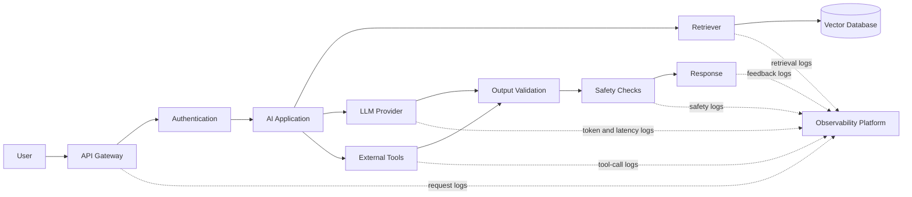
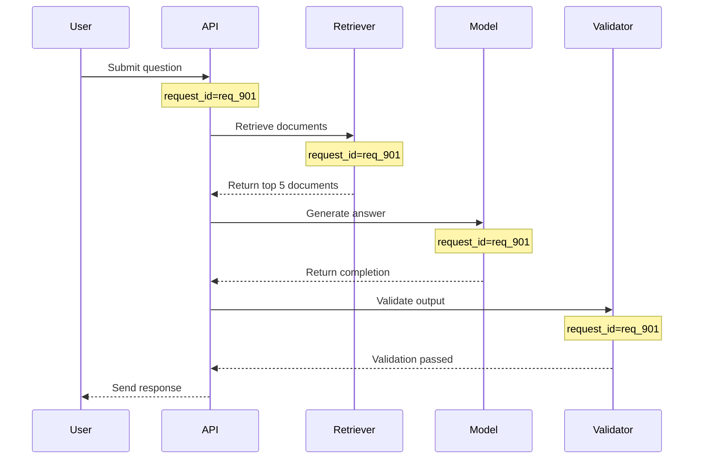
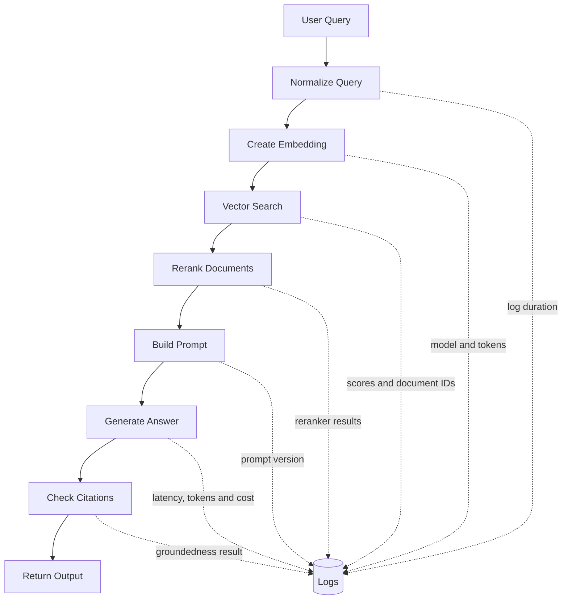
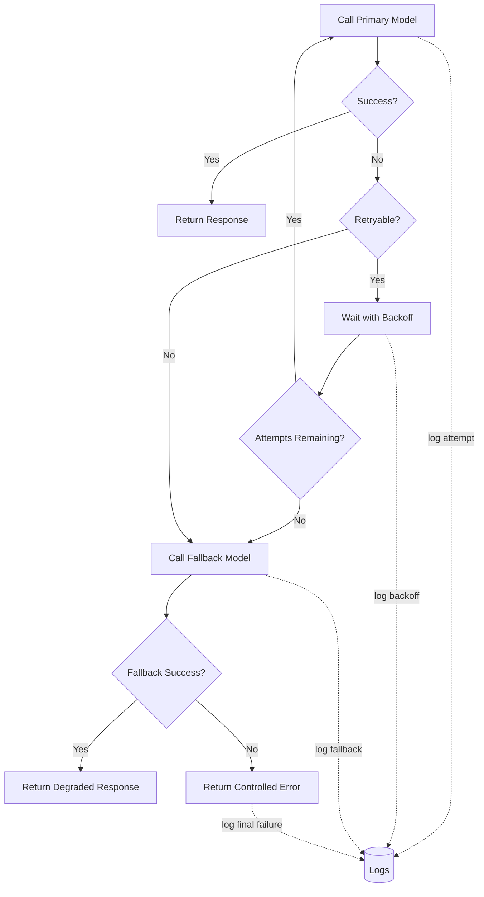
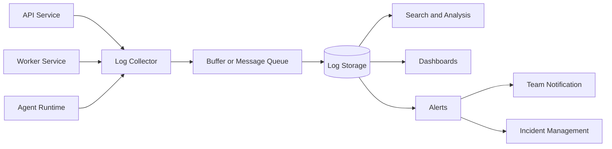

# 002 — Logging

**Course:** 05 — Production and Portfolio
**Module:** Module 13 — Production AI and LLMOps
**Content Group:** Production Concerns
**Roadmap Source:** Production AI and LLMOps / Production Concerns
**Lesson Type:** Production AI
**Order in Module:** 002
**Suggested Duration:** 24 minutes

---

## 1. Overview

Logging is the practice of recording important events that happen while an application is running.

In a traditional application, logs may capture:

* Incoming requests
* Database queries
* Authentication failures
* Application exceptions
* External API calls
* Background job status

In an AI application, logging must cover additional information:

* Model provider and model name
* Prompt or prompt template version
* Input and output token usage
* Model latency
* Retrieval results
* Tool calls
* Agent steps
* Estimated cost
* Safety signals
* Evaluation results
* User feedback

A prototype can work without good logging. A production AI application cannot.

Without logs, an AI engineer may know that an answer was wrong, slow, expensive, or unsafe, but cannot determine why it happened.

A useful production logging flow is:

```text
Request
   ↓
Request metadata
   ↓
Prompt and retrieval context
   ↓
Model or agent execution
   ↓
Token usage and latency
   ↓
Output validation
   ↓
Safety and quality signals
   ↓
User feedback
```

Logging turns invisible application behavior into information that engineers can inspect, search, analyze, and act on.

---

## 2. Learning Objectives

By the end of this lesson, you should be able to:

* Explain logging in the context of production AI systems.
* Distinguish logs from metrics and traces.
* Identify the most important fields to log for an LLM request.
* Add request IDs, latency, token usage, model information, and errors to an AI application.
* Use structured logging instead of unstructured text messages.
* Protect secrets and personal information when recording logs.
* Design a simple dashboard for model failures, latency, and cost.
* Write a small operational runbook for cost spikes and provider failures.
* Add logging to an API, RAG pipeline, agent, or multimodal application.
* Present logging as part of a production-ready AI portfolio project.

---

## 3. What Is Logging?

A log is a timestamped record describing an event inside a system.

For example:

```text
2026-07-28 14:22:08 INFO Generated response in 1.82 seconds
```

This log is readable, but it is difficult for machines to analyze because the information is embedded inside a sentence.

A structured log stores the same information as named fields:

```json
{
  "timestamp": "2026-07-28T14:22:08Z",
  "level": "INFO",
  "event": "llm_response_completed",
  "request_id": "req_8d31a2",
  "model": "example-model",
  "latency_ms": 1820,
  "input_tokens": 840,
  "output_tokens": 221,
  "status": "success"
}
```

Structured logs are easier to:

* Search
* Filter
* Aggregate
* Visualize
* Alert on
* Process automatically

For production systems, structured logging is usually more useful than plain-text logging.

---

## 4. Why Logging Matters for AI Applications

AI systems behave differently from fully deterministic software.

A normal function may return the same output for the same input. An LLM may produce different results depending on:

* Model version
* Prompt version
* Temperature
* Retrieved documents
* Conversation history
* Tool outputs
* Provider behavior
* Safety filters
* Context-window limits

This makes debugging more difficult.

Logging provides the evidence needed to answer questions such as:

* Why was this response incorrect?
* Which prompt version produced the output?
* What documents were retrieved?
* Did the agent call the correct tool?
* Was the model response truncated?
* Did the provider return a rate-limit error?
* Why did latency increase?
* Which users or features caused the cost spike?
* Did the safety classifier reject the response?
* Did a model update reduce answer quality?

### 4.1 From Prototype to Production

A prototype often follows this flow:

```text
User input → LLM → Response
```

A production system usually follows a more complex flow:



Every component can fail independently. Logs help engineers reconstruct the complete request lifecycle.

---

## 5. Logging, Metrics, and Tracing

Logging is one part of observability.

Observability commonly includes three main signals:

| Signal  | Main Purpose                       | Example                                    |
| ------- | ---------------------------------- | ------------------------------------------ |
| Logs    | Record individual events           | A model request returned HTTP 429          |
| Metrics | Measure aggregated behavior        | Average latency during the last 15 minutes |
| Traces  | Follow one request across services | API → retriever → model → database         |

### 5.1 Logs

Logs describe specific events.

```json
{
  "event": "provider_rate_limited",
  "request_id": "req_123",
  "provider": "provider_a",
  "retry_after_seconds": 20
}
```

### 5.2 Metrics

Metrics summarize behavior over time.

```text
llm_requests_total = 18,240
llm_error_rate = 1.8%
p95_latency_ms = 4,310
estimated_cost_usd = 72.40
```

### 5.3 Traces

A trace connects all operations for one request.

```text
Trace: trace_71fa

├── API request                         2,950 ms
├── Authentication                        32 ms
├── Query embedding                      140 ms
├── Vector search                        210 ms
├── Prompt construction                   18 ms
├── LLM generation                     2,430 ms
└── Output validation                    120 ms
```

### 5.4 How They Work Together

Suppose a dashboard shows that response latency has increased.

1. A **metric** reports that p95 latency increased from 2.5 seconds to 6.8 seconds.
2. A **trace** shows that most of the delay occurred in the model provider call.
3. A **log** reveals repeated timeout and retry events.

Each signal answers a different question.

---

## 6. What Should an AI Application Log?

The exact fields depend on the application, but most production AI systems should record several common categories.

---

## 6.1 Request Metadata

Useful request fields include:

```json
{
  "request_id": "req_742cb9",
  "trace_id": "trace_f19d2a",
  "timestamp": "2026-07-28T14:22:08Z",
  "route": "/api/v1/chat",
  "method": "POST",
  "environment": "production",
  "application_version": "1.8.2",
  "user_id_hash": "usr_hash_81ab",
  "session_id": "session_29d7"
}
```

A request ID is especially important because it connects events generated by the same request.

Instead of searching for unrelated log messages, an engineer can search for:

```text
request_id = req_742cb9
```

The result may show:

```text
request_received
retrieval_started
retrieval_completed
llm_request_started
llm_request_completed
output_validation_completed
response_sent
```

---

## 6.2 Model Information

Record enough information to reproduce or compare model behavior.

```json
{
  "provider": "example_provider",
  "model": "example-model-v2",
  "model_version": "2026-07",
  "temperature": 0.2,
  "max_output_tokens": 800,
  "streaming": true
}
```

Avoid relying only on a generic field such as:

```json
{
  "model": "default"
}
```

A value such as `default` may point to a different model after a deployment, making historical logs difficult to interpret.

---

## 6.3 Prompt Information

Recording complete prompts may create privacy, security, and storage problems.

A safer approach is often to record:

* Prompt template name
* Prompt version
* Prompt hash
* Input size
* Context size
* Whether optional sections were included

Example:

```json
{
  "prompt_template": "support_answer",
  "prompt_version": "3.2.0",
  "prompt_hash": "sha256:7ab891...",
  "system_prompt_chars": 1840,
  "user_input_chars": 420,
  "context_documents": 5
}
```

Full prompt logging may be appropriate in a controlled development environment, but production systems should use strict redaction and retention policies.

---

## 6.4 Token Usage

Token usage affects:

* Cost
* Latency
* Context-window limits
* Output truncation
* Capacity planning

Example:

```json
{
  "input_tokens": 1320,
  "output_tokens": 286,
  "cached_input_tokens": 700,
  "total_tokens": 1606
}
```

A useful derived field is:

```text
tokens_per_request
```

This helps identify features that consume unusually large contexts.

---

## 6.5 Cost

When a provider exposes token usage, the application can estimate request cost.

```json
{
  "estimated_input_cost_usd": 0.00198,
  "estimated_output_cost_usd": 0.00286,
  "estimated_total_cost_usd": 0.00484
}
```

The application should also record the pricing configuration version:

```json
{
  "pricing_version": "2026-07-01"
}
```

This matters because provider pricing can change.

The general calculation is:

```text
estimated cost
    = input tokens × input price per token
    + output tokens × output price per token
```

Cost can then be aggregated by:

* Feature
* Model
* Customer
* Environment
* API route
* Prompt version
* Agent
* Team

---

## 6.6 Latency

Measure the duration of important stages separately.

```json
{
  "total_latency_ms": 2850,
  "retrieval_latency_ms": 210,
  "llm_latency_ms": 2310,
  "validation_latency_ms": 105,
  "time_to_first_token_ms": 620
}
```

For streaming applications, two latency measurements are particularly useful:

* **Time to first token:** How quickly the user sees the first output.
* **Total generation time:** How long the complete response takes.

A response can have a good total generation time but still feel slow if the time to first token is poor.

---

## 6.7 Retrieval Information

For a RAG application, record what happened during retrieval.

```json
{
  "event": "retrieval_completed",
  "request_id": "req_742cb9",
  "collection": "product_documentation",
  "query_length": 94,
  "top_k": 5,
  "documents_returned": 5,
  "highest_score": 0.87,
  "lowest_score": 0.63,
  "retrieval_latency_ms": 184
}
```

Useful retrieval fields include:

* Collection or index name
* Embedding model
* Search type
* Top-k value
* Document identifiers
* Similarity scores
* Filter values
* Query-rewrite version
* Reranker model
* Retrieval latency

Avoid logging entire private documents unless explicitly allowed.

Document IDs and content hashes are often safer than full document text.

---

## 6.8 Agent and Tool Information

An agent may perform multiple steps before producing an answer.

Log each important step:

```json
{
  "event": "agent_tool_call",
  "request_id": "req_742cb9",
  "agent_name": "travel_assistant",
  "step_number": 2,
  "tool_name": "search_flights",
  "arguments_schema_version": "1.1",
  "status": "success",
  "latency_ms": 740
}
```

Do not automatically log raw tool arguments because they may contain:

* Passwords
* API keys
* Personal information
* Payment information
* Private documents

Instead, log redacted or summarized arguments:

```json
{
  "origin": "HAN",
  "destination": "BKK",
  "departure_date": "2026-08-12",
  "passenger_count": 1
}
```

Sensitive fields should be removed or masked.

---

## 6.9 Quality Signals

Production logging should capture more than technical success.

A response can return HTTP 200 and still be incorrect.

Possible quality signals include:

```json
{
  "citation_validity_score": 0.92,
  "groundedness_score": 0.84,
  "answer_relevance_score": 0.89,
  "format_validation_passed": true,
  "user_feedback": "positive"
}
```

Quality signals may come from:

* Rule-based validators
* LLM-as-a-judge evaluations
* Citation checks
* Schema validation
* Human review
* User ratings
* Regeneration behavior
* Conversation abandonment

These signals should not be treated as perfect truth. They are indicators that help identify suspicious patterns.

---

## 6.10 Safety Signals

Safety logs may include:

```json
{
  "event": "safety_evaluation_completed",
  "request_id": "req_742cb9",
  "input_flagged": false,
  "output_flagged": true,
  "category": "personal_data_exposure",
  "action": "response_blocked"
}
```

Useful safety events include:

* Prompt injection detected
* Sensitive data detected
* Disallowed content detected
* Tool permission denied
* Unsafe output blocked
* Output rewritten
* Human review requested

Safety logs require strong access controls because they may contain sensitive context.

---

## 6.11 Error Information

An error log should provide enough context to diagnose the failure without exposing secrets.

```json
{
  "timestamp": "2026-07-28T14:23:41Z",
  "level": "ERROR",
  "event": "llm_request_failed",
  "request_id": "req_1ac993",
  "provider": "example_provider",
  "model": "example-model-v2",
  "error_type": "RateLimitError",
  "http_status": 429,
  "attempt": 2,
  "retryable": true,
  "fallback_used": true
}
```

Useful error fields include:

* Error type
* Error code
* Provider status code
* Retry attempt
* Whether the error is retryable
* Whether fallback was activated
* Whether the user received a degraded response
* Stack trace in secure internal logs

---

## 7. Log Levels

Log levels communicate event severity.

| Level      | Purpose                              | Example                                |
| ---------- | ------------------------------------ | -------------------------------------- |
| `DEBUG`    | Detailed development information     | Prompt section enabled                 |
| `INFO`     | Normal application behavior          | LLM request completed                  |
| `WARNING`  | Unexpected but recoverable condition | Primary provider failed; fallback used |
| `ERROR`    | Request or operation failed          | Vector database unavailable            |
| `CRITICAL` | Severe system-wide failure           | All model providers unavailable        |

### Example

```python
logger.debug("Prompt template loaded")
logger.info("LLM request completed")
logger.warning("Primary provider failed; using fallback")
logger.error("Response validation failed")
logger.critical("All model providers are unavailable")
```

Production environments usually avoid excessive `DEBUG` logging because it can:

* Increase storage cost
* Reduce signal-to-noise ratio
* Expose implementation details
* Accidentally capture sensitive information

---

## 8. Structured Logging

Structured logging records events as fields rather than sentences.

### Weak Example

```python
logger.info(
    f"User {user_id} used {model_name} and generated "
    f"{output_tokens} tokens in {latency_ms} ms"
)
```

This message is readable but difficult to aggregate reliably.

### Better Example

```python
logger.info(
    "llm_request_completed",
    extra={
        "request_id": request_id,
        "user_id_hash": hashed_user_id,
        "model": model_name,
        "output_tokens": output_tokens,
        "latency_ms": latency_ms,
    },
)
```

Possible JSON output:

```json
{
  "level": "INFO",
  "event": "llm_request_completed",
  "request_id": "req_f704a1",
  "user_id_hash": "usr_hash_c81e",
  "model": "example-model-v2",
  "output_tokens": 241,
  "latency_ms": 1740
}
```

Structured logging makes queries easier:

```text
model = "example-model-v2"
AND latency_ms > 5000
AND level = "ERROR"
```

---

## 9. Request IDs and Correlation IDs

A single user request can produce many events.

For example:



Each component should include the same request ID in its logs.

Example event sequence:

```json
{"event":"request_received","request_id":"req_901"}
{"event":"retrieval_completed","request_id":"req_901","documents":5}
{"event":"llm_request_completed","request_id":"req_901","latency_ms":2100}
{"event":"validation_completed","request_id":"req_901","passed":true}
{"event":"response_sent","request_id":"req_901","status":200}
```

A trace ID may connect a request across multiple distributed services, while a request ID may identify the application-level request.

---

## 10. Basic Python Logging Example

Python includes a built-in logging module.

```python
import logging
import time
import uuid

logging.basicConfig(
    level=logging.INFO,
    format=(
        "%(asctime)s %(levelname)s "
        "%(name)s %(message)s"
    ),
)

logger = logging.getLogger("ai_app")


def generate_answer(question: str) -> str:
    request_id = f"req_{uuid.uuid4().hex[:12]}"
    started_at = time.perf_counter()

    logger.info(
        "request_started request_id=%s input_chars=%s",
        request_id,
        len(question),
    )

    try:
        # Replace this placeholder with a real model call.
        answer = f"Generated answer for: {question}"

        latency_ms = round(
            (time.perf_counter() - started_at) * 1000,
            2,
        )

        logger.info(
            "request_completed request_id=%s latency_ms=%s",
            request_id,
            latency_ms,
        )

        return answer

    except Exception:
        logger.exception(
            "request_failed request_id=%s",
            request_id,
        )
        raise
```

This is a useful starting point, but production systems usually use JSON-formatted structured logs.

---

## 11. Structured JSON Logger Example

The following example creates JSON log records without exposing raw user input.

```python
import hashlib
import json
import logging
import time
import uuid
from datetime import datetime, timezone
from typing import Any


class JsonFormatter(logging.Formatter):
    def format(self, record: logging.LogRecord) -> str:
        payload: dict[str, Any] = {
            "timestamp": datetime.now(timezone.utc).isoformat(),
            "level": record.levelname,
            "logger": record.name,
            "event": record.getMessage(),
        }

        custom_fields = getattr(record, "fields", None)

        if isinstance(custom_fields, dict):
            payload.update(custom_fields)

        if record.exc_info:
            payload["exception"] = self.formatException(
                record.exc_info
            )

        return json.dumps(payload, ensure_ascii=False)


handler = logging.StreamHandler()
handler.setFormatter(JsonFormatter())

logger = logging.getLogger("production_ai")
logger.setLevel(logging.INFO)
logger.handlers.clear()
logger.addHandler(handler)
logger.propagate = False


def hash_identifier(value: str) -> str:
    digest = hashlib.sha256(value.encode("utf-8")).hexdigest()
    return digest[:16]


def run_model_request(
    user_id: str,
    prompt_template: str,
    input_tokens: int,
) -> dict[str, Any]:
    request_id = f"req_{uuid.uuid4().hex[:12]}"
    start_time = time.perf_counter()

    logger.info(
        "llm_request_started",
        extra={
            "fields": {
                "request_id": request_id,
                "user_id_hash": hash_identifier(user_id),
                "prompt_template": prompt_template,
                "input_tokens": input_tokens,
            }
        },
    )

    try:
        # Placeholder model response.
        response = {
            "text": "Example response",
            "output_tokens": 120,
            "model": "example-model-v2",
        }

        latency_ms = round(
            (time.perf_counter() - start_time) * 1000,
            2,
        )

        logger.info(
            "llm_request_completed",
            extra={
                "fields": {
                    "request_id": request_id,
                    "model": response["model"],
                    "input_tokens": input_tokens,
                    "output_tokens": response["output_tokens"],
                    "total_tokens": (
                        input_tokens + response["output_tokens"]
                    ),
                    "latency_ms": latency_ms,
                    "status": "success",
                }
            },
        )

        return response

    except TimeoutError:
        logger.exception(
            "llm_request_timeout",
            extra={
                "fields": {
                    "request_id": request_id,
                    "error_type": "TimeoutError",
                    "retryable": True,
                }
            },
        )
        raise
```

Example output:

```json
{
  "timestamp": "2026-07-28T14:22:08.411000+00:00",
  "level": "INFO",
  "logger": "production_ai",
  "event": "llm_request_completed",
  "request_id": "req_194bd8ca120f",
  "model": "example-model-v2",
  "input_tokens": 720,
  "output_tokens": 120,
  "total_tokens": 840,
  "latency_ms": 1382.44,
  "status": "success"
}
```

---

## 12. Logging Middleware for FastAPI

Middleware can automatically log every API request.

```python
import logging
import time
import uuid

from fastapi import FastAPI, Request
from fastapi.responses import JSONResponse

app = FastAPI()
logger = logging.getLogger("api")


@app.middleware("http")
async def request_logging_middleware(
    request: Request,
    call_next,
):
    request_id = request.headers.get(
        "X-Request-ID",
        f"req_{uuid.uuid4().hex[:12]}",
    )

    request.state.request_id = request_id
    start_time = time.perf_counter()

    logger.info(
        "http_request_started",
        extra={
            "fields": {
                "request_id": request_id,
                "method": request.method,
                "path": request.url.path,
            }
        },
    )

    try:
        response = await call_next(request)

    except Exception:
        latency_ms = round(
            (time.perf_counter() - start_time) * 1000,
            2,
        )

        logger.exception(
            "http_request_failed",
            extra={
                "fields": {
                    "request_id": request_id,
                    "method": request.method,
                    "path": request.url.path,
                    "latency_ms": latency_ms,
                }
            },
        )

        return JSONResponse(
            status_code=500,
            content={
                "error": "internal_server_error",
                "request_id": request_id,
            },
        )

    latency_ms = round(
        (time.perf_counter() - start_time) * 1000,
        2,
    )

    response.headers["X-Request-ID"] = request_id

    logger.info(
        "http_request_completed",
        extra={
            "fields": {
                "request_id": request_id,
                "method": request.method,
                "path": request.url.path,
                "status_code": response.status_code,
                "latency_ms": latency_ms,
            }
        },
    )

    return response
```

Returning the request ID to the client is helpful for support workflows.

A user can report:

```text
The request failed. Request ID: req_52fa19c78b20
```

The support team can then search the internal logs for the exact request.

---

## 13. Logging an LLM Call

A model wrapper should centralize logging, retries, token tracking, and error handling.

```python
import logging
import time
from dataclasses import dataclass
from typing import Protocol


logger = logging.getLogger("llm")


@dataclass
class ModelResult:
    text: str
    input_tokens: int
    output_tokens: int
    model: str


class ModelClient(Protocol):
    def generate(self, prompt: str) -> ModelResult:
        ...


def generate_with_logging(
    client: ModelClient,
    prompt: str,
    request_id: str,
    prompt_version: str,
) -> ModelResult:
    start_time = time.perf_counter()

    logger.info(
        "model_call_started",
        extra={
            "fields": {
                "request_id": request_id,
                "prompt_version": prompt_version,
                "prompt_chars": len(prompt),
            }
        },
    )

    try:
        result = client.generate(prompt)

    except TimeoutError:
        logger.exception(
            "model_call_timeout",
            extra={
                "fields": {
                    "request_id": request_id,
                    "prompt_version": prompt_version,
                    "retryable": True,
                }
            },
        )
        raise

    except Exception as error:
        logger.exception(
            "model_call_failed",
            extra={
                "fields": {
                    "request_id": request_id,
                    "error_type": type(error).__name__,
                    "retryable": False,
                }
            },
        )
        raise

    latency_ms = round(
        (time.perf_counter() - start_time) * 1000,
        2,
    )

    logger.info(
        "model_call_completed",
        extra={
            "fields": {
                "request_id": request_id,
                "model": result.model,
                "prompt_version": prompt_version,
                "input_tokens": result.input_tokens,
                "output_tokens": result.output_tokens,
                "total_tokens": (
                    result.input_tokens + result.output_tokens
                ),
                "latency_ms": latency_ms,
            }
        },
    )

    return result
```

Centralizing the model call prevents each route from implementing logging differently.

---

## 14. Logging a RAG Pipeline

A RAG pipeline should log each major stage.



Example retrieval logs:

```python
logger.info(
    "retrieval_started",
    extra={
        "fields": {
            "request_id": request_id,
            "collection": "knowledge_base",
            "top_k": 8,
        }
    },
)

documents = retriever.search(query, top_k=8)

logger.info(
    "retrieval_completed",
    extra={
        "fields": {
            "request_id": request_id,
            "collection": "knowledge_base",
            "documents_returned": len(documents),
            "document_ids": [
                document.id for document in documents
            ],
            "scores": [
                round(document.score, 4)
                for document in documents
            ],
        }
    },
)
```

For sensitive knowledge bases, consider logging only hashed document IDs.

---

## 15. Logging an Agent Workflow

Agent logging should show actions without exposing hidden reasoning or sensitive content.

A useful agent event model is:

```text
agent_started
plan_selected
tool_call_started
tool_call_completed
tool_call_failed
fallback_selected
answer_generated
agent_completed
```

Example:

```json
{
  "event": "tool_call_completed",
  "request_id": "req_919d",
  "agent": "customer_support_agent",
  "step": 3,
  "tool": "lookup_order",
  "tool_call_id": "tool_402",
  "latency_ms": 184,
  "status": "success",
  "result_count": 1
}
```

Avoid recording private internal reasoning. Instead, log operational decisions such as:

```json
{
  "decision": "use_order_lookup_tool",
  "decision_reason_code": "order_status_question"
}
```

This is safer and more stable than storing unrestricted reasoning text.

---

## 16. Error Handling, Retry, and Rate Limits

External model APIs can fail because of:

* Timeout
* Rate limits
* Temporary service outages
* Invalid requests
* Context length limits
* Authentication errors
* Provider-side safety rejection
* Network failures

Logging should clearly distinguish these cases.



Example retry log:

```json
{
  "event": "model_retry_scheduled",
  "request_id": "req_298a",
  "provider": "provider_a",
  "attempt": 2,
  "max_attempts": 3,
  "backoff_ms": 2000,
  "error_type": "RateLimitError"
}
```

Example fallback log:

```json
{
  "event": "model_fallback_activated",
  "request_id": "req_298a",
  "primary_model": "model-a",
  "fallback_model": "model-b",
  "reason": "rate_limit"
}
```

Fallback success should still be treated as a warning because the system did not follow its normal path.

---

## 17. Privacy and Security

Logging can create serious privacy and security risks.

Never assume that logs are harmless.

Logs may be visible to:

* Developers
* Operations teams
* Support staff
* Cloud service providers
* Security tools
* External monitoring vendors

### 17.1 Do Not Log Secrets

Never log:

* API keys
* Access tokens
* Passwords
* Session cookies
* Database connection strings
* Private signing keys
* Authorization headers

Weak example:

```python
logger.info("Calling provider with key %s", api_key)
```

Safe example:

```python
logger.info(
    "provider_request_started",
    extra={
        "fields": {
            "provider": "example_provider",
            "credential_source": "environment",
        }
    },
)
```

### 17.2 Protect Personal Information

Avoid logging raw:

* Names
* Email addresses
* Phone numbers
* Addresses
* Medical information
* Financial information
* Private conversation content

Use pseudonymous identifiers when possible:

```python
user_id_hash = hash_identifier(user_id)
```

### 17.3 Redaction

Create a reusable redaction function.

```python
from typing import Any


SENSITIVE_KEYS = {
    "password",
    "api_key",
    "access_token",
    "authorization",
    "cookie",
    "secret",
}


def redact_sensitive_fields(
    data: dict[str, Any],
) -> dict[str, Any]:
    redacted: dict[str, Any] = {}

    for key, value in data.items():
        normalized_key = key.lower()

        if normalized_key in SENSITIVE_KEYS:
            redacted[key] = "[REDACTED]"
        elif isinstance(value, dict):
            redacted[key] = redact_sensitive_fields(value)
        else:
            redacted[key] = value

    return redacted
```

Redaction must happen before information reaches the logger.

### 17.4 Log Retention

Logs should not be stored forever by default.

Define:

* Retention duration
* Access permissions
* Encryption requirements
* Deletion procedures
* Development versus production policies
* Audit requirements

For example:

| Log Type            |                Example Retention |
| ------------------- | -------------------------------: |
| Debug logs          |                         3–7 days |
| Application logs    |                       14–30 days |
| Security audit logs | Based on compliance requirements |
| Raw prompt logs     | Disabled or very short retention |
| Aggregated metrics  |              Longer-term storage |

These values should be adapted to the application's legal, security, and operational requirements.

---

## 18. Logging Full Prompts and Responses

Logging full prompts and responses can help debugging, but it introduces risks.

### Advantages

* Easier reproduction of bad outputs
* Better prompt debugging
* More detailed quality analysis
* Easier human evaluation

### Risks

* Personal information exposure
* Secret leakage
* Prompt injection content stored in logs
* Increased storage cost
* Compliance complications
* Unauthorized internal access

### Safer Alternatives

Instead of full content, log:

```json
{
  "prompt_hash": "sha256:8adf...",
  "prompt_version": "4.1",
  "input_chars": 1024,
  "input_tokens": 380,
  "content_categories": ["technical_support"],
  "contains_personal_data": false
}
```

For sampled debugging, use:

* Explicit user consent
* Restricted access
* Encryption
* Short retention
* Automatic redaction
* Sampling instead of recording every request

---

## 19. Sampling

High-traffic applications can generate enormous log volumes.

Logging every detail for every request may be unnecessary.

A sampling policy might be:

```text
100% of errors
100% of safety events
100% of requests above 10 seconds
100% of requests using fallback models
10% of normal production requests
1% of verbose debugging events
```

Example:

```python
import random


def should_log_verbose(
    *,
    is_error: bool,
    latency_ms: float,
    fallback_used: bool,
) -> bool:
    if is_error:
        return True

    if latency_ms > 10_000:
        return True

    if fallback_used:
        return True

    return random.random() < 0.10
```

Sampling policies should preserve unusual and high-risk events.

---

## 20. Logging Architecture

A production logging architecture may contain:



Important properties include:

* Centralized collection
* Reliable buffering
* Structured JSON format
* Searchable storage
* Access control
* Retention policies
* Dashboards
* Alerts
* Incident workflows

Application code should normally write logs to standard output. The deployment environment can collect and forward them.

---

## 21. Dashboard Design

A basic AI production dashboard should answer several questions.

### 21.1 Traffic

* How many AI requests are being processed?
* Which routes or features receive the most traffic?
* How many requests are streaming?

### 21.2 Reliability

* What is the overall error rate?
* Which providers are failing?
* How often are fallback models used?
* How many requests are timing out?

### 21.3 Performance

* What are p50, p95, and p99 latency?
* What is the time to first token?
* Which pipeline stage is slowest?

### 21.4 Cost

* What is the estimated hourly and daily cost?
* Which model is responsible for most spending?
* Which user, feature, or route consumes the most tokens?
* Did average tokens per request increase after a deployment?

### 21.5 Quality

* What percentage of outputs pass schema validation?
* What is the average groundedness score?
* How many responses receive negative feedback?
* Which prompt version produces the most regenerations?

### 21.6 Safety

* How many inputs or outputs are flagged?
* Which safety categories occur most often?
* Did safety failures increase after changing the model?

### Example Dashboard Layout

```text
┌────────────────────────────────────────────────────┐
│ Production AI Dashboard                            │
├──────────────────────┬─────────────────────────────┤
│ Requests per Minute  │ Error Rate                  │
│ 245                  │ 1.7%                        │
├──────────────────────┼─────────────────────────────┤
│ p95 Latency          │ Time to First Token         │
│ 4.2 s                │ 780 ms                      │
├──────────────────────┼─────────────────────────────┤
│ Daily Cost           │ Tokens per Request          │
│ $84.60               │ 1,840                       │
├──────────────────────┼─────────────────────────────┤
│ Fallback Usage       │ Validation Failure          │
│ 3.1%                 │ 0.8%                        │
├──────────────────────┴─────────────────────────────┤
│ Recent Errors                                      │
│ - Provider rate limit                              │
│ - Vector database timeout                          │
│ - Invalid structured output                        │
└────────────────────────────────────────────────────┘
```

---

## 22. Alerting

Logs become more valuable when important events trigger alerts.

Possible alerts include:

```text
Error rate > 5% for 10 minutes
p95 latency > 8 seconds for 15 minutes
Daily estimated cost exceeds budget
Fallback model usage > 20%
Safety rejection rate increases by 50%
Structured-output failure rate > 3%
No successful requests for 5 minutes
```

Avoid alerts that trigger for every individual error. This creates alert fatigue.

An alert should usually be:

* Actionable
* Specific
* Prioritized
* Connected to a runbook
* Based on a meaningful threshold

---

## 23. Runbook: Cost Spike

A runbook explains what to do when an alert fires.

### Alert

```text
Estimated hourly LLM cost is 2.5 times higher than the seven-day baseline.
```

### Investigation Steps

1. Confirm that the increase is real and not a pricing-calculation error.
2. Compare request volume with the normal baseline.
3. Check average input and output tokens per request.
4. Group cost by route, feature, customer, model, and prompt version.
5. Check whether a recent deployment increased context size.
6. Check whether retries or agent loops increased.
7. Check whether caching stopped working.
8. Check for abusive or automated traffic.

### Possible Mitigations

* Reduce maximum output tokens.
* Switch low-risk traffic to a smaller model.
* Re-enable caching.
* Limit retrieval context.
* Disable a broken feature flag.
* Add or tighten rate limits.
* Stop infinite agent loops.
* Roll back the latest prompt or deployment.

### Recovery Verification

Confirm that:

* Cost returns toward baseline.
* Token usage returns to normal.
* Error rate does not increase.
* Quality remains acceptable.
* The root cause is documented.

---

## 24. Runbook: Model Provider Failure

### Alert

```text
Primary model provider error rate is above 20% for five minutes.
```

### Investigation Steps

1. Check provider HTTP status codes.
2. Separate rate limits, timeouts, authentication errors, and invalid requests.
3. Confirm whether the issue affects one model or all models.
4. Check recent credential or configuration changes.
5. Review retry volume and retry delays.
6. Confirm whether fallback routing works.
7. Check the provider's service status through approved operational channels.

### Possible Mitigations

* Activate a fallback provider.
* Reduce request concurrency.
* Increase exponential backoff.
* Temporarily disable nonessential AI features.
* Return a controlled degraded response.
* Roll back a provider configuration change.

### Recovery Verification

Confirm that:

* Primary provider success rate has recovered.
* Fallback usage is declining.
* Retry volume is normal.
* No requests remain stuck.
* User-facing error rates have returned to baseline.

---

## 25. Common Logging Events

A consistent event vocabulary makes analysis easier.

### API Events

```text
http_request_started
http_request_completed
http_request_failed
authentication_failed
rate_limit_exceeded
```

### Model Events

```text
llm_request_started
llm_request_completed
llm_request_failed
llm_request_timeout
llm_retry_scheduled
llm_fallback_activated
```

### RAG Events

```text
retrieval_started
retrieval_completed
retrieval_failed
reranking_completed
citation_validation_failed
```

### Agent Events

```text
agent_started
agent_step_completed
tool_call_started
tool_call_completed
tool_call_failed
agent_max_steps_reached
```

### Quality and Safety Events

```text
output_validation_completed
output_validation_failed
safety_check_completed
unsafe_output_blocked
user_feedback_received
```

Use stable event names. Do not change them casually because dashboards and alerts may depend on them.

---

## 26. Logging Schema Example

A shared schema helps different services produce compatible logs.

```json
{
  "timestamp": "2026-07-28T14:22:08Z",
  "level": "INFO",
  "event": "llm_request_completed",
  "service": "chat-api",
  "service_version": "1.8.2",
  "environment": "production",
  "request_id": "req_742cb9",
  "trace_id": "trace_f19d2a",
  "user_id_hash": "usr_hash_81ab",
  "route": "/api/v1/chat",
  "provider": "example_provider",
  "model": "example-model-v2",
  "prompt_template": "assistant_answer",
  "prompt_version": "3.1.0",
  "input_tokens": 1320,
  "output_tokens": 286,
  "total_tokens": 1606,
  "latency_ms": 2850,
  "estimated_cost_usd": 0.00484,
  "status": "success",
  "fallback_used": false,
  "safety_flagged": false,
  "validation_passed": true
}
```

Not every event needs every field. However, field names should remain consistent.

For example, avoid using all of these for the same concept:

```text
duration
elapsed
latency
response_time
request_duration
```

Choose one standard such as:

```text
latency_ms
```

---

## 27. Logging Across Environments

Logging requirements differ by environment.

| Environment       | Recommended Approach                                   |
| ----------------- | ------------------------------------------------------ |
| Local development | Detailed human-readable logs                           |
| Automated testing | Deterministic logs with test IDs                       |
| Staging           | Production-like structured logs                        |
| Production        | Structured logs with redaction and controlled sampling |

### Development

It may be acceptable to show:

* Detailed stack traces
* Prompt template names
* Local test payloads
* Debug events

### Production

Production logging should prioritize:

* Structured fields
* Privacy
* Security
* Searchability
* Cost control
* Stable event names
* Correlation IDs

---

## 28. Testing Logging Behavior

Logging should be tested like other application behavior.

### Example: Verify Request ID

```python
def test_response_contains_request_id(test_client):
    response = test_client.get("/health")

    assert response.status_code == 200
    assert "X-Request-ID" in response.headers
```

### Example: Verify Secrets Are Redacted

```python
def test_sensitive_fields_are_redacted():
    payload = {
        "username": "demo",
        "api_key": "secret-value",
        "nested": {
            "access_token": "token-value",
        },
    }

    result = redact_sensitive_fields(payload)

    assert result["username"] == "demo"
    assert result["api_key"] == "[REDACTED]"
    assert (
        result["nested"]["access_token"]
        == "[REDACTED]"
    )
```

### Example: Verify Failure Event

```python
def test_model_failure_is_logged(
    caplog,
    failing_model_client,
):
    with caplog.at_level("ERROR"):
        try:
            failing_model_client.generate("test")
        except RuntimeError:
            pass

    assert "model_call_failed" in caplog.text
```

Important logging tests include:

* Request IDs are generated and propagated.
* Sensitive fields are removed.
* Errors include correct error categories.
* Token and latency fields are recorded.
* Retry attempts are logged.
* Fallback activation is logged.
* Raw authorization headers never appear.

---

## 29. Common Mistakes

### 29.1 Deploying Without Logging

The application works during a demo but provides no evidence when production failures occur.

**Improvement:** Add request, model, token, latency, and error logging before deployment.

---

### 29.2 Logging Only Errors

Error logs are useful, but successful requests provide the baseline needed for comparison.

**Improvement:** Log important successful lifecycle events as well as failures.

---

### 29.3 Logging Everything

Excessive logging creates noise, cost, and privacy risk.

**Improvement:** Define a logging schema, sampling policy, and retention policy.

---

### 29.4 Logging Raw Prompts by Default

Prompts may contain private or confidential information.

**Improvement:** Record prompt versions, hashes, sizes, and classifications instead of unrestricted content.

---

### 29.5 Missing Request IDs

Without correlation IDs, events from one request cannot be reconstructed reliably.

**Improvement:** Generate a request ID at the system boundary and propagate it through all services.

---

### 29.6 Inconsistent Field Names

One service uses `duration`, another uses `latency`, and another uses `elapsed_time`.

**Improvement:** Define and enforce a shared logging schema.

---

### 29.7 Ignoring Token and Cost Information

The application may remain technically functional while becoming financially unsustainable.

**Improvement:** Track tokens and estimated cost by route, feature, model, and user segment.

---

### 29.8 No Timeout, Retry, or Rate-Limit Logs

The team sees slow requests but cannot determine whether retries caused the delay.

**Improvement:** Log every attempt, backoff duration, final result, and fallback action.

---

### 29.9 Treating HTTP 200 as Success

A response can be technically successful but factually wrong or structurally invalid.

**Improvement:** Record schema validation, groundedness, citation, safety, and feedback signals.

---

### 29.10 No Safety Regression Tracking

A model or prompt update may reduce safety without generating application errors.

**Improvement:** Compare safety evaluation results before and after deployments.

---

### 29.11 Logs Without Dashboards or Runbooks

Data exists, but the team does not know what to monitor or how to react.

**Improvement:** Connect logs to metrics, alerts, dashboards, and incident procedures.

---

## 30. Production Logging Checklist

### Request Context

* [ ] Generate a unique request ID.
* [ ] Propagate the request ID across services.
* [ ] Record route, method, environment, and application version.
* [ ] Use a pseudonymous user identifier where needed.

### Model Calls

* [ ] Record provider and model name.
* [ ] Record prompt template and version.
* [ ] Record model parameters that affect behavior.
* [ ] Record input, output, and total tokens.
* [ ] Record latency and time to first token.
* [ ] Record estimated cost.
* [ ] Record retry and fallback behavior.

### RAG and Agents

* [ ] Record retrieval collection and document IDs.
* [ ] Record similarity or reranking scores.
* [ ] Record tool names and tool-call status.
* [ ] Record agent step count.
* [ ] Detect and log maximum-step failures.

### Quality and Safety

* [ ] Record schema-validation results.
* [ ] Record citation or groundedness signals.
* [ ] Record safety-check results.
* [ ] Record user feedback.
* [ ] Compare results across prompt and model versions.

### Privacy and Security

* [ ] Do not log secrets.
* [ ] Redact sensitive fields.
* [ ] Avoid unrestricted prompt and response logging.
* [ ] Configure log access permissions.
* [ ] Define retention and deletion policies.

### Operations

* [ ] Create latency, error, and cost dashboards.
* [ ] Define actionable alerts.
* [ ] Create a cost-spike runbook.
* [ ] Create a provider-failure runbook.
* [ ] Test logging and redaction behavior.
* [ ] Document rollback procedures.

---

## 31. Practical Exercise

Build logging for a small AI API.

### Requirements

Create an endpoint such as:

```text
POST /api/v1/answer
```

The endpoint should accept:

```json
{
  "question": "What is retrieval-augmented generation?"
}
```

Add logs for:

* Request ID
* Route
* Model name
* Prompt version
* Input tokens
* Output tokens
* Total tokens
* Model latency
* Total request latency
* Estimated cost
* Validation result
* Error type
* Retry count
* Fallback usage

### Expected Event Flow

```text
http_request_started
    ↓
prompt_built
    ↓
llm_request_started
    ↓
llm_request_completed
    ↓
output_validation_completed
    ↓
http_request_completed
```

### Example Success Log

```json
{
  "event": "llm_request_completed",
  "request_id": "req_27dc",
  "model": "example-model-v2",
  "prompt_version": "1.0.0",
  "input_tokens": 420,
  "output_tokens": 138,
  "latency_ms": 1640,
  "estimated_cost_usd": 0.0021,
  "validation_passed": true
}
```

### Example Failure Log

```json
{
  "event": "llm_request_failed",
  "request_id": "req_27dc",
  "model": "example-model-v2",
  "error_type": "TimeoutError",
  "attempt": 3,
  "fallback_used": true
}
```

---

## 32. Extended Exercise: Cost Spike Dashboard

Create a small dashboard or notebook that displays:

* Requests per hour
* Average input tokens
* Average output tokens
* Total estimated cost
* Cost by model
* Cost by API route
* p95 model latency
* Error rate
* Fallback usage rate

Use sample structured logs if a live application is unavailable.

### Questions to Answer

1. Which model generates the highest total cost?
2. Which endpoint has the highest token usage?
3. Did cost increase because of traffic or larger prompts?
4. Are retries contributing to the increase?
5. Which deployment version introduced the change?

---

## 33. Extended Exercise: Operational Runbook

Write a one-page runbook for each scenario:

### Scenario A: Cost Spike

Include:

* Alert condition
* Investigation queries
* Likely causes
* Immediate mitigation
* Rollback criteria
* Recovery checks

### Scenario B: Model Failure

Include:

* Provider error categories
* Retry policy
* Fallback behavior
* Degraded response strategy
* Escalation steps
* Recovery verification

---

## 34. Mini Project: Production AI Logging Demo

Build a small production-style AI application with:

* FastAPI endpoint
* Structured JSON logs
* Request ID middleware
* LLM wrapper
* Token and cost tracking
* Timeout handling
* Retry with exponential backoff
* Fallback model
* Output validation
* Safety event logging
* Dashboard or analysis notebook
* Operational runbook

### Suggested Project Structure

```text
production-ai-logging/
├── app/
│   ├── main.py
│   ├── api/
│   │   └── routes.py
│   ├── core/
│   │   ├── logging.py
│   │   ├── config.py
│   │   └── security.py
│   ├── llm/
│   │   ├── client.py
│   │   ├── fallback.py
│   │   └── pricing.py
│   ├── services/
│   │   └── answer_service.py
│   └── schemas/
│       └── answer.py
├── tests/
│   ├── test_logging.py
│   ├── test_redaction.py
│   └── test_fallback.py
├── dashboard/
│   └── dashboard.ipynb
├── runbooks/
│   ├── cost-spike.md
│   └── model-failure.md
├── .env.example
├── README.md
└── requirements.txt
```

---

## 35. Portfolio README Section

Include a production-readiness section in the project README.

```markdown
## Observability

The application uses structured JSON logging for every AI request.

Each request records:

- Request and trace IDs
- Model provider and model name
- Prompt template version
- Input and output token usage
- Estimated request cost
- Retrieval and model latency
- Retry and fallback behavior
- Output validation results
- Safety events

Sensitive information is redacted before logs are emitted.

The repository also contains:

- A cost and latency dashboard
- A provider-failure runbook
- A cost-spike runbook
- Tests for request ID propagation and secret redaction
```

This demonstrates that the project is more than a model API demo. It shows awareness of production reliability, cost, safety, and operations.

---

## 36. Interview Questions

### What is structured logging?

Structured logging stores events as named fields, commonly in JSON, so logs can be searched, filtered, aggregated, and visualized reliably.

### Why are request IDs important?

A request ID connects all events generated during one request, making it possible to reconstruct the complete execution path.

### What should be logged for an LLM request?

Common fields include model name, provider, prompt version, token usage, latency, estimated cost, retry count, fallback usage, validation results, and safety signals.

### Should full prompts be logged?

Not by default. Prompts may contain personal, confidential, or security-sensitive information. Safer alternatives include prompt hashes, versions, lengths, categories, and sampled redacted content.

### What is the difference between logs and metrics?

Logs describe individual events. Metrics aggregate numerical behavior over time, such as request rate, error percentage, or p95 latency.

### How would you investigate a sudden AI cost increase?

Compare traffic, tokens per request, model usage, prompt versions, retries, agent step counts, caching behavior, and recent deployments.

### Why is HTTP 200 not enough to indicate success?

The model may return an irrelevant, unsafe, ungrounded, or structurally invalid response even when the API request succeeds technically.

---

## 37. Completion Checklist

* [ ] I can explain logging in one or two minutes.
* [ ] I can distinguish logs, metrics, and traces.
* [ ] I understand why request IDs are important.
* [ ] I can create structured JSON logs.
* [ ] I can record model latency and token usage.
* [ ] I can estimate and log request cost.
* [ ] I can log RAG retrieval and agent tool events.
* [ ] I understand prompt and response logging risks.
* [ ] I can redact secrets and personal information.
* [ ] I can handle and log timeout, retry, and rate-limit events.
* [ ] I can design a basic AI operations dashboard.
* [ ] I can write a runbook for cost spikes or provider failures.
* [ ] I have created a small logging demo or portfolio artifact.
* [ ] I have documented at least one limitation or open question.

---

## 38. Related Outcome

Prepare AI applications for production through:

* Deployment readiness
* Observability
* Token and cost tracking
* Reliability engineering
* Safety monitoring
* Regression testing
* Incident response

---

## 39. Related Project

**Production AI Demo**

Build and publish an application that includes:

* Structured logging
* Request ID propagation
* Token tracking
* Cost estimation
* Latency monitoring
* Retry and fallback handling
* Safety and quality signals
* A small dashboard
* Operational runbooks
* A public portfolio README

---

## 40. Key Takeaways

Logging is not simply printing messages to the terminal.

In a production AI system, logging creates a record of:

```text
request
→ model
→ prompt version
→ retrieval
→ tool calls
→ latency
→ tokens
→ cost
→ quality
→ safety
→ feedback
```

Good logging helps answer four essential questions:

1. **What happened?**
2. **Why did it happen?**
3. **Who or what was affected?**
4. **What should the team do next?**

A production-ready AI application should provide enough evidence to investigate incorrect outputs, slow responses, model failures, cost spikes, safety regressions, and user complaints.

Logging is therefore a core engineering capability for moving from an AI prototype to a reliable production system.
