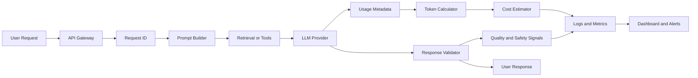
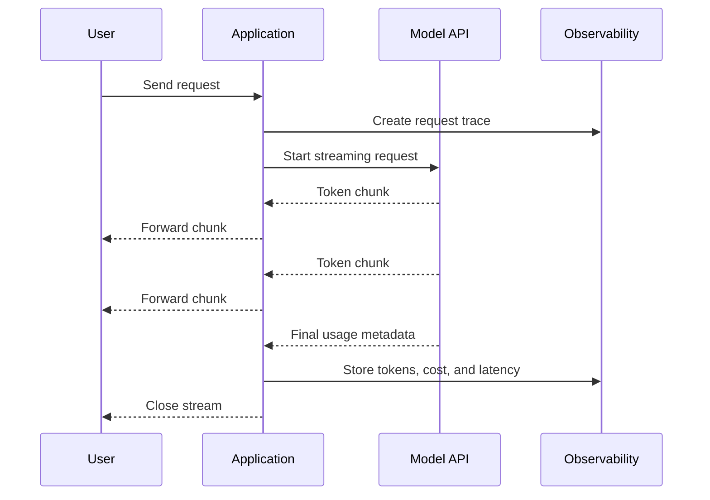
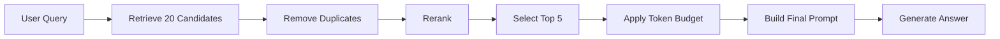
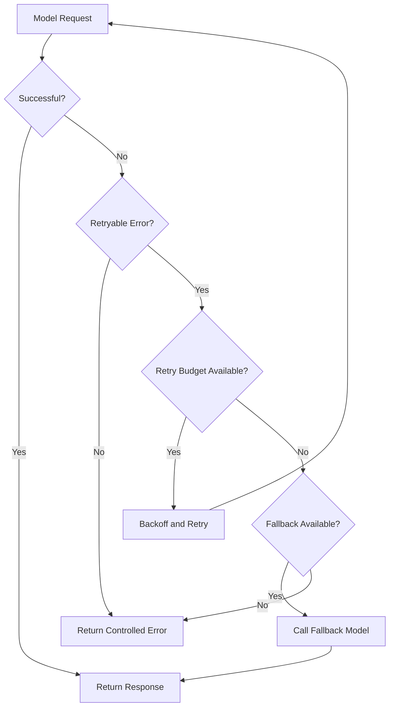
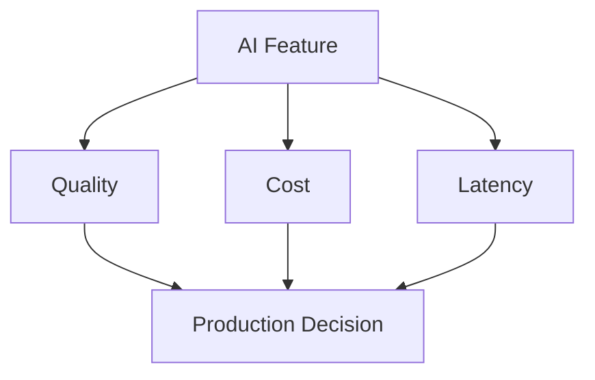

# 003 — Token Tracking

**Course:** 05 — Production and Portfolio
**Module:** Module 13 — Production AI and LLMOps
**Content Group:** Production Concerns
**Roadmap Source:** Production AI and LLMOps / Production Concerns
**Lesson Type:** Production AI
**Lesson Order:** 003
**Suggested Duration:** 24 minutes

---

## 1. Summary

**Token tracking** is the practice of measuring how many tokens an AI application sends to and receives from a language model.

It helps engineering teams understand:

* How much each request costs
* Which features consume the most tokens
* Whether prompts are becoming too large
* Whether Retrieval-Augmented Generation pipelines retrieve too much context
* Whether agents are making unnecessary model calls
* Whether users or workflows are creating abnormal usage spikes
* How token usage affects latency, reliability, and user experience

In a production AI system, token tracking should not exist as an isolated metric. It should be connected to request identifiers, model information, latency, cost, errors, quality signals, safety signals, and user feedback.

```text
request → model call → token usage → estimated cost → quality → user outcome
```

Without token tracking, an AI application may appear healthy while silently generating excessive costs, slower responses, oversized prompts, or inefficient agent loops.

---

## 2. Learning Objectives

By the end of this lesson, you should be able to:

* Explain token tracking in your own words.
* Distinguish between input, output, cached, and total tokens.
* Identify where token usage should be collected in an AI application.
* Calculate the estimated cost of an LLM request.
* Store token metrics with request-level metadata.
* Detect unusual token usage and cost spikes.
* Build a small token and cost monitoring dashboard.
* Apply token tracking to prompts, RAG pipelines, agents, and multimodal applications.
* Create a runbook for cost spikes and model failures.

---

## 3. What Is a Token?

A **token** is a unit of text processed by a language model.

A token may represent:

* A complete word
* Part of a word
* A punctuation mark
* A number
* A whitespace sequence
* A special formatting or control symbol

For example, the following sentence:

```text
Token tracking improves production visibility.
```

is processed as a sequence of tokens rather than as one complete string.

The exact number of tokens depends on:

* The tokenizer used by the model
* The language of the text
* Special characters
* Structured data such as JSON or XML
* Source code formatting
* System and developer instructions
* Tool definitions
* Conversation history

> Character count and word count are not reliable substitutes for actual token usage.

---

## 4. Main Token Categories

Most LLM APIs report several token-related fields.

### 4.1 Input Tokens

Input tokens are all tokens sent to the model.

They may include:

* System instructions
* Developer instructions
* User messages
* Conversation history
* Retrieved RAG documents
* Tool descriptions
* Function schemas
* Image or audio representations
* Structured output instructions

```text
Input tokens =
system prompt
+ user prompt
+ history
+ retrieved context
+ tool definitions
```

### 4.2 Output Tokens

Output tokens are generated by the model.

Examples include:

* Assistant responses
* JSON output
* Tool-call arguments
* Agent plans
* Summaries
* Generated code
* Reasoning-related tokens reported by supported providers

Longer responses normally consume more output tokens and may increase both latency and cost.

### 4.3 Cached Tokens

Some providers support prompt or context caching.

Cached tokens represent input content that can be reused without being processed at the normal input rate.

Common caching candidates include:

* Stable system prompts
* Large policy documents
* Tool definitions
* Repeated reference material
* Shared conversation prefixes

Caching can reduce:

* Cost
* Time to first token
* Repeated prompt-processing work

### 4.4 Total Tokens

Total token usage is usually calculated as:

```text
total_tokens = input_tokens + output_tokens
```

If a provider reports cached or reasoning tokens separately, store those fields independently rather than combining everything into one ambiguous number.

---

## 5. Why Token Tracking Matters

### 5.1 Cost Control

Most hosted models charge according to token usage.

Without request-level token metrics, teams cannot accurately answer questions such as:

* Which feature costs the most?
* Which customers create the most usage?
* Did a prompt update increase cost?
* Is the RAG pipeline retrieving too much text?
* Is the agent calling the model repeatedly?
* Is a cheaper model suitable for a specific task?

### 5.2 Performance Optimization

Large prompts can increase:

* Request latency
* Time to first token
* Memory requirements
* Timeout probability
* Context-window errors

Token tracking makes prompt growth visible.

### 5.3 Capacity Planning

Token metrics help estimate:

* Daily model usage
* Peak traffic
* Monthly API spending
* Required rate limits
* Budget per customer
* Expected usage after launch

### 5.4 Debugging

Unexpected token growth may indicate:

* Conversation history is not being truncated.
* Retrieved documents are duplicated.
* Tool definitions are repeatedly inserted.
* An agent is stuck in a loop.
* A prompt includes unnecessary examples.
* Error messages are being added back into the context.
* The application sends raw documents instead of selected chunks.

### 5.5 Product Analytics

Token tracking can also reveal how users interact with the product.

For example:

* Which features require long responses?
* Which workflow produces the best quality per dollar?
* Which requests should use a smaller model?
* Which users need larger usage quotas?
* Which tasks benefit from caching?

---

## 6. Token Tracking in the Production Workflow

A complete production request should produce one trace that connects technical and product metrics.



The trace should answer:

```text
Who made the request?
Which feature was used?
Which model handled it?
How many model calls were made?
How many tokens were consumed?
How much did it cost?
How long did it take?
Did the request succeed?
Was the result safe and useful?
```

---

## 7. Recommended Tracking Fields

A production token-usage record may contain the following fields:

```json
{
  "request_id": "req_8f73c2",
  "trace_id": "trace_91ad04",
  "user_id": "user_1042",
  "feature": "document_summary",
  "environment": "production",
  "provider": "llm-provider",
  "model": "model-name",
  "prompt_version": "summary-v4",
  "input_tokens": 2840,
  "output_tokens": 462,
  "cached_input_tokens": 1200,
  "total_tokens": 3302,
  "model_calls": 1,
  "estimated_cost_usd": 0.0134,
  "latency_ms": 1840,
  "time_to_first_token_ms": 520,
  "status": "success",
  "error_type": null,
  "quality_score": 0.87,
  "safety_flag": false,
  "created_at": "2026-07-28T16:30:00Z"
}
```

Do not store sensitive prompt content in ordinary logs unless there is a clear security and privacy policy.

Safer alternatives include storing:

* Prompt version
* Prompt hash
* Character count
* Token count
* Document identifiers
* Retrieval chunk identifiers
* Redacted error information

---

## 8. Cost Calculation

Providers may charge different prices for:

* Input tokens
* Output tokens
* Cached input tokens
* Audio tokens
* Image tokens
* Batch requests
* Fine-tuned models

A generic cost calculation is:

```text
input_cost =
    input_tokens
    ÷ pricing_unit
    × input_price

output_cost =
    output_tokens
    ÷ pricing_unit
    × output_price

total_cost =
    input_cost
    + output_cost
    + additional_usage_costs
```

For a provider that prices usage per one million tokens:

```text
input_cost =
    input_tokens
    ÷ 1,000,000
    × input_price_per_million

output_cost =
    output_tokens
    ÷ 1,000,000
    × output_price_per_million
```

### Example

Assume a fictional model charges:

```text
Input:  $2.00 per 1,000,000 tokens
Output: $8.00 per 1,000,000 tokens
```

For a request with:

```text
Input tokens:  10,000
Output tokens: 2,000
```

The estimated cost is:

```text
Input cost  = 10,000 ÷ 1,000,000 × $2.00
            = $0.02

Output cost = 2,000 ÷ 1,000,000 × $8.00
            = $0.016

Total cost  = $0.036
```

Pricing changes over time, so production applications should keep pricing configuration outside the application code.

```yaml
models:
  model-name:
    input_per_million: 2.00
    output_per_million: 8.00
    cached_input_per_million: 0.50
```

---

## 9. Basic Python Implementation

The following example uses a provider-neutral response structure.

```python
from dataclasses import dataclass
from decimal import Decimal
from time import perf_counter
from typing import Any
import uuid


@dataclass(frozen=True)
class ModelPricing:
    input_per_million: Decimal
    output_per_million: Decimal
    cached_input_per_million: Decimal = Decimal("0")


def calculate_cost(
    input_tokens: int,
    output_tokens: int,
    cached_input_tokens: int,
    pricing: ModelPricing,
) -> Decimal:
    unit = Decimal("1000000")

    normal_input_tokens = max(input_tokens - cached_input_tokens, 0)

    input_cost = (
        Decimal(normal_input_tokens)
        / unit
        * pricing.input_per_million
    )

    cached_cost = (
        Decimal(cached_input_tokens)
        / unit
        * pricing.cached_input_per_million
    )

    output_cost = (
        Decimal(output_tokens)
        / unit
        * pricing.output_per_million
    )

    return input_cost + cached_cost + output_cost


def call_model_with_tracking(
    client: Any,
    model: str,
    messages: list[dict[str, str]],
    pricing: ModelPricing,
) -> dict[str, Any]:
    request_id = f"req_{uuid.uuid4().hex[:12]}"
    started_at = perf_counter()

    try:
        response = client.generate(
            model=model,
            messages=messages,
        )

        latency_ms = round((perf_counter() - started_at) * 1000)

        usage = response.usage

        input_tokens = usage.input_tokens
        output_tokens = usage.output_tokens
        cached_input_tokens = getattr(
            usage,
            "cached_input_tokens",
            0,
        )

        estimated_cost = calculate_cost(
            input_tokens=input_tokens,
            output_tokens=output_tokens,
            cached_input_tokens=cached_input_tokens,
            pricing=pricing,
        )

        log_record = {
            "request_id": request_id,
            "model": model,
            "input_tokens": input_tokens,
            "output_tokens": output_tokens,
            "cached_input_tokens": cached_input_tokens,
            "total_tokens": input_tokens + output_tokens,
            "estimated_cost_usd": float(estimated_cost),
            "latency_ms": latency_ms,
            "status": "success",
        }

        write_usage_log(log_record)

        return {
            "request_id": request_id,
            "content": response.content,
            "usage": log_record,
        }

    except Exception as error:
        latency_ms = round((perf_counter() - started_at) * 1000)

        write_usage_log({
            "request_id": request_id,
            "model": model,
            "latency_ms": latency_ms,
            "status": "error",
            "error_type": type(error).__name__,
        })

        raise


def write_usage_log(record: dict[str, Any]) -> None:
    print(record)
```

Important implementation details:

* Use decimal arithmetic for money.
* Record failed requests as well as successful requests.
* Keep pricing configuration versioned.
* Do not assume all providers use identical usage field names.
* Avoid logging raw sensitive prompts.
* Attach the same request ID to logs, traces, metrics, and errors.

---

## 10. Streaming Responses

Streaming creates an additional tracking challenge.

The final token usage may only be available:

* In the last stream event
* In response metadata
* After the stream closes
* Through a provider-specific usage option



A robust streaming implementation should handle:

* Client disconnection
* Partial output
* Missing final usage metadata
* Provider timeout
* Cancellation
* Stream parsing errors
* Duplicate finalization

The application should finalize the usage record exactly once.

---

## 11. Token Tracking for RAG Pipelines

In a RAG application, token tracking should separate the prompt into meaningful components.

```text
Total input tokens
├── system prompt tokens
├── user query tokens
├── conversation history tokens
├── retrieved context tokens
└── output-format instruction tokens
```

Recommended RAG metrics include:

| Metric                | Purpose                         |
| --------------------- | ------------------------------- |
| Query tokens          | Measures user-input size        |
| Retrieved chunks      | Detects excessive retrieval     |
| Retrieved characters  | Estimates context volume        |
| Context tokens        | Measures actual RAG prompt cost |
| Duplicate chunk count | Detects retrieval repetition    |
| Retrieval latency     | Measures search performance     |
| Input tokens          | Measures final model context    |
| Output tokens         | Measures generated answer size  |
| Citation count        | Measures source usage           |
| Groundedness score    | Measures answer support         |

### RAG Optimization Example

Suppose a pipeline retrieves 20 chunks, but only 5 are relevant.

The system can reduce token usage by:

1. Retrieving a larger candidate set.
2. Reranking candidates.
3. Removing duplicate chunks.
4. Selecting the top relevant chunks.
5. Compressing long chunks.
6. Building the final prompt within a token budget.



---

## 12. Token Tracking for AI Agents

Agents may use far more tokens than simple chatbot requests because they can perform multiple model calls.

An agent trace may contain:

```text
User request
  ├── Planning call
  ├── Tool-selection call
  ├── Tool result
  ├── Reflection call
  ├── Second tool call
  └── Final answer call
```

Track tokens at two levels.

### Call Level

```json
{
  "trace_id": "trace_agent_19",
  "step": 3,
  "operation": "tool_selection",
  "input_tokens": 1400,
  "output_tokens": 120,
  "estimated_cost_usd": 0.004
}
```

### Trace Level

```json
{
  "trace_id": "trace_agent_19",
  "model_calls": 6,
  "tool_calls": 3,
  "total_input_tokens": 9200,
  "total_output_tokens": 1450,
  "total_estimated_cost_usd": 0.041,
  "final_status": "success"
}
```

Useful agent limits include:

* Maximum model calls per request
* Maximum tool calls
* Maximum total tokens
* Maximum execution time
* Maximum cost per trace
* Maximum repeated identical action count

```python
if trace.total_tokens > token_budget:
    raise AgentBudgetExceeded("The agent token budget was exceeded.")

if trace.estimated_cost_usd > cost_budget:
    raise AgentBudgetExceeded("The agent cost budget was exceeded.")
```

---

## 13. Token Budgets

A **token budget** defines how many tokens a request or workflow may consume.

Example budget:

```yaml
feature: support_assistant
model: model-name

budgets:
  maximum_input_tokens: 12000
  maximum_output_tokens: 1200
  maximum_total_tokens: 13200
  maximum_model_calls: 4
  maximum_cost_usd: 0.10
```

A prompt builder can reserve space before sending the request.

```text
Model context limit
− expected output tokens
− system prompt tokens
− user query tokens
− safety margin
= available context tokens
```

For example:

```text
Maximum context:          32,000
Reserved output:           2,000
System instructions:       1,500
User message:                500
Safety margin:             1,000
--------------------------------
Available RAG context:    27,000
```

Do not fill the entire context window. Keep a safety margin for:

* Tokenization differences
* Tool-call formatting
* Structured output
* Provider-added content
* Unexpectedly long user input

---

## 14. Dashboard Design

A token-tracking dashboard should support both engineering and business questions.

### Core Metrics

* Requests per minute
* Total tokens per hour
* Input tokens per request
* Output tokens per request
* Tokens by feature
* Tokens by model
* Tokens by customer
* Cost per request
* Cost per successful request
* Daily estimated cost
* Monthly estimated cost
* P50, P95, and P99 token usage
* P50, P95, and P99 latency
* Error rate
* Rate-limit count
* Context-limit errors
* Quality score
* Safety incident count

### Example Dashboard Layout

```text
┌──────────────────────────────────────────────────────────┐
│ Daily Cost │ Requests │ Total Tokens │ Error Rate         │
├──────────────────────────────────────────────────────────┤
│ Token Usage Over Time                                   │
├───────────────────────────┬──────────────────────────────┤
│ Cost by Feature           │ Cost by Model                │
├───────────────────────────┼──────────────────────────────┤
│ P95 Input Tokens          │ P95 Output Tokens            │
├───────────────────────────┴──────────────────────────────┤
│ Recent Cost Spikes and Context-Limit Errors              │
└──────────────────────────────────────────────────────────┘
```

---

## 15. Useful Token Metrics

### Average Tokens per Request

```text
average_tokens_per_request =
    total_tokens
    ÷ request_count
```

### Cost per Successful Request

```text
cost_per_successful_request =
    total_cost
    ÷ successful_request_count
```

### Cost per Active User

```text
cost_per_active_user =
    total_cost
    ÷ active_user_count
```

### Output Efficiency

```text
output_efficiency =
    useful_output_tokens
    ÷ total_output_tokens
```

Useful output tokens are difficult to measure directly. A practical approximation can combine:

* User satisfaction
* Task completion
* Quality evaluation
* Response length
* Repetition score

### Cache Hit Ratio

```text
cache_hit_ratio =
    cached_input_tokens
    ÷ total_cache_eligible_input_tokens
```

### RAG Context Ratio

```text
rag_context_ratio =
    retrieved_context_tokens
    ÷ total_input_tokens
```

A very high RAG context ratio may indicate that retrieved documents dominate the prompt.

---

## 16. Alerts

Token tracking becomes operationally useful when connected to alerts.

### Example Alert Conditions

```yaml
alerts:
  - name: high_request_cost
    condition: request_cost_usd > 0.50

  - name: daily_cost_spike
    condition: current_daily_cost > seven_day_average * 1.5

  - name: input_token_growth
    condition: p95_input_tokens > baseline_p95 * 1.3

  - name: agent_loop
    condition: model_calls_per_trace > 8

  - name: context_limit_errors
    condition: context_limit_error_rate > 0.01

  - name: missing_usage_metadata
    condition: missing_usage_ratio > 0.02
```

Alerts should include enough context for investigation:

```text
Alert: Daily AI cost increased by 65%

Environment: production
Feature: research_agent
Model: model-name
Current daily cost: $184.20
Seven-day average: $111.60
Primary change: input tokens per request increased by 72%
Prompt version: research-agent-v12
Deployment: release-2026.07.28
```

---

## 17. Runbook: Cost Spike

A runbook provides a repeatable response process.

### Step 1: Confirm the Spike

Check:

* Is the dashboard receiving duplicate events?
* Did model pricing change?
* Did traffic increase?
* Did tokens per request increase?
* Did the number of model calls increase?
* Is the cost limited to one feature or customer?

### Step 2: Find the Source

Group usage by:

* Feature
* Model
* Prompt version
* Deployment version
* User or organization
* Endpoint
* Agent step
* Retrieval collection

### Step 3: Inspect Recent Changes

Review:

* Prompt updates
* Model changes
* RAG configuration changes
* Conversation-memory changes
* Tool-definition changes
* Retry-policy changes
* Agent iteration limits
* New customer traffic

### Step 4: Mitigate

Possible actions:

* Roll back the prompt.
* Switch the affected feature to a smaller model.
* Reduce retrieved context.
* Disable a problematic agent tool.
* Reduce maximum output tokens.
* Apply stricter rate limits.
* Temporarily disable nonessential features.
* Add a per-request cost ceiling.

### Step 5: Verify Recovery

Confirm that:

* Cost returns to the expected range.
* Quality remains acceptable.
* Error rate does not increase.
* User-facing latency remains healthy.
* No requests bypass the new limits.

### Step 6: Prevent Recurrence

Add:

* Regression tests
* Prompt token snapshots
* Per-feature budgets
* Deployment comparisons
* More specific alerts
* Agent loop protection

---

## 18. Runbook: Model Failure

When a provider or model fails:

1. Identify the affected model and endpoint.
2. Check timeout, error, and rate-limit metrics.
3. Determine whether requests can be retried safely.
4. Use exponential backoff with jitter.
5. Apply a circuit breaker.
6. Route supported requests to a fallback model.
7. Preserve request IDs across retries.
8. Track tokens and costs for every attempt.
9. Prevent duplicate side effects from tool calls.
10. Inform users when a degraded mode is active.



Retries can multiply token usage and cost. Therefore, token and cost metrics should include:

```text
initial attempt + retries + fallback calls
```

---

## 19. Common Mistakes

### Mistake 1: Tracking Only Total Tokens

A single total-token field does not explain whether the growth comes from input or output.

Store input and output separately.

### Mistake 2: Logging Only Successful Requests

Failed and timed-out requests may still consume tokens and produce costs.

Track every provider attempt.

### Mistake 3: Hardcoding Prices

Provider prices can change.

Use versioned pricing configuration with an effective date.

### Mistake 4: Ignoring Retries

Three retries may turn one logical request into four paid model calls.

Store:

* Logical request ID
* Provider attempt ID
* Attempt number
* Total trace cost

### Mistake 5: Tracking Tokens Without Business Context

A token count is difficult to interpret without:

* Feature
* Customer
* Prompt version
* Model
* Task result
* Quality score

### Mistake 6: Sending Logs Without Privacy Controls

Prompts may contain:

* Personal information
* API keys
* Documents
* Customer records
* Medical or financial data

Prefer metadata and redaction over raw prompt logging.

### Mistake 7: Ignoring Streaming Finalization

If the usage record is never finalized after streaming, dashboards may underreport costs.

### Mistake 8: No Token Regression Testing

A small prompt change can significantly increase token usage.

Track token counts in automated tests.

### Mistake 9: Optimizing Cost Without Measuring Quality

The cheapest model is not always the most cost-effective model.

A low-cost request that fails the task may require retries or human correction.

---

## 20. Token Regression Tests

A token regression test detects unexpected prompt growth.

```python
def test_support_prompt_token_budget():
    prompt = build_support_prompt(
        question="How can I reset my password?",
        retrieved_documents=SAMPLE_DOCUMENTS,
    )

    token_count = count_tokens(prompt)

    assert token_count <= 4000
```

A stronger test can compare multiple scenarios:

```python
TOKEN_BUDGETS = {
    "short_question": 2500,
    "long_question": 3500,
    "maximum_history": 6000,
    "rag_with_five_chunks": 7000,
}


def test_prompt_scenarios():
    for scenario, budget in TOKEN_BUDGETS.items():
        prompt = build_test_prompt(scenario)
        token_count = count_tokens(prompt)

        assert token_count <= budget, (
            f"{scenario} used {token_count} tokens; "
            f"budget is {budget}"
        )
```

Token tests should run when changing:

* System prompts
* Few-shot examples
* Tool definitions
* RAG chunk size
* Conversation memory
* Output schemas
* Agent instructions

---

## 21. Quality, Cost, and Latency

Production optimization should consider all three dimensions.



A model configuration should not be selected using cost alone.

| Configuration                   | Quality | Latency |   Cost | Decision                    |
| ------------------------------- | ------: | ------: | -----: | --------------------------- |
| Large model, full context       |    High |    High |   High | Use for complex tasks       |
| Small model, full context       |  Medium |     Low |    Low | Use for simple tasks        |
| Large model, compressed context |    High |  Medium | Medium | Good optimization candidate |
| Small model, poor retrieval     |     Low |     Low |    Low | Not production-ready        |

A useful metric is:

```text
cost per successful task
```

rather than only:

```text
cost per model call
```

---

## 22. Practical Demo

Build a small API endpoint that:

1. Receives a user message.
2. Creates a request ID.
3. Calls an LLM.
4. Records latency.
5. Reads token usage.
6. Estimates cost.
7. Stores a usage record.
8. Returns the answer and request ID.
9. Displays usage on a dashboard.
10. Triggers an alert when the request exceeds its cost budget.

### Suggested Request Flow

```text
POST /api/chat
    ↓
validate input
    ↓
create request_id
    ↓
build prompt
    ↓
call model
    ↓
collect usage metadata
    ↓
calculate estimated cost
    ↓
record metrics and logs
    ↓
validate output
    ↓
return response
```

### Example API Response

```json
{
  "request_id": "req_d4ec89f172",
  "answer": "Token tracking connects model usage with cost and reliability.",
  "usage": {
    "input_tokens": 814,
    "output_tokens": 72,
    "total_tokens": 886,
    "estimated_cost_usd": 0.0021
  }
}
```

In public applications, consider returning only the request ID and answer while keeping internal cost details in the observability system.

---

## 23. Hands-On Exercises

### Exercise 1: Request-Level Tracking

Add the following fields to an existing AI application:

* Request ID
* Model
* Prompt version
* Input tokens
* Output tokens
* Total tokens
* Estimated cost
* Latency
* Status
* Error type

### Exercise 2: Cost Dashboard

Create a small dashboard containing:

* Daily requests
* Daily tokens
* Daily estimated cost
* Cost by model
* Cost by feature
* P95 input tokens
* P95 output tokens
* Recent cost spikes

### Exercise 3: RAG Token Budget

Implement a context builder that:

* Removes duplicate chunks
* Reranks retrieved content
* Stops adding chunks when the token budget is reached
* Reserves tokens for the generated answer

### Exercise 4: Agent Budget

Add limits for:

* Maximum model calls
* Maximum tool calls
* Maximum total tokens
* Maximum execution time
* Maximum cost per request

### Exercise 5: Production Runbook

Write a one-page runbook for:

* Cost spikes
* Provider failure
* Rate-limit errors
* Context-window overflow
* Missing usage metadata

---

## 24. Production Deployment Checklist

### Configuration

* [ ] Model names are configured through environment variables.
* [ ] Pricing information is stored in versioned configuration.
* [ ] Maximum input and output tokens are defined.
* [ ] Per-feature budgets are documented.
* [ ] Development, staging, and production usage are separated.

### Security

* [ ] API keys are stored in a secret manager.
* [ ] Raw sensitive prompts are not written to standard logs.
* [ ] Personal information is redacted.
* [ ] Access to cost dashboards is restricted.
* [ ] Usage records follow the retention policy.

### Reliability

* [ ] Timeouts are configured.
* [ ] Retry rules distinguish retryable and non-retryable errors.
* [ ] Exponential backoff and jitter are implemented.
* [ ] A circuit breaker is available.
* [ ] Fallback behavior is documented.
* [ ] Agent loops have hard limits.

### Observability

* [ ] Every request has a request ID.
* [ ] Every multi-step workflow has a trace ID.
* [ ] Input and output tokens are tracked separately.
* [ ] Retry and fallback usage is tracked.
* [ ] Latency and time to first token are recorded.
* [ ] Cost is grouped by feature, model, and customer.
* [ ] Missing usage metadata is monitored.

### Cost Protection

* [ ] Rate limits are enabled.
* [ ] User and organization quotas are defined.
* [ ] Cost-spike alerts are active.
* [ ] Maximum cost per request is enforced.
* [ ] Prompt token regression tests exist.
* [ ] RAG context has a strict token budget.

### Quality and Safety

* [ ] Model changes trigger evaluation tests.
* [ ] Prompt changes trigger regression tests.
* [ ] Safety checks are included in the release pipeline.
* [ ] Quality is compared with cost and latency.
* [ ] Rollback procedures are tested.

---

## 25. Completion Checklist

* [ ] I can explain token tracking in one or two minutes.
* [ ] I understand input, output, cached, and total tokens.
* [ ] I can calculate an estimated request cost.
* [ ] I can attach token usage to a request ID and trace ID.
* [ ] I can track retries, fallbacks, and agent steps.
* [ ] I can define a token budget for a feature.
* [ ] I can identify token waste in a RAG pipeline.
* [ ] I have created a small token-tracking demo or artifact.
* [ ] I have designed a cost dashboard.
* [ ] I have written a runbook for cost spikes or model failures.
* [ ] I have documented at least one limitation or unanswered question.

---

## 26. Limitations and Questions for Further Analysis

Token usage alone does not measure whether an AI response is useful.

Important questions include:

* How should token usage be connected to task success?
* How should multimodal usage be normalized across text, image, and audio?
* How accurate is local token estimation compared with provider billing?
* How should shared cached tokens be assigned to customers?
* How should cost be distributed across multi-agent workflows?
* When should a smaller model replace a larger model?
* How much quality loss is acceptable for a lower cost?
* How should token budgets vary by customer tier?
* How should privacy requirements affect prompt observability?

These questions connect token tracking with evaluation, product analytics, billing, security, and architecture.

---

## 27. Related Outcome

Prepare AI applications for production through:

* Deployment discipline
* Request-level observability
* Token and cost tracking
* Reliability controls
* Rate-limit handling
* Quality evaluation
* Safety regression testing
* Operational dashboards and runbooks

---

## 28. Related Project

### Production AI Demo

Build and publish a small production-ready AI application containing:

* A documented API route
* Structured logging
* Request and trace IDs
* Token usage tracking
* Cost estimation
* Latency metrics
* Retry and timeout handling
* Rate limits
* Quality and safety checks
* A monitoring dashboard
* A cost-spike runbook
* A public portfolio README

Suggested README sections:

```text
1. Project overview
2. Architecture
3. Request lifecycle
4. Token-tracking implementation
5. Cost-calculation method
6. Reliability controls
7. Dashboard screenshots
8. Runbooks
9. Security and privacy decisions
10. Limitations and future improvements
```

---

## 29. Final Takeaway

**Token tracking is the financial and operational foundation of a production AI application.**

A production system should not only know that a model request succeeded. It should also know:

```text
request ID
→ feature
→ model
→ latency
→ input tokens
→ output tokens
→ retries
→ total cost
→ quality
→ safety
→ user outcome
```

When token tracking is connected to observability, evaluation, rate limits, and operational alerts, teams can build AI applications that are more predictable, efficient, reliable, and safe.

The goal is not simply to use fewer tokens. The goal is to achieve the best possible user outcome within an intentional cost, latency, quality, and safety budget.
