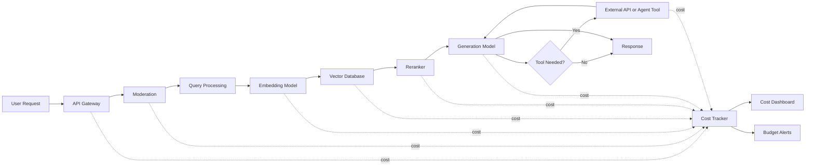
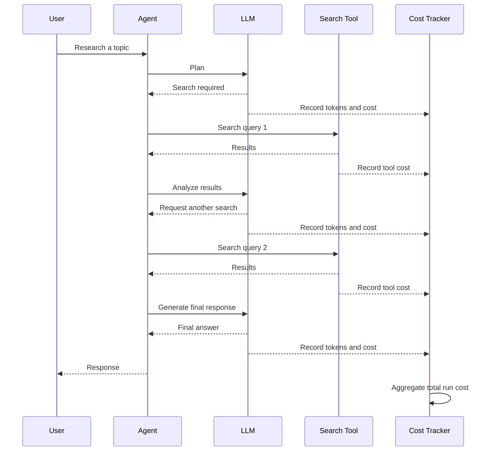
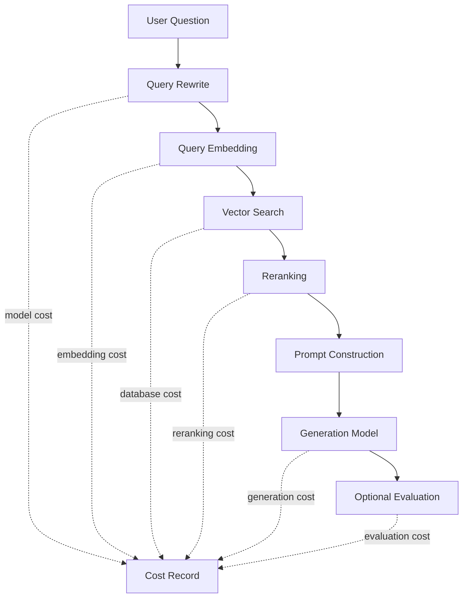
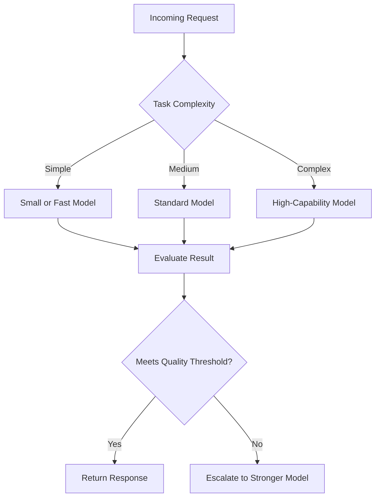

# 004 - Cost Tracking

**Course:** 05 - Production and Portfolio
**Module:** Module 13 - Production AI and LLMOps
**Content Group:** Production Concerns
**Roadmap Source:** Production AI and LLMOps / Production Concerns
**Lesson Type:** Production AI
**Lesson Order:** 004
**Suggested Duration:** 24 minutes

---

## 1. Overview

**Cost tracking** is the process of measuring, recording, analyzing, and controlling how much an AI application costs to operate.

In a traditional web application, infrastructure costs may mainly come from servers, storage, databases, and network traffic. In an AI application, every request may also create variable expenses from:

* Input tokens
* Output tokens
* Embedding generation
* Reranking models
* Image, audio, or video processing
* Agent tool calls
* Vector database queries
* External APIs
* Compute resources
* Logging and observability systems

A feature may work correctly but still be unsuitable for production if its operating cost is unpredictable or too high.

Cost tracking helps answer questions such as:

* How much does one request cost?
* Which user, feature, model, or agent consumes the most budget?
* Why did the daily cost suddenly increase?
* Is a more expensive model producing meaningfully better results?
* How much does it cost to serve one active user?
* Can the application remain profitable as usage grows?

Cost tracking should not be treated as a finance-only concern. It is part of the technical architecture, observability system, evaluation process, and product strategy.

---

## 2. Learning Objectives

After completing this lesson, you should be able to:

* Explain cost tracking in your own words.
* Identify where costs are created inside an AI workflow.
* Calculate the approximate cost of an LLM request.
* Add token and cost metadata to application logs.
* Compare cost across models, features, users, and environments.
* Design a simple cost dashboard.
* Create alerts and a runbook for abnormal cost increases.
* Apply cost controls to an API, RAG pipeline, agent, or multimodal application.
* Build a small production-ready cost-tracking artifact for your portfolio.

---

## 3. Why Cost Tracking Matters

AI application costs are often variable rather than fixed.

A normal API endpoint may perform one predictable database operation. An AI endpoint may perform:

1. A moderation request
2. A query-rewriting request
3. An embedding request
4. Several vector searches
5. A reranking request
6. A main LLM generation
7. One or more agent tool calls
8. A response-evaluation request

A single user action can therefore trigger multiple paid operations.

Without cost tracking, a team may not notice that:

* A prompt has become unnecessarily large.
* Conversation history is growing without limits.
* An agent is stuck in a tool-calling loop.
* Failed requests are being retried too many times.
* A premium model is being used for simple tasks.
* A batch job is processing the same data repeatedly.
* Bots or abusive users are generating expensive traffic.
* A deployment changed token usage unexpectedly.

Cost tracking converts these hidden expenses into measurable production signals.

---

## 4. Core Concepts

### 4.1 Token Usage

Most text-based language model APIs measure usage in tokens.

A request commonly reports:

* **Input tokens:** Tokens sent to the model
* **Output tokens:** Tokens generated by the model
* **Cached input tokens:** Reused tokens that may have a different price
* **Reasoning tokens:** Internal reasoning usage reported by some providers
* **Total tokens:** Combined usage for the request

A basic cost formula is:

```text
input_cost  = input_tokens  / 1,000,000 × input_price_per_million
output_cost = output_tokens / 1,000,000 × output_price_per_million

total_model_cost = input_cost + output_cost
```

For example, suppose a fictional model has these prices:

```text
Input:  $2.00 per 1 million tokens
Output: $8.00 per 1 million tokens
```

A request uses:

```text
Input tokens:  12,000
Output tokens: 3,000
```

The estimated cost is:

```text
Input cost  = 12,000 / 1,000,000 × $2.00 = $0.024
Output cost =  3,000 / 1,000,000 × $8.00 = $0.024

Total cost = $0.048
```

Pricing differs by provider, model, region, caching policy, and processing mode. Store prices in configuration instead of hard-coding them throughout the application.

---

### 4.2 Cost per Request

Cost per request is one of the most useful operational metrics.

```text
cost_per_request = total_cost / completed_requests
```

However, an average can hide important differences. Track cost separately for:

* Endpoint
* Feature
* Model
* Customer plan
* User
* Tenant
* Environment
* Prompt version
* Agent
* Tool
* Request status

For example:

| Feature          | Average Cost | P95 Cost | Notes                         |
| ---------------- | -----------: | -------: | ----------------------------- |
| FAQ answer       |       $0.003 |   $0.008 | Small prompt                  |
| Document summary |       $0.041 |   $0.120 | Depends on file size          |
| Research agent   |       $0.180 |   $0.760 | Multiple model and tool calls |
| Image analysis   |       $0.036 |   $0.090 | Depends on image resolution   |

The **P95 cost** shows the request cost below which 95% of requests fall. It is useful for finding expensive outliers.

---

### 4.3 Cost per Successful Outcome

A cheap request is not valuable if it produces an unusable result.

A stronger metric is:

```text
cost_per_successful_outcome =
    total_cost / number_of_successful_outcomes
```

A successful outcome may be defined as:

* A correctly answered question
* A resolved support request
* A completed booking
* An accepted code suggestion
* A document generated without manual correction
* A response that passes evaluation thresholds

Consider two models:

| Model   | Cost per Request | Success Rate | Cost per Successful Result |
| ------- | ---------------: | -----------: | -------------------------: |
| Model A |            $0.01 |          50% |                      $0.02 |
| Model B |            $0.03 |          90% |                     $0.033 |

Model A is cheaper per request, but the decision should also consider quality, latency, retries, and the cost of failures.

---

### 4.4 Cost per User and Tenant

For a multi-user application, cost should be attributable to individual users or organizations.

Useful metrics include:

```text
daily_cost_per_user
monthly_cost_per_user
cost_per_active_user
cost_per_tenant
cost_per_subscription_plan
```

These metrics support:

* Usage quotas
* Fair-use policies
* Enterprise billing
* Abuse detection
* Pricing decisions
* Customer profitability analysis

Avoid storing sensitive personal information directly in logs. Prefer internal user IDs, tenant IDs, or hashed identifiers.

---

### 4.5 Budget

A budget is a cost limit defined for a time period or scope.

Examples:

```text
Project budget:        $2,000 per month
Development budget:   $20 per day
Tenant budget:        $500 per month
Research agent limit: $1.00 per run
User daily limit:     $3.00 per day
```

Budgets may be:

* **Soft limits:** Generate a warning but allow the request.
* **Hard limits:** Block or downgrade requests after the limit is reached.
* **Forecast limits:** Trigger an alert when projected spending is too high.

---

### 4.6 Cost Forecasting

Historical cost tracking can be used to estimate future spending.

A basic forecast is:

```text
projected_monthly_cost =
    average_daily_cost × number_of_days_in_month
```

A usage-based forecast can be more useful:

```text
projected_cost =
    expected_users
    × requests_per_user
    × average_cost_per_request
```

Example:

```text
10,000 users
× 20 requests per user per month
× $0.012 per request
= $2,400 projected monthly model cost
```

This estimate should also include supporting services such as databases, storage, observability, and external tools.

---

## 5. Where Costs Appear in an AI Application



Each component can create a different type of expense.

### Model Costs

* Text generation
* Embeddings
* Reranking
* Speech recognition
* Text-to-speech
* Image generation
* Image understanding
* Video processing

### Infrastructure Costs

* Application servers
* GPU or CPU workers
* Databases
* Vector databases
* Object storage
* Queues
* Caches
* Network traffic

### External Tool Costs

* Search APIs
* Maps APIs
* Weather APIs
* Email services
* Payment systems
* Document-processing services
* Data enrichment providers

### Operational Costs

* Logging
* Tracing
* Metrics
* Evaluation jobs
* Security scanning
* Data retention
* Backups

A complete cost model should include more than LLM token prices.

---

## 6. Cost-Tracking Workflow

A production request should produce a traceable sequence of operational data.

```text
request_id
    -> user and feature
    -> model
    -> latency
    -> input tokens
    -> output tokens
    -> model cost
    -> retrieval cost
    -> tool cost
    -> total request cost
    -> quality signal
    -> safety signal
    -> user feedback
```

A useful event record might contain:

```json
{
  "timestamp": "2026-07-28T16:30:00Z",
  "request_id": "req_01JABC123",
  "trace_id": "trace_01JABC456",
  "environment": "production",
  "user_id": "usr_4821",
  "tenant_id": "org_104",
  "feature": "document_summary",
  "endpoint": "/api/v1/summaries",
  "model_provider": "example-provider",
  "model": "example-large-model",
  "prompt_version": "summary_v4",
  "input_tokens": 12450,
  "output_tokens": 2180,
  "cached_tokens": 4000,
  "model_cost_usd": 0.04234,
  "retrieval_cost_usd": 0.0008,
  "tool_cost_usd": 0,
  "infrastructure_cost_usd": 0.0012,
  "total_cost_usd": 0.04434,
  "latency_ms": 4280,
  "status": "success",
  "quality_score": 0.87,
  "safety_status": "passed"
}
```

Use a consistent currency field such as `total_cost_usd` so that dashboards and aggregation queries remain clear.

---

## 7. Cost Attribution

Cost attribution means assigning expenses to the component or business dimension that created them.

### Recommended Attribution Dimensions

| Dimension      | Example                                |
| -------------- | -------------------------------------- |
| Request        | `req_01JABC123`                        |
| Trace          | `trace_01JABC456`                      |
| User           | `usr_4821`                             |
| Tenant         | `org_104`                              |
| Feature        | `document_summary`                     |
| Endpoint       | `/api/v1/summaries`                    |
| Model          | `example-large-model`                  |
| Provider       | `example-provider`                     |
| Prompt version | `summary_v4`                           |
| Environment    | `development`, `staging`, `production` |
| Agent          | `research_agent`                       |
| Tool           | `web_search`                           |
| Status         | `success`, `failed`, `timeout`         |

Without attribution, the team only knows that spending increased. With attribution, the team can identify exactly where and why it increased.

---

## 8. Example Cost Calculator in Python

The following example uses fictional model prices for demonstration.

```python
from dataclasses import dataclass
from decimal import Decimal
from typing import Mapping


@dataclass(frozen=True)
class ModelPricing:
    input_per_million: Decimal
    output_per_million: Decimal
    cached_input_per_million: Decimal = Decimal("0")


PRICING: Mapping[str, ModelPricing] = {
    "fast-model": ModelPricing(
        input_per_million=Decimal("0.50"),
        output_per_million=Decimal("2.00"),
        cached_input_per_million=Decimal("0.10"),
    ),
    "quality-model": ModelPricing(
        input_per_million=Decimal("3.00"),
        output_per_million=Decimal("12.00"),
        cached_input_per_million=Decimal("0.60"),
    ),
}


def calculate_model_cost(
    *,
    model: str,
    input_tokens: int,
    output_tokens: int,
    cached_input_tokens: int = 0,
) -> Decimal:
    if model not in PRICING:
        raise ValueError(f"Unknown model pricing: {model}")

    if min(input_tokens, output_tokens, cached_input_tokens) < 0:
        raise ValueError("Token counts cannot be negative")

    pricing = PRICING[model]

    non_cached_input_tokens = max(
        input_tokens - cached_input_tokens,
        0,
    )

    input_cost = (
        Decimal(non_cached_input_tokens)
        / Decimal("1000000")
        * pricing.input_per_million
    )

    cached_cost = (
        Decimal(cached_input_tokens)
        / Decimal("1000000")
        * pricing.cached_input_per_million
    )

    output_cost = (
        Decimal(output_tokens)
        / Decimal("1000000")
        * pricing.output_per_million
    )

    return input_cost + cached_cost + output_cost


cost = calculate_model_cost(
    model="quality-model",
    input_tokens=12_000,
    output_tokens=3_000,
    cached_input_tokens=4_000,
)

print(f"Estimated model cost: ${cost:.6f}")
```

### Why Use `Decimal`?

Floating-point arithmetic can create small precision errors. `Decimal` is more suitable when calculating and aggregating monetary values.

### Production Improvements

A real implementation should also:

* Store pricing in a versioned configuration.
* Record the pricing version used for each calculation.
* Support provider-specific token categories.
* Store actual provider-reported cost when available.
* Compare estimated cost with invoice data.
* Handle batch and cached requests correctly.
* Update pricing without redeploying the entire application.

---

## 9. Request-Level Cost Middleware

Cost tracking can be connected to request tracing.

```python
import time
import uuid
from dataclasses import dataclass, field
from decimal import Decimal


@dataclass
class RequestCostContext:
    request_id: str
    started_at: float = field(default_factory=time.perf_counter)
    model_cost_usd: Decimal = Decimal("0")
    retrieval_cost_usd: Decimal = Decimal("0")
    tool_cost_usd: Decimal = Decimal("0")

    def add_model_cost(self, amount: Decimal) -> None:
        self.model_cost_usd += amount

    def add_retrieval_cost(self, amount: Decimal) -> None:
        self.retrieval_cost_usd += amount

    def add_tool_cost(self, amount: Decimal) -> None:
        self.tool_cost_usd += amount

    @property
    def total_cost_usd(self) -> Decimal:
        return (
            self.model_cost_usd
            + self.retrieval_cost_usd
            + self.tool_cost_usd
        )

    @property
    def latency_ms(self) -> int:
        elapsed = time.perf_counter() - self.started_at
        return round(elapsed * 1000)


context = RequestCostContext(
    request_id=f"req_{uuid.uuid4().hex}",
)

# After an LLM call:
context.add_model_cost(Decimal("0.0142"))

# After a search or paid external tool call:
context.add_tool_cost(Decimal("0.0020"))

print(
    {
        "request_id": context.request_id,
        "latency_ms": context.latency_ms,
        "total_cost_usd": str(context.total_cost_usd),
    }
)
```

The context can be passed through the application or attached to a trace using context-local storage.

---

## 10. Tracking Multi-Step Agent Costs

Agent systems require special attention because one user request may trigger an unknown number of steps.



For each agent run, record:

* Number of model calls
* Number of tool calls
* Tokens per step
* Cost per step
* Total run cost
* Maximum allowed steps
* Maximum allowed cost
* Stop reason
* Success or failure status

Example guardrails:

```text
Maximum model calls per run: 8
Maximum tool calls per run: 12
Maximum agent duration: 90 seconds
Maximum cost per run: $0.75
```

The agent should stop safely when a limit is reached.

---

## 11. Cost Tracking in RAG

A Retrieval-Augmented Generation pipeline may generate costs at several stages.



Useful RAG cost metrics include:

* Embedding cost per document
* Embedding cost per query
* Cost per indexed document
* Retrieval cost per request
* Reranking cost per request
* Context tokens per request
* Cost per retrieved chunk
* Cost per grounded answer
* Cost of ingestion jobs
* Percentage of unused retrieved context

A common cost problem is retrieving too many chunks and adding all of them to the prompt. This increases input tokens and may also reduce response quality.

---

## 12. Cost Tracking in Multimodal Applications

Multimodal applications may use pricing dimensions other than text tokens.

Examples include:

* Image resolution
* Number of images
* Audio duration
* Video duration
* Number of generated images
* Output resolution
* Speech characters
* GPU processing time
* File size

A multimodal cost event may include:

```json
{
  "request_id": "req_image_728",
  "feature": "receipt_analysis",
  "model": "vision-model",
  "image_count": 3,
  "total_image_bytes": 4839200,
  "input_tokens": 8520,
  "output_tokens": 760,
  "model_cost_usd": 0.0314,
  "storage_cost_usd": 0.0002,
  "total_cost_usd": 0.0316
}
```

Do not assume that all multimodal costs can be accurately estimated using text-token formulas.

---

## 13. Dashboard Design

A useful cost dashboard should help both engineers and product owners understand spending.

### Summary Cards

```text
Cost today
Cost this month
Projected monthly cost
Average cost per request
P95 cost per request
Cost per active user
Budget consumed
```

### Recommended Charts

1. Daily cost over time
2. Cost by model
3. Cost by feature
4. Cost by tenant
5. Token usage over time
6. Cost versus latency
7. Cost versus quality
8. Failed-request cost
9. Retry cost
10. Agent cost distribution

### Example Dashboard Layout

```text
+--------------------------------------------------------------+
| Cost Today | Monthly Cost | Forecast | Budget Used           |
|   $84.20   |   $1,940.50  | $2,680   | 67%                   |
+--------------------------------------------------------------+
| Daily Cost Trend                                             |
| ▁▂▂▃▃▄▅▅▇█                                                   |
+------------------------------+-------------------------------+
| Cost by Feature              | Cost by Model                 |
| Research Agent      42%       | Quality Model        58%      |
| Document Summary    28%       | Fast Model           31%      |
| Support Chat        18%       | Embedding Model      11%      |
| Other               12%       |                               |
+------------------------------+-------------------------------+
| Alerts                                                       |
| - Research agent P95 cost increased by 48%                   |
| - Tenant org_104 reached 90% of monthly budget               |
+--------------------------------------------------------------+
```

---

## 14. Important Cost Metrics

### Financial Metrics

```text
total_cost
daily_cost
monthly_cost
projected_monthly_cost
cost_per_request
cost_per_user
cost_per_tenant
cost_per_successful_outcome
```

### Model Metrics

```text
input_tokens
output_tokens
cached_tokens
tokens_per_request
model_calls_per_request
cost_by_model
cost_by_prompt_version
```

### Reliability Metrics

```text
cost_of_failed_requests
cost_of_timeouts
retry_cost
duplicate_request_cost
agent_loop_cost
fallback_model_cost
```

### Product Metrics

```text
cost_per_feature
cost_per_subscription_plan
cost_per retained_user
cost_per resolved_ticket
revenue_to_ai_cost_ratio
```

### Optimization Metrics

```text
cache_hit_rate
cost_saved_by_cache
cost_saved_by_model_routing
context_utilization
retrieved_chunk_utilization
batch_processing_savings
```

---

## 15. Cost Alerts

Cost alerts should detect unexpected behavior before the monthly invoice arrives.

### Static Threshold Alerts

```text
Daily cost exceeds $100
Request cost exceeds $1.00
User daily cost exceeds $5.00
Tenant consumes 90% of monthly budget
Agent run exceeds $0.75
```

### Relative Alerts

```text
Hourly cost increased by 100% compared with the previous hour
Average request cost increased by 30% after deployment
Output tokens increased by 50% compared with the seven-day baseline
Retry cost exceeded 10% of total cost
```

### Forecast Alerts

```text
Projected monthly cost exceeds the budget
Current usage will exhaust the tenant quota within three days
Development environment spending is approaching the production budget
```

Relative and forecast alerts are often more useful than static thresholds because expected usage changes over time.

---

## 16. Cost-Spike Runbook

A runbook defines what the team should do when spending increases unexpectedly.

### Trigger

```text
Hourly AI cost exceeds 2× the seven-day hourly average
or
Projected monthly spending exceeds the approved budget by 20%
```

### Step 1: Confirm the Alert

Check:

* Is the cost data complete?
* Was pricing configuration changed?
* Is there duplicate reporting?
* Does provider usage data show the same increase?

### Step 2: Identify the Source

Group cost by:

* Environment
* Endpoint
* Feature
* Model
* Prompt version
* User
* Tenant
* Agent
* Tool
* Deployment version

### Step 3: Check Common Causes

* Increased traffic
* Bot or abusive traffic
* Larger prompts
* Longer outputs
* Agent loops
* Excessive retries
* Cache failure
* Model-routing failure
* Duplicate background jobs
* Incorrect model selection
* Larger retrieved context
* New evaluation calls
* Provider price configuration error

### Step 4: Apply Immediate Mitigation

Possible actions:

* Disable the affected feature.
* Reduce maximum output tokens.
* Reduce retrieved context.
* Limit agent steps.
* Switch to a cheaper fallback model.
* Restore a previous prompt version.
* Enable stricter rate limits.
* Block abusive clients.
* Pause a batch job.
* Restore caching.
* Roll back the deployment.

### Step 5: Validate Recovery

Confirm that:

* Cost has returned to the expected range.
* User-facing error rates remain acceptable.
* Quality has not dropped below the minimum threshold.
* The root cause is understood.
* Temporary controls are documented.

### Step 6: Prevent Recurrence

Add:

* A regression test
* A budget guard
* A more specific alert
* A maximum token limit
* An agent step limit
* A deployment cost comparison
* A post-incident report

---

## 17. Common Optimization Strategies

### 17.1 Model Routing

Use expensive models only when the task requires them.



Routing decisions may use:

* Task type
* Prompt length
* User plan
* Quality requirements
* Risk level
* Previous model confidence
* Tool requirements

---

### 17.2 Prompt Reduction

Reduce unnecessary input tokens by:

* Removing duplicated instructions
* Shortening examples
* Summarizing conversation history
* Selecting only relevant memory
* Limiting retrieved chunks
* Avoiding repeated schemas
* Moving stable instructions into cached prefixes when supported

Do not optimize a prompt only for token count. Verify that quality and safety remain acceptable.

---

### 17.3 Output Limits

Set a reasonable maximum output length.

```python
MAX_OUTPUT_TOKENS_BY_FEATURE = {
    "classification": 50,
    "faq_answer": 500,
    "document_summary": 1200,
    "research_report": 3000,
}
```

Requesting extremely large output limits may increase worst-case cost even when most responses are shorter.

---

### 17.4 Caching

Caching can reduce repeated model and retrieval work.

Cache candidates include:

* Embeddings
* Retrieval results
* System prompt prefixes
* Identical FAQ responses
* Document summaries
* Tool results
* Model responses for deterministic requests

Track:

```text
cache_hits
cache_misses
cache_hit_rate
estimated_cost_without_cache
actual_cost
cost_saved
```

Caching must respect user permissions, data freshness, and privacy boundaries.

---

### 17.5 Batch Processing

Batch processing may reduce cost for non-interactive workloads such as:

* Document embeddings
* Offline evaluations
* Large classification jobs
* Content tagging
* Dataset processing

Do not place latency-sensitive user requests into slow batch workflows.

---

### 17.6 Retry Control

Retries can silently multiply cost.

Use:

* Maximum retry counts
* Exponential backoff
* Jitter
* Idempotency keys
* Retry only for recoverable errors
* Circuit breakers
* Provider health checks

Track retry cost separately:

```text
retry_cost_ratio = retry_cost / total_cost
```

---

### 17.7 Context Management

Conversation history should not grow without limits.

Possible strategies:

* Sliding windows
* Conversation summarization
* Selective memory retrieval
* Message importance scoring
* Token budgets per context section
* Removal of old tool results

Example context budget:

```text
System instructions:  2,000 tokens
Conversation summary: 1,500 tokens
Recent messages:      4,000 tokens
Retrieved documents:  6,000 tokens
User request:         1,000 tokens
Reserved output:      2,000 tokens
```

---

## 18. Cost Versus Quality

The cheapest model is not always the most economical model.

A complete evaluation should compare:

* Cost
* Quality
* Latency
* Reliability
* Safety
* User satisfaction
* Retry rate
* Escalation rate

Example evaluation table:

| Model Strategy   | Avg. Cost | Quality Score | P95 Latency | Failure Rate |
| ---------------- | --------: | ------------: | ----------: | -----------: |
| Small model only |    $0.004 |          0.68 |       1.2 s |         7.2% |
| Large model only |    $0.041 |          0.92 |       4.8 s |         2.1% |
| Routed approach  |    $0.014 |          0.88 |       2.3 s |         2.8% |

The routed approach may provide the best balance even though it is not the cheapest per request.

---

## 19. Cost Regression Testing

Cost should be tested during development, not only observed after deployment.

A cost regression test can verify that a prompt or model change does not increase usage beyond an acceptable threshold.

```python
def test_summary_prompt_cost_regression():
    baseline_average_tokens = 3_200
    allowed_increase = 0.15

    new_average_tokens = run_summary_token_benchmark()

    maximum_allowed = baseline_average_tokens * (
        1 + allowed_increase
    )

    assert new_average_tokens <= maximum_allowed, (
        f"Token regression: {new_average_tokens} exceeds "
        f"the limit of {maximum_allowed:.0f}"
    )
```

A complete evaluation should also verify quality. A change that reduces tokens but damages accuracy should not pass.

### Deployment Comparison

Compare the new release with the production baseline:

```text
Average input tokens:   +8%
Average output tokens:  -4%
Average request cost:   +3%
Quality score:          +6%
P95 latency:            +2%
Safety pass rate:       unchanged
```

This creates an explicit engineering tradeoff rather than an accidental cost change.

---

## 20. Failure Costs

Failed requests may still consume resources.

Track cost for:

* Timeouts after model generation
* Invalid structured output
* Safety-filtered responses
* Tool failures
* User cancellations
* Client disconnects
* Retry attempts
* Internal server errors
* Responses rejected by quality checks

Useful metric:

```text
wasted_cost_ratio =
    cost_of_unsuccessful_requests / total_cost
```

A high wasted-cost ratio may indicate poor retry logic, unreliable tools, weak schemas, or bad timeout configuration.

---

## 21. Cost Controls

Cost controls prevent spending from becoming unbounded.

### Request-Level Controls

* Maximum input length
* Maximum output tokens
* Maximum tool calls
* Maximum agent steps
* Maximum cost per request
* Request timeout
* File-size limit

### User-Level Controls

* Daily request quota
* Daily token quota
* Daily cost quota
* Concurrent-request limit
* Premium-feature permissions

### Tenant-Level Controls

* Monthly budget
* Feature-specific quotas
* Model permissions
* Custom alert thresholds
* Hard or soft spending limits

### Environment Controls

* Lower limits in development
* Separate API keys
* Separate dashboards
* Test-model defaults
* Disabled expensive features
* Automatic expiration for experiments

---

## 22. Budget Guard Example

```python
from dataclasses import dataclass
from decimal import Decimal


class BudgetExceededError(RuntimeError):
    pass


@dataclass(frozen=True)
class BudgetStatus:
    spent_usd: Decimal
    limit_usd: Decimal

    @property
    def remaining_usd(self) -> Decimal:
        return max(
            self.limit_usd - self.spent_usd,
            Decimal("0"),
        )

    @property
    def usage_ratio(self) -> Decimal:
        if self.limit_usd == 0:
            return Decimal("1")
        return self.spent_usd / self.limit_usd


def enforce_budget(
    status: BudgetStatus,
    estimated_request_cost_usd: Decimal,
) -> None:
    projected_total = (
        status.spent_usd + estimated_request_cost_usd
    )

    if projected_total > status.limit_usd:
        raise BudgetExceededError(
            "This request would exceed the configured budget."
        )


status = BudgetStatus(
    spent_usd=Decimal("94.50"),
    limit_usd=Decimal("100.00"),
)

enforce_budget(
    status,
    estimated_request_cost_usd=Decimal("2.40"),
)
```

In practice, budget checks must handle concurrency. Several requests may start at the same time, so simple read-then-write logic can exceed the intended limit. Use atomic database operations or reserved budgets where necessary.

---

## 23. Recommended Data Model

A simple relational table could be:

```sql
CREATE TABLE ai_cost_events (
    id UUID PRIMARY KEY,
    created_at TIMESTAMPTZ NOT NULL,
    request_id TEXT NOT NULL,
    trace_id TEXT,
    environment TEXT NOT NULL,
    user_id TEXT,
    tenant_id TEXT,
    feature TEXT NOT NULL,
    endpoint TEXT,
    provider TEXT,
    model TEXT,
    prompt_version TEXT,
    operation_type TEXT NOT NULL,
    input_tokens INTEGER DEFAULT 0,
    output_tokens INTEGER DEFAULT 0,
    cached_tokens INTEGER DEFAULT 0,
    model_cost_usd NUMERIC(18, 8) DEFAULT 0,
    tool_cost_usd NUMERIC(18, 8) DEFAULT 0,
    infrastructure_cost_usd NUMERIC(18, 8) DEFAULT 0,
    total_cost_usd NUMERIC(18, 8) NOT NULL,
    latency_ms INTEGER,
    status TEXT NOT NULL,
    metadata JSONB
);
```

Useful indexes include:

```sql
CREATE INDEX idx_ai_cost_created_at
ON ai_cost_events (created_at);

CREATE INDEX idx_ai_cost_tenant_created_at
ON ai_cost_events (tenant_id, created_at);

CREATE INDEX idx_ai_cost_feature_created_at
ON ai_cost_events (feature, created_at);

CREATE INDEX idx_ai_cost_model_created_at
ON ai_cost_events (model, created_at);
```

Do not place full prompts or sensitive user content in cost tables unless there is a justified and protected requirement.

---

## 24. Example Analytics Queries

### Daily Cost

```sql
SELECT
    DATE(created_at) AS day,
    SUM(total_cost_usd) AS total_cost_usd
FROM ai_cost_events
WHERE environment = 'production'
GROUP BY DATE(created_at)
ORDER BY day;
```

### Cost by Feature

```sql
SELECT
    feature,
    COUNT(*) AS request_count,
    SUM(total_cost_usd) AS total_cost_usd,
    AVG(total_cost_usd) AS average_cost_usd
FROM ai_cost_events
WHERE created_at >= NOW() - INTERVAL '30 days'
GROUP BY feature
ORDER BY total_cost_usd DESC;
```

### Failed-Request Cost

```sql
SELECT
    status,
    COUNT(*) AS request_count,
    SUM(total_cost_usd) AS total_cost_usd
FROM ai_cost_events
WHERE status <> 'success'
  AND created_at >= NOW() - INTERVAL '7 days'
GROUP BY status
ORDER BY total_cost_usd DESC;
```

### Most Expensive Tenants

```sql
SELECT
    tenant_id,
    SUM(total_cost_usd) AS total_cost_usd
FROM ai_cost_events
WHERE created_at >= DATE_TRUNC('month', NOW())
GROUP BY tenant_id
ORDER BY total_cost_usd DESC
LIMIT 20;
```

---

## 25. Practical Demo

Build a small AI API with the following flow:

```text
User
  -> POST /api/v1/answer
  -> Generate request ID
  -> Validate user quota
  -> Retrieve relevant context
  -> Call the selected model
  -> Read token usage
  -> Calculate estimated cost
  -> Store cost event
  -> Update metrics
  -> Return answer with request ID
```

### Example Response Metadata

```json
{
  "request_id": "req_01JABC123",
  "answer": "The generated response appears here.",
  "usage": {
    "input_tokens": 1450,
    "output_tokens": 320
  },
  "cost": {
    "estimated_usd": 0.00491
  }
}
```

The public API does not always need to expose cost details. Internal dashboards and admin APIs may be more appropriate.

---

## 26. Hands-On Exercise

### Task 1: Add Request Observability

Add the following fields to an AI application:

* Request ID
* Trace ID
* Model
* Prompt version
* Latency
* Input tokens
* Output tokens
* Estimated cost
* Status
* Error type

### Task 2: Build a Pricing Configuration

Create a configuration file:

```yaml
pricing_version: "2026-07-demo"

models:
  fast-model:
    input_per_million_usd: 0.50
    output_per_million_usd: 2.00

  quality-model:
    input_per_million_usd: 3.00
    output_per_million_usd: 12.00
```

Use fictional values for the exercise and clearly label them as examples.

### Task 3: Create a Cost Dashboard

Display:

* Cost today
* Cost this month
* Average cost per request
* Cost by feature
* Cost by model
* Failed-request cost
* Projected monthly cost

### Task 4: Add a Budget Guard

Implement:

```text
Warning at 70% of budget
Critical alert at 90%
Hard limit at 100%
```

### Task 5: Write a Runbook

Document what to do when:

* Cost doubles within one hour.
* One user creates unusually high usage.
* An agent exceeds its maximum cost.
* A new deployment increases average token usage.
* Provider billing does not match internal estimates.

---

## 27. Suggested Portfolio Artifact

Create a small **Production AI Cost Monitor**.

### Required Components

```text
app/
├── api/
│   └── answer.py
├── cost_tracking/
│   ├── calculator.py
│   ├── middleware.py
│   ├── pricing.py
│   └── budget.py
├── observability/
│   ├── logging.py
│   └── metrics.py
├── tests/
│   ├── test_cost_calculator.py
│   ├── test_budget.py
│   └── test_cost_regression.py
├── dashboard/
│   └── dashboard.md
├── runbooks/
│   └── cost_spike.md
└── README.md
```

### README Sections

* Project overview
* Architecture
* Cost formula
* Data model
* Dashboard screenshots
* Budget policy
* Cost-spike runbook
* Test results
* Known limitations
* Future improvements

### Strong Portfolio Demonstration

Show a comparison such as:

```text
Before optimization:
- Average input tokens: 9,200
- Average cost: $0.041 per request
- Quality score: 0.86

After optimization:
- Average input tokens: 5,800
- Average cost: $0.027 per request
- Quality score: 0.85
```

Explain the tradeoff instead of only reporting that the cost decreased.

---

## 28. Common Mistakes

### 28.1 Tracking Only Total Tokens

Input and output tokens may have different prices. Store them separately.

### 28.2 Hard-Coding Prices

Provider prices can change. Use versioned pricing configuration.

### 28.3 Ignoring Failed Requests

A failed request may still incur the full model cost.

### 28.4 Tracking Only the Main Model Call

RAG, agents, moderation, evaluation, embeddings, and external tools also create expenses.

### 28.5 Using Only Average Cost

Average cost can hide expensive outliers. Track percentiles and maximum values.

### 28.6 Missing User or Feature Attribution

A total monthly number is not enough to find the source of a cost increase.

### 28.7 Logging Sensitive Content

Cost tracking usually requires metadata, not full prompts or private user data.

### 28.8 No Agent Limits

An agent without step, time, tool, or cost limits can create uncontrolled spending.

### 28.9 Optimizing Cost Without Evaluating Quality

A cheaper system that produces incorrect answers may create higher business costs.

### 28.10 Mixing Development and Production Usage

Use separate API keys, budgets, tags, and dashboards for each environment.

### 28.11 Ignoring Retries and Timeouts

Retry storms can multiply costs while the application appears unavailable.

### 28.12 No Cost Regression Test

A prompt or model update may increase operating cost even when functional tests pass.

---

## 29. Production Checklist

### Instrumentation

* [ ] Every request has a request ID.
* [ ] Related model and tool calls share a trace ID.
* [ ] Input and output tokens are recorded separately.
* [ ] Model, provider, and prompt version are recorded.
* [ ] Cost is attributed to a feature, user, or tenant.
* [ ] Failed-request and retry costs are recorded.
* [ ] Sensitive content is excluded or protected.

### Pricing

* [ ] Model pricing is stored in configuration.
* [ ] Pricing configuration is versioned.
* [ ] Cached and batch pricing are handled correctly.
* [ ] Estimates are compared with provider invoices.
* [ ] Currency fields are explicit.

### Guardrails

* [ ] Maximum output tokens are configured.
* [ ] Agent step and tool-call limits are configured.
* [ ] Request-level cost limits are configured where needed.
* [ ] User and tenant quotas are enforced.
* [ ] Rate limits are enabled.
* [ ] Retry limits and circuit breakers are enabled.

### Monitoring

* [ ] Daily and monthly costs are visible.
* [ ] Cost by feature and model is visible.
* [ ] P95 request cost is monitored.
* [ ] Cost-spike alerts are configured.
* [ ] Budget forecast alerts are configured.
* [ ] Failed-request cost is monitored.
* [ ] Cache savings are measured.

### Operations

* [ ] A cost-spike runbook exists.
* [ ] The team knows how to disable expensive features.
* [ ] Model fallback behavior is documented.
* [ ] Rollback procedures are tested.
* [ ] Cost regression tests run before deployment.
* [ ] Development and production budgets are separated.

---

## 30. Completion Checklist

* [ ] I can explain **cost tracking** in one or two minutes.
* [ ] I can calculate the approximate cost of an LLM request.
* [ ] I can identify cost sources in a RAG or agent pipeline.
* [ ] I have added token and cost metadata to a demo application.
* [ ] I have created a small dashboard or cost report.
* [ ] I have defined at least one budget and alert.
* [ ] I have written a runbook for cost spikes.
* [ ] I have recorded at least one limitation or open question.
* [ ] I understand the relationship between cost, quality, latency, reliability, safety, and user experience.

---

## 31. Related Outcome

Prepare AI applications for production using:

* Deployment practices
* Observability
* Token and cost tracking
* Reliability controls
* Rate-limit handling
* Safety regression testing
* Operational dashboards
* Incident runbooks

---

## 32. Related Project

**Production AI Demo with Cost Observability**

The project should include:

* Structured logging
* Request and trace IDs
* Token tracking
* Cost calculation
* Feature-level cost attribution
* Budget controls
* Cost alerts
* A dashboard
* A cost-spike runbook
* A public portfolio README

---

## 33. Key Takeaways

1. Every AI request can create multiple variable expenses.
2. Token usage is only one part of the total operating cost.
3. Costs should be attributed to requests, features, models, users, and tenants.
4. Average cost is not enough; monitor percentiles and expensive outliers.
5. Failed requests, retries, and agent loops can create significant waste.
6. Budgets, quotas, and cost limits should be enforced programmatically.
7. Cost optimization must be evaluated together with quality and safety.
8. Model routing, caching, prompt reduction, batching, and context management can reduce expenses.
9. Cost regression tests should be part of the deployment workflow.
10. A production AI system needs dashboards, alerts, and a cost-spike runbook.

---

## 34. Final Summary

**Cost tracking** makes the financial behavior of an AI application observable and controllable.

A production-ready application should connect every model call, retrieval operation, agent step, and external tool invocation to a request ID, usage record, cost estimate, quality signal, and operational status.

The objective is not simply to use the cheapest model. The objective is to deliver the required quality, latency, reliability, safety, and user experience at a sustainable and predictable cost.

Turn this lesson into a practical artifact: instrument an API route, calculate token costs, enforce a budget, create a dashboard, test for cost regressions, and document how to respond when spending unexpectedly increases.
