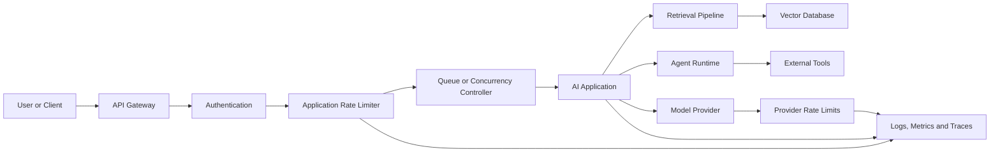
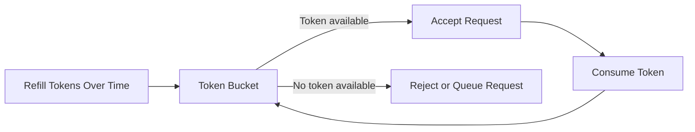
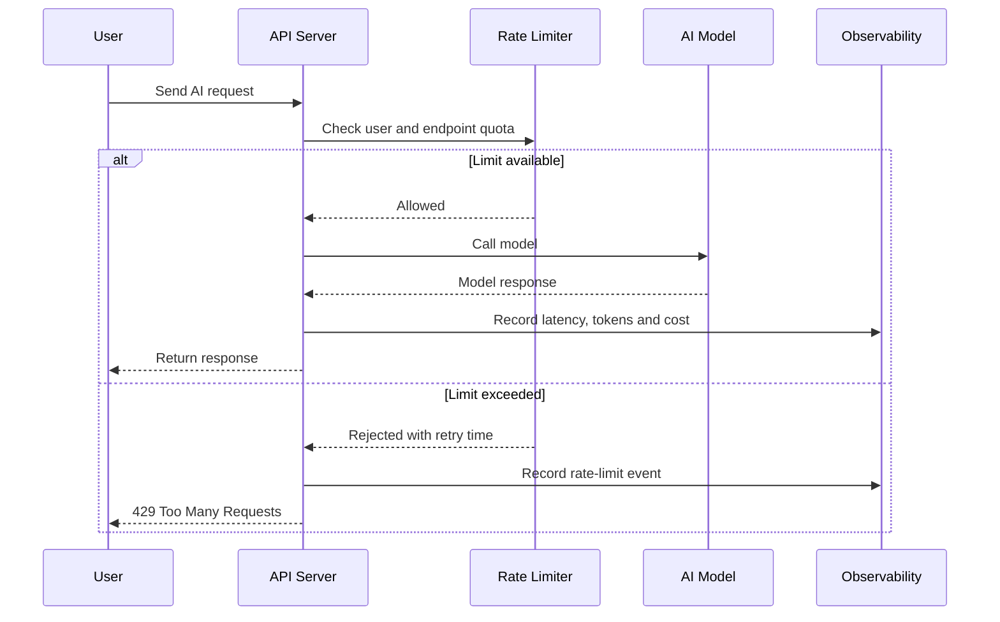
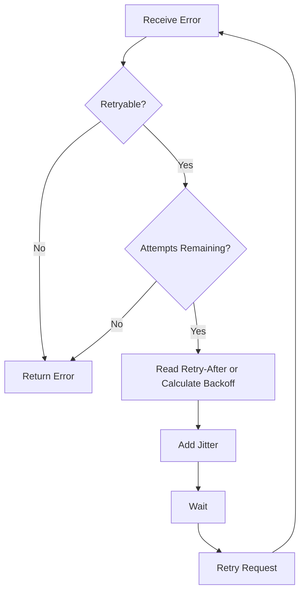
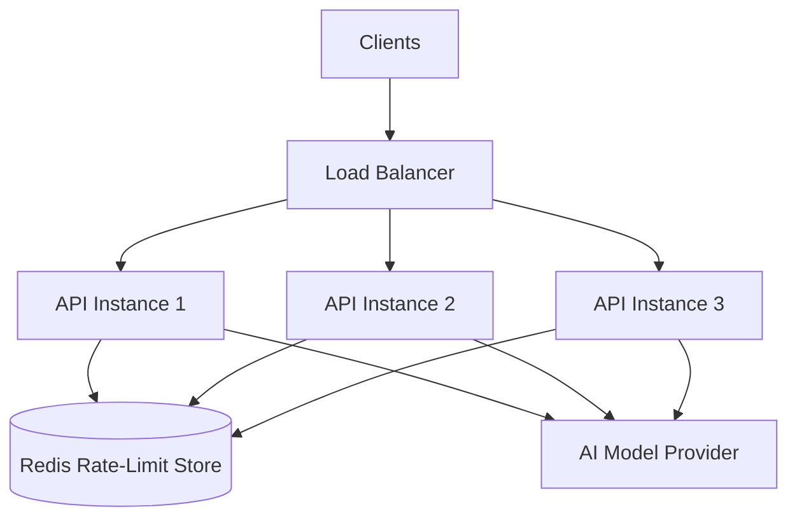
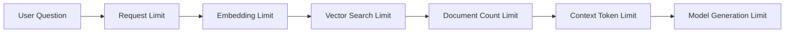
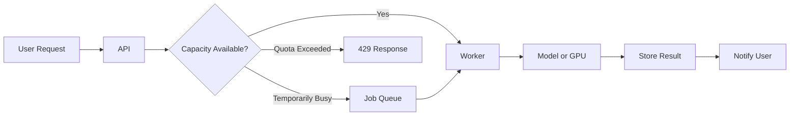
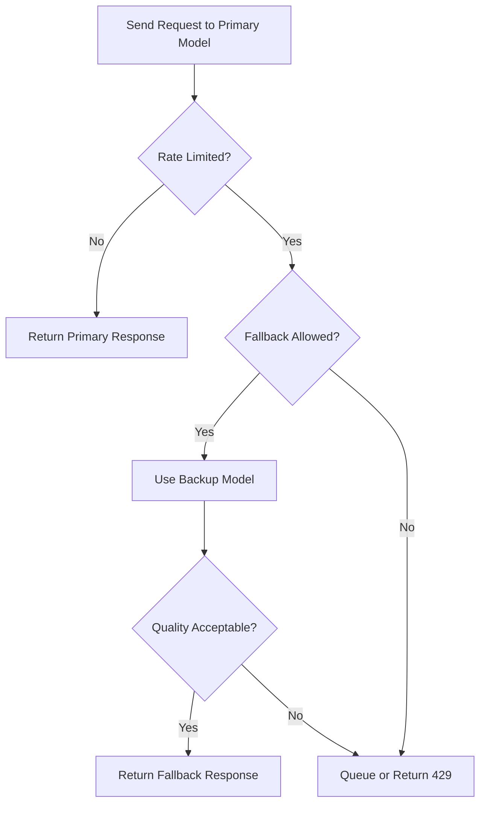
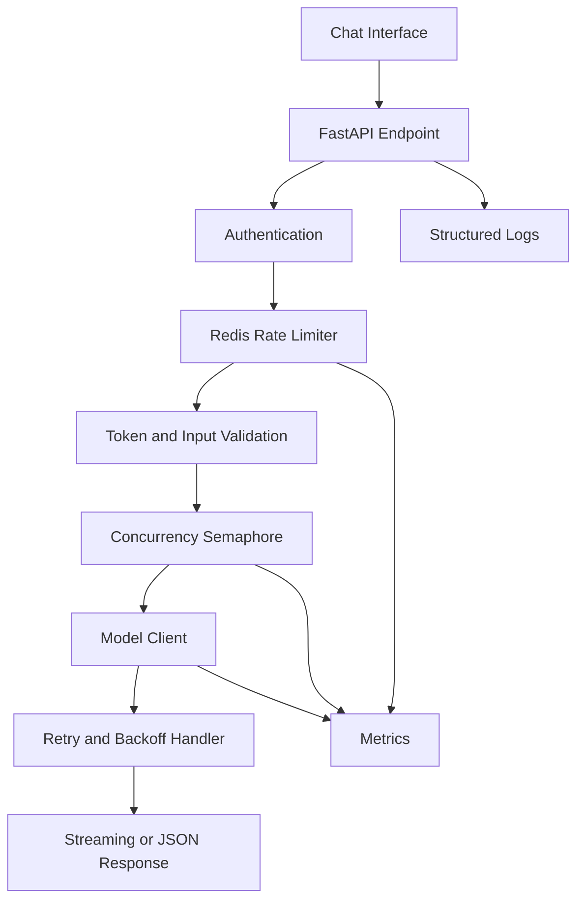

# 005 - Rate Limits

**Course:** 05 - Production and Portfolio
**Module:** Module 13 - Production AI and LLMOps
**Content Group:** Production Concerns
**Roadmap Source:** Production AI and LLMOps / Production Concerns
**Lesson Type:** Production AI
**Order in Module:** 005
**Suggested Duration:** 24 minutes

---

## 1. Overview

**Rate limiting** controls how many requests, tokens, model calls, or other operations an AI application can process within a specific period.

In a small demo, every user request may be sent directly to an AI model. In production, this approach becomes risky because:

* Many users may send requests at the same time.
* A single user may repeatedly call an expensive endpoint.
* Agents may generate many tool or model calls from one request.
* Model providers may enforce their own quotas.
* Traffic spikes may increase latency and cost.
* Automated scripts may abuse the application.
* Failed requests may create retry storms.

A well-designed rate-limiting system protects the application, controls cost, improves reliability, and provides a fair experience for users.

By the end of this lesson, you should understand where rate limits belong in an AI system and how to implement basic rate-limit handling for APIs, RAG pipelines, agents, and multimodal applications.

---

## 2. Learning Objectives

After completing this lesson, you should be able to:

* Explain rate limits in your own words.
* Distinguish between application-level and provider-level rate limits.
* Recognize common limit types such as requests per minute and tokens per minute.
* Select a rate-limiting strategy for an AI endpoint.
* Handle `429 Too Many Requests` responses correctly.
* Implement retries with exponential backoff and jitter.
* Use queues, caching, and concurrency controls to reduce model pressure.
* Define different limits for users, API keys, plans, and endpoints.
* Add rate-limit metrics to an observability dashboard.
* Create a small production-ready rate-limit checklist.

---

## 3. What Is a Rate Limit?

A rate limit defines the maximum amount of work that a client may request during a specific time window.

A simple example is:

```text
Maximum 20 requests per user every minute
```

When the user exceeds the limit, the server may reject the request with:

```http
HTTP/1.1 429 Too Many Requests
```

The server may also indicate when the user can try again:

```http
Retry-After: 12
```

This means the client should wait approximately 12 seconds before sending another request.

### Basic Formula

```text
Rate = Number of allowed operations / Time window
```

Examples:

```text
60 requests / minute
10 image generations / hour
100,000 tokens / day
5 concurrent model calls
1 report generation / user / minute
```

Rate limits are not limited to HTTP requests. In AI systems, they may also apply to:

* Input tokens
* Output tokens
* Total model tokens
* Embedding operations
* Vector database queries
* Image generations
* Audio transcription minutes
* Agent tool calls
* Concurrent streams
* Daily cost
* GPU processing time

---

## 4. Why Rate Limits Matter in AI Applications

Traditional APIs usually process predictable operations. AI endpoints are different because one request may consume significantly more resources than another.

For example:

```text
Request A:
- 200 input tokens
- 100 output tokens
- 1 model call

Request B:
- 20,000 input tokens
- 4,000 output tokens
- 8 retrieval queries
- 6 agent tool calls
- 3 model calls
```

Both are technically one HTTP request, but Request B is much more expensive.

Therefore, production AI applications often need several limit dimensions instead of only counting HTTP requests.

### Main Benefits

#### Reliability

Rate limits prevent sudden traffic spikes from overwhelming:

* API servers
* Model providers
* Databases
* Vector stores
* GPU workers
* External tools

#### Cost Control

AI operations may have variable costs. Limits prevent one user, bug, or agent loop from consuming the entire budget.

For example:

```text
Free user:
- 20 AI messages per day
- 2 image generations per day

Pro user:
- 500 AI messages per day
- 50 image generations per day

Internal system:
- Maximum $200 model cost per day
```

#### Fairness

Without per-user limits, one heavy user may consume most of the available capacity and reduce service quality for everyone else.

#### Abuse Prevention

Limits help reduce:

* Automated spam
* Credential sharing
* Web scraping
* Prompt flooding
* Brute-force attacks
* Expensive denial-of-service attempts

#### Better User Experience

A controlled rejection with a clear retry time is usually better than:

* Long timeouts
* Frozen interfaces
* Unpredictable latency
* Failed streams
* Model provider outages

---

## 5. Where Rate Limiting Fits in the AI Workflow

A production AI request may pass through several layers.



Rate limits may exist at multiple levels:

1. **API gateway level**
   Controls requests by IP address, API key, or route.

2. **Application level**
   Controls usage by user, account, subscription, feature, or tenant.

3. **Worker level**
   Controls concurrent jobs, GPU tasks, or background processing.

4. **Model-provider level**
   Enforces quotas defined by the external AI provider.

5. **Tool level**
   Limits calls to search APIs, databases, email systems, payment APIs, or other external services.

A production application should not depend only on the model provider’s limits. It should enforce its own limits before expensive work begins.

---

## 6. Common Types of Rate Limits

### 6.1 Requests per Second

```text
RPS = Requests Per Second
```

Useful for:

* High-volume APIs
* Health checks
* Search endpoints
* Lightweight AI routing

Example:

```text
10 requests per second per API key
```

---

### 6.2 Requests per Minute

```text
RPM = Requests Per Minute
```

Useful for:

* Chat endpoints
* RAG questions
* Content generation
* API access plans

Example:

```text
30 chat requests per minute per user
```

---

### 6.3 Tokens per Minute

```text
TPM = Tokens Per Minute
```

This limit is important because model usage depends heavily on token volume.

Example:

```text
100,000 total tokens per minute
```

A request may be rejected even when the application is below its request limit if the token budget has been exhausted.

---

### 6.4 Requests per Day

```text
RPD = Requests Per Day
```

Useful for:

* Free plans
* Trial accounts
* Expensive reports
* Image generation
* Data exports

Example:

```text
50 AI requests per free user per day
```

---

### 6.5 Concurrent Request Limits

This controls how many requests can run at the same time.

Example:

```text
Maximum 3 concurrent generations per user
Maximum 100 concurrent model calls for the service
```

Concurrency limits are especially important for:

* Streaming responses
* Long-running agents
* Image generation
* Video processing
* Speech transcription
* GPU inference

---

### 6.6 Cost-Based Limits

A request may be accepted or rejected based on estimated or accumulated cost.

Example:

```text
Maximum estimated request cost: $0.50
Maximum daily workspace cost: $200
```

Cost limits are useful when different models have very different prices.

---

### 6.7 Feature-Specific Limits

Different endpoints should usually have different limits.

```text
/chat                     -> 30 requests per minute
/images/generate          -> 5 requests per hour
/reports/generate         -> 2 requests per minute
/agents/run               -> 10 requests per hour
/audio/transcribe         -> 60 minutes per day
```

A single global request limit is often too simple for a real AI product.

---

## 7. Application Limits vs. Provider Limits

An AI application normally has at least two independent rate-limit systems.

| Limit Layer          | Controlled By     | Example                                  |
| -------------------- | ----------------- | ---------------------------------------- |
| Application limit    | Your system       | 20 chat requests per minute              |
| Subscription limit   | Your product      | 100 messages per day                     |
| Concurrency limit    | Your workers      | 5 active requests per user               |
| Model-provider limit | External provider | Token or request quota                   |
| Tool-provider limit  | External API      | Search queries per second                |
| Infrastructure limit | Cloud platform    | CPU, memory, connection, or GPU capacity |

### Important Principle

```text
Your application limit should usually be lower than the external provider limit.
```

This creates a safety margin and prevents normal traffic from constantly hitting the provider’s maximum capacity.

---

## 8. Rate-Limiting Algorithms

### 8.1 Fixed Window

The system counts requests inside a fixed time period.

Example:

```text
Window: 10:00:00 to 10:00:59
Limit: 10 requests
```

Advantages:

* Simple to implement
* Easy to understand
* Low storage cost

Limitation:

A user may send 10 requests at the end of one window and another 10 requests at the beginning of the next window.

```text
10 requests at 10:00:59
10 requests at 10:01:00
```

This creates a burst of 20 requests within approximately one second.

---

### 8.2 Sliding Window

The system counts requests during the previous rolling time period.

Example:

```text
At 10:01:20, count requests since 10:00:20
```

Advantages:

* More accurate
* Better burst protection
* Fairer than fixed windows

Limitations:

* More complex
* Requires additional storage or computation

---

### 8.3 Token Bucket

The user has a bucket containing tokens. Each operation consumes tokens, and tokens are continuously refilled.



Advantages:

* Supports controlled bursts
* Common in API gateways
* Flexible for different request weights

Example:

```text
Bucket capacity: 20 tokens
Refill rate: 1 token per second
Chat request cost: 1 token
Image request cost: 5 tokens
```

---

### 8.4 Leaky Bucket

Requests enter a queue and are processed at a controlled rate.

```text
Incoming requests -> Queue -> Constant processing rate
```

Advantages:

* Smooths traffic
* Protects downstream services
* Useful for background jobs

Limitations:

* Requests may wait longer
* The queue may become full
* Requires timeout and cancellation policies

---

### 8.5 Concurrency Semaphore

A semaphore limits the number of active operations.

```python
semaphore = asyncio.Semaphore(5)
```

Only five operations may run simultaneously. Additional operations must wait or be rejected.

This is useful for long-running requests where request frequency alone does not represent system pressure.

---

## 9. Basic Request Flow

A production AI request should be checked before calling an expensive model.



The application should reject excessive traffic before:

* Building a large prompt
* Running retrieval
* Calling external tools
* Uploading files to a model
* Starting a streaming response
* Creating an expensive background job

---

## 10. Handling `429 Too Many Requests`

A basic rate-limit response may look like this:

```http
HTTP/1.1 429 Too Many Requests
Content-Type: application/json
Retry-After: 15
X-RateLimit-Limit: 30
X-RateLimit-Remaining: 0
X-RateLimit-Reset: 1785263200
```

Example response body:

```json
{
  "error": {
    "code": "RATE_LIMIT_EXCEEDED",
    "message": "You have reached the chat request limit.",
    "retry_after_seconds": 15,
    "request_id": "req_8f41c9"
  }
}
```

Header names vary between systems, so clients should follow the documented contract of the API they are using.

### Good User Message

```text
You have reached the current request limit.
Please try again in 15 seconds.
```

### Poor User Message

```text
Unknown server error.
```

A clear error message improves trust and reduces repeated retries.

---

## 11. Retry Strategy

Not every rate-limit response should be retried immediately.

A reliable retry strategy should use:

* A maximum number of attempts
* Exponential backoff
* Random jitter
* Provider retry information
* Request cancellation
* An overall timeout
* Idempotency protection

### Exponential Backoff

A common formula is:

```text
delay = base_delay × 2^attempt
```

Example:

```text
Attempt 1 -> wait 1 second
Attempt 2 -> wait 2 seconds
Attempt 3 -> wait 4 seconds
Attempt 4 -> wait 8 seconds
```

### Adding Jitter

Without jitter, many clients may retry at exactly the same time.

```text
delay = exponential_backoff + random_jitter
```

Example:

```text
Attempt 1 -> 1.3 seconds
Attempt 2 -> 2.7 seconds
Attempt 3 -> 4.2 seconds
```

Jitter reduces synchronized retry storms.

### Retry Decision Flow



---

## 12. Python Retry Example

```python
import asyncio
import random
from typing import Any

class RateLimitError(Exception):
    def __init__(self, retry_after: float | None = None):
        self.retry_after = retry_after
        super().__init__("Rate limit exceeded")


async def call_with_retry(
    operation,
    *,
    max_attempts: int = 4,
    base_delay: float = 1.0,
    max_delay: float = 30.0,
) -> Any:
    """
    Retry a rate-limited async operation using exponential backoff and jitter.
    """

    for attempt in range(max_attempts):
        try:
            return await operation()

        except RateLimitError as error:
            is_last_attempt = attempt == max_attempts - 1

            if is_last_attempt:
                raise

            if error.retry_after is not None:
                delay = error.retry_after
            else:
                exponential_delay = base_delay * (2 ** attempt)
                delay = min(exponential_delay, max_delay)

            jitter = random.uniform(0, delay * 0.25)
            await asyncio.sleep(delay + jitter)

    raise RuntimeError("Retry loop finished unexpectedly")
```

This example should be extended in production with:

* Structured logging
* Request IDs
* Timeout handling
* Metrics
* Cancellation support
* Provider-specific error parsing
* Circuit breakers

---

## 13. Basic FastAPI Rate Limiter

The following example demonstrates the concept using memory storage.

```python
import time
from collections import defaultdict, deque

from fastapi import FastAPI, HTTPException, Request
from pydantic import BaseModel

app = FastAPI()

REQUEST_LIMIT = 10
WINDOW_SECONDS = 60

request_history: dict[str, deque[float]] = defaultdict(deque)


class ChatRequest(BaseModel):
    message: str


def get_client_key(request: Request) -> str:
    """
    A real application should prefer an authenticated user ID or API key.
    IP addresses alone may be unreliable because users can share networks.
    """
    user_id = request.headers.get("X-User-ID")

    if user_id:
        return f"user:{user_id}"

    client_host = request.client.host if request.client else "unknown"
    return f"ip:{client_host}"


def enforce_rate_limit(client_key: str) -> None:
    now = time.time()
    window_start = now - WINDOW_SECONDS
    history = request_history[client_key]

    while history and history[0] < window_start:
        history.popleft()

    if len(history) >= REQUEST_LIMIT:
        retry_after = max(1, int(history[0] + WINDOW_SECONDS - now))

        raise HTTPException(
            status_code=429,
            detail={
                "code": "RATE_LIMIT_EXCEEDED",
                "message": "Too many requests.",
                "retry_after_seconds": retry_after,
            },
            headers={
                "Retry-After": str(retry_after),
            },
        )

    history.append(now)


@app.post("/chat")
async def chat(request: Request, payload: ChatRequest):
    client_key = get_client_key(request)
    enforce_rate_limit(client_key)

    # The model should only be called after the limit check.
    return {
        "message": "Request accepted.",
        "input": payload.message,
    }
```

### Important Limitation

This in-memory implementation is suitable only for learning or a single-process demo.

It does not work correctly when:

* Multiple API processes are running
* Multiple servers are deployed
* The application restarts
* Limits must be shared across regions
* Strong consistency is required

A distributed production system commonly stores rate-limit counters in a shared service such as Redis.

---

## 14. Distributed Rate Limiting with Redis

A distributed architecture may look like this:



Redis can store keys such as:

```text
rate:user_123:chat:2026-07-28T23:47
rate:workspace_456:tokens:daily
concurrency:user_123:agent
budget:workspace_456:monthly
```

A rate-limit key should usually include relevant dimensions:

```text
user ID
workspace or tenant ID
endpoint
model
feature
subscription plan
time window
```

Example logical key:

```text
rate_limit:{workspace_id}:{user_id}:{endpoint}:{window}
```

Production implementations should use atomic operations or scripts to avoid race conditions.

---

## 15. Token-Aware Rate Limiting

Counting only requests may not adequately protect an AI application.

Consider these requests:

| Request                | Input Tokens | Maximum Output Tokens | Total Potential Tokens |
| ---------------------- | -----------: | --------------------: | ---------------------: |
| Simple question        |          100 |                   200 |                    300 |
| Large document summary |       30,000 |                 2,000 |                 32,000 |
| Agent task             |        8,000 |                12,000 |                 20,000 |

A token-aware limiter may estimate usage before calling the model.

```python
estimated_total_tokens = (
    estimated_input_tokens
    + requested_max_output_tokens
)
```

The request may be rejected when:

```text
estimated_total_tokens > remaining_token_budget
```

After the response is completed, the estimate should be replaced with actual usage when the provider returns token information.

### Reservation Pattern

A safer workflow is:

```text
1. Estimate request usage.
2. Reserve token capacity.
3. Call the model.
4. Read actual token usage.
5. Reconcile estimated and actual usage.
6. Release unused capacity.
```

This prevents many concurrent requests from all seeing the same available budget.

---

## 16. Rate Limiting for RAG Systems

A Retrieval-Augmented Generation request may use several resources:

```text
User request
    -> query rewriting
    -> embedding generation
    -> vector search
    -> reranking
    -> document loading
    -> final model generation
```

Possible limits include:

* Questions per minute
* Embedding tokens per minute
* Vector searches per second
* Documents retrieved per request
* Reranking requests per minute
* Maximum context size
* Maximum file size
* Maximum indexed documents per workspace



Rate-limit checks should happen before every expensive stage, not only at the public API boundary.

---

## 17. Rate Limiting for AI Agents

One user request may cause an agent to perform many actions.

```text
1 user request
    -> 4 model calls
    -> 6 web searches
    -> 3 database queries
    -> 2 file operations
```

Therefore, agent systems need execution budgets.

Example agent policy:

```yaml
agent_limits:
  max_iterations: 8
  max_model_calls: 6
  max_tool_calls: 12
  max_runtime_seconds: 90
  max_input_tokens: 50000
  max_output_tokens: 10000
  max_estimated_cost_usd: 0.75
```

The agent should stop safely when a budget is exhausted.

Example result:

```json
{
  "status": "limit_reached",
  "reason": "MAX_TOOL_CALLS_EXCEEDED",
  "completed_steps": 7,
  "request_id": "req_51d73f"
}
```

Without execution limits, a planning error may create an infinite or extremely expensive loop.

---

## 18. Rate Limiting for Multimodal Applications

Multimodal operations may consume more compute than text generation.

Feature-specific limits may include:

```text
Images:
- Maximum file size
- Maximum image count
- Generations per hour
- Pixels processed per request

Audio:
- Maximum audio duration
- Transcription minutes per day
- Concurrent audio jobs

Video:
- Maximum video duration
- Frames processed per second
- Concurrent GPU jobs
- Daily rendering quota
```

Example:

```yaml
multimodal_limits:
  max_images_per_request: 5
  max_image_size_mb: 10
  max_audio_minutes_per_day: 120
  max_concurrent_transcriptions: 2
  max_video_duration_seconds: 300
```

---

## 19. Streaming Response Considerations

Streaming requests remain active longer than normal requests.

A user may start many streams and leave them open, consuming:

* Server connections
* Worker capacity
* Provider concurrency
* Memory
* Network resources

A streaming endpoint should enforce:

* Maximum active streams per user
* Stream timeout
* Idle timeout
* Cancellation handling
* Maximum generated tokens
* Cleanup after disconnect
* Provider concurrency limits

```text
User disconnect
    -> cancel model request
    -> release semaphore
    -> release reserved tokens
    -> record partial usage
    -> close tracing span
```

Failing to clean up disconnected streams may create hidden resource leaks.

---

## 20. Queues and Backpressure

Rejecting every request is not always necessary. Some workloads can be placed in a queue.

Suitable queued tasks include:

* Report generation
* Document indexing
* Batch embeddings
* Image generation
* Video processing
* Large transcription jobs



The queue should have limits for:

* Maximum queue length
* Maximum wait time
* Jobs per user
* Job priority
* Retry attempts
* Dead-letter handling
* Duplicate jobs

Backpressure ensures that upstream systems slow down when downstream services are overloaded.

---

## 21. Caching to Reduce Rate-Limit Pressure

Caching can avoid repeated model or retrieval calls.

Potential cache targets include:

* Embeddings
* Retrieval results
* Repeated questions
* Model responses for deterministic prompts
* Tool results
* User profile context
* Prompt templates
* Document summaries

A cache key may include:

```text
model
prompt version
normalized input
temperature
language
retrieval index version
user permissions
```

Avoid caching sensitive or user-specific responses without proper isolation and access control.

---

## 22. Graceful Degradation

When the preferred model or service is rate-limited, the application may use a controlled fallback.



Possible degradation strategies:

* Use a smaller model
* Reduce maximum output tokens
* Skip optional reranking
* Use cached retrieval results
* Disable nonessential tools
* Queue the request
* Return a partial result
* Ask the user to retry later

Fallback behavior should be tested because different models may produce different formats, safety behavior, and quality levels.

---

## 23. Observability and Metrics

Rate limiting should be visible in production dashboards.

### Important Metrics

```text
requests_total
requests_allowed_total
requests_rejected_total
rate_limit_rejections_by_endpoint
rate_limit_rejections_by_plan
provider_429_total
retry_attempts_total
retry_success_total
retry_exhausted_total
active_requests
active_streams
queue_depth
queue_wait_seconds
tokens_per_minute
cost_per_hour
```

### Useful Log Fields

```json
{
  "timestamp": "2026-07-28T16:48:20Z",
  "level": "warning",
  "event": "rate_limit_exceeded",
  "request_id": "req_5b0cd1",
  "user_id": "user_123",
  "workspace_id": "workspace_456",
  "endpoint": "/api/v1/chat",
  "limit_type": "requests_per_minute",
  "limit": 30,
  "remaining": 0,
  "retry_after_seconds": 18,
  "model": "example-model",
  "subscription_plan": "free"
}
```

Avoid logging:

* Raw API keys
* Access tokens
* Full sensitive prompts
* Private documents
* Authentication secrets

---

## 24. Dashboard Example

A basic production dashboard should answer:

* How many requests are being rejected?
* Which endpoints are reaching their limits?
* Which users or tenants consume the most capacity?
* Are provider `429` errors increasing?
* Are retries succeeding?
* Is the queue growing?
* Are token usage and cost increasing unexpectedly?
* Are rate limits causing user-facing latency?

```text
Production AI Rate-Limit Dashboard

Traffic
- Requests per minute
- Requests by endpoint
- Active users
- Active streams

Limits
- Application 429 rate
- Provider 429 rate
- Token quota utilization
- Concurrency utilization

Reliability
- Retry success rate
- Queue depth
- Queue waiting time
- Timeout rate

Cost
- Tokens per minute
- Cost per hour
- Cost by workspace
- Budget utilization
```

---

## 25. Example Runbook

### Incident: Provider Rate-Limit Spike

#### Detection

```text
Alert:
provider_429_rate > 5% for 5 minutes
```

#### Investigation

1. Check traffic volume.
2. Check tokens per minute.
3. Check concurrent model calls.
4. Identify endpoints generating the most traffic.
5. Check whether retries are increasing load.
6. Check whether an agent loop or batch job is active.
7. Confirm provider quota status.
8. Compare current traffic with the normal baseline.

#### Immediate Actions

1. Reduce concurrency.
2. Pause nonessential batch jobs.
3. Increase backoff time.
4. Disable aggressive automatic retries.
5. Route eligible traffic to a fallback model.
6. Reduce maximum output tokens.
7. Enable queueing for background-compatible requests.
8. Temporarily lower free-tier limits.

#### Recovery Verification

* Provider `429` rate returns to normal.
* Queue depth decreases.
* Latency returns to baseline.
* Error rate decreases.
* Cost remains within budget.
* No duplicate jobs were created.

#### Follow-Up

* Update capacity assumptions.
* Add or adjust alerts.
* Review retry behavior.
* Add regression tests.
* Update the incident runbook.

---

## 26. Common Mistakes

### Relying Only on Provider Limits

The request may already have consumed application resources before the provider rejects it.

### Retrying Immediately

Immediate retries increase traffic and can make the rate-limit incident worse.

### Retrying Forever

Every retry loop must have:

* Maximum attempts
* Maximum elapsed time
* Cancellation support

### Using the Same Limit for Every Endpoint

A text chat request and a video-generation request do not have the same resource cost.

### Limiting Only by IP Address

Many legitimate users may share one IP address, while abusive users may rotate addresses.

Authenticated user IDs, API keys, workspaces, and device identifiers may provide better control.

### Ignoring Concurrent Requests

A user may stay below the per-minute limit while opening many long-running streams simultaneously.

### Counting Only Successful Requests

Failed model calls may still consume tokens, compute, or provider quota.

### Missing Idempotency

Retrying a non-idempotent request may create:

* Duplicate reports
* Duplicate emails
* Duplicate database records
* Duplicate charges
* Duplicate background jobs

### Exposing Internal Infrastructure

Error messages should not reveal:

* Internal server addresses
* Secret quota values
* Provider credentials
* Detailed security rules

### Logging Without Alerts

Logs are useful for investigation, but alerts are needed for timely incident response.

---

## 27. Production Design Checklist

### Identity

* [ ] Rate limits use an authenticated user, API key, or tenant when possible.
* [ ] Anonymous traffic has separate IP-based protection.
* [ ] Administrative and internal traffic use controlled policies.

### Limit Dimensions

* [ ] Requests per minute are defined.
* [ ] Token limits are defined.
* [ ] Concurrency limits are defined.
* [ ] Daily or monthly quotas are defined.
* [ ] Expensive features have separate limits.
* [ ] Agent execution budgets are defined.

### Error Handling

* [ ] The API returns `429 Too Many Requests`.
* [ ] The response includes a stable error code.
* [ ] Retry timing is communicated when available.
* [ ] The user receives a clear message.
* [ ] Request IDs are included.

### Retries

* [ ] Exponential backoff is implemented.
* [ ] Random jitter is included.
* [ ] Retry attempts are capped.
* [ ] Overall timeout is enforced.
* [ ] Non-retryable errors are not retried.
* [ ] Idempotency is considered.

### Infrastructure

* [ ] Distributed counters use shared storage.
* [ ] Counter updates are atomic.
* [ ] Queue size is limited.
* [ ] Worker concurrency is controlled.
* [ ] Streams are cleaned up after disconnects.
* [ ] Limits fail safely during storage outages.

### Observability

* [ ] Application `429` errors are measured.
* [ ] Provider `429` errors are measured separately.
* [ ] Retry success and failure are measured.
* [ ] Queue depth is visible.
* [ ] Token and cost usage are tracked.
* [ ] Alerts exist for abnormal rejection rates.

### User Experience

* [ ] Remaining quota is visible where appropriate.
* [ ] Retry instructions are clear.
* [ ] Long-running jobs show their queue status.
* [ ] Plan limits are documented.
* [ ] Upgrade messages are not misleading.
* [ ] Fallback behavior is clearly communicated.

---

## 28. Practical Exercise

Build a rate-limited AI chat endpoint.

### Requirements

1. Accept a chat message from an authenticated user.
2. Allow a maximum of 10 requests per minute per user.
3. Allow no more than 2 concurrent model calls per user.
4. Estimate input tokens before the model call.
5. Reject oversized requests before calling the model.
6. Return `429` with a retry time when the limit is exceeded.
7. Retry provider `429` errors with exponential backoff and jitter.
8. Record:

   * Request ID
   * User ID
   * Endpoint
   * Latency
   * Input tokens
   * Output tokens
   * Retry count
   * Provider error
   * Estimated cost
9. Add a small dashboard showing:

   * Requests per minute
   * Application `429` count
   * Provider `429` count
   * Active requests
   * Token usage
10. Write a short incident runbook.

### Suggested Architecture



---

## 29. Portfolio Artifact

Create a small repository containing:

```text
rate-limit-demo/
├── app/
│   ├── main.py
│   ├── rate_limiter.py
│   ├── model_client.py
│   ├── retry.py
│   ├── metrics.py
│   └── settings.py
├── tests/
│   ├── test_rate_limit.py
│   ├── test_concurrency.py
│   ├── test_retry.py
│   └── test_token_budget.py
├── dashboards/
│   └── rate-limit-dashboard.json
├── docs/
│   ├── architecture.md
│   └── runbook.md
├── docker-compose.yml
├── .env.example
└── README.md
```

The README should explain:

* The problem being solved
* The selected rate-limit algorithm
* The Redis key structure
* Request and token limits
* Retry behavior
* Concurrency control
* Metrics and alerts
* Known limitations
* Local setup instructions
* Production improvements

---

## 30. Knowledge Check

1. Why is requests-per-minute limiting insufficient for some AI endpoints?
2. What is the difference between an application rate limit and a provider rate limit?
3. Why should retries include random jitter?
4. When should a request be queued instead of rejected?
5. Why are concurrency limits important for streaming?
6. What could happen if an AI agent has no tool-call limit?
7. Why should rate-limit checks happen before retrieval and model calls?
8. What data should be included in a rate-limit log?
9. Why is an in-memory limiter unsuitable for multiple API instances?
10. How can caching reduce rate-limit pressure?

---

## 31. Completion Checklist

* [ ] I can explain rate limits in one or two minutes.
* [ ] I understand requests, tokens, concurrency, cost, and feature limits.
* [ ] I can explain fixed-window, sliding-window, and token-bucket strategies.
* [ ] I can handle `429 Too Many Requests`.
* [ ] I can implement exponential backoff with jitter.
* [ ] I understand why infinite retries are dangerous.
* [ ] I can define limits for RAG, agents, and multimodal features.
* [ ] I can add rate-limit metrics to a dashboard.
* [ ] I have created a small implementation or portfolio artifact.
* [ ] I have documented at least one limitation or open question.

---

## 32. Related Outcome

Prepare AI applications for production with:

* Reliable deployment
* Request and token observability
* Cost tracking
* Capacity management
* Retry handling
* Graceful degradation
* Safety monitoring
* Regression testing

---

## 33. Related Project

### Production AI Demo

Build and deploy an AI application that includes:

* Structured logging
* Request IDs
* Token tracking
* Cost tracking
* Rate limiting
* Concurrency control
* Retry handling
* Health checks
* Monitoring dashboards
* Incident runbooks
* Safety regression tests
* A public portfolio README

---

## 34. Summary

**Rate limits** are a core reliability and cost-control mechanism for production AI systems.

A complete rate-limiting strategy should consider more than HTTP request counts. It may need to control:

* Requests
* Tokens
* Concurrent operations
* Agent steps
* Tool calls
* Queue size
* Multimedia processing
* Daily usage
* Cost budgets

The most important production principles are:

```text
Check limits before expensive work.
Use application limits below provider limits.
Retry only retryable failures.
Use exponential backoff with jitter.
Control concurrency and agent execution.
Measure every rejection and retry.
Provide clear feedback to users.
```

Turn this lesson into a working API route, Redis limiter, retry utility, dashboard, runbook, or portfolio project so that rate limiting becomes an observable and testable part of your AI application.
