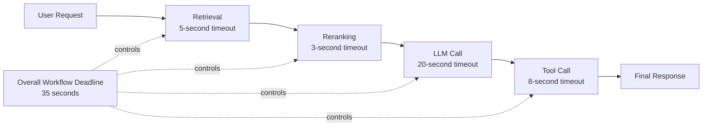
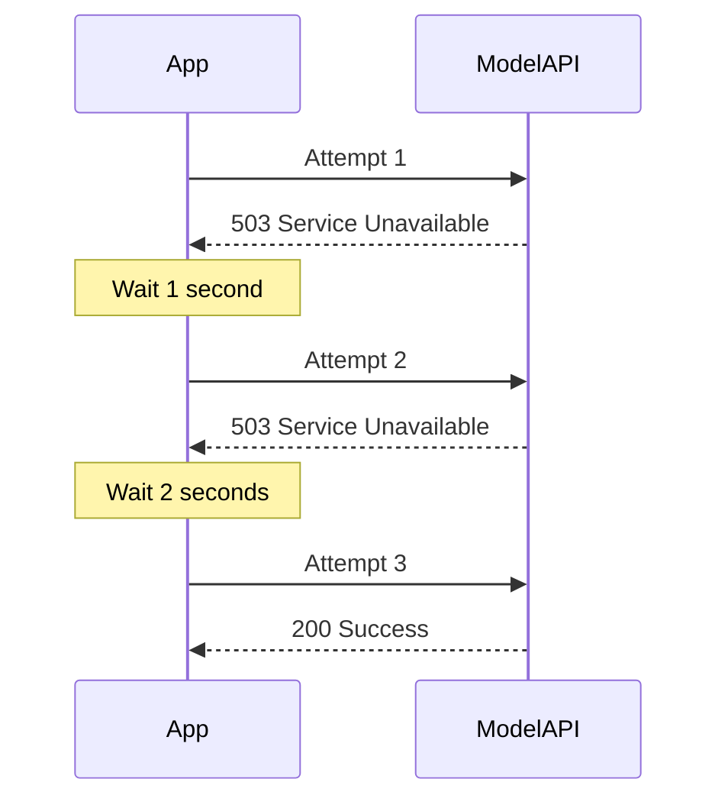
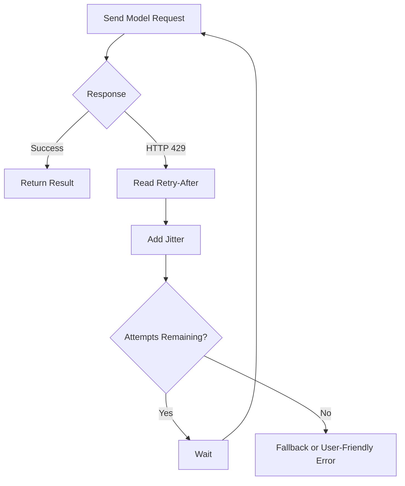
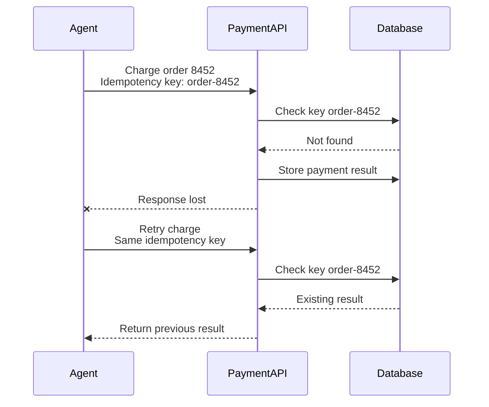
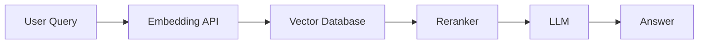
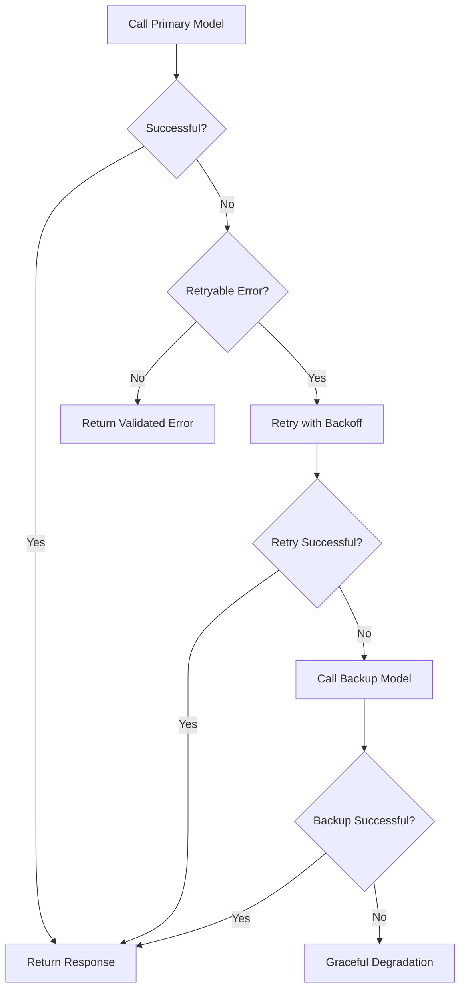
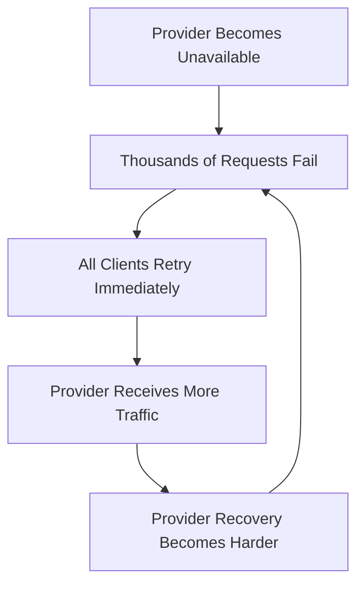
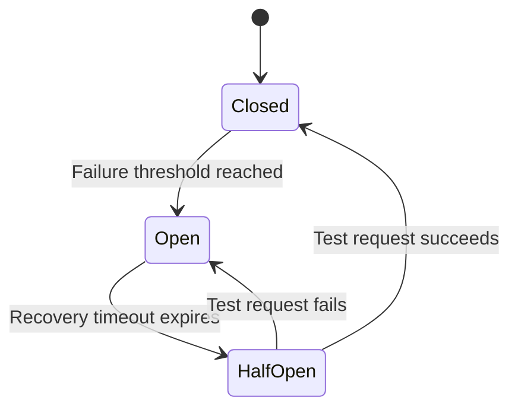
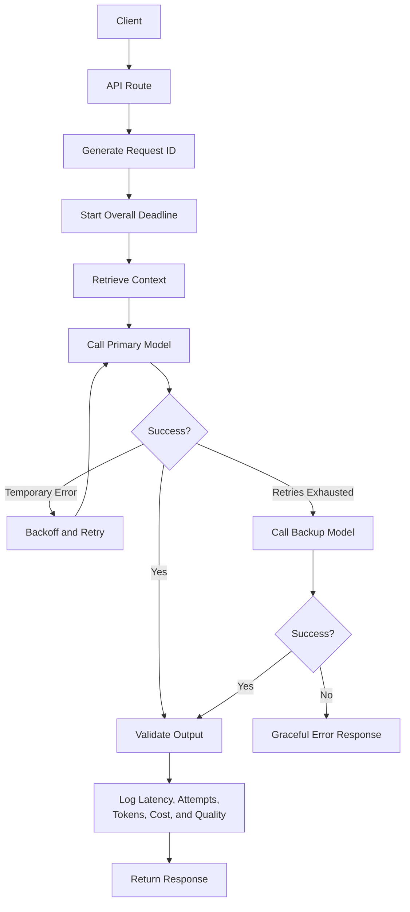

# 006 — Retries and Timeouts

**Course:** 05 — Production and Portfolio
**Module:** Module 13 — Production AI and LLMOps
**Content Group:** Production Concerns
**Roadmap Source:** Production AI and LLMOps / Production Concerns
**Lesson Type:** Production AI
**Order in Module:** 006
**Suggested Duration:** 24 minutes

---

## 1. Overview

AI applications depend on external systems such as:

* Large language model APIs
* Vector databases
* Search services
* Agent tools
* Internal microservices
* File-processing services
* Speech, image, and multimodal APIs

Any of these systems can become slow, temporarily unavailable, overloaded, or rate-limited.

**Timeouts** limit how long an application waits for an operation to finish.

**Retries** allow an application to repeat an operation when the first attempt fails because of a temporary problem.

Together, retries and timeouts help AI applications remain responsive and reliable when serving real users.

However, incorrect retry behavior can create new problems:

* Duplicate operations
* Increased latency
* Higher model costs
* API traffic spikes
* Retry storms
* Poor user experience

A production-ready AI system must therefore use retries and timeouts intentionally rather than applying them to every failure.

---

## 2. Learning Objectives

By the end of this lesson, you should be able to:

* Explain retries and timeouts in your own words.
* Distinguish transient failures from permanent failures.
* Configure connection, read, request, and workflow timeouts.
* Apply exponential backoff and jitter.
* Decide which errors should and should not be retried.
* Prevent duplicate side effects with idempotency.
* Handle model API failures, tool failures, and rate limits.
* Add retry and timeout observability to an AI application.
* Design graceful fallback behavior for failed AI requests.
* Create a small production reliability demo for your portfolio.

---

## 3. Why Retries and Timeouts Matter

Without a timeout, an application may wait indefinitely for a slow dependency.

Without retries, a temporary network error may immediately become a failed user request.

Consider a chatbot that calls an external model API:

```text
User request
    ↓
Application server
    ↓
Model provider
```

If the model provider does not respond, the server may keep the connection open for too long. The user sees a loading spinner, server resources remain occupied, and other requests may become slower.

A timeout places a limit on that waiting period.

```text
User request
    ↓
Application server
    ↓
Model provider
    ↓
No response after timeout limit
    ↓
Cancel request or use fallback
```

A retry may recover when the failure is temporary:

```text
Attempt 1 → temporary failure
              ↓
          wait briefly
              ↓
Attempt 2 → success
```

The key principle is:

> Timeouts limit waiting. Retries provide another chance.

---

## 4. Core Concepts

## 4.1 Timeout

A timeout is the maximum amount of time an application allows an operation to run.

When the limit is exceeded, the application stops waiting and returns an error, cancels the task, or activates a fallback.

Example:

```text
Model request timeout: 15 seconds
```

If the model does not respond within 15 seconds, the application terminates the request.

Timeouts protect the system from:

* Hanging network connections
* Slow model responses
* Unresponsive tools
* Resource exhaustion
* Excessively long user waits
* Cascading service failures

---

## 4.2 Retry

A retry repeats a failed operation.

Example:

```text
Maximum attempts: 3
```

The system may try the original request once and make two additional attempts if retryable failures occur.

Retries are useful for temporary failures such as:

* Network connection resets
* Temporary server errors
* Rate-limit responses
* Short provider outages
* Service overload
* Temporary DNS failures

Retries should normally not be used for permanent failures such as:

* Invalid API keys
* Malformed requests
* Unsupported input
* Missing permissions
* Invalid model names
* Content rejected by policy
* Input files that exceed permanent size limits

---

## 4.3 Transient and Permanent Failures

Before retrying, classify the failure.

### Transient failure

A transient failure may disappear after waiting.

Examples:

```text
HTTP 429 — Too Many Requests
HTTP 500 — Internal Server Error
HTTP 502 — Bad Gateway
HTTP 503 — Service Unavailable
HTTP 504 — Gateway Timeout
Connection reset
Temporary DNS failure
```

These failures may be retryable.

### Permanent failure

A permanent failure usually requires changing the request, credentials, permissions, or configuration.

Examples:

```text
HTTP 400 — Bad Request
HTTP 401 — Unauthorized
HTTP 403 — Forbidden
HTTP 404 — Resource Not Found
Invalid model identifier
Invalid JSON schema
Unsupported file format
```

Retrying the same operation without changing anything will normally produce the same failure.

---

## 5. Types of Timeouts

A single timeout value is often insufficient. Production systems commonly use multiple timeout layers.

## 5.1 Connection Timeout

The connection timeout limits how long the application waits to establish a network connection.

Example:

```text
Connection timeout: 3 seconds
```

Use a short connection timeout because establishing a connection should normally be fast.

---

## 5.2 Read Timeout

The read timeout limits how long the application waits to receive data after the connection has been established.

Example:

```text
Read timeout: 30 seconds
```

This timeout may be longer for LLM requests because model generation can take several seconds.

---

## 5.3 Write Timeout

The write timeout limits how long the application waits while sending request data.

It is particularly relevant when uploading:

* Large PDF files
* Audio files
* Images
* Video segments
* Large prompt contexts

---

## 5.4 Total Request Timeout

The total request timeout limits the complete operation, including:

* Connection establishment
* Data transmission
* Model processing
* Response generation
* Retry delays

Example:

```text
Total request timeout: 45 seconds
```

---

## 5.5 Workflow Timeout

An AI workflow may contain multiple steps:

```text
Retrieve documents
    ↓
Rerank results
    ↓
Call model
    ↓
Execute tool
    ↓
Call model again
    ↓
Format response
```

Each step may have its own timeout, while the entire workflow has a larger overall deadline.



---

## 6. Timeout Budgeting

A timeout budget divides the total allowed request time among workflow components.

Suppose the application promises a response within 30 seconds.

A possible budget is:

| Operation                     | Timeout Budget |
| ----------------------------- | -------------: |
| Authentication and validation |       1 second |
| Vector retrieval              |      4 seconds |
| Reranking                     |      3 seconds |
| LLM generation                |     18 seconds |
| Response formatting           |       1 second |
| Safety margin                 |      3 seconds |
| **Total**                     | **30 seconds** |

The safety margin accounts for:

* Network overhead
* Queue delays
* Logging
* Serialization
* Unexpected minor delays

A timeout budget prevents one dependency from consuming the entire request duration.

---

## 7. Retry Strategies

## 7.1 Immediate Retry

An immediate retry repeats the request without waiting.

```text
Attempt 1 → failure
Attempt 2 → immediately
```

This approach is usually not recommended because the dependency may still be unavailable.

Immediate retries can increase load on an already overloaded service.

---

## 7.2 Fixed Delay

A fixed-delay retry waits for the same duration between attempts.

```text
Attempt 1
   ↓ failure
Wait 2 seconds
   ↓
Attempt 2
   ↓ failure
Wait 2 seconds
   ↓
Attempt 3
```

This strategy is simple but may cause many clients to retry simultaneously.

---

## 7.3 Exponential Backoff

Exponential backoff increases the waiting duration after each failed attempt.

A common formula is:

```text
delay = base_delay × 2^retry_number
```

For a base delay of one second:

| Retry Number |     Delay |
| -----------: | --------: |
|            0 |  1 second |
|            1 | 2 seconds |
|            2 | 4 seconds |
|            3 | 8 seconds |

Example flow:



Exponential backoff gives the dependency more time to recover.

---

## 7.4 Jitter

Jitter adds randomness to retry delays.

Without jitter, thousands of clients may retry at exactly the same time.

```text
All clients fail at 10:00:00
All clients wait 2 seconds
All clients retry at 10:00:02
```

This behavior may create a **retry storm**.

With jitter:

```text
Client A retries after 1.7 seconds
Client B retries after 2.3 seconds
Client C retries after 2.8 seconds
Client D retries after 1.4 seconds
```

A simple full-jitter formula is:

```text
delay = random(0, base_delay × 2^retry_number)
```

Jitter spreads requests across time and reduces synchronized traffic spikes.

---

## 7.5 Maximum Retry Delay

Exponential backoff should have an upper limit.

```text
delay = min(max_delay, calculated_delay)
```

Example:

```text
Base delay: 1 second
Maximum delay: 10 seconds
```

The resulting delays might be:

```text
1s → 2s → 4s → 8s → 10s → 10s
```

---

## 7.6 Maximum Attempts

Retries must always be bounded.

Bad configuration:

```text
Retry until success
```

Better configuration:

```text
Maximum attempts: 3
```

Unlimited retries can:

* Consume worker capacity
* Increase model costs
* Delay user responses
* Duplicate tool actions
* Hide persistent system failures

---

## 8. Retry Decision Matrix

A production system should define an explicit retry policy.

| Failure            | Retry?     | Reason                                   |
| ------------------ | ---------- | ---------------------------------------- |
| Connection timeout | Usually    | May be a temporary network issue         |
| Read timeout       | Sometimes  | The provider may be temporarily slow     |
| HTTP 429           | Yes        | Wait according to rate-limit information |
| HTTP 500           | Usually    | Temporary server failure may recover     |
| HTTP 502           | Usually    | Gateway failure may be temporary         |
| HTTP 503           | Usually    | Service may be overloaded                |
| HTTP 504           | Usually    | Upstream service timed out               |
| HTTP 400           | No         | The request must be corrected            |
| HTTP 401           | No         | Credentials are missing or invalid       |
| HTTP 403           | No         | Permission must be changed               |
| HTTP 404           | Usually no | Resource or endpoint may be incorrect    |
| Safety rejection   | No         | Repeating the same content will not help |
| Invalid schema     | No         | Application logic must be fixed          |
| Context too large  | No         | Prompt size must be reduced              |

---

## 9. Respecting Rate Limits

Model APIs commonly enforce rate limits based on:

* Requests per minute
* Tokens per minute
* Concurrent requests
* Daily quotas
* Account spending limits

A rate-limited response may include a recommended waiting period.

Example response metadata:

```text
Retry-After: 5
```

The application should wait approximately five seconds before retrying.

A good rate-limit strategy combines:

* Server-provided retry information
* Exponential backoff
* Jitter
* Maximum attempt limits
* Local request throttling
* Queueing
* Concurrency control



---

## 10. Idempotency and Duplicate Side Effects

Retries are dangerous when an operation changes external state.

Examples include:

* Charging a customer
* Sending an email
* Creating a calendar event
* Publishing a message
* Updating a database record
* Purchasing an item
* Triggering an external workflow

Suppose an agent calls a payment tool:

```text
Attempt 1:
Payment is completed, but the response is lost.

Retry:
Payment is completed again.
```

The user may be charged twice.

To prevent this, use an **idempotency key**.

```text
Idempotency-Key: payment-order-8452
```

The external service records the key. If the same operation is retried with the same key, the service returns the existing result instead of repeating the side effect.



---

## 11. Basic Python Retry Example

The following example uses standard Python concepts to call a model-like HTTP API with:

* A timeout
* Limited retry attempts
* Exponential backoff
* Jitter
* Retryable status-code checks

```python
import random
import time
from typing import Any

import httpx


RETRYABLE_STATUS_CODES = {429, 500, 502, 503, 504}


class ModelRequestError(Exception):
    """Raised when a model request cannot be completed."""


def call_model(
    url: str,
    payload: dict[str, Any],
    api_key: str,
    max_attempts: int = 3,
    base_delay_seconds: float = 1.0,
    max_delay_seconds: float = 8.0,
) -> dict[str, Any]:
    headers = {
        "Authorization": f"Bearer {api_key}",
        "Content-Type": "application/json",
    }

    timeout = httpx.Timeout(
        connect=3.0,
        read=20.0,
        write=10.0,
        pool=3.0,
    )

    last_error: Exception | None = None

    with httpx.Client(timeout=timeout) as client:
        for attempt in range(max_attempts):
            try:
                response = client.post(
                    url,
                    json=payload,
                    headers=headers,
                )

                if response.status_code in RETRYABLE_STATUS_CODES:
                    raise httpx.HTTPStatusError(
                        message=f"Retryable status: {response.status_code}",
                        request=response.request,
                        response=response,
                    )

                response.raise_for_status()
                return response.json()

            except (
                httpx.ConnectError,
                httpx.ConnectTimeout,
                httpx.ReadTimeout,
                httpx.HTTPStatusError,
            ) as exc:
                last_error = exc

                response = getattr(exc, "response", None)

                if (
                    response is not None
                    and response.status_code not in RETRYABLE_STATUS_CODES
                ):
                    raise ModelRequestError(
                        f"Non-retryable model error: "
                        f"{response.status_code}"
                    ) from exc

                if attempt == max_attempts - 1:
                    break

                exponential_delay = base_delay_seconds * (2**attempt)
                capped_delay = min(
                    exponential_delay,
                    max_delay_seconds,
                )

                jittered_delay = random.uniform(0, capped_delay)
                time.sleep(jittered_delay)

    raise ModelRequestError(
        f"Model request failed after {max_attempts} attempts"
    ) from last_error
```

---

## 12. Retry-After Support

When an API returns HTTP 429 or 503, it may provide a `Retry-After` header.

```python
def get_retry_delay(
    response: httpx.Response | None,
    attempt: int,
    base_delay: float,
    max_delay: float,
) -> float:
    if response is not None:
        retry_after = response.headers.get("Retry-After")

        if retry_after:
            try:
                return min(float(retry_after), max_delay)
            except ValueError:
                pass

    exponential_delay = min(
        base_delay * (2**attempt),
        max_delay,
    )

    return random.uniform(0, exponential_delay)
```

The provider's suggested delay should normally take priority when it is valid.

---

## 13. Async Retry Example

AI applications often use asynchronous frameworks.

```python
import asyncio
import random
from typing import Any

import httpx


RETRYABLE_STATUS_CODES = {429, 500, 502, 503, 504}


async def call_model_async(
    url: str,
    payload: dict[str, Any],
    api_key: str,
    max_attempts: int = 3,
) -> dict[str, Any]:
    timeout = httpx.Timeout(
        connect=3.0,
        read=20.0,
        write=10.0,
        pool=3.0,
    )

    async with httpx.AsyncClient(timeout=timeout) as client:
        for attempt in range(max_attempts):
            try:
                response = await client.post(
                    url,
                    json=payload,
                    headers={
                        "Authorization": f"Bearer {api_key}",
                    },
                )

                if response.status_code in RETRYABLE_STATUS_CODES:
                    response.raise_for_status()

                response.raise_for_status()
                return response.json()

            except (
                httpx.ConnectError,
                httpx.TimeoutException,
                httpx.HTTPStatusError,
            ):
                if attempt == max_attempts - 1:
                    raise

                max_wait = min(2**attempt, 8)
                delay = random.uniform(0, max_wait)

                await asyncio.sleep(delay)

    raise RuntimeError("Unreachable retry state")
```

In asynchronous applications, use `asyncio.sleep()` rather than `time.sleep()` so the event loop remains available for other requests.

---

## 14. Enforcing an Overall Workflow Deadline

Individual operations may each have a timeout, but the entire workflow should also have a deadline.

```python
import asyncio


async def generate_ai_response(user_message: str) -> str:
    async def workflow() -> str:
        documents = await retrieve_documents(user_message)
        context = await rerank_documents(documents)
        answer = await call_llm(user_message, context)
        return answer

    try:
        return await asyncio.wait_for(
            workflow(),
            timeout=30.0,
        )
    except asyncio.TimeoutError:
        return (
            "The request took longer than expected. "
            "Please try again with a shorter question."
        )
```

The overall deadline prevents nested retries from making the request excessively long.

---

## 15. Retries in RAG Pipelines

A retrieval-augmented generation pipeline may contain multiple dependencies.



Each component should have a separate reliability policy.

| Component          | Typical Timeout | Retry Strategy                        |
| ------------------ | --------------: | ------------------------------------- |
| Embedding API      | Short to medium | Retry 429 and temporary server errors |
| Vector database    |           Short | Retry connection failures carefully   |
| Reranker           | Short to medium | Retry temporary provider failures     |
| LLM generation     |  Medium to long | Retry only before output begins       |
| Response formatter |      Very short | Usually no external retry needed      |

Possible fallback behavior:

```text
Embedding service fails
    → Use cached embedding when available

Reranker fails
    → Continue with vector similarity order

Primary model fails
    → Use backup model

Vector database fails
    → Return a response without private knowledge,
      clearly stating the limitation
```

---

## 16. Retries in Streaming Responses

Retries are more complicated when the application streams tokens to the user.

Suppose the model generates:

```text
The recommended architecture is...
```

Then the connection fails.

Restarting the full request may produce a different answer, resulting in duplicated or inconsistent output.

### Safe rule

Retry automatically only when no output has been sent to the user.

```text
Failure before first token
    → Retry may be safe

Failure after streaming begins
    → Do not silently restart the entire answer
```

Possible post-stream failure behavior:

* Show a partial-response warning.
* Allow the user to continue generation.
* Resume from a saved checkpoint when supported.
* Ask the model to continue from the last complete sentence.
* Use application-level deduplication.

---

## 17. Retries in Agent Workflows

Agents can execute several tools:

```text
Search web
    ↓
Read document
    ↓
Create database record
    ↓
Send notification
```

Retry policies should be defined per tool.

### Read-only tools

Read-only operations are often safer to retry:

* Search
* Fetch document
* Query database
* Get weather
* Retrieve account status

### Side-effecting tools

Side-effecting operations need stronger protection:

* Send email
* Create event
* Update issue
* Delete resource
* Make payment
* Submit form

These operations should use:

* Idempotency keys
* Transaction identifiers
* Confirmation records
* Duplicate detection
* Human approval for high-impact actions

---

## 18. Model Fallbacks

Retries should not be the only recovery mechanism.

After retry attempts are exhausted, the application may use a fallback model.



Fallback options include:

* Smaller model from the same provider
* Model from another provider
* Cached answer
* Rule-based response
* Retrieval-only result
* Deferred processing
* Human escalation

The fallback must still satisfy:

* Safety requirements
* Output schema requirements
* Privacy requirements
* Cost limits
* Quality thresholds

---

## 19. Retry Amplification

Retries at multiple infrastructure layers can multiply unexpectedly.

Suppose:

* API gateway retries three times.
* Application service retries three times.
* Model client retries three times.

A single user request may produce:

```text
3 × 3 × 3 = 27 model requests
```

This can cause:

* Sudden cost spikes
* Provider overload
* Duplicate tool operations
* Severe latency
* Rate-limit exhaustion

Retry ownership should be explicit.

Example policy:

```text
API gateway:
No retries for model-generation requests

Application layer:
Maximum three attempts

Provider SDK:
Automatic retries disabled
```

Alternatively, allow the provider SDK to own retries and remove application-level duplication.

---

## 20. Retry Storms

A retry storm occurs when many failed requests are retried simultaneously.



Protection mechanisms include:

* Exponential backoff
* Jitter
* Retry limits
* Circuit breakers
* Queueing
* Concurrency limits
* Load shedding
* Provider fallback
* Cached responses

---

## 21. Circuit Breaker Integration

A circuit breaker temporarily stops requests to a dependency that is repeatedly failing.

The common states are:

```text
Closed
Requests are allowed.

Open
Requests are blocked immediately.

Half-open
A limited number of test requests are allowed.
```



Retries and circuit breakers solve different problems:

| Mechanism       | Purpose                                         |
| --------------- | ----------------------------------------------- |
| Timeout         | Stop waiting for a slow operation               |
| Retry           | Recover from a temporary failure                |
| Circuit breaker | Stop repeatedly calling an unhealthy dependency |
| Fallback        | Continue with reduced functionality             |
| Rate limiter    | Control request volume                          |
| Bulkhead        | Isolate resource pools                          |

---

## 22. Graceful Degradation

A production AI application should remain useful even when some components fail.

Examples:

### Reranker unavailable

```text
Continue using vector similarity ranking.
```

### Main model unavailable

```text
Use a smaller backup model.
```

### Search tool unavailable

```text
Answer from existing context and state that live search is unavailable.
```

### Image-generation service unavailable

```text
Save the prompt and allow the user to retry later.
```

### Long workflow exceeds timeout

```text
Return a partial result with completed sections.
```

Graceful degradation is often better than returning a generic internal server error.

---

## 23. User Experience Considerations

Retries should not make the interface appear frozen.

Useful UI states include:

```text
Connecting...
Generating response...
The model is taking longer than usual...
Trying an alternative model...
The request could not be completed.
```

Avoid exposing internal infrastructure details such as:

```text
Provider cluster node model-gateway-03 returned HTTP 503.
```

A better user-facing message is:

```text
The AI service is temporarily unavailable. Please try again shortly.
```

For long-running tasks, show:

* Progress indicators
* Cancellation controls
* Partial results
* Retry buttons
* Clear failure explanations
* Alternative actions

---

## 24. Observability for Retries and Timeouts

Retries and timeouts must be measurable.

A useful event flow is:

```text
request ID
    → dependency
    → attempt number
    → timeout configuration
    → latency
    → status code
    → retry reason
    → retry delay
    → final outcome
    → token usage
    → cost
```

Example structured log:

```json
{
  "event": "model_request_attempt",
  "request_id": "req_8d91ac",
  "provider": "primary-model-provider",
  "model": "production-model",
  "attempt": 2,
  "max_attempts": 3,
  "timeout_seconds": 20,
  "latency_ms": 5421,
  "status_code": 503,
  "retryable": true,
  "retry_delay_ms": 1870,
  "input_tokens": 1320,
  "output_tokens": 0,
  "final_attempt": false
}
```

---

## 25. Important Metrics

Track at least the following metrics.

### Timeout metrics

```text
model_timeout_total
retrieval_timeout_total
tool_timeout_total
workflow_timeout_total
```

### Retry metrics

```text
model_retry_total
tool_retry_total
retry_success_total
retry_exhausted_total
```

### Latency metrics

```text
request_latency_p50
request_latency_p95
request_latency_p99
time_to_first_token
```

### Reliability metrics

```text
request_success_rate
dependency_error_rate
fallback_activation_rate
circuit_breaker_open_total
```

### Cost metrics

```text
tokens_per_successful_request
tokens_consumed_by_failed_attempts
cost_per_successful_request
retry_cost_total
```

A successful retry improves availability but still increases latency and cost. Both effects should be visible.

---

## 26. Suggested Alerts

Create alerts for conditions such as:

* Timeout rate exceeds the normal baseline.
* Retry rate rises sharply.
* More than 5% of requests exhaust all retries.
* Model latency p95 exceeds the service target.
* Backup model usage increases unexpectedly.
* Failed attempts cause a token-cost spike.
* Circuit breaker remains open for too long.
* A tool operation produces duplicate side effects.

Example:

```text
Alert:
Model timeout rate > 10% for 10 minutes

Possible actions:
1. Check provider status.
2. Inspect p95 and p99 latency.
3. Reduce concurrency.
4. Increase timeout only if latency is healthy but variable.
5. Switch traffic to the fallback provider.
6. Disable nonessential AI features.
```

---

## 27. Production Runbook

## Incident: Model Timeout Spike

### Detection

* Timeout alert is triggered.
* User complaints mention slow or incomplete responses.
* p95 model latency increases.
* Worker utilization rises.

### Investigation

1. Check whether the issue affects one provider or all providers.
2. Inspect connection, read, and total request latency.
3. Review recent deployment or prompt changes.
4. Check average prompt and context size.
5. Check provider rate limits.
6. Inspect retry amplification.
7. Check network and DNS health.
8. Compare streaming and non-streaming requests.

### Mitigation

1. Reduce maximum output length.
2. Reduce retrieved context size.
3. Lower concurrency.
4. Activate the backup model.
5. Disable nonessential tool calls.
6. Open the circuit breaker for the failing provider.
7. Return cached or partial responses.
8. Roll back recent changes when appropriate.

### Recovery

1. Confirm error and latency metrics return to normal.
2. Restore traffic gradually.
3. Monitor retry and timeout rates.
4. Verify cost has not increased unexpectedly.
5. Document the incident and preventive actions.

---

## 28. Common Mistakes

## 28.1 No Timeout

```python
response = client.post(url, json=payload)
```

Without an explicit timeout, behavior may depend on library defaults and requests may wait longer than intended.

Better:

```python
response = client.post(
    url,
    json=payload,
    timeout=20.0,
)
```

---

## 28.2 Retrying Every Error

Bad policy:

```text
Retry all exceptions three times.
```

This may retry:

* Authentication failures
* Validation errors
* Safety rejections
* Invalid requests
* Programming bugs

Better:

```text
Retry only explicitly classified transient failures.
```

---

## 28.3 Retrying Immediately

Immediate retries place additional pressure on unhealthy systems.

Use exponential backoff with jitter.

---

## 28.4 Excessive Retry Counts

Ten retries may turn a 20-second timeout into several minutes of waiting.

Always consider the total user-facing deadline.

---

## 28.5 Retrying Side Effects Without Idempotency

This can create:

* Duplicate emails
* Duplicate transactions
* Duplicate tickets
* Duplicate records
* Duplicate notifications

---

## 28.6 Nested Retry Policies

The gateway, application, SDK, and tool wrapper may each retry independently.

Define one clear retry owner.

---

## 28.7 Ignoring Retry Cost

Each failed LLM attempt may still consume input tokens.

For example:

```text
Prompt size: 8,000 tokens
Three failed attempts: up to 24,000 input tokens
Final successful attempt: another 8,000 input tokens
```

The total may reach 32,000 input tokens for one user request.

---

## 28.8 Using the Same Timeout Everywhere

A vector database query should not necessarily use the same timeout as a long model-generation request.

Set timeouts according to dependency behavior and user expectations.

---

## 28.9 Retrying After Streaming Has Started

Restarting a partially streamed answer can duplicate or contradict existing content.

---

## 28.10 Hiding Persistent Failures

Retries should not hide an unhealthy service indefinitely.

Record the original failure, attempt count, and final outcome.

---

## 29. Recommended Production Policy

A reasonable starting policy for a synchronous AI endpoint might be:

```yaml
workflow:
  total_timeout_seconds: 35

retrieval:
  timeout_seconds: 5
  max_attempts: 2
  retryable_errors:
    - connection_error
    - timeout
    - 502
    - 503
    - 504

model:
  connect_timeout_seconds: 3
  read_timeout_seconds: 20
  max_attempts: 3
  backoff:
    type: exponential
    base_seconds: 1
    max_seconds: 8
    jitter: full
  retryable_status_codes:
    - 429
    - 500
    - 502
    - 503
    - 504

tools:
  read_only:
    max_attempts: 2
  side_effecting:
    max_attempts: 1
    require_idempotency_key: true

fallback:
  backup_model_enabled: true
  cached_response_enabled: true
```

This is only a starting point. Production values should be based on observed latency, failure patterns, cost, and user experience.

---

## 30. Practical Demo Architecture

Build a small AI endpoint with retry and timeout protection.



---

## 31. Practical Exercise

Create a small API route that calls a model service.

### Requirements

Your application should:

1. Generate a unique request ID.
2. Configure connection and read timeouts.
3. Retry only transient failures.
4. Use exponential backoff with jitter.
5. Limit the number of attempts.
6. respect `Retry-After` when provided.
7. Track the number of attempts.
8. Track total request latency.
9. Record the final status.
10. Activate a fallback after retries are exhausted.
11. Return a user-friendly error when all providers fail.
12. Avoid retrying after streaming output has started.

### Suggested request lifecycle

```text
request ID
    → validate input
    → start workflow deadline
    → retrieve context
    → call model
    → retry temporary failures
    → use fallback if needed
    → validate response
    → log attempts, tokens, latency, and cost
    → return response
```

---

## 32. Failure Simulation Exercise

Create a mock model client that randomly produces:

* Successful responses
* Timeouts
* HTTP 429
* HTTP 503
* HTTP 400

Example:

```python
import random


class SimulatedModelError(Exception):
    def __init__(self, status_code: int):
        self.status_code = status_code
        super().__init__(
            f"Simulated model error: {status_code}"
        )


def mock_model_call() -> str:
    outcome = random.choice(
        [
            "success",
            "success",
            "timeout",
            "429",
            "503",
            "400",
        ]
    )

    if outcome == "success":
        return "Generated AI response"

    if outcome == "timeout":
        raise TimeoutError("Simulated model timeout")

    raise SimulatedModelError(int(outcome))
```

Verify that:

* Timeouts are retried.
* HTTP 429 is retried.
* HTTP 503 is retried.
* HTTP 400 fails immediately.
* Maximum attempts are respected.
* Retry delays increase.
* Jitter changes the actual delays.
* Final failures are logged.

---

## 33. Dashboard Exercise

Create a small dashboard showing:

| Metric                | Description                                 |
| --------------------- | ------------------------------------------- |
| Request count         | Total AI requests                           |
| Success rate          | Percentage completed successfully           |
| Timeout rate          | Percentage exceeding timeout limits         |
| Average attempts      | Average provider calls per request          |
| Retry success rate    | Requests recovered through retries          |
| Retry exhaustion rate | Requests failing after all attempts         |
| Fallback rate         | Requests handled by the backup model        |
| p95 latency           | Slow-request indicator                      |
| Failed-attempt tokens | Tokens consumed without a successful result |
| Retry cost            | Additional cost caused by retries           |

Example dashboard layout:

```text
┌───────────────────────────────┐
│ AI Reliability Dashboard      │
├──────────────┬────────────────┤
│ Success Rate │ 98.4%          │
│ Timeout Rate │ 1.1%           │
│ Retry Rate   │ 6.8%           │
│ Fallback Rate│ 0.9%           │
├──────────────┴────────────────┤
│ p50 Latency: 2.1 s            │
│ p95 Latency: 8.7 s            │
│ p99 Latency: 18.4 s           │
├───────────────────────────────┤
│ Retry Cost Today: $4.82       │
│ Failed Attempt Tokens: 184K   │
└───────────────────────────────┘
```

---

## 34. Deployment Checklist

### Timeout Configuration

* [ ] Every external call has an explicit timeout.
* [ ] Connection and read timeouts are configured separately.
* [ ] The complete workflow has an overall deadline.
* [ ] Timeout values are based on observed latency.
* [ ] Streaming and non-streaming requests have separate policies.
* [ ] Long-running jobs can be cancelled.

### Retry Configuration

* [ ] Only transient errors are retried.
* [ ] Maximum attempts are limited.
* [ ] Exponential backoff is enabled.
* [ ] Jitter is enabled.
* [ ] Maximum retry delay is configured.
* [ ] `Retry-After` is respected.
* [ ] Nested retry amplification has been reviewed.

### Side-Effect Safety

* [ ] Side-effecting operations use idempotency keys.
* [ ] Duplicate operations are detected.
* [ ] Payment and deletion actions require stronger safeguards.
* [ ] Agent tool retries are defined per tool.
* [ ] Partially completed workflows can be reconciled.

### Fallback and UX

* [ ] A backup model or degraded mode is available.
* [ ] Users receive a clear timeout message.
* [ ] Partial results are preserved when useful.
* [ ] The UI does not remain in an infinite loading state.
* [ ] Users can retry or cancel failed operations.

### Observability

* [ ] Request IDs are recorded.
* [ ] Attempt numbers are logged.
* [ ] Retry reasons are logged.
* [ ] Timeout types are logged.
* [ ] Retry delays are logged.
* [ ] Token usage from failed attempts is tracked.
* [ ] Retry-related cost is tracked.
* [ ] Alerts exist for timeout and retry spikes.

---

## 35. Portfolio Project

Build a **Production AI Reliability Demo**.

### Suggested Features

* Chat or RAG API endpoint
* Primary and backup model clients
* Configurable timeout values
* Retry with exponential backoff and jitter
* Rate-limit handling
* Request IDs
* Structured logs
* Token and cost tracking
* Failure simulation mode
* Reliability dashboard
* Circuit breaker
* Graceful degradation
* Deployment checklist
* Incident runbook

### Suggested Repository Structure

```text
production-ai-reliability/
├── app/
│   ├── api/
│   │   └── chat.py
│   ├── clients/
│   │   ├── primary_model.py
│   │   └── backup_model.py
│   ├── reliability/
│   │   ├── retry.py
│   │   ├── timeout.py
│   │   ├── circuit_breaker.py
│   │   └── fallback.py
│   ├── observability/
│   │   ├── logging.py
│   │   ├── metrics.py
│   │   └── cost_tracking.py
│   └── main.py
├── tests/
│   ├── test_retry_policy.py
│   ├── test_timeout_behavior.py
│   ├── test_rate_limit_handling.py
│   ├── test_idempotency.py
│   └── test_fallback.py
├── dashboard/
│   └── reliability_dashboard.py
├── docs/
│   ├── deployment-checklist.md
│   └── timeout-runbook.md
├── .env.example
├── README.md
└── requirements.txt
```

### README Evidence

Include:

* Architecture diagram
* Retry decision matrix
* Timeout budget
* Failure simulation screenshots
* Dashboard screenshots
* Example structured logs
* Test results
* Known limitations
* Cost observations
* Incident runbook

---

## 36. Completion Checklist

* [ ] I can explain retries and timeouts in one to two minutes.
* [ ] I can distinguish transient and permanent failures.
* [ ] I understand connection, read, total, and workflow timeouts.
* [ ] I can implement exponential backoff with jitter.
* [ ] I know which HTTP errors are usually retryable.
* [ ] I can prevent duplicate side effects with idempotency.
* [ ] I understand retry amplification.
* [ ] I can define retry policies for RAG and agent tools.
* [ ] I can handle failures that occur during streaming.
* [ ] I can create a fallback strategy.
* [ ] I can log retry attempts, latency, tokens, and cost.
* [ ] I have created a small demo or portfolio artifact.
* [ ] I have documented at least one limitation or open question.

---

## 37. Key Takeaways

1. **Every external dependency should have an explicit timeout.**

2. **Retries should be limited to temporary failures.**

3. **Use exponential backoff and jitter instead of immediate retries.**

4. **Always define maximum attempts and an overall workflow deadline.**

5. **Respect provider rate-limit information such as `Retry-After`.**

6. **Do not retry side-effecting operations without idempotency protection.**

7. **Avoid retry amplification across gateways, SDKs, services, and tools.**

8. **Do not silently restart a response after streaming has begun.**

9. **Use fallbacks, circuit breakers, and graceful degradation alongside retries.**

10. **Measure retry latency, failed-attempt tokens, and additional cost.**

---

## 38. Related Outcome

Prepare AI applications for production using:

* Reliable deployment practices
* Observability
* Token and cost tracking
* Timeout protection
* Controlled retries
* Rate-limit handling
* Fallback models
* Safety regression testing
* Incident response procedures

---

## 39. Related Project

**Production Demo with Logging, Token Tracking, Cost Tracking, Retries, Timeouts, and a Public Portfolio README**

The project should demonstrate that the AI application can remain predictable when:

* The model becomes slow.
* A provider returns HTTP 429.
* A dependency returns HTTP 503.
* A tool temporarily fails.
* The primary model becomes unavailable.
* A workflow exceeds its latency budget.

---

## 40. Summary

**Retries and Timeouts** are fundamental reliability controls for production AI systems.

Timeouts prevent an application from waiting indefinitely. Retries allow temporary failures to recover. However, retries must be bounded, delayed, observable, and safe.

A robust AI application should combine:

```text
Explicit timeouts
    + selective retries
    + exponential backoff
    + jitter
    + idempotency
    + circuit breakers
    + fallbacks
    + structured logging
    + cost monitoring
    + user-friendly errors
```

Turn this lesson into a working API route, RAG workflow, agent tool wrapper, reliability dashboard, incident runbook, or portfolio project so the concepts become part of your practical AI engineering skill set.
