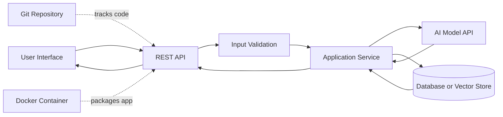
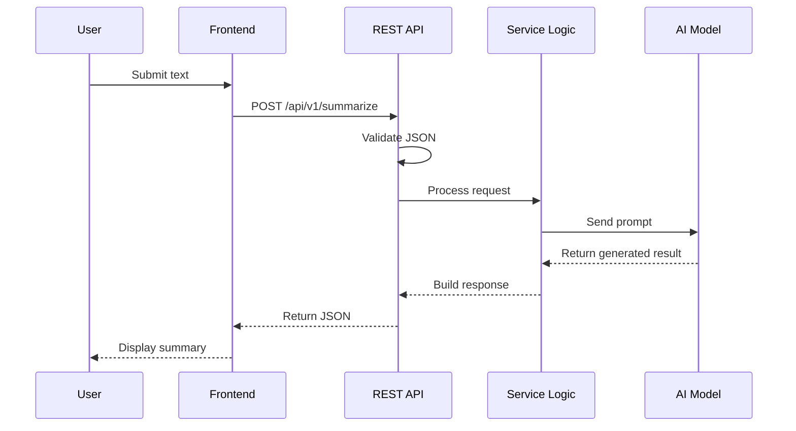
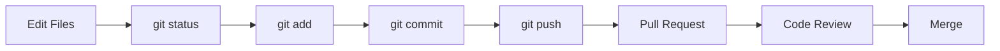
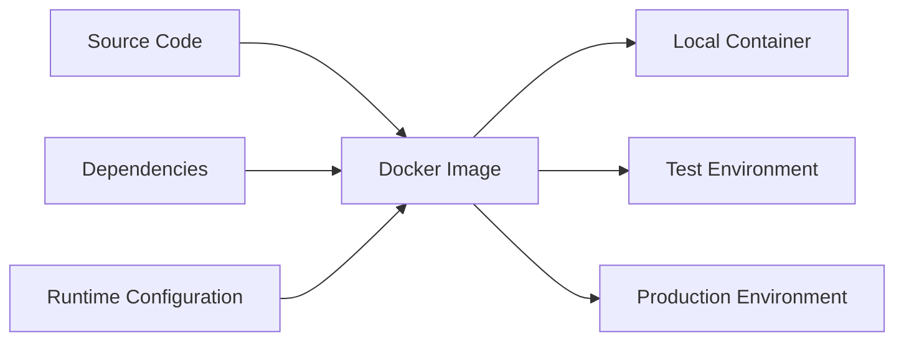
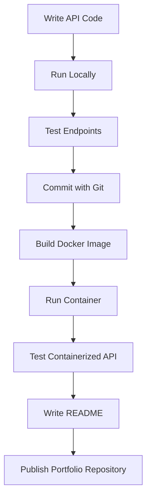
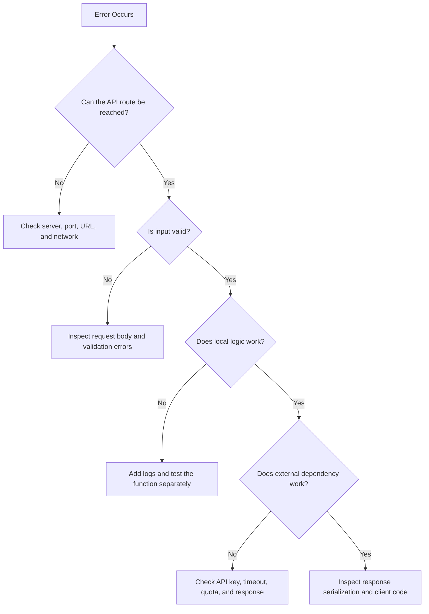

# 001 — Week 1–2: Python / JavaScript + REST APIs + Git + Docker Basics

**Course Section:** 05 — Production and Portfolio
**Module:** Module 14 — 12-Week Learning Plan
**Content Group:** Weekly Plan
**Roadmap Source:** 12-Week Learning Plan / Weekly Plan
**Lesson Type:** Learning Plan
**Order in Module:** 001
**Suggested Duration:** 12 minutes

---

## 1. Overview

Weeks 1–2 establish the engineering foundation required to build modern AI applications.

During these two weeks, you will learn or review:

* Python or JavaScript fundamentals
* REST API concepts
* Git and GitHub workflows
* Docker basics
* Environment variables and dependency management
* Basic debugging and error handling

These skills are not AI-specific, but almost every production AI system depends on them.

An AI application usually needs more than a model call. It also needs:

* A backend service
* API routes
* Input validation
* Configuration management
* Version control
* Reproducible environments
* Logging and debugging
* Deployment infrastructure

The goal of Weeks 1–2 is therefore not to master every feature of Python, JavaScript, Git, or Docker. The goal is to become comfortable enough to build, run, debug, and share a small backend application.

---

## 2. Learning Objectives

By the end of this lesson, you should be able to:

* Explain why programming foundations matter for AI engineering.
* Choose Python, JavaScript, or a combination of both for an AI project.
* Describe how a REST API receives and returns data.
* Create a basic API endpoint.
* Use Git to track code changes.
* Package a small application with Docker.
* Identify where these technologies appear in an AI engineering workflow.
* Produce a small, working portfolio artifact.

---

## 3. Why These Skills Matter for AI Engineers

A model is only one component of an AI product.

For example, consider an AI document assistant. The system may need to:

1. Receive a document from a user.
2. Extract and clean the text.
3. Split the document into chunks.
4. Generate embeddings.
5. Store vectors in a database.
6. Retrieve relevant context.
7. Send a prompt to an LLM.
8. Return a structured response.
9. Log latency, errors, tokens, and cost.

A simplified architecture looks like this:



Python or JavaScript implements the application logic. REST APIs connect clients to the backend. Git manages the source code. Docker creates a consistent runtime environment.

---

## 4. Core Concept 1: Python and JavaScript

### 4.1 Python

Python is widely used for:

* AI and machine learning
* Data processing
* Backend APIs
* Automation scripts
* Evaluation pipelines
* RAG systems
* AI agents

Its ecosystem includes libraries such as:

* FastAPI
* Pydantic
* NumPy
* pandas
* PyTorch
* Transformers
* LangChain
* LlamaIndex

A basic Python function:

```python
def build_prompt(question: str, context: str) -> str:
    """Create a simple prompt using retrieved context."""
    return f"""
Use the context below to answer the question.

Context:
{context}

Question:
{question}
""".strip()


prompt = build_prompt(
    question="What is semantic search?",
    context="Semantic search compares meaning instead of exact keywords.",
)

print(prompt)
```

Important Python topics for AI engineering include:

* Variables and data types
* Lists and dictionaries
* Functions
* Classes
* Type hints
* Exceptions
* File handling
* JSON handling
* Async programming
* Virtual environments
* Package management

---

### 4.2 JavaScript and TypeScript

JavaScript is commonly used for:

* Web interfaces
* Node.js backend services
* Real-time applications
* Streaming responses
* Browser-based AI features
* Full-stack applications

TypeScript adds static type checking, which makes larger JavaScript projects easier to maintain.

A basic JavaScript function:

```javascript
function buildPrompt(question, context) {
  return `
Use the context below to answer the question.

Context:
${context}

Question:
${question}
`.trim();
}

const prompt = buildPrompt(
  "What is semantic search?",
  "Semantic search compares meaning instead of exact keywords."
);

console.log(prompt);
```

A TypeScript version:

```typescript
function buildPrompt(question: string, context: string): string {
  return `
Use the context below to answer the question.

Context:
${context}

Question:
${question}
`.trim();
}
```

---

### 4.3 Which Language Should You Choose?

Use Python when your project focuses on:

* Machine learning
* Data processing
* RAG pipelines
* Evaluation
* Model experimentation
* AI backend services

Use JavaScript or TypeScript when your project focuses on:

* Frontend development
* Browser interactions
* Full-stack web applications
* Real-time streaming interfaces
* Node.js services

A common production combination is:

```text
Frontend: TypeScript + React
Backend: Python + FastAPI
AI services: Python
Infrastructure: Docker
Version control: Git
```

You do not need to master both languages immediately. Choose one as your primary backend language and learn enough of the other to understand how the client and server communicate.

---

## 5. Core Concept 2: REST APIs

A REST API allows different software systems to communicate through HTTP.

For example:

```text
Client sends request
        ↓
POST /api/v1/summarize
        ↓
Backend validates input
        ↓
Backend processes text or calls an AI model
        ↓
Backend returns JSON
```

### 5.1 Common HTTP Methods

| Method   | Typical Purpose             | Example                  |
| -------- | --------------------------- | ------------------------ |
| `GET`    | Read data                   | Retrieve a conversation  |
| `POST`   | Create or process data      | Generate an AI response  |
| `PUT`    | Replace a resource          | Replace a user profile   |
| `PATCH`  | Partially update a resource | Update a prompt template |
| `DELETE` | Remove a resource           | Delete a saved document  |

### 5.2 Common HTTP Status Codes

| Status                      | Meaning                                 |
| --------------------------- | --------------------------------------- |
| `200 OK`                    | Request succeeded                       |
| `201 Created`               | A new resource was created              |
| `400 Bad Request`           | The request is invalid                  |
| `401 Unauthorized`          | Authentication is required              |
| `403 Forbidden`             | The user does not have permission       |
| `404 Not Found`             | The resource does not exist             |
| `422 Unprocessable Entity`  | Input validation failed                 |
| `429 Too Many Requests`     | Rate limit exceeded                     |
| `500 Internal Server Error` | Unexpected server error                 |
| `503 Service Unavailable`   | A dependency is temporarily unavailable |

---

## 6. Practical REST API Example with FastAPI

Install the dependencies:

```bash
pip install fastapi uvicorn
```

Create `main.py`:

```python
from typing import Literal

from fastapi import FastAPI, HTTPException
from pydantic import BaseModel, Field

app = FastAPI(
    title="AI Engineering Foundations API",
    version="1.0.0",
)


class SummaryRequest(BaseModel):
    text: str = Field(min_length=1, max_length=10_000)
    style: Literal["short", "detailed"] = "short"


class SummaryResponse(BaseModel):
    summary: str
    input_characters: int


@app.get("/health")
def health_check() -> dict[str, str]:
    return {"status": "healthy"}


@app.post("/api/v1/summarize", response_model=SummaryResponse)
def summarize_text(payload: SummaryRequest) -> SummaryResponse:
    cleaned_text = payload.text.strip()

    if not cleaned_text:
        raise HTTPException(
            status_code=400,
            detail="Text cannot be empty.",
        )

    if payload.style == "short":
        summary = cleaned_text[:100]
    else:
        summary = cleaned_text[:300]

    return SummaryResponse(
        summary=summary,
        input_characters=len(cleaned_text),
    )
```

Run the API:

```bash
uvicorn main:app --reload
```

Open the interactive documentation:

```text
http://localhost:8000/docs
```

Test the endpoint:

```bash
curl -X POST "http://localhost:8000/api/v1/summarize" \
  -H "Content-Type: application/json" \
  -d '{
    "text": "REST APIs allow software systems to communicate over HTTP.",
    "style": "short"
  }'
```

Example response:

```json
{
  "summary": "REST APIs allow software systems to communicate over HTTP.",
  "input_characters": 60
}
```

This example does not yet call a real AI model. However, it already demonstrates the structure of an AI backend:

* Receive input
* Validate input
* Run application logic
* Handle errors
* Return structured JSON

Later, the local summary logic can be replaced with an LLM API call.

---

## 7. Calling the API from JavaScript

A frontend application can call the FastAPI backend using `fetch`:

```javascript
async function summarizeText(text) {
  const response = await fetch(
    "http://localhost:8000/api/v1/summarize",
    {
      method: "POST",
      headers: {
        "Content-Type": "application/json",
      },
      body: JSON.stringify({
        text,
        style: "short",
      }),
    }
  );

  if (!response.ok) {
    const errorBody = await response.json();
    throw new Error(
      errorBody.detail || `Request failed: ${response.status}`
    );
  }

  return response.json();
}

summarizeText("AI engineering combines models and software systems.")
  .then((result) => console.log(result))
  .catch((error) => console.error(error));
```

The complete request lifecycle is:



---

## 8. Core Concept 3: Git Basics

Git tracks changes in source code.

It allows you to:

* Review code history
* Create branches
* Experiment safely
* Collaborate with other developers
* Revert broken changes
* Prepare pull requests
* Connect code to CI/CD systems

### 8.1 Basic Git Workflow



### 8.2 Essential Commands

Initialize a repository:

```bash
git init
```

Check the current state:

```bash
git status
```

Create a new branch:

```bash
git switch -c feature/summary-api
```

Stage changes:

```bash
git add main.py
```

Commit changes:

```bash
git commit -m "feat: add summary API endpoint"
```

Push the branch:

```bash
git push -u origin feature/summary-api
```

View commit history:

```bash
git log --oneline
```

---

### 8.3 Recommended Commit Style

Use small, meaningful commits.

Examples:

```text
feat: add text summary endpoint
fix: reject empty summary requests
test: add API validation tests
docs: add local setup instructions
refactor: move summary logic into service
chore: add Docker configuration
```

Avoid unclear commit messages such as:

```text
update
fix stuff
final version
changes
```

A good commit should describe one logical change.

---

### 8.4 Basic `.gitignore`

Create a `.gitignore` file:

```gitignore
# Python
__pycache__/
*.py[cod]
.venv/
venv/

# Environment variables
.env

# Test and tooling caches
.pytest_cache/
.mypy_cache/

# IDE files
.vscode/
.idea/

# Operating system files
.DS_Store
Thumbs.db
```

Never commit API keys, passwords, access tokens, or private credentials.

---

## 9. Core Concept 4: Docker Basics

Docker packages an application and its dependencies into a container.

Without Docker, an application may work on one machine but fail on another because of:

* Different Python versions
* Missing packages
* Operating system differences
* Incorrect environment variables
* Conflicting dependencies

Docker helps create a reproducible environment.



---

## 10. Dockerizing the FastAPI Application

Create `requirements.txt`:

```text
fastapi
uvicorn[standard]
```

For a real project, pin tested versions:

```text
fastapi==0.116.1
uvicorn[standard]==0.35.0
```

Create a `Dockerfile`:

```dockerfile
FROM python:3.12-slim

ENV PYTHONDONTWRITEBYTECODE=1
ENV PYTHONUNBUFFERED=1

WORKDIR /app

COPY requirements.txt .

RUN pip install --no-cache-dir -r requirements.txt

COPY . .

EXPOSE 8000

CMD [
  "uvicorn",
  "main:app",
  "--host",
  "0.0.0.0",
  "--port",
  "8000"
]
```

Build the image:

```bash
docker build -t ai-foundations-api .
```

Run the container:

```bash
docker run --rm -p 8000:8000 ai-foundations-api
```

Test the health endpoint:

```bash
curl http://localhost:8000/health
```

Expected response:

```json
{
  "status": "healthy"
}
```

---

## 11. Environment Variables

AI applications often depend on external services. Credentials should be loaded from environment variables rather than written directly in source code.

Example `.env` file:

```env
APP_ENV=development
AI_API_KEY=replace_with_your_key
AI_MODEL=example-model
```

Do not commit `.env`.

Python example:

```python
import os


def get_required_env(name: str) -> str:
    value = os.getenv(name)

    if not value:
        raise RuntimeError(
            f"Required environment variable is missing: {name}"
        )

    return value


api_key = get_required_env("AI_API_KEY")
model_name = os.getenv("AI_MODEL", "default-model")
```

Pass variables into Docker:

```bash
docker run \
  --rm \
  -p 8000:8000 \
  --env-file .env \
  ai-foundations-api
```

---

## 12. Suggested Two-Week Learning Plan

### Week 1: Programming and REST API Foundations

#### Day 1 — Programming Review

Study:

* Variables
* Functions
* Lists or arrays
* Dictionaries or objects
* Loops
* Conditions

Deliverable:

```text
A command-line program that accepts text and returns basic statistics.
```

#### Day 2 — Files and JSON

Study:

* Reading and writing files
* JSON serialization
* Error handling

Deliverable:

```text
A script that reads a JSON file, validates its fields, and prints a report.
```

#### Day 3 — REST API Concepts

Study:

* HTTP methods
* Request headers
* JSON bodies
* Status codes

Deliverable:

```text
A diagram explaining the lifecycle of an API request.
```

#### Day 4 — Build an API

Study:

* FastAPI or Express
* Routes
* Request validation
* Response models

Deliverable:

```text
A working API with GET /health and POST /api/v1/summarize.
```

#### Day 5 — Error Handling and Testing

Study:

* Validation errors
* Exceptions
* Edge cases
* Basic API tests

Deliverable:

```text
Tests for valid input, empty input, and oversized input.
```

---

### Week 2: Git, Docker, and Integration

#### Day 6 — Git Fundamentals

Study:

* Repository
* Commit
* Branch
* Merge
* Pull request

Deliverable:

```text
A repository with at least three meaningful commits.
```

#### Day 7 — Branch Workflow

Study:

* Feature branches
* Merge conflicts
* Pull request descriptions
* Code review habits

Deliverable:

```text
A feature branch merged through a pull request.
```

#### Day 8 — Docker Fundamentals

Study:

* Images
* Containers
* Dockerfiles
* Ports
* Build context

Deliverable:

```text
A Docker image that runs the API.
```

#### Day 9 — Configuration and Secrets

Study:

* Environment variables
* `.env` files
* Secret handling
* Development versus production configuration

Deliverable:

```text
An application that reads configuration from environment variables.
```

#### Day 10 — Final Integration

Complete the full workflow:



Final deliverable:

```text
A small containerized REST API with documentation and a clean Git history.
```

---

## 13. Practical Demo Project

### Project: AI Text Utility API

Build a backend service with the following endpoints:

```text
GET  /health
POST /api/v1/summarize
POST /api/v1/extract-keywords
POST /api/v1/classify
```

Initially, the endpoints can use simple local logic.

Example classification request:

```json
{
  "text": "The payment page fails after I enter my card.",
  "categories": [
    "billing",
    "technical_support",
    "general_question"
  ]
}
```

Example response:

```json
{
  "category": "technical_support",
  "confidence": 0.75
}
```

Later, replace the local implementation with a real AI model.

### Recommended Repository Structure

```text
ai-text-utility/
├── app/
│   ├── __init__.py
│   ├── main.py
│   ├── models.py
│   ├── routes.py
│   └── services.py
├── tests/
│   └── test_api.py
├── .env.example
├── .gitignore
├── Dockerfile
├── README.md
└── requirements.txt
```

This structure introduces separation of concerns:

* `routes.py` handles HTTP requests.
* `models.py` defines input and output schemas.
* `services.py` contains business logic.
* `tests/` verifies expected behavior.
* `Dockerfile` defines the runtime environment.
* `README.md` explains setup and usage.

---

## 14. Debugging Strategy

When an application fails, debug one layer at a time.



Useful debugging questions:

1. Is the server running?
2. Is the request using the correct URL and HTTP method?
3. Is the JSON body valid?
4. Are required environment variables available?
5. Is the dependency installed?
6. Is the Docker port mapped correctly?
7. Did the external service return an error?
8. Is the exception visible in the logs?

Add temporary logs at important boundaries:

```python
import logging

logger = logging.getLogger(__name__)


def summarize(text: str) -> str:
    logger.info(
        "Creating summary",
        extra={"input_characters": len(text)},
    )

    result = text[:100]

    logger.info(
        "Summary completed",
        extra={"output_characters": len(result)},
    )

    return result
```

Do not log secrets, passwords, complete API keys, or sensitive user content.

---

## 15. Common Mistakes

### 15.1 Learning Syntax Without Building Anything

Reading tutorials creates familiarity, but not necessarily practical ability.

Better approach:

```text
Learn one concept → build one small feature → test it → document it
```

---

### 15.2 Putting Everything in One File

A single-file demo is acceptable at the beginning. However, production projects should gradually separate:

* Routes
* Schemas
* Business logic
* Provider integrations
* Configuration
* Tests

---

### 15.3 Ignoring Edge Cases

A successful happy path is not enough.

Test cases should include:

* Empty input
* Invalid JSON
* Very large input
* Missing environment variables
* External API timeout
* Rate limiting
* Unexpected provider response

---

### 15.4 Committing Secrets

Never commit:

* API keys
* Passwords
* Database credentials
* Private certificates
* Access tokens

Use `.env.example` to document required variables without exposing real values:

```env
AI_API_KEY=
AI_MODEL=
APP_ENV=
```

---

### 15.5 Using Unclear Git Commits

Avoid placing several unrelated changes in one commit.

Instead of:

```text
update project
```

Prefer:

```text
feat: add input validation
test: cover empty text requests
docs: document Docker setup
```

---

### 15.6 Building a Docker Image Without Testing It

A successful `docker build` does not guarantee that the application works.

Always test:

* Whether the container starts
* Whether the port is exposed
* Whether environment variables are loaded
* Whether the health endpoint responds
* Whether the main API endpoint works

---

## 16. Practice Exercises

### Exercise 1 — Five-Line Summary

Without reviewing the lesson, write five lines explaining:

* What Python or JavaScript does
* What a REST API does
* What Git does
* What Docker does
* How they work together in an AI application

---

### Exercise 2 — Add a New Endpoint

Create:

```text
POST /api/v1/count-words
```

Input:

```json
{
  "text": "AI engineering combines models, software, and infrastructure."
}
```

Expected output:

```json
{
  "word_count": 7
}
```

Add validation for empty input.

---

### Exercise 3 — Create a Feature Branch

Use the following workflow:

```bash
git switch -c feature/word-count
git add .
git commit -m "feat: add word count endpoint"
git push -u origin feature/word-count
```

Write a short pull request description containing:

* What changed
* Why it changed
* How it was tested
* Known limitations

---

### Exercise 4 — Run the Project with Docker

Build and run the application:

```bash
docker build -t ai-text-utility .
docker run --rm -p 8000:8000 ai-text-utility
```

Verify:

```bash
curl http://localhost:8000/health
```

---

### Exercise 5 — Record a Production Failure

Choose one possible failure:

* API timeout
* Invalid request
* Missing environment variable
* Incorrect Docker port
* Dependency installation failure

Document:

```text
Problem:
Observed behavior:
Root cause:
Debugging steps:
Fix:
Prevention:
```

---

## 17. Completion Checklist

* [ ] I can explain Python or JavaScript fundamentals in my own words.
* [ ] I can explain how an HTTP request reaches a backend service.
* [ ] I can create a basic `GET` endpoint.
* [ ] I can create a validated `POST` endpoint.
* [ ] I understand common HTTP status codes.
* [ ] I can create a Git repository and feature branch.
* [ ] I can write meaningful commits.
* [ ] I can build a Docker image.
* [ ] I can run the API inside a Docker container.
* [ ] I know how to use environment variables.
* [ ] I have tested at least one error case.
* [ ] I have documented one limitation or unresolved question.
* [ ] I have a working demo or portfolio artifact.

---

## 18. Expected Outcome

After Weeks 1–2, you should have a practical foundation for the remaining AI engineering roadmap.

You should be able to move from:

```text
Idea
```

to:

```text
Source code
→ REST API
→ Git repository
→ Docker container
→ Testable application
```

This foundation will later support:

* LLM API integration
* Prompt engineering
* Structured outputs
* AI safety controls
* Embeddings
* Vector databases
* RAG pipelines
* AI agents
* Multimodal systems
* Logging and cost tracking
* Production deployment

---

## 19. Related Project

### Weekly Learning Tracker

Create a repository that tracks your progress across the 12-week roadmap.

Suggested structure:

```text
ai-engineer-roadmap/
├── week-01-02-foundations/
│   ├── source-code/
│   ├── diagrams/
│   ├── notes.md
│   └── retrospective.md
├── week-03-llm-fundamentals/
├── week-04-model-apis/
└── README.md
```

For each week, record:

```markdown
## What I Learned

## What I Built

## Problems I Encountered

## How I Debugged Them

## Known Limitations

## Next Steps
```

This tracker can become part of your AI engineering portfolio.

---

## 20. Final Summary

**Week 1–2: Python / JavaScript + REST APIs + Git + Docker Basics** is the foundation checkpoint of the 12-week AI Engineer roadmap.

The main lesson is that AI engineering is not only about models and prompts. A useful AI product also requires reliable software engineering.

By the end of these two weeks, you should have:

* A small backend application
* At least one validated REST API endpoint
* A Git repository with meaningful commits
* A Dockerized runtime
* Basic error handling
* Setup documentation
* A clear list of limitations and next steps

Do not stop at definitions. Turn each concept into a working artifact that can be run, tested, debugged, and shared.

---

# Bài luyện tập

## Mục tiêu


## Đề bài


## Yêu cầu hoàn thành

- [ ] 
- [ ] 
- [ ] 

## Kết quả / lời giải


## Ghi chú
