# 002 — Week 3: AI Engineer Introduction + LLM Fundamentals

**Course Section:** 05 — Production and Portfolio
**Module:** Module 14 — 12-Week Learning Plan
**Content Group:** Weekly Plan
**Roadmap Source:** 12-Week Learning Plan / Weekly Plan
**Lesson Type:** Learning Plan
**Order in Module:** 002
**Suggested Duration:** 12 minutes

---

## 1. Overview

Week 3 introduces the role of an **AI Engineer** and the fundamental concepts behind **Large Language Models**, commonly called LLMs.

An AI Engineer does more than send prompts to a model. The role combines:

* Software engineering
* Backend development
* Prompt design
* Model integration
* Data processing
* Retrieval systems
* Evaluation
* Safety controls
* Monitoring
* Cost management
* User experience design

The goal of this week is not to understand every mathematical detail behind language models. Instead, you should understand how an LLM behaves as a software component and how to integrate it into a reliable application.

By the end of Week 3, you should be able to explain:

* What an AI Engineer builds
* What an LLM is
* How text becomes tokens
* How an LLM generates output
* What prompts and context do
* Why model outputs are probabilistic
* Why hallucinations occur
* How to design a small LLM-powered feature

---

## 2. Learning Objectives

By the end of this lesson, you should be able to:

* Explain the role of an AI Engineer in your own words.
* Distinguish AI engineering from machine learning research and traditional software engineering.
* Describe the basic LLM input-output process.
* Explain tokens, context windows, prompts, and generated completions.
* Understand the difference between training and inference.
* Describe why LLM outputs can vary between requests.
* Recognize common LLM limitations.
* Identify where prompts, retrieval, tools, safety, cost, and UX appear in an AI application.
* Build a small model-independent LLM demo or simulation.
* Document at least one production risk and debugging strategy.

---

## 3. What Is an AI Engineer?

An AI Engineer builds software products that use AI models to solve practical problems.

Examples include:

* Document question-answering systems
* Customer support assistants
* Content summarization tools
* Code review assistants
* Recommendation systems
* AI search interfaces
* Automated data extraction services
* Multimodal applications
* AI agents that use external tools

An AI Engineer usually works between several layers:

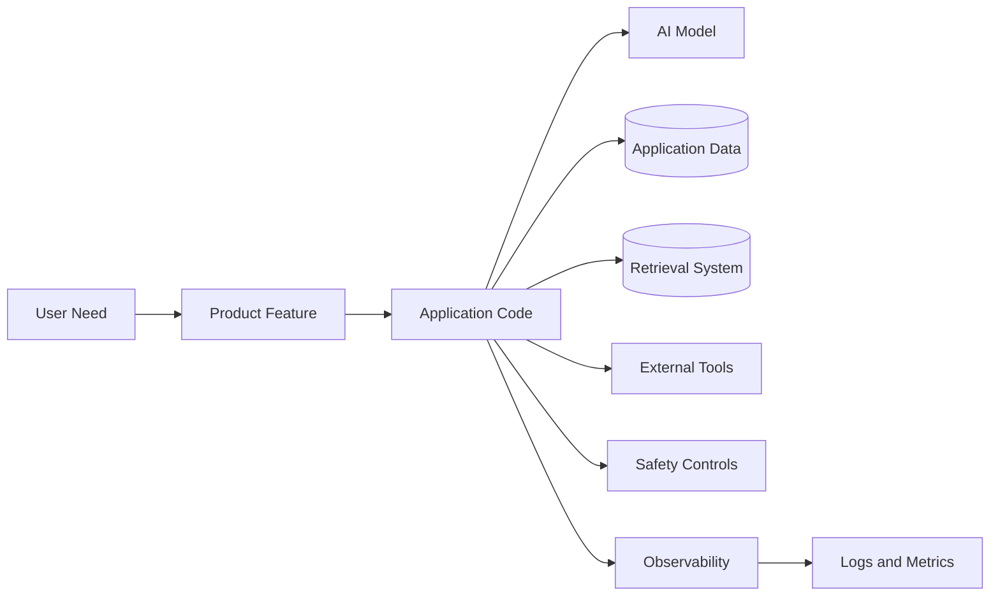

The model is important, but it is only one part of the complete system.

---

## 4. AI Engineer vs. Related Roles

### 4.1 AI Engineer

Focuses on:

* Integrating models into applications
* Building prompts and workflows
* Connecting models to data and tools
* Evaluating output quality
* Managing latency and cost
* Deploying reliable AI services

Typical output:

```text
A production-ready AI feature or application
```

---

### 4.2 Machine Learning Engineer

Focuses more heavily on:

* Training and serving models
* Feature engineering
* Data pipelines
* Model performance
* Experiment tracking
* ML infrastructure

Typical output:

```text
A trained and deployed machine learning model
```

---

### 4.3 Data Scientist

Focuses on:

* Data analysis
* Statistical modeling
* Experimentation
* Business insights
* Predictive analysis

Typical output:

```text
Analysis, experiments, reports, or predictive models
```

---

### 4.4 Software Engineer

Focuses on:

* Application architecture
* APIs
* Databases
* Frontend and backend systems
* Reliability
* Testing
* Deployment

Typical output:

```text
A reliable software product or platform
```

---

### 4.5 LLM Researcher

Focuses on:

* Model architectures
* Training methods
* Alignment
* Optimization
* Evaluation research
* New capabilities

Typical output:

```text
New research methods, model improvements, or scientific findings
```

---

### 4.6 Role Comparison

| Role              | Main Focus                    | Typical Deliverable               |
| ----------------- | ----------------------------- | --------------------------------- |
| AI Engineer       | AI product integration        | AI-powered application            |
| ML Engineer       | Model training and serving    | Deployed ML system                |
| Data Scientist    | Data analysis and experiments | Insights or predictive model      |
| Software Engineer | General software systems      | Reliable application              |
| LLM Researcher    | Model research                | New methods or model capabilities |

In smaller teams, one person may perform several of these roles.

---

## 5. The Modern AI Application Stack

A modern AI application often contains several layers:

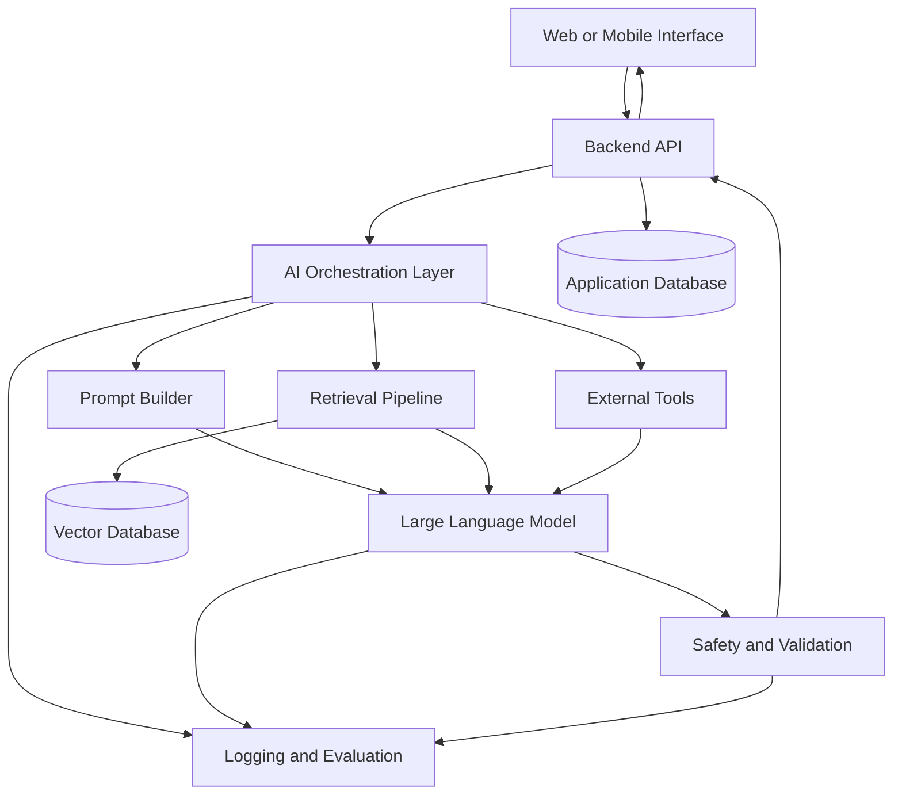

This architecture shows why AI engineering requires both model knowledge and software engineering skills.

---

## 6. What Is a Large Language Model?

A Large Language Model is a model trained to process and generate language.

At a simplified level, an LLM receives text and predicts what token should come next.

Example:

```text
Input:
The capital of France is

Possible next tokens:
Paris
located
a
one
```

The model assigns probabilities to possible next tokens and selects one according to the decoding configuration.

The generated token is then added to the sequence, and the process repeats.

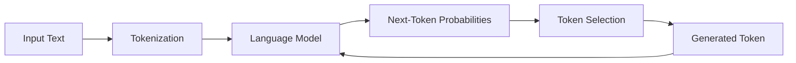

This loop continues until:

* The model produces a stopping token
* The maximum output length is reached
* The application stops generation
* A safety rule interrupts the response

---

## 7. Tokens

LLMs do not directly process text as complete sentences. They process units called **tokens**.

A token may represent:

* A complete word
* Part of a word
* Punctuation
* Whitespace
* A symbol
* A short character sequence

A simplified tokenization example:

```text
Original text:
Artificial intelligence is useful.

Possible tokens:
["Artificial", " intelligence", " is", " useful", "."]
```

Another word may be split:

```text
Tokenization:
["un", "predict", "able"]
```

The exact tokenization depends on the model's tokenizer.

### Why Tokens Matter

Tokens affect:

* Input size
* Output size
* Context limits
* Request cost
* Response latency
* Text truncation
* Prompt design

A long document may contain many more tokens than expected, especially when it includes:

* Source code
* Tables
* JSON
* Special symbols
* Multiple languages
* Repeated formatting

---

## 8. Context Window

The **context window** is the amount of information a model can process in one request.

The context may include:

* System instructions
* Developer instructions
* User messages
* Conversation history
* Retrieved documents
* Tool results
* Output generated so far

A simplified context structure:

```text
System instructions
+ Application instructions
+ Conversation history
+ Retrieved context
+ Current user request
+ Generated output
= Total context usage
```

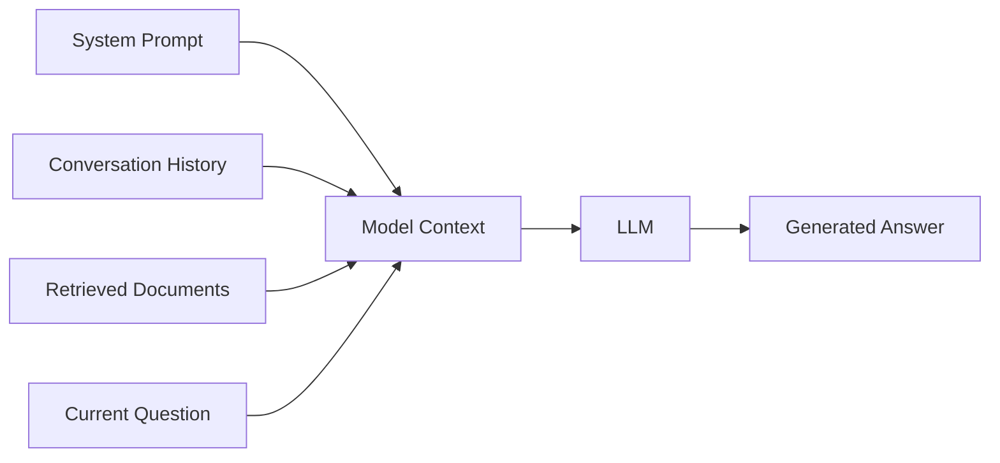

If the total input is too large, the application may need to:

* Remove unnecessary history
* Summarize earlier messages
* Retrieve fewer documents
* Split the task into smaller requests
* Use a model with a larger context window
* Reject oversized input safely

A larger context window does not automatically guarantee better answers. Irrelevant information can distract the model and reduce answer quality.

---

## 9. Training vs. Inference

### 9.1 Training

Training is the process of adjusting model parameters using large datasets.

During training, the model learns patterns such as:

* Grammar
* Writing styles
* Relationships between concepts
* Common reasoning structures
* Programming syntax
* General world knowledge contained in the training data

Training usually requires significant computing resources.

---

### 9.2 Inference

Inference happens when an application sends a prompt to an already-trained model.

Example:

```text
Prompt:
Summarize the following support ticket.

Model inference:
Processes the prompt and generates a summary.
```

AI Engineers usually work more often with inference than with training.

They focus on:

* Prompt design
* Context construction
* Model selection
* Tool integration
* Retrieval
* Validation
* Evaluation
* Deployment

---

### 9.3 Comparison

| Training                           | Inference                                  |
| ---------------------------------- | ------------------------------------------ |
| Teaches the model                  | Uses the trained model                     |
| Requires large datasets            | Requires a prompt                          |
| Updates model parameters           | Usually does not update parameters         |
| Expensive and infrastructure-heavy | Used during normal application requests    |
| Performed before deployment        | Performed when users interact with the app |

---

## 10. The Transformer Concept

Most modern LLMs are based on the **Transformer** architecture.

You do not need to understand every mathematical detail in Week 3, but you should know the basic idea:

> A Transformer processes relationships between tokens and determines which parts of the input are most relevant to each other.

This mechanism is commonly associated with **attention**.

Consider the sentence:

```text
The developer fixed the API because it was returning errors.
```

The word `it` likely refers to `the API`.

Attention helps the model relate these tokens.

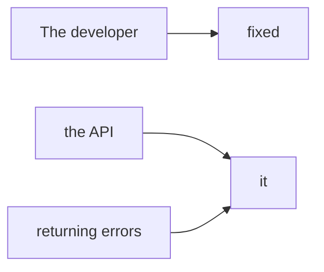

Attention allows the model to use information from different positions in the input when generating a response.

---

## 11. Prompt Structure

A prompt is the information sent to the model.

A useful prompt often contains:

1. Role or behavior
2. Task
3. Context
4. Constraints
5. Output format
6. Examples, when needed

Example:

```text
Role:
You are a technical support assistant.

Task:
Classify the customer issue.

Categories:
- billing
- account
- technical
- general

Customer message:
"The application crashes after I upload a PDF."

Output format:
Return JSON with `category` and `reason`.
```

Expected output:

```json
{
  "category": "technical",
  "reason": "The user reports an application crash during file upload."
}
```

A prompt is not merely a question. It is an interface between your application and the model.

---

## 12. Prompt Hierarchy

In many AI systems, instructions may come from several sources:

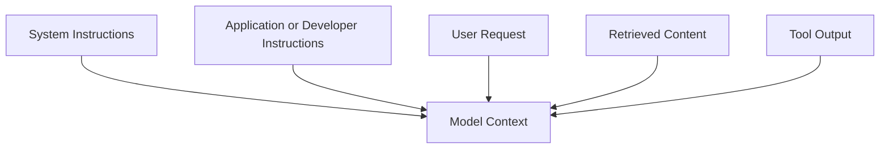

The application should clearly separate:

* Trusted instructions
* User-controlled input
* Retrieved information
* Tool output
* Untrusted external content

This separation becomes important later when studying:

* Prompt injection
* Tool safety
* Retrieval security
* Agent permissions

---

## 13. Model Output Is Probabilistic

LLMs do not behave exactly like traditional deterministic functions.

A deterministic function may produce the same output every time:

```python
def add(a: int, b: int) -> int:
    return a + b
```

For the same inputs:

```text
add(2, 3) → 5
```

An LLM may produce different valid outputs for the same prompt:

```text
Prompt:
Write a short description of semantic search.

Possible output A:
Semantic search retrieves information based on meaning.

Possible output B:
Semantic search finds results by comparing concepts rather than exact words.
```

This variation comes from token probabilities and decoding settings.

---

## 14. Temperature and Output Variation

**Temperature** is a common generation setting that influences randomness.

At a conceptual level:

* Lower temperature usually produces more predictable output.
* Higher temperature usually produces more varied output.

### Lower Temperature

Useful for:

* Classification
* Data extraction
* Structured output
* Factual summaries
* Code transformation

### Higher Temperature

Useful for:

* Brainstorming
* Creative writing
* Marketing ideas
* Story generation
* Alternative solutions

However, temperature does not guarantee correctness.

A low-temperature answer can still be wrong, and a high-temperature answer can still be accurate.

---

## 15. Other Generation Controls

Common generation controls may include:

### Maximum Output Tokens

Limits the length of the generated response.

### Stop Sequences

Stop generation when a specific sequence appears.

### Top-P

Controls how much of the probability distribution is considered during generation.

### Frequency Penalty

Discourages repeated token patterns.

### Presence Penalty

Encourages the model to introduce new concepts.

The exact availability and behavior of these settings may differ between model providers.

---

## 16. Hallucinations

A hallucination occurs when a model generates information that appears plausible but is unsupported, incorrect, or invented.

Example:

```text
Question:
Which section of the uploaded contract defines the refund period?

Problematic answer:
Section 14 states that refunds are allowed within 30 days.
```

If the contract does not contain that information, the answer is hallucinated.

### Why Hallucinations Happen

An LLM generates likely text. It does not automatically verify every claim against a trusted source.

Hallucinations may become more likely when:

* The prompt asks about unavailable information
* The context is incomplete
* The question is ambiguous
* Retrieved documents are irrelevant
* The model is forced to answer
* The task requires exact numbers or citations
* The prompt contains conflicting information

---

## 17. Reducing Hallucinations

Hallucinations cannot always be completely removed, but their impact can be reduced.

Useful techniques include:

* Provide trusted context.
* Use retrieval-augmented generation.
* Ask the model to identify uncertainty.
* Require source references.
* Validate structured outputs.
* Use tools for calculations and current data.
* Reject unsupported answers.
* Add human review for high-risk tasks.
* Evaluate the system using known test cases.

Example instruction:

```text
Answer only from the provided context.

If the answer is not present, return:
"Insufficient information."
```

This instruction can help, but it is not a complete guarantee.

---

## 18. Knowledge vs. Context

A model may answer using patterns learned during training, but an application often needs private, current, or domain-specific information.

Examples include:

* Company policies
* User documents
* Product inventory
* Current prices
* Recent events
* Internal support procedures
* Personal account information

This information should usually come from:

* Databases
* Search systems
* APIs
* Retrieved documents
* External tools

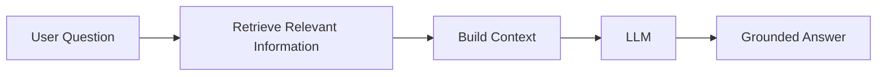

This workflow is the foundation of Retrieval-Augmented Generation, which will be studied later in the roadmap.

---

## 19. LLM Application Request Lifecycle

A production LLM request often follows this sequence:

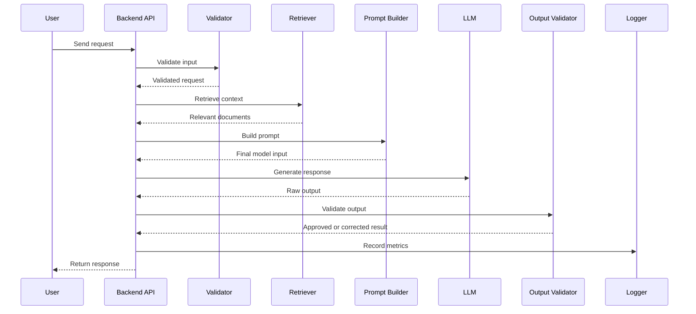

Each stage can fail independently.

---

## 20. Model Input and Output

A simple LLM request contains:

```text
Input:
- Instructions
- User content
- Optional context
- Optional examples
- Generation settings

Output:
- Generated text
- Structured data
- Tool request
- Usage metadata
- Stop reason
```

A provider-independent Python structure might look like this:

```python
from dataclasses import dataclass
from typing import Any


@dataclass
class LLMRequest:
    system_instruction: str
    user_message: str
    temperature: float = 0.2
    max_output_tokens: int = 500


@dataclass
class LLMResponse:
    text: str
    input_tokens: int | None = None
    output_tokens: int | None = None
    metadata: dict[str, Any] | None = None
```

This abstraction helps separate application logic from a specific model provider.

---

## 21. A Simple Model Interface

```python
from abc import ABC, abstractmethod


class LanguageModel(ABC):
    @abstractmethod
    def generate(self, request: LLMRequest) -> LLMResponse:
        """Generate a response for an LLM request."""
        raise NotImplementedError
```

A mock implementation can be used during development:

```python
class MockLanguageModel(LanguageModel):
    def generate(self, request: LLMRequest) -> LLMResponse:
        text = (
            "Mock response for: "
            f"{request.user_message[:100]}"
        )

        return LLMResponse(
            text=text,
            input_tokens=None,
            output_tokens=None,
            metadata={"provider": "mock"},
        )
```

Example usage:

```python
model = MockLanguageModel()

request = LLMRequest(
    system_instruction=(
        "You are a concise technical assistant."
    ),
    user_message=(
        "Explain the difference between training and inference."
    ),
)

response = model.generate(request)

print(response.text)
```

A mock model allows you to test:

* API routes
* Prompt construction
* Error handling
* Logging
* Output formatting

without depending on a live model service.

---

## 22. Building a Prompt Function

```python
def build_summary_prompt(text: str) -> str:
    cleaned_text = text.strip()

    if not cleaned_text:
        raise ValueError("Text cannot be empty.")

    return f"""
Task:
Summarize the provided text.

Requirements:
- Use no more than three sentences.
- Preserve the main technical meaning.
- Do not invent information.

Text:
{cleaned_text}
""".strip()
```

Example:

```python
prompt = build_summary_prompt(
    """
    Large language models process text as tokens and generate
    responses by predicting likely next tokens.
    """
)

print(prompt)
```

The important engineering idea is that prompt construction should be:

* Reusable
* Testable
* Version-controlled
* Separated from API routing
* Documented

---

## 23. Structured Output

Free-form text is useful for user-facing answers, but applications often need machine-readable data.

Example task:

```text
Classify a support ticket.
```

Preferred output:

```json
{
  "category": "technical",
  "priority": "high",
  "reason": "The application crashes during checkout."
}
```

Python schema:

```python
from typing import Literal

from pydantic import BaseModel


class TicketClassification(BaseModel):
    category: Literal[
        "billing",
        "account",
        "technical",
        "general",
    ]
    priority: Literal["low", "medium", "high"]
    reason: str
```

Validation helps detect:

* Missing fields
* Invalid categories
* Incorrect data types
* Unexpected output formats

Structured output will be explored more deeply in Week 5.

---

## 24. Common LLM Application Patterns

### 24.1 Text Generation

```text
Input → Prompt → Generated text
```

Examples:

* Email drafting
* Product descriptions
* Lesson generation

---

### 24.2 Summarization

```text
Long text → LLM → Short summary
```

Examples:

* Meeting notes
* Support tickets
* Reports

---

### 24.3 Classification

```text
Input text → LLM → Category
```

Examples:

* Sentiment analysis
* Ticket routing
* Content moderation

---

### 24.4 Information Extraction

```text
Unstructured text → LLM → Structured JSON
```

Examples:

* Invoice fields
* Contact information
* Contract terms

---

### 24.5 Question Answering

```text
Question + Context → LLM → Answer
```

Examples:

* Document assistants
* Internal knowledge bots
* Customer support systems

---

### 24.6 Tool Use

```text
User request → LLM selects tool → Tool executes → LLM explains result
```

Examples:

* Weather lookup
* Database query
* Calendar scheduling
* Calculation

---

## 25. Choosing a Model

Model selection should be based on application requirements rather than popularity.

Consider:

| Dimension          | Questions                                         |
| ------------------ | ------------------------------------------------- |
| Quality            | Does the model perform the task reliably?         |
| Latency            | How quickly must the user receive a response?     |
| Cost               | What is the expected cost per request?            |
| Context            | How much input must the model process?            |
| Output format      | Can it reliably return structured data?           |
| Tool use           | Can it call external tools effectively?           |
| Multimodal support | Does it process images or audio?                  |
| Privacy            | Where is data processed and stored?               |
| Availability       | What happens if the provider fails?               |
| Safety             | Does it meet the application's risk requirements? |

A larger model is not always the best choice.

For simple tasks, a smaller model may provide:

* Lower latency
* Lower cost
* Easier scaling
* Sufficient quality

---

## 26. Latency, Cost, and Quality

AI application design often involves trade-offs between three goals:

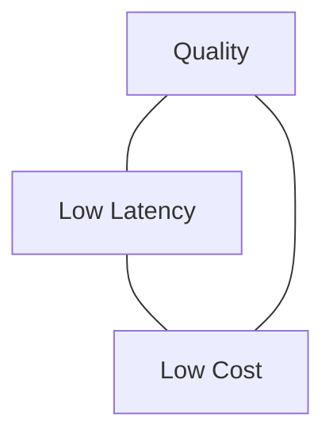

For example:

* A larger model may improve quality but increase latency and cost.
* A smaller model may be faster but less reliable on complex tasks.
* More retrieved context may improve grounding but increase token usage.
* Multiple model calls may improve validation but increase total cost.

AI Engineers must decide which trade-offs are acceptable for the product.

---

## 27. Safety and Privacy

An LLM application may process sensitive information.

Examples include:

* Personal data
* Health information
* Financial records
* Internal company documents
* Authentication tokens
* Private conversations

Basic safety rules:

* Do not place secrets directly in prompts.
* Do not log complete credentials.
* Minimize sensitive data sent to external services.
* Validate user input.
* Treat uploaded and retrieved content as untrusted.
* Restrict tools and permissions.
* Add human review for high-impact decisions.
* Define data retention policies.
* Test prompt injection scenarios.

Safety is not a single filter. It is a system-level responsibility.

---

## 28. Common Failure Modes

### 28.1 Unsupported Answer

The model confidently answers without sufficient evidence.

**Mitigation:**

* Require context
* Allow an “unknown” response
* Validate citations
* Use retrieval

---

### 28.2 Invalid Structured Output

The model returns malformed JSON or unexpected fields.

**Mitigation:**

* Use a schema
* Parse and validate output
* Retry with correction instructions
* Return a safe error

---

### 28.3 Excessive Input

The request exceeds the supported context size.

**Mitigation:**

* Check input size before generation
* Chunk documents
* Summarize history
* Retrieve only relevant sections

---

### 28.4 Prompt Injection

Untrusted content attempts to override application instructions.

**Mitigation:**

* Separate instructions from data
* Restrict tools
* Validate requested actions
* Avoid blindly following retrieved instructions

---

### 28.5 Slow Response

The user waits too long for generation.

**Mitigation:**

* Use streaming
* Reduce prompt size
* Select a faster model
* Cache repeated results
* Add timeouts

---

### 28.6 Provider Failure

The external model service is unavailable.

**Mitigation:**

* Use retries with limits
* Add timeouts
* Use a fallback model
* Return a clear error
* Record failure metrics

---

## 29. Debugging an LLM Feature

When an LLM feature gives a poor result, inspect each stage separately.

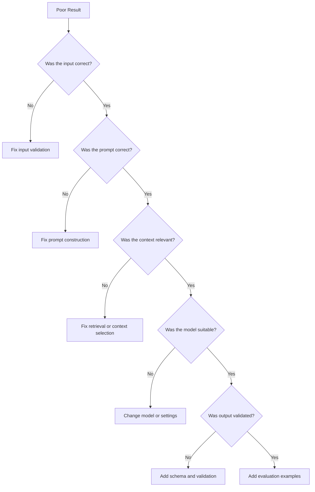

Useful debugging information includes:

* Model name or version
* Prompt version
* Input length
* Retrieved document identifiers
* Generation settings
* Response time
* Token usage
* Validation errors
* User feedback

Do not log sensitive data unnecessarily.

---

## 30. Evaluation Basics

A demo that works once is not enough.

Create a small evaluation set:

```json
[
  {
    "input": "The payment was charged twice.",
    "expected_category": "billing"
  },
  {
    "input": "I cannot reset my password.",
    "expected_category": "account"
  },
  {
    "input": "The application crashes at startup.",
    "expected_category": "technical"
  }
]
```

Then test:

* Did the model choose the correct category?
* Was the output valid JSON?
* Was the response concise?
* Did it invent information?
* How long did the request take?

A simple metric:

```text
Accuracy = correct predictions / total predictions
```

For three correct predictions out of four:

```text
Accuracy = 3 / 4 = 75%
```

Evaluation will become more important later when studying production AI and LLMOps.

---

## 31. Suggested Week 3 Learning Plan

### Day 1 — Understand the AI Engineer Role

Study:

* AI Engineer responsibilities
* Difference between AI, ML, and software roles
* Typical AI product architecture

Deliverable:

```text
A one-page diagram of an AI application stack
```

---

### Day 2 — Learn LLM Fundamentals

Study:

* Tokens
* Context windows
* Next-token prediction
* Training
* Inference

Deliverable:

```text
A five-line explanation of how an LLM generates text
```

---

### Day 3 — Study Prompt Anatomy

Study:

* Instructions
* Context
* Constraints
* Examples
* Output formats

Deliverable:

```text
Three prompt versions for the same classification task
```

---

### Day 4 — Build a Mock LLM Service

Study:

* Model interfaces
* Request objects
* Response objects
* Provider abstraction

Deliverable:

```text
A Python class that returns mock model responses
```

---

### Day 5 — Build a Small AI API

Study:

* LLM request lifecycle
* Input validation
* Output validation
* Error handling

Deliverable:

```text
A working API route that accepts text and returns a mock AI result
```

---

### Day 6 — Test Limitations

Test:

* Empty input
* Long input
* Ambiguous input
* Invalid model output
* Provider timeout simulation

Deliverable:

```text
A table of failures, causes, and fixes
```

---

### Day 7 — Document the Project

Add:

* Architecture diagram
* Setup instructions
* Example request
* Example response
* Known limitations
* Next steps

Deliverable:

```text
A portfolio-ready README
```

---

## 32. Practical Demo Project

### Project: LLM Concept Explorer API

Create a small API that explains AI engineering concepts.

Suggested endpoint:

```text
POST /api/v1/explain
```

Request:

```json
{
  "topic": "context window",
  "audience": "beginner"
}
```

Response:

```json
{
  "topic": "context window",
  "explanation": "A context window is the amount of information an LLM can process in one request.",
  "limitations": [
    "Large inputs may be truncated.",
    "More context does not always improve quality."
  ]
}
```

Initially, use a local dictionary or mock model.

Later, replace it with a real model provider.

---

## 33. Example FastAPI Demo

```python
from typing import Literal

from fastapi import FastAPI, HTTPException
from pydantic import BaseModel, Field

app = FastAPI(
    title="LLM Concept Explorer",
    version="1.0.0",
)


class ExplainRequest(BaseModel):
    topic: str = Field(min_length=2, max_length=100)
    audience: Literal[
        "beginner",
        "developer",
        "manager",
    ] = "beginner"


class ExplainResponse(BaseModel):
    topic: str
    explanation: str
    limitations: list[str]


CONCEPTS = {
    "token": {
        "explanation": (
            "A token is a unit of text processed by a language model."
        ),
        "limitations": [
            "A token is not always a complete word.",
            "Token counts vary between tokenizers.",
        ],
    },
    "context window": {
        "explanation": (
            "A context window is the amount of information "
            "a model can process in one request."
        ),
        "limitations": [
            "Very large inputs may exceed the limit.",
            "Irrelevant context may reduce answer quality.",
        ],
    },
    "hallucination": {
        "explanation": (
            "A hallucination is an unsupported or incorrect "
            "statement generated by a model."
        ),
        "limitations": [
            "Confident wording does not prove correctness.",
            "Grounding reduces risk but does not guarantee accuracy.",
        ],
    },
}


@app.get("/health")
def health_check() -> dict[str, str]:
    return {"status": "healthy"}


@app.post(
    "/api/v1/explain",
    response_model=ExplainResponse,
)
def explain_concept(
    payload: ExplainRequest,
) -> ExplainResponse:
    normalized_topic = payload.topic.strip().lower()

    concept = CONCEPTS.get(normalized_topic)

    if concept is None:
        raise HTTPException(
            status_code=404,
            detail="Concept not found.",
        )

    return ExplainResponse(
        topic=normalized_topic,
        explanation=concept["explanation"],
        limitations=concept["limitations"],
    )
```

Run the application:

```bash
uvicorn main:app --reload
```

Test the endpoint:

```bash
curl -X POST "http://localhost:8000/api/v1/explain" \
  -H "Content-Type: application/json" \
  -d '{
    "topic": "hallucination",
    "audience": "beginner"
  }'
```

---

## 34. Upgrading the Demo to Use an LLM

The initial architecture:

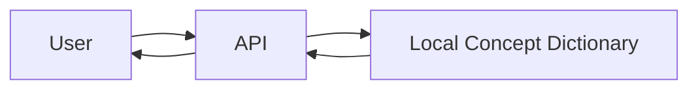

The upgraded architecture:

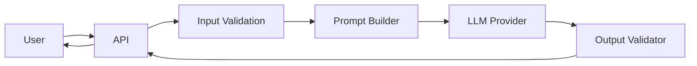

The API contract can remain the same even when the internal implementation changes.

This is an important software engineering principle:

> Keep the external interface stable while improving the internal implementation.

---

## 35. Recommended Project Structure

```text
llm-concept-explorer/
├── app/
│   ├── __init__.py
│   ├── main.py
│   ├── schemas.py
│   ├── prompts.py
│   ├── services.py
│   └── providers/
│       ├── __init__.py
│       ├── base.py
│       └── mock.py
├── tests/
│   ├── test_api.py
│   ├── test_prompts.py
│   └── test_services.py
├── evaluation/
│   └── cases.json
├── .env.example
├── .gitignore
├── Dockerfile
├── README.md
└── requirements.txt
```

Responsibilities:

| File                | Responsibility                   |
| ------------------- | -------------------------------- |
| `main.py`           | API routes and application setup |
| `schemas.py`        | Request and response validation  |
| `prompts.py`        | Prompt templates                 |
| `services.py`       | Application logic                |
| `providers/base.py` | Model interface                  |
| `providers/mock.py` | Mock provider                    |
| `tests/`            | Automated tests                  |
| `evaluation/`       | Model quality test cases         |

---

## 36. Practice Exercises

### Exercise 1 — Five-Line Summary

Without reviewing the lesson, explain:

1. What an AI Engineer does
2. What an LLM is
3. What tokens are
4. What a context window is
5. Why hallucinations occur

---

### Exercise 2 — Draw an AI Application Architecture

Include:

* User interface
* Backend API
* Prompt builder
* LLM
* Retrieval system
* Output validator
* Logging system

---

### Exercise 3 — Create Three Prompts

Create prompts for:

1. Summarization
2. Classification
3. Information extraction

Each prompt should contain:

* Task
* Context
* Constraints
* Output format

---

### Exercise 4 — Build a Mock Provider

Implement:

```python
class MockLanguageModel:
    def generate(self, prompt: str) -> str:
        ...
```

Requirements:

* Reject empty prompts.
* Return a deterministic mock response.
* Simulate one failure case.
* Record the prompt length.

---

### Exercise 5 — Add Structured Output

Create an endpoint that returns:

```json
{
  "concept": "token",
  "difficulty": "beginner",
  "explanation": "...",
  "example": "...",
  "warning": "..."
}
```

Validate all fields with a schema.

---

### Exercise 6 — Record a Production Risk

Choose one risk:

* Hallucinated answer
* Invalid JSON
* Prompt injection
* Provider timeout
* Excessive context
* Unexpected cost
* Sensitive data exposure

Document:

```text
Risk:
Example:
Impact:
Detection method:
Mitigation:
Remaining limitation:
```

---

## 37. Common Mistakes

### 37.1 Treating the LLM as a Database

An LLM should not be assumed to contain exact or current information.

Use:

* Databases
* Retrieval
* APIs
* Tools

when the application requires verified data.

---

### 37.2 Trusting Confident Language

A confident answer may still be incorrect.

Always separate:

```text
Fluent response ≠ Verified response
```

---

### 37.3 Putting Business Logic Only in Prompts

Important rules should not exist only as natural-language instructions.

Enforce critical constraints using:

* Application code
* Schemas
* Permission checks
* Output validation
* Database rules

---

### 37.4 Sending Too Much Context

More input is not always better.

Large prompts may:

* Increase latency
* Increase cost
* Include irrelevant content
* Reduce answer focus
* Exceed model limits

---

### 37.5 Skipping Evaluation

Testing one example does not prove that the feature works.

Create a reusable evaluation set with:

* Normal cases
* Edge cases
* Failure cases
* Safety cases

---

### 37.6 Ignoring User Experience

An AI feature should communicate:

* What it can do
* What it cannot do
* Whether it is still processing
* Whether the result is uncertain
* What the user should do after an error

---

## 38. Completion Checklist

* [ ] I can explain the role of an AI Engineer in one to two minutes.
* [ ] I can distinguish an AI Engineer from an ML Engineer.
* [ ] I can explain how an LLM generates text.
* [ ] I understand tokens and context windows.
* [ ] I understand the difference between training and inference.
* [ ] I know why LLM outputs may vary.
* [ ] I can explain what hallucination means.
* [ ] I understand why an LLM should not be treated as a database.
* [ ] I can describe a basic LLM request lifecycle.
* [ ] I can write a prompt with task, context, constraints, and output format.
* [ ] I can define a structured response schema.
* [ ] I have built a mock LLM integration.
* [ ] I have documented at least one production risk.
* [ ] I have created a small portfolio artifact.

---

## 39. Expected Outcome

After Week 3, you should understand where an LLM fits inside a complete AI application.

You should be able to move from:

```text
An LLM is a chatbot
```

to:

```text
An LLM is a probabilistic software component
that receives structured context,
generates candidate outputs,
and must be surrounded by validation,
retrieval, safety, evaluation, and monitoring.
```

This understanding prepares you for:

* Model API integration
* Prompt engineering
* Structured output
* Prompt injection defense
* Embeddings
* Semantic search
* Vector databases
* RAG systems
* AI agents
* Multimodal applications
* Production monitoring

---

## 40. Related Project

### Weekly Learning Tracker

Add a Week 3 folder:

```text
ai-engineer-roadmap/
├── week-01-02-foundations/
├── week-03-llm-fundamentals/
│   ├── architecture.md
│   ├── prompts.md
│   ├── demo-api/
│   ├── evaluation/
│   └── retrospective.md
└── README.md
```

Record:

```markdown
## What I Learned

## How an LLM Works

## What I Built

## Prompt Examples

## Evaluation Cases

## Problems I Encountered

## How I Debugged Them

## Known Limitations

## Next Steps
```

---

## 41. Final Summary

**Week 3: AI Engineer Introduction + LLM Fundamentals** is the checkpoint where the roadmap moves from general programming foundations into AI-specific engineering.

The most important lessons are:

* An AI Engineer builds complete AI-powered systems, not only prompts.
* An LLM generates language through probabilistic token prediction.
* Tokens and context windows affect cost, latency, and system design.
* Training teaches a model, while inference uses the trained model.
* Fluent output is not always correct.
* Hallucinations, invalid formats, latency, cost, and safety must be handled by the application.
* Reliable AI products require validation, retrieval, evaluation, monitoring, and clear user experience.

By the end of this week, you should have:

* An AI application architecture diagram
* A basic explanation of LLM fundamentals
* Several structured prompts
* A mock model provider
* A small API demo
* An evaluation dataset
* A documented production limitation

Do not stop at understanding the terminology. Turn the concepts into a small, testable system that can later be connected to a real model provider.

---

# Bài luyện tập

## Mục tiêu


## Đề bài


## Yêu cầu hoàn thành

- [ ] 
- [ ] 
- [ ] 

## Kết quả / lời giải


## Ghi chú
