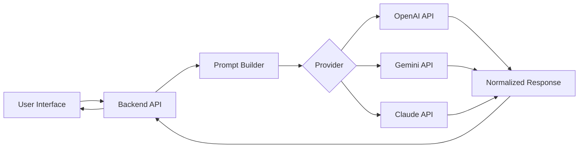
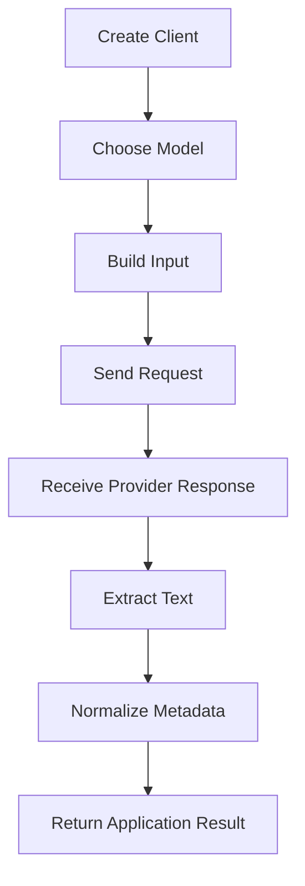
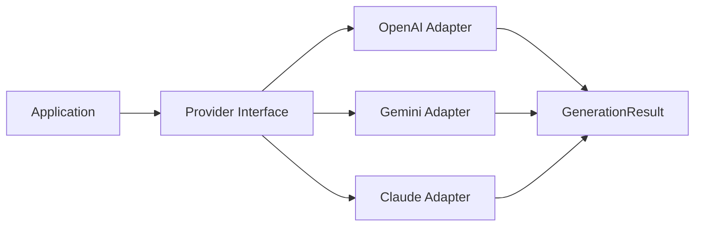
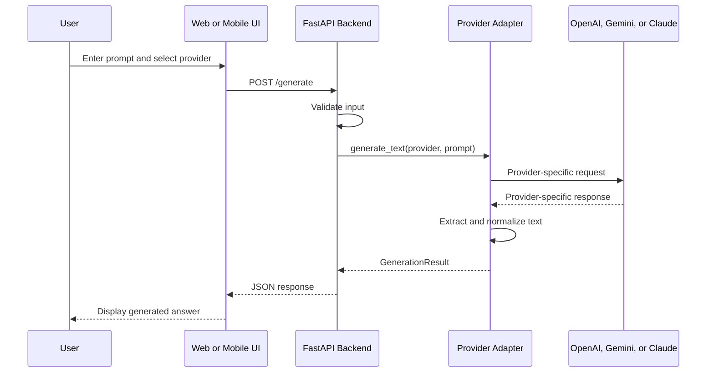
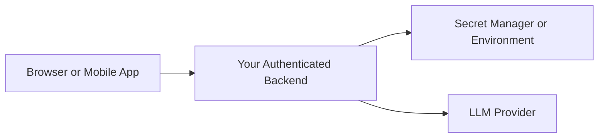
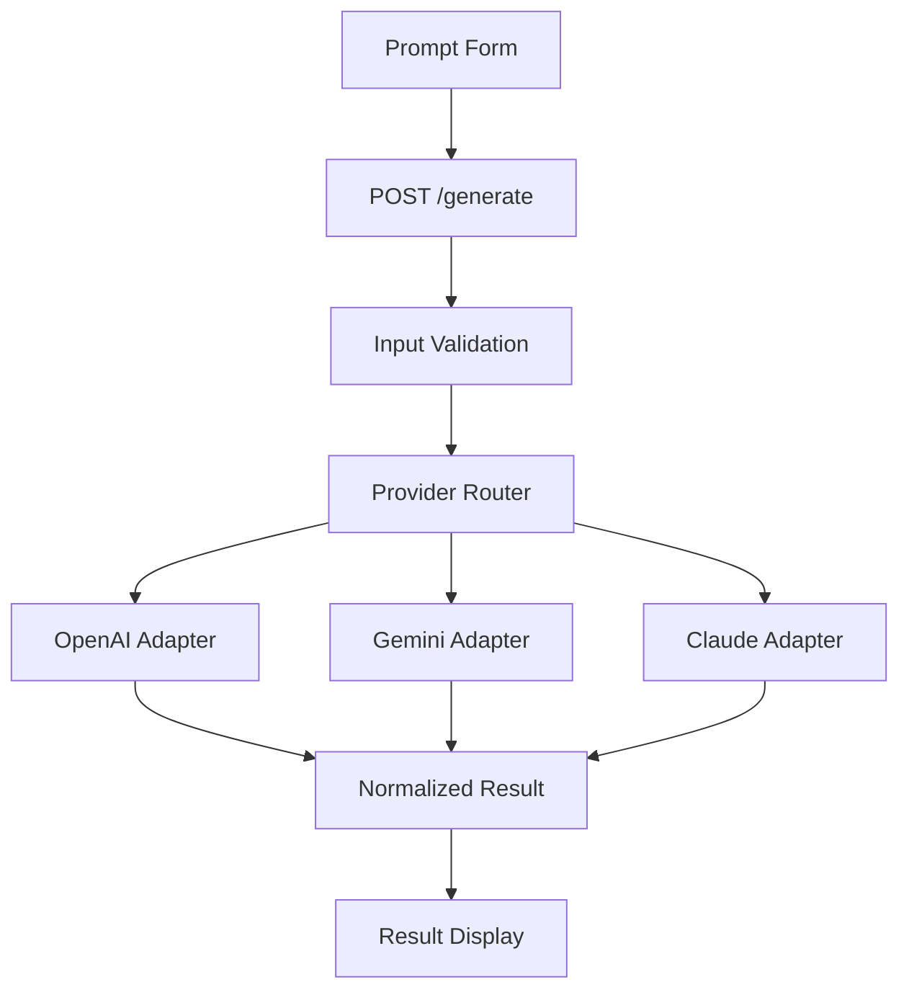

# 003 — Week 4: OpenAI API, Gemini API, and Claude API

**Course:** 05 — Production and Portfolio
**Module:** Module 14 — 12-Week Learning Plan
**Content group:** Weekly Plan
**Roadmap source:** 12-Week Learning Plan / Weekly Plan
**Lesson type:** Learning Plan
**Module order:** 003
**Suggested duration:** 12 minutes

---

## 1. Summary

Week 4 is the point where you move from understanding Large Language Models conceptually to integrating them into real software.

The goal is not to memorize three different SDKs. The goal is to understand the shared workflow behind most hosted LLM APIs:

1. Obtain and secure an API key.
2. Initialize a provider client.
3. select a model.
4. Send instructions and user input.
5. Read the generated response.
6. Handle errors, latency, usage, and provider differences.
7. Expose the model through a backend service or application feature.

The three providers use different names for their primary model-access interfaces:

* OpenAI uses the **Responses API** in its current documentation.
* Google recommends the **Gemini Interactions API** for access to its latest Gemini features and models.
* Anthropic provides direct model access through the **Claude Messages API**.

By the end of this lesson, you should be able to build a small application that sends the same task to OpenAI, Gemini, or Claude through a common backend interface.

---

## 2. Learning Objectives

After completing Week 4, you should be able to:

* Explain how an application communicates with a hosted LLM.
* Configure API keys safely with environment variables.
* Make a basic request to OpenAI, Gemini, and Claude.
* Identify the shared parts of an LLM API request.
* Explain the differences between provider-specific request formats.
* Build a simple provider abstraction.
* Return model output through a REST API endpoint.
* Handle authentication failures, rate limits, timeouts, and invalid responses.
* Compare providers using the same prompt and evaluation criteria.
* Produce a small portfolio-ready multi-provider AI demo.

---

## 3. Why This Week Matters

In Week 3, you studied concepts such as tokens, context windows, prompts, inference, and model output.

In Week 4, those concepts become application code.



Most production AI applications follow a similar pattern:

```text
User request
    ↓
Application validation
    ↓
Prompt construction
    ↓
LLM provider request
    ↓
Provider response
    ↓
Output validation
    ↓
Application response
```

Later topics such as structured output, RAG, agents, tool calling, multimodal input, evaluation, logging, and cost tracking all depend on this basic integration layer.

---

## 4. Core Concepts

### 4.1 API Client

An API client is an object that communicates with the provider's remote service.

A client normally handles:

* Authentication headers
* HTTP requests
* JSON serialization
* Response parsing
* Streaming
* Retries
* Provider-specific errors

Official SDKs reduce the amount of low-level HTTP code you need to write.

---

### 4.2 API Key

An API key identifies and authenticates your project.

API keys must be treated as secrets.

```text
Correct:

Frontend → Your backend → LLM provider

Incorrect:

Frontend → LLM provider using a private API key
```

Do not:

* Commit keys to Git.
* Place keys in mobile or browser source code.
* Print keys in logs.
* Include keys in screenshots.
* Send keys through chat messages.
* Store production keys directly in source files.

Use environment variables or a secret-management service instead.

OpenAI, Gemini, and Claude documentation all support environment-based credential configuration. Their SDKs can read credentials from the runtime environment.

Example `.env` file:

```env
OPENAI_API_KEY=your_openai_key
GEMINI_API_KEY=your_gemini_key
ANTHROPIC_API_KEY=your_anthropic_key

OPENAI_MODEL=gpt-5.6
GEMINI_MODEL=gemini-3.6-flash
ANTHROPIC_MODEL=claude-opus-5
```

Add the file to `.gitignore`:

```gitignore
.env
.env.*
!.env.example
```

Model names change over time. Keep them in configuration rather than scattering them throughout the application.

---

### 4.3 Model

A provider may offer several model families optimized for different requirements:

* General chat
* Complex reasoning
* Fast responses
* Low-cost classification
* Code generation
* Multimodal understanding
* Audio or real-time interaction
* Image or video generation

A model should be selected according to the application requirement rather than its name alone.

Consider:

| Requirement | Question                                                    |
| ----------- | ----------------------------------------------------------- |
| Quality     | How accurate must the response be?                          |
| Latency     | How quickly must the first token arrive?                    |
| Cost        | What is the acceptable cost per request?                    |
| Context     | How much input must the model process?                      |
| Modality    | Does the request contain text, images, audio, or documents? |
| Tools       | Does the model need function calling or external tools?     |
| Structure   | Must the response follow a JSON schema?                     |

---

### 4.4 Input

The input may contain:

* System or developer instructions
* User messages
* Conversation history
* Retrieved documents
* Images
* Audio
* Tool definitions
* Output schemas

A minimal input might be:

```text
Explain embeddings to a junior developer in three bullet points.
```

A stronger input separates role, task, context, constraints, and output format:

```text
Role:
You are an AI engineering instructor.

Task:
Explain embeddings to a junior backend developer.

Constraints:
- Use simple English.
- Use no more than three bullet points.
- Include one practical semantic-search example.

Output:
Return Markdown only.
```

---

### 4.5 Output

Provider responses contain more than generated text.

Depending on the provider and API, a response may include:

* Text content
* Structured content blocks
* Tool calls
* Token usage
* Stop reasons
* Safety information
* Request identifiers
* Error details
* Streaming events

Do not assume that every response is a single string.

Your integration layer should extract the application-facing result and retain useful metadata separately.

```json
{
  "provider": "openai",
  "model": "configured-model",
  "text": "An embedding is...",
  "usage": {
    "input_tokens": 52,
    "output_tokens": 94
  },
  "request_id": "provider-request-id"
}
```

---

## 5. Comparing the Three APIs

| Area                     | OpenAI                 | Gemini                    | Claude              |
| ------------------------ | ---------------------- | ------------------------- | ------------------- |
| Provider                 | OpenAI                 | Google                    | Anthropic           |
| Primary direct interface | Responses API          | Interactions API          | Messages API        |
| Python package           | `openai`               | `google-genai`            | `anthropic`         |
| Typical client           | `OpenAI()`             | `genai.Client()`          | `Anthropic()`       |
| Basic operation          | `responses.create()`   | `interactions.create()`   | `messages.create()` |
| Common text helper       | `response.output_text` | `interaction.output_text` | Text content block  |
| Key environment variable | `OPENAI_API_KEY`       | `GEMINI_API_KEY`          | `ANTHROPIC_API_KEY` |

OpenAI's quickstart currently demonstrates `client.responses.create(...)`. Google's current Gemini quickstart demonstrates `client.interactions.create(...)`, while its older `generateContent` interface remains documented. Anthropic documents `POST /v1/messages` as its general-availability endpoint for direct conversational interaction.

### Important Lesson

The syntax differs, but the conceptual workflow is nearly identical:



---

## 6. Environment Setup

Create a project:

```bash
mkdir multi-provider-llm-demo
cd multi-provider-llm-demo

python -m venv .venv
```

Activate the virtual environment.

### macOS or Linux

```bash
source .venv/bin/activate
```

### Windows PowerShell

```powershell
.venv\Scripts\Activate.ps1
```

Install the packages:

```bash
pip install openai google-genai anthropic python-dotenv fastapi uvicorn
```

Create this structure:

```text
multi-provider-llm-demo/
├── .env
├── .env.example
├── .gitignore
├── app.py
├── providers.py
└── requirements.txt
```

Example `.env.example`:

```env
OPENAI_API_KEY=
GEMINI_API_KEY=
ANTHROPIC_API_KEY=

OPENAI_MODEL=
GEMINI_MODEL=
ANTHROPIC_MODEL=
```

---

## 7. Basic OpenAI API Call

OpenAI's current quickstart uses the Responses API and exposes generated text through `output_text`.

```python
import os

from dotenv import load_dotenv
from openai import OpenAI

load_dotenv()

model = os.getenv("OPENAI_MODEL")

if not model:
    raise RuntimeError("OPENAI_MODEL is not configured.")

client = OpenAI()

response = client.responses.create(
    model=model,
    input=(
        "Explain vector embeddings to a junior backend developer "
        "in three concise bullet points."
    ),
)

print(response.output_text)
```

### Request Flow

```text
OpenAI()
    ↓
client.responses.create(...)
    ↓
OpenAI Responses API
    ↓
Response object
    ↓
response.output_text
```

### What to Notice

* The SDK reads `OPENAI_API_KEY` from the environment.
* The model is configuration, not hardcoded business logic.
* `input` contains the task.
* The result is read from `output_text`.

---

## 8. Basic Gemini API Call

Google's current Gemini quickstart recommends the Interactions API for the latest features and demonstrates `client.interactions.create(...)`.

```python
import os

from dotenv import load_dotenv
from google import genai

load_dotenv()

model = os.getenv("GEMINI_MODEL")

if not model:
    raise RuntimeError("GEMINI_MODEL is not configured.")

client = genai.Client()

interaction = client.interactions.create(
    model=model,
    input=(
        "Explain vector embeddings to a junior backend developer "
        "in three concise bullet points."
    ),
)

print(interaction.output_text)
```

### Request Flow

```text
genai.Client()
    ↓
client.interactions.create(...)
    ↓
Gemini Interactions API
    ↓
Interaction object
    ↓
interaction.output_text
```

Google also documents the earlier `generateContent` interface, but currently recommends Interactions for access to newer features and models.

---

## 9. Basic Claude API Call

Anthropic's Messages API accepts a list of messages and returns content blocks. The direct REST endpoint is `POST /v1/messages`.

```python
import os

from anthropic import Anthropic
from dotenv import load_dotenv

load_dotenv()

model = os.getenv("ANTHROPIC_MODEL")

if not model:
    raise RuntimeError("ANTHROPIC_MODEL is not configured.")

client = Anthropic()

message = client.messages.create(
    model=model,
    max_tokens=300,
    messages=[
        {
            "role": "user",
            "content": (
                "Explain vector embeddings to a junior backend developer "
                "in three concise bullet points."
            ),
        }
    ],
)

text_parts = [
    block.text
    for block in message.content
    if block.type == "text"
]

print("\n".join(text_parts))
```

### Request Flow

```text
Anthropic()
    ↓
client.messages.create(...)
    ↓
Claude Messages API
    ↓
Message with content blocks
    ↓
Extract blocks where type == "text"
```

### What to Notice

Claude returns a sequence of content blocks rather than requiring you to treat the whole response as one plain string.

This becomes important when responses include:

* Text
* Tool requests
* Citations
* Other structured block types

Anthropic's official SDKs provide authentication handling, streaming, retries, error handling, timeouts, and typed request and response objects.

---

## 10. Building a Common Provider Interface

A production application should not place provider-specific code throughout routes, controllers, or UI logic.

Create a common abstraction.

### `providers.py`

```python
import os
from dataclasses import dataclass
from typing import Literal

from anthropic import Anthropic
from google import genai
from openai import OpenAI

ProviderName = Literal["openai", "gemini", "claude"]


class ProviderConfigurationError(RuntimeError):
    """Raised when a provider is missing required configuration."""


class ProviderResponseError(RuntimeError):
    """Raised when a provider returns no usable text."""


@dataclass
class GenerationResult:
    provider: ProviderName
    model: str
    text: str


def require_env(name: str) -> str:
    value = os.getenv(name)

    if not value:
        raise ProviderConfigurationError(
            f"Required environment variable {name} is missing."
        )

    return value


def generate_with_openai(prompt: str) -> GenerationResult:
    model = require_env("OPENAI_MODEL")
    client = OpenAI()

    response = client.responses.create(
        model=model,
        input=prompt,
    )

    text = response.output_text.strip()

    if not text:
        raise ProviderResponseError(
            "OpenAI returned no usable text."
        )

    return GenerationResult(
        provider="openai",
        model=model,
        text=text,
    )


def generate_with_gemini(prompt: str) -> GenerationResult:
    model = require_env("GEMINI_MODEL")
    client = genai.Client()

    interaction = client.interactions.create(
        model=model,
        input=prompt,
    )

    text = interaction.output_text.strip()

    if not text:
        raise ProviderResponseError(
            "Gemini returned no usable text."
        )

    return GenerationResult(
        provider="gemini",
        model=model,
        text=text,
    )


def generate_with_claude(prompt: str) -> GenerationResult:
    model = require_env("ANTHROPIC_MODEL")
    client = Anthropic()

    message = client.messages.create(
        model=model,
        max_tokens=500,
        messages=[
            {
                "role": "user",
                "content": prompt,
            }
        ],
    )

    text = "\n".join(
        block.text
        for block in message.content
        if block.type == "text"
    ).strip()

    if not text:
        raise ProviderResponseError(
            "Claude returned no usable text."
        )

    return GenerationResult(
        provider="claude",
        model=model,
        text=text,
    )


def generate_text(
    provider: ProviderName,
    prompt: str,
) -> GenerationResult:
    if provider == "openai":
        return generate_with_openai(prompt)

    if provider == "gemini":
        return generate_with_gemini(prompt)

    if provider == "claude":
        return generate_with_claude(prompt)

    raise ValueError(f"Unsupported provider: {provider}")
```

### Why Normalize the Response?

Without normalization, the rest of your application must understand every provider's response shape.



The application only receives:

```python
GenerationResult(
    provider="gemini",
    model="configured-model",
    text="Generated response",
)
```

This makes it easier to:

* Change providers.
* Compare outputs.
* Add fallbacks.
* Test with mock providers.
* Centralize logging.
* Track cost and latency.
* Add retries.
* Apply output validation.

---

## 11. Exposing the Providers Through FastAPI

### `app.py`

```python
import time
from typing import Literal

from dotenv import load_dotenv
from fastapi import FastAPI, HTTPException
from pydantic import BaseModel, Field

from providers import (
    ProviderConfigurationError,
    ProviderResponseError,
    generate_text,
)

load_dotenv()

app = FastAPI(
    title="Multi-Provider LLM Demo",
    version="1.0.0",
)


class GenerateRequest(BaseModel):
    provider: Literal["openai", "gemini", "claude"]
    prompt: str = Field(
        min_length=1,
        max_length=10_000,
    )


class GenerateResponse(BaseModel):
    provider: str
    model: str
    text: str
    latency_ms: int


@app.post(
    "/generate",
    response_model=GenerateResponse,
)
def generate(request: GenerateRequest) -> GenerateResponse:
    started_at = time.perf_counter()

    try:
        result = generate_text(
            provider=request.provider,
            prompt=request.prompt,
        )
    except ProviderConfigurationError as exc:
        raise HTTPException(
            status_code=500,
            detail=str(exc),
        ) from exc
    except ProviderResponseError as exc:
        raise HTTPException(
            status_code=502,
            detail=str(exc),
        ) from exc
    except ValueError as exc:
        raise HTTPException(
            status_code=400,
            detail=str(exc),
        ) from exc
    except Exception as exc:
        # Log the full internal exception in a real application.
        raise HTTPException(
            status_code=502,
            detail="The model provider request failed.",
        ) from exc

    latency_ms = round(
        (time.perf_counter() - started_at) * 1000
    )

    return GenerateResponse(
        provider=result.provider,
        model=result.model,
        text=result.text,
        latency_ms=latency_ms,
    )
```

Run the server:

```bash
uvicorn app:app --reload
```

Test the endpoint:

```bash
curl -X POST "http://127.0.0.1:8000/generate" \
  -H "Content-Type: application/json" \
  -d '{
    "provider": "openai",
    "prompt": "Explain semantic search in two sentences."
  }'
```

Example response:

```json
{
  "provider": "openai",
  "model": "configured-model",
  "text": "Semantic search retrieves information...",
  "latency_ms": 1420
}
```

---

## 12. End-to-End Architecture



---

## 13. Practical Comparison Experiment

Send the same prompt to all three providers.

### Test Prompt

```text
You are a senior AI engineer.

Explain the difference between keyword search and semantic search.

Requirements:
- Use simple English.
- Return exactly four bullet points.
- Include one e-commerce example.
- Do not exceed 120 words.
```

Record the following:

| Metric                      | OpenAI | Gemini | Claude |
| --------------------------- | -----: | -----: | -----: |
| Request succeeded           |        |        |        |
| Valid format                |        |        |        |
| Latency                     |        |        |        |
| Word count                  |        |        |        |
| Followed four-bullet rule   |        |        |        |
| Included e-commerce example |        |        |        |
| Subjective clarity, 1–5     |        |        |        |

### Why Use the Same Prompt?

A fair provider comparison must control the input.

Changing both the model and the prompt makes it difficult to determine why outputs differ.

```text
Controlled:
Same task + same constraints + same evaluation

Uncontrolled:
Different prompt + different model + different settings
```

---

## 14. Common Production Errors

### 14.1 Missing or Invalid API Key

Possible symptoms:

```text
401 Unauthorized
Authentication failed
Invalid API key
Missing credentials
```

Debugging steps:

1. Confirm that the environment variable exists.
2. Restart the application after changing `.env`.
3. Check for leading or trailing whitespace.
4. Confirm that the key belongs to the correct provider.
5. Confirm that the key has not expired or been revoked.
6. Never print the full key.

Safe diagnostic:

```python
import os

key = os.getenv("OPENAI_API_KEY")

print("Key configured:", bool(key))
print("Key length:", len(key) if key else 0)
```

Do not do this:

```python
print(os.getenv("OPENAI_API_KEY"))
```

---

### 14.2 Invalid Model Name

Possible symptoms:

```text
Model not found
Unsupported model
Permission denied for model
Invalid model identifier
```

Causes may include:

* A typing error.
* A retired model.
* A preview model that is no longer available.
* A model unavailable to the project.
* A model name copied from an outdated tutorial.

Store the model name in environment configuration and verify it against the provider's current model documentation.

---

### 14.3 Rate Limit

Possible symptoms:

```text
429 Too Many Requests
Rate limit exceeded
Resource exhausted
```

A rate limit can apply to:

* Requests per minute
* Input tokens per minute
* Output tokens per minute
* Concurrent requests
* Daily quotas
* Project spending limits

Do not immediately retry in a tight loop.

Use exponential backoff:

```text
Request fails
    ↓
Wait 1 second
    ↓
Retry
    ↓
Wait 2 seconds
    ↓
Retry
    ↓
Wait 4 seconds
    ↓
Stop after retry limit
```

---

### 14.4 Timeout

LLM requests may take longer than ordinary database requests because generation happens token by token.

Possible causes include:

* A long prompt.
* A high output limit.
* A complex reasoning task.
* Provider load.
* Network instability.
* Tool execution.
* Large image or document input.

Production systems should define:

* Connection timeout
* Read timeout
* Total request timeout
* Retry policy
* Cancellation behavior
* User-facing timeout message

---

### 14.5 Empty or Unexpected Response

Do not assume that generated text always exists.

```python
text = response.output_text.strip()

if not text:
    raise ProviderResponseError(
        "The provider returned no usable text."
    )
```

Possible causes include:

* Safety refusal
* Tool-call output instead of text
* Interrupted stream
* Invalid response parsing
* Provider-side failure
* Empty model completion
* Unexpected content-block type

---

### 14.6 Output Does Not Follow the Prompt

LLMs are probabilistic systems. Instructions do not guarantee compliance.

For important output:

* Use structured output.
* Validate the response.
* Reject invalid schemas.
* Retry with a repair prompt when appropriate.
* Add deterministic application checks.
* Store failed examples for evaluation.

Example validation:

```python
if len(result.text) > 2_000:
    raise ProviderResponseError(
        "Generated output exceeded the application limit."
    )
```

---

### 14.7 Secrets Leaked Through the Frontend

Never put a private provider key in:

* React source code
* Flutter source code
* Android APK configuration
* iOS application bundles
* Browser local storage
* Public JavaScript
* Public GitHub repositories

Correct architecture:



---

## 15. Provider Abstraction: Benefits and Limitations

### Benefits

A common interface allows you to:

* Switch providers with configuration.
* Use one provider as a fallback.
* Compare answer quality.
* Centralize logging.
* Standardize application errors.
* Mock the model during tests.
* Apply common validation.
* Reduce vendor-specific code in business logic.

### Limitations

A provider abstraction can hide useful provider-specific features.

Examples include:

* Different tool-call formats
* Different reasoning controls
* Different streaming events
* Different caching mechanisms
* Different multimodal capabilities
* Different safety responses
* Different token accounting
* Different content-block types

Avoid creating an abstraction so generic that it prevents access to important capabilities.

A useful design is:

```text
Common interface for basic generation
+
Provider-specific options for advanced features
```

---

## 16. Suggested Week 4 Schedule

### Day 1 — OpenAI API

* Create an API key.
* Configure environment variables.
* Install the SDK.
* Send a basic request.
* Inspect the response object.
* Handle one authentication error.

### Day 2 — Gemini API

* Configure the Gemini client.
* Send the same prompt.
* Inspect the returned interaction.
* Compare output quality and latency.

### Day 3 — Claude API

* Configure the Anthropic client.
* Send the same prompt.
* Inspect content blocks.
* Extract text safely.

### Day 4 — Provider Abstraction

* Create a shared `generate_text()` function.
* Normalize responses.
* Add configuration validation.
* Add provider-specific error handling.

### Day 5 — REST API

* Create a FastAPI endpoint.
* Validate provider and prompt.
* Return normalized JSON.
* Test with cURL or Postman.

### Day 6 — Evaluation

* Run the same prompt on all providers.
* Record latency and instruction compliance.
* Identify strengths and weaknesses.
* Save results in Markdown or JSON.

### Day 7 — Portfolio Cleanup

* Write a README.
* Add an architecture diagram.
* Add `.env.example`.
* Add screenshots or sample output.
* Document limitations and next steps.

---

## 17. Practical Exercises

### Exercise 1 — First API Calls

Create three Python scripts:

```text
openai_demo.py
gemini_demo.py
claude_demo.py
```

Each script must:

* Read its key from the environment.
* Read its model name from the environment.
* Send the same prompt.
* Print the generated text.
* Handle a missing model configuration.

---

### Exercise 2 — Shared Interface

Implement:

```python
generate_text(
    provider="openai",
    prompt="Explain REST APIs."
)
```

Supported providers:

```text
openai
gemini
claude
```

The result must contain:

```json
{
  "provider": "openai",
  "model": "configured-model",
  "text": "..."
}
```

---

### Exercise 3 — FastAPI Route

Create:

```http
POST /generate
```

Request:

```json
{
  "provider": "gemini",
  "prompt": "Create a three-question Python quiz."
}
```

Response:

```json
{
  "provider": "gemini",
  "model": "configured-model",
  "text": "...",
  "latency_ms": 900
}
```

---

### Exercise 4 — Failure Testing

Deliberately test:

* A missing API key
* An invalid model
* An empty prompt
* An unsupported provider
* A very long prompt
* A network failure
* An artificial timeout

For each failure, record:

```text
Error:
Root cause:
Observed behavior:
Expected application behavior:
Fix:
```

---

### Exercise 5 — Provider Evaluation

Use five prompts representing different tasks:

1. Summarization
2. Classification
3. Code generation
4. Structured information extraction
5. Long-form explanation

Score each response from 1 to 5 for:

* Correctness
* Clarity
* Format compliance
* Completeness
* Latency

Do not conclude that one provider is universally best from a single prompt.

---

## 18. Mini Project

### Multi-Provider AI Playground

Build a small application where the user can:

* Enter a prompt.
* Select OpenAI, Gemini, or Claude.
* Submit the request.
* View the generated answer.
* View latency.
* Compare responses side by side.
* See a friendly error message when a request fails.

### Minimum Architecture



### Stretch Features

* Streaming output
* Prompt history
* Token usage
* Estimated cost
* Provider fallback
* Response comparison mode
* Markdown rendering
* Structured JSON output
* Request cancellation
* Basic authentication
* Per-user rate limiting

---

## 19. Portfolio Deliverable

Your Week 4 repository should contain:

```text
week-04-multi-provider-api/
├── README.md
├── .env.example
├── .gitignore
├── requirements.txt
├── app.py
├── providers.py
├── tests/
│   └── test_providers.py
├── examples/
│   ├── openai_demo.py
│   ├── gemini_demo.py
│   └── claude_demo.py
└── docs/
    ├── architecture.md
    └── provider-comparison.md
```

### README Sections

```markdown
# Multi-Provider LLM API Demo

## Overview

## Features

## Architecture

## Installation

## Environment Variables

## Running the Application

## API Examples

## Error Handling

## Provider Comparison

## Security Notes

## Limitations

## Future Improvements
```

---

## 20. Common Learning Mistakes

### Mistake 1: Copying Code Without Inspecting the Response

A successful request is not enough.

Inspect:

* Response structure
* Generated content location
* Usage metadata
* Stop reason
* Tool-call data
* Request ID

---

### Mistake 2: Hardcoding API Keys

This creates an immediate security risk and makes deployment difficult.

Use:

```python
os.getenv("OPENAI_API_KEY")
```

Do not use:

```python
OPENAI_API_KEY = "secret-key-here"
```

---

### Mistake 3: Putting Provider Code Directly in Routes

Weak design:

```python
@app.post("/generate")
def generate(...):
    # 100 lines of OpenAI-specific code
```

Better design:

```python
@app.post("/generate")
def generate(...):
    result = generate_text(
        provider=request.provider,
        prompt=request.prompt,
    )
```

---

### Mistake 4: Testing Only the Happy Path

A demo that works once is not production-ready.

Test at least:

* Invalid credentials
* Invalid input
* Provider timeout
* Empty output
* Rate limit
* Unsupported model
* Unexpected response format

---

### Mistake 5: Assuming All Providers Behave Identically

Even when the prompt is the same, providers may differ in:

* Formatting
* Verbosity
* Refusal behavior
* Tool-call representation
* Streaming format
* Latency
* Token counting
* Error responses

Normalize only what your application truly needs.

---

### Mistake 6: Choosing a Provider Based on One Response

A good answer from one prompt is not an evaluation.

Use:

* A representative test set
* Repeated runs
* Objective checks
* Human review
* Latency measurements
* Cost measurements
* Failure-rate tracking

---

## 21. Production Checklist

### Security

* [ ] Keys are stored in environment variables or a secret manager.
* [ ] `.env` is excluded from Git.
* [ ] Keys are never sent to the frontend.
* [ ] Logs do not contain secrets.
* [ ] Production and development use separate credentials.

### Reliability

* [ ] Requests have timeouts.
* [ ] Rate-limit errors are handled.
* [ ] Retries are bounded.
* [ ] Empty responses are detected.
* [ ] Provider failures return safe user-facing errors.

### Maintainability

* [ ] Provider code is isolated in adapters.
* [ ] Model names are configurable.
* [ ] Responses use a normalized application format.
* [ ] Provider-specific features remain accessible when needed.
* [ ] Unit tests can use a fake provider.

### Observability

* [ ] Latency is measured.
* [ ] Provider name is logged.
* [ ] Model name is logged.
* [ ] Request IDs are retained where available.
* [ ] Token usage is stored when available.
* [ ] Failed requests include an error category.

### User Experience

* [ ] The UI displays a loading state.
* [ ] Long requests can be cancelled where possible.
* [ ] Error messages are understandable.
* [ ] Duplicate submissions are controlled.
* [ ] Generated output is clearly distinguished from verified facts.

---

## 22. Completion Checklist

You have completed Week 4 when:

* [ ] I can explain the LLM API request lifecycle in one or two minutes.
* [ ] I can call OpenAI from Python.
* [ ] I can call Gemini from Python.
* [ ] I can call Claude from Python.
* [ ] I understand where each provider stores generated text.
* [ ] I keep API keys outside source code.
* [ ] I can expose generation through a backend route.
* [ ] I have implemented a shared provider interface.
* [ ] I have handled at least three failure cases.
* [ ] I have compared all three providers using the same prompt.
* [ ] I have documented one limitation of my abstraction.
* [ ] I have a runnable demo or portfolio artifact.

---

## 23. Expected Outcome

By the end of this week, you should have a working application that can send prompts to multiple LLM providers through one backend interface.

You should understand that an AI API integration is not merely:

```text
Send prompt → print answer
```

A maintainable integration is:

```text
Validate input
    ↓
Select provider and model
    ↓
Build request
    ↓
Apply timeout and retry policy
    ↓
Send provider request
    ↓
Parse provider response
    ↓
Validate output
    ↓
Record latency and usage
    ↓
Return normalized application result
```

This integration layer becomes the foundation for later work involving:

* Prompt engineering
* Structured output
* Safety controls
* Embeddings
* Semantic search
* Vector databases
* RAG
* Function calling
* Agents
* Multimodal features
* Evaluation
* Logging
* Cost tracking
* Production deployment

---

## 24. Final Summary

**Week 4: OpenAI API, Gemini API, and Claude API** is the transition from LLM theory to real AI application development.

The most important lessons are:

1. All three providers follow a similar request–response workflow.
2. API keys belong on a secure backend, not in client applications.
3. Provider-specific response formats should be converted into an application-facing format.
4. Model and provider selection should remain configurable.
5. Errors, timeouts, rate limits, empty responses, and invalid formats are normal production concerns.
6. A useful weekly deliverable is a small multi-provider API application rather than a collection of copied snippets.

The objective is not to become loyal to one SDK. It is to learn how to design an AI application that can integrate, evaluate, and safely operate model providers as external production dependencies.
