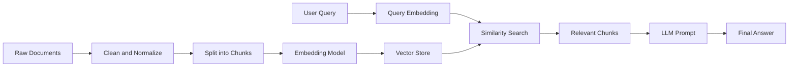
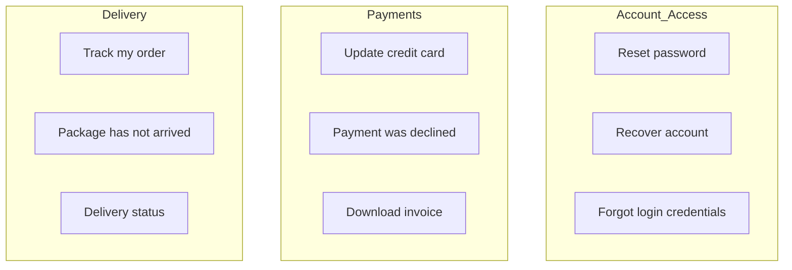
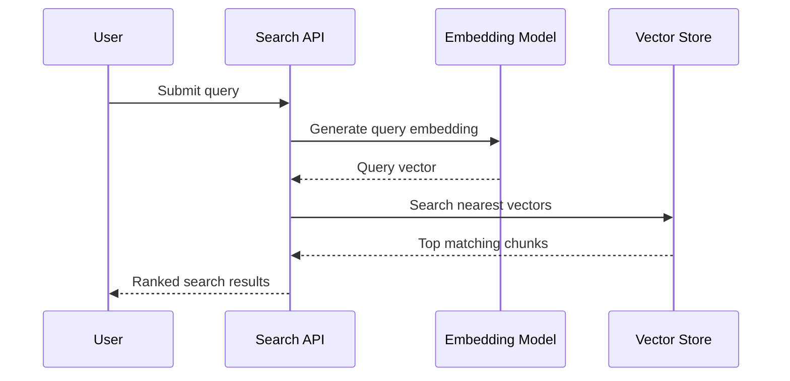
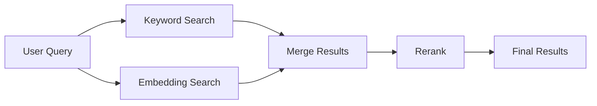
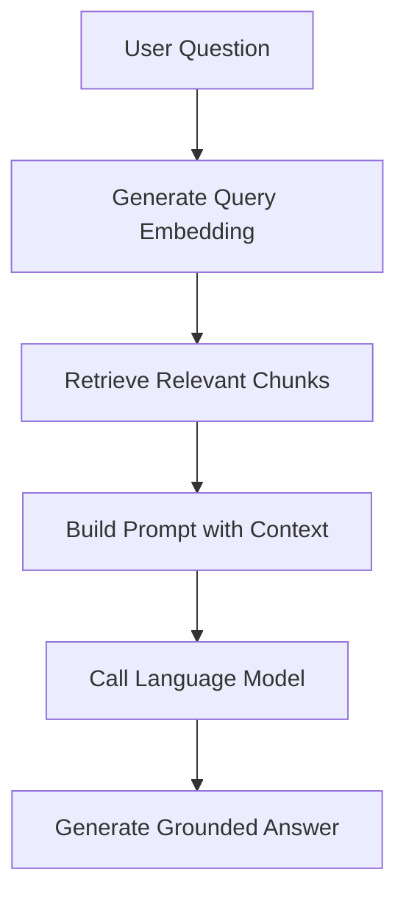
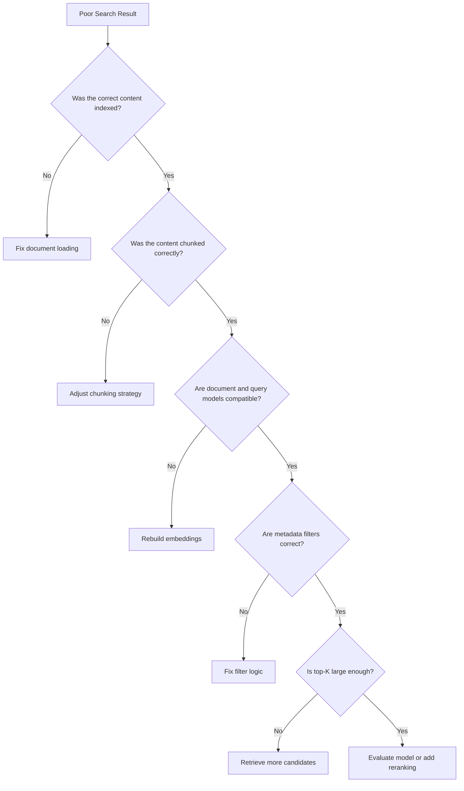

# 006 — Week 7: Embeddings and Semantic Search

**Course:** 05 — Production and Portfolio
**Module:** Module 14 — 12-Week Learning Plan
**Content Group:** Weekly Plan
**Roadmap Source:** 12-Week Learning Plan / Weekly Plan
**Lesson Type:** Learning Plan
**Order in Module:** 006
**Suggested Duration:** 12 minutes

---

## 1. Overview

Week 7 introduces two essential building blocks of modern AI applications:

* **Embeddings**
* **Semantic search**

Traditional keyword search looks for exact words or phrases. Semantic search attempts to understand the **meaning** of a query and retrieve content with a similar meaning, even when the wording is different.

For example, a keyword search for:

```text
How can I reset my password?
```

may fail to retrieve a document titled:

```text
Recovering access to your account
```

A semantic search system can recognize that both sentences describe a similar intent.

Embeddings and semantic search are commonly used in:

* Retrieval-Augmented Generation systems
* AI knowledge assistants
* Document search applications
* Recommendation systems
* FAQ bots
* Code search tools
* Similarity detection
* Duplicate-content detection
* Agent memory systems

By the end of this week, you should be able to convert text into vectors, store those vectors, search for semantically related content, and build a small retrieval API.

---

## 2. Learning Objectives

By the end of Week 7, you should be able to:

* Explain embeddings in your own words.
* Describe how semantic search differs from keyword search.
* Convert text into embedding vectors.
* Calculate similarity between vectors.
* Split documents into searchable chunks.
* Store vectors together with their metadata.
* Retrieve the most relevant chunks for a user query.
* Build a small semantic search API or notebook.
* Identify common retrieval problems and debug them.
* Explain how semantic search becomes the retrieval component of a RAG pipeline.

---

## 3. Where This Topic Fits in the AI Engineer Workflow

Embeddings sit between raw data and language-model generation.



Without embeddings, an application can still call a language model, but it cannot efficiently search a private or domain-specific knowledge base by meaning.

Embeddings are therefore the bridge between:

```text
Unstructured information → Searchable vectors → Relevant context → LLM answer
```

---

## 4. Core Concepts

### 4.1 What Is an Embedding?

An embedding is a numerical representation of an object such as:

* A sentence
* A paragraph
* A document
* An image
* A product
* A user profile
* A source-code function

An embedding model converts the input into a list of numbers called a **vector**.

Conceptually:

```text
"Reset my password"
        ↓
Embedding model
        ↓
[0.12, -0.48, 0.77, 0.05, ...]
```

The individual numbers are not normally interpreted manually. Their value comes from the position of the entire vector in a high-dimensional space.

Inputs with similar meanings should be located near each other.

```text
"Reset my password"
"Recover my account credentials"
"Change a forgotten login password"
```

These sentences use different words, but their embeddings should be relatively close.

---

### 4.2 Embedding Space

An embedding model maps content into a mathematical space.

A simplified two-dimensional illustration might look like this:



Real embeddings may contain hundreds or thousands of dimensions rather than only two.

The main idea remains the same:

> Semantically related inputs should have similar vector representations.

---

### 4.3 Semantic Search

Semantic search retrieves information based on meaning rather than exact keyword matching.

#### Keyword search

```text
Query: "car repair"

Possible match:
- "Car repair manual"
```

#### Semantic search

```text
Query: "How do I fix my vehicle?"

Possible matches:
- "Basic automobile maintenance"
- "Diagnosing engine problems"
- "Common vehicle repair procedures"
```

Semantic search is especially useful when:

* Users phrase the same question in different ways.
* Documents contain synonyms.
* The query and document use different terminology.
* Natural-language questions must be matched to technical documents.
* The system supports multiple styles of user input.

---

### 4.4 Cosine Similarity

A semantic search system needs a method for comparing vectors.

One common method is **cosine similarity**.

[
\text{cosine similarity}(A,B)
=============================

\frac{A \cdot B}
{|A| |B|}
]

For normalized vectors, the score is commonly interpreted as:

* Close to `1`: highly similar
* Close to `0`: weakly related
* Close to `-1`: opposite vector directions

In practical embedding systems, the exact score distribution depends on the embedding model and dataset. A score should not be treated as a universal confidence percentage.

Example:

```text
Query: "How can I recover my account?"

Document A: "Resetting a forgotten password"
Similarity: 0.89

Document B: "Updating billing information"
Similarity: 0.22

Document C: "Creating a new account"
Similarity: 0.57
```

Document A would normally be ranked first.

---

### 4.5 Other Distance Metrics

Vector databases may support different similarity or distance functions.

| Metric             | Main Idea                 | Common Use                        |
| ------------------ | ------------------------- | --------------------------------- |
| Cosine similarity  | Compares vector direction | Text embeddings                   |
| Dot product        | Measures vector alignment | Normalized embeddings and ranking |
| Euclidean distance | Measures direct distance  | Spatial or numerical embeddings   |

You should use the distance metric recommended for the selected embedding model or vector database.

---

## 5. The Semantic Search Pipeline

A basic semantic search application has two major phases:

1. Indexing
2. Querying

---

### 5.1 Indexing Phase

The indexing phase prepares documents for retrieval.


Each stored record may contain:

```json
{
  "id": "doc_001_chunk_003",
  "text": "Users can reset their password from the account settings page.",
  "embedding": [0.12, -0.48, 0.77],
  "metadata": {
    "document_id": "doc_001",
    "title": "Account Management Guide",
    "section": "Password Recovery",
    "language": "en",
    "source": "help-center"
  }
}
```

---

### 5.2 Query Phase

During the query phase, the system:

1. Receives a user query.
2. Converts the query into an embedding.
3. Searches for nearby document vectors.
4. Ranks the results.
5. Returns the most relevant chunks.



---

## 6. Document Chunking

Large documents should usually not be embedded as one complete block.

Instead, they are divided into smaller pieces called **chunks**.

### Example

Original document:

```text
A 20-page employee handbook
```

Possible chunks:

```text
Chunk 1: Company introduction
Chunk 2: Working hours
Chunk 3: Leave policy
Chunk 4: Remote-work policy
Chunk 5: Security requirements
```

Chunking improves retrieval precision because the system can return only the section relevant to the query.

---

### 6.1 Chunk Size Trade-Off

#### Chunks that are too large

Possible problems:

* Contain several unrelated topics.
* Produce less precise embeddings.
* Waste the LLM context window.
* Increase token usage during generation.

#### Chunks that are too small

Possible problems:

* Lose important context.
* Contain incomplete sentences.
* Produce fragmented search results.
* Require retrieving many chunks.

A practical starting point is to split by:

* Paragraph
* Section
* Heading
* Sentence group
* Token count

The ideal chunk size must be evaluated using real queries from the application.

---

### 6.2 Chunk Overlap

Chunk overlap repeats a small amount of content between adjacent chunks.

Example:

```text
Chunk 1: Sentences 1–10
Chunk 2: Sentences 8–17
Chunk 3: Sentences 15–24
```

Overlap can preserve context when important information appears near a chunk boundary.

However, too much overlap can:

* Increase storage
* Increase embedding costs
* Produce duplicate search results
* Reduce result diversity

---

## 7. Vector Stores

A vector store keeps embeddings and supports nearest-neighbor search.

Possible storage options include:

* An in-memory Python list
* NumPy
* FAISS
* PostgreSQL with a vector extension
* Qdrant
* Weaviate
* Pinecone
* Chroma
* Elasticsearch with vector search
* Managed cloud search services

For a small Week 7 demo, an in-memory solution is sufficient.

For production, consider:

* Dataset size
* Query latency
* Filtering support
* Persistence
* Backup strategy
* Index-building time
* Horizontal scaling
* Access control
* Operational cost

---

## 8. Minimal Python Demo

The following example demonstrates the core retrieval process using an abstract embedding function.

```python
from dataclasses import dataclass
from typing import Callable, List

import numpy as np


@dataclass
class DocumentChunk:
    chunk_id: str
    text: str
    embedding: np.ndarray


def cosine_similarity(vector_a: np.ndarray, vector_b: np.ndarray) -> float:
    denominator = np.linalg.norm(vector_a) * np.linalg.norm(vector_b)

    if denominator == 0:
        return 0.0

    return float(np.dot(vector_a, vector_b) / denominator)


def semantic_search(
    query: str,
    chunks: List[DocumentChunk],
    embed_text: Callable[[str], np.ndarray],
    top_k: int = 3,
) -> list[tuple[DocumentChunk, float]]:
    if not query.strip():
        raise ValueError("The query must not be empty.")

    if top_k <= 0:
        raise ValueError("top_k must be greater than zero.")

    query_embedding = embed_text(query)

    scored_chunks = [
        (chunk, cosine_similarity(query_embedding, chunk.embedding))
        for chunk in chunks
    ]

    scored_chunks.sort(key=lambda item: item[1], reverse=True)

    return scored_chunks[:top_k]
```

The `embed_text` function can be implemented using an embedding provider or a local embedding model.

Example usage:

```python
query = "How do I recover access to my account?"

results = semantic_search(
    query=query,
    chunks=document_chunks,
    embed_text=embedding_client.embed,
    top_k=3,
)

for chunk, score in results:
    print(f"Score: {score:.3f}")
    print(f"Text: {chunk.text}")
    print("---")
```

---

## 9. Example Search API

A semantic search feature can be exposed through an API route.

### Request

```http
POST /api/search
Content-Type: application/json
```

```json
{
  "query": "How can I change a forgotten password?",
  "top_k": 3
}
```

### Response

```json
{
  "query": "How can I change a forgotten password?",
  "results": [
    {
      "chunk_id": "account_guide_04",
      "score": 0.89,
      "text": "Use the password recovery page to create a new password.",
      "metadata": {
        "title": "Account Access Guide",
        "section": "Password Recovery"
      }
    },
    {
      "chunk_id": "security_guide_02",
      "score": 0.74,
      "text": "A recovery email can be used when login credentials are lost.",
      "metadata": {
        "title": "Security Guide",
        "section": "Account Recovery"
      }
    }
  ]
}
```

---

## 10. Example FastAPI Structure

```python
from typing import Any

from fastapi import FastAPI, HTTPException
from pydantic import BaseModel, Field


app = FastAPI()


class SearchRequest(BaseModel):
    query: str = Field(min_length=1, max_length=1000)
    top_k: int = Field(default=5, ge=1, le=20)


class SearchResult(BaseModel):
    chunk_id: str
    text: str
    score: float
    metadata: dict[str, Any]


class SearchResponse(BaseModel):
    query: str
    results: list[SearchResult]


@app.post("/api/search", response_model=SearchResponse)
def search_documents(request: SearchRequest) -> SearchResponse:
    try:
        matches = semantic_search(
            query=request.query,
            chunks=document_chunks,
            embed_text=embedding_client.embed,
            top_k=request.top_k,
        )
    except Exception as error:
        raise HTTPException(
            status_code=500,
            detail="Semantic search failed.",
        ) from error

    return SearchResponse(
        query=request.query,
        results=[
            SearchResult(
                chunk_id=chunk.chunk_id,
                text=chunk.text,
                score=score,
                metadata={},
            )
            for chunk, score in matches
        ],
    )
```

A production version should also include:

* Request authentication
* Rate limiting
* Structured logging
* Retry handling
* Timeout handling
* Input validation
* Model-version tracking
* Query latency metrics
* Search-result evaluation

---

## 11. Metadata Filtering

Semantic similarity alone may not be enough.

Suppose the knowledge base contains documents in several languages and product versions.

The query may require filters such as:

```json
{
  "language": "en",
  "product": "mobile-app",
  "version": "3.0",
  "access_level": "public"
}
```

A filtered search might work as follows:

```text
User query
    ↓
Generate query embedding
    ↓
Apply metadata filters
    ↓
Search eligible vectors
    ↓
Return top results
```

Metadata filtering is important for:

* Multi-tenant applications
* User permissions
* Language selection
* Product versions
* Date ranges
* Document categories
* Geographic regions
* Data-access policies

---

## 12. Semantic Search vs Keyword Search

| Dimension                  | Keyword Search                   | Semantic Search                   |
| -------------------------- | -------------------------------- | --------------------------------- |
| Matching method            | Exact words and phrases          | Meaning and contextual similarity |
| Synonym handling           | Limited                          | Usually stronger                  |
| Exact identifiers          | Strong                           | May be weaker                     |
| Natural-language questions | Limited                          | Strong                            |
| Explainability             | Relatively straightforward       | More difficult                    |
| Computational cost         | Usually lower                    | Usually higher                    |
| Embedding model required   | No                               | Yes                               |
| Best for                   | Names, IDs, codes, exact phrases | Concepts, questions, paraphrases  |

The two approaches are not mutually exclusive.

A strong search system may combine them.

---

## 13. Hybrid Search

Hybrid search combines:

* Keyword-based ranking
* Vector-based semantic ranking



Hybrid search is useful because embeddings may perform poorly on:

* Product codes
* Error codes
* Exact names
* Dates
* Version numbers
* Rare technical terms
* Short abbreviations

For example:

```text
Query: ERR_AUTH_4017
```

An exact keyword index may retrieve this identifier more reliably than a semantic embedding.

---

## 14. Reranking

Initial vector search may retrieve many candidate chunks quickly.

A second model or scoring function can then reorder those results more precisely.

```text
Query
  ↓
Vector search: retrieve top 20 candidates
  ↓
Reranker: score query-document relevance
  ↓
Return top 5 results
```

This approach separates:

* Fast candidate retrieval
* More accurate final ranking

Reranking can improve quality, but it adds:

* Latency
* Cost
* Infrastructure complexity
* Another model that must be evaluated

For a Week 7 project, reranking is optional. The first priority is building a correct embedding and retrieval pipeline.

---

## 15. Connection to Retrieval-Augmented Generation

Semantic search becomes a RAG system when retrieved content is added to an LLM prompt.



Example prompt:

```text
You are a support assistant.

Answer the user's question using only the supplied context.
If the context does not contain the answer, say that the information
is unavailable.

Context:
1. Users can reset their password from the account recovery page.
2. A verification link will be sent to the registered email address.

Question:
How can I recover my account?
```

Week 7 focuses primarily on the retrieval layer. A later week can expand this pipeline into a complete RAG application.

---

## 16. Recommended Week 7 Project

### Project: Semantic Search for Personal Notes

Build an application that searches a small collection of notes or Markdown documents.

### Minimum features

* Load at least 20 text documents or notes.
* Split the documents into chunks.
* Generate an embedding for every chunk.
* Store chunk text, vector, and metadata.
* Accept a natural-language query.
* Return the top five matching chunks.
* Display similarity scores.
* Show the source document for each result.
* Handle empty queries and embedding failures.

### Optional features

* Metadata filters
* Language filters
* Hybrid keyword and vector search
* Search-result highlighting
* Query history
* Retrieval latency tracking
* Duplicate-result removal
* A simple web interface
* An API endpoint
* A small evaluation dataset

---

## 17. Suggested Project Structure

```text
semantic-search-demo/
├── app/
│   ├── api.py
│   ├── config.py
│   ├── embeddings.py
│   ├── chunking.py
│   ├── indexing.py
│   ├── retrieval.py
│   └── schemas.py
├── data/
│   └── documents/
├── scripts/
│   └── build_index.py
├── tests/
│   ├── test_chunking.py
│   ├── test_similarity.py
│   └── test_retrieval.py
├── evaluation/
│   └── queries.json
├── README.md
└── requirements.txt
```

---

## 18. Evaluation

A retrieval system should not be judged from only one successful query.

Create a small test set:

```json
[
  {
    "query": "How do I recover my password?",
    "expected_document_ids": ["account_recovery"]
  },
  {
    "query": "Where can I download an invoice?",
    "expected_document_ids": ["billing_invoice"]
  },
  {
    "query": "How long does delivery take?",
    "expected_document_ids": ["shipping_times"]
  }
]
```

Useful retrieval metrics include:

### Recall@K

Checks whether a relevant document appears in the first `K` results.

```text
Expected document appears in top 5 → success
Expected document does not appear → failure
```

### Precision@K

Measures how many of the returned results are relevant.

### Mean Reciprocal Rank

Rewards systems that rank the first relevant result near the top.

### Latency

Measures how long the retrieval operation takes.

### Qualitative Review

A human reviewer examines whether:

* The result actually answers the query.
* The chunk contains enough context.
* The ranking order is reasonable.
* Irrelevant chunks are being retrieved.
* Duplicate chunks dominate the results.

---

## 19. Common Problems

### 19.1 Embedding the Entire Document

**Problem:** A large document contains several unrelated topics.

**Result:** Search retrieves the correct document but not the exact passage.

**Solution:** Split the document into meaningful chunks.

---

### 19.2 Using Arbitrary Chunk Sizes

**Problem:** Chunk size is selected without testing.

**Result:** Important context may be lost or retrieval may be too broad.

**Solution:** Evaluate several chunking strategies using real queries.

---

### 19.3 Mixing Embedding Models

**Problem:** Documents are embedded using one model while queries are embedded using another.

**Result:** Vector comparisons become unreliable.

**Solution:** Use the same compatible embedding model and configuration for indexing and querying.

---

### 19.4 Ignoring Model Versions

**Problem:** The embedding model changes, but old vectors remain in the database.

**Result:** New query vectors may not be compatible with existing document vectors.

**Solution:** Store embedding metadata:

```json
{
  "embedding_provider": "provider-name",
  "embedding_model": "model-name",
  "embedding_version": "2026-01",
  "vector_dimension": 1024
}
```

Rebuild the index when compatibility changes.

---

### 19.5 Treating Similarity as Confidence

**Problem:** A similarity score of `0.82` is displayed as “82% confidence.”

**Result:** Users receive a misleading interpretation.

**Solution:** Treat similarity as a ranking signal, not a calibrated probability.

---

### 19.6 Returning Results Below Any Quality Threshold

**Problem:** The system always returns five results, even when all results are unrelated.

**Result:** Irrelevant context enters the prompt.

**Solution:** Add a dataset-specific rejection rule or minimum-quality policy.

```python
filtered_results = [
    result
    for result in results
    if result.score >= similarity_threshold
]
```

The threshold must be validated rather than guessed.

---

### 19.7 Missing Metadata

**Problem:** Only vectors and text are stored.

**Result:** The application cannot identify the source, enforce permissions, or filter results.

**Solution:** Store complete metadata with every chunk.

---

### 19.8 No Retrieval Evaluation

**Problem:** The developer tests only a few memorable queries.

**Result:** Search quality appears better than it really is.

**Solution:** Maintain a reusable retrieval evaluation dataset.

---

### 19.9 Duplicate Search Results

**Problem:** Overlapping chunks from the same document dominate the top results.

**Result:** The user sees repeated information.

**Solution:** Deduplicate results or limit the number of chunks returned from each source document.

---

### 19.10 Ignoring Empty or Malicious Input

**Problem:** The endpoint accepts empty, extremely long, or invalid queries.

**Result:** Unnecessary costs, errors, or abuse.

**Solution:** Validate query length, rate-limit requests, and log abnormal inputs.

---

## 20. Production Considerations

A production-ready semantic search system should monitor:

* Embedding request latency
* Search latency
* Index size
* Number of stored vectors
* Failed embedding requests
* Query volume
* Average retrieved chunk count
* Empty-result rate
* Retrieval quality by query category
* Embedding cost
* Model and index versions

Example log:

```json
{
  "event": "semantic_search_completed",
  "request_id": "req_8f31",
  "query_length": 42,
  "top_k": 5,
  "results_returned": 4,
  "embedding_model": "embedding-model-name",
  "embedding_latency_ms": 121,
  "search_latency_ms": 18,
  "total_latency_ms": 145
}
```

Avoid logging sensitive user queries unless the application has an appropriate privacy policy and data-handling process.

---

## 21. Practical Exercises

### Exercise 1: Explain the Concept

Without reviewing the lesson, write five lines explaining:

* What an embedding is
* What semantic search does
* Why chunking is required
* How vectors are compared
* How semantic search supports RAG

---

### Exercise 2: Similarity Experiment

Create embeddings for these sentences:

```text
A. The customer forgot their password.
B. The user cannot access their account.
C. The weather is sunny today.
D. Payment by credit card was rejected.
```

Compare their similarity scores.

Expected observation:

```text
A and B should usually be more similar than A and C.
```

---

### Exercise 3: Build a Small Index

Create a dataset containing at least 20 short documents.

For every document:

1. Assign an ID.
2. Store the source title.
3. Generate an embedding.
4. Save the vector.
5. Implement top-K similarity search.

---

### Exercise 4: Add Metadata Filtering

Add fields such as:

```json
{
  "language": "en",
  "category": "account",
  "version": "2.0"
}
```

Allow the user to search only within a selected category or language.

---

### Exercise 5: Test Difficult Queries

Test the system using:

* Synonyms
* Misspellings
* Very short queries
* Long questions
* Exact identifiers
* Unrelated questions
* Queries with no valid answer
* Queries in another language

Record which queries fail and why.

---

## 22. Debugging Checklist

When semantic search produces poor results, check the pipeline in order.



Useful debugging questions:

* Was the relevant document loaded?
* Was the relevant passage split into a complete chunk?
* Was the chunk embedded successfully?
* Is the query embedded using the same model?
* Is the vector dimension correct?
* Is the similarity metric correct?
* Are metadata filters removing the correct result?
* Is the top-K value too small?
* Are duplicate chunks occupying the result list?
* Is semantic search appropriate for this query?
* Would keyword or hybrid search perform better?

---

## 23. Week 7 Deliverables

By the end of this week, produce the following artifacts:

### Required

* A working semantic search notebook, script, or API
* A dataset containing at least 20 documents
* A chunking implementation
* A generated vector index
* Top-K semantic retrieval
* Similarity scores and source metadata
* A README explaining the architecture
* At least five evaluation queries

### Recommended

* Unit tests for similarity and ranking
* Metadata filtering
* Search latency logging
* A retrieval evaluation report
* A simple user interface
* A diagram of the indexing and query flows

---

## 24. Completion Checklist

* [ ] I can explain embeddings in one or two minutes.
* [ ] I understand the difference between keyword and semantic search.
* [ ] I can convert text into vectors.
* [ ] I can calculate or use vector similarity.
* [ ] I can split documents into meaningful chunks.
* [ ] I can store vectors with metadata.
* [ ] I can retrieve the top-K relevant chunks.
* [ ] I know why document and query embeddings must be compatible.
* [ ] I understand that similarity is not the same as confidence.
* [ ] I have tested my system with difficult and unrelated queries.
* [ ] I have documented at least one retrieval limitation.
* [ ] I have a working demo that can be included in my portfolio.

---

## 25. Related Outcome

Follow a practical 12-week path from programming foundations to deployed AI portfolio projects.

After completing this week, you should have the retrieval foundation required for:

* RAG applications
* Knowledge assistants
* Document question-answering systems
* Agent memory
* Semantic recommendation systems
* Enterprise search
* Multimodal retrieval

---

## 26. Related Project

### Weekly Learning Tracker

Add the following Week 7 checkpoint:

```yaml
week: 7
topic: Embeddings and Semantic Search
status: completed
deliverables:
  - semantic search demo
  - vector index
  - retrieval API or notebook
  - evaluation query set
  - architecture diagram
lessons_learned:
  - chunking affects retrieval quality
  - similarity scores are not confidence values
  - metadata is essential for production search
next_step:
  - connect retrieval results to an LLM
```

---

## 27. Summary

Week 7 introduces the retrieval foundation of modern AI engineering.

The essential workflow is:

```text
Documents
→ Cleaning
→ Chunking
→ Embeddings
→ Vector storage
→ Query embedding
→ Similarity search
→ Relevant context
```

The goal is not merely to understand the definition of an embedding. The goal is to build a working system that can retrieve useful information by meaning.

A successful Week 7 outcome should include:

* A searchable document collection
* A reproducible indexing pipeline
* A semantic retrieval function or API
* Source metadata
* Evaluation queries
* Documented failures and limitations

This project becomes the retrieval layer for the RAG application developed in the following stages of the AI Engineer roadmap.
