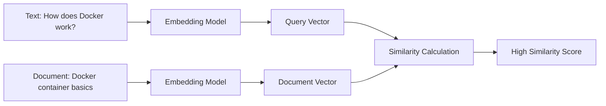
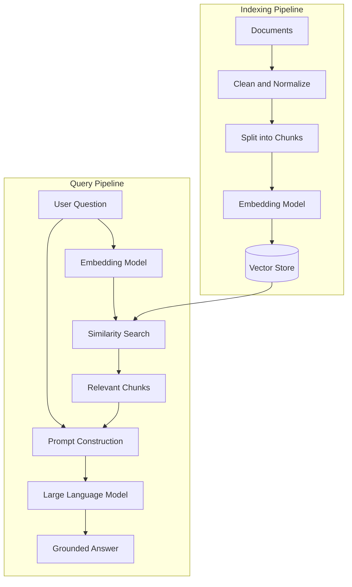
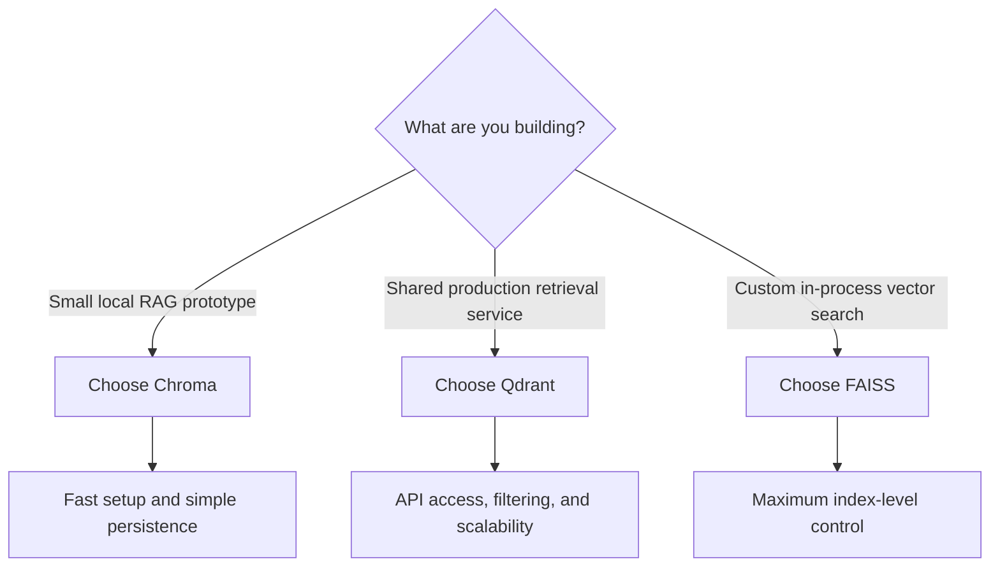
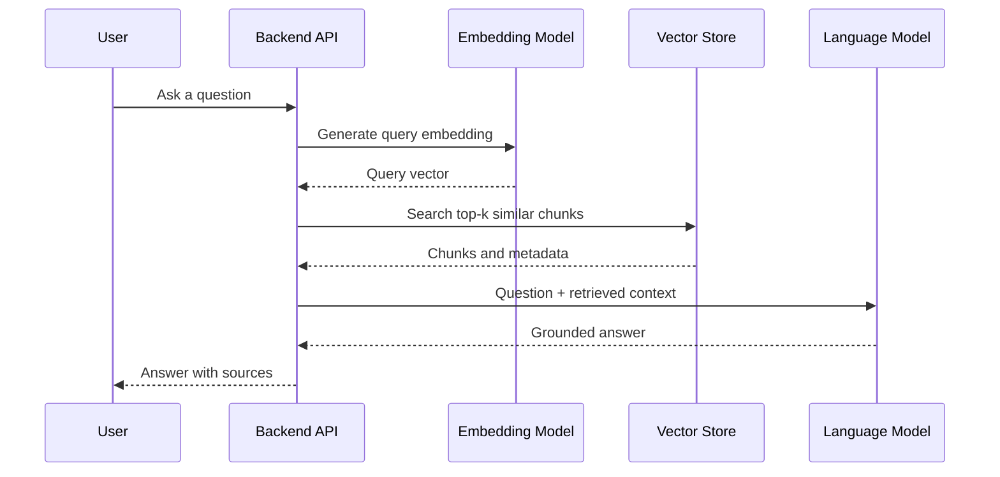
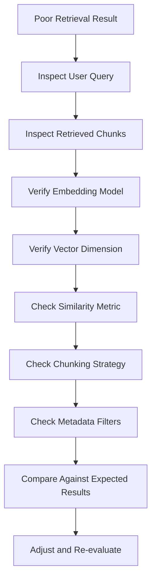
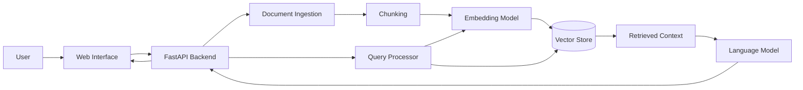

# 007 — Week 8: Vector Databases — Chroma, Qdrant, and FAISS

**Course:** 05 — Production and Portfolio
**Module:** Module 14 — 12-Week Learning Plan
**Content Group:** Weekly Plan
**Roadmap Source:** 12-Week Learning Plan / Weekly Plan
**Lesson Type:** Learning Plan
**Order in Module:** 007
**Suggested Duration:** 12 minutes

---

## 1. Overview

Week 8 introduces **vector databases and similarity search**, which are core components of modern Retrieval-Augmented Generation systems.

By the end of this week, you should understand:

* How text, images, and other data are converted into vectors.
* How vector similarity search works.
* Where vector storage appears in a RAG pipeline.
* How Chroma, Qdrant, and FAISS differ.
* How to build a small semantic search or document question-answering demo.
* How to choose an appropriate vector search solution for a project.

The goal is not only to memorize definitions. You should finish the week with a working retrieval demo that can be included in your AI Engineer portfolio.

---

## 2. Learning Objectives

After completing this lesson, you should be able to:

1. Explain vector databases in your own words.
2. Describe how embeddings represent semantic meaning.
3. Explain the role of similarity search in a RAG application.
4. Distinguish between Chroma, Qdrant, and FAISS.
5. Store document chunks together with metadata.
6. Retrieve the most relevant chunks for a user query.
7. Connect retrieval results to an LLM prompt.
8. Identify common retrieval errors and debugging methods.
9. Build a small semantic search or RAG application.

---

## 3. Why Vector Search Matters

Traditional databases are designed to find exact or structured matches.

For example:

```sql
SELECT * FROM documents
WHERE category = 'machine-learning';
```

This works well when the application already knows the exact category, identifier, date, or keyword.

However, users often search by **meaning**, not exact wording.

Consider the following document:

> Docker packages an application and its dependencies into a portable container.

A user may ask:

> How can I make my application run consistently on different machines?

The query and document do not share many exact keywords, but they express related ideas. A vector search system can recognize this semantic relationship.

### Keyword Search vs. Vector Search

| Search Type    | Main Behavior                  | Example                                       |
| -------------- | ------------------------------ | --------------------------------------------- |
| Keyword search | Matches exact or similar words | Search for “Docker container”                 |
| Vector search  | Matches semantic meaning       | Search for “portable application environment” |
| Hybrid search  | Combines keywords and vectors  | Search using meaning and exact terms          |

---

## 4. Core Concepts

## 4.1 Embeddings

An embedding model converts content into a list of numbers called a **vector**.

```text
"Vector databases store embeddings"
                ↓
[0.12, -0.44, 0.81, 0.05, ...]
```

The vector captures patterns associated with the content's meaning.

Content that has similar meaning should produce vectors that are close together in the embedding space.



Embeddings can represent:

* Text
* Images
* Audio
* Source code
* Product descriptions
* Support tickets
* User profiles

The query and stored documents must normally use embeddings from the same model or from compatible embedding spaces.

---

## 4.2 Vector Similarity

A vector search system compares the query vector with stored vectors.

Common similarity metrics include:

### Cosine Similarity

Cosine similarity compares the direction of two vectors.

```text
cosine_similarity(A, B) =
    dot(A, B) / (length(A) × length(B))
```

It is commonly used for text embeddings.

### Euclidean Distance

Euclidean distance measures the direct distance between two points.

```text
distance(A, B) =
    √Σ(Aᵢ - Bᵢ)²
```

A smaller distance means the vectors are closer.

### Dot Product

The dot product measures alignment between two vectors.

```text
dot_product(A, B) = Σ(Aᵢ × Bᵢ)
```

The correct metric depends on how the embedding model was trained and normalized.

---

## 4.3 Document Chunking

Large documents are usually divided into smaller sections before embedding.

```text
Large document
    ↓
Split into chunks
    ↓
Generate one embedding per chunk
    ↓
Store chunks and embeddings
```

Example:

```text
Document: Introduction to Docker

Chunk 1:
Docker is a platform for packaging applications...

Chunk 2:
A Docker image contains the application and dependencies...

Chunk 3:
A Docker container is a running instance of an image...
```

Chunking improves retrieval because the system can return a focused section instead of an entire document.

A stored vector record may contain:

```json
{
  "id": "docker-guide-chunk-03",
  "text": "A Docker container is a running instance of an image.",
  "metadata": {
    "document": "docker-guide.md",
    "section": "Containers",
    "chunk_index": 3
  },
  "embedding": [0.12, -0.44, 0.81]
}
```

---

## 4.4 Metadata

Metadata provides structured information about each vector.

Useful metadata fields include:

* Document name
* Page number
* Section
* Category
* Language
* Author
* Creation date
* User ID
* Access level

Metadata filters allow the application to narrow the search space.

Example:

```text
Find semantically relevant documents where:

language = "en"
category = "backend"
access_level = "public"
```

Metadata filtering is especially important in multi-user and enterprise applications.

---

## 5. Vector Search in a RAG Pipeline

A vector database is usually located between document processing and the LLM.



The process contains two main stages.

### Indexing Stage

1. Load documents.
2. Clean and normalize the text.
3. Divide documents into chunks.
4. Generate embeddings.
5. Store vectors, text, and metadata.

### Query Stage

1. Receive a user question.
2. Generate an embedding for the question.
3. Search for similar document vectors.
4. Select the most relevant chunks.
5. Add those chunks to the LLM prompt.
6. Generate an answer grounded in retrieved information.

---

## 6. Chroma, Qdrant, and FAISS

These tools solve related problems, but they are not identical.

## 6.1 Chroma

Chroma is a developer-friendly vector store commonly used for:

* Local experiments
* Notebooks
* Small RAG prototypes
* Learning projects
* Fast application development

A Chroma collection can store:

* Document text
* Embeddings
* IDs
* Metadata

### Simplified Example

```python
import chromadb

client = chromadb.PersistentClient(path="./chroma_data")

collection = client.get_or_create_collection(
    name="ai_engineering_notes"
)

collection.add(
    ids=["doc-1", "doc-2"],
    documents=[
        "Docker packages applications into portable containers.",
        "A vector database stores embeddings for similarity search."
    ],
    metadatas=[
        {"topic": "docker"},
        {"topic": "vector-database"}
    ]
)

results = collection.query(
    query_texts=["How does semantic retrieval work?"],
    n_results=2
)

print(results)
```

Depending on the project configuration, you may provide your own embeddings instead of asking the library to generate them.

### When Chroma Is a Good Choice

Use Chroma when:

* You are learning RAG.
* You want a simple local setup.
* You are building a prototype.
* You need persistence without managing a complex infrastructure stack.
* You want to move quickly from documents to retrieval.

---

## 6.2 Qdrant

Qdrant is a vector search engine designed for applications that need stronger service-oriented and production capabilities.

It is commonly used when an application requires:

* A dedicated vector search service
* Metadata filtering
* Persistent collections
* API-based access
* Larger datasets
* Multiple application clients
* Production deployment

### Conceptual Qdrant Record

```json
{
  "id": 101,
  "vector": [0.12, -0.44, 0.81],
  "payload": {
    "text": "A vector database supports semantic similarity search.",
    "category": "rag",
    "language": "en"
  }
}
```

In Qdrant, metadata is often stored as a **payload**.

### Simplified Python Structure

```python
from qdrant_client import QdrantClient
from qdrant_client.models import Distance, VectorParams

client = QdrantClient(path="./qdrant_data")

client.create_collection(
    collection_name="knowledge_base",
    vectors_config=VectorParams(
        size=384,
        distance=Distance.COSINE
    )
)
```

The vector size must match the output dimension of the selected embedding model.

### When Qdrant Is a Good Choice

Use Qdrant when:

* Retrieval is a major application feature.
* You need a separate vector service.
* Multiple backend instances must share the same index.
* You need filtering based on metadata.
* You expect the dataset or traffic to grow.
* You want a more production-oriented architecture.

---

## 6.3 FAISS

FAISS stands for **Facebook AI Similarity Search**.

It is primarily a similarity search library, not a complete database system.

FAISS is responsible for:

* Creating vector indexes
* Searching nearest neighbors
* Supporting efficient similarity search
* Handling large numerical vector collections

However, it does not automatically provide all database features.

You may need to build additional systems for:

* Metadata storage
* Document persistence
* Authentication
* Access control
* Network APIs
* Backups
* Multi-user management

### Simplified FAISS Example

```python
import faiss
import numpy as np

document_vectors = np.array(
    [
        [0.10, 0.20, 0.30],
        [0.90, 0.80, 0.70],
        [0.15, 0.25, 0.35]
    ],
    dtype="float32"
)

index = faiss.IndexFlatL2(3)
index.add(document_vectors)

query_vector = np.array(
    [[0.12, 0.22, 0.32]],
    dtype="float32"
)

distances, indices = index.search(query_vector, k=2)

print("Distances:", distances)
print("Indices:", indices)
```

This example searches for the two vectors closest to the query vector.

### When FAISS Is a Good Choice

Use FAISS when:

* You need direct control over the vector index.
* You are working in a research or notebook environment.
* You do not need a complete database server.
* You want to build a custom retrieval architecture.
* You want to learn how nearest-neighbor indexing works.
* The entire search process runs inside one application process.

---

## 7. Comparison

| Area                      | Chroma                             | Qdrant                         | FAISS                           |
| ------------------------- | ---------------------------------- | ------------------------------ | ------------------------------- |
| Main category             | Vector store                       | Vector database/search service | Similarity search library       |
| Beginner friendliness     | High                               | Medium                         | Medium                          |
| Local prototyping         | Excellent                          | Good                           | Excellent                       |
| Production service        | Possible for appropriate workloads | Strong fit                     | Requires custom infrastructure  |
| Metadata support          | Built in                           | Built in through payloads      | Must be managed separately      |
| Persistence               | Supported                          | Supported                      | Index must be saved and managed |
| Filtering                 | Supported                          | Strong filtering capabilities  | Custom implementation           |
| Network service           | Can be configured for service use  | Core use case                  | Not built in                    |
| Infrastructure complexity | Low                                | Medium                         | Depends on custom architecture  |
| Best learning use         | First RAG application              | Production-style retrieval     | Understanding vector indexes    |

### Practical Selection Guide



There is no universal winner. The correct choice depends on the application's requirements.

---

## 8. Week 8 Practical Project

Build a small **AI Engineering Notes Search Assistant**.

### Input Data

Create several Markdown or text documents about:

* Python
* REST APIs
* Docker
* Prompt engineering
* Structured output
* RAG
* Embeddings
* Vector databases

### Required Features

The application should:

1. Load the documents.
2. Split them into chunks.
3. Generate embeddings.
4. Store the vectors.
5. Accept a natural-language query.
6. Retrieve the top matching chunks.
7. Display similarity results.
8. Optionally send the retrieved chunks to an LLM.
9. Show the source document for every result.

### Example Interaction

```text
User query:
How can I package an AI API so it runs consistently?

Retrieved result:
Docker packages an application and its dependencies into a portable
container that can run consistently across environments.

Source:
week-01-docker.md

Similarity:
0.87
```

---

## 9. Minimal Retrieval Architecture



---

## 10. Example Retrieval Function

The exact API depends on the selected tool, but the application structure should remain similar.

```python
from dataclasses import dataclass
from typing import Any


@dataclass
class SearchResult:
    text: str
    score: float
    metadata: dict[str, Any]


def retrieve_context(
    query: str,
    vector_store: Any,
    top_k: int = 4
) -> list[SearchResult]:
    """
    Retrieve the most relevant document chunks for a query.
    """

    if not query.strip():
        raise ValueError("Query must not be empty.")

    raw_results = vector_store.search(
        query=query,
        limit=top_k
    )

    results: list[SearchResult] = []

    for item in raw_results:
        results.append(
            SearchResult(
                text=item["text"],
                score=float(item["score"]),
                metadata=item.get("metadata", {})
            )
        )

    return results
```

The vector store implementation may change, but the application should keep retrieval logic behind a clear interface.

This makes it easier to replace Chroma with Qdrant or FAISS later.

---

## 11. Prompt Construction

Retrieved chunks must be inserted into the LLM prompt carefully.

```python
def build_rag_prompt(
    question: str,
    contexts: list[SearchResult]
) -> str:
    context_text = "\n\n".join(
        f"[Source {index + 1}]\n"
        f"Document: {item.metadata.get('document', 'unknown')}\n"
        f"Content: {item.text}"
        for index, item in enumerate(contexts)
    )

    return f"""
You are an AI engineering assistant.

Answer the question using only the supplied context.
If the context does not contain enough information, say that the
information is insufficient.

Context:
{context_text}

Question:
{question}

Answer:
""".strip()
```

A good RAG prompt should:

* Separate instructions from retrieved content.
* Preserve source information.
* Tell the model not to invent unsupported facts.
* Define what to do when the context is insufficient.
* Avoid including too many irrelevant chunks.

---

## 12. Retrieval Parameters to Experiment With

## 12.1 Top-K

`top_k` defines how many chunks are retrieved.

```text
top_k = 1  → highly focused but may miss information
top_k = 5  → broader context but may include noise
top_k = 20 → more expensive and potentially confusing
```

More retrieved chunks do not automatically produce better answers.

---

## 12.2 Chunk Size

Small chunks provide focused retrieval but may lose context.

Large chunks preserve context but may contain irrelevant information.

Example experiment:

| Configuration |   Chunk Size |    Overlap |
| ------------- | -----------: | ---------: |
| A             |   200 tokens |  20 tokens |
| B             |   500 tokens |  50 tokens |
| C             | 1,000 tokens | 100 tokens |

Evaluate which configuration retrieves the clearest answer-bearing passages.

---

## 12.3 Chunk Overlap

Overlap repeats part of one chunk in the next chunk.

```text
Chunk 1: tokens 1–500
Chunk 2: tokens 451–950
Chunk 3: tokens 901–1400
```

Overlap helps preserve information located near chunk boundaries.

Too much overlap creates duplicate results and increases storage.

---

## 12.4 Similarity Threshold

A threshold can prevent weak results from entering the LLM prompt.

```python
relevant_results = [
    result
    for result in results
    if result.score >= minimum_score
]
```

Be careful: score interpretation differs between similarity metrics and libraries.

For some systems:

* Higher is better.

For others:

* Lower distance is better.

Always verify the meaning of the returned score.

---

## 13. Common Mistakes

## 13.1 Treating FAISS as a Complete Database

FAISS performs vector indexing and search, but it does not automatically manage all database responsibilities.

### Better Approach

Store a mapping between the FAISS vector position and the original document metadata.

```python
metadata_by_index = {
    0: {
        "document": "docker.md",
        "chunk": 1
    },
    1: {
        "document": "rag.md",
        "chunk": 4
    }
}
```

---

## 13.2 Using Different Embedding Models

A common error is indexing documents with one embedding model and embedding queries with another.

```text
Documents → Embedding Model A
Queries   → Embedding Model B
```

The resulting vectors may not be comparable.

### Better Approach

Store embedding configuration with the index:

```json
{
  "embedding_model": "selected-model-name",
  "vector_dimension": 384,
  "distance_metric": "cosine",
  "chunk_size": 500,
  "chunk_overlap": 50
}
```

---

## 13.3 Incorrect Vector Dimensions

If an embedding model produces 384-dimensional vectors, the index must expect 384 dimensions.

```text
Expected dimension: 384
Received dimension: 768
Result: insertion or search error
```

### Debugging Check

```python
embedding = embedding_model.encode("test")
print(len(embedding))
```

---

## 13.4 Poor Chunking

Chunks may be:

* Too short
* Too long
* Split in the middle of sentences
* Missing headings
* Missing source metadata

### Better Approach

Prefer structure-aware splitting where possible:

```text
Document
  → Heading
  → Paragraph
  → Sentence
  → Token-based fallback
```

---

## 13.5 Retrieving Relevant but Unhelpful Content

A chunk can be related to the query without containing the answer.

Example:

```text
Query:
How do I configure Docker networking?

Retrieved chunk:
Docker is a popular container platform.
```

The chunk is topically relevant but does not answer the question.

### Better Approach

Evaluate both:

* Semantic relevance
* Answer relevance

Consider reranking the retrieved results before sending them to the LLM.

---

## 13.6 Ignoring Metadata Filters

Without filtering, a search may retrieve:

* Another user's private data
* Documents in the wrong language
* Archived documents
* Content from the wrong project

### Better Approach

Apply filters before or during vector search.

```text
user_id = current_user
language = "en"
status = "active"
```

---

## 13.7 Re-Embedding Everything Unnecessarily

Rebuilding the complete index after every small change wastes time and embedding cost.

### Better Approach

Track document versions or content hashes.

```text
Document changed?
    ├── No  → Keep existing embedding
    └── Yes → Re-chunk and re-embed affected document
```

---

## 14. Production Issue and Debugging Example

### Problem

The chatbot returns unrelated document chunks.

### Possible Causes

1. The documents and queries use different embedding models.
2. Text preprocessing removes important information.
3. Chunk size is too large.
4. Too many results are retrieved.
5. The similarity metric is incorrect.
6. Metadata filters are missing.
7. The query is vague.
8. The index contains outdated data.

### Debugging Process



### Useful Debug Log

```json
{
  "query": "How does semantic search work?",
  "embedding_model": "selected-embedding-model",
  "top_k": 5,
  "filters": {
    "language": "en"
  },
  "results": [
    {
      "document": "vector-databases.md",
      "chunk_index": 4,
      "score": 0.89
    },
    {
      "document": "rag-overview.md",
      "chunk_index": 2,
      "score": 0.82
    }
  ]
}
```

Do not log sensitive document content or user data without a clear privacy policy.

---

## 15. Evaluation

A retrieval system should not be evaluated only by checking whether the application runs.

Create a small test dataset.

```json
[
  {
    "query": "What is an embedding?",
    "expected_document": "embeddings.md",
    "expected_section": "Definition"
  },
  {
    "query": "When should I use Qdrant?",
    "expected_document": "vector-databases.md",
    "expected_section": "Qdrant"
  },
  {
    "query": "Is FAISS a complete database?",
    "expected_document": "vector-databases.md",
    "expected_section": "FAISS"
  }
]
```

Useful retrieval metrics include:

### Hit Rate at K

Did the correct document appear in the top `k` results?

```text
HitRate@3 =
    successful queries with correct result in top 3
    ------------------------------------------------
                    total queries
```

### Mean Reciprocal Rank

How high did the first correct result appear?

```text
Correct result at rank 1 → score 1.00
Correct result at rank 2 → score 0.50
Correct result at rank 4 → score 0.25
```

### Manual Relevance Score

Rate each result:

```text
0 = irrelevant
1 = related but unhelpful
2 = partially useful
3 = directly answers the query
```

---

## 16. Practical Exercises

### Exercise 1 — Explain the Concept

Without looking at the lesson, write five lines explaining:

* What an embedding is.
* What a vector database stores.
* How semantic search works.
* Why RAG needs retrieval.
* How FAISS differs from Qdrant.

---

### Exercise 2 — Build a Chroma Prototype

Create a small Chroma collection containing at least ten notes.

Requirements:

* Add document IDs.
* Add metadata.
* Run three semantic queries.
* Print the top three results.
* Display each result's source.

---

### Exercise 3 — Build a FAISS Search Index

Create a FAISS index from a small set of sentence embeddings.

Requirements:

* Store at least twenty vectors.
* Search for the five nearest vectors.
* Maintain a separate metadata mapping.
* Save and reload the index.

---

### Exercise 4 — Add Metadata Filtering

Create documents in two categories:

```text
category = "backend"
category = "machine-learning"
```

Run a query that searches only the `machine-learning` category.

Compare filtered and unfiltered results.

---

### Exercise 5 — Compare Vector Stores

Implement the same dataset using two tools:

* Chroma and FAISS, or
* Chroma and Qdrant.

Compare:

* Setup complexity
* Search interface
* Metadata handling
* Persistence
* Debugging experience
* Suitability for production

---

### Exercise 6 — Record a Production Failure

Write down one likely production issue.

Example:

```text
Issue:
The vector index is outdated after a document update.

Impact:
Users receive answers based on old information.

Detection:
The document version differs from the indexed version.

Solution:
Store content hashes and re-index changed documents.
```

---

## 17. Weekly Deliverable

At the end of Week 8, submit a small repository containing:

```text
week-08-vector-search/
├── README.md
├── requirements.txt
├── data/
│   ├── docker.md
│   ├── embeddings.md
│   └── rag.md
├── src/
│   ├── ingest.py
│   ├── embeddings.py
│   ├── vector_store.py
│   ├── retrieve.py
│   └── app.py
├── tests/
│   └── test_retrieval.py
└── notes/
    ├── limitations.md
    └── debugging.md
```

The README should include:

* Project goal
* Architecture diagram
* Installation instructions
* Selected embedding model
* Selected vector store
* Chunking configuration
* Example queries
* Retrieval results
* Known limitations
* Possible production improvements

---

## 18. Portfolio Demo Idea

### Project: Personal Knowledge Base Assistant

Build an application that allows users to:

1. Add Markdown or text notes.
2. Index the notes into a vector store.
3. Ask natural-language questions.
4. Retrieve relevant note sections.
5. Generate answers with source references.
6. Inspect retrieved chunks and scores.
7. Re-index updated documents.

### Suggested Stack

```text
Frontend:
Streamlit, React, or a simple HTML interface

Backend:
Python and FastAPI

Embedding Model:
A local sentence embedding model or embedding API

Vector Search:
Chroma for the first prototype
Qdrant for a production-style extension

LLM:
Any model that supports text generation

Evaluation:
A small retrieval test dataset
```

### Architecture



---

## 19. Completion Checklist

* [ ] I can explain vector databases in one or two minutes.
* [ ] I understand how embeddings represent semantic information.
* [ ] I can explain cosine similarity, Euclidean distance, and dot product.
* [ ] I understand why documents are split into chunks.
* [ ] I can store text, vectors, IDs, and metadata.
* [ ] I can retrieve the top-k most relevant chunks.
* [ ] I understand where vector search appears in a RAG pipeline.
* [ ] I can explain the difference between Chroma, Qdrant, and FAISS.
* [ ] I have built at least one working semantic search demo.
* [ ] I have tested several chunk sizes or retrieval settings.
* [ ] I have recorded at least one limitation.
* [ ] I have documented one production failure and its debugging process.
* [ ] My demo displays document sources.
* [ ] My repository includes setup instructions and example queries.

---

## 20. Expected Outcome

After Week 8, you should be able to create the retrieval layer of a basic AI application.

You should understand that a vector database does not replace the LLM. Instead, it gives the LLM access to relevant external information.

```text
Embedding model:
Converts content into vectors

Vector search:
Finds semantically relevant content

LLM:
Uses the retrieved content to generate an answer

Application:
Coordinates the complete workflow
```

This week prepares you for more advanced topics such as:

* Complete RAG pipelines
* Hybrid search
* Reranking
* Query rewriting
* Multi-user knowledge bases
* Retrieval evaluation
* Agent memory
* Multimodal retrieval
* Production AI deployment

---

## 21. Summary

**Week 8: Vector Databases — Chroma, Qdrant, and FAISS** is a major checkpoint in the 12-week AI Engineer roadmap.

The most important lessons are:

1. Embeddings convert content into numerical vectors.
2. Vector search retrieves information based on semantic similarity.
3. Document chunking and metadata strongly affect retrieval quality.
4. Chroma is an accessible choice for prototypes and learning projects.
5. Qdrant is suitable for dedicated, production-oriented vector search services.
6. FAISS is a powerful similarity search library but is not a complete database.
7. Retrieval must be evaluated using realistic queries and expected results.
8. A working demo is more valuable than memorizing tool definitions.

Turn this lesson into a practical artifact: a semantic search API, a small RAG assistant, a retrieval evaluation notebook, or a documented portfolio project.
