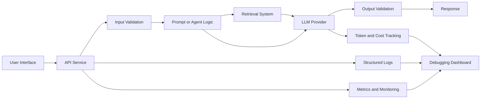
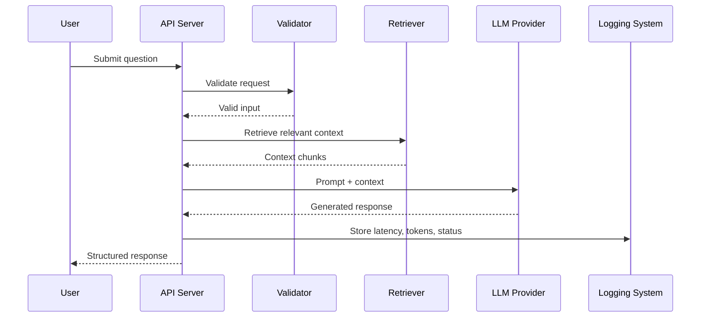
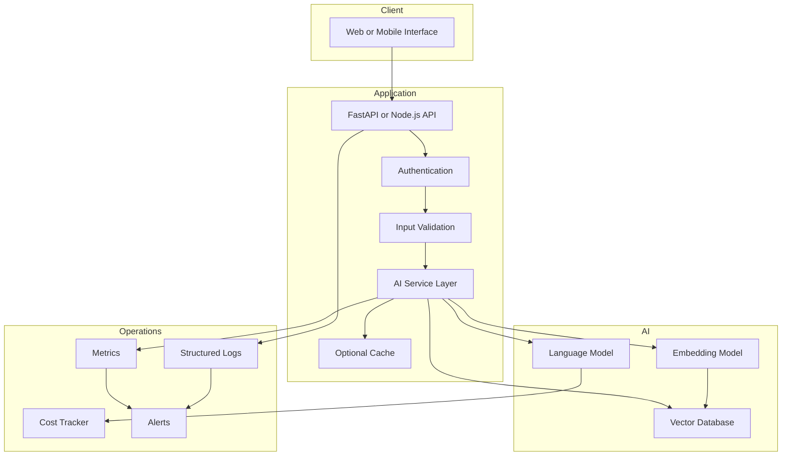
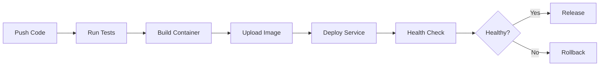
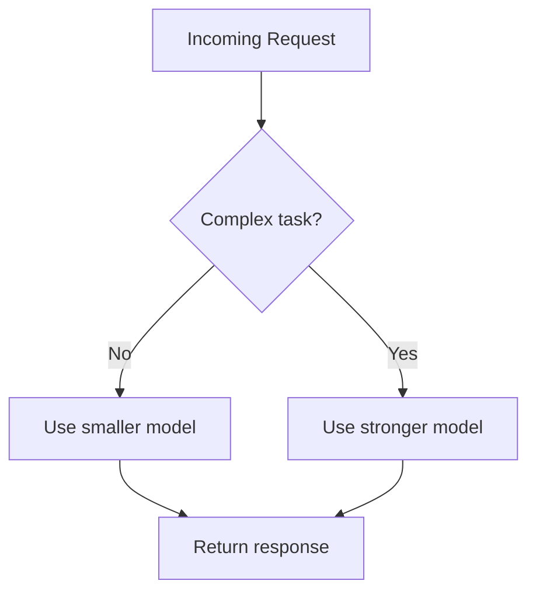
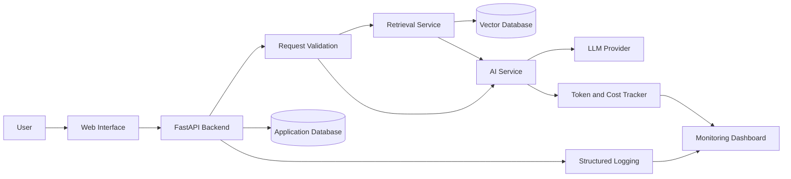
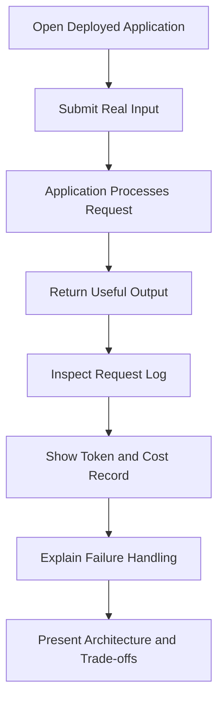

# 011 — Week 12: Deploy a Production App, Logging, Cost Tracking, and Portfolio

**Course:** 05 — Production and Portfolio
**Module:** Module 14 — 12-Week Learning Plan
**Content Group:** Weekly Plan
**Roadmap Source:** 12-Week Learning Plan / Weekly Plan
**Lesson Type:** Learning Plan
**Module Order:** 011
**Suggested Duration:** 12 minutes

---

## 1. Overview

Week 12 is the final checkpoint of the 12-week AI Engineer learning roadmap.

The goal is no longer to build another isolated notebook or local prototype. The goal is to turn an existing AI application into a small but credible production system that:

* runs in a deployed environment;
* exposes a usable API or interface;
* records useful logs;
* tracks model usage and cost;
* handles common failures;
* includes clear documentation;
* can be presented as a portfolio project.

A successful Week 12 project should demonstrate the complete engineering lifecycle:

```text
Idea
  ↓
Prototype
  ↓
Tested application
  ↓
Containerized service
  ↓
Cloud deployment
  ↓
Logging and monitoring
  ↓
Cost analysis
  ↓
Portfolio case study
```

The final result does not need to serve millions of users. It needs to prove that you understand how an AI feature moves from experimentation to production.

---

## 2. Learning Objectives

By the end of this lesson, you should be able to:

* explain the purpose of production deployment in an AI application;
* distinguish a local prototype from a production-ready service;
* package an AI application with Docker;
* deploy an API, RAG system, agent, or multimodal application;
* add structured logging to important application operations;
* track token usage, model calls, latency, and estimated cost;
* identify and debug common production failures;
* document the architecture, limitations, and design decisions;
* turn a technical project into a strong AI Engineer portfolio case study.

---

## 3. Why Week 12 Matters

Many AI projects work only under ideal local conditions:

* the developer runs the app manually;
* API keys are stored in a local `.env` file;
* only one user sends requests;
* the network is stable;
* the model provider responds successfully;
* the input is short and valid;
* nobody measures cost;
* errors are printed to the terminal;
* the application has no monitoring.

A production environment is different.

The application may receive:

* malformed inputs;
* concurrent requests;
* large documents;
* model provider failures;
* rate-limit errors;
* slow vector database queries;
* unexpected model output;
* missing environment variables;
* users attempting prompt injection;
* requests that consume excessive tokens.

Week 12 connects the earlier topics in the roadmap into one complete workflow.



---

## 4. The Week 12 Deliverable

Your final deliverable should be one deployed AI application.

Possible projects include:

* a document question-answering RAG application;
* an AI customer-support assistant;
* a code review assistant;
* a study-note generator;
* a meeting summarization API;
* a resume analysis tool;
* an image understanding application;
* a tool-using research agent;
* a structured data extraction service;
* a multilingual chatbot.

The project should include at least five artifacts:

1. A working application or API.
2. A public or recorded demonstration.
3. A source-code repository.
4. A clear README.
5. Evidence of logging and cost tracking.

A stronger submission may also include:

* automated tests;
* an evaluation dataset;
* an architecture diagram;
* screenshots or a short demo video;
* CI/CD configuration;
* a monitoring dashboard;
* a postmortem describing one production failure.

---

## 5. From Prototype to Production

A prototype answers:

> Can this idea work?

A production application answers:

> Can this system run reliably, safely, repeatedly, and at an acceptable cost?

### 5.1 Prototype Characteristics

A typical prototype may contain:

```python
response = client.responses.create(
    model="your-model",
    input=user_question,
)

print(response.output_text)
```

This proves that the model can generate an answer, but it does not address:

* input validation;
* timeout handling;
* retry policies;
* authentication;
* rate limiting;
* structured logging;
* token usage;
* cost;
* response schemas;
* data privacy;
* model failure;
* deployment.

### 5.2 Production Characteristics

A production request usually passes through multiple layers:



Each layer has a specific responsibility.

| Layer               | Responsibility                         |
| ------------------- | -------------------------------------- |
| Interface           | Accept user input and show output      |
| API                 | Coordinate the request lifecycle       |
| Validation          | Reject unsafe or malformed input       |
| Retrieval           | Find relevant external knowledge       |
| Model               | Generate or transform information      |
| Output parser       | Enforce the expected response format   |
| Logging             | Record what happened                   |
| Metrics             | Measure system performance             |
| Cost tracker        | Estimate model and infrastructure cost |
| Deployment platform | Keep the service available             |

---

## 6. Define the Production Scope

Do not attempt to productionize every possible feature.

Choose one clear user flow.

For example:

```text
User uploads a PDF
        ↓
Application extracts and chunks the text
        ↓
Chunks are converted into embeddings
        ↓
Embeddings are stored in a vector database
        ↓
User asks a question
        ↓
Relevant chunks are retrieved
        ↓
The LLM answers with source references
```

A good production scope is:

* small enough to complete;
* valuable enough to demonstrate;
* measurable;
* testable;
* explainable during an interview.

### Example Scope Statement

> This project is a RAG-based study assistant that accepts PDF documents, indexes their contents, retrieves relevant passages, and generates answers with citations. It includes request logging, latency measurement, token tracking, estimated model cost, input validation, and fallback error responses.

---

## 7. Recommended Production Architecture

A small AI application may use the following architecture:



For a small portfolio project, some components may run in the same service. The diagram still helps explain the logical boundaries.

---

## 8. Prepare the Application for Deployment

Before deployment, confirm that the application does not depend on your local machine.

### 8.1 Use Environment Variables

Secrets and environment-specific configuration should not be hard-coded.

```bash
MODEL_API_KEY=replace_with_secret
MODEL_NAME=your-model-name
DATABASE_URL=postgresql://...
VECTOR_DATABASE_URL=http://...
LOG_LEVEL=INFO
ENVIRONMENT=production
```

Python example:

```python
import os

MODEL_API_KEY = os.environ["MODEL_API_KEY"]
MODEL_NAME = os.getenv("MODEL_NAME", "default-model")
ENVIRONMENT = os.getenv("ENVIRONMENT", "development")
```

Do not commit real API keys to Git.

A safe repository may include:

```text
.env
.env.local
*.pem
credentials.json
```

inside `.gitignore`.

Provide an example configuration file:

```bash
# .env.example
MODEL_API_KEY=
MODEL_NAME=
DATABASE_URL=
LOG_LEVEL=INFO
ENVIRONMENT=development
```

---

### 8.2 Add a Health-Check Endpoint

A deployment platform needs a simple way to verify that the application is running.

```python
from fastapi import FastAPI

app = FastAPI()


@app.get("/health")
async def health_check() -> dict[str, str]:
    return {
        "status": "healthy",
        "service": "ai-portfolio-api",
    }
```

A more detailed readiness endpoint can check dependencies:

```python
@app.get("/ready")
async def readiness_check() -> dict:
    database_ready = await check_database()
    vector_database_ready = await check_vector_database()

    ready = database_ready and vector_database_ready

    return {
        "ready": ready,
        "dependencies": {
            "database": database_ready,
            "vector_database": vector_database_ready,
        },
    }
```

The distinction is useful:

* **Liveness:** Is the process running?
* **Readiness:** Can the service handle requests?

---

### 8.3 Validate Input

Use a schema instead of accepting arbitrary dictionaries.

```python
from pydantic import BaseModel, Field


class QuestionRequest(BaseModel):
    question: str = Field(min_length=3, max_length=2_000)
    document_id: str
    top_k: int = Field(default=5, ge=1, le=20)
```

This prevents many errors before the request reaches the model.

Example route:

```python
@app.post("/api/v1/questions")
async def answer_question(request: QuestionRequest):
    return await question_service.answer(
        question=request.question,
        document_id=request.document_id,
        top_k=request.top_k,
    )
```

---

### 8.4 Standardize API Responses

A consistent response envelope simplifies client-side development and debugging.

Successful response:

```json
{
  "success": true,
  "data": {
    "answer": "The document explains...",
    "sources": [
      {
        "document_id": "doc_001",
        "chunk_id": "chunk_17"
      }
    ]
  },
  "error": null,
  "metadata": {
    "request_id": "req_abc123",
    "latency_ms": 1420
  }
}
```

Error response:

```json
{
  "success": false,
  "data": null,
  "error": {
    "code": "MODEL_TIMEOUT",
    "message": "The model provider did not respond in time."
  },
  "metadata": {
    "request_id": "req_abc123"
  }
}
```

---

## 9. Containerize the Application

Docker packages the application and its dependencies into a repeatable environment.

### 9.1 Example Project Structure

```text
ai-portfolio-app/
├── app/
│   ├── api/
│   ├── services/
│   ├── repositories/
│   ├── schemas/
│   ├── core/
│   └── main.py
├── tests/
├── requirements.txt
├── Dockerfile
├── .dockerignore
├── .env.example
└── README.md
```

### 9.2 Example Dockerfile

```dockerfile
FROM python:3.12-slim

ENV PYTHONDONTWRITEBYTECODE=1
ENV PYTHONUNBUFFERED=1

WORKDIR /app

COPY requirements.txt .
RUN pip install --no-cache-dir -r requirements.txt

COPY app ./app

EXPOSE 8000

CMD [
  "uvicorn",
  "app.main:app",
  "--host",
  "0.0.0.0",
  "--port",
  "8000"
]
```

### 9.3 Example `.dockerignore`

```text
.git
.github
.env
.venv
__pycache__
.pytest_cache
*.pyc
tests
docs
```

### 9.4 Build and Run

```bash
docker build -t ai-portfolio-app .
```

```bash
docker run \
  --env-file .env \
  -p 8000:8000 \
  ai-portfolio-app
```

Test the health endpoint:

```bash
curl http://localhost:8000/health
```

Expected result:

```json
{
  "status": "healthy",
  "service": "ai-portfolio-api"
}
```

---

## 10. Deploy the Application

A typical deployment process is:



### 10.1 Deployment Configuration

A deployment platform normally requires:

* source repository or container image;
* build command;
* start command;
* environment variables;
* exposed port;
* health-check path;
* CPU and memory settings;
* region;
* scaling configuration.

Example start command:

```bash
uvicorn app.main:app --host 0.0.0.0 --port $PORT
```

### 10.2 Production Deployment Checklist

Before releasing:

* tests pass;
* environment variables are configured;
* API keys are not stored in the repository;
* the application binds to `0.0.0.0`;
* the correct runtime port is used;
* the health endpoint returns successfully;
* database migrations have run;
* CORS rules are configured;
* request size is limited;
* timeouts are enabled;
* logging is active;
* a rollback method exists.

---

## 11. Add Structured Logging

Logging records what happened inside the application.

A useful log should help answer:

* Which request failed?
* When did it fail?
* Which component failed?
* Which model was used?
* How long did the request take?
* How many tokens were consumed?
* Was retrieval successful?
* Which error code was returned?

### 11.1 Avoid Unstructured Logs

Weak log:

```text
Something went wrong
```

Better log:

```json
{
  "timestamp": "2026-07-29T10:30:10Z",
  "level": "ERROR",
  "event": "model_request_failed",
  "request_id": "req_abc123",
  "provider": "model-provider",
  "model": "production-model",
  "error_type": "timeout",
  "duration_ms": 30000
}
```

Structured logs are easier to:

* search;
* filter;
* aggregate;
* visualize;
* connect to alerts.

---

### 11.2 Create a Request ID

A request ID connects logs generated by different components.

```python
import uuid

from fastapi import Request


@app.middleware("http")
async def add_request_id(request: Request, call_next):
    request_id = request.headers.get(
        "X-Request-ID",
        str(uuid.uuid4()),
    )

    request.state.request_id = request_id

    response = await call_next(request)
    response.headers["X-Request-ID"] = request_id

    return response
```

All logs created during the request should include the same ID.

---

### 11.3 Log the Request Lifecycle

```python
import logging
import time

logger = logging.getLogger(__name__)


@app.middleware("http")
async def log_request(request: Request, call_next):
    started_at = time.perf_counter()
    request_id = getattr(request.state, "request_id", "unknown")

    logger.info(
        "request_started",
        extra={
            "request_id": request_id,
            "method": request.method,
            "path": request.url.path,
        },
    )

    try:
        response = await call_next(request)

        duration_ms = round(
            (time.perf_counter() - started_at) * 1000,
            2,
        )

        logger.info(
            "request_completed",
            extra={
                "request_id": request_id,
                "status_code": response.status_code,
                "duration_ms": duration_ms,
            },
        )

        return response

    except Exception:
        duration_ms = round(
            (time.perf_counter() - started_at) * 1000,
            2,
        )

        logger.exception(
            "request_failed",
            extra={
                "request_id": request_id,
                "duration_ms": duration_ms,
            },
        )

        raise
```

---

### 11.4 What Should Be Logged?

Recommended fields:

| Category     | Example Fields                                  |
| ------------ | ----------------------------------------------- |
| Request      | Request ID, endpoint, method, timestamp         |
| User context | Anonymous user ID, organization ID              |
| Model        | Provider, model name, temperature               |
| Retrieval    | Query time, number of chunks, top score         |
| Usage        | Input tokens, output tokens, total tokens       |
| Performance  | Total latency, model latency, retrieval latency |
| Result       | Status code, success, error type                |
| Safety       | Blocked request, validation failure             |
| Cost         | Estimated request cost                          |

### 11.5 What Should Not Be Logged?

Avoid recording:

* passwords;
* API keys;
* authorization headers;
* full payment information;
* private personal data;
* confidential documents;
* raw prompts containing sensitive data;
* full model outputs when they contain private information.

Instead of logging full content, consider logging:

* input length;
* content hash;
* document ID;
* safety category;
* anonymized user ID.

---

## 12. Measure Important Metrics

Logs describe individual events. Metrics summarize system behavior over time.

Important AI application metrics include:

### Reliability Metrics

* request success rate;
* model failure rate;
* timeout rate;
* retry rate;
* HTTP 4xx rate;
* HTTP 5xx rate.

### Performance Metrics

* median latency;
* p95 latency;
* p99 latency;
* retrieval latency;
* model response latency;
* document indexing time.

### AI Quality Metrics

* retrieval relevance;
* groundedness;
* citation correctness;
* structured-output validity;
* hallucination rate;
* answer completeness;
* tool-call success rate.

### Usage Metrics

* requests per day;
* active users;
* tokens per request;
* documents indexed;
* average conversation length;
* cache hit rate.

### Cost Metrics

* cost per request;
* cost per user;
* cost per feature;
* daily model cost;
* embedding cost;
* infrastructure cost.

---

## 13. Track Tokens and Model Cost

AI services often charge based on model usage.

A basic model request may expose:

```json
{
  "input_tokens": 2200,
  "output_tokens": 450,
  "total_tokens": 2650
}
```

Store these values for each model call.

### 13.1 Cost Formula

When prices are expressed per one million tokens:

```text
Input cost =
(input tokens ÷ 1,000,000) × input price

Output cost =
(output tokens ÷ 1,000,000) × output price

Total model cost =
input cost + output cost
```

Example:

```text
Input tokens: 20,000
Output tokens: 5,000

Input price: $2.00 per 1,000,000 tokens
Output price: $8.00 per 1,000,000 tokens
```

Calculation:

```text
Input cost:
(20,000 ÷ 1,000,000) × $2.00
= $0.04

Output cost:
(5,000 ÷ 1,000,000) × $8.00
= $0.04

Total request cost:
$0.04 + $0.04 = $0.08
```

The prices above are only illustrative. Store current pricing in configuration instead of hard-coding it inside business logic.

---

### 13.2 Cost-Calculation Function

```python
from dataclasses import dataclass
from decimal import Decimal


@dataclass(frozen=True)
class ModelPricing:
    input_per_million: Decimal
    output_per_million: Decimal


def calculate_model_cost(
    input_tokens: int,
    output_tokens: int,
    pricing: ModelPricing,
) -> Decimal:
    one_million = Decimal("1000000")

    input_cost = (
        Decimal(input_tokens)
        / one_million
        * pricing.input_per_million
    )

    output_cost = (
        Decimal(output_tokens)
        / one_million
        * pricing.output_per_million
    )

    return input_cost + output_cost
```

Usage:

```python
pricing = ModelPricing(
    input_per_million=Decimal("2.00"),
    output_per_million=Decimal("8.00"),
)

cost = calculate_model_cost(
    input_tokens=20_000,
    output_tokens=5_000,
    pricing=pricing,
)

print(cost)
```

---

### 13.3 Model-Usage Record

```python
from pydantic import BaseModel


class ModelUsageRecord(BaseModel):
    request_id: str
    feature: str
    provider: str
    model: str
    input_tokens: int
    output_tokens: int
    total_tokens: int
    estimated_cost_usd: float
    latency_ms: float
    success: bool
```

Example stored record:

```json
{
  "request_id": "req_abc123",
  "feature": "document_question_answering",
  "provider": "model-provider",
  "model": "production-model",
  "input_tokens": 2200,
  "output_tokens": 450,
  "total_tokens": 2650,
  "estimated_cost_usd": 0.018,
  "latency_ms": 2380,
  "success": true
}
```

---

## 14. Track the Full Cost of an AI Feature

Model generation is not the only cost.

A RAG request may include:

```text
Total cost
  = Query embedding cost
  + Vector database cost
  + LLM input cost
  + LLM output cost
  + Storage cost
  + Compute cost
  + Monitoring cost
```

For a small application, calculate at least:

* generation cost;
* embedding cost;
* average cost per request;
* estimated monthly cost.

### Monthly Cost Estimate

```text
Estimated monthly cost =
average cost per request
× requests per day
× 30
```

Example:

```text
Average request cost: $0.015
Requests per day: 500

Estimated monthly model cost:
$0.015 × 500 × 30
= $225
```

This estimate helps answer important product questions:

* Can the feature be offered for free?
* Should some requests use a smaller model?
* Should the application limit document size?
* Should repeated answers be cached?
* Should users have monthly quotas?

---

## 15. Cost-Optimization Techniques

### 15.1 Reduce Prompt Size

Remove:

* duplicated instructions;
* irrelevant conversation history;
* unnecessary retrieved chunks;
* verbose formatting;
* repeated system context.

### 15.2 Limit Output Length

Set a reasonable output-token limit.

```python
MAX_OUTPUT_TOKENS = 800
```

Do not request 5,000 tokens when the feature only needs a short answer.

### 15.3 Use Retrieval Carefully

More retrieved chunks do not always produce a better answer.

```text
Too few chunks
→ missing context

Too many chunks
→ higher cost, noise, and slower responses
```

Measure the effect of `top_k` values such as:

```text
top_k = 3
top_k = 5
top_k = 8
```

### 15.4 Route Requests by Complexity



Examples of simple tasks:

* classification;
* sentiment analysis;
* intent detection;
* title generation;
* keyword extraction.

Examples of complex tasks:

* long-form reasoning;
* code analysis;
* multi-document synthesis;
* complex agent planning.

### 15.5 Cache Repeated Work

Potential cache targets:

* document embeddings;
* retrieval results;
* frequently requested summaries;
* static system instructions;
* repeated classification results.

A cache key should include all inputs that affect the result.

```text
cache_key =
feature
+ model
+ prompt_version
+ language
+ user_input_hash
+ document_version
```

### 15.6 Set Usage Limits

Possible limits:

* requests per minute;
* requests per user per day;
* maximum document size;
* maximum conversation length;
* maximum input tokens;
* maximum generated tokens;
* maximum tool calls per agent run.

---

## 16. Add Error Handling

External AI services can fail. The application should respond predictably.

Common failures include:

* timeout;
* rate limit;
* invalid API key;
* provider outage;
* invalid model output;
* vector database failure;
* document parsing failure;
* context length exceeded;
* safety filter rejection.

### 16.1 Domain Error Example

```python
class ModelTimeoutError(Exception):
    pass


class RetrievalError(Exception):
    pass


class InvalidModelOutputError(Exception):
    pass
```

### 16.2 User-Friendly Error Response

```python
from fastapi import HTTPException


async def call_model_safely():
    try:
        return await model_service.generate()
    except ModelTimeoutError as exc:
        raise HTTPException(
            status_code=504,
            detail={
                "code": "MODEL_TIMEOUT",
                "message": (
                    "The AI service took too long to respond. "
                    "Please try again."
                ),
            },
        ) from exc
```

Do not expose raw stack traces to users.

---

## 17. Use Timeouts and Retries

Without a timeout, a request may wait indefinitely.

```python
import asyncio


async def call_with_timeout():
    try:
        return await asyncio.wait_for(
            model_service.generate(),
            timeout=30,
        )
    except TimeoutError as exc:
        raise ModelTimeoutError from exc
```

Retries should be limited and used only for temporary failures.

```python
import asyncio


async def call_with_retry(max_attempts: int = 3):
    for attempt in range(1, max_attempts + 1):
        try:
            return await model_service.generate()
        except TemporaryProviderError:
            if attempt == max_attempts:
                raise

            delay_seconds = 2 ** (attempt - 1)
            await asyncio.sleep(delay_seconds)
```

Retry pattern:

```text
Attempt 1
   ↓ failure
Wait 1 second
   ↓
Attempt 2
   ↓ failure
Wait 2 seconds
   ↓
Attempt 3
   ↓
Return result or final error
```

Do not retry permanent errors such as:

* invalid authentication;
* malformed input;
* unsupported model;
* blocked content;
* missing required parameters.

---

## 18. Test the Production Path

Testing should cover more than the happy path.

### 18.1 Minimum Test Categories

| Test Type        | Example                              |
| ---------------- | ------------------------------------ |
| Unit test        | Verify cost calculation              |
| API test         | Verify `/health` returns `200`       |
| Validation test  | Reject an empty question             |
| Integration test | Retrieve chunks and call the model   |
| Failure test     | Simulate a model timeout             |
| Security test    | Test prompt-injection input          |
| Load test        | Send concurrent requests             |
| Regression test  | Confirm a previous bug remains fixed |

### 18.2 Example Cost Test

```python
from decimal import Decimal


def test_calculate_model_cost():
    pricing = ModelPricing(
        input_per_million=Decimal("2.00"),
        output_per_million=Decimal("8.00"),
    )

    result = calculate_model_cost(
        input_tokens=20_000,
        output_tokens=5_000,
        pricing=pricing,
    )

    assert result == Decimal("0.0800")
```

### 18.3 Example Health-Check Test

```python
from fastapi.testclient import TestClient

from app.main import app


client = TestClient(app)


def test_health_check():
    response = client.get("/health")

    assert response.status_code == 200
    assert response.json()["status"] == "healthy"
```

---

## 19. Add a Simple Production Dashboard

A small dashboard may display:

```text
Requests today:              1,240
Success rate:                98.7%
Average latency:             1.8 seconds
p95 latency:                 4.9 seconds
Input tokens:                2,450,000
Output tokens:                 630,000
Estimated model cost:          $12.84
Retrieval failure rate:         0.8%
Model timeout rate:             0.5%
```

Useful charts include:

* requests over time;
* cost over time;
* latency distribution;
* errors by category;
* token usage by feature;
* cost by model;
* cost by user or organization;
* retrieval scores;
* cache hit rate.

The dashboard does not need to be complex. A spreadsheet, notebook, or small HTML page can be enough for a portfolio project.

---

## 20. Create a Production Runbook

A runbook explains how to respond when the application fails.

Example:

```markdown
## Incident: Model Requests Are Timing Out

### Symptoms

- `/api/v1/questions` returns HTTP 504.
- Model latency exceeds 30 seconds.
- Timeout rate is above 5%.

### Checks

1. Check the model-provider status.
2. Review logs for `model_request_failed`.
3. Confirm API-key validity.
4. Check whether prompts exceed the context limit.
5. Check current request volume.
6. Test the fallback model.

### Mitigation

1. Enable the fallback provider.
2. Reduce maximum input size.
3. Temporarily lower concurrency.
4. Increase cache usage.
5. Inform users through the status page.

### Recovery Verification

- Send five test requests.
- Confirm the success rate is above 99%.
- Confirm p95 latency is below five seconds.
```

A runbook demonstrates operational thinking.

---

## 21. Turn the Project into a Portfolio Case Study

A repository alone is not a complete portfolio presentation.

Your project page should explain:

1. What problem did you solve?
2. Who is the target user?
3. Why was AI appropriate?
4. What architecture did you choose?
5. How does the AI workflow operate?
6. How did you evaluate the output?
7. How did you handle failures?
8. How did you track cost?
9. What limitations remain?
10. What would you improve next?

### Recommended Portfolio Structure

```markdown
# Project Name

## Problem

## Target Users

## Main Features

## Architecture

## AI Workflow

## Technology Stack

## API Design

## Retrieval Strategy

## Prompt Design

## Evaluation

## Logging and Monitoring

## Cost Analysis

## Security and Safety

## Deployment

## Challenges and Solutions

## Limitations

## Future Improvements

## Demo

## Local Setup
```

---

## 22. Example Portfolio Summary

> I built and deployed a document question-answering application using a retrieval-augmented generation architecture. Users can upload documents and ask questions grounded in the uploaded content. The backend validates requests, generates embeddings, retrieves relevant chunks from a vector database, and calls a language model to produce answers with source references.
>
> I containerized the service with Docker and added health checks, structured JSON logging, request IDs, timeout handling, retry logic, token tracking, and per-request cost estimation. I also created an evaluation dataset to measure retrieval relevance and answer groundedness.
>
> The main engineering challenge was balancing retrieval quality, response latency, and model cost. I reduced average prompt size by limiting retrieved context and added caching for repeated document queries.

This is stronger than saying:

> I created a chatbot using an LLM API.

---

## 23. Explain Your Technical Decisions

Interviewers care about decisions and trade-offs, not only the final interface.

Examples:

### Decision: Use RAG Instead of Fine-Tuning

Reason:

* documents change frequently;
* answers need source references;
* the dataset is too small for fine-tuning;
* retrieval allows documents to be updated without retraining.

### Decision: Use Structured Logging

Reason:

* production debugging requires searchable fields;
* request IDs connect events across services;
* JSON logs can be aggregated into dashboards.

### Decision: Track Cost Per Feature

Reason:

* different endpoints use different models;
* product decisions require feature-level economics;
* expensive workflows can be optimized independently.

### Decision: Add a Smaller Fallback Model

Reason:

* the primary model may be temporarily unavailable;
* some requests do not require the strongest model;
* fallback routing improves availability.

---

## 24. Portfolio Architecture Diagram

Include an architecture diagram in the README.



---

## 25. Example Production Request Flow

```python
async def answer_question(
    request: QuestionRequest,
    request_id: str,
) -> QuestionResponse:
    started_at = time.perf_counter()

    try:
        chunks = await retriever.search(
            document_id=request.document_id,
            query=request.question,
            top_k=request.top_k,
        )

        model_result = await model_service.generate_answer(
            question=request.question,
            context=chunks,
        )

        estimated_cost = calculate_model_cost(
            input_tokens=model_result.input_tokens,
            output_tokens=model_result.output_tokens,
            pricing=model_pricing,
        )

        latency_ms = (
            time.perf_counter() - started_at
        ) * 1000

        logger.info(
            "question_answered",
            extra={
                "request_id": request_id,
                "document_id": request.document_id,
                "retrieved_chunks": len(chunks),
                "input_tokens": model_result.input_tokens,
                "output_tokens": model_result.output_tokens,
                "estimated_cost_usd": float(estimated_cost),
                "latency_ms": latency_ms,
            },
        )

        return QuestionResponse(
            answer=model_result.answer,
            sources=create_sources(chunks),
            request_id=request_id,
            latency_ms=latency_ms,
        )

    except Exception:
        logger.exception(
            "question_answer_failed",
            extra={
                "request_id": request_id,
                "document_id": request.document_id,
            },
        )
        raise
```

This function connects several Week 12 concepts:

* retrieval;
* model invocation;
* token tracking;
* cost calculation;
* latency measurement;
* structured logging;
* exception handling.

---

## 26. Common Production Problems

### 26.1 Application Works Locally but Fails in Deployment

Possible causes:

* missing environment variables;
* incorrect port;
* incorrect host binding;
* unavailable local file paths;
* dependency version mismatch;
* missing system packages;
* database connection restrictions.

Debugging steps:

1. Read startup logs.
2. Confirm the health endpoint.
3. Verify environment variables.
4. run the same container locally.
5. confirm the start command;
6. check database network access.

---

### 26.2 Model Requests Are Too Slow

Possible causes:

* prompts are too large;
* too many chunks are retrieved;
* output-token limit is too high;
* provider latency is high;
* requests are processed sequentially;
* tools are called unnecessarily.

Possible solutions:

* reduce context size;
* stream the response;
* use a faster model;
* cache repeated results;
* parallelize independent operations;
* add timeouts;
* display progress states.

---

### 26.3 Costs Increase Unexpectedly

Possible causes:

* repeated retries;
* unbounded conversation history;
* excessively long documents;
* duplicate embedding generation;
* no request limits;
* expensive model used for simple tasks;
* agent loops;
* repeated tool calls.

Possible solutions:

* enforce token budgets;
* cache embeddings;
* cap agent steps;
* route simple requests to smaller models;
* create cost alerts;
* track cost by endpoint;
* limit document and output size.

---

### 26.4 Logs Do Not Help Debug the Issue

Possible causes:

* missing request IDs;
* generic error messages;
* no timestamps;
* no model or provider metadata;
* sensitive data removed without retaining useful metadata;
* different services use unrelated log formats.

Possible solutions:

* define a logging schema;
* use structured JSON;
* add correlation IDs;
* log durations and error categories;
* record model usage;
* standardize event names.

---

### 26.5 The Model Returns Invalid JSON

Possible causes:

* weak output instructions;
* no schema validation;
* excessive output creativity;
* conflicting prompts;
* truncated output.

Possible solutions:

* use structured-output features;
* validate responses with a schema;
* retry only invalid generations;
* reduce response complexity;
* record invalid-output examples in regression tests.

---

### 26.6 Agent Execution Does Not Stop

Possible causes:

* no maximum step count;
* unclear completion condition;
* repeated failed tool calls;
* circular planning;
* tool outputs not interpreted correctly.

Possible controls:

```python
MAX_AGENT_STEPS = 8
MAX_TOOL_CALLS = 12
MAX_TOTAL_TOKENS = 20_000
MAX_EXECUTION_SECONDS = 90
```

Every production agent should have a budget.

---

## 27. Common Learning Mistakes

### Mistake 1: Deploying Without Observability

The application is online, but failures cannot be investigated.

**Correction:** Add request IDs, structured logs, latency metrics, and error categories before calling the project production-ready.

### Mistake 2: Showing Only the Happy Path

The demonstration works only with one prepared input.

**Correction:** Test empty input, long input, unavailable providers, invalid files, and retrieval failures.

### Mistake 3: Ignoring Cost

The project demonstrates model quality but cannot explain the cost per request.

**Correction:** Store input tokens, output tokens, estimated cost, and average feature cost.

### Mistake 4: Building Too Many Features

The project contains several unfinished AI workflows.

**Correction:** Productionize one user flow completely.

### Mistake 5: Treating Deployment as the Final Step

The application is deployed but has no monitoring, testing, or documentation.

**Correction:** Deployment is the beginning of the production feedback loop.

```text
Deploy
  ↓
Observe
  ↓
Measure
  ↓
Find problems
  ↓
Improve
  ↓
Deploy again
```

### Mistake 6: Writing a Weak README

The repository lists technologies but does not explain the problem or design decisions.

**Correction:** Present the project as a case study with architecture, trade-offs, measurements, and limitations.

---

## 28. Practical Exercise

### Exercise: Productionize One AI Feature

Choose one AI feature from a previous week.

Examples:

* RAG question answering;
* structured data extraction;
* tool-calling agent;
* image description;
* code review;
* document summarization.

Complete the following steps.

### Step 1: Define the User Flow

Write:

```text
Input:
Process:
Output:
Failure cases:
```

Example:

```text
Input:
A user question and document ID.

Process:
Validate the request, retrieve five relevant chunks, generate an
answer, validate the output, and record usage.

Output:
An answer, sources, request ID, token usage, and latency.

Failure cases:
Missing document, empty question, retrieval failure, model timeout,
invalid output, and rate-limit error.
```

### Step 2: Add a Health Endpoint

Create:

```text
GET /health
```

### Step 3: Add Request Validation

Define maximum input lengths and valid parameter ranges.

### Step 4: Add Structured Logging

Record:

* request ID;
* route;
* status;
* duration;
* model;
* token usage;
* cost;
* error type.

### Step 5: Add Cost Tracking

Calculate:

* cost per request;
* average cost over ten requests;
* estimated cost for 1,000 requests.

### Step 6: Containerize the App

Create:

* `Dockerfile`;
* `.dockerignore`;
* `.env.example`.

### Step 7: Deploy

Verify:

* the health endpoint;
* one successful request;
* one validation failure;
* one simulated provider failure.

### Step 8: Document the Result

Add:

* architecture diagram;
* API example;
* setup instructions;
* cost analysis;
* limitations;
* screenshots.

---

## 29. Suggested Mini-Demo

### Input

```json
{
  "document_id": "ai_engineering_notes",
  "question": "Why is structured logging important?",
  "top_k": 5
}
```

### Process

```text
1. Validate request.
2. Assign request ID.
3. Retrieve relevant document chunks.
4. Build grounded prompt.
5. Call the model.
6. Validate the answer.
7. Record latency and tokens.
8. Estimate cost.
9. Return answer and sources.
```

### Output

```json
{
  "success": true,
  "data": {
    "answer": "Structured logging makes production events searchable and measurable...",
    "sources": [
      {
        "document_id": "ai_engineering_notes",
        "chunk_id": "chunk_42"
      }
    ]
  },
  "metadata": {
    "request_id": "req_abc123",
    "input_tokens": 1350,
    "output_tokens": 210,
    "latency_ms": 1840,
    "estimated_cost_usd": 0.0094
  }
}
```

### Production Failure to Record

```text
Problem:
The model provider returned a timeout after 30 seconds.

Detection:
The request generated a `model_request_failed` log with the request ID.

Resolution:
The service retried twice with exponential backoff and then returned
a structured HTTP 504 response.

Future improvement:
Add a fallback model and a timeout-rate alert.
```

---

## 30. Five-Line Lesson Summary Exercise

Without reviewing the lesson, write five lines explaining:

1. what makes an AI application production-ready;
2. why deployment alone is insufficient;
3. what information should be logged;
4. how model cost is calculated;
5. what a portfolio case study should demonstrate.

Example answer:

```text
A production AI app must be reliable, observable, safe, and measurable.
Deployment makes the app available, while monitoring makes it maintainable.
Logs should include request IDs, latency, model usage, outcomes, and errors.
Model cost depends mainly on input tokens, output tokens, and model pricing.
A strong portfolio explains the problem, architecture, decisions, metrics,
limitations, and lessons learned.
```

---

## 31. Week 12 Completion Checklist

### Application

* [ ] The application runs outside my local development environment.
* [ ] A health-check endpoint is available.
* [ ] Inputs are validated with explicit schemas.
* [ ] Errors use consistent response formats.
* [ ] Model calls use timeouts.
* [ ] Temporary failures use limited retries.
* [ ] Agent workflows have execution limits.
* [ ] Secrets are stored in environment variables.

### Deployment

* [ ] The application is containerized.
* [ ] The deployment configuration is documented.
* [ ] Environment variables are configured securely.
* [ ] The production health check passes.
* [ ] I know how to roll back a failed deployment.

### Logging and Monitoring

* [ ] Every request has a request ID.
* [ ] Logs are structured and searchable.
* [ ] Sensitive information is not recorded.
* [ ] Request duration is measured.
* [ ] Model errors are categorized.
* [ ] Important production metrics are visible.

### Cost Tracking

* [ ] Input and output tokens are recorded.
* [ ] Per-request model cost is estimated.
* [ ] Average feature cost is calculated.
* [ ] A monthly cost estimate exists.
* [ ] Expensive workflows have usage limits.
* [ ] I can explain at least one cost-optimization strategy.

### Testing

* [ ] The happy path is tested.
* [ ] Invalid input is tested.
* [ ] Timeout behavior is tested.
* [ ] Provider failures are tested.
* [ ] One previous bug has a regression test.
* [ ] The main production flow has an integration test.

### Portfolio

* [ ] The repository has a clear README.
* [ ] The problem and target user are explained.
* [ ] An architecture diagram is included.
* [ ] Setup and deployment instructions are included.
* [ ] The AI workflow is explained.
* [ ] Cost and performance results are included.
* [ ] Limitations are stated honestly.
* [ ] Screenshots or a demo video are available.
* [ ] I can explain the project in two minutes.

---

## 32. Definition of Done

Week 12 is complete when you can demonstrate the following sequence:



You should be able to answer:

* What happens from the moment a request enters the system?
* How do you know whether the request succeeded?
* How do you debug a failed request?
* How much does one request cost?
* What happens when the model provider is unavailable?
* What user data is stored?
* What limitations remain?
* What would you build next?

---

## 33. Related Outcome

Follow a practical 12-week path from programming foundations to deployed AI portfolio projects.

By Week 12, the learner should have moved through:

```text
Programming foundations
        ↓
API integration
        ↓
Prompt engineering
        ↓
AI safety
        ↓
Embeddings
        ↓
Vector databases
        ↓
Complete RAG application
        ↓
Evaluation and improvement
        ↓
Production deployment
        ↓
Portfolio presentation
```

---

## 34. Related Project

### Weekly Learning Tracker with Deliverables and Project Checkpoints

The tracker should contain:

| Week | Topic                    | Deliverable            | Evidence       | Status   |
| ---: | ------------------------ | ---------------------- | -------------- | -------- |
|  1–2 | Programming foundations  | API service            | Repository     | Complete |
|    3 | LLM fundamentals         | Model comparison       | Notes and code | Complete |
|    4 | Model APIs               | Multi-provider demo    | API routes     | Complete |
|    5 | Prompt engineering       | Structured-output demo | Test cases     | Complete |
|    6 | AI safety                | Guardrail layer        | Safety tests   | Complete |
|    7 | Embeddings               | Semantic search demo   | Evaluation set | Complete |
|    8 | Vector databases         | Indexed collection     | Search results | Complete |
|    9 | Complete RAG app         | End-to-end application | Demo           | Complete |
|   10 | Evaluation               | Evaluation harness     | Metrics report | Complete |
|   11 | Production preparation   | Tests and hardening    | Checklist      | Complete |
|   12 | Deployment and portfolio | Public project         | Case study     | Complete |

---

## 35. Final Summary

**Week 12: Deploy a Production App, Logging, Cost Tracking, and Portfolio** is the final integration point of the AI Engineer roadmap.

The objective is not simply to place an application on a server. The objective is to demonstrate that you can operate an AI system responsibly.

A credible production AI project should:

* accept and validate real user input;
* call models and retrieval systems reliably;
* handle failures predictably;
* record structured operational data;
* measure latency and token usage;
* estimate and control cost;
* protect sensitive information;
* explain its architecture and trade-offs;
* present results through a clear portfolio case study.

The final project should tell a complete engineering story:

```text
I identified a useful problem.
I built an AI workflow to solve it.
I tested the workflow.
I deployed the application.
I measured reliability, latency, quality, and cost.
I documented the decisions and limitations.
I can explain how the system should improve next.
```

That story is the real Week 12 deliverable.
