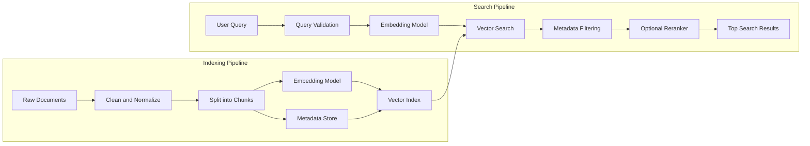
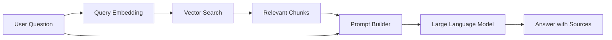
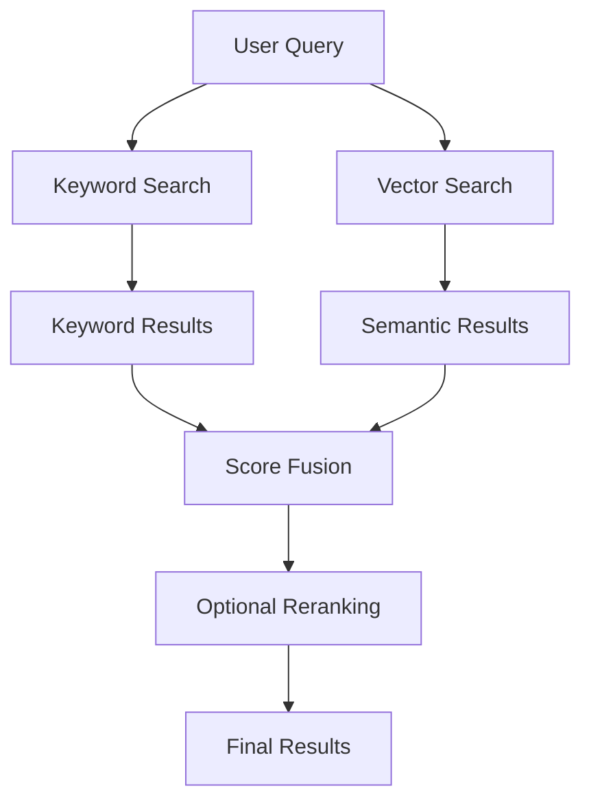
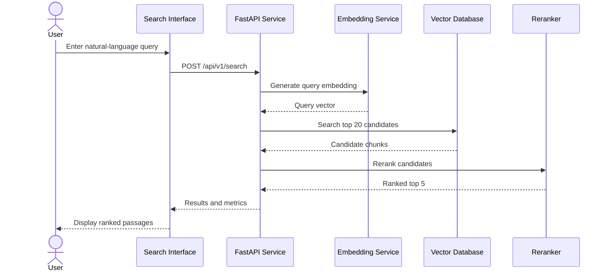

# 003 - Semantic Search Engine

**Course:** 05 - Production and Portfolio
**Module:** Module 15 - Portfolio Projects
**Content Group:** Portfolio
**Roadmap Source:** Portfolio Projects / Portfolio
**Lesson Type:** Portfolio Project
**Order in Module:** 003
**Suggested Duration:** 18 minutes

---

## 1. Overview

This lesson explains how to build a **Semantic Search Engine** as a practical AI Engineer portfolio project.

A traditional search engine mainly matches exact words. A semantic search engine attempts to understand the **meaning and intent** behind a query.

For example, a user may search for:

```text
How can I reduce the cost of an AI application?
```

A semantic search engine may retrieve a document containing:

```text
Strategies for optimizing LLM token usage and inference expenses
```

The two sentences do not share many exact keywords, but they express closely related ideas.

By completing this lesson, you should understand:

* What semantic search is.
* How text embeddings represent meaning.
* How documents are indexed and retrieved.
* How vector similarity is calculated.
* How semantic search fits into a RAG application.
* How to evaluate search quality.
* How to turn the system into a strong portfolio project.

---

## 2. Learning Objectives

After completing this lesson, you should be able to:

* Explain semantic search in your own words.
* Compare keyword search and semantic search.
* Convert text into embedding vectors.
* Build a basic vector search pipeline.
* Create a search API for an AI application.
* Add metadata filtering and reranking.
* Measure retrieval quality and latency.
* Document the project with architecture diagrams, screenshots, metrics, and known limitations.
* Present the project as evidence that you can build and ship a real AI system.

---

## 3. Why Semantic Search Matters

Search is a fundamental component of many modern AI applications.

Semantic search can be used in:

* Document search systems.
* Internal company knowledge bases.
* Customer support assistants.
* E-commerce product search.
* Legal document retrieval.
* Medical literature search.
* Educational content discovery.
* Code search tools.
* RAG applications.
* AI agent memory systems.
* Recommendation systems.

A semantic search project demonstrates several important AI Engineer skills:

* Data preparation.
* Embedding model integration.
* Vector database usage.
* API development.
* Retrieval evaluation.
* Backend architecture.
* Performance optimization.
* Error handling.
* Deployment.
* Technical documentation.

A working semantic search engine is therefore much more valuable in a portfolio than a notebook containing only embedding experiments.

---

## 4. Keyword Search vs. Semantic Search

### 4.1 Keyword Search

Keyword search retrieves documents containing words that match the user's query.

Example query:

```text
cheap LLM deployment
```

A keyword search engine may prioritize documents containing the exact words:

* `cheap`
* `LLM`
* `deployment`

Keyword search is effective when:

* Exact terminology is important.
* Users know the correct keywords.
* Product codes, names, or identifiers must match precisely.
* The dataset contains highly structured terminology.

However, it may fail when the query and document use different wording.

---

### 4.2 Semantic Search

Semantic search converts both queries and documents into numerical vectors called **embeddings**.

Documents are ranked according to how close their vectors are to the query vector.

Example:

```text
Query:
How do I make an AI API less expensive?

Relevant document:
Methods for reducing token consumption and inference cost
```

Even without exact keyword overlap, the embedding model may recognize that the meanings are similar.

---

### 4.3 Comparison

| Feature                            | Keyword Search        | Semantic Search             |
| ---------------------------------- | --------------------- | --------------------------- |
| Matching method                    | Exact words and terms | Meaning and context         |
| Handles synonyms                   | Limited               | Strong                      |
| Handles natural-language questions | Limited               | Strong                      |
| Exact identifier search            | Strong                | Sometimes weak              |
| Computational cost                 | Usually lower         | Usually higher              |
| Requires embedding model           | No                    | Yes                         |
| Common technology                  | BM25, inverted index  | Embeddings, vector database |
| Best use case                      | Exact term retrieval  | Intent-based retrieval      |

In production systems, keyword search and semantic search are often combined into **hybrid search**.

---

## 5. Core Concepts

### 5.1 Embeddings

An embedding is a numerical representation of data.

For text, an embedding model converts a sentence, paragraph, or document into a vector:

```text
"How can I deploy an AI application?"
                  ↓
[0.14, -0.28, 0.73, 0.05, ..., -0.31]
```

Texts with similar meanings should have vectors located near each other in the embedding space.

Embedding models can represent:

* Sentences.
* Paragraphs.
* Documents.
* Product descriptions.
* Source code.
* Images.
* Audio.
* Multimodal content.

---

### 5.2 Vector Dimensions

An embedding vector may contain hundreds or thousands of numbers.

For example:

```text
Document A → 384-dimensional vector
Document B → 384-dimensional vector
Query      → 384-dimensional vector
```

The query and documents must normally use the same embedding model so that their vectors belong to the same vector space.

---

### 5.3 Similarity Metrics

A semantic search engine compares vectors using a similarity or distance function.

Common metrics include:

* Cosine similarity.
* Dot product.
* Euclidean distance.

#### Cosine Similarity

Cosine similarity measures the angle between two vectors.

[
\text{cosine similarity}(A,B)
=============================

\frac{A \cdot B}{|A||B|}
]

A larger score generally indicates greater semantic similarity.

Example:

```text
Query: "reduce LLM cost"

Document A: "optimize token usage"
Similarity: 0.87

Document B: "design a mobile login page"
Similarity: 0.18
```

Document A should be ranked higher.

---

### 5.4 Vector Index

Searching every stored vector one by one becomes expensive when the dataset is large.

A vector index organizes embeddings so that similar vectors can be found efficiently.

Common vector indexing strategies include:

* Exact nearest-neighbor search.
* Approximate nearest-neighbor search.
* HNSW.
* IVF.
* Product quantization.

Common vector search technologies include:

* FAISS.
* Qdrant.
* Chroma.
* Milvus.
* Weaviate.
* Pinecone.
* PostgreSQL with `pgvector`.

For a small portfolio demo, an in-memory NumPy or FAISS index may be enough.

For a production-style project, a vector database such as Qdrant or PostgreSQL with `pgvector` provides a more realistic architecture.

---

### 5.5 Chunking

Large documents are usually divided into smaller sections called **chunks** before embedding.

Example:

```text
Original document
    ↓
Introduction
Section 1
Section 2
Section 3
Conclusion
```

Each section can become a separate searchable unit.

Chunking affects retrieval quality.

Chunks that are too large may:

* Contain multiple unrelated topics.
* Reduce retrieval precision.
* Increase context size.
* Increase LLM cost.

Chunks that are too small may:

* Lose important context.
* Return incomplete information.
* Produce fragmented results.

A common strategy is:

```text
Chunk size: 300-800 tokens
Overlap: 50-150 tokens
```

These values are starting points, not universal rules. They should be tested on the actual dataset.

---

### 5.6 Metadata

Each vector should be stored with useful metadata.

Example:

```json
{
  "document_id": "doc_102",
  "title": "Reducing LLM Inference Cost",
  "category": "production",
  "language": "en",
  "source": "engineering-handbook",
  "created_at": "2026-07-20",
  "chunk_index": 4
}
```

Metadata makes it possible to filter results.

Example filters:

```text
language = "en"
category = "production"
created_at >= "2026-01-01"
```

Metadata filtering is important because semantic similarity alone may return content from the wrong category, language, tenant, or permission group.

---

### 5.7 Reranking

The initial vector search retrieves a set of candidate documents.

A reranking model can then examine the query-document pairs more carefully and reorder them.

```text
Query
  ↓
Vector search retrieves top 20 candidates
  ↓
Reranker scores each query-document pair
  ↓
Return top 5 results
```

Vector search is fast but approximate.

Reranking is slower but often more accurate.

A common production pattern is:

```text
Retrieve 20-50 candidates
Rerank candidates
Return the best 5-10 results
```

---

## 6. System Architecture

A basic semantic search engine contains two main workflows:

1. The indexing workflow.
2. The search workflow.



---

## 7. End-to-End Workflow

### Step 1: Collect Documents

Possible data sources include:

* Markdown files.
* PDF documents.
* Product descriptions.
* Support articles.
* Source code.
* Database records.
* Web pages.
* Internal documentation.

For a portfolio project, use a dataset that has a clear purpose.

Example project themes:

* Search an AI Engineer learning roadmap.
* Search software documentation.
* Search university course materials.
* Search product descriptions.
* Search customer support knowledge.
* Search research paper abstracts.

---

### Step 2: Clean the Data

Cleaning may include:

* Removing repeated headers and footers.
* Removing HTML tags.
* Normalizing whitespace.
* Detecting language.
* Removing empty documents.
* Removing duplicate content.
* Preserving titles and section headings.
* Removing sensitive information.

Example:

```python
def normalize_text(text: str) -> str:
    return " ".join(text.split()).strip()
```

---

### Step 3: Split Documents into Chunks

A simple chunk record may look like this:

```json
{
  "chunk_id": "semantic-search-001-03",
  "document_id": "semantic-search-001",
  "title": "Semantic Search Fundamentals",
  "content": "Semantic search retrieves information based on meaning...",
  "chunk_index": 3
}
```

A good chunk should usually be understandable even when displayed separately.

---

### Step 4: Generate Embeddings

Every chunk is passed through an embedding model.

```python
embedding = embedding_model.encode(chunk_text)
```

The output vector is stored with the chunk text and metadata.

---

### Step 5: Build the Vector Index

The index stores:

```text
vector
chunk ID
document ID
content
metadata
```

The vector index should support:

* Insertion.
* Search.
* Deletion.
* Updates.
* Metadata filtering.
* Persistence.
* Collection or namespace separation.

---

### Step 6: Process the Query

The search service should:

1. Validate the query.
2. Normalize the query.
3. Create a query embedding.
4. Search the vector index.
5. Apply filters.
6. Rerank results when needed.
7. Format the response.
8. Record latency and quality metrics.

---

### Step 7: Return Ranked Results

Example response:

```json
{
  "query": "How can I reduce LLM API cost?",
  "results": [
    {
      "document_id": "doc_102",
      "title": "Reducing LLM Inference Cost",
      "content": "Reduce unnecessary prompt tokens and cache repeated context...",
      "score": 0.892,
      "metadata": {
        "category": "production",
        "language": "en"
      }
    }
  ],
  "latency_ms": 47
}
```

---

## 8. Minimal Python Demo

The following example builds a small in-memory semantic search engine using a sentence embedding model and NumPy.

### 8.1 Install Dependencies

```bash
pip install sentence-transformers numpy
```

---

### 8.2 Semantic Search Implementation

```python
from dataclasses import dataclass
from typing import Any

import numpy as np
from sentence_transformers import SentenceTransformer


@dataclass
class SearchDocument:
    document_id: str
    title: str
    content: str
    metadata: dict[str, Any]


class SemanticSearchEngine:
    def __init__(
        self,
        model_name: str = "sentence-transformers/all-MiniLM-L6-v2",
    ) -> None:
        self.model = SentenceTransformer(model_name)
        self.documents: list[SearchDocument] = []
        self.embeddings: np.ndarray | None = None

    def index(self, documents: list[SearchDocument]) -> None:
        if not documents:
            raise ValueError("At least one document is required.")

        texts = [
            f"{document.title}\n{document.content}"
            for document in documents
        ]

        embeddings = self.model.encode(
            texts,
            normalize_embeddings=True,
            show_progress_bar=False,
        )

        self.documents = documents
        self.embeddings = np.asarray(embeddings, dtype=np.float32)

    def search(
        self,
        query: str,
        top_k: int = 3,
        metadata_filter: dict[str, Any] | None = None,
    ) -> list[dict[str, Any]]:
        if not query.strip():
            raise ValueError("Query must not be empty.")

        if self.embeddings is None or not self.documents:
            raise RuntimeError("No documents have been indexed.")

        query_embedding = self.model.encode(
            [query],
            normalize_embeddings=True,
            show_progress_bar=False,
        )[0]

        scores = self.embeddings @ query_embedding

        candidates: list[dict[str, Any]] = []

        for index, score in enumerate(scores):
            document = self.documents[index]

            if metadata_filter:
                matches_filter = all(
                    document.metadata.get(key) == value
                    for key, value in metadata_filter.items()
                )

                if not matches_filter:
                    continue

            candidates.append(
                {
                    "document_id": document.document_id,
                    "title": document.title,
                    "content": document.content,
                    "score": float(score),
                    "metadata": document.metadata,
                }
            )

        candidates.sort(
            key=lambda result: result["score"],
            reverse=True,
        )

        return candidates[:top_k]


documents = [
    SearchDocument(
        document_id="doc-001",
        title="Reducing LLM Cost",
        content=(
            "Reduce prompt size, cache repeated context, choose smaller models, "
            "and monitor token usage for every request."
        ),
        metadata={
            "category": "production",
            "language": "en",
        },
    ),
    SearchDocument(
        document_id="doc-002",
        title="Vector Database Fundamentals",
        content=(
            "A vector database stores embeddings and performs nearest-neighbor "
            "search using similarity metrics."
        ),
        metadata={
            "category": "retrieval",
            "language": "en",
        },
    ),
    SearchDocument(
        document_id="doc-003",
        title="Mobile Interface Design",
        content=(
            "A mobile interface should provide clear navigation, accessible "
            "controls, and responsive layouts."
        ),
        metadata={
            "category": "design",
            "language": "en",
        },
    ),
]

engine = SemanticSearchEngine()
engine.index(documents)

results = engine.search(
    query="How can I make my AI API less expensive?",
    top_k=2,
    metadata_filter={"language": "en"},
)

for result in results:
    print(
        f"{result['score']:.3f} | "
        f"{result['title']} | "
        f"{result['content']}"
    )
```

Possible output:

```text
0.812 | Reducing LLM Cost | Reduce prompt size, cache repeated context...
0.324 | Vector Database Fundamentals | A vector database stores embeddings...
```

The exact scores depend on the embedding model.

---

## 9. Search API Design

A portfolio-ready project should expose the search system through an API.

### Example Endpoint

```http
POST /api/v1/search
```

Request:

```json
{
  "query": "How does vector retrieval work?",
  "top_k": 5,
  "filters": {
    "category": "retrieval",
    "language": "en"
  }
}
```

Response:

```json
{
  "query": "How does vector retrieval work?",
  "results": [
    {
      "document_id": "doc-002",
      "chunk_id": "doc-002-chunk-01",
      "title": "Vector Database Fundamentals",
      "content": "A vector database stores embeddings...",
      "score": 0.91,
      "metadata": {
        "category": "retrieval",
        "language": "en"
      }
    }
  ],
  "metrics": {
    "embedding_ms": 12,
    "search_ms": 8,
    "total_ms": 24
  }
}
```

---

### FastAPI Route Example

```python
from typing import Any

from fastapi import FastAPI, HTTPException
from pydantic import BaseModel, Field


app = FastAPI(
    title="Semantic Search API",
    version="1.0.0",
)


class SearchRequest(BaseModel):
    query: str = Field(min_length=1, max_length=500)
    top_k: int = Field(default=5, ge=1, le=20)
    filters: dict[str, Any] | None = None


class SearchResult(BaseModel):
    document_id: str
    title: str
    content: str
    score: float
    metadata: dict[str, Any]


class SearchResponse(BaseModel):
    query: str
    results: list[SearchResult]


@app.post("/api/v1/search", response_model=SearchResponse)
def search_documents(request: SearchRequest) -> SearchResponse:
    try:
        results = engine.search(
            query=request.query,
            top_k=request.top_k,
            metadata_filter=request.filters,
        )

        return SearchResponse(
            query=request.query,
            results=results,
        )
    except ValueError as error:
        raise HTTPException(
            status_code=400,
            detail=str(error),
        ) from error
    except RuntimeError as error:
        raise HTTPException(
            status_code=503,
            detail=str(error),
        ) from error
```

Run the API:

```bash
uvicorn main:app --reload
```

Test it:

```bash
curl -X POST "http://localhost:8000/api/v1/search" \
  -H "Content-Type: application/json" \
  -d '{
    "query": "How can I lower AI inference expenses?",
    "top_k": 3,
    "filters": {
      "language": "en"
    }
  }'
```

---

## 10. Semantic Search Inside a RAG System

Semantic search is often the retrieval component of a Retrieval-Augmented Generation system.



A simplified RAG prompt may look like this:

```text
You are a helpful assistant.

Answer the user's question using only the provided context.
If the context does not contain enough information, say that the
answer could not be found.

Context:
{retrieved_chunks}

Question:
{user_query}
```

Semantic search is responsible for selecting the context.

If retrieval fails, the LLM may receive irrelevant information and produce a weak or incorrect answer.

This is why RAG evaluation should separate:

* Retrieval quality.
* Generation quality.

---

## 11. Hybrid Search

Semantic search is powerful, but it may be weak for exact terms such as:

* Product IDs.
* Error codes.
* Function names.
* API endpoint paths.
* Personal names.
* Version numbers.
* Abbreviations.

Hybrid search combines keyword and vector scores.



A simplified score can be calculated as:

[
\text{final score}
==================

\alpha \times \text{semantic score}
+
(1-\alpha) \times \text{keyword score}
]

Example:

```text
alpha = 0.7
```

This gives 70% weight to semantic similarity and 30% to keyword relevance.

The correct weighting should be selected through evaluation rather than guesswork.

---

## 12. Query Processing

A production search engine may transform the query before searching.

Possible steps include:

* Whitespace normalization.
* Language detection.
* Spell correction.
* Synonym expansion.
* Acronym expansion.
* Query rewriting.
* Intent classification.
* Metadata filter extraction.
* Safety validation.

Example:

```text
Original query:
cheap model for chatbot

Rewritten query:
cost-efficient language model for a conversational AI application
```

However, query rewriting can also change the user's intent. The original and rewritten queries should be logged during testing.

---

## 13. Evaluation

A portfolio project should prove that the search engine works.

Do not evaluate the system only by manually testing two or three queries.

Create an evaluation dataset containing:

```json
{
  "query": "How can I reduce token cost?",
  "relevant_document_ids": [
    "doc-101",
    "doc-104"
  ]
}
```

A small portfolio evaluation set may contain:

* 30-50 queries for an initial prototype.
* 100 or more queries for a stronger project.
* Easy queries.
* Paraphrased queries.
* Ambiguous queries.
* Exact keyword queries.
* Queries with no correct answer.
* Queries requiring filters.

---

### 13.1 Recall@K

Recall@K measures whether the relevant document appears within the first `K` results.

[
\text{Recall@K}
===============

\frac{\text{Relevant documents retrieved in top K}}
{\text{Total relevant documents}}
]

Example:

```text
Relevant documents: 2
Relevant documents found in top 5: 1

Recall@5 = 1 / 2 = 0.5
```

---

### 13.2 Precision@K

Precision@K measures how many of the top `K` results are relevant.

[
\text{Precision@K}
==================

\frac{\text{Relevant documents in top K}}
{K}
]

---

### 13.3 Mean Reciprocal Rank

Mean Reciprocal Rank rewards systems that place the first relevant result near the top.

For one query:

[
\text{Reciprocal Rank}
======================

\frac{1}{\text{Rank of first relevant result}}
]

Example:

```text
First relevant result at position 2

Reciprocal Rank = 1 / 2 = 0.5
```

---

### 13.4 nDCG

Normalized Discounted Cumulative Gain is useful when results have multiple relevance levels.

For example:

```text
3 = highly relevant
2 = relevant
1 = partially relevant
0 = irrelevant
```

nDCG rewards relevant results appearing near the top of the ranking.

---

### 13.5 Operational Metrics

Track both quality and system performance.

| Metric              | Purpose                                         |
| ------------------- | ----------------------------------------------- |
| Recall@K            | Measures whether relevant content was retrieved |
| Precision@K         | Measures result relevance                       |
| MRR                 | Measures the rank of the first correct result   |
| nDCG                | Measures ranking quality                        |
| Embedding latency   | Time needed to embed a query                    |
| Search latency      | Time needed to retrieve results                 |
| Reranking latency   | Time used by the reranker                       |
| Total API latency   | User-visible response time                      |
| Index size          | Storage required by vectors                     |
| Indexing throughput | Documents processed per second                  |
| Error rate          | Failed search requests                          |
| Empty-result rate   | Queries returning no results                    |

---

## 14. Example Evaluation Report

```text
Dataset:
- 120 documents
- 50 evaluation queries
- 74 relevant query-document pairs

Configuration:
- Embedding model: all-MiniLM-L6-v2
- Chunk size: 500 tokens
- Chunk overlap: 80 tokens
- Search type: cosine similarity
- Top K: 5

Results:
- Recall@5: 0.84
- Precision@5: 0.56
- MRR: 0.79
- Average embedding latency: 14 ms
- Average vector search latency: 9 ms
- P95 total API latency: 61 ms

Observed failure cases:
- Exact error codes were sometimes ranked poorly.
- Very short queries were ambiguous.
- Vietnamese and English mixed queries produced inconsistent results.
- Large chunks occasionally contained multiple unrelated topics.
```

This type of report makes the project much stronger than simply stating that the search results “look good.”

---

## 15. Security and Safety Considerations

A semantic search engine can expose sensitive information if filtering and access control are implemented incorrectly.

Important controls include:

* Tenant isolation.
* Document-level permissions.
* User authentication.
* Role-based access control.
* Metadata access filters.
* Input length limits.
* Rate limiting.
* Sensitive-data removal.
* Audit logs.
* Safe error responses.
* Query and result sanitization.

Access filters should be applied during retrieval, not only after retrieval.

Incorrect pattern:

```text
Search all company documents
    ↓
Retrieve confidential document
    ↓
Remove it before displaying the result
```

Better pattern:

```text
User permissions
    ↓
Apply authorization filter
    ↓
Search only authorized documents
```

For a RAG application, retrieved content must also be treated as untrusted input because documents may contain prompt injection instructions.

---

## 16. Production Considerations

A production-ready semantic search engine should consider:

### Reliability

* Retry temporary embedding failures.
* Use request timeouts.
* Add circuit breakers for external providers.
* Validate vector dimensions.
* Detect corrupted index files.
* Keep backups of source documents and metadata.

### Performance

* Batch document embeddings.
* Cache repeated query embeddings.
* Use approximate nearest-neighbor indexes.
* Limit the number of retrieved candidates.
* Avoid unnecessary reranking.
* Monitor P50, P95, and P99 latency.

### Cost

* Track embedding API usage.
* Avoid embedding unchanged documents again.
* Use content hashes to detect duplicates.
* Batch embedding requests.
* Select an appropriate embedding model.
* Measure storage and database costs.

### Observability

Log fields such as:

```json
{
  "request_id": "req-8312",
  "query_length": 42,
  "top_k": 5,
  "filter_count": 2,
  "embedding_ms": 15,
  "search_ms": 8,
  "rerank_ms": 23,
  "total_ms": 51,
  "result_count": 5,
  "model": "embedding-model-name",
  "index_version": "2026-07-29"
}
```

Avoid logging private query content unless there is a valid reason and suitable privacy protection.

---

## 17. Portfolio Project Specification

### Project Title

```text
Semantic Search Engine for AI Engineering Knowledge
```

### Problem

AI engineering documentation uses many overlapping terms. Traditional keyword search may fail when users ask natural-language questions using different wording.

### Proposed Solution

Build a semantic search engine that:

* Indexes AI engineering lessons and documentation.
* Generates embeddings for document chunks.
* Stores vectors and metadata.
* Accepts natural-language search queries.
* Returns ranked passages with similarity scores.
* Supports category and language filters.
* Exposes a REST API.
* Provides a small web interface.
* Records latency and retrieval metrics.

---

### Suggested Technology Stack

```text
Backend:
- Python
- FastAPI
- Pydantic

Embedding:
- Sentence Transformers
  or an external embedding API

Vector storage:
- FAISS for a local prototype
- Qdrant or pgvector for a production-style version

Frontend:
- React, Next.js, or a simple HTML interface

Deployment:
- Docker
- Render, Railway, Fly.io, a cloud VM, or another hosting platform

Testing:
- Pytest
- Retrieval evaluation dataset
- API integration tests

Observability:
- Structured logging
- Latency metrics
- Error tracking
```

---

## 18. Recommended Project Structure

```text
semantic-search-engine/
├── app/
│   ├── api/
│   │   └── search.py
│   ├── core/
│   │   ├── config.py
│   │   └── logging.py
│   ├── models/
│   │   └── schemas.py
│   ├── services/
│   │   ├── embedding_service.py
│   │   ├── indexing_service.py
│   │   ├── search_service.py
│   │   └── reranking_service.py
│   ├── repositories/
│   │   └── vector_repository.py
│   └── main.py
├── data/
│   ├── raw/
│   ├── processed/
│   └── evaluation/
├── scripts/
│   ├── ingest.py
│   └── evaluate.py
├── tests/
│   ├── test_search_api.py
│   ├── test_search_service.py
│   └── test_retrieval_quality.py
├── frontend/
├── screenshots/
├── Dockerfile
├── docker-compose.yml
├── requirements.txt
├── README.md
└── .env.example
```

This structure separates:

* API routes.
* Business logic.
* Data storage.
* Embedding providers.
* Evaluation.
* Tests.

---

## 19. Demo User Flow



---

## 20. README Requirements

A strong README should contain the following sections.

### 20.1 Project Overview

Explain:

* The problem.
* The target users.
* Why keyword search is insufficient.
* What the semantic search engine provides.

### 20.2 Features

Example:

```text
- Natural-language semantic search
- Document chunking and indexing
- Metadata filtering
- Similarity scores
- REST API
- Search interface
- Retrieval evaluation
- Docker deployment
- Structured logging
```

### 20.3 Architecture

Include:

* An architecture diagram.
* Indexing workflow.
* Search workflow.
* Data storage.
* External services.

### 20.4 Setup

Document:

* Required software.
* Environment variables.
* Installation commands.
* Database startup.
* Indexing command.
* API startup.
* Test command.

### 20.5 API Examples

Provide:

* Request examples.
* Response examples.
* Error responses.
* Filter examples.

### 20.6 Screenshots or Video

Show:

* Search input.
* Ranked results.
* Similarity scores.
* Filters.
* Evaluation dashboard.
* API documentation.

### 20.7 Evaluation

Include:

* Dataset size.
* Number of evaluation queries.
* Recall@K.
* MRR.
* Latency.
* Failure cases.

### 20.8 Known Limitations

Possible limitations:

* Search quality depends on the embedding model.
* The evaluation dataset is relatively small.
* The system supports only selected languages.
* Exact keyword matching is weaker without hybrid search.
* The reranker increases latency.
* The current version does not support incremental indexing.
* Access control is simplified for the demo.
* Search quality may decrease for very short queries.

---

## 21. Practical Exercise

Build a small semantic search engine using at least 30 documents.

### Minimum Requirements

* Load documents from local files.
* Normalize the text.
* Split documents into chunks.
* Generate embeddings.
* Store vectors.
* Accept a natural-language query.
* Return the top five results.
* Display similarity scores.
* Add at least one metadata filter.
* Expose the search function through an API.
* Create at least ten evaluation queries.
* Measure average search latency.

### Recommended Extensions

* Add hybrid search.
* Add a reranker.
* Add multilingual search.
* Add a web interface.
* Add query history.
* Add result feedback.
* Add document upload.
* Add Docker support.
* Add automated evaluation.
* Add RAG answer generation with source citations.

---

## 22. Example Demo Scenario

### Input

```text
How can an AI application avoid exceeding provider rate limits?
```

### Processing

```text
1. Validate the query.
2. Generate the query embedding.
3. Search the vector index.
4. Filter results to the "production" category.
5. Retrieve the top 20 candidates.
6. Rerank the candidates.
7. Return the top five passages.
8. Record latency and result scores.
```

### Output

```text
1. Rate Limits and Exponential Backoff
   Score: 0.91

   Use exponential backoff, request queues, concurrency limits,
   and provider-specific retry headers.

2. Retries and Timeouts
   Score: 0.84

   Retry only temporary failures and add random jitter to prevent
   multiple clients from retrying simultaneously.

3. Production API Reliability
   Score: 0.78

   Track request volume, failure rates, and provider quotas.
```

### Debugging Notes

```text
Problem:
The correct rate-limit article was ranked below an unrelated API article.

Possible causes:
- The chunk was too large.
- The title was not included in the embedding.
- The query was too short.
- The embedding model was weak for technical terminology.
- Duplicate content affected ranking.
- The index used an incorrect similarity metric.

Fix:
Include the document title, reduce chunk size, remove duplicates,
and compare multiple embedding configurations using Recall@5.
```

---

## 23. Common Mistakes

### 23.1 Building Only a Notebook

A notebook may prove that embeddings work, but it does not demonstrate a complete application.

A stronger project includes:

* Reusable services.
* An API.
* Tests.
* Logging.
* Evaluation.
* Deployment instructions.
* Screenshots.
* Known limitations.

---

### 23.2 Evaluating Only the Happy Path

A few successful queries are not enough.

Test:

* Synonyms.
* Misspellings.
* Short queries.
* Long questions.
* Exact identifiers.
* Mixed-language input.
* Irrelevant queries.
* Empty queries.
* Unauthorized documents.
* Queries with no valid answer.

---

### 23.3 Using Similarity Scores as Universal Confidence

A score of `0.80` is not automatically “good.”

Score interpretation depends on:

* The embedding model.
* The metric.
* Vector normalization.
* Dataset characteristics.
* Query length.
* Document length.

Thresholds must be calibrated using real evaluation data.

---

### 23.4 Ignoring Chunk Quality

Poor chunking can cause:

* Incomplete results.
* Irrelevant context.
* Duplicate results.
* Missing headings.
* Broken tables.
* Lost source references.

Always inspect retrieved chunks, not only their scores.

---

### 23.5 Ignoring Exact Search Requirements

Pure semantic search may perform poorly for:

```text
KSOLM-226
HTTP 429
/api/v1/search
calculate_total_cost()
v2.3.1
```

Use keyword or hybrid search when exact matching matters.

---

### 23.6 Forgetting Metadata and Permissions

A semantically relevant result is not necessarily an authorized result.

Always consider:

* User.
* Role.
* Organization.
* Language.
* Document status.
* Visibility.
* Content category.

---

### 23.7 Hiding Limitations

A strong portfolio project openly documents:

* What failed.
* What was not tested.
* What assumptions were made.
* Which datasets were used.
* What should be improved next.

Honest engineering analysis is more valuable than unrealistic claims.

---

## 24. Interview Explanation

You should be able to explain the project in one or two minutes.

Example:

> I built a semantic search engine that retrieves AI engineering documentation based on meaning rather than only exact keywords. The system cleans and chunks documents, creates embeddings, and stores them in a vector index with metadata. When a user submits a query, the backend creates a query embedding, retrieves similar chunks, applies filters, and optionally reranks the candidates. I exposed the system through a FastAPI endpoint and evaluated it using Recall@5, MRR, and latency. I also documented failure cases such as exact error-code searches, ambiguous short queries, and multilingual inconsistencies. The next improvement would be hybrid retrieval and a stronger reranking model.

---

## 25. Completion Checklist

### Understanding

* [ ] I can explain semantic search in one or two minutes.
* [ ] I can explain the difference between keyword and semantic search.
* [ ] I understand embeddings and vector similarity.
* [ ] I understand why documents need to be chunked.
* [ ] I understand metadata filtering and reranking.
* [ ] I understand how semantic search supports RAG.

### Implementation

* [ ] I have built a working indexing pipeline.
* [ ] I can generate and store document embeddings.
* [ ] I can embed a user query.
* [ ] I can retrieve the top matching documents.
* [ ] I can return search results through an API.
* [ ] I have added input validation and error handling.
* [ ] I have implemented at least one metadata filter.
* [ ] I have added tests for important edge cases.

### Evaluation

* [ ] I have created a retrieval evaluation dataset.
* [ ] I have measured Recall@K or Precision@K.
* [ ] I have measured MRR or nDCG.
* [ ] I have recorded average and P95 latency.
* [ ] I have documented at least three failure cases.
* [ ] I have compared at least two configurations.

### Portfolio

* [ ] My project has a clear README.
* [ ] My README explains the problem and architecture.
* [ ] I have included setup instructions.
* [ ] I have included API request and response examples.
* [ ] I have added screenshots or a demo video.
* [ ] I have published evaluation results.
* [ ] I have documented known limitations.
* [ ] I have included a deployment link when available.

---

## 26. Related Outcome

Build a portfolio that proves you can ship real AI applications rather than only explain AI concepts.

A strong semantic search project shows that you can connect:

```text
Data
  → Chunking
  → Embeddings
  → Vector Storage
  → Retrieval
  → API
  → Evaluation
  → Deployment
  → Monitoring
```

---

## 27. Related Portfolio Project

Publish two or three strong AI projects containing:

* Clear problem statements.
* Architecture diagrams.
* Source code.
* Setup instructions.
* Screenshots.
* API examples.
* Evaluation results.
* Deployment links.
* Engineering trade-offs.
* Known limitations.
* Future improvements.

A Semantic Search Engine can be one of these projects because it demonstrates practical skills across machine learning, backend engineering, retrieval systems, evaluation, and production deployment.

---

## 28. Summary

A **Semantic Search Engine** retrieves information based on meaning rather than only exact keyword matches.

Its main workflow is:

```text
Documents
  → Cleaning
  → Chunking
  → Embeddings
  → Vector Index

User Query
  → Query Embedding
  → Similarity Search
  → Filtering
  → Reranking
  → Ranked Results
```

To turn semantic search into a strong portfolio project:

1. Use a meaningful dataset.
2. Build a reproducible indexing pipeline.
3. Expose search through an API.
4. Add metadata filters.
5. Evaluate retrieval quality.
6. Measure latency and operational performance.
7. Test edge cases.
8. Document architecture and limitations.
9. Add screenshots or a video.
10. Deploy a working demonstration.

The final goal is not merely to define semantic search. The goal is to prove that you can design, implement, evaluate, debug, document, and ship a real AI retrieval system.
