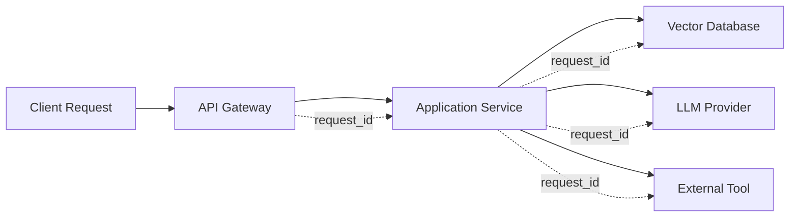
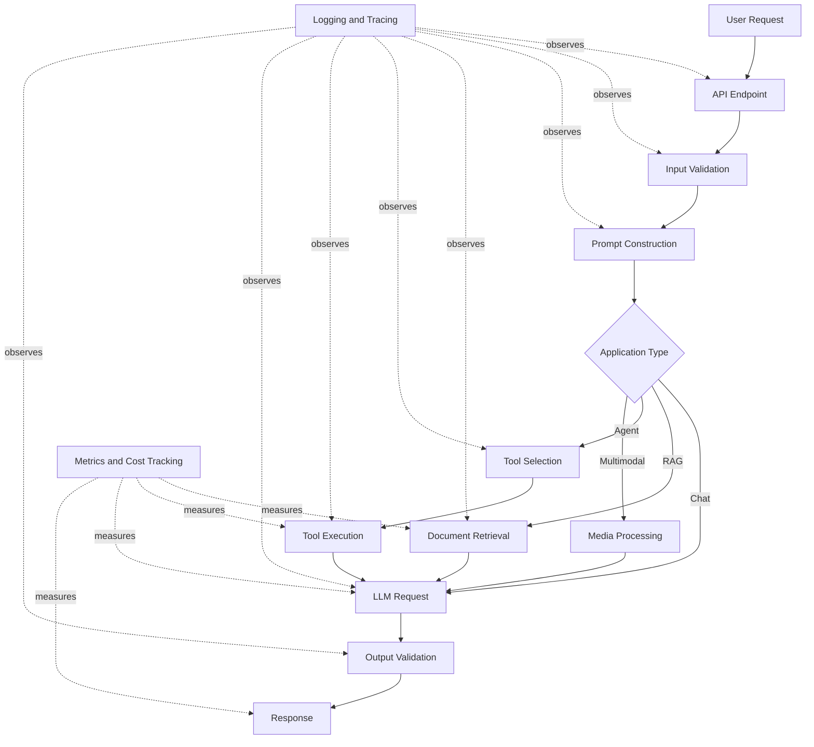
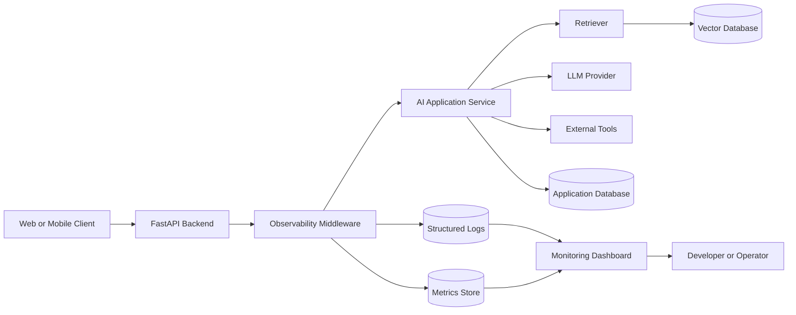
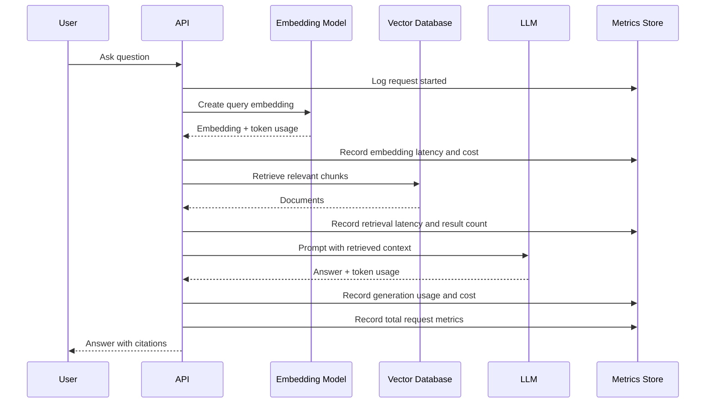
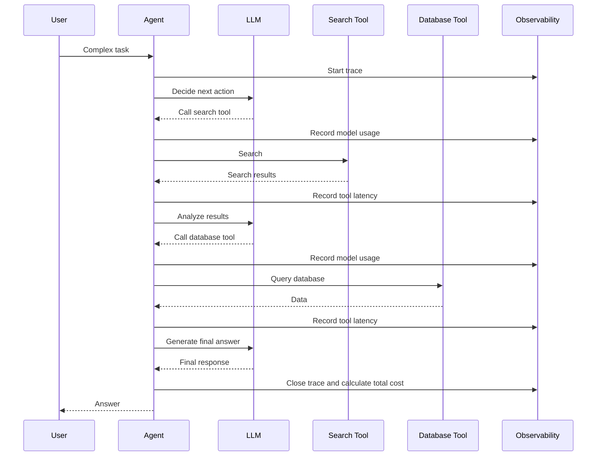
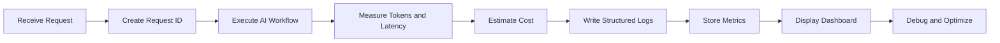

# 006 — Production Demo with Logging, Token, and Cost Tracking

**Course:** 05 — Production and Portfolio
**Module:** Module 15 — Portfolio Projects
**Content Group:** Portfolio
**Roadmap Source:** Portfolio Projects / Portfolio
**Lesson Type:** Portfolio Project
**Order in Module:** 006
**Suggested Duration:** 18 minutes

---

## 1. Overview

A **Production Demo with Logging, Token, and Cost Tracking** shows that you can build an AI application that is not only functional, but also observable, measurable, debuggable, and financially manageable.

A simple AI demo may send a prompt to a model and display the answer. A production-oriented demo should also answer questions such as:

* What happened during each request?
* Which model and prompt version were used?
* How long did the request take?
* How many tokens were consumed?
* How much did the request cost?
* Did retrieval or tool calling succeed?
* Why did a request fail?
* How can the team investigate a bad response?
* Is the system becoming slower or more expensive over time?

This type of project is valuable in an AI Engineer portfolio because it demonstrates that you understand the operational side of AI systems, not only model APIs.

---

## 2. Learning Objectives

By the end of this lesson, you should be able to:

* Explain production logging, token tracking, and cost tracking in your own words.
* Identify where observability belongs in an AI application workflow.
* Add structured logs to an AI API endpoint.
* Record input, output, and total token usage.
* Estimate the cost of each model request.
* Measure latency across model, retrieval, and tool operations.
* Build a small monitoring dashboard or analytics report.
* Document limitations, risks, and debugging procedures.
* Present the project as a strong portfolio artifact.

---

## 3. Why This Project Matters

A production AI application must be observable.

Without logging and metrics, developers may know that something went wrong but not understand:

* which component failed,
* which request triggered the problem,
* whether the model or application caused the issue,
* how many users were affected,
* or how much the failure cost.

A production demo proves that you can move from:

```text
"It works on my computer."
```

to:

```text
"It runs reliably, records what happens, measures resource usage,
and provides enough evidence to debug problems."
```

Recruiters and engineering teams usually care more about a working, measurable application than a project that only demonstrates theoretical knowledge.

---

## 4. Core Concepts

### 4.1 Application Logging

Logging records important events that happen while the application is running.

Typical log events include:

* request received,
* authentication completed,
* prompt created,
* retrieval started,
* documents retrieved,
* model request started,
* model response received,
* tool selected,
* tool execution completed,
* validation failed,
* retry attempted,
* request completed,
* unexpected error occurred.

A useful production log should provide enough context to reconstruct what happened.

Example:

```json
{
  "timestamp": "2026-07-29T10:30:42Z",
  "level": "INFO",
  "event": "llm_request_completed",
  "request_id": "req_82f94c",
  "user_id": "user_1482",
  "model": "example-model",
  "prompt_version": "support-v3",
  "input_tokens": 842,
  "output_tokens": 216,
  "total_tokens": 1058,
  "latency_ms": 1842,
  "estimated_cost_usd": 0.00431,
  "status": "success"
}
```

---

### 4.2 Structured Logging

Plain text logs are readable, but they are difficult to search and aggregate.

Unstructured log:

```text
The request finished successfully and used 1058 tokens.
```

Structured log:

```json
{
  "event": "request_completed",
  "status": "success",
  "total_tokens": 1058
}
```

Structured logs are better because monitoring systems can filter and aggregate fields such as:

* `request_id`,
* `status`,
* `model`,
* `latency_ms`,
* `total_tokens`,
* `estimated_cost_usd`,
* `error_type`.

For production AI applications, JSON logging is usually a practical default.

---

### 4.3 Request IDs and Trace IDs

Every request should receive a unique identifier.

```text
request_id = req_82f94c
```

The request ID connects logs from different components:



When an error occurs, a developer can search all logs containing the same request ID.

A trace ID may represent the full workflow, while span IDs represent individual operations such as retrieval, generation, or tool execution.

---

### 4.4 Token Tracking

Large language models process text as tokens rather than words.

A model request commonly reports:

* **Input tokens:** tokens sent to the model.
* **Output tokens:** tokens generated by the model.
* **Cached tokens:** tokens reused through provider caching, when supported.
* **Reasoning tokens:** internal reasoning usage reported by some models.
* **Total tokens:** total token consumption for the request.

A simplified relationship is:

```text
total_tokens = input_tokens + output_tokens
```

Token usage should be recorded for each request because it directly affects:

* operating cost,
* response latency,
* context-window usage,
* system scalability,
* and rate-limit consumption.

---

### 4.5 Cost Tracking

Model providers usually charge based on token usage, model type, or another billable unit.

A simplified cost calculation is:

```text
input_cost =
    input_tokens / 1,000,000 × input_price_per_million

output_cost =
    output_tokens / 1,000,000 × output_price_per_million

total_cost =
    input_cost + output_cost
```

Example:

```python
input_tokens = 2_000
output_tokens = 500

input_price_per_million = 2.00
output_price_per_million = 8.00

input_cost = input_tokens / 1_000_000 * input_price_per_million
output_cost = output_tokens / 1_000_000 * output_price_per_million

total_cost = input_cost + output_cost
```

Result:

```text
Input cost:  $0.004
Output cost: $0.004
Total cost:  $0.008
```

Model prices can change. Store pricing in configuration rather than hard-coding it throughout the application.

```python
MODEL_PRICING = {
    "example-model": {
        "input_per_million": 2.00,
        "output_per_million": 8.00,
    }
}
```

---

### 4.6 Latency Tracking

Latency measures how long operations take.

Useful latency metrics include:

| Metric              | Meaning                                   |
| ------------------- | ----------------------------------------- |
| Total latency       | Time from request start to final response |
| Time to first token | Time before streaming begins              |
| Model latency       | Time spent waiting for the model          |
| Retrieval latency   | Time spent searching documents            |
| Tool latency        | Time spent calling external tools         |
| Validation latency  | Time spent validating structured output   |

Average latency alone may hide slow requests. Production systems commonly inspect percentiles:

* **P50:** median request latency,
* **P95:** 95% of requests are faster than this value,
* **P99:** 99% of requests are faster than this value.

---

### 4.7 Error Tracking

Errors should be categorized rather than stored only as generic exceptions.

Possible categories include:

```text
authentication_error
validation_error
rate_limit_error
provider_timeout
provider_unavailable
retrieval_error
tool_execution_error
structured_output_error
safety_rejection
internal_server_error
```

Example structured error log:

```json
{
  "level": "ERROR",
  "event": "llm_request_failed",
  "request_id": "req_82f94c",
  "provider": "example-provider",
  "model": "example-model",
  "error_type": "provider_timeout",
  "retry_count": 2,
  "latency_ms": 30012,
  "status": "failed"
}
```

Avoid logging secrets, credentials, private documents, or sensitive user information.

---

## 5. Position in the AI Engineering Workflow

Logging and metrics surround the entire application workflow.



Observability is not a separate feature added only at the end. It should be integrated into each important step.

---

## 6. Recommended Demo Architecture

A strong portfolio demo can use the following architecture:



### Suggested Components

* **Frontend:** React, Next.js, Streamlit, or a simple HTML interface
* **Backend:** FastAPI, Flask, Express, or NestJS
* **Model provider:** any LLM provider
* **Database:** PostgreSQL, SQLite, or MongoDB
* **Logs:** JSON files, PostgreSQL, Elasticsearch, Loki, or a hosted observability service
* **Metrics:** Prometheus, a relational table, or a simple analytics database
* **Dashboard:** Grafana, Streamlit, React, or generated HTML reports
* **Deployment:** Docker and a cloud hosting platform

A portfolio project does not need a complex enterprise stack. A smaller implementation is acceptable when the design decisions are clearly documented.

---

## 7. What Should Be Logged?

A useful event schema may include the following fields:

| Field                      | Purpose                              |
| -------------------------- | ------------------------------------ |
| `timestamp`                | When the event occurred              |
| `level`                    | Debug, info, warning, or error       |
| `event`                    | Machine-readable event name          |
| `request_id`               | Correlates events from one request   |
| `trace_id`                 | Correlates a distributed workflow    |
| `user_id`                  | Pseudonymous user identifier         |
| `session_id`               | Groups related conversation requests |
| `route`                    | API route                            |
| `model`                    | Model used                           |
| `provider`                 | Model provider                       |
| `prompt_version`           | Version of the prompt template       |
| `input_tokens`             | Number of input tokens               |
| `output_tokens`            | Number of generated tokens           |
| `total_tokens`             | Total token usage                    |
| `estimated_cost_usd`       | Estimated request cost               |
| `latency_ms`               | Operation duration                   |
| `status`                   | Success or failure                   |
| `error_type`               | Categorized failure type             |
| `retry_count`              | Number of retries                    |
| `retrieved_document_count` | Number of retrieved chunks           |
| `tool_name`                | Tool called by an agent              |
| `cache_hit`                | Whether cached data was reused       |

Do not log every field for every event. Record only the fields relevant to that operation.

---

## 8. Minimal Project Structure

```text
production-ai-demo/
├── app/
│   ├── main.py
│   ├── api/
│   │   └── chat.py
│   ├── services/
│   │   ├── llm_service.py
│   │   ├── cost_service.py
│   │   └── metrics_service.py
│   ├── middleware/
│   │   └── request_context.py
│   ├── core/
│   │   ├── config.py
│   │   └── logging.py
│   └── models/
│       └── schemas.py
├── dashboard/
│   └── app.py
├── tests/
│   ├── test_cost_service.py
│   ├── test_chat_api.py
│   └── test_logging.py
├── Dockerfile
├── docker-compose.yml
├── requirements.txt
├── .env.example
└── README.md
```

This structure separates:

* API routing,
* AI provider logic,
* cost calculation,
* metrics storage,
* request context,
* and monitoring.

---

## 9. Practical Implementation

### 9.1 Structured Logger

```python
import json
import logging
from datetime import datetime, timezone
from typing import Any


class JsonFormatter(logging.Formatter):
    def format(self, record: logging.LogRecord) -> str:
        payload: dict[str, Any] = {
            "timestamp": datetime.now(timezone.utc).isoformat(),
            "level": record.levelname,
            "message": record.getMessage(),
        }

        extra_fields = getattr(record, "fields", None)

        if isinstance(extra_fields, dict):
            payload.update(extra_fields)

        if record.exc_info:
            payload["exception"] = self.formatException(record.exc_info)

        return json.dumps(payload, ensure_ascii=False)


def create_logger() -> logging.Logger:
    logger = logging.getLogger("production_ai_demo")
    logger.setLevel(logging.INFO)

    if not logger.handlers:
        handler = logging.StreamHandler()
        handler.setFormatter(JsonFormatter())
        logger.addHandler(handler)

    return logger


logger = create_logger()
```

Usage:

```python
logger.info(
    "Model request completed",
    extra={
        "fields": {
            "event": "llm_request_completed",
            "request_id": "req_82f94c",
            "model": "example-model",
            "status": "success",
        }
    },
)
```

---

### 9.2 Request ID Middleware

```python
import time
import uuid

from fastapi import FastAPI, Request

app = FastAPI()


@app.middleware("http")
async def add_request_context(request: Request, call_next):
    request_id = request.headers.get("X-Request-ID") or str(uuid.uuid4())
    start_time = time.perf_counter()

    request.state.request_id = request_id

    try:
        response = await call_next(request)

        latency_ms = round(
            (time.perf_counter() - start_time) * 1000,
            2,
        )

        logger.info(
            "HTTP request completed",
            extra={
                "fields": {
                    "event": "http_request_completed",
                    "request_id": request_id,
                    "method": request.method,
                    "route": request.url.path,
                    "status_code": response.status_code,
                    "latency_ms": latency_ms,
                    "status": "success",
                }
            },
        )

        response.headers["X-Request-ID"] = request_id
        return response

    except Exception:
        latency_ms = round(
            (time.perf_counter() - start_time) * 1000,
            2,
        )

        logger.exception(
            "HTTP request failed",
            extra={
                "fields": {
                    "event": "http_request_failed",
                    "request_id": request_id,
                    "method": request.method,
                    "route": request.url.path,
                    "latency_ms": latency_ms,
                    "status": "failed",
                }
            },
        )

        raise
```

This middleware:

1. creates or accepts a request ID,
2. measures request latency,
3. logs success or failure,
4. returns the ID to the client.

---

### 9.3 Cost Calculation Service

```python
from dataclasses import dataclass


@dataclass(frozen=True)
class ModelPrice:
    input_per_million: float
    output_per_million: float


MODEL_PRICING: dict[str, ModelPrice] = {
    "example-model-small": ModelPrice(
        input_per_million=0.50,
        output_per_million=2.00,
    ),
    "example-model-large": ModelPrice(
        input_per_million=3.00,
        output_per_million=12.00,
    ),
}


def estimate_request_cost(
    model: str,
    input_tokens: int,
    output_tokens: int,
) -> float:
    pricing = MODEL_PRICING.get(model)

    if pricing is None:
        raise ValueError(f"Pricing is not configured for model: {model}")

    input_cost = (
        input_tokens / 1_000_000
    ) * pricing.input_per_million

    output_cost = (
        output_tokens / 1_000_000
    ) * pricing.output_per_million

    return round(input_cost + output_cost, 8)
```

Store provider pricing in a configuration file or database so that updates do not require changes throughout the codebase.

---

### 9.4 LLM Service with Metrics

```python
import time
from dataclasses import dataclass
from typing import Protocol


@dataclass
class LLMUsage:
    input_tokens: int
    output_tokens: int
    total_tokens: int


@dataclass
class LLMResult:
    text: str
    usage: LLMUsage
    model: str
    latency_ms: float
    estimated_cost_usd: float


class LLMClient(Protocol):
    async def generate(
        self,
        model: str,
        messages: list[dict[str, str]],
    ) -> dict:
        ...


class LLMService:
    def __init__(self, client: LLMClient):
        self.client = client

    async def generate(
        self,
        *,
        model: str,
        messages: list[dict[str, str]],
        request_id: str,
        prompt_version: str,
    ) -> LLMResult:
        start_time = time.perf_counter()

        logger.info(
            "Starting model request",
            extra={
                "fields": {
                    "event": "llm_request_started",
                    "request_id": request_id,
                    "model": model,
                    "prompt_version": prompt_version,
                }
            },
        )

        response = await self.client.generate(
            model=model,
            messages=messages,
        )

        latency_ms = round(
            (time.perf_counter() - start_time) * 1000,
            2,
        )

        usage_data = response["usage"]

        usage = LLMUsage(
            input_tokens=usage_data["input_tokens"],
            output_tokens=usage_data["output_tokens"],
            total_tokens=usage_data["total_tokens"],
        )

        cost = estimate_request_cost(
            model=model,
            input_tokens=usage.input_tokens,
            output_tokens=usage.output_tokens,
        )

        logger.info(
            "Model request completed",
            extra={
                "fields": {
                    "event": "llm_request_completed",
                    "request_id": request_id,
                    "model": model,
                    "prompt_version": prompt_version,
                    "input_tokens": usage.input_tokens,
                    "output_tokens": usage.output_tokens,
                    "total_tokens": usage.total_tokens,
                    "latency_ms": latency_ms,
                    "estimated_cost_usd": cost,
                    "status": "success",
                }
            },
        )

        return LLMResult(
            text=response["text"],
            usage=usage,
            model=model,
            latency_ms=latency_ms,
            estimated_cost_usd=cost,
        )
```

The exact provider SDK response format will vary. Normalize provider-specific responses into one internal structure.

---

### 9.5 API Endpoint

```python
from fastapi import APIRouter, Request
from pydantic import BaseModel, Field


router = APIRouter()


class ChatRequest(BaseModel):
    message: str = Field(min_length=1, max_length=10_000)


class UsageResponse(BaseModel):
    model: str
    input_tokens: int
    output_tokens: int
    total_tokens: int
    latency_ms: float
    estimated_cost_usd: float


class ChatResponse(BaseModel):
    request_id: str
    answer: str
    usage: UsageResponse


@router.post("/chat", response_model=ChatResponse)
async def chat(
    payload: ChatRequest,
    request: Request,
) -> ChatResponse:
    request_id = request.state.request_id

    messages = [
        {
            "role": "system",
            "content": "Answer clearly and concisely.",
        },
        {
            "role": "user",
            "content": payload.message,
        },
    ]

    result = await llm_service.generate(
        model="example-model-small",
        messages=messages,
        request_id=request_id,
        prompt_version="chat-v1",
    )

    return ChatResponse(
        request_id=request_id,
        answer=result.text,
        usage=UsageResponse(
            model=result.model,
            input_tokens=result.usage.input_tokens,
            output_tokens=result.usage.output_tokens,
            total_tokens=result.usage.total_tokens,
            latency_ms=result.latency_ms,
            estimated_cost_usd=result.estimated_cost_usd,
        ),
    )
```

Example response:

```json
{
  "request_id": "req_82f94c",
  "answer": "A vector database stores embeddings for similarity search.",
  "usage": {
    "model": "example-model-small",
    "input_tokens": 52,
    "output_tokens": 18,
    "total_tokens": 70,
    "latency_ms": 842.6,
    "estimated_cost_usd": 0.000062
  }
}
```

In a public user interface, you may hide detailed cost information and expose it only through an admin dashboard.

---

## 10. Database Schema for Request Metrics

A simple relational schema:

```sql
CREATE TABLE ai_request_metrics (
    id BIGSERIAL PRIMARY KEY,
    request_id VARCHAR(100) NOT NULL UNIQUE,
    user_id VARCHAR(100),
    session_id VARCHAR(100),
    route VARCHAR(255) NOT NULL,
    provider VARCHAR(100),
    model VARCHAR(100),
    prompt_version VARCHAR(100),

    input_tokens INTEGER NOT NULL DEFAULT 0,
    output_tokens INTEGER NOT NULL DEFAULT 0,
    total_tokens INTEGER NOT NULL DEFAULT 0,

    estimated_cost_usd NUMERIC(14, 8) NOT NULL DEFAULT 0,
    latency_ms NUMERIC(12, 2) NOT NULL DEFAULT 0,

    retrieved_document_count INTEGER,
    tool_call_count INTEGER NOT NULL DEFAULT 0,
    retry_count INTEGER NOT NULL DEFAULT 0,

    status VARCHAR(50) NOT NULL,
    error_type VARCHAR(100),

    created_at TIMESTAMPTZ NOT NULL DEFAULT NOW()
);
```

Useful indexes:

```sql
CREATE INDEX idx_ai_metrics_created_at
ON ai_request_metrics(created_at);

CREATE INDEX idx_ai_metrics_model
ON ai_request_metrics(model);

CREATE INDEX idx_ai_metrics_status
ON ai_request_metrics(status);

CREATE INDEX idx_ai_metrics_user_id
ON ai_request_metrics(user_id);
```

---

## 11. Dashboard Metrics

A production demo dashboard should answer practical questions.

### Usage Metrics

* Total requests
* Successful requests
* Failed requests
* Requests by model
* Requests by endpoint
* Requests by day
* Active users
* Average conversations per user

### Token Metrics

* Total input tokens
* Total output tokens
* Average tokens per request
* Token usage by model
* Token usage by prompt version
* Token usage by user or tenant

### Cost Metrics

* Total estimated cost
* Average cost per request
* Cost per user
* Cost per feature
* Cost by model
* Daily and monthly cost
* Highest-cost requests

### Performance Metrics

* Average latency
* P50, P95, and P99 latency
* Time to first token
* Retrieval latency
* Model latency
* Tool latency
* Timeout rate

### Quality and Reliability Metrics

* Error rate
* Retry rate
* Empty-response rate
* Invalid structured-output rate
* Retrieval success rate
* Citation coverage
* Safety rejection rate
* User feedback score

---

## 12. Example Dashboard Layout

```text
+----------------------------------------------------------------+
| AI Production Monitoring Dashboard                             |
+--------------------+--------------------+-----------------------+
| Requests Today     | Token Usage        | Estimated Cost        |
| 1,248              | 4.2M tokens        | $18.42                |
+--------------------+--------------------+-----------------------+
| Success Rate       | P95 Latency        | Error Rate            |
| 98.4%              | 2.8 seconds        | 1.6%                  |
+----------------------------------------------------------------+
| Requests and Cost Over Time                                    |
| [Line chart]                                                    |
+--------------------------------+-------------------------------+
| Cost by Model                  | Errors by Type                |
| [Bar chart]                    | [Bar chart]                   |
+--------------------------------+-------------------------------+
| Slowest Requests                                               |
| request_id | model | latency | tokens | cost | status           |
+----------------------------------------------------------------+
```

The dashboard does not need to be visually complex. It must make operational information easy to understand.

---

## 13. SQL Queries for Analytics

### Total Cost by Day

```sql
SELECT
    DATE(created_at) AS usage_date,
    SUM(estimated_cost_usd) AS total_cost_usd
FROM ai_request_metrics
GROUP BY DATE(created_at)
ORDER BY usage_date;
```

### Average Cost by Model

```sql
SELECT
    model,
    COUNT(*) AS request_count,
    AVG(estimated_cost_usd) AS average_cost_usd,
    SUM(estimated_cost_usd) AS total_cost_usd
FROM ai_request_metrics
GROUP BY model
ORDER BY total_cost_usd DESC;
```

### Error Rate

```sql
SELECT
    COUNT(*) FILTER (WHERE status = 'failed')::DECIMAL
        / NULLIF(COUNT(*), 0) * 100 AS error_rate_percent
FROM ai_request_metrics;
```

### Most Expensive Requests

```sql
SELECT
    request_id,
    model,
    total_tokens,
    estimated_cost_usd,
    latency_ms,
    created_at
FROM ai_request_metrics
ORDER BY estimated_cost_usd DESC
LIMIT 20;
```

---

## 14. Tracking a RAG Workflow

A RAG application should measure more than the final model call.



Useful RAG-specific fields:

```json
{
  "embedding_tokens": 84,
  "embedding_cost_usd": 0.00001,
  "retrieval_latency_ms": 42.1,
  "retrieved_document_count": 5,
  "retrieved_token_count": 1840,
  "generation_input_tokens": 2122,
  "generation_output_tokens": 311,
  "citation_count": 4,
  "total_cost_usd": 0.00642
}
```

---

## 15. Tracking an AI Agent Workflow

Agent systems may call multiple tools and models during one user request.



Agent-specific metrics include:

* number of reasoning steps,
* number of model calls,
* number of tool calls,
* failed tool calls,
* repeated tool calls,
* total workflow cost,
* total workflow latency,
* maximum-step termination,
* human approval requests.

A single user request may contain several billable model calls. The total request cost must include all calls.

---

## 16. Privacy and Security

Logging can create privacy risks when implemented carelessly.

### Avoid Logging

* passwords,
* API keys,
* access tokens,
* session cookies,
* full payment information,
* private documents,
* sensitive health information,
* full user prompts containing personal data,
* complete model responses when unnecessary.

### Safer Approaches

* redact secrets,
* hash or pseudonymize user identifiers,
* log prompt length instead of prompt content,
* store prompt content only in a restricted debugging environment,
* use configurable log levels,
* define retention limits,
* encrypt stored logs,
* restrict dashboard access,
* audit access to production traces.

Example redaction:

```python
SENSITIVE_KEYS = {
    "password",
    "api_key",
    "authorization",
    "access_token",
    "refresh_token",
}


def redact_sensitive_data(data: dict) -> dict:
    cleaned = {}

    for key, value in data.items():
        if key.lower() in SENSITIVE_KEYS:
            cleaned[key] = "[REDACTED]"
        else:
            cleaned[key] = value

    return cleaned
```

---

## 17. Cost-Control Strategies

Tracking cost is useful only when it supports decisions.

### 17.1 Limit Input Size

```python
MAX_INPUT_CHARACTERS = 10_000

if len(user_message) > MAX_INPUT_CHARACTERS:
    raise ValueError("Input is too long.")
```

For token-sensitive systems, calculate tokens rather than relying only on character count.

---

### 17.2 Limit Output Tokens

```python
response = await client.generate(
    model=model,
    messages=messages,
    max_output_tokens=500,
)
```

---

### 17.3 Use Smaller Models for Simple Tasks

Example routing strategy:

```python
def select_model(task_type: str) -> str:
    if task_type in {"classification", "extraction", "rewrite"}:
        return "example-model-small"

    return "example-model-large"
```

---

### 17.4 Cache Repeated Results

Caching can reduce:

* model cost,
* latency,
* provider rate-limit usage.

Cache keys should consider relevant inputs:

```text
hash(
    model
    + prompt_version
    + system_prompt
    + user_input
    + language
    + retrieval_context_version
)
```

---

### 17.5 Reduce Retrieved Context

A RAG system should not send every retrieved document to the model.

Possible strategies:

* reduce `top_k`,
* remove duplicate chunks,
* rerank results,
* summarize long context,
* filter by metadata,
* apply a minimum relevance score.

---

### 17.6 Set User or Tenant Budgets

```python
if monthly_user_cost >= user_budget:
    raise BudgetExceededError(
        "Monthly AI usage budget has been reached."
    )
```

Possible limits:

* requests per minute,
* tokens per day,
* cost per day,
* cost per user,
* cost per team,
* cost per feature.

---

## 18. Alerting Rules

A dashboard helps when someone opens it. Alerts help when nobody is watching.

Example alerts:

```text
Alert when error rate exceeds 5% for 10 minutes.

Alert when P95 latency exceeds 8 seconds.

Alert when daily estimated cost exceeds $100.

Alert when a single request costs more than $1.

Alert when timeout rate exceeds 2%.

Alert when token usage grows by more than 50% compared with the previous day.
```

Avoid excessive alerts. An alert should represent a condition that requires investigation or action.

---

## 19. Testing Strategy

### 19.1 Unit Test for Cost Calculation

```python
import pytest


def test_estimate_request_cost():
    cost = estimate_request_cost(
        model="example-model-small",
        input_tokens=1_000_000,
        output_tokens=1_000_000,
    )

    assert cost == pytest.approx(2.50)
```

---

### 19.2 Test Missing Pricing

```python
import pytest


def test_unknown_model_raises_error():
    with pytest.raises(ValueError):
        estimate_request_cost(
            model="unknown-model",
            input_tokens=100,
            output_tokens=50,
        )
```

---

### 19.3 API Integration Test

```python
def test_chat_endpoint_returns_usage(client, mock_llm_client):
    response = client.post(
        "/chat",
        json={"message": "Explain embeddings."},
    )

    assert response.status_code == 200

    body = response.json()

    assert "request_id" in body
    assert "answer" in body
    assert body["usage"]["total_tokens"] > 0
    assert body["usage"]["estimated_cost_usd"] >= 0
```

---

### 19.4 Logging Test

```python
def test_successful_request_writes_completion_log(
    client,
    caplog,
):
    client.post(
        "/chat",
        json={"message": "What is RAG?"},
    )

    assert "llm_request_completed" in caplog.text
```

---

### 19.5 Failure Test

Simulate:

* provider timeout,
* rate limit,
* malformed output,
* database failure,
* vector search failure,
* tool execution error.

Confirm that:

* the API returns an appropriate error,
* the error is categorized,
* the request ID is preserved,
* sensitive information is not logged,
* retry behavior is bounded.

---

## 20. Example Demo Scenario

### Input

```text
User asks a question in a document Q&A application.
```

### Process

```text
1. API receives the question.
2. Middleware creates a request ID.
3. The question is converted into an embedding.
4. Relevant document chunks are retrieved.
5. A prompt is constructed using the retrieved context.
6. The LLM generates an answer with citations.
7. Token usage is extracted from the provider response.
8. Request cost is calculated.
9. Retrieval, generation, and total latency are recorded.
10. Metrics are stored and displayed on a dashboard.
```

### Output

```text
- Final answer
- Citations
- Request ID
- Total latency
- Input and output tokens
- Estimated cost
- Debug logs
- Dashboard update
```

### Debugging Example

Suppose the answer is slow and expensive.

The logs show:

```json
{
  "request_id": "req_82f94c",
  "retrieved_document_count": 20,
  "retrieved_token_count": 14820,
  "input_tokens": 15342,
  "output_tokens": 274,
  "latency_ms": 9124,
  "estimated_cost_usd": 0.0517
}
```

The likely issue is excessive retrieved context.

Possible fix:

```text
Reduce top_k from 20 to 5, apply reranking,
and remove semantically duplicated chunks.
```

This demonstrates the practical value of observability.

---

## 21. Common Mistakes

### 21.1 Building Only the Happy Path

The application works when the provider succeeds, but it does not handle:

* timeouts,
* rate limits,
* malformed responses,
* empty retrieval results,
* unavailable tools,
* invalid input.

A production demo should show at least a few failure scenarios.

---

### 21.2 Logging Only Error Messages

Bad:

```text
Something went wrong.
```

Better:

```json
{
  "event": "tool_execution_failed",
  "request_id": "req_82f94c",
  "tool_name": "weather_search",
  "error_type": "timeout",
  "retry_count": 2
}
```

---

### 21.3 Logging Entire Prompts by Default

Full prompts may contain private or sensitive information.

Prefer:

```json
{
  "prompt_version": "support-v3",
  "prompt_character_count": 1834,
  "input_tokens": 492
}
```

---

### 21.4 Hard-Coding Pricing Everywhere

Model prices may change.

Keep pricing centralized:

```text
config/model_pricing.yaml
```

or:

```text
model_pricing database table
```

---

### 21.5 Trusting Cost Estimates as Billing Truth

Application estimates may differ from provider invoices because of:

* cached tokens,
* reasoning tokens,
* batch discounts,
* provider-specific billing rules,
* price changes,
* rounding,
* media processing charges.

Label local values as **estimated cost** unless reconciled with official billing data.

---

### 21.6 Tracking Only Total Latency

Total latency does not reveal whether the bottleneck is:

* retrieval,
* model generation,
* a tool,
* database access,
* or output validation.

Measure important stages separately.

---

### 21.7 No Prompt Versioning

Without a prompt version, it is difficult to compare costs or quality after prompt changes.

Example:

```text
prompt_version = "rag-answer-v4"
```

---

### 21.8 Creating a Dashboard Without Actionable Metrics

Decorative charts are not enough.

Each chart should support a decision, such as:

* replace an expensive model,
* shorten prompts,
* fix a slow endpoint,
* investigate a failing tool,
* increase caching,
* adjust a budget limit.

---

## 22. Portfolio README Structure

A strong README can follow this structure:

```markdown
# Production AI Demo

## Problem

What problem does the project solve?

## Features

- AI chat or RAG workflow
- Structured JSON logging
- Token usage tracking
- Cost estimation
- Request tracing
- Latency measurement
- Error categorization
- Monitoring dashboard

## Architecture

Include a Mermaid diagram.

## Technology Stack

List the frontend, backend, database, model provider,
observability tools, and deployment platform.

## Setup

Explain environment variables, installation, database setup,
and application startup.

## Demo

Provide screenshots, a video, sample requests, and a deployment link.

## Metrics

Describe tracked latency, token, cost, quality, and reliability metrics.

## Testing

Explain unit tests, integration tests, and simulated failure cases.

## Security and Privacy

Explain redaction, secret handling, data retention, and access controls.

## Known Limitations

List technical and product limitations.

## Future Improvements

Describe the next production improvements.
```

---

## 23. Recommended Screenshots and Demo Evidence

Include evidence such as:

1. Main application interface
2. Successful AI response
3. Request usage details
4. Structured log output
5. Monitoring dashboard
6. Cost-over-time chart
7. Error breakdown
8. Slow-request table
9. Architecture diagram
10. Test results
11. Docker deployment
12. Failure-handling example

A short video can demonstrate:

```text
User request
    ↓
AI response
    ↓
request ID
    ↓
matching structured log
    ↓
dashboard metric update
```

---

## 24. Suggested Portfolio Project Scope

### Minimum Version

* One AI endpoint
* Structured JSON logs
* Request IDs
* Token tracking
* Cost calculation
* Latency measurement
* Error handling
* README
* Screenshot or video

### Strong Version

* RAG or tool-calling workflow
* Per-stage tracing
* Metrics database
* Monitoring dashboard
* Prompt version tracking
* Retries and timeouts
* Cost budget
* Privacy redaction
* Automated tests
* Docker deployment

### Advanced Version

* Multiple model providers
* Model routing
* Distributed tracing
* User and tenant budgets
* Evaluation metrics
* Cost-versus-quality comparison
* Alerting
* Provider billing reconciliation
* Real-time streaming metrics
* Production deployment with CI/CD

---

## 25. Practical Exercise

Build a small AI application that records its operational behavior.

### Requirements

Your demo should:

1. Accept a user question.
2. Send the request to a language model.
3. Return the generated answer.
4. Create a unique request ID.
5. Record structured logs.
6. Track input and output tokens.
7. Calculate estimated cost.
8. Measure model and total latency.
9. Categorize errors.
10. Display aggregate metrics.

### Optional Extensions

* Add document retrieval.
* Add citations.
* Add a tool call.
* Add a model-selection strategy.
* Add a daily budget limit.
* Add a dashboard.
* Add alerts.
* Compare two models.
* Add user feedback.
* Track quality evaluation scores.

---

## 26. Evaluation Questions

After completing the project, answer these questions:

### Architecture

* Where is logging implemented?
* How does the request ID move through the system?
* Which operations receive separate latency measurements?
* How are provider responses normalized?

### Cost

* How is cost calculated?
* Where is pricing configured?
* What happens when pricing is missing?
* Are cached or reasoning tokens handled?
* How accurate is the estimate?

### Reliability

* What happens during a provider timeout?
* How are retries limited?
* Can one failed tool stop the entire workflow?
* How are partial failures recorded?

### Privacy

* Which fields are redacted?
* Are user prompts stored?
* Who can access production logs?
* How long are logs retained?

### Portfolio Quality

* Can another developer run the project?
* Does the README explain the architecture?
* Are limitations documented?
* Does the demo show both success and failure cases?

---

## 27. Completion Checklist

### Understanding

* [ ] I can explain production logging, token tracking, and cost tracking in one or two minutes.
* [ ] I understand why structured logs are better than plain text logs.
* [ ] I understand the purpose of request IDs and trace IDs.
* [ ] I can explain the relationship between token usage and cost.

### Implementation

* [ ] My application creates a unique request ID.
* [ ] My logs are structured and searchable.
* [ ] I track input, output, and total tokens.
* [ ] I calculate estimated request cost.
* [ ] I measure model and total latency.
* [ ] I categorize common errors.
* [ ] I avoid logging secrets and sensitive data.

### Production Quality

* [ ] My project handles at least one provider failure scenario.
* [ ] My pricing configuration is centralized.
* [ ] My metrics can be aggregated by model and date.
* [ ] I have tests for cost calculation.
* [ ] I have tests for the main API workflow.
* [ ] I document at least one limitation.

### Portfolio

* [ ] My README explains the problem and architecture.
* [ ] I include setup instructions.
* [ ] I include screenshots or a demo video.
* [ ] I include sample logs and metrics.
* [ ] I show latency, token, cost, quality, or safety measurements.
* [ ] I include a deployment link when available.

---

## 28. Related Outcome

Build a portfolio that proves you can ship real AI applications, not only explain concepts.

This project demonstrates that you understand:

* application architecture,
* model integration,
* observability,
* debugging,
* performance,
* cost control,
* privacy,
* reliability,
* deployment,
* and production communication.

---

## 29. Related Portfolio Goal

Publish two or three strong AI projects with:

* clear documentation,
* architecture diagrams,
* screenshots,
* demo videos,
* deployment links,
* evaluation results,
* operational metrics,
* debugging examples,
* and documented limitations.

One polished and observable project is usually more convincing than several incomplete demos.

---

## 30. Summary

A **Production Demo with Logging, Token, and Cost Tracking** turns a basic AI prototype into a measurable engineering project.

The application should not only generate an answer. It should also make the system's behavior visible:

```text
What happened?
How long did it take?
How many tokens were used?
How much did it cost?
Which component failed?
How can the problem be reproduced?
```

The essential workflow is:



Turn this topic into a working API route, RAG application, agent workflow, monitoring dashboard, or deployed portfolio project.

The final result should prove that you can build AI software that is functional, observable, testable, financially controlled, and ready for real-world operation.
