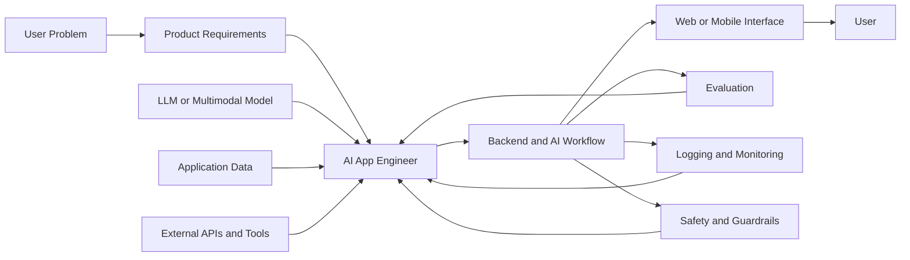
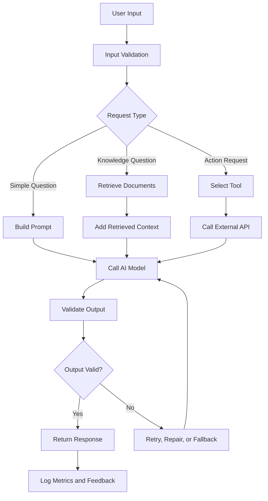
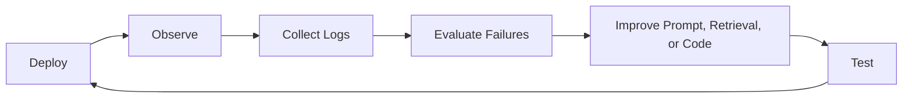
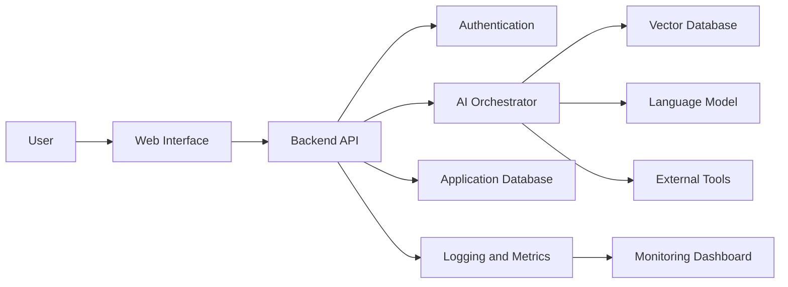

# 007 — AI App Engineer

| Attribute              | Details                         |
| ---------------------- | ------------------------------- |
| **Course Section**     | 05 — Production and Portfolio   |
| **Module**             | Module 15 — Portfolio Projects  |
| **Content Group**      | Career Fit                      |
| **Roadmap Source**     | Portfolio Projects / Career Fit |
| **Lesson Type**        | Portfolio                       |
| **Lesson Order**       | 007                             |
| **Suggested Duration** | 18 minutes                      |

---

## 1. Lesson Overview

This lesson explains the role of an **AI App Engineer** in the context of modern AI engineering.

An AI App Engineer focuses on turning AI capabilities into useful, reliable, and deployable software products. The role is not limited to training machine learning models. Instead, it combines large language models, APIs, retrieval systems, agent tools, user interfaces, databases, evaluation, security, and production monitoring.

After completing this lesson, you should understand:

* What an AI App Engineer does.
* Where this role fits within the AI application development workflow.
* Which technical skills are most important for the role.
* How to demonstrate these skills through portfolio projects.
* How to turn an AI concept into a working application.

The central idea is simple:

> An AI App Engineer proves their ability by shipping working AI applications, not only by explaining AI concepts.

---

## 2. Learning Objectives

By the end of this lesson, you should be able to:

* Explain the role of an AI App Engineer in your own words.
* Identify where AI application engineering fits into the product development lifecycle.
* Distinguish an AI App Engineer from related roles such as ML Engineer, Data Scientist, and Backend Engineer.
* Build a small AI application using a model API, prompt, retrieval pipeline, tool, or multimodal feature.
* Document the architecture, setup process, evaluation results, and limitations of an AI project.
* Present a portfolio project that demonstrates production-oriented engineering skills.

---

## 3. What Is an AI App Engineer?

An **AI App Engineer** is a software engineer who builds applications powered by AI models.

The role focuses on connecting AI capabilities to real user needs. This usually involves integrating existing foundation models rather than training a large model from scratch.

An AI App Engineer may work with:

* Large language models.
* Image, audio, or vision models.
* Model APIs.
* Prompt engineering.
* Structured outputs.
* Embeddings and semantic search.
* Retrieval-Augmented Generation.
* Function calling and agent tools.
* Backend APIs.
* Web or mobile interfaces.
* Authentication and authorization.
* Logging and monitoring.
* Evaluation and safety systems.
* Cloud deployment.

A simple definition is:

> An AI App Engineer designs, builds, evaluates, deploys, and maintains applications that use AI models as part of their core functionality.

---

## 4. Where the Role Fits

AI App Engineering sits between raw AI models and end users.



The AI App Engineer connects several layers:

1. **User need**
2. **Application logic**
3. **AI model**
4. **Data and retrieval**
5. **Tools and external services**
6. **User interface**
7. **Evaluation and monitoring**
8. **Deployment and maintenance**

The model is only one component of the complete system.

---

## 5. Main Responsibilities

### 5.1 Understand the Product Problem

Before selecting a model or framework, the engineer must understand:

* Who will use the application?
* What problem does it solve?
* What input will the user provide?
* What output should the system produce?
* What errors would be unacceptable?
* How will success be measured?

For example, a legal document assistant requires stronger citation and reliability controls than a casual brainstorming chatbot.

---

### 5.2 Select the AI Capability

The engineer chooses the most suitable AI capability for the problem.

Examples include:

| Problem                          | Possible AI Capability         |
| -------------------------------- | ------------------------------ |
| Answer questions about documents | RAG                            |
| Extract fields from invoices     | Structured output              |
| Search by meaning                | Embeddings and semantic search |
| Execute business operations      | Function calling               |
| Analyze screenshots              | Vision model                   |
| Transcribe meetings              | Speech-to-text                 |
| Generate spoken answers          | Text-to-speech                 |
| Coordinate multiple actions      | Agent workflow                 |

The best solution is not always the largest or most expensive model. The engineer must balance:

* Quality.
* Latency.
* Cost.
* Privacy.
* Reliability.
* Context-window size.
* Tool-calling ability.
* Structured-output support.

---

### 5.3 Design the AI Workflow

A typical AI application contains more than one model call.



The workflow may include:

* Input validation.
* Prompt construction.
* Context retrieval.
* Model invocation.
* Tool execution.
* Output parsing.
* Safety filtering.
* Retry logic.
* Fallback behavior.
* Logging.
* User feedback.

---

### 5.4 Build the Application Layer

The AI capability must be integrated into a real application.

This may require:

* REST or GraphQL APIs.
* Streaming responses.
* Databases.
* Caching.
* File processing.
* Background jobs.
* Authentication.
* Rate limiting.
* Frontend state management.
* Error messages.
* Usage limits.
* User history.

For example, a streaming chatbot may need:

```text
Frontend
   ↓
POST /api/chat
   ↓
Authentication and rate limiting
   ↓
Conversation history
   ↓
Prompt construction
   ↓
LLM streaming API
   ↓
Server-Sent Events
   ↓
Live response in the UI
```

---

### 5.5 Evaluate the System

A working demo is not enough. The engineer must determine whether the application works consistently.

Evaluation may include:

* Answer correctness.
* Citation accuracy.
* Retrieval relevance.
* Structured-output validity.
* Tool-selection accuracy.
* Task-completion rate.
* Response latency.
* Token usage.
* Cost per request.
* Safety violations.
* User satisfaction.

Example evaluation table:

| Metric               |      Target | Example Result |
| -------------------- | ----------: | -------------: |
| Answer correctness   |       ≥ 85% |            88% |
| Citation accuracy    |       ≥ 95% |            97% |
| Valid JSON output    |       ≥ 99% |          99.4% |
| P95 latency          | < 5 seconds |    4.3 seconds |
| Tool-call success    |       ≥ 95% |            96% |
| Unsafe response rate |        < 1% |           0.4% |

Evaluation transforms a project from a simple demo into an engineering artifact.

---

### 5.6 Deploy and Monitor the Application

After deployment, the system must be observable.

Important production signals include:

* Request count.
* Error rate.
* Response latency.
* Model latency.
* Token usage.
* Cost per request.
* Retrieval failures.
* Tool-call failures.
* User feedback.
* Safety events.

A production loop looks like this:



AI applications require continuous improvement because model behavior is probabilistic and user inputs are unpredictable.

---

## 6. AI App Engineer vs. Related Roles

### 6.1 AI App Engineer vs. Machine Learning Engineer

| AI App Engineer                               | Machine Learning Engineer                        |
| --------------------------------------------- | ------------------------------------------------ |
| Builds applications around AI models          | Builds and operates ML systems                   |
| Often integrates foundation-model APIs        | Often trains, tunes, or serves models            |
| Focuses heavily on product and UX             | Focuses heavily on model infrastructure          |
| Uses prompts, RAG, tools, and agents          | Uses training pipelines and feature systems      |
| Measures task success and application quality | Measures model performance and system efficiency |

There is significant overlap, especially in smaller teams.

---

### 6.2 AI App Engineer vs. Data Scientist

| AI App Engineer                             | Data Scientist                               |
| ------------------------------------------- | -------------------------------------------- |
| Ships AI-powered products                   | Analyzes data and builds experiments         |
| Focuses on production applications          | Focuses on insights and statistical modeling |
| Builds APIs, workflows, and interfaces      | Builds notebooks, reports, and models        |
| Owns deployment and application reliability | Often hands models to engineering teams      |

---

### 6.3 AI App Engineer vs. Backend Engineer

| AI App Engineer                                 | Backend Engineer                               |
| ----------------------------------------------- | ---------------------------------------------- |
| Builds AI-specific workflows                    | Builds general application services            |
| Handles probabilistic model output              | Handles mostly deterministic logic             |
| Works with prompts, embeddings, and evaluations | Works with databases, APIs, and business rules |
| Designs AI fallback and guardrail systems       | Designs service reliability and data integrity |

A strong AI App Engineer still needs solid backend engineering fundamentals.

---

## 7. Core Skill Areas

An effective AI App Engineer combines several skill groups.

### 7.1 Software Engineering

* Python or JavaScript/TypeScript.
* API design.
* Git and version control.
* Testing.
* Databases.
* Docker.
* Cloud deployment.
* Authentication.
* Error handling.

### 7.2 AI Integration

* Model APIs.
* Prompt engineering.
* Structured outputs.
* Function calling.
* Token management.
* Streaming.
* Context-window management.
* Model selection.

### 7.3 Retrieval and Data

* Embeddings.
* Vector databases.
* Chunking.
* Metadata filtering.
* Hybrid search.
* Reranking.
* Citation generation.
* Document processing.

### 7.4 AI Agents

* Tool definitions.
* Tool selection.
* Planning.
* ReAct-style workflows.
* State management.
* Permission control.
* Loop limits.
* Human approval.

### 7.5 Production Engineering

* Logging.
* Monitoring.
* Evaluation.
* Caching.
* Retries.
* Rate limiting.
* Cost tracking.
* Security.
* Guardrails.

### 7.6 Product and UX

* User problem definition.
* Conversation design.
* Loading states.
* Error states.
* User feedback.
* Explainability.
* Trust and transparency.
* Accessibility.

---

## 8. From Feature Idea to Working Demo

Consider a small feature:

> Build an assistant that answers questions about a company's product documentation.

### Input

```text
User question:
"How do I reset my API key?"
```

### Process

```text
1. Validate the question.
2. Convert the question into an embedding.
3. Search the vector database.
4. Retrieve relevant documentation chunks.
5. Build a prompt using the retrieved context.
6. Ask the model to answer using only that context.
7. Return the answer with source citations.
8. Record latency, token usage, retrieval scores, and feedback.
```

### Output

```text
You can reset your API key from Settings → Developer → API Keys.

1. Select the key you want to replace.
2. Click "Rotate Key."
3. Copy the new key immediately.
4. Update your application configuration.

Source: Developer Guide, "Managing API Keys"
```

### Potential Failure

```text
The retrieval system returns an outdated document.
```

### Possible Fix

```text
- Add document-version metadata.
- Filter results by the latest version.
- Display the source date.
- Create an evaluation case for version-sensitive questions.
```

This example demonstrates application design, retrieval, prompting, citations, debugging, and evaluation.

---

## 9. Portfolio Evidence

A portfolio should prove that you can build and ship a complete AI application.

A strong project should include the following components.

### 9.1 Clear Problem Statement

Explain:

* Who the application is for.
* What problem it solves.
* Why AI is appropriate.
* What the application does not attempt to solve.

Example:

> Customer-support teams spend too much time searching product documentation. This application provides cited answers from approved internal documents.

---

### 9.2 Architecture Diagram

Include the main technical components.



The diagram should make the system understandable in less than one minute.

---

### 9.3 Setup Instructions

A reviewer should be able to run the project.

Example:

```bash
git clone https://github.com/example/ai-document-assistant.git
cd ai-document-assistant

cp .env.example .env
docker compose up --build
```

Document:

* Required dependencies.
* Environment variables.
* Database setup.
* Model provider configuration.
* Local development commands.
* Test commands.
* Deployment instructions.

Never commit real API keys to the repository.

---

### 9.4 Screenshots or Video

Useful portfolio evidence includes:

* Main application screen.
* Example user workflow.
* Citation display.
* Error state.
* Evaluation dashboard.
* Architecture diagram.
* Short demo video.
* Public deployment link.

A screenshot is especially useful when a recruiter does not have time to run the application.

---

### 9.5 Evaluation Results

Do not claim that the system is accurate without evidence.

Include:

* Evaluation dataset size.
* Test categories.
* Metrics.
* Baseline.
* Current result.
* Known failure cases.

Example:

```text
Evaluation dataset:
- 100 documentation questions
- 25 version-sensitive questions
- 20 questions with no valid answer

Results:
- Answer correctness: 87%
- Citation correctness: 96%
- Correct refusal when no answer exists: 82%
- Median latency: 2.6 seconds
- Average cost per request: $0.008
```

---

### 9.6 Known Limitations

Limitations demonstrate engineering maturity.

Examples:

* Retrieval quality decreases for short or ambiguous questions.
* The application supports only English documents.
* Tables inside scanned PDFs may not be extracted correctly.
* The system may produce incomplete answers when context is fragmented.
* Tool calls require user confirmation only for selected operations.
* The current evaluation dataset is too small for strong conclusions.

A good portfolio does not pretend that the system is perfect.

---

## 10. Recommended README Structure

```markdown
# Project Name

## Overview

## Problem

## Target Users

## Key Features

## Demo

## Screenshots

## Architecture

## Technology Stack

## How It Works

## Local Setup

## Environment Variables

## API Endpoints

## Evaluation

## Performance and Cost

## Safety and Security

## Known Limitations

## Future Improvements

## License
```

This structure allows recruiters and engineers to understand the project quickly.

---

## 11. Suggested Portfolio Projects

A strong AI App Engineer portfolio may include two or three well-developed projects.

### Project 1: PDF Q&A RAG Application

Demonstrates:

* File processing.
* Chunking.
* Embeddings.
* Vector search.
* RAG.
* Citations.
* Evaluation.
* Hallucination control.

### Project 2: AI Agent with Tool Calling

Demonstrates:

* Function calling.
* External API integration.
* Tool validation.
* Agent state.
* Permission controls.
* Error recovery.
* Audit logging.

### Project 3: Multimodal Assistant

Demonstrates:

* Image or audio input.
* Multimodal model integration.
* File storage.
* Structured extraction.
* Streaming responses.
* User interface design.

It is better to publish two polished projects than ten incomplete demos.

---

## 12. Practical Exercise

Build or improve one small AI application feature.

Possible feature ideas:

* Streaming chatbot response.
* PDF question-answering endpoint.
* Semantic search.
* Structured invoice extraction.
* AI agent that calls a weather or calendar API.
* Image-analysis feature.
* Token and cost dashboard.
* User feedback collection.

### Required Steps

1. Define the user problem.
2. Choose the AI capability.
3. Draw the system architecture.
4. Implement the smallest useful workflow.
5. Add error handling.
6. Test at least ten examples.
7. Record latency and token usage.
8. Document one failure case.
9. Add a screenshot or demo video.
10. Update the project README.

### Exercise Template

```text
Project:
[Project name]

User problem:
[What problem does the feature solve?]

Input:
[What does the user provide?]

AI capability:
[Prompt, RAG, tool calling, vision, audio, or another capability]

Workflow:
[Describe the main processing steps]

Output:
[What does the user receive?]

Metrics:
[Latency, tokens, cost, quality, and safety]

Failure case:
[Describe one example that does not work well]

Improvement:
[Explain how you would improve it]
```

---

## 13. Common Mistakes

### 13.1 Learning Definitions Without Building

Knowing the meaning of RAG or function calling is not enough. Employers want evidence that you can use these concepts in a working application.

**Improvement:** Build a small end-to-end demo for every major concept.

---

### 13.2 Showing Only the Happy Path

A demo may work for one carefully selected example but fail on realistic inputs.

Common edge cases include:

* Empty input.
* Very long input.
* Unsupported file types.
* Ambiguous requests.
* Missing retrieval results.
* Invalid model output.
* Tool timeouts.
* Rate limits.
* Prompt injection attempts.

**Improvement:** Include edge-case tests and visible error handling.

---

### 13.3 Treating the Model as the Entire Application

A model API call is not a complete product.

A real application also requires:

* Validation.
* State management.
* Data storage.
* Error handling.
* Security.
* Monitoring.
* Evaluation.
* User experience.

---

### 13.4 Ignoring Cost and Latency

An application may produce good answers but still be impractical if it is too slow or expensive.

**Improvement:** Track:

* Input tokens.
* Output tokens.
* Total model cost.
* End-to-end latency.
* Retrieval latency.
* Tool latency.
* Cache hit rate.

---

### 13.5 Hiding Limitations

Recruiters and technical reviewers know that AI systems have limitations.

**Improvement:** Clearly document assumptions, trade-offs, unresolved questions, and known failure cases.

---

### 13.6 Publishing an Incomplete README

A repository without clear setup instructions is difficult to review.

**Improvement:** Test your README by following it from a clean environment.

---

### 13.7 Adding Too Many Frameworks

Using many frameworks does not automatically make a project impressive.

**Improvement:** Select tools because they solve a specific problem. Keep the architecture understandable.

---

## 14. Completion Checklist

### Understanding

* [ ] I can explain the role of an AI App Engineer in one or two minutes.
* [ ] I understand how this role differs from Data Scientist and ML Engineer.
* [ ] I can identify the model, prompt, retrieval, tool, safety, cost, and UX components of an AI application.

### Implementation

* [ ] I have built a small working AI application or feature.
* [ ] My application handles at least one error or edge case.
* [ ] I have tested the application with multiple inputs.
* [ ] I have recorded at least one quality metric.
* [ ] I have measured latency, token usage, or cost.

### Portfolio

* [ ] My project has a clear README.
* [ ] My repository includes an architecture diagram.
* [ ] I have included screenshots or a demo video.
* [ ] I have documented the setup process.
* [ ] I have described known limitations.
* [ ] I have listed future improvements.
* [ ] I have added a deployment link when available.

### Production Awareness

* [ ] Secrets are stored in environment variables.
* [ ] Inputs are validated.
* [ ] Errors are logged.
* [ ] Model failures have fallback behavior.
* [ ] Safety risks have been considered.
* [ ] User data is handled appropriately.

---

## 15. Career Outcome

The goal is to build a portfolio that proves you can ship real AI applications, not merely explain AI concepts.

A strong portfolio should demonstrate that you can:

* Translate a user problem into a technical solution.
* Integrate AI models into production software.
* Build reliable APIs and user interfaces.
* Evaluate output quality.
* Handle errors and edge cases.
* Measure latency, usage, and cost.
* Deploy and monitor an application.
* Communicate trade-offs and limitations.

Recruiters usually gain more confidence from a working product with clear documentation than from a long list of certificates.

---

## 16. Related Project Goal

Publish **two or three strong AI projects** containing:

* A clear problem statement.
* A working application.
* A clean repository.
* Setup instructions.
* Screenshots or demo videos.
* Architecture notes.
* Evaluation results.
* Performance and cost metrics.
* Safety considerations.
* Known limitations.
* A deployment link when possible.

A recommended portfolio combination is:

```text
Project 1: RAG application with citations
Project 2: AI agent with tool calling
Project 3: Multimodal application with production monitoring
```

Together, these projects demonstrate retrieval, agent workflows, multimodal AI, backend development, evaluation, deployment, and product thinking.

---

## 17. Review Questions

1. What is the main responsibility of an AI App Engineer?
2. Why is a model API call not considered a complete AI application?
3. Where does an AI App Engineer fit between an AI model and the end user?
4. What is the difference between an AI App Engineer and a Machine Learning Engineer?
5. Why should a portfolio project include evaluation results?
6. Which metrics can be used to evaluate an AI application?
7. Why are known limitations valuable in a project README?
8. What should happen when an AI model returns invalid output?
9. Which production signals should an AI application monitor?
10. What two or three projects would best demonstrate your AI application engineering skills?

---

## 18. Key Takeaways

* An AI App Engineer turns AI capabilities into usable software products.
* The role combines AI integration, software engineering, product thinking, evaluation, and production operations.
* A complete AI application includes more than a model call.
* Strong projects include documentation, architecture, testing, evaluation, monitoring, and known limitations.
* Employers want evidence that you can solve real problems and ship working products.
* Two or three polished projects are more valuable than many unfinished experiments.
* Every concept should become a practical artifact such as an API route, RAG workflow, agent tool, multimodal feature, dashboard, or deployed application.

---

## 19. Summary

**AI App Engineer** is an important career direction within the modern AI Engineer roadmap.

The role focuses on building complete applications around AI models. This includes understanding user problems, selecting the appropriate model, designing prompts and retrieval workflows, integrating tools, creating APIs and interfaces, evaluating quality, managing cost, applying safety controls, and deploying the system.

To develop this skill, convert each concept you learn into something practical:

```text
Concept
   ↓
Small feature
   ↓
Working application
   ↓
Testing and evaluation
   ↓
Documentation
   ↓
Deployment
   ↓
Portfolio evidence
```

Your portfolio should show that you can move from an idea to a reliable, measurable, and usable AI product.

---

# Bài luyện tập

## Mục tiêu


## Đề bài


## Yêu cầu hoàn thành

- [ ] 
- [ ] 
- [ ] 

## Kết quả / lời giải


## Ghi chú
