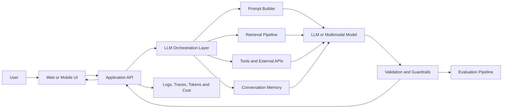
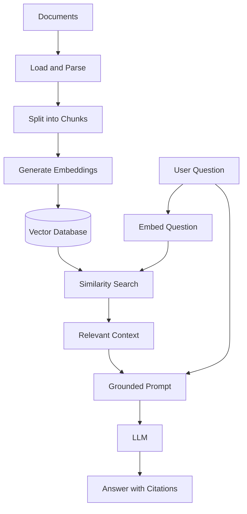
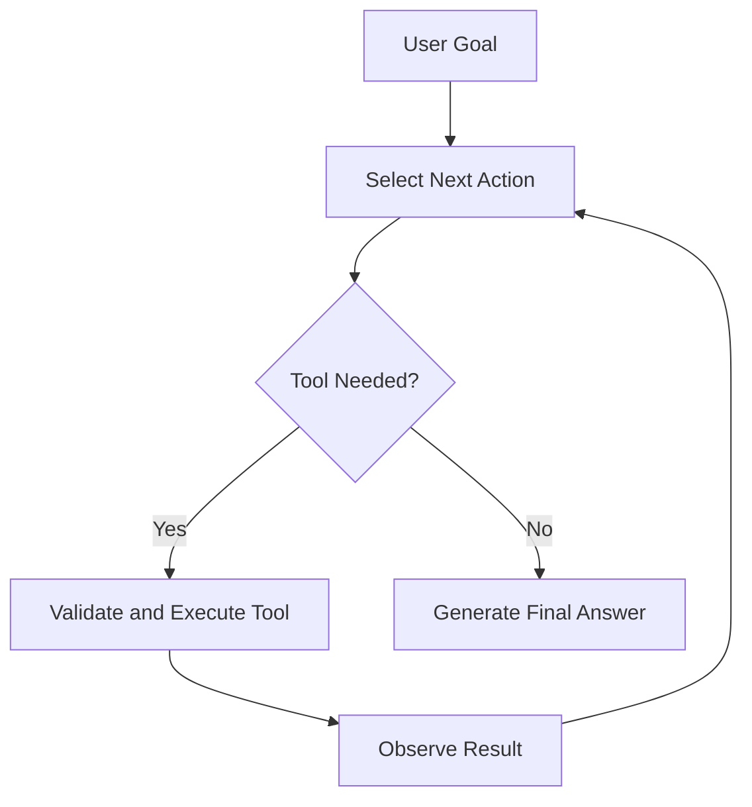
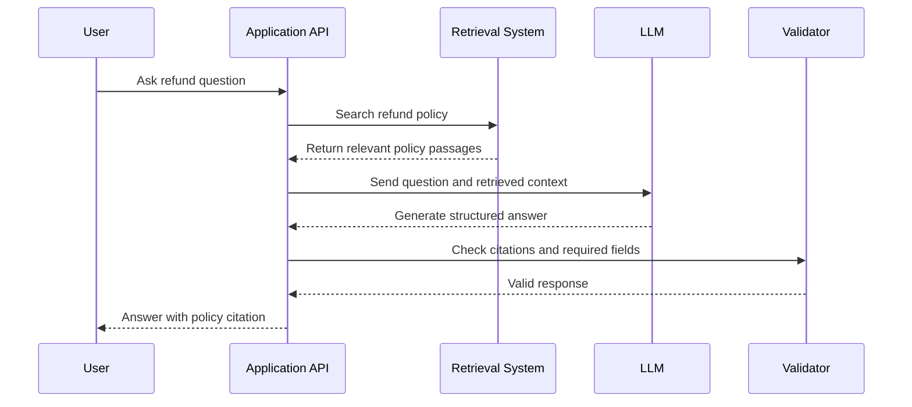

# 008 — LLM Engineer

**Course:** 05 — Production and Portfolio
**Module:** Module 15 — Portfolio Projects
**Content Group:** Career Fit
**Roadmap Source:** Portfolio Projects / Career Fit
**Lesson Type:** Portfolio
**Lesson Order:** 008
**Suggested Duration:** 18 minutes

---

## 1. Overview

An **LLM Engineer** designs, builds, evaluates, and operates applications powered by large language models.

The role is not limited to writing prompts. An LLM Engineer connects models to real software systems through:

* Model APIs
* Prompt templates
* Structured outputs
* Retrieval-Augmented Generation
* Tool and function calling
* AI agents
* Evaluation pipelines
* Safety guardrails
* Logging and observability
* Cost and latency optimization

The main goal is to transform a general-purpose language model into a reliable product feature.

After this lesson, you should understand:

* What an LLM Engineer does
* Where this role fits in the AI application workflow
* How it differs from related AI roles
* Which technical skills employers expect
* How to demonstrate LLM engineering skills through portfolio projects

---

## 2. Learning Objectives

By the end of this lesson, you should be able to:

* Explain the role of an LLM Engineer in your own words.
* Identify the responsibilities of an LLM Engineer in a production AI system.
* Distinguish an LLM Engineer from an AI App Engineer, ML Engineer, and Research Engineer.
* Design a basic LLM application architecture.
* Apply LLM engineering concepts to prompts, APIs, RAG pipelines, tools, agents, or multimodal applications.
* Document model quality, latency, token usage, cost, safety, and known limitations.
* Build a portfolio project that demonstrates practical LLM engineering ability.

---

## 3. What Is an LLM Engineer?

An LLM Engineer is a software-oriented AI engineer who specializes in building systems around large language models.

The model is only one component. The engineer must also design everything surrounding it:

```text
User Interface
      ↓
Application Backend
      ↓
Prompt and Context Construction
      ↓
LLM or Multimodal Model
      ↓
Structured Output / Tool Call
      ↓
Validation and Business Logic
      ↓
Response to User
```

A production LLM feature usually requires more than sending a single prompt to a model.

For example, a document question-answering application may need to:

1. Accept an uploaded document.
2. Extract and clean its text.
3. Divide the text into searchable chunks.
4. Generate embeddings.
5. Store vectors in a vector database.
6. Retrieve relevant passages for each question.
7. Construct a grounded prompt.
8. Generate an answer.
9. Attach citations.
10. Validate the output.
11. Log latency, tokens, cost, and errors.
12. Evaluate whether the answer is correct and supported.

Designing and implementing this complete workflow is LLM engineering.

---

## 4. Position in the AI Application Workflow

An LLM Engineer typically works between the application layer and the model layer.



The LLM Engineer is often responsible for the orchestration layer, including:

* Prompt construction
* Context management
* Model selection
* Retrieval
* Tool execution
* Output validation
* Error handling
* Evaluation
* Monitoring

---

## 5. Main Responsibilities

### 5.1 Model Integration

An LLM Engineer integrates applications with model providers or self-hosted models.

Typical tasks include:

* Calling model APIs
* Managing API keys securely
* Selecting models based on quality, speed, and cost
* Configuring temperature and token limits
* Implementing streaming responses
* Handling timeouts, rate limits, and provider failures
* Creating fallback strategies between models

Example:

```python
from openai import OpenAI

client = OpenAI()

response = client.responses.create(
    model="your-selected-model",
    input=[
        {
            "role": "system",
            "content": "You are a concise technical assistant."
        },
        {
            "role": "user",
            "content": "Explain vector embeddings in simple terms."
        }
    ]
)

print(response.output_text)
```

In production, this call should also include:

* Input validation
* Error handling
* Logging
* Timeout control
* Retry logic
* Usage tracking
* Output validation

---

### 5.2 Prompt Engineering

Prompt engineering is the process of designing instructions and context that guide the model toward a useful output.

A strong prompt often contains:

```text
Role
+ Task
+ Context
+ Constraints
+ Output Format
+ Examples
+ Failure Behavior
```

Example:

```text
Role:
You are a technical documentation assistant.

Task:
Summarize the supplied API documentation.

Constraints:
- Use only the provided context.
- Do not invent endpoints or parameters.
- State when the context is insufficient.
- Keep the answer under 200 words.

Output format:
Return JSON with:
- summary
- key_endpoints
- limitations
```

An LLM Engineer should treat prompts as version-controlled application code rather than temporary text.

Prompts should be:

* Stored in source control
* Tested against representative examples
* Compared across versions
* Protected from untrusted input
* Evaluated for consistency and failure cases

---

### 5.3 Structured Output

Free-form text is difficult for applications to process reliably. Structured output allows the model to return predictable data.

Example schema:

```json
{
  "category": "billing",
  "priority": "high",
  "summary": "The customer was charged twice.",
  "requires_human_review": true
}
```

Structured output is useful for:

* Ticket classification
* Data extraction
* Content moderation
* Workflow routing
* Form generation
* Agent planning
* Database updates

The application must still validate the result.

```python
from pydantic import BaseModel, Field
from typing import Literal


class TicketResult(BaseModel):
    category: Literal["billing", "technical", "account", "other"]
    priority: Literal["low", "medium", "high"]
    summary: str = Field(min_length=1, max_length=300)
    requires_human_review: bool
```

A production system should never assume that model output is valid simply because a schema was requested.

---

### 5.4 Retrieval-Augmented Generation

Retrieval-Augmented Generation, or RAG, gives the model access to external knowledge at request time.

A basic RAG workflow is:



An LLM Engineer working on RAG must make decisions about:

* Document parsing
* Chunk size and overlap
* Metadata design
* Embedding model
* Vector database
* Retrieval strategy
* Reranking
* Context limits
* Citation generation
* Groundedness evaluation

A weak RAG system retrieves irrelevant context. A strong RAG system retrieves the smallest set of evidence required to answer accurately.

---

### 5.5 Tool and Function Calling

Tool calling allows a model to request actions from trusted application code.

Possible tools include:

* Search a product database
* Check calendar availability
* Retrieve an order
* Calculate a value
* Query an internal API
* Send a notification
* Create a support ticket

Example tool definition:

```python
def get_order_status(order_id: str) -> dict:
    """
    Retrieve the latest status of an order.

    The function should validate the order ID,
    authenticate the request, and return safe data only.
    """
    return {
        "order_id": order_id,
        "status": "in_transit"
    }
```

The model does not directly perform the action. It produces a structured tool request, and the application decides whether the request is valid and authorized.

A safe tool workflow is:

```text
Model proposes a tool call
        ↓
Application validates arguments
        ↓
Authorization and policy checks
        ↓
Application executes the tool
        ↓
Tool result returns to the model
        ↓
Model produces the final response
```

Important controls include:

* Tool allowlists
* Argument validation
* User authorization
* Confirmation for sensitive actions
* Execution timeouts
* Idempotency
* Audit logs

---

### 5.6 Agent Workflows

An AI agent uses a model to decide which steps or tools are needed to complete a task.

A simple agent loop may look like this:



Agents are useful when a task requires dynamic decisions. However, they introduce additional risks:

* Repeated or infinite tool calls
* High token usage
* Unexpected actions
* Unclear failure states
* Difficult debugging
* Slow response times

A production agent should have:

* A maximum step count
* A clear tool allowlist
* Per-tool permissions
* Time and cost budgets
* Trace logging
* Human approval for sensitive actions
* A deterministic fallback path

---

### 5.7 Evaluation

An LLM application cannot be evaluated only by checking whether it produces a fluent response.

Evaluation should measure whether the application is:

* Correct
* Relevant
* Grounded
* Safe
* Consistent
* Fast enough
* Affordable
* Useful to the user

Example evaluation dataset:

```json
[
  {
    "input": "What is the refund period?",
    "expected_facts": [
      "Refund requests are accepted within 30 days."
    ],
    "must_include_citation": true
  },
  {
    "input": "Can I request a refund after 60 days?",
    "expected_behavior": "Explain that the standard period has expired.",
    "must_include_citation": true
  }
]
```

Common evaluation methods include:

* Exact-match checks
* Keyword or rule-based checks
* Schema validation
* Human review
* Model-based evaluation
* Retrieval relevance measurement
* Citation verification
* Regression testing
* A/B testing

A practical evaluation pipeline is:

```text
Test Dataset
    ↓
Run Application Version
    ↓
Collect Responses and Traces
    ↓
Calculate Quality Metrics
    ↓
Review Failed Cases
    ↓
Improve Prompt, Retrieval, Model, or Logic
    ↓
Run Tests Again
```

---

### 5.8 Observability

Observability helps engineers understand what happened during each LLM request.

Useful information includes:

* Request ID
* User or session ID
* Model name
* Prompt version
* Retrieval results
* Tool calls
* Input tokens
* Output tokens
* Estimated cost
* Total latency
* Provider latency
* Error type
* Validation result
* Safety result
* User feedback

Example log structure:

```json
{
  "request_id": "req_123",
  "feature": "document_qa",
  "model": "selected-model",
  "prompt_version": "rag_answer_v3",
  "input_tokens": 1840,
  "output_tokens": 275,
  "latency_ms": 2210,
  "retrieved_chunks": 5,
  "tool_calls": 0,
  "estimated_cost_usd": 0.012,
  "status": "success"
}
```

Sensitive prompt content should not automatically be stored in logs. Logging policies should account for privacy, security, and retention requirements.

---

## 6. LLM Engineer Technology Stack

A typical LLM engineering stack may include the following layers.

| Layer         | Examples of Responsibilities                         |
| ------------- | ---------------------------------------------------- |
| Frontend      | Chat UI, streaming display, citations, file upload   |
| Backend       | API routes, authentication, sessions, business logic |
| Model Layer   | Provider SDKs, routing, fallback, retries            |
| Prompt Layer  | Templates, variables, prompt versions                |
| Retrieval     | Parsing, chunking, embeddings, search, reranking     |
| Tool Layer    | Function schemas, validation, authorization          |
| Data Layer    | SQL databases, object storage, vector databases      |
| Evaluation    | Test datasets, graders, regression tests             |
| Observability | Logs, traces, latency, tokens, cost                  |
| Safety        | Input filtering, output validation, permissions      |
| Deployment    | Containers, CI/CD, secrets, scaling                  |

An LLM Engineer does not need to master every tool. However, the engineer should understand how these layers interact.

---

## 7. LLM Engineer vs. Related Roles

### 7.1 LLM Engineer vs. AI App Engineer

An **AI App Engineer** often focuses more broadly on the complete product experience:

* Frontend
* Backend
* AI integration
* User workflow
* Deployment

An **LLM Engineer** usually focuses more deeply on:

* Model behavior
* Prompt systems
* Context construction
* RAG
* Tool calling
* Agents
* Evaluation
* Model quality
* Token and cost optimization

In a small team, one person may perform both roles.

---

### 7.2 LLM Engineer vs. Machine Learning Engineer

A traditional **Machine Learning Engineer** may work on:

* Training pipelines
* Feature engineering
* Model deployment
* Prediction services
* Data processing
* Classical ML models

An LLM Engineer often works with pretrained foundation models and builds application systems around them.

The roles overlap when the project includes:

* Fine-tuning
* Model serving
* Embedding models
* Dataset preparation
* Model evaluation
* Inference optimization

---

### 7.3 LLM Engineer vs. Research Engineer

A **Research Engineer** may focus on:

* New model architectures
* Training methods
* Experimental algorithms
* Large-scale model training
* Research reproduction

An LLM Engineer is usually more product-oriented:

* Integrating existing models
* Building reliable workflows
* Measuring user-facing quality
* Shipping production features
* Managing latency, safety, and cost

---

## 8. Core Skills

### 8.1 Software Engineering

Important software engineering skills include:

* Python or TypeScript
* REST APIs
* Async programming
* Databases
* Git
* Docker
* Testing
* Authentication
* Error handling
* Cloud deployment

An LLM feature is still a software feature. Poor software engineering cannot be fixed with a better prompt.

---

### 8.2 LLM Fundamentals

You should understand:

* Tokens
* Context windows
* Temperature
* Sampling
* System and user messages
* Embeddings
* Tool calling
* Structured generation
* Hallucination
* Model limitations
* Prompt injection

You do not need to train a foundation model, but you should understand how model behavior affects application design.

---

### 8.3 Data and Retrieval

Useful skills include:

* Text preprocessing
* Metadata design
* Chunking
* Embeddings
* Similarity search
* Hybrid search
* Reranking
* SQL
* Vector databases

---

### 8.4 Evaluation and Testing

You should know how to:

* Create test cases
* Build representative datasets
* Define measurable criteria
* Test edge cases
* Compare model versions
* Detect regressions
* Review failures
* Measure retrieval quality
* Validate citations

---

### 8.5 Production Engineering

Production skills include:

* Logging
* Tracing
* Monitoring
* Rate limiting
* Caching
* Retries
* Circuit breakers
* Cost budgets
* Secrets management
* Privacy controls
* Incident handling

---

## 9. Practical Example: Support Assistant

Consider an AI assistant that answers customer support questions.

### Input

```text
A customer asks:

“I cancelled my subscription yesterday. When will the refund arrive?”
```

### Processing Workflow



### Expected Output

```json
{
  "answer": "Approved refunds normally appear within 5–10 business days, depending on the payment provider.",
  "citations": [
    {
      "document": "Refund Policy",
      "section": "Processing Time"
    }
  ],
  "requires_human_support": false
}
```

### Possible Failure Cases

* The retrieval system returns an outdated policy.
* The model invents a refund date.
* The response does not include a citation.
* The customer asks about an unsupported payment provider.
* The retrieved context contains prompt injection instructions.
* The response leaks information from another customer.
* The model gives a confident answer when evidence is missing.

### Engineering Improvements

* Filter documents by policy version.
* Add metadata for country and payment method.
* Require citations for factual claims.
* Add an insufficient-evidence response.
* Validate the structured output.
* Test for cross-user data leakage.
* Add human escalation rules.
* Log retrieval results and prompt version.

---

## 10. Portfolio Project Structure

A strong LLM Engineer portfolio project should demonstrate more than a working chatbot.

Recommended project structure:

```text
llm-project/
├── app/
│   ├── api/
│   ├── prompts/
│   ├── retrieval/
│   ├── tools/
│   ├── models/
│   ├── safety/
│   └── observability/
├── evals/
│   ├── datasets/
│   ├── graders/
│   └── reports/
├── tests/
├── docs/
│   ├── architecture.md
│   └── limitations.md
├── screenshots/
├── Dockerfile
├── README.md
├── requirements.txt
└── .env.example
```

---

## 11. What Employers Want to See

A strong portfolio should prove that you can build and operate an AI application.

Employers are usually more interested in a working product than in a list of completed courses.

Your project should show:

### Problem Definition

Explain:

* Who the users are
* What problem they have
* Why an LLM is useful
* What success means

### Architecture

Include:

* Application components
* Model provider
* Retrieval system
* Database
* Tools
* Safety controls
* Logging and evaluation

### Working Demo

Provide:

* Screenshots
* A short demonstration video
* Example inputs and outputs
* A deployment link when available

### Evaluation

Report:

* Test dataset size
* Response quality
* Retrieval accuracy
* Citation correctness
* Latency
* Token usage
* Estimated cost
* Safety test results

### Limitations

Document:

* Unsupported queries
* Known failure cases
* Data limitations
* Model limitations
* Privacy concerns
* Future improvements

A project with clearly documented limitations is more credible than a project that claims perfect performance.

---

## 12. Recommended Portfolio Projects

### Project 1: PDF Q&A Application

Demonstrate:

* Document parsing
* Chunking
* Embeddings
* Vector search
* Grounded answering
* Citations
* Evaluation

### Project 2: Tool-Calling Assistant

Demonstrate:

* Function schemas
* Argument validation
* Authorization
* Tool execution
* Error recovery
* Audit logs

### Project 3: Production LLM Service

Demonstrate:

* API design
* Streaming
* Model fallback
* Logging
* Token and cost tracking
* Rate limiting
* Safety checks
* Deployment

Two or three polished projects are usually stronger than many incomplete demos.

---

## 13. Practical Demo

### Input

```text
A small AI application feature:

Classify incoming support messages and generate a suggested response.
```

### Process

```text
1. Validate the incoming request.
2. Remove or mask sensitive information.
3. Send the message to an LLM.
4. Request structured classification output.
5. Validate the returned schema.
6. Retrieve relevant support policy.
7. Generate a grounded draft response.
8. Run safety and policy checks.
9. Log latency, tokens, cost, and prompt version.
10. Return the result to the support interface.
```

### Output

```json
{
  "classification": {
    "category": "billing",
    "priority": "medium"
  },
  "suggested_response": "I’m sorry about the unexpected charge. I’ll help you review the billing details and determine the next step.",
  "requires_human_review": true,
  "latency_ms": 1760,
  "estimated_cost_usd": 0.006
}
```

### Debugging Notes

Possible problems:

* Invalid JSON output
* Incorrect category
* Unsupported policy claim
* Slow retrieval
* Provider timeout
* Excessive token usage
* Unsafe or inappropriate response

Possible fixes:

* Add schema validation.
* Improve examples in the classification prompt.
* Require retrieved evidence.
* Reduce unnecessary context.
* Add timeout and retry logic.
* Use a smaller model for classification.
* Add policy-based output checks.

---

## 14. Hands-On Exercise

Build or improve one small LLM application.

### Step 1: Select a Feature

Choose one:

* Chat assistant
* Document Q&A
* Semantic search
* Information extraction
* Ticket classification
* Tool-calling assistant
* Agent workflow
* Image or audio analysis

### Step 2: Define the Problem

Write:

```text
User:
Problem:
Why an LLM is useful:
Expected output:
Success criteria:
```

### Step 3: Draw the Architecture

Include:

* User interface
* Backend API
* Prompt layer
* Model
* Retrieval or tools
* Validation
* Logs
* Evaluation

### Step 4: Implement the Core Workflow

Your application should include at least:

* One model API call
* Input validation
* Error handling
* Structured output or citations
* Logging

### Step 5: Add Evaluation

Create at least 10 test cases covering:

* Normal inputs
* Ambiguous inputs
* Missing information
* Invalid input
* Long input
* Prompt injection
* Unsupported questions
* Safety-sensitive cases

### Step 6: Measure Production Metrics

Record:

* Median latency
* Slowest request
* Input tokens
* Output tokens
* Estimated cost per request
* Success rate
* Validation failure rate
* Quality test score

### Step 7: Write the README

Your README should contain:

```markdown
# Project Name

## Problem

## Users

## Main Features

## Architecture

## Technology Stack

## Setup

## Environment Variables

## API Usage

## Demo

## Evaluation

## Performance and Cost

## Safety

## Known Limitations

## Future Improvements
```

### Step 8: Publish the Project

Add:

* Screenshots
* A demonstration video
* Example requests
* Example responses
* Architecture diagram
* Deployment link, when available

---

## 15. Common Mistakes

### 15.1 Learning Definitions Without Building

Knowing what RAG or tool calling means is not enough.

Build a small working feature that demonstrates the concept.

---

### 15.2 Treating Prompting as the Entire System

A prompt cannot replace:

* Input validation
* Business logic
* Authentication
* Retrieval
* Testing
* Monitoring
* Error handling

---

### 15.3 Ignoring Edge Cases

A successful happy path does not prove production readiness.

Test:

* Empty input
* Very long input
* Conflicting instructions
* Missing documents
* Invalid tool arguments
* Provider failure
* Unsupported questions
* Malicious prompts

---

### 15.4 Trusting Model Output Without Validation

Never directly:

* Execute generated code
* Run generated database queries
* Call tools with unchecked arguments
* Store unvalidated structured output
* Display unsafe output

Validate both data and permissions.

---

### 15.5 Using an LLM for Every Task

Some tasks are better handled by deterministic code.

Use standard code when:

* A formula is exact
* A database query is sufficient
* A rule is stable
* The result must be deterministic
* The task does not require language understanding

---

### 15.6 Ignoring Cost and Latency

A feature may work technically but fail as a product because it is too slow or expensive.

Track:

```text
Cost per Request
Cost per Active User
Average Latency
P95 Latency
Input Tokens
Output Tokens
Number of Model Calls
Number of Retrieval Calls
```

---

### 15.7 Hiding Limitations

Do not claim that your system is fully accurate.

Document:

* What it can do
* What it cannot do
* When users should verify results
* When human review is required

---

## 16. Completion Checklist

### Understanding

* [ ] I can explain the role of an LLM Engineer in one or two minutes.
* [ ] I understand where LLM engineering fits in an AI application architecture.
* [ ] I can distinguish an LLM Engineer from related engineering roles.
* [ ] I understand the roles of prompts, retrieval, tools, evaluation, and observability.

### Implementation

* [ ] I have built a small working LLM application or feature.
* [ ] My application includes input validation and error handling.
* [ ] I use structured output, citations, tools, or another reliable integration pattern.
* [ ] I have tested normal and edge-case inputs.
* [ ] I have recorded at least one known limitation.

### Production Readiness

* [ ] I measure latency.
* [ ] I track token usage and estimated cost.
* [ ] I log model and prompt versions.
* [ ] I have basic safety checks.
* [ ] I have a fallback behavior for model or retrieval failure.

### Portfolio

* [ ] My project has a clear README.
* [ ] I included an architecture diagram.
* [ ] I included screenshots or a demonstration video.
* [ ] I documented setup instructions.
* [ ] I included evaluation results.
* [ ] I documented known limitations and future improvements.

---

## 17. Related Outcome

Build a portfolio that proves you can design, implement, evaluate, and operate real LLM-powered applications—not merely explain AI concepts.

---

## 18. Related Project Goal

Publish two or three strong AI projects containing:

* Clear problem definitions
* Working demonstrations
* Architecture diagrams
* Setup documentation
* Screenshots or videos
* Evaluation results
* Latency and cost measurements
* Safety considerations
* Known limitations
* Deployment links when available

---

## 19. Summary

An **LLM Engineer** turns language models into reliable product features.

The role combines:

```text
Software Engineering
+ Model Integration
+ Prompt Engineering
+ Retrieval
+ Tool Calling
+ Evaluation
+ Safety
+ Observability
+ Product Thinking
```

The most important evidence of LLM engineering ability is not a certificate or a list of concepts. It is a working application with:

* Clear architecture
* Reliable outputs
* Measurable evaluation
* Safe tool usage
* Production monitoring
* Documented trade-offs
* Honest limitations

Turn this lesson into a practical artifact: a prompt system, API route, RAG workflow, tool-calling assistant, evaluation dashboard, multimodal feature, or deployed portfolio project.

---

# Bài luyện tập

## Mục tiêu


## Đề bài


## Yêu cầu hoàn thành

- [ ] 
- [ ] 
- [ ] 

## Kết quả / lời giải


## Ghi chú
