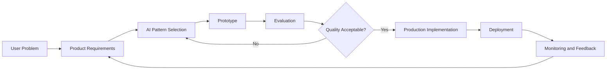
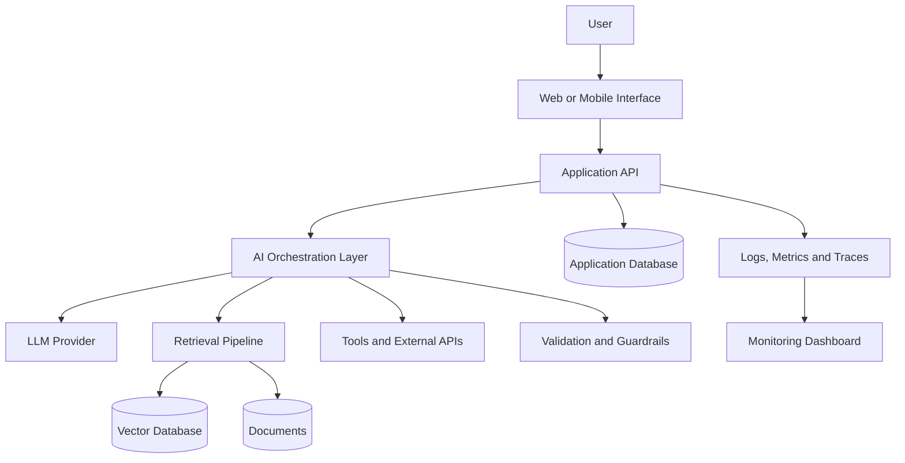
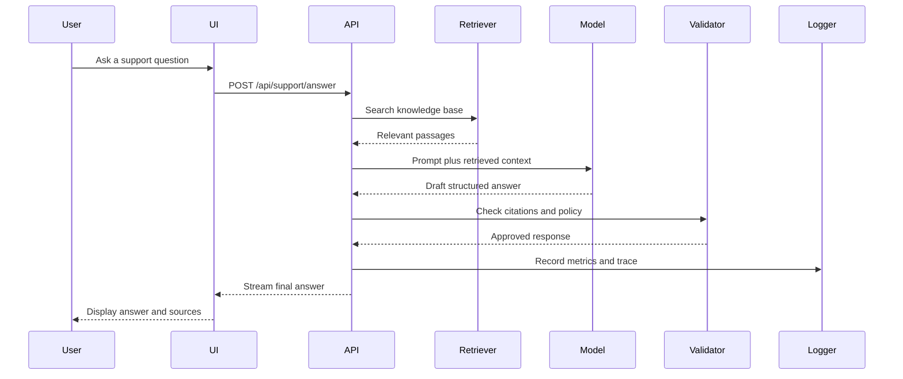
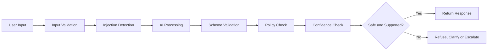

# 010 — AI Product Builder

| Field                  | Details                         |
| ---------------------- | ------------------------------- |
| **Course**             | 05 — Production and Portfolio   |
| **Module**             | Module 15 — Portfolio Projects  |
| **Content Group**      | Career Fit                      |
| **Roadmap Source**     | Portfolio Projects / Career Fit |
| **Lesson Type**        | Portfolio                       |
| **Order in Module**    | 010                             |
| **Suggested Duration** | 18 minutes                      |

---

## 1. Overview

An **AI Product Builder** turns artificial intelligence capabilities into useful, usable, and deployable products.

This role is not limited to choosing an AI model or writing prompts. An AI Product Builder connects several areas:

* User problems
* Product requirements
* User experience
* AI models
* Prompt engineering
* Retrieval-Augmented Generation
* Tool and API integration
* Evaluation
* Safety
* Cost management
* Deployment
* Monitoring

The goal is not simply to create an impressive AI demo. The goal is to build an AI-powered product that solves a real problem reliably.

After completing this lesson, you should understand where the AI Product Builder role fits in the modern AI engineering workflow and how to demonstrate these skills through portfolio projects.

---

## 2. Learning Objectives

By the end of this lesson, you should be able to:

* Explain the role of an AI Product Builder in your own words.
* Identify where product-building skills appear in the AI application lifecycle.
* Turn a user problem into a small AI product specification.
* Select an appropriate AI pattern, such as prompting, RAG, tool calling, or multimodal processing.
* Build and document a working AI product demo.
* Measure quality, latency, token usage, cost, safety, and user experience.
* Present the product clearly in a professional portfolio.

---

## 3. What Is an AI Product Builder?

An **AI Product Builder** is someone who can design, build, test, deploy, and improve an AI-powered product.

The role combines three major perspectives:

```text
Product Thinking
      +
AI Engineering
      +
Software Delivery
      =
AI Product Builder
```

### Product Thinking

The builder identifies:

* Who the user is
* What problem the user has
* Why the problem matters
* What outcome the user expects
* Which features are essential
* Which features can wait

### AI Engineering

The builder decides:

* Which model or provider to use
* Whether prompting alone is enough
* Whether external knowledge is required
* Whether the model needs tools
* How outputs should be validated
* How hallucinations should be reduced

### Software Delivery

The builder creates:

* APIs
* User interfaces
* Databases
* Authentication
* Logging
* Monitoring
* Tests
* Deployment pipelines
* Documentation

---

## 4. AI Product Builder Workflow

A typical AI product workflow begins with a user problem and ends with continuous improvement.



### Step 1: Identify the User Problem

Start with the problem, not the model.

Weak starting point:

> I want to build something with an LLM.

Better starting point:

> Students spend too much time searching through long course documents for specific answers.

The second statement provides a clear user, problem, and product opportunity.

### Step 2: Define the Product Outcome

Describe what success looks like.

Example:

> A student uploads a course PDF, asks a question, and receives a concise answer with page-level citations.

Possible success metrics include:

* At least 80% answer correctness on a test set
* Citation accuracy above 90%
* Response latency below five seconds
* Average request cost below $0.05
* No unsupported answer when relevant context is missing

### Step 3: Select the AI Pattern

Choose the simplest architecture that can solve the problem.

| Requirement                    | Possible Pattern          |
| ------------------------------ | ------------------------- |
| Generate or rewrite text       | Prompting                 |
| Return predictable JSON        | Structured output         |
| Answer from private documents  | RAG                       |
| Perform external actions       | Tool calling              |
| Coordinate multiple steps      | Agent workflow            |
| Understand images or audio     | Multimodal model          |
| Produce personalized responses | User profile and memory   |
| Verify risky output            | Validation and guardrails |

### Step 4: Build a Prototype

The first version should prove the core value.

For a PDF question-answering application, the prototype may only need:

* PDF upload
* Text extraction
* Chunking
* Embedding generation
* Vector search
* Answer generation
* Source citations

Avoid adding complex features before validating the main workflow.

### Step 5: Evaluate the Product

Evaluate both AI quality and product quality.

AI quality includes:

* Correctness
* Relevance
* Groundedness
* Citation accuracy
* Format compliance
* Safety

Product quality includes:

* Response speed
* Error handling
* Interface clarity
* Cost
* Reliability
* Accessibility

### Step 6: Deploy and Monitor

A deployed product requires more than a public URL.

You should also monitor:

* Request volume
* Model latency
* Error rate
* Token usage
* Cost per request
* User feedback
* Retrieval quality
* Tool failures
* Safety incidents

---

## 5. AI Product Architecture

An AI product usually contains several layers.



### User Interface Layer

The interface collects input and presents results.

Examples:

* Chat interface
* Search page
* Document upload form
* Audio recorder
* Image analysis screen
* Analytics dashboard

### Application API Layer

The API handles:

* Authentication
* Input validation
* Rate limiting
* Request routing
* Business logic
* Response formatting

### AI Orchestration Layer

This layer connects the product to AI capabilities.

It may handle:

* Prompt construction
* Conversation history
* Model selection
* Retrieval
* Tool calling
* Retry logic
* Fallback models
* Structured output parsing

### Data Layer

The data layer may include:

* User accounts
* Uploaded files
* Conversation history
* Embeddings
* Evaluation datasets
* Usage records
* Feedback

### Observability Layer

Observability helps answer:

* Why did the response fail?
* Which prompt version was used?
* How many tokens were consumed?
* Which documents were retrieved?
* How long did each stage take?
* How much did the request cost?

---

## 6. Product Decisions Before Model Decisions

A common mistake is selecting a model before understanding the product requirement.

Consider the following questions first:

### User Questions

* Who will use the product?
* What task are they trying to complete?
* How frequently will they use it?
* What level of accuracy do they need?
* What happens when the AI is wrong?

### Data Questions

* Does the product use public or private data?
* How frequently does the data change?
* Is the data structured or unstructured?
* Does the product need citations?
* Can sensitive data be sent to an external model provider?

### Experience Questions

* Should responses stream in real time?
* Should users be able to edit the AI output?
* Does the product need explanations?
* Should the interface display confidence or sources?
* What should happen when information is unavailable?

### Operational Questions

* What is the expected request volume?
* What is the maximum acceptable latency?
* What is the cost limit per request?
* Is a fallback model required?
* Which events must be logged?

---

## 7. Choosing the Right AI Solution

Not every product needs an agent, a vector database, or the largest model.

### Prompt-Only Application

Use prompt-only generation when:

* The task depends mainly on general model knowledge.
* The input contains all necessary information.
* No external action is required.
* Occasional variation is acceptable.

Examples:

* Email rewriting
* Content summarization
* Tone transformation
* Brainstorming assistance

### Retrieval-Augmented Generation

Use RAG when:

* Answers must come from private documents.
* Information changes frequently.
* Citations are required.
* Hallucination risk must be reduced.

Examples:

* Company policy assistant
* Course document question-answering
* Legal document search
* Technical support knowledge base

### Tool Calling

Use tool calling when the AI must interact with external systems.

Examples:

* Checking an order
* Reading a calendar
* Searching a database
* Creating a support ticket
* Sending a notification

### Agent Workflow

Use an agent when the product requires multiple decisions or actions.

Examples:

* Researching a topic across several sources
* Planning a trip under multiple constraints
* Investigating a support issue
* Reviewing a repository and proposing code changes

Do not use an agent when a deterministic workflow is sufficient.

### Multimodal Application

Use multimodal models when users provide:

* Images
* Screenshots
* Audio
* Video frames
* Documents with visual layouts

Examples:

* Receipt analysis
* Image-based tutoring
* Meeting transcription
* Medical image assistance
* Product photo classification

---

## 8. Example Product: AI Support Assistant

### Problem

Support agents repeatedly search through product documentation to answer customer questions.

### Proposed Product

An internal AI assistant retrieves relevant documentation and generates a draft answer with citations.

### Input

```text
Customer question:
How can I reset two-factor authentication if I lost my phone?
```

### Process

```text
1. Validate the question.
2. Convert the question into an embedding.
3. Retrieve relevant support documents.
4. Filter low-relevance results.
5. Build a grounded prompt.
6. Generate a structured response.
7. Attach citations.
8. Run safety and policy checks.
9. Log latency, tokens, cost and retrieval results.
```

### Output

```json
{
  "answer": "An administrator must verify the user's identity before resetting two-factor authentication.",
  "steps": [
    "Verify the account owner using the approved identity process.",
    "Open the user's security settings.",
    "Reset the existing two-factor authentication method.",
    "Ask the user to register a new device."
  ],
  "citations": [
    {
      "document": "Account Security Guide",
      "section": "Lost Authentication Device"
    }
  ],
  "needs_human_review": false
}
```

---

## 9. Example Request Lifecycle



---

## 10. Minimal Product Specification

Before coding, create a short specification.

```markdown
# Product

AI Support Assistant

## Target User

Customer support agents

## Problem

Agents spend too much time searching documentation.

## Core User Story

As a support agent, I want to ask a product question and receive a cited answer so that I can respond to customers faster.

## Inputs

- Natural-language question
- Optional product category

## Outputs

- Suggested answer
- Recommended steps
- Source citations
- Human-review flag

## Success Metrics

- Answer correctness: at least 85%
- Citation accuracy: at least 95%
- Median latency: below 4 seconds
- Average cost: below $0.03 per request

## Known Risks

- Outdated documents
- Missing documentation
- Incorrect retrieval
- Prompt injection inside uploaded documents
```

---

## 11. Portfolio Evidence

A strong AI Product Builder portfolio should prove that the product works.

### Recommended Project Structure

```text
ai-product-project/
├── app/
│   ├── api/
│   ├── services/
│   ├── prompts/
│   ├── retrieval/
│   ├── tools/
│   └── evaluation/
├── tests/
├── docs/
│   ├── architecture.md
│   ├── evaluation.md
│   └── limitations.md
├── screenshots/
├── .env.example
├── docker-compose.yml
├── README.md
└── requirements.txt
```

### README Content

A professional README should include:

1. Problem statement
2. Target users
3. Main features
4. Architecture
5. Technology stack
6. Installation instructions
7. Environment variables
8. Usage examples
9. Screenshots or demo video
10. Evaluation results
11. Safety considerations
12. Known limitations
13. Future improvements
14. Deployment link

### Architecture Documentation

Explain:

* Why the selected AI pattern was used
* How data moves through the system
* How prompts are structured
* How retrieval works
* How failures are handled
* How costs are controlled
* How the product is evaluated

---

## 12. Metrics to Track

A production-oriented portfolio should include measurable results.

| Category    | Example Metrics                                 |
| ----------- | ----------------------------------------------- |
| Quality     | Accuracy, relevance, groundedness               |
| Retrieval   | Recall@K, precision@K, citation accuracy        |
| Performance | Total latency, model latency, retrieval latency |
| Cost        | Input tokens, output tokens, cost per request   |
| Reliability | Error rate, timeout rate, retry rate            |
| Safety      | Injection detection, unsafe-output rate         |
| UX          | Completion rate, user rating, abandonment rate  |

### Example Evaluation Table

| Metric               |  Target | Result |
| -------------------- | ------: | -----: |
| Answer correctness   |   ≥ 85% |    88% |
| Citation accuracy    |   ≥ 95% |    96% |
| Median latency       | < 4.0 s |  3.2 s |
| Average cost         | < $0.03 | $0.021 |
| Format compliance    |   ≥ 98% |    99% |
| Unsafe response rate |      0% |     0% |

---

## 13. Quality Evaluation

Do not evaluate an AI product using only a few manual examples.

Create a small test dataset.

```json
[
  {
    "question": "How do I reset two-factor authentication?",
    "expected_document": "account_security.md",
    "must_include": [
      "identity verification",
      "administrator"
    ],
    "must_not_include": [
      "disable security permanently"
    ]
  },
  {
    "question": "Can users export their account data?",
    "expected_document": "privacy_guide.md",
    "must_include": [
      "data export"
    ],
    "must_not_include": []
  }
]
```

Evaluate:

* Whether the correct document was retrieved
* Whether the answer contains required facts
* Whether unsupported claims were added
* Whether citations match the answer
* Whether the output follows the required schema

---

## 14. Safety and Trust

AI products need explicit safety design.

### Common Risks

* Hallucinated facts
* Prompt injection
* Sensitive-data exposure
* Unsafe tool execution
* Incorrect citations
* Biased recommendations
* Overconfident answers
* Excessive automation

### Basic Guardrail Pipeline



### Product-Level Safety Rules

A strong product should:

* Separate instructions from retrieved content.
* Restrict which tools the model can call.
* Validate every tool argument.
* Require confirmation for destructive actions.
* Avoid exposing secrets in prompts or logs.
* Return uncertainty when evidence is insufficient.
* Escalate high-risk cases to a human.

---

## 15. Cost and Latency Design

AI Product Builders must treat cost and latency as product requirements.

### Cost Formula

```text
Request Cost
=
Input Token Cost
+
Output Token Cost
+
Embedding Cost
+
Tool or API Cost
+
Infrastructure Cost
```

### Cost Reduction Techniques

* Use smaller models for simple tasks.
* Limit unnecessary conversation history.
* Retrieve fewer but more relevant chunks.
* Cache repeated results.
* Summarize long context.
* Set output token limits.
* Use deterministic code instead of the model where possible.
* Route requests to different models based on complexity.

### Latency Reduction Techniques

* Stream responses.
* Run independent operations in parallel.
* Cache embeddings and retrieval results.
* Reduce prompt size.
* Use asynchronous tool calls.
* Set timeouts.
* Avoid unnecessary agent loops.

---

## 16. Common Mistakes

### 16.1 Building Around a Model Instead of a Problem

Weak approach:

> I want to build an application using an agent framework.

Better approach:

> Users need a faster way to compare information across several internal reports.

Start with user value, then select the technology.

### 16.2 Building Only the Happy Path

The product may work during a demo but fail when:

* The uploaded file is empty.
* The model returns invalid JSON.
* The retrieval database is unavailable.
* The external API times out.
* The user asks an unrelated question.
* The retrieved context is insufficient.
* The input contains prompt injection.

### 16.3 Adding Too Much Complexity

Common unnecessary additions include:

* Multi-agent systems for simple tasks
* A vector database for a small static prompt
* Long-term memory without a clear use case
* Multiple model providers before basic evaluation
* Complex infrastructure before product validation

### 16.4 Ignoring Evaluation

A demo is not evidence of reliability.

You need:

* A test dataset
* Clear metrics
* Baseline results
* Failure analysis
* Regression tests

### 16.5 Hiding Limitations

A trustworthy portfolio clearly states:

* What the product cannot do
* Which data it depends on
* Which failure cases remain
* Which assumptions were made
* Which features are incomplete

### 16.6 Focusing Only on Certifications

Certificates may show that you completed a course.

A working product shows that you can:

* Make engineering decisions
* Integrate components
* Debug failures
* Evaluate quality
* Deploy software
* Communicate trade-offs

---

## 17. Practical Exercise

Design and build a small AI product.

### Suggested Project

Create an **AI Study Assistant** that answers questions from course notes.

### Minimum Features

* Upload or select a document.
* Ask a question.
* Retrieve relevant passages.
* Generate a grounded answer.
* Display citations.
* Handle questions with insufficient evidence.
* Log latency and token usage.

### Required Documentation

Create a README containing:

* Problem
* Target user
* Architecture
* Setup instructions
* Demo instructions
* Evaluation
* Safety considerations
* Known limitations

### Required Evidence

Add:

* Application screenshots
* A short demo video
* An architecture diagram
* Example API requests
* Evaluation results
* Deployment link, when available

### Required Metrics

Record at least:

* End-to-end latency
* Input tokens
* Output tokens
* Estimated cost
* Retrieval relevance
* Answer correctness
* Citation accuracy
* Safety test results

---

## 18. Product Builder Project Template

Use the following template for a portfolio project:

```markdown
# Project Name

## 1. Problem

What real problem does the product solve?

## 2. Target Users

Who experiences this problem?

## 3. Product Outcome

What can users accomplish after using the product?

## 4. Core Features

- Feature 1
- Feature 2
- Feature 3

## 5. AI Architecture

Which AI pattern is used and why?

## 6. Technology Stack

- Frontend:
- Backend:
- Model:
- Database:
- Vector database:
- Deployment:

## 7. Evaluation

How was quality measured?

## 8. Safety

Which risks and guardrails were considered?

## 9. Performance and Cost

- Median latency:
- Average tokens:
- Average cost:

## 10. Known Limitations

What does the product not handle well?

## 11. Future Improvements

What would be added next?
```

---

## 19. Completion Checklist

### Understanding

* [ ] I can explain the role of an AI Product Builder in one or two minutes.
* [ ] I understand the difference between an AI model demo and an AI product.
* [ ] I can connect user requirements to an appropriate AI pattern.

### Product Design

* [ ] I have defined a target user and a real problem.
* [ ] I have written a clear product outcome.
* [ ] I have selected only the necessary features.
* [ ] I have documented key assumptions.

### Engineering

* [ ] I have built a working demo or practical artifact.
* [ ] I have implemented error handling.
* [ ] I have tested at least one edge case.
* [ ] I have added logging for important operations.

### Evaluation

* [ ] I have created a small evaluation dataset.
* [ ] I have measured quality.
* [ ] I have recorded latency, tokens, and cost.
* [ ] I have tested at least one safety risk.

### Portfolio

* [ ] My README explains the problem, architecture, setup, and demo.
* [ ] I have added screenshots or a demo video.
* [ ] I have included an architecture diagram.
* [ ] I have documented known limitations.
* [ ] I have included a deployment link when available.

---

## 20. Career Relevance

The AI Product Builder path is suitable for people who enjoy combining:

* Product thinking
* User experience
* Backend development
* AI model integration
* Rapid prototyping
* Testing
* Deployment
* Business impact

Possible job titles include:

* AI Product Engineer
* AI Application Engineer
* Applied AI Engineer
* Generative AI Engineer
* Full-Stack AI Engineer
* AI Solutions Engineer
* AI Prototyping Engineer
* Technical Product Builder

The exact title varies between companies, but the core expectation is similar:

> Build AI-powered software that users can actually use.

---

## 21. Related Outcome

Build a portfolio that proves you can ship real AI applications instead of only explaining AI concepts.

A strong portfolio demonstrates:

* Problem understanding
* Product judgment
* Technical implementation
* AI integration
* Evaluation
* Reliability
* Safety
* Deployment
* Communication

---

## 22. Related Project Goal

Publish two or three strong AI projects with:

* Clear problem statements
* Working demos
* Professional README files
* Architecture diagrams
* Setup instructions
* Screenshots
* Demo videos
* Evaluation results
* Safety notes
* Known limitations
* Deployment links

Two or three complete, well-documented products are usually more valuable than many unfinished experiments.

---

## 23. Summary

An **AI Product Builder** connects user needs, AI capabilities, software engineering, and product delivery.

The essential workflow is:

```text
Understand the problem
→ Define the outcome
→ Choose the simplest AI pattern
→ Build the core workflow
→ Evaluate quality and safety
→ Deploy the product
→ Monitor real usage
→ Improve from evidence
```

To develop this skill, convert each concept you learn into something concrete:

* A prompt
* An API route
* A RAG workflow
* A tool-calling feature
* A multimodal demo
* An evaluation dataset
* A monitoring dashboard
* A production checklist
* A documented portfolio project

The strongest evidence that you are an AI Product Builder is not a list of technologies.

It is a useful AI product that works, is measurable, is documented, and can be demonstrated.
