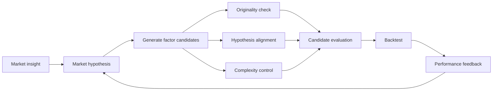

# Bài 01 - Alpha Mining và bài toán Alpha Decay

## 1. Tóm tắt

Trong đầu tư định lượng, một **alpha factor** là một đặc trưng hoặc biểu thức định lượng được xây dựng để tạo ra tín hiệu dự báo lợi suất tương lai của tài sản. **Alpha mining** mở rộng bài toán này thành quá trình tìm kiếm các factor có giá trị trong một không gian biểu thức rất lớn. 

Khó khăn thực sự không nằm ở việc tìm được một biểu thức có backtest đẹp. Một factor chỉ có giá trị khi sức dự báo của nó còn duy trì được trên dữ liệu mới và trong những điều kiện thị trường khác với giai đoạn dùng để khám phá factor. Khi khả năng dự báo hoặc khả năng tạo excess return suy giảm theo thời gian, ta gặp hiện tượng **alpha decay**. 

Alpha decay đặc biệt quan trọng vì nó có thể xuất phát từ hai cơ chế rất khác nhau: factor có thể vốn chỉ là một pattern ngẫu nhiên do **overfitting/p-hacking**, hoặc factor có thể từng thực sự hữu ích nhưng dần mất lợi thế vì quá nhiều nhà đầu tư cùng khai thác nó, tạo ra **factor crowding**. AlphaAgent được xây dựng xoay quanh chính vấn đề này: tìm alpha mới nhưng đồng thời kiểm soát độ phức tạp, tính hợp lý tài chính và mức độ giống với những alpha đã tồn tại. 

## 2. Mục tiêu học tập

Sau bài học, người học có thể:

* giải thích được `alpha factor`, `alpha mining` và `alpha decay`;
* mô tả được mối liên hệ từ dữ liệu thị trường đến factor score, danh mục và đánh giá lợi suất tương lai;
* phân biệt được `overfitting/p-hacking` với `factor crowding`;
* giải thích vì sao backtest tốt chưa đủ để kết luận một factor có giá trị;
* phân tích được hạn chế của phương pháp alpha mining dựa thuần vào GP, RL hoặc LLM;
* giải thích được ba hướng regularization cốt lõi của AlphaAgent: **originality**, **hypothesis alignment** và **complexity control**;
* nhận diện được những đặc điểm cần có của một factor có khả năng duy trì predictive power theo thời gian.

## 3. Kiến thức nền: từ dữ liệu thị trường đến alpha

### 3.1. Từ giá đến lợi suất

Giá của một tài sản tại một thời điểm chỉ cho biết tài sản đang được giao dịch ở mức nào. Trong alpha mining, mục tiêu thường không phải là đoán trực tiếp mức giá tiếp theo mà là tìm tín hiệu có quan hệ với **lợi suất tương lai**.

Với giá đóng cửa \(P_t\), lợi suất đơn giản giữa hai thời điểm liên tiếp có thể viết:

$$
r_t = \frac{P_t-P_{t-1}}{P_{t-1}}
$$

Trong đó:

* \(P_t\): giá tại thời điểm \(t\);
* \(P_{t-1}\): giá tại thời điểm trước;
* \(r_t\): lợi suất của kỳ.

Một cách biểu diễn khác là **log return**:

$$
\ell_t = \ln\left(\frac{P_t}{P_{t-1}}\right)
$$

Trong tập dữ liệu gồm nhiều cổ phiếu, tại cùng một ngày ta có thể quan sát một **cross-section** gồm nhiều tài sản. Mỗi tài sản có các feature riêng như giá mở cửa, giá cao nhất, giá thấp nhất, giá đóng cửa, volume hoặc những đại lượng được biến đổi từ chúng. Factor sử dụng các feature này để tạo một score nhằm dự báo thứ tự hoặc mức độ lợi suất trong tương lai. 

### 3.2. Factor score và quyết định đầu tư

Có thể mô hình hóa một factor bằng hàm:

$$
s_{i,t}=f(X_{i,t})
$$

Trong đó:

* \(X_{i,t}\) là tập feature của tài sản \(i\) tại thời điểm \(t\);
* \(f\) là biểu thức factor;
* \(s_{i,t}\) là score mà factor gán cho tài sản.

Score không phải lợi nhuận. Nó là **tín hiệu định lượng**. Ví dụ, một hệ thống có thể dùng score để xếp hạng cổ phiếu, sau đó phân bổ tỷ trọng cao hơn cho nhóm có score tốt và quan sát xem nhóm đó có thực sự tạo lợi suất tương lai cao hơn hay không. 

Mạch xử lý cơ bản có thể hình dung như sau:

```text
Dữ liệu giá và volume
        ↓
Feature và return
        ↓
Factor f(X)
        ↓
Factor score
        ↓
Xếp hạng tài sản
        ↓
Xây dựng portfolio
        ↓
Backtest
        ↓
Đánh giá trên giai đoạn tương lai
```

Điểm cần phân biệt là **alpha không đồng nghĩa với toàn bộ lợi nhuận của danh mục**. Trong bài toán factor mining, điều cần tìm là phần tín hiệu có khả năng dự báo hoặc tạo excess return đáng tin cậy, chứ không phải một score cao do beta thị trường, lỗi dữ liệu hoặc một quan hệ tình cờ. 

## 4. Alpha mining không chỉ là tối đa hóa backtest

### 4.1. Không gian tìm kiếm của factor

Một biểu thức factor có thể được hình thành từ rất nhiều thành phần:

* raw feature;
* toán tử số học;
* rolling operator;
* window length;
* threshold;
* ranking;
* normalization;
* điều kiện;
* nhiều tầng biến đổi liên tiếp.

Chỉ cần thay một cửa sổ từ 5 ngày thành 10 ngày, thay phép trung bình bằng cực tiểu, hoặc ghép thêm một operator khác, ta đã tạo ra một candidate mới. Vì vậy số lượng factor có thể thử tăng rất nhanh.

Ở mức khái quát, mục tiêu là tìm một factor \(f\) sao cho thông tin tại thời điểm hiện tại có thể tạo tín hiệu liên quan tới return tương lai:

$$
f(X_t) \rightarrow r_{t+1}
$$

Alpha mining vì thế là một bài toán **search + evaluation**: sinh candidate, đo predictive effectiveness, loại candidate yếu và tiếp tục khám phá những biểu thức tốt hơn. Cách hình thành bài toán này được sử dụng trực tiếp trong AlphaAgent. 

### 4.2. Predictive performance và generalization

Giả sử thử 10.000 biểu thức trên cùng một giai đoạn lịch sử rồi chọn factor có kết quả tốt nhất. Ngay cả khi dữ liệu chứa rất ít quy luật thật, xác suất xuất hiện một số biểu thức có kết quả đẹp do ngẫu nhiên vẫn tăng lên khi số lần thử tăng.

Do đó:

```text
Backtest tốt
    ≠
Factor tốt trong tương lai
```

Điều cần quan tâm là **generalization**: factor có giữ được chất lượng khi chuyển sang giai đoạn chưa được sử dụng để khám phá và tối ưu nó hay không.

Train, validation và test vì vậy không chỉ là thủ tục kỹ thuật. Chúng tạo ra ranh giới giữa:

```text
giải thích tốt dữ liệu đã nhìn thấy
```

và:

```text
dự báo được dữ liệu chưa nhìn thấy
```

Rủi ro trở nên đặc biệt lớn trong alpha mining vì hệ thống thường thử rất nhiều biểu thức, tham số và cửa sổ thời gian. Việc liên tục tìm kiếm rồi chỉ giữ lại kết quả đẹp nhất có thể tạo ra **data snooping** hoặc **p-hacking**. 

## 5. Alpha decay

**Alpha decay** là sự suy giảm khả năng dự báo hoặc khả năng tạo excess return của factor theo thời gian. Một factor có thể rất thuyết phục ở giai đoạn phát hiện nhưng trở nên yếu dần sau đó. 

Điều này có thể xảy ra ngay cả khi biểu thức toán học của factor không thay đổi. Thứ thay đổi có thể là dữ liệu, chế độ thị trường, hành vi của người tham gia thị trường hoặc đơn giản là việc ta đã đánh giá quá cao một pattern lịch sử.

Có thể mô hình hóa trực giác của decay bằng:

```text
Giai đoạn khám phá
Predictive power cao
        ↓
Thời gian trôi qua
        ↓
Predictive power giảm
        ↓
IC / RankIC / excess return suy yếu
        ↓
Factor mất giá trị thực tiễn
```

Trong AlphaAgent, hai nguyên nhân được đặt ở trung tâm của bài toán là **overfitting do excessive data mining** và **factor crowding**. 

## 6. Hai cơ chế chính gây alpha decay

### 6.1. Overfitting và p-hacking

**Overfitting** xảy ra khi quá trình tìm kiếm factor thích nghi quá sát với dữ liệu lịch sử, bao gồm cả những nhiễu ngẫu nhiên chỉ xuất hiện trong giai đoạn đó.

Ví dụ, giả sử một factor có cấu trúc:

```text
Biến động 7 ngày
+ volume trung bình 13 ngày
+ một threshold rất cụ thể
+ một phép biến đổi khác
```

Nếu từng thành phần và từng tham số đều được điều chỉnh liên tục cho tới khi backtest đạt mức tối đa, biểu thức cuối cùng có thể đang học những đặc điểm riêng của tập dữ liệu chứ không phải một market inefficiency có thể lặp lại.

P-hacking làm vấn đề nghiêm trọng hơn. Nếu ta liên tục:

1. thử một giả thuyết;
2. thay tham số;
3. chạy lại;
4. đổi operator;
5. tiếp tục thử;
6. chỉ giữ những factor thắng;

thì một số factor cuối cùng gần như chắc chắn sẽ trông rất tốt chỉ do may mắn.

Dấu hiệu điển hình là:

```text
Historical backtest rất mạnh
             ↓
Validation giảm đáng kể
             ↓
Out-of-sample yếu
             ↓
Live market decay nhanh
```

Các phương pháp GP và RL có thể gặp chính vấn đề này nếu reward hoặc fitness chủ yếu khuyến khích tối đa hóa historical performance mà không kiểm soát đầy đủ độ phức tạp và financial rationale. 

### 6.2. Factor crowding

Factor crowding là một cơ chế khác. Factor không nhất thiết sai và cũng không nhất thiết bị overfit. Nó có thể từng phản ánh một market inefficiency thật, nhưng lợi thế đó giảm đi khi quá nhiều người cùng phát hiện và khai thác.

Giả sử nhiều quỹ cùng sử dụng một tín hiệu gần giống nhau:

```text
Tín hiệu xuất hiện
      ↓
Nhiều chiến lược cùng mua
      ↓
Giá phản ứng sớm hơn
      ↓
Lợi thế dự báo bị thu hẹp
```

Trong điều kiện bình thường, crowding có thể làm alpha giảm từ từ. Trong giai đoạn stress, tình huống còn nguy hiểm hơn:

```text
Nhiều danh mục giữ vị thế giống nhau
                ↓
Một cú sốc thị trường xuất hiện
                ↓
Nhiều danh mục cùng giảm vị thế
                ↓
Áp lực giao dịch tập trung
                ↓
Reversal / drawdown mạnh
```

AlphaAgent xem đây là một trong hai nguồn alpha decay quan trọng. Một ví dụ được nêu là sự suy yếu của size factor trên thị trường A-share Trung Quốc vào đầu năm 2024 trong bối cảnh rủi ro concentrated positioning. 

Hai cơ chế này cần được phân biệt rõ:

| Cơ chế                  | Vấn đề cốt lõi                         | Factor có thể từng là tín hiệu thật? | Rủi ro chính                               |
| ----------------------- | -------------------------------------- | -----------------------------------: | ------------------------------------------ |
| Overfitting / p-hacking | Học cả nhiễu của lịch sử               |                     Không nhất thiết | Out-of-sample collapse                     |
| Factor crowding         | Quá nhiều người dùng tín hiệu tương tự |                                   Có | Alpha bị cạnh tranh và reversal khi stress |

## 7. Exploration không đồng nghĩa với tạo factor ngẫu nhiên

Một hệ thống alpha mining luôn phải cân bằng hai xu hướng:

* **Exploitation:** tiếp tục khai thác những cấu trúc và primitive từng hoạt động tốt.
* **Exploration:** thử những tổ hợp mới có khả năng phát hiện market inefficiency chưa bị khai thác quá mức.

Nếu chỉ exploitation, hệ thống dễ quay lại cùng một nhóm factor phổ biến và làm tăng homogenization.

Nếu chỉ exploration ngẫu nhiên, hệ thống có thể sinh ra rất nhiều biểu thức mới nhưng thiếu logic kinh tế, khó giải thích và dễ overfit.

Do đó, exploration có giá trị phải thỏa đồng thời ba yêu cầu:

```text
Mới
+
Có financial rationale
+
Có predictive evidence
```

Candidate mới vẫn phải triển khai được một giả thuyết hợp lý và vượt qua đánh giá trên dữ liệu. Novelty tự thân không phải alpha. 

## 8. Vì sao GP và RL thuần túy có thể chưa đủ?

Genetic Programming phù hợp với alpha mining vì factor có thể được biểu diễn dưới dạng cấu trúc biểu thức rồi tiến hóa thông qua các phép biến đổi. Reinforcement Learning cũng có thể xem quá trình xây dựng factor như một chuỗi quyết định và sử dụng reward để hướng dẫn exploration.

Vấn đề xuất hiện khi objective tập trung quá mạnh vào historical metric.

Một candidate phức tạp có thể được thưởng nếu nó đạt backtest tốt hơn, dù:

* biểu thức khó giải thích;
* số tham số quá nhiều;
* financial intuition yếu;
* predictive power chủ yếu đến từ việc khớp lịch sử.

Các phương pháp GP và RL được khảo sát trong AlphaAgent có xu hướng gặp rủi ro này khi quá nhấn mạnh historical performance, dẫn đến factor quá phức tạp, overfit hoặc thiếu economic rationale. 

Như vậy, search mạnh hơn chưa chắc giải quyết alpha decay. Nếu objective không định nghĩa đúng thế nào là một factor tốt, công cụ tối ưu càng mạnh càng có thể tìm được cách khai thác những điểm yếu của metric.

## 9. Vì sao LLM thuần túy cũng chưa đủ?

LLM đem lại một lợi thế mà các search algorithm truyền thống khó có được: nó có thể tiếp nhận market hypothesis dưới dạng ngôn ngữ tự nhiên và sử dụng domain knowledge để đề xuất factor có ý nghĩa kinh tế.

Tuy nhiên, khả năng biết nhiều kiến thức tài chính không tự động tạo ra novelty.

Một LLM không được ràng buộc có xu hướng quay lại các khái niệm quen thuộc như:

* momentum;
* value;
* size;
* RSI;
* các pattern phổ biến trong tài liệu tài chính.

Nếu nhiều candidate chỉ là những biến thể nhỏ của các factor đã rất phổ biến, hệ thống vẫn có thể làm nghiêm trọng thêm factor homogenization và crowding. 

Ngoài ra, output do LLM sinh ra có tính stochastic. Khi sinh trực tiếp code hoặc biểu thức phức tạp, còn có thể xuất hiện các vấn đề như:

* semantic meaning không khớp với implementation;
* biểu thức tuy chạy được nhưng không phản ánh market hypothesis;
* factor mô tả một loại tín hiệu nhưng thực tế sử dụng feature không liên quan;
* implementation trở nên quá phức tạp.

Vì vậy, LLM cần **constraint và regularization**, chứ không chỉ cần một prompt yêu cầu “hãy tạo alpha tốt”.

## 10. Cách AlphaAgent tiếp cận bài toán alpha decay

AlphaAgent không xem predictive performance là tiêu chí duy nhất. Quá trình tạo factor được điều hướng bởi ba cơ chế regularization chính:

1. **Originality enforcement:** tránh tạo candidate quá giống những alpha đã tồn tại.
2. **Hypothesis alignment:** kiểm tra biểu thức có thực sự triển khai đúng market hypothesis hay không.
3. **Complexity control:** hạn chế cấu trúc quá dài, quá nhiều tham số hoặc quá nhiều feature.

Ba cơ chế này được thiết kế để đồng thời duy trì **novelty**, **financial rationale** và **parsimony**. 

Có thể hình dung logic tổng quát như sau:



Quy trình này tạo một vòng lặp thay vì một lần sinh factor duy nhất. Hypothesis dẫn tới candidate; candidate được kiểm tra về cấu trúc và ý nghĩa; factor đủ điều kiện mới được backtest; kết quả đánh giá sau đó quay trở lại hỗ trợ vòng khám phá tiếp theo. AlphaAgent triển khai workflow này bằng các agent chuyên biệt cho việc đề xuất giả thuyết, xây dựng factor và đánh giá factor. 

## 11. Regularization thay đổi định nghĩa của một “factor tốt”

Nếu chỉ tối ưu historical performance, bài toán có thể được hiểu đơn giản là:

```text
Tìm factor có metric backtest cao nhất.
```

AlphaAgent chuyển mục tiêu sang một bài toán cân bằng:

```text
Predictive effectiveness
        +
Financial soundness
        +
Originality
        +
Controlled complexity
        ↓
Factor có khả năng duy trì giá trị tốt hơn
```

Nói cách khác, hai candidate có cùng backtest performance chưa chắc có chất lượng như nhau.

Giả sử:

**Factor A**

* expression ngắn;
* chỉ có một vài tham số;
* phản ánh rõ hypothesis;
* khác đáng kể với alpha phổ biến.

**Factor B**

* expression rất dài;
* dùng nhiều threshold được tinh chỉnh;
* giống một factor phổ biến;
* khó giải thích vì sao tín hiệu phải tồn tại.

Nếu chỉ nhìn một con số backtest, B có thể trông hấp dẫn. Nhưng xét dưới góc độ alpha decay, A có nhiều đặc điểm mong muốn hơn vì ít dấu hiệu over-engineering và crowding hơn.

Đây chính là vai trò của regularization: không để quá trình search đánh đổi mọi thứ chỉ để tăng historical metric.

## 12. Backtest tốt cần được đọc như thế nào?

Một backtest mạnh chỉ nên được xem là **một phần bằng chứng**.

Khi đánh giá factor, cần đặt thêm các câu hỏi:

* Factor có tiếp tục hiệu quả trên dữ liệu chưa dùng để xây dựng nó không?
* Predictive power có duy trì qua nhiều giai đoạn thị trường không?
* Biểu thức có hợp lý về mặt kinh tế hay chỉ là một chuỗi phép toán tối ưu hóa lịch sử?
* Candidate có quá giống những factor đã phổ biến không?
* Có quá nhiều parameter hoặc feature tự do không?
* Hiệu quả có phụ thuộc vào một khoảng thời gian đặc biệt không?
* Sau transaction cost, lợi thế có còn đủ lớn không?

Từ góc nhìn này, câu:

> “Factor này có backtest rất tốt.”

chưa đủ để kết luận.

Câu hỏi đúng hơn là:

> “Factor này có predictive effectiveness đủ mạnh, đủ ổn định và đủ hợp lý để kỳ vọng rằng nó sẽ generalize sang dữ liệu tương lai hay không?”

## 13. Minh họa bằng kết quả của AlphaAgent

AlphaAgent được đánh giá trên CSI 500 và S&P 500 trong giai đoạn 2021–2024. Các thí nghiệm sử dụng dữ liệu OHLCV và đánh giá nhiều khía cạnh của predictive performance cũng như portfolio performance. 

Trong kết quả tổng thể được báo cáo:

* CSI 500 đạt annual excess return trung bình khoảng **11,00%** với `IR = 1.488`;
* S&P 500 đạt annual excess return khoảng **8,74%** với `IR = 1.0545`;
* hit ratio của quá trình khai phá factor được báo cáo cải thiện **81%**;
* lượng token sử dụng giảm khoảng **30%** so với các phương pháp được so sánh trong thiết lập tương ứng. 

Ý nghĩa quan trọng của các kết quả này đối với bài học không chỉ là con số return. Mục tiêu của AlphaAgent là chứng minh rằng alpha mining nên được đánh giá cả về **performance persistence**: một factor hữu ích cần giữ được predictive effectiveness qua thời gian thay vì chỉ đạt đỉnh trên một giai đoạn backtest.

## 14. Phân biệt các khái niệm dễ nhầm

| Khái niệm                     | Ý nghĩa                                                                  |
| ----------------------------- | ------------------------------------------------------------------------ |
| **Alpha factor**              | Hàm hoặc đặc trưng định lượng tạo tín hiệu liên quan đến future return   |
| **Alpha mining**              | Quá trình khám phá, tạo và đánh giá alpha factor                         |
| **Backtest**                  | Kiểm tra chiến lược hoặc factor trên dữ liệu lịch sử                     |
| **Generalization**            | Khả năng duy trì chất lượng trên dữ liệu chưa dùng để xây dựng factor    |
| **Overfitting**               | Factor học quá sát lịch sử, bao gồm cả noise                             |
| **P-hacking / data snooping** | Thử quá nhiều phương án khiến một số kết quả đẹp xuất hiện do ngẫu nhiên |
| **Factor crowding**           | Nhiều người cùng khai thác tín hiệu tương tự khiến lợi thế suy giảm      |
| **Alpha decay**               | Predictive power hoặc excess return của factor suy giảm theo thời gian   |
| **Exploration**               | Tìm cấu trúc hoặc tín hiệu mới                                           |
| **Regularization**            | Đưa thêm constraint để tránh nghiệm chỉ tốt trên historical metric       |

## 15. Một ví dụ tư duy hoàn chỉnh

Giả sử hệ thống phát hiện factor \(F\) có backtest rất cao.

Không nên kết luận ngay rằng \(F\) là alpha tốt. Hãy đi theo chuỗi kiểm tra:

```text
F có historical performance tốt
              ↓
Factor có generalize không?
              ↓
Có bị overfit bởi quá nhiều lần thử không?
              ↓
Biểu thức có quá phức tạp không?
              ↓
Có market hypothesis hợp lý không?
              ↓
Expression có thực sự triển khai hypothesis đó không?
              ↓
Có quá giống những factor đã phổ biến không?
              ↓
Predictive power có duy trì qua thời gian không?
```

Nếu factor thất bại ở phần đầu, rủi ro chính là **overfitting**.

Nếu factor từng hoạt động tốt nhưng ngày càng bị nhiều chiến lược sử dụng, rủi ro chính có thể là **crowding**.

Nếu biểu thức mới nhưng không có rationale, novelty cũng không giúp nó trở thành alpha tốt.

Nếu rationale tốt nhưng expression thực tế không triển khai rationale đó, factor cũng không đạt yêu cầu.

Chính vì vậy, bài toán alpha mining bền vững phải tối ưu **một tập tiêu chí**, chứ không chỉ một metric.

## 16. Câu hỏi tự kiểm tra

1. Vì sao việc thử hàng nghìn factor rồi chọn factor có backtest tốt nhất làm tăng nguy cơ p-hacking?
2. Một factor có thể bị alpha decay dù ban đầu không overfit hay không? Hãy giải thích bằng factor crowding.
3. Vì sao generalization quan trọng hơn việc chỉ nhìn historical performance?
4. GP hoặc RL có thể tạo factor rất mạnh trên lịch sử nhưng vẫn thất bại trong live market theo cơ chế nào?
5. Vì sao LLM có nhiều kiến thức tài chính vẫn có thể sinh ra các factor dễ bị crowding?
6. Originality enforcement giải quyết vấn đề khác complexity control ở điểm nào?
7. Vì sao một factor hoàn toàn mới nhưng không có financial rationale vẫn chưa phải candidate tốt?
8. Nếu hai factor có cùng predictive performance nhưng một factor dùng 3 operator còn factor kia dùng 20 operator và nhiều parameter tự do, factor nào có dấu hiệu robust hơn? Vì sao?

## 17. Thực hành củng cố

Hãy xem xét hai candidate sau.

**Candidate A**

```text
Factor dựa trên một market hypothesis rõ ràng
Expression ngắn
3 parameter
Ít giống các alpha phổ biến
Validation gần với training performance
```

**Candidate B**

```text
Không có market hypothesis rõ
Expression rất dài
17 parameter
Backtest training rất cao
Validation giảm mạnh
Cấu trúc gần giống một factor phổ biến
```

Hãy trả lời:

1. Candidate nào có nguy cơ overfitting cao hơn?
2. Candidate nào có nguy cơ factor crowding cao hơn?
3. Candidate nào phù hợp hơn với tư tưởng regularized exploration?
4. Nếu Candidate B có training return cao hơn Candidate A, điều đó có đủ để chọn B hay không?
5. Bạn cần thêm loại bằng chứng nào trước khi đưa Candidate A vào sử dụng thực tế?

**Kết quả mong đợi:** người học phải đánh giá factor dựa trên generalization, originality, financial rationale và complexity thay vì chỉ sử dụng historical return.

## 18. Tổng kết

Alpha mining là quá trình tìm những biểu thức định lượng có khả năng biến dữ liệu thị trường thành tín hiệu dự báo future return. Tuy nhiên, tìm được tín hiệu trên lịch sử chỉ là bước đầu. Thách thức lớn hơn là duy trì predictive power khi chuyển sang dữ liệu mới và khi cấu trúc thị trường thay đổi.

Hai nguồn alpha decay cần ghi nhớ là:

```text
Overfitting / p-hacking
→ factor vốn không generalize tốt

Factor crowding
→ factor từng có lợi thế nhưng lợi thế bị khai thác và suy giảm
```

GP và RL có thể search rất mạnh nhưng dễ bị historical objective dẫn tới overfitting hoặc factor thiếu rationale. LLM bổ sung domain knowledge nhưng nếu không có constraint lại dễ tạo những biến thể của các tín hiệu phổ biến.

AlphaAgent giải quyết bài toán bằng cách không xem performance là mục tiêu duy nhất. Factor còn phải đủ **mới**, **phù hợp với market hypothesis** và **không quá phức tạp**. Ba lớp regularization này làm thay đổi câu hỏi cốt lõi của alpha mining từ:

```text
Factor nào có backtest cao nhất?
```

thành:

```text
Factor nào vừa dự báo tốt,
vừa có lý do tài chính,
vừa đủ khác biệt,
vừa đủ đơn giản
để có cơ hội duy trì giá trị trong tương lai?
```
