# Bài 01 - Alpha Mining và bài toán Alpha Decay

## Lý thuyết nền cần biết

> Phần này cung cấp các kiến thức tiên quyết cần thiết để hiểu vì sao AlphaAgent phải tìm tín hiệu mới nhưng vẫn phải kiểm soát overfitting và factor crowding.

### 1. Từ giá đến lợi suất

Giá đóng cửa `P_t` chỉ cho biết một tài sản đang được giao dịch ở mức nào. Để so sánh biến động qua các ngày, ta thường chuyển giá thành **lợi suất**. Lợi suất đơn giản là:

\[
r_t = \frac{P_t-P_{t-1}}{P_{t-1}}
\]

Trong đó `P_t` là giá tại thời điểm `t`, `P_{t-1}` là giá ở thời điểm trước và `r_t` là lợi suất của kỳ đó. Một cách khác là log return:

\[
\ell_t = \ln\left(\frac{P_t}{P_{t-1}}\right)
\]

Lợi suất là đại lượng mà factor cố gắng dự báo, thay vì dự báo trực tiếp mức giá. Trong dữ liệu nhiều cổ phiếu, tại cùng một ngày ta có một **cross-section** gồm nhiều dòng, mỗi dòng là một cổ phiếu với feature và lợi suất tương lai tương ứng.

### 2. Alpha factor, tín hiệu và portfolio

Một factor là một phép biến đổi từ dữ liệu quan sát được thành điểm số:

\[
s_{i,t}=f(X_{i,t})
\]

Ở đây `X_{i,t}` là các feature của tài sản `i` tại thời điểm `t`, còn `s_{i,t}` là điểm số của factor. Điểm số này thường được dùng để xếp hạng: mua hoặc phân bổ tỷ trọng cao hơn cho nhóm có score lớn, rồi kiểm tra xem nhóm đó có đạt lợi suất tương lai cao hơn không.

**Alpha** không có nghĩa là mọi lợi nhuận của danh mục. Trong ngữ cảnh khai phá factor, alpha là phần tín hiệu hoặc excess return kỳ vọng mà ta muốn tách ra khỏi biến động chung của thị trường và các rủi ro đã biết. Vì vậy, một factor có thể có score rất cao nhưng vẫn không tạo ra alpha đáng tin nếu score chỉ phản ánh beta thị trường, dữ liệu lỗi hoặc một pattern ngẫu nhiên.

Luồng nhân quả cần ghi nhớ là:

```text
Giá và volume
    ↓
Feature / return
    ↓
Factor tạo score
    ↓
Xếp hạng tài sản
    ↓
Portfolio và backtest
    ↓
Đánh giá trên dữ liệu tương lai
```

### 3. Generalization, overfitting và p-hacking

Trong machine learning, **generalization** là khả năng giữ chất lượng dự báo trên dữ liệu chưa từng dùng để xây dựng mô hình. **Overfitting** xảy ra khi phương pháp học quá sát dữ liệu lịch sử, kể cả những dao động ngẫu nhiên, nên kết quả train/backtest tốt nhưng kết quả tương lai kém.

Alpha mining làm rủi ro này lớn hơn vì không chỉ một mô hình được thử. Ta có thể thử hàng nghìn biểu thức, cửa sổ và hướng biến đổi. Nếu cứ giữ lại biểu thức có điểm cao nhất trên cùng một lịch sử, một số kết quả tốt sẽ xuất hiện chỉ do may mắn. Đây là trực giác của **p-hacking/data snooping**: số lần tìm kiếm càng nhiều thì càng dễ nhặt được một pattern có vẻ có ý nghĩa nhưng không lặp lại.

Do đó, train, validation và test không chỉ là thủ tục ML. Chúng là hàng rào để hỏi: factor có thật sự dự báo được giai đoạn mới hay chỉ giải thích lại quá khứ?

### 4. Factor crowding và exploration

Overfitting đến từ việc khai thác quá mức một mẫu trong dữ liệu đã thấy. **Factor crowding** đến từ việc nhiều người cùng nắm giữ và giao dịch những tín hiệu tương tự. Một factor có thể đúng về mặt thống kê nhưng lợi thế giảm dần khi nhiều danh mục cùng mua, cùng bán hoặc cùng thoát vị thế trong lúc căng thẳng.

Vì vậy, bài toán có hai lực kéo:

- **Exploitation:** tiếp tục dùng những primitive và pattern đã từng hiệu quả.
- **Exploration:** thử các cấu trúc hoặc tổ hợp feature mới để tránh lặp lại alpha phổ biến.

Exploration không đồng nghĩa với tạo biểu thức ngẫu nhiên. Candidate mới vẫn phải có giả thuyết tài chính, chạy được và vượt qua kiểm định ngoài mẫu. Đây là lý do AlphaAgent kết hợp LLM với regularization thay vì chỉ tối đa hóa một metric lịch sử.

## Liên hệ với bài học này

Bài học dùng `alpha factor`, `future return`, `overfitting`, `p-hacking` và `factor crowding` để đặt vấn đề. Các phần sau sẽ biến trực giác trên thành cơ chế cụ thể: objective có penalty, expression dạng cây, kiểm tra originality, kiểm tra hypothesis alignment và backtest theo thời gian. Khi đọc cụm “factor tốt”, hãy hiểu là factor vừa có predictive effectiveness vừa có khả năng generalize, không phải chỉ có một con số backtest cao.

## Nguồn kiến thức liên quan trong kho khóa học

- `01 - AI & Dữ liệu/02 - Data Science, Analytics & ML/ai-data-scientist-roadmap/AI-Data-Scientist-Roadmap-Course/00 - Roadmap.sh AI Data Scientist Official/01 - Math, Statistics and Econometrics/Module 03 - Econometrics and Time Series/03-TSParts/010 - Time Series Basics.md`
- `01 - AI & Dữ liệu/02 - Data Science, Analytics & ML/ai-data-scientist-roadmap/AI-Data-Scientist-Roadmap-Course/00 - Roadmap.sh AI Data Scientist Official/03 - Machine Learning and Deep Learning/Module 06 - Machine Learning/05-Features/025 - Feature Engineering.md`
- `01 - AI & Dữ liệu/02 - Data Science, Analytics & ML/machine-learning-roadmap/Machine-Learning-Roadmap-Course/00 - Roadmap.sh Machine Learning Official/04 - Evaluation, Workflow and Deep Learning/Module 11 - Model Evaluation/01-WhatIsModel-BiasVarianceTradeoff/002 - Generalization.md`
- `01 - AI & Dữ liệu/02 - Data Science, Analytics & ML/machine-learning-roadmap/Machine-Learning-Roadmap-Course/00 - Roadmap.sh Machine Learning Official/04 - Evaluation, Workflow and Deep Learning/Module 11 - Model Evaluation/01-WhatIsModel-BiasVarianceTradeoff/003 - Overfitting.md`
- `01 - AI & Dữ liệu/02 - Data Science, Analytics & ML/khoa-hoc-tinh-toan-tien-hoa/Chuong 03 - Lap Trinh Di Truyen/03-lap-trinh-di-truyen.md`

## 1. Mục tiêu học tập

Sau bài này, người học có thể giải thích alpha factor, alpha mining, alpha decay và hai nguyên nhân trọng tâm khiến alpha suy giảm theo thời gian.

## 2. Alpha factor là gì?

Trong đầu tư định lượng, **alpha factor** là một đặc trưng hoặc biểu thức định lượng nhằm tạo ra tín hiệu dự báo lợi suất tương lai của tài sản. **Alpha mining** là quá trình tìm kiếm những factor như vậy trong một không gian biểu thức rất lớn.

Điểm quan trọng của paper là: một factor có backtest tốt chưa đủ. Nó còn phải duy trì được sức dự báo khi thị trường thay đổi.

## 3. Alpha decay

**Alpha decay** là sự suy giảm sức dự báo hoặc khả năng tạo excess return của factor theo thời gian.

Paper nhấn mạnh hai nguồn chính:

### 3.1 Overfitting và p-hacking

Khi quá trình tìm factor tối ưu quá mạnh trên dữ liệu lịch sử, ta dễ tìm thấy các pattern ngẫu nhiên trông có vẻ có ý nghĩa trong backtest. Những factor này thường suy giảm nhanh khi đưa vào dữ liệu mới hoặc live market.

### 3.2 Factor crowding

Nếu quá nhiều nhà đầu tư cùng khai thác những tín hiệu giống nhau, lợi thế có thể bị “crowd”. Khi chiến lược phổ biến, hành vi giao dịch tập thể có thể làm giảm predictability của factor và thậm chí tạo ra reversal trong giai đoạn stress.

## 4. Vì sao GP/RL và LLM thuần túy chưa đủ?

Paper mô tả hai nhóm hạn chế:

- **Genetic Programming (GP) / Reinforcement Learning (RL):** dễ ưu tiên tối đa hóa metric lịch sử mà không giữ đủ financial/economic rationale; kết quả có thể quá phức tạp hoặc thiếu lý do kinh tế.
- **LLM-based alpha mining:** có lợi thế domain knowledge, nhưng nếu thiếu constraint thì dễ quay lại những factor phổ biến như momentum, value, size, RSI; điều này làm factor homogenization và crowding nặng hơn.

## 5. Ý tưởng trung tâm của AlphaAgent

AlphaAgent đưa regularization trực tiếp vào quá trình khám phá factor theo ba hướng:

1. **Originality enforcement** - kiểm tra factor mới có quá giống alpha đã tồn tại hay không.
2. **Hypothesis alignment** - kiểm tra factor có thực sự triển khai đúng market hypothesis hay không.
3. **Complexity control** - tránh biểu thức quá dài, quá nhiều tham số hoặc quá nhiều feature.

Ba cơ chế này hướng LLM đến cân bằng giữa **tính mới**, **lý do tài chính** và **khả năng thích nghi**.

## 6. Kết quả cấp cao của paper

Trên CSI 500 và S&P 500 trong giai đoạn kiểm thử 2021-2024, paper báo cáo AlphaAgent có hiệu năng và độ bền alpha tốt hơn các baseline được so sánh. Kết quả tổng thể được phân tích kỹ ở Bài 07 và Bài 08.

## 7. Câu hỏi tự luyện

1. Tại sao backtest tốt không đồng nghĩa factor sẽ bền trong live market?
2. Overfitting và factor crowding khác nhau ở cơ chế nào?
3. Vì sao một LLM giàu kiến thức tài chính vẫn có thể sinh ra factor dễ decay?
4. Ba regularization mechanism của AlphaAgent nhắm tới ba rủi ro nào?

## 8. Nguồn trong paper

- Abstract và Section 1 - Introduction, trang 1-2.
- Section 2 - Related Work, trang 2-3.

## Nội dung các file tham khảo để tiện sao chép

> Các khối dưới đây là nội dung nguyên văn của source lesson tương ứng, được đặt trong code block để có thể sao chép trọn vẹn.

### 1. `01 - AI & Dữ liệu/02 - Data Science, Analytics & ML/ai-data-scientist-roadmap/AI-Data-Scientist-Roadmap-Course/00 - Roadmap.sh AI Data Scientist Official/01 - Math, Statistics and Econometrics/Module 03 - Econometrics and Time Series/03-TSParts/010 - Time Series Basics.md`

Nguồn: `01 - AI & Dữ liệu/02 - Data Science, Analytics & ML/ai-data-scientist-roadmap/AI-Data-Scientist-Roadmap-Course/00 - Roadmap.sh AI Data Scientist Official/01 - Math, Statistics and Econometrics/Module 03 - Econometrics and Time Series/03-TSParts/010 - Time Series Basics.md`

````markdown
# 010 — Time Series Basics

**Course:** 01 — Math, Statistics and Econometrics
**Module:** Module 03 — Econometrics and Time Series
**Content Group:** Time Series
**Roadmap Source:** Econometrics and Time Series / Time Series
**Lesson Type:** Econometrics and Time Series
**Order in Module:** 010
**Suggested Duration:** 22 minutes

---

## 1. Overview

A **time series** is a sequence of observations recorded in chronological order.

Examples include:

* Daily sales
* Hourly electricity demand
* Monthly inflation
* Minute-by-minute stock prices
* Weekly website traffic
* Sensor measurements
* Server request latency
* User activity over time

Unlike ordinary tabular data, the order of observations in a time series is important. An observation recorded today may depend on observations from yesterday, last week, or the same period last year.

A typical time series may contain:

* **Trend**
* **Seasonality**
* **Cycles**
* **Autocorrelation**
* **Noise**
* **Structural changes**
* **Outliers**

For an AI Engineer or Data Scientist, time series analysis helps answer questions such as:

* What will sales be next week?
* Is website traffic increasing?
* Does demand repeat every seven days?
* Is the current sensor value abnormal?
* Did a marketing campaign change the underlying pattern?
* How much uncertainty should be attached to a forecast?

A time series workflow usually produces artifacts such as:

* Exploratory charts
* Lag features
* Rolling statistics
* Forecasting models
* Validation reports
* Forecasting APIs
* Monitoring dashboards
* Business recommendations

---

## 2. Learning Objectives

After completing this lesson, you should be able to:

1. Explain what time series data is.
2. Distinguish time series data from ordinary cross-sectional data.
3. Identify trend, seasonality, cycles, and noise.
4. Explain why temporal order must be preserved.
5. Understand lagged values and rolling statistics.
6. Recognize autocorrelation.
7. Create simple forecasting baselines.
8. Split time series data correctly for training and evaluation.
9. Build a small time series analysis notebook.
10. Connect time series concepts to production forecasting systems.

---

## 3. What Is a Time Series?

A time series is a set of observations indexed by time:

$$
y_1, y_2, y_3, \ldots, y_T
$$

where:

* (y_t) is the observed value at time (t)
* (T) is the total number of observations

A general representation is:

$$
y_t = f(t) + \varepsilon_t
$$

where:

* (f(t)) represents systematic temporal patterns
* (\varepsilon_t) represents random variation or noise

For example, a daily sales dataset may look like this:

| Date       | Sales |
| ---------- | ----: |
| 2026-01-01 |   120 |
| 2026-01-02 |   128 |
| 2026-01-03 |   135 |
| 2026-01-04 |   131 |
| 2026-01-05 |   145 |

The date column is not simply another feature. It defines the order and dependency structure of the observations.

---

## 4. Time Series vs. Ordinary Tabular Data

In ordinary supervised learning, rows are often assumed to be independent and identically distributed.

Time series data usually violates this assumption because nearby observations may be related.

| Property                 | Ordinary Tabular Data                  | Time Series Data                             |
| ------------------------ | -------------------------------------- | -------------------------------------------- |
| Row order                | Often unimportant                      | Essential                                    |
| Random train/test split  | Usually acceptable                     | Often incorrect                              |
| Observation independence | Common assumption                      | Frequently violated                          |
| Future information       | May be mixed across rows               | Must not enter training data                 |
| Evaluation               | Random holdout or cross-validation     | Temporal holdout or walk-forward validation  |
| Common features          | Demographics, categories, measurements | Lags, rolling statistics, calendar variables |

For example, randomly shuffling daily sales data may allow the model to train on future observations and predict earlier observations. This creates **data leakage** and produces unrealistic evaluation results.

---

## 5. Main Components of a Time Series

A useful conceptual decomposition is:

$$
y_t = T_t + S_t + C_t + \varepsilon_t
$$

where:

* (T_t): trend
* (S_t): seasonality
* (C_t): cyclical movement
* (\varepsilon_t): irregular noise

### 5.1 Trend

A **trend** is a long-term increase or decrease in the series.

Examples:

* Increasing e-commerce revenue
* Decreasing hardware failure rates
* Growth in application users
* Long-term inflation

```text
Value
  ^
  |                         *
  |                    *  *
  |                * *
  |           *  *
  |       * *
  |   * *
  +--------------------------------> Time
                 Upward trend
```

A trend does not need to be linear. It may be:

* Linear
* Exponential
* Logarithmic
* Piecewise
* Saturating

---

### 5.2 Seasonality

**Seasonality** is a regular pattern that repeats at a fixed interval.

Examples:

* Sales increasing every weekend
* Electricity demand rising every afternoon
* Retail demand increasing every December
* Website traffic falling every Sunday
* Restaurant orders peaking during lunch hours

```text
Value
  ^
  |      /\        /\        /\
  |     /  \      /  \      /  \
  |____/    \____/    \____/    \____
  +------------------------------------> Time
          Repeating seasonal pattern
```

Common seasonal periods include:

| Data Frequency | Possible Seasonal Period |
| -------------- | -----------------------: |
| Hourly         |                 24 hours |
| Daily          |                   7 days |
| Daily          |                 365 days |
| Weekly         |                 52 weeks |
| Monthly        |                12 months |
| Quarterly      |               4 quarters |

A time series may contain multiple seasonal patterns. For example, hourly electricity demand may have both daily and weekly seasonality.

---

### 5.3 Cycles

A **cycle** is a rise-and-fall pattern that does not necessarily repeat at a fixed interval.

Examples include:

* Economic expansions and recessions
* Housing market cycles
* Technology adoption cycles
* Product demand life cycles

Seasonality has a relatively fixed period, while cycles usually have less predictable duration.

---

### 5.4 Noise

**Noise** is irregular variation that is not explained by the systematic components.

Noise may be caused by:

* Measurement error
* Random customer behavior
* Unexpected external events
* Missing explanatory variables
* Data collection problems

A forecasting model should capture useful structure without fitting every random fluctuation.

---

### 5.5 Outliers and Anomalies

An outlier is an observation that differs substantially from the expected pattern.

Possible causes include:

* Promotional campaigns
* Public holidays
* Server failures
* Sensor errors
* Supply disruptions
* Extreme weather
* Data-entry mistakes

An outlier may represent either valuable information or corrupted data. It should not be removed automatically without investigation.

---

### 5.6 Structural Breaks

A **structural break** occurs when the underlying data-generating process changes.

Examples:

* A pricing policy changes
* A new competitor enters the market
* A pandemic changes customer behavior
* A sensor is replaced
* A product is redesigned
* A data pipeline changes its measurement logic

A model trained before the break may perform poorly after the break.

---

## 6. Additive and Multiplicative Structure

### 6.1 Additive Model

An additive decomposition assumes:

$$
y_t = T_t + S_t + \varepsilon_t
$$

It is appropriate when the seasonal variation remains approximately constant as the overall level changes.

Example:

* Sales fluctuate by approximately 100 units every December, regardless of total sales level.

---

### 6.2 Multiplicative Model

A multiplicative decomposition assumes:

$$
y_t = T_t \times S_t \times \varepsilon_t
$$

It is appropriate when seasonal fluctuations become larger as the level of the series increases.

Example:

* December sales are consistently around 30% higher than normal sales.

A logarithmic transformation can convert multiplicative relationships into approximately additive ones:

$$
\log(y_t) = \log(T_t) + \log(S_t) + \log(\varepsilon_t)
$$

---

## 7. Temporal Dependence

Time series observations are often dependent on previous observations.

For example:

$$
y_t = \phi y_{t-1} + \varepsilon_t
$$

The current value (y_t) depends on the previous value (y_{t-1}).

This dependence is one reason why ordinary random splitting and independent-data assumptions may fail.

---

## 8. Lagged Values

A **lag** is a previous value of the same variable.

The first lag is:

$$
\text{Lag}_1(y_t) = y_{t-1}
$$

The seventh lag for daily data is:

$$
\text{Lag}_7(y_t) = y_{t-7}
$$

Example:

| Date   | Sales | Lag 1 | Lag 7 |
| ------ | ----: | ----: | ----: |
| Jan 8  |   160 |   148 |   120 |
| Jan 9  |   170 |   160 |   128 |
| Jan 10 |   165 |   170 |   135 |

Lagged features allow machine learning models to use historical information.

Common lag features include:

* Previous hour
* Previous day
* Previous week
* Previous month
* Same day last year

The appropriate lag depends on the business process and data frequency.

---

## 9. Rolling Statistics

Rolling statistics summarize recent observations over a moving window.

A rolling mean with window size (k) is:

$$
\text{MA}_t^{(k)} = \frac{1}{k} \sum_{i=0}^{k-1} y_{t-i}
$$

For a seven-day moving average:

$$
\text{MA}_t^{(7)} = \frac{ y_t + y_{t-1} + \cdots + y_{t-6} }{7}
$$

Useful rolling features include:

* Rolling mean
* Rolling median
* Rolling minimum
* Rolling maximum
* Rolling standard deviation
* Rolling sum
* Rolling quantile

Rolling statistics are useful for:

* Smoothing noise
* Detecting local trends
* Measuring recent volatility
* Creating predictive features
* Detecting anomalies

A critical implementation detail is that rolling features must not use future values.

For forecasting, a safer feature is often:

```python
df["rolling_mean_7"] = df["sales"].shift(1).rolling(7).mean()
```

The `shift(1)` ensures that the current target value is not included in its own predictor.

---

## 10. Autocorrelation

**Autocorrelation** measures the relationship between a time series and a lagged version of itself.

For lag (k):

$$
\rho_k = \text{Corr}(y_t, y_{t-k})
$$

Examples:

* High autocorrelation at lag 1 means adjacent observations are strongly related.
* High autocorrelation at lag 7 in daily data may indicate weekly seasonality.
* High autocorrelation at lag 12 in monthly data may indicate annual seasonality.

### Interpretation Example

| Lag | Autocorrelation | Possible Interpretation        |
| --: | --------------: | ------------------------------ |
|   1 |            0.88 | Strong short-term persistence  |
|   2 |            0.74 | Dependence continues           |
|   7 |            0.65 | Possible weekly pattern        |
|  14 |            0.51 | Repeated two-week relationship |

Autocorrelation does not automatically prove causality. It only describes temporal dependence.

---

## 11. Stationarity

A time series is approximately **stationary** when its statistical properties remain stable over time.

A weakly stationary series has:

1. A constant mean
2. A constant variance
3. Autocovariance that depends on lag rather than absolute time

Conceptually:

$$
\mathbb{E}[y_t] = \mu
$$

$$
\text{Var}(y_t) = \sigma^2
$$

$$
\text{Cov}(y_t, y_{t-k}) = \gamma_k
$$

A series with a strong trend or changing variance is usually non-stationary.

Stationarity is important for classical methods such as:

* AR
* MA
* ARMA
* ARIMA
* VAR

However, not every modern forecasting model requires the raw series to be stationary.

### Common Transformations

To make a series more stable, analysts may use:

* Differencing
* Log transformation
* Seasonal differencing
* Trend removal
* Seasonal adjustment

First-order differencing is:

$$
\Delta y_t = y_t - y_{t-1}
$$

Seasonal differencing with period (s) is:

$$
\Delta_s y_t = y_t - y_{t-s}
$$

---

## 12. Forecasting Horizon

The **forecasting horizon** is how far into the future the model must predict.

Examples:

* Next hour
* Next day
* Next seven days
* Next month
* Next twelve months

The forecasting horizon affects:

* Model selection
* Feature engineering
* Error accumulation
* Evaluation design
* Uncertainty
* Business usefulness

Predicting one step ahead is usually easier than predicting many steps ahead.

---

## 13. One-Step and Multi-Step Forecasting

### One-Step Forecast

Predict only the next value:

$$
\hat{y}_{t+1}
$$

### Multi-Step Forecast

Predict several future values:

$$
\hat{y}_{t+1}, \hat{y}_{t+2}, \ldots, \hat{y}_{t+h}
$$

where (h) is the forecast horizon.

Common multi-step strategies include:

* Recursive forecasting
* Direct forecasting
* Multi-output forecasting
* Sequence-to-sequence forecasting

Recursive forecasting uses previous predictions as inputs for later predictions, so errors may accumulate over time.

---

## 14. Forecasting Baselines

A model should always be compared with a simple baseline.

A complex model is not useful if it cannot outperform a reasonable baseline.

### 14.1 Mean Baseline

Predict the historical mean:

$$
\hat{y}_{t+h} = \frac{1}{T} \sum_{t=1}^{T} y_t
$$

This is simple but often weak for trending or seasonal data.

---

### 14.2 Naive Forecast

Predict the most recent observation:

$$
\hat{y}_{t+1} = y_t
$$

This baseline can be surprisingly strong when the series changes slowly.

---

### 14.3 Seasonal Naive Forecast

Predict the value from the same position in the previous seasonal cycle:

$$
\hat{y}_t = y_{t-s}
$$

For daily data with weekly seasonality:

$$
\hat{y}_t = y_{t-7}
$$

For monthly data with yearly seasonality:

$$
\hat{y}_t = y_{t-12}
$$

Strong seasonality often makes the seasonal naive forecast difficult to beat.

---

### 14.4 Moving-Average Baseline

Predict using a recent average:

$$
\hat{y}_{t+1} = \frac{1}{k} \sum_{i=0}^{k-1} y_{t-i}
$$

This can reduce short-term noise but may react slowly to sudden changes.

---

## 15. Correct Train/Test Splitting

Random train/test splitting is usually inappropriate for time series forecasting.

Suppose the data covers January through December.

A valid split is:

```text
January ---------------- September | October --- December
               Training data       |     Test data
```

An invalid random split may look like:

```text
Training: January, March, June, November, ...
Testing:  February, April, July, October, ...
```

The random split allows future observations to influence the training process.

### Correct Temporal Split

```text
Past observations                     Future observations
┌──────────────────────────────────┐   ┌────────────────────┐
│            Training set          │   │      Test set      │
└──────────────────────────────────┘   └────────────────────┘
────────────────────────────────────────────────────────────> Time
```

The test period should simulate the future period the model will face in production.

---

## 16. Walk-Forward Validation

A single train/test split may not provide enough evidence about model stability.

Walk-forward validation evaluates the model across multiple historical forecasting periods.

```text
Fold 1:
Train: [1 2 3 4 5]       Test: [6]

Fold 2:
Train: [1 2 3 4 5 6]     Test: [7]

Fold 3:
Train: [1 2 3 4 5 6 7]   Test: [8]

Fold 4:
Train: [1 2 3 4 5 6 7 8] Test: [9]
```

A general workflow is:

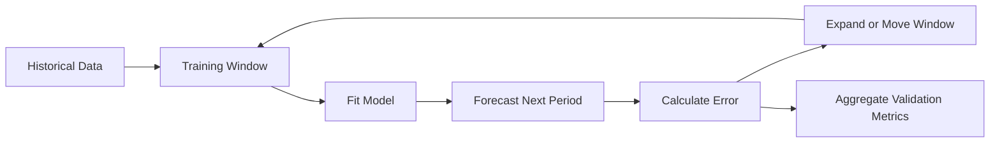

Walk-forward validation is more realistic because it reproduces repeated forecasting in chronological order.

---

## 17. Expanding and Sliding Windows

### 17.1 Expanding Window

The training set grows over time.

```text
Fold 1: [1 2 3 4]             -> [5]
Fold 2: [1 2 3 4 5]           -> [6]
Fold 3: [1 2 3 4 5 6]         -> [7]
```

Advantages:

* Uses all available historical information
* Appropriate when older data remains relevant

---

### 17.2 Sliding Window

The training set keeps a fixed length.

```text
Fold 1: [1 2 3 4] -> [5]
Fold 2: [2 3 4 5] -> [6]
Fold 3: [3 4 5 6] -> [7]
```

Advantages:

* Reduces the influence of outdated observations
* Useful when the data-generating process changes over time

---

## 18. Forecast Evaluation Metrics

Let:

* (y_t) be the actual value
* (\hat{y}_t) be the predicted value
* (e_t = y_t - \hat{y}_t) be the forecast error

### 18.1 Mean Absolute Error

$$
\text{MAE} = \frac{1}{n} \sum_{t=1}^{n} |y_t-\hat{y}_t|
$$

Advantages:

* Easy to interpret
* Uses the same unit as the target
* Less sensitive to extreme errors than RMSE

---

### 18.2 Root Mean Squared Error

$$
\text{RMSE} = \sqrt{ \frac{1}{n} \sum_{t=1}^{n} (y_t-\hat{y}_t)^2 }
$$

Advantages:

* Penalizes large errors more strongly
* Useful when large mistakes are especially costly

---

### 18.3 Mean Absolute Percentage Error

$$
\text{MAPE} = \frac{100}{n} \sum_{t=1}^{n} \left| \frac{y_t-\hat{y}_t}{y_t} \right|
$$

Limitations:

* Undefined when (y_t=0)
* Unstable when actual values are close to zero
* Can create asymmetric penalties

---

### 18.4 Weighted Absolute Percentage Error

$$
\text{WAPE} = \frac{ \sum_{t=1}^{n}|y_t-\hat{y}_t| }{ \sum_{t=1}^{n}|y_t| } \times 100
$$

WAPE is often useful for evaluating aggregate demand forecasts.

---

### 18.5 Mean Absolute Scaled Error

$$
\text{MASE} = \frac{ \frac{1}{n} \sum_{t=1}^{n}|y_t-\hat{y}_t| }{ \frac{1}{T-1} \sum_{t=2}^{T}|y_t-y_{t-1}| }
$$

Interpretation:

* (\text{MASE}<1): better than the naive baseline
* (\text{MASE}>1): worse than the naive baseline

Metric selection should reflect the real cost of forecast errors.

---

## 19. End-to-End Time Series Workflow

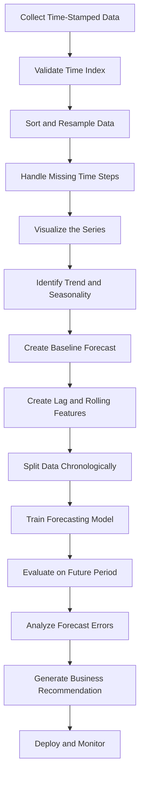

A robust forecasting project should begin with data validation and a baseline, not immediately with a complex model.

---

## 20. Practical Python Demo

The following example creates synthetic daily sales data with trend, weekly seasonality, and random noise.

```python
import numpy as np
import pandas as pd
import matplotlib.pyplot as plt
from sklearn.metrics import mean_absolute_error, mean_squared_error

rng = np.random.default_rng(42)

dates = pd.date_range(
    start="2025-01-01",
    periods=240,
    freq="D",
)

trend = np.linspace(100, 180, len(dates))

weekly_pattern = np.array([
    -10,  # Monday
    -5,   # Tuesday
    0,    # Wednesday
    4,    # Thursday
    10,   # Friday
    25,   # Saturday
    18,   # Sunday
])

seasonality = np.array([
    weekly_pattern[date.dayofweek]
    for date in dates
])

noise = rng.normal(
    loc=0,
    scale=8,
    size=len(dates),
)

sales = trend + seasonality + noise

df = pd.DataFrame({
    "date": dates,
    "sales": sales,
})

df = df.set_index("date")

print(df.head())
```

### Plot the Series

```python
fig, ax = plt.subplots(figsize=(12, 5))

ax.plot(df.index, df["sales"])
ax.set_title("Daily Sales")
ax.set_xlabel("Date")
ax.set_ylabel("Sales")

plt.tight_layout()
plt.show()
```

---

## 21. Add Rolling Statistics

```python
df["rolling_mean_7"] = (
    df["sales"]
    .rolling(window=7)
    .mean()
)

df["rolling_std_7"] = (
    df["sales"]
    .rolling(window=7)
    .std()
)
```

Plot the original series and rolling mean:

```python
fig, ax = plt.subplots(figsize=(12, 5))

ax.plot(
    df.index,
    df["sales"],
    label="Daily sales",
    alpha=0.6,
)

ax.plot(
    df.index,
    df["rolling_mean_7"],
    label="7-day rolling mean",
)

ax.set_title("Daily Sales and Rolling Mean")
ax.set_xlabel("Date")
ax.set_ylabel("Sales")
ax.legend()

plt.tight_layout()
plt.show()
```

The rolling mean makes the long-term trend easier to see by reducing daily noise.

---

## 22. Create Lag Features

```python
df["lag_1"] = df["sales"].shift(1)
df["lag_7"] = df["sales"].shift(7)
df["lag_14"] = df["sales"].shift(14)

df["previous_7_day_mean"] = (
    df["sales"]
    .shift(1)
    .rolling(window=7)
    .mean()
)
```

The `shift(1)` is important because it prevents the current target from leaking into the rolling feature.

---

## 23. Create a Chronological Split

Use the final 30 days as the test set.

```python
test_size = 30

train = df.iloc[:-test_size].copy()
test = df.iloc[-test_size:].copy()

print("Training period:")
print(train.index.min(), "to", train.index.max())

print("\nTesting period:")
print(test.index.min(), "to", test.index.max())
```

The training period occurs entirely before the testing period.

---

## 24. Evaluate Baseline Forecasts

### 24.1 Naive Baseline

```python
test["naive_forecast"] = test["lag_1"]
```

### 24.2 Seasonal Naive Baseline

```python
test["seasonal_naive_forecast"] = test["lag_7"]
```

### 24.3 Seven-Day Moving-Average Baseline

```python
test["moving_average_forecast"] = test["previous_7_day_mean"]
```

### Evaluation Function

```python
def evaluate_forecast(
    actual: pd.Series,
    predicted: pd.Series,
) -> dict[str, float]:
    valid = actual.notna() & predicted.notna()

    y_true = actual.loc[valid]
    y_pred = predicted.loc[valid]

    mae = mean_absolute_error(y_true, y_pred)
    rmse = mean_squared_error(
        y_true,
        y_pred,
    ) ** 0.5

    return {
        "MAE": mae,
        "RMSE": rmse,
    }
```

Compare the baselines:

```python
results = {
    "Naive": evaluate_forecast(
        test["sales"],
        test["naive_forecast"],
    ),
    "Seasonal Naive": evaluate_forecast(
        test["sales"],
        test["seasonal_naive_forecast"],
    ),
    "Moving Average": evaluate_forecast(
        test["sales"],
        test["moving_average_forecast"],
    ),
}

results_df = (
    pd.DataFrame(results)
    .T
    .sort_values("MAE")
)

print(results_df)
```

Because the synthetic data contains weekly seasonality, the seasonal naive baseline may perform very well.

---

## 25. Visualize the Forecast

```python
fig, ax = plt.subplots(figsize=(12, 5))

ax.plot(
    test.index,
    test["sales"],
    label="Actual",
)

ax.plot(
    test.index,
    test["seasonal_naive_forecast"],
    label="Seasonal naive forecast",
)

ax.set_title("Actual Sales vs. Seasonal Naive Forecast")
ax.set_xlabel("Date")
ax.set_ylabel("Sales")
ax.legend()

plt.tight_layout()
plt.show()
```

A forecast should be evaluated both numerically and visually.

A metric may hide problems such as:

* Systematic underprediction
* Missed demand peaks
* Delayed reaction to changes
* Poor weekend performance
* Errors concentrated in important periods

---

## 26. Forecast Error Analysis

The residual or forecast error is:

$$
e_t = y_t - \hat{y}_t
$$

Create forecast errors:

```python
test["forecast_error"] = (
    test["sales"]
    - test["seasonal_naive_forecast"]
)
```

Plot errors over time:

```python
fig, ax = plt.subplots(figsize=(12, 4))

ax.plot(
    test.index,
    test["forecast_error"],
)

ax.axhline(
    y=0,
    linestyle="--",
)

ax.set_title("Forecast Errors Over Time")
ax.set_xlabel("Date")
ax.set_ylabel("Error")

plt.tight_layout()
plt.show()
```

A useful model should produce errors that:

* Have an average close to zero
* Do not show a clear trend
* Do not retain strong seasonality
* Do not become increasingly variable
* Do not contain unexplained systematic patterns

If errors remain structured, the model has not captured all available information.

---

## 27. Common Time Series Models

| Model                    | Main Idea                             | Typical Use                       |
| ------------------------ | ------------------------------------- | --------------------------------- |
| Naive                    | Use the latest value                  | Simple benchmark                  |
| Seasonal naive           | Use the same previous season          | Strong regular seasonality        |
| Moving average           | Average recent observations           | Smooth short-term noise           |
| Exponential smoothing    | Weight recent values more strongly    | Level, trend, and seasonality     |
| ARIMA                    | Model lags and differenced series     | Classical univariate forecasting  |
| SARIMA                   | ARIMA with seasonal structure         | Seasonal univariate series        |
| Linear regression        | Use lag and calendar features         | Interpretable feature-based model |
| Random forest            | Learn nonlinear feature relationships | Structured lag features           |
| Gradient boosting        | Powerful tabular forecasting          | Business forecasting              |
| Prophet-style model      | Trend, holidays, and seasonality      | Business time series              |
| Recurrent neural network | Model temporal sequences              | Complex sequential patterns       |
| Temporal transformer     | Learn long-range dependencies         | Large and multivariate datasets   |

Model complexity should be justified by measurable improvement over a strong baseline.

---

## 28. Time Series Feature Engineering

### 28.1 Calendar Features

Useful calendar variables include:

```python
df["day_of_week"] = df.index.dayofweek
df["day_of_month"] = df.index.day
df["month"] = df.index.month
df["quarter"] = df.index.quarter
df["is_weekend"] = (
    df.index.dayofweek >= 5
).astype(int)
```

Additional features may include:

* Public holidays
* Payday periods
* School holidays
* Promotion periods
* Product launches
* Weather conditions
* Special events

---

### 28.2 Lag Features

```python
for lag in [1, 2, 3, 7, 14, 28]:
    df[f"lag_{lag}"] = df["sales"].shift(lag)
```

---

### 28.3 Rolling Features

```python
for window in [7, 14, 28]:
    shifted_sales = df["sales"].shift(1)

    df[f"rolling_mean_{window}"] = (
        shifted_sales
        .rolling(window)
        .mean()
    )

    df[f"rolling_std_{window}"] = (
        shifted_sales
        .rolling(window)
        .std()
    )
```

---

### 28.4 Change Features

```python
df["difference_1"] = df["sales"].diff(1)
df["difference_7"] = df["sales"].diff(7)
df["percentage_change_1"] = df["sales"].pct_change(1)
```

These features describe recent movement rather than absolute level.

---

## 29. Data Leakage in Time Series

Time series leakage occurs when information unavailable at prediction time enters the model.

### Leakage Example 1: Random Split

```python
from sklearn.model_selection import train_test_split

X_train, X_test, y_train, y_test = train_test_split(
    X,
    y,
    test_size=0.2,
    shuffle=True,
)
```

This is usually unsafe for forecasting because future observations may enter the training set.

---

### Leakage Example 2: Unshifted Rolling Mean

```python
df["rolling_mean_7"] = (
    df["sales"]
    .rolling(7)
    .mean()
)
```

This feature includes the current target value.

A safer version is:

```python
df["rolling_mean_7"] = (
    df["sales"]
    .shift(1)
    .rolling(7)
    .mean()
)
```

---

### Leakage Example 3: Future External Variables

Suppose tomorrow's actual weather is used to forecast tomorrow's sales. This is valid only if the actual weather value is genuinely available at prediction time.

Otherwise, the model should use:

* A weather forecast
* A historical average
* A scenario-based estimate

Every feature should be evaluated using one question:

> Would this exact value be available when the prediction is generated?

---

## 30. Missing Values in Time Series

Missing timestamps and missing measurements are different problems.

### Missing Timestamp

A date or time interval is absent from the index.

Example:

```text
10:00
11:00
13:00
```

The 12:00 timestamp is missing.

### Missing Measurement

The timestamp exists, but its value is missing.

```text
10:00    14.2
11:00    NaN
12:00    14.8
```

Possible strategies include:

* Forward fill
* Backward fill
* Linear interpolation
* Seasonal interpolation
* Model-based imputation
* Leave missing
* Add a missing-value indicator

The method must reflect the meaning of the data. For example, missing sales and zero sales are not necessarily the same.

---

## 31. Resampling

Time series data may need to be converted to another frequency.

### Daily to Weekly

```python
weekly_sales = (
    df["sales"]
    .resample("W")
    .sum()
)
```

### Hourly to Daily Average

```python
daily_average = (
    hourly_df["temperature"]
    .resample("D")
    .mean()
)
```

The aggregation function depends on the variable:

| Variable          | Common Aggregation     |
| ----------------- | ---------------------- |
| Sales             | Sum                    |
| Temperature       | Mean                   |
| Maximum CPU usage | Maximum                |
| Inventory level   | Last observation       |
| Number of events  | Count                  |
| Price             | Open, high, low, close |

Incorrect aggregation can change the meaning of the series.

---

## 32. Business Example: Sales Forecasting

Suppose a retailer wants to forecast sales for the next seven days.

### Inputs

* Historical daily sales
* Day of week
* Public holidays
* Promotions
* Product price
* Weather forecast
* Inventory level

### Workflow

```text
Historical sales
      ↓
Validate timestamps and missing periods
      ↓
Plot trend and weekly seasonality
      ↓
Create seasonal naive baseline
      ↓
Create lag and rolling features
      ↓
Train model using past observations
      ↓
Evaluate on later periods
      ↓
Forecast the next seven days
      ↓
Recommend inventory and staffing levels
```

### Possible Business Output

```text
Forecast:
Expected demand will increase by approximately 18% this weekend.

Recommendation:
Increase inventory for the top three products and schedule
additional staff between 17:00 and 21:00 on Saturday.
```

The forecast is valuable only when it leads to an operational decision.

---

## 33. Time Series in an AI and Data Science Workflow

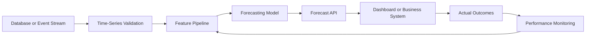

A production forecasting system may include:

* Scheduled data ingestion
* Feature generation
* Model training
* Model registry
* Batch forecasting
* Real-time inference
* Forecast storage
* Monitoring
* Automatic retraining
* Drift detection

---

## 34. Model Monitoring

Forecasting performance may deteriorate because:

* Customer behavior changes
* Seasonality shifts
* Product prices change
* New competitors appear
* Data pipelines fail
* External conditions change
* The target distribution changes

Useful monitoring metrics include:

* MAE by day
* RMSE by forecast horizon
* WAPE by product
* Forecast bias
* Missing input rate
* Feature drift
* Prediction interval coverage
* Baseline comparison

Forecast bias can be estimated as:

$$
\text{Bias} = \frac{1}{n} \sum_{t=1}^{n} (\hat{y}_t-y_t)
$$

A positive bias means systematic overprediction under this definition. A negative bias means systematic underprediction.

Always document the sign convention because some teams define forecast error in the opposite direction.

---

## 35. Common Mistakes

### 35.1 Randomly Shuffling Time Series Data

This mixes past and future information and creates unrealistic evaluation results.

### 35.2 Ignoring the Baseline

A complicated model may appear accurate but still perform worse than using last week's value.

### 35.3 Using Future Information

Unshifted rolling statistics, future promotions, or actual future weather can create leakage.

### 35.4 Ignoring Missing Time Intervals

Missing timestamps can distort rolling statistics and seasonal analysis.

### 35.5 Assuming Every Pattern Is Seasonal

Some repeating-looking patterns may be temporary cycles or random coincidence.

### 35.6 Evaluating Only One Period

A model may perform well during one month and fail during holidays or demand peaks.

### 35.7 Optimizing Only a Global Average Metric

A good overall MAE may hide poor performance for important products, regions, or peak periods.

### 35.8 Ignoring Forecast Horizon

A model that performs well one day ahead may perform poorly thirty days ahead.

### 35.9 Treating Forecasts as Certain

Forecasts should include uncertainty, especially for long horizons.

### 35.10 Building a Model Without a Decision

A technically accurate forecast has limited value if no business process uses it.

---

## 36. Practical Exercise

Use a small time series dataset such as:

* Daily sales
* Website traffic
* Electricity consumption
* Temperature
* Cryptocurrency price
* Server response time
* Number of application users

Complete the following tasks:

1. Parse the timestamp column.
2. Sort observations chronologically.
3. Check for duplicate timestamps.
4. Check for missing time intervals.
5. Plot the raw series.
6. Describe its trend.
7. Identify possible seasonality.
8. Create lag-1 and lag-7 features.
9. Create a seven-period rolling mean.
10. Reserve the final 20% of observations as the test set.
11. Create a naive forecast.
12. Create a seasonal naive forecast.
13. Calculate MAE and RMSE.
14. Plot actual values against forecasts.
15. Write one business recommendation.

---

## 37. Suggested Notebook Structure

```text
01. Problem Definition
02. Dataset Description
03. Time Index Validation
04. Missing-Value Analysis
05. Exploratory Visualization
06. Trend and Seasonality Analysis
07. Baseline Forecasts
08. Feature Engineering
09. Temporal Train/Test Split
10. Model Training
11. Forecast Evaluation
12. Error Analysis
13. Business Recommendation
14. Assumptions and Limitations
```

---

## 38. Reflection Questions

1. Why is observation order important in time series data?
2. What is the difference between trend and seasonality?
3. How does seasonality differ from a business cycle?
4. What does a lag feature represent?
5. Why can an unshifted rolling mean cause leakage?
6. Why should a time series not normally be split randomly?
7. When is a seasonal naive forecast appropriate?
8. What does autocorrelation at lag 7 suggest for daily data?
9. Why might forecasting accuracy decrease at longer horizons?
10. What real decision will use the forecast?

---

## 39. Completion Checklist

* [ ] I can explain time series data in one or two minutes.
* [ ] I can distinguish trend, seasonality, cycles, and noise.
* [ ] I understand lagged observations.
* [ ] I can calculate a rolling statistic.
* [ ] I understand autocorrelation conceptually.
* [ ] I can explain why random splitting causes leakage.
* [ ] I can create a chronological train/test split.
* [ ] I can implement naive and seasonal naive baselines.
* [ ] I can evaluate forecasts with MAE and RMSE.
* [ ] I can identify at least one assumption or limitation.
* [ ] I have created a notebook, chart, model, API, or portfolio note.
* [ ] I can connect the forecast to a business decision.

---

## 40. Related Outcome

Model relationships and time-dependent data using:

* Regression
* Residual diagnostics
* Lag features
* Rolling statistics
* Autocorrelation
* Stationarity
* ARIMA
* Forecast evaluation
* Production monitoring

---

## 41. Related Project

### Mini Project: Sales Forecasting

Build a daily sales forecasting workflow containing:

1. Time-index validation
2. Trend visualization
3. Weekly seasonality analysis
4. Lag and rolling features
5. Naive baseline
6. Seasonal naive baseline
7. Chronological train/test split
8. Optional ARIMA or machine learning model
9. MAE and RMSE comparison
10. Forecast visualization
11. Business recommendation

### Suggested Portfolio Artifacts

* Jupyter notebook
* Forecasting report
* Interactive dashboard
* REST forecasting API
* Dockerized forecasting service
* Scheduled batch prediction pipeline
* Model monitoring dashboard

---

## 42. Key Takeaways

1. Time series observations are ordered and often dependent.
2. Common components include trend, seasonality, cycles, and noise.
3. Lagged observations and rolling statistics summarize historical behavior.
4. Autocorrelation measures relationships between observations separated by time.
5. Temporal order must be preserved during training and evaluation.
6. Random train/test splitting can produce future-data leakage.
7. Simple baselines are essential for determining whether a model adds value.
8. Seasonal naive forecasts can be extremely strong when seasonality is stable.
9. Forecast performance should be evaluated across multiple historical periods.
10. A forecast becomes valuable when it supports a real decision.

---

## 43. Summary

**Time Series Basics** provides the foundation for working with data observed over time.

A complete time series workflow is:

```text
Time-stamped data
      ↓
Validate chronological structure
      ↓
Identify trend, seasonality and anomalies
      ↓
Create lag and rolling features
      ↓
Build simple baselines
      ↓
Split data chronologically
      ↓
Train and evaluate forecasting models
      ↓
Analyze forecast errors
      ↓
Generate a business recommendation
      ↓
Deploy and monitor performance
```

Do not stop after learning the definitions. Turn the lesson into a practical artifact such as a notebook, chart, forecasting model, API, Docker service, dashboard, or portfolio report.
````

### 2. `01 - AI & Dữ liệu/02 - Data Science, Analytics & ML/ai-data-scientist-roadmap/AI-Data-Scientist-Roadmap-Course/00 - Roadmap.sh AI Data Scientist Official/03 - Machine Learning and Deep Learning/Module 06 - Machine Learning/05-Features/025 - Feature Engineering.md`

Nguồn: `01 - AI & Dữ liệu/02 - Data Science, Analytics & ML/ai-data-scientist-roadmap/AI-Data-Scientist-Roadmap-Course/00 - Roadmap.sh AI Data Scientist Official/03 - Machine Learning and Deep Learning/Module 06 - Machine Learning/05-Features/025 - Feature Engineering.md`

````markdown
# 025 - Feature Engineering

**Course:** 03 - Machine Learning and Deep Learning
**Module:** Module 06 - Machine Learning
**Content Group:** Feature Engineering
**Roadmap Source:** Machine Learning / Feature Engineering
**Lesson Type:** Machine Learning
**Order in Module:** 025
**Suggested Duration:** 26 minutes

---

## 1. Summary

**Feature engineering** is the process of transforming raw data into meaningful inputs that help a machine learning model learn useful patterns.

Raw datasets often contain information that is:

* Missing or inconsistent.
* Stored in inconvenient formats.
* Highly skewed.
* Categorical rather than numerical.
* Distributed across several columns.
* Difficult for a model to interpret directly.

Feature engineering converts this raw information into features that better represent the underlying business problem.

Examples include:

* Scaling numerical values.
* Encoding categorical variables.
* Extracting year, month, weekday, or hour from timestamps.
* Creating price-per-unit or ratio features.
* Grouping continuous values into bins.
* Combining features through interactions.
* Transforming skewed variables.
* Extracting text statistics.
* Aggregating historical behavior.

Good feature engineering can improve:

* Predictive performance.
* Training stability.
* Model interpretability.
* Generalization to unseen data.
* Data quality.
* Production reliability.

However, feature engineering can also introduce **data leakage**, causing validation scores to appear unrealistically high.

---

## 2. Learning Objectives

By the end of this lesson, you should be able to:

* Explain feature engineering in your own words.
* Distinguish raw fields from model-ready features.
* Identify useful numerical, categorical, temporal, text, and interaction features.
* Apply common feature transformations.
* Build leakage-safe preprocessing pipelines.
* Compare model performance before and after feature engineering.
* Recognize unnecessary or harmful features.
* Perform feature engineering based on domain knowledge.
* Document assumptions and feature definitions.
* Apply feature engineering to a house price prediction project.

---

## 3. What Is a Feature?

A **feature** is an input variable used by a machine learning model to generate a prediction.

Suppose the objective is to predict the sale price of a house.

Raw fields may include:

| Raw Field         | Example      |
| ----------------- | ------------ |
| Construction date | `2008-06-15` |
| Sale date         | `2026-03-01` |
| Living area       | `145 m²`     |
| Bedrooms          | `3`          |
| Bathrooms         | `2`          |
| District          | `District 7` |
| Renovation date   | `2020-08-11` |

Possible engineered features include:

| Engineered Feature     |                     Example |
| ---------------------- | --------------------------: |
| Property age           |                    18 years |
| Years since renovation |                     6 years |
| Area per bedroom       |                     48.3 m² |
| Total rooms            |                           5 |
| Is renovated           |                           1 |
| Sale month             |                           3 |
| District encoded       | Numerical or one-hot values |

The engineered features make relevant relationships more explicit.

---

## 4. Feature Engineering Workflow

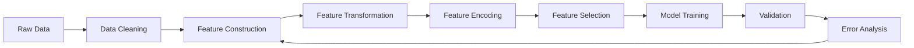

A more detailed workflow is:

```text
raw data
    -> inspect data quality
    -> define train, validation and test strategy
    -> clean invalid values
    -> create domain-based features
    -> encode categorical variables
    -> scale or transform numerical variables
    -> remove leakage and redundant features
    -> train baseline
    -> evaluate with cross-validation
    -> perform error analysis
    -> test the next feature hypothesis
```

Feature engineering should be an iterative process rather than a one-time preprocessing step.

---

## 5. Why Feature Engineering Matters

Different models understand data in different ways.

For example, consider a house's construction year:

```text
construction_year = 2005
```

The relationship between `2005` and the current value of the property may not be directly meaningful to the model.

A more useful representation may be:

$$
\text{property age} = \text{sale year} - \text{construction year}
$$

If the house was sold in 2026:

$$
\text{property age} = # 2026 - 2005 21
$$

The engineered feature directly represents how old the property was when sold.

Feature engineering helps the model by making important relationships easier to learn.

---

## 6. Raw Features Versus Engineered Features

Suppose a dataset contains:

```text
living_area = 150
bedrooms = 3
bathrooms = 2
construction_year = 2010
sale_year = 2026
renovation_year = 2020
```

Possible engineered features are:

```text
property_age = 2026 - 2010 = 16
years_since_renovation = 2026 - 2020 = 6
area_per_bedroom = 150 / 3 = 50
total_main_rooms = 3 + 2 = 5
is_renovated = 1
```

These features represent concepts that may influence price more directly than the original columns.

---

## 7. Main Categories of Feature Engineering

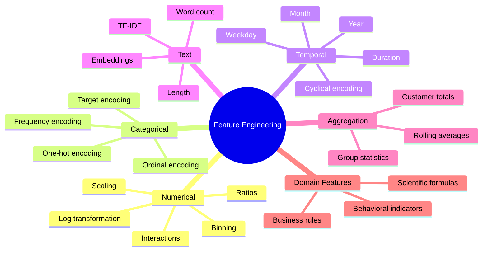

---

## 8. Numerical Feature Engineering

### 8.1 Standardization

Standardization transforms a numerical feature to have approximately:

* Mean equal to zero.
* Standard deviation equal to one.

The formula is:

$$
z = \frac{x-\mu}{\sigma}
$$

where:

* (x) is the original value.
* (\mu) is the training-set mean.
* (\sigma) is the training-set standard deviation.

Example:

```python
from sklearn.preprocessing import StandardScaler

scaler = StandardScaler()
X_scaled = scaler.fit_transform(X)
```

Standardization is often useful for:

* Linear Regression with regularization.
* Logistic Regression.
* K-Nearest Neighbors.
* Support Vector Machines.
* Neural networks.
* PCA.
* Clustering algorithms.

Tree-based models such as Random Forest and XGBoost usually do not require standardization.

---

### 8.2 Min-Max Scaling

Min-max scaling transforms values to a defined range, commonly from 0 to 1.

$$
x' = \frac{x-x_{\min}} {x_{\max}-x_{\min}}
$$

Example:

```python
from sklearn.preprocessing import MinMaxScaler

scaler = MinMaxScaler()
X_scaled = scaler.fit_transform(X)
```

It may be useful when:

* Features need a fixed range.
* A neural network is sensitive to input magnitude.
* Distance-based algorithms are used.

Min-max scaling can be sensitive to outliers.

---

### 8.3 Robust Scaling

Robust scaling uses the median and interquartile range instead of the mean and standard deviation.

$$
x' = \frac{x-\text{median}(x)} {Q_3-Q_1}
$$

Example:

```python
from sklearn.preprocessing import RobustScaler

scaler = RobustScaler()
X_scaled = scaler.fit_transform(X)
```

It may be useful when numerical features contain large outliers.

---

### 8.4 Log Transformation

A log transformation can reduce strong positive skew.

$$
x' = \log(1+x)
$$

The addition of 1 allows zero values to be transformed safely.

```python
import numpy as np

df["log_income"] = np.log1p(df["income"])
```

Example:

```text
Original values:
1,000
2,000
5,000
100,000

After log transformation:
6.91
7.60
8.52
11.51
```

Log transformations are commonly applied to:

* Income.
* Sales.
* House prices.
* Transaction values.
* Population.
* Website traffic.
* Count variables.

Do not apply a standard logarithm to negative values without designing an appropriate transformation.

---

### 8.5 Polynomial Features

Polynomial features allow a linear model to represent nonlinear relationships.

For one feature (x), second-degree polynomial features include:

$$
x
$$

and:

$$
x^2
$$

For two features (x_1) and (x_2), they may include:

$$
x_1,\quad x_2,\quad x_1^2,\quad x_2^2,\quad x_1x_2
$$

Example:

```python
from sklearn.preprocessing import PolynomialFeatures

poly = PolynomialFeatures(
    degree=2,
    include_bias=False
)

X_poly = poly.fit_transform(X)
```

Polynomial features can greatly increase dimensionality, so they should be used carefully.

---

## 9. Ratio Features

Ratios often represent efficiency, density, or relative scale.

Examples for house price prediction:

$$
\text{area per bedroom} = \frac{\text{living area}} {\text{number of bedrooms}}
$$

$$
\text{bathroom-to-bedroom ratio} = \frac{\text{bathrooms}} {\text{bedrooms}}
$$

$$
\text{land utilization} = \frac{\text{living area}} {\text{land area}}
$$

Python example:

```python
import numpy as np

df["area_per_bedroom"] = (
    df["living_area"]
    / df["bedrooms"].replace(0, np.nan)
)

df["bathroom_bedroom_ratio"] = (
    df["bathrooms"]
    / df["bedrooms"].replace(0, np.nan)
)
```

Always handle division by zero and missing values.

---

## 10. Interaction Features

An interaction feature represents the combined effect of two or more variables.

For example:

$$
\text{location quality} \times \text{living area}
$$

may be more informative than either feature independently.

```python
df["area_location_interaction"] = (
    df["living_area"]
    * df["location_score"]
)
```

Other examples include:

```text
advertising_budget × campaign_duration
income × credit_score
temperature × humidity
product_price × discount_rate
user_activity × account_age
```

Interaction features are especially helpful for linear models because tree-based models can often learn interactions automatically.

---

## 11. Binning Continuous Variables

Binning converts continuous values into categories.

For example, property age can be divided into:

```text
0-5 years      -> New
6-15 years     -> Modern
16-30 years    -> Mature
31+ years      -> Old
```

Python example:

```python
import pandas as pd

bins = [0, 5, 15, 30, float("inf")]
labels = ["new", "modern", "mature", "old"]

df["property_age_group"] = pd.cut(
    df["property_age"],
    bins=bins,
    labels=labels,
    include_lowest=True
)
```

Binning may help when:

* Relationships are not linear.
* Business rules use meaningful ranges.
* Interpretability is important.
* Extreme numerical precision is unnecessary.

However, binning also removes information. A property aged 6 years and one aged 15 years would belong to the same group.

---

## 12. Categorical Feature Engineering

Machine learning models usually require categorical values to be converted into numerical form.

Suppose the feature is:

```text
property_type:
- apartment
- townhouse
- villa
```

Several encoding methods are available.

---

### 12.1 One-Hot Encoding

One-hot encoding creates one binary column for each category.

| Property Type | Apartment | Townhouse | Villa |
| ------------- | --------: | --------: | ----: |
| Apartment     |         1 |         0 |     0 |
| Villa         |         0 |         0 |     1 |
| Townhouse     |         0 |         1 |     0 |

Example:

```python
from sklearn.preprocessing import OneHotEncoder

encoder = OneHotEncoder(
    handle_unknown="ignore"
)
```

Advantages:

* Simple and interpretable.
* Does not assume category order.
* Works well for low-cardinality features.

Disadvantages:

* Can create many columns.
* May be inefficient for high-cardinality features.

---

### 12.2 Ordinal Encoding

Ordinal encoding assigns ordered numerical values.

Example:

```text
poor      -> 0
average   -> 1
good      -> 2
excellent -> 3
```

```python
from sklearn.preprocessing import OrdinalEncoder

encoder = OrdinalEncoder(
    categories=[
        ["poor", "average", "good", "excellent"]
    ]
)
```

Use ordinal encoding only when categories have a real and meaningful order.

Do not encode unordered categories like this:

```text
Hanoi        -> 1
Da Nang      -> 2
Ho Chi Minh  -> 3
```

This would incorrectly imply that Ho Chi Minh City is numerically greater than Hanoi.

---

### 12.3 Frequency Encoding

Frequency encoding replaces each category with how frequently it appears.

Suppose:

| District | Number of Records |
| -------- | ----------------: |
| A        |               500 |
| B        |               300 |
| C        |               200 |

The frequency values are:

| District | Frequency |
| -------- | --------: |
| A        |      0.50 |
| B        |      0.30 |
| C        |      0.20 |

Example:

```python
frequency_map = (
    df["district"]
    .value_counts(normalize=True)
)

df["district_frequency"] = (
    df["district"]
    .map(frequency_map)
)
```

Frequency encoding can help with high-cardinality features but does not directly represent their relationship with the target.

---

### 12.4 Target Encoding

Target encoding replaces a category with a statistic calculated from the target.

For regression:

$$
\text{encoded category} = \text{mean}(y \mid \text{category})
$$

For example:

| District | Average House Price |
| -------- | ------------------: |
| A        |             300,000 |
| B        |             450,000 |
| C        |             270,000 |

Target encoding can be powerful, but it has a high leakage risk.

Incorrect approach:

```python
# Incorrect when applied to the entire dataset
district_mean = df.groupby("district")["price"].mean()
df["district_target_mean"] = df["district"].map(district_mean)
```

The target statistics must be learned only from the current training fold.

Safe implementations may use:

* Cross-fold target encoding.
* Smoothing.
* Minimum category counts.
* An encoder inside a cross-validation pipeline.

---

## 13. Handling High-Cardinality Categories

A categorical feature has high cardinality when it contains many unique values.

Examples:

* User ID.
* Product ID.
* Postal code.
* Street name.
* Device ID.
* Company name.

Possible strategies include:

* Group rare categories into `"other"`.
* Use frequency encoding.
* Use leakage-safe target encoding.
* Extract broader geographic information.
* Create category embeddings.
* Remove identifiers that do not generalize.

Example:

```python
category_counts = df["district"].value_counts()

rare_categories = category_counts[
    category_counts < 20
].index

df["district_clean"] = df["district"].where(
    ~df["district"].isin(rare_categories),
    "other"
)
```

Do not include an identifier simply because it is available.

---

## 14. Date and Time Features

Raw timestamps are often difficult for models to interpret.

Suppose a transaction timestamp is:

```text
2026-07-12 18:45:00
```

Possible features include:

```text
year = 2026
month = 7
day = 12
weekday = Sunday
hour = 18
is_weekend = 1
quarter = 3
```

Python example:

```python
df["transaction_time"] = pd.to_datetime(
    df["transaction_time"]
)

df["year"] = df["transaction_time"].dt.year
df["month"] = df["transaction_time"].dt.month
df["day"] = df["transaction_time"].dt.day
df["weekday"] = df["transaction_time"].dt.weekday
df["hour"] = df["transaction_time"].dt.hour
df["quarter"] = df["transaction_time"].dt.quarter

df["is_weekend"] = (
    df["weekday"] >= 5
).astype(int)
```

---

## 15. Duration Features

Durations are frequently more meaningful than raw dates.

For house price prediction:

$$
\text{property age} = \text{sale year} - \text{construction year}
$$

$$
\text{years since renovation} = \text{sale year} - \text{renovation year}
$$

Example:

```python
df["property_age"] = (
    df["sale_year"]
    - df["construction_year"]
)

df["years_since_renovation"] = (
    df["sale_year"]
    - df["renovation_year"]
)
```

When renovation information is missing, create an additional indicator:

```python
df["is_renovated"] = (
    df["renovation_year"].notna()
).astype(int)
```

A missing value can sometimes contain meaningful information.

---

## 16. Cyclical Encoding

Some time variables are cyclical.

For example:

* December is close to January.
* Sunday is close to Monday.
* Hour 23 is close to hour 0.

Encoding months as integers from 1 to 12 does not represent this relationship properly.

Cyclical encoding uses sine and cosine:

$$
x_{\sin} = \sin\left( 2\pi\frac{x}{T} \right)
$$

$$
x_{\cos} = \cos\left( 2\pi\frac{x}{T} \right)
$$

where (T) is the cycle length.

For months:

$$
T = 12
$$

Example:

```python
import numpy as np

df["month_sin"] = np.sin(
    2 * np.pi * df["month"] / 12
)

df["month_cos"] = np.cos(
    2 * np.pi * df["month"] / 12
)
```


This representation preserves the circular relationship.

---

## 17. Text Features

Text data can be converted into numerical features.

Suppose a property listing contains a description:

```text
Modern three-bedroom apartment near the city center.
```

Simple text features include:

```python
df["description_length"] = (
    df["description"]
    .fillna("")
    .str.len()
)

df["word_count"] = (
    df["description"]
    .fillna("")
    .str.split()
    .str.len()
)

df["contains_modern"] = (
    df["description"]
    .fillna("")
    .str.contains(
        "modern",
        case=False,
        regex=False
    )
    .astype(int)
)
```

More advanced representations include:

* Bag of Words.
* N-grams.
* TF-IDF.
* Word embeddings.
* Sentence embeddings.
* Transformer representations.

Example using TF-IDF:

```python
from sklearn.feature_extraction.text import TfidfVectorizer

vectorizer = TfidfVectorizer(
    max_features=5000,
    ngram_range=(1, 2),
    stop_words="english"
)
```

Text vectorizers should also be fitted only on training data.

---

## 18. Aggregation Features

Aggregation features summarize behavior across multiple records.

For customer churn prediction, features may include:

```text
total_orders
average_order_value
days_since_last_order
orders_last_30_days
maximum_purchase_value
percentage_of_refunded_orders
```

Example:

```python
customer_features = (
    transactions
    .groupby("customer_id")
    .agg(
        total_orders=("order_id", "nunique"),
        total_spend=("amount", "sum"),
        average_order_value=("amount", "mean"),
        last_order_date=("order_date", "max")
    )
    .reset_index()
)
```

For house price prediction, geographic aggregations may include:

```text
number of recent sales in the district
median historical price per square meter
distance to local facilities
average nearby school rating
```

Aggregation features must respect time.

A transaction from the future must not be included when creating a historical feature for an earlier transaction.

---

## 19. Rolling and Lag Features

Rolling and lag features are common in time series and behavioral data.

A lag feature uses a previous value:

$$
\text{lag}_1(t) = y_{t-1}
$$

A rolling mean may be:

$$
\text{rolling mean}_7(t) = \frac{1}{7} \sum_{i=1}^{7} y_{t-i}
$$

Example:

```python
df = df.sort_values("date")

df["sales_lag_1"] = df["sales"].shift(1)

df["sales_rolling_mean_7"] = (
    df["sales"]
    .shift(1)
    .rolling(window=7)
    .mean()
)
```

The `shift(1)` prevents the current target value from leaking into its own feature.

---

## 20. Missing-Value Features

Missing values should not always be treated only as a cleaning problem.

The fact that a value is missing may itself be informative.

Suppose renovation year is missing because the property has never been renovated.

Create:

```python
df["renovation_year_missing"] = (
    df["renovation_year"].isna()
).astype(int)
```

Then impute the numerical value separately.

```python
df["renovation_year"] = (
    df["renovation_year"]
    .fillna(df["construction_year"])
)
```

Possible missing-value strategies include:

* Mean imputation.
* Median imputation.
* Most-frequent category.
* Constant value such as `"unknown"`.
* Model-based imputation.
* Missingness indicator.
* Domain-specific replacement.

The best method depends on why the data is missing.

---

## 21. Domain-Based Feature Engineering

Domain knowledge is often the most valuable source of new features.

Examples:

### Finance

```text
debt-to-income ratio
credit utilization
payment delay frequency
income stability
```

### E-commerce

```text
days since last purchase
average basket size
discount usage rate
repeat purchase rate
```

### Healthcare

```text
body mass index
change in blood pressure
medication adherence
number of previous admissions
```

### House Prices

```text
property age
price per square meter
distance to city center
nearby school quality
room density
renovation recency
```

### Marketing

```text
click-through rate
conversion rate
cost per acquisition
engagement frequency
```

Strong domain features frequently outperform arbitrary mathematical transformations.

---

## 22. Feature Engineering and Different Model Types

Different models benefit from different transformations.

| Model               | Scaling             | One-Hot Encoding          | Interactions          | Nonlinear Transformations |
| ------------------- | ------------------- | ------------------------- | --------------------- | ------------------------- |
| Linear Regression   | Usually useful      | Required                  | Often useful          | Often useful              |
| Logistic Regression | Usually useful      | Required                  | Often useful          | Often useful              |
| K-Nearest Neighbors | Important           | Usually required          | Sometimes useful      | Useful                    |
| SVM                 | Important           | Usually required          | Sometimes useful      | Useful                    |
| Decision Tree       | Usually unnecessary | Depends on implementation | Learned automatically | Often unnecessary         |
| Random Forest       | Usually unnecessary | Depends on implementation | Learned automatically | Often unnecessary         |
| XGBoost             | Usually unnecessary | Depends on implementation | Learned automatically | Sometimes useful          |
| Neural Network      | Usually useful      | Required or embeddings    | Learned partially     | Often useful              |

Tree-based models can learn many nonlinear relationships and interactions automatically, but they still benefit from:

* Better data cleaning.
* Useful domain features.
* Temporal features.
* Aggregations.
* Leakage prevention.
* Removal of meaningless identifiers.

---

## 23. Feature Engineering Before or After Data Splitting?

The train, validation, and test design should be established before fitting data-dependent transformations.

Correct conceptual order:

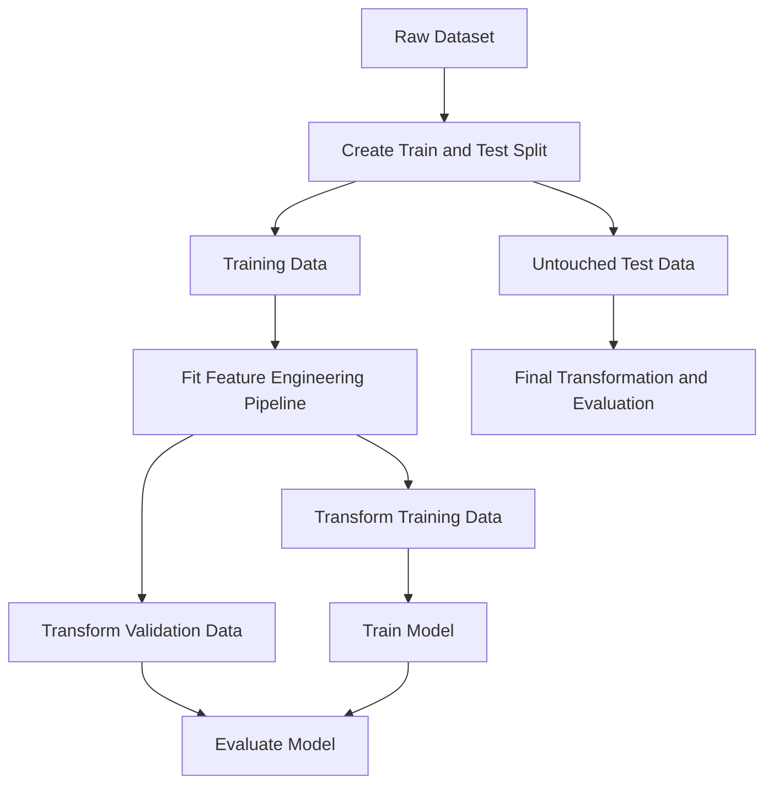

Some row-level deterministic features may be created before splitting, provided they do not use:

* The target.
* Future information.
* Statistics learned from the full dataset.
* Information from other rows that belong to validation or test data.

For safety and reproducibility, feature transformations should usually be implemented inside a pipeline.

---

## 24. Data Leakage

**Data leakage** occurs when information unavailable during real prediction is included in model training.

Leakage creates falsely high validation performance.

### Example 1: Future Information

Suppose the model predicts whether a loan will default.

A feature such as:

```text
final_collection_status
```

is determined only after default occurs.

It must not be used as an input.

---

### Example 2: Full-Dataset Scaling

Incorrect:

```python
scaler = StandardScaler()

X_scaled = scaler.fit_transform(X)

scores = cross_val_score(
    model,
    X_scaled,
    y,
    cv=5
)
```

The scaler uses statistics from validation observations.

Correct:

```python
from sklearn.pipeline import Pipeline

pipeline = Pipeline(
    steps=[
        ("scaler", StandardScaler()),
        ("model", model)
    ]
)

scores = cross_val_score(
    pipeline,
    X,
    y,
    cv=5
)
```

---

### Example 3: Target Encoding Before Splitting

Incorrect:

```python
district_price = (
    df.groupby("district")["price"].mean()
)

df["district_encoded"] = (
    df["district"].map(district_price)
)
```

The feature directly uses target information from all rows.

Use cross-fold target encoding or fit the encoder only within the training folds.

---

### Example 4: Aggregating Future Events

Suppose a churn model predicts customer churn on June 1.

A feature such as:

```text
number_of_orders_in_june
```

would contain future information.

Instead, use only events available before June 1.

---

## 25. Leakage Checklist

Before using a feature, ask:

1. Would this value be available at prediction time?
2. Does this feature directly or indirectly contain the target?
3. Was it calculated using validation or test observations?
4. Does it use future information?
5. Does it use statistics calculated from the full dataset?
6. Does it identify the exact entity rather than a generalizable pattern?
7. Was preprocessing fitted separately inside each cross-validation fold?

A suspiciously high validation score should trigger a leakage investigation.

---

## 26. Leakage-Safe Pipeline

A pipeline ensures that transformations are fitted only on the training portion of each fold.

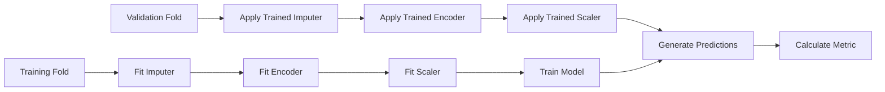

---

## 27. Complete Preprocessing Example

```python
from sklearn.compose import ColumnTransformer
from sklearn.impute import SimpleImputer
from sklearn.pipeline import Pipeline
from sklearn.preprocessing import OneHotEncoder, StandardScaler

numeric_features = [
    "living_area",
    "bedrooms",
    "bathrooms",
    "property_age",
    "area_per_bedroom"
]

categorical_features = [
    "district",
    "property_type",
    "property_age_group"
]

numeric_pipeline = Pipeline(
    steps=[
        (
            "imputer",
            SimpleImputer(strategy="median")
        ),
        (
            "scaler",
            StandardScaler()
        )
    ]
)

categorical_pipeline = Pipeline(
    steps=[
        (
            "imputer",
            SimpleImputer(strategy="most_frequent")
        ),
        (
            "encoder",
            OneHotEncoder(
                handle_unknown="ignore"
            )
        )
    ]
)

preprocessor = ColumnTransformer(
    transformers=[
        (
            "numeric",
            numeric_pipeline,
            numeric_features
        ),
        (
            "categorical",
            categorical_pipeline,
            categorical_features
        )
    ]
)
```

Combine preprocessing with a model:

```python
from sklearn.ensemble import RandomForestRegressor

model = RandomForestRegressor(
    n_estimators=300,
    random_state=42,
    n_jobs=-1
)

pipeline = Pipeline(
    steps=[
        ("preprocessor", preprocessor),
        ("model", model)
    ]
)
```

---

## 28. Custom Feature Transformer

Reusable feature engineering can be placed inside a custom transformer.

```python
import numpy as np
import pandas as pd

from sklearn.base import BaseEstimator, TransformerMixin


class HouseFeatureEngineer(
    BaseEstimator,
    TransformerMixin
):
    def fit(self, X, y=None):
        return self

    def transform(self, X):
        X = X.copy()

        X["property_age"] = (
            X["sale_year"]
            - X["construction_year"]
        )

        X["is_renovated"] = (
            X["renovation_year"].notna()
        ).astype(int)

        X["years_since_renovation"] = np.where(
            X["is_renovated"] == 1,
            X["sale_year"] - X["renovation_year"],
            X["property_age"]
        )

        safe_bedrooms = X["bedrooms"].replace(0, np.nan)

        X["area_per_bedroom"] = (
            X["living_area"]
            / safe_bedrooms
        )

        X["total_rooms"] = (
            X["bedrooms"]
            + X["bathrooms"]
        )

        return X
```

Use it in a pipeline:

```python
pipeline = Pipeline(
    steps=[
        (
            "feature_engineering",
            HouseFeatureEngineer()
        ),
        (
            "preprocessor",
            preprocessor
        ),
        (
            "model",
            model
        )
    ]
)
```

This makes the workflow:

* Reproducible.
* Easier to test.
* Safer during cross-validation.
* Easier to deploy.

---

## 29. Comparing Baseline and Engineered Features

Feature engineering should be evaluated as an experiment.

Suppose the baseline uses:

```text
living_area
bedrooms
bathrooms
district
property_type
```

The engineered version adds:

```text
property_age
years_since_renovation
is_renovated
area_per_bedroom
total_rooms
sale_month
```

Example results:

| Experiment                 | Mean CV RMSE | RMSE Std. |
| -------------------------- | -----------: | --------: |
| Median baseline            |       59,500 |     2,100 |
| Raw features               |       33,200 |     1,800 |
| Raw + age features         |       31,400 |     1,600 |
| Raw + age + ratio features |       29,800 |     1,500 |
| All engineered features    |       28,900 |     1,450 |

The results suggest that engineered features improve both:

* Average performance.
* Stability across folds.

However, the improvement should also be confirmed on the final test set.

---

## 30. Feature Ablation

Feature ablation measures the effect of adding or removing a feature or feature group.

Example:

| Feature Set              | CV RMSE |
| ------------------------ | ------: |
| Base features            |  33,200 |
| Base + property age      |  31,900 |
| Base + location features |  30,700 |
| Base + ratio features    |  32,800 |
| All features             |  29,600 |

Ablation helps answer:

* Which feature group provides the most value?
* Is a feature unnecessary?
* Does a feature increase instability?
* Is a complex feature worth its maintenance cost?

A useful experiment changes only one major component at a time.

---

## 31. Feature Selection

Feature engineering creates features, while **feature selection** decides which features should remain.

Reasons to remove a feature include:

* It contains leakage.
* It is unavailable in production.
* It is mostly missing.
* It duplicates another feature.
* It adds noise.
* It creates excessive complexity.
* It increases training cost without improving performance.
* It causes unstable behavior.

Common feature selection methods include:

* Domain-based selection.
* Variance threshold.
* Correlation analysis.
* Recursive feature elimination.
* L1 regularization.
* Tree-based feature importance.
* Permutation importance.
* Mutual information.

More features do not automatically produce a better model.

---

## 32. Correlated and Redundant Features

Highly correlated features can cause problems for some models.

Example:

```text
living_area_m2
living_area_ft2
```

These features represent the same information in different units.

For linear regression, strong multicollinearity can make coefficients unstable.

Possible actions:

* Remove one feature.
* Combine them.
* Apply regularization.
* Use dimensionality reduction.
* Keep both only when the model and use case justify it.

Correlation alone should not determine feature removal. Two correlated features may still contain different predictive information.

---

## 33. Feature Importance Is Not Causality

A feature may be predictive without causing the outcome.

For example, an expensive postal code may strongly predict house price, but the numerical postal code itself does not cause a property to become expensive.

Feature importance answers:

> Which features help this model make predictions?

It does not necessarily answer:

> Which variables cause the outcome to change?

Causal conclusions require a different analysis design.

---

## 34. Training-Serving Skew

Training-serving skew occurs when features are calculated differently during training and production.

Examples:

* Different missing-value rules.
* Different category mappings.
* Different time zones.
* Different text normalization.
* Different aggregation windows.
* A feature available offline but unavailable in real time.

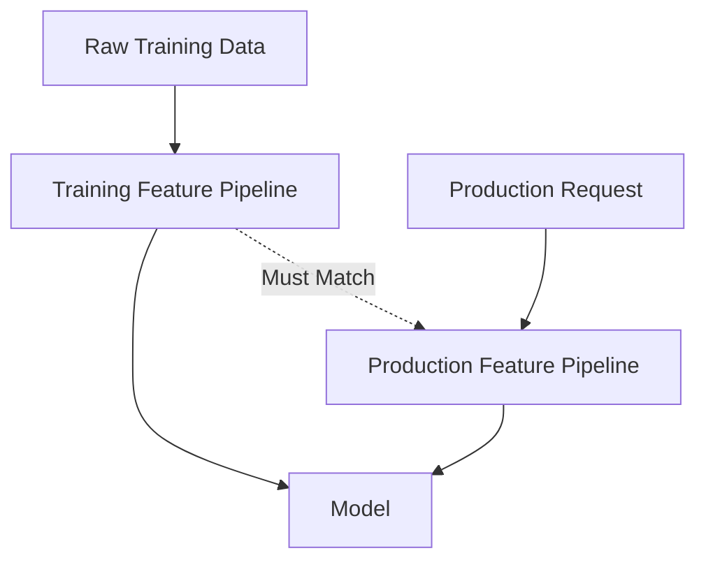

To reduce skew:

* Reuse the same transformation code.
* Save fitted preprocessing objects.
* Version feature definitions.
* Test training and production outputs.
* Monitor feature distributions.
* Document data dependencies.

---

## 35. Common Mistakes

### 35.1 Creating Features Without a Hypothesis

Do not create random features only because they are mathematically possible.

Each feature should have a reason:

```text
Hypothesis:
Older properties may have lower prices after controlling for location and area.

Feature:
property_age = sale_year - construction_year
```

---

### 35.2 Fitting Transformations on the Full Dataset

Scaling, imputation, encoding, and feature selection must be fitted only on training data.

Use pipelines.

---

### 35.3 Using Future Information

Any feature unavailable at prediction time creates leakage.

This is especially common in:

* Time series.
* Churn prediction.
* Fraud detection.
* Credit risk.
* Medical prediction.

---

### 35.4 Treating Categories as Arbitrary Integers

Encoding unordered categories as `1, 2, 3` introduces a false order.

Use one-hot encoding or another appropriate method.

---

### 35.5 Ignoring Unknown Categories

Production data may contain categories not present during training.

Use:

```python
OneHotEncoder(handle_unknown="ignore")
```

or define an `"unknown"` category.

---

### 35.6 Creating Too Many Features

Excessive features can cause:

* Overfitting.
* Slower training.
* Higher memory usage.
* More difficult debugging.
* Harder deployment.
* Increased monitoring complexity.

Prefer useful and maintainable features.

---

### 35.7 Using IDs as Predictive Features

User IDs, transaction IDs, and row numbers may allow memorization but usually do not generalize.

Ask whether the ID represents useful structure or only identity.

---

### 35.8 Evaluating Features on the Test Set Repeatedly

Feature selection should use training data and cross-validation.

The final test set should remain untouched until the model and features have been selected.

---

### 35.9 Forgetting Business Meaning

A feature may improve the score but be:

* Unavailable during inference.
* Expensive to calculate.
* Legally restricted.
* Difficult to explain.
* Unstable over time.
* Unfair to certain groups.

Model performance is only one part of feature quality.

---

## 36. Feature Engineering Evaluation Framework

Evaluate every important feature using four dimensions.

### Predictive Value

* Does it improve cross-validation performance?
* Does it reduce important business errors?
* Is the improvement stable across folds?

### Availability

* Is it available at prediction time?
* Is it available for every entity?
* How frequently is it updated?

### Reliability

* Is the source trustworthy?
* Can the feature change unexpectedly?
* How much missing data does it contain?

### Operational Cost

* Is it expensive to calculate?
* Does it increase prediction latency?
* Does it require an external service?
* Is it difficult to monitor?

A high-performing feature may still be rejected if it is operationally unreliable.

---

## 37. Suggested End-to-End Workflow

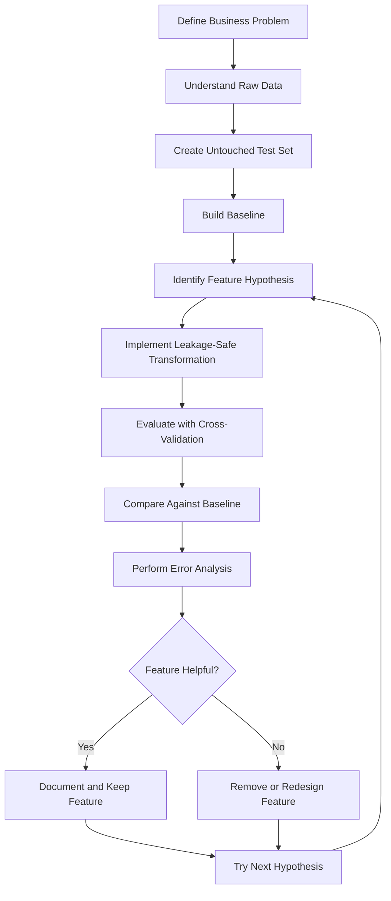

---

## 38. Practical Exercise

### Dataset

Use a house price dataset containing:

* Sale price.
* Living area.
* Land area.
* Bedrooms.
* Bathrooms.
* Construction year.
* Renovation year.
* Property type.
* District.
* Sale date.
* Distance to city center.

---

### Task 1: Build a Baseline

Train a baseline model using only the original features.

Possible models:

* Median prediction baseline.
* Linear Regression.
* Random Forest.

Evaluate with five-fold cross-validation using:

* MAE.
* RMSE.
* (R^2).

---

### Task 2: Create Age Features

Create:

```python
df["property_age"] = (
    df["sale_year"]
    - df["construction_year"]
)

df["is_renovated"] = (
    df["renovation_year"].notna()
).astype(int)

df["years_since_renovation"] = (
    df["sale_year"]
    - df["renovation_year"]
)
```

Handle invalid cases such as:

* Negative property age.
* Renovation before construction.
* Renovation after sale.
* Missing sale date.

---

### Task 3: Create Ratio Features

Create at least two features:

```python
df["area_per_bedroom"] = (
    df["living_area"]
    / df["bedrooms"].replace(0, np.nan)
)

df["bathroom_bedroom_ratio"] = (
    df["bathrooms"]
    / df["bedrooms"].replace(0, np.nan)
)

df["land_utilization"] = (
    df["living_area"]
    / df["land_area"].replace(0, np.nan)
)
```

---

### Task 4: Create Time Features

From the sale date, extract:

```python
df["sale_year"] = df["sale_date"].dt.year
df["sale_month"] = df["sale_date"].dt.month
df["sale_quarter"] = df["sale_date"].dt.quarter
```

Optionally add cyclical month encoding:

```python
df["sale_month_sin"] = np.sin(
    2 * np.pi * df["sale_month"] / 12
)

df["sale_month_cos"] = np.cos(
    2 * np.pi * df["sale_month"] / 12
)
```

---

### Task 5: Build a Leakage-Safe Pipeline

The pipeline should contain:

```text
custom feature construction
    -> missing-value imputation
    -> categorical encoding
    -> numerical scaling if needed
    -> model
```

Evaluate the complete pipeline using cross-validation.

---

### Task 6: Compare Experiments

Create an experiment table:

| Experiment   | Features                | Mean CV RMSE | CV Std. | Mean CV MAE |
| ------------ | ----------------------- | -----------: | ------: | ----------: |
| Baseline     | Raw fields              |              |         |             |
| Experiment 1 | Raw + age               |              |         |             |
| Experiment 2 | Raw + ratios            |              |         |             |
| Experiment 3 | Raw + time              |              |         |             |
| Experiment 4 | All engineered features |              |         |             |

Choose the final feature set based on:

* Mean performance.
* Score stability.
* Feature availability.
* Complexity.
* Business value.

---

### Task 7: Perform Error Analysis

Generate out-of-fold predictions and inspect errors by:

* District.
* Property type.
* Price range.
* Property age group.
* Renovation status.
* Missing-value patterns.

Questions to investigate:

```text
Does the model underestimate luxury properties?

Are older properties harder to predict?

Does the model perform worse in districts with fewer examples?

Are properties with missing renovation data associated with larger errors?

Do ratio features improve predictions for unusually large houses?
```

---

## 39. Feature Experiment Template

```markdown
## Feature Experiment

### Experiment Name

Property Age and Renovation Features

### Hypothesis

Property age and renovation recency provide more useful information than raw construction and renovation years.

### New Features

- property_age
- is_renovated
- years_since_renovation

### Definitions

property_age = sale_year - construction_year

years_since_renovation = sale_year - renovation_year

### Leakage Check

- Uses only information available at sale time.
- Does not use sale price.
- Does not use validation-set statistics.
- Implemented inside the preprocessing pipeline.

### Baseline Result

- Mean CV RMSE:
- CV standard deviation:
- Mean CV MAE:

### New Result

- Mean CV RMSE:
- CV standard deviation:
- Mean CV MAE:

### Error Analysis

- Improved segments:
- Degraded segments:
- Unexpected behavior:

### Decision

Keep, remove, or redesign the features.

### Next Experiment

Add area-per-bedroom and land-utilization features.
```

---

## 40. Feature Documentation Template

Each production feature should be documented.

| Field              | Description                      |
| ------------------ | -------------------------------- |
| Feature name       | `property_age`                   |
| Definition         | `sale_year - construction_year`  |
| Data type          | Integer                          |
| Unit               | Years                            |
| Source fields      | `sale_year`, `construction_year` |
| Availability       | Prediction time                  |
| Missing-value rule | Median imputation                |
| Valid range        | 0-200                            |
| Update frequency   | Per prediction                   |
| Leakage risk       | Low                              |
| Owner              | Data science team                |
| Version            | 1.0                              |

Feature documentation improves:

* Reproducibility.
* Collaboration.
* Deployment.
* Monitoring.
* Debugging.

---

## 41. Completion Checklist

* [ ] I can explain feature engineering in one or two minutes.
* [ ] I understand the difference between raw fields and model-ready features.
* [ ] I can create numerical, categorical, temporal, and interaction features.
* [ ] I know when scaling is necessary.
* [ ] I can choose an appropriate categorical encoding method.
* [ ] I can create ratio features safely.
* [ ] I can extract useful information from dates and timestamps.
* [ ] I understand cyclical encoding.
* [ ] I can identify possible target and time leakage.
* [ ] I fit preprocessing operations only on training data.
* [ ] I use pipelines during cross-validation.
* [ ] I have compared raw features with engineered features.
* [ ] I have performed at least one feature ablation experiment.
* [ ] I have documented the definition and assumptions of important features.
* [ ] I have considered whether each feature is available in production.
* [ ] I have recorded at least one caveat or next feature hypothesis.
* [ ] I have created a notebook, chart, model, API, or portfolio artifact for this lesson.

---

## 42. Key Takeaways

1. Feature engineering transforms raw data into useful model inputs.

2. Strong features represent the real structure of the business problem.

3. Common techniques include scaling, encoding, aggregation, binning, ratios, interactions, and time extraction.

4. Different models require different preprocessing strategies.

5. Domain knowledge is often more valuable than creating arbitrary mathematical transformations.

6. Data-dependent transformations must be fitted only on training data.

7. Pipelines help prevent data leakage and training-serving skew.

8. Target encoding, historical aggregations, and time-based features require special care.

9. More features do not automatically produce a better model.

10. Every feature should be tested through a reproducible experiment.

11. Cross-validation should be used to compare feature sets.

12. Feature availability, reliability, fairness, latency, and maintenance cost matter in production.

---

## 43. Related Outcome

Train, compare, and evaluate supervised and unsupervised machine learning models using:

* Thoughtful feature engineering.
* Leakage-safe preprocessing.
* Appropriate evaluation metrics.
* Cross-validation.
* Error analysis.
* Reproducible experiments.
* Production-aware feature design.

---

## 44. Related Project

### Mini Project: House Price Prediction

Build a complete machine learning workflow containing:

* Exploratory Data Analysis.
* Missing-value analysis.
* Numerical and categorical preprocessing.
* Property age features.
* Renovation features.
* Ratio and interaction features.
* Date and seasonal features.
* Median prediction baseline.
* Linear Regression.
* Random Forest.
* XGBoost or Gradient Boosting.
* Five-fold cross-validation.
* MAE, RMSE, and (R^2) comparison.
* Feature ablation.
* Out-of-fold error analysis.
* Final test evaluation.
* Prediction API or portfolio report.

Suggested project structure:

```text
house-price-project/
├── data/
│   ├── raw/
│   └── processed/
├── notebooks/
│   ├── 01_eda.ipynb
│   ├── 02_baseline.ipynb
│   ├── 03_feature_engineering.ipynb
│   ├── 04_model_comparison.ipynb
│   └── 05_error_analysis.ipynb
├── src/
│   ├── features.py
│   ├── preprocessing.py
│   ├── train.py
│   ├── evaluate.py
│   └── predict.py
├── models/
├── reports/
│   ├── feature_dictionary.md
│   ├── feature_experiments.csv
│   └── model_comparison.csv
├── tests/
│   └── test_features.py
├── app.py
├── requirements.txt
└── README.md
```

---

## 45. Conclusion

**Feature engineering** is one of the most important stages of a machine learning workflow.

It connects raw data with the business concepts that a model needs to understand. A strong feature may allow a simple model to outperform a complex model trained on poorly represented data.

A reliable feature engineering process includes:

```text
business understanding
    + data quality checks
    + meaningful feature hypotheses
    + leakage-safe transformations
    + pipeline implementation
    + cross-validation
    + feature ablation
    + error analysis
    + production monitoring
```

Turn this lesson into a practical artifact such as:

* A feature engineering notebook.
* A reusable preprocessing pipeline.
* A feature dictionary.
* A feature ablation report.
* A model comparison chart.
* A trained model.
* A prediction API.
* A Docker service.
* A portfolio project.

The goal is not to create the largest possible number of features. The goal is to create reliable, meaningful, and maintainable features that help the model solve a real problem.
````

### 3. `01 - AI & Dữ liệu/02 - Data Science, Analytics & ML/machine-learning-roadmap/Machine-Learning-Roadmap-Course/00 - Roadmap.sh Machine Learning Official/04 - Evaluation, Workflow and Deep Learning/Module 11 - Model Evaluation/01-WhatIsModel-BiasVarianceTradeoff/002 - Generalization.md`

Nguồn: `01 - AI & Dữ liệu/02 - Data Science, Analytics & ML/machine-learning-roadmap/Machine-Learning-Roadmap-Course/00 - Roadmap.sh Machine Learning Official/04 - Evaluation, Workflow and Deep Learning/Module 11 - Model Evaluation/01-WhatIsModel-BiasVarianceTradeoff/002 - Generalization.md`

````markdown
# 002 - Generalization

**Hoc phan:** 04 - Evaluation, Workflow and Deep Learning
**Module:** Module 11 - Model Evaluation
**Nhom noi dung:** Evaluation Basics
**Nguon roadmap:** Model Evaluation / Evaluation Basics
**Loai bai:** evaluation
**Thu tu trong module:** 002
**Thoi luong goi y:** 30 phut

---

## 1. Tom tat

Bai nay giai thich **Generalization** trong boi canh Machine Learning Engineer Roadmap 2026. Sau bai hoc, ban nen biet topic nay nam o dau trong quy trinh ML, lien quan den data, feature, model, training, evaluation, deployment hoac portfolio nhu the nao.

## 2. Muc tieu hoc tap

- Giai thich duoc Generalization bang ngon ngu cua ban.
- Nhan biet topic nay anh huong den model quality, generalization, interpretability, cost hoac production risk nao.
- Ap dung vao mot artifact nho: notebook, script, metric table, chart, diagram, model report hoac README.

## 3. Khai niem chinh

- Generalization is part of the Evaluation Basics topic in the Machine Learning roadmap.
- Learn it by connecting the definition, the dataset assumption, the model behavior and the evaluation impact.
- An ML Engineer should know where this concept appears in an end-to-end training workflow.

## 4. Thuc hanh

1. Calculate the metric or validation result on a small prediction table.
2. Explain when this metric is helpful and when it is misleading.
3. Connect the result to a decision: keep, tune, reject or investigate the model.

## 5. Bai tap

Calculate the metric or validation method on a model result and explain the decision it supports.

## 6. Checklist hoan thanh

- [ ] Co dinh nghia ngan gon.
- [ ] Co vi du trong bai toan ML.
- [ ] Co artifact nho de dua vao portfolio.
- [ ] Co ghi chu ve leakage, metric, overfitting, interpretability hoac production risk neu lien quan.

## 7. Ghi chu san xuat

Khi dua vao production, hay hoi: du lieu moi co giong train data khong, metric co phu hop business cost khong, model co drift khong, prediction co giai thich duoc khong va pipeline co tai lap duoc tu raw data den model artifact khong.
````

### 4. `01 - AI & Dữ liệu/02 - Data Science, Analytics & ML/machine-learning-roadmap/Machine-Learning-Roadmap-Course/00 - Roadmap.sh Machine Learning Official/04 - Evaluation, Workflow and Deep Learning/Module 11 - Model Evaluation/01-WhatIsModel-BiasVarianceTradeoff/003 - Overfitting.md`

Nguồn: `01 - AI & Dữ liệu/02 - Data Science, Analytics & ML/machine-learning-roadmap/Machine-Learning-Roadmap-Course/00 - Roadmap.sh Machine Learning Official/04 - Evaluation, Workflow and Deep Learning/Module 11 - Model Evaluation/01-WhatIsModel-BiasVarianceTradeoff/003 - Overfitting.md`

````markdown
# 003 - Overfitting

**Hoc phan:** 04 - Evaluation, Workflow and Deep Learning
**Module:** Module 11 - Model Evaluation
**Nhom noi dung:** Evaluation Basics
**Nguon roadmap:** Model Evaluation / Evaluation Basics
**Loai bai:** evaluation
**Thu tu trong module:** 003
**Thoi luong goi y:** 30 phut

---

## 1. Tom tat

Bai nay giai thich **Overfitting** trong boi canh Machine Learning Engineer Roadmap 2026. Sau bai hoc, ban nen biet topic nay nam o dau trong quy trinh ML, lien quan den data, feature, model, training, evaluation, deployment hoac portfolio nhu the nao.

## 2. Muc tieu hoc tap

- Giai thich duoc Overfitting bang ngon ngu cua ban.
- Nhan biet topic nay anh huong den model quality, generalization, interpretability, cost hoac production risk nao.
- Ap dung vao mot artifact nho: notebook, script, metric table, chart, diagram, model report hoac README.

## 3. Khai niem chinh

- Overfitting is part of the Evaluation Basics topic in the Machine Learning roadmap.
- Learn it by connecting the definition, the dataset assumption, the model behavior and the evaluation impact.
- An ML Engineer should know where this concept appears in an end-to-end training workflow.

## 4. Thuc hanh

1. Calculate the metric or validation result on a small prediction table.
2. Explain when this metric is helpful and when it is misleading.
3. Connect the result to a decision: keep, tune, reject or investigate the model.

## 5. Bai tap

Calculate the metric or validation method on a model result and explain the decision it supports.

## 6. Checklist hoan thanh

- [ ] Co dinh nghia ngan gon.
- [ ] Co vi du trong bai toan ML.
- [ ] Co artifact nho de dua vao portfolio.
- [ ] Co ghi chu ve leakage, metric, overfitting, interpretability hoac production risk neu lien quan.

## 7. Ghi chu san xuat

Khi dua vao production, hay hoi: du lieu moi co giong train data khong, metric co phu hop business cost khong, model co drift khong, prediction co giai thich duoc khong va pipeline co tai lap duoc tu raw data den model artifact khong.
````

### 5. `01 - AI & Dữ liệu/02 - Data Science, Analytics & ML/khoa-hoc-tinh-toan-tien-hoa/Chuong 03 - Lap Trinh Di Truyen/03-lap-trinh-di-truyen.md`

Nguồn: `01 - AI & Dữ liệu/02 - Data Science, Analytics & ML/khoa-hoc-tinh-toan-tien-hoa/Chuong 03 - Lap Trinh Di Truyen/03-lap-trinh-di-truyen.md`

````markdown
# Chương 3: Lập Trình Di Truyền

## Genetic Programming - GP

Ở Chương 2, ta đã học **Giải thuật di truyền - Genetic Algorithm (GA)**, trong đó mỗi cá thể thường được biểu diễn bằng một chuỗi có độ dài cố định như chuỗi bit, vector số thực hoặc chuỗi số nguyên.

Sang chương này, ta học một nhánh đặc biệt hơn của tính toán tiến hóa: **Lập trình di truyền - Genetic Programming (GP)**.

Khác với GA, trong GP, mỗi cá thể không còn là một chuỗi gen đơn giản mà là **một chương trình máy tính**, **một hàm số**, hoặc **một biểu thức toán học** được biểu diễn dưới dạng **cây cú pháp**.

---

## Mục Tiêu Bài Học

Sau chương này, bạn sẽ:

* Hiểu **Genetic Programming - GP** là gì.
* Biết điểm giống và khác nhau giữa **GA** và **GP**.
* Hiểu cách biểu diễn cá thể trong GP bằng **cây cấu trúc / cây cú pháp**.
* Nắm được khái niệm:

  * **Tập hàm - Function set**
  * **Tập kết thúc - Terminal set**
* Hiểu các toán tử chính trong GP:

  * Chọn lọc
  * Lai ghép
  * Đột biến
  * Đánh giá độ thích nghi
* Biết các loại đột biến phổ biến trong GP.
* Hiểu cách GP được dùng trong bài toán **hồi quy ký hiệu - Symbolic Regression**.
* Nhận biết vấn đề **bloat** và cách khắc phục.

---

# 1. Genetic Programming Là Gì?

**Genetic Programming - GP** là một thuật toán tiến hóa dùng để tìm kiếm hoặc tối ưu hóa **chương trình máy tính**, **hàm số**, hoặc **biểu thức toán học**.

Có thể xem GP là một dạng đặc biệt của **Genetic Algorithm - GA**.

Trong GA, cá thể thường là:

```text
[1, 0, 1, 1, 0, 0, 1]
```

hoặc:

```text
[2.5, -1.2, 0.7, 4.1]
```

Nhưng trong GP, cá thể có thể là một chương trình hoặc biểu thức như:

```text
x * ln(a) + sin(z) / exp(-x) - 3.4
```

Biểu thức này được biểu diễn dưới dạng cây.

---

## Ý Tưởng Chính Của GP

Thay vì con người viết sẵn chương trình giải bài toán, GP cố gắng để máy tính **tự tiến hóa ra chương trình tốt nhất**.

Nói cách khác:

> GP tìm một chương trình tối ưu trong không gian tất cả các chương trình có thể, sao cho chương trình đó đạt hiệu suất tốt nhất theo một hàm đánh giá cho trước.

Ví dụ:

* Tìm hàm số khớp với dữ liệu.
* Tìm biểu thức dự đoán giá nhà.
* Sinh luật điều khiển robot.
* Tối ưu kiến trúc mạng neural.
* Tự động sinh chương trình nhỏ để giải bài toán.

---

# 2. So Sánh GA Và GP

| Tiêu chí              | Genetic Algorithm - GA             | Genetic Programming - GP                  |
| --------------------- | ---------------------------------- | ----------------------------------------- |
| Cách biểu diễn cá thể | Chuỗi gen / nhiễm sắc thể          | Cây chương trình / cây biểu thức          |
| Độ dài cá thể         | Thường cố định                     | Có thể thay đổi                           |
| Cá thể đại diện cho   | Một lời giải hoặc bộ tham số       | Một hàm số hoặc chương trình              |
| Toán tử lai ghép      | Cắt và trao đổi đoạn chuỗi         | Trao đổi cây con                          |
| Toán tử đột biến      | Thay đổi alen / bit / giá trị      | Thay đổi nút, cây con, toán tử            |
| Kết quả đầu ra        | Vector tham số tối ưu              | Chương trình hoặc biểu thức tối ưu        |
| Ví dụ                 | Tối ưu lịch thi, trọng số, tham số | Tìm công thức toán học, sinh chương trình |

---

## Sơ Đồ So Sánh Trực Quan

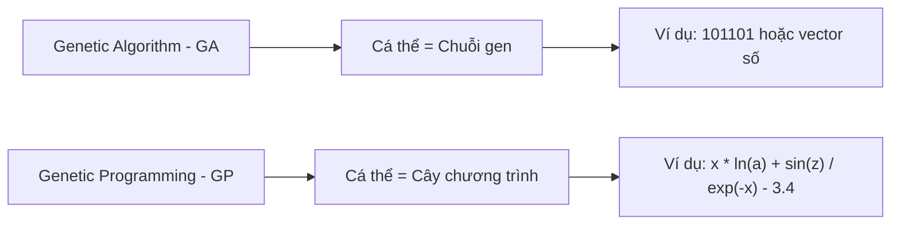

---

# 3. Sơ Đồ Tổng Quát Của Genetic Programming

Sơ đồ hoạt động của GP khá giống với GA.

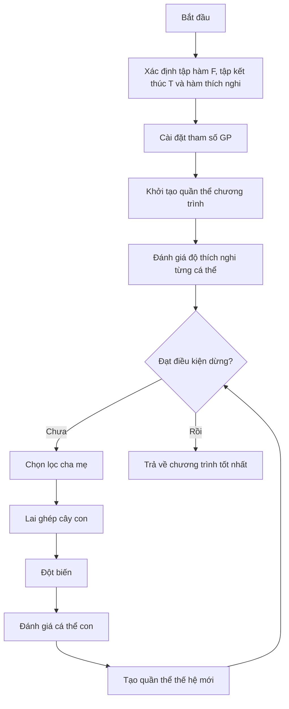

---

# 4. Mã Giả Thuật Toán GP

```text
begin
    Xác định tập hàm, tập kết thúc và hàm thích nghi;

    Cài đặt các tham số cho GP:
        - Kích thước quần thể
        - Số thế hệ
        - Xác suất lai ghép
        - Xác suất đột biến
        - Độ sâu tối đa của cây

    Khởi tạo quần thể ban đầu P;

    Tính toán độ thích nghi cho từng cá thể trong P;

    while chưa đạt điều kiện dừng do
        Chọn các cặp cha mẹ từ quần thể hiện tại P;

        Áp dụng toán tử lai ghép và đột biến
        để tạo ra quần thể con O;

        Tính toán độ thích nghi cho từng cá thể trong O;

        Chọn lọc các cá thể tốt cho thế hệ sau;

        Cập nhật quần thể P;
    end while

    Trả về cá thể có độ thích nghi tốt nhất;
end
```

---

# 5. Biểu Diễn Cá Thể Trong GP

Trong GP, mỗi cá thể được biểu diễn dưới dạng **cây cấu trúc** hoặc **cây cú pháp**.

Một cây GP gồm hai loại nút:

| Thành phần | Ý nghĩa                               |
| ---------- | ------------------------------------- |
| Nút trong  | Là toán tử hoặc hàm                   |
| Nút lá     | Là biến, hằng số hoặc giá trị đầu vào |

---

## 5.1. Tập Hàm - Function Set

**Tập hàm** là tập các toán tử hoặc hàm có thể xuất hiện tại các nút trong của cây.

Ví dụ:

```text
F = { +, -, *, /, ln, sin, exp }
```

Một số nhóm hàm thường gặp:

| Nhóm       | Ví dụ                                    |
| ---------- | ---------------------------------------- |
| Toán học   | `+`, `-`, `*`, `/`, `exp`, `log`, `sqrt` |
| Lượng giác | `sin`, `cos`, `tan`                      |
| Logic      | `and`, `or`, `xor`, `not`                |
| Điều kiện  | `if-then-else`                           |
| So sánh    | `>`, `<`, `>=`, `<=`, `==`               |

---

## 5.2. Tập Kết Thúc - Terminal Set

**Tập kết thúc** là tập các phần tử có thể xuất hiện ở nút lá.

Ví dụ:

```text
T = { x, a, z, 3.4 }
```

Tập kết thúc có thể gồm:

| Loại               | Ví dụ                         |
| ------------------ | ----------------------------- |
| Biến đầu vào       | `x`, `a`, `z`, `price`, `age` |
| Hằng số            | `1`, `2.5`, `3.4`, `-1`       |
| Giá trị ngẫu nhiên | `rand()`                      |
| Module cơ bản      | Các hàm con không có đối số   |

---

# 6. Ví Dụ Cây Biểu Diễn Chương Trình

Xét biểu thức:

```text
y := x * ln(a) + sin(z) / exp(-x) - 3.4
```

Tập kết thúc:

```text
T = { x, a, z, 3.4 }
```

Tập hàm:

```text
F = { *, +, -, /, ln, sin, exp }
```

Biểu thức trên có thể được biểu diễn bằng cây như sau:

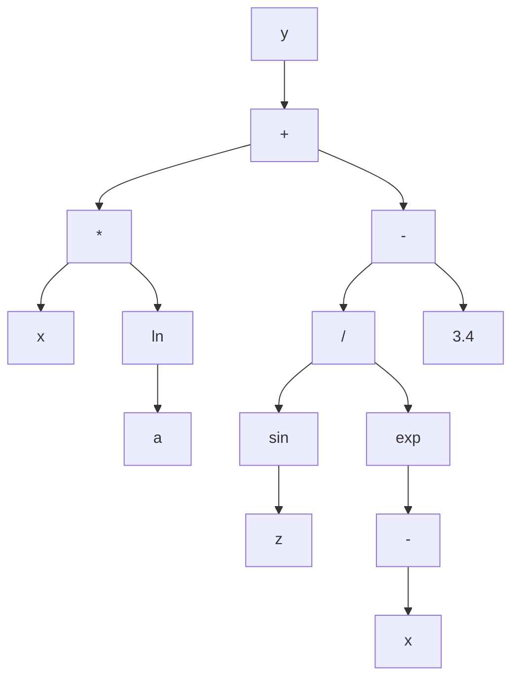

Cây trên tương ứng với biểu thức:

```text
y = x * ln(a) + sin(z) / exp(-x) - 3.4
```

Trong đó:

* Các nút `+`, `-`, `*`, `/`, `ln`, `sin`, `exp` là **nút hàm**.
* Các nút `x`, `a`, `z`, `3.4` là **nút kết thúc**.

---

# 7. Cách Khởi Tạo Cá Thể Trong GP

Khi khởi tạo một cá thể GP, ta cần sinh ra một cây ngẫu nhiên.

Quy tắc cơ bản:

* Nút gốc thường được chọn từ **tập hàm**.
* Nút không phải gốc có thể được chọn từ:

  * Tập hàm
  * Tập kết thúc
* Nếu chọn từ tập kết thúc, nút đó trở thành **nút lá**.
* Nếu chọn từ tập hàm, nút đó trở thành **nút trong**.
* Số nhánh con của một nút phụ thuộc vào số đối số của hàm tại nút đó.

Ví dụ:

| Hàm            | Số đối số | Số nhánh con |
| -------------- | --------: | -----------: |
| `+`            |         2 |            2 |
| `-`            |         2 |            2 |
| `*`            |         2 |            2 |
| `/`            |         2 |            2 |
| `sin`          |         1 |            1 |
| `ln`           |         1 |            1 |
| `exp`          |         1 |            1 |
| `if-then-else` |         3 |            3 |

---

## Các Phương Pháp Khởi Tạo Phổ Biến

| Phương pháp              | Cách hoạt động                                                 | Đặc điểm                                  |
| ------------------------ | -------------------------------------------------------------- | ----------------------------------------- |
| **Full**                 | Các nút trong đều là hàm cho đến độ sâu tối đa, lá là terminal | Cây đầy đủ, cân đối                       |
| **Grow**                 | Mỗi nút có thể là hàm hoặc terminal                            | Cây đa dạng hơn, không nhất thiết cân đối |
| **Ramped Half-and-Half** | Kết hợp Full và Grow ở nhiều độ sâu khác nhau                  | Phổ biến nhất, tạo quần thể đa dạng       |

---

# 8. Điều Kiện Đóng Và Điều Kiện Đầy Đủ

Khi thiết kế GP, tập hàm và tập kết thúc cần thỏa hai điều kiện quan trọng.

---

## 8.1. Điều Kiện Đóng - Closure Property

**Điều kiện đóng** yêu cầu mọi hàm trong tập hàm phải xử lý được mọi giá trị đầu vào có thể xuất hiện.

Ví dụ, nếu dùng phép chia `/`, cần xử lý trường hợp chia cho 0.

Thay vì dùng phép chia thường:

```text
a / b
```

ta dùng **phép chia bảo vệ**:

```text
protected_divide(a, b):
    nếu |b| rất nhỏ:
        trả về 1
    ngược lại:
        trả về a / b
```

Tương tự:

| Hàm       | Vấn đề     | Cách bảo vệ                   |
| --------- | ---------- | ----------------------------- |
| `/`       | Chia cho 0 | Protected division            |
| `log(x)`  | `x <= 0`   | Dùng `log(abs(x) + epsilon)`  |
| `sqrt(x)` | `x < 0`    | Dùng `sqrt(abs(x))`           |
| `exp(x)`  | Tràn số    | Giới hạn miền giá trị của `x` |

---

## 8.2. Điều Kiện Đầy Đủ - Sufficiency Property

**Điều kiện đầy đủ** yêu cầu tập hàm và tập kết thúc phải đủ mạnh để biểu diễn được lời giải mong muốn.

Ví dụ:

Nếu bài toán cần tìm hàm dạng:

```text
y = sin(x) + x^2
```

mà tập hàm chỉ có:

```text
F = { +, -, *, / }
```

thì GP có thể biểu diễn được phần `x^2`, nhưng khó biểu diễn chính xác phần `sin(x)`.

Do đó cần bổ sung:

```text
sin
```

vào tập hàm.

---

# 9. Các Toán Tử Trong Genetic Programming

GP thường sử dụng các toán tử chính sau:


---

# 10. Chọn Lọc Trong GP

Các phương pháp chọn lọc cha mẹ trong GP tương tự như trong GA.

Một số phương pháp phổ biến:

| Phương pháp              | Ý tưởng                                         |
| ------------------------ | ----------------------------------------------- |
| Roulette Wheel Selection | Cá thể tốt có xác suất được chọn cao hơn        |
| Tournament Selection     | Chọn ngẫu nhiên vài cá thể, lấy cá thể tốt nhất |
| Rank Selection           | Xếp hạng cá thể rồi chọn theo hạng              |
| Elitism                  | Giữ lại cá thể tốt nhất qua thế hệ sau          |

Trong GP, **Tournament Selection** rất thường được dùng vì đơn giản và hiệu quả.

---

# 11. Lai Ghép Trong GP

## 11.1. Ý Tưởng

Toán tử lai ghép trong GP thường là **lai ghép cây con - Subtree Crossover**.

Cách thực hiện:

1. Chọn ngẫu nhiên một cây con từ cá thể cha.
2. Chọn ngẫu nhiên một cây con từ cá thể mẹ.
3. Trao đổi hai cây con đó.
4. Tạo ra cá thể con mới.

---

## 11.2. Minh Họa Lai Ghép

Giả sử có hai cá thể cha mẹ:

```text
Cha 1: (x + 1) * sin(x)
Cha 2: x - 2
```

Nếu chọn cây con `sin(x)` ở cha 1 và cây con `x - 2` ở cha 2, sau khi lai ghép ta có thể tạo ra:

```text
Con: (x + 1) * (x - 2)
```

Sơ đồ:

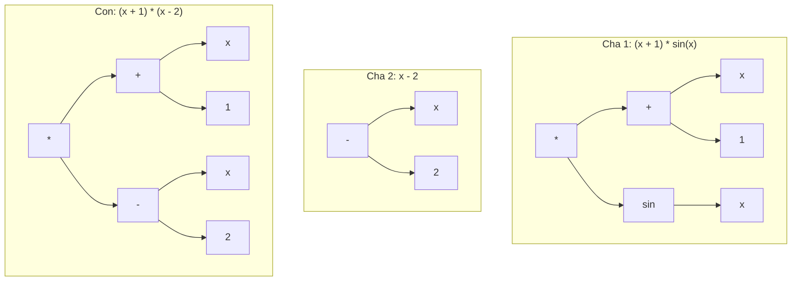

---

## 11.3. Đặc Điểm Của Lai Ghép GP

Lai ghép trong GP giúp:

* Kết hợp các cấu trúc tốt từ nhiều cá thể.
* Tạo ra chương trình mới.
* Khám phá không gian chương trình rộng hơn.
* Tăng khả năng tìm được lời giải tốt.

Tuy nhiên, lai ghép cũng có thể tạo ra cây quá lớn hoặc không hiệu quả, vì vậy thường cần giới hạn:

* Độ sâu tối đa.
* Số nút tối đa.
* Kích thước cây con được trao đổi.

---

# 12. Đột Biến Trong GP

Đột biến giúp duy trì sự đa dạng của quần thể, tránh việc thuật toán bị kẹt ở cực trị cục bộ.

Trong GP có nhiều loại đột biến.

---

## 12.1. Đột Biến Nút Trong

**Đột biến nút trong** là thay thế hàm tại một nút trong bằng một hàm khác trong tập hàm.

Ví dụ:

```text
(x + y)
```

đột biến nút `+` thành `*`:

```text
(x * y)
```

Điều kiện:

* Hàm mới thường phải có cùng số đối số với hàm cũ.
* Ví dụ `+`, `-`, `*`, `/` đều có 2 đối số nên có thể thay thế nhau.

---

## 12.2. Đột Biến Nút Kết Thúc

**Đột biến nút kết thúc** là thay thế biến hoặc hằng tại nút lá bằng một biến hoặc hằng khác.

Ví dụ:

```text
(x + 1)
```

đột biến `1` thành `3.4`:

```text
(x + 3.4)
```

hoặc đột biến `x` thành `z`:

```text
(z + 1)
```

---

## 12.3. Đột Biến Đảo

**Đột biến đảo** chọn ngẫu nhiên một nút trong và đảo hai nút con của nó.

Ví dụ:

```text
(x - y)
```

sau khi đảo:

```text
(y - x)
```

Với các toán tử không giao hoán như `-` và `/`, đột biến đảo có thể làm thay đổi mạnh kết quả.

---

## 12.4. Đột Biến Phát Triển Cây

**Đột biến phát triển cây** chọn một nút ngẫu nhiên và thay toàn bộ cây con tại nút đó bằng một cây con mới được sinh ngẫu nhiên.

Ví dụ:

```text
(x + 1) * sin(x)
```

chọn cây con `sin(x)` và thay bằng `x - 2`:

```text
(x + 1) * (x - 2)
```

Đây là loại đột biến mạnh, có thể tạo ra thay đổi lớn trong cấu trúc chương trình.

---

## 12.5. Đột Biến Gauss

**Đột biến Gauss** áp dụng cho nút lá chứa hằng số.

Ví dụ:

```text
x + 3.4
```

Thêm nhiễu Gauss vào `3.4`:

```text
3.4 + noise
```

Nếu `noise = 0.2`, ta được:

```text
x + 3.6
```

Loại đột biến này phù hợp khi cây chứa các hằng số thực.

---

## 12.6. Đột Biến Cắt Tỉa Cây

**Đột biến cắt tỉa cây** chọn một nút và thay toàn bộ cây con tại nút đó bằng một terminal.

Ví dụ:

```text
(x + 1) * (sin(z) / exp(-x))
```

nếu cắt tỉa cây con `sin(z) / exp(-x)` và thay bằng `a`, ta được:

```text
(x + 1) * a
```

Đột biến này giúp giảm kích thước cây và chống lại hiện tượng **bloat**.

---

## Bảng Tổng Hợp Các Loại Đột Biến

| Loại đột biến           | Cách thực hiện             | Tác dụng                  |
| ----------------------- | -------------------------- | ------------------------- |
| Đột biến nút trong      | Thay hàm ở nút trong       | Thay đổi toán tử          |
| Đột biến nút kết thúc   | Thay biến/hằng ở nút lá    | Thay đổi dữ liệu đầu vào  |
| Đột biến đảo            | Đảo vị trí hai nút con     | Thay đổi thứ tự tính toán |
| Đột biến phát triển cây | Thay cây con bằng cây mới  | Tạo thay đổi lớn          |
| Đột biến Gauss          | Thêm nhiễu vào hằng số     | Tinh chỉnh hằng số thực   |
| Đột biến cắt tỉa        | Thay cây con bằng terminal | Làm cây gọn hơn           |

---

# 13. Đánh Giá Độ Thích Nghi Trong GP

Mỗi cá thể GP là một chương trình hoặc hàm số. Để đánh giá cá thể đó, ta chạy nó trên một tập dữ liệu mẫu.

Giả sử có tập dữ liệu:

```text
X = {mẫu 1, mẫu 2, ..., mẫu N}
```

Mỗi mẫu gồm đầu vào và đầu ra mong muốn.

Ví dụ:

```text
Input:  a, x, z
Output: y
```

Một cá thể GP biểu diễn hàm:

```text
ŷ = f(a, x, z)
```

Ta so sánh giá trị dự đoán `ŷ` với giá trị thật `y`.

---

## 13.1. Quy Trình Đánh Giá

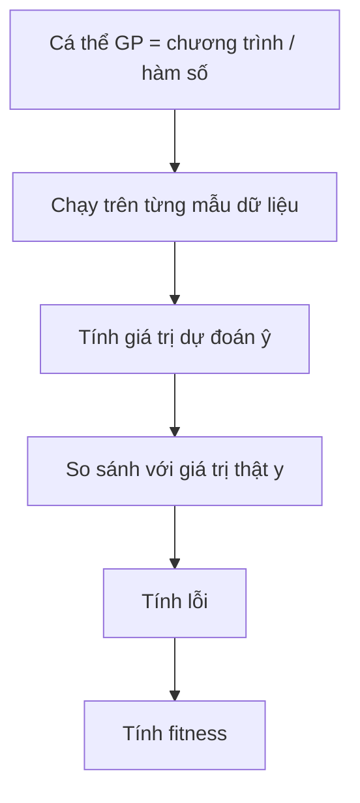

---

## 13.2. Dùng MSE Làm Fitness

Một cách phổ biến là dùng **Mean Squared Error - MSE**:

```text
MSE = (1/N) * Σ(ŷᵢ - yᵢ)²
```

Trong đó:

* `ŷᵢ` là giá trị dự đoán của cá thể GP.
* `yᵢ` là giá trị thật.
* `N` là số mẫu dữ liệu.

Với bài toán tối ưu lỗi:

```text
Fitness càng nhỏ càng tốt.
```

---

# 14. Ví Dụ Đánh Giá Fitness

Giả sử có một tập dữ liệu gồm các mẫu:

| Mẫu |  a |  x |   z | y thật |
| --: | -: | -: | --: | -----: |
|   1 |  2 |  1 | 0.5 |    3.2 |
|   2 |  3 |  2 | 1.0 |    7.8 |
|   3 |  4 | -1 | 0.3 |   -2.1 |

Một cá thể GP biểu diễn chương trình:

```text
ŷ = x * ln(a) + sin(z) / exp(-x) - 3.4
```

Quy trình đánh giá:

1. Với mỗi mẫu, thay `a`, `x`, `z` vào chương trình.
2. Tính giá trị dự đoán `ŷ`.
3. So sánh `ŷ` với `y thật`.
4. Tính lỗi bình phương.
5. Lấy trung bình lỗi trên toàn bộ tập dữ liệu.
6. Giá trị trung bình đó là fitness.

---

# 15. Bài Toán Kinh Điển: Symbolic Regression

Một trong những ứng dụng nổi tiếng nhất của GP là **hồi quy ký hiệu - Symbolic Regression**.

Bài toán:

> Cho một tập điểm dữ liệu, hãy tìm một biểu thức toán học khớp tốt nhất với dữ liệu đó.

Ví dụ, ta có dữ liệu được sinh từ hàm ẩn:

```text
y = x² + x
```

Nhưng thuật toán không biết trước công thức này.

GP chỉ biết:

* Tập dữ liệu mẫu.
* Tập hàm: `+, -, *, /`
* Tập kết thúc: `x`, các hằng số.
* Hàm fitness đo lỗi dự đoán.

Sau nhiều thế hệ, GP có thể tìm được biểu thức tương đương:

```text
x * x + x
```

hoặc:

```text
x * (x + 1)
```

---

## Sơ Đồ Symbolic Regression Với GP

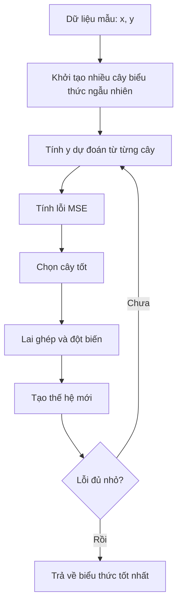

---

# 16. Vấn Đề Bloat Trong GP

Vì cá thể GP là cây có kích thước thay đổi, nên cây có thể ngày càng phình to qua các thế hệ.

Hiện tượng này gọi là **bloat**.

---

## 16.1. Bloat Là Gì?

**Bloat** là hiện tượng cây chương trình trở nên rất lớn, có nhiều nhánh dư thừa, nhưng fitness không cải thiện tương ứng.

Ví dụ:

```text
x
```

có thể bị biến thành:

```text
(((x + 0) * 1) - 0)
```

Hai biểu thức cho kết quả giống nhau, nhưng biểu thức thứ hai dài hơn và tốn chi phí tính toán hơn.

---

## 16.2. Tác Hại Của Bloat

| Tác hại                 | Giải thích                                  |
| ----------------------- | ------------------------------------------- |
| Tốn thời gian tính toán | Cây lớn hơn cần nhiều phép tính hơn         |
| Tốn bộ nhớ              | Lưu trữ nhiều nút hơn                       |
| Khó hiểu                | Biểu thức cuối cùng khó diễn giải           |
| Giảm khả năng tổng quát | Cây quá phức tạp có thể overfit dữ liệu     |
| Làm chậm tiến hóa       | Lai ghép, đột biến và đánh giá đều chậm hơn |

---

## 16.3. Cách Khắc Phục Bloat

| Cách khắc phục         | Mô tả                                     |
| ---------------------- | ----------------------------------------- |
| Giới hạn độ sâu tối đa | Không cho cây vượt quá độ sâu cho trước   |
| Giới hạn số nút        | Không cho cây vượt quá số nút tối đa      |
| Parsimony pressure     | Phạt những cây quá lớn trong hàm fitness  |
| Đột biến cắt tỉa cây   | Thay cây con lớn bằng terminal            |
| Simplification         | Rút gọn biểu thức sau khi sinh cây        |
| Kiểm soát lai ghép     | Không chấp nhận con quá lớn sau crossover |

Ví dụ dùng phạt kích thước cây:

```text
fitness = MSE + α * tree_size
```

Trong đó:

* `MSE` là lỗi dự đoán.
* `tree_size` là số nút của cây.
* `α` là hệ số phạt.

Cây càng lớn thì fitness càng bị phạt.

---

# 17. Cài Đặt Minh Họa GP Bằng Python

Ví dụ sau minh họa GP đơn giản cho bài toán tìm biểu thức gần với:

```text
y = x² + x
```

```python
import random
import math

FUNCTIONS = ['+', '-', '*']
TERMINALS = ['x', 1.0, 2.0]


def random_tree(max_depth, depth=0):
    if depth >= max_depth or (depth > 0 and random.random() < 0.3):
        return random.choice(TERMINALS)

    op = random.choice(FUNCTIONS)
    left = random_tree(max_depth, depth + 1)
    right = random_tree(max_depth, depth + 1)

    return (op, left, right)


def eval_tree(tree, x):
    if tree == 'x':
        return x

    if isinstance(tree, (int, float)):
        return tree

    op, left, right = tree
    lv = eval_tree(left, x)
    rv = eval_tree(right, x)

    if op == '+':
        return lv + rv
    if op == '-':
        return lv - rv
    if op == '*':
        return lv * rv

    raise ValueError(f"Toán tử không hợp lệ: {op}")


def tree_to_str(tree):
    if not isinstance(tree, tuple):
        return str(tree)

    op, left, right = tree
    return f"({tree_to_str(left)} {op} {tree_to_str(right)})"


def tree_size(tree):
    if not isinstance(tree, tuple):
        return 1

    _, left, right = tree
    return 1 + tree_size(left) + tree_size(right)


def all_subtree_paths(tree, path=()):
    paths = [path]

    if isinstance(tree, tuple):
        _, left, right = tree
        paths += all_subtree_paths(left, path + (1,))
        paths += all_subtree_paths(right, path + (2,))

    return paths


def get_subtree(tree, path):
    node = tree

    for step in path:
        node = node[step]

    return node


def replace_subtree(tree, path, new_subtree):
    if not path:
        return new_subtree

    op, left, right = tree

    if path[0] == 1:
        return (op, replace_subtree(left, path[1:], new_subtree), right)

    return (op, left, replace_subtree(right, path[1:], new_subtree))


def crossover(parent1, parent2):
    path1 = random.choice(all_subtree_paths(parent1))
    path2 = random.choice(all_subtree_paths(parent2))

    subtree2 = get_subtree(parent2, path2)

    return replace_subtree(parent1, path1, subtree2)


def mutate(tree, max_depth=3, rate=0.1):
    if random.random() > rate:
        return tree

    path = random.choice(all_subtree_paths(tree))
    new_subtree = random_tree(max_depth)

    return replace_subtree(tree, path, new_subtree)


def fitness(tree, data):
    mse = sum((eval_tree(tree, x) - y) ** 2 for x, y in data) / len(data)

    # Parsimony pressure: phạt cây quá lớn
    penalty = 0.001 * tree_size(tree)

    return mse + penalty


def tournament_select(population, fitness_values, k=3):
    contenders = random.sample(list(zip(population, fitness_values)), k)

    return min(contenders, key=lambda item: item[1])[0]


def genetic_programming(data, pop_size=60, n_generations=40, max_depth=4):
    population = [random_tree(max_depth) for _ in range(pop_size)]

    best_tree = None
    best_fitness = math.inf

    for generation in range(n_generations):
        fitness_values = [fitness(individual, data) for individual in population]

        best_index = fitness_values.index(min(fitness_values))

        if fitness_values[best_index] < best_fitness:
            best_tree = population[best_index]
            best_fitness = fitness_values[best_index]

        new_population = [population[best_index]]

        while len(new_population) < pop_size:
            parent1 = tournament_select(population, fitness_values)
            parent2 = tournament_select(population, fitness_values)

            child = crossover(parent1, parent2)
            child = mutate(child, max_depth=max_depth, rate=0.2)

            if tree_size(child) <= 30:
                new_population.append(child)
            else:
                new_population.append(parent1)

        population = new_population

    return best_tree, best_fitness


if __name__ == "__main__":
    random.seed(42)

    data = [(x, x ** 2 + x) for x in [-2.0, -1.0, 0.0, 1.0, 2.0, 3.0]]

    best_tree, best_fit = genetic_programming(data)

    print("Biểu thức tốt nhất:", tree_to_str(best_tree))
    print("Fitness:", round(best_fit, 5))
```

---

# 18. Ứng Dụng Của Genetic Programming

| Lĩnh vực                     | Ứng dụng                          |
| ---------------------------- | --------------------------------- |
| Hồi quy ký hiệu              | Tìm công thức toán học từ dữ liệu |
| Tối ưu kiến trúc mạng neural | Tìm cấu trúc mạng phù hợp         |
| Tài chính                    | Sinh luật giao dịch               |
| Robot                        | Tiến hóa chương trình điều khiển  |
| Xử lý ảnh                    | Tìm bộ lọc hoặc đặc trưng ảnh     |
| Sinh chương trình            | Tự động tạo chương trình nhỏ      |
| Khoa học dữ liệu             | Khám phá quan hệ ẩn trong dữ liệu |
| Điều khiển tự động           | Sinh luật điều khiển hệ thống     |

---

# 19. Câu Hỏi Ôn Tập Nhanh

## 1. Có thể coi Genetic Programming là gì?

GP có thể được coi là **một thuật toán di truyền đặc biệt**, trong đó cá thể là chương trình hoặc hàm số thay vì chuỗi gen thông thường.

---

## 2. GP có giống GA không?

Có. GP có sơ đồ tổng quát giống GA:

```text
Khởi tạo → Đánh giá → Chọn lọc → Lai ghép → Đột biến → Thế hệ mới
```

Nhưng khác ở cách biểu diễn cá thể.

---

## 3. Điểm khác biệt chính giữa GA và GP là gì?

* GA biểu diễn cá thể dưới dạng **chuỗi alen**.
* GP biểu diễn cá thể dưới dạng **cây chương trình**.

---

## 4. Mục tiêu của GP là gì?

Mục tiêu của GP là tìm ra một **chương trình tối ưu** hoặc **hàm số tối ưu** trong không gian các chương trình có thể.

---

## 5. Trong GP, nút lá là gì?

Nút lá là phần tử thuộc **tập kết thúc**, ví dụ:

```text
x, a, z, 3.4
```

---

## 6. Trong GP, nút trong là gì?

Nút trong là phần tử thuộc **tập hàm**, ví dụ:

```text
+, -, *, /, ln, sin, exp
```

---

## 7. Lai ghép trong GP thực hiện như thế nào?

Lai ghép trong GP chọn một cây con từ mỗi cha mẹ và tráo đổi hai cây con đó để tạo cá thể mới.

---

## 8. Fitness trong GP được tính như thế nào?

Fitness được tính bằng cách chạy chương trình trên tập dữ liệu mẫu, so sánh kết quả dự đoán với kết quả thật, sau đó tính lỗi như MSE.

---

# 20. Điều Cần Ghi Nhớ

* **Genetic Programming - GP** là một nhánh của tính toán tiến hóa dùng để tiến hóa chương trình hoặc hàm số.
* Có thể xem GP là một dạng đặc biệt của **Genetic Algorithm - GA**.
* Khác biệt lớn nhất giữa GA và GP là cách biểu diễn cá thể:

  * GA dùng chuỗi.
  * GP dùng cây.
* Một cây GP gồm:

  * **Nút trong** lấy từ tập hàm.
  * **Nút lá** lấy từ tập kết thúc.
* Hai tập quan trọng trong GP là:

  * **Function set - tập hàm**
  * **Terminal set - tập kết thúc**
* Các toán tử chính của GP gồm:

  * Chọn lọc
  * Lai ghép cây con
  * Đột biến cây
  * Đánh giá fitness
* Bài toán kinh điển của GP là **Symbolic Regression**.
* GP dễ gặp hiện tượng **bloat**, tức cây phình to nhưng không cải thiện chất lượng.
* Cách chống bloat gồm giới hạn độ sâu, giới hạn số nút, phạt kích thước cây và cắt tỉa cây.

---

# Tóm Tắt Bài Học

Chương này đã giới thiệu **Lập trình di truyền - Genetic Programming**, một kỹ thuật tiến hóa trong đó mỗi cá thể là một chương trình hoặc hàm số được biểu diễn bằng cây. GP có quy trình tổng quát tương tự GA, nhưng thay vì tiến hóa chuỗi gen cố định, GP tiến hóa trực tiếp cấu trúc chương trình.

Bạn đã học cách xây dựng cá thể GP bằng **tập hàm** và **tập kết thúc**, cách khởi tạo cây, cách thực hiện **lai ghép cây con**, các dạng **đột biến**, cách đánh giá fitness bằng dữ liệu mẫu, và bài toán kinh điển **hồi quy ký hiệu**. Ngoài ra, chương cũng trình bày vấn đề **bloat** — một hiện tượng đặc trưng của GP — cùng các phương pháp kiểm soát kích thước cây.

Ở chương tiếp theo, ta sẽ học **Lập Trình Tiến Hóa - Evolutionary Programming**, một hướng tiếp cận khác trong tính toán tiến hóa, nhấn mạnh vào đột biến và hành vi của cá thể hơn là cấu trúc gen.
````

