# Bài 02 - Problem Formulation và Regularized Objective

## 1. Mục tiêu

Hiểu cách paper mô hình hóa alpha mining như một bài toán tối ưu, sau đó mở rộng objective để LLM tạo factor dưới regularization.

## 2. Không gian dữ liệu

Paper xét:

- Tập cổ phiếu: \(S = \{s_1,\ldots,s_N\}\)
- Cửa sổ thời gian: \(T = \{t_1,\ldots,t_T\}\)
- Feature tensor: \(X \in \mathbb{R}^{N\times T\times D}\)
- \(D\): số chiều raw features.

Một alpha factor \(f\) ánh xạ dữ liệu tại thời điểm \(t\) thành tín hiệu dự báo return kế tiếp:

\[
f(X_t) \rightarrow r_{t+1}
\]

## 3. Objective cơ bản

Paper viết bài toán dưới dạng:

\[
f^* = \arg\max_{f\in\mathcal{F}} \mathcal{L}(f(X), y) - \lambda\,\mathcal{R}(f)
\]

Trong đó:

- \(\mathcal{F}\): không gian biểu thức factor có thể tạo.
- \(y\): future return ground truth.
- \(\mathcal{L}\): metric phản ánh predictive effectiveness.
- \(\mathcal{R}\): regularization.
- \(\lambda\): hệ số cân bằng performance và regularization.

## 4. Đưa market hypothesis vào objective

AlphaAgent không chỉ cho LLM “tìm công thức tốt”, mà dùng **market hypothesis** \(h\in\mathcal{H}\) để điều hướng factor construction.

Objective được viết lại:

\[
f^* = \arg\max_{f\in\mathcal{F}} \mathcal{L}(f(X), y) - \lambda\,\mathcal{R}_g(f,h)
\]

Regularization \(\mathcal{R}_g(f,h)\) bao gồm ba thành phần mà paper quan tâm:

1. độ phức tạp của expression;
2. alignment với hypothesis;
3. novelty so với factor đã tồn tại.

## 5. Ý nghĩa thiết kế

Thay vì chỉ hỏi “factor nào cho metric lịch sử cao nhất?”, AlphaAgent đặt thêm câu hỏi:

- Factor có đơn giản và dễ diễn giải không?
- Factor có đúng với market insight ban đầu không?
- Factor có đang lặp lại alpha phổ biến không?

Do objective không lồi, paper mô tả việc tối ưu xen kẽ giữa predictive objective và regularization để tìm một nghiệm cục bộ cân bằng giữa hiệu năng và constraint.

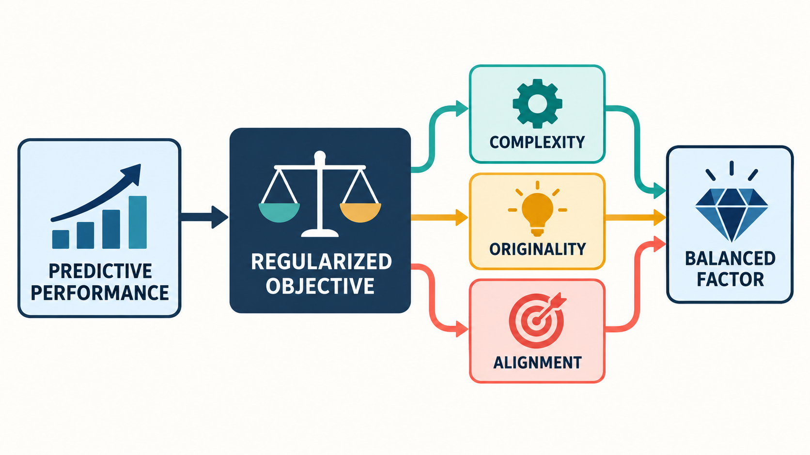
*Hình minh họa: objective của AlphaAgent cân bằng predictive performance với complexity, originality và alignment để chọn factor.*

## 6. Bài tập tự luyện

1. Viết lại objective nếu muốn tăng penalty cho complexity.
2. Nếu một factor có IC cao nhưng giống Alpha101 gần như hoàn toàn, phần nào của regularization nên chặn nó?
3. Nếu factor description nói về liquidity nhưng expression không dùng volume/spread/depth, loại constraint nào bị vi phạm?

## 7. Nguồn trong paper

- Section 3.1 - Problem Formulation, trang 3.
- Equations (1) và (2).


## Lý thuyết nền cần biết

> Phần này chuẩn bị cách nhìn bài toán theo machine learning và tối ưu hóa trước khi đọc các objective của AlphaAgent.

### 1. Từ dữ liệu đến bài toán dự báo

Một bài toán supervised learning có ba thành phần chính:

- `X`: input features, tức những thông tin được phép dùng tại thời điểm dự báo.
- `y`: target hoặc ground truth, tức kết quả cần dự báo.
- `f`: hàm dự báo biến `X` thành `ŷ`.

\[
\hat{y}=f(X)
\]

Trong AlphaAgent, `X` không chỉ là một bảng phẳng. Với `N` cổ phiếu, `T` thời điểm và `D` raw features, tensor `X ∈ ℝ^(N×T×D)` giữ cả chiều tài sản, thời gian và loại dữ liệu. Một factor `f` đọc phần dữ liệu hợp lệ tại thời điểm `t` để tạo score cho từng cổ phiếu, còn `y` thường là next-period return.

Điểm quan trọng là phải phân biệt **feature** với **target**. Feature là thông tin có sẵn trước khi ra quyết định; future return không được phép quay ngược vào feature. Nếu không, objective có thể đạt điểm cao nhưng chỉ vì leakage.

### 2. Objective, metric và argmax

Một objective là quy tắc nói cho thuật toán biết thế nào là một nghiệm tốt. Ký hiệu:

\[
f^*=\arg\max_{f\in\mathcal{F}} J(f)
\]

nghĩa là chọn factor `f*` trong không gian ứng viên `𝓕` sao cho giá trị `J(f)` lớn nhất. Nếu đang tối thiểu hóa error, ta dùng `argmin` thay vì `argmax`.

Metric dự báo và objective không hoàn toàn đồng nhất. Ví dụ, IC đo tương quan giữa score và return; còn objective có thể kết hợp IC với penalty complexity và các constraint khác. Metric trả lời “factor dự báo tốt đến đâu”; objective trả lời “factor nào đáng được chọn sau khi cân bằng mọi yêu cầu?”.

### 3. Regularization là gì?

Regularization là cách đưa một **chi phí cho nghiệm không mong muốn** vào quá trình tối ưu. Một dạng tổng quát là:

\[
J(f)=\mathcal{L}(f(X),y)-\lambda\mathcal{R}(f)
\]

Trong đó `𝓛` là predictive effectiveness, `𝓡` là penalty và `λ` điều khiển mức ưu tiên của penalty. Nếu `λ = 0`, hệ thống chỉ chạy theo hiệu năng. Nếu `λ` quá lớn, factor có thể đơn giản nhưng không còn sức dự báo.

Trực giác giống như chọn mô hình trong ML: không chỉ hỏi mô hình nào khớp dữ liệu train nhất, mà còn hỏi mô hình nào đủ đơn giản để generalize. Trong AlphaAgent, “đơn giản” được cụ thể hóa bằng symbolic length, số parameter, số feature, novelty và alignment.

### 4. Tối ưu không lồi và nghiệm cục bộ

Không gian `𝓕` của biểu thức là rời rạc và cực lớn: thay một operator, một leaf hoặc một window có thể tạo ra một factor hoàn toàn khác. Objective vì vậy thường không lồi và không có một đường dốc đơn giản dẫn đến nghiệm tối ưu toàn cục.

LLM, symbolic assembly và feedback loop chỉ tìm kiếm các candidate có triển vọng. Kết quả thực tế thường là một nghiệm cục bộ: tốt trong vùng đã khám phá và thỏa các constraint, nhưng không được hiểu là factor tốt nhất có thể tồn tại. Nhận thức này giúp người học không đọc `argmax` như lời hứa về tối ưu tuyệt đối.

### 5. Market hypothesis như inductive bias

Một market hypothesis là giả thuyết có căn cứ về cơ chế khiến một pattern có thể liên quan đến return, chẳng hạn phản ứng chậm trước thanh khoản hoặc hành vi breakout. Hypothesis hoạt động như **inductive bias**: nó thu hẹp và định hướng không gian biểu thức để hệ thống không tìm mọi công thức một cách mù quáng.

Có thể nhìn chuỗi thiết kế như sau:

```text
Market hypothesis h
        ↓ định hướng
Không gian expression F
        ↓ sinh candidate
Predictive metric + regularization
        ↓ chọn nghiệm cân bằng
Factor được đánh giá ngoài mẫu
```

## Liên hệ với bài học này

Bài này chuyển câu hỏi “tìm factor tốt” thành bài toán tối ưu có constraint. `X`, `y`, `𝓕`, `𝓛`, `𝓡` là ngôn ngữ toán học cho pipeline đó. Khi gặp `R_g(f, h)`, hãy tách nó thành các câu hỏi cụ thể: biểu thức có dài không, có dùng quá nhiều tham số không, có mới không và có thực sự triển khai hypothesis không. Đó là cầu nối từ objective tổng quát sang ba regularization mechanism ở các bài sau.

## Nguồn kiến thức liên quan trong kho khóa học

- `01 - AI & Dữ liệu/02 - Data Science, Analytics & ML/ai-data-scientist-roadmap/AI-Data-Scientist-Roadmap-Course/00 - Roadmap.sh AI Data Scientist Official/02 - Coding and EDA/Module 05 - Exploratory Data Analysis/01-Understand/004 - Target Variable.md`
- `01 - AI & Dữ liệu/02 - Data Science, Analytics & ML/ai-data-scientist-roadmap/AI-Data-Scientist-Roadmap-Course/00 - Roadmap.sh AI Data Scientist Official/03 - Machine Learning and Deep Learning/Module 06 - Machine Learning/06-Select/033 - Model Selection.md`
- `01 - AI & Dữ liệu/02 - Data Science, Analytics & ML/machine-learning-roadmap/Machine-Learning-Roadmap-Course/00 - Roadmap.sh Machine Learning Official/04 - Evaluation, Workflow and Deep Learning/Module 13 - Deep Learning Foundations/02-LossFunctions-Regularization/010 - Regularization.md`
- `01 - AI & Dữ liệu/02 - Data Science, Analytics & ML/khoa-hoc-tinh-toan-tien-hoa/Chuong 03 - Lap Trinh Di Truyen/03-lap-trinh-di-truyen.md`
- `01 - AI & Dữ liệu/02 - Data Science, Analytics & ML/machine-learning-roadmap/Machine-Learning-Roadmap-Course/00 - Roadmap.sh Machine Learning Official/04 - Evaluation, Workflow and Deep Learning/Module 11 - Model Evaluation/05-MAPE-TimeSeriesValidation/025 - Time Series Validation.md`

## Nội dung các file tham khảo để tiện sao chép

> Các khối dưới đây là nội dung nguyên văn của source lesson tương ứng, được đặt trong code block để có thể sao chép trọn vẹn.

### 1. `01 - AI & Dữ liệu/02 - Data Science, Analytics & ML/ai-data-scientist-roadmap/AI-Data-Scientist-Roadmap-Course/00 - Roadmap.sh AI Data Scientist Official/02 - Coding and EDA/Module 05 - Exploratory Data Analysis/01-Understand/004 - Target Variable.md`

Nguồn: `01 - AI & Dữ liệu/02 - Data Science, Analytics & ML/ai-data-scientist-roadmap/AI-Data-Scientist-Roadmap-Course/00 - Roadmap.sh AI Data Scientist Official/02 - Coding and EDA/Module 05 - Exploratory Data Analysis/01-Understand/004 - Target Variable.md`

````markdown
# 004 - Target Variable

**Course:** 02 - Coding and EDA
**Module:** Module 05 - Exploratory Data Analysis
**Content Group:** Data Understanding
**Roadmap Source:** Exploratory Data Analysis / Data Understanding
**Lesson Type:** Exploratory Data Analysis
**Order in Module:** 004
**Suggested Duration:** 20 minutes

---

## 1. Summary

This lesson explains the **Target Variable** in the context of AI and Data Science.

The target variable is the outcome that a machine learning model attempts to predict. Understanding it correctly is one of the most important steps before data cleaning, feature engineering, model training, and evaluation.

After this lesson, you should understand:

* What a target variable represents.
* How the target connects a business problem to a modeling problem.
* How to identify the target column in a dataset.
* How to analyze the target during Exploratory Data Analysis.
* How target quality affects experiments, metrics, and deployment.
* How to detect common problems such as class imbalance, label leakage, missing labels, and unclear target definitions.

---

## 2. Learning Objectives

By the end of this lesson, you should be able to:

* Explain the target variable in your own words.
* Identify the target variable in a supervised learning dataset.
* Distinguish between classification, regression, and time-to-event targets.
* Analyze the distribution and quality of a target variable.
* Select evaluation metrics that match the target and business objective.
* Detect target leakage and label-quality problems.
* Apply target analysis to a dataset, notebook, model, experiment, dashboard, or deployment artifact.

---

## 3. What Is a Target Variable?

A **target variable** is the value that a supervised machine learning model attempts to predict.

It is also commonly called:

* Label
* Response variable
* Dependent variable
* Outcome variable
* Ground truth
* Prediction target

A supervised dataset can be represented as:

```text
Input features X + Target y -> Machine learning model
```

Mathematically:

```text
y_hat = f(X)
```

Where:

* `X` represents the input features.
* `y` represents the true target value.
* `f` represents the model.
* `y_hat` represents the model's prediction.

For example, in a customer churn dataset:

```text
X = customer age, contract type, monthly charge, support calls
y = whether the customer leaves the company
```

---

## 4. Target Variable in the Machine Learning Workflow

The target variable connects the original business question to the technical machine learning task.


Example:

```text
Business question:
Which customers are likely to cancel their subscriptions?

Target definition:
Customer cancels within the next 30 days.

Dataset target:
churned_within_30_days

Modeling task:
Binary classification
```

A poorly defined target creates a poorly defined model, even when the algorithm is technically correct.

---

## 5. Features and Target

A supervised dataset usually contains two main components:

| Component  | Meaning                               | Example                    |
| ---------- | ------------------------------------- | -------------------------- |
| Features   | Information used to make predictions  | Age, income, contract type |
| Target     | Outcome the model attempts to predict | Churn                      |
| Prediction | Model-estimated target value          | Churn probability of 0.82  |

Example dataset:

| customer_id | tenure_months | monthly_charge | support_calls | churn |
| ----------- | ------------: | -------------: | ------------: | ----: |
| C001        |            24 |          35.00 |             1 |     0 |
| C002        |             2 |          89.00 |             7 |     1 |
| C003        |            15 |          55.00 |             2 |     0 |
| C004        |             1 |          99.00 |             5 |     1 |

In this dataset:

```text
Features:
- tenure_months
- monthly_charge
- support_calls

Target:
- churn
```

The `customer_id` column is normally an identifier, not a useful predictive feature.

---

## 6. Types of Target Variables

The target type determines the machine learning problem, model family, evaluation metrics, and prediction format.

### 6.1 Binary Classification Target

A binary target contains two possible classes.

Examples:

```text
churn = 0 or 1
fraud = no or yes
loan_default = false or true
disease_detected = negative or positive
```

Typical prediction:

```text
Probability of churn = 0.82
Predicted class = churn
```

Common metrics:

* Accuracy
* Precision
* Recall
* F1-score
* ROC-AUC
* PR-AUC
* Log loss

---

### 6.2 Multiclass Classification Target

A multiclass target contains more than two mutually exclusive classes.

Examples:

```text
ticket_category = billing, technical, account, cancellation
image_label = cat, dog, bird
sentiment = negative, neutral, positive
```

Each observation normally belongs to exactly one class.

Common metrics:

* Accuracy
* Macro F1-score
* Weighted F1-score
* Multiclass log loss
* Confusion matrix

---

### 6.3 Multilabel Classification Target

In multilabel classification, one observation may have multiple target labels.

Example:

```text
Movie genres:
[action, science fiction, adventure]
```

Another example:

```text
Customer interests:
[technology, gaming, photography]
```

This differs from multiclass classification because multiple labels may be correct at the same time.

Common metrics:

* Hamming loss
* Micro F1-score
* Macro F1-score
* Precision at K
* Recall at K

---

### 6.4 Continuous Regression Target

A regression target is a numerical value.

Examples:

```text
house_price = 250000
delivery_time_minutes = 42.5
monthly_revenue = 15200.75
temperature = 31.2
```

Common metrics:

* Mean Absolute Error
* Mean Squared Error
* Root Mean Squared Error
* R-squared
* Mean Absolute Percentage Error

---

### 6.5 Count Target

A count target represents the number of occurrences of an event.

Examples:

```text
number_of_purchases = 5
support_tickets_next_month = 3
daily_hospital_visits = 147
```

Count values are usually:

```text
0, 1, 2, 3, ...
```

Count targets may require specialized models such as:

* Poisson regression
* Negative binomial regression
* Zero-inflated models

---

### 6.6 Ordinal Target

An ordinal target contains categories with a meaningful order.

Examples:

```text
customer_satisfaction:
very dissatisfied < dissatisfied < neutral < satisfied < very satisfied
```

```text
credit_risk:
low < medium < high
```

The distance between categories is not necessarily equal.

For example, the difference between `low` and `medium` may not be equivalent to the difference between `medium` and `high`.

---

### 6.7 Time-to-Event Target

A time-to-event target measures how long it takes before an event occurs.

Examples:

```text
Time until customer churn
Time until equipment failure
Time until patient relapse
```

These problems often contain **censored observations**, where the event has not occurred by the end of the observation period.

Typical methods include:

* Survival analysis
* Cox proportional hazards models
* Survival forests
* Neural survival models

---

## 7. Target Definition

Before analyzing a target column, define exactly what the target means.

A complete target definition should answer the following questions:

| Question                              | Example                                   |
| ------------------------------------- | ----------------------------------------- |
| What event are we predicting?         | Customer cancellation                     |
| What is the prediction window?        | Within the next 30 days                   |
| What is the observation point?        | End of the current billing cycle          |
| Which population is included?         | Active subscription customers             |
| How is the label created?             | Cancellation record in the billing system |
| When does the label become available? | After the 30-day outcome window           |
| Which cases are excluded?             | Test accounts and internal employees      |

A weak target definition:

```text
Predict churn.
```

A stronger target definition:

```text
Predict whether an active paying customer will cancel all subscriptions
within 30 days after the observation date.
```

---

## 8. Observation Window and Prediction Window

Time-aware target design is especially important in real-world machine learning systems.

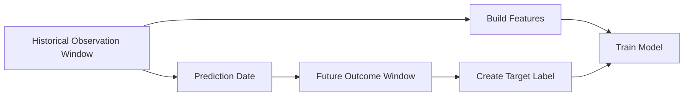

Example:

```text
Observation window:
January 1 to March 31

Prediction date:
April 1

Prediction window:
April 1 to April 30

Target:
Did the customer churn during April?
```

Features must only use information available before or at the prediction date.

Using information from the future creates target leakage.

---

## 9. Target Variable and Business Objective

The target must represent the real decision that the organization needs to make.

Example business objective:

```text
Reduce customer churn by contacting high-risk customers.
```

Possible target definitions:

| Target                                      | Limitation                              |
| ------------------------------------------- | --------------------------------------- |
| Customer has ever churned                   | Does not focus on future behavior       |
| Customer churns this year                   | Prediction window may be too long       |
| Customer churns within 30 days              | More actionable for retention campaigns |
| Customer cancels after receiving a discount | May create treatment-related bias       |

The best target is not always the easiest column to predict.

It should be:

* Relevant to the business decision.
* Available for historical training data.
* Measurable consistently.
* Available after a reasonable outcome period.
* Actionable at prediction time.

---

## 10. Target Variable EDA

Target analysis should normally be one of the first steps in Exploratory Data Analysis.

A useful workflow is:

```text
Identify target
    ->
Validate target meaning
    ->
Check target data type
    ->
Check missing values
    ->
Inspect distribution
    ->
Check class balance or skewness
    ->
Check relationships with features
    ->
Check time consistency
    ->
Check leakage
    ->
Document findings
```

---

## 11. Basic Target Inspection with Pandas

```python
import pandas as pd

df = pd.read_csv("customer_churn.csv")

target_column = "churn"

print(df[target_column].head())
print(df[target_column].dtype)
print(df[target_column].isna().sum())
print(df[target_column].value_counts(dropna=False))
```

This inspection helps answer:

* Does the target column exist?
* What is its data type?
* Does it contain missing values?
* How many unique values does it contain?
* Are labels represented consistently?

---

## 12. Target Distribution for Classification

For a classification target:

```python
target_counts = df["churn"].value_counts(dropna=False)
target_percentages = df["churn"].value_counts(
    normalize=True,
    dropna=False
).mul(100)

target_summary = pd.DataFrame({
    "count": target_counts,
    "percentage": target_percentages
})

print(target_summary)
```

Example output:

| churn | count | percentage |
| ----: | ----: | ---------: |
|     0 | 7,350 |      73.5% |
|     1 | 2,650 |      26.5% |

Interpretation:

```text
The dataset contains more non-churned customers than churned customers.
The target is moderately imbalanced, so accuracy alone may be misleading.
```

---

## 13. Target Distribution for Regression

For a continuous target:

```python
print(df["house_price"].describe())
```

Useful statistics include:

* Count
* Mean
* Standard deviation
* Minimum
* Quartiles
* Maximum

A histogram can reveal skewness and extreme values:

```python
import matplotlib.pyplot as plt

df["house_price"].hist(bins=30)

plt.xlabel("House Price")
plt.ylabel("Number of Properties")
plt.title("Distribution of House Prices")
plt.show()
```

Questions to investigate:

* Is the target heavily skewed?
* Are there impossible values?
* Are there extreme outliers?
* Is the target truncated or capped?
* Should a transformation be considered?

---

## 14. Target Imbalance

A classification target is imbalanced when one class appears much more frequently than another.

Example:

| Class     |  Count | Percentage |
| --------- | -----: | ---------: |
| Not fraud | 99,500 |      99.5% |
| Fraud     |    500 |       0.5% |

A model that always predicts `not fraud` would achieve:

```text
Accuracy = 99.5%
```

However, the model would detect no fraudulent transactions.

Therefore, accuracy is not sufficient for strongly imbalanced targets.

Better metrics may include:

* Precision
* Recall
* F1-score
* PR-AUC
* Recall at a fixed precision
* Precision at K
* Expected business cost

---

## 15. Confusion Matrix

For binary classification:

|                 | Predicted Negative | Predicted Positive |
| --------------- | -----------------: | -----------------: |
| Actual Negative |      True Negative |     False Positive |
| Actual Positive |     False Negative |      True Positive |

Important metrics include:

```text
Precision = TP / (TP + FP)
```

```text
Recall = TP / (TP + FN)
```

```text
F1 = 2 * Precision * Recall / (Precision + Recall)
```

Where:

* `TP` = True Positive
* `FP` = False Positive
* `FN` = False Negative
* `TN` = True Negative

Metric selection should depend on the business cost of each error type.

---

## 16. Example: Business Cost of Prediction Errors

Consider a fraud detection system.

### False positive

```text
A legitimate transaction is blocked.
```

Possible cost:

* Customer frustration
* Lost transaction revenue
* Increased support workload

### False negative

```text
A fraudulent transaction is approved.
```

Possible cost:

* Financial loss
* Chargeback fees
* Security risk
* Regulatory consequences

The correct metric depends on which error is more expensive.

---

## 17. Missing Target Values

Rows with missing target values cannot normally be used directly for supervised model training.

```python
missing_target_count = df["churn"].isna().sum()
missing_target_rate = df["churn"].isna().mean()

print("Missing target count:", missing_target_count)
print("Missing target rate:", missing_target_rate)
```

Possible reasons for missing labels include:

* The outcome has not occurred yet.
* The observation period is incomplete.
* Data was not recorded.
* Multiple data sources failed to join.
* The target is not applicable to some observations.
* The label is delayed.

Do not automatically drop missing targets without understanding why they are missing.

Missing target values may reveal a systematic data collection problem.

---

## 18. Label Noise

**Label noise** occurs when target values are incorrect, inconsistent, or uncertain.

Examples:

* A customer is labeled as churned even though the account was reactivated immediately.
* A medical diagnosis is entered incorrectly.
* Human reviewers disagree on image labels.
* Fraud cases are discovered months after the original transaction.
* Support tickets are assigned to inconsistent categories.

Label noise can reduce model performance even when features and algorithms are strong.

Questions to ask:

* Who created the label?
* Was the label created automatically or manually?
* Can the label be independently verified?
* How often are labels corrected?
* Are different labelers consistent?
* Is there a delay between the event and label availability?

---

## 19. Target Leakage

**Target leakage** occurs when the model uses information that would not be available at prediction time or information that directly reveals the target.

Example target:

```text
loan_default = whether the customer fails to repay the loan
```

Potential leakage columns:

```text
collection_status
days_after_default
default_resolution_date
account_closed_due_to_default
```

These columns may only become available after the target event occurs.

### Leakage Diagram

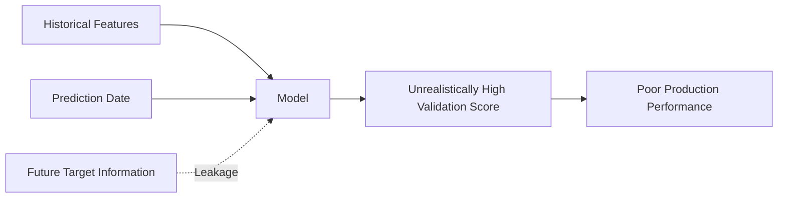

A common symptom of leakage is an unexpectedly high validation score.

For example:

```text
Validation accuracy = 99.9%
```

This may indicate:

* A feature directly contains the answer.
* Future information was included.
* Duplicate records exist across train and validation sets.
* Preprocessing was performed before data splitting.
* The target was accidentally included in the feature matrix.

---

## 20. Direct and Indirect Leakage

### 20.1 Direct Leakage

A feature directly reveals the target.

Example:

```text
Target: churn
Feature: churn_reason
```

The churn reason is normally known only after the customer has churned.

### 20.2 Indirect Leakage

A feature is strongly connected to the target because of the data collection process.

Example:

```text
Target: hospital mortality
Feature: discharge_status
```

Discharge status may be recorded after the outcome has already occurred.

Indirect leakage is more difficult to detect because the feature name may appear valid.

---

## 21. Target Leakage Checklist

Before modeling, ask:

* Was this feature available at prediction time?
* Was this feature created after the target event?
* Does this feature contain a transformed version of the target?
* Was preprocessing fitted on the complete dataset?
* Were target statistics calculated before the train-test split?
* Do duplicate entities appear in both training and test datasets?
* Does the validation period occur after the training period?
* Does any identifier encode the target indirectly?

---

## 22. Target Encoding Consistency

Classification labels should be represented consistently.

Problematic labels:

```text
Yes
YES
yes
Y
1
True
```

These may represent the same class but appear as different values.

Example normalization:

```python
label_mapping = {
    "Yes": 1,
    "YES": 1,
    "yes": 1,
    "Y": 1,
    "No": 0,
    "NO": 0,
    "no": 0,
    "N": 0
}

df["churn"] = df["churn"].map(label_mapping)
```

After transformation:

```python
print(df["churn"].value_counts(dropna=False))
```

Always verify whether unmapped values became missing.

---

## 23. Target Cardinality

Target cardinality is the number of unique target values.

```python
target_cardinality = df["target"].nunique(dropna=False)

print("Target cardinality:", target_cardinality)
```

Interpretation examples:

|                  Cardinality | Possible Task             |
| ---------------------------: | ------------------------- |
|                            2 | Binary classification     |
|                         3-20 | Multiclass classification |
|       Many repeated integers | Count prediction          |
| Many unique numerical values | Regression                |
|      Multiple labels per row | Multilabel classification |

High cardinality does not automatically mean regression.

For example, a postal code may contain many numerical values but still be categorical.

---

## 24. Target Skewness

Regression targets are often skewed.

Example:

```text
Most customers spend between $10 and $100.
A small number spend more than $10,000.
```

A heavily right-skewed target may affect model behavior and evaluation.

A logarithmic transformation may sometimes help:

```python
import numpy as np

df["log_revenue"] = np.log1p(df["revenue"])
```

Transformation:

```text
log_target = log(1 + target)
```

The model prediction can later be converted back:

```python
predicted_revenue = np.expm1(predicted_log_revenue)
```

A transformation should only be used when it matches the model assumptions and business interpretation.

---

## 25. Target Outliers

Outliers in a target variable may represent:

* Genuine rare events
* Data-entry errors
* Measurement errors
* Currency conversion mistakes
* Unit inconsistencies
* Duplicate aggregation
* Exceptional business cases

Example:

```python
q1 = df["house_price"].quantile(0.25)
q3 = df["house_price"].quantile(0.75)

iqr = q3 - q1

lower_bound = q1 - 1.5 * iqr
upper_bound = q3 + 1.5 * iqr

target_outliers = df[
    (df["house_price"] < lower_bound)
    | (df["house_price"] > upper_bound)
]

print(target_outliers)
```

An outlier rule is a diagnostic tool, not an automatic deletion rule.

---

## 26. Relationship Between Features and Target

After understanding the target distribution, analyze how important features relate to it.

### Numerical Feature Versus Classification Target

```python
df.groupby("churn")["monthly_charge"].describe()
```

Possible insight:

```text
Churned customers have a higher median monthly charge than retained customers.
```

### Categorical Feature Versus Classification Target

```python
churn_by_contract = pd.crosstab(
    df["contract_type"],
    df["churn"],
    normalize="index"
)

print(churn_by_contract)
```

Possible insight:

```text
Month-to-month customers have a substantially higher churn rate than annual-contract customers.
```

---

## 27. Target Rate

For a binary target encoded as `0` and `1`, the mean is equal to the positive-class rate.

```python
churn_rate = df["churn"].mean()

print(f"Churn rate: {churn_rate:.2%}")
```

Because:

```text
Mean of binary target = Number of positive cases / Total number of cases
```

Example:

```text
churn = [0, 1, 0, 1, 1]

mean = 3 / 5 = 0.60
```

Therefore:

```text
Churn rate = 60%
```

---

## 28. Target Rate by Segment

```python
segment_churn = (
    df.groupby("contract_type")["churn"]
    .agg(["count", "mean"])
    .rename(columns={"mean": "churn_rate"})
    .sort_values("churn_rate", ascending=False)
)

print(segment_churn)
```

Example output:

| contract_type  | count | churn_rate |
| -------------- | ----: | ---------: |
| Month-to-month | 4,500 |       0.43 |
| One-year       | 2,100 |       0.12 |
| Two-year       | 1,400 |       0.04 |

Possible insight:

```text
Month-to-month customers are the highest-risk segment and may be the best
initial audience for retention experiments.
```

---

## 29. Time-Based Target Analysis

Target behavior may change over time.

```python
df["observation_date"] = pd.to_datetime(df["observation_date"])

monthly_target_rate = (
    df.groupby(df["observation_date"].dt.to_period("M"))["churn"]
    .mean()
)

print(monthly_target_rate)
```

Questions to investigate:

* Is the target rate stable?
* Did a product launch change the target distribution?
* Did a policy change affect label creation?
* Does seasonality exist?
* Is the latest period different from historical periods?
* Is there evidence of concept drift?

---

## 30. Dataset Shift and Target Drift

**Target drift** occurs when the distribution of the target changes over time.

Example:

```text
Historical churn rate: 12%
Current churn rate: 24%
```

Possible causes:

* Pricing changes
* Competitor activity
* Economic conditions
* Product quality problems
* Customer population changes
* Label-definition changes

Target drift can reduce production model performance, even when the model was initially valid.

---

## 31. Train-Test Split and the Target

The target should guide the splitting strategy.

### Random Split

Suitable when:

* Observations are independent.
* Time order is not important.
* There are no repeated entities across splits.

```python
from sklearn.model_selection import train_test_split

X = df.drop(columns=["churn"])
y = df["churn"]

X_train, X_test, y_train, y_test = train_test_split(
    X,
    y,
    test_size=0.2,
    random_state=42,
    stratify=y
)
```

The `stratify=y` argument helps preserve the target-class proportion.

---

### Time-Based Split

Suitable when predicting future outcomes.

```text
Training data:
January to September

Validation data:
October

Test data:
November to December
```

This better represents production behavior than randomly mixing past and future records.

---

### Group-Based Split

Suitable when multiple rows belong to the same entity.

Examples:

* Multiple visits from the same patient
* Multiple transactions from the same customer
* Multiple images from the same person
* Multiple sessions from the same device

The same entity should not appear in both training and test sets.

---

## 32. Baseline Model from the Target

A baseline uses the target distribution without complex modeling.

### Classification Baseline

Predict the majority class for every record.

```python
majority_class = y_train.mode()[0]
baseline_predictions = [majority_class] * len(y_test)
```

### Regression Baseline

Predict the training-target mean or median.

```python
baseline_value = y_train.median()
baseline_predictions = [baseline_value] * len(y_test)
```

A machine learning model should outperform an appropriate baseline.

---

## 33. Target and Metric Selection

The target type and business objective determine the evaluation metric.

| Target Type               | Common Metrics                            |
| ------------------------- | ----------------------------------------- |
| Binary classification     | Precision, recall, F1, ROC-AUC, PR-AUC    |
| Multiclass classification | Accuracy, macro F1, weighted F1           |
| Multilabel classification | Micro F1, Hamming loss, precision at K    |
| Regression                | MAE, RMSE, R-squared                      |
| Count prediction          | Poisson deviance, MAE                     |
| Ranking                   | NDCG, MAP, precision at K                 |
| Survival prediction       | Concordance index, integrated Brier score |

Metric selection should also consider the business cost of prediction errors.

---

## 34. Threshold Selection

A classification model often returns a probability rather than a final class.

Example:

```text
Predicted churn probability = 0.72
```

A threshold converts probability into a class:

```text
If probability >= threshold:
    predict churn
else:
    predict no churn
```

The default threshold is often `0.5`, but it may not be optimal.

```python
threshold = 0.35

predicted_class = (
    predicted_probability >= threshold
).astype(int)
```

A lower threshold usually:

* Increases recall.
* Produces more positive predictions.
* May reduce precision.

A higher threshold usually:

* Increases precision.
* Produces fewer positive predictions.
* May reduce recall.

---

## 35. Target Availability in Production

A target may be available for model training but delayed in production.

Example:

```text
Prediction:
Will a customer churn within 90 days?

Target availability:
The true answer is only known after 90 days.
```

This affects:

* Model monitoring
* Retraining frequency
* Experiment evaluation
* Feedback loops
* Dashboard design

The system may need to monitor proxy metrics before the true target becomes available.

---

## 36. Proxy Targets

Sometimes the real business outcome is difficult to measure, so a proxy target is used.

Example:

```text
Real objective:
Improve long-term customer satisfaction.

Proxy target:
Customer clicks the recommendation.
```

The proxy is easier to measure but may not fully represent the real objective.

Risks include:

* Optimizing clicks instead of satisfaction.
* Encouraging short-term behavior.
* Creating unintended incentives.
* Increasing engagement while reducing trust.

Always document the difference between the proxy target and the real business goal.

---

## 37. Target Leakage from Aggregation

Suppose the target is:

```text
Will the customer churn in April?
```

A feature is calculated as:

```text
Total customer activity from January through April
```

This feature contains activity from the prediction window and may reveal churn behavior.

The correct feature should use only data available before April:

```text
Total customer activity from January through March
```

---

## 38. Target Leakage from Preprocessing

Incorrect process:

```text
1. Calculate feature statistics on the entire dataset.
2. Encode categories using the entire dataset.
3. Split into training and test data.
```

Correct process:

```text
1. Split data into training and test sets.
2. Fit preprocessing only on the training data.
3. Apply the fitted preprocessing to validation and test data.
```

This applies to:

* Scaling
* Imputation
* Feature selection
* Target encoding
* Dimensionality reduction
* Oversampling

---

## 39. Target Encoding as a Feature Transformation

The term **target encoding** may also refer to a categorical feature transformation.

For a category `c`:

```text
Encoded value of c = Average target value for rows in category c
```

Example:

| City             | Churn Rate | Encoded Value |
| ---------------- | ---------: | ------------: |
| Hanoi            |       0.12 |          0.12 |
| Da Nang          |       0.18 |          0.18 |
| Ho Chi Minh City |       0.25 |          0.25 |

However, calculating these values on the complete dataset causes leakage.

Target encoding should use:

* Training data only
* Cross-validation folds
* Smoothing
* Regularization
* Careful handling of unseen categories

---

## 40. Target Variable Documentation

A useful target specification may look like this:

```yaml
target_name: churn_within_30_days
task_type: binary_classification

positive_class:
  value: 1
  definition: Customer cancels all active subscriptions within 30 days

negative_class:
  value: 0
  definition: Customer remains active for the full 30-day outcome window

observation_date:
  definition: Last day of the current billing cycle

prediction_window:
  start: observation_date + 1 day
  end: observation_date + 30 days

excluded_cases:
  - internal_test_accounts
  - suspended_accounts
  - customers_without_complete_outcome_window

label_source:
  table: subscription_events
  field: cancellation_timestamp

known_limitations:
  - delayed cancellation records
  - temporary suspensions may be misclassified
```

This documentation improves reproducibility and communication.

---

## 41. End-to-End Target Analysis Example

### Step 1: Load the Dataset

```python
import pandas as pd

df = pd.read_csv("customer_churn.csv")
```

### Step 2: Identify the Target

```python
target = "churn"
```

### Step 3: Inspect the Target

```python
print(df[target].dtype)
print(df[target].unique())
print(df[target].isna().sum())
print(df[target].value_counts(dropna=False))
```

### Step 4: Calculate the Target Rate

```python
churn_rate = df[target].mean()

print(f"Overall churn rate: {churn_rate:.2%}")
```

### Step 5: Analyze Target by Segment

```python
contract_summary = (
    df.groupby("contract_type")[target]
    .agg(customer_count="count", churn_rate="mean")
    .sort_values("churn_rate", ascending=False)
)

print(contract_summary)
```

### Step 6: Analyze a Numerical Feature

```python
charge_summary = (
    df.groupby(target)["monthly_charge"]
    .agg(["count", "mean", "median", "std"])
)

print(charge_summary)
```

### Step 7: Document Insights

```text
Insight 1:
Month-to-month customers have the highest churn rate.

Insight 2:
Churned customers have a higher median monthly charge.

Insight 3:
Customers with frequent support calls are more likely to churn.

Caveat:
The analysis shows association, not causation.

Recommendation:
Evaluate a retention intervention for high-risk month-to-month customers.
```

---

## 42. Target Analysis Diagram

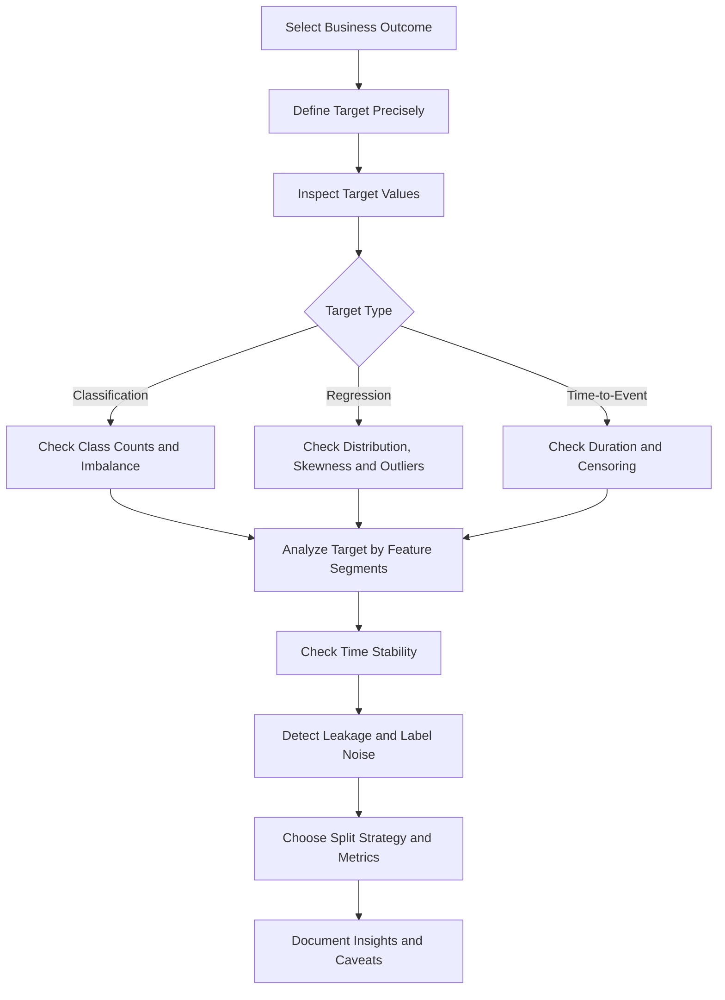

---

## 43. Practical Exercise

Use a small customer churn CSV dataset and create a reproducible notebook.

### Required Tasks

1. Load and inspect the dataset.
2. Identify the target variable.
3. Write a precise definition of the positive and negative classes.
4. Check the target data type.
5. Count missing target values.
6. Calculate the target-class distribution.
7. Calculate the overall churn rate.
8. Analyze churn by at least two categorical features.
9. Analyze churn against at least two numerical features.
10. Check whether the target rate changes over time.
11. Identify at least one possible leakage feature.
12. Write three insights supported by charts or tables.
13. Record at least one caveat or assumption.
14. Recommend one next analytical or business action.

---

## 44. Suggested Notebook Structure

```text
01. Business question
02. Target definition
03. Dataset loading
04. Schema inspection
05. Target data-quality checks
06. Target distribution
07. Target imbalance analysis
08. Target versus numerical features
09. Target versus categorical features
10. Time-based target analysis
11. Leakage investigation
12. Insights
13. Caveats
14. Recommendations
```

---

## 45. Suggested Portfolio Artifacts

This lesson can be converted into one or more portfolio artifacts:

* Target-analysis notebook
* Churn EDA report
* Data-quality dashboard
* Target-definition YAML file
* Leakage-checking utility
* Model evaluation report
* Class-imbalance experiment
* Threshold-selection analysis
* Target-monitoring dashboard
* Data dictionary containing label definitions

---

## 46. Common Mistakes

### Mistake 1: Choosing a Convenient Column Instead of the Correct Outcome

A column may be easy to access but may not represent the real business objective.

### Mistake 2: Using an Unclear Target Definition

Terms such as `active`, `churned`, `fraudulent`, or `successful` may have multiple meanings.

### Mistake 3: Ignoring Class Imbalance

High accuracy may hide poor minority-class detection.

### Mistake 4: Using Future Information

Features created after the prediction date cause leakage.

### Mistake 5: Dropping Missing Labels Without Investigation

Missing labels may reflect incomplete outcomes or systematic collection problems.

### Mistake 6: Treating Correlation as Causation

A feature associated with the target is not necessarily causing the outcome.

### Mistake 7: Using the Wrong Split Strategy

Random splitting may be invalid for time-series or repeated-entity data.

### Mistake 8: Selecting Metrics Without Business Context

Accuracy may not reflect the true cost of prediction errors.

### Mistake 9: Ignoring Label Noise

Incorrect target values limit the maximum achievable model quality.

### Mistake 10: Building Charts Without Writing Insights

Every important chart should support an interpretation, caveat, or recommendation.

---

## 47. Completion Checklist

* [ ] I can explain the **Target Variable** in one or two minutes.
* [ ] I can identify the target column in a supervised dataset.
* [ ] I can distinguish classification, regression, ordinal, count, and time-to-event targets.
* [ ] I can write a precise target definition.
* [ ] I understand observation windows and prediction windows.
* [ ] I can inspect missing values and inconsistent target labels.
* [ ] I can analyze class imbalance or regression-target skewness.
* [ ] I can calculate the target rate for a binary outcome.
* [ ] I can analyze the target across customer or data segments.
* [ ] I can identify possible target leakage.
* [ ] I can select an appropriate train-test splitting strategy.
* [ ] I can choose evaluation metrics that match the business objective.
* [ ] I have created a notebook, query, chart, model, API, or practical note for this lesson.
* [ ] I have documented at least one caveat, assumption, or follow-up question.

---

## 48. Related Outcome

Understand, clean, visualize, and explain datasets using business-oriented insights.

---

## 49. Related Project

### Mini Project: Customer Churn EDA

Create a customer churn analysis project containing:

* A documented target definition
* Data-quality checks
* Target distribution analysis
* Class-imbalance analysis
* Churn rate by customer segment
* Numerical and categorical feature comparisons
* Leakage investigation
* Time-based churn analysis
* Three evidence-based insights
* Business recommendations
* Caveats and assumptions
* A reproducible notebook
* A short insight report

Example project workflow:

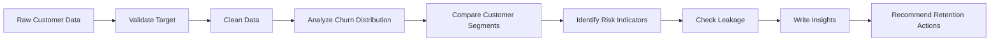

---

## 50. Key Takeaways

* The target variable is the outcome that a supervised model attempts to predict.
* The target connects the business question to the machine learning task.
* A precise target definition is more important than simply selecting a dataset column.
* Target analysis should include missing values, class balance, skewness, outliers, time stability, and label quality.
* Features must only contain information available at prediction time.
* Target leakage can create excellent validation results but poor production performance.
* The correct evaluation metric depends on the target type and the business cost of prediction errors.
* A useful EDA output should contain evidence, interpretation, caveats, and actionable recommendations.

---

## 51. Final Summary

The **Target Variable** is a foundational concept in the AI and Data Scientist roadmap.

Before training a model, you should be able to answer:

```text
What exactly are we predicting?
Why does this outcome matter?
When is the prediction made?
When does the outcome become known?
How was the label created?
Is the target complete and reliable?
Is the target balanced or skewed?
Could any feature reveal the target?
Which metric represents business success?
```

Turn this lesson into a practical artifact such as a notebook, SQL analysis, chart, experiment, model, monitoring dashboard, API, Docker service, or portfolio report so that the knowledge is connected to a real data workflow.
````

### 2. `01 - AI & Dữ liệu/02 - Data Science, Analytics & ML/ai-data-scientist-roadmap/AI-Data-Scientist-Roadmap-Course/00 - Roadmap.sh AI Data Scientist Official/03 - Machine Learning and Deep Learning/Module 06 - Machine Learning/06-Select/033 - Model Selection.md`

Nguồn: `01 - AI & Dữ liệu/02 - Data Science, Analytics & ML/ai-data-scientist-roadmap/AI-Data-Scientist-Roadmap-Course/00 - Roadmap.sh AI Data Scientist Official/03 - Machine Learning and Deep Learning/Module 06 - Machine Learning/06-Select/033 - Model Selection.md`

````markdown
# 033 - Model Selection

**Course:** 03 - Machine Learning and Deep Learning
**Module:** Module 06 - Machine Learning
**Content Group:** Feature Engineering
**Roadmap Source:** Machine Learning / Feature Engineering
**Lesson Type:** Machine Learning
**Order in Module:** 033
**Suggested Duration:** 26 minutes

---

## 1. Summary

**Model Selection** is the process of comparing candidate machine learning models and choosing the one that best satisfies the technical and business requirements of a problem.

The goal is not simply to choose the model with the highest score. A good model should also be:

* Reliable on unseen data
* Appropriate for the business objective
* Resistant to overfitting
* Fast enough for production
* Easy enough to maintain
* Explainable when required
* Compatible with available data and infrastructure

A typical model-selection process compares:

* A simple baseline
* Several model families
* Different feature sets
* Different hyperparameters
* Multiple evaluation metrics
* Training and inference costs
* Model stability across validation folds

The central question is:

> Which model provides the best balance between predictive performance, complexity, reliability, and business value?

---

## 2. Learning Objectives

After completing this lesson, you should be able to:

* Explain model selection in your own words.
* Distinguish model selection from model training and hyperparameter tuning.
* Establish an appropriate baseline.
* Choose evaluation metrics based on the business problem.
* Compare multiple model families fairly.
* Use validation sets and cross-validation correctly.
* Recognize underfitting and overfitting.
* Avoid data leakage during model comparison.
* Select models using both technical and operational criteria.
* Build a reproducible model-selection pipeline.
* Document experiments and justify the final model choice.

---

## 3. What Is Model Selection?

Suppose you want to predict house prices.

Possible candidate models include:

```text
Mean-price baseline
Linear Regression
Ridge Regression
Decision Tree
Random Forest
Gradient Boosting
XGBoost
Neural Network
```

Each model has different properties.

| Model             | Strength                   | Limitation                          |
| ----------------- | -------------------------- | ----------------------------------- |
| Linear Regression | Fast and interpretable     | Assumes mostly linear relationships |
| Decision Tree     | Easy to visualize          | Can overfit                         |
| Random Forest     | Strong general performance | Larger and less interpretable       |
| Gradient Boosting | High predictive power      | Requires careful tuning             |
| Neural Network    | Can model complex patterns | Requires more data and computation  |

Model selection compares these candidates under the same experimental conditions.

Formally, suppose the candidate model set is:

$$
\mathcal{M} = {M_1, M_2, \ldots, M_k}
$$

The selected model is:

$$
M^* = \arg\max_{M_i \in \mathcal{M}} \text{Score}(M_i)
$$

For an error metric such as MAE or RMSE, the objective becomes:

$$
M^* = \arg\min_{M_i \in \mathcal{M}} \text{Error}(M_i)
$$

In practice, model selection is usually a multi-objective decision:

$$
M^* = f( \text{performance}, \text{latency}, \text{cost}, \text{stability}, \text{interpretability} )
$$

---

## 4. Model Selection in the Machine Learning Workflow


A good workflow separates:

* Model development
* Model comparison
* Final unbiased evaluation

The test set should not be used repeatedly during model selection.

---

## 5. Model Selection vs. Related Concepts

### 5.1 Model Training

Model training estimates model parameters from data.

For Linear Regression, training learns coefficients:

$$
\hat{y} = w_0 + w_1x_1 + \cdots + w_px_p
$$

The learned values (w_0, w_1, \ldots, w_p) are model parameters.

---

### 5.2 Hyperparameter Tuning

Hyperparameters are settings chosen before or during training.

Examples include:

```text
Random Forest:
- number of trees
- maximum depth
- minimum samples per leaf

XGBoost:
- learning rate
- maximum depth
- number of estimators

KNN:
- number of neighbors
- distance metric
```

Hyperparameter tuning searches for the best configuration of one model family.

---

### 5.3 Model Selection

Model selection can include comparing:

* Different model families
* Different preprocessing strategies
* Different feature sets
* Different hyperparameters
* Different decision thresholds

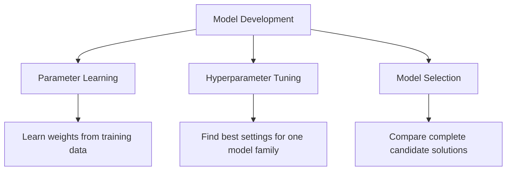

---

## 6. Start with the Business Problem

Before comparing models, define the actual decision the model will support.

Examples:

| Problem                | Prediction             | Business Decision           |
| ---------------------- | ---------------------- | --------------------------- |
| House price prediction | Estimated sale price   | Pricing and investment      |
| Customer churn         | Probability of leaving | Retention campaign          |
| Fraud detection        | Probability of fraud   | Block or review transaction |
| Medical screening      | Disease risk           | Request further examination |
| Demand forecasting     | Future demand          | Inventory planning          |

A technically strong model can still fail if it solves the wrong problem.

Important questions include:

* What decision will use the prediction?
* What is the cost of a false positive?
* What is the cost of a false negative?
* How quickly must predictions be produced?
* Does the model need to be explainable?
* How frequently will it be retrained?
* Which data will be available at inference time?

---

## 7. Establishing a Baseline

A baseline is a simple reference model used to judge whether a more complex model provides meaningful improvement.

Without a baseline, a score has little context.

---

### 7.1 Regression Baselines

A common regression baseline predicts the training-set mean:

$$
\hat{y}_i = \bar{y}_{\text{train}}
$$

Another option is the median:

$$
\hat{y}_i = \text{median}(y_{\text{train}})
$$

The median is often more robust to outliers.

```python
from sklearn.dummy import DummyRegressor
from sklearn.metrics import mean_absolute_error

baseline = DummyRegressor(strategy="median")
baseline.fit(X_train, y_train)

predictions = baseline.predict(X_valid)

mae = mean_absolute_error(y_valid, predictions)

print("Baseline MAE:", mae)
```

---

### 7.2 Classification Baselines

Common classification baselines include:

* Predict the majority class
* Predict according to class frequencies
* Predict randomly
* Use a simple rule-based system

```python
from sklearn.dummy import DummyClassifier
from sklearn.metrics import classification_report

baseline = DummyClassifier(
    strategy="most_frequent"
)

baseline.fit(X_train, y_train)

predictions = baseline.predict(X_valid)

print(classification_report(y_valid, predictions))
```

---

### 7.3 Why the Baseline Matters

Suppose a classification model achieves:

```text
Accuracy = 92%
```

This may appear strong.

However, if 95% of the data belongs to one class, a majority-class baseline achieves:

```text
Accuracy = 95%
```

The trained model is therefore worse than the baseline.

---

## 8. Train, Validation, and Test Sets

A dataset is commonly divided into three parts.

| Dataset        | Purpose                                 |
| -------------- | --------------------------------------- |
| Training set   | Fit model parameters                    |
| Validation set | Compare models and tune hyperparameters |
| Test set       | Perform final unbiased evaluation       |

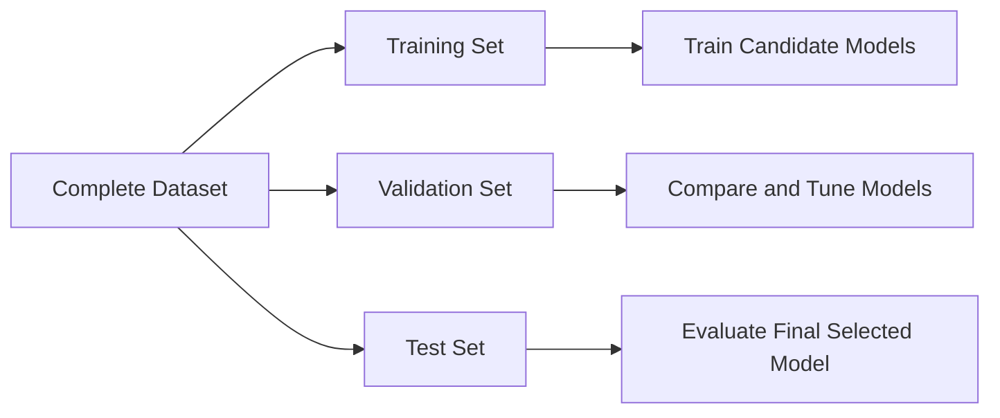

A common split is:

```text
Training:   70%
Validation: 15%
Test:       15%
```

The exact proportions depend on dataset size.

---

### Python Example

```python
from sklearn.model_selection import train_test_split

X_train_temp, X_test, y_train_temp, y_test = train_test_split(
    X,
    y,
    test_size=0.15,
    random_state=42
)

validation_ratio = 0.15 / 0.85

X_train, X_valid, y_train, y_valid = train_test_split(
    X_train_temp,
    y_train_temp,
    test_size=validation_ratio,
    random_state=42
)

print("Training samples:", len(X_train))
print("Validation samples:", len(X_valid))
print("Test samples:", len(X_test))
```

For classification, preserve the class distribution using stratification:

```python
X_train, X_test, y_train, y_test = train_test_split(
    X,
    y,
    test_size=0.20,
    stratify=y,
    random_state=42
)
```

---

## 9. Cross-Validation

A single validation split may produce unstable results.

Cross-validation evaluates a model using multiple train-validation partitions.

In (k)-fold cross-validation:

1. Divide the training data into (k) folds.
2. Train on (k-1) folds.
3. Validate on the remaining fold.
4. Repeat until every fold has been used for validation.
5. Average the scores.

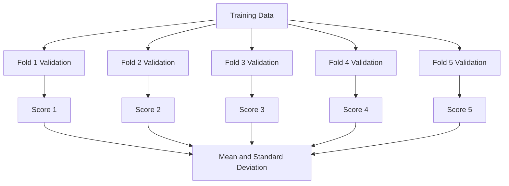

The average cross-validation score is:

$$
\bar{s} = \frac{1}{k} \sum_{i=1}^{k}s_i
$$

The standard deviation is:

$$
\sigma_s = \sqrt{ \frac{1}{k} \sum_{i=1}^{k}(s_i-\bar{s})^2 }
$$

A model with a slightly lower average score but much lower variation may be more reliable.

---

### Python Example

```python
from sklearn.model_selection import cross_validate
from sklearn.ensemble import RandomForestRegressor

model = RandomForestRegressor(
    n_estimators=300,
    random_state=42,
    n_jobs=-1
)

scores = cross_validate(
    estimator=model,
    X=X_train,
    y=y_train,
    cv=5,
    scoring={
        "mae": "neg_mean_absolute_error",
        "r2": "r2"
    },
    return_train_score=True,
    n_jobs=-1
)

mean_validation_mae = -scores["test_mae"].mean()
std_validation_mae = scores["test_mae"].std()

print("Mean validation MAE:", mean_validation_mae)
print("MAE standard deviation:", std_validation_mae)
```

---

## 10. Choosing the Correct Validation Strategy

Standard random cross-validation is not appropriate for every dataset.

### 10.1 Stratified Cross-Validation

Use stratification when classification classes are imbalanced.

```python
from sklearn.model_selection import StratifiedKFold

cv = StratifiedKFold(
    n_splits=5,
    shuffle=True,
    random_state=42
)
```

---

### 10.2 Group-Based Cross-Validation

Use group-based splitting when samples from the same entity must not appear in both training and validation sets.

Examples:

* Multiple transactions from the same customer
* Multiple images from the same patient
* Multiple records from the same machine
* Multiple observations from the same household

```python
from sklearn.model_selection import GroupKFold

cv = GroupKFold(n_splits=5)

for train_index, valid_index in cv.split(
    X,
    y,
    groups=customer_ids
):
    X_fold_train = X.iloc[train_index]
    X_fold_valid = X.iloc[valid_index]
```

---

### 10.3 Time-Series Validation

Future observations must not be used to predict the past.

Incorrect:

```text
Randomly mix 2022, 2023, and 2024 data
```

Correct:

```text
Train: January–June
Validate: July

Train: January–July
Validate: August

Train: January–August
Validate: September
```

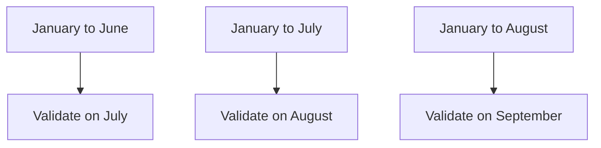

```python
from sklearn.model_selection import TimeSeriesSplit

cv = TimeSeriesSplit(n_splits=5)
```

---

## 11. Choosing Evaluation Metrics

A model should be selected using metrics that reflect the business objective.

---

## 11.1 Classification Metrics

### Accuracy

$$
\text{Accuracy} = \frac{TP+TN}{TP+TN+FP+FN}
$$

Accuracy is useful when:

* Classes are reasonably balanced.
* False positives and false negatives have similar costs.

---

### Precision

$$
\text{Precision} = \frac{TP}{TP+FP}
$$

Use precision when false positives are expensive.

Example:

```text
Do not incorrectly block legitimate financial transactions.
```

---

### Recall

$$
\text{Recall} = \frac{TP}{TP+FN}
$$

Use recall when false negatives are expensive.

Example:

```text
Detect as many fraudulent transactions as possible.
```

---

### F1-Score

$$
F_1 = 2 \cdot \frac{ \text{Precision}\cdot\text{Recall} }{ \text{Precision}+\text{Recall} }
$$

Use F1-score when precision and recall both matter.

---

### ROC-AUC

ROC-AUC evaluates how well the model ranks positive examples above negative examples across thresholds.

It is useful for comparing ranking performance, but may appear optimistic on highly imbalanced datasets.

---

### PR-AUC

Precision-Recall AUC is often more informative for rare positive classes.

Examples:

* Fraud detection
* Disease detection
* Equipment failure
* Rare-event detection

---

### Log Loss

Log loss evaluates the quality of predicted probabilities:

$$
-\frac{1}{n} \sum_{i=1}^{n} \left[ y_i\log(p_i) + (1-y_i)\log(1-p_i) \right]
$$

It penalizes confident incorrect predictions strongly.

---

## 11.2 Regression Metrics

### Mean Absolute Error

$$
MAE = \frac{1}{n} \sum_{i=1}^{n}|y_i-\hat{y}_i|
$$

MAE is easy to interpret because it uses the same unit as the target.

---

### Mean Squared Error

$$
MSE = \frac{1}{n} \sum_{i=1}^{n}(y_i-\hat{y}_i)^2
$$

MSE gives greater weight to large errors.

---

### Root Mean Squared Error

$$
RMSE = \sqrt{ \frac{1}{n} \sum_{i=1}^{n}(y_i-\hat{y}_i)^2 }
$$

RMSE has the same unit as the target while strongly penalizing large errors.

---

### R-Squared

$$
R^2 = 1- \frac{ \sum_{i=1}^{n}(y_i-\hat{y}_i)^2 }{ \sum_{i=1}^{n}(y_i-\bar{y})^2 }
$$

(R^2) measures how much variance is explained relative to a mean baseline.

---

## 12. Underfitting and Overfitting

Model selection must balance bias and variance.

---

### 12.1 Underfitting

A model underfits when it is too simple to learn the important patterns.

Typical signs:

```text
Training performance: poor
Validation performance: poor
```

Examples:

* Linear model for a strongly nonlinear relationship
* Very shallow decision tree
* Excessively strong regularization

---

### 12.2 Overfitting

A model overfits when it learns training-specific noise.

Typical signs:

```text
Training performance: excellent
Validation performance: poor
```

Examples:

* Very deep decision tree
* Too many polynomial features
* Excessively complex neural network
* Hyperparameter search that overuses one validation set

---

### 12.3 Good Generalization

```text
Training performance: strong
Validation performance: similarly strong
```

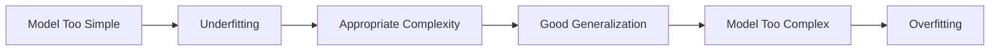

---

## 13. Bias-Variance Trade-Off

Prediction error can be viewed conceptually as:

$$
\text{Expected Error} = \text{Bias}^2 + \text{Variance} + \text{Irreducible Noise}
$$

### High Bias

The model makes overly simple assumptions.

```text
Likely result: underfitting
```

### High Variance

The model changes too much when the training data changes.

```text
Likely result: overfitting
```

The selected model should provide a reasonable balance.

---

## 14. Comparing Candidate Models

A fair comparison requires:

* The same training data
* The same validation folds
* The same preprocessing rules
* The same feature availability
* The same evaluation metric
* Reproducible random seeds
* Similar tuning effort

Example candidate models for regression:

```python
from sklearn.linear_model import LinearRegression, Ridge
from sklearn.ensemble import (
    RandomForestRegressor,
    GradientBoostingRegressor
)

models = {
    "linear_regression": LinearRegression(),
    "ridge": Ridge(alpha=1.0),
    "random_forest": RandomForestRegressor(
        n_estimators=300,
        random_state=42,
        n_jobs=-1
    ),
    "gradient_boosting": GradientBoostingRegressor(
        random_state=42
    )
}
```

---

## 15. Practical Model Comparison

```python
import pandas as pd

from sklearn.model_selection import cross_validate, KFold
from sklearn.pipeline import Pipeline
from sklearn.impute import SimpleImputer
from sklearn.preprocessing import StandardScaler
from sklearn.linear_model import LinearRegression, Ridge
from sklearn.ensemble import (
    RandomForestRegressor,
    GradientBoostingRegressor
)

models = {
    "linear_regression": LinearRegression(),
    "ridge": Ridge(alpha=1.0),
    "random_forest": RandomForestRegressor(
        n_estimators=300,
        random_state=42,
        n_jobs=-1
    ),
    "gradient_boosting": GradientBoostingRegressor(
        random_state=42
    )
}

cv = KFold(
    n_splits=5,
    shuffle=True,
    random_state=42
)

results = []

for model_name, model in models.items():
    pipeline = Pipeline([
        (
            "imputer",
            SimpleImputer(strategy="median")
        ),
        (
            "scaler",
            StandardScaler()
        ),
        (
            "model",
            model
        )
    ])

    scores = cross_validate(
        pipeline,
        X_train,
        y_train,
        cv=cv,
        scoring={
            "mae": "neg_mean_absolute_error",
            "rmse": "neg_root_mean_squared_error",
            "r2": "r2"
        },
        return_train_score=True,
        n_jobs=-1
    )

    results.append({
        "model": model_name,
        "train_mae": -scores["train_mae"].mean(),
        "validation_mae": -scores["test_mae"].mean(),
        "validation_mae_std": scores["test_mae"].std(),
        "validation_rmse": -scores["test_rmse"].mean(),
        "validation_r2": scores["test_r2"].mean()
    })

results_table = (
    pd.DataFrame(results)
    .sort_values("validation_mae")
)

print(results_table)
```

### Important Note

Scaling is essential for models such as:

* Linear Regression with regularization
* Logistic Regression
* Support Vector Machines
* K-Nearest Neighbors
* Neural Networks

Tree-based models usually do not require scaling. A real comparison may therefore use separate preprocessing pipelines for different model families.

---

## 16. Using a Column Transformer

Datasets often contain both numerical and categorical features.

```python
from sklearn.compose import ColumnTransformer
from sklearn.pipeline import Pipeline
from sklearn.preprocessing import (
    OneHotEncoder,
    StandardScaler
)
from sklearn.impute import SimpleImputer
from sklearn.linear_model import Ridge

numeric_features = [
    "area",
    "bedrooms",
    "bathrooms",
    "building_age"
]

categorical_features = [
    "location",
    "property_type"
]

numeric_pipeline = Pipeline([
    (
        "imputer",
        SimpleImputer(strategy="median")
    ),
    (
        "scaler",
        StandardScaler()
    )
])

categorical_pipeline = Pipeline([
    (
        "imputer",
        SimpleImputer(strategy="most_frequent")
    ),
    (
        "encoder",
        OneHotEncoder(
            handle_unknown="ignore"
        )
    )
])

preprocessor = ColumnTransformer([
    (
        "numeric",
        numeric_pipeline,
        numeric_features
    ),
    (
        "categorical",
        categorical_pipeline,
        categorical_features
    )
])

model_pipeline = Pipeline([
    (
        "preprocessor",
        preprocessor
    ),
    (
        "model",
        Ridge(alpha=1.0)
    )
])

model_pipeline.fit(X_train, y_train)
```

Using pipelines ensures that preprocessing is learned only from training data.

---

## 17. Hyperparameter Tuning

After identifying promising model families, tune their hyperparameters.

Common search strategies include:

* Grid Search
* Random Search
* Bayesian Optimization
* Successive Halving
* Optuna-style optimization

---

### 17.1 Grid Search

Grid Search evaluates every specified combination.

```python
from sklearn.model_selection import GridSearchCV
from sklearn.ensemble import RandomForestRegressor

pipeline = Pipeline([
    (
        "preprocessor",
        preprocessor
    ),
    (
        "model",
        RandomForestRegressor(
            random_state=42,
            n_jobs=-1
        )
    )
])

parameter_grid = {
    "model__n_estimators": [100, 300],
    "model__max_depth": [None, 10, 20],
    "model__min_samples_leaf": [1, 3, 5]
}

search = GridSearchCV(
    estimator=pipeline,
    param_grid=parameter_grid,
    scoring="neg_mean_absolute_error",
    cv=5,
    n_jobs=-1
)

search.fit(X_train, y_train)

print("Best parameters:", search.best_params_)
print("Best CV MAE:", -search.best_score_)
```

Grid Search can become expensive when many hyperparameters are included.

---

### 17.2 Random Search

Random Search evaluates randomly sampled combinations.

```python
from sklearn.model_selection import RandomizedSearchCV

parameter_distributions = {
    "model__n_estimators": [100, 200, 300, 500],
    "model__max_depth": [None, 5, 10, 20, 30],
    "model__min_samples_leaf": [1, 2, 3, 5, 10],
    "model__max_features": [
        "sqrt",
        "log2",
        None
    ]
}

search = RandomizedSearchCV(
    estimator=pipeline,
    param_distributions=parameter_distributions,
    n_iter=20,
    scoring="neg_mean_absolute_error",
    cv=5,
    random_state=42,
    n_jobs=-1
)

search.fit(X_train, y_train)
```

Random Search is often more efficient when the search space is large.

---

## 18. Nested Cross-Validation

When datasets are small, the same cross-validation process can accidentally be used both for tuning and performance estimation.

Nested cross-validation separates these tasks.

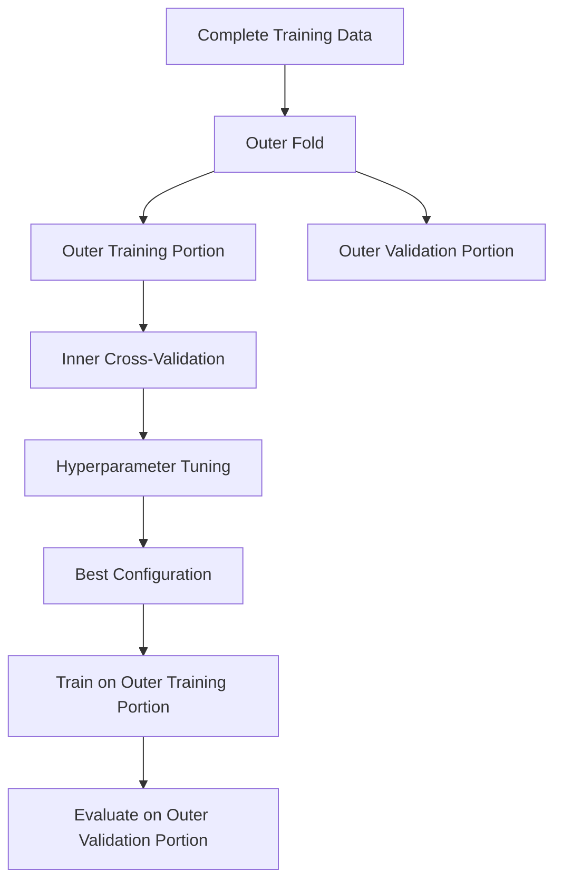

The inner loop tunes hyperparameters.

The outer loop estimates generalization performance.

Nested cross-validation is useful when:

* The dataset is small.
* Hyperparameter tuning is extensive.
* A reliable comparison is required.
* Model-selection bias is a concern.

---

## 19. Model Selection for Classification

Possible candidate models include:

```text
Dummy Classifier
Logistic Regression
Decision Tree
Random Forest
Support Vector Machine
Gradient Boosting
XGBoost
Neural Network
```

### Example

```python
import pandas as pd

from sklearn.model_selection import (
    StratifiedKFold,
    cross_validate
)
from sklearn.pipeline import Pipeline
from sklearn.preprocessing import StandardScaler
from sklearn.linear_model import LogisticRegression
from sklearn.ensemble import (
    RandomForestClassifier,
    GradientBoostingClassifier
)
from sklearn.svm import SVC

models = {
    "logistic_regression": LogisticRegression(
        max_iter=3000,
        class_weight="balanced"
    ),
    "random_forest": RandomForestClassifier(
        n_estimators=300,
        class_weight="balanced",
        random_state=42,
        n_jobs=-1
    ),
    "gradient_boosting": GradientBoostingClassifier(
        random_state=42
    ),
    "svm": SVC(
        probability=True,
        class_weight="balanced",
        random_state=42
    )
}

cv = StratifiedKFold(
    n_splits=5,
    shuffle=True,
    random_state=42
)

results = []

for model_name, model in models.items():
    pipeline = Pipeline([
        (
            "scaler",
            StandardScaler()
        ),
        (
            "model",
            model
        )
    ])

    scores = cross_validate(
        pipeline,
        X_train,
        y_train,
        cv=cv,
        scoring={
            "precision": "precision",
            "recall": "recall",
            "f1": "f1",
            "roc_auc": "roc_auc"
        },
        n_jobs=-1
    )

    results.append({
        "model": model_name,
        "precision": scores["test_precision"].mean(),
        "recall": scores["test_recall"].mean(),
        "f1": scores["test_f1"].mean(),
        "roc_auc": scores["test_roc_auc"].mean()
    })

comparison = (
    pd.DataFrame(results)
    .sort_values("f1", ascending=False)
)

print(comparison)
```

---

## 20. Model Selection for Regression

Possible candidate models include:

```text
Dummy Regressor
Linear Regression
Ridge
Lasso
Decision Tree
Random Forest
Gradient Boosting
XGBoost
Neural Network
```

Models should be compared using relevant metrics such as:

* MAE
* RMSE
* (R^2)
* Training time
* Prediction latency
* Model size

Example comparison table:

| Model             | CV MAE | CV RMSE | CV (R^2) | Training Time |
| ----------------- | -----: | ------: | -------: | ------------: |
| Median baseline   | 48,200 |  72,400 |    -0.01 |        0.01 s |
| Linear Regression | 31,100 |  47,300 |     0.69 |        0.04 s |
| Random Forest     | 22,600 |  35,700 |     0.82 |        3.80 s |
| Gradient Boosting | 21,900 |  34,800 |     0.84 |        1.90 s |

The Gradient Boosting model has the best average performance, but the final decision should still consider deployment requirements.

---

## 21. Model Selection for Unsupervised Learning

Model selection is more difficult in unsupervised learning because there may be no ground-truth target.

For clustering, compare:

* K-Means
* Hierarchical Clustering
* DBSCAN
* Gaussian Mixture Models

Possible evaluation criteria include:

* Silhouette score
* Davies-Bouldin score
* Calinski-Harabasz score
* Cluster stability
* Business usefulness
* Interpretability

### Silhouette Score

For sample (i):

$$
s(i) = \frac{b(i)-a(i)} {\max(a(i),b(i))}
$$

where:

* (a(i)) is the average distance to samples in the same cluster.
* (b(i)) is the average distance to the nearest other cluster.

The score ranges from (-1) to (1).

Higher values generally indicate better separation.

```python
from sklearn.cluster import KMeans
from sklearn.metrics import silhouette_score

results = []

for number_of_clusters in range(2, 11):
    model = KMeans(
        n_clusters=number_of_clusters,
        random_state=42,
        n_init="auto"
    )

    labels = model.fit_predict(X_scaled)

    score = silhouette_score(
        X_scaled,
        labels
    )

    results.append({
        "clusters": number_of_clusters,
        "silhouette_score": score
    })

print(pd.DataFrame(results))
```

A high internal clustering score does not guarantee that the clusters are useful for the business.

---

## 22. Decision Threshold Selection

For binary classification, the default probability threshold is commonly:

$$
0.5
$$

However, the best threshold depends on business costs.

```text
Probability >= threshold → positive class
Probability < threshold  → negative class
```

A fraud-detection system may lower the threshold to increase recall.

A system that automatically blocks customers may raise the threshold to increase precision.

---

### Python Example

```python
import numpy as np

from sklearn.metrics import (
    precision_score,
    recall_score,
    f1_score
)

probabilities = model.predict_proba(X_valid)[:, 1]

threshold_results = []

for threshold in np.arange(0.10, 0.91, 0.05):
    predictions = (
        probabilities >= threshold
    ).astype(int)

    threshold_results.append({
        "threshold": threshold,
        "precision": precision_score(
            y_valid,
            predictions,
            zero_division=0
        ),
        "recall": recall_score(
            y_valid,
            predictions,
            zero_division=0
        ),
        "f1": f1_score(
            y_valid,
            predictions,
            zero_division=0
        )
    })

threshold_table = pd.DataFrame(
    threshold_results
)

print(threshold_table)
```

Threshold selection is part of selecting the complete prediction system, not only the underlying algorithm.

---

## 23. Probability Calibration

Two models can have similar accuracy but different probability quality.

Example:

```text
Model A predicts 0.90 and is correct about 90% of the time.
Model B predicts 0.90 and is correct only 65% of the time.
```

Model A is better calibrated.

Calibration matters when probabilities are used for:

* Risk ranking
* Pricing
* Medical decisions
* Resource allocation
* Expected-value calculations

Possible calibration methods include:

* Platt scaling
* Isotonic regression
* Sigmoid calibration

```python
from sklearn.calibration import CalibratedClassifierCV

calibrated_model = CalibratedClassifierCV(
    estimator=base_model,
    method="isotonic",
    cv=5
)

calibrated_model.fit(X_train, y_train)
```

---

## 24. Error Analysis

Aggregate metrics do not explain where a model fails.

After comparing candidate models, inspect:

* False positives
* False negatives
* Largest regression errors
* Performance across important subgroups
* Errors across time periods
* Errors on rare cases
* Differences between model predictions

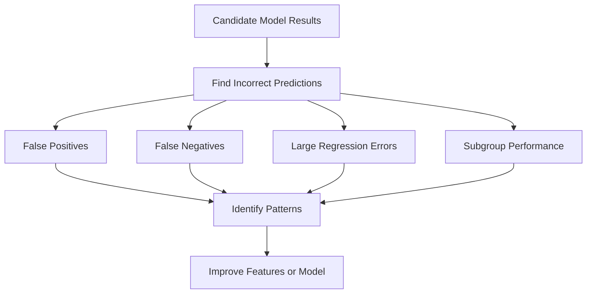

---

### Regression Error Analysis

```python
error_table = X_valid.copy()

error_table["actual"] = y_valid
error_table["prediction"] = predictions
error_table["absolute_error"] = (
    error_table["actual"]
    - error_table["prediction"]
).abs()

largest_errors = error_table.sort_values(
    "absolute_error",
    ascending=False
).head(20)

print(largest_errors)
```

---

### Classification Error Analysis

```python
error_table = X_valid.copy()

error_table["actual"] = y_valid
error_table["prediction"] = predictions
error_table["probability"] = probabilities

false_positives = error_table[
    (error_table["actual"] == 0)
    & (error_table["prediction"] == 1)
]

false_negatives = error_table[
    (error_table["actual"] == 1)
    & (error_table["prediction"] == 0)
]
```

---

## 25. Subgroup Evaluation

A model may perform well overall but poorly for an important group.

Examples of groups include:

* Geographic region
* Product category
* Customer segment
* Device type
* Time period
* Price range
* New versus existing customers

Example:

| Segment       | Samples |    MAE |
| ------------- | ------: | -----: |
| Apartments    |   2,100 | 18,400 |
| Townhouses    |     900 | 24,700 |
| Luxury houses |     300 | 61,900 |

The overall MAE may hide poor performance on luxury properties.

Model selection should consider whether the model is reliable for the groups that matter most.

---

## 26. Statistical and Practical Significance

A small metric difference may not justify selecting a more complex model.

Example:

| Model               | Mean CV F1 | Prediction Latency |
| ------------------- | ---------: | -----------------: |
| Logistic Regression |      0.841 |               3 ms |
| Gradient Boosting   |      0.846 |              48 ms |

The improvement is:

$$
0.846 - 0.841 = 0.005
$$

This may not justify:

* Sixteen times higher latency
* More difficult explanations
* Increased maintenance
* More complex deployment

The final choice should consider whether the improvement is practically meaningful.

---

## 27. Operational Selection Criteria

Predictive performance is only one dimension.

A production model may also be evaluated using:

| Criterion         | Question                                      |
| ----------------- | --------------------------------------------- |
| Inference latency | Can the model respond quickly enough?         |
| Throughput        | How many predictions can it process?          |
| Model size        | Can it fit on the target device?              |
| Training cost     | How expensive is retraining?                  |
| Feature cost      | Are required data sources expensive?          |
| Interpretability  | Can predictions be explained?                 |
| Maintainability   | Can the team support the model?               |
| Stability         | Does performance vary across time or folds?   |
| Fairness          | Does it perform consistently across groups?   |
| Privacy           | Does it require sensitive information?        |
| Robustness        | How does it handle missing or unusual inputs? |

---

## 28. Multi-Criteria Model Selection

A weighted decision score can be used when several criteria matter.

$$
S(M) = w_pP(M) - w_lL(M) - w_cC(M) + w_iI(M) + w_sS_t(M)
$$

where:

* (P(M)): predictive performance
* (L(M)): latency
* (C(M)): cost
* (I(M)): interpretability
* (S_t(M)): stability
* (w): business-defined weights

Example decision table:

| Model               | Accuracy | Latency | Explainability | Cost   | Decision               |
| ------------------- | -------: | ------: | -------------- | ------ | ---------------------- |
| Logistic Regression |     0.88 |     Low | High           | Low    | Strong candidate       |
| Random Forest       |     0.91 |  Medium | Medium         | Medium | Strong candidate       |
| Neural Network      |     0.92 |    High | Low            | High   | Reject for current use |

The highest-scoring model is not always the most appropriate production model.

---

## 29. Data Leakage During Model Selection

Data leakage occurs when information from outside the training process influences model development.

Common sources include:

* Scaling the complete dataset before splitting
* Imputing missing values using the complete dataset
* Selecting features using all labels
* Tuning models on the test set
* Including post-outcome variables
* Mixing the same customer across train and validation
* Randomly splitting time-series data

---

### Incorrect Workflow

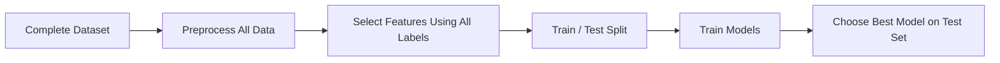

This process produces overly optimistic results.

---

### Correct Workflow

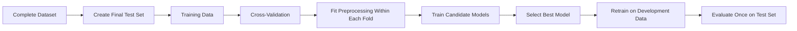

---

## 30. Repeated Test-Set Evaluation

Every time the test set influences a model decision, it becomes part of the training process.

Incorrect process:

```text
Evaluate model A on test set
Change features
Evaluate model B on test set
Tune hyperparameters
Evaluate model C on test set
Select the best test result
```

The test result is no longer unbiased.

Correct process:

```text
Use training and validation data for all decisions
Freeze the final pipeline
Evaluate once on the test set
```

---

## 31. Reproducible Experiments

A model-selection experiment should record:

* Dataset version
* Feature version
* Split strategy
* Random seed
* Preprocessing pipeline
* Model type
* Hyperparameters
* Validation metric
* Training time
* Inference latency
* Model artifact version
* Notes and assumptions

Example experiment table:

| Run | Features   | Model             | Parameters | CV MAE | CV Std | Notes       |
| --- | ---------- | ----------------- | ---------- | -----: | -----: | ----------- |
| 001 | Raw        | Linear Regression | Default    | 31,400 |  1,200 | Baseline    |
| 002 | Engineered | Random Forest     | 300 trees  | 22,300 |    950 | Strong      |
| 003 | Selected   | XGBoost           | depth 6    | 21,700 |    910 | Best score  |
| 004 | Selected   | Ridge             | alpha 1.0  | 27,900 |    700 | Most stable |

---

## 32. End-to-End Model-Selection Example

```python
import time
import pandas as pd

from sklearn.model_selection import (
    train_test_split,
    KFold,
    cross_validate
)
from sklearn.pipeline import Pipeline
from sklearn.impute import SimpleImputer
from sklearn.preprocessing import StandardScaler
from sklearn.dummy import DummyRegressor
from sklearn.linear_model import (
    LinearRegression,
    Ridge
)
from sklearn.ensemble import (
    RandomForestRegressor,
    GradientBoostingRegressor
)
from sklearn.metrics import (
    mean_absolute_error,
    mean_squared_error,
    r2_score
)

# Split the dataset before model development
X_train, X_test, y_train, y_test = train_test_split(
    X,
    y,
    test_size=0.20,
    random_state=42
)

models = {
    "median_baseline": DummyRegressor(
        strategy="median"
    ),
    "linear_regression": LinearRegression(),
    "ridge": Ridge(alpha=1.0),
    "random_forest": RandomForestRegressor(
        n_estimators=300,
        random_state=42,
        n_jobs=-1
    ),
    "gradient_boosting": GradientBoostingRegressor(
        random_state=42
    )
}

cv = KFold(
    n_splits=5,
    shuffle=True,
    random_state=42
)

experiment_results = []

for model_name, model in models.items():
    pipeline = Pipeline([
        (
            "imputer",
            SimpleImputer(strategy="median")
        ),
        (
            "scaler",
            StandardScaler()
        ),
        (
            "model",
            model
        )
    ])

    start_time = time.perf_counter()

    scores = cross_validate(
        pipeline,
        X_train,
        y_train,
        cv=cv,
        scoring={
            "mae": "neg_mean_absolute_error",
            "rmse": "neg_root_mean_squared_error",
            "r2": "r2"
        },
        n_jobs=-1,
        return_train_score=True
    )

    elapsed_time = (
        time.perf_counter() - start_time
    )

    experiment_results.append({
        "model": model_name,
        "train_mae": -scores[
            "train_mae"
        ].mean(),
        "validation_mae": -scores[
            "test_mae"
        ].mean(),
        "validation_mae_std": scores[
            "test_mae"
        ].std(),
        "validation_rmse": -scores[
            "test_rmse"
        ].mean(),
        "validation_r2": scores[
            "test_r2"
        ].mean(),
        "cv_time_seconds": elapsed_time
    })

comparison_table = (
    pd.DataFrame(experiment_results)
    .sort_values("validation_mae")
)

print(comparison_table)

# Select the model based on validation results
best_model = Pipeline([
    (
        "imputer",
        SimpleImputer(strategy="median")
    ),
    (
        "scaler",
        StandardScaler()
    ),
    (
        "model",
        GradientBoostingRegressor(
            random_state=42
        )
    )
])

# Retrain the selected pipeline on all training data
best_model.fit(X_train, y_train)

# Final test evaluation
test_predictions = best_model.predict(X_test)

test_mae = mean_absolute_error(
    y_test,
    test_predictions
)

test_rmse = mean_squared_error(
    y_test,
    test_predictions
) ** 0.5

test_r2 = r2_score(
    y_test,
    test_predictions
)

print("Final test MAE:", test_mae)
print("Final test RMSE:", test_rmse)
print("Final test R-squared:", test_r2)
```

---

## 33. Recommended Model-Selection Strategy

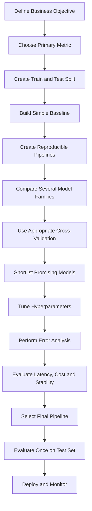

Recommended steps:

1. Define the business decision.
2. Choose one primary evaluation metric.
3. Define secondary metrics and constraints.
4. Reserve a final test set.
5. Build a simple baseline.
6. Create consistent preprocessing pipelines.
7. Compare several reasonable model families.
8. Use an appropriate cross-validation strategy.
9. Tune only promising models.
10. Analyze errors and subgroup performance.
11. Measure latency, size, and cost.
12. Select the complete model pipeline.
13. Evaluate once on the test set.
14. Document the decision and assumptions.
15. Deploy and monitor production performance.

---

## 34. Common Mistakes

### 34.1 Choosing the Model with the Best Training Score

A high training score may indicate overfitting.

Always evaluate on unseen validation data.

---

### 34.2 Using the Wrong Metric

Accuracy may be misleading for imbalanced classification.

(R^2) may not communicate actual prediction error in business units.

Choose metrics based on the decision being supported.

---

### 34.3 Selecting a Complex Model Without a Baseline

A complex model should demonstrate meaningful improvement over a simple baseline.

Complexity alone is not evidence of quality.

---

### 34.4 Tuning on the Test Set

The test set must remain independent of model-development decisions.

---

### 34.5 Applying Preprocessing Before Cross-Validation

This can leak information across folds.

Place preprocessing inside a pipeline.

---

### 34.6 Comparing Models on Different Data Splits

Candidate models should use the same validation folds.

Otherwise, score differences may come from the data split rather than the model.

---

### 34.7 Ignoring Score Variability

Compare both the average score and standard deviation.

```text
Model A: F1 = 0.84 ± 0.01
Model B: F1 = 0.85 ± 0.08
```

Model A may be more reliable despite a slightly lower mean score.

---

### 34.8 Ignoring Inference Requirements

A model that takes five seconds per prediction may be unsuitable for a real-time API.

---

### 34.9 Ignoring Feature Availability

A model cannot use a feature that does not exist at prediction time.

---

### 34.10 Selecting Models Only from One Family

Comparing only several Random Forest configurations is hyperparameter tuning, not broad model-family comparison.

Include models with different assumptions.

---

### 34.11 Tuning Every Candidate Extensively

First perform a coarse comparison.

Tune only the most promising candidates to avoid unnecessary cost.

---

### 34.12 Ignoring Error Analysis

Two models with the same aggregate metric may fail on different samples.

Review whether the errors are acceptable for the business.

---

## 35. Practical Exercise

### Dataset

Use a house-price dataset containing variables such as:

```text
area
bedrooms
bathrooms
floors
location
property_type
building_age
distance_to_city_center
school_score
crime_rate
garage
sale_price
```

---

### Task 1: Define the Objective

Write down:

* The prediction target
* The primary business metric
* The cost of large errors
* The expected inference environment

Example:

```text
Goal:
Predict sale price before a property is listed.

Primary metric:
MAE because it is easy to interpret in currency.

Secondary metric:
RMSE because large errors are especially costly.
```

---

### Task 2: Build a Baseline

Train a `DummyRegressor` using:

* Mean prediction
* Median prediction

Record MAE, RMSE, and (R^2).

---

### Task 3: Compare Candidate Models

Train at least:

* Linear Regression
* Ridge Regression
* Random Forest
* Gradient Boosting or XGBoost

Use the same five-fold cross-validation splits.

---

### Task 4: Tune Promising Models

Tune one linear model and one tree-based model.

Possible hyperparameters:

```text
Ridge:
- alpha

Random Forest:
- n_estimators
- max_depth
- min_samples_leaf

XGBoost:
- learning_rate
- max_depth
- n_estimators
- subsample
```

---

### Task 5: Create an Experiment Table

| Experiment | Model             | Features | CV MAE | CV RMSE | CV (R^2) | Training Time |
| ---------- | ----------------- | -------: | -----: | ------: | -------: | ------------: |
| Baseline   | Median            |        0 |        |         |          |               |
| Model 1    | Linear Regression |          |        |         |          |               |
| Model 2    | Ridge             |          |        |         |          |               |
| Model 3    | Random Forest     |          |        |         |          |               |
| Model 4    | XGBoost           |          |        |         |          |               |

---

### Task 6: Perform Error Analysis

Inspect:

* The ten largest absolute errors
* Errors by property type
* Errors by price range
* Errors by location
* Differences between the two strongest models

---

### Task 7: Select the Final Model

Write a short decision statement:

```text
The selected model is Gradient Boosting because it achieved the
lowest cross-validation MAE, remained stable across folds, and
met the required prediction-latency limit.

Random Forest achieved similar performance but produced a larger
model and slower inference.

Linear Regression remains the interpretability baseline.
```

---

## 36. Mini-Project Integration

## Project: House Price Prediction

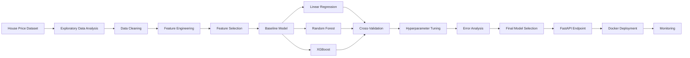

Suggested portfolio artifacts:

* Jupyter Notebook
* Data-quality report
* Feature-engineering documentation
* Cross-validation comparison table
* Hyperparameter-search results
* Error-analysis chart
* Model-selection decision report
* Saved model pipeline
* FastAPI prediction endpoint
* Docker image
* Model card

---

## 37. Model-Selection Decision Template

Use the following template in a notebook or portfolio report:

```text
Business objective:
Primary evaluation metric:
Secondary metrics:
Validation strategy:
Baseline model:
Candidate models:
Selected feature set:
Best cross-validation result:
Cross-validation variability:
Training time:
Prediction latency:
Interpretability requirement:
Known limitations:
Selected model:
Reason for selection:
Final test result:
Next experiment:
```

---

## 38. Completion Checklist

* [ ] I can explain model selection in one or two minutes.
* [ ] I understand the difference between training, tuning, and selection.
* [ ] I can build a simple baseline.
* [ ] I can create train, validation, and test sets correctly.
* [ ] I can use cross-validation for model comparison.
* [ ] I can choose a metric based on the business problem.
* [ ] I can identify underfitting and overfitting.
* [ ] I can compare multiple model families fairly.
* [ ] I can place preprocessing inside a pipeline.
* [ ] I understand why the test set should not guide model development.
* [ ] I can perform basic hyperparameter tuning.
* [ ] I can analyze false positives, false negatives, or large errors.
* [ ] I can evaluate training time and inference latency.
* [ ] I can justify the final model using technical and business criteria.
* [ ] I have created a notebook, chart, model, API, or portfolio note.
* [ ] I have documented at least one caveat or assumption.

---

## 39. Key Takeaways

1. **Model selection chooses the complete machine learning solution, not only an algorithm.**

2. **Always begin with a simple and meaningful baseline.**

3. **Use training data to fit parameters, validation data to make decisions, and the test set for final evaluation.**

4. **Cross-validation provides a more reliable comparison than one validation split.**

5. **The validation strategy must match the data structure.**

6. **Choose metrics according to business costs and objectives.**

7. **A high training score does not guarantee good generalization.**

8. **Compare candidate models using the same data, folds, and preprocessing rules.**

9. **Place preprocessing, feature selection, and modeling inside a pipeline to prevent leakage.**

10. **The model with the highest score is not always the best production model.**

11. **Latency, cost, interpretability, stability, fairness, and maintainability also matter.**

12. **Error analysis is necessary before accepting the final model.**

13. **The test set should be evaluated only after the complete pipeline has been selected.**

---

## 40. Related Outcome

Train, compare, and evaluate supervised and unsupervised machine learning models with thoughtful feature engineering and reliable model-selection practices.

---

## 41. Related Project

**Mini Project:** House Price Prediction with:

* Exploratory Data Analysis
* Data Cleaning
* Feature Engineering
* Feature Selection
* Baseline Modeling
* Linear Regression
* Random Forest
* XGBoost
* Cross-Validation
* Hyperparameter Tuning
* Metric Comparison
* Error Analysis
* Final Model Selection
* API Deployment

---

## 42. Conclusion

**Model Selection** is a critical stage in the AI and Data Scientist workflow.

Its purpose is not merely to find the algorithm with the highest validation score. Its purpose is to select a complete solution that:

* Solves the correct business problem
* Generalizes to unseen data
* Improves meaningfully over a baseline
* Uses appropriate features and metrics
* Avoids data leakage
* Produces acceptable errors
* Meets production constraints
* Can be monitored and maintained

A successful model-selection process should answer:

```text
Which candidate models were compared?
Which validation strategy was used?
Which metric represented the business objective?
How stable were the results?
What kinds of errors did each model make?
Why was the final model selected?
Will it work reliably in production?
```

Turn this lesson into a practical artifact such as a notebook, experiment table, evaluation dashboard, trained pipeline, model card, FastAPI service, Docker deployment, or portfolio case study.
````

### 3. `01 - AI & Dữ liệu/02 - Data Science, Analytics & ML/machine-learning-roadmap/Machine-Learning-Roadmap-Course/00 - Roadmap.sh Machine Learning Official/04 - Evaluation, Workflow and Deep Learning/Module 13 - Deep Learning Foundations/02-LossFunctions-Regularization/010 - Regularization.md`

Nguồn: `01 - AI & Dữ liệu/02 - Data Science, Analytics & ML/machine-learning-roadmap/Machine-Learning-Roadmap-Course/00 - Roadmap.sh Machine Learning Official/04 - Evaluation, Workflow and Deep Learning/Module 13 - Deep Learning Foundations/02-LossFunctions-Regularization/010 - Regularization.md`

````markdown
# 010 - Regularization

**Hoc phan:** 04 - Evaluation, Workflow and Deep Learning
**Module:** Module 13 - Deep Learning Foundations
**Nhom noi dung:** Neural Network Basics
**Nguon roadmap:** Deep Learning Foundations / Neural Network Basics
**Loai bai:** deep learning
**Thu tu trong module:** 010
**Thoi luong goi y:** 36 phut

---

## 1. Tom tat

Bai nay giai thich **Regularization** trong boi canh Machine Learning Engineer Roadmap 2026. Sau bai hoc, ban nen biet topic nay nam o dau trong quy trinh ML, lien quan den data, feature, model, training, evaluation, deployment hoac portfolio nhu the nao.

## 2. Muc tieu hoc tap

- Giai thich duoc Regularization bang ngon ngu cua ban.
- Nhan biet topic nay anh huong den model quality, generalization, interpretability, cost hoac production risk nao.
- Ap dung vao mot artifact nho: notebook, script, metric table, chart, diagram, model report hoac README.

## 3. Khai niem chinh

- Regularization is part of the Neural Network Basics topic in the Machine Learning roadmap.
- Focus on forward pass, loss, backpropagation and optimization before complex architectures.
- Training curves often reveal more than final accuracy alone.
- Learn it by connecting the definition, the dataset assumption, the model behavior and the evaluation impact.
- An ML Engineer should know where this concept appears in an end-to-end training workflow.

## 4. Thuc hanh

1. Build a tiny network or diagram the architecture.
2. Identify input shape, output shape, loss and optimizer.
3. Record one training curve, failure mode or debugging note.

## 5. Bai tap

Build or diagram the architecture and identify inputs, outputs, loss and training signal.

## 6. Checklist hoan thanh

- [ ] Co dinh nghia ngan gon.
- [ ] Co vi du trong bai toan ML.
- [ ] Co artifact nho de dua vao portfolio.
- [ ] Co ghi chu ve leakage, metric, overfitting, interpretability hoac production risk neu lien quan.

## 7. Ghi chu san xuat

Khi dua vao production, hay hoi: du lieu moi co giong train data khong, metric co phu hop business cost khong, model co drift khong, prediction co giai thich duoc khong va pipeline co tai lap duoc tu raw data den model artifact khong.
````

### 4. `01 - AI & Dữ liệu/02 - Data Science, Analytics & ML/khoa-hoc-tinh-toan-tien-hoa/Chuong 03 - Lap Trinh Di Truyen/03-lap-trinh-di-truyen.md`

Nguồn: `01 - AI & Dữ liệu/02 - Data Science, Analytics & ML/khoa-hoc-tinh-toan-tien-hoa/Chuong 03 - Lap Trinh Di Truyen/03-lap-trinh-di-truyen.md`

````markdown
# Chương 3: Lập Trình Di Truyền

## Genetic Programming - GP

Ở Chương 2, ta đã học **Giải thuật di truyền - Genetic Algorithm (GA)**, trong đó mỗi cá thể thường được biểu diễn bằng một chuỗi có độ dài cố định như chuỗi bit, vector số thực hoặc chuỗi số nguyên.

Sang chương này, ta học một nhánh đặc biệt hơn của tính toán tiến hóa: **Lập trình di truyền - Genetic Programming (GP)**.

Khác với GA, trong GP, mỗi cá thể không còn là một chuỗi gen đơn giản mà là **một chương trình máy tính**, **một hàm số**, hoặc **một biểu thức toán học** được biểu diễn dưới dạng **cây cú pháp**.

---

## Mục Tiêu Bài Học

Sau chương này, bạn sẽ:

* Hiểu **Genetic Programming - GP** là gì.
* Biết điểm giống và khác nhau giữa **GA** và **GP**.
* Hiểu cách biểu diễn cá thể trong GP bằng **cây cấu trúc / cây cú pháp**.
* Nắm được khái niệm:

  * **Tập hàm - Function set**
  * **Tập kết thúc - Terminal set**
* Hiểu các toán tử chính trong GP:

  * Chọn lọc
  * Lai ghép
  * Đột biến
  * Đánh giá độ thích nghi
* Biết các loại đột biến phổ biến trong GP.
* Hiểu cách GP được dùng trong bài toán **hồi quy ký hiệu - Symbolic Regression**.
* Nhận biết vấn đề **bloat** và cách khắc phục.

---

# 1. Genetic Programming Là Gì?

**Genetic Programming - GP** là một thuật toán tiến hóa dùng để tìm kiếm hoặc tối ưu hóa **chương trình máy tính**, **hàm số**, hoặc **biểu thức toán học**.

Có thể xem GP là một dạng đặc biệt của **Genetic Algorithm - GA**.

Trong GA, cá thể thường là:

```text
[1, 0, 1, 1, 0, 0, 1]
```

hoặc:

```text
[2.5, -1.2, 0.7, 4.1]
```

Nhưng trong GP, cá thể có thể là một chương trình hoặc biểu thức như:

```text
x * ln(a) + sin(z) / exp(-x) - 3.4
```

Biểu thức này được biểu diễn dưới dạng cây.

---

## Ý Tưởng Chính Của GP

Thay vì con người viết sẵn chương trình giải bài toán, GP cố gắng để máy tính **tự tiến hóa ra chương trình tốt nhất**.

Nói cách khác:

> GP tìm một chương trình tối ưu trong không gian tất cả các chương trình có thể, sao cho chương trình đó đạt hiệu suất tốt nhất theo một hàm đánh giá cho trước.

Ví dụ:

* Tìm hàm số khớp với dữ liệu.
* Tìm biểu thức dự đoán giá nhà.
* Sinh luật điều khiển robot.
* Tối ưu kiến trúc mạng neural.
* Tự động sinh chương trình nhỏ để giải bài toán.

---

# 2. So Sánh GA Và GP

| Tiêu chí              | Genetic Algorithm - GA             | Genetic Programming - GP                  |
| --------------------- | ---------------------------------- | ----------------------------------------- |
| Cách biểu diễn cá thể | Chuỗi gen / nhiễm sắc thể          | Cây chương trình / cây biểu thức          |
| Độ dài cá thể         | Thường cố định                     | Có thể thay đổi                           |
| Cá thể đại diện cho   | Một lời giải hoặc bộ tham số       | Một hàm số hoặc chương trình              |
| Toán tử lai ghép      | Cắt và trao đổi đoạn chuỗi         | Trao đổi cây con                          |
| Toán tử đột biến      | Thay đổi alen / bit / giá trị      | Thay đổi nút, cây con, toán tử            |
| Kết quả đầu ra        | Vector tham số tối ưu              | Chương trình hoặc biểu thức tối ưu        |
| Ví dụ                 | Tối ưu lịch thi, trọng số, tham số | Tìm công thức toán học, sinh chương trình |

---

## Sơ Đồ So Sánh Trực Quan

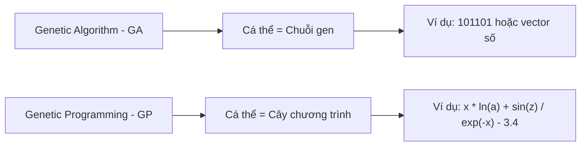

---

# 3. Sơ Đồ Tổng Quát Của Genetic Programming

Sơ đồ hoạt động của GP khá giống với GA.

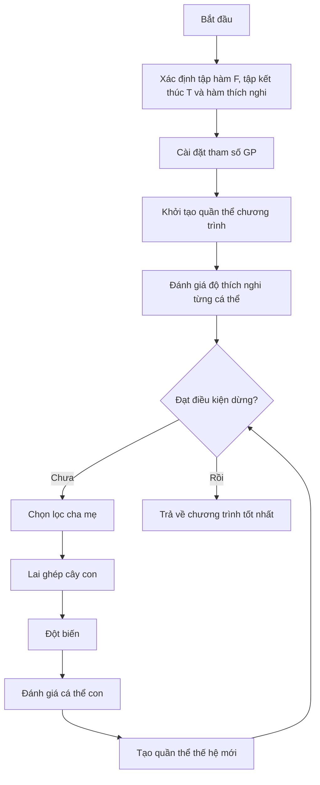

---

# 4. Mã Giả Thuật Toán GP

```text
begin
    Xác định tập hàm, tập kết thúc và hàm thích nghi;

    Cài đặt các tham số cho GP:
        - Kích thước quần thể
        - Số thế hệ
        - Xác suất lai ghép
        - Xác suất đột biến
        - Độ sâu tối đa của cây

    Khởi tạo quần thể ban đầu P;

    Tính toán độ thích nghi cho từng cá thể trong P;

    while chưa đạt điều kiện dừng do
        Chọn các cặp cha mẹ từ quần thể hiện tại P;

        Áp dụng toán tử lai ghép và đột biến
        để tạo ra quần thể con O;

        Tính toán độ thích nghi cho từng cá thể trong O;

        Chọn lọc các cá thể tốt cho thế hệ sau;

        Cập nhật quần thể P;
    end while

    Trả về cá thể có độ thích nghi tốt nhất;
end
```

---

# 5. Biểu Diễn Cá Thể Trong GP

Trong GP, mỗi cá thể được biểu diễn dưới dạng **cây cấu trúc** hoặc **cây cú pháp**.

Một cây GP gồm hai loại nút:

| Thành phần | Ý nghĩa                               |
| ---------- | ------------------------------------- |
| Nút trong  | Là toán tử hoặc hàm                   |
| Nút lá     | Là biến, hằng số hoặc giá trị đầu vào |

---

## 5.1. Tập Hàm - Function Set

**Tập hàm** là tập các toán tử hoặc hàm có thể xuất hiện tại các nút trong của cây.

Ví dụ:

```text
F = { +, -, *, /, ln, sin, exp }
```

Một số nhóm hàm thường gặp:

| Nhóm       | Ví dụ                                    |
| ---------- | ---------------------------------------- |
| Toán học   | `+`, `-`, `*`, `/`, `exp`, `log`, `sqrt` |
| Lượng giác | `sin`, `cos`, `tan`                      |
| Logic      | `and`, `or`, `xor`, `not`                |
| Điều kiện  | `if-then-else`                           |
| So sánh    | `>`, `<`, `>=`, `<=`, `==`               |

---

## 5.2. Tập Kết Thúc - Terminal Set

**Tập kết thúc** là tập các phần tử có thể xuất hiện ở nút lá.

Ví dụ:

```text
T = { x, a, z, 3.4 }
```

Tập kết thúc có thể gồm:

| Loại               | Ví dụ                         |
| ------------------ | ----------------------------- |
| Biến đầu vào       | `x`, `a`, `z`, `price`, `age` |
| Hằng số            | `1`, `2.5`, `3.4`, `-1`       |
| Giá trị ngẫu nhiên | `rand()`                      |
| Module cơ bản      | Các hàm con không có đối số   |

---

# 6. Ví Dụ Cây Biểu Diễn Chương Trình

Xét biểu thức:

```text
y := x * ln(a) + sin(z) / exp(-x) - 3.4
```

Tập kết thúc:

```text
T = { x, a, z, 3.4 }
```

Tập hàm:

```text
F = { *, +, -, /, ln, sin, exp }
```

Biểu thức trên có thể được biểu diễn bằng cây như sau:

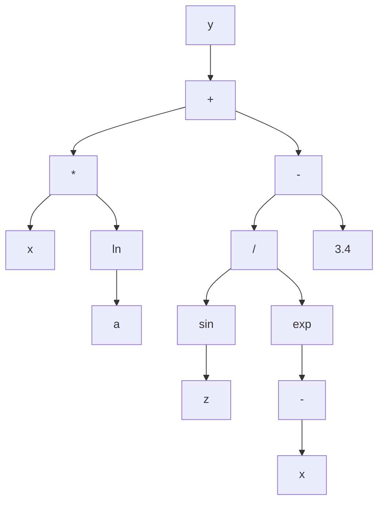

Cây trên tương ứng với biểu thức:

```text
y = x * ln(a) + sin(z) / exp(-x) - 3.4
```

Trong đó:

* Các nút `+`, `-`, `*`, `/`, `ln`, `sin`, `exp` là **nút hàm**.
* Các nút `x`, `a`, `z`, `3.4` là **nút kết thúc**.

---

# 7. Cách Khởi Tạo Cá Thể Trong GP

Khi khởi tạo một cá thể GP, ta cần sinh ra một cây ngẫu nhiên.

Quy tắc cơ bản:

* Nút gốc thường được chọn từ **tập hàm**.
* Nút không phải gốc có thể được chọn từ:

  * Tập hàm
  * Tập kết thúc
* Nếu chọn từ tập kết thúc, nút đó trở thành **nút lá**.
* Nếu chọn từ tập hàm, nút đó trở thành **nút trong**.
* Số nhánh con của một nút phụ thuộc vào số đối số của hàm tại nút đó.

Ví dụ:

| Hàm            | Số đối số | Số nhánh con |
| -------------- | --------: | -----------: |
| `+`            |         2 |            2 |
| `-`            |         2 |            2 |
| `*`            |         2 |            2 |
| `/`            |         2 |            2 |
| `sin`          |         1 |            1 |
| `ln`           |         1 |            1 |
| `exp`          |         1 |            1 |
| `if-then-else` |         3 |            3 |

---

## Các Phương Pháp Khởi Tạo Phổ Biến

| Phương pháp              | Cách hoạt động                                                 | Đặc điểm                                  |
| ------------------------ | -------------------------------------------------------------- | ----------------------------------------- |
| **Full**                 | Các nút trong đều là hàm cho đến độ sâu tối đa, lá là terminal | Cây đầy đủ, cân đối                       |
| **Grow**                 | Mỗi nút có thể là hàm hoặc terminal                            | Cây đa dạng hơn, không nhất thiết cân đối |
| **Ramped Half-and-Half** | Kết hợp Full và Grow ở nhiều độ sâu khác nhau                  | Phổ biến nhất, tạo quần thể đa dạng       |

---

# 8. Điều Kiện Đóng Và Điều Kiện Đầy Đủ

Khi thiết kế GP, tập hàm và tập kết thúc cần thỏa hai điều kiện quan trọng.

---

## 8.1. Điều Kiện Đóng - Closure Property

**Điều kiện đóng** yêu cầu mọi hàm trong tập hàm phải xử lý được mọi giá trị đầu vào có thể xuất hiện.

Ví dụ, nếu dùng phép chia `/`, cần xử lý trường hợp chia cho 0.

Thay vì dùng phép chia thường:

```text
a / b
```

ta dùng **phép chia bảo vệ**:

```text
protected_divide(a, b):
    nếu |b| rất nhỏ:
        trả về 1
    ngược lại:
        trả về a / b
```

Tương tự:

| Hàm       | Vấn đề     | Cách bảo vệ                   |
| --------- | ---------- | ----------------------------- |
| `/`       | Chia cho 0 | Protected division            |
| `log(x)`  | `x <= 0`   | Dùng `log(abs(x) + epsilon)`  |
| `sqrt(x)` | `x < 0`    | Dùng `sqrt(abs(x))`           |
| `exp(x)`  | Tràn số    | Giới hạn miền giá trị của `x` |

---

## 8.2. Điều Kiện Đầy Đủ - Sufficiency Property

**Điều kiện đầy đủ** yêu cầu tập hàm và tập kết thúc phải đủ mạnh để biểu diễn được lời giải mong muốn.

Ví dụ:

Nếu bài toán cần tìm hàm dạng:

```text
y = sin(x) + x^2
```

mà tập hàm chỉ có:

```text
F = { +, -, *, / }
```

thì GP có thể biểu diễn được phần `x^2`, nhưng khó biểu diễn chính xác phần `sin(x)`.

Do đó cần bổ sung:

```text
sin
```

vào tập hàm.

---

# 9. Các Toán Tử Trong Genetic Programming

GP thường sử dụng các toán tử chính sau:

```mermaid
flowchart LR
    A["Quần thể hiện tại"] --> B["Chọn lọc"]
    B --> C["Lai ghép"]
    C --> D["Đột biến"]
    D --> E["Đánh giá độ thích nghi"]
    E --> F["Quần thể thế hệ mới"]
```

---

# 10. Chọn Lọc Trong GP

Các phương pháp chọn lọc cha mẹ trong GP tương tự như trong GA.

Một số phương pháp phổ biến:

| Phương pháp              | Ý tưởng                                         |
| ------------------------ | ----------------------------------------------- |
| Roulette Wheel Selection | Cá thể tốt có xác suất được chọn cao hơn        |
| Tournament Selection     | Chọn ngẫu nhiên vài cá thể, lấy cá thể tốt nhất |
| Rank Selection           | Xếp hạng cá thể rồi chọn theo hạng              |
| Elitism                  | Giữ lại cá thể tốt nhất qua thế hệ sau          |

Trong GP, **Tournament Selection** rất thường được dùng vì đơn giản và hiệu quả.

---

# 11. Lai Ghép Trong GP

## 11.1. Ý Tưởng

Toán tử lai ghép trong GP thường là **lai ghép cây con - Subtree Crossover**.

Cách thực hiện:

1. Chọn ngẫu nhiên một cây con từ cá thể cha.
2. Chọn ngẫu nhiên một cây con từ cá thể mẹ.
3. Trao đổi hai cây con đó.
4. Tạo ra cá thể con mới.

---

## 11.2. Minh Họa Lai Ghép

Giả sử có hai cá thể cha mẹ:

```text
Cha 1: (x + 1) * sin(x)
Cha 2: x - 2
```

Nếu chọn cây con `sin(x)` ở cha 1 và cây con `x - 2` ở cha 2, sau khi lai ghép ta có thể tạo ra:

```text
Con: (x + 1) * (x - 2)
```

Sơ đồ:

```mermaid
flowchart TD
    subgraph P1["Cha 1: (x + 1) * sin(x)"]
        A1["*"] --> B1["+"]
        A1 --> C1["sin"]
        B1 --> D1["x"]
        B1 --> E1["1"]
        C1 --> F1["x"]
    end

    subgraph P2["Cha 2: x - 2"]
        A2["-"] --> B2["x"]
        A2 --> C2["2"]
    end

    subgraph C["Con: (x + 1) * (x - 2)"]
        A3["*"] --> B3["+"]
        A3 --> C3["-"]
        B3 --> D3["x"]
        B3 --> E3["1"]
        C3 --> F3["x"]
        C3 --> G3["2"]
    end
```

---

## 11.3. Đặc Điểm Của Lai Ghép GP

Lai ghép trong GP giúp:

* Kết hợp các cấu trúc tốt từ nhiều cá thể.
* Tạo ra chương trình mới.
* Khám phá không gian chương trình rộng hơn.
* Tăng khả năng tìm được lời giải tốt.

Tuy nhiên, lai ghép cũng có thể tạo ra cây quá lớn hoặc không hiệu quả, vì vậy thường cần giới hạn:

* Độ sâu tối đa.
* Số nút tối đa.
* Kích thước cây con được trao đổi.

---

# 12. Đột Biến Trong GP

Đột biến giúp duy trì sự đa dạng của quần thể, tránh việc thuật toán bị kẹt ở cực trị cục bộ.

Trong GP có nhiều loại đột biến.

---

## 12.1. Đột Biến Nút Trong

**Đột biến nút trong** là thay thế hàm tại một nút trong bằng một hàm khác trong tập hàm.

Ví dụ:

```text
(x + y)
```

đột biến nút `+` thành `*`:

```text
(x * y)
```

Điều kiện:

* Hàm mới thường phải có cùng số đối số với hàm cũ.
* Ví dụ `+`, `-`, `*`, `/` đều có 2 đối số nên có thể thay thế nhau.

---

## 12.2. Đột Biến Nút Kết Thúc

**Đột biến nút kết thúc** là thay thế biến hoặc hằng tại nút lá bằng một biến hoặc hằng khác.

Ví dụ:

```text
(x + 1)
```

đột biến `1` thành `3.4`:

```text
(x + 3.4)
```

hoặc đột biến `x` thành `z`:

```text
(z + 1)
```

---

## 12.3. Đột Biến Đảo

**Đột biến đảo** chọn ngẫu nhiên một nút trong và đảo hai nút con của nó.

Ví dụ:

```text
(x - y)
```

sau khi đảo:

```text
(y - x)
```

Với các toán tử không giao hoán như `-` và `/`, đột biến đảo có thể làm thay đổi mạnh kết quả.

---

## 12.4. Đột Biến Phát Triển Cây

**Đột biến phát triển cây** chọn một nút ngẫu nhiên và thay toàn bộ cây con tại nút đó bằng một cây con mới được sinh ngẫu nhiên.

Ví dụ:

```text
(x + 1) * sin(x)
```

chọn cây con `sin(x)` và thay bằng `x - 2`:

```text
(x + 1) * (x - 2)
```

Đây là loại đột biến mạnh, có thể tạo ra thay đổi lớn trong cấu trúc chương trình.

---

## 12.5. Đột Biến Gauss

**Đột biến Gauss** áp dụng cho nút lá chứa hằng số.

Ví dụ:

```text
x + 3.4
```

Thêm nhiễu Gauss vào `3.4`:

```text
3.4 + noise
```

Nếu `noise = 0.2`, ta được:

```text
x + 3.6
```

Loại đột biến này phù hợp khi cây chứa các hằng số thực.

---

## 12.6. Đột Biến Cắt Tỉa Cây

**Đột biến cắt tỉa cây** chọn một nút và thay toàn bộ cây con tại nút đó bằng một terminal.

Ví dụ:

```text
(x + 1) * (sin(z) / exp(-x))
```

nếu cắt tỉa cây con `sin(z) / exp(-x)` và thay bằng `a`, ta được:

```text
(x + 1) * a
```

Đột biến này giúp giảm kích thước cây và chống lại hiện tượng **bloat**.

---

## Bảng Tổng Hợp Các Loại Đột Biến

| Loại đột biến           | Cách thực hiện             | Tác dụng                  |
| ----------------------- | -------------------------- | ------------------------- |
| Đột biến nút trong      | Thay hàm ở nút trong       | Thay đổi toán tử          |
| Đột biến nút kết thúc   | Thay biến/hằng ở nút lá    | Thay đổi dữ liệu đầu vào  |
| Đột biến đảo            | Đảo vị trí hai nút con     | Thay đổi thứ tự tính toán |
| Đột biến phát triển cây | Thay cây con bằng cây mới  | Tạo thay đổi lớn          |
| Đột biến Gauss          | Thêm nhiễu vào hằng số     | Tinh chỉnh hằng số thực   |
| Đột biến cắt tỉa        | Thay cây con bằng terminal | Làm cây gọn hơn           |

---

# 13. Đánh Giá Độ Thích Nghi Trong GP

Mỗi cá thể GP là một chương trình hoặc hàm số. Để đánh giá cá thể đó, ta chạy nó trên một tập dữ liệu mẫu.

Giả sử có tập dữ liệu:

```text
X = {mẫu 1, mẫu 2, ..., mẫu N}
```

Mỗi mẫu gồm đầu vào và đầu ra mong muốn.

Ví dụ:

```text
Input:  a, x, z
Output: y
```

Một cá thể GP biểu diễn hàm:

```text
ŷ = f(a, x, z)
```

Ta so sánh giá trị dự đoán `ŷ` với giá trị thật `y`.

---

## 13.1. Quy Trình Đánh Giá

```mermaid
flowchart TD
    A["Cá thể GP = chương trình / hàm số"] --> B["Chạy trên từng mẫu dữ liệu"]
    B --> C["Tính giá trị dự đoán ŷ"]
    C --> D["So sánh với giá trị thật y"]
    D --> E["Tính lỗi"]
    E --> F["Tính fitness"]
```

---

## 13.2. Dùng MSE Làm Fitness

Một cách phổ biến là dùng **Mean Squared Error - MSE**:

```text
MSE = (1/N) * Σ(ŷᵢ - yᵢ)²
```

Trong đó:

* `ŷᵢ` là giá trị dự đoán của cá thể GP.
* `yᵢ` là giá trị thật.
* `N` là số mẫu dữ liệu.

Với bài toán tối ưu lỗi:

```text
Fitness càng nhỏ càng tốt.
```

---

# 14. Ví Dụ Đánh Giá Fitness

Giả sử có một tập dữ liệu gồm các mẫu:

| Mẫu |  a |  x |   z | y thật |
| --: | -: | -: | --: | -----: |
|   1 |  2 |  1 | 0.5 |    3.2 |
|   2 |  3 |  2 | 1.0 |    7.8 |
|   3 |  4 | -1 | 0.3 |   -2.1 |

Một cá thể GP biểu diễn chương trình:

```text
ŷ = x * ln(a) + sin(z) / exp(-x) - 3.4
```

Quy trình đánh giá:

1. Với mỗi mẫu, thay `a`, `x`, `z` vào chương trình.
2. Tính giá trị dự đoán `ŷ`.
3. So sánh `ŷ` với `y thật`.
4. Tính lỗi bình phương.
5. Lấy trung bình lỗi trên toàn bộ tập dữ liệu.
6. Giá trị trung bình đó là fitness.

---

# 15. Bài Toán Kinh Điển: Symbolic Regression

Một trong những ứng dụng nổi tiếng nhất của GP là **hồi quy ký hiệu - Symbolic Regression**.

Bài toán:

> Cho một tập điểm dữ liệu, hãy tìm một biểu thức toán học khớp tốt nhất với dữ liệu đó.

Ví dụ, ta có dữ liệu được sinh từ hàm ẩn:

```text
y = x² + x
```

Nhưng thuật toán không biết trước công thức này.

GP chỉ biết:

* Tập dữ liệu mẫu.
* Tập hàm: `+, -, *, /`
* Tập kết thúc: `x`, các hằng số.
* Hàm fitness đo lỗi dự đoán.

Sau nhiều thế hệ, GP có thể tìm được biểu thức tương đương:

```text
x * x + x
```

hoặc:

```text
x * (x + 1)
```

---

## Sơ Đồ Symbolic Regression Với GP

```mermaid
flowchart TD
    A["Dữ liệu mẫu: x, y"] --> B["Khởi tạo nhiều cây biểu thức ngẫu nhiên"]
    B --> C["Tính y dự đoán từ từng cây"]
    C --> D["Tính lỗi MSE"]
    D --> E["Chọn cây tốt"]
    E --> F["Lai ghép và đột biến"]
    F --> G["Tạo thế hệ mới"]
    G --> H{"Lỗi đủ nhỏ?"}
    H -- "Chưa" --> C
    H -- "Rồi" --> I["Trả về biểu thức tốt nhất"]
```

---

# 16. Vấn Đề Bloat Trong GP

Vì cá thể GP là cây có kích thước thay đổi, nên cây có thể ngày càng phình to qua các thế hệ.

Hiện tượng này gọi là **bloat**.

---

## 16.1. Bloat Là Gì?

**Bloat** là hiện tượng cây chương trình trở nên rất lớn, có nhiều nhánh dư thừa, nhưng fitness không cải thiện tương ứng.

Ví dụ:

```text
x
```

có thể bị biến thành:

```text
(((x + 0) * 1) - 0)
```

Hai biểu thức cho kết quả giống nhau, nhưng biểu thức thứ hai dài hơn và tốn chi phí tính toán hơn.

---

## 16.2. Tác Hại Của Bloat

| Tác hại                 | Giải thích                                  |
| ----------------------- | ------------------------------------------- |
| Tốn thời gian tính toán | Cây lớn hơn cần nhiều phép tính hơn         |
| Tốn bộ nhớ              | Lưu trữ nhiều nút hơn                       |
| Khó hiểu                | Biểu thức cuối cùng khó diễn giải           |
| Giảm khả năng tổng quát | Cây quá phức tạp có thể overfit dữ liệu     |
| Làm chậm tiến hóa       | Lai ghép, đột biến và đánh giá đều chậm hơn |

---

## 16.3. Cách Khắc Phục Bloat

| Cách khắc phục         | Mô tả                                     |
| ---------------------- | ----------------------------------------- |
| Giới hạn độ sâu tối đa | Không cho cây vượt quá độ sâu cho trước   |
| Giới hạn số nút        | Không cho cây vượt quá số nút tối đa      |
| Parsimony pressure     | Phạt những cây quá lớn trong hàm fitness  |
| Đột biến cắt tỉa cây   | Thay cây con lớn bằng terminal            |
| Simplification         | Rút gọn biểu thức sau khi sinh cây        |
| Kiểm soát lai ghép     | Không chấp nhận con quá lớn sau crossover |

Ví dụ dùng phạt kích thước cây:

```text
fitness = MSE + α * tree_size
```

Trong đó:

* `MSE` là lỗi dự đoán.
* `tree_size` là số nút của cây.
* `α` là hệ số phạt.

Cây càng lớn thì fitness càng bị phạt.

---

# 17. Cài Đặt Minh Họa GP Bằng Python

Ví dụ sau minh họa GP đơn giản cho bài toán tìm biểu thức gần với:

```text
y = x² + x
```

```python
import random
import math

FUNCTIONS = ['+', '-', '*']
TERMINALS = ['x', 1.0, 2.0]


def random_tree(max_depth, depth=0):
    if depth >= max_depth or (depth > 0 and random.random() < 0.3):
        return random.choice(TERMINALS)

    op = random.choice(FUNCTIONS)
    left = random_tree(max_depth, depth + 1)
    right = random_tree(max_depth, depth + 1)

    return (op, left, right)


def eval_tree(tree, x):
    if tree == 'x':
        return x

    if isinstance(tree, (int, float)):
        return tree

    op, left, right = tree
    lv = eval_tree(left, x)
    rv = eval_tree(right, x)

    if op == '+':
        return lv + rv
    if op == '-':
        return lv - rv
    if op == '*':
        return lv * rv

    raise ValueError(f"Toán tử không hợp lệ: {op}")


def tree_to_str(tree):
    if not isinstance(tree, tuple):
        return str(tree)

    op, left, right = tree
    return f"({tree_to_str(left)} {op} {tree_to_str(right)})"


def tree_size(tree):
    if not isinstance(tree, tuple):
        return 1

    _, left, right = tree
    return 1 + tree_size(left) + tree_size(right)


def all_subtree_paths(tree, path=()):
    paths = [path]

    if isinstance(tree, tuple):
        _, left, right = tree
        paths += all_subtree_paths(left, path + (1,))
        paths += all_subtree_paths(right, path + (2,))

    return paths


def get_subtree(tree, path):
    node = tree

    for step in path:
        node = node[step]

    return node


def replace_subtree(tree, path, new_subtree):
    if not path:
        return new_subtree

    op, left, right = tree

    if path[0] == 1:
        return (op, replace_subtree(left, path[1:], new_subtree), right)

    return (op, left, replace_subtree(right, path[1:], new_subtree))


def crossover(parent1, parent2):
    path1 = random.choice(all_subtree_paths(parent1))
    path2 = random.choice(all_subtree_paths(parent2))

    subtree2 = get_subtree(parent2, path2)

    return replace_subtree(parent1, path1, subtree2)


def mutate(tree, max_depth=3, rate=0.1):
    if random.random() > rate:
        return tree

    path = random.choice(all_subtree_paths(tree))
    new_subtree = random_tree(max_depth)

    return replace_subtree(tree, path, new_subtree)


def fitness(tree, data):
    mse = sum((eval_tree(tree, x) - y) ** 2 for x, y in data) / len(data)

    # Parsimony pressure: phạt cây quá lớn
    penalty = 0.001 * tree_size(tree)

    return mse + penalty


def tournament_select(population, fitness_values, k=3):
    contenders = random.sample(list(zip(population, fitness_values)), k)

    return min(contenders, key=lambda item: item[1])[0]


def genetic_programming(data, pop_size=60, n_generations=40, max_depth=4):
    population = [random_tree(max_depth) for _ in range(pop_size)]

    best_tree = None
    best_fitness = math.inf

    for generation in range(n_generations):
        fitness_values = [fitness(individual, data) for individual in population]

        best_index = fitness_values.index(min(fitness_values))

        if fitness_values[best_index] < best_fitness:
            best_tree = population[best_index]
            best_fitness = fitness_values[best_index]

        new_population = [population[best_index]]

        while len(new_population) < pop_size:
            parent1 = tournament_select(population, fitness_values)
            parent2 = tournament_select(population, fitness_values)

            child = crossover(parent1, parent2)
            child = mutate(child, max_depth=max_depth, rate=0.2)

            if tree_size(child) <= 30:
                new_population.append(child)
            else:
                new_population.append(parent1)

        population = new_population

    return best_tree, best_fitness


if __name__ == "__main__":
    random.seed(42)

    data = [(x, x ** 2 + x) for x in [-2.0, -1.0, 0.0, 1.0, 2.0, 3.0]]

    best_tree, best_fit = genetic_programming(data)

    print("Biểu thức tốt nhất:", tree_to_str(best_tree))
    print("Fitness:", round(best_fit, 5))
```

---

# 18. Ứng Dụng Của Genetic Programming

| Lĩnh vực                     | Ứng dụng                          |
| ---------------------------- | --------------------------------- |
| Hồi quy ký hiệu              | Tìm công thức toán học từ dữ liệu |
| Tối ưu kiến trúc mạng neural | Tìm cấu trúc mạng phù hợp         |
| Tài chính                    | Sinh luật giao dịch               |
| Robot                        | Tiến hóa chương trình điều khiển  |
| Xử lý ảnh                    | Tìm bộ lọc hoặc đặc trưng ảnh     |
| Sinh chương trình            | Tự động tạo chương trình nhỏ      |
| Khoa học dữ liệu             | Khám phá quan hệ ẩn trong dữ liệu |
| Điều khiển tự động           | Sinh luật điều khiển hệ thống     |

---

# 19. Câu Hỏi Ôn Tập Nhanh

## 1. Có thể coi Genetic Programming là gì?

GP có thể được coi là **một thuật toán di truyền đặc biệt**, trong đó cá thể là chương trình hoặc hàm số thay vì chuỗi gen thông thường.

---

## 2. GP có giống GA không?

Có. GP có sơ đồ tổng quát giống GA:

```text
Khởi tạo → Đánh giá → Chọn lọc → Lai ghép → Đột biến → Thế hệ mới
```

Nhưng khác ở cách biểu diễn cá thể.

---

## 3. Điểm khác biệt chính giữa GA và GP là gì?

* GA biểu diễn cá thể dưới dạng **chuỗi alen**.
* GP biểu diễn cá thể dưới dạng **cây chương trình**.

---

## 4. Mục tiêu của GP là gì?

Mục tiêu của GP là tìm ra một **chương trình tối ưu** hoặc **hàm số tối ưu** trong không gian các chương trình có thể.

---

## 5. Trong GP, nút lá là gì?

Nút lá là phần tử thuộc **tập kết thúc**, ví dụ:

```text
x, a, z, 3.4
```

---

## 6. Trong GP, nút trong là gì?

Nút trong là phần tử thuộc **tập hàm**, ví dụ:

```text
+, -, *, /, ln, sin, exp
```

---

## 7. Lai ghép trong GP thực hiện như thế nào?

Lai ghép trong GP chọn một cây con từ mỗi cha mẹ và tráo đổi hai cây con đó để tạo cá thể mới.

---

## 8. Fitness trong GP được tính như thế nào?

Fitness được tính bằng cách chạy chương trình trên tập dữ liệu mẫu, so sánh kết quả dự đoán với kết quả thật, sau đó tính lỗi như MSE.

---

# 20. Điều Cần Ghi Nhớ

* **Genetic Programming - GP** là một nhánh của tính toán tiến hóa dùng để tiến hóa chương trình hoặc hàm số.
* Có thể xem GP là một dạng đặc biệt của **Genetic Algorithm - GA**.
* Khác biệt lớn nhất giữa GA và GP là cách biểu diễn cá thể:

  * GA dùng chuỗi.
  * GP dùng cây.
* Một cây GP gồm:

  * **Nút trong** lấy từ tập hàm.
  * **Nút lá** lấy từ tập kết thúc.
* Hai tập quan trọng trong GP là:

  * **Function set - tập hàm**
  * **Terminal set - tập kết thúc**
* Các toán tử chính của GP gồm:

  * Chọn lọc
  * Lai ghép cây con
  * Đột biến cây
  * Đánh giá fitness
* Bài toán kinh điển của GP là **Symbolic Regression**.
* GP dễ gặp hiện tượng **bloat**, tức cây phình to nhưng không cải thiện chất lượng.
* Cách chống bloat gồm giới hạn độ sâu, giới hạn số nút, phạt kích thước cây và cắt tỉa cây.

---

# Tóm Tắt Bài Học

Chương này đã giới thiệu **Lập trình di truyền - Genetic Programming**, một kỹ thuật tiến hóa trong đó mỗi cá thể là một chương trình hoặc hàm số được biểu diễn bằng cây. GP có quy trình tổng quát tương tự GA, nhưng thay vì tiến hóa chuỗi gen cố định, GP tiến hóa trực tiếp cấu trúc chương trình.

Bạn đã học cách xây dựng cá thể GP bằng **tập hàm** và **tập kết thúc**, cách khởi tạo cây, cách thực hiện **lai ghép cây con**, các dạng **đột biến**, cách đánh giá fitness bằng dữ liệu mẫu, và bài toán kinh điển **hồi quy ký hiệu**. Ngoài ra, chương cũng trình bày vấn đề **bloat** — một hiện tượng đặc trưng của GP — cùng các phương pháp kiểm soát kích thước cây.

Ở chương tiếp theo, ta sẽ học **Lập Trình Tiến Hóa - Evolutionary Programming**, một hướng tiếp cận khác trong tính toán tiến hóa, nhấn mạnh vào đột biến và hành vi của cá thể hơn là cấu trúc gen.
````

### 5. `01 - AI & Dữ liệu/02 - Data Science, Analytics & ML/machine-learning-roadmap/Machine-Learning-Roadmap-Course/00 - Roadmap.sh Machine Learning Official/04 - Evaluation, Workflow and Deep Learning/Module 11 - Model Evaluation/05-MAPE-TimeSeriesValidation/025 - Time Series Validation.md`

Nguồn: `01 - AI & Dữ liệu/02 - Data Science, Analytics & ML/machine-learning-roadmap/Machine-Learning-Roadmap-Course/00 - Roadmap.sh Machine Learning Official/04 - Evaluation, Workflow and Deep Learning/Module 11 - Model Evaluation/05-MAPE-TimeSeriesValidation/025 - Time Series Validation.md`

````markdown
# 025 - Time Series Validation

**Hoc phan:** 04 - Evaluation, Workflow and Deep Learning
**Module:** Module 11 - Model Evaluation
**Nhom noi dung:** Validation Techniques
**Nguon roadmap:** Model Evaluation / Validation Techniques
**Loai bai:** evaluation
**Thu tu trong module:** 025
**Thoi luong goi y:** 30 phut

---

## 1. Tom tat

Bai nay giai thich **Time Series Validation** trong boi canh Machine Learning Engineer Roadmap 2026. Sau bai hoc, ban nen biet topic nay nam o dau trong quy trinh ML, lien quan den data, feature, model, training, evaluation, deployment hoac portfolio nhu the nao.

## 2. Muc tieu hoc tap

- Giai thich duoc Time Series Validation bang ngon ngu cua ban.
- Nhan biet topic nay anh huong den model quality, generalization, interpretability, cost hoac production risk nao.
- Ap dung vao mot artifact nho: notebook, script, metric table, chart, diagram, model report hoac README.

## 3. Khai niem chinh

- Time Series Validation is part of the Validation Techniques topic in the Machine Learning roadmap.
- Validation strategy should match how the model will be used in the real world.
- Random splits are not always safe for time series, grouped users or future prediction.
- Learn it by connecting the definition, the dataset assumption, the model behavior and the evaluation impact.
- An ML Engineer should know where this concept appears in an end-to-end training workflow.
- The validation design must imitate how the model will see future data.

## 4. Thuc hanh

1. Calculate the metric or validation result on a small prediction table.
2. Explain when this metric is helpful and when it is misleading.
3. Connect the result to a decision: keep, tune, reject or investigate the model.

## 5. Bai tap

Calculate the metric or validation method on a model result and explain the decision it supports.

## 6. Checklist hoan thanh

- [ ] Co dinh nghia ngan gon.
- [ ] Co vi du trong bai toan ML.
- [ ] Co artifact nho de dua vao portfolio.
- [ ] Co ghi chu ve leakage, metric, overfitting, interpretability hoac production risk neu lien quan.

## 7. Ghi chu san xuat

Khi dua vao production, hay hoi: du lieu moi co giong train data khong, metric co phu hop business cost khong, model co drift khong, prediction co giai thich duoc khong va pipeline co tai lap duoc tu raw data den model artifact khong.
````
