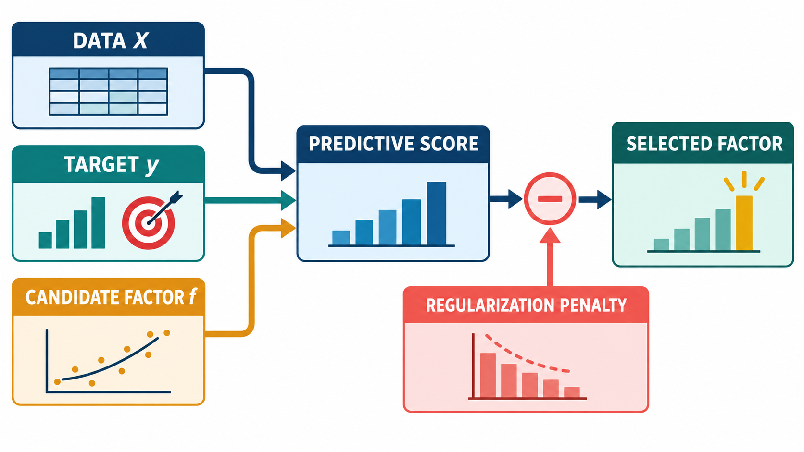
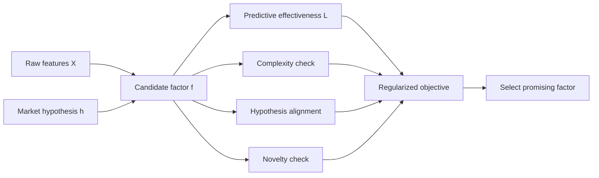

# Bài 02 - Problem Formulation và Regularized Objective

## 1. Tóm tắt

Alpha mining có thể được nhìn như một bài toán tìm kiếm trong không gian rất lớn các biểu thức factor. Với dữ liệu của nhiều cổ phiếu qua nhiều thời điểm, mỗi candidate factor \(f\) nhận dữ liệu hiện tại và tạo ra một tín hiệu nhằm dự báo lợi suất ở thời điểm kế tiếp.

Nếu chỉ chọn factor có historical performance cao nhất, quá trình tìm kiếm có thể ưu tiên những biểu thức quá phức tạp, quá giống các alpha đã phổ biến hoặc không còn giữ được market rationale ban đầu. Vì vậy, AlphaAgent không tối ưu predictive effectiveness một cách đơn độc mà đưa **regularization** trực tiếp vào objective.

Ý tưởng trung tâm là chuyển câu hỏi:

```text
Factor nào đạt metric lịch sử cao nhất?
```

thành:

```text
Factor nào dự báo tốt
nhưng đồng thời
đủ đơn giản,
đúng với market hypothesis
và đủ mới so với các alpha đã tồn tại?
```

Bài toán vì thế trở thành sự cân bằng giữa **performance** và **constraint**, thay vì chỉ là tối đa hóa một con số backtest. 

## 2. Mục tiêu học tập

Sau bài học, người học có thể:

* giải thích được vai trò của \(S\), \(T\), \(X\), \(D\), \(f\), \(y\) và \(\mathcal{F}\) trong bài toán alpha mining;
* diễn giải được ánh xạ \(f(X_t)\rightarrow r_{t+1}\);
* đọc đúng ký hiệu `argmax` trong objective;
* phân biệt được predictive metric với optimization objective;
* giải thích được vai trò của regularization và hệ số \(\lambda\);
* phân tích được vì sao tối ưu historical performance đơn thuần có thể tạo factor kém bền;
* giải thích được vai trò của market hypothesis \(h\) trong việc định hướng quá trình sinh factor;
* diễn giải được regularized objective của AlphaAgent;
* nhận diện được ba nhóm constraint: complexity, hypothesis alignment và novelty;
* hiểu vì sao nghiệm thu được trong không gian biểu thức lớn không nên mặc định được xem là global optimum.

## 3. Biểu diễn dữ liệu trong bài toán alpha mining

### 3.1. Ba chiều tài sản, thời gian và raw feature

Giả sử ta có một universe gồm \(N\) cổ phiếu:

$$
S=\{s_1,s_2,\ldots,s_N\}
$$

Dữ liệu được quan sát trên một cửa sổ gồm \(T\) thời điểm:

$$
T=\{t_1,t_2,\ldots,t_T\}
$$

Tại mỗi cặp tài sản-thời gian, hệ thống có \(D\) raw features. Toàn bộ dữ liệu có thể được biểu diễn bằng:

$$
X\in\mathbb{R}^{N\times T\times D}
$$

Ba chiều này có ý nghĩa:

| Chiều | Ý nghĩa                                            |
| ----- | -------------------------------------------------- |
| \(N\) | Số cổ phiếu trong universe                         |
| \(T\) | Số thời điểm quan sát                              |
| \(D\) | Số raw features của mỗi cổ phiếu tại mỗi thời điểm |

Ví dụ, nếu dữ liệu có:

* 500 cổ phiếu;
* 1.000 ngày giao dịch;
* 5 raw features gồm `open`, `high`, `low`, `close`, `volume`;

thì về mặt cấu trúc:

$$
X\in\mathbb{R}^{500\times1000\times5}
$$

Điểm cần ghi nhớ là \(X\) không phải một bảng phẳng đơn giản. Nó đồng thời chứa chiều **cross-sectional** giữa nhiều cổ phiếu và chiều **temporal** của từng cổ phiếu. 

### 3.2. Từ dữ liệu hiện tại đến future return

Một alpha factor \(f\) lấy dữ liệu hợp lệ tại thời điểm \(t\) và tạo tín hiệu nhằm dự báo return ở thời điểm tiếp theo:

$$
f(X_t)\rightarrow r_{t+1}
$$

Có thể hình dung:

```text
Thông tin có sẵn đến thời điểm t
              ↓
             X_t
              ↓
        Alpha factor f
              ↓
        Factor score
              ↓
    Dự báo cho return t + 1
```

Trong supervised learning, cùng logic này có thể viết ở dạng tổng quát:

$$
\hat y=f(X)
$$

Trong đó:

* \(X\): input;
* \(f\): hàm dự báo;
* \(\hat y\): prediction;
* \(y\): ground truth thực tế dùng để đánh giá prediction.

Với alpha mining, \(y\) có thể là future return, chẳng hạn next-day return. 

Một nguyên tắc đặc biệt quan trọng là **future return không được quay ngược vào feature**. Nếu factor tại thời điểm \(t\) vô tình sử dụng thông tin chỉ xuất hiện ở \(t+1\), performance đo được không còn phản ánh khả năng dự báo thực tế mà có thể chỉ là **data leakage**. 

## 4. Từ “tìm factor tốt” đến một bài toán tối ưu


*Hình minh họa: dữ liệu, target và candidate factor tạo predictive score; regularization penalty được dùng để chọn selected factor phù hợp hơn.*

Ta cần một cách toán học để định nghĩa thế nào là một factor đáng chọn.

Gọi:

$$
\mathcal{F}
$$

là không gian tất cả các biểu thức factor mà hệ thống có thể xem xét.

Mục tiêu cơ bản được viết:

$$
f^*
=
\arg\max_{f\in\mathcal{F}}
\left[
\mathcal{L}(f(X),y)
-
\lambda\mathcal{R}(f)
\right]
$$

Trong đó:

* \(f^*\): factor cuối cùng được chọn;
* \(\mathcal{F}\): không gian candidate factor;
* \(f(X)\): tín hiệu do factor tạo ra;
* \(y\): future-return ground truth;
* \(\mathcal{L}\): độ hiệu quả dự báo;
* \(\mathcal{R}(f)\): regularization penalty;
* \(\lambda\): hệ số kiểm soát mức ảnh hưởng của regularization. 

Biểu thức này chứa hai lực đối lập:

$$
\underbrace{\mathcal{L}(f(X),y)}_{\text{muốn lớn}}
-
\lambda
\underbrace{\mathcal{R}(f)}_{\text{muốn nhỏ}}
$$

Factor cần dự báo tốt, nhưng việc đạt performance bằng một cấu trúc không mong muốn sẽ bị trừ điểm.

Do đó, hệ thống không đơn giản hỏi:

> Candidate nào có \(\mathcal{L}\) lớn nhất?

Mà hỏi:

> Candidate nào tạo được giá trị tốt nhất sau khi cân bằng predictive performance với regularization?

## 5. Cách đọc `argmax`, metric và regularization

### 5.1. `argmax` trả về nghiệm chứ không phải giá trị metric

Ký hiệu:

$$
f^*=\arg\max_{f\in\mathcal F}J(f)
$$

có nghĩa là:

> tìm factor \(f\) trong \(\mathcal{F}\) khiến objective \(J(f)\) đạt giá trị lớn nhất trong quá trình tối ưu đang xét.

Cần phân biệt:

```text
max J(f)
```

với:

```text
argmax J(f)
```

`max` quan tâm tới **giá trị lớn nhất**, còn `argmax` quan tâm tới **candidate tạo ra giá trị đó**.

Ví dụ:

| Factor  | Objective |
| ------- | --------: |
| \(f_A\) |      0.21 |
| \(f_B\) |      0.34 |
| \(f_C\) |      0.27 |

Khi đó:

$$
\max J(f)=0.34
$$

còn:

$$
\arg\max J(f)=f_B
$$

Trong alpha mining, đối tượng cuối cùng cần tìm là biểu thức factor, vì vậy `argmax` là ký hiệu phù hợp. 

### 5.2. Predictive metric khác optimization objective

Một predictive metric trả lời:

> Factor dự báo tốt đến đâu?

Trong khi objective trả lời câu hỏi rộng hơn:

> Sau khi xét cả performance và các constraint, factor nào đáng được lựa chọn?

Ví dụ, giả sử IC được sử dụng như một thành phần của predictive effectiveness.

Candidate A:

```text
IC = 0.08
Complexity penalty = 0.01
```

Candidate B:

```text
IC = 0.09
Complexity penalty = 0.05
```

Nếu objective chỉ dùng IC thì B thắng.

Nhưng nếu:

$$
J(f)=IC(f)-\lambda R(f)
$$

thì kết quả còn phụ thuộc vào penalty và \(\lambda\).

Vì vậy:

```text
Metric
→ đo một khía cạnh của chất lượng

Objective
→ xác định quy tắc lựa chọn cuối cùng
```

Hai khái niệm liên quan chặt chẽ nhưng không đồng nhất. 

## 6. Vai trò của regularization


*Hình minh họa: objective của AlphaAgent cân bằng predictive performance với complexity, originality và alignment để chọn factor.*

Regularization đưa **chi phí cho những nghiệm không mong muốn** vào quá trình tìm kiếm.

Dạng tổng quát:

$$
J(f)=\mathcal L(f(X),y)-\lambda\mathcal R(f)
$$

Nếu candidate có predictive effectiveness tốt nhưng regularization penalty rất lớn, objective cuối cùng vẫn có thể thấp.

Điều này tạo ra một cơ chế cạnh tranh:

```text
Predictive performance cao
          ↑
          │
          │ cần cân bằng
          │
          ↓
Regularization penalty thấp
```

Nếu:

$$
\lambda=0
$$

thì:

$$
J(f)=\mathcal L(f(X),y)
$$

Regularization hoàn toàn biến mất. Hệ thống chỉ chạy theo predictive metric.

Ngược lại, nếu \(\lambda\) quá lớn, penalty có thể chi phối objective:

```text
λ quá nhỏ
→ constraint gần như không có tác dụng

λ hợp lý
→ cân bằng performance và regularization

λ quá lớn
→ factor có thể rất “an toàn”
   nhưng predictive ability bị hy sinh quá mức
```

Do đó, \(\lambda\) không phải một chi tiết trang trí trong công thức. Nó quyết định trade-off giữa **khai thác performance** và **kiểm soát candidate**. 

## 7. Vì sao chỉ tối ưu historical performance là chưa đủ?

Giả sử hai candidate cùng được tạo từ dữ liệu lịch sử.

Candidate A:

```text
Predictive performance: tốt
Expression: ngắn
Parameters: ít
Market rationale: rõ
```

Candidate B:

```text
Predictive performance: tốt hơn một chút
Expression: rất dài
Parameters: nhiều
Market rationale: yếu
```

Nếu objective chỉ là:

$$
\arg\max_f\mathcal L(f(X),y)
$$

thì B có thể được chọn.

Nhưng B có thể đạt kết quả cao bằng cách tận dụng những chi tiết rất riêng của historical data. Khi chuyển sang dữ liệu mới, những chi tiết đó có thể biến mất.

Một hệ thống chỉ chạy theo performance vì vậy dễ hình thành chuỗi:

```text
Search nhiều candidate
        ↓
Tối ưu historical metric
        ↓
Thêm operator / parameter để cải thiện score
        ↓
Expression ngày càng đặc thù
        ↓
Backtest rất đẹp
        ↓
Generalization có thể suy giảm
```

Đây là lý do regularization phải được xem là một phần của **định nghĩa factor tốt**, chứ không phải bước xử lý phụ sau khi factor đã được tạo.

## 8. Market hypothesis như một inductive bias

LLM có thể sinh rất nhiều biểu thức khác nhau nếu chỉ nhận yêu cầu chung như:

```text
Tạo một alpha factor có khả năng dự báo return.
```

Không gian tìm kiếm lúc đó quá rộng. Hệ thống có thể thử những tổ hợp mathematically valid nhưng thiếu lý do tài chính rõ ràng.

AlphaAgent bổ sung **market hypothesis**:

$$
h\in\mathcal H
$$

Trong đó \(\mathcal H\) là không gian các market hypothesis.

Một hypothesis mô tả cơ chế thị trường mà factor muốn định lượng, chẳng hạn:

* candlestick pattern;
* breakout;
* fundamental signal;
* market microstructure effect;
* một quan hệ có căn cứ giữa liquidity và price movement.

Market hypothesis hoạt động giống một **inductive bias**: nó không trực tiếp cho đáp án nhưng định hướng loại factor nào nên được tìm kiếm.

```text
Không có hypothesis

Không gian factor rất lớn
        ↓
LLM tự do sinh expression
        ↓
Nhiều candidate có thể thiếu rationale
```

Trong khi:

```text
Có market hypothesis h
        ↓
Xác định market mechanism cần biểu diễn
        ↓
Thu hẹp hướng khám phá
        ↓
Sinh candidate phù hợp với giả thuyết
        ↓
Kiểm tra predictive effectiveness
```

Nhờ đó, hệ thống cố gắng biến **market insight** thành **quantitative expression**, thay vì chỉ khai phá biểu thức bằng thử-sai thống kê. 

## 9. Regularized objective của AlphaAgent


*Hình minh họa: market hypothesis định hướng expression design, sau đó candidate phải vượt qua kiểm thử ngoài mẫu và feedback.*

### 9.1. Đưa hypothesis trực tiếp vào objective

Khi market hypothesis được đưa vào bài toán, objective trở thành:

$$
f^*
=
\arg\max_{f\in\mathcal F}
\left[
\mathcal L(f(X),y)
-
\lambda\mathcal R_g(f,h)
\right]
$$

Điểm thay đổi quan trọng là:

$$
\mathcal R(f)
\quad\longrightarrow\quad
\mathcal R_g(f,h)
$$

Regularization không còn chỉ nhìn factor \(f\) một cách độc lập. Nó còn xét mối quan hệ giữa factor và hypothesis \(h\).

Do đó, một candidate không thể được đánh giá chỉ bằng câu hỏi:

> Nó dự báo tốt không?

Mà còn cần hỏi:

> Nó có thực sự là một implementation hợp lý của market hypothesis không?


### 9.2. Ba hướng regularization

\(\mathcal R_g(f,h)\) bao quát ba vấn đề chính.

**Complexity**

Factor không nên trở thành một cấu trúc over-engineered gồm quá nhiều operator, feature hoặc free parameter chỉ để tối ưu historical performance.

**Hypothesis alignment**

Biểu thức phải thực sự triển khai logic của market hypothesis.

Ví dụ, nếu hypothesis nói về liquidity nhưng expression không chứa bất kỳ thành phần nào có khả năng biểu diễn liquidity, candidate có vấn đề về semantic alignment.

**Novelty**

Factor mới không nên chỉ là bản sao hoặc biến thể rất nhỏ của những alpha đã tồn tại. Novelty giúp quá trình exploration tìm kiếm những market inefficiency chưa bị khai thác quá mức.

Ba constraint tạo thành ba câu hỏi:

```text
Factor có quá phức tạp không?
            +
Factor có đúng với hypothesis không?
            +
Factor có đủ mới không?
            ↓
Regularization quality
```

Đây là ba khía cạnh được đưa vào regularized formulation để cân bằng theoretical relevance, interpretability và factor uniqueness. 

## 10. Objective biến market insight thành một quy trình lựa chọn

Regularized objective có thể được diễn giải như một pipeline:



Ở nhánh dữ liệu, \(X\) cung cấp những gì factor có thể đo lường.

Ở nhánh knowledge, \(h\) cung cấp cơ chế thị trường mà factor cần thể hiện.

Candidate sau đó phải vượt qua hai lớp đánh giá:

```text
Empirical layer
→ factor dự báo tốt đến đâu?

Regularization layer
→ factor có phải loại nghiệm ta thực sự muốn hay không?
```

Như vậy, market knowledge không bị tách khỏi optimization. Nó được đưa vào chính quy tắc lựa chọn factor.

## 11. Không gian biểu thức và bài toán tối ưu không lồi

Không gian \(\mathcal F\) không giống một khoảng số liên tục đơn giản.

Một factor có thể thay đổi hoàn toàn khi:

* thay một operator;
* thay một raw feature;
* đổi cấu trúc cây;
* đổi window length;
* thêm hoặc bỏ một parameter;
* thay cách ghép hai expression.

Ví dụ:

```text
SMA(close, 5)
```

và:

```text
TS_MIN(close, 5)
```

không chỉ khác nhau về một giá trị số. Chúng là hai cấu trúc biểu thức khác nhau.

Tương tự:

```text
SMA(close, 5)
```

và:

```text
SMA(close, 20)
```

có cùng loại operator nhưng sử dụng parameter khác nhau.

Không gian candidate vì vậy vừa rất lớn vừa mang tính cấu trúc. Không tồn tại một đường dốc đơn giản mà chỉ cần đi theo là chắc chắn tới factor tốt nhất toàn cục. 

AlphaAgent mô tả việc tối ưu xen kẽ giữa predictive objective và regularization để dần tìm một alpha cân bằng các yêu cầu. Cách hiểu thực tế là hệ thống tìm một **locally optimal candidate** trong vùng đã khám phá, chứ ký hiệu `argmax` không nên được đọc như lời đảm bảo rằng hệ thống đã kiểm tra toàn bộ mọi biểu thức có thể tồn tại. 

## 12. Ba ví dụ đọc objective

### 12.1. Factor có performance cao nhưng quá phức tạp

Giả sử:

```text
Factor A
Predictive score = 0.12
Complexity = thấp

Factor B
Predictive score = 0.14
Complexity = rất cao
```

Nếu không regularization:

$$
0.14>0.12
$$

nên B được chọn.

Nếu complexity penalty của B đủ lớn:

$$
\mathcal L_B-\lambda\mathcal R_B
<
\mathcal L_A-\lambda\mathcal R_A
$$

thì A có thể trở thành lựa chọn tốt hơn.

Điều này không có nghĩa performance không quan trọng. Nó có nghĩa **một chút performance tăng thêm có thể không đáng để đổi lấy một lượng complexity rất lớn**.

### 12.2. Factor có IC tốt nhưng gần như sao chép alpha cũ

Giả sử một factor mới:

```text
IC cao
Expression chạy đúng
Backtest tốt
```

nhưng cấu trúc gần như trùng với một alpha đã tồn tại trong alpha library.

Ở đây vấn đề không nhất thiết là predictive effectiveness.

Constraint cần tác động là:

```text
Novelty / originality
```

Nếu không kiểm tra novelty, LLM có thể liên tục sinh lại những ý tưởng quen thuộc nhưng thay đổi một vài parameter hoặc operator nhỏ.

### 12.3. Description nói về liquidity nhưng expression không phản ánh liquidity

Giả sử hypothesis là:

```text
Một thay đổi bất thường về liquidity có thể tạo tín hiệu cho future return.
```

Description của factor cũng tuyên bố:

```text
Factor này đo liquidity pressure.
```

Nhưng expression chỉ sử dụng:

```text
high
low
close
```

và không có thành phần thích hợp để triển khai cơ chế liquidity mà factor tuyên bố.

Vấn đề ở đây là:

```text
Hypothesis
    ↓
Description
    ↓
Expression
```

ba tầng không còn nhất quán.

Đó là lỗi **hypothesis alignment**, không phải lỗi predictive metric.

Một candidate thậm chí có thể đạt backtest tốt nhưng vẫn bị xem là đáng nghi nếu biểu thức thực tế không thực thi economic intuition mà nó tuyên bố.

## 13. Những cách hiểu dễ sai

**Sai lầm 1: “Factor có metric cao nhất chắc chắn là factor tốt nhất.”**

Không đúng khi objective còn chứa regularization. Candidate có performance cao hơn vẫn có thể thua nếu complexity, novelty hoặc alignment kém.

**Sai lầm 2: “Regularization chỉ có nghĩa là làm expression ngắn hơn.”**

Complexity chỉ là một phần. Trong AlphaAgent, regularization còn liên quan đến hypothesis alignment và novelty.

**Sai lầm 3: “Market hypothesis là target.”**

Không phải.

* \(y\) là ground truth dùng để đánh giá prediction.
* \(h\) là knowledge/market hypothesis dùng để định hướng factor construction.

Hai thành phần có chức năng hoàn toàn khác nhau.

**Sai lầm 4: “Future return có thể dùng làm feature vì cuối cùng ta cũng có dữ liệu đó trong dataset.”**

Không được. Factor tại \(t\) chỉ được phép dùng thông tin có sẵn tại thời điểm ra quyết định. Dùng future information tạo leakage.

**Sai lầm 5: “Tăng \(\lambda\) luôn làm factor tốt hơn.”**

Không đúng. Tăng \(\lambda\) làm penalty có trọng số mạnh hơn, nhưng nếu quá lớn, hệ thống có thể hy sinh quá nhiều predictive performance.

**Sai lầm 6: “`argmax` đồng nghĩa đã tìm được global optimum.”**

Không nhất thiết. Với không gian biểu thức rời rạc, lớn và không lồi, quá trình tìm kiếm thực tế có thể chỉ đạt một nghiệm cục bộ tốt trong vùng đã khám phá.

## 14. Cách đọc toàn bộ formulation theo từng bước

Khi gặp:

$$
f^*
=
\arg\max_{f\in\mathcal F}
\left[
\mathcal L(f(X),y)
-
\lambda\mathcal R_g(f,h)
\right]
$$

hãy đọc theo thứ tự sau.

**Bước 1 — Xác định đối tượng cần tìm**

$$
f^*
$$

Ta đang tìm một alpha factor.

**Bước 2 — Xác định nơi tìm kiếm**

$$
f\in\mathcal F
$$

Candidate phải thuộc không gian biểu thức factor hợp lệ.

**Bước 3 — Đánh giá khả năng dự báo**

$$
\mathcal L(f(X),y)
$$

Factor được áp dụng lên dữ liệu \(X\), rồi prediction được so với future-return ground truth \(y\).

**Bước 4 — Đánh giá các đặc điểm không mong muốn**

$$
\mathcal R_g(f,h)
$$

Factor được xét về complexity, alignment với hypothesis và novelty.

**Bước 5 — Điều chỉnh sức mạnh regularization**

$$
\lambda
$$

Hệ số này quyết định mức độ penalty ảnh hưởng đến objective cuối.

**Bước 6 — Chọn candidate cân bằng tốt nhất**

```text
Predictive effectiveness
          -
Regularization cost
          ↓
Objective score
          ↓
Factor được ưu tiên
```

Đây là cách biến một yêu cầu trừu tượng như “hãy tìm một alpha tốt và bền hơn” thành một formulation có thể triển khai trong hệ thống.

## 15. Thực hành củng cố

Cho objective:

$$
J(f)
=
\mathcal L(f(X),y)
-
\lambda\mathcal R_g(f,h)
$$

và ba candidate giả định:

| Candidate | \(\mathcal L\) | \(\mathcal R_g\) |
| --------- | -------------: | ---------------: |
| A         |           0.10 |             0.02 |
| B         |           0.13 |             0.08 |
| C         |           0.09 |             0.01 |

Với:

$$
\lambda=0.5
$$

hãy:

1. Tính \(J(A)\), \(J(B)\) và \(J(C)\).
2. Xác định candidate được chọn bởi `argmax`.
3. Tính lại nếu \(\lambda=0\).
4. Giải thích vì sao kết quả có thể thay đổi khi \(\lambda\) tăng.
5. Nếu B có penalty lớn chủ yếu vì expression quá dài và chứa nhiều parameter, B đang bị tác động bởi constraint nào?
6. Nếu A gần như trùng với một factor trong Alpha101, thành phần regularization nào cần tăng penalty?
7. Nếu C mô tả một liquidity hypothesis nhưng expression không thực hiện logic đó, candidate vi phạm điều kiện nào?

**Kết quả mong đợi:** người học phải giải thích được việc lựa chọn factor không chỉ phụ thuộc vào predictive score mà còn phụ thuộc vào regularization và hệ số cân bằng \(\lambda\).

## 16. Câu hỏi tự kiểm tra

1. Vì sao feature tensor được biểu diễn dưới dạng \(N\times T\times D\)?
2. Trong \(f(X_t)\rightarrow r_{t+1}\), tại sao \(r_{t+1}\) không được xuất hiện trong \(X_t\)?
3. \(\mathcal L\) và objective tổng thể khác nhau ở điểm nào?
4. Điều gì xảy ra khi \(\lambda=0\)?
5. Vì sao tăng \(\lambda\) quá lớn cũng có thể gây bất lợi?
6. Market hypothesis \(h\) đóng vai trò gì trong quá trình sinh factor?
7. Complexity, hypothesis alignment và novelty giải quyết ba loại rủi ro khác nhau như thế nào?
8. Vì sao một factor có IC cao vẫn có thể bị regularized objective loại bỏ?
9. Vì sao không nên hiểu `argmax` là đảm bảo tìm được factor tốt nhất trong mọi biểu thức có thể tồn tại?
10. Nếu một candidate có expression rất mới nhưng hoàn toàn không có market rationale, novelty cao có đủ để giữ candidate đó hay không?

## 17. Tổng kết

Alpha mining được mô hình hóa như một bài toán tìm factor:

$$
f:X_t\rightarrow r_{t+1}
$$

trong một không gian biểu thức lớn \(\mathcal F\).

Objective cơ bản không chỉ tối đa hóa predictive effectiveness mà còn trừ regularization penalty:

$$
f^*
=
\arg\max_{f\in\mathcal F}
\left[
\mathcal L(f(X),y)
-
\lambda\mathcal R(f)
\right]
$$

AlphaAgent tiếp tục đưa market hypothesis \(h\) trực tiếp vào regularization:

$$
f^*
=
\arg\max_{f\in\mathcal F}
\left[
\mathcal L(f(X),y)
-
\lambda\mathcal R_g(f,h)
\right]
$$

\(\mathcal R_g(f,h)\) hướng quá trình tìm kiếm theo ba yêu cầu:

```text
Complexity control
        +
Hypothesis alignment
        +
Novelty
```

Nhờ đó, việc lựa chọn alpha được chuyển từ:

```text
Tối đa hóa historical metric
```

sang:

```text
Predictive effectiveness
        +
Độ đơn giản hợp lý
        +
Market rationale
        +
Factor originality
        ↓
Một candidate cân bằng hơn
```

Điểm quan trọng nhất cần nhớ là **objective quyết định hệ thống xem một factor là “tốt” theo nghĩa nào**. Nếu objective chỉ thưởng historical performance, hệ thống sẽ ưu tiên performance. Khi regularization được đưa trực tiếp vào formulation, simplicity, financial soundness và uniqueness trở thành một phần của chính bài toán tối ưu, thay vì chỉ là những tiêu chí kiểm tra bổ sung sau cùng.
