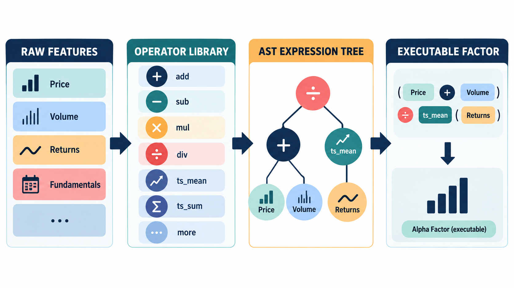
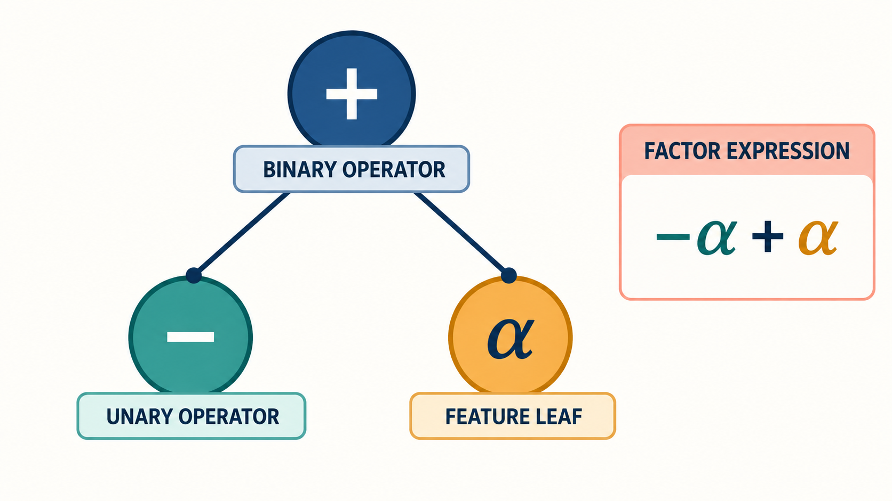
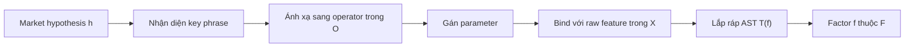
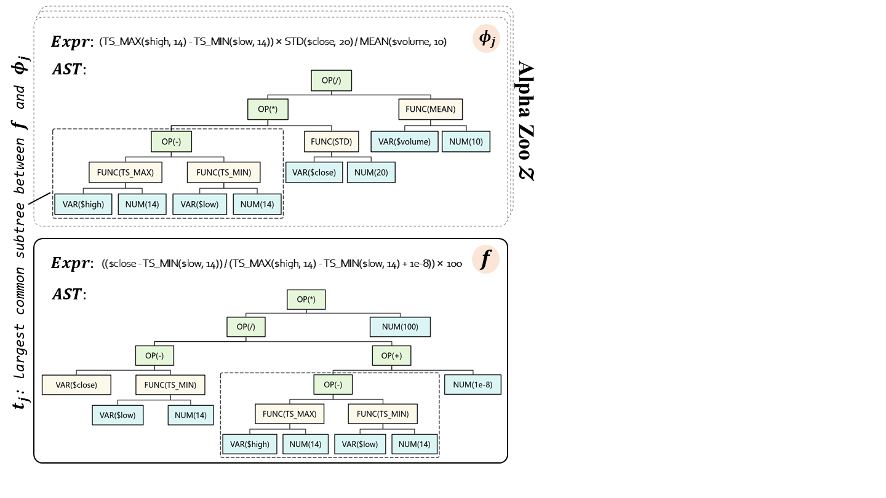
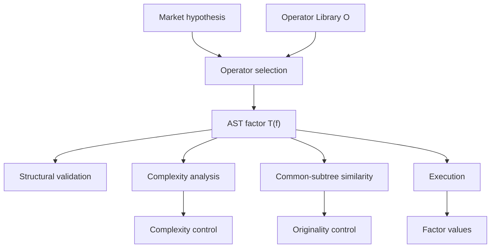

# Bài 03 - Operator Library, AST và Factor Parsing

## 1. Tóm tắt

Khi một LLM được yêu cầu biến market hypothesis thành alpha factor, cách đơn giản nhất có vẻ là để mô hình sinh trực tiếp Python hoặc một đoạn chương trình hoàn chỉnh. Tuy nhiên, cách này tạo ra một vấn đề lớn: factor không chỉ cần **chạy được**, mà còn phải sử dụng đúng dữ liệu, đúng phép toán, đúng tham số và quan trọng hơn là phải giữ được ý nghĩa của hypothesis ban đầu.

AlphaAgent giải quyết vấn đề bằng cách không coi code tự do là representation chính của factor. Thay vào đó, hệ thống sử dụng một **Operator Library** chứa các phép toán toán học và tài chính đã được chuẩn hóa, rồi lắp chúng thành **Abstract Syntax Tree (AST)**. Operator Library đóng vai trò như vocabulary được phép sử dụng, còn AST giữ lại cấu trúc tính toán của factor.

Thiết kế này tạo ra một chuỗi chuyển đổi có kiểm soát:

```text
Market hypothesis
        ↓
Nhận diện khái niệm cần định lượng
        ↓
Chọn operator và parameter
        ↓
Lắp ráp symbolic expression
        ↓
Biểu diễn thành AST
        ↓
Kiểm tra cấu trúc và semantic
        ↓
Thực thi trên dữ liệu
```

AST không chỉ giúp factor có thể thực thi. Chính cấu trúc cây còn cho phép hệ thống đo complexity, đếm parameter và so sánh factor mới với những alpha đã tồn tại thông qua các common subtree.

## 2. Mục tiêu học tập

Sau bài học, người học có thể:

* giải thích được vì sao sinh factor bằng code tự do gây khó khăn cho một hệ thống LLM;
* mô tả được vai trò của Operator Library $\mathcal O$;
* phân biệt được raw feature, operator và parameter trong một factor expression;
* giải thích được khái niệm arity của operator;
* đọc và phân tích được một factor dưới dạng AST;
* nhận diện được leaf node, internal node và edge trong AST;
* diễn giải được phép ánh xạ $\mathcal G:(\mathcal H,X)\rightarrow\mathcal F$;
* mô tả được ba bước chuyển từ market hypothesis sang factor;
* giải thích được vì sao AST là một intermediate representation hữu ích;
* phân biệt được structural validity với semantic validity;
* giải thích được cách AST hỗ trợ complexity control và originality evaluation;
* nhận diện được mối liên hệ giữa common subtree và việc phát hiện factor quá giống alpha cũ.

## 3. Vì sao không nên để LLM sinh factor bằng code tự do?

Một alpha factor về bản chất là một chương trình nhỏ nhận dữ liệu thị trường và trả về một tín hiệu định lượng. Vì vậy, về lý thuyết có thể yêu cầu LLM viết trực tiếp một hàm như:

```python
def factor(df):
    # tính toán factor
    ...
```

Vấn đề là code được sinh bằng LLM phải đồng thời thỏa nhiều điều kiện.

Nó phải:

* dùng đúng format dữ liệu;
* gọi đúng field;
* dùng API tương thích với môi trường thực thi;
* không phụ thuộc vào package hoặc version không tồn tại;
* xử lý đúng time-series operation;
* có numerical behavior hợp lệ;
* giữ được semantic meaning của market hypothesis.

Khi implementation càng dài, số điểm có thể sai càng tăng. Một chương trình có thể đúng cú pháp nhưng dùng sai column. Nó có thể chạy thành công nhưng implementation không còn phản ánh hypothesis. Hoặc cùng một logic có thể được viết theo nhiều cách khác nhau, khiến việc so sánh complexity và originality trở nên khó khăn.

Do đó:

```text
Code chạy được
      ≠
Factor đúng
```

Một factor đáng tin cần đồng thời thỏa:

```text
Syntactic validity
        +
Executability
        +
Numerical validity
        +
Semantic consistency
```

Đây là lý do cần một representation nằm giữa ngôn ngữ tự nhiên của market hypothesis và code thực thi cuối cùng.

## 4. Factor expression như một chương trình nhỏ

Một **expression** nhận input và tạo output.

Ví dụ:

```text
SMA($close, 20)
```

có thể được hiểu là lấy chuỗi giá đóng cửa `$close` và áp dụng moving average với cửa sổ 20 phiên.

Một expression phức tạp hơn có thể ghép nhiều primitive:

```text
SMA($volume, 5) / SMA($volume, 20)
```

Biểu thức này có hai phép moving average và một phép chia.

Một factor lớn hơn nữa có thể tiếp tục lồng các phép toán:

```text
rank(SMA($volume, 5) / SMA($volume, 20))
```

Điểm quan trọng là factor không còn là một chuỗi ký tự tùy ý. Nó có **cấu trúc tính toán**:

```text
$volume
   ↓
SMA 5 ─────┐
           ├── DIV ──> RANK ──> Factor score
SMA 20 ────┘
   ↑
$volume
```

Khi representation giữ được cấu trúc này, hệ thống có thể phân tích factor trước khi thực sự chạy nó.

## 5. Operator Library: vocabulary của factor


*Hình minh họa: raw feature kết hợp với operator library để tạo AST expression tree và factor có thể thực thi.*

AlphaAgent sử dụng một thư viện operator:

\[
\mathcal O
\]

chứa các phép toán toán học hoặc tài chính đã được chuẩn hóa. Những nhóm operator được sử dụng có thể bao gồm:

* rolling minimum;
* rolling maximum;
* moving average;
* conditional check;
* các time-series operation khác.

Ý nghĩa của việc chuẩn hóa operator không chỉ là tạo một danh sách function.

Mỗi operator nên được hiểu như một primitive có **hợp đồng rõ ràng**.

Ví dụ với:

```text
SMA(series, window)
```

hệ thống cần biết:

* operator tên gì;
* nhận bao nhiêu argument;
* argument nào là time series;
* argument nào là parameter;
* output có dạng gì;
* window hợp lệ phải như thế nào;
* điều gì xảy ra khi chưa đủ lịch sử;
* missing value được xử lý ra sao.

Nhờ đó, LLM không phải tự phát minh implementation cấp thấp cho từng factor.

Có thể hình dung:

```text
LLM
 ↓
chọn primitive đã được định nghĩa

thay vì

LLM
 ↓
tự viết toàn bộ implementation
```

Operator Library trở thành lớp trung gian nối **market insight cấp cao** với **factor implementation cấp thấp**.

## 6. Arity và cấu trúc hợp lệ của operator

**Arity** là số đối số mà một operator cần.

Ví dụ:

```text
ADD(a, b)
```

có arity bằng 2.

Trong khi:

```text
RANK(x)
```

có arity bằng 1.

Một rolling operator có thể nhận một series và một parameter:

```text
SMA($close, 20)
```

Nếu grammar yêu cầu hai thành phần nhưng LLM tạo:

```text
SMA()
```

hoặc:

```text
SMA($close, 20, 50)
```

thì expression không còn hợp lệ.

Kiểm soát arity có ý nghĩa vì nó biến việc kiểm tra output từ một bài toán mơ hồ sang một validation có cấu trúc:

```text
Operator tồn tại?
       ↓
Số argument đúng?
       ↓
Kiểu argument đúng?
       ↓
Parameter hợp lệ?
       ↓
Expression có thể được lắp thành cây?
```

Nhưng đây mới chỉ là **structural validation**. Một expression có thể hợp grammar mà vẫn sai về mặt tài chính.

## 7. Abstract Syntax Tree là gì?

**Abstract Syntax Tree (AST)** là cây biểu diễn cấu trúc của một expression.

Xét:

```text
TS_MIN($low, 5) - SMA($close, 20)
```

Thay vì xem đây là một chuỗi ký tự, ta có thể biểu diễn cấu trúc như sau:

```text
SUB
├── TS_MIN
│   ├── $low
│   └── 5
└── SMA
    ├── $close
    └── 20
```

Ở mức khái niệm:

* root `SUB` là phép toán cuối cùng;
* nhánh trái tính rolling minimum của `$low`;
* nhánh phải tính moving average của `$close`;
* output của hai nhánh được đưa vào phép trừ.

AST cho biết **phép toán nào phụ thuộc vào phép toán nào**, thay vì chỉ cho biết expression được viết thành chuỗi ký tự ra sao.

Với factor trong AlphaAgent, raw feature như `$high` hoặc `$low` nằm ở phần lá của cấu trúc, operator như `TS_MIN(.)` và `SMA(.)` tạo các nút tính toán, còn các cạnh biểu diễn data flow giữa các operation.

## 8. Leaf node, internal node và edge


*Hình minh họa: binary operator, unary operator và feature leaf tạo nên cấu trúc của một factor expression.*

Có thể đọc một AST theo ba loại thành phần chính.

| Thành phần    | Vai trò                              | Ví dụ                      |
| ------------- | ------------------------------------ | -------------------------- |
| Leaf node     | Nguồn dữ liệu đầu vào của expression | `$high`, `$low`, `$volume` |
| Internal node | Phép toán áp dụng lên input          | `TS_MIN`, `SMA`, `SUB`     |
| Edge          | Quan hệ dependency và data flow      | `$low → TS_MIN`            |

Parameter như window hoặc threshold được gắn vào operator trong quá trình factor construction, chẳng hạn:

```text
window = 5
threshold = 0.5
```

Điểm quan trọng là cây làm hiện rõ execution dependency.

Ví dụ:

```text
$close
   ↓
SMA(20)
   ↓
RANK
   ↓
NEG
```

không thể thực thi `NEG` trước khi có kết quả từ `RANK`, và `RANK` không thể có dữ liệu trước khi `SMA` được tính.

Vì vậy, AST đồng thời biểu diễn:

```text
cấu trúc expression
+
dependency
+
execution flow
```

## 9. Từ market hypothesis đến factor

Quá trình factor parsing có thể biểu diễn bằng:

\[
\mathcal G:(\mathcal H,X)\rightarrow\mathcal F
\]

Trong đó:

* $\mathcal H$: không gian market hypothesis;
* $X$: raw features có sẵn;
* $\mathcal F$: không gian factor được tạo từ symbolic operators;
* $\mathcal G$: quá trình chuyển hypothesis và dữ liệu thành factor có cấu trúc.

Điểm đáng chú ý là factor không được tạo chỉ từ hypothesis.

Hệ thống còn phải biết $X$, vì một ý tưởng chỉ có thể trở thành factor thực thi nếu nó được bind với các feature thực sự tồn tại.

Ví dụ:

```text
Hypothesis:
Volume đang suy giảm
trong khi biên độ intraday co hẹp
```

Muốn triển khai hypothesis này, hệ thống cần biết dữ liệu có những raw feature nào.

Có thể cần:

```text
$high
$low
$volume
```

Nếu dataset không chứa một feature mà expression yêu cầu, factor không thể được thực thi như đã thiết kế.

## 10. Ba bước factor parsing

Quá trình chuyển hypothesis thành AST diễn ra theo ba bước cốt lõi.

### 10.1. Nhận diện key phrase và ánh xạ sang operator

Giả sử hypothesis chứa các cụm:

```text
triangle pattern
breakout
rolling minimum
volume contraction
```

Hệ thống trước hết cần hiểu mỗi cụm tương ứng với loại operation nào trong $\mathcal O$.

Ví dụ:

```text
"rolling minimum"
        ↓
TS_MIN

"moving average"
        ↓
SMA
```

Đây là bước biến **semantic concept** thành **computational primitive**.

### 10.2. Gán parameter và lắp ráp AST

Sau khi operator được chọn, hệ thống phải xác định parameter, chẳng hạn:

* `window=5`;
* `window=20`;
* threshold;
* các tham số số học khác được hypothesis quy định hoặc được xác định theo thiết kế.

Các operator sau đó được ghép thành AST thể hiện dependency và execution flow.

Toàn bộ quá trình có thể hình dung:



Market hypothesis vẫn là điểm xuất phát, nhưng output cuối không còn là văn bản tự do. Nó là một expression có cấu trúc mà hệ thống có thể kiểm tra và thực thi.

## 11. AST như một intermediate representation

Intermediate representation giải quyết một vấn đề quan trọng: ngôn ngữ tự nhiên và code thực thi nằm ở hai mức abstraction rất khác nhau.

Market hypothesis có thể viết:

```text
Volume giảm dần trong khi intraday range
co hẹp trong một khoảng thời gian ngắn.
```

Trong khi implementation cuối cùng cần những thành phần chính xác như:

```text
$volume
$high
$low
window
rolling operator
comparison operator
```

AST đứng giữa hai thế giới:

```text
Ngôn ngữ tự nhiên
        ↓
Market semantics
        ↓
Operator Library
        ↓
AST
        ↓
Validation
        ↓
Execution
```

Ý tưởng này tương tự cách compiler không nhất thiết thực thi trực tiếp source code ngay khi đọc từng ký tự. Mã được parse thành cấu trúc có thể phân tích trước, sau đó mới thực hiện các bước kiểm tra hoặc chuyển sang representation phù hợp cho execution.

Ở đây, AST cho AlphaAgent một factor representation vừa:

* symbolic;
* machine-readable;
* có thể kiểm tra;
* có thể so sánh;
* có thể dịch sang execution.

## 12. Structural validity không đồng nghĩa semantic validity

Giả sử hypothesis nói:

```text
Thanh khoản suy giảm có thể tạo tín hiệu đảo chiều.
```

LLM tạo expression:

```text
SMA($close, 5) - SMA($close, 20)
```

Expression này có thể hoàn toàn đúng về mặt cấu trúc:

```text
Operator tồn tại        ✓
Arity hợp lệ            ✓
Feature tồn tại         ✓
Window hợp lệ           ✓
AST hợp lệ              ✓
```

Nhưng vẫn phải hỏi:

```text
Expression này có thực sự
đo liquidity hay không?
```

Nếu market mechanism được mô tả là liquidity nhưng expression không chứa thành phần phù hợp để triển khai cơ chế đó, structural correctness không giải quyết được semantic mismatch.

Do đó pipeline cần hai tầng validation:

```text
Structural validation
        ↓
Expression có hợp grammar và chạy được?

Semantic validation
        ↓
Expression có thực hiện đúng hypothesis?
```

Một schema hoặc AST hợp lệ chỉ chứng minh representation đúng hình thức. Nó chưa chứng minh factor đúng về mặt financial rationale.

## 13. AST giúp kiểm soát complexity

Khi factor được biểu diễn thành cây, complexity trở thành đại lượng có thể quan sát.

Ví dụ:

```text
SMA($close, 20)
```

là một cấu trúc khá nhỏ.

Trong khi:

```text
RANK(
    SMA(
        TS_MIN(
            ...
        )
    )
)
```

với nhiều lớp operator lồng nhau tạo một cây dài và sâu hơn.

AlphaAgent sử dụng cấu trúc factor để kiểm soát những candidate quá phức tạp. Các đại lượng liên quan bao gồm:

\[
SL(f)
\]

đại diện cho symbolic length, và:

\[
PC(f)
\]

đếm số free parameter như window length.

Trực giác là:

```text
Nhiều node hơn
       ↓
Expression phức tạp hơn

Nhiều parameter hơn
       ↓
Nhiều bậc tự do hơn

Nhiều lớp operator hơn
       ↓
Factor khó giải thích và kiểm soát hơn
```

Complexity không tự động làm factor sai. Nhưng một expression quá phức tạp tạo thêm không gian để hệ thống khớp vào những đặc điểm riêng của historical data và làm giảm interpretability.

## 14. AST giúp đo originality


*Ảnh gốc của paper: so sánh cấu trúc AST của factor mới với các factor trong alpha zoo để đánh giá originality.*

Một lợi thế đặc biệt quan trọng của AST là cho phép so sánh **cấu trúc** thay vì chỉ so sánh text.

Giả sử có hai factor:

```text
Factor A:
SMA($volume, 5) / SMA($volume, 20)
```

và một expression được format khác:

```text
Factor B:
SMA(
    $volume,
    5
) / SMA($volume,20)
```

String representation của chúng khác nhau về khoảng trắng và cách xuống dòng, nhưng AST thực tế gần như giống nhau.

So sánh text có thể xem chúng là hai chuỗi khác.

So sánh AST nhận ra chúng có cùng computational structure.

Đây là lý do structural comparison phù hợp hơn khi cần phát hiện một candidate đang lặp lại alpha cũ.

## 15. Common subtree và alpha zoo

Gọi tập các alpha đã tồn tại là:

\[
Z=\{\phi_1,\phi_2,\ldots,\phi_N\}
\]

Mỗi factor được chuyển thành AST:

\[
T(f)
\]

Để so sánh hai factor $f_i$ và $f_j$, ta tìm những subtree có cấu trúc giống nhau và quan tâm đến **largest common subtree**.

Có thể hình dung:

```text
Factor mới f

        OP1
       /   \
     OP2   OP3
     /       \
  $high     OP4
            |
         $volume
```

và một factor trong alpha zoo:

```text
Alpha φ

        OP5
       /   \
     OP2   OP6
     /       \
  $high     OP7
```

Hai cây không hoàn toàn giống nhau nhưng cùng chứa:

```text
OP2
 |
$high
```

Nếu common subtree càng lớn, hai factor càng có nhiều cấu trúc tính toán chung.

AlphaAgent sử dụng phép so sánh subtree để định lượng mức độ tương tự giữa candidate và các alpha có sẵn.

## 16. Originality score

Với hai factor $f_i$ và $f_j$, similarity được xây dựng dựa trên subtree lớn nhất có cấu trúc đẳng cấu.

Sau đó candidate $f$ được so với toàn bộ alpha zoo:

\[
S(f)=\max_{\phi\in Z}s(f,\phi)
\]

Ý nghĩa của phép `max` rất quan trọng.

Factor mới có thể khác 99 alpha nhưng gần như sao chép alpha thứ 100. Nếu chỉ lấy average similarity, mức giống rất cao với một factor cụ thể có thể bị trung bình hóa.

Lấy:

\[
\max
\]

trả lời câu hỏi:

> Factor mới giống factor đã tồn tại nào nhất?

Nếu similarity lớn nhất vẫn cao, candidate có nguy cơ thiếu originality.

Biểu diễn AST cho phép thực hiện chính phép kiểm tra này vì structural similarity được giữ lại trong cây.

## 17. Mối quan hệ giữa Operator Library, AST và regularization

Operator Library và AST không phải hai thành phần độc lập.

Chúng tạo thành một hệ thống representation thống nhất:

```text
Operator Library O
→ quy định primitive nào được phép

AST
→ quy định primitive được lắp với nhau thế nào

Complexity measurement
→ đo cấu trúc đã lắp

Similarity analysis
→ so sánh cấu trúc với alpha zoo

Execution
→ tính factor trên dữ liệu
```

Có thể tổng hợp thành:



Như vậy, AST không chỉ là format để lưu một expression. Nó là trung tâm kết nối **factor generation**, **validation**, **regularization** và **execution**.

## 18. Ví dụ: chuyển một hypothesis thành cấu trúc factor

Xét hypothesis:

> Volume giảm trong khi intraday range co hẹp trong 5 ngày.

Trước hết, ta xác định hai phần ý nghĩa.

Phần thứ nhất:

```text
Volume giảm
```

cần raw feature:

```text
$volume
```

và một operation có khả năng mô tả sự thay đổi hoặc mức volume trong cửa sổ thời gian.

Phần thứ hai:

```text
Intraday range co hẹp
```

có thể cần:

```text
$high
$low
```

vì intraday range có quan hệ với khoảng cách giữa high và low.

Tham số thời gian quan trọng là:

```text
5 ngày
```

do đó các rolling operator liên quan phải mang window tương ứng khi hypothesis yêu cầu.

Một representation khái niệm có thể có dạng:

```text
Hypothesis
├── Volume contraction
│   ├── $volume
│   └── rolling/window operation
│
└── Range contraction
    ├── $high
    ├── $low
    └── rolling/window operation
```

Sau đó hai nhánh mới được kết hợp thành factor expression phù hợp với Operator Library.

Điểm quan trọng của bài tập không phải tự phát minh một công thức chính xác duy nhất, mà là nhìn ra quá trình:

```text
Khái niệm tài chính
      ↓
Raw feature
      ↓
Operator
      ↓
Parameter
      ↓
AST
```

## 19. Những lỗi dễ gặp khi xây dựng factor representation

**Lỗi 1 — Operator không tồn tại trong thư viện**

LLM tạo một function có tên hợp lý nhưng hệ thống không định nghĩa function đó.

Kết quả:

```text
Không thể parse hoặc execute expression
```

**Lỗi 2 — Sai arity**

Ví dụ một operator cần hai argument nhưng chỉ nhận một.

Kết quả:

```text
AST có cấu trúc không hợp lệ
```

**Lỗi 3 — Feature không tồn tại**

Expression tham chiếu:

```text
$bid_ask_spread
```

trong khi $X$ chỉ có OHLCV.

Kết quả:

```text
Expression không bind được với dữ liệu
```

**Lỗi 4 — Parameter không hợp lệ**

Ví dụ window bằng 0 hoặc một threshold không phù hợp với hợp đồng operator.

Kết quả có thể là structural hoặc numerical failure.

**Lỗi 5 — Expression hợp lệ nhưng sai hypothesis**

Đây là lỗi semantic nguy hiểm hơn vì candidate vẫn có thể chạy và thậm chí cho backtest tốt.

**Lỗi 6 — AST quá phức tạp**

Quá nhiều operator và parameter làm tăng complexity và có thể khiến candidate bị regularization penalize.

**Lỗi 7 — Candidate quá giống alpha cũ**

Expression nhìn có vẻ khác nhưng AST chứa common subtree lớn với một factor trong alpha zoo.

Khi đó originality evaluation cần phát hiện sự trùng lặp ở cấp cấu trúc.

## 20. Thực hành củng cố

Xét expression:

```text
TS_MIN($low, 5) - SMA($close, 20)
```

### Nhiệm vụ A — Phân tích AST

Hãy xác định:

1. root operator;
2. các internal node;
3. các raw feature;
4. các parameter;
5. data flow từ leaf đến root.

### Nhiệm vụ B — Vẽ cây

Tự vẽ expression dưới dạng:

```text
ROOT
├── ...
└── ...
```

sau đó kiểm tra xem một evaluator có thể tính expression từ dưới lên hay không.

### Nhiệm vụ C — Phân tích hypothesis

Với hypothesis:

> Volume giảm trong khi intraday range co hẹp trong 5 ngày.

Hãy xác định:

1. những raw feature cần xem xét;
2. những nhóm operator có thể cần;
3. parameter thời gian quan trọng;
4. cách tách hypothesis thành các nhánh tính toán;
5. những điều cần validation trước khi backtest.

### Nhiệm vụ D — Originality

Giả sử factor mới có một subtree rất lớn giống với một factor trong alpha zoo.

Hãy giải thích:

1. vì sao string comparison có thể không phát hiện tốt trường hợp này;
2. vì sao AST comparison phù hợp hơn;
3. $S(f)$ sẽ phản ánh hiện tượng đó như thế nào.

## 21. Câu hỏi tự kiểm tra

1. Vì sao một đoạn Python chạy thành công vẫn chưa đủ để trở thành alpha factor đáng tin?
2. Operator Library giải quyết vấn đề nào của LLM-generated factor?
3. Arity của operator có ý nghĩa gì?
4. AST khác với chuỗi expression thông thường ở điểm nào?
5. Leaf node và internal node đảm nhiệm hai vai trò khác nhau như thế nào?
6. Trong $\mathcal G:(\mathcal H,X)\rightarrow\mathcal F$, tại sao cả hypothesis và raw features đều cần thiết?
7. Ba bước chính để chuyển hypothesis thành AST là gì?
8. Vì sao structural validity không đảm bảo semantic validity?
9. Tại sao AST thuận lợi cho việc đo symbolic length và parameter count?
10. Largest common subtree cung cấp thông tin gì về hai factor?
11. Vì sao originality score sử dụng mức similarity lớn nhất với alpha zoo?
12. Một AST quá sâu và chứa nhiều parameter tạo ra rủi ro gì trong quá trình factor mining?

## 22. Tổng kết

AlphaAgent không để quá trình factor generation dừng ở việc LLM sinh ra một đoạn code có vẻ hợp lý. Hệ thống đưa vào một lớp biểu diễn có cấu trúc:

```text
Market hypothesis
        ↓
Operator Library
        ↓
Symbolic assembly
        ↓
AST
        ↓
Validation
        ↓
Regularization
        ↓
Execution
```

Operator Library $\mathcal O$ chuẩn hóa các primitive mà factor được phép sử dụng. Nhờ đó, hệ thống có thể kiểm soát operator, argument và parameter thay vì phụ thuộc hoàn toàn vào code tự do.

AST $T(f)$ giữ lại cấu trúc tính toán của factor:

```text
Leaf
→ raw feature

Internal node
→ operator

Edge
→ dependency / data flow
```

Quá trình:

\[
\mathcal G:(\mathcal H,X)\rightarrow\mathcal F
\]

biến market hypothesis thành factor bằng cách nhận diện key phrase, ánh xạ chúng sang operator, gán parameter và lắp các thành phần thành cây biểu thức.

Giá trị của AST không dừng ở execution. Từ cùng một representation, hệ thống có thể:

```text
đo symbolic length
+
đếm free parameter
+
phân tích cấu trúc
+
tìm common subtree
+
so sánh với alpha zoo
+
kiểm soát complexity và originality
```

Nhờ đó, factor generation được chuyển từ bài toán:

```text
LLM viết một đoạn code bất kỳ
```

thành:

```text
LLM xây dựng một biểu thức
trong vocabulary được kiểm soát
và cấu trúc có thể kiểm chứng
```

Đây là cầu nối quan trọng giữa **market insight bằng ngôn ngữ tự nhiên** và **alpha factor có thể kiểm tra, so sánh và thực thi trên dữ liệu định lượng**.
