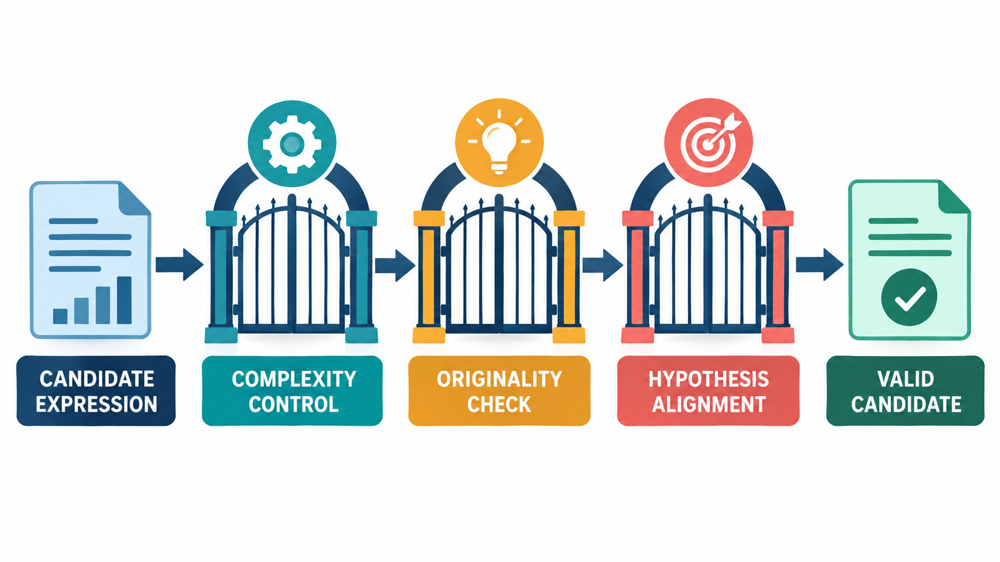
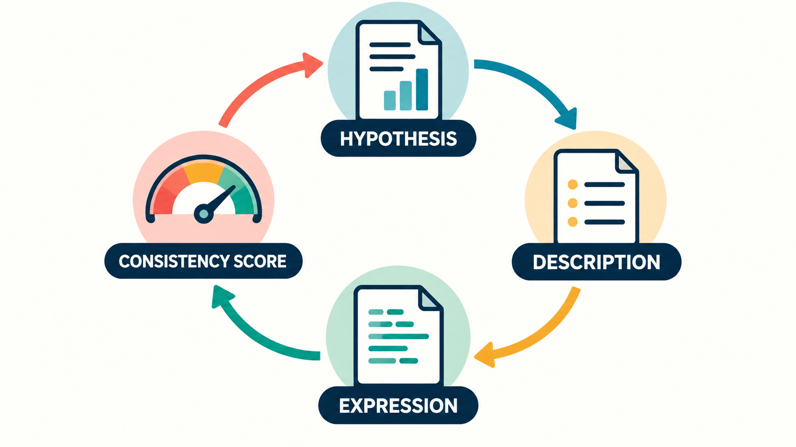
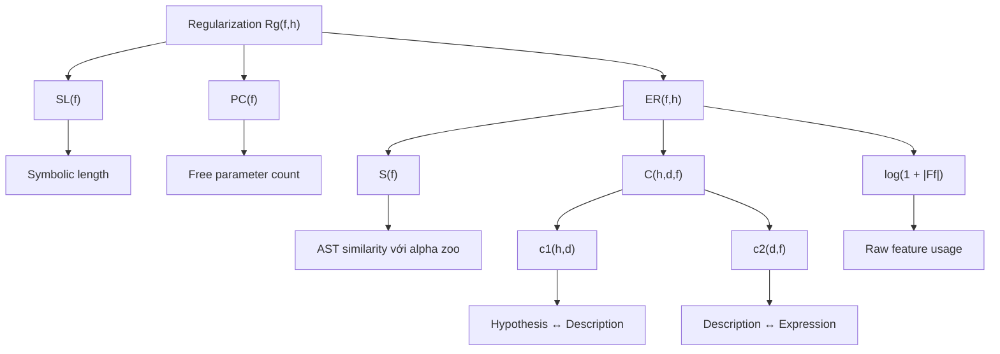

# Bài 04 - Ba cơ chế Regularization của AlphaAgent

## 1. Tóm tắt

Một alpha factor không nên được đánh giá chỉ bằng việc nó đạt `IC`, `RankIC` hay lợi suất backtest cao đến đâu. Một candidate vẫn có thể không đáng tin nếu biểu thức quá phức tạp, gần như sao chép một alpha đã phổ biến hoặc không thực sự triển khai market hypothesis mà nó tuyên bố đại diện.

AlphaAgent đưa ba nhóm ràng buộc trực tiếp vào quá trình factor generation:

```text
Complexity control
        +
Originality enforcement
        +
Hypothesis-factor alignment
```

Ba cơ chế này giải quyết ba rủi ro khác nhau:

```text
Expression quá phức tạp
→ dễ over-engineer và overfit

Expression quá giống alpha cũ
→ novelty thấp, tăng nguy cơ crowding

Expression không đúng hypothesis
→ mất financial rationale
```

Regularization tổng quát được biểu diễn dưới dạng:

$$
\mathcal{R}_g(f,h)
=
\alpha_1 SL(f)
+
\alpha_2 PC(f)
+
\alpha_3 ER(f,h)
$$

Trong đó `symbolic length`, số free parameter, structural similarity, semantic alignment và số raw feature được kết hợp để hướng quá trình tìm kiếm tới những factor vừa có predictive effectiveness, vừa parsimonious, original và có financial rationale rõ ràng. 

## 2. Mục tiêu học tập

Sau bài học, người học có thể:

* giải thích được vai trò của regularization trong alpha mining;
* phân biệt được predictive performance với chất lượng tổng thể của một factor;
* diễn giải được \(SL(f)\), \(PC(f)\) và \(ER(f,h)\);
* giải thích được vì sao complexity control không đồng nghĩa với việc luôn chọn expression ngắn nhất;
* mô tả được cách AST hỗ trợ đo structural similarity;
* giải thích được khái niệm `largest common subtree`;
* đọc được originality score \(S(f)\);
* giải thích được vì sao candidate cần được so với một `alpha zoo`;
* phân biệt được hai tầng semantic alignment: hypothesis–description và description–expression;
* diễn giải được consistency score \(C(h,d,f)\);
* phân tích được vai trò của số raw feature trong regularization;
* đánh giá được một candidate factor theo đồng thời complexity, originality, alignment và predictive effectiveness.

## 3. Vì sao predictive performance chưa đủ?

Giả sử ba factor cùng được backtest:

| Factor | Predictive performance | Đặc điểm                            |
| ------ | ---------------------: | ----------------------------------- |
| A      |                    Cao | Expression ngắn, rationale rõ       |
| B      |                Rất cao | Expression rất dài, nhiều parameter |
| C      |                    Cao | Gần như sao chép factor đã phổ biến |

Nếu chỉ sắp xếp theo historical metric, B có thể đứng đầu và C cũng có vẻ hấp dẫn.

Nhưng hai candidate này mang những rủi ro khác nhau.

Factor B có nhiều bậc tự do hơn để thích nghi với historical data. Nó có thể đã khai thác cả signal lẫn noise.

Factor C lại có thể không phát hiện market inefficiency mới. Nếu rất nhiều người đã giao dịch dựa trên cấu trúc tương tự, việc tạo thêm một biến thể gần giống không giải quyết được nguy cơ factor crowding.

Một candidate khác có thể còn gặp vấn đề thứ ba:

```text
Market hypothesis
        ↓
Description nghe hợp lý
        ↓
Expression thực tế không đo cơ chế đó
```

Factor vẫn có thể chạy và thậm chí có backtest tốt, nhưng financial rationale mà ta dùng để giải thích nó không còn tương ứng với implementation.

Do đó, AlphaAgent không định nghĩa factor tốt bằng một chiều duy nhất. Ba cơ chế regularization được dùng để kiểm soát cả **cấu trúc**, **tính mới** và **ý nghĩa**. 

## 4. Regularization như một bài toán đánh đổi


*Hình minh họa: candidate expression lần lượt được kiểm tra complexity, originality và hypothesis alignment trước khi trở thành valid candidate.*

Một dạng objective quen thuộc là:

$$
J(f)
=
\text{performance}(f)
-
\lambda\,\text{penalty}(f)
$$

Phần đầu thưởng candidate dự báo tốt. Phần sau làm giảm ưu tiên đối với candidate mang những đặc điểm không mong muốn.

Trực giác là:

```text
Predictive effectiveness cao
           ↑
           │
           │ cần cân bằng
           │
           ↓
Regularization cost thấp
```

Nếu regularization quá yếu, hệ thống có thể tiếp tục tăng complexity chỉ để cải thiện historical score.

Nếu regularization quá mạnh, hệ thống lại có thể loại bỏ cả những biểu thức phức tạp ở mức cần thiết để diễn tả một pattern thật.

Mục tiêu không phải:

```text
Tìm factor đơn giản nhất
```

mà là:

```text
Tìm factor đủ phức tạp để mô tả signal
nhưng không phức tạp hơn mức cần thiết.
```

Đó là tinh thần của **parsimony** trong factor construction.

## 5. Cơ chế thứ nhất: Complexity Control

### 5.1. Symbolic length và parameter count

AlphaAgent mô hình hóa phần regularization bằng:

$$
\mathcal{R}_g(f,h)
=
\alpha_1 SL(f)
+
\alpha_2 PC(f)
+
\alpha_3 ER(f,h)
$$

Trong đó:

* \(SL(f)\): `symbolic length`, phản ánh độ dài cấu trúc biểu thức;
* \(PC(f)\): số free parameter của factor, chẳng hạn các window length;
* \(ER(f,h)\): thành phần liên quan đến originality, alignment và feature usage. 

Xét hai expression:

```text
SMA($close, 20)
```

và:

```text
RANK(
    TS_MIN(
        SMA(
            DIV(
                $close,
                SMA($volume, 17)
            ),
            23
        ),
        11
    )
)
```

Expression thứ hai có:

* nhiều operator hơn;
* nhiều cấp lồng nhau hơn;
* nhiều parameter tự do hơn;
* nhiều cơ hội để tinh chỉnh.

Nếu mỗi window được thử qua hàng chục giá trị khác nhau, không gian tìm kiếm tăng rất nhanh.

Một candidate có thể đạt backtest tốt nhờ chính việc có quá nhiều khả năng điều chỉnh.

### 5.2. Complexity và overfitting

Có thể hình dung mối quan hệ:

```text
Quá đơn giản
    ↓
Không đủ khả năng biểu diễn signal
    ↓
Underfitting

Vừa đủ phức tạp
    ↓
Biểu diễn được hypothesis
    ↓
Khả năng generalize tốt hơn

Quá phức tạp
    ↓
Nhiều bậc tự do
    ↓
Dễ fit noise
    ↓
Overfitting
```

Điều này gần với bias–variance trade-off trong machine learning.

Factor quá đơn giản có thể có bias cao.

Factor quá linh hoạt có thể có variance cao.

Vì vậy complexity control không nên được hiểu là:

> Càng ngắn càng tốt.

Mà nên hiểu là:

> Không cho phép complexity tăng lên nếu sự phức tạp bổ sung không mang lại giá trị đủ thuyết phục.


## 6. Complexity không chỉ là số ký tự

Hai expression có thể có độ dài text gần giống nhau nhưng cấu trúc rất khác.

Ví dụ:

```text
SMA($close, 20)
```

và:

```text
TS_MIN($close, 20)
```

có kích thước text gần tương đương.

Trong khi:

```text
SMA(SMA(SMA($close, 5), 10), 20)
```

lại tạo một dependency tree sâu hơn nhiều.

Vì factor được biểu diễn dưới dạng AST, complexity có thể được nhìn ở cấp cấu trúc:

```text
Số node
+
Độ sâu
+
Số operator
+
Số free parameter
+
Số raw feature
```

Đây là một ưu điểm quan trọng của symbolic representation: factor trở thành đối tượng có thể đo lường cấu trúc thay vì chỉ là một string hoặc đoạn code.

## 7. Cơ chế thứ hai: Originality Enforcement

Một LLM có kiến thức tài chính rất dễ quay lại những pattern quen thuộc như momentum, moving average hoặc các factor đã xuất hiện rộng rãi.

Candidate mới có thể trông khác về cú pháp nhưng vẫn triển khai gần như cùng một computational pattern.

Ví dụ:

```text
Factor A:
RANK(SMA($volume, 20))
```

và:

```text
Factor B:
NEG(RANK(SMA($volume, 20)))
```

Factor B có thêm một operator, nhưng phần lớn cấu trúc vẫn được chia sẻ.

Nếu chỉ so sánh string:

```text
RANK(SMA(...))
```

và:

```text
NEG(RANK(SMA(...)))
```

ta nhìn thấy hai chuỗi khác nhau.

Nếu so sánh AST, hệ thống nhận ra một subtree lớn giống hệt nhau.

## 8. Largest Common Subtree

Gọi hai factor là:

$$
f_i,\quad f_j
$$

và AST tương ứng:

$$
T(f_i),\quad T(f_j)
$$

AlphaAgent tìm các subtree có cấu trúc isomorphic giữa hai cây và quan tâm tới subtree chung lớn nhất. 

Trực giác có thể minh họa như sau.

Factor thứ nhất:

```text
        NEG
         |
        RANK
         |
        SMA
       /   \
 $volume    20
```

Factor thứ hai:

```text
        DIV
       /   \
    RANK    X
      |
     SMA
    /   \
$volume    20
```

Hai cây không giống hoàn toàn.

Nhưng cùng chứa:

```text
    RANK
      |
     SMA
    /   \
$volume    20
```

Đó là một common subtree tương đối lớn.

Nếu phần chung chiếm phần lớn logic factor, candidate mới có thể chỉ đang đóng gói lại một ý tưởng cũ.

## 9. Structural similarity khác string similarity

String similarity tập trung vào ký tự.

Structural similarity tập trung vào computation.

Ví dụ:

```text
SMA($close,20)
```

và:

```text
SMA(
    $close,
    20
)
```

có format khác nhau nhưng AST tương đương.

Ngược lại, hai expression có thể chứa nhiều từ giống nhau nhưng bố trí dependency khác nhau và tạo ra computation khác.

AST vì vậy phù hợp hơn cho originality detection vì nó giữ:

```text
Operator
+
Dependency
+
Subtree
+
Computational structure
```

thay vì khoảng trắng, dấu ngoặc hoặc cách format.

## 10. Alpha Zoo và originality score

Gọi tập các factor tham chiếu là:

$$
\mathcal Z
=
\{\phi_1,\phi_2,\ldots,\phi_N\}
$$

AlphaAgent so factor mới \(f\) với từng \(\phi\in\mathcal Z\).

Originality-related similarity được viết:

$$
S(f)
=
\max_{\phi\in\mathcal Z}s(f,\phi)
$$


Phép `max` trả lời một câu hỏi rất cụ thể:

> Trong toàn bộ alpha zoo, factor mới giống factor nào nhất?

Giả sử similarity của candidate với năm factor là:

| Alpha      | Similarity |
| ---------- | ---------: |
| \(\phi_1\) |       0.10 |
| \(\phi_2\) |       0.16 |
| \(\phi_3\) |       0.82 |
| \(\phi_4\) |       0.05 |
| \(\phi_5\) |       0.12 |

Candidate phần lớn khác alpha zoo, nhưng rất giống \(\phi_3\).

Nếu lấy average:

$$
\frac{0.10+0.16+0.82+0.05+0.12}{5}
=
0.25
$$

mức trung bình có thể khiến factor trông khá khác biệt.

Nhưng:

$$
S(f)=0.82
$$

cho thấy candidate thực tế có một đối thủ gần như rất giống.

Đây là lý do dùng maximum similarity có ý nghĩa đối với duplicate detection.

## 11. Novelty và factor crowding

Similarity cao không tự động chứng minh factor vô dụng.

Một factor nổi tiếng vẫn có thể tiếp tục tạo predictive signal trong một số giai đoạn.

Nhưng originality thấp là một cảnh báo:

```text
Factor giống pattern phổ biến
        ↓
Nhiều participant có thể biết pattern
        ↓
Nhiều strategy có position tương tự
        ↓
Market inefficiency bị khai thác
        ↓
Nguy cơ factor crowding tăng
```

Originality enforcement vì vậy không đơn giản là khuyến khích sự mới lạ.

Mục tiêu sâu hơn là tránh việc LLM liên tục quay lại những market inefficiency đã bị khai thác rộng rãi.

## 12. Minh họa structural originality


Hình minh họa biểu diễn candidate factor \(f\) và các factor trong alpha zoo bằng cả expression lẫn AST. Các cây được so sánh để xác định common subtree lớn nhất; kích thước của phần cấu trúc chung được sử dụng để đánh giá mức độ tương tự. 

Điểm quan trọng cần quan sát là originality không được đo bằng việc hai factor có cùng tên hay cùng chuỗi expression hay không. Thứ được so sánh là **cấu trúc tính toán thực tế**.

## 13. Cơ chế thứ ba: Hypothesis-Factor Alignment

Một market hypothesis được viết bằng ngôn ngữ tự nhiên.

Factor cuối cùng lại là một mathematical expression.

Giữa hai đầu này tồn tại một khoảng cách semantic khá lớn:

```text
Market insight
      ↓
Hypothesis
      ↓
Description
      ↓
Expression
      ↓
Data
```

Nếu chỉ kiểm tra hypothesis trực tiếp với expression, hệ thống phải nối một khoảng abstraction rất lớn.

AlphaAgent chia bài toán thành hai cầu nối:

```text
Hypothesis
    ↕
Description

Description
    ↕
Expression
```

Hai quan hệ này được đánh giá riêng biệt. 

## 14. Hypothesis ↔ Description

Gọi:

* \(h\): market hypothesis;
* \(d\): factor description.

Thành phần:

$$
c_1(h,d)
$$

đánh giá description có thực sự là một implementation hợp lý của hypothesis hay không.

Ví dụ hypothesis:

```text
Khi liquidity suy giảm nhanh,
price reversal có thể xuất hiện
do temporary market imbalance.
```

Description phù hợp có thể tập trung vào:

```text
Đo sự suy giảm liquidity
trong một rolling window
và kết hợp nó với price movement
để tạo reversal signal.
```

Một description không phù hợp lại có thể nói:

```text
Đo medium-term momentum của giá.
```

Dù cả hai đều là khái niệm tài chính hợp lệ, description thứ hai đã chuyển sang một mechanism khác.

Do đó \(c_1\) kiểm tra:

```text
Description có còn trung thành
với market idea hay không?
```

## 15. Description ↔ Expression

Bước tiếp theo là:

$$
c_2(d,f)
$$

Factor description có thể viết rất thuyết phục nhưng expression thực tế lại không triển khai nội dung đó.

Ví dụ description tuyên bố factor phản ánh liquidity dynamics.

Một expression hợp lý về mặt feature có thể cần những thông tin liên quan như:

```text
$volume
bid-ask spread
market depth
```

Nếu expression hoàn toàn không chứa thành phần liên quan đến liquidity, \(c_2\) sẽ thấp theo cơ chế đánh giá được mô tả. 

Ta có thể xem đây là một dạng semantic unit test:

```text
Description nói factor làm X
              ↓
Expression có thật sự tính X?
```

## 16. Vì sao cần hai tầng alignment?

Giả sử:

```text
Hypothesis:
Liquidity contraction predicts reversal.
```

Description:

```text
Factor đo momentum mạnh trong 20 ngày.
```

Expression:

```text
$close / DELAY($close, 20) - 1
```

Ở đây description và expression có thể rất nhất quán:

```text
Description ↔ Expression
✓
```

Nhưng toàn bộ factor vẫn không triển khai hypothesis:

```text
Hypothesis ↔ Description
✗
```

Trường hợp ngược lại cũng có thể xảy ra.

Description:

```text
Factor đo liquidity contraction.
```

rất phù hợp hypothesis.

Nhưng expression:

```text
SMA($close, 5) - SMA($close, 20)
```

không triển khai mechanism đã mô tả.

Khi đó:

```text
Hypothesis ↔ Description
✓

Description ↔ Expression
✗
```

Nếu chỉ kiểm tra một trong hai tầng, hệ thống có thể bỏ sót một loại semantic failure.

## 17. Consistency Score


*Hình minh họa: hypothesis được chuyển thành description và expression, sau đó consistency score tạo feedback để chỉnh vòng tiếp theo.*

AlphaAgent kết hợp hai thành phần alignment:

$$
C(h,d,f)
=
\alpha c_1(h,d)
+
(1-\alpha)c_2(d,f)
$$

với:

$$
\alpha=0.5
$$


Khi \(\alpha=0.5\):

$$
C(h,d,f)
=
0.5c_1(h,d)
+
0.5c_2(d,f)
$$

Hai cầu nối được đặt trọng số bằng nhau.

Ví dụ:

$$
c_1=0.9,\qquad c_2=0.3
$$

thì:

$$
C
=
0.5(0.9)+0.5(0.3)
=
0.6
$$

Description hiểu khá đúng hypothesis, nhưng implementation yếu khiến consistency tổng thể giảm.

Nếu:

$$
c_1=0.9,\qquad c_2=0.9
$$

thì:

$$
C=0.9
$$

cả semantic intent và mathematical implementation đều nhất quán hơn.

## 18. ER Term: kết hợp similarity, alignment và feature usage

Một thành phần tiếp theo được biểu diễn:

$$
ER(f,h)
=
\beta_1S(f)
+
\beta_2C(h,d,f)
+
\beta_3\log(1+|F_f|)
$$

Trong đó:

* \(S(f)\): mức similarity của candidate với alpha zoo;
* \(C(h,d,f)\): consistency giữa hypothesis, description và expression;
* \(F_f\): tập raw feature mà factor sử dụng;
* \(|F_f|\): số raw feature;
* \(\beta_1,\beta_2,\beta_3\): các weighting coefficient. 

Term:

$$
\log(1+|F_f|)
$$

đưa chi phí vào việc sử dụng quá nhiều raw feature.

Trực giác là:

```text
Factor dùng 2 feature
→ dễ truy nguyên rationale hơn

Factor dùng 20 feature
→ nhiều degree of freedom hơn
→ khó xác định phần nào thực sự tạo signal
→ complexity cao hơn
```

Dùng logarithm giúp penalty tăng theo số feature nhưng không tăng tuyến tính vô hạn theo cùng tốc độ.

## 19. Lưu ý khi đọc quy ước của ER

Phần formulation trình bày \(ER(f,h)\) như:

$$
ER(f,h)
=
\beta_1S(f)
+
\beta_2C(h,d,f)
+
\beta_3\log(1+|F_f|)
$$

đồng thời diễn giải rằng **ER thấp hơn tương ứng chất lượng factor tốt hơn**, với các thành phần nhằm kiểm soát similarity, alignment và excessive feature usage. 

Khi học formulation này, nên giữ đúng quy ước ký hiệu và cách diễn giải đã được định nghĩa cho hệ thống, thay vì tự đổi dấu hoặc tái định nghĩa các coefficient khi chưa có thêm đặc tả.

Điều quan trọng về mặt kiến trúc là hiểu chức năng của ba phần:

```text
S(f)
→ kiểm soát similarity

C(h,d,f)
→ kiểm soát semantic consistency

log(1 + |F_f|)
→ kiểm soát feature proliferation
```

## 20. Toàn bộ regularization hierarchy

Các thành phần có thể được đặt vào một cấu trúc tổng thể:



Sơ đồ cho thấy regularization không phải một phép đo duy nhất.

Nó là một hierarchy gồm nhiều kiểm tra:

```text
Complexity cấu trúc
+
Complexity tham số
+
Structural originality
+
Semantic alignment
+
Feature parsimony
```

Mỗi cơ chế bảo vệ hệ thống khỏi một failure mode khác nhau.

## 21. Ba cơ chế phối hợp như thế nào?

Một factor lý tưởng theo logic này cần đồng thời đạt nhiều yêu cầu:

```text
Predictive effectiveness
        +
Không quá phức tạp
        +
Không dùng quá nhiều parameter
        +
Không dùng quá nhiều raw feature
        +
Không quá giống alpha đã tồn tại
        +
Description đúng market hypothesis
        +
Expression đúng description
```

Không một constraint nào thay thế được tất cả các constraint khác.

Một factor có thể đơn giản nhưng sao chép hoàn toàn RSI.

Một factor có thể cực kỳ original nhưng vô nghĩa về mặt tài chính.

Một factor có rationale hoàn hảo nhưng expression quá over-engineered.

Một factor có mọi đặc điểm trên nhưng predictive effectiveness bằng không cũng không trở thành alpha hữu ích.

Do đó, quá trình lựa chọn mang tính **đa mục tiêu**.

## 22. Phân tích ba candidate điển hình

### 22.1. Candidate A: IC tốt nhưng AST gần như giống factor cũ

```text
Predictive effectiveness: tốt
AST similarity: rất cao
Complexity: bình thường
Alignment: tốt
```

Vấn đề chính:

```text
Originality
```

Candidate này có thể đang tái tạo một crowded signal.

Cơ chế cần tác động mạnh nhất là structural similarity với alpha zoo.

### 22.2. Candidate B: rất mới nhưng không đúng hypothesis

```text
Predictive effectiveness: chưa rõ
AST similarity: thấp
Complexity: bình thường
Alignment: thấp
```

Candidate B có originality cao nhưng điều đó chưa đủ.

Vấn đề chính:

```text
Hypothesis-factor alignment
```

Một factor mới nhưng không có economic rationale phù hợp vẫn có nguy cơ là spurious pattern.

### 22.3. Candidate C: đúng hypothesis nhưng quá phức tạp

```text
Alignment: tốt
Originality: tốt
Raw features: 20
Window parameters: nhiều
AST: sâu
```

Vấn đề chính:

```text
Complexity control
```

Các thành phần liên quan có thể bao gồm:

$$
SL(f)
$$

$$
PC(f)
$$

và feature-count term:

$$
\log(1+|F_f|)
$$

Candidate cần được đơn giản hóa mà vẫn giữ logic cốt lõi của hypothesis.

## 23. Một ví dụ đánh giá hoàn chỉnh

Giả sử factor \(f_A\) có:

```text
IC tốt
AST ngắn
2 free parameters
3 raw features
Similarity thấp
Description đúng hypothesis
Expression đúng description
```

Factor \(f_B\) có:

```text
IC nhỉnh hơn fA một chút
AST rất sâu
11 free parameters
15 raw features
Similarity cao với một alpha cũ
Description đúng hypothesis
Expression chỉ triển khai một phần description
```

Nếu chỉ nhìn IC:

```text
fB > fA
```

Nhưng xét toàn bộ:

| Tiêu chí                 | \(f_A\) | \(f_B\)          |
| ------------------------ | ------- | ---------------- |
| Predictive effectiveness | Tốt     | Tốt hơn một chút |
| Symbolic complexity      | Thấp    | Cao              |
| Free parameters          | Ít      | Nhiều            |
| Feature usage            | Ít      | Nhiều            |
| Originality              | Cao     | Thấp             |
| Hypothesis alignment     | Tốt     | Một phần         |
| Interpretability         | Tốt     | Thấp hơn         |

\(f_A\) có thể là candidate hấp dẫn hơn vì performance thấp hơn một chút nhưng cấu trúc và rationale mạnh hơn nhiều.

Đây chính là điều regularization cố gắng đưa vào decision process.

## 24. Những cách hiểu dễ sai

**Sai lầm 1: Factor càng ngắn càng tốt.**

Không đúng. Factor phải đủ khả năng diễn đạt hypothesis. Complexity control nhắm tới **unnecessary complexity**, không phải triệt tiêu mọi complexity.

**Sai lầm 2: Similarity cao chứng minh factor vô dụng.**

Không nhất thiết. Nó là tín hiệu cảnh báo về originality và crowding, không phải bằng chứng tuyệt đối về predictive failure.

**Sai lầm 3: Novelty cao đồng nghĩa factor tốt.**

Không đúng. Một random expression có thể cực kỳ mới nhưng không có rationale và không dự báo được gì.

**Sai lầm 4: Description đúng hypothesis là đủ.**

Không đủ. Expression cũng phải triển khai đúng description.

**Sai lầm 5: Expression chạy được nghĩa là semantic alignment tốt.**

Không đúng. Executability và semantic correctness là hai thuộc tính khác nhau.

**Sai lầm 6: Complexity chỉ đến từ AST length.**

Không đúng. Parameter count và raw feature usage cũng đóng góp vào mức độ linh hoạt của factor.

**Sai lầm 7: Regularization thay thế backtest.**

Không. Regularization kiểm soát loại candidate mà hệ thống ưu tiên, nhưng predictive effectiveness vẫn phải được đánh giá.

## 25. Thực hành củng cố

Cho ba candidate:

**Candidate A**

```text
IC cao
AST gần như giống một factor phổ biến
Description và expression nhất quán
Expression ngắn
```

**Candidate B**

```text
AST rất khác alpha zoo
Description nói về liquidity
Expression chỉ sử dụng close price
Complexity thấp
```

**Candidate C**

```text
Hypothesis và expression nhất quán
Similarity thấp
20 raw features
12 window parameters
AST sâu
```

Hãy thực hiện các nhiệm vụ sau:

1. Xác định regularization mechanism chính cần xử lý Candidate A.
2. Xác định regularization mechanism chính cần xử lý Candidate B.
3. Xác định regularization mechanism chính cần xử lý Candidate C.
4. Candidate nào có rủi ro crowding rõ nhất?
5. Candidate nào có semantic mismatch rõ nhất?
6. Candidate nào có rủi ro over-engineering rõ nhất?
7. Nếu Candidate A có IC cao nhất, có nên tự động chọn nó không? Giải thích.
8. Nếu Candidate B được sửa để dùng đúng liquidity-related feature, constraint nào đã được cải thiện?
9. Nếu Candidate C giảm từ 20 xuống 4 raw feature nhưng performance gần như giữ nguyên, tại sao phiên bản mới có thể được ưu tiên?

## 26. Câu hỏi tự kiểm tra

1. Vì sao một factor có predictive metric tốt vẫn có thể bị regularization loại bỏ?
2. \(SL(f)\) và \(PC(f)\) đo hai khía cạnh complexity khác nhau như thế nào?
3. Complexity control liên hệ với overfitting ra sao?
4. Tại sao string comparison không đủ để đánh giá originality của symbolic factor?
5. Largest common subtree phản ánh điều gì?
6. Vì sao \(S(f)\) sử dụng maximum similarity với alpha zoo?
7. Originality thấp liên quan đến factor crowding như thế nào?
8. \(c_1(h,d)\) và \(c_2(d,f)\) kiểm tra hai cầu nối semantic nào?
9. Vì sao description đúng nhưng expression sai vẫn là một factor không đạt alignment?
10. \(|F_f|\) biểu diễn gì?
11. Tại sao sử dụng quá nhiều raw feature có thể làm candidate kém parsimonious?
12. Ba regularization mechanism có thể thay thế predictive evaluation hay không?
13. Một factor cực kỳ original nhưng không có financial rationale nên được đánh giá thế nào?
14. Một factor rất đơn giản nhưng gần như sao chép alpha cũ vi phạm constraint nào?
15. Một factor rất mới và đúng hypothesis nhưng chứa hàng chục free parameter cần được kiểm soát bằng thành phần nào?

## 27. Tổng kết

AlphaAgent xem regularization là một phần của quá trình định nghĩa thế nào là một alpha factor đáng giữ lại.

Cơ chế thứ nhất là **complexity control**:

$$
SL(f),\quad PC(f)
$$

và các thành phần liên quan đến feature usage giúp ngăn factor trở thành một cấu trúc over-engineered với quá nhiều degree of freedom. 

Cơ chế thứ hai là **originality enforcement**. Factor được biểu diễn bằng AST rồi so với alpha zoo bằng structural similarity. Candidate có common subtree lớn với factor cũ sẽ có similarity cao:

$$
S(f)
=
\max_{\phi\in\mathcal Z}s(f,\phi)
$$


Cơ chế thứ ba là **hypothesis-factor alignment**. Semantic consistency được kiểm tra qua hai cầu nối:

```text
Hypothesis ↔ Description
Description ↔ Expression
```

và kết hợp thành:

$$
C(h,d,f)
=
\alpha c_1(h,d)
+
(1-\alpha)c_2(d,f)
$$

với \(\alpha=0.5\). 

Cuối cùng, các yếu tố về similarity, alignment và raw feature usage được đưa vào \(ER(f,h)\):

$$
ER(f,h)
=
\beta_1S(f)
+
\beta_2C(h,d,f)
+
\beta_3\log(1+|F_f|)
$$


Ba cơ chế tạo ra một cách nhìn đầy đủ hơn về chất lượng factor:

```text
Không chỉ:
Factor có dự báo tốt không?

Mà còn:
Factor có quá phức tạp không?
Factor có đang lặp lại alpha cũ không?
Factor có financial rationale rõ không?
Expression có triển khai đúng rationale không?
Factor có dùng quá nhiều feature và parameter không?
```

Mục tiêu cuối cùng không phải tạo ra expression ngắn nhất, lạ nhất hay có backtest cao nhất một cách riêng lẻ. Mục tiêu là tìm vùng cân bằng:

```text
Predictive effectiveness
        +
Parsimony
        +
Originality
        +
Semantic consistency
        ↓
Alpha candidate có chất lượng tổng thể tốt hơn
```
