# Bài 04 - Ba cơ chế Regularization của AlphaAgent

## 1. Mục tiêu

Nắm được complexity control, originality enforcement và hypothesis-factor alignment.

## 2. Complexity control

Paper đưa ra một regularization dạng:

\[
\mathcal{R}_g(f,h)=\alpha_1\,SL(f)+\alpha_2\,PC(f)+\alpha_3\,ER(f,h)
\]

Trong đó:

- \(SL(f)\): symbolic length của factor;
- \(PC(f)\): số free parameter, ví dụ window length;
- \(ER(f,h)\): phần kết hợp novelty và hypothesis alignment.

Mục tiêu là tránh factor “over-engineered”: quá dài, quá nhiều hyperparameter, khó diễn giải và dễ overfit.

## 3. Originality bằng AST similarity

Với hai factor \(f_i, f_j\), AlphaAgent parse chúng thành AST và tìm **largest common subtree**. Paper định nghĩa similarity dựa trên kích thước common subtree lớn nhất có cấu trúc isomorphic.

Sau đó factor mới được so với một **alpha zoo** \(\mathcal{Z}=\{\phi_1,\ldots,\phi_N\}\):

\[
S(f)=\max_{\phi\in\mathcal{Z}} s(f,\phi)
\]

Nếu factor mới quá giống một factor nổi tiếng/đã tồn tại, novelty thấp và nguy cơ crowding cao hơn.


## 4. Hypothesis alignment

Paper tách alignment thành hai lớp:

1. **Hypothesis ↔ Description:** description có triển khai hợp lý market hypothesis không?
2. **Description ↔ Expression:** expression có thực sự phản ánh description không?

Consistency score:

\[
C(h,d,f)=\alpha c_1(h,d)+(1-\alpha)c_2(d,f)
\]

Paper đặt \(\alpha=0.5\).

Ví dụ paper đưa ra: description tuyên bố factor phản ánh liquidity dynamics, nhưng expression không có volume, bid-ask spread hay market depth → \(c_2\) thấp.

## 5. ER term

Paper tiếp tục định nghĩa:

\[
ER(f,h)=\beta_1S(f)+\beta_2C(h,d,f)+\beta_3\log(1+|F_f|)
\]

với \(F_f\) là tập raw feature được factor sử dụng. Paper mô tả lower ER score là tốt hơn; các term nhằm phạt similarity, đảm bảo alignment và hạn chế dùng quá nhiều feature.

> Ghi chú học thuật: khóa học giữ đúng cách paper trình bày biểu thức và diễn giải, không tự sửa quy ước dấu/hệ số của tác giả.

## 6. Ba constraint phối hợp như thế nào?

Một factor tốt theo logic AlphaAgent phải đồng thời:

- không sao chép factor cũ;
- có financial rationale rõ;
- expression triển khai đúng rationale;
- không quá phức tạp;
- vẫn có predictive effectiveness khi backtest.

## 7. Bài tập tự luyện

Cho ba candidate:

- A: IC tốt nhưng AST gần như giống RSI.
- B: mới lạ nhưng expression không liên quan hypothesis.
- C: đúng hypothesis nhưng dùng 20 feature và nhiều window parameter.

Hãy chỉ ra constraint chính nên loại từng candidate.

## 8. Nguồn trong paper

- Section 3.2.2, trang 4-5.
- Equations (4)-(8).
- Figure 2.


## Lý thuyết nền cần biết

> Phần này giải thích vì sao một factor có điểm dự báo cao vẫn có thể bị loại và cách đọc ba penalty của AlphaAgent như các ràng buộc bổ sung cho objective.

### 1. Regularization là đánh đổi có chủ đích

Một mô hình quá linh hoạt có thể khớp cả tín hiệu và nhiễu. Regularization đưa thêm chi phí cho những nghiệm khó generalize, thường viết dưới dạng:

\[
J(f)=\text{performance}(f)-\lambda\,\text{penalty}(f)
\]

`lambda` lớn làm hệ thống thận trọng hơn; `lambda` nhỏ cho phép ưu tiên hiệu năng lịch sử hơn. Không có giá trị nào tốt cho mọi dữ liệu. Penalty cần đủ mạnh để ngăn hành vi xấu nhưng không được loại bỏ mọi expression có khả năng mang thông tin.

Trong AlphaAgent, “phức tạp” không chỉ là số ký tự. Nó có thể là số node trong cây, độ sâu, số window/threshold tự do, số raw feature, mức giống factor cũ và mức lệch khỏi hypothesis. Đây là regularization ở cả cấu trúc lẫn ý nghĩa.

### 2. Complexity và bias-variance

Factor đơn giản có thể bỏ sót quan hệ thật, tức **underfitting**. Factor quá phức tạp có thể học nhiễu, tức **overfitting**. Ta có thể hình dung:

```text
Expression quá đơn giản → bias cao, bỏ sót pattern
Expression vừa đủ       → giữ signal, dễ diễn giải
Expression quá phức tạp → variance cao, dễ fit nhiễu
```

Vì vậy complexity control không có mục tiêu làm mọi factor ngắn nhất. Mục tiêu là tìm mức độ phức tạp đủ để diễn đạt hypothesis nhưng không tạo ra quá nhiều bậc tự do cho việc “điều chỉnh đến khi đẹp backtest”. Đây cũng là lý do GP thường cần giới hạn độ sâu, kích thước cây hoặc parsimony pressure.

### 3. Structural similarity và common subtree

Hai expression có thể viết khác chuỗi nhưng vẫn dùng cùng cấu trúc. Ví dụ một factor dùng `rank(SMA(volume, 20))` và factor khác chỉ đổi tên tham số hoặc thêm một phép biến đổi vô hại. So sánh chuỗi sẽ bỏ sót quan hệ này; so sánh AST cho phép tìm **largest common subtree**.

Với alpha zoo `Z`, similarity của factor mới có thể được khái quát là:

\[
S(f)=\max_{\phi\in Z}s(f,\phi)
\]

Nếu `S(f)` cao, factor mới gần ít nhất một factor đã có. Novelty thấp không chứng minh factor vô dụng, nhưng nó cảnh báo nguy cơ lặp lại crowded trade hoặc chỉ đổi vỏ của một pattern quen thuộc.

### 4. Alignment là kiểm tra hai cầu nối ngữ nghĩa

Một hypothesis không tự động trở thành factor đúng. Có hai câu hỏi riêng:

1. `hypothesis → description`: phần mô tả có diễn giải đúng market idea không?
2. `description → expression`: expression có dùng operator/feature để thực sự triển khai mô tả không?

Ví dụ description nói về liquidity nhưng expression chỉ dùng giá đóng cửa, không có volume, spread hay depth. Expression có thể chạy và có IC dương, nhưng vẫn lệch hypothesis. Alignment giúp phân biệt **tín hiệu có vẻ hiệu quả** với **tín hiệu triển khai đúng cơ chế đã tuyên bố**.

### 5. Đọc penalty như một bài toán đa mục tiêu

Ba mục tiêu của AlphaAgent có thể xung đột:

- tăng predictive effectiveness;
- tăng originality và khác biệt với alpha zoo;
- giảm complexity, số feature và độ lệch ngữ nghĩa.

Không có candidate nào luôn thắng trên mọi chiều. Regularization biến các tiêu chí đó thành một quy tắc xếp hạng hoặc lọc để agent tìm vùng thỏa hiệp. Vì vậy khi đánh giá factor, cần ghi nhận cả hiệu năng, cấu trúc, rationale và độ ổn định, thay vì chỉ sắp xếp theo IC.

## Liên hệ với bài học này

Bài học sẽ lần lượt hiện thực hóa complexity control, AST similarity và hypothesis-factor alignment. `SL(f)` và `PC(f)` đo chi phí cấu trúc; `S(f)` đo độ gần alpha zoo; `C(h,d,f)` kiểm tra hai liên kết ngữ nghĩa. Ba cơ chế không thay thế backtest. Chúng làm thay đổi candidate trước hoặc trong quá trình đánh giá để backtest không trở thành chiếc máy chọn ra những công thức phức tạp và trùng lặp nhất.

## Nguồn kiến thức liên quan trong kho khóa học

- `01 - AI & Dữ liệu/02 - Data Science, Analytics & ML/machine-learning-roadmap/Machine-Learning-Roadmap-Course/00 - Roadmap.sh Machine Learning Official/04 - Evaluation, Workflow and Deep Learning/Module 13 - Deep Learning Foundations/02-LossFunctions-Regularization/010 - Regularization.md`
- `01 - AI & Dữ liệu/02 - Data Science, Analytics & ML/khoa-hoc-tinh-toan-tien-hoa/Chuong 03 - Lap Trinh Di Truyen/03-lap-trinh-di-truyen.md`
- `01 - AI & Dữ liệu/02 - Data Science, Analytics & ML/ai-data-scientist-roadmap/AI-Data-Scientist-Roadmap-Course/00 - Roadmap.sh AI Data Scientist Official/03 - Machine Learning and Deep Learning/Module 06 - Machine Learning/05-Features/025 - Feature Engineering.md`
- `01 - AI & Dữ liệu/02 - Data Science, Analytics & ML/ai-data-scientist-roadmap/AI-Data-Scientist-Roadmap-Course/00 - Roadmap.sh AI Data Scientist Official/03 - Machine Learning and Deep Learning/Module 06 - Machine Learning/06-Select/033 - Model Selection.md`

## Nội dung các file tham khảo để tiện sao chép

> Các khối dưới đây là nội dung nguyên văn của source lesson tương ứng, được đặt trong code block để có thể sao chép trọn vẹn.

### 1. `01 - AI & Dữ liệu/02 - Data Science, Analytics & ML/machine-learning-roadmap/Machine-Learning-Roadmap-Course/00 - Roadmap.sh Machine Learning Official/04 - Evaluation, Workflow and Deep Learning/Module 13 - Deep Learning Foundations/02-LossFunctions-Regularization/010 - Regularization.md`

Nguồn: `01 - AI & Dữ liệu/02 - Data Science, Analytics & ML/machine-learning-roadmap/Machine-Learning-Roadmap-Course/00 - Roadmap.sh Machine Learning Official/04 - Evaluation, Workflow and Deep Learning/Module 13 - Deep Learning Foundations/02-LossFunctions-Regularization/010 - Regularization.md`

````markdown
# 010 - Regularization

**Hoc phan:** 04 - Evaluation, Workflow and Deep Learning
**Module:** Module 13 - Deep Learning Foundations
**Nhom noi dung:** Neural Network Basics
**Nguon roadmap:** Deep Learning Foundations / Neural Network Basics
**Loai bai:** deep learning
**Thu tu trong module:** 010
**Thoi luong goi y:** 36 phut

---

## 1. Tom tat

Bai nay giai thich **Regularization** trong boi canh Machine Learning Engineer Roadmap 2026. Sau bai hoc, ban nen biet topic nay nam o dau trong quy trinh ML, lien quan den data, feature, model, training, evaluation, deployment hoac portfolio nhu the nao.

## 2. Muc tieu hoc tap

- Giai thich duoc Regularization bang ngon ngu cua ban.
- Nhan biet topic nay anh huong den model quality, generalization, interpretability, cost hoac production risk nao.
- Ap dung vao mot artifact nho: notebook, script, metric table, chart, diagram, model report hoac README.

## 3. Khai niem chinh

- Regularization is part of the Neural Network Basics topic in the Machine Learning roadmap.
- Focus on forward pass, loss, backpropagation and optimization before complex architectures.
- Training curves often reveal more than final accuracy alone.
- Learn it by connecting the definition, the dataset assumption, the model behavior and the evaluation impact.
- An ML Engineer should know where this concept appears in an end-to-end training workflow.

## 4. Thuc hanh

1. Build a tiny network or diagram the architecture.
2. Identify input shape, output shape, loss and optimizer.
3. Record one training curve, failure mode or debugging note.

## 5. Bai tap

Build or diagram the architecture and identify inputs, outputs, loss and training signal.

## 6. Checklist hoan thanh

- [ ] Co dinh nghia ngan gon.
- [ ] Co vi du trong bai toan ML.
- [ ] Co artifact nho de dua vao portfolio.
- [ ] Co ghi chu ve leakage, metric, overfitting, interpretability hoac production risk neu lien quan.

## 7. Ghi chu san xuat

Khi dua vao production, hay hoi: du lieu moi co giong train data khong, metric co phu hop business cost khong, model co drift khong, prediction co giai thich duoc khong va pipeline co tai lap duoc tu raw data den model artifact khong.
````

### 2. `01 - AI & Dữ liệu/02 - Data Science, Analytics & ML/khoa-hoc-tinh-toan-tien-hoa/Chuong 03 - Lap Trinh Di Truyen/03-lap-trinh-di-truyen.md`

Nguồn: `01 - AI & Dữ liệu/02 - Data Science, Analytics & ML/khoa-hoc-tinh-toan-tien-hoa/Chuong 03 - Lap Trinh Di Truyen/03-lap-trinh-di-truyen.md`

````markdown
# Chương 3: Lập Trình Di Truyền

## Genetic Programming - GP

Ở Chương 2, ta đã học **Giải thuật di truyền - Genetic Algorithm (GA)**, trong đó mỗi cá thể thường được biểu diễn bằng một chuỗi có độ dài cố định như chuỗi bit, vector số thực hoặc chuỗi số nguyên.

Sang chương này, ta học một nhánh đặc biệt hơn của tính toán tiến hóa: **Lập trình di truyền - Genetic Programming (GP)**.

Khác với GA, trong GP, mỗi cá thể không còn là một chuỗi gen đơn giản mà là **một chương trình máy tính**, **một hàm số**, hoặc **một biểu thức toán học** được biểu diễn dưới dạng **cây cú pháp**.

---

## Mục Tiêu Bài Học

Sau chương này, bạn sẽ:

* Hiểu **Genetic Programming - GP** là gì.
* Biết điểm giống và khác nhau giữa **GA** và **GP**.
* Hiểu cách biểu diễn cá thể trong GP bằng **cây cấu trúc / cây cú pháp**.
* Nắm được khái niệm:

  * **Tập hàm - Function set**
  * **Tập kết thúc - Terminal set**
* Hiểu các toán tử chính trong GP:

  * Chọn lọc
  * Lai ghép
  * Đột biến
  * Đánh giá độ thích nghi
* Biết các loại đột biến phổ biến trong GP.
* Hiểu cách GP được dùng trong bài toán **hồi quy ký hiệu - Symbolic Regression**.
* Nhận biết vấn đề **bloat** và cách khắc phục.

---

# 1. Genetic Programming Là Gì?

**Genetic Programming - GP** là một thuật toán tiến hóa dùng để tìm kiếm hoặc tối ưu hóa **chương trình máy tính**, **hàm số**, hoặc **biểu thức toán học**.

Có thể xem GP là một dạng đặc biệt của **Genetic Algorithm - GA**.

Trong GA, cá thể thường là:

```text
[1, 0, 1, 1, 0, 0, 1]
```

hoặc:

```text
[2.5, -1.2, 0.7, 4.1]
```

Nhưng trong GP, cá thể có thể là một chương trình hoặc biểu thức như:

```text
x * ln(a) + sin(z) / exp(-x) - 3.4
```

Biểu thức này được biểu diễn dưới dạng cây.

---

## Ý Tưởng Chính Của GP

Thay vì con người viết sẵn chương trình giải bài toán, GP cố gắng để máy tính **tự tiến hóa ra chương trình tốt nhất**.

Nói cách khác:

> GP tìm một chương trình tối ưu trong không gian tất cả các chương trình có thể, sao cho chương trình đó đạt hiệu suất tốt nhất theo một hàm đánh giá cho trước.

Ví dụ:

* Tìm hàm số khớp với dữ liệu.
* Tìm biểu thức dự đoán giá nhà.
* Sinh luật điều khiển robot.
* Tối ưu kiến trúc mạng neural.
* Tự động sinh chương trình nhỏ để giải bài toán.

---

# 2. So Sánh GA Và GP

| Tiêu chí              | Genetic Algorithm - GA             | Genetic Programming - GP                  |
| --------------------- | ---------------------------------- | ----------------------------------------- |
| Cách biểu diễn cá thể | Chuỗi gen / nhiễm sắc thể          | Cây chương trình / cây biểu thức          |
| Độ dài cá thể         | Thường cố định                     | Có thể thay đổi                           |
| Cá thể đại diện cho   | Một lời giải hoặc bộ tham số       | Một hàm số hoặc chương trình              |
| Toán tử lai ghép      | Cắt và trao đổi đoạn chuỗi         | Trao đổi cây con                          |
| Toán tử đột biến      | Thay đổi alen / bit / giá trị      | Thay đổi nút, cây con, toán tử            |
| Kết quả đầu ra        | Vector tham số tối ưu              | Chương trình hoặc biểu thức tối ưu        |
| Ví dụ                 | Tối ưu lịch thi, trọng số, tham số | Tìm công thức toán học, sinh chương trình |

---

## Sơ Đồ So Sánh Trực Quan

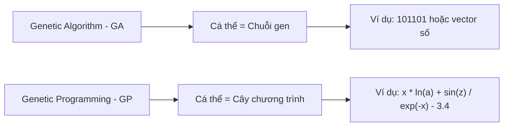

---

# 3. Sơ Đồ Tổng Quát Của Genetic Programming

Sơ đồ hoạt động của GP khá giống với GA.

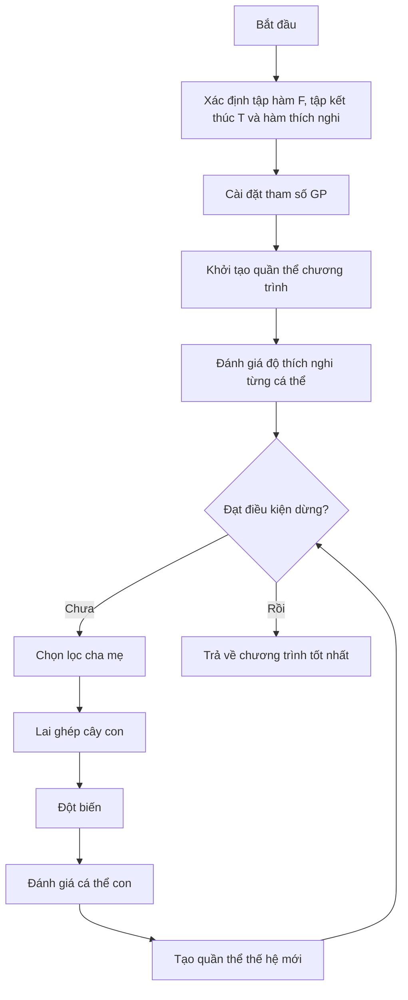

---

# 4. Mã Giả Thuật Toán GP

```text
begin
    Xác định tập hàm, tập kết thúc và hàm thích nghi;

    Cài đặt các tham số cho GP:
        - Kích thước quần thể
        - Số thế hệ
        - Xác suất lai ghép
        - Xác suất đột biến
        - Độ sâu tối đa của cây

    Khởi tạo quần thể ban đầu P;

    Tính toán độ thích nghi cho từng cá thể trong P;

    while chưa đạt điều kiện dừng do
        Chọn các cặp cha mẹ từ quần thể hiện tại P;

        Áp dụng toán tử lai ghép và đột biến
        để tạo ra quần thể con O;

        Tính toán độ thích nghi cho từng cá thể trong O;

        Chọn lọc các cá thể tốt cho thế hệ sau;

        Cập nhật quần thể P;
    end while

    Trả về cá thể có độ thích nghi tốt nhất;
end
```

---

# 5. Biểu Diễn Cá Thể Trong GP

Trong GP, mỗi cá thể được biểu diễn dưới dạng **cây cấu trúc** hoặc **cây cú pháp**.

Một cây GP gồm hai loại nút:

| Thành phần | Ý nghĩa                               |
| ---------- | ------------------------------------- |
| Nút trong  | Là toán tử hoặc hàm                   |
| Nút lá     | Là biến, hằng số hoặc giá trị đầu vào |

---

## 5.1. Tập Hàm - Function Set

**Tập hàm** là tập các toán tử hoặc hàm có thể xuất hiện tại các nút trong của cây.

Ví dụ:

```text
F = { +, -, *, /, ln, sin, exp }
```

Một số nhóm hàm thường gặp:

| Nhóm       | Ví dụ                                    |
| ---------- | ---------------------------------------- |
| Toán học   | `+`, `-`, `*`, `/`, `exp`, `log`, `sqrt` |
| Lượng giác | `sin`, `cos`, `tan`                      |
| Logic      | `and`, `or`, `xor`, `not`                |
| Điều kiện  | `if-then-else`                           |
| So sánh    | `>`, `<`, `>=`, `<=`, `==`               |

---

## 5.2. Tập Kết Thúc - Terminal Set

**Tập kết thúc** là tập các phần tử có thể xuất hiện ở nút lá.

Ví dụ:

```text
T = { x, a, z, 3.4 }
```

Tập kết thúc có thể gồm:

| Loại               | Ví dụ                         |
| ------------------ | ----------------------------- |
| Biến đầu vào       | `x`, `a`, `z`, `price`, `age` |
| Hằng số            | `1`, `2.5`, `3.4`, `-1`       |
| Giá trị ngẫu nhiên | `rand()`                      |
| Module cơ bản      | Các hàm con không có đối số   |

---

# 6. Ví Dụ Cây Biểu Diễn Chương Trình

Xét biểu thức:

```text
y := x * ln(a) + sin(z) / exp(-x) - 3.4
```

Tập kết thúc:

```text
T = { x, a, z, 3.4 }
```

Tập hàm:

```text
F = { *, +, -, /, ln, sin, exp }
```

Biểu thức trên có thể được biểu diễn bằng cây như sau:

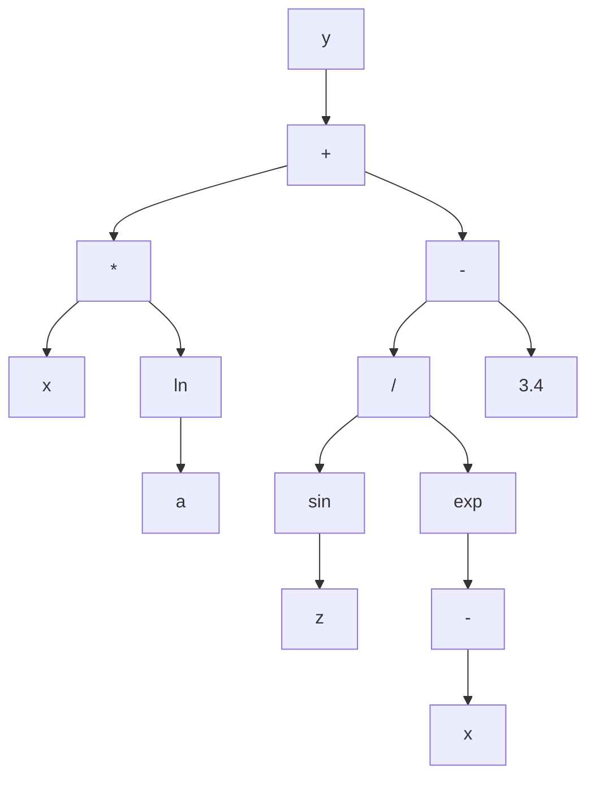

Cây trên tương ứng với biểu thức:

```text
y = x * ln(a) + sin(z) / exp(-x) - 3.4
```

Trong đó:

* Các nút `+`, `-`, `*`, `/`, `ln`, `sin`, `exp` là **nút hàm**.
* Các nút `x`, `a`, `z`, `3.4` là **nút kết thúc**.

---

# 7. Cách Khởi Tạo Cá Thể Trong GP

Khi khởi tạo một cá thể GP, ta cần sinh ra một cây ngẫu nhiên.

Quy tắc cơ bản:

* Nút gốc thường được chọn từ **tập hàm**.
* Nút không phải gốc có thể được chọn từ:

  * Tập hàm
  * Tập kết thúc
* Nếu chọn từ tập kết thúc, nút đó trở thành **nút lá**.
* Nếu chọn từ tập hàm, nút đó trở thành **nút trong**.
* Số nhánh con của một nút phụ thuộc vào số đối số của hàm tại nút đó.

Ví dụ:

| Hàm            | Số đối số | Số nhánh con |
| -------------- | --------: | -----------: |
| `+`            |         2 |            2 |
| `-`            |         2 |            2 |
| `*`            |         2 |            2 |
| `/`            |         2 |            2 |
| `sin`          |         1 |            1 |
| `ln`           |         1 |            1 |
| `exp`          |         1 |            1 |
| `if-then-else` |         3 |            3 |

---

## Các Phương Pháp Khởi Tạo Phổ Biến

| Phương pháp              | Cách hoạt động                                                 | Đặc điểm                                  |
| ------------------------ | -------------------------------------------------------------- | ----------------------------------------- |
| **Full**                 | Các nút trong đều là hàm cho đến độ sâu tối đa, lá là terminal | Cây đầy đủ, cân đối                       |
| **Grow**                 | Mỗi nút có thể là hàm hoặc terminal                            | Cây đa dạng hơn, không nhất thiết cân đối |
| **Ramped Half-and-Half** | Kết hợp Full và Grow ở nhiều độ sâu khác nhau                  | Phổ biến nhất, tạo quần thể đa dạng       |

---

# 8. Điều Kiện Đóng Và Điều Kiện Đầy Đủ

Khi thiết kế GP, tập hàm và tập kết thúc cần thỏa hai điều kiện quan trọng.

---

## 8.1. Điều Kiện Đóng - Closure Property

**Điều kiện đóng** yêu cầu mọi hàm trong tập hàm phải xử lý được mọi giá trị đầu vào có thể xuất hiện.

Ví dụ, nếu dùng phép chia `/`, cần xử lý trường hợp chia cho 0.

Thay vì dùng phép chia thường:

```text
a / b
```

ta dùng **phép chia bảo vệ**:

```text
protected_divide(a, b):
    nếu |b| rất nhỏ:
        trả về 1
    ngược lại:
        trả về a / b
```

Tương tự:

| Hàm       | Vấn đề     | Cách bảo vệ                   |
| --------- | ---------- | ----------------------------- |
| `/`       | Chia cho 0 | Protected division            |
| `log(x)`  | `x <= 0`   | Dùng `log(abs(x) + epsilon)`  |
| `sqrt(x)` | `x < 0`    | Dùng `sqrt(abs(x))`           |
| `exp(x)`  | Tràn số    | Giới hạn miền giá trị của `x` |

---

## 8.2. Điều Kiện Đầy Đủ - Sufficiency Property

**Điều kiện đầy đủ** yêu cầu tập hàm và tập kết thúc phải đủ mạnh để biểu diễn được lời giải mong muốn.

Ví dụ:

Nếu bài toán cần tìm hàm dạng:

```text
y = sin(x) + x^2
```

mà tập hàm chỉ có:

```text
F = { +, -, *, / }
```

thì GP có thể biểu diễn được phần `x^2`, nhưng khó biểu diễn chính xác phần `sin(x)`.

Do đó cần bổ sung:

```text
sin
```

vào tập hàm.

---

# 9. Các Toán Tử Trong Genetic Programming

GP thường sử dụng các toán tử chính sau:


---

# 10. Chọn Lọc Trong GP

Các phương pháp chọn lọc cha mẹ trong GP tương tự như trong GA.

Một số phương pháp phổ biến:

| Phương pháp              | Ý tưởng                                         |
| ------------------------ | ----------------------------------------------- |
| Roulette Wheel Selection | Cá thể tốt có xác suất được chọn cao hơn        |
| Tournament Selection     | Chọn ngẫu nhiên vài cá thể, lấy cá thể tốt nhất |
| Rank Selection           | Xếp hạng cá thể rồi chọn theo hạng              |
| Elitism                  | Giữ lại cá thể tốt nhất qua thế hệ sau          |

Trong GP, **Tournament Selection** rất thường được dùng vì đơn giản và hiệu quả.

---

# 11. Lai Ghép Trong GP

## 11.1. Ý Tưởng

Toán tử lai ghép trong GP thường là **lai ghép cây con - Subtree Crossover**.

Cách thực hiện:

1. Chọn ngẫu nhiên một cây con từ cá thể cha.
2. Chọn ngẫu nhiên một cây con từ cá thể mẹ.
3. Trao đổi hai cây con đó.
4. Tạo ra cá thể con mới.

---

## 11.2. Minh Họa Lai Ghép

Giả sử có hai cá thể cha mẹ:

```text
Cha 1: (x + 1) * sin(x)
Cha 2: x - 2
```

Nếu chọn cây con `sin(x)` ở cha 1 và cây con `x - 2` ở cha 2, sau khi lai ghép ta có thể tạo ra:

```text
Con: (x + 1) * (x - 2)
```

Sơ đồ:

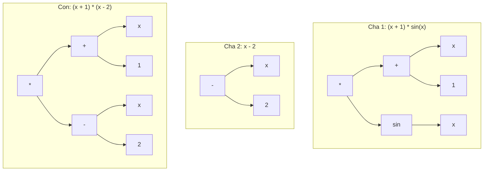

---

## 11.3. Đặc Điểm Của Lai Ghép GP

Lai ghép trong GP giúp:

* Kết hợp các cấu trúc tốt từ nhiều cá thể.
* Tạo ra chương trình mới.
* Khám phá không gian chương trình rộng hơn.
* Tăng khả năng tìm được lời giải tốt.

Tuy nhiên, lai ghép cũng có thể tạo ra cây quá lớn hoặc không hiệu quả, vì vậy thường cần giới hạn:

* Độ sâu tối đa.
* Số nút tối đa.
* Kích thước cây con được trao đổi.

---

# 12. Đột Biến Trong GP

Đột biến giúp duy trì sự đa dạng của quần thể, tránh việc thuật toán bị kẹt ở cực trị cục bộ.

Trong GP có nhiều loại đột biến.

---

## 12.1. Đột Biến Nút Trong

**Đột biến nút trong** là thay thế hàm tại một nút trong bằng một hàm khác trong tập hàm.

Ví dụ:

```text
(x + y)
```

đột biến nút `+` thành `*`:

```text
(x * y)
```

Điều kiện:

* Hàm mới thường phải có cùng số đối số với hàm cũ.
* Ví dụ `+`, `-`, `*`, `/` đều có 2 đối số nên có thể thay thế nhau.

---

## 12.2. Đột Biến Nút Kết Thúc

**Đột biến nút kết thúc** là thay thế biến hoặc hằng tại nút lá bằng một biến hoặc hằng khác.

Ví dụ:

```text
(x + 1)
```

đột biến `1` thành `3.4`:

```text
(x + 3.4)
```

hoặc đột biến `x` thành `z`:

```text
(z + 1)
```

---

## 12.3. Đột Biến Đảo

**Đột biến đảo** chọn ngẫu nhiên một nút trong và đảo hai nút con của nó.

Ví dụ:

```text
(x - y)
```

sau khi đảo:

```text
(y - x)
```

Với các toán tử không giao hoán như `-` và `/`, đột biến đảo có thể làm thay đổi mạnh kết quả.

---

## 12.4. Đột Biến Phát Triển Cây

**Đột biến phát triển cây** chọn một nút ngẫu nhiên và thay toàn bộ cây con tại nút đó bằng một cây con mới được sinh ngẫu nhiên.

Ví dụ:

```text
(x + 1) * sin(x)
```

chọn cây con `sin(x)` và thay bằng `x - 2`:

```text
(x + 1) * (x - 2)
```

Đây là loại đột biến mạnh, có thể tạo ra thay đổi lớn trong cấu trúc chương trình.

---

## 12.5. Đột Biến Gauss

**Đột biến Gauss** áp dụng cho nút lá chứa hằng số.

Ví dụ:

```text
x + 3.4
```

Thêm nhiễu Gauss vào `3.4`:

```text
3.4 + noise
```

Nếu `noise = 0.2`, ta được:

```text
x + 3.6
```

Loại đột biến này phù hợp khi cây chứa các hằng số thực.

---

## 12.6. Đột Biến Cắt Tỉa Cây

**Đột biến cắt tỉa cây** chọn một nút và thay toàn bộ cây con tại nút đó bằng một terminal.

Ví dụ:

```text
(x + 1) * (sin(z) / exp(-x))
```

nếu cắt tỉa cây con `sin(z) / exp(-x)` và thay bằng `a`, ta được:

```text
(x + 1) * a
```

Đột biến này giúp giảm kích thước cây và chống lại hiện tượng **bloat**.

---

## Bảng Tổng Hợp Các Loại Đột Biến

| Loại đột biến           | Cách thực hiện             | Tác dụng                  |
| ----------------------- | -------------------------- | ------------------------- |
| Đột biến nút trong      | Thay hàm ở nút trong       | Thay đổi toán tử          |
| Đột biến nút kết thúc   | Thay biến/hằng ở nút lá    | Thay đổi dữ liệu đầu vào  |
| Đột biến đảo            | Đảo vị trí hai nút con     | Thay đổi thứ tự tính toán |
| Đột biến phát triển cây | Thay cây con bằng cây mới  | Tạo thay đổi lớn          |
| Đột biến Gauss          | Thêm nhiễu vào hằng số     | Tinh chỉnh hằng số thực   |
| Đột biến cắt tỉa        | Thay cây con bằng terminal | Làm cây gọn hơn           |

---

# 13. Đánh Giá Độ Thích Nghi Trong GP

Mỗi cá thể GP là một chương trình hoặc hàm số. Để đánh giá cá thể đó, ta chạy nó trên một tập dữ liệu mẫu.

Giả sử có tập dữ liệu:

```text
X = {mẫu 1, mẫu 2, ..., mẫu N}
```

Mỗi mẫu gồm đầu vào và đầu ra mong muốn.

Ví dụ:

```text
Input:  a, x, z
Output: y
```

Một cá thể GP biểu diễn hàm:

```text
ŷ = f(a, x, z)
```

Ta so sánh giá trị dự đoán `ŷ` với giá trị thật `y`.

---

## 13.1. Quy Trình Đánh Giá

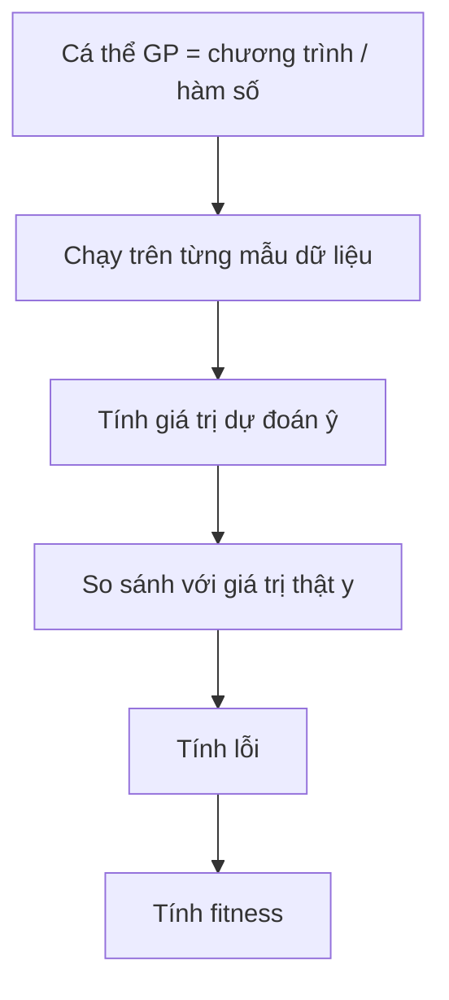

---

## 13.2. Dùng MSE Làm Fitness

Một cách phổ biến là dùng **Mean Squared Error - MSE**:

```text
MSE = (1/N) * Σ(ŷᵢ - yᵢ)²
```

Trong đó:

* `ŷᵢ` là giá trị dự đoán của cá thể GP.
* `yᵢ` là giá trị thật.
* `N` là số mẫu dữ liệu.

Với bài toán tối ưu lỗi:

```text
Fitness càng nhỏ càng tốt.
```

---

# 14. Ví Dụ Đánh Giá Fitness

Giả sử có một tập dữ liệu gồm các mẫu:

| Mẫu |  a |  x |   z | y thật |
| --: | -: | -: | --: | -----: |
|   1 |  2 |  1 | 0.5 |    3.2 |
|   2 |  3 |  2 | 1.0 |    7.8 |
|   3 |  4 | -1 | 0.3 |   -2.1 |

Một cá thể GP biểu diễn chương trình:

```text
ŷ = x * ln(a) + sin(z) / exp(-x) - 3.4
```

Quy trình đánh giá:

1. Với mỗi mẫu, thay `a`, `x`, `z` vào chương trình.
2. Tính giá trị dự đoán `ŷ`.
3. So sánh `ŷ` với `y thật`.
4. Tính lỗi bình phương.
5. Lấy trung bình lỗi trên toàn bộ tập dữ liệu.
6. Giá trị trung bình đó là fitness.

---

# 15. Bài Toán Kinh Điển: Symbolic Regression

Một trong những ứng dụng nổi tiếng nhất của GP là **hồi quy ký hiệu - Symbolic Regression**.

Bài toán:

> Cho một tập điểm dữ liệu, hãy tìm một biểu thức toán học khớp tốt nhất với dữ liệu đó.

Ví dụ, ta có dữ liệu được sinh từ hàm ẩn:

```text
y = x² + x
```

Nhưng thuật toán không biết trước công thức này.

GP chỉ biết:

* Tập dữ liệu mẫu.
* Tập hàm: `+, -, *, /`
* Tập kết thúc: `x`, các hằng số.
* Hàm fitness đo lỗi dự đoán.

Sau nhiều thế hệ, GP có thể tìm được biểu thức tương đương:

```text
x * x + x
```

hoặc:

```text
x * (x + 1)
```

---

## Sơ Đồ Symbolic Regression Với GP

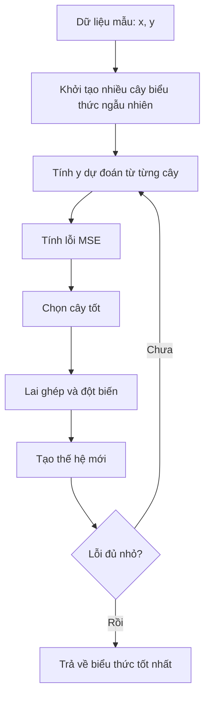

---

# 16. Vấn Đề Bloat Trong GP

Vì cá thể GP là cây có kích thước thay đổi, nên cây có thể ngày càng phình to qua các thế hệ.

Hiện tượng này gọi là **bloat**.

---

## 16.1. Bloat Là Gì?

**Bloat** là hiện tượng cây chương trình trở nên rất lớn, có nhiều nhánh dư thừa, nhưng fitness không cải thiện tương ứng.

Ví dụ:

```text
x
```

có thể bị biến thành:

```text
(((x + 0) * 1) - 0)
```

Hai biểu thức cho kết quả giống nhau, nhưng biểu thức thứ hai dài hơn và tốn chi phí tính toán hơn.

---

## 16.2. Tác Hại Của Bloat

| Tác hại                 | Giải thích                                  |
| ----------------------- | ------------------------------------------- |
| Tốn thời gian tính toán | Cây lớn hơn cần nhiều phép tính hơn         |
| Tốn bộ nhớ              | Lưu trữ nhiều nút hơn                       |
| Khó hiểu                | Biểu thức cuối cùng khó diễn giải           |
| Giảm khả năng tổng quát | Cây quá phức tạp có thể overfit dữ liệu     |
| Làm chậm tiến hóa       | Lai ghép, đột biến và đánh giá đều chậm hơn |

---

## 16.3. Cách Khắc Phục Bloat

| Cách khắc phục         | Mô tả                                     |
| ---------------------- | ----------------------------------------- |
| Giới hạn độ sâu tối đa | Không cho cây vượt quá độ sâu cho trước   |
| Giới hạn số nút        | Không cho cây vượt quá số nút tối đa      |
| Parsimony pressure     | Phạt những cây quá lớn trong hàm fitness  |
| Đột biến cắt tỉa cây   | Thay cây con lớn bằng terminal            |
| Simplification         | Rút gọn biểu thức sau khi sinh cây        |
| Kiểm soát lai ghép     | Không chấp nhận con quá lớn sau crossover |

Ví dụ dùng phạt kích thước cây:

```text
fitness = MSE + α * tree_size
```

Trong đó:

* `MSE` là lỗi dự đoán.
* `tree_size` là số nút của cây.
* `α` là hệ số phạt.

Cây càng lớn thì fitness càng bị phạt.

---

# 17. Cài Đặt Minh Họa GP Bằng Python

Ví dụ sau minh họa GP đơn giản cho bài toán tìm biểu thức gần với:

```text
y = x² + x
```

```python
import random
import math

FUNCTIONS = ['+', '-', '*']
TERMINALS = ['x', 1.0, 2.0]


def random_tree(max_depth, depth=0):
    if depth >= max_depth or (depth > 0 and random.random() < 0.3):
        return random.choice(TERMINALS)

    op = random.choice(FUNCTIONS)
    left = random_tree(max_depth, depth + 1)
    right = random_tree(max_depth, depth + 1)

    return (op, left, right)


def eval_tree(tree, x):
    if tree == 'x':
        return x

    if isinstance(tree, (int, float)):
        return tree

    op, left, right = tree
    lv = eval_tree(left, x)
    rv = eval_tree(right, x)

    if op == '+':
        return lv + rv
    if op == '-':
        return lv - rv
    if op == '*':
        return lv * rv

    raise ValueError(f"Toán tử không hợp lệ: {op}")


def tree_to_str(tree):
    if not isinstance(tree, tuple):
        return str(tree)

    op, left, right = tree
    return f"({tree_to_str(left)} {op} {tree_to_str(right)})"


def tree_size(tree):
    if not isinstance(tree, tuple):
        return 1

    _, left, right = tree
    return 1 + tree_size(left) + tree_size(right)


def all_subtree_paths(tree, path=()):
    paths = [path]

    if isinstance(tree, tuple):
        _, left, right = tree
        paths += all_subtree_paths(left, path + (1,))
        paths += all_subtree_paths(right, path + (2,))

    return paths


def get_subtree(tree, path):
    node = tree

    for step in path:
        node = node[step]

    return node


def replace_subtree(tree, path, new_subtree):
    if not path:
        return new_subtree

    op, left, right = tree

    if path[0] == 1:
        return (op, replace_subtree(left, path[1:], new_subtree), right)

    return (op, left, replace_subtree(right, path[1:], new_subtree))


def crossover(parent1, parent2):
    path1 = random.choice(all_subtree_paths(parent1))
    path2 = random.choice(all_subtree_paths(parent2))

    subtree2 = get_subtree(parent2, path2)

    return replace_subtree(parent1, path1, subtree2)


def mutate(tree, max_depth=3, rate=0.1):
    if random.random() > rate:
        return tree

    path = random.choice(all_subtree_paths(tree))
    new_subtree = random_tree(max_depth)

    return replace_subtree(tree, path, new_subtree)


def fitness(tree, data):
    mse = sum((eval_tree(tree, x) - y) ** 2 for x, y in data) / len(data)

    # Parsimony pressure: phạt cây quá lớn
    penalty = 0.001 * tree_size(tree)

    return mse + penalty


def tournament_select(population, fitness_values, k=3):
    contenders = random.sample(list(zip(population, fitness_values)), k)

    return min(contenders, key=lambda item: item[1])[0]


def genetic_programming(data, pop_size=60, n_generations=40, max_depth=4):
    population = [random_tree(max_depth) for _ in range(pop_size)]

    best_tree = None
    best_fitness = math.inf

    for generation in range(n_generations):
        fitness_values = [fitness(individual, data) for individual in population]

        best_index = fitness_values.index(min(fitness_values))

        if fitness_values[best_index] < best_fitness:
            best_tree = population[best_index]
            best_fitness = fitness_values[best_index]

        new_population = [population[best_index]]

        while len(new_population) < pop_size:
            parent1 = tournament_select(population, fitness_values)
            parent2 = tournament_select(population, fitness_values)

            child = crossover(parent1, parent2)
            child = mutate(child, max_depth=max_depth, rate=0.2)

            if tree_size(child) <= 30:
                new_population.append(child)
            else:
                new_population.append(parent1)

        population = new_population

    return best_tree, best_fitness


if __name__ == "__main__":
    random.seed(42)

    data = [(x, x ** 2 + x) for x in [-2.0, -1.0, 0.0, 1.0, 2.0, 3.0]]

    best_tree, best_fit = genetic_programming(data)

    print("Biểu thức tốt nhất:", tree_to_str(best_tree))
    print("Fitness:", round(best_fit, 5))
```

---

# 18. Ứng Dụng Của Genetic Programming

| Lĩnh vực                     | Ứng dụng                          |
| ---------------------------- | --------------------------------- |
| Hồi quy ký hiệu              | Tìm công thức toán học từ dữ liệu |
| Tối ưu kiến trúc mạng neural | Tìm cấu trúc mạng phù hợp         |
| Tài chính                    | Sinh luật giao dịch               |
| Robot                        | Tiến hóa chương trình điều khiển  |
| Xử lý ảnh                    | Tìm bộ lọc hoặc đặc trưng ảnh     |
| Sinh chương trình            | Tự động tạo chương trình nhỏ      |
| Khoa học dữ liệu             | Khám phá quan hệ ẩn trong dữ liệu |
| Điều khiển tự động           | Sinh luật điều khiển hệ thống     |

---

# 19. Câu Hỏi Ôn Tập Nhanh

## 1. Có thể coi Genetic Programming là gì?

GP có thể được coi là **một thuật toán di truyền đặc biệt**, trong đó cá thể là chương trình hoặc hàm số thay vì chuỗi gen thông thường.

---

## 2. GP có giống GA không?

Có. GP có sơ đồ tổng quát giống GA:

```text
Khởi tạo → Đánh giá → Chọn lọc → Lai ghép → Đột biến → Thế hệ mới
```

Nhưng khác ở cách biểu diễn cá thể.

---

## 3. Điểm khác biệt chính giữa GA và GP là gì?

* GA biểu diễn cá thể dưới dạng **chuỗi alen**.
* GP biểu diễn cá thể dưới dạng **cây chương trình**.

---

## 4. Mục tiêu của GP là gì?

Mục tiêu của GP là tìm ra một **chương trình tối ưu** hoặc **hàm số tối ưu** trong không gian các chương trình có thể.

---

## 5. Trong GP, nút lá là gì?

Nút lá là phần tử thuộc **tập kết thúc**, ví dụ:

```text
x, a, z, 3.4
```

---

## 6. Trong GP, nút trong là gì?

Nút trong là phần tử thuộc **tập hàm**, ví dụ:

```text
+, -, *, /, ln, sin, exp
```

---

## 7. Lai ghép trong GP thực hiện như thế nào?

Lai ghép trong GP chọn một cây con từ mỗi cha mẹ và tráo đổi hai cây con đó để tạo cá thể mới.

---

## 8. Fitness trong GP được tính như thế nào?

Fitness được tính bằng cách chạy chương trình trên tập dữ liệu mẫu, so sánh kết quả dự đoán với kết quả thật, sau đó tính lỗi như MSE.

---

# 20. Điều Cần Ghi Nhớ

* **Genetic Programming - GP** là một nhánh của tính toán tiến hóa dùng để tiến hóa chương trình hoặc hàm số.
* Có thể xem GP là một dạng đặc biệt của **Genetic Algorithm - GA**.
* Khác biệt lớn nhất giữa GA và GP là cách biểu diễn cá thể:

  * GA dùng chuỗi.
  * GP dùng cây.
* Một cây GP gồm:

  * **Nút trong** lấy từ tập hàm.
  * **Nút lá** lấy từ tập kết thúc.
* Hai tập quan trọng trong GP là:

  * **Function set - tập hàm**
  * **Terminal set - tập kết thúc**
* Các toán tử chính của GP gồm:

  * Chọn lọc
  * Lai ghép cây con
  * Đột biến cây
  * Đánh giá fitness
* Bài toán kinh điển của GP là **Symbolic Regression**.
* GP dễ gặp hiện tượng **bloat**, tức cây phình to nhưng không cải thiện chất lượng.
* Cách chống bloat gồm giới hạn độ sâu, giới hạn số nút, phạt kích thước cây và cắt tỉa cây.

---

# Tóm Tắt Bài Học

Chương này đã giới thiệu **Lập trình di truyền - Genetic Programming**, một kỹ thuật tiến hóa trong đó mỗi cá thể là một chương trình hoặc hàm số được biểu diễn bằng cây. GP có quy trình tổng quát tương tự GA, nhưng thay vì tiến hóa chuỗi gen cố định, GP tiến hóa trực tiếp cấu trúc chương trình.

Bạn đã học cách xây dựng cá thể GP bằng **tập hàm** và **tập kết thúc**, cách khởi tạo cây, cách thực hiện **lai ghép cây con**, các dạng **đột biến**, cách đánh giá fitness bằng dữ liệu mẫu, và bài toán kinh điển **hồi quy ký hiệu**. Ngoài ra, chương cũng trình bày vấn đề **bloat** — một hiện tượng đặc trưng của GP — cùng các phương pháp kiểm soát kích thước cây.

Ở chương tiếp theo, ta sẽ học **Lập Trình Tiến Hóa - Evolutionary Programming**, một hướng tiếp cận khác trong tính toán tiến hóa, nhấn mạnh vào đột biến và hành vi của cá thể hơn là cấu trúc gen.
````

### 3. `01 - AI & Dữ liệu/02 - Data Science, Analytics & ML/ai-data-scientist-roadmap/AI-Data-Scientist-Roadmap-Course/00 - Roadmap.sh AI Data Scientist Official/03 - Machine Learning and Deep Learning/Module 06 - Machine Learning/05-Features/025 - Feature Engineering.md`

Nguồn: `01 - AI & Dữ liệu/02 - Data Science, Analytics & ML/ai-data-scientist-roadmap/AI-Data-Scientist-Roadmap-Course/00 - Roadmap.sh AI Data Scientist Official/03 - Machine Learning and Deep Learning/Module 06 - Machine Learning/05-Features/025 - Feature Engineering.md`

````markdown
# 025 - Feature Engineering

**Course:** 03 - Machine Learning and Deep Learning
**Module:** Module 06 - Machine Learning
**Content Group:** Feature Engineering
**Roadmap Source:** Machine Learning / Feature Engineering
**Lesson Type:** Machine Learning
**Order in Module:** 025
**Suggested Duration:** 26 minutes

---

## 1. Summary

**Feature engineering** is the process of transforming raw data into meaningful inputs that help a machine learning model learn useful patterns.

Raw datasets often contain information that is:

* Missing or inconsistent.
* Stored in inconvenient formats.
* Highly skewed.
* Categorical rather than numerical.
* Distributed across several columns.
* Difficult for a model to interpret directly.

Feature engineering converts this raw information into features that better represent the underlying business problem.

Examples include:

* Scaling numerical values.
* Encoding categorical variables.
* Extracting year, month, weekday, or hour from timestamps.
* Creating price-per-unit or ratio features.
* Grouping continuous values into bins.
* Combining features through interactions.
* Transforming skewed variables.
* Extracting text statistics.
* Aggregating historical behavior.

Good feature engineering can improve:

* Predictive performance.
* Training stability.
* Model interpretability.
* Generalization to unseen data.
* Data quality.
* Production reliability.

However, feature engineering can also introduce **data leakage**, causing validation scores to appear unrealistically high.

---

## 2. Learning Objectives

By the end of this lesson, you should be able to:

* Explain feature engineering in your own words.
* Distinguish raw fields from model-ready features.
* Identify useful numerical, categorical, temporal, text, and interaction features.
* Apply common feature transformations.
* Build leakage-safe preprocessing pipelines.
* Compare model performance before and after feature engineering.
* Recognize unnecessary or harmful features.
* Perform feature engineering based on domain knowledge.
* Document assumptions and feature definitions.
* Apply feature engineering to a house price prediction project.

---

## 3. What Is a Feature?

A **feature** is an input variable used by a machine learning model to generate a prediction.

Suppose the objective is to predict the sale price of a house.

Raw fields may include:

| Raw Field         | Example      |
| ----------------- | ------------ |
| Construction date | `2008-06-15` |
| Sale date         | `2026-03-01` |
| Living area       | `145 m²`     |
| Bedrooms          | `3`          |
| Bathrooms         | `2`          |
| District          | `District 7` |
| Renovation date   | `2020-08-11` |

Possible engineered features include:

| Engineered Feature     |                     Example |
| ---------------------- | --------------------------: |
| Property age           |                    18 years |
| Years since renovation |                     6 years |
| Area per bedroom       |                     48.3 m² |
| Total rooms            |                           5 |
| Is renovated           |                           1 |
| Sale month             |                           3 |
| District encoded       | Numerical or one-hot values |

The engineered features make relevant relationships more explicit.

---

## 4. Feature Engineering Workflow

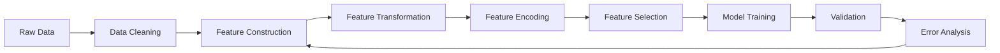

A more detailed workflow is:

```text
raw data
    -> inspect data quality
    -> define train, validation and test strategy
    -> clean invalid values
    -> create domain-based features
    -> encode categorical variables
    -> scale or transform numerical variables
    -> remove leakage and redundant features
    -> train baseline
    -> evaluate with cross-validation
    -> perform error analysis
    -> test the next feature hypothesis
```

Feature engineering should be an iterative process rather than a one-time preprocessing step.

---

## 5. Why Feature Engineering Matters

Different models understand data in different ways.

For example, consider a house's construction year:

```text
construction_year = 2005
```

The relationship between `2005` and the current value of the property may not be directly meaningful to the model.

A more useful representation may be:

$$
\text{property age} = \text{sale year} - \text{construction year}
$$

If the house was sold in 2026:

$$
\text{property age} = # 2026 - 2005 21
$$

The engineered feature directly represents how old the property was when sold.

Feature engineering helps the model by making important relationships easier to learn.

---

## 6. Raw Features Versus Engineered Features

Suppose a dataset contains:

```text
living_area = 150
bedrooms = 3
bathrooms = 2
construction_year = 2010
sale_year = 2026
renovation_year = 2020
```

Possible engineered features are:

```text
property_age = 2026 - 2010 = 16
years_since_renovation = 2026 - 2020 = 6
area_per_bedroom = 150 / 3 = 50
total_main_rooms = 3 + 2 = 5
is_renovated = 1
```

These features represent concepts that may influence price more directly than the original columns.

---

## 7. Main Categories of Feature Engineering

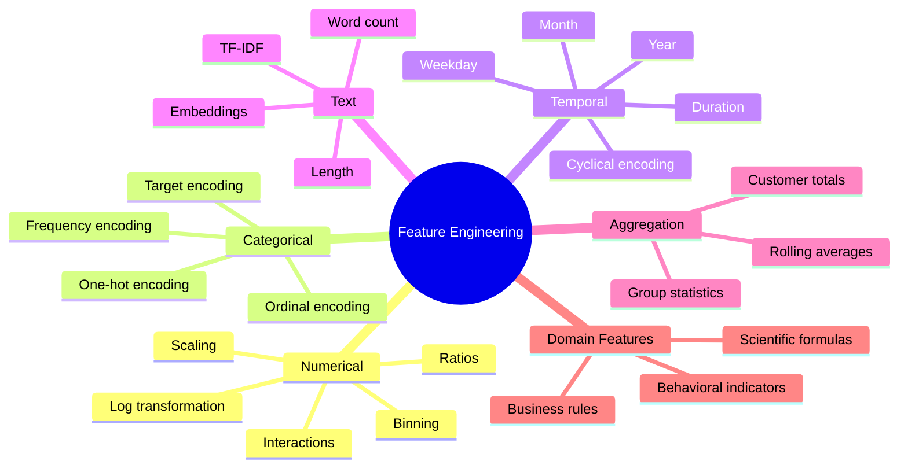

---

## 8. Numerical Feature Engineering

### 8.1 Standardization

Standardization transforms a numerical feature to have approximately:

* Mean equal to zero.
* Standard deviation equal to one.

The formula is:

$$
z = \frac{x-\mu}{\sigma}
$$

where:

* (x) is the original value.
* (\mu) is the training-set mean.
* (\sigma) is the training-set standard deviation.

Example:

```python
from sklearn.preprocessing import StandardScaler

scaler = StandardScaler()
X_scaled = scaler.fit_transform(X)
```

Standardization is often useful for:

* Linear Regression with regularization.
* Logistic Regression.
* K-Nearest Neighbors.
* Support Vector Machines.
* Neural networks.
* PCA.
* Clustering algorithms.

Tree-based models such as Random Forest and XGBoost usually do not require standardization.

---

### 8.2 Min-Max Scaling

Min-max scaling transforms values to a defined range, commonly from 0 to 1.

$$
x' = \frac{x-x_{\min}} {x_{\max}-x_{\min}}
$$

Example:

```python
from sklearn.preprocessing import MinMaxScaler

scaler = MinMaxScaler()
X_scaled = scaler.fit_transform(X)
```

It may be useful when:

* Features need a fixed range.
* A neural network is sensitive to input magnitude.
* Distance-based algorithms are used.

Min-max scaling can be sensitive to outliers.

---

### 8.3 Robust Scaling

Robust scaling uses the median and interquartile range instead of the mean and standard deviation.

$$
x' = \frac{x-\text{median}(x)} {Q_3-Q_1}
$$

Example:

```python
from sklearn.preprocessing import RobustScaler

scaler = RobustScaler()
X_scaled = scaler.fit_transform(X)
```

It may be useful when numerical features contain large outliers.

---

### 8.4 Log Transformation

A log transformation can reduce strong positive skew.

$$
x' = \log(1+x)
$$

The addition of 1 allows zero values to be transformed safely.

```python
import numpy as np

df["log_income"] = np.log1p(df["income"])
```

Example:

```text
Original values:
1,000
2,000
5,000
100,000

After log transformation:
6.91
7.60
8.52
11.51
```

Log transformations are commonly applied to:

* Income.
* Sales.
* House prices.
* Transaction values.
* Population.
* Website traffic.
* Count variables.

Do not apply a standard logarithm to negative values without designing an appropriate transformation.

---

### 8.5 Polynomial Features

Polynomial features allow a linear model to represent nonlinear relationships.

For one feature (x), second-degree polynomial features include:

$$
x
$$

and:

$$
x^2
$$

For two features (x_1) and (x_2), they may include:

$$
x_1,\quad x_2,\quad x_1^2,\quad x_2^2,\quad x_1x_2
$$

Example:

```python
from sklearn.preprocessing import PolynomialFeatures

poly = PolynomialFeatures(
    degree=2,
    include_bias=False
)

X_poly = poly.fit_transform(X)
```

Polynomial features can greatly increase dimensionality, so they should be used carefully.

---

## 9. Ratio Features

Ratios often represent efficiency, density, or relative scale.

Examples for house price prediction:

$$
\text{area per bedroom} = \frac{\text{living area}} {\text{number of bedrooms}}
$$

$$
\text{bathroom-to-bedroom ratio} = \frac{\text{bathrooms}} {\text{bedrooms}}
$$

$$
\text{land utilization} = \frac{\text{living area}} {\text{land area}}
$$

Python example:

```python
import numpy as np

df["area_per_bedroom"] = (
    df["living_area"]
    / df["bedrooms"].replace(0, np.nan)
)

df["bathroom_bedroom_ratio"] = (
    df["bathrooms"]
    / df["bedrooms"].replace(0, np.nan)
)
```

Always handle division by zero and missing values.

---

## 10. Interaction Features

An interaction feature represents the combined effect of two or more variables.

For example:

$$
\text{location quality} \times \text{living area}
$$

may be more informative than either feature independently.

```python
df["area_location_interaction"] = (
    df["living_area"]
    * df["location_score"]
)
```

Other examples include:

```text
advertising_budget × campaign_duration
income × credit_score
temperature × humidity
product_price × discount_rate
user_activity × account_age
```

Interaction features are especially helpful for linear models because tree-based models can often learn interactions automatically.

---

## 11. Binning Continuous Variables

Binning converts continuous values into categories.

For example, property age can be divided into:

```text
0-5 years      -> New
6-15 years     -> Modern
16-30 years    -> Mature
31+ years      -> Old
```

Python example:

```python
import pandas as pd

bins = [0, 5, 15, 30, float("inf")]
labels = ["new", "modern", "mature", "old"]

df["property_age_group"] = pd.cut(
    df["property_age"],
    bins=bins,
    labels=labels,
    include_lowest=True
)
```

Binning may help when:

* Relationships are not linear.
* Business rules use meaningful ranges.
* Interpretability is important.
* Extreme numerical precision is unnecessary.

However, binning also removes information. A property aged 6 years and one aged 15 years would belong to the same group.

---

## 12. Categorical Feature Engineering

Machine learning models usually require categorical values to be converted into numerical form.

Suppose the feature is:

```text
property_type:
- apartment
- townhouse
- villa
```

Several encoding methods are available.

---

### 12.1 One-Hot Encoding

One-hot encoding creates one binary column for each category.

| Property Type | Apartment | Townhouse | Villa |
| ------------- | --------: | --------: | ----: |
| Apartment     |         1 |         0 |     0 |
| Villa         |         0 |         0 |     1 |
| Townhouse     |         0 |         1 |     0 |

Example:

```python
from sklearn.preprocessing import OneHotEncoder

encoder = OneHotEncoder(
    handle_unknown="ignore"
)
```

Advantages:

* Simple and interpretable.
* Does not assume category order.
* Works well for low-cardinality features.

Disadvantages:

* Can create many columns.
* May be inefficient for high-cardinality features.

---

### 12.2 Ordinal Encoding

Ordinal encoding assigns ordered numerical values.

Example:

```text
poor      -> 0
average   -> 1
good      -> 2
excellent -> 3
```

```python
from sklearn.preprocessing import OrdinalEncoder

encoder = OrdinalEncoder(
    categories=[
        ["poor", "average", "good", "excellent"]
    ]
)
```

Use ordinal encoding only when categories have a real and meaningful order.

Do not encode unordered categories like this:

```text
Hanoi        -> 1
Da Nang      -> 2
Ho Chi Minh  -> 3
```

This would incorrectly imply that Ho Chi Minh City is numerically greater than Hanoi.

---

### 12.3 Frequency Encoding

Frequency encoding replaces each category with how frequently it appears.

Suppose:

| District | Number of Records |
| -------- | ----------------: |
| A        |               500 |
| B        |               300 |
| C        |               200 |

The frequency values are:

| District | Frequency |
| -------- | --------: |
| A        |      0.50 |
| B        |      0.30 |
| C        |      0.20 |

Example:

```python
frequency_map = (
    df["district"]
    .value_counts(normalize=True)
)

df["district_frequency"] = (
    df["district"]
    .map(frequency_map)
)
```

Frequency encoding can help with high-cardinality features but does not directly represent their relationship with the target.

---

### 12.4 Target Encoding

Target encoding replaces a category with a statistic calculated from the target.

For regression:

$$
\text{encoded category} = \text{mean}(y \mid \text{category})
$$

For example:

| District | Average House Price |
| -------- | ------------------: |
| A        |             300,000 |
| B        |             450,000 |
| C        |             270,000 |

Target encoding can be powerful, but it has a high leakage risk.

Incorrect approach:

```python
# Incorrect when applied to the entire dataset
district_mean = df.groupby("district")["price"].mean()
df["district_target_mean"] = df["district"].map(district_mean)
```

The target statistics must be learned only from the current training fold.

Safe implementations may use:

* Cross-fold target encoding.
* Smoothing.
* Minimum category counts.
* An encoder inside a cross-validation pipeline.

---

## 13. Handling High-Cardinality Categories

A categorical feature has high cardinality when it contains many unique values.

Examples:

* User ID.
* Product ID.
* Postal code.
* Street name.
* Device ID.
* Company name.

Possible strategies include:

* Group rare categories into `"other"`.
* Use frequency encoding.
* Use leakage-safe target encoding.
* Extract broader geographic information.
* Create category embeddings.
* Remove identifiers that do not generalize.

Example:

```python
category_counts = df["district"].value_counts()

rare_categories = category_counts[
    category_counts < 20
].index

df["district_clean"] = df["district"].where(
    ~df["district"].isin(rare_categories),
    "other"
)
```

Do not include an identifier simply because it is available.

---

## 14. Date and Time Features

Raw timestamps are often difficult for models to interpret.

Suppose a transaction timestamp is:

```text
2026-07-12 18:45:00
```

Possible features include:

```text
year = 2026
month = 7
day = 12
weekday = Sunday
hour = 18
is_weekend = 1
quarter = 3
```

Python example:

```python
df["transaction_time"] = pd.to_datetime(
    df["transaction_time"]
)

df["year"] = df["transaction_time"].dt.year
df["month"] = df["transaction_time"].dt.month
df["day"] = df["transaction_time"].dt.day
df["weekday"] = df["transaction_time"].dt.weekday
df["hour"] = df["transaction_time"].dt.hour
df["quarter"] = df["transaction_time"].dt.quarter

df["is_weekend"] = (
    df["weekday"] >= 5
).astype(int)
```

---

## 15. Duration Features

Durations are frequently more meaningful than raw dates.

For house price prediction:

$$
\text{property age} = \text{sale year} - \text{construction year}
$$

$$
\text{years since renovation} = \text{sale year} - \text{renovation year}
$$

Example:

```python
df["property_age"] = (
    df["sale_year"]
    - df["construction_year"]
)

df["years_since_renovation"] = (
    df["sale_year"]
    - df["renovation_year"]
)
```

When renovation information is missing, create an additional indicator:

```python
df["is_renovated"] = (
    df["renovation_year"].notna()
).astype(int)
```

A missing value can sometimes contain meaningful information.

---

## 16. Cyclical Encoding

Some time variables are cyclical.

For example:

* December is close to January.
* Sunday is close to Monday.
* Hour 23 is close to hour 0.

Encoding months as integers from 1 to 12 does not represent this relationship properly.

Cyclical encoding uses sine and cosine:

$$
x_{\sin} = \sin\left( 2\pi\frac{x}{T} \right)
$$

$$
x_{\cos} = \cos\left( 2\pi\frac{x}{T} \right)
$$

where (T) is the cycle length.

For months:

$$
T = 12
$$

Example:

```python
import numpy as np

df["month_sin"] = np.sin(
    2 * np.pi * df["month"] / 12
)

df["month_cos"] = np.cos(
    2 * np.pi * df["month"] / 12
)
```


This representation preserves the circular relationship.

---

## 17. Text Features

Text data can be converted into numerical features.

Suppose a property listing contains a description:

```text
Modern three-bedroom apartment near the city center.
```

Simple text features include:

```python
df["description_length"] = (
    df["description"]
    .fillna("")
    .str.len()
)

df["word_count"] = (
    df["description"]
    .fillna("")
    .str.split()
    .str.len()
)

df["contains_modern"] = (
    df["description"]
    .fillna("")
    .str.contains(
        "modern",
        case=False,
        regex=False
    )
    .astype(int)
)
```

More advanced representations include:

* Bag of Words.
* N-grams.
* TF-IDF.
* Word embeddings.
* Sentence embeddings.
* Transformer representations.

Example using TF-IDF:

```python
from sklearn.feature_extraction.text import TfidfVectorizer

vectorizer = TfidfVectorizer(
    max_features=5000,
    ngram_range=(1, 2),
    stop_words="english"
)
```

Text vectorizers should also be fitted only on training data.

---

## 18. Aggregation Features

Aggregation features summarize behavior across multiple records.

For customer churn prediction, features may include:

```text
total_orders
average_order_value
days_since_last_order
orders_last_30_days
maximum_purchase_value
percentage_of_refunded_orders
```

Example:

```python
customer_features = (
    transactions
    .groupby("customer_id")
    .agg(
        total_orders=("order_id", "nunique"),
        total_spend=("amount", "sum"),
        average_order_value=("amount", "mean"),
        last_order_date=("order_date", "max")
    )
    .reset_index()
)
```

For house price prediction, geographic aggregations may include:

```text
number of recent sales in the district
median historical price per square meter
distance to local facilities
average nearby school rating
```

Aggregation features must respect time.

A transaction from the future must not be included when creating a historical feature for an earlier transaction.

---

## 19. Rolling and Lag Features

Rolling and lag features are common in time series and behavioral data.

A lag feature uses a previous value:

$$
\text{lag}_1(t) = y_{t-1}
$$

A rolling mean may be:

$$
\text{rolling mean}_7(t) = \frac{1}{7} \sum_{i=1}^{7} y_{t-i}
$$

Example:

```python
df = df.sort_values("date")

df["sales_lag_1"] = df["sales"].shift(1)

df["sales_rolling_mean_7"] = (
    df["sales"]
    .shift(1)
    .rolling(window=7)
    .mean()
)
```

The `shift(1)` prevents the current target value from leaking into its own feature.

---

## 20. Missing-Value Features

Missing values should not always be treated only as a cleaning problem.

The fact that a value is missing may itself be informative.

Suppose renovation year is missing because the property has never been renovated.

Create:

```python
df["renovation_year_missing"] = (
    df["renovation_year"].isna()
).astype(int)
```

Then impute the numerical value separately.

```python
df["renovation_year"] = (
    df["renovation_year"]
    .fillna(df["construction_year"])
)
```

Possible missing-value strategies include:

* Mean imputation.
* Median imputation.
* Most-frequent category.
* Constant value such as `"unknown"`.
* Model-based imputation.
* Missingness indicator.
* Domain-specific replacement.

The best method depends on why the data is missing.

---

## 21. Domain-Based Feature Engineering

Domain knowledge is often the most valuable source of new features.

Examples:

### Finance

```text
debt-to-income ratio
credit utilization
payment delay frequency
income stability
```

### E-commerce

```text
days since last purchase
average basket size
discount usage rate
repeat purchase rate
```

### Healthcare

```text
body mass index
change in blood pressure
medication adherence
number of previous admissions
```

### House Prices

```text
property age
price per square meter
distance to city center
nearby school quality
room density
renovation recency
```

### Marketing

```text
click-through rate
conversion rate
cost per acquisition
engagement frequency
```

Strong domain features frequently outperform arbitrary mathematical transformations.

---

## 22. Feature Engineering and Different Model Types

Different models benefit from different transformations.

| Model               | Scaling             | One-Hot Encoding          | Interactions          | Nonlinear Transformations |
| ------------------- | ------------------- | ------------------------- | --------------------- | ------------------------- |
| Linear Regression   | Usually useful      | Required                  | Often useful          | Often useful              |
| Logistic Regression | Usually useful      | Required                  | Often useful          | Often useful              |
| K-Nearest Neighbors | Important           | Usually required          | Sometimes useful      | Useful                    |
| SVM                 | Important           | Usually required          | Sometimes useful      | Useful                    |
| Decision Tree       | Usually unnecessary | Depends on implementation | Learned automatically | Often unnecessary         |
| Random Forest       | Usually unnecessary | Depends on implementation | Learned automatically | Often unnecessary         |
| XGBoost             | Usually unnecessary | Depends on implementation | Learned automatically | Sometimes useful          |
| Neural Network      | Usually useful      | Required or embeddings    | Learned partially     | Often useful              |

Tree-based models can learn many nonlinear relationships and interactions automatically, but they still benefit from:

* Better data cleaning.
* Useful domain features.
* Temporal features.
* Aggregations.
* Leakage prevention.
* Removal of meaningless identifiers.

---

## 23. Feature Engineering Before or After Data Splitting?

The train, validation, and test design should be established before fitting data-dependent transformations.

Correct conceptual order:

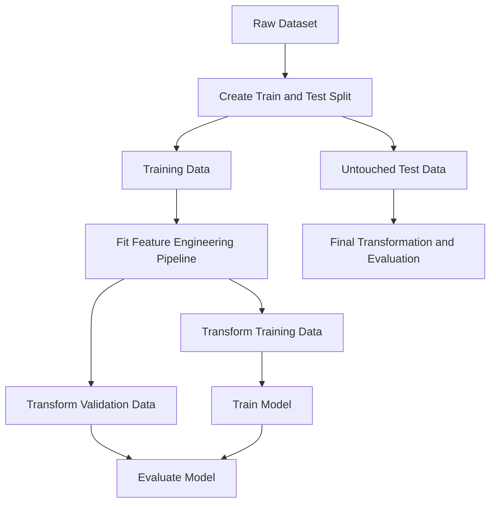

Some row-level deterministic features may be created before splitting, provided they do not use:

* The target.
* Future information.
* Statistics learned from the full dataset.
* Information from other rows that belong to validation or test data.

For safety and reproducibility, feature transformations should usually be implemented inside a pipeline.

---

## 24. Data Leakage

**Data leakage** occurs when information unavailable during real prediction is included in model training.

Leakage creates falsely high validation performance.

### Example 1: Future Information

Suppose the model predicts whether a loan will default.

A feature such as:

```text
final_collection_status
```

is determined only after default occurs.

It must not be used as an input.

---

### Example 2: Full-Dataset Scaling

Incorrect:

```python
scaler = StandardScaler()

X_scaled = scaler.fit_transform(X)

scores = cross_val_score(
    model,
    X_scaled,
    y,
    cv=5
)
```

The scaler uses statistics from validation observations.

Correct:

```python
from sklearn.pipeline import Pipeline

pipeline = Pipeline(
    steps=[
        ("scaler", StandardScaler()),
        ("model", model)
    ]
)

scores = cross_val_score(
    pipeline,
    X,
    y,
    cv=5
)
```

---

### Example 3: Target Encoding Before Splitting

Incorrect:

```python
district_price = (
    df.groupby("district")["price"].mean()
)

df["district_encoded"] = (
    df["district"].map(district_price)
)
```

The feature directly uses target information from all rows.

Use cross-fold target encoding or fit the encoder only within the training folds.

---

### Example 4: Aggregating Future Events

Suppose a churn model predicts customer churn on June 1.

A feature such as:

```text
number_of_orders_in_june
```

would contain future information.

Instead, use only events available before June 1.

---

## 25. Leakage Checklist

Before using a feature, ask:

1. Would this value be available at prediction time?
2. Does this feature directly or indirectly contain the target?
3. Was it calculated using validation or test observations?
4. Does it use future information?
5. Does it use statistics calculated from the full dataset?
6. Does it identify the exact entity rather than a generalizable pattern?
7. Was preprocessing fitted separately inside each cross-validation fold?

A suspiciously high validation score should trigger a leakage investigation.

---

## 26. Leakage-Safe Pipeline

A pipeline ensures that transformations are fitted only on the training portion of each fold.

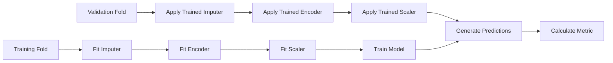

---

## 27. Complete Preprocessing Example

```python
from sklearn.compose import ColumnTransformer
from sklearn.impute import SimpleImputer
from sklearn.pipeline import Pipeline
from sklearn.preprocessing import OneHotEncoder, StandardScaler

numeric_features = [
    "living_area",
    "bedrooms",
    "bathrooms",
    "property_age",
    "area_per_bedroom"
]

categorical_features = [
    "district",
    "property_type",
    "property_age_group"
]

numeric_pipeline = Pipeline(
    steps=[
        (
            "imputer",
            SimpleImputer(strategy="median")
        ),
        (
            "scaler",
            StandardScaler()
        )
    ]
)

categorical_pipeline = Pipeline(
    steps=[
        (
            "imputer",
            SimpleImputer(strategy="most_frequent")
        ),
        (
            "encoder",
            OneHotEncoder(
                handle_unknown="ignore"
            )
        )
    ]
)

preprocessor = ColumnTransformer(
    transformers=[
        (
            "numeric",
            numeric_pipeline,
            numeric_features
        ),
        (
            "categorical",
            categorical_pipeline,
            categorical_features
        )
    ]
)
```

Combine preprocessing with a model:

```python
from sklearn.ensemble import RandomForestRegressor

model = RandomForestRegressor(
    n_estimators=300,
    random_state=42,
    n_jobs=-1
)

pipeline = Pipeline(
    steps=[
        ("preprocessor", preprocessor),
        ("model", model)
    ]
)
```

---

## 28. Custom Feature Transformer

Reusable feature engineering can be placed inside a custom transformer.

```python
import numpy as np
import pandas as pd

from sklearn.base import BaseEstimator, TransformerMixin


class HouseFeatureEngineer(
    BaseEstimator,
    TransformerMixin
):
    def fit(self, X, y=None):
        return self

    def transform(self, X):
        X = X.copy()

        X["property_age"] = (
            X["sale_year"]
            - X["construction_year"]
        )

        X["is_renovated"] = (
            X["renovation_year"].notna()
        ).astype(int)

        X["years_since_renovation"] = np.where(
            X["is_renovated"] == 1,
            X["sale_year"] - X["renovation_year"],
            X["property_age"]
        )

        safe_bedrooms = X["bedrooms"].replace(0, np.nan)

        X["area_per_bedroom"] = (
            X["living_area"]
            / safe_bedrooms
        )

        X["total_rooms"] = (
            X["bedrooms"]
            + X["bathrooms"]
        )

        return X
```

Use it in a pipeline:

```python
pipeline = Pipeline(
    steps=[
        (
            "feature_engineering",
            HouseFeatureEngineer()
        ),
        (
            "preprocessor",
            preprocessor
        ),
        (
            "model",
            model
        )
    ]
)
```

This makes the workflow:

* Reproducible.
* Easier to test.
* Safer during cross-validation.
* Easier to deploy.

---

## 29. Comparing Baseline and Engineered Features

Feature engineering should be evaluated as an experiment.

Suppose the baseline uses:

```text
living_area
bedrooms
bathrooms
district
property_type
```

The engineered version adds:

```text
property_age
years_since_renovation
is_renovated
area_per_bedroom
total_rooms
sale_month
```

Example results:

| Experiment                 | Mean CV RMSE | RMSE Std. |
| -------------------------- | -----------: | --------: |
| Median baseline            |       59,500 |     2,100 |
| Raw features               |       33,200 |     1,800 |
| Raw + age features         |       31,400 |     1,600 |
| Raw + age + ratio features |       29,800 |     1,500 |
| All engineered features    |       28,900 |     1,450 |

The results suggest that engineered features improve both:

* Average performance.
* Stability across folds.

However, the improvement should also be confirmed on the final test set.

---

## 30. Feature Ablation

Feature ablation measures the effect of adding or removing a feature or feature group.

Example:

| Feature Set              | CV RMSE |
| ------------------------ | ------: |
| Base features            |  33,200 |
| Base + property age      |  31,900 |
| Base + location features |  30,700 |
| Base + ratio features    |  32,800 |
| All features             |  29,600 |

Ablation helps answer:

* Which feature group provides the most value?
* Is a feature unnecessary?
* Does a feature increase instability?
* Is a complex feature worth its maintenance cost?

A useful experiment changes only one major component at a time.

---

## 31. Feature Selection

Feature engineering creates features, while **feature selection** decides which features should remain.

Reasons to remove a feature include:

* It contains leakage.
* It is unavailable in production.
* It is mostly missing.
* It duplicates another feature.
* It adds noise.
* It creates excessive complexity.
* It increases training cost without improving performance.
* It causes unstable behavior.

Common feature selection methods include:

* Domain-based selection.
* Variance threshold.
* Correlation analysis.
* Recursive feature elimination.
* L1 regularization.
* Tree-based feature importance.
* Permutation importance.
* Mutual information.

More features do not automatically produce a better model.

---

## 32. Correlated and Redundant Features

Highly correlated features can cause problems for some models.

Example:

```text
living_area_m2
living_area_ft2
```

These features represent the same information in different units.

For linear regression, strong multicollinearity can make coefficients unstable.

Possible actions:

* Remove one feature.
* Combine them.
* Apply regularization.
* Use dimensionality reduction.
* Keep both only when the model and use case justify it.

Correlation alone should not determine feature removal. Two correlated features may still contain different predictive information.

---

## 33. Feature Importance Is Not Causality

A feature may be predictive without causing the outcome.

For example, an expensive postal code may strongly predict house price, but the numerical postal code itself does not cause a property to become expensive.

Feature importance answers:

> Which features help this model make predictions?

It does not necessarily answer:

> Which variables cause the outcome to change?

Causal conclusions require a different analysis design.

---

## 34. Training-Serving Skew

Training-serving skew occurs when features are calculated differently during training and production.

Examples:

* Different missing-value rules.
* Different category mappings.
* Different time zones.
* Different text normalization.
* Different aggregation windows.
* A feature available offline but unavailable in real time.

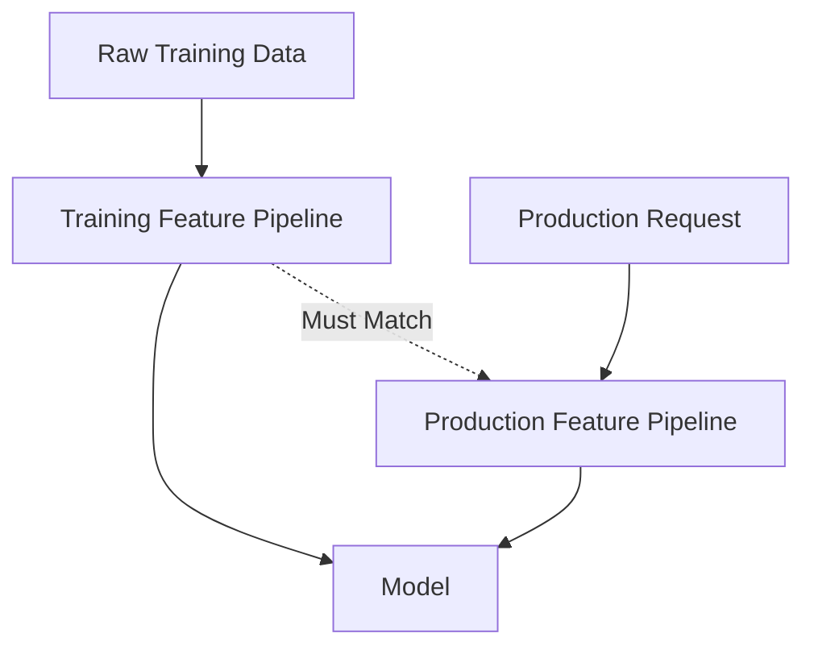

To reduce skew:

* Reuse the same transformation code.
* Save fitted preprocessing objects.
* Version feature definitions.
* Test training and production outputs.
* Monitor feature distributions.
* Document data dependencies.

---

## 35. Common Mistakes

### 35.1 Creating Features Without a Hypothesis

Do not create random features only because they are mathematically possible.

Each feature should have a reason:

```text
Hypothesis:
Older properties may have lower prices after controlling for location and area.

Feature:
property_age = sale_year - construction_year
```

---

### 35.2 Fitting Transformations on the Full Dataset

Scaling, imputation, encoding, and feature selection must be fitted only on training data.

Use pipelines.

---

### 35.3 Using Future Information

Any feature unavailable at prediction time creates leakage.

This is especially common in:

* Time series.
* Churn prediction.
* Fraud detection.
* Credit risk.
* Medical prediction.

---

### 35.4 Treating Categories as Arbitrary Integers

Encoding unordered categories as `1, 2, 3` introduces a false order.

Use one-hot encoding or another appropriate method.

---

### 35.5 Ignoring Unknown Categories

Production data may contain categories not present during training.

Use:

```python
OneHotEncoder(handle_unknown="ignore")
```

or define an `"unknown"` category.

---

### 35.6 Creating Too Many Features

Excessive features can cause:

* Overfitting.
* Slower training.
* Higher memory usage.
* More difficult debugging.
* Harder deployment.
* Increased monitoring complexity.

Prefer useful and maintainable features.

---

### 35.7 Using IDs as Predictive Features

User IDs, transaction IDs, and row numbers may allow memorization but usually do not generalize.

Ask whether the ID represents useful structure or only identity.

---

### 35.8 Evaluating Features on the Test Set Repeatedly

Feature selection should use training data and cross-validation.

The final test set should remain untouched until the model and features have been selected.

---

### 35.9 Forgetting Business Meaning

A feature may improve the score but be:

* Unavailable during inference.
* Expensive to calculate.
* Legally restricted.
* Difficult to explain.
* Unstable over time.
* Unfair to certain groups.

Model performance is only one part of feature quality.

---

## 36. Feature Engineering Evaluation Framework

Evaluate every important feature using four dimensions.

### Predictive Value

* Does it improve cross-validation performance?
* Does it reduce important business errors?
* Is the improvement stable across folds?

### Availability

* Is it available at prediction time?
* Is it available for every entity?
* How frequently is it updated?

### Reliability

* Is the source trustworthy?
* Can the feature change unexpectedly?
* How much missing data does it contain?

### Operational Cost

* Is it expensive to calculate?
* Does it increase prediction latency?
* Does it require an external service?
* Is it difficult to monitor?

A high-performing feature may still be rejected if it is operationally unreliable.

---

## 37. Suggested End-to-End Workflow

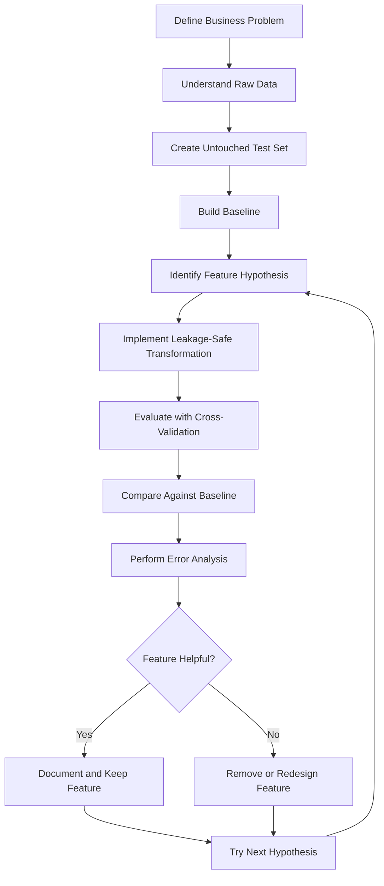

---

## 38. Practical Exercise

### Dataset

Use a house price dataset containing:

* Sale price.
* Living area.
* Land area.
* Bedrooms.
* Bathrooms.
* Construction year.
* Renovation year.
* Property type.
* District.
* Sale date.
* Distance to city center.

---

### Task 1: Build a Baseline

Train a baseline model using only the original features.

Possible models:

* Median prediction baseline.
* Linear Regression.
* Random Forest.

Evaluate with five-fold cross-validation using:

* MAE.
* RMSE.
* (R^2).

---

### Task 2: Create Age Features

Create:

```python
df["property_age"] = (
    df["sale_year"]
    - df["construction_year"]
)

df["is_renovated"] = (
    df["renovation_year"].notna()
).astype(int)

df["years_since_renovation"] = (
    df["sale_year"]
    - df["renovation_year"]
)
```

Handle invalid cases such as:

* Negative property age.
* Renovation before construction.
* Renovation after sale.
* Missing sale date.

---

### Task 3: Create Ratio Features

Create at least two features:

```python
df["area_per_bedroom"] = (
    df["living_area"]
    / df["bedrooms"].replace(0, np.nan)
)

df["bathroom_bedroom_ratio"] = (
    df["bathrooms"]
    / df["bedrooms"].replace(0, np.nan)
)

df["land_utilization"] = (
    df["living_area"]
    / df["land_area"].replace(0, np.nan)
)
```

---

### Task 4: Create Time Features

From the sale date, extract:

```python
df["sale_year"] = df["sale_date"].dt.year
df["sale_month"] = df["sale_date"].dt.month
df["sale_quarter"] = df["sale_date"].dt.quarter
```

Optionally add cyclical month encoding:

```python
df["sale_month_sin"] = np.sin(
    2 * np.pi * df["sale_month"] / 12
)

df["sale_month_cos"] = np.cos(
    2 * np.pi * df["sale_month"] / 12
)
```

---

### Task 5: Build a Leakage-Safe Pipeline

The pipeline should contain:

```text
custom feature construction
    -> missing-value imputation
    -> categorical encoding
    -> numerical scaling if needed
    -> model
```

Evaluate the complete pipeline using cross-validation.

---

### Task 6: Compare Experiments

Create an experiment table:

| Experiment   | Features                | Mean CV RMSE | CV Std. | Mean CV MAE |
| ------------ | ----------------------- | -----------: | ------: | ----------: |
| Baseline     | Raw fields              |              |         |             |
| Experiment 1 | Raw + age               |              |         |             |
| Experiment 2 | Raw + ratios            |              |         |             |
| Experiment 3 | Raw + time              |              |         |             |
| Experiment 4 | All engineered features |              |         |             |

Choose the final feature set based on:

* Mean performance.
* Score stability.
* Feature availability.
* Complexity.
* Business value.

---

### Task 7: Perform Error Analysis

Generate out-of-fold predictions and inspect errors by:

* District.
* Property type.
* Price range.
* Property age group.
* Renovation status.
* Missing-value patterns.

Questions to investigate:

```text
Does the model underestimate luxury properties?

Are older properties harder to predict?

Does the model perform worse in districts with fewer examples?

Are properties with missing renovation data associated with larger errors?

Do ratio features improve predictions for unusually large houses?
```

---

## 39. Feature Experiment Template

```markdown
## Feature Experiment

### Experiment Name

Property Age and Renovation Features

### Hypothesis

Property age and renovation recency provide more useful information than raw construction and renovation years.

### New Features

- property_age
- is_renovated
- years_since_renovation

### Definitions

property_age = sale_year - construction_year

years_since_renovation = sale_year - renovation_year

### Leakage Check

- Uses only information available at sale time.
- Does not use sale price.
- Does not use validation-set statistics.
- Implemented inside the preprocessing pipeline.

### Baseline Result

- Mean CV RMSE:
- CV standard deviation:
- Mean CV MAE:

### New Result

- Mean CV RMSE:
- CV standard deviation:
- Mean CV MAE:

### Error Analysis

- Improved segments:
- Degraded segments:
- Unexpected behavior:

### Decision

Keep, remove, or redesign the features.

### Next Experiment

Add area-per-bedroom and land-utilization features.
```

---

## 40. Feature Documentation Template

Each production feature should be documented.

| Field              | Description                      |
| ------------------ | -------------------------------- |
| Feature name       | `property_age`                   |
| Definition         | `sale_year - construction_year`  |
| Data type          | Integer                          |
| Unit               | Years                            |
| Source fields      | `sale_year`, `construction_year` |
| Availability       | Prediction time                  |
| Missing-value rule | Median imputation                |
| Valid range        | 0-200                            |
| Update frequency   | Per prediction                   |
| Leakage risk       | Low                              |
| Owner              | Data science team                |
| Version            | 1.0                              |

Feature documentation improves:

* Reproducibility.
* Collaboration.
* Deployment.
* Monitoring.
* Debugging.

---

## 41. Completion Checklist

* [ ] I can explain feature engineering in one or two minutes.
* [ ] I understand the difference between raw fields and model-ready features.
* [ ] I can create numerical, categorical, temporal, and interaction features.
* [ ] I know when scaling is necessary.
* [ ] I can choose an appropriate categorical encoding method.
* [ ] I can create ratio features safely.
* [ ] I can extract useful information from dates and timestamps.
* [ ] I understand cyclical encoding.
* [ ] I can identify possible target and time leakage.
* [ ] I fit preprocessing operations only on training data.
* [ ] I use pipelines during cross-validation.
* [ ] I have compared raw features with engineered features.
* [ ] I have performed at least one feature ablation experiment.
* [ ] I have documented the definition and assumptions of important features.
* [ ] I have considered whether each feature is available in production.
* [ ] I have recorded at least one caveat or next feature hypothesis.
* [ ] I have created a notebook, chart, model, API, or portfolio artifact for this lesson.

---

## 42. Key Takeaways

1. Feature engineering transforms raw data into useful model inputs.

2. Strong features represent the real structure of the business problem.

3. Common techniques include scaling, encoding, aggregation, binning, ratios, interactions, and time extraction.

4. Different models require different preprocessing strategies.

5. Domain knowledge is often more valuable than creating arbitrary mathematical transformations.

6. Data-dependent transformations must be fitted only on training data.

7. Pipelines help prevent data leakage and training-serving skew.

8. Target encoding, historical aggregations, and time-based features require special care.

9. More features do not automatically produce a better model.

10. Every feature should be tested through a reproducible experiment.

11. Cross-validation should be used to compare feature sets.

12. Feature availability, reliability, fairness, latency, and maintenance cost matter in production.

---

## 43. Related Outcome

Train, compare, and evaluate supervised and unsupervised machine learning models using:

* Thoughtful feature engineering.
* Leakage-safe preprocessing.
* Appropriate evaluation metrics.
* Cross-validation.
* Error analysis.
* Reproducible experiments.
* Production-aware feature design.

---

## 44. Related Project

### Mini Project: House Price Prediction

Build a complete machine learning workflow containing:

* Exploratory Data Analysis.
* Missing-value analysis.
* Numerical and categorical preprocessing.
* Property age features.
* Renovation features.
* Ratio and interaction features.
* Date and seasonal features.
* Median prediction baseline.
* Linear Regression.
* Random Forest.
* XGBoost or Gradient Boosting.
* Five-fold cross-validation.
* MAE, RMSE, and (R^2) comparison.
* Feature ablation.
* Out-of-fold error analysis.
* Final test evaluation.
* Prediction API or portfolio report.

Suggested project structure:

```text
house-price-project/
├── data/
│   ├── raw/
│   └── processed/
├── notebooks/
│   ├── 01_eda.ipynb
│   ├── 02_baseline.ipynb
│   ├── 03_feature_engineering.ipynb
│   ├── 04_model_comparison.ipynb
│   └── 05_error_analysis.ipynb
├── src/
│   ├── features.py
│   ├── preprocessing.py
│   ├── train.py
│   ├── evaluate.py
│   └── predict.py
├── models/
├── reports/
│   ├── feature_dictionary.md
│   ├── feature_experiments.csv
│   └── model_comparison.csv
├── tests/
│   └── test_features.py
├── app.py
├── requirements.txt
└── README.md
```

---

## 45. Conclusion

**Feature engineering** is one of the most important stages of a machine learning workflow.

It connects raw data with the business concepts that a model needs to understand. A strong feature may allow a simple model to outperform a complex model trained on poorly represented data.

A reliable feature engineering process includes:

```text
business understanding
    + data quality checks
    + meaningful feature hypotheses
    + leakage-safe transformations
    + pipeline implementation
    + cross-validation
    + feature ablation
    + error analysis
    + production monitoring
```

Turn this lesson into a practical artifact such as:

* A feature engineering notebook.
* A reusable preprocessing pipeline.
* A feature dictionary.
* A feature ablation report.
* A model comparison chart.
* A trained model.
* A prediction API.
* A Docker service.
* A portfolio project.

The goal is not to create the largest possible number of features. The goal is to create reliable, meaningful, and maintainable features that help the model solve a real problem.
````

### 4. `01 - AI & Dữ liệu/02 - Data Science, Analytics & ML/ai-data-scientist-roadmap/AI-Data-Scientist-Roadmap-Course/00 - Roadmap.sh AI Data Scientist Official/03 - Machine Learning and Deep Learning/Module 06 - Machine Learning/06-Select/033 - Model Selection.md`

Nguồn: `01 - AI & Dữ liệu/02 - Data Science, Analytics & ML/ai-data-scientist-roadmap/AI-Data-Scientist-Roadmap-Course/00 - Roadmap.sh AI Data Scientist Official/03 - Machine Learning and Deep Learning/Module 06 - Machine Learning/06-Select/033 - Model Selection.md`

````markdown
# 033 - Model Selection

**Course:** 03 - Machine Learning and Deep Learning
**Module:** Module 06 - Machine Learning
**Content Group:** Feature Engineering
**Roadmap Source:** Machine Learning / Feature Engineering
**Lesson Type:** Machine Learning
**Order in Module:** 033
**Suggested Duration:** 26 minutes

---

## 1. Summary

**Model Selection** is the process of comparing candidate machine learning models and choosing the one that best satisfies the technical and business requirements of a problem.

The goal is not simply to choose the model with the highest score. A good model should also be:

* Reliable on unseen data
* Appropriate for the business objective
* Resistant to overfitting
* Fast enough for production
* Easy enough to maintain
* Explainable when required
* Compatible with available data and infrastructure

A typical model-selection process compares:

* A simple baseline
* Several model families
* Different feature sets
* Different hyperparameters
* Multiple evaluation metrics
* Training and inference costs
* Model stability across validation folds

The central question is:

> Which model provides the best balance between predictive performance, complexity, reliability, and business value?

---

## 2. Learning Objectives

After completing this lesson, you should be able to:

* Explain model selection in your own words.
* Distinguish model selection from model training and hyperparameter tuning.
* Establish an appropriate baseline.
* Choose evaluation metrics based on the business problem.
* Compare multiple model families fairly.
* Use validation sets and cross-validation correctly.
* Recognize underfitting and overfitting.
* Avoid data leakage during model comparison.
* Select models using both technical and operational criteria.
* Build a reproducible model-selection pipeline.
* Document experiments and justify the final model choice.

---

## 3. What Is Model Selection?

Suppose you want to predict house prices.

Possible candidate models include:

```text
Mean-price baseline
Linear Regression
Ridge Regression
Decision Tree
Random Forest
Gradient Boosting
XGBoost
Neural Network
```

Each model has different properties.

| Model             | Strength                   | Limitation                          |
| ----------------- | -------------------------- | ----------------------------------- |
| Linear Regression | Fast and interpretable     | Assumes mostly linear relationships |
| Decision Tree     | Easy to visualize          | Can overfit                         |
| Random Forest     | Strong general performance | Larger and less interpretable       |
| Gradient Boosting | High predictive power      | Requires careful tuning             |
| Neural Network    | Can model complex patterns | Requires more data and computation  |

Model selection compares these candidates under the same experimental conditions.

Formally, suppose the candidate model set is:

$$
\mathcal{M} = {M_1, M_2, \ldots, M_k}
$$

The selected model is:

$$
M^* = \arg\max_{M_i \in \mathcal{M}} \text{Score}(M_i)
$$

For an error metric such as MAE or RMSE, the objective becomes:

$$
M^* = \arg\min_{M_i \in \mathcal{M}} \text{Error}(M_i)
$$

In practice, model selection is usually a multi-objective decision:

$$
M^* = f( \text{performance}, \text{latency}, \text{cost}, \text{stability}, \text{interpretability} )
$$

---

## 4. Model Selection in the Machine Learning Workflow


A good workflow separates:

* Model development
* Model comparison
* Final unbiased evaluation

The test set should not be used repeatedly during model selection.

---

## 5. Model Selection vs. Related Concepts

### 5.1 Model Training

Model training estimates model parameters from data.

For Linear Regression, training learns coefficients:

$$
\hat{y} = w_0 + w_1x_1 + \cdots + w_px_p
$$

The learned values (w_0, w_1, \ldots, w_p) are model parameters.

---

### 5.2 Hyperparameter Tuning

Hyperparameters are settings chosen before or during training.

Examples include:

```text
Random Forest:
- number of trees
- maximum depth
- minimum samples per leaf

XGBoost:
- learning rate
- maximum depth
- number of estimators

KNN:
- number of neighbors
- distance metric
```

Hyperparameter tuning searches for the best configuration of one model family.

---

### 5.3 Model Selection

Model selection can include comparing:

* Different model families
* Different preprocessing strategies
* Different feature sets
* Different hyperparameters
* Different decision thresholds

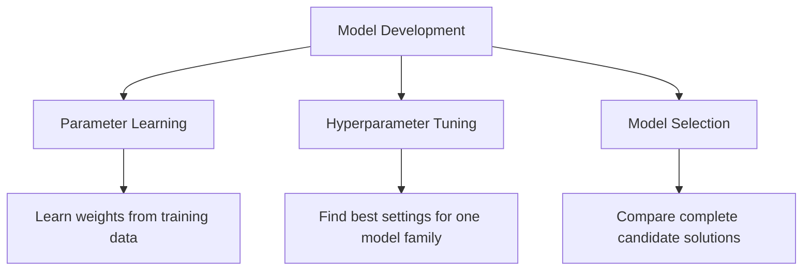

---

## 6. Start with the Business Problem

Before comparing models, define the actual decision the model will support.

Examples:

| Problem                | Prediction             | Business Decision           |
| ---------------------- | ---------------------- | --------------------------- |
| House price prediction | Estimated sale price   | Pricing and investment      |
| Customer churn         | Probability of leaving | Retention campaign          |
| Fraud detection        | Probability of fraud   | Block or review transaction |
| Medical screening      | Disease risk           | Request further examination |
| Demand forecasting     | Future demand          | Inventory planning          |

A technically strong model can still fail if it solves the wrong problem.

Important questions include:

* What decision will use the prediction?
* What is the cost of a false positive?
* What is the cost of a false negative?
* How quickly must predictions be produced?
* Does the model need to be explainable?
* How frequently will it be retrained?
* Which data will be available at inference time?

---

## 7. Establishing a Baseline

A baseline is a simple reference model used to judge whether a more complex model provides meaningful improvement.

Without a baseline, a score has little context.

---

### 7.1 Regression Baselines

A common regression baseline predicts the training-set mean:

$$
\hat{y}_i = \bar{y}_{\text{train}}
$$

Another option is the median:

$$
\hat{y}_i = \text{median}(y_{\text{train}})
$$

The median is often more robust to outliers.

```python
from sklearn.dummy import DummyRegressor
from sklearn.metrics import mean_absolute_error

baseline = DummyRegressor(strategy="median")
baseline.fit(X_train, y_train)

predictions = baseline.predict(X_valid)

mae = mean_absolute_error(y_valid, predictions)

print("Baseline MAE:", mae)
```

---

### 7.2 Classification Baselines

Common classification baselines include:

* Predict the majority class
* Predict according to class frequencies
* Predict randomly
* Use a simple rule-based system

```python
from sklearn.dummy import DummyClassifier
from sklearn.metrics import classification_report

baseline = DummyClassifier(
    strategy="most_frequent"
)

baseline.fit(X_train, y_train)

predictions = baseline.predict(X_valid)

print(classification_report(y_valid, predictions))
```

---

### 7.3 Why the Baseline Matters

Suppose a classification model achieves:

```text
Accuracy = 92%
```

This may appear strong.

However, if 95% of the data belongs to one class, a majority-class baseline achieves:

```text
Accuracy = 95%
```

The trained model is therefore worse than the baseline.

---

## 8. Train, Validation, and Test Sets

A dataset is commonly divided into three parts.

| Dataset        | Purpose                                 |
| -------------- | --------------------------------------- |
| Training set   | Fit model parameters                    |
| Validation set | Compare models and tune hyperparameters |
| Test set       | Perform final unbiased evaluation       |

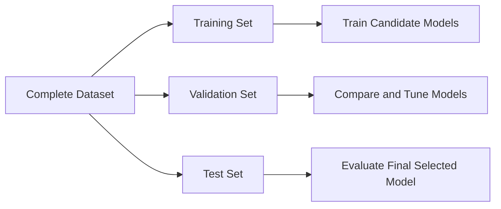

A common split is:

```text
Training:   70%
Validation: 15%
Test:       15%
```

The exact proportions depend on dataset size.

---

### Python Example

```python
from sklearn.model_selection import train_test_split

X_train_temp, X_test, y_train_temp, y_test = train_test_split(
    X,
    y,
    test_size=0.15,
    random_state=42
)

validation_ratio = 0.15 / 0.85

X_train, X_valid, y_train, y_valid = train_test_split(
    X_train_temp,
    y_train_temp,
    test_size=validation_ratio,
    random_state=42
)

print("Training samples:", len(X_train))
print("Validation samples:", len(X_valid))
print("Test samples:", len(X_test))
```

For classification, preserve the class distribution using stratification:

```python
X_train, X_test, y_train, y_test = train_test_split(
    X,
    y,
    test_size=0.20,
    stratify=y,
    random_state=42
)
```

---

## 9. Cross-Validation

A single validation split may produce unstable results.

Cross-validation evaluates a model using multiple train-validation partitions.

In (k)-fold cross-validation:

1. Divide the training data into (k) folds.
2. Train on (k-1) folds.
3. Validate on the remaining fold.
4. Repeat until every fold has been used for validation.
5. Average the scores.

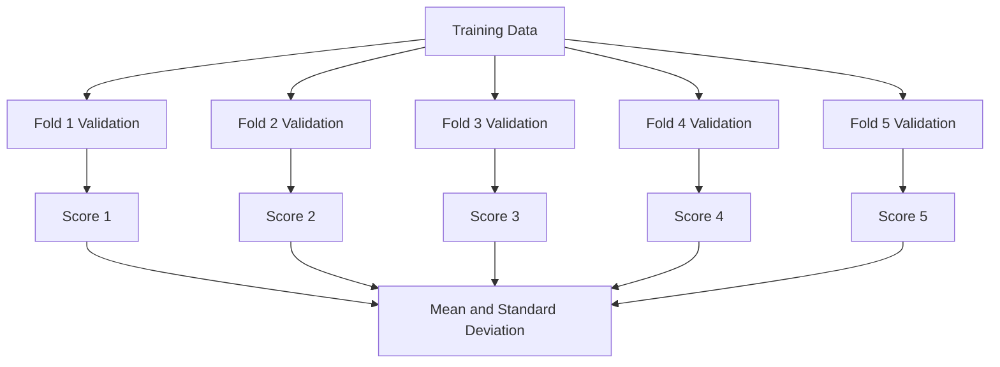

The average cross-validation score is:

$$
\bar{s} = \frac{1}{k} \sum_{i=1}^{k}s_i
$$

The standard deviation is:

$$
\sigma_s = \sqrt{ \frac{1}{k} \sum_{i=1}^{k}(s_i-\bar{s})^2 }
$$

A model with a slightly lower average score but much lower variation may be more reliable.

---

### Python Example

```python
from sklearn.model_selection import cross_validate
from sklearn.ensemble import RandomForestRegressor

model = RandomForestRegressor(
    n_estimators=300,
    random_state=42,
    n_jobs=-1
)

scores = cross_validate(
    estimator=model,
    X=X_train,
    y=y_train,
    cv=5,
    scoring={
        "mae": "neg_mean_absolute_error",
        "r2": "r2"
    },
    return_train_score=True,
    n_jobs=-1
)

mean_validation_mae = -scores["test_mae"].mean()
std_validation_mae = scores["test_mae"].std()

print("Mean validation MAE:", mean_validation_mae)
print("MAE standard deviation:", std_validation_mae)
```

---

## 10. Choosing the Correct Validation Strategy

Standard random cross-validation is not appropriate for every dataset.

### 10.1 Stratified Cross-Validation

Use stratification when classification classes are imbalanced.

```python
from sklearn.model_selection import StratifiedKFold

cv = StratifiedKFold(
    n_splits=5,
    shuffle=True,
    random_state=42
)
```

---

### 10.2 Group-Based Cross-Validation

Use group-based splitting when samples from the same entity must not appear in both training and validation sets.

Examples:

* Multiple transactions from the same customer
* Multiple images from the same patient
* Multiple records from the same machine
* Multiple observations from the same household

```python
from sklearn.model_selection import GroupKFold

cv = GroupKFold(n_splits=5)

for train_index, valid_index in cv.split(
    X,
    y,
    groups=customer_ids
):
    X_fold_train = X.iloc[train_index]
    X_fold_valid = X.iloc[valid_index]
```

---

### 10.3 Time-Series Validation

Future observations must not be used to predict the past.

Incorrect:

```text
Randomly mix 2022, 2023, and 2024 data
```

Correct:

```text
Train: January–June
Validate: July

Train: January–July
Validate: August

Train: January–August
Validate: September
```

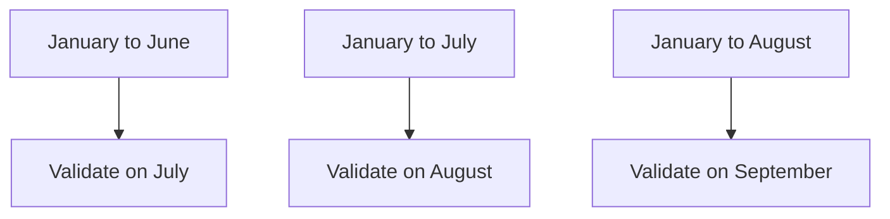

```python
from sklearn.model_selection import TimeSeriesSplit

cv = TimeSeriesSplit(n_splits=5)
```

---

## 11. Choosing Evaluation Metrics

A model should be selected using metrics that reflect the business objective.

---

## 11.1 Classification Metrics

### Accuracy

$$
\text{Accuracy} = \frac{TP+TN}{TP+TN+FP+FN}
$$

Accuracy is useful when:

* Classes are reasonably balanced.
* False positives and false negatives have similar costs.

---

### Precision

$$
\text{Precision} = \frac{TP}{TP+FP}
$$

Use precision when false positives are expensive.

Example:

```text
Do not incorrectly block legitimate financial transactions.
```

---

### Recall

$$
\text{Recall} = \frac{TP}{TP+FN}
$$

Use recall when false negatives are expensive.

Example:

```text
Detect as many fraudulent transactions as possible.
```

---

### F1-Score

$$
F_1 = 2 \cdot \frac{ \text{Precision}\cdot\text{Recall} }{ \text{Precision}+\text{Recall} }
$$

Use F1-score when precision and recall both matter.

---

### ROC-AUC

ROC-AUC evaluates how well the model ranks positive examples above negative examples across thresholds.

It is useful for comparing ranking performance, but may appear optimistic on highly imbalanced datasets.

---

### PR-AUC

Precision-Recall AUC is often more informative for rare positive classes.

Examples:

* Fraud detection
* Disease detection
* Equipment failure
* Rare-event detection

---

### Log Loss

Log loss evaluates the quality of predicted probabilities:

$$
-\frac{1}{n} \sum_{i=1}^{n} \left[ y_i\log(p_i) + (1-y_i)\log(1-p_i) \right]
$$

It penalizes confident incorrect predictions strongly.

---

## 11.2 Regression Metrics

### Mean Absolute Error

$$
MAE = \frac{1}{n} \sum_{i=1}^{n}|y_i-\hat{y}_i|
$$

MAE is easy to interpret because it uses the same unit as the target.

---

### Mean Squared Error

$$
MSE = \frac{1}{n} \sum_{i=1}^{n}(y_i-\hat{y}_i)^2
$$

MSE gives greater weight to large errors.

---

### Root Mean Squared Error

$$
RMSE = \sqrt{ \frac{1}{n} \sum_{i=1}^{n}(y_i-\hat{y}_i)^2 }
$$

RMSE has the same unit as the target while strongly penalizing large errors.

---

### R-Squared

$$
R^2 = 1- \frac{ \sum_{i=1}^{n}(y_i-\hat{y}_i)^2 }{ \sum_{i=1}^{n}(y_i-\bar{y})^2 }
$$

(R^2) measures how much variance is explained relative to a mean baseline.

---

## 12. Underfitting and Overfitting

Model selection must balance bias and variance.

---

### 12.1 Underfitting

A model underfits when it is too simple to learn the important patterns.

Typical signs:

```text
Training performance: poor
Validation performance: poor
```

Examples:

* Linear model for a strongly nonlinear relationship
* Very shallow decision tree
* Excessively strong regularization

---

### 12.2 Overfitting

A model overfits when it learns training-specific noise.

Typical signs:

```text
Training performance: excellent
Validation performance: poor
```

Examples:

* Very deep decision tree
* Too many polynomial features
* Excessively complex neural network
* Hyperparameter search that overuses one validation set

---

### 12.3 Good Generalization

```text
Training performance: strong
Validation performance: similarly strong
```

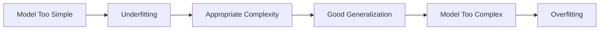

---

## 13. Bias-Variance Trade-Off

Prediction error can be viewed conceptually as:

$$
\text{Expected Error} = \text{Bias}^2 + \text{Variance} + \text{Irreducible Noise}
$$

### High Bias

The model makes overly simple assumptions.

```text
Likely result: underfitting
```

### High Variance

The model changes too much when the training data changes.

```text
Likely result: overfitting
```

The selected model should provide a reasonable balance.

---

## 14. Comparing Candidate Models

A fair comparison requires:

* The same training data
* The same validation folds
* The same preprocessing rules
* The same feature availability
* The same evaluation metric
* Reproducible random seeds
* Similar tuning effort

Example candidate models for regression:

```python
from sklearn.linear_model import LinearRegression, Ridge
from sklearn.ensemble import (
    RandomForestRegressor,
    GradientBoostingRegressor
)

models = {
    "linear_regression": LinearRegression(),
    "ridge": Ridge(alpha=1.0),
    "random_forest": RandomForestRegressor(
        n_estimators=300,
        random_state=42,
        n_jobs=-1
    ),
    "gradient_boosting": GradientBoostingRegressor(
        random_state=42
    )
}
```

---

## 15. Practical Model Comparison

```python
import pandas as pd

from sklearn.model_selection import cross_validate, KFold
from sklearn.pipeline import Pipeline
from sklearn.impute import SimpleImputer
from sklearn.preprocessing import StandardScaler
from sklearn.linear_model import LinearRegression, Ridge
from sklearn.ensemble import (
    RandomForestRegressor,
    GradientBoostingRegressor
)

models = {
    "linear_regression": LinearRegression(),
    "ridge": Ridge(alpha=1.0),
    "random_forest": RandomForestRegressor(
        n_estimators=300,
        random_state=42,
        n_jobs=-1
    ),
    "gradient_boosting": GradientBoostingRegressor(
        random_state=42
    )
}

cv = KFold(
    n_splits=5,
    shuffle=True,
    random_state=42
)

results = []

for model_name, model in models.items():
    pipeline = Pipeline([
        (
            "imputer",
            SimpleImputer(strategy="median")
        ),
        (
            "scaler",
            StandardScaler()
        ),
        (
            "model",
            model
        )
    ])

    scores = cross_validate(
        pipeline,
        X_train,
        y_train,
        cv=cv,
        scoring={
            "mae": "neg_mean_absolute_error",
            "rmse": "neg_root_mean_squared_error",
            "r2": "r2"
        },
        return_train_score=True,
        n_jobs=-1
    )

    results.append({
        "model": model_name,
        "train_mae": -scores["train_mae"].mean(),
        "validation_mae": -scores["test_mae"].mean(),
        "validation_mae_std": scores["test_mae"].std(),
        "validation_rmse": -scores["test_rmse"].mean(),
        "validation_r2": scores["test_r2"].mean()
    })

results_table = (
    pd.DataFrame(results)
    .sort_values("validation_mae")
)

print(results_table)
```

### Important Note

Scaling is essential for models such as:

* Linear Regression with regularization
* Logistic Regression
* Support Vector Machines
* K-Nearest Neighbors
* Neural Networks

Tree-based models usually do not require scaling. A real comparison may therefore use separate preprocessing pipelines for different model families.

---

## 16. Using a Column Transformer

Datasets often contain both numerical and categorical features.

```python
from sklearn.compose import ColumnTransformer
from sklearn.pipeline import Pipeline
from sklearn.preprocessing import (
    OneHotEncoder,
    StandardScaler
)
from sklearn.impute import SimpleImputer
from sklearn.linear_model import Ridge

numeric_features = [
    "area",
    "bedrooms",
    "bathrooms",
    "building_age"
]

categorical_features = [
    "location",
    "property_type"
]

numeric_pipeline = Pipeline([
    (
        "imputer",
        SimpleImputer(strategy="median")
    ),
    (
        "scaler",
        StandardScaler()
    )
])

categorical_pipeline = Pipeline([
    (
        "imputer",
        SimpleImputer(strategy="most_frequent")
    ),
    (
        "encoder",
        OneHotEncoder(
            handle_unknown="ignore"
        )
    )
])

preprocessor = ColumnTransformer([
    (
        "numeric",
        numeric_pipeline,
        numeric_features
    ),
    (
        "categorical",
        categorical_pipeline,
        categorical_features
    )
])

model_pipeline = Pipeline([
    (
        "preprocessor",
        preprocessor
    ),
    (
        "model",
        Ridge(alpha=1.0)
    )
])

model_pipeline.fit(X_train, y_train)
```

Using pipelines ensures that preprocessing is learned only from training data.

---

## 17. Hyperparameter Tuning

After identifying promising model families, tune their hyperparameters.

Common search strategies include:

* Grid Search
* Random Search
* Bayesian Optimization
* Successive Halving
* Optuna-style optimization

---

### 17.1 Grid Search

Grid Search evaluates every specified combination.

```python
from sklearn.model_selection import GridSearchCV
from sklearn.ensemble import RandomForestRegressor

pipeline = Pipeline([
    (
        "preprocessor",
        preprocessor
    ),
    (
        "model",
        RandomForestRegressor(
            random_state=42,
            n_jobs=-1
        )
    )
])

parameter_grid = {
    "model__n_estimators": [100, 300],
    "model__max_depth": [None, 10, 20],
    "model__min_samples_leaf": [1, 3, 5]
}

search = GridSearchCV(
    estimator=pipeline,
    param_grid=parameter_grid,
    scoring="neg_mean_absolute_error",
    cv=5,
    n_jobs=-1
)

search.fit(X_train, y_train)

print("Best parameters:", search.best_params_)
print("Best CV MAE:", -search.best_score_)
```

Grid Search can become expensive when many hyperparameters are included.

---

### 17.2 Random Search

Random Search evaluates randomly sampled combinations.

```python
from sklearn.model_selection import RandomizedSearchCV

parameter_distributions = {
    "model__n_estimators": [100, 200, 300, 500],
    "model__max_depth": [None, 5, 10, 20, 30],
    "model__min_samples_leaf": [1, 2, 3, 5, 10],
    "model__max_features": [
        "sqrt",
        "log2",
        None
    ]
}

search = RandomizedSearchCV(
    estimator=pipeline,
    param_distributions=parameter_distributions,
    n_iter=20,
    scoring="neg_mean_absolute_error",
    cv=5,
    random_state=42,
    n_jobs=-1
)

search.fit(X_train, y_train)
```

Random Search is often more efficient when the search space is large.

---

## 18. Nested Cross-Validation

When datasets are small, the same cross-validation process can accidentally be used both for tuning and performance estimation.

Nested cross-validation separates these tasks.

```mermaid
flowchart TD
    A[Complete Training Data] --> B[Outer Fold]
    B --> C[Outer Training Portion]
    B --> D[Outer Validation Portion]

    C --> E[Inner Cross-Validation]
    E --> F[Hyperparameter Tuning]
    F --> G[Best Configuration]

    G --> H[Train on Outer Training Portion]
    H --> I[Evaluate on Outer Validation Portion]
```

The inner loop tunes hyperparameters.

The outer loop estimates generalization performance.

Nested cross-validation is useful when:

* The dataset is small.
* Hyperparameter tuning is extensive.
* A reliable comparison is required.
* Model-selection bias is a concern.

---

## 19. Model Selection for Classification

Possible candidate models include:

```text
Dummy Classifier
Logistic Regression
Decision Tree
Random Forest
Support Vector Machine
Gradient Boosting
XGBoost
Neural Network
```

### Example

```python
import pandas as pd

from sklearn.model_selection import (
    StratifiedKFold,
    cross_validate
)
from sklearn.pipeline import Pipeline
from sklearn.preprocessing import StandardScaler
from sklearn.linear_model import LogisticRegression
from sklearn.ensemble import (
    RandomForestClassifier,
    GradientBoostingClassifier
)
from sklearn.svm import SVC

models = {
    "logistic_regression": LogisticRegression(
        max_iter=3000,
        class_weight="balanced"
    ),
    "random_forest": RandomForestClassifier(
        n_estimators=300,
        class_weight="balanced",
        random_state=42,
        n_jobs=-1
    ),
    "gradient_boosting": GradientBoostingClassifier(
        random_state=42
    ),
    "svm": SVC(
        probability=True,
        class_weight="balanced",
        random_state=42
    )
}

cv = StratifiedKFold(
    n_splits=5,
    shuffle=True,
    random_state=42
)

results = []

for model_name, model in models.items():
    pipeline = Pipeline([
        (
            "scaler",
            StandardScaler()
        ),
        (
            "model",
            model
        )
    ])

    scores = cross_validate(
        pipeline,
        X_train,
        y_train,
        cv=cv,
        scoring={
            "precision": "precision",
            "recall": "recall",
            "f1": "f1",
            "roc_auc": "roc_auc"
        },
        n_jobs=-1
    )

    results.append({
        "model": model_name,
        "precision": scores["test_precision"].mean(),
        "recall": scores["test_recall"].mean(),
        "f1": scores["test_f1"].mean(),
        "roc_auc": scores["test_roc_auc"].mean()
    })

comparison = (
    pd.DataFrame(results)
    .sort_values("f1", ascending=False)
)

print(comparison)
```

---

## 20. Model Selection for Regression

Possible candidate models include:

```text
Dummy Regressor
Linear Regression
Ridge
Lasso
Decision Tree
Random Forest
Gradient Boosting
XGBoost
Neural Network
```

Models should be compared using relevant metrics such as:

* MAE
* RMSE
* (R^2)
* Training time
* Prediction latency
* Model size

Example comparison table:

| Model             | CV MAE | CV RMSE | CV (R^2) | Training Time |
| ----------------- | -----: | ------: | -------: | ------------: |
| Median baseline   | 48,200 |  72,400 |    -0.01 |        0.01 s |
| Linear Regression | 31,100 |  47,300 |     0.69 |        0.04 s |
| Random Forest     | 22,600 |  35,700 |     0.82 |        3.80 s |
| Gradient Boosting | 21,900 |  34,800 |     0.84 |        1.90 s |

The Gradient Boosting model has the best average performance, but the final decision should still consider deployment requirements.

---

## 21. Model Selection for Unsupervised Learning

Model selection is more difficult in unsupervised learning because there may be no ground-truth target.

For clustering, compare:

* K-Means
* Hierarchical Clustering
* DBSCAN
* Gaussian Mixture Models

Possible evaluation criteria include:

* Silhouette score
* Davies-Bouldin score
* Calinski-Harabasz score
* Cluster stability
* Business usefulness
* Interpretability

### Silhouette Score

For sample (i):

$$
s(i) = \frac{b(i)-a(i)} {\max(a(i),b(i))}
$$

where:

* (a(i)) is the average distance to samples in the same cluster.
* (b(i)) is the average distance to the nearest other cluster.

The score ranges from (-1) to (1).

Higher values generally indicate better separation.

```python
from sklearn.cluster import KMeans
from sklearn.metrics import silhouette_score

results = []

for number_of_clusters in range(2, 11):
    model = KMeans(
        n_clusters=number_of_clusters,
        random_state=42,
        n_init="auto"
    )

    labels = model.fit_predict(X_scaled)

    score = silhouette_score(
        X_scaled,
        labels
    )

    results.append({
        "clusters": number_of_clusters,
        "silhouette_score": score
    })

print(pd.DataFrame(results))
```

A high internal clustering score does not guarantee that the clusters are useful for the business.

---

## 22. Decision Threshold Selection

For binary classification, the default probability threshold is commonly:

$$
0.5
$$

However, the best threshold depends on business costs.

```text
Probability >= threshold → positive class
Probability < threshold  → negative class
```

A fraud-detection system may lower the threshold to increase recall.

A system that automatically blocks customers may raise the threshold to increase precision.

---

### Python Example

```python
import numpy as np

from sklearn.metrics import (
    precision_score,
    recall_score,
    f1_score
)

probabilities = model.predict_proba(X_valid)[:, 1]

threshold_results = []

for threshold in np.arange(0.10, 0.91, 0.05):
    predictions = (
        probabilities >= threshold
    ).astype(int)

    threshold_results.append({
        "threshold": threshold,
        "precision": precision_score(
            y_valid,
            predictions,
            zero_division=0
        ),
        "recall": recall_score(
            y_valid,
            predictions,
            zero_division=0
        ),
        "f1": f1_score(
            y_valid,
            predictions,
            zero_division=0
        )
    })

threshold_table = pd.DataFrame(
    threshold_results
)

print(threshold_table)
```

Threshold selection is part of selecting the complete prediction system, not only the underlying algorithm.

---

## 23. Probability Calibration

Two models can have similar accuracy but different probability quality.

Example:

```text
Model A predicts 0.90 and is correct about 90% of the time.
Model B predicts 0.90 and is correct only 65% of the time.
```

Model A is better calibrated.

Calibration matters when probabilities are used for:

* Risk ranking
* Pricing
* Medical decisions
* Resource allocation
* Expected-value calculations

Possible calibration methods include:

* Platt scaling
* Isotonic regression
* Sigmoid calibration

```python
from sklearn.calibration import CalibratedClassifierCV

calibrated_model = CalibratedClassifierCV(
    estimator=base_model,
    method="isotonic",
    cv=5
)

calibrated_model.fit(X_train, y_train)
```

---

## 24. Error Analysis

Aggregate metrics do not explain where a model fails.

After comparing candidate models, inspect:

* False positives
* False negatives
* Largest regression errors
* Performance across important subgroups
* Errors across time periods
* Errors on rare cases
* Differences between model predictions

```mermaid
flowchart TD
    A[Candidate Model Results] --> B[Find Incorrect Predictions]
    B --> C[False Positives]
    B --> D[False Negatives]
    B --> E[Large Regression Errors]
    B --> F[Subgroup Performance]

    C --> G[Identify Patterns]
    D --> G
    E --> G
    F --> G

    G --> H[Improve Features or Model]
```

---

### Regression Error Analysis

```python
error_table = X_valid.copy()

error_table["actual"] = y_valid
error_table["prediction"] = predictions
error_table["absolute_error"] = (
    error_table["actual"]
    - error_table["prediction"]
).abs()

largest_errors = error_table.sort_values(
    "absolute_error",
    ascending=False
).head(20)

print(largest_errors)
```

---

### Classification Error Analysis

```python
error_table = X_valid.copy()

error_table["actual"] = y_valid
error_table["prediction"] = predictions
error_table["probability"] = probabilities

false_positives = error_table[
    (error_table["actual"] == 0)
    & (error_table["prediction"] == 1)
]

false_negatives = error_table[
    (error_table["actual"] == 1)
    & (error_table["prediction"] == 0)
]
```

---

## 25. Subgroup Evaluation

A model may perform well overall but poorly for an important group.

Examples of groups include:

* Geographic region
* Product category
* Customer segment
* Device type
* Time period
* Price range
* New versus existing customers

Example:

| Segment       | Samples |    MAE |
| ------------- | ------: | -----: |
| Apartments    |   2,100 | 18,400 |
| Townhouses    |     900 | 24,700 |
| Luxury houses |     300 | 61,900 |

The overall MAE may hide poor performance on luxury properties.

Model selection should consider whether the model is reliable for the groups that matter most.

---

## 26. Statistical and Practical Significance

A small metric difference may not justify selecting a more complex model.

Example:

| Model               | Mean CV F1 | Prediction Latency |
| ------------------- | ---------: | -----------------: |
| Logistic Regression |      0.841 |               3 ms |
| Gradient Boosting   |      0.846 |              48 ms |

The improvement is:

$$
0.846 - 0.841 = 0.005
$$

This may not justify:

* Sixteen times higher latency
* More difficult explanations
* Increased maintenance
* More complex deployment

The final choice should consider whether the improvement is practically meaningful.

---

## 27. Operational Selection Criteria

Predictive performance is only one dimension.

A production model may also be evaluated using:

| Criterion         | Question                                      |
| ----------------- | --------------------------------------------- |
| Inference latency | Can the model respond quickly enough?         |
| Throughput        | How many predictions can it process?          |
| Model size        | Can it fit on the target device?              |
| Training cost     | How expensive is retraining?                  |
| Feature cost      | Are required data sources expensive?          |
| Interpretability  | Can predictions be explained?                 |
| Maintainability   | Can the team support the model?               |
| Stability         | Does performance vary across time or folds?   |
| Fairness          | Does it perform consistently across groups?   |
| Privacy           | Does it require sensitive information?        |
| Robustness        | How does it handle missing or unusual inputs? |

---

## 28. Multi-Criteria Model Selection

A weighted decision score can be used when several criteria matter.

$$
S(M) = w_pP(M) - w_lL(M) - w_cC(M) + w_iI(M) + w_sS_t(M)
$$

where:

* (P(M)): predictive performance
* (L(M)): latency
* (C(M)): cost
* (I(M)): interpretability
* (S_t(M)): stability
* (w): business-defined weights

Example decision table:

| Model               | Accuracy | Latency | Explainability | Cost   | Decision               |
| ------------------- | -------: | ------: | -------------- | ------ | ---------------------- |
| Logistic Regression |     0.88 |     Low | High           | Low    | Strong candidate       |
| Random Forest       |     0.91 |  Medium | Medium         | Medium | Strong candidate       |
| Neural Network      |     0.92 |    High | Low            | High   | Reject for current use |

The highest-scoring model is not always the most appropriate production model.

---

## 29. Data Leakage During Model Selection

Data leakage occurs when information from outside the training process influences model development.

Common sources include:

* Scaling the complete dataset before splitting
* Imputing missing values using the complete dataset
* Selecting features using all labels
* Tuning models on the test set
* Including post-outcome variables
* Mixing the same customer across train and validation
* Randomly splitting time-series data

---

### Incorrect Workflow

```mermaid
flowchart LR
    A[Complete Dataset] --> B[Preprocess All Data]
    B --> C[Select Features Using All Labels]
    C --> D[Train / Test Split]
    D --> E[Train Models]
    E --> F[Choose Best Model on Test Set]
```

This process produces overly optimistic results.

---

### Correct Workflow

```mermaid
flowchart LR
    A[Complete Dataset] --> B[Create Final Test Set]
    B --> C[Training Data]
    C --> D[Cross-Validation]
    D --> E[Fit Preprocessing Within Each Fold]
    E --> F[Train Candidate Models]
    F --> G[Select Best Model]
    G --> H[Retrain on Development Data]
    H --> I[Evaluate Once on Test Set]
```

---

## 30. Repeated Test-Set Evaluation

Every time the test set influences a model decision, it becomes part of the training process.

Incorrect process:

```text
Evaluate model A on test set
Change features
Evaluate model B on test set
Tune hyperparameters
Evaluate model C on test set
Select the best test result
```

The test result is no longer unbiased.

Correct process:

```text
Use training and validation data for all decisions
Freeze the final pipeline
Evaluate once on the test set
```

---

## 31. Reproducible Experiments

A model-selection experiment should record:

* Dataset version
* Feature version
* Split strategy
* Random seed
* Preprocessing pipeline
* Model type
* Hyperparameters
* Validation metric
* Training time
* Inference latency
* Model artifact version
* Notes and assumptions

Example experiment table:

| Run | Features   | Model             | Parameters | CV MAE | CV Std | Notes       |
| --- | ---------- | ----------------- | ---------- | -----: | -----: | ----------- |
| 001 | Raw        | Linear Regression | Default    | 31,400 |  1,200 | Baseline    |
| 002 | Engineered | Random Forest     | 300 trees  | 22,300 |    950 | Strong      |
| 003 | Selected   | XGBoost           | depth 6    | 21,700 |    910 | Best score  |
| 004 | Selected   | Ridge             | alpha 1.0  | 27,900 |    700 | Most stable |

---

## 32. End-to-End Model-Selection Example

```python
import time
import pandas as pd

from sklearn.model_selection import (
    train_test_split,
    KFold,
    cross_validate
)
from sklearn.pipeline import Pipeline
from sklearn.impute import SimpleImputer
from sklearn.preprocessing import StandardScaler
from sklearn.dummy import DummyRegressor
from sklearn.linear_model import (
    LinearRegression,
    Ridge
)
from sklearn.ensemble import (
    RandomForestRegressor,
    GradientBoostingRegressor
)
from sklearn.metrics import (
    mean_absolute_error,
    mean_squared_error,
    r2_score
)

# Split the dataset before model development
X_train, X_test, y_train, y_test = train_test_split(
    X,
    y,
    test_size=0.20,
    random_state=42
)

models = {
    "median_baseline": DummyRegressor(
        strategy="median"
    ),
    "linear_regression": LinearRegression(),
    "ridge": Ridge(alpha=1.0),
    "random_forest": RandomForestRegressor(
        n_estimators=300,
        random_state=42,
        n_jobs=-1
    ),
    "gradient_boosting": GradientBoostingRegressor(
        random_state=42
    )
}

cv = KFold(
    n_splits=5,
    shuffle=True,
    random_state=42
)

experiment_results = []

for model_name, model in models.items():
    pipeline = Pipeline([
        (
            "imputer",
            SimpleImputer(strategy="median")
        ),
        (
            "scaler",
            StandardScaler()
        ),
        (
            "model",
            model
        )
    ])

    start_time = time.perf_counter()

    scores = cross_validate(
        pipeline,
        X_train,
        y_train,
        cv=cv,
        scoring={
            "mae": "neg_mean_absolute_error",
            "rmse": "neg_root_mean_squared_error",
            "r2": "r2"
        },
        n_jobs=-1,
        return_train_score=True
    )

    elapsed_time = (
        time.perf_counter() - start_time
    )

    experiment_results.append({
        "model": model_name,
        "train_mae": -scores[
            "train_mae"
        ].mean(),
        "validation_mae": -scores[
            "test_mae"
        ].mean(),
        "validation_mae_std": scores[
            "test_mae"
        ].std(),
        "validation_rmse": -scores[
            "test_rmse"
        ].mean(),
        "validation_r2": scores[
            "test_r2"
        ].mean(),
        "cv_time_seconds": elapsed_time
    })

comparison_table = (
    pd.DataFrame(experiment_results)
    .sort_values("validation_mae")
)

print(comparison_table)

# Select the model based on validation results
best_model = Pipeline([
    (
        "imputer",
        SimpleImputer(strategy="median")
    ),
    (
        "scaler",
        StandardScaler()
    ),
    (
        "model",
        GradientBoostingRegressor(
            random_state=42
        )
    )
])

# Retrain the selected pipeline on all training data
best_model.fit(X_train, y_train)

# Final test evaluation
test_predictions = best_model.predict(X_test)

test_mae = mean_absolute_error(
    y_test,
    test_predictions
)

test_rmse = mean_squared_error(
    y_test,
    test_predictions
) ** 0.5

test_r2 = r2_score(
    y_test,
    test_predictions
)

print("Final test MAE:", test_mae)
print("Final test RMSE:", test_rmse)
print("Final test R-squared:", test_r2)
```

---

## 33. Recommended Model-Selection Strategy

```mermaid
flowchart TD
    A[Define Business Objective] --> B[Choose Primary Metric]
    B --> C[Create Train and Test Split]
    C --> D[Build Simple Baseline]
    D --> E[Create Reproducible Pipelines]
    E --> F[Compare Several Model Families]
    F --> G[Use Appropriate Cross-Validation]
    G --> H[Shortlist Promising Models]
    H --> I[Tune Hyperparameters]
    I --> J[Perform Error Analysis]
    J --> K[Evaluate Latency, Cost and Stability]
    K --> L[Select Final Pipeline]
    L --> M[Evaluate Once on Test Set]
    M --> N[Deploy and Monitor]
```

Recommended steps:

1. Define the business decision.
2. Choose one primary evaluation metric.
3. Define secondary metrics and constraints.
4. Reserve a final test set.
5. Build a simple baseline.
6. Create consistent preprocessing pipelines.
7. Compare several reasonable model families.
8. Use an appropriate cross-validation strategy.
9. Tune only promising models.
10. Analyze errors and subgroup performance.
11. Measure latency, size, and cost.
12. Select the complete model pipeline.
13. Evaluate once on the test set.
14. Document the decision and assumptions.
15. Deploy and monitor production performance.

---

## 34. Common Mistakes

### 34.1 Choosing the Model with the Best Training Score

A high training score may indicate overfitting.

Always evaluate on unseen validation data.

---

### 34.2 Using the Wrong Metric

Accuracy may be misleading for imbalanced classification.

(R^2) may not communicate actual prediction error in business units.

Choose metrics based on the decision being supported.

---

### 34.3 Selecting a Complex Model Without a Baseline

A complex model should demonstrate meaningful improvement over a simple baseline.

Complexity alone is not evidence of quality.

---

### 34.4 Tuning on the Test Set

The test set must remain independent of model-development decisions.

---

### 34.5 Applying Preprocessing Before Cross-Validation

This can leak information across folds.

Place preprocessing inside a pipeline.

---

### 34.6 Comparing Models on Different Data Splits

Candidate models should use the same validation folds.

Otherwise, score differences may come from the data split rather than the model.

---

### 34.7 Ignoring Score Variability

Compare both the average score and standard deviation.

```text
Model A: F1 = 0.84 ± 0.01
Model B: F1 = 0.85 ± 0.08
```

Model A may be more reliable despite a slightly lower mean score.

---

### 34.8 Ignoring Inference Requirements

A model that takes five seconds per prediction may be unsuitable for a real-time API.

---

### 34.9 Ignoring Feature Availability

A model cannot use a feature that does not exist at prediction time.

---

### 34.10 Selecting Models Only from One Family

Comparing only several Random Forest configurations is hyperparameter tuning, not broad model-family comparison.

Include models with different assumptions.

---

### 34.11 Tuning Every Candidate Extensively

First perform a coarse comparison.

Tune only the most promising candidates to avoid unnecessary cost.

---

### 34.12 Ignoring Error Analysis

Two models with the same aggregate metric may fail on different samples.

Review whether the errors are acceptable for the business.

---

## 35. Practical Exercise

### Dataset

Use a house-price dataset containing variables such as:

```text
area
bedrooms
bathrooms
floors
location
property_type
building_age
distance_to_city_center
school_score
crime_rate
garage
sale_price
```

---

### Task 1: Define the Objective

Write down:

* The prediction target
* The primary business metric
* The cost of large errors
* The expected inference environment

Example:

```text
Goal:
Predict sale price before a property is listed.

Primary metric:
MAE because it is easy to interpret in currency.

Secondary metric:
RMSE because large errors are especially costly.
```

---

### Task 2: Build a Baseline

Train a `DummyRegressor` using:

* Mean prediction
* Median prediction

Record MAE, RMSE, and (R^2).

---

### Task 3: Compare Candidate Models

Train at least:

* Linear Regression
* Ridge Regression
* Random Forest
* Gradient Boosting or XGBoost

Use the same five-fold cross-validation splits.

---

### Task 4: Tune Promising Models

Tune one linear model and one tree-based model.

Possible hyperparameters:

```text
Ridge:
- alpha

Random Forest:
- n_estimators
- max_depth
- min_samples_leaf

XGBoost:
- learning_rate
- max_depth
- n_estimators
- subsample
```

---

### Task 5: Create an Experiment Table

| Experiment | Model             | Features | CV MAE | CV RMSE | CV (R^2) | Training Time |
| ---------- | ----------------- | -------: | -----: | ------: | -------: | ------------: |
| Baseline   | Median            |        0 |        |         |          |               |
| Model 1    | Linear Regression |          |        |         |          |               |
| Model 2    | Ridge             |          |        |         |          |               |
| Model 3    | Random Forest     |          |        |         |          |               |
| Model 4    | XGBoost           |          |        |         |          |               |

---

### Task 6: Perform Error Analysis

Inspect:

* The ten largest absolute errors
* Errors by property type
* Errors by price range
* Errors by location
* Differences between the two strongest models

---

### Task 7: Select the Final Model

Write a short decision statement:

```text
The selected model is Gradient Boosting because it achieved the
lowest cross-validation MAE, remained stable across folds, and
met the required prediction-latency limit.

Random Forest achieved similar performance but produced a larger
model and slower inference.

Linear Regression remains the interpretability baseline.
```

---

## 36. Mini-Project Integration

## Project: House Price Prediction

```mermaid
flowchart LR
    A[House Price Dataset] --> B[Exploratory Data Analysis]
    B --> C[Data Cleaning]
    C --> D[Feature Engineering]
    D --> E[Feature Selection]
    E --> F[Baseline Model]
    F --> G[Linear Regression]
    F --> H[Random Forest]
    F --> I[XGBoost]
    G --> J[Cross-Validation]
    H --> J
    I --> J
    J --> K[Hyperparameter Tuning]
    K --> L[Error Analysis]
    L --> M[Final Model Selection]
    M --> N[FastAPI Endpoint]
    N --> O[Docker Deployment]
    O --> P[Monitoring]
```

Suggested portfolio artifacts:

* Jupyter Notebook
* Data-quality report
* Feature-engineering documentation
* Cross-validation comparison table
* Hyperparameter-search results
* Error-analysis chart
* Model-selection decision report
* Saved model pipeline
* FastAPI prediction endpoint
* Docker image
* Model card

---

## 37. Model-Selection Decision Template

Use the following template in a notebook or portfolio report:

```text
Business objective:
Primary evaluation metric:
Secondary metrics:
Validation strategy:
Baseline model:
Candidate models:
Selected feature set:
Best cross-validation result:
Cross-validation variability:
Training time:
Prediction latency:
Interpretability requirement:
Known limitations:
Selected model:
Reason for selection:
Final test result:
Next experiment:
```

---

## 38. Completion Checklist

* [ ] I can explain model selection in one or two minutes.
* [ ] I understand the difference between training, tuning, and selection.
* [ ] I can build a simple baseline.
* [ ] I can create train, validation, and test sets correctly.
* [ ] I can use cross-validation for model comparison.
* [ ] I can choose a metric based on the business problem.
* [ ] I can identify underfitting and overfitting.
* [ ] I can compare multiple model families fairly.
* [ ] I can place preprocessing inside a pipeline.
* [ ] I understand why the test set should not guide model development.
* [ ] I can perform basic hyperparameter tuning.
* [ ] I can analyze false positives, false negatives, or large errors.
* [ ] I can evaluate training time and inference latency.
* [ ] I can justify the final model using technical and business criteria.
* [ ] I have created a notebook, chart, model, API, or portfolio note.
* [ ] I have documented at least one caveat or assumption.

---

## 39. Key Takeaways

1. **Model selection chooses the complete machine learning solution, not only an algorithm.**

2. **Always begin with a simple and meaningful baseline.**

3. **Use training data to fit parameters, validation data to make decisions, and the test set for final evaluation.**

4. **Cross-validation provides a more reliable comparison than one validation split.**

5. **The validation strategy must match the data structure.**

6. **Choose metrics according to business costs and objectives.**

7. **A high training score does not guarantee good generalization.**

8. **Compare candidate models using the same data, folds, and preprocessing rules.**

9. **Place preprocessing, feature selection, and modeling inside a pipeline to prevent leakage.**

10. **The model with the highest score is not always the best production model.**

11. **Latency, cost, interpretability, stability, fairness, and maintainability also matter.**

12. **Error analysis is necessary before accepting the final model.**

13. **The test set should be evaluated only after the complete pipeline has been selected.**

---

## 40. Related Outcome

Train, compare, and evaluate supervised and unsupervised machine learning models with thoughtful feature engineering and reliable model-selection practices.

---

## 41. Related Project

**Mini Project:** House Price Prediction with:

* Exploratory Data Analysis
* Data Cleaning
* Feature Engineering
* Feature Selection
* Baseline Modeling
* Linear Regression
* Random Forest
* XGBoost
* Cross-Validation
* Hyperparameter Tuning
* Metric Comparison
* Error Analysis
* Final Model Selection
* API Deployment

---

## 42. Conclusion

**Model Selection** is a critical stage in the AI and Data Scientist workflow.

Its purpose is not merely to find the algorithm with the highest validation score. Its purpose is to select a complete solution that:

* Solves the correct business problem
* Generalizes to unseen data
* Improves meaningfully over a baseline
* Uses appropriate features and metrics
* Avoids data leakage
* Produces acceptable errors
* Meets production constraints
* Can be monitored and maintained

A successful model-selection process should answer:

```text
Which candidate models were compared?
Which validation strategy was used?
Which metric represented the business objective?
How stable were the results?
What kinds of errors did each model make?
Why was the final model selected?
Will it work reliably in production?
```

Turn this lesson into a practical artifact such as a notebook, experiment table, evaluation dashboard, trained pipeline, model card, FastAPI service, Docker deployment, or portfolio case study.
````
