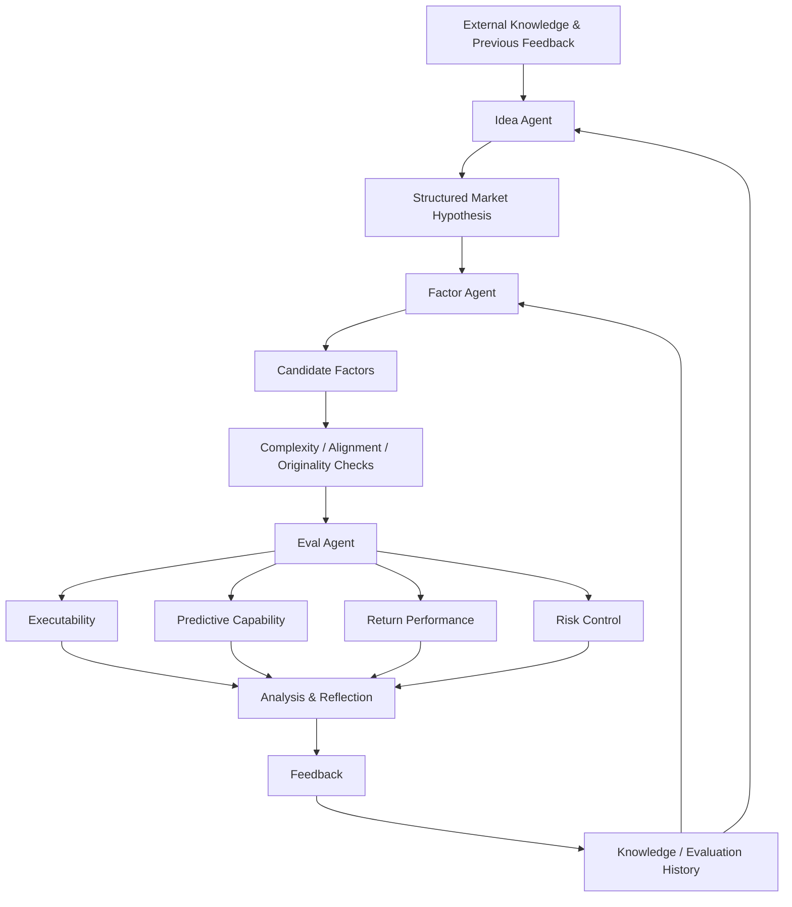

# Bài 05 - Autonomous Multi-Agent Framework

## 1. Tóm tắt

AlphaAgent không hoạt động theo mô hình một lần gọi LLM rồi nhận về một alpha expression. Hệ thống tổ chức quá trình alpha discovery thành một **closed-loop multi-agent framework** gồm ba vai trò chính:

```text
External knowledge / market insight
            ↓
        Idea Agent
            ↓
   Market hypothesis
            ↓
       Factor Agent
            ↓
   Candidate factors
            ↓
        Eval Agent
            ↓
Backtest + analysis + reflection
            ↓
         Feedback
            ↓
      Vòng tiếp theo
```

Mục tiêu của kiến trúc này là biến alpha mining thành một quá trình khám phá có khả năng **đánh giá kết quả, nhận diện failure mode và sử dụng kinh nghiệm của vòng trước để định hướng vòng sau**, thay vì sinh các factor độc lập không có trạng thái. 

Ba agent có trách nhiệm khác nhau:

* **Idea Agent** xây dựng market hypothesis;
* **Factor Agent** chuyển hypothesis thành symbolic factor;
* **Eval Agent** kiểm tra predictive capability, return, risk, executability và numerical stability. 

Điểm quan trọng nhất không nằm ở việc có “ba LLM”, mà ở **sự phân vai, state được truyền giữa các bước và feedback quay lại quá trình generation**.

---

## 2. Mục tiêu học tập

Sau bài học, người học có thể:

* giải thích được sự khác nhau giữa một lần gọi LLM và một agent loop;
* phân biệt `state`, `action`, `observation`, `evaluation` và `feedback`;
* mô tả đúng vai trò của Idea Agent, Factor Agent và Eval Agent;
* giải thích được bốn thành phần của một structured market hypothesis;
* mô tả được quá trình từ market insight đến executable factor;
* giải thích được vì sao Factor Agent cần lưu cả successful factor và failed factor;
* phân biệt feedback với reward trong Reinforcement Learning;
* giải thích được vai trò của reflection;
* mô tả được closed loop của AlphaAgent;
* giải thích được vì sao multi-agent ở đây là phân chia trách nhiệm chứ không phải nhân bản LLM;
* nhận diện được vai trò của orchestrator, state và stop condition;
* phân tích một failure và xác định agent nào cần xử lý nó.

---

## 3. Từ một lần gọi LLM đến Agent Loop

Một ứng dụng LLM đơn giản thường có dạng:

```text
Input
  ↓
Prompt
  ↓
LLM
  ↓
Response
```

Quá trình kết thúc ngay khi model trả về response.

Một agent khác ở chỗ nó duy trì một vòng hành động:

```text
Goal
  ↓
Quan sát state
  ↓
Chọn action
  ↓
Thực hiện action
  ↓
Nhận observation
  ↓
Cập nhật state
  ↓
Continue / Replan / Stop
```

Trong AlphaAgent, action có thể là:

```text
Sinh market hypothesis
Sinh candidate factor
Đánh giá factor
Chạy backtest
Phân tích failure
Cập nhật knowledge base
Refine hypothesis
```

Observation tương ứng có thể là:

```text
Factor expression
Execution error
IC / RankIC
Return
Risk metric
Originality score
Alignment result
Failure analysis
```

Một agent vì vậy không chỉ “trả lời”. Nó **quan sát kết quả của hành động trước rồi quyết định bước tiếp theo**. 

---

## 4. State, Action và Observation

Ba khái niệm này tạo nền tảng cho closed loop.

### 4.1. State

`State` là thông tin hệ thống cần giữ để biết mình đang ở đâu trong quá trình mining.

Ví dụ:

```text
Current hypothesis
Candidate factor
Constraint results
Backtest metrics
Previous failures
Evaluation history
Current evolution round
```

Có thể biểu diễn khái niệm:

```text
State_t
=
{
    hypothesis,
    candidate,
    constraints,
    evaluation_history,
    failures
}
```

Nếu không duy trì state, vòng sau không biết:

* factor nào đã thử;
* hypothesis nào đã thất bại;
* lỗi nào vừa xảy ra;
* candidate nào đã quá giống alpha cũ;
* feedback nào cần được áp dụng.

### 4.2. Action

`Action` là việc hệ thống thực hiện dựa trên state hiện tại.

Ví dụ:

```text
generate_hypothesis()
generate_factor()
validate_factor()
run_backtest()
analyze_failure()
update_knowledge()
```

### 4.3. Observation

`Observation` là kết quả nhận được sau action.

Ví dụ:

```text
Action:
run_backtest(factor)

Observation:
IC = 0.018
MDD = -0.12
Execution = success
```

Chu trình cơ bản là:

```text
State_t
   ↓
Action_t
   ↓
Observation_t
   ↓
State_t+1
```

Đây là cơ chế giúp một agent tiến hóa qua nhiều bước thay vì mỗi lần generation lại bắt đầu từ đầu.

---

## 5. Kiến trúc ba Agent

Ba agent được phân chia theo ba tầng reasoning khác nhau:

| Agent        | Input chính                                  | Nhiệm vụ                      | Output chính                  |
| ------------ | -------------------------------------------- | ----------------------------- | ----------------------------- |
| Idea Agent   | Knowledge, market insight, previous feedback | Xây market hypothesis         | Structured hypothesis         |
| Factor Agent | Hypothesis, factor history, constraints      | Sinh symbolic factor          | Candidate factor              |
| Eval Agent   | Candidate factor                             | Backtest và đánh giá đa chiều | Metrics + analysis + feedback |

Ba vai trò này tạo thành:

```text
WHY
↓
Idea Agent
↓
Tại sao signal có thể tồn tại?

WHAT / HOW
↓
Factor Agent
↓
Biến hypothesis thành expression như thế nào?

DOES IT WORK?
↓
Eval Agent
↓
Factor có thực sự hiệu quả không?
```

Việc phân vai giúp mỗi bước có objective và validation criteria rõ hơn. 

---

## 6. Idea Agent - Từ Knowledge đến Market Hypothesis

Idea Agent là điểm bắt đầu của quá trình discovery.

Nó có thể tổng hợp thông tin từ:

* human knowledge;
* research insight;
* financial theory;
* market observation;
* kết quả của những vòng trước;
* failed hypothesis hoặc failed factor.


Idea Agent không nên chỉ tạo những câu chung chung như:

```text
Volume có thể dự báo return.
```

Một hypothesis hữu ích phải đủ rõ để Factor Agent có thể operationalize nó thành expression.

---

## 7. Structured Market Hypothesis

Market hypothesis trong AlphaAgent gồm bốn thành phần:

### 7.1. Observation và Knowledge

**Observation** mô tả pattern hoặc hiện tượng được quan sát.

Ví dụ:

```text
Trong một số giai đoạn,
volume giảm đồng thời với intraday range co hẹp
trước một price expansion.
```

**Knowledge** cung cấp lý thuyết hoặc market intuition liên quan:

```text
Liquidity contraction có thể phản ánh
giai đoạn tạm thời giảm hoạt động giao dịch
trước khi market imbalance được giải phóng.
```

### 7.2. Justification và Specification

**Justification** giải thích cơ chế nối observation với expected return:

```text
Nếu volume và price range cùng co hẹp,
thị trường có thể đang tích lũy imbalance.
Khi imbalance được giải phóng,
price movement có thể mạnh hơn bình thường.
```

**Specification** biến ý tưởng thành yêu cầu đủ cụ thể để triển khai:

```text
Features:
volume, high, low

Window:
5 trading days

Conditions:
volume giảm
range high-low co hẹp

Prediction horizon:
next-day return
```

Bốn thành phần có thể nhớ bằng:

```text
Observation
    ↓
Ta nhìn thấy gì?

Knowledge
    ↓
Ta biết gì về thị trường?

Justification
    ↓
Tại sao pattern này có thể tạo alpha?

Specification
    ↓
Factor phải triển khai nó như thế nào?
```

Cấu trúc này giúp feedback có thể chỉ đúng phần hypothesis cần sửa thay vì chỉ báo “factor không tốt”. 

---

## 8. Factor Agent - Từ Hypothesis đến Symbolic Factor

Factor Agent nhận structured hypothesis rồi tạo một hoặc nhiều candidate implementation.

Quá trình khái niệm:

```text
Hypothesis
    ↓
Xác định financial concepts
    ↓
Chọn raw features
    ↓
Chọn operators
    ↓
Gán parameters
    ↓
Assemble expression
    ↓
Candidate factor
```

Ví dụ với hypothesis về volume contraction và range contraction:

```text
Raw features:
$volume
$high
$low
```

Có thể cần những primitive như:

```text
SMA
TS_MIN
TS_MAX
DIV
SUB
```

Factor Agent không được đánh giá chỉ bằng việc expression có syntactically valid hay không.

Candidate còn phải đi qua:

```text
Complexity control
        +
Hypothesis alignment
        +
Originality checking
```

Factor Agent vì vậy đóng vai trò cầu nối giữa **natural-language hypothesis** và **executable symbolic representation**. 

---

## 9. Vì sao Factor Agent sinh nhiều Implementation?

Một market hypothesis thường không ánh xạ duy nhất sang một expression.

Ví dụ cùng một ý tưởng:

```text
"Volume hiện tại thấp hơn trạng thái bình thường gần đây."
```

có thể được operationalize theo nhiều cách.

Candidate A:

```text
$volume / SMA($volume, 20)
```

Candidate B:

```text
SMA($volume, 5) / SMA($volume, 20)
```

Candidate C:

```text
$volume - SMA($volume, 20)
```

Ba expression cùng liên quan đến relative volume nhưng:

* complexity khác nhau;
* sensitivity khác nhau;
* scaling khác nhau;
* predictive behavior có thể khác nhau.

Do đó Factor Agent có thể sinh nhiều implementation cho cùng một hypothesis rồi để constraint và Eval Agent xác định candidate nào đáng giữ.

---

## 10. Factor Knowledge Base và Failure Mode

Một đặc điểm quan trọng của Factor Agent là không chỉ lưu factor thành công.

Nó còn duy trì knowledge về những factor đã thất bại và nguyên nhân thất bại. 

Ví dụ:

```text
Candidate F1
    ↓
Execution failed
    ↓
Failure mode:
invalid operator parameter
```

hoặc:

```text
Candidate F2
    ↓
Execution success
    ↓
Alignment failed
    ↓
Failure mode:
hypothesis misalignment
```

hoặc:

```text
Candidate F3
    ↓
Similarity quá cao
    ↓
Failure mode:
insufficient originality
```

Knowledge base có thể được nhìn như:

```text
Successful patterns
        +
Failed patterns
        +
Failure reasons
        ↓
Knowledge cho vòng sau
```

Điểm quan trọng là **negative result cũng có giá trị**.

Nếu chỉ lưu candidate tốt nhất, hệ thống có thể liên tục lặp lại cùng một lỗi.

---

## 11. Eval Agent - Đánh giá Candidate đa chiều

Eval Agent nhận candidate factor và kiểm tra nó trên nhiều khía cạnh:

```text
Predictive capability
Return performance
Risk control
Executability
Numerical stability
```


Có thể chia thành các tầng:

| Tầng đánh giá         | Câu hỏi                                               |
| --------------------- | ----------------------------------------------------- |
| Executability         | Factor có chạy được không?                            |
| Numerical stability   | Computation có tạo lỗi hoặc giá trị bất thường không? |
| Predictive capability | Factor score có predictive signal không?              |
| Return performance    | Khi triển khai, factor có tạo economic value không?   |
| Risk control          | Return đạt được với mức risk như thế nào?             |

Một candidate có thể:

```text
Execution: ✓
IC: tốt
Return: tốt
Risk: quá cao
```

hoặc:

```text
Execution: ✓
IC: thấp
Alignment: tốt
```

hoặc:

```text
Execution: ✗
```

Không có một metric duy nhất đủ để mô tả toàn bộ quality của factor.

---

## 12. Evaluation History

Eval Agent không chỉ trả kết quả của một candidate hiện tại.

Evaluation history giúp hệ thống quan sát pattern xuyên nhiều vòng:

```text
Round 1
Factor A
→ alignment failure

Round 2
Factor B
→ complexity violation

Round 3
Factor C
→ IC thấp

Round 4
Factor D
→ IC tốt + stability tốt
```

Sau nhiều vòng, hệ thống có thể nhận ra:

```text
Những hypothesis nào thường hiệu quả?
Những operator combination nào thường lỗi?
Những structure nào thường quá phức tạp?
Những market ideas nào đã được thử quá nhiều?
```

Eval Agent có thể biến history đó thành insight rồi gửi ngược về Idea Agent. 

Điều này tốt hơn nhiều so với chỉ lưu:

```text
best_factor_so_far
```

bởi best factor không chứa thông tin về **tại sao những candidate khác thất bại**.

---

## 13. Evaluation và Reflection

Evaluation trả lời:

```text
Candidate đạt kết quả gì?
```

Reflection đi thêm một bước:

```text
Tại sao candidate đạt kết quả đó?
Vấn đề nằm ở hypothesis hay implementation?
Có nên sửa factor hay tạo hypothesis mới?
```

Ví dụ:

```text
Observation:
IC thấp
Similarity cao
Alignment tốt
```

Reflection có thể đưa ra:

```text
Hypothesis vẫn hợp lý
nhưng expression quá giống alpha cũ.
Nên giữ market idea
và thử một cấu trúc factor khác.
```

Trường hợp khác:

```text
Observation:
Expression chạy tốt
nhưng không dùng volume
trong khi hypothesis yêu cầu liquidity.
```

Reflection:

```text
Đây là semantic alignment failure.
Cần sửa implementation,
không nên kết luận hypothesis sai.
```

Evaluation và reflection vì thế có vai trò khác nhau: một bên **đo**, một bên **diễn giải để tạo actionable feedback**. 

---

## 14. Feedback không đồng nghĩa Reward

Trong Reinforcement Learning, `reward` thường là một scalar signal:

$$
r_t\in\mathbb{R}
$$

Ví dụ:

```text
reward = 0.74
```

Trong AlphaAgent, feedback có thể phong phú hơn nhiều:

```text
IC = 0.017

Return thấp

AST quá phức tạp

Similarity cao với alpha zoo

Expression thiếu volume feature

Execution failed vì numerical instability
```

Sự khác nhau có thể tóm tắt:

| Thành phần      | Vai trò                                              |
| --------------- | ---------------------------------------------------- |
| Observation     | Candidate, metric, error, analysis                   |
| Evaluation      | Kiểm tra backtest, risk, stability, executability    |
| Feedback        | Thông tin được dùng để refine hypothesis hoặc factor |
| Reward trong RL | Scalar signal có thể dùng để cập nhật policy         |

AlphaAgent có thể sử dụng feedback trong prompt hoặc knowledge base mà không cần giả định hệ thống đang học một RL policy bằng policy gradient. 

Do đó:

```text
Feedback loop
≠
Reinforcement Learning bắt buộc
```

---

## 15. Closed-Loop Alpha Mining

Điểm cốt lõi của framework là candidate không kết thúc vòng đời sau evaluation.

Closed loop gồm:

```text
1. Generate hypothesis
        ↓
2. Generate factor
        ↓
3. Check constraints
        ↓
4. Execute / Backtest
        ↓
5. Evaluate
        ↓
6. Reflect
        ↓
7. Generate feedback
        ↓
8. Update knowledge/state
        ↓
9. Refine hypothesis hoặc factor
        ↓
10. Bắt đầu vòng tiếp theo
```

Luồng này có thể biểu diễn:



Hệ thống nhờ đó có khả năng tiếp tục exploration thay vì luôn khai thác một historical pattern cố định. 

---

## 16. Multi-Agent là phân vai, không phải nhân bản LLM

Có ba agent không đồng nghĩa với việc cần ba model hoàn toàn độc lập.

Một model có thể được gọi nhiều lần với:

```text
Role khác nhau
+
Input khác nhau
+
Output schema khác nhau
+
Evaluation criteria khác nhau
```

Ví dụ:

```text
Cùng một base LLM

Call 1:
Role = Idea Agent

Call 2:
Role = Factor Agent

Call 3:
Role = Eval Agent
```

Giá trị của multi-agent nằm ở **separation of responsibilities**:

```text
Idea Agent
→ reasoning về hypothesis

Factor Agent
→ symbolic construction

Eval Agent
→ empirical evaluation
```

chứ không phải:

```text
Nhiều agent
→ tự động thông minh hơn
```

Phân vai giúp prompt và output contract rõ ràng hơn, nhưng đồng thời đòi hỏi một lớp điều phối để chuyển state chính xác giữa các vai trò. 

---

## 17. Vai trò của Orchestrator

Ba agent không tự tạo thành một hệ thống hoàn chỉnh nếu không có cơ chế điều phối.

`Orchestrator` chịu trách nhiệm cho những việc như:

```text
Agent nào chạy tiếp?
State nào được truyền sang?
Candidate nào được đánh giá?
Feedback nào gửi về đâu?
Một vòng đã hoàn thành chưa?
Có cần retry không?
Khi nào phải dừng?
```

Có thể hình dung:

```text
                ┌──────────────┐
                │ Orchestrator │
                └──────┬───────┘
                       │
          ┌────────────┼─────────────┐
          ↓            ↓             ↓
      Idea Agent   Factor Agent   Eval Agent
          ↑            ↑             ↑
          └────────────┼─────────────┘
                       ↓
                     State
```

Orchestrator cũng cần giới hạn số vòng, lưu log và xử lý lỗi. 

Không có lớp này, multi-agent dễ biến thành một chuỗi prompt nối tiếp thiếu kiểm soát.

---

## 18. Điều kiện để gọi một Workflow là “Autonomous”

Từ `autonomous` không nên được hiểu là hệ thống được phép chạy vô hạn hoặc tự làm mọi thứ.

Một autonomous loop có ý nghĩa khi ít nhất xác định được:

```text
State
Observation
Action
Feedback
Stop condition
```

Khi phân tích một agentic framework, nên hỏi:

```text
State được lưu ở đâu?

Agent quan sát điều gì?

Ai thực thi action?

Evaluation dùng tiêu chí nào?

Feedback thay đổi bước tiếp theo ra sao?

Khi nào vòng lặp dừng?
```

Nếu không thể trả lời các câu hỏi này, hệ thống có thể chỉ là:

```text
LLM call
   ↓
LLM call
   ↓
LLM call
```

chứ chưa phải một agent loop được thiết kế rõ ràng. 

---

## 19. Stop Condition

Một closed loop cần giới hạn.

Các stop condition hợp lý về mặt kiến trúc có thể gồm:

```text
Đã tìm được candidate đạt acceptance criteria

Đạt số evolution round tối đa

Không còn improvement đáng kể

Token / compute budget đã hết

Failure không thể khôi phục

Candidate tiếp tục lặp lại cùng pattern
```

Mục đích của stop condition là tránh:

```text
Generate
   ↓
Evaluate
   ↓
Fail
   ↓
Retry
   ↓
Fail
   ↓
Retry
   ↓
...
```

Một agent tốt không chỉ biết **tiếp tục**, mà còn phải biết **khi nào nên dừng**.

---

## 20. Phân tích Failure theo đúng Agent

Giả sử xuất hiện bốn failure.

### 20.1. Numerical Failure

```text
Division by zero
NaN explosion
Invalid rolling parameter
```

Agent phát hiện trực tiếp:

```text
Eval Agent
```

Sau đó failure được gửi về Factor Agent để sửa expression.

### 20.2. Hypothesis Misalignment

Hypothesis:

```text
Liquidity contraction predicts reversal.
```

Expression:

```text
SMA($close, 5) - SMA($close, 20)
```

Factor chạy được nhưng không triển khai rõ liquidity mechanism.

Vấn đề chính:

```text
Factor Agent
+
Hypothesis alignment constraint
```

Eval Agent có thể phát hiện mismatch rồi gửi feedback.

### 20.3. Structural Complexity Violation

```text
AST quá sâu
Nhiều operator
Nhiều free parameter
```

Vấn đề thuộc:

```text
Factor Agent
+
Complexity control
```

### 20.4. Hypothesis liên tục không tạo Signal

Nếu nhiều implementation hợp lệ của cùng một hypothesis đều cho kết quả yếu:

```text
Factor A → weak
Factor B → weak
Factor C → weak
```

feedback có thể được đưa về:

```text
Idea Agent
```

để xem xét sửa hoặc thay market hypothesis.

Điều này cho thấy failure không phải lúc nào cũng được giải quyết bằng cách “generate lại factor”.

---

## 21. Một ví dụ xuyên suốt Closed Loop

Giả sử Idea Agent tạo hypothesis:

```text
Observation:
Volume và intraday range cùng giảm trong vài ngày.

Knowledge:
Low participation có thể xuất hiện trước
một giai đoạn price expansion.

Justification:
Compression có thể phản ánh temporary equilibrium
trước khi imbalance được giải phóng.

Specification:
Dùng volume, high, low;
window khoảng 5 ngày.
```

Factor Agent sinh Candidate A:

```text
SMA($volume, 5)
```

Eval Agent phát hiện:

```text
Execution: success
Complexity: low
Originality: acceptable
Alignment: low
```

Lý do: factor chỉ dùng volume, chưa triển khai intraday-range contraction.

Feedback:

```text
Candidate bỏ sót thành phần range contraction.
Bổ sung high-low information
nhưng giữ expression đơn giản.
```

Factor Agent sinh Candidate B với cả:

```text
$volume
$high
$low
```

Candidate B được backtest:

```text
Execution: success
Alignment: high
IC: weak
```

Nếu nhiều candidate khác nhau cùng có alignment tốt nhưng IC liên tục yếu, feedback có thể quay lại Idea Agent:

```text
Implementation đã phù hợp hypothesis,
nhưng empirical evidence chưa hỗ trợ market idea này.
Cần refine hoặc thay hypothesis.
```

Closed loop ở đây đã phân biệt được:

```text
Implementation failure
```

với:

```text
Hypothesis failure
```

Đó là một lợi ích quan trọng của việc phân tầng agent.

---

## 22. Những cách hiểu dễ sai

**Sai lầm 1: Multi-agent nghĩa là phải dùng nhiều base LLM khác nhau.**

Không đúng. Multi-agent chủ yếu mô tả sự phân chia role và responsibility.

**Sai lầm 2: Factor Agent chỉ cần sinh expression chạy được.**

Không đủ. Candidate còn phải đáp ứng complexity, originality và hypothesis alignment.

**Sai lầm 3: Eval Agent chỉ chạy backtest return.**

Không đúng. Evaluation còn bao gồm predictive capability, risk, executability và numerical stability. 

**Sai lầm 4: Chỉ nên lưu successful factors.**

Không đúng. Failed case và failure mode giúp hệ thống tránh lặp lại lỗi.

**Sai lầm 5: Feedback chính là reward trong RL.**

Không đúng. Feedback có thể chứa metric, error, diagnosis và recommendation mà không cần policy-learning algorithm.

**Sai lầm 6: Reflection nghĩa là gọi LLM thêm nhiều lần sẽ tự động cải thiện kết quả.**

Không đúng. Reflection chỉ hữu ích khi dựa trên observation và evaluation rõ ràng.

**Sai lầm 7: Closed loop nghĩa là hệ thống phải chạy mãi.**

Không đúng. Một agent loop cần stop condition.

**Sai lầm 8: Nếu IC thấp thì Factor Agent luôn là nguyên nhân.**

Không đúng. Có thể implementation yếu, nhưng cũng có thể market hypothesis không được empirical evidence hỗ trợ.

---

## 23. Bài tập thực hành

Xét hypothesis:

```text
Observation:
Trading volume giảm trong 5 ngày.

Knowledge:
Liquidity suy yếu có thể tạo temporary pricing pressure.

Justification:
Low participation có thể làm price adjustment
chậm hơn bình thường.

Specification:
Factor phải sử dụng volume
và so sánh trạng thái hiện tại
với 20-day baseline.
```

Factor Agent sinh:

```text
SMA($close, 5) / SMA($close, 20)
```

Eval Agent ghi nhận:

```text
Execution: success
IC: 0.021
Return: positive
Risk: acceptable
```

Hãy phân tích:

1. Candidate có thể có backtest tốt nhưng vẫn vi phạm constraint nào?
2. Failure này nên được Eval Agent mô tả thế nào để feedback có thể hành động?
3. Factor Agent nên thay đổi phần nào của expression?
4. Nếu sau nhiều implementation sử dụng volume đúng specification mà predictive metric vẫn thấp, feedback nên quay về agent nào?
5. Vì sao chỉ gửi thông báo `IC thấp` sẽ kém hữu ích hơn một failure diagnosis có cấu trúc?

---

## 24. Câu hỏi tự kiểm tra

1. Idea Agent, Factor Agent và Eval Agent có ba trách nhiệm khác nhau như thế nào?
2. Bốn thành phần của một structured market hypothesis là gì?
3. Vì sao evaluation history và failed-factor knowledge quan trọng đối với closed loop?
4. Feedback trong AlphaAgent khác reward trong Reinforcement Learning như thế nào?
5. Một framework cần những yếu tố nào để thực sự trở thành agent loop thay vì chỉ là nhiều lần gọi LLM nối tiếp nhau?

---

## 25. Tổng kết

Autonomous Multi-Agent Framework biến AlphaAgent từ một factor generator thành một **iterative alpha-discovery system**.

Toàn bộ logic có thể cô đọng:

```text
External knowledge
        ↓
Idea Agent
        ↓
Structured hypothesis
        ↓
Factor Agent
        ↓
Candidate expression
        ↓
Constraints
        ↓
Eval Agent
        ↓
Backtest + Risk + Stability + Executability
        ↓
Reflection
        ↓
Feedback
        ↓
Knowledge / Evaluation History
        ↓
Vòng tiếp theo
```

Idea Agent tạo hypothesis từ human knowledge, market insight và kết quả của các vòng trước. Một hypothesis tốt gồm **Observation, Knowledge, Justification và Specification**. 

Factor Agent operationalize hypothesis thành nhiều candidate expression, đồng thời áp dụng complexity, alignment và originality constraints. Successful factor lẫn failure mode đều có thể trở thành knowledge cho những vòng sau. 

Eval Agent kiểm tra candidate theo nhiều chiều:

```text
Predictive capability
+
Return performance
+
Risk control
+
Executability
+
Numerical stability
```

Evaluation history sau đó giúp nhận diện pattern thành công và thất bại để tạo feedback cho vòng tiếp theo. 

Closed loop hoàn chỉnh là:

```text
Hypothesis
   ↓
Factor
   ↓
Constraint checking
   ↓
Backtest
   ↓
Reflection
   ↓
Feedback
   ↓
Refinement
   ↺
```


Điểm cần ghi nhớ là:

```text
Multi-Agent
≠
Nhiều LLM gọi độc lập

Multi-Agent
=
Phân vai rõ ràng
+
State
+
Structured input/output
+
Evaluation
+
Feedback
+
Orchestration
```

Nhờ đó, AlphaAgent không chỉ hỏi:

```text
"Factor này có tốt không?"
```

mà còn có khả năng hỏi:

```text
"Nó thất bại ở đâu?"
        ↓
"Do hypothesis hay implementation?"
        ↓
"Cần sửa phần nào?"
        ↓
"Vòng tiếp theo nên khám phá hướng nào?"
```

Đó chính là vai trò trung tâm của closed-loop multi-agent architecture trong quá trình alpha discovery.
