# Bài 06 - Thiết kế thực nghiệm và Backtest

## 1. Mục tiêu

Đọc đúng các metric, dataset split, base model, transaction cost và baseline của paper.

## 2. Metrics

Paper dùng:

- **IC (Information Coefficient):** correlation giữa predicted score và actual return theo ngày.
- **RankIC:** correlation sau khi rank.
- **ICIR:** mức ổn định của IC, so mean IC với standard deviation.
- **IR (Information Ratio):** risk-adjusted excess return so với benchmark.
- **AR (Annualized Return):** annualized excess return.
- **MDD (Maximum Drawdown):** mức giảm lớn nhất từ peak đến trough.

Một factor chống alpha decay tốt không chỉ cần return cao mà còn cần IC/RankIC/ICIR ổn định theo thời gian.

## 3. Dataset và split

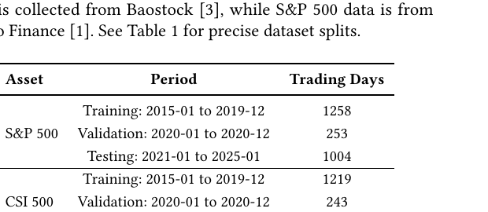

| Asset | Split | Period | Trading days |
|---|---|---:|---:|
| S&P 500 | Train | 2015-01 → 2019-12 | 1258 |
| S&P 500 | Validation | 2020-01 → 2020-12 | 253 |
| S&P 500 | Test | 2021-01 → 2025-01 | 1004 |
| CSI 500 | Train | 2015-01 → 2019-12 | 1219 |
| CSI 500 | Validation | 2020-01 → 2020-12 | 243 |
| CSI 500 | Test | 2021-01 → 2025-01 | 968 |

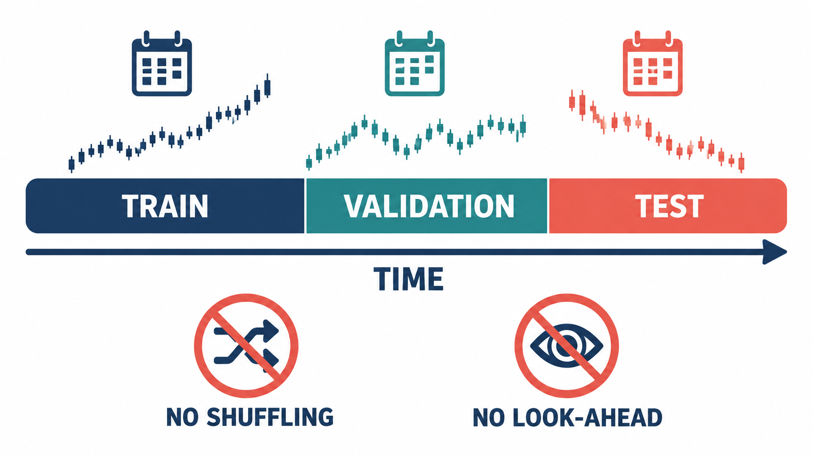
*Hình minh họa: train, validation và test phải đi theo chiều thời gian; không shuffle và không nhìn trước dữ liệu tương lai.*

Raw feature để xây factor chỉ gồm **OHLCV**: open, high, low, close, volume.

- CSI 500: dữ liệu từ Baostock.
- S&P 500: dữ liệu từ Yahoo Finance.

## 4. Model và factor pipeline

- AlphaAgent dùng **GPT-3.5-turbo** làm foundational LLM trong thiết lập chính.
- RD-Agent dùng GPT-4-turbo theo thiết lập tác giả baseline.
- Bốn base alpha: intraday return, daily return, 20-day relative volume, normalized daily range.
- Base alpha + alpha mới được đưa vào **LightGBM**.
- Feature và return được cross-sectional Z-score normalization.
- LightGBM có maximum depth 4 và dự báo next-day return.

## 5. Portfolio/backtest rule

Paper dùng top-k dropout:

- chọn 50 cổ phiếu top-ranked theo predicted return;
- loại 5 cổ phiếu lowest-ranked theo rule mô tả trong paper;
- có transaction fee.

Transaction cost:

- CSI 500: buy 0.0005, sell 0.0015.
- S&P 500: chỉ sell fee 0.0005.

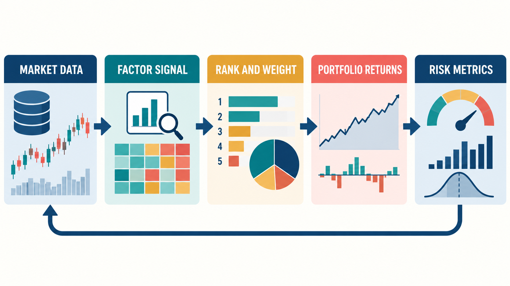
*Hình minh họa: market data tạo factor signal, signal được rank và weight thành portfolio returns rồi đánh giá bằng risk metrics.*

## 6. Baselines

Paper so AlphaAgent với:

- LSTM;
- Transformer;
- LightGBM;
- StockMixer;
- TRA;
- AlphaForge;
- RD-Agent;
- OpenAI-o1;
- DeepSeek-R1.

## 7. Bài tập tự luyện

1. Vì sao paper cần cả IC/ICIR lẫn AR/IR/MDD?
2. Vì sao transaction cost quan trọng khi đánh giá alpha thực tế?
3. Test period kéo dài nhiều năm có vai trò gì khi chủ đề chính là alpha decay?

## 8. Nguồn trong paper

- Section 4.1 - Experiment Settings, trang 6.
- Table 1, trang 6.


## Lý thuyết nền cần biết

> Đây là bài thực nghiệm quan trọng nhất của khóa. Phần nền dưới đây giúp đọc dataset, metric và backtest như một quy trình kiểm chứng, không phải bảng thành tích.

### 1. OHLCV và lợi suất tương lai

Dữ liệu giá cơ bản thường có năm trường **OHLCV**: `open`, `high`, `low`, `close`, `volume`. Một factor biến các trường này thành feature, ví dụ biên độ trong ngày, thay đổi volume hoặc trung bình động.

Với giá đóng cửa `P_t`, simple return và log return là:

\[
r_t=\frac{P_t-P_{t-1}}{P_{t-1}},\qquad
\ell_t=\ln\left(\frac{P_t}{P_{t-1}}\right)
\]

Trong bài toán dự báo, target có thể là `r_(t+1)`, tức lợi suất của kỳ sau. Dấu `+1` là lời nhắc về thời điểm: feature tại `t` chỉ được dùng thông tin có trước hoặc tại `t`, không được nhìn vào giá ở `t+1` khi tạo feature.

### 2. Time series và cross-section

Có hai chiều cần giữ đúng:

- **Time series:** cùng một cổ phiếu qua nhiều ngày, trong đó thứ tự thời gian và lag quan trọng.
- **Cross-section:** nhiều cổ phiếu tại cùng một ngày, dùng để so sánh và xếp hạng score.

AlphaAgent thường tạo score cho từng cổ phiếu tại ngày `t`, rồi đo xem score đó có liên hệ với return tương lai của các cổ phiếu trong cùng ngày không. Vì vậy một bảng khái niệm có dạng:

| date | asset | factor score tại `t` | future return |
|---|---|---:|---:|
| `t` | A | 0.8 | 0.012 |
| `t` | B | -0.3 | -0.004 |

`rolling` tạo thống kê từ một cửa sổ quá khứ; `shift` dịch chuỗi để căn thời điểm; `rank` chuyển giá trị thành thứ hạng trong cross-section. Khi các thao tác này bị đặt sai thứ tự, leakage có thể xuất hiện dù code vẫn chạy.

Ví dụ implementation cần đọc theo nghĩa toán học:

```python
df["return"] = df["close"].pct_change()
df["future_return"] = df["return"].shift(-1)
```

`pct_change()` tạo lợi suất so với dòng trước; `shift(-1)` đưa lợi suất tương lai lên dòng hiện tại để làm label. Dòng đầu hoặc cuối thường có `NaN` vì không đủ quan sát. Cần xử lý chúng có chủ đích, không âm thầm coi `NaN` là 0.

### 3. IC và RankIC

**Information Coefficient (IC)** là tương quan giữa factor score và future return. Với hai chuỗi `x` và `y`, Pearson correlation có trực giác “hai đại lượng có cùng tăng giảm tuyến tính không”:

\[
\rho_{x,y}=\frac{\operatorname{Cov}(x,y)}{\sigma_x\sigma_y}
\]

Trong đó `Cov` là covariance, `sigma` là độ lệch chuẩn. IC gần 1 nghĩa score cao thường đi cùng return cao; gần -1 nghĩa quan hệ ngược; gần 0 nghĩa quan hệ tuyến tính yếu. IC nhỏ không nhất thiết vô dụng, vì trong dự báo lợi suất ngắn hạn tín hiệu thường nhiễu và được khai thác trên số lượng tài sản lớn.

**RankIC** thay `x` và `y` bằng thứ hạng trước khi tính tương quan, tương đương trực giác với Spearman correlation. Nó quan tâm thứ tự cao thấp hơn khoảng cách tuyệt đối. Vì portfolio thường chọn top-ranked stocks, RankIC có thể phù hợp với câu hỏi “xếp hạng có đúng không?” hơn là câu hỏi “score tăng bao nhiêu đơn vị thì return tăng bao nhiêu?”.

### 4. ICIR và độ ổn định

IC theo từng ngày tạo thành một chuỗi `IC_t`. **ICIR** thường được hiểu là trung bình IC chia cho độ lệch chuẩn của IC:

\[
ICIR=\frac{\operatorname{mean}(IC_t)}{\operatorname{std}(IC_t)}
\]

ICIR cao có nghĩa tín hiệu có hiệu quả trung bình tốt so với độ dao động của hiệu quả đó. Nó không phải Sharpe ratio và không tự chứng minh lợi nhuận. Khi đọc một factor, cần xem cả mean, dispersion, dấu theo thời gian và số ngày quan sát.

### 5. Return, risk và đường vốn

Lợi suất trung bình không mô tả đầy đủ một portfolio. **Annualized Return (AR)** quy đổi hiệu quả theo năm; **Information Ratio (IR)** so sánh excess return với mức biến động của excess return; **Maximum Drawdown (MDD)** là mức sụt giảm lớn nhất từ một đỉnh trước đó xuống đáy sau đó.

Nếu `V_t` là giá trị portfolio và `Peak_t` là giá trị lớn nhất của `V_u` với mọi `u ≤ t`, drawdown tại `t` là:

\[
DD_t=\frac{V_t-Peak_t}{Peak_t}
\]

\[
MDD=\min_t DD_t
\]

Một chiến lược có AR cao nhưng MDD rất sâu hoặc phụ thuộc vào vài giai đoạn có thể không phù hợp để triển khai. Ngược lại, MDD thấp không có nghĩa strategy có alpha. Các metric phải được đọc cùng nhau.

### 6. Train, validation, test và backtest leakage

`Train` dùng để xây hoặc chọn factor/model; `validation` dùng để điều chỉnh thiết kế; `test` chỉ dùng để đánh giá cuối cùng trên giai đoạn chưa dùng. Với time series, split phải theo thời gian, không xáo trộn ngẫu nhiên, để mô phỏng việc dự báo tương lai.

Các lỗi thường gặp gồm:

- dùng future price để tạo feature hiện tại;
- fit normalization bằng cả test period;
- thử nhiều factor rồi báo cáo duy nhất factor thắng trên cùng test;
- bỏ qua delisted stocks hoặc chỉ dùng những mã còn tồn tại;
- quên transaction cost, turnover hoặc giới hạn thanh khoản.

Backtest là một thí nghiệm giả lập, không phải bằng chứng chắc chắn về lợi nhuận live. Protocol, dữ liệu, fee, benchmark, execution rule và model downstream đều ảnh hưởng kết quả.

### 7. Vì sao AlphaAgent còn dùng LightGBM?

Trong pipeline của paper, factor mới không nhất thiết là portfolio cuối cùng. Các base alpha và alpha mới được đưa vào LightGBM để dự báo next-day return. LightGBM là mô hình gradient-boosted trees: mỗi cây mới cố gắng sửa lỗi còn lại của ensemble. Do đó cần phân biệt:

```text
Raw OHLCV
   ↓
Alpha expressions / features
   ↓
LightGBM prediction
   ↓
Ranking và portfolio rule
   ↓
Backtest sau transaction cost
```

Factor evaluation và model evaluation là hai tầng liên quan nhưng không giống nhau.

## Liên hệ với bài học này

Bài này dùng đúng chuỗi trên để giải thích metrics, dataset split, base model, top-k dropout và transaction fee. Khi đọc Table 1, hãy hỏi dữ liệu nào có mặt ở từng split. Khi đọc Table 2, hãy tách predictive metric (`IC`, `RankIC`, `ICIR`) khỏi portfolio metric (`AR`, `IR`, `MDD`). Khi xem code hoặc pseudo-code, luôn truy ngược từ operation về timing: dữ liệu có sẵn ở thời điểm nào, label thuộc kỳ nào và fee được trừ ở bước nào.

## Nguồn kiến thức liên quan trong kho khóa học

- `01 - AI & Dữ liệu/02 - Data Science, Analytics & ML/ai-data-scientist-roadmap/AI-Data-Scientist-Roadmap-Course/00 - Roadmap.sh AI Data Scientist Official/01 - Math, Statistics and Econometrics/Module 03 - Econometrics and Time Series/03-TSParts/010 - Time Series Basics.md`
- `01 - AI & Dữ liệu/02 - Data Science, Analytics & ML/ai-data-scientist-roadmap/AI-Data-Scientist-Roadmap-Course/00 - Roadmap.sh AI Data Scientist Official/02 - Coding and EDA/Module 05 - Exploratory Data Analysis/01-Understand/004 - Target Variable.md`
- `01 - AI & Dữ liệu/01 - AI Engineering & LLM/Ai-engineer/Khóa-1/Resources/llm_engineering/week4/community-contributions/ai_stock_trading/README.md`
- `01 - AI & Dữ liệu/02 - Data Science, Analytics & ML/bi-analyst-roadmap/BI-Analyst-Roadmap-Course/00 - Roadmap.sh BI Analyst Official/Module 04 - Statistics Basics - Thong ke co ban/01-VariablesAndData-CorrelationAnalysis/003 - Correlation Analysis.md`
- `01 - AI & Dữ liệu/02 - Data Science, Analytics & ML/data-analyst-roadmap/Data-Analyst-Roadmap-Course/00 - Roadmap.sh Data Analyst Official/03 - Analysis and Visualisation/Module 11 - Statistical Analysis/01-HypothesisTesting-Regression/002 - Correlation Analysis.md`
- `01 - AI & Dữ liệu/02 - Data Science, Analytics & ML/machine-learning-roadmap/Machine-Learning-Roadmap-Course/00 - Roadmap.sh Machine Learning Official/04 - Evaluation, Workflow and Deep Learning/Module 11 - Model Evaluation/05-MAPE-TimeSeriesValidation/025 - Time Series Validation.md`
- `01 - AI & Dữ liệu/02 - Data Science, Analytics & ML/ai-data-scientist-roadmap/AI-Data-Scientist-Roadmap-Course/00 - Roadmap.sh AI Data Scientist Official/03 - Machine Learning and Deep Learning/Module 06 - Machine Learning/01-Supervised/007 - XGBoost - LightGBM.md`

## Nội dung các file tham khảo để tiện sao chép

> Các khối dưới đây là nội dung nguyên văn của source lesson tương ứng, được đặt trong code block để có thể sao chép trọn vẹn.

### 1. `01 - AI & Dữ liệu/02 - Data Science, Analytics & ML/ai-data-scientist-roadmap/AI-Data-Scientist-Roadmap-Course/00 - Roadmap.sh AI Data Scientist Official/01 - Math, Statistics and Econometrics/Module 03 - Econometrics and Time Series/03-TSParts/010 - Time Series Basics.md`

Nguồn: `01 - AI & Dữ liệu/02 - Data Science, Analytics & ML/ai-data-scientist-roadmap/AI-Data-Scientist-Roadmap-Course/00 - Roadmap.sh AI Data Scientist Official/01 - Math, Statistics and Econometrics/Module 03 - Econometrics and Time Series/03-TSParts/010 - Time Series Basics.md`

````markdown
# 010 — Time Series Basics

**Course:** 01 — Math, Statistics and Econometrics
**Module:** Module 03 — Econometrics and Time Series
**Content Group:** Time Series
**Roadmap Source:** Econometrics and Time Series / Time Series
**Lesson Type:** Econometrics and Time Series
**Order in Module:** 010
**Suggested Duration:** 22 minutes

---

## 1. Overview

A **time series** is a sequence of observations recorded in chronological order.

Examples include:

* Daily sales
* Hourly electricity demand
* Monthly inflation
* Minute-by-minute stock prices
* Weekly website traffic
* Sensor measurements
* Server request latency
* User activity over time

Unlike ordinary tabular data, the order of observations in a time series is important. An observation recorded today may depend on observations from yesterday, last week, or the same period last year.

A typical time series may contain:

* **Trend**
* **Seasonality**
* **Cycles**
* **Autocorrelation**
* **Noise**
* **Structural changes**
* **Outliers**

For an AI Engineer or Data Scientist, time series analysis helps answer questions such as:

* What will sales be next week?
* Is website traffic increasing?
* Does demand repeat every seven days?
* Is the current sensor value abnormal?
* Did a marketing campaign change the underlying pattern?
* How much uncertainty should be attached to a forecast?

A time series workflow usually produces artifacts such as:

* Exploratory charts
* Lag features
* Rolling statistics
* Forecasting models
* Validation reports
* Forecasting APIs
* Monitoring dashboards
* Business recommendations

---

## 2. Learning Objectives

After completing this lesson, you should be able to:

1. Explain what time series data is.
2. Distinguish time series data from ordinary cross-sectional data.
3. Identify trend, seasonality, cycles, and noise.
4. Explain why temporal order must be preserved.
5. Understand lagged values and rolling statistics.
6. Recognize autocorrelation.
7. Create simple forecasting baselines.
8. Split time series data correctly for training and evaluation.
9. Build a small time series analysis notebook.
10. Connect time series concepts to production forecasting systems.

---

## 3. What Is a Time Series?

A time series is a set of observations indexed by time:

$$
y_1, y_2, y_3, \ldots, y_T
$$

where:

* (y_t) is the observed value at time (t)
* (T) is the total number of observations

A general representation is:

$$
y_t = f(t) + \varepsilon_t
$$

where:

* (f(t)) represents systematic temporal patterns
* (\varepsilon_t) represents random variation or noise

For example, a daily sales dataset may look like this:

| Date       | Sales |
| ---------- | ----: |
| 2026-01-01 |   120 |
| 2026-01-02 |   128 |
| 2026-01-03 |   135 |
| 2026-01-04 |   131 |
| 2026-01-05 |   145 |

The date column is not simply another feature. It defines the order and dependency structure of the observations.

---

## 4. Time Series vs. Ordinary Tabular Data

In ordinary supervised learning, rows are often assumed to be independent and identically distributed.

Time series data usually violates this assumption because nearby observations may be related.

| Property                 | Ordinary Tabular Data                  | Time Series Data                             |
| ------------------------ | -------------------------------------- | -------------------------------------------- |
| Row order                | Often unimportant                      | Essential                                    |
| Random train/test split  | Usually acceptable                     | Often incorrect                              |
| Observation independence | Common assumption                      | Frequently violated                          |
| Future information       | May be mixed across rows               | Must not enter training data                 |
| Evaluation               | Random holdout or cross-validation     | Temporal holdout or walk-forward validation  |
| Common features          | Demographics, categories, measurements | Lags, rolling statistics, calendar variables |

For example, randomly shuffling daily sales data may allow the model to train on future observations and predict earlier observations. This creates **data leakage** and produces unrealistic evaluation results.

---

## 5. Main Components of a Time Series

A useful conceptual decomposition is:

$$
y_t = T_t + S_t + C_t + \varepsilon_t
$$

where:

* (T_t): trend
* (S_t): seasonality
* (C_t): cyclical movement
* (\varepsilon_t): irregular noise

### 5.1 Trend

A **trend** is a long-term increase or decrease in the series.

Examples:

* Increasing e-commerce revenue
* Decreasing hardware failure rates
* Growth in application users
* Long-term inflation

```text
Value
  ^
  |                         *
  |                    *  *
  |                * *
  |           *  *
  |       * *
  |   * *
  +--------------------------------> Time
                 Upward trend
```

A trend does not need to be linear. It may be:

* Linear
* Exponential
* Logarithmic
* Piecewise
* Saturating

---

### 5.2 Seasonality

**Seasonality** is a regular pattern that repeats at a fixed interval.

Examples:

* Sales increasing every weekend
* Electricity demand rising every afternoon
* Retail demand increasing every December
* Website traffic falling every Sunday
* Restaurant orders peaking during lunch hours

```text
Value
  ^
  |      /\        /\        /\
  |     /  \      /  \      /  \
  |____/    \____/    \____/    \____
  +------------------------------------> Time
          Repeating seasonal pattern
```

Common seasonal periods include:

| Data Frequency | Possible Seasonal Period |
| -------------- | -----------------------: |
| Hourly         |                 24 hours |
| Daily          |                   7 days |
| Daily          |                 365 days |
| Weekly         |                 52 weeks |
| Monthly        |                12 months |
| Quarterly      |               4 quarters |

A time series may contain multiple seasonal patterns. For example, hourly electricity demand may have both daily and weekly seasonality.

---

### 5.3 Cycles

A **cycle** is a rise-and-fall pattern that does not necessarily repeat at a fixed interval.

Examples include:

* Economic expansions and recessions
* Housing market cycles
* Technology adoption cycles
* Product demand life cycles

Seasonality has a relatively fixed period, while cycles usually have less predictable duration.

---

### 5.4 Noise

**Noise** is irregular variation that is not explained by the systematic components.

Noise may be caused by:

* Measurement error
* Random customer behavior
* Unexpected external events
* Missing explanatory variables
* Data collection problems

A forecasting model should capture useful structure without fitting every random fluctuation.

---

### 5.5 Outliers and Anomalies

An outlier is an observation that differs substantially from the expected pattern.

Possible causes include:

* Promotional campaigns
* Public holidays
* Server failures
* Sensor errors
* Supply disruptions
* Extreme weather
* Data-entry mistakes

An outlier may represent either valuable information or corrupted data. It should not be removed automatically without investigation.

---

### 5.6 Structural Breaks

A **structural break** occurs when the underlying data-generating process changes.

Examples:

* A pricing policy changes
* A new competitor enters the market
* A pandemic changes customer behavior
* A sensor is replaced
* A product is redesigned
* A data pipeline changes its measurement logic

A model trained before the break may perform poorly after the break.

---

## 6. Additive and Multiplicative Structure

### 6.1 Additive Model

An additive decomposition assumes:

$$
y_t = T_t + S_t + \varepsilon_t
$$

It is appropriate when the seasonal variation remains approximately constant as the overall level changes.

Example:

* Sales fluctuate by approximately 100 units every December, regardless of total sales level.

---

### 6.2 Multiplicative Model

A multiplicative decomposition assumes:

$$
y_t = T_t \times S_t \times \varepsilon_t
$$

It is appropriate when seasonal fluctuations become larger as the level of the series increases.

Example:

* December sales are consistently around 30% higher than normal sales.

A logarithmic transformation can convert multiplicative relationships into approximately additive ones:

$$
\log(y_t) = \log(T_t) + \log(S_t) + \log(\varepsilon_t)
$$

---

## 7. Temporal Dependence

Time series observations are often dependent on previous observations.

For example:

$$
y_t = \phi y_{t-1} + \varepsilon_t
$$

The current value (y_t) depends on the previous value (y_{t-1}).

This dependence is one reason why ordinary random splitting and independent-data assumptions may fail.

---

## 8. Lagged Values

A **lag** is a previous value of the same variable.

The first lag is:

$$
\text{Lag}_1(y_t) = y_{t-1}
$$

The seventh lag for daily data is:

$$
\text{Lag}_7(y_t) = y_{t-7}
$$

Example:

| Date   | Sales | Lag 1 | Lag 7 |
| ------ | ----: | ----: | ----: |
| Jan 8  |   160 |   148 |   120 |
| Jan 9  |   170 |   160 |   128 |
| Jan 10 |   165 |   170 |   135 |

Lagged features allow machine learning models to use historical information.

Common lag features include:

* Previous hour
* Previous day
* Previous week
* Previous month
* Same day last year

The appropriate lag depends on the business process and data frequency.

---

## 9. Rolling Statistics

Rolling statistics summarize recent observations over a moving window.

A rolling mean with window size (k) is:

$$
\text{MA}_t^{(k)} = \frac{1}{k} \sum_{i=0}^{k-1} y_{t-i}
$$

For a seven-day moving average:

$$
\text{MA}_t^{(7)} = \frac{ y_t + y_{t-1} + \cdots + y_{t-6} }{7}
$$

Useful rolling features include:

* Rolling mean
* Rolling median
* Rolling minimum
* Rolling maximum
* Rolling standard deviation
* Rolling sum
* Rolling quantile

Rolling statistics are useful for:

* Smoothing noise
* Detecting local trends
* Measuring recent volatility
* Creating predictive features
* Detecting anomalies

A critical implementation detail is that rolling features must not use future values.

For forecasting, a safer feature is often:

```python
df["rolling_mean_7"] = df["sales"].shift(1).rolling(7).mean()
```

The `shift(1)` ensures that the current target value is not included in its own predictor.

---

## 10. Autocorrelation

**Autocorrelation** measures the relationship between a time series and a lagged version of itself.

For lag (k):

$$
\rho_k = \text{Corr}(y_t, y_{t-k})
$$

Examples:

* High autocorrelation at lag 1 means adjacent observations are strongly related.
* High autocorrelation at lag 7 in daily data may indicate weekly seasonality.
* High autocorrelation at lag 12 in monthly data may indicate annual seasonality.

### Interpretation Example

| Lag | Autocorrelation | Possible Interpretation        |
| --: | --------------: | ------------------------------ |
|   1 |            0.88 | Strong short-term persistence  |
|   2 |            0.74 | Dependence continues           |
|   7 |            0.65 | Possible weekly pattern        |
|  14 |            0.51 | Repeated two-week relationship |

Autocorrelation does not automatically prove causality. It only describes temporal dependence.

---

## 11. Stationarity

A time series is approximately **stationary** when its statistical properties remain stable over time.

A weakly stationary series has:

1. A constant mean
2. A constant variance
3. Autocovariance that depends on lag rather than absolute time

Conceptually:

$$
\mathbb{E}[y_t] = \mu
$$

$$
\text{Var}(y_t) = \sigma^2
$$

$$
\text{Cov}(y_t, y_{t-k}) = \gamma_k
$$

A series with a strong trend or changing variance is usually non-stationary.

Stationarity is important for classical methods such as:

* AR
* MA
* ARMA
* ARIMA
* VAR

However, not every modern forecasting model requires the raw series to be stationary.

### Common Transformations

To make a series more stable, analysts may use:

* Differencing
* Log transformation
* Seasonal differencing
* Trend removal
* Seasonal adjustment

First-order differencing is:

$$
\Delta y_t = y_t - y_{t-1}
$$

Seasonal differencing with period (s) is:

$$
\Delta_s y_t = y_t - y_{t-s}
$$

---

## 12. Forecasting Horizon

The **forecasting horizon** is how far into the future the model must predict.

Examples:

* Next hour
* Next day
* Next seven days
* Next month
* Next twelve months

The forecasting horizon affects:

* Model selection
* Feature engineering
* Error accumulation
* Evaluation design
* Uncertainty
* Business usefulness

Predicting one step ahead is usually easier than predicting many steps ahead.

---

## 13. One-Step and Multi-Step Forecasting

### One-Step Forecast

Predict only the next value:

$$
\hat{y}_{t+1}
$$

### Multi-Step Forecast

Predict several future values:

$$
\hat{y}_{t+1}, \hat{y}_{t+2}, \ldots, \hat{y}_{t+h}
$$

where (h) is the forecast horizon.

Common multi-step strategies include:

* Recursive forecasting
* Direct forecasting
* Multi-output forecasting
* Sequence-to-sequence forecasting

Recursive forecasting uses previous predictions as inputs for later predictions, so errors may accumulate over time.

---

## 14. Forecasting Baselines

A model should always be compared with a simple baseline.

A complex model is not useful if it cannot outperform a reasonable baseline.

### 14.1 Mean Baseline

Predict the historical mean:

$$
\hat{y}_{t+h} = \frac{1}{T} \sum_{t=1}^{T} y_t
$$

This is simple but often weak for trending or seasonal data.

---

### 14.2 Naive Forecast

Predict the most recent observation:

$$
\hat{y}_{t+1} = y_t
$$

This baseline can be surprisingly strong when the series changes slowly.

---

### 14.3 Seasonal Naive Forecast

Predict the value from the same position in the previous seasonal cycle:

$$
\hat{y}_t = y_{t-s}
$$

For daily data with weekly seasonality:

$$
\hat{y}_t = y_{t-7}
$$

For monthly data with yearly seasonality:

$$
\hat{y}_t = y_{t-12}
$$

Strong seasonality often makes the seasonal naive forecast difficult to beat.

---

### 14.4 Moving-Average Baseline

Predict using a recent average:

$$
\hat{y}_{t+1} = \frac{1}{k} \sum_{i=0}^{k-1} y_{t-i}
$$

This can reduce short-term noise but may react slowly to sudden changes.

---

## 15. Correct Train/Test Splitting

Random train/test splitting is usually inappropriate for time series forecasting.

Suppose the data covers January through December.

A valid split is:

```text
January ---------------- September | October --- December
               Training data       |     Test data
```

An invalid random split may look like:

```text
Training: January, March, June, November, ...
Testing:  February, April, July, October, ...
```

The random split allows future observations to influence the training process.

### Correct Temporal Split

```text
Past observations                     Future observations
┌──────────────────────────────────┐   ┌────────────────────┐
│            Training set          │   │      Test set      │
└──────────────────────────────────┘   └────────────────────┘
────────────────────────────────────────────────────────────> Time
```

The test period should simulate the future period the model will face in production.

---

## 16. Walk-Forward Validation

A single train/test split may not provide enough evidence about model stability.

Walk-forward validation evaluates the model across multiple historical forecasting periods.

```text
Fold 1:
Train: [1 2 3 4 5]       Test: [6]

Fold 2:
Train: [1 2 3 4 5 6]     Test: [7]

Fold 3:
Train: [1 2 3 4 5 6 7]   Test: [8]

Fold 4:
Train: [1 2 3 4 5 6 7 8] Test: [9]
```

A general workflow is:

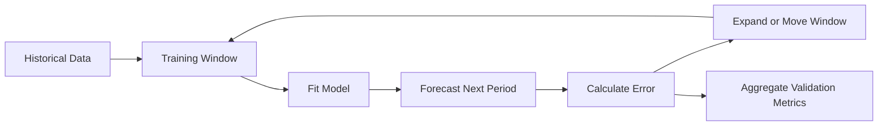

Walk-forward validation is more realistic because it reproduces repeated forecasting in chronological order.

---

## 17. Expanding and Sliding Windows

### 17.1 Expanding Window

The training set grows over time.

```text
Fold 1: [1 2 3 4]             -> [5]
Fold 2: [1 2 3 4 5]           -> [6]
Fold 3: [1 2 3 4 5 6]         -> [7]
```

Advantages:

* Uses all available historical information
* Appropriate when older data remains relevant

---

### 17.2 Sliding Window

The training set keeps a fixed length.

```text
Fold 1: [1 2 3 4] -> [5]
Fold 2: [2 3 4 5] -> [6]
Fold 3: [3 4 5 6] -> [7]
```

Advantages:

* Reduces the influence of outdated observations
* Useful when the data-generating process changes over time

---

## 18. Forecast Evaluation Metrics

Let:

* (y_t) be the actual value
* (\hat{y}_t) be the predicted value
* (e_t = y_t - \hat{y}_t) be the forecast error

### 18.1 Mean Absolute Error

$$
\text{MAE} = \frac{1}{n} \sum_{t=1}^{n} |y_t-\hat{y}_t|
$$

Advantages:

* Easy to interpret
* Uses the same unit as the target
* Less sensitive to extreme errors than RMSE

---

### 18.2 Root Mean Squared Error

$$
\text{RMSE} = \sqrt{ \frac{1}{n} \sum_{t=1}^{n} (y_t-\hat{y}_t)^2 }
$$

Advantages:

* Penalizes large errors more strongly
* Useful when large mistakes are especially costly

---

### 18.3 Mean Absolute Percentage Error

$$
\text{MAPE} = \frac{100}{n} \sum_{t=1}^{n} \left| \frac{y_t-\hat{y}_t}{y_t} \right|
$$

Limitations:

* Undefined when (y_t=0)
* Unstable when actual values are close to zero
* Can create asymmetric penalties

---

### 18.4 Weighted Absolute Percentage Error

$$
\text{WAPE} = \frac{ \sum_{t=1}^{n}|y_t-\hat{y}_t| }{ \sum_{t=1}^{n}|y_t| } \times 100
$$

WAPE is often useful for evaluating aggregate demand forecasts.

---

### 18.5 Mean Absolute Scaled Error

$$
\text{MASE} = \frac{ \frac{1}{n} \sum_{t=1}^{n}|y_t-\hat{y}_t| }{ \frac{1}{T-1} \sum_{t=2}^{T}|y_t-y_{t-1}| }
$$

Interpretation:

* (\text{MASE}<1): better than the naive baseline
* (\text{MASE}>1): worse than the naive baseline

Metric selection should reflect the real cost of forecast errors.

---

## 19. End-to-End Time Series Workflow

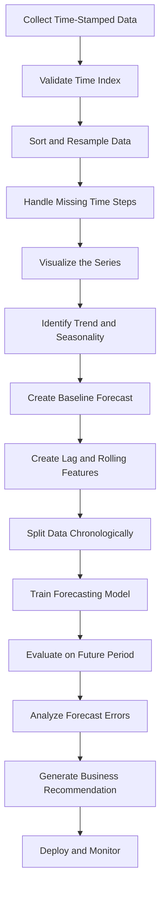

A robust forecasting project should begin with data validation and a baseline, not immediately with a complex model.

---

## 20. Practical Python Demo

The following example creates synthetic daily sales data with trend, weekly seasonality, and random noise.

```python
import numpy as np
import pandas as pd
import matplotlib.pyplot as plt
from sklearn.metrics import mean_absolute_error, mean_squared_error

rng = np.random.default_rng(42)

dates = pd.date_range(
    start="2025-01-01",
    periods=240,
    freq="D",
)

trend = np.linspace(100, 180, len(dates))

weekly_pattern = np.array([
    -10,  # Monday
    -5,   # Tuesday
    0,    # Wednesday
    4,    # Thursday
    10,   # Friday
    25,   # Saturday
    18,   # Sunday
])

seasonality = np.array([
    weekly_pattern[date.dayofweek]
    for date in dates
])

noise = rng.normal(
    loc=0,
    scale=8,
    size=len(dates),
)

sales = trend + seasonality + noise

df = pd.DataFrame({
    "date": dates,
    "sales": sales,
})

df = df.set_index("date")

print(df.head())
```

### Plot the Series

```python
fig, ax = plt.subplots(figsize=(12, 5))

ax.plot(df.index, df["sales"])
ax.set_title("Daily Sales")
ax.set_xlabel("Date")
ax.set_ylabel("Sales")

plt.tight_layout()
plt.show()
```

---

## 21. Add Rolling Statistics

```python
df["rolling_mean_7"] = (
    df["sales"]
    .rolling(window=7)
    .mean()
)

df["rolling_std_7"] = (
    df["sales"]
    .rolling(window=7)
    .std()
)
```

Plot the original series and rolling mean:

```python
fig, ax = plt.subplots(figsize=(12, 5))

ax.plot(
    df.index,
    df["sales"],
    label="Daily sales",
    alpha=0.6,
)

ax.plot(
    df.index,
    df["rolling_mean_7"],
    label="7-day rolling mean",
)

ax.set_title("Daily Sales and Rolling Mean")
ax.set_xlabel("Date")
ax.set_ylabel("Sales")
ax.legend()

plt.tight_layout()
plt.show()
```

The rolling mean makes the long-term trend easier to see by reducing daily noise.

---

## 22. Create Lag Features

```python
df["lag_1"] = df["sales"].shift(1)
df["lag_7"] = df["sales"].shift(7)
df["lag_14"] = df["sales"].shift(14)

df["previous_7_day_mean"] = (
    df["sales"]
    .shift(1)
    .rolling(window=7)
    .mean()
)
```

The `shift(1)` is important because it prevents the current target from leaking into the rolling feature.

---

## 23. Create a Chronological Split

Use the final 30 days as the test set.

```python
test_size = 30

train = df.iloc[:-test_size].copy()
test = df.iloc[-test_size:].copy()

print("Training period:")
print(train.index.min(), "to", train.index.max())

print("\nTesting period:")
print(test.index.min(), "to", test.index.max())
```

The training period occurs entirely before the testing period.

---

## 24. Evaluate Baseline Forecasts

### 24.1 Naive Baseline

```python
test["naive_forecast"] = test["lag_1"]
```

### 24.2 Seasonal Naive Baseline

```python
test["seasonal_naive_forecast"] = test["lag_7"]
```

### 24.3 Seven-Day Moving-Average Baseline

```python
test["moving_average_forecast"] = test["previous_7_day_mean"]
```

### Evaluation Function

```python
def evaluate_forecast(
    actual: pd.Series,
    predicted: pd.Series,
) -> dict[str, float]:
    valid = actual.notna() & predicted.notna()

    y_true = actual.loc[valid]
    y_pred = predicted.loc[valid]

    mae = mean_absolute_error(y_true, y_pred)
    rmse = mean_squared_error(
        y_true,
        y_pred,
    ) ** 0.5

    return {
        "MAE": mae,
        "RMSE": rmse,
    }
```

Compare the baselines:

```python
results = {
    "Naive": evaluate_forecast(
        test["sales"],
        test["naive_forecast"],
    ),
    "Seasonal Naive": evaluate_forecast(
        test["sales"],
        test["seasonal_naive_forecast"],
    ),
    "Moving Average": evaluate_forecast(
        test["sales"],
        test["moving_average_forecast"],
    ),
}

results_df = (
    pd.DataFrame(results)
    .T
    .sort_values("MAE")
)

print(results_df)
```

Because the synthetic data contains weekly seasonality, the seasonal naive baseline may perform very well.

---

## 25. Visualize the Forecast

```python
fig, ax = plt.subplots(figsize=(12, 5))

ax.plot(
    test.index,
    test["sales"],
    label="Actual",
)

ax.plot(
    test.index,
    test["seasonal_naive_forecast"],
    label="Seasonal naive forecast",
)

ax.set_title("Actual Sales vs. Seasonal Naive Forecast")
ax.set_xlabel("Date")
ax.set_ylabel("Sales")
ax.legend()

plt.tight_layout()
plt.show()
```

A forecast should be evaluated both numerically and visually.

A metric may hide problems such as:

* Systematic underprediction
* Missed demand peaks
* Delayed reaction to changes
* Poor weekend performance
* Errors concentrated in important periods

---

## 26. Forecast Error Analysis

The residual or forecast error is:

$$
e_t = y_t - \hat{y}_t
$$

Create forecast errors:

```python
test["forecast_error"] = (
    test["sales"]
    - test["seasonal_naive_forecast"]
)
```

Plot errors over time:

```python
fig, ax = plt.subplots(figsize=(12, 4))

ax.plot(
    test.index,
    test["forecast_error"],
)

ax.axhline(
    y=0,
    linestyle="--",
)

ax.set_title("Forecast Errors Over Time")
ax.set_xlabel("Date")
ax.set_ylabel("Error")

plt.tight_layout()
plt.show()
```

A useful model should produce errors that:

* Have an average close to zero
* Do not show a clear trend
* Do not retain strong seasonality
* Do not become increasingly variable
* Do not contain unexplained systematic patterns

If errors remain structured, the model has not captured all available information.

---

## 27. Common Time Series Models

| Model                    | Main Idea                             | Typical Use                       |
| ------------------------ | ------------------------------------- | --------------------------------- |
| Naive                    | Use the latest value                  | Simple benchmark                  |
| Seasonal naive           | Use the same previous season          | Strong regular seasonality        |
| Moving average           | Average recent observations           | Smooth short-term noise           |
| Exponential smoothing    | Weight recent values more strongly    | Level, trend, and seasonality     |
| ARIMA                    | Model lags and differenced series     | Classical univariate forecasting  |
| SARIMA                   | ARIMA with seasonal structure         | Seasonal univariate series        |
| Linear regression        | Use lag and calendar features         | Interpretable feature-based model |
| Random forest            | Learn nonlinear feature relationships | Structured lag features           |
| Gradient boosting        | Powerful tabular forecasting          | Business forecasting              |
| Prophet-style model      | Trend, holidays, and seasonality      | Business time series              |
| Recurrent neural network | Model temporal sequences              | Complex sequential patterns       |
| Temporal transformer     | Learn long-range dependencies         | Large and multivariate datasets   |

Model complexity should be justified by measurable improvement over a strong baseline.

---

## 28. Time Series Feature Engineering

### 28.1 Calendar Features

Useful calendar variables include:

```python
df["day_of_week"] = df.index.dayofweek
df["day_of_month"] = df.index.day
df["month"] = df.index.month
df["quarter"] = df.index.quarter
df["is_weekend"] = (
    df.index.dayofweek >= 5
).astype(int)
```

Additional features may include:

* Public holidays
* Payday periods
* School holidays
* Promotion periods
* Product launches
* Weather conditions
* Special events

---

### 28.2 Lag Features

```python
for lag in [1, 2, 3, 7, 14, 28]:
    df[f"lag_{lag}"] = df["sales"].shift(lag)
```

---

### 28.3 Rolling Features

```python
for window in [7, 14, 28]:
    shifted_sales = df["sales"].shift(1)

    df[f"rolling_mean_{window}"] = (
        shifted_sales
        .rolling(window)
        .mean()
    )

    df[f"rolling_std_{window}"] = (
        shifted_sales
        .rolling(window)
        .std()
    )
```

---

### 28.4 Change Features

```python
df["difference_1"] = df["sales"].diff(1)
df["difference_7"] = df["sales"].diff(7)
df["percentage_change_1"] = df["sales"].pct_change(1)
```

These features describe recent movement rather than absolute level.

---

## 29. Data Leakage in Time Series

Time series leakage occurs when information unavailable at prediction time enters the model.

### Leakage Example 1: Random Split

```python
from sklearn.model_selection import train_test_split

X_train, X_test, y_train, y_test = train_test_split(
    X,
    y,
    test_size=0.2,
    shuffle=True,
)
```

This is usually unsafe for forecasting because future observations may enter the training set.

---

### Leakage Example 2: Unshifted Rolling Mean

```python
df["rolling_mean_7"] = (
    df["sales"]
    .rolling(7)
    .mean()
)
```

This feature includes the current target value.

A safer version is:

```python
df["rolling_mean_7"] = (
    df["sales"]
    .shift(1)
    .rolling(7)
    .mean()
)
```

---

### Leakage Example 3: Future External Variables

Suppose tomorrow's actual weather is used to forecast tomorrow's sales. This is valid only if the actual weather value is genuinely available at prediction time.

Otherwise, the model should use:

* A weather forecast
* A historical average
* A scenario-based estimate

Every feature should be evaluated using one question:

> Would this exact value be available when the prediction is generated?

---

## 30. Missing Values in Time Series

Missing timestamps and missing measurements are different problems.

### Missing Timestamp

A date or time interval is absent from the index.

Example:

```text
10:00
11:00
13:00
```

The 12:00 timestamp is missing.

### Missing Measurement

The timestamp exists, but its value is missing.

```text
10:00    14.2
11:00    NaN
12:00    14.8
```

Possible strategies include:

* Forward fill
* Backward fill
* Linear interpolation
* Seasonal interpolation
* Model-based imputation
* Leave missing
* Add a missing-value indicator

The method must reflect the meaning of the data. For example, missing sales and zero sales are not necessarily the same.

---

## 31. Resampling

Time series data may need to be converted to another frequency.

### Daily to Weekly

```python
weekly_sales = (
    df["sales"]
    .resample("W")
    .sum()
)
```

### Hourly to Daily Average

```python
daily_average = (
    hourly_df["temperature"]
    .resample("D")
    .mean()
)
```

The aggregation function depends on the variable:

| Variable          | Common Aggregation     |
| ----------------- | ---------------------- |
| Sales             | Sum                    |
| Temperature       | Mean                   |
| Maximum CPU usage | Maximum                |
| Inventory level   | Last observation       |
| Number of events  | Count                  |
| Price             | Open, high, low, close |

Incorrect aggregation can change the meaning of the series.

---

## 32. Business Example: Sales Forecasting

Suppose a retailer wants to forecast sales for the next seven days.

### Inputs

* Historical daily sales
* Day of week
* Public holidays
* Promotions
* Product price
* Weather forecast
* Inventory level

### Workflow

```text
Historical sales
      ↓
Validate timestamps and missing periods
      ↓
Plot trend and weekly seasonality
      ↓
Create seasonal naive baseline
      ↓
Create lag and rolling features
      ↓
Train model using past observations
      ↓
Evaluate on later periods
      ↓
Forecast the next seven days
      ↓
Recommend inventory and staffing levels
```

### Possible Business Output

```text
Forecast:
Expected demand will increase by approximately 18% this weekend.

Recommendation:
Increase inventory for the top three products and schedule
additional staff between 17:00 and 21:00 on Saturday.
```

The forecast is valuable only when it leads to an operational decision.

---

## 33. Time Series in an AI and Data Science Workflow

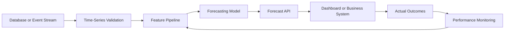

A production forecasting system may include:

* Scheduled data ingestion
* Feature generation
* Model training
* Model registry
* Batch forecasting
* Real-time inference
* Forecast storage
* Monitoring
* Automatic retraining
* Drift detection

---

## 34. Model Monitoring

Forecasting performance may deteriorate because:

* Customer behavior changes
* Seasonality shifts
* Product prices change
* New competitors appear
* Data pipelines fail
* External conditions change
* The target distribution changes

Useful monitoring metrics include:

* MAE by day
* RMSE by forecast horizon
* WAPE by product
* Forecast bias
* Missing input rate
* Feature drift
* Prediction interval coverage
* Baseline comparison

Forecast bias can be estimated as:

$$
\text{Bias} = \frac{1}{n} \sum_{t=1}^{n} (\hat{y}_t-y_t)
$$

A positive bias means systematic overprediction under this definition. A negative bias means systematic underprediction.

Always document the sign convention because some teams define forecast error in the opposite direction.

---

## 35. Common Mistakes

### 35.1 Randomly Shuffling Time Series Data

This mixes past and future information and creates unrealistic evaluation results.

### 35.2 Ignoring the Baseline

A complicated model may appear accurate but still perform worse than using last week's value.

### 35.3 Using Future Information

Unshifted rolling statistics, future promotions, or actual future weather can create leakage.

### 35.4 Ignoring Missing Time Intervals

Missing timestamps can distort rolling statistics and seasonal analysis.

### 35.5 Assuming Every Pattern Is Seasonal

Some repeating-looking patterns may be temporary cycles or random coincidence.

### 35.6 Evaluating Only One Period

A model may perform well during one month and fail during holidays or demand peaks.

### 35.7 Optimizing Only a Global Average Metric

A good overall MAE may hide poor performance for important products, regions, or peak periods.

### 35.8 Ignoring Forecast Horizon

A model that performs well one day ahead may perform poorly thirty days ahead.

### 35.9 Treating Forecasts as Certain

Forecasts should include uncertainty, especially for long horizons.

### 35.10 Building a Model Without a Decision

A technically accurate forecast has limited value if no business process uses it.

---

## 36. Practical Exercise

Use a small time series dataset such as:

* Daily sales
* Website traffic
* Electricity consumption
* Temperature
* Cryptocurrency price
* Server response time
* Number of application users

Complete the following tasks:

1. Parse the timestamp column.
2. Sort observations chronologically.
3. Check for duplicate timestamps.
4. Check for missing time intervals.
5. Plot the raw series.
6. Describe its trend.
7. Identify possible seasonality.
8. Create lag-1 and lag-7 features.
9. Create a seven-period rolling mean.
10. Reserve the final 20% of observations as the test set.
11. Create a naive forecast.
12. Create a seasonal naive forecast.
13. Calculate MAE and RMSE.
14. Plot actual values against forecasts.
15. Write one business recommendation.

---

## 37. Suggested Notebook Structure

```text
01. Problem Definition
02. Dataset Description
03. Time Index Validation
04. Missing-Value Analysis
05. Exploratory Visualization
06. Trend and Seasonality Analysis
07. Baseline Forecasts
08. Feature Engineering
09. Temporal Train/Test Split
10. Model Training
11. Forecast Evaluation
12. Error Analysis
13. Business Recommendation
14. Assumptions and Limitations
```

---

## 38. Reflection Questions

1. Why is observation order important in time series data?
2. What is the difference between trend and seasonality?
3. How does seasonality differ from a business cycle?
4. What does a lag feature represent?
5. Why can an unshifted rolling mean cause leakage?
6. Why should a time series not normally be split randomly?
7. When is a seasonal naive forecast appropriate?
8. What does autocorrelation at lag 7 suggest for daily data?
9. Why might forecasting accuracy decrease at longer horizons?
10. What real decision will use the forecast?

---

## 39. Completion Checklist

* [ ] I can explain time series data in one or two minutes.
* [ ] I can distinguish trend, seasonality, cycles, and noise.
* [ ] I understand lagged observations.
* [ ] I can calculate a rolling statistic.
* [ ] I understand autocorrelation conceptually.
* [ ] I can explain why random splitting causes leakage.
* [ ] I can create a chronological train/test split.
* [ ] I can implement naive and seasonal naive baselines.
* [ ] I can evaluate forecasts with MAE and RMSE.
* [ ] I can identify at least one assumption or limitation.
* [ ] I have created a notebook, chart, model, API, or portfolio note.
* [ ] I can connect the forecast to a business decision.

---

## 40. Related Outcome

Model relationships and time-dependent data using:

* Regression
* Residual diagnostics
* Lag features
* Rolling statistics
* Autocorrelation
* Stationarity
* ARIMA
* Forecast evaluation
* Production monitoring

---

## 41. Related Project

### Mini Project: Sales Forecasting

Build a daily sales forecasting workflow containing:

1. Time-index validation
2. Trend visualization
3. Weekly seasonality analysis
4. Lag and rolling features
5. Naive baseline
6. Seasonal naive baseline
7. Chronological train/test split
8. Optional ARIMA or machine learning model
9. MAE and RMSE comparison
10. Forecast visualization
11. Business recommendation

### Suggested Portfolio Artifacts

* Jupyter notebook
* Forecasting report
* Interactive dashboard
* REST forecasting API
* Dockerized forecasting service
* Scheduled batch prediction pipeline
* Model monitoring dashboard

---

## 42. Key Takeaways

1. Time series observations are ordered and often dependent.
2. Common components include trend, seasonality, cycles, and noise.
3. Lagged observations and rolling statistics summarize historical behavior.
4. Autocorrelation measures relationships between observations separated by time.
5. Temporal order must be preserved during training and evaluation.
6. Random train/test splitting can produce future-data leakage.
7. Simple baselines are essential for determining whether a model adds value.
8. Seasonal naive forecasts can be extremely strong when seasonality is stable.
9. Forecast performance should be evaluated across multiple historical periods.
10. A forecast becomes valuable when it supports a real decision.

---

## 43. Summary

**Time Series Basics** provides the foundation for working with data observed over time.

A complete time series workflow is:

```text
Time-stamped data
      ↓
Validate chronological structure
      ↓
Identify trend, seasonality and anomalies
      ↓
Create lag and rolling features
      ↓
Build simple baselines
      ↓
Split data chronologically
      ↓
Train and evaluate forecasting models
      ↓
Analyze forecast errors
      ↓
Generate a business recommendation
      ↓
Deploy and monitor performance
```

Do not stop after learning the definitions. Turn the lesson into a practical artifact such as a notebook, chart, forecasting model, API, Docker service, dashboard, or portfolio report.
````

### 2. `01 - AI & Dữ liệu/02 - Data Science, Analytics & ML/ai-data-scientist-roadmap/AI-Data-Scientist-Roadmap-Course/00 - Roadmap.sh AI Data Scientist Official/02 - Coding and EDA/Module 05 - Exploratory Data Analysis/01-Understand/004 - Target Variable.md`

Nguồn: `01 - AI & Dữ liệu/02 - Data Science, Analytics & ML/ai-data-scientist-roadmap/AI-Data-Scientist-Roadmap-Course/00 - Roadmap.sh AI Data Scientist Official/02 - Coding and EDA/Module 05 - Exploratory Data Analysis/01-Understand/004 - Target Variable.md`

````markdown
# 004 - Target Variable

**Course:** 02 - Coding and EDA
**Module:** Module 05 - Exploratory Data Analysis
**Content Group:** Data Understanding
**Roadmap Source:** Exploratory Data Analysis / Data Understanding
**Lesson Type:** Exploratory Data Analysis
**Order in Module:** 004
**Suggested Duration:** 20 minutes

---

## 1. Summary

This lesson explains the **Target Variable** in the context of AI and Data Science.

The target variable is the outcome that a machine learning model attempts to predict. Understanding it correctly is one of the most important steps before data cleaning, feature engineering, model training, and evaluation.

After this lesson, you should understand:

* What a target variable represents.
* How the target connects a business problem to a modeling problem.
* How to identify the target column in a dataset.
* How to analyze the target during Exploratory Data Analysis.
* How target quality affects experiments, metrics, and deployment.
* How to detect common problems such as class imbalance, label leakage, missing labels, and unclear target definitions.

---

## 2. Learning Objectives

By the end of this lesson, you should be able to:

* Explain the target variable in your own words.
* Identify the target variable in a supervised learning dataset.
* Distinguish between classification, regression, and time-to-event targets.
* Analyze the distribution and quality of a target variable.
* Select evaluation metrics that match the target and business objective.
* Detect target leakage and label-quality problems.
* Apply target analysis to a dataset, notebook, model, experiment, dashboard, or deployment artifact.

---

## 3. What Is a Target Variable?

A **target variable** is the value that a supervised machine learning model attempts to predict.

It is also commonly called:

* Label
* Response variable
* Dependent variable
* Outcome variable
* Ground truth
* Prediction target

A supervised dataset can be represented as:

```text
Input features X + Target y -> Machine learning model
```

Mathematically:

```text
y_hat = f(X)
```

Where:

* `X` represents the input features.
* `y` represents the true target value.
* `f` represents the model.
* `y_hat` represents the model's prediction.

For example, in a customer churn dataset:

```text
X = customer age, contract type, monthly charge, support calls
y = whether the customer leaves the company
```

---

## 4. Target Variable in the Machine Learning Workflow

The target variable connects the original business question to the technical machine learning task.


Example:

```text
Business question:
Which customers are likely to cancel their subscriptions?

Target definition:
Customer cancels within the next 30 days.

Dataset target:
churned_within_30_days

Modeling task:
Binary classification
```

A poorly defined target creates a poorly defined model, even when the algorithm is technically correct.

---

## 5. Features and Target

A supervised dataset usually contains two main components:

| Component  | Meaning                               | Example                    |
| ---------- | ------------------------------------- | -------------------------- |
| Features   | Information used to make predictions  | Age, income, contract type |
| Target     | Outcome the model attempts to predict | Churn                      |
| Prediction | Model-estimated target value          | Churn probability of 0.82  |

Example dataset:

| customer_id | tenure_months | monthly_charge | support_calls | churn |
| ----------- | ------------: | -------------: | ------------: | ----: |
| C001        |            24 |          35.00 |             1 |     0 |
| C002        |             2 |          89.00 |             7 |     1 |
| C003        |            15 |          55.00 |             2 |     0 |
| C004        |             1 |          99.00 |             5 |     1 |

In this dataset:

```text
Features:
- tenure_months
- monthly_charge
- support_calls

Target:
- churn
```

The `customer_id` column is normally an identifier, not a useful predictive feature.

---

## 6. Types of Target Variables

The target type determines the machine learning problem, model family, evaluation metrics, and prediction format.

### 6.1 Binary Classification Target

A binary target contains two possible classes.

Examples:

```text
churn = 0 or 1
fraud = no or yes
loan_default = false or true
disease_detected = negative or positive
```

Typical prediction:

```text
Probability of churn = 0.82
Predicted class = churn
```

Common metrics:

* Accuracy
* Precision
* Recall
* F1-score
* ROC-AUC
* PR-AUC
* Log loss

---

### 6.2 Multiclass Classification Target

A multiclass target contains more than two mutually exclusive classes.

Examples:

```text
ticket_category = billing, technical, account, cancellation
image_label = cat, dog, bird
sentiment = negative, neutral, positive
```

Each observation normally belongs to exactly one class.

Common metrics:

* Accuracy
* Macro F1-score
* Weighted F1-score
* Multiclass log loss
* Confusion matrix

---

### 6.3 Multilabel Classification Target

In multilabel classification, one observation may have multiple target labels.

Example:

```text
Movie genres:
[action, science fiction, adventure]
```

Another example:

```text
Customer interests:
[technology, gaming, photography]
```

This differs from multiclass classification because multiple labels may be correct at the same time.

Common metrics:

* Hamming loss
* Micro F1-score
* Macro F1-score
* Precision at K
* Recall at K

---

### 6.4 Continuous Regression Target

A regression target is a numerical value.

Examples:

```text
house_price = 250000
delivery_time_minutes = 42.5
monthly_revenue = 15200.75
temperature = 31.2
```

Common metrics:

* Mean Absolute Error
* Mean Squared Error
* Root Mean Squared Error
* R-squared
* Mean Absolute Percentage Error

---

### 6.5 Count Target

A count target represents the number of occurrences of an event.

Examples:

```text
number_of_purchases = 5
support_tickets_next_month = 3
daily_hospital_visits = 147
```

Count values are usually:

```text
0, 1, 2, 3, ...
```

Count targets may require specialized models such as:

* Poisson regression
* Negative binomial regression
* Zero-inflated models

---

### 6.6 Ordinal Target

An ordinal target contains categories with a meaningful order.

Examples:

```text
customer_satisfaction:
very dissatisfied < dissatisfied < neutral < satisfied < very satisfied
```

```text
credit_risk:
low < medium < high
```

The distance between categories is not necessarily equal.

For example, the difference between `low` and `medium` may not be equivalent to the difference between `medium` and `high`.

---

### 6.7 Time-to-Event Target

A time-to-event target measures how long it takes before an event occurs.

Examples:

```text
Time until customer churn
Time until equipment failure
Time until patient relapse
```

These problems often contain **censored observations**, where the event has not occurred by the end of the observation period.

Typical methods include:

* Survival analysis
* Cox proportional hazards models
* Survival forests
* Neural survival models

---

## 7. Target Definition

Before analyzing a target column, define exactly what the target means.

A complete target definition should answer the following questions:

| Question                              | Example                                   |
| ------------------------------------- | ----------------------------------------- |
| What event are we predicting?         | Customer cancellation                     |
| What is the prediction window?        | Within the next 30 days                   |
| What is the observation point?        | End of the current billing cycle          |
| Which population is included?         | Active subscription customers             |
| How is the label created?             | Cancellation record in the billing system |
| When does the label become available? | After the 30-day outcome window           |
| Which cases are excluded?             | Test accounts and internal employees      |

A weak target definition:

```text
Predict churn.
```

A stronger target definition:

```text
Predict whether an active paying customer will cancel all subscriptions
within 30 days after the observation date.
```

---

## 8. Observation Window and Prediction Window

Time-aware target design is especially important in real-world machine learning systems.

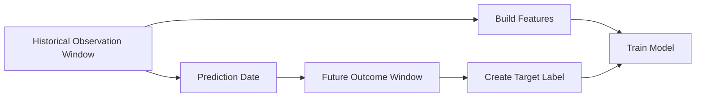

Example:

```text
Observation window:
January 1 to March 31

Prediction date:
April 1

Prediction window:
April 1 to April 30

Target:
Did the customer churn during April?
```

Features must only use information available before or at the prediction date.

Using information from the future creates target leakage.

---

## 9. Target Variable and Business Objective

The target must represent the real decision that the organization needs to make.

Example business objective:

```text
Reduce customer churn by contacting high-risk customers.
```

Possible target definitions:

| Target                                      | Limitation                              |
| ------------------------------------------- | --------------------------------------- |
| Customer has ever churned                   | Does not focus on future behavior       |
| Customer churns this year                   | Prediction window may be too long       |
| Customer churns within 30 days              | More actionable for retention campaigns |
| Customer cancels after receiving a discount | May create treatment-related bias       |

The best target is not always the easiest column to predict.

It should be:

* Relevant to the business decision.
* Available for historical training data.
* Measurable consistently.
* Available after a reasonable outcome period.
* Actionable at prediction time.

---

## 10. Target Variable EDA

Target analysis should normally be one of the first steps in Exploratory Data Analysis.

A useful workflow is:

```text
Identify target
    ->
Validate target meaning
    ->
Check target data type
    ->
Check missing values
    ->
Inspect distribution
    ->
Check class balance or skewness
    ->
Check relationships with features
    ->
Check time consistency
    ->
Check leakage
    ->
Document findings
```

---

## 11. Basic Target Inspection with Pandas

```python
import pandas as pd

df = pd.read_csv("customer_churn.csv")

target_column = "churn"

print(df[target_column].head())
print(df[target_column].dtype)
print(df[target_column].isna().sum())
print(df[target_column].value_counts(dropna=False))
```

This inspection helps answer:

* Does the target column exist?
* What is its data type?
* Does it contain missing values?
* How many unique values does it contain?
* Are labels represented consistently?

---

## 12. Target Distribution for Classification

For a classification target:

```python
target_counts = df["churn"].value_counts(dropna=False)
target_percentages = df["churn"].value_counts(
    normalize=True,
    dropna=False
).mul(100)

target_summary = pd.DataFrame({
    "count": target_counts,
    "percentage": target_percentages
})

print(target_summary)
```

Example output:

| churn | count | percentage |
| ----: | ----: | ---------: |
|     0 | 7,350 |      73.5% |
|     1 | 2,650 |      26.5% |

Interpretation:

```text
The dataset contains more non-churned customers than churned customers.
The target is moderately imbalanced, so accuracy alone may be misleading.
```

---

## 13. Target Distribution for Regression

For a continuous target:

```python
print(df["house_price"].describe())
```

Useful statistics include:

* Count
* Mean
* Standard deviation
* Minimum
* Quartiles
* Maximum

A histogram can reveal skewness and extreme values:

```python
import matplotlib.pyplot as plt

df["house_price"].hist(bins=30)

plt.xlabel("House Price")
plt.ylabel("Number of Properties")
plt.title("Distribution of House Prices")
plt.show()
```

Questions to investigate:

* Is the target heavily skewed?
* Are there impossible values?
* Are there extreme outliers?
* Is the target truncated or capped?
* Should a transformation be considered?

---

## 14. Target Imbalance

A classification target is imbalanced when one class appears much more frequently than another.

Example:

| Class     |  Count | Percentage |
| --------- | -----: | ---------: |
| Not fraud | 99,500 |      99.5% |
| Fraud     |    500 |       0.5% |

A model that always predicts `not fraud` would achieve:

```text
Accuracy = 99.5%
```

However, the model would detect no fraudulent transactions.

Therefore, accuracy is not sufficient for strongly imbalanced targets.

Better metrics may include:

* Precision
* Recall
* F1-score
* PR-AUC
* Recall at a fixed precision
* Precision at K
* Expected business cost

---

## 15. Confusion Matrix

For binary classification:

|                 | Predicted Negative | Predicted Positive |
| --------------- | -----------------: | -----------------: |
| Actual Negative |      True Negative |     False Positive |
| Actual Positive |     False Negative |      True Positive |

Important metrics include:

```text
Precision = TP / (TP + FP)
```

```text
Recall = TP / (TP + FN)
```

```text
F1 = 2 * Precision * Recall / (Precision + Recall)
```

Where:

* `TP` = True Positive
* `FP` = False Positive
* `FN` = False Negative
* `TN` = True Negative

Metric selection should depend on the business cost of each error type.

---

## 16. Example: Business Cost of Prediction Errors

Consider a fraud detection system.

### False positive

```text
A legitimate transaction is blocked.
```

Possible cost:

* Customer frustration
* Lost transaction revenue
* Increased support workload

### False negative

```text
A fraudulent transaction is approved.
```

Possible cost:

* Financial loss
* Chargeback fees
* Security risk
* Regulatory consequences

The correct metric depends on which error is more expensive.

---

## 17. Missing Target Values

Rows with missing target values cannot normally be used directly for supervised model training.

```python
missing_target_count = df["churn"].isna().sum()
missing_target_rate = df["churn"].isna().mean()

print("Missing target count:", missing_target_count)
print("Missing target rate:", missing_target_rate)
```

Possible reasons for missing labels include:

* The outcome has not occurred yet.
* The observation period is incomplete.
* Data was not recorded.
* Multiple data sources failed to join.
* The target is not applicable to some observations.
* The label is delayed.

Do not automatically drop missing targets without understanding why they are missing.

Missing target values may reveal a systematic data collection problem.

---

## 18. Label Noise

**Label noise** occurs when target values are incorrect, inconsistent, or uncertain.

Examples:

* A customer is labeled as churned even though the account was reactivated immediately.
* A medical diagnosis is entered incorrectly.
* Human reviewers disagree on image labels.
* Fraud cases are discovered months after the original transaction.
* Support tickets are assigned to inconsistent categories.

Label noise can reduce model performance even when features and algorithms are strong.

Questions to ask:

* Who created the label?
* Was the label created automatically or manually?
* Can the label be independently verified?
* How often are labels corrected?
* Are different labelers consistent?
* Is there a delay between the event and label availability?

---

## 19. Target Leakage

**Target leakage** occurs when the model uses information that would not be available at prediction time or information that directly reveals the target.

Example target:

```text
loan_default = whether the customer fails to repay the loan
```

Potential leakage columns:

```text
collection_status
days_after_default
default_resolution_date
account_closed_due_to_default
```

These columns may only become available after the target event occurs.

### Leakage Diagram

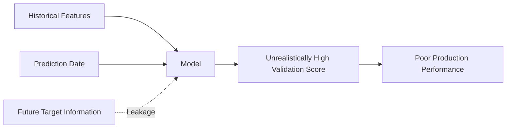

A common symptom of leakage is an unexpectedly high validation score.

For example:

```text
Validation accuracy = 99.9%
```

This may indicate:

* A feature directly contains the answer.
* Future information was included.
* Duplicate records exist across train and validation sets.
* Preprocessing was performed before data splitting.
* The target was accidentally included in the feature matrix.

---

## 20. Direct and Indirect Leakage

### 20.1 Direct Leakage

A feature directly reveals the target.

Example:

```text
Target: churn
Feature: churn_reason
```

The churn reason is normally known only after the customer has churned.

### 20.2 Indirect Leakage

A feature is strongly connected to the target because of the data collection process.

Example:

```text
Target: hospital mortality
Feature: discharge_status
```

Discharge status may be recorded after the outcome has already occurred.

Indirect leakage is more difficult to detect because the feature name may appear valid.

---

## 21. Target Leakage Checklist

Before modeling, ask:

* Was this feature available at prediction time?
* Was this feature created after the target event?
* Does this feature contain a transformed version of the target?
* Was preprocessing fitted on the complete dataset?
* Were target statistics calculated before the train-test split?
* Do duplicate entities appear in both training and test datasets?
* Does the validation period occur after the training period?
* Does any identifier encode the target indirectly?

---

## 22. Target Encoding Consistency

Classification labels should be represented consistently.

Problematic labels:

```text
Yes
YES
yes
Y
1
True
```

These may represent the same class but appear as different values.

Example normalization:

```python
label_mapping = {
    "Yes": 1,
    "YES": 1,
    "yes": 1,
    "Y": 1,
    "No": 0,
    "NO": 0,
    "no": 0,
    "N": 0
}

df["churn"] = df["churn"].map(label_mapping)
```

After transformation:

```python
print(df["churn"].value_counts(dropna=False))
```

Always verify whether unmapped values became missing.

---

## 23. Target Cardinality

Target cardinality is the number of unique target values.

```python
target_cardinality = df["target"].nunique(dropna=False)

print("Target cardinality:", target_cardinality)
```

Interpretation examples:

|                  Cardinality | Possible Task             |
| ---------------------------: | ------------------------- |
|                            2 | Binary classification     |
|                         3-20 | Multiclass classification |
|       Many repeated integers | Count prediction          |
| Many unique numerical values | Regression                |
|      Multiple labels per row | Multilabel classification |

High cardinality does not automatically mean regression.

For example, a postal code may contain many numerical values but still be categorical.

---

## 24. Target Skewness

Regression targets are often skewed.

Example:

```text
Most customers spend between $10 and $100.
A small number spend more than $10,000.
```

A heavily right-skewed target may affect model behavior and evaluation.

A logarithmic transformation may sometimes help:

```python
import numpy as np

df["log_revenue"] = np.log1p(df["revenue"])
```

Transformation:

```text
log_target = log(1 + target)
```

The model prediction can later be converted back:

```python
predicted_revenue = np.expm1(predicted_log_revenue)
```

A transformation should only be used when it matches the model assumptions and business interpretation.

---

## 25. Target Outliers

Outliers in a target variable may represent:

* Genuine rare events
* Data-entry errors
* Measurement errors
* Currency conversion mistakes
* Unit inconsistencies
* Duplicate aggregation
* Exceptional business cases

Example:

```python
q1 = df["house_price"].quantile(0.25)
q3 = df["house_price"].quantile(0.75)

iqr = q3 - q1

lower_bound = q1 - 1.5 * iqr
upper_bound = q3 + 1.5 * iqr

target_outliers = df[
    (df["house_price"] < lower_bound)
    | (df["house_price"] > upper_bound)
]

print(target_outliers)
```

An outlier rule is a diagnostic tool, not an automatic deletion rule.

---

## 26. Relationship Between Features and Target

After understanding the target distribution, analyze how important features relate to it.

### Numerical Feature Versus Classification Target

```python
df.groupby("churn")["monthly_charge"].describe()
```

Possible insight:

```text
Churned customers have a higher median monthly charge than retained customers.
```

### Categorical Feature Versus Classification Target

```python
churn_by_contract = pd.crosstab(
    df["contract_type"],
    df["churn"],
    normalize="index"
)

print(churn_by_contract)
```

Possible insight:

```text
Month-to-month customers have a substantially higher churn rate than annual-contract customers.
```

---

## 27. Target Rate

For a binary target encoded as `0` and `1`, the mean is equal to the positive-class rate.

```python
churn_rate = df["churn"].mean()

print(f"Churn rate: {churn_rate:.2%}")
```

Because:

```text
Mean of binary target = Number of positive cases / Total number of cases
```

Example:

```text
churn = [0, 1, 0, 1, 1]

mean = 3 / 5 = 0.60
```

Therefore:

```text
Churn rate = 60%
```

---

## 28. Target Rate by Segment

```python
segment_churn = (
    df.groupby("contract_type")["churn"]
    .agg(["count", "mean"])
    .rename(columns={"mean": "churn_rate"})
    .sort_values("churn_rate", ascending=False)
)

print(segment_churn)
```

Example output:

| contract_type  | count | churn_rate |
| -------------- | ----: | ---------: |
| Month-to-month | 4,500 |       0.43 |
| One-year       | 2,100 |       0.12 |
| Two-year       | 1,400 |       0.04 |

Possible insight:

```text
Month-to-month customers are the highest-risk segment and may be the best
initial audience for retention experiments.
```

---

## 29. Time-Based Target Analysis

Target behavior may change over time.

```python
df["observation_date"] = pd.to_datetime(df["observation_date"])

monthly_target_rate = (
    df.groupby(df["observation_date"].dt.to_period("M"))["churn"]
    .mean()
)

print(monthly_target_rate)
```

Questions to investigate:

* Is the target rate stable?
* Did a product launch change the target distribution?
* Did a policy change affect label creation?
* Does seasonality exist?
* Is the latest period different from historical periods?
* Is there evidence of concept drift?

---

## 30. Dataset Shift and Target Drift

**Target drift** occurs when the distribution of the target changes over time.

Example:

```text
Historical churn rate: 12%
Current churn rate: 24%
```

Possible causes:

* Pricing changes
* Competitor activity
* Economic conditions
* Product quality problems
* Customer population changes
* Label-definition changes

Target drift can reduce production model performance, even when the model was initially valid.

---

## 31. Train-Test Split and the Target

The target should guide the splitting strategy.

### Random Split

Suitable when:

* Observations are independent.
* Time order is not important.
* There are no repeated entities across splits.

```python
from sklearn.model_selection import train_test_split

X = df.drop(columns=["churn"])
y = df["churn"]

X_train, X_test, y_train, y_test = train_test_split(
    X,
    y,
    test_size=0.2,
    random_state=42,
    stratify=y
)
```

The `stratify=y` argument helps preserve the target-class proportion.

---

### Time-Based Split

Suitable when predicting future outcomes.

```text
Training data:
January to September

Validation data:
October

Test data:
November to December
```

This better represents production behavior than randomly mixing past and future records.

---

### Group-Based Split

Suitable when multiple rows belong to the same entity.

Examples:

* Multiple visits from the same patient
* Multiple transactions from the same customer
* Multiple images from the same person
* Multiple sessions from the same device

The same entity should not appear in both training and test sets.

---

## 32. Baseline Model from the Target

A baseline uses the target distribution without complex modeling.

### Classification Baseline

Predict the majority class for every record.

```python
majority_class = y_train.mode()[0]
baseline_predictions = [majority_class] * len(y_test)
```

### Regression Baseline

Predict the training-target mean or median.

```python
baseline_value = y_train.median()
baseline_predictions = [baseline_value] * len(y_test)
```

A machine learning model should outperform an appropriate baseline.

---

## 33. Target and Metric Selection

The target type and business objective determine the evaluation metric.

| Target Type               | Common Metrics                            |
| ------------------------- | ----------------------------------------- |
| Binary classification     | Precision, recall, F1, ROC-AUC, PR-AUC    |
| Multiclass classification | Accuracy, macro F1, weighted F1           |
| Multilabel classification | Micro F1, Hamming loss, precision at K    |
| Regression                | MAE, RMSE, R-squared                      |
| Count prediction          | Poisson deviance, MAE                     |
| Ranking                   | NDCG, MAP, precision at K                 |
| Survival prediction       | Concordance index, integrated Brier score |

Metric selection should also consider the business cost of prediction errors.

---

## 34. Threshold Selection

A classification model often returns a probability rather than a final class.

Example:

```text
Predicted churn probability = 0.72
```

A threshold converts probability into a class:

```text
If probability >= threshold:
    predict churn
else:
    predict no churn
```

The default threshold is often `0.5`, but it may not be optimal.

```python
threshold = 0.35

predicted_class = (
    predicted_probability >= threshold
).astype(int)
```

A lower threshold usually:

* Increases recall.
* Produces more positive predictions.
* May reduce precision.

A higher threshold usually:

* Increases precision.
* Produces fewer positive predictions.
* May reduce recall.

---

## 35. Target Availability in Production

A target may be available for model training but delayed in production.

Example:

```text
Prediction:
Will a customer churn within 90 days?

Target availability:
The true answer is only known after 90 days.
```

This affects:

* Model monitoring
* Retraining frequency
* Experiment evaluation
* Feedback loops
* Dashboard design

The system may need to monitor proxy metrics before the true target becomes available.

---

## 36. Proxy Targets

Sometimes the real business outcome is difficult to measure, so a proxy target is used.

Example:

```text
Real objective:
Improve long-term customer satisfaction.

Proxy target:
Customer clicks the recommendation.
```

The proxy is easier to measure but may not fully represent the real objective.

Risks include:

* Optimizing clicks instead of satisfaction.
* Encouraging short-term behavior.
* Creating unintended incentives.
* Increasing engagement while reducing trust.

Always document the difference between the proxy target and the real business goal.

---

## 37. Target Leakage from Aggregation

Suppose the target is:

```text
Will the customer churn in April?
```

A feature is calculated as:

```text
Total customer activity from January through April
```

This feature contains activity from the prediction window and may reveal churn behavior.

The correct feature should use only data available before April:

```text
Total customer activity from January through March
```

---

## 38. Target Leakage from Preprocessing

Incorrect process:

```text
1. Calculate feature statistics on the entire dataset.
2. Encode categories using the entire dataset.
3. Split into training and test data.
```

Correct process:

```text
1. Split data into training and test sets.
2. Fit preprocessing only on the training data.
3. Apply the fitted preprocessing to validation and test data.
```

This applies to:

* Scaling
* Imputation
* Feature selection
* Target encoding
* Dimensionality reduction
* Oversampling

---

## 39. Target Encoding as a Feature Transformation

The term **target encoding** may also refer to a categorical feature transformation.

For a category `c`:

```text
Encoded value of c = Average target value for rows in category c
```

Example:

| City             | Churn Rate | Encoded Value |
| ---------------- | ---------: | ------------: |
| Hanoi            |       0.12 |          0.12 |
| Da Nang          |       0.18 |          0.18 |
| Ho Chi Minh City |       0.25 |          0.25 |

However, calculating these values on the complete dataset causes leakage.

Target encoding should use:

* Training data only
* Cross-validation folds
* Smoothing
* Regularization
* Careful handling of unseen categories

---

## 40. Target Variable Documentation

A useful target specification may look like this:

```yaml
target_name: churn_within_30_days
task_type: binary_classification

positive_class:
  value: 1
  definition: Customer cancels all active subscriptions within 30 days

negative_class:
  value: 0
  definition: Customer remains active for the full 30-day outcome window

observation_date:
  definition: Last day of the current billing cycle

prediction_window:
  start: observation_date + 1 day
  end: observation_date + 30 days

excluded_cases:
  - internal_test_accounts
  - suspended_accounts
  - customers_without_complete_outcome_window

label_source:
  table: subscription_events
  field: cancellation_timestamp

known_limitations:
  - delayed cancellation records
  - temporary suspensions may be misclassified
```

This documentation improves reproducibility and communication.

---

## 41. End-to-End Target Analysis Example

### Step 1: Load the Dataset

```python
import pandas as pd

df = pd.read_csv("customer_churn.csv")
```

### Step 2: Identify the Target

```python
target = "churn"
```

### Step 3: Inspect the Target

```python
print(df[target].dtype)
print(df[target].unique())
print(df[target].isna().sum())
print(df[target].value_counts(dropna=False))
```

### Step 4: Calculate the Target Rate

```python
churn_rate = df[target].mean()

print(f"Overall churn rate: {churn_rate:.2%}")
```

### Step 5: Analyze Target by Segment

```python
contract_summary = (
    df.groupby("contract_type")[target]
    .agg(customer_count="count", churn_rate="mean")
    .sort_values("churn_rate", ascending=False)
)

print(contract_summary)
```

### Step 6: Analyze a Numerical Feature

```python
charge_summary = (
    df.groupby(target)["monthly_charge"]
    .agg(["count", "mean", "median", "std"])
)

print(charge_summary)
```

### Step 7: Document Insights

```text
Insight 1:
Month-to-month customers have the highest churn rate.

Insight 2:
Churned customers have a higher median monthly charge.

Insight 3:
Customers with frequent support calls are more likely to churn.

Caveat:
The analysis shows association, not causation.

Recommendation:
Evaluate a retention intervention for high-risk month-to-month customers.
```

---

## 42. Target Analysis Diagram

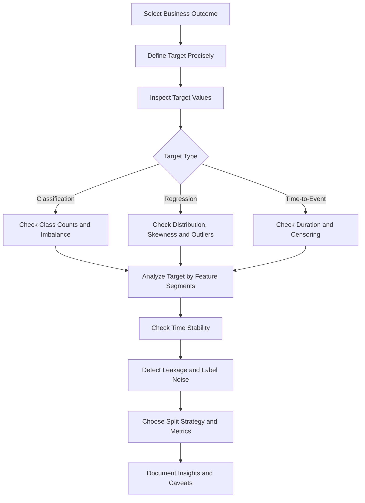

---

## 43. Practical Exercise

Use a small customer churn CSV dataset and create a reproducible notebook.

### Required Tasks

1. Load and inspect the dataset.
2. Identify the target variable.
3. Write a precise definition of the positive and negative classes.
4. Check the target data type.
5. Count missing target values.
6. Calculate the target-class distribution.
7. Calculate the overall churn rate.
8. Analyze churn by at least two categorical features.
9. Analyze churn against at least two numerical features.
10. Check whether the target rate changes over time.
11. Identify at least one possible leakage feature.
12. Write three insights supported by charts or tables.
13. Record at least one caveat or assumption.
14. Recommend one next analytical or business action.

---

## 44. Suggested Notebook Structure

```text
01. Business question
02. Target definition
03. Dataset loading
04. Schema inspection
05. Target data-quality checks
06. Target distribution
07. Target imbalance analysis
08. Target versus numerical features
09. Target versus categorical features
10. Time-based target analysis
11. Leakage investigation
12. Insights
13. Caveats
14. Recommendations
```

---

## 45. Suggested Portfolio Artifacts

This lesson can be converted into one or more portfolio artifacts:

* Target-analysis notebook
* Churn EDA report
* Data-quality dashboard
* Target-definition YAML file
* Leakage-checking utility
* Model evaluation report
* Class-imbalance experiment
* Threshold-selection analysis
* Target-monitoring dashboard
* Data dictionary containing label definitions

---

## 46. Common Mistakes

### Mistake 1: Choosing a Convenient Column Instead of the Correct Outcome

A column may be easy to access but may not represent the real business objective.

### Mistake 2: Using an Unclear Target Definition

Terms such as `active`, `churned`, `fraudulent`, or `successful` may have multiple meanings.

### Mistake 3: Ignoring Class Imbalance

High accuracy may hide poor minority-class detection.

### Mistake 4: Using Future Information

Features created after the prediction date cause leakage.

### Mistake 5: Dropping Missing Labels Without Investigation

Missing labels may reflect incomplete outcomes or systematic collection problems.

### Mistake 6: Treating Correlation as Causation

A feature associated with the target is not necessarily causing the outcome.

### Mistake 7: Using the Wrong Split Strategy

Random splitting may be invalid for time-series or repeated-entity data.

### Mistake 8: Selecting Metrics Without Business Context

Accuracy may not reflect the true cost of prediction errors.

### Mistake 9: Ignoring Label Noise

Incorrect target values limit the maximum achievable model quality.

### Mistake 10: Building Charts Without Writing Insights

Every important chart should support an interpretation, caveat, or recommendation.

---

## 47. Completion Checklist

* [ ] I can explain the **Target Variable** in one or two minutes.
* [ ] I can identify the target column in a supervised dataset.
* [ ] I can distinguish classification, regression, ordinal, count, and time-to-event targets.
* [ ] I can write a precise target definition.
* [ ] I understand observation windows and prediction windows.
* [ ] I can inspect missing values and inconsistent target labels.
* [ ] I can analyze class imbalance or regression-target skewness.
* [ ] I can calculate the target rate for a binary outcome.
* [ ] I can analyze the target across customer or data segments.
* [ ] I can identify possible target leakage.
* [ ] I can select an appropriate train-test splitting strategy.
* [ ] I can choose evaluation metrics that match the business objective.
* [ ] I have created a notebook, query, chart, model, API, or practical note for this lesson.
* [ ] I have documented at least one caveat, assumption, or follow-up question.

---

## 48. Related Outcome

Understand, clean, visualize, and explain datasets using business-oriented insights.

---

## 49. Related Project

### Mini Project: Customer Churn EDA

Create a customer churn analysis project containing:

* A documented target definition
* Data-quality checks
* Target distribution analysis
* Class-imbalance analysis
* Churn rate by customer segment
* Numerical and categorical feature comparisons
* Leakage investigation
* Time-based churn analysis
* Three evidence-based insights
* Business recommendations
* Caveats and assumptions
* A reproducible notebook
* A short insight report

Example project workflow:


---

## 50. Key Takeaways

* The target variable is the outcome that a supervised model attempts to predict.
* The target connects the business question to the machine learning task.
* A precise target definition is more important than simply selecting a dataset column.
* Target analysis should include missing values, class balance, skewness, outliers, time stability, and label quality.
* Features must only contain information available at prediction time.
* Target leakage can create excellent validation results but poor production performance.
* The correct evaluation metric depends on the target type and the business cost of prediction errors.
* A useful EDA output should contain evidence, interpretation, caveats, and actionable recommendations.

---

## 51. Final Summary

The **Target Variable** is a foundational concept in the AI and Data Scientist roadmap.

Before training a model, you should be able to answer:

```text
What exactly are we predicting?
Why does this outcome matter?
When is the prediction made?
When does the outcome become known?
How was the label created?
Is the target complete and reliable?
Is the target balanced or skewed?
Could any feature reveal the target?
Which metric represents business success?
```

Turn this lesson into a practical artifact such as a notebook, SQL analysis, chart, experiment, model, monitoring dashboard, API, Docker service, or portfolio report so that the knowledge is connected to a real data workflow.
````

### 3. `01 - AI & Dữ liệu/01 - AI Engineering & LLM/Ai-engineer/Khóa-1/Resources/llm_engineering/week4/community-contributions/ai_stock_trading/README.md`

Nguồn: `01 - AI & Dữ liệu/01 - AI Engineering & LLM/Ai-engineer/Khóa-1/Resources/llm_engineering/week4/community-contributions/ai_stock_trading/README.md`

````markdown
# 📈 AI Stock Trading & Sharia Compliance Platform

A comprehensive **Streamlit-based** web application that provides AI-powered stock analysis with Islamic Sharia compliance assessment. This professional-grade platform combines real-time financial data from USA and Egyptian markets, advanced technical analysis, and institutional-quality AI-driven insights to help users make informed investment decisions while adhering to Islamic finance principles.

## 📸 Application Screenshots

### Home View

*Main application interface with market selection and stock input*

### Chat Interface

*Interactive chat for trading advice, Sharia compliance, and stock analysis*

### Dashboard View

*Comprehensive dashboard with KPIs, charts, and real-time metrics*

## 🎯 Key Features

### 📊 **Comprehensive Stock Analysis**
- Real-time data fetching from multiple markets (USA, Egypt)
- Advanced technical indicators (RSI, MACD, Bollinger Bands, Moving Averages)
- Risk assessment and volatility analysis
- Performance metrics across multiple time periods

### 🤖 **AI-Powered Trading Decisions**
- GPT-4 powered investment recommendations
- Buy/Hold/Sell signals with confidence scores
- Price targets and stop-loss suggestions
- Algorithmic + AI combined decision making

### ☪️ **Sharia Compliance Checking**
- Islamic finance principles assessment
- Halal/Haram rulings with detailed reasoning
- Business activity and financial ratio screening
- Alternative investment suggestions

### 💬 **Natural Language Interface**
- Interactive chat interface for stock discussions
- Ask questions in plain English
- Context-aware responses about selected stocks
- Quick action buttons for common queries

### 📈 **Interactive Dashboards**
- Comprehensive metrics dashboard
- Multiple chart types (Price, Performance, Risk, Trading Signals)
- Real-time data visualization with Plotly
- Exportable analysis reports
- Real-time price charts with volume data
- Professional matplotlib-based visualizations
- Price statistics and performance metrics
- Responsive chart interface

### 🖥️ **Professional Interface**
- Clean, modern Streamlit web interface
- Multi-market support (USA & Egyptian stocks)
- Interactive chat interface with context awareness
- Real-time KPI dashboard with currency formatting
- Quick action buttons for common analysis tasks

## 🚀 Quick Start

### Prerequisites

Ensure you have Python 3.8+ installed on your system.

### Installation

1. **Clone or download this project**
```bash
git clone <repository-url>
cd ai_stock_trading
```

2. **Install dependencies**
```bash
pip install -r requirements.txt
```

3. **Set up environment variables**
Create a `.env` file in the project root:
```bash
OPENAI_API_KEY=your-api-key-here
```

### Running the Application

1. **Launch the Streamlit app**
```bash
streamlit run main_app.py
```

2. **Access the web interface** at `http://localhost:8501`

3. **Select your market** (USA or Egypt) from the sidebar

4. **Enter a stock symbol** and start analyzing!

## 📖 How to Use

1. **Select Market**: Choose between USA or Egypt from the sidebar
2. **Enter Stock Symbol**: Input a ticker (e.g., AAPL for USA, ABUK.CA for Egypt)
3. **View Dashboard**: See real-time KPIs, price charts, and key metrics
4. **Use Chat Interface**: Ask questions or request specific analysis:
   - "Give me trading advice for AAPL"
   - "Is this stock Sharia compliant?"
   - "What's the price target?"
5. **Review Professional Analysis**:
   - **Trading Recommendations**: Institutional-grade BUY/HOLD/SELL advice
   - **Sharia Compliance**: Comprehensive Islamic finance screening
   - **Technical Analysis**: Advanced indicators and risk assessment

### Example Tickers to Try

#### USA Market
| Ticker | Company | Sector | Expected Sharia Status |
|--------|---------|--------|-----------------------|
| **AAPL** | Apple Inc. | Technology | ✅ Likely Halal |
| **MSFT** | Microsoft Corp. | Technology | ✅ Likely Halal |
| **GOOGL** | Alphabet Inc. | Technology | ✅ Likely Halal |
| **JNJ** | Johnson & Johnson | Healthcare | ✅ Likely Halal |
| **BAC** | Bank of America | Banking | ❌ Likely Haram |
| **JPM** | JPMorgan Chase | Banking | ❌ Likely Haram |

#### Egypt Market
| Ticker | Company | Sector | Expected Sharia Status |
|--------|---------|--------|-----------------------|
| **ABUK.CA** | Abu Qir Fertilizers | Industrial | ✅ Likely Halal |
| **ETEL.CA** | Egyptian Telecom | Telecom | ✅ Likely Halal |
| **HRHO.CA** | Hassan Allam Holding | Construction | ✅ Likely Halal |
| **CIB.CA** | Commercial Intl Bank | Banking | ❌ Likely Haram |

## 🔧 Technical Implementation

### Modular Architecture

The platform is built with a clean, modular architecture using separate tool modules:

#### 1. **Stock Fetching Module** (`tools/fetching.py`)
- **Multi-Market Support**: USA (75+ stocks) and Egypt (50+ stocks) with proper currency handling
- **Real-Time Data**: Uses yfinance API with robust error handling
- **Currency Formatting**: Automatic USD/EGP formatting based on market
- **Stock Info Enrichment**: Company details, market cap, sector classification

#### 2. **Technical Analysis Module** (`tools/analysis.py`)
- **Advanced Indicators**: RSI, MACD, Bollinger Bands, Moving Averages
- **Risk Metrics**: Volatility analysis, Sharpe ratio, maximum drawdown
- **Performance Analysis**: Multi-timeframe returns and trend analysis
- **Professional Calculations**: Annualized metrics and statistical analysis

#### 3. **Trading Decisions Module** (`tools/trading_decisions.py`)
- **Institutional-Grade AI**: Senior analyst persona with 15+ years experience
- **Professional Standards**: BUY/HOLD/SELL with confidence, price targets, stop-loss
- **Risk Management**: Risk-reward ratios, time horizons, risk assessment
- **Robust JSON Parsing**: Handles malformed AI responses with fallback logic

#### 4. **Sharia Compliance Module** (`tools/sharia_compliance.py`)
- **Comprehensive Screening**: Business activities, financial ratios, trading practices
- **AAOIFI Standards**: Debt-to-assets < 33%, interest income < 5%
- **Prohibited Activities**: 50+ categories including banking, gambling, alcohol
- **User-Triggered Analysis**: Only shows when specifically requested

#### 5. **Charting Module** (`tools/charting.py`)
- **Professional Visualizations**: Plotly-based interactive charts
- **Multiple Chart Types**: Price, volume, technical indicators
- **Responsive Design**: Mobile-friendly chart rendering
- **Export Capabilities**: PNG/HTML export functionality

#### 6. **Main Application** (`main_app.py`)
- **Streamlit Interface**: Modern, responsive web application
- **Chat Integration**: Context-aware conversational interface
- **Real-Time KPIs**: Live dashboard with key metrics
- **Session Management**: Persistent data across user interactions

### AI Integration

The platform leverages OpenAI's GPT-4o-mini with specialized prompts:

#### Trading Analysis Prompts
- **Senior Analyst Persona**: 15+ years institutional experience
- **Professional Standards**: Risk-reward ratios, logical price targets
- **Structured Output**: JSON format with validation and error handling
- **Technical Focus**: Based on RSI, MACD, trend analysis, volume patterns

#### Sharia Compliance Prompts
- **Islamic Scholar Approach**: Follows AAOIFI and DSN standards
- **Comprehensive Screening**: Business activities, financial ratios, trading practices
- **Scholarly Reasoning**: Detailed justification with Islamic finance principles
- **Confidence Scoring**: Quantified certainty levels for rulings

## 📊 Sample Analysis Output

### Trade Recommendation Example
```
RECOMMENDATION: BUY

Based on the analysis of AAPL:
• 1Y return of +15.2% shows strong performance
• Volatility of 24.3% indicates manageable risk
• Recent 1M return of +5.8% shows positive momentum
• Strong volume indicates healthy trading activity

Key factors supporting BUY decision:
- Consistent positive returns across timeframes
- Volatility within acceptable range for tech stocks
- Strong market position and fundamentals
```

### Sharia Assessment Example
```json
{
  "ruling": "HALAL",
  "confidence": 85,
  "justification": "Apple Inc. primarily operates in technology hardware and software, which are permissible under Islamic law. The company's main revenue sources (iPhone, Mac, services) do not involve prohibited activities such as gambling, alcohol, or interest-based banking."
}
```

## ⚠️ Important Disclaimers

### Financial Disclaimer
- **This tool is for educational purposes only**
- **Not professional financial advice**
- **Past performance does not guarantee future results**
- **Consult qualified financial advisors before making investment decisions**

### Sharia Compliance Disclaimer
- **Consult qualified Islamic scholars for authoritative rulings**
- **AI assessments are preliminary and may have limitations**
- **Consider multiple sources for Sharia compliance verification**
- **Individual scholarly interpretations may vary**

### Technical Limitations
- **Data accuracy depends on yfinance API availability**
- **OpenAI API calls consume credits/tokens**
- **Network connectivity required for real-time data**
- **Analysis speed depends on API response times**

## 🔧 Customization

### Adding New Analysis Periods
```python
periods = ["1mo", "3mo", "6mo", "1y", "2y", "5y"]  # Modify as needed
```

### Modifying Sharia Criteria
```python
# Update the Sharia assessment prompt with additional criteria
prompt = f"""
Additional criteria:
- Debt-to-market cap ratio analysis
- Revenue source breakdown
- ESG factors consideration
"""
```

### Styling the Interface
```python
demo = create_interface()
demo.launch(theme="huggingface")  # Try different themes
```

## 📚 Dependencies

- **yfinance**: Real-time financial data
- **openai**: AI-powered analysis
- **pandas**: Data manipulation
- **matplotlib**: Chart generation
- **gradio**: Web interface
- **requests**: HTTP requests
- **beautifulsoup4**: Web scraping
- **numpy**: Numerical computations

## 🤝 Contributing

Contributions are welcome! Please feel free to submit issues, feature requests, or pull requests.

### Areas for Enhancement
- Additional technical indicators
- More sophisticated Sharia screening
- Portfolio analysis features
- Historical backtesting
- Mobile-responsive design

### 🔮 Future Work: MCP Integration

We plan to implement a **Model Context Protocol (MCP) layer** to make all trading tools accessible as standardized MCP tools:

#### Planned MCP Tools:
- **`stock_fetcher`** - Real-time market data retrieval for USA/Egypt markets
- **`technical_analyzer`** - Advanced technical analysis with 20+ indicators
- **`sharia_checker`** - Islamic finance compliance screening
- **`trading_advisor`** - AI-powered institutional-grade recommendations
- **`risk_assessor`** - Portfolio risk analysis and management
- **`chart_generator`** - Professional financial visualizations

#### Benefits of MCP Integration:
- **Standardized Interface**: Consistent tool access across different AI systems
- **Interoperability**: Easy integration with other MCP-compatible platforms
- **Scalability**: Modular architecture for adding new financial tools
- **Reusability**: Tools can be used independently or combined
- **Professional Integration**: Compatible with institutional trading platforms

This will enable the platform to serve as a comprehensive financial analysis toolkit that can be integrated into various AI-powered trading systems and workflows.

## 📄 License

This project is for educational purposes. Please ensure compliance with:
- OpenAI API usage terms
- Yahoo Finance data usage policies
- Local financial regulations
- Islamic finance guidelines

## 🙏 Acknowledgments

- **yfinance** for providing free financial data API
- **OpenAI** for GPT-4o-mini language model
- **Gradio** for the intuitive web interface framework
- **Islamic finance scholars** for Sharia compliance frameworks

---

**Made with ❤️ for the Muslim tech community and ethical investing enthusiasts**

*"And Allah knows best" - وَاللَّهُ أَعْلَمُ* 
````

### 4. `01 - AI & Dữ liệu/02 - Data Science, Analytics & ML/bi-analyst-roadmap/BI-Analyst-Roadmap-Course/00 - Roadmap.sh BI Analyst Official/Module 04 - Statistics Basics - Thong ke co ban/01-VariablesAndData-CorrelationAnalysis/003 - Correlation Analysis.md`

Nguồn: `01 - AI & Dữ liệu/02 - Data Science, Analytics & ML/bi-analyst-roadmap/BI-Analyst-Roadmap-Course/00 - Roadmap.sh BI Analyst Official/Module 04 - Statistics Basics - Thong ke co ban/01-VariablesAndData-CorrelationAnalysis/003 - Correlation Analysis.md`

````markdown
# 003 - Correlation Analysis

**Module:** Module 04 - Statistics Basics - Thống kê cơ bản  
**Roadmap item:** 4.3  
**Loại nội dung:** Statistics basics  
**Thời lượng gợi ý:** 45-75 phút

---

## 1. Tóm tắt
Correlation vs Causation

Với BI Analyst, **Correlation Analysis** cần được gắn với một câu hỏi kinh doanh rõ: ai cần quyết định, dữ liệu nào được dùng, metric nào quan trọng và insight sẽ dẫn tới hành động nào.

## 2. Mục tiêu học tập
- Giải thích được **Correlation Analysis** bằng ngôn ngữ dễ hiểu cho stakeholder không chuyên về dữ liệu.
- Biết cách áp dụng chủ đề này trong phân tích, dashboard, reporting hoặc portfolio BI.
- Tạo được một artifact nhỏ có thể review: SQL query, dashboard note, KPI definition, analysis brief hoặc executive summary.

## 3. Nội dung roadmap
- Correlation vs Causation
- Hệ số tương quan
- Phân tích mối quan hệ giữa biến

## 4. Ứng dụng trong công việc BI Analyst
- Bắt đầu từ business question trước khi chọn chart, query hoặc tool.
- Kiểm tra data quality, định nghĩa metric và bối cảnh trước khi kết luận.
- Chuyển kết quả phân tích thành recommendation, risk hoặc next action rõ ràng.

## 5. Bài tập thực hành
Tạo một dataset nhỏ, tính descriptive statistics và viết nhận xét tránh nhầm correlation với causation.

Sau đó viết 5-7 dòng trả lời: insight nào có thể giúp stakeholder ra quyết định tốt hơn?

## 6. Artifact nên tạo
- Statistics cheat sheet and hypothesis testing note
- Một ví dụ từ dashboard, SQL query, spreadsheet, BI tool hoặc business report
- Checklist chất lượng: dữ liệu đúng, metric rõ, chart dễ hiểu, recommendation có hành động

## 7. Câu hỏi tự kiểm tra
- Business question của bài này là gì?
- Dữ liệu có đủ đúng, đủ mới và đủ chi tiết để kết luận không?
- Metric/chart/query nào dễ bị hiểu sai?
- Insight cuối cùng dẫn tới quyết định hoặc hành động nào?

## 8. Tổng kết
**Correlation Analysis** là một phần trong năng lực biến dữ liệu thành quyết định. Hãy kết thúc bài học bằng artifact có thể đưa vào dashboard, report hoặc portfolio BI Analyst.
````

### 5. `01 - AI & Dữ liệu/02 - Data Science, Analytics & ML/data-analyst-roadmap/Data-Analyst-Roadmap-Course/00 - Roadmap.sh Data Analyst Official/03 - Analysis and Visualisation/Module 11 - Statistical Analysis/01-HypothesisTesting-Regression/002 - Correlation Analysis.md`

Nguồn: `01 - AI & Dữ liệu/02 - Data Science, Analytics & ML/data-analyst-roadmap/Data-Analyst-Roadmap-Course/00 - Roadmap.sh Data Analyst Official/03 - Analysis and Visualisation/Module 11 - Statistical Analysis/01-HypothesisTesting-Regression/002 - Correlation Analysis.md`

````markdown
# 002 - Correlation Analysis

**Hoc phan:** 03 - Analysis and Visualisation
**Module:** Module 11 - Statistical Analysis
**Nhom noi dung:** Statistical Analysis
**Nguon roadmap:** Statistical Analysis / Statistical Analysis
**Loai bai:** Statistical analysis
**Thu tu trong module:** 002
**Thoi luong goi y:** 24 phut

---

## 1. Tom tat

Bai nay giai thich **Correlation Analysis** trong boi canh Data Analyst hien dai. Sau bai hoc, ban nen biet topic nay giup tra loi cau hoi data nao, nam o dau trong workflow va co the bien thanh query, spreadsheet, notebook, chart, dashboard hoac portfolio artifact.

## 2. Muc tieu hoc tap

- Giai thich duoc Correlation Analysis bang ngon ngu cua ban.
- Nhan biet topic nay nam o dau trong workflow data analyst.
- Ap dung vao mot dataset, query, spreadsheet, notebook, chart hoac dashboard nho.

## 3. Khai niem chinh

- Correlation do muc do hai bien di cung nhau.
- Correlation khong chung minh causation.
- Can xem scatter plot, outlier va confounding factor truoc khi ket luan.

## 4. Vi du / Demo

```text
Question: do discount and order value move together?
Check: scatter plot, correlation coefficient, outliers, confounders
```

## 5. Bai tap thuc hanh

- Tinh metric tren toan bo dataset va theo it nhat 2 segment.
- Ve chart kiem tra distribution hoac relationship.
- Viet 3 cau ket luan kem caveat ve sample/data quality.

## 6. Loi thuong gap

- Ket luan qua nhanh khi chua xem sample size va distribution.
- Danh dong correlation voi causation.
- Chi nhin average ma bo qua segment va outlier.

## 7. Checklist hoan thanh

- Toi co the giai thich **Correlation Analysis** trong 1-2 phut.
- Toi co mot vi du nho hoac artifact thuc hanh cho bai nay.
- Toi biet topic nay lien quan den dataset, metric, chart, insight hoac business question nao.
- Toi da ghi lai it nhat mot caveat hoac cau hoi can phan tich tiep.

## 8. Outcome lien quan

Analyze relationships between variables, test hypotheses and reason from data instead of guesswork.

## 9. Tong ket

**Correlation Analysis** la mot moc trong lo trinh Data Analyst. Hay bien no thanh mot bang tinh, query, notebook, chart, dashboard hoac portfolio note de kien thuc co cho bam.
````

### 6. `01 - AI & Dữ liệu/02 - Data Science, Analytics & ML/machine-learning-roadmap/Machine-Learning-Roadmap-Course/00 - Roadmap.sh Machine Learning Official/04 - Evaluation, Workflow and Deep Learning/Module 11 - Model Evaluation/05-MAPE-TimeSeriesValidation/025 - Time Series Validation.md`

Nguồn: `01 - AI & Dữ liệu/02 - Data Science, Analytics & ML/machine-learning-roadmap/Machine-Learning-Roadmap-Course/00 - Roadmap.sh Machine Learning Official/04 - Evaluation, Workflow and Deep Learning/Module 11 - Model Evaluation/05-MAPE-TimeSeriesValidation/025 - Time Series Validation.md`

````markdown
# 025 - Time Series Validation

**Hoc phan:** 04 - Evaluation, Workflow and Deep Learning
**Module:** Module 11 - Model Evaluation
**Nhom noi dung:** Validation Techniques
**Nguon roadmap:** Model Evaluation / Validation Techniques
**Loai bai:** evaluation
**Thu tu trong module:** 025
**Thoi luong goi y:** 30 phut

---

## 1. Tom tat

Bai nay giai thich **Time Series Validation** trong boi canh Machine Learning Engineer Roadmap 2026. Sau bai hoc, ban nen biet topic nay nam o dau trong quy trinh ML, lien quan den data, feature, model, training, evaluation, deployment hoac portfolio nhu the nao.

## 2. Muc tieu hoc tap

- Giai thich duoc Time Series Validation bang ngon ngu cua ban.
- Nhan biet topic nay anh huong den model quality, generalization, interpretability, cost hoac production risk nao.
- Ap dung vao mot artifact nho: notebook, script, metric table, chart, diagram, model report hoac README.

## 3. Khai niem chinh

- Time Series Validation is part of the Validation Techniques topic in the Machine Learning roadmap.
- Validation strategy should match how the model will be used in the real world.
- Random splits are not always safe for time series, grouped users or future prediction.
- Learn it by connecting the definition, the dataset assumption, the model behavior and the evaluation impact.
- An ML Engineer should know where this concept appears in an end-to-end training workflow.
- The validation design must imitate how the model will see future data.

## 4. Thuc hanh

1. Calculate the metric or validation result on a small prediction table.
2. Explain when this metric is helpful and when it is misleading.
3. Connect the result to a decision: keep, tune, reject or investigate the model.

## 5. Bai tap

Calculate the metric or validation method on a model result and explain the decision it supports.

## 6. Checklist hoan thanh

- [ ] Co dinh nghia ngan gon.
- [ ] Co vi du trong bai toan ML.
- [ ] Co artifact nho de dua vao portfolio.
- [ ] Co ghi chu ve leakage, metric, overfitting, interpretability hoac production risk neu lien quan.

## 7. Ghi chu san xuat

Khi dua vao production, hay hoi: du lieu moi co giong train data khong, metric co phu hop business cost khong, model co drift khong, prediction co giai thich duoc khong va pipeline co tai lap duoc tu raw data den model artifact khong.
````

### 7. `01 - AI & Dữ liệu/02 - Data Science, Analytics & ML/ai-data-scientist-roadmap/AI-Data-Scientist-Roadmap-Course/00 - Roadmap.sh AI Data Scientist Official/03 - Machine Learning and Deep Learning/Module 06 - Machine Learning/01-Supervised/007 - XGBoost - LightGBM.md`

Nguồn: `01 - AI & Dữ liệu/02 - Data Science, Analytics & ML/ai-data-scientist-roadmap/AI-Data-Scientist-Roadmap-Course/00 - Roadmap.sh AI Data Scientist Official/03 - Machine Learning and Deep Learning/Module 06 - Machine Learning/01-Supervised/007 - XGBoost - LightGBM.md`

````markdown
# 007 - XGBoost and LightGBM

**Course:** 03 - Machine Learning and Deep Learning
**Module:** Module 06 - Machine Learning
**Content Group:** Supervised Learning
**Roadmap Source:** Machine Learning / Supervised Learning
**Lesson Type:** Machine Learning
**Lesson Order:** 007
**Suggested Duration:** 26 minutes

---

## 1. Summary

This lesson introduces **XGBoost** and **LightGBM**, two powerful gradient boosting frameworks widely used for supervised machine learning on structured and tabular data.

Both algorithms build an ensemble of decision trees sequentially. Each new tree attempts to correct the errors made by the previous trees.

After completing this lesson, you should understand:

* How gradient-boosted decision trees work.
* How XGBoost and LightGBM improve standard gradient boosting.
* The main differences between XGBoost and LightGBM.
* How to train and evaluate these models.
* How to tune important hyperparameters.
* How to prevent overfitting and data leakage.
* When these models are appropriate for a business problem.

---

## 2. Learning Objectives

By the end of this lesson, you should be able to:

* Explain XGBoost and LightGBM in your own words.
* Describe how boosting differs from bagging.
* Identify the role of these models in a machine learning workflow.
* Train XGBoost and LightGBM models on a tabular dataset.
* Compare them with a simple baseline model.
* Select evaluation metrics that match the business objective.
* Interpret feature importance and model errors.
* Identify common problems such as overfitting and data leakage.
* Turn the experiment into a notebook, API, report, or portfolio artifact.

---

## 3. Main Concepts

### 3.1 What Is Gradient Boosting?

Gradient boosting is an ensemble learning method that combines many weak learners, usually shallow decision trees, into a strong predictive model.

Unlike Random Forest, which trains trees independently, gradient boosting trains trees **sequentially**.

Each new tree focuses on the errors made by the current ensemble.

```text
Final prediction =
Initial prediction
+ Tree 1 correction
+ Tree 2 correction
+ Tree 3 correction
+ ...
```

The general prediction process can be written as:

```text
F_m(x) = F_(m-1)(x) + learning_rate × tree_m(x)
```

Where:

* `F_m(x)` is the model after adding tree `m`.
* `F_(m-1)(x)` is the previous model.
* `tree_m(x)` is the new tree trained to reduce the remaining error.
* `learning_rate` controls how strongly each tree affects the final prediction.

---

### 3.2 Gradient Boosting Workflow

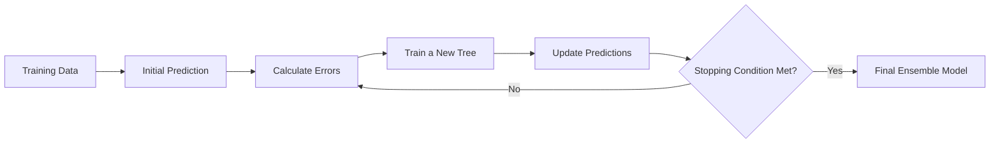

At each iteration:

1. The current model generates predictions.
2. The loss function measures prediction errors.
3. A new tree learns how to reduce those errors.
4. The new tree is added to the ensemble.
5. The process repeats until a stopping condition is reached.

---

## 4. XGBoost

### 4.1 What Is XGBoost?

**XGBoost**, or **Extreme Gradient Boosting**, is an optimized implementation of gradient-boosted decision trees.

It was designed to improve:

* Training speed.
* Model accuracy.
* Memory efficiency.
* Regularization.
* Missing-value handling.
* Parallel computation.

XGBoost is frequently used for:

* Classification.
* Regression.
* Ranking.
* Fraud detection.
* Customer churn prediction.
* Credit-risk prediction.
* Sales forecasting.
* House-price prediction.

---

### 4.2 Important XGBoost Features

#### Regularization

XGBoost supports L1 and L2 regularization to control model complexity.

```text
Objective =
Training loss
+ Complexity penalty
```

Regularization helps prevent trees from becoming unnecessarily complex.

#### Missing-Value Handling

XGBoost can automatically learn which branch missing values should follow during tree construction.

#### Tree Pruning

XGBoost grows trees and removes branches that do not provide enough improvement.

#### Row and Feature Sampling

The model can train each tree using only a subset of:

* Training rows.
* Input features.

This introduces randomness and can reduce overfitting.

#### Early Stopping

Training can stop when validation performance no longer improves.

---

## 5. LightGBM

### 5.1 What Is LightGBM?

**LightGBM**, or **Light Gradient Boosting Machine**, is a gradient boosting framework developed for efficient training on large datasets.

It is designed to provide:

* Faster training.
* Lower memory usage.
* Efficient handling of large datasets.
* Native categorical-feature support.
* High predictive performance.

LightGBM is particularly useful when a dataset contains:

* Many rows.
* Many features.
* Sparse features.
* High-cardinality categorical variables.

---

### 5.2 Leaf-Wise Tree Growth

A major difference between LightGBM and many other tree algorithms is how trees grow.

Traditional level-wise growth expands all nodes at the same depth.

```text
        Root
       /    \
     Node   Node
     / \     / \
```

LightGBM normally uses **leaf-wise growth**. It expands the leaf that produces the largest reduction in loss.

```text
        Root
       /    \
    Leaf    Node
           /    \
        Leaf    Node
```

Leaf-wise growth can reduce training loss quickly, but it may overfit when:

* The dataset is small.
* Trees are allowed to grow too deep.
* `num_leaves` is too large.
* Minimum leaf constraints are too weak.

---

### 5.3 Histogram-Based Learning

LightGBM groups continuous feature values into discrete bins.

Instead of evaluating every possible split value, it evaluates split candidates based on these bins.

```text
Continuous values
        |
        v
Histogram bins
        |
        v
Efficient split search
```

This reduces:

* Computation time.
* Memory usage.
* Training cost.

---

## 6. XGBoost vs. LightGBM

| Aspect               | XGBoost                          | LightGBM                                    |
| -------------------- | -------------------------------- | ------------------------------------------- |
| Tree growth          | Usually level-wise or depth-wise | Leaf-wise                                   |
| Training speed       | Fast                             | Often faster on large datasets              |
| Memory usage         | Moderate                         | Usually lower                               |
| Small datasets       | Often stable                     | May require stronger regularization         |
| Large datasets       | Effective                        | Especially efficient                        |
| Categorical features | Usually require preprocessing    | Native support available                    |
| Overfitting risk     | Moderate                         | Can be higher with unrestricted leaf growth |
| Ecosystem maturity   | Very mature                      | Mature and widely adopted                   |
| GPU support          | Available                        | Available                                   |
| Missing values       | Native handling                  | Native handling                             |

Neither algorithm is always better.

The correct choice should be based on:

* Validation performance.
* Training time.
* Inference latency.
* Dataset size.
* Memory constraints.
* Model stability.
* Deployment requirements.

---

## 7. Boosting vs. Bagging

Random Forest uses **bagging**, while XGBoost and LightGBM use **boosting**.

| Property             | Bagging            | Boosting                         |
| -------------------- | ------------------ | -------------------------------- |
| Example              | Random Forest      | XGBoost, LightGBM                |
| Tree training        | Independent        | Sequential                       |
| Main goal            | Reduce variance    | Reduce bias and prediction error |
| Parallelization      | Naturally parallel | More dependent on previous trees |
| Sensitivity to noise | Usually lower      | Can be higher                    |
| Typical tree depth   | Deep trees         | Shallow or moderately deep trees |

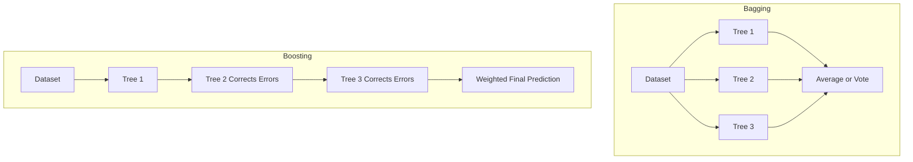

---

## 8. Position in the Machine Learning Workflow

XGBoost and LightGBM should not be trained before the data problem is clearly defined.


A strong workflow should include:

1. A clearly defined target.
2. A leakage-safe data split.
3. A simple baseline.
4. A gradient boosting model.
5. Validation and test metrics.
6. Error analysis.
7. Model interpretation.
8. Deployment and monitoring considerations.

---

## 9. Data Splitting and Leakage Prevention

### 9.1 Standard Random Split

A random split may be suitable when observations are independent.

```text
Dataset
├── Training set
├── Validation set
└── Test set
```

Typical proportions:

```text
Training:   70%
Validation: 15%
Test:       15%
```

---

### 9.2 Time-Based Split

For forecasting or time-dependent data, preserve chronological order.

```text
Past data       Recent data       Future-like data
Training   -->  Validation   -->   Test
```

Do not randomly shuffle future observations into the training set.

---

### 9.3 Group-Based Split

If multiple rows belong to the same user, patient, device, or company, keep each group in only one split.

Otherwise, the model may indirectly see information about test entities during training.

---

### 9.4 Common Leakage Sources

* Calculating preprocessing statistics using the entire dataset.
* Encoding categories before splitting the data.
* Using future information to predict past events.
* Including columns created after the target event.
* Allowing the same customer or entity to appear in both training and test sets.
* Selecting features based on test-set performance.
* Performing target encoding without cross-validation.

---

## 10. Selecting an Evaluation Metric

The best metric depends on the problem and the business cost of errors.

### 10.1 Regression Metrics

#### Mean Absolute Error

```text
MAE = average of absolute prediction errors
```

MAE is easy to interpret because it uses the same unit as the target.

#### Root Mean Squared Error

```text
RMSE = square root of average squared prediction errors
```

RMSE penalizes large errors more strongly than MAE.

#### R-squared

```text
R-squared = 1 - unexplained variance / total variance
```

R-squared measures how much target variance is explained by the model.

---

### 10.2 Classification Metrics

#### Accuracy

Useful when classes are reasonably balanced and error costs are similar.

#### Precision

Useful when false positives are expensive.

```text
Precision = true positives / predicted positives
```

#### Recall

Useful when false negatives are expensive.

```text
Recall = true positives / actual positives
```

#### F1 Score

Balances precision and recall.

```text
F1 = harmonic mean of precision and recall
```

#### ROC-AUC

Measures ranking quality across multiple classification thresholds.

#### PR-AUC

Often more informative than ROC-AUC when the positive class is rare.

---

## 11. Important Hyperparameters

### 11.1 Shared Hyperparameters

| Hyperparameter     | Purpose                                 |
| ------------------ | --------------------------------------- |
| `n_estimators`     | Number of boosting trees                |
| `learning_rate`    | Contribution of each tree               |
| `max_depth`        | Maximum tree depth                      |
| `subsample`        | Fraction of rows used for each tree     |
| `colsample_bytree` | Fraction of features used for each tree |
| `min_child_weight` | Minimum weight required in a child node |
| `reg_alpha`        | L1 regularization                       |
| `reg_lambda`       | L2 regularization                       |

---

### 11.2 Important LightGBM Hyperparameters

| Hyperparameter      | Purpose                                 |
| ------------------- | --------------------------------------- |
| `num_leaves`        | Maximum number of leaves in each tree   |
| `max_depth`         | Limits tree depth                       |
| `min_child_samples` | Minimum observations required in a leaf |
| `feature_fraction`  | Fraction of features used               |
| `bagging_fraction`  | Fraction of rows used                   |
| `bagging_freq`      | Frequency of row sampling               |
| `max_bin`           | Number of histogram bins                |

A useful relationship is:

```text
num_leaves should usually be controlled together with max_depth
```

Very large values of `num_leaves` can produce overly complex trees.

---

### 11.3 Learning Rate and Number of Trees

The learning rate and number of trees are closely related.

```text
Lower learning rate
        +
More trees
        =
Slower but often more stable learning
```

```text
Higher learning rate
        +
Fewer trees
        =
Faster but potentially unstable learning
```

A common strategy is:

1. Start with a moderate learning rate.
2. Enable early stopping.
3. Increase the maximum number of trees.
4. Allow validation performance to determine the final number of trees.

---

## 12. Training an XGBoost Regression Model

```python
from sklearn.metrics import mean_absolute_error, mean_squared_error
from sklearn.model_selection import train_test_split
from xgboost import XGBRegressor

# X contains input features.
# y contains the regression target.
X_train, X_test, y_train, y_test = train_test_split(
    X,
    y,
    test_size=0.2,
    random_state=42
)

model = XGBRegressor(
    n_estimators=500,
    learning_rate=0.05,
    max_depth=6,
    subsample=0.8,
    colsample_bytree=0.8,
    reg_alpha=0.0,
    reg_lambda=1.0,
    objective="reg:squarederror",
    random_state=42
)

model.fit(X_train, y_train)

predictions = model.predict(X_test)

mae = mean_absolute_error(y_test, predictions)
rmse = mean_squared_error(
    y_test,
    predictions
) ** 0.5

print(f"MAE: {mae:.4f}")
print(f"RMSE: {rmse:.4f}")
```

---

## 13. Training a LightGBM Regression Model

```python
from lightgbm import LGBMRegressor
from sklearn.metrics import mean_absolute_error, mean_squared_error
from sklearn.model_selection import train_test_split

X_train, X_test, y_train, y_test = train_test_split(
    X,
    y,
    test_size=0.2,
    random_state=42
)

model = LGBMRegressor(
    n_estimators=500,
    learning_rate=0.05,
    num_leaves=31,
    max_depth=-1,
    min_child_samples=20,
    subsample=0.8,
    colsample_bytree=0.8,
    reg_alpha=0.0,
    reg_lambda=1.0,
    random_state=42
)

model.fit(X_train, y_train)

predictions = model.predict(X_test)

mae = mean_absolute_error(y_test, predictions)
rmse = mean_squared_error(
    y_test,
    predictions
) ** 0.5

print(f"MAE: {mae:.4f}")
print(f"RMSE: {rmse:.4f}")
```

---

## 14. Classification Example

```python
from sklearn.metrics import classification_report, roc_auc_score
from xgboost import XGBClassifier

model = XGBClassifier(
    n_estimators=400,
    learning_rate=0.05,
    max_depth=5,
    subsample=0.8,
    colsample_bytree=0.8,
    eval_metric="logloss",
    random_state=42
)

model.fit(X_train, y_train)

predicted_classes = model.predict(X_test)
predicted_probabilities = model.predict_proba(X_test)[:, 1]

print(classification_report(y_test, predicted_classes))
print(
    "ROC-AUC:",
    roc_auc_score(y_test, predicted_probabilities)
)
```

For imbalanced classification, do not rely on accuracy alone.

Also inspect:

* Precision.
* Recall.
* F1 score.
* PR-AUC.
* Confusion matrix.
* Performance at the selected probability threshold.

---

## 15. Early Stopping

Early stopping prevents unnecessary trees from being added after validation performance stops improving.

Conceptually:

```text
Train a tree
    |
Evaluate validation loss
    |
Improved?
├── Yes: continue training
└── No for several rounds: stop
```

Example using XGBoost:

```python
model = XGBRegressor(
    n_estimators=3000,
    learning_rate=0.03,
    max_depth=6,
    subsample=0.8,
    colsample_bytree=0.8,
    early_stopping_rounds=50,
    random_state=42
)

model.fit(
    X_train,
    y_train,
    eval_set=[(X_validation, y_validation)],
    verbose=False
)
```

The test set must remain untouched until the final evaluation.

---

## 16. Baseline Comparison

A complex model should always be compared with a simple baseline.

Possible regression baselines:

* Mean prediction.
* Median prediction.
* Linear Regression.
* Decision Tree.
* Random Forest.

Possible classification baselines:

* Majority-class prediction.
* Logistic Regression.
* Decision Tree.
* Random Forest.

Example comparison table:

| Model             | Validation MAE | Test MAE |      Training Time |
| ----------------- | -------------: | -------: | -----------------: |
| Mean baseline     |         48,300 |   49,100 | Less than 1 second |
| Linear Regression |         32,700 |   33,500 |           1 second |
| Random Forest     |         25,600 |   26,200 |         18 seconds |
| XGBoost           |         22,900 |   23,400 |         11 seconds |
| LightGBM          |         22,500 |   23,100 |          4 seconds |

The exact values depend on the dataset.

A model should not be selected only because it has the highest score. Also consider:

* Stability.
* Interpretability.
* Memory usage.
* Inference latency.
* Maintenance cost.
* Business impact.

---

## 17. Feature Importance and Interpretation

Tree-based models can estimate which features contributed most to their predictions.

Common importance types include:

* Number of times a feature was used.
* Average gain produced by a feature.
* Number of observations affected by splits.
* Permutation importance.
* SHAP values.

### 17.1 Built-In Feature Importance

```python
import pandas as pd

importance = pd.Series(
    model.feature_importances_,
    index=X_train.columns
).sort_values(ascending=False)

print(importance.head(10))
```

Built-in importance is useful for exploration, but it should not automatically be interpreted as causality.

---

### 17.2 SHAP Interpretation

SHAP can explain:

* Which features are important globally.
* Why one prediction is high or low.
* Whether a feature increases or decreases a prediction.
* How feature effects vary across observations.

```text
Model prediction
=
Base prediction
+ Contribution from feature A
+ Contribution from feature B
+ Contribution from feature C
```

A feature may be predictive because it is correlated with the target, not because it causes the target.

---

## 18. Error Analysis

A single metric does not explain where the model fails.

Error analysis should investigate model performance across meaningful groups.

Examples:

* Cheap houses versus expensive houses.
* New customers versus long-term customers.
* Different regions.
* Different product categories.
* Majority and minority classes.
* Recent and historical periods.
* Rows with many missing values.

Example regression error table:

| Segment           | Row Count |    MAE | Observation                  |
| ----------------- | --------: | -----: | ---------------------------- |
| Low-price houses  |     1,240 | 12,300 | Strong performance           |
| Mid-price houses  |     2,810 | 19,700 | Acceptable performance       |
| High-price houses |       450 | 61,200 | Large underestimation errors |

Possible next actions:

* Transform a skewed target.
* Add location-based features.
* Add interaction features.
* Collect more examples for difficult segments.
* Tune regularization.
* Review suspicious labels.
* Train separate models for highly different segments.

---

## 19. Common Mistakes

### 19.1 Data Leakage

The model receives information that would not be available at prediction time.

**Prevention:**

* Split the data before fitting transformations.
* Use pipelines.
* Preserve temporal order.
* Validate feature availability at inference time.

---

### 19.2 Using the Wrong Metric

A high accuracy score may hide poor minority-class performance.

**Prevention:**

Connect the metric to the real cost of:

* False positives.
* False negatives.
* Large regression errors.
* Ranking errors.

---

### 19.3 No Baseline

A complex boosting model may provide only a small improvement over a simpler model.

**Prevention:**

Train at least one simple baseline before tuning.

---

### 19.4 Excessive Hyperparameter Tuning

Testing many configurations on the same validation set can overfit the validation process.

**Prevention:**

* Use cross-validation where appropriate.
* Keep a final untouched test set.
* Limit the search space.
* Track experiments systematically.

---

### 19.5 Trees That Are Too Complex

Deep trees or too many leaves can memorize training data.

**Prevention:**

* Reduce `max_depth`.
* Reduce `num_leaves`.
* Increase minimum leaf size.
* Increase regularization.
* Use row and feature sampling.
* Apply early stopping.

---

### 19.6 Ignoring Probability Calibration

A classifier may rank observations correctly while producing inaccurate probabilities.

**Prevention:**

Evaluate calibration when predicted probabilities are used for:

* Risk estimation.
* Resource allocation.
* Financial decisions.
* Medical prioritization.
* Threshold-based business actions.

---

### 19.7 Treating Feature Importance as Causality

A highly important feature is not necessarily a causal driver.

**Prevention:**

Use domain knowledge, controlled experiments, or causal inference methods before making causal claims.

---

## 20. Practical Exercise

### Task

Build a house-price prediction experiment using:

1. A mean or median baseline.
2. Linear Regression.
3. Random Forest.
4. XGBoost or LightGBM.

### Suggested Workflow

```text
Load data
    |
Inspect target and features
    |
Create train, validation, and test sets
    |
Build preprocessing pipeline
    |
Train baseline
    |
Train comparison models
    |
Evaluate metrics
    |
Analyze errors
    |
Interpret important features
    |
Document conclusions
```

### Required Outputs

Your notebook should contain:

* Dataset description.
* Target definition.
* Data-splitting strategy.
* Leakage checks.
* Baseline results.
* XGBoost or LightGBM results.
* Validation and test metrics.
* Hyperparameter configuration.
* Feature-importance chart.
* Error analysis.
* Business interpretation.
* Recommended next experiment.

---

## 21. Suggested Experiment Table

| Experiment | Model             | Main Change                  | Validation Metric | Notes                |
| ---------- | ----------------- | ---------------------------- | ----------------: | -------------------- |
| EXP-001    | Median baseline   | Initial baseline             |                 — | Reference            |
| EXP-002    | Linear Regression | Numeric and encoded features |                 — | Simple model         |
| EXP-003    | Random Forest     | Nonlinear baseline           |                 — | Bagging              |
| EXP-004    | XGBoost           | Default parameters           |                 — | First boosting model |
| EXP-005    | XGBoost           | Lower learning rate          |                 — | More trees           |
| EXP-006    | LightGBM          | Leaf-wise model              |                 — | Faster training      |
| EXP-007    | LightGBM          | Stronger regularization      |                 — | Reduce overfitting   |

Record both successful and unsuccessful experiments.

---

## 22. Model Selection Checklist

Before selecting the final model, answer these questions:

* Does it outperform the baseline?
* Is the improvement meaningful to the business?
* Is validation performance stable?
* Is test performance close to validation performance?
* Does it work well across important customer or data segments?
* Is prediction latency acceptable?
* Is memory usage acceptable?
* Can the model be explained sufficiently?
* Are all features available at inference time?
* Can the preprocessing pipeline be reproduced?
* Can performance be monitored after deployment?

---

## 23. Deployment Considerations

A trained model alone is not a production system.

A deployment artifact may include:

```text
Input data
    |
Validation
    |
Feature preprocessing
    |
XGBoost or LightGBM model
    |
Prediction
    |
Logging and monitoring
```

Important production checks include:

* Input schema validation.
* Missing-feature handling.
* Feature-order consistency.
* Model versioning.
* Preprocessing versioning.
* Prediction latency.
* Data drift.
* Feature drift.
* Performance degradation.
* Model rollback strategy.

Possible deployment formats:

* Python API with FastAPI.
* Batch prediction pipeline.
* Scheduled forecasting job.
* Docker service.
* Cloud model endpoint.
* Dashboard with prediction explanations.

---

## 24. Completion Checklist

* [ ] I can explain XGBoost and LightGBM in one or two minutes.
* [ ] I understand how boosting differs from bagging.
* [ ] I can describe the difference between level-wise and leaf-wise tree growth.
* [ ] I trained a simple baseline model.
* [ ] I trained at least one XGBoost or LightGBM model.
* [ ] I evaluated the model on validation and test data.
* [ ] I selected a metric that matches the business problem.
* [ ] I checked for data leakage.
* [ ] I used early stopping or another overfitting-control method.
* [ ] I performed error analysis.
* [ ] I inspected feature importance or SHAP explanations.
* [ ] I recorded at least one limitation or assumption.
* [ ] I identified the next feature or experiment to test.
* [ ] I created a notebook, model, API, chart, report, or portfolio artifact.

---

## 25. Related Outcome

Train, compare, and evaluate supervised and unsupervised machine learning models using thoughtful feature engineering, appropriate metrics, reproducible experiments, and business-oriented interpretation.

---

## 26. Related Project

### Mini Project: House Price Prediction

Create a complete machine learning workflow that includes:

* Exploratory Data Analysis.
* Missing-value handling.
* Categorical-variable encoding.
* Feature engineering.
* Linear Regression.
* Random Forest.
* XGBoost.
* LightGBM.
* Hyperparameter tuning.
* Error analysis.
* Feature interpretation.
* Model comparison.
* Optional FastAPI deployment.

Suggested final comparison:

```text
Baseline
    vs.
Linear Regression
    vs.
Random Forest
    vs.
XGBoost
    vs.
LightGBM
```

The final recommendation should explain not only which model achieved the best metric, but also why it is appropriate for the business and deployment environment.

---

## 27. Conclusion

**XGBoost and LightGBM** are among the strongest general-purpose algorithms for supervised learning on tabular data.

Their main advantages include:

* Strong predictive performance.
* Support for nonlinear relationships.
* Automatic modeling of feature interactions.
* Flexible regularization.
* Native missing-value handling.
* Efficient implementations.
* Useful model-interpretation tools.

However, a high model score is not sufficient.

A reliable machine learning solution must also include:

* A meaningful baseline.
* A leakage-safe evaluation strategy.
* A metric aligned with the business objective.
* Careful hyperparameter control.
* Error analysis.
* Model interpretation.
* Reproducible preprocessing.
* Deployment and monitoring plans.

Turn this lesson into a practical artifact such as a notebook, model comparison report, prediction API, Docker service, experiment log, or portfolio project so that the knowledge becomes reusable.
````
