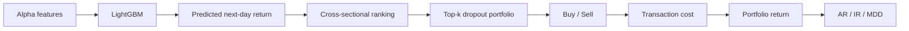

# Bài 06 - Thiết kế thực nghiệm và Backtest

## 1. Tóm tắt

Một alpha factor chỉ thực sự có giá trị khi khả năng dự báo của nó còn tồn tại ngoài giai đoạn dùng để xây dựng và lựa chọn factor. Vì vậy, việc đánh giá AlphaAgent không dừng ở câu hỏi “backtest có lợi nhuận cao hay không”, mà phải kiểm tra đồng thời **predictive effectiveness**, **độ ổn định theo thời gian**, **rủi ro của portfolio** và **khả năng duy trì hiệu quả sau transaction cost**.

Thiết kế thực nghiệm sử dụng hai thị trường là **S&P 500** và **CSI 500**, chia dữ liệu theo trình tự thời gian thành `train`, `validation` và `test`. Raw feature dùng để xây factor chỉ gồm **OHLCV**: `open`, `high`, `low`, `close`, `volume`. Các alpha mới được kết hợp với bốn base alpha rồi đưa vào `LightGBM` để dự báo next-day return. Portfolio sau đó được xây dựng từ ranking của predicted return và đánh giá sau khi tính transaction fee. 

Mạch đánh giá tổng quát là:

```text
OHLCV
   ↓
Alpha factor / base alpha
   ↓
Chuẩn hóa cross-sectional
   ↓
LightGBM
   ↓
Dự báo next-day return
   ↓
Xếp hạng cổ phiếu
   ↓
Portfolio rule
   ↓
Transaction cost
   ↓
IC / RankIC / ICIR
AR / IR / MDD
```

Điểm quan trọng nhất là phải phân biệt **factor có tín hiệu dự báo hay không** với **portfolio cuối cùng kiếm được bao nhiêu lợi nhuận**. Hai câu hỏi liên quan nhưng không giống nhau.

## 2. Mục tiêu học tập

Sau bài học, người học có thể:

* giải thích được vai trò của `IC`, `RankIC`, `ICIR`, `AR`, `IR` và `MDD`;
* phân biệt được predictive metric với portfolio metric;
* đọc đúng một temporal `train/validation/test split`;
* giải thích được vì sao time-series data không nên chia ngẫu nhiên trong bài toán này;
* nhận diện được nguy cơ leakage khi tạo future-return target hoặc rolling feature;
* mô tả được pipeline từ `OHLCV` đến alpha expression, `LightGBM`, ranking và portfolio;
* giải thích được vai trò của cross-sectional Z-score normalization;
* mô tả được bốn base alpha được sử dụng trong pipeline;
* giải thích được quy tắc `top-k dropout`;
* phân tích được ảnh hưởng của transaction cost lên backtest;
* giải thích được vì sao test period kéo dài nhiều năm đặc biệt quan trọng khi nghiên cứu alpha decay;
* đọc kết quả thực nghiệm bằng cách kết hợp performance, stability và risk thay vì chỉ nhìn một metric.

## 3. Dữ liệu OHLCV và bài toán dự báo

### 3.1. Năm raw feature cơ bản

Factor construction chỉ bắt đầu từ năm trường:

```text
Open
High
Low
Close
Volume
```

hay viết gọn là **OHLCV**. 

Mỗi trường mang một phần thông tin khác nhau:

* `open`: giá mở cửa;
* `high`: mức giá cao nhất trong phiên;
* `low`: mức giá thấp nhất trong phiên;
* `close`: giá đóng cửa;
* `volume`: khối lượng giao dịch.

Từ các raw feature này, factor có thể xây dựng những đại lượng phái sinh như intraday range, return, relative volume hoặc rolling statistics.

Ví dụ, biên độ trong ngày có thể bắt nguồn từ:

$$
High_t-Low_t
$$

trong khi một đại lượng tương đối có thể chuẩn hóa nó theo mức giá để so sánh giữa các cổ phiếu có price scale khác nhau.

### 3.2. Lợi suất và future return

Với giá đóng cửa \(P_t\), simple return có thể viết:

$$
r_t=
\frac{P_t-P_{t-1}}
{P_{t-1}}
$$

Log return tương ứng là:

$$
\ell_t=
\ln\left(\frac{P_t}{P_{t-1}}\right)
$$

Trong bài toán dự báo một bước, target có thể là:

$$
r_{t+1}
$$

Điều đó có nghĩa factor được tính từ thông tin hợp lệ tại hoặc trước thời điểm \(t\), còn kết quả cần dự báo thuộc kỳ kế tiếp.

Mối quan hệ đúng là:

```text
Thông tin ≤ t
    ↓
Factor score tại t
    ↓
Prediction
    ↓
Return tại t + 1
```

không phải:

```text
Return tại t + 1
    ↓
lọt ngược vào feature tại t
```

Nếu thông tin của tương lai được dùng để tạo predictor hiện tại, kết quả backtest sẽ bị **data leakage**.

## 4. Hai chiều của dữ liệu: time series và cross-section

Dữ liệu chứng khoán đồng thời có hai cấu trúc.

**Time-series dimension** theo dõi cùng một cổ phiếu qua nhiều ngày:

```text
Stock A:
t1 → t2 → t3 → ... → tT
```

Ở đây thứ tự thời gian có ý nghĩa. Rolling window, lag và future return đều phụ thuộc vào thứ tự đó.

**Cross-sectional dimension** so sánh nhiều cổ phiếu tại cùng một ngày:

```text
Ngày t

Stock A → score 0.81
Stock B → score 0.17
Stock C → score -0.34
Stock D → score 1.06
```

Portfolio dựa trên ranking cần biết cổ phiếu nào có predicted return cao hơn **so với những cổ phiếu khác tại cùng thời điểm**.

Một representation khái niệm có thể là:

| Date  | Asset | Factor score tại \(t\) | Future return |
| ----- | ----- | ---------------------: | ------------: |
| \(t\) | A     |                   0.80 |         0.012 |
| \(t\) | B     |                  -0.30 |        -0.004 |
| \(t\) | C     |                   0.22 |         0.003 |

Đây là lý do cần phân biệt những operation theo thời gian như `rolling`, `shift` với những operation theo cross-section như `rank` hoặc cross-sectional normalization.

## 5. Căn chỉnh feature và target

Một implementation đơn giản có thể tạo return và future-return label bằng:

```python
df["return"] = df["close"].pct_change()
df["future_return"] = df["return"].shift(-1)
```

`pct_change()` tạo return của mỗi observation so với observation trước đó.

`shift(-1)` đưa return của dòng kế tiếp lên dòng hiện tại để tạo label:

```text
Dòng tại ngày t
├── feature: thông tin ở t hoặc trước t
└── target: return ở t + 1
```

Việc xuất hiện `NaN` ở biên chuỗi là tự nhiên. Ví dụ, dòng cuối không có ngày kế tiếp nên không thể có next-day return.

Không nên tự động thay những `NaN` này bằng 0, vì:

```text
Không biết future return
        ≠
Future return bằng 0
```

## 6. Information Coefficient - IC

**Information Coefficient (IC)** đo correlation giữa factor score và actual future return theo ngày. 

Nếu \(x\) là factor score và \(y\) là future return, Pearson correlation có dạng:

$$
\rho_{x,y}
=
\frac{\operatorname{Cov}(x,y)}
{\sigma_x\sigma_y}
$$

Trong alpha evaluation, ta có thể tính:

$$
IC_t
=
Corr(
Score_{i,t},
r_{i,t+1}
)
$$

trên cross-section các cổ phiếu \(i\) tại ngày \(t\).

Có thể hiểu:

```text
IC > 0
→ cổ phiếu được score cao có xu hướng có future return cao hơn

IC < 0
→ tín hiệu có xu hướng hoạt động theo chiều ngược lại

IC ≈ 0
→ quan hệ tuyến tính cross-sectional yếu
```

IC không đo trực tiếp tiền kiếm được từ portfolio. Nó đo khả năng factor **sắp đặt signal theo hướng liên hệ với future return**.

## 7. RankIC

`RankIC` thực hiện correlation sau khi các giá trị được chuyển thành thứ hạng. 

Thay vì hỏi:

> Score tăng thêm 0.5 thì future return thay đổi bao nhiêu?

RankIC quan tâm hơn tới:

> Cổ phiếu nào được factor xếp cao hơn có thực sự có future return cao hơn hay không?

Ví dụ:

| Asset | Factor score | Rank factor | Future return | Rank return |
| ----- | -----------: | ----------: | ------------: | ----------: |
| A     |         1.80 |           1 |          2.1% |           1 |
| B     |         0.70 |           2 |          1.0% |           2 |
| C     |        -0.20 |           3 |         -0.4% |           3 |

Nếu thứ tự của hai cột rank tương đồng mạnh, RankIC sẽ cao.

Điều này đặc biệt phù hợp với portfolio construction dựa trên ranking vì strategy quan tâm tới top-ranked stocks hơn là calibration tuyệt đối của prediction.

## 8. ICIR và độ ổn định của tín hiệu

Sau khi tính IC mỗi ngày, ta có chuỗi:

$$
IC_1,IC_2,\ldots,IC_T
$$

`ICIR` phản ánh mức độ ổn định của IC bằng cách so sánh mean IC với độ biến động của IC. 

Một biểu diễn trực giác là:

$$
ICIR
=
\frac{\operatorname{mean}(IC_t)}
{\operatorname{std}(IC_t)}
$$

Xét hai factor:

```text
Factor A:
IC trung bình = 0.05
IC khá ổn định

Factor B:
IC trung bình = 0.06
IC dao động rất mạnh
```

Chỉ nhìn mean IC, B có vẻ tốt hơn.

Nhưng nếu B thường xuyên chuyển từ IC rất dương sang rất âm, tín hiệu có thể thiếu ổn định.

ICIR giúp đặt câu hỏi:

```text
Tín hiệu mạnh đến đâu
        so với
mức độ tín hiệu dao động?
```

Đây là khía cạnh đặc biệt quan trọng trong nghiên cứu alpha decay, vì một factor chống decay tốt cần duy trì predictive effectiveness qua thời gian chứ không chỉ có vài giai đoạn vượt trội.

## 9. Từ predictive metric đến portfolio metric

IC, RankIC và ICIR chủ yếu đánh giá **predictive signal**.

Khi factor đã đi qua model, ranking và portfolio construction, cần thêm một nhóm metric khác:

```text
AR
IR
MDD
```

Có thể phân biệt:

| Nhóm       | Metric | Câu hỏi chính                                           |
| ---------- | ------ | ------------------------------------------------------- |
| Predictive | IC     | Score có correlation với future return không?           |
| Predictive | RankIC | Ranking của score có đúng thứ tự future return không?   |
| Predictive | ICIR   | Predictive relationship có ổn định không?               |
| Portfolio  | AR     | Excess return theo năm đạt bao nhiêu?                   |
| Portfolio  | IR     | Excess return có tốt so với mức biến động của nó không? |
| Portfolio  | MDD    | Portfolio từng sụt sâu nhất bao nhiêu?                  |

Các metric này được sử dụng cùng nhau thay vì xem return là tiêu chí duy nhất. 

## 10. Annualized Return - AR

`Annualized Return (AR)` quy đổi hiệu quả của strategy sang tốc độ lợi suất theo năm.

Trong thiết lập này, AR được dùng để biểu diễn **annualized excess return**. 

Một chiến lược tạo lợi nhuận cao trong một giai đoạn ngắn chưa chắc duy trì được tốc độ đó qua nhiều năm. Annualization giúp đặt kết quả lên cùng thang đo, nhưng AR vẫn phải được đọc cùng risk metric.

Ví dụ:

```text
Strategy A
AR cao
MDD rất sâu

Strategy B
AR thấp hơn một chút
MDD nhỏ hơn nhiều
```

Không thể kết luận A tốt hơn chỉ từ AR.

## 11. Information Ratio - IR

`Information Ratio (IR)` đánh giá excess return theo mức rủi ro của excess return so với benchmark. 

Trực giác:

$$
IR
\approx
\frac{\text{Excess Return}}
{\text{Variability of Excess Return}}
$$

IR cao hơn cho thấy strategy tạo excess return ổn định hơn so với độ biến động của phần excess return đó.

Cần phân biệt:

```text
ICIR
→ ổn định của predictive signal

IR
→ risk-adjusted excess return của portfolio
```

Tên hai metric gần nhau nhưng đối tượng chúng đo khác nhau.

## 12. Maximum Drawdown - MDD

Giả sử \(V_t\) là giá trị portfolio và:

$$
Peak_t
=
\max_{u\le t}V_u
$$

Drawdown tại \(t\) có thể biểu diễn:

$$
DD_t
=
\frac{V_t-Peak_t}
{Peak_t}
$$

Maximum drawdown là mức sụt giảm sâu nhất từ một peak xuống trough:

$$
MDD=\min_t DD_t
$$

Với quy ước biểu diễn drawdown bằng số âm, MDD là giá trị âm thấp nhất của chuỗi drawdown.

Ví dụ:

```text
Portfolio value

100
120 ← peak
110
95
90  ← trough
105
```

Drawdown từ 120 xuống 90 là:

$$
\frac{90-120}{120}
=
-25\%
$$

Một strategy có AR cao nhưng MDD rất sâu có thể chịu mức rủi ro triển khai lớn.

## 13. Vì sao phải dùng cả hai nhóm metric?

Giả sử factor có IC tốt nhưng portfolio return kém.

Điều này có thể xảy ra vì:

```text
Factor signal tốt
        ↓
nhưng portfolio rule chưa khai thác tốt
hoặc
transaction cost cao
hoặc
model downstream làm thay đổi signal
```

Ngược lại, portfolio có AR cao trong một giai đoạn chưa chắc chứng minh factor có predictive relationship ổn định.

Một đợt market regime thuận lợi có thể làm strategy kiếm nhiều tiền dù IC không ổn định.

Vì vậy cần quan sát song song:

```text
IC / RankIC / ICIR
        ↓
Factor có dự báo tốt và ổn định không?

AR / IR / MDD
        ↓
Tín hiệu khi triển khai thành portfolio
tạo return và risk như thế nào?
```

## 14. Train, validation và test

Dữ liệu được chia theo thời gian thành ba phần:

| Asset   | Split      | Period            | Trading days |
| ------- | ---------- | ----------------- | -----------: |
| S&P 500 | Train      | 2015-01 → 2019-12 |         1258 |
| S&P 500 | Validation | 2020-01 → 2020-12 |          253 |
| S&P 500 | Test       | 2021-01 → 2025-01 |         1004 |
| CSI 500 | Train      | 2015-01 → 2019-12 |         1219 |
| CSI 500 | Validation | 2020-01 → 2020-12 |          243 |
| CSI 500 | Test       | 2021-01 → 2025-01 |          968 |


Mạch thời gian là:

```text
2015                         2019   2020      2021                    2025
│────────────────────────────│      │          │────────────────────────│
           Train                 Validation                Test
```

`Train` được dùng trong quá trình học hoặc xây dựng.

`Validation` giúp điều chỉnh lựa chọn hoặc thiết kế mà không phải sử dụng test set.

`Test` đóng vai trò như một giai đoạn tương lai chưa được dùng trong quá trình phát triển.

## 15. Vì sao không random split?

Với dữ liệu thông thường, random split có thể hợp lý.

Với time series, random split có thể đưa quan sát tương lai vào training set rồi yêu cầu model dự báo các observation trong quá khứ.

Ví dụ sai:

```text
2017 → Test
2018 → Train
2019 → Train
2020 → Test
2021 → Train
```

Lúc này model có thể được huấn luyện bằng thông tin đến từ thời điểm sau observation cần dự báo.

Temporal split đúng phải giữ:

```text
Past
│
├── Train
├── Validation
│
└──────────────> Test
                  Future
```

Quy tắc quan trọng là:

> Mọi thông tin được sử dụng để xây hoặc điều chỉnh hệ thống phải tồn tại trước giai đoạn được dùng như future evaluation.

## 16. Vì sao test period kéo dài nhiều năm?

Nếu mục tiêu chỉ là chứng minh một model hoạt động tại một thời điểm, một test window ngắn có thể cung cấp một số bằng chứng.

Nhưng alpha decay là hiện tượng xảy ra **theo thời gian**.

Để đánh giá khả năng chống decay, cần quan sát:

```text
Factor hoạt động tốt ban đầu?
        ↓
6 tháng sau còn tốt?
        ↓
1 năm sau?
        ↓
qua regime khác?
        ↓
nhiều năm sau?
```

Test period từ 2021 đến đầu 2025 tạo điều kiện kiểm tra performance persistence trên một khoảng thời gian dài thay vì chỉ một snapshot. 

Một factor có kết quả:

```text
2021: mạnh
2022: mạnh
2023: ổn định
2024: ổn định
```

mang thông tin khác hoàn toàn với:

```text
2021: rất mạnh
2022: yếu
2023: gần 0
2024: âm
```

Ngay cả khi average return của hai factor có thể trông tương đối gần nhau.

## 17. Những dạng leakage cần tránh

Một backtest có thể chạy hoàn toàn bình thường nhưng vẫn sai về mặt thiết kế.

Các failure mode quan trọng gồm:

* dùng future price để tạo feature hiện tại;
* fit normalization bằng cả test period;
* liên tục thử factor trên test rồi chỉ báo cáo factor thắng;
* bỏ qua những mã đã bị loại khỏi universe trong quá khứ;
* không tính transaction cost hoặc turnover;
* dùng rolling statistic chứa thông tin của thời điểm không được phép quan sát.

Một câu hỏi hữu ích cho mọi feature là:

> Giá trị chính xác này có thực sự tồn tại tại thời điểm prediction được tạo hay không?

Nếu câu trả lời là không, feature đó không nên xuất hiện trong predictor ở thời điểm hiện tại.

## 18. Cross-sectional Z-score normalization

Feature và return được áp dụng **cross-sectional Z-score normalization** trước khi sử dụng trong pipeline. 

Với một feature \(x_i\) của các cổ phiếu tại cùng ngày:

$$
z_i
=
\frac{x_i-\mu_t}
{\sigma_t}
$$

Trong đó:

* \(\mu_t\): mean của feature trên cross-section tại ngày \(t\);
* \(\sigma_t\): standard deviation trong cross-section tại ngày \(t\).

Ví dụ:

```text
Ngày t

Stock A:  1.5
Stock B:  0.7
Stock C: -0.2
Stock D:  3.8
```

sau normalization, mỗi giá trị được biểu diễn tương đối so với distribution của cùng ngày.

Ý nghĩa quan trọng là normalization được thực hiện theo **cross-section**, không phải trộn mọi thời điểm thành một distribution chung.

## 19. Bốn base alpha

Pipeline sử dụng bốn base alpha bên cạnh các alpha mới:

1. intraday return;
2. daily return;
3. 20-day relative volume;
4. normalized daily range. 

Chúng cung cấp một nhóm feature cơ sở để model downstream không chỉ dựa vào candidate mới.

Có thể hiểu pipeline như:

```text
Base alpha 1 ─┐
Base alpha 2 ─┤
Base alpha 3 ─┤
Base alpha 4 ─┼──> LightGBM
New alpha ────┘
```

Điều này cũng có nghĩa performance của portfolio cuối cùng không thể được diễn giải đơn giản là output trực tiếp của một alpha expression duy nhất.

## 20. Vai trò của LightGBM

Các base alpha và alpha mới được đưa vào `LightGBM`, với maximum depth bằng `4`, để dự báo next-day return. 

`LightGBM` thuộc nhóm gradient-boosted decision trees.

Trực giác của boosting là:

```text
Tree 1
→ học một phần pattern

Tree 2
→ tập trung sửa phần còn sai

Tree 3
→ tiếp tục sửa residual

...

Ensemble
→ prediction cuối
```

Trong pipeline này cần phân biệt ba tầng:

```text
Alpha expression
→ tạo feature

LightGBM
→ kết hợp feature và dự báo next-day return

Portfolio rule
→ chuyển prediction thành vị thế
```

Do đó:

```text
Factor quality
        ≠
Model quality
        ≠
Portfolio quality
```

Ba tầng ảnh hưởng lẫn nhau nhưng phải được phân tích riêng.

## 21. Foundational LLM và baseline configuration

Thiết lập chính sử dụng `GPT-3.5-turbo` làm foundational LLM của AlphaAgent, trong khi `RD-Agent` sử dụng `GPT-4-turbo` theo thiết lập của baseline. 

Thông tin này quan trọng khi đọc kết quả vì performance của một agentic system không chỉ phụ thuộc vào workflow mà còn có thể bị ảnh hưởng bởi foundational model.

Do đó khi so sánh framework, cần quan sát cả:

```text
Agent architecture
+
Prompt / workflow
+
Regularization
+
Foundational LLM
+
Backtesting protocol
```

thay vì mặc định mọi khác biệt đều đến từ một thành phần duy nhất.

## 22. Từ prediction đến portfolio

Sau khi `LightGBM` dự báo next-day return, cổ phiếu được xếp hạng.

Portfolio sử dụng quy tắc `top-k dropout`:

* chọn 50 cổ phiếu top-ranked theo predicted return;
* loại 5 cổ phiếu lowest-ranked theo rule của thiết lập;
* áp dụng transaction fee khi giao dịch. 

Mạch xử lý có thể viết:



Sơ đồ làm rõ rằng predicted return chưa phải realized portfolio return. Giữa chúng còn có ranking rule, position selection và trading cost.

## 23. Transaction cost

Backtest bao gồm transaction fee:

| Market  | Buy fee | Sell fee |
| ------- | ------: | -------: |
| CSI 500 |  0.0005 |   0.0015 |
| S&P 500 |       0 |   0.0005 |


Ví dụ, với CSI 500, buy fee:

$$
0.0005=0.05\%
$$

và sell fee:

$$
0.0015=0.15\%
$$

Một strategy đổi vị thế thường xuyên có thể mất đáng kể lợi nhuận do chi phí giao dịch.

Giả sử gross alpha rất nhỏ:

```text
Gross expected edge
= 0.10%
```

nhưng tổng cost cần chịu trên giao dịch tương ứng gần hoặc vượt mức đó, tín hiệu có thể không còn attractive sau cost.

Đây là lý do:

```text
Gross performance
      ≠
Tradable performance
```

## 24. Turnover và tác động của cost

Transaction cost đặc biệt quan trọng khi strategy có turnover cao.

Có thể hình dung:

$$
NetReturn
=
GrossReturn
-
TradingCost
$$

và trading cost tăng theo mức độ portfolio phải mua bán.

Hai strategy có thể có cùng gross return:

```text
Strategy A:
turnover thấp

Strategy B:
turnover rất cao
```

Sau transaction cost, A có thể vượt B rõ rệt.

Vì vậy một factor chỉ có lợi thế dự báo rất nhỏ nhưng gây ra ranking thay đổi liên tục có thể khó triển khai hơn một factor ổn định.

## 25. Baseline dùng để làm gì?

AlphaAgent được so sánh với nhiều phương pháp:

* `LSTM`;
* `Transformer`;
* `LightGBM`;
* `StockMixer`;
* `TRA`;
* `AlphaForge`;
* `RD-Agent`;
* `OpenAI-o1`;
* `DeepSeek-R1`. 

Baseline trả lời câu hỏi:

> Improvement có thực sự đến từ phương pháp mới hay một mô hình đơn giản hơn cũng đạt kết quả tương đương?

Nếu chỉ báo cáo performance của AlphaAgent mà không có đối chứng, một con số cao rất khó diễn giải.

Baseline giúp đặt kết quả vào bối cảnh:

```text
AlphaAgent
    vs
Traditional ML
    vs
Deep models
    vs
Alpha-mining methods
    vs
LLM / agent-based approaches
```

## 26. Backtest không phải bằng chứng chắc chắn về live performance

Backtest là một **historical simulation**.

Ngay cả khi implementation không có leakage, kết quả vẫn phụ thuộc vào:

* market universe;
* thời kỳ dữ liệu;
* feature construction;
* normalization;
* model;
* portfolio rule;
* transaction fee;
* benchmark;
* liquidity assumption;
* cách xử lý missing data;
* cách lựa chọn factor.

Do đó:

```text
Backtest tốt
    ↓
Bằng chứng ủng hộ hypothesis

không phải

Backtest tốt
    ↓
Bảo đảm lợi nhuận tương lai
```

Backtest mạnh hơn khi protocol được thiết kế để giảm khả năng exploitation của historical data và khi performance được quan sát trên một test horizon đủ dài.

## 27. Cách đọc kết quả chống alpha decay

Khi mục tiêu nghiên cứu là alpha decay, không nên chỉ hỏi:

```text
AR trung bình là bao nhiêu?
```

Cần xem performance như một chuỗi theo thời gian:

```text
IC_t
RankIC_t
Portfolio return_t
```

Sau đó kiểm tra:

```text
Mean có tốt không?
        ↓
Variance có lớn không?
        ↓
Signal có đổi dấu thường xuyên không?
        ↓
Performance có giảm dần không?
        ↓
Có phụ thuộc vào một market regime không?
        ↓
Sau transaction cost còn hiệu quả không?
```

Một factor decay-resistant lý tưởng không nhất thiết đạt maximum performance tại mọi thời điểm. Điều quan trọng hơn là predictive effectiveness **không nhanh chóng biến mất**.

## 28. Một quy trình đọc thí nghiệm hoàn chỉnh

Khi gặp một bảng kết quả backtest, có thể phân tích theo chuỗi sau.

**Bước 1 — Kiểm tra dữ liệu**

```text
Dữ liệu nào?
Thị trường nào?
Raw feature nào?
Khoảng thời gian nào?
```

**Bước 2 — Kiểm tra temporal split**

```text
Train xảy ra trước validation?
Validation xảy ra trước test?
```

**Bước 3 — Kiểm tra target**

```text
Prediction horizon là gì?
Feature tại t có nhìn thấy t + 1 không?
```

**Bước 4 — Kiểm tra factor pipeline**

```text
Factor riêng lẻ?
Hay factor được đưa vào downstream model?
```

**Bước 5 — Kiểm tra normalization**

```text
Theo cross-section hay toàn dataset?
Có nguy cơ dùng future statistics không?
```

**Bước 6 — Kiểm tra portfolio**

```text
Prediction được chuyển thành vị thế thế nào?
Top-k bao nhiêu?
Có turnover hay dropout rule không?
```

**Bước 7 — Kiểm tra transaction cost**

```text
Buy fee?
Sell fee?
Cost đã được trừ chưa?
```

**Bước 8 — Đọc metric theo nhóm**

```text
Predictive:
IC / RankIC / ICIR

Portfolio:
AR / IR / MDD
```

**Bước 9 — Kiểm tra persistence**

```text
Performance có tồn tại trong nhiều năm
và qua các giai đoạn khác nhau không?
```

Đọc theo trình tự này giúp tránh nhìn một con số trong bảng rồi kết luận quá sớm.

## 29. Các lỗi diễn giải thường gặp

**Lỗi 1: IC cao nghĩa là portfolio chắc chắn sinh lời cao.**

Không đúng. Từ factor score đến portfolio còn có model, ranking, position rule và cost.

**Lỗi 2: AR cao nghĩa strategy tốt hơn toàn diện.**

Không đúng. Phải xem thêm IR, MDD và độ ổn định.

**Lỗi 3: ICIR và IR là cùng một metric.**

Không đúng. ICIR liên quan tới sự ổn định của IC; IR liên quan tới risk-adjusted excess return.

**Lỗi 4: Random split vẫn hợp lệ vì cuối cùng dữ liệu đều là historical data.**

Không đúng với forecasting protocol. Tương lai lịch sử vẫn là tương lai so với observation trước nó.

**Lỗi 5: Không cần transaction cost vì chỉ đang so sánh factor.**

Nếu kết quả được báo cáo ở tầng portfolio, cost có thể thay đổi đáng kể kết luận thực tế.

**Lỗi 6: Alpha mới trực tiếp quyết định portfolio return.**

Không hoàn toàn. Trong pipeline này alpha mới được đưa cùng base alpha vào `LightGBM`.

**Lỗi 7: Một test year là đủ để chứng minh chống alpha decay.**

Một cửa sổ ngắn khó cho thấy performance persistence theo nhiều market condition.

## 30. Thực hành củng cố

Giả sử có một experiment với các đặc điểm:

```text
Train:       2015–2019
Validation:  2020
Test:        2021–2024

Features:
OHLCV

Target:
next-day return

Model:
LightGBM

Portfolio:
top-ranked stocks

Backtest:
có transaction cost
```

Hãy trả lời:

1. Vì sao `future_return = return.shift(-1)` phù hợp để tạo next-day label?
2. Vì sao normalization không nên được fit bằng thông tin tương lai của test period?
3. Nếu IC cao nhưng RankIC thấp, điều đó gợi ý điều gì về khả năng ranking?
4. Nếu mean IC tương đối cao nhưng ICIR rất thấp, factor có vấn đề gì?
5. Nếu AR cao nhưng MDD rất sâu, vì sao chưa thể kết luận strategy tốt?
6. Nếu gross return tốt nhưng net return gần bằng 0, thành phần nào cần được kiểm tra?
7. Vì sao một test period nhiều năm phù hợp hơn để nghiên cứu alpha decay?
8. Nếu alpha mới được đưa vào `LightGBM` cùng bốn base alpha, tại sao portfolio return không nên được quy hoàn toàn cho alpha mới?

## 31. Câu hỏi tự kiểm tra

1. `IC` đo quan hệ giữa hai đại lượng nào?
2. `RankIC` khác IC ở điểm nào?
3. `ICIR` cung cấp thông tin gì mà mean IC chưa thể hiện?
4. `AR`, `IR` và `MDD` trả lời ba câu hỏi khác nhau như thế nào?
5. Vì sao predictive metric và portfolio metric phải được đọc cùng nhau?
6. OHLCV gồm những trường nào?
7. S&P 500 và CSI 500 được chia train, validation và test ra sao?
8. Vì sao chronological split quan trọng?
9. Data leakage có thể xuất hiện trong rolling feature như thế nào?
10. Cross-sectional Z-score normalization có nghĩa gì?
11. Bốn base alpha được sử dụng là gì?
12. `LightGBM` đóng vai trò gì giữa factor và portfolio?
13. `top-k dropout` chuyển predicted return thành portfolio như thế nào?
14. Transaction cost của CSI 500 và S&P 500 khác nhau ra sao?
15. Vì sao baseline là thành phần bắt buộc khi đánh giá một phương pháp mới?
16. Vì sao một backtest mạnh vẫn không đảm bảo live performance?
17. Khi chủ đề là alpha decay, vì sao stability theo thời gian quan trọng hơn một peak performance ngắn hạn?

## 32. Tổng kết

Thiết kế thực nghiệm của alpha mining phải trả lời nhiều câu hỏi cùng lúc:

```text
Factor có predictive signal?
        ↓
IC / RankIC

Signal có ổn định?
        ↓
ICIR

Portfolio tạo excess return?
        ↓
AR

Return có tốt so với risk?
        ↓
IR

Strategy từng suy giảm sâu thế nào?
        ↓
MDD
```

Dữ liệu phải được chia theo thời gian để giữ đúng quan hệ giữa quá khứ và tương lai. Với S&P 500 và CSI 500, giai đoạn 2015–2019 được dùng cho train, năm 2020 cho validation và giai đoạn từ 2021 đến đầu 2025 cho test. 

Pipeline không dừng ở alpha expression:

```text
OHLCV
   ↓
Base alpha + alpha mới
   ↓
Cross-sectional normalization
   ↓
LightGBM
   ↓
Next-day return prediction
   ↓
Ranking
   ↓
Top-k dropout
   ↓
Transaction cost
   ↓
Portfolio performance
```

`LightGBM` sử dụng maximum depth `4`, còn bốn base alpha gồm intraday return, daily return, 20-day relative volume và normalized daily range. 

Backtest cuối cùng còn phải tính chi phí giao dịch: CSI 500 có buy fee `0.0005` và sell fee `0.0015`, trong khi S&P 500 áp dụng sell fee `0.0005`. 

Do đó, một experiment đáng tin không nên được đọc như bảng xếp hạng lợi nhuận đơn thuần. Cần truy ngược toàn bộ chuỗi:

```text
Dữ liệu có đúng timing?
        ↓
Split có tránh leakage?
        ↓
Factor có predictive power?
        ↓
Predictive power có ổn định?
        ↓
Model downstream có khai thác được signal?
        ↓
Portfolio có tạo excess return?
        ↓
Risk có chấp nhận được?
        ↓
Transaction cost đã được tính?
        ↓
Hiệu quả có duy trì qua nhiều năm?
```

Đó mới là cách kiểm chứng một hệ thống alpha mining trong bối cảnh bài toán trung tâm là **alpha decay**.
