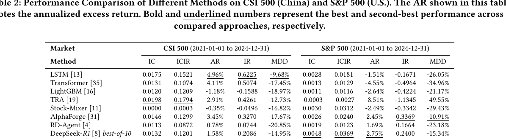
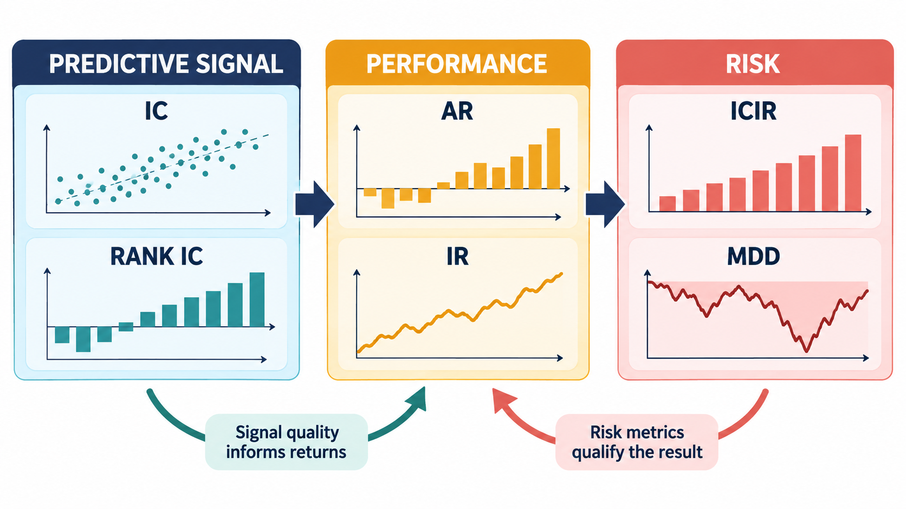
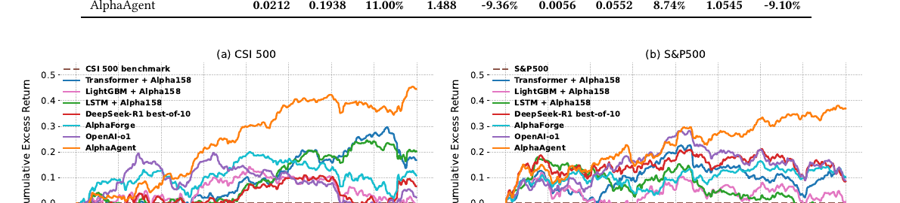
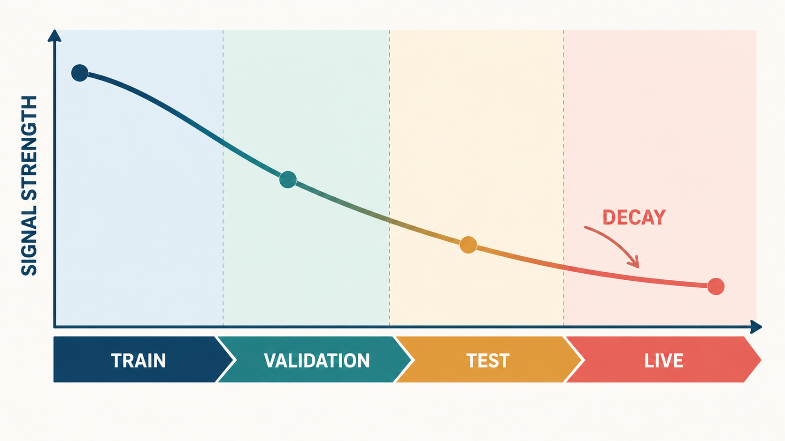
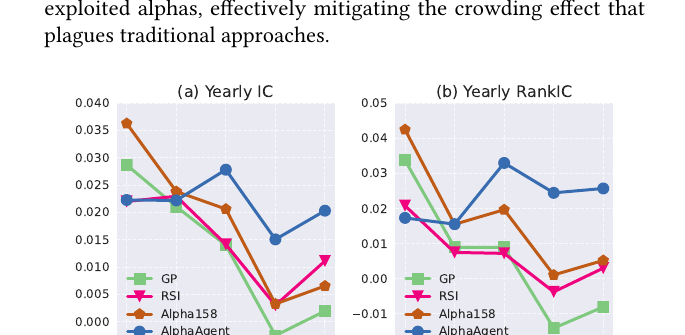
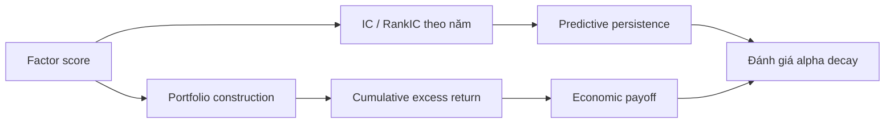

# Bài 07 - Kết quả tổng thể và Phân tích Alpha Decay

## 1. Tóm tắt

Đánh giá một hệ thống alpha mining không nên dừng ở việc quan sát strategy nào tạo lợi nhuận tích lũy cao nhất. Khi mục tiêu trung tâm là **chống alpha decay**, câu hỏi quan trọng hơn là liệu predictive power của factor có duy trì được qua nhiều năm và qua những điều kiện thị trường khác nhau hay không.

Kết quả của AlphaAgent được đọc theo ba lớp:

```text
Predictive effectiveness
        ↓
IC / RankIC / ICIR

Economic payoff
        ↓
AR / IR / cumulative excess return

Persistence và risk
        ↓
IC theo năm / RankIC theo năm / MDD
```

Trên hai thị trường CSI 500 và S&P 500, AlphaAgent đạt kết quả tổng thể mạnh trong protocol thực nghiệm được sử dụng. Quan trọng hơn, phân tích theo thời gian cho thấy các alpha do hệ thống khai phá duy trì `IC` và `RankIC` ổn định hơn so với những nhóm factor được dùng làm đối chứng.

Mục tiêu của việc phân tích này không phải chứng minh rằng một factor sẽ luôn sinh lời trong tương lai, mà là kiểm tra liệu factor có biểu hiện **performance persistence** tốt hơn trong một thiết lập backtest kéo dài nhiều năm hay không.

## 2. Mục tiêu học tập

Sau bài học, người học có thể:

* đọc và diễn giải kết quả tổng thể của AlphaAgent trên CSI 500 và S&P 500;
* phân biệt được predictive effectiveness, economic payoff và performance persistence;
* giải thích được ý nghĩa của `IC`, `ICIR`, `AR`, `IR` và `MDD` khi chúng xuất hiện cùng nhau;
* đọc đúng cumulative excess return thay vì chỉ nhìn điểm cuối của đường cong;
* giải thích được vì sao một strategy có return cao chưa chắc chống alpha decay tốt;
* phân tích được IC và RankIC theo từng năm để nhận diện sự suy giảm predictive power;
* giải thích được vì sao `MDD` bổ sung thông tin mà `AR` không thể hiện;
* nhận diện được sự khác biệt giữa performance trung bình tốt và performance duy trì ổn định;
* diễn giải kết quả thực nghiệm trong phạm vi protocol được sử dụng thay vì biến chúng thành cam kết lợi nhuận ngoài thị trường.

## 3. Ba câu hỏi phải tách riêng khi đọc kết quả

Một factor hoặc strategy có thể được đánh giá qua ba câu hỏi khác nhau.

**Predictive effectiveness** hỏi liệu factor score có chứa thông tin liên quan đến future return hay không. Đây là nơi các metric như `IC` và `RankIC` có ý nghĩa.

**Economic payoff** hỏi liệu tín hiệu đó, sau khi đi qua model, ranking, portfolio construction và transaction cost, có thực sự tạo excess return hay không. `AR`, `IR` và cumulative excess return phục vụ lớp đánh giá này.

**Persistence** hỏi liệu hiệu quả còn duy trì theo thời gian hay không. Đây mới là lớp trực tiếp liên quan đến alpha decay.

Ba câu hỏi có liên quan nhưng không đồng nhất:

```text
Factor dự báo được
        ≠
Portfolio chắc chắn sinh lời cao

Portfolio sinh lời cao
        ≠
Factor chắc chắn duy trì predictive power

Performance tốt trong một năm
        ≠
Performance bền qua nhiều năm
```

Do đó, khi đọc kết quả AlphaAgent, cần tránh chọn một metric duy nhất rồi dùng nó để kết luận cho toàn bộ hệ thống.

## 4. Kết quả tổng thể trên CSI 500 và S&P 500


*Ảnh gốc của paper: bảng so sánh IC, ICIR, AR, IR và MDD giữa các phương pháp.*

Các metric chính của AlphaAgent được ghi nhận như sau:

| Market  |     IC |   ICIR |     AR |     IR |    MDD |
| ------- | -----: | -----: | -----: | -----: | -----: |
| CSI 500 | 0.0212 | 0.1938 | 11.00% |  1.488 | -9.36% |
| S&P 500 | 0.0056 | 0.0552 |  8.74% | 1.0545 | -9.10% |


Những con số này cần được đọc theo từng vai trò thay vì coi chúng là một bảng xếp hạng đơn giản.

Với **CSI 500**:

```text
IC   = 0.0212
ICIR = 0.1938
AR   = 11.00%
IR   = 1.488
MDD  = -9.36%
```

Với **S&P 500**:

```text
IC   = 0.0056
ICIR = 0.0552
AR   = 8.74%
IR   = 1.0545
MDD  = -9.10%
```

Trong thiết lập so sánh được sử dụng, AlphaAgent dẫn đầu các metric chính trên cả hai thị trường.

Tuy nhiên, ý nghĩa quan trọng không nằm ở việc một con số riêng lẻ cao hơn. Điều cần quan sát là các metric predictive, portfolio và risk có cùng tạo ra một câu chuyện nhất quán hay không.

## 5. Đọc IC và ICIR cùng nhau


*Hình minh họa: IC/Rank IC đo tín hiệu dự báo, AR/IR đo performance, còn ICIR/MDD giúp đánh giá độ ổn định và rủi ro.*

`IC` phản ánh mức tương quan giữa factor score và future return.

Nếu:

```text
IC > 0
```

thì về trung bình, tài sản được factor đánh giá cao hơn có xu hướng đi cùng future return cao hơn.

Nhưng một mean IC dương chưa đủ để kết luận tín hiệu ổn định.

Giả sử:

```text
Factor A

Năm 1: IC = 0.03
Năm 2: IC = 0.03
Năm 3: IC = 0.02
Năm 4: IC = 0.03
```

và:

```text
Factor B

Năm 1: IC = 0.10
Năm 2: IC = -0.04
Năm 3: IC = 0.08
Năm 4: IC = -0.03
```

Factor B có những thời điểm cực mạnh nhưng cũng đổi dấu mạnh.

`ICIR` bổ sung góc nhìn về **độ ổn định tương đối của IC**. Vì vậy một alpha decay-resistant cần được đánh giá không chỉ bằng mức IC mà còn bằng cách IC thay đổi theo thời gian.

## 6. AR và IR không trả lời cùng một câu hỏi

`AR` phản ánh annualized excess return.

Nó trả lời:

> Strategy tạo excess return với tốc độ tương đương bao nhiêu theo năm?

`IR` lại đặt excess return trong quan hệ với mức biến động của excess return.

Có thể hiểu trực giác:

```text
AR
→ kiếm được bao nhiêu

IR
→ kiếm được bao nhiêu so với độ bất ổn của phần excess return
```

Hai strategy có thể có AR giống nhau nhưng IR rất khác.

Ví dụ:

```text
Strategy A
AR = 10%
return tương đối đều

Strategy B
AR = 10%
return dao động rất mạnh
```

Trong trường hợp này, `AR` không thể hiện sự khác biệt rõ, còn `IR` bổ sung thông tin về risk-adjusted performance.

## 7. MDD bổ sung phần câu chuyện mà AR bỏ sót

`Maximum Drawdown (MDD)` phản ánh mức giảm lớn nhất từ một peak trước đó xuống trough sau đó.

Nếu $V_t$ là giá trị portfolio và:

\[
\mathrm{Peak}_t=\max_{u\leq t}V_u
\]

thì drawdown tại $t$ có thể biểu diễn:

\[
DD_t=
\frac{V_t-\mathrm{Peak}_t}{\mathrm{Peak}_t}
\]

MDD là mức drawdown sâu nhất trong toàn chuỗi.

Ví dụ:

```text
Portfolio

100
115
130  ← peak
120
105
95   ← trough
110
```

Từ 130 xuống 95:

\[
DD=
\frac{95-130}{130}
\approx -26.92\%
\]

Dù portfolio cuối cùng có thể phục hồi và kết thúc năm với AR dương, nhà đầu tư vẫn từng phải chịu mức suy giảm rất lớn.

Do đó:

```text
AR
→ cho biết tốc độ tăng trưởng

MDD
→ cho biết giai đoạn mất vốn sâu nhất
```

Một kết quả hoàn chỉnh cần cả hai.

## 8. Cumulative Excess Return là gì?

Giả sử:

\[
r_t^{strategy}
\]

là return của strategy và:

\[
r_t^{benchmark}
\]

là return của benchmark.

Excess return của kỳ $t$ là:

\[
e_t=
r_t^{strategy}
-
r_t^{benchmark}
\]

Đường **cumulative excess return** biểu diễn cách lợi thế tương đối đó tích lũy theo thời gian.

Nếu đơn giản minh họa bằng phép cộng:

```text
Ngày 1: +0.4%
Ngày 2: +0.1%
Ngày 3: -0.2%
Ngày 4: +0.5%
```

cumulative excess return sẽ lần lượt tiến triển theo phần excess return tích lũy qua các ngày.

Nhưng điểm cuối không phải toàn bộ thông tin.

Hai strategy có thể cùng kết thúc ở mức:

```text
+30%
```

trong khi đường đi hoàn toàn khác nhau.

Strategy A:

```text
0 → 5 → 10 → 15 → 20 → 25 → 30
```

Strategy B:

```text
0 → 20 → 5 → -10 → 10 → 35 → 30
```

Cả hai cùng kết thúc ở 30%, nhưng strategy B chịu biến động và drawdown lớn hơn nhiều.

## 9. Cách đọc một đường cumulative return đúng cách

Khi quan sát cumulative excess return, không nên chỉ hỏi:

> Đường nào cao nhất ở điểm cuối?

Cần quan sát thêm:

* đường tăng đều hay phụ thuộc vào một cú nhảy lớn;
* có giai đoạn dài đi ngang hay không;
* sau khi đạt peak có suy giảm mạnh không;
* có phục hồi được sau drawdown không;
* dấu hiệu suy yếu bắt đầu ở năm nào;
* nhiều baseline có cùng suy giảm trong một regime hay không;
* strategy có tiếp tục tạo excess return sau những thay đổi thị trường hay không.

Đối với nghiên cứu alpha decay, một đường:

```text
tăng nhanh → đạt peak → đi ngang → giảm dần
```

mang ý nghĩa khác với:

```text
tăng chậm hơn nhưng tiếp tục duy trì xu hướng
```

Factor thứ hai có thể có persistence tốt hơn dù peak performance ban đầu không nổi bật bằng.

## 10. Cumulative Excess Return của AlphaAgent



Kết quả cumulative excess return trên CSI 500 và S&P 500 cho thấy một số pattern đáng chú ý.

Các time-series model có dấu hiệu decay rõ hơn, đặc biệt trên S&P 500.

`LightGBM + Alpha158` dao động quanh zero trên S&P 500.

`DeepSeek-R1` suy giảm sau năm 2023 trong thiết lập được báo cáo.

Trong khi đó, AlphaAgent duy trì đường cumulative excess return bền hơn trên cả hai thị trường.

Mức cumulative excess return được ghi nhận vào khoảng:

```text
CSI 500
≈ 45%

S&P 500
> 37%
```

trong testing period.

Điểm cần chú ý không chỉ là phần trăm cuối kỳ. Đường cong được dùng như bằng chứng để xem lợi thế có tiếp tục tích lũy qua thời gian hay chỉ xuất hiện ở một đoạn ngắn.

## 11. Vì sao S&P 500 là phép thử khó cho persistence?

Kết quả tổng thể cho thấy:

\[
IC_{CSI500}=0.0212
\]

trong khi:

\[
IC_{S\&P500}=0.0056
\]

và:

\[
ICIR_{CSI500}=0.1938
\]

so với:

\[
ICIR_{S\&P500}=0.0552
\]


Điều này cho thấy predictive relationship được đo trong S&P 500 yếu hơn trong thiết lập thử nghiệm này.

Tuy vậy, AlphaAgent vẫn đạt:

\[
AR=8.74\%
\]

và:

\[
IR=1.0545
\]

trên S&P 500.

Điểm đáng chú ý của kết quả vì thế không phải là hai thị trường giống nhau, mà là framework vẫn duy trì positive excess performance trong môi trường mà predictive signal được ghi nhận yếu hơn.

## 12. Alpha decay phải được quan sát theo thời gian


*Hình minh họa: sức mạnh tín hiệu có thể giảm dần từ train qua validation, test và live; đó là lý do cần theo dõi persistence.*

Một bảng aggregate có thể che giấu decay.

Giả sử mean IC bốn năm là:

\[
0.02
\]

Điều đó có thể đến từ chuỗi:

```text
2021: 0.021
2022: 0.020
2023: 0.019
2024: 0.020
```

hoặc:

```text
2021: 0.060
2022: 0.030
2023: 0.000
2024: -0.010
```

Hai factor có thể có average tương đối gần nhau nhưng câu chuyện về persistence hoàn toàn khác.

Để nghiên cứu alpha decay, cần phân đoạn theo năm:

```text
Factor
   ↓
2021 IC / RankIC
   ↓
2022 IC / RankIC
   ↓
2023 IC / RankIC
   ↓
2024 IC / RankIC
   ↓
Xu hướng persistence / decay
```

Đây là lý do Figure 4 quan trọng hơn một bảng aggregate đơn thuần.

## 13. Yearly IC và RankIC



Phân tích theo năm so sánh:

* GP;
* RSI;
* Alpha158;
* 15 alpha do AlphaAgent khai phá;

trên CSI 500.

Kết quả cho thấy GP, RSI và Alpha158 suy giảm rõ rệt về IC và RankIC theo thời gian.

Trong khi đó, các alpha của AlphaAgent giữ mức xấp xỉ:

\[
IC\approx0.02
\]

và:

\[
RankIC\approx0.025
\]

tương đối ổn định.

Đây là bằng chứng trực tiếp hơn cho luận điểm chống alpha decay so với việc chỉ quan sát cumulative return.

## 14. Vì sao yearly IC quan trọng hơn một snapshot?

Giả sử factor A:

```text
2021: IC = 0.07
2022: IC = 0.04
2023: IC = 0.01
2024: IC = -0.01
```

Factor này ban đầu rất mạnh nhưng predictive power suy giảm liên tục.

Factor B:

```text
2021: IC = 0.022
2022: IC = 0.020
2023: IC = 0.021
2024: IC = 0.019
```

Factor B chưa từng đạt peak bằng A nhưng ổn định hơn nhiều.

Nếu câu hỏi là:

> Factor nào có peak IC cao hơn?

A thắng.

Nếu câu hỏi là:

> Factor nào thể hiện khả năng chống decay tốt hơn?

B có bằng chứng mạnh hơn.

Đây chính là khác biệt giữa:

```text
Maximum performance
```

và:

```text
Performance persistence
```

## 15. IC và RankIC giảm liên tục nói lên điều gì?

Nếu cả `IC` và `RankIC` cùng giảm:

```text
IC ↓
RankIC ↓
```

thì factor đang mất cả:

* linear predictive relationship;
* khả năng xếp hạng cross-sectional.

Một pattern như:

```text
Năm 1 → mạnh
Năm 2 → yếu hơn
Năm 3 → rất yếu
Năm 4 → gần zero
```

là dạng biểu hiện trực quan của alpha decay.

Nếu IC còn dương nhưng RankIC giảm mạnh, factor có thể vẫn giữ một số quantitative relationship nhưng khả năng ranking tài sản đang suy yếu.

Do đó, hai metric nên được đọc cùng nhau.

## 16. Return cao nhưng IC giảm có phải chống decay tốt không?

Không thể kết luận như vậy.

Giả sử:

```text
AR vẫn cao
```

nhưng:

```text
IC:
0.05 → 0.03 → 0.01 → 0.00
```

Predictive signal đang suy yếu.

Portfolio vẫn có thể tiếp tục sinh lời trong một giai đoạn vì:

* market regime thuận lợi;
* downstream model còn sử dụng các feature khác;
* một vài khoảng thời gian có return rất lớn;
* ranking rule vẫn khai thác được phần tín hiệu còn lại.

Nhưng nếu mục tiêu là chứng minh **factor persistence**, sự suy giảm IC vẫn là tín hiệu đáng lo.

Do đó:

```text
AR cao
        ≠
Không có alpha decay
```

## 17. Persistence không có nghĩa đường cong luôn tăng

Một factor bền không nhất thiết phải có:

```text
return dương mỗi ngày
```

hoặc:

```text
cumulative return luôn đi lên
```

Thị trường chứa nhiều noise và regime thay đổi.

Persistence nên được hiểu rộng hơn:

```text
Predictive signal vẫn tồn tại
        +
IC/RankIC không collapse
        +
Performance còn xuất hiện qua nhiều năm
        +
Không chỉ phụ thuộc một market regime
        +
Hiệu quả còn tồn tại sau transaction cost
```


Một số drawdown là bình thường trong backtest. Điều cần phân biệt là temporary drawdown với sự mất dần predictive power của factor.

## 18. Phân biệt Drawdown và Alpha Decay

Hai khái niệm không giống nhau.

**Drawdown** xảy ra ở portfolio value:

```text
Peak
 ↓
Portfolio giảm
 ↓
Trough
```

**Alpha decay** xảy ra ở sức dự báo:

```text
Factor có predictive power
        ↓
Predictive power giảm theo thời gian
        ↓
Factor mất lợi thế
```

Một strategy có thể có drawdown ngắn hạn nhưng factor vẫn giữ IC ổn định.

Ngược lại, một factor có thể decay từ từ trong khi cumulative portfolio chưa giảm ngay vì hiệu quả cũ vẫn còn tích lũy trong đường vốn.

Vì vậy cần đồng thời xem:

```text
MDD
+
IC theo năm
+
RankIC theo năm
+
Cumulative excess return
```

## 19. Một cách đọc Figure 3 và Figure 4 cùng nhau

Figure 3 trả lời:

> Economic payoff tích lũy như thế nào?

Figure 4 trả lời:

> Predictive power thay đổi như thế nào theo từng năm?

Hai hình cần được kết nối:



Nếu cumulative return mạnh và yearly IC cũng ổn định, bằng chứng về persistence mạnh hơn.

Nếu cumulative return mạnh nhưng yearly IC collapse, cần thận trọng khi cho rằng factor chống decay tốt.

Nếu IC ổn định nhưng return yếu, cần kiểm tra thêm cách signal được chuyển thành portfolio.

## 20. Đọc kết quả CSI 500

Trên CSI 500, AlphaAgent đạt:

\[
IC=0.0212
\]

\[
ICIR=0.1938
\]

\[
AR=11.00\%
\]

\[
IR=1.488
\]

\[
MDD=-9.36\%
\]


Ngoài performance tổng thể, cumulative excess return trong testing period được ghi nhận khoảng 45%.

Yearly analysis còn cho thấy các alpha được khai phá giữ IC quanh `0.02` và RankIC quanh `0.025` tương đối ổn định, trong khi GP, RSI và Alpha158 suy giảm rõ hơn.

Ba lớp bằng chứng vì vậy tạo thành:

```text
Predictive metric tốt
        +
Portfolio excess return tốt
        +
Yearly predictive persistence
```

## 21. Đọc kết quả S&P 500

Trên S&P 500:

\[
IC=0.0056
\]

\[
ICIR=0.0552
\]

\[
AR=8.74\%
\]

\[
IR=1.0545
\]

\[
MDD=-9.10\%
\]


Cumulative excess return trong testing period được ghi nhận trên 37%.

Đường cumulative excess return còn được dùng để đối chiếu với những baseline có dấu hiệu suy yếu rõ hơn trên thị trường này, bao gồm time-series models, `LightGBM + Alpha158` và `DeepSeek-R1` trong các giai đoạn được quan sát.

Kết quả cần được hiểu trong giới hạn của cùng protocol chứ không phải chứng minh AlphaAgent sẽ đạt đúng mức return đó trong mọi thị trường hoặc giai đoạn khác.

## 22. Vì sao cần so sánh công bằng?

Một experiment chỉ có ý nghĩa khi các phương pháp được đặt trong điều kiện so sánh đủ nhất quán.

Những thành phần có thể ảnh hưởng kết quả gồm:

```text
Dataset
+
Train/validation/test period
+
Transaction fee
+
Benchmark
+
Portfolio rule
+
Downstream model
+
Candidate-generation protocol
+
Prompt / evolution process
+
Alpha zoo
```


Nếu thay đổi nhiều thành phần cùng lúc, rất khó biết improvement đến từ đâu.

Ví dụ:

```text
Framework A
→ fee = 0

Framework B
→ fee đầy đủ
```

thì return không còn hoàn toàn comparable.

Tương tự, nếu một framework được tối ưu trực tiếp trên test period còn framework kia không được nhìn test, so sánh đó cũng không phản ánh generalization một cách công bằng.

## 23. Backtest chỉ là bằng chứng có điều kiện

Các kết quả nên được đọc theo dạng:

> Trong protocol được thiết kế, AlphaAgent thể hiện predictive persistence và portfolio performance tốt hơn các baseline được so sánh.

Không nên biến thành:

> AlphaAgent chắc chắn chống alpha decay trong tương lai.

Hoặc:

> AlphaAgent đảm bảo tạo lợi nhuận.

Backtest không chứng minh causal mechanism ngoài thị trường và không loại bỏ mọi rủi ro khi deployment.

Một kết luận khoa học hợp lý phải gắn với:

```text
dữ liệu đã dùng
+
khoảng thời gian đã test
+
baseline đã so sánh
+
execution assumptions
+
metric đã đo
```

## 24. Một framework đọc kết quả thực nghiệm

Khi gặp một bảng hoặc figure về alpha mining, có thể đọc theo trình tự sau.

**Bước 1 — Predictive effectiveness**

Kiểm tra:

```text
IC
RankIC
```

Factor có thực sự chứa tín hiệu liên quan tới future return hay không?

**Bước 2 — Predictive stability**

Kiểm tra:

```text
ICIR
IC theo năm
RankIC theo năm
```

Signal có ổn định hay đang decay?

**Bước 3 — Economic payoff**

Kiểm tra:

```text
AR
IR
Cumulative excess return
```

Tín hiệu sau portfolio construction có tạo excess return không?

**Bước 4 — Risk**

Kiểm tra:

```text
MDD
```

Strategy từng chịu mức suy giảm sâu đến đâu?

**Bước 5 — Time decomposition**

Không chỉ nhìn average.

Hãy tìm:

```text
năm nào tốt?
năm nào yếu?
decay bắt đầu khi nào?
```

**Bước 6 — Baseline comparison**

Hỏi:

```text
So với GP thế nào?
So với RSI?
So với Alpha158?
So với những model khác?
```

**Bước 7 — Protocol caveat**

Cuối cùng mới hỏi:

```text
Kết luận này đúng trong điều kiện nào?
```

Đây là thứ tự:

```text
Metric
   ↓
Đường cong
   ↓
Phân đoạn thời gian
   ↓
Risk
   ↓
Baseline
   ↓
Protocol limitation
```

## 25. Những cách diễn giải dễ sai

**Sai lầm 1: AR cao nghĩa là factor chống decay tốt.**

Không đủ. Cần xem IC và RankIC theo thời gian.

**Sai lầm 2: Cumulative return cuối cùng cao nghĩa strategy ổn định.**

Không đúng. Một cú tăng lớn ở một giai đoạn có thể kéo điểm cuối lên.

**Sai lầm 3: MDD thấp nghĩa factor có predictive power tốt.**

Không đúng. MDD là portfolio risk metric, không trực tiếp đo predictive ability.

**Sai lầm 4: IC dương ở toàn test period nghĩa không có decay.**

Không đúng. Aggregate IC có thể che giấu xu hướng giảm mạnh theo từng năm.

**Sai lầm 5: Một factor có drawdown nghĩa factor đã decay.**

Không nhất thiết. Drawdown và alpha decay là hai khái niệm khác nhau.

**Sai lầm 6: Một framework thắng trong experiment nghĩa nó luôn thắng ngoài thị trường.**

Không đúng. Kết quả phụ thuộc vào protocol cụ thể.

**Sai lầm 7: Chỉ cần Figure 3 là đủ để chứng minh persistence.**

Không đủ. Figure 4 cung cấp bằng chứng trực tiếp hơn về predictive power theo năm.

## 26. Thực hành củng cố

Giả sử có hai strategy:

**Strategy A**

```text
AR = 13%

IC:
2021 = 0.050
2022 = 0.030
2023 = 0.010
2024 = -0.005

MDD = -18%
```

**Strategy B**

```text
AR = 10%

IC:
2021 = 0.022
2022 = 0.021
2023 = 0.020
2024 = 0.019

MDD = -9%
```

Hãy trả lời:

1. Strategy nào có AR cao hơn?
2. Strategy nào có dấu hiệu alpha decay rõ hơn?
3. Strategy nào có predictive persistence tốt hơn?
4. MDD cho biết thêm điều gì về hai strategy?
5. Có thể kết luận Strategy B tốt hơn toàn diện chỉ từ các thông tin trên không?
6. Cần thêm metric nào để đánh giá risk-adjusted excess return?
7. Nếu cumulative return của A cao hơn B chủ yếu nhờ năm 2021, điều đó ảnh hưởng thế nào tới cách đánh giá persistence?

## 27. Câu hỏi tự kiểm tra

1. Ba lớp cần tách khi đọc một kết quả alpha mining là gì?
2. Vì sao IC và AR không đo cùng một đối tượng?
3. ICIR bổ sung thông tin gì cho IC?
4. IR khác ICIR như thế nào?
5. MDD đo điều gì?
6. Cumulative excess return có thể che giấu dạng rủi ro nào?
7. Vì sao điểm cuối của cumulative return không đủ để đánh giá strategy?
8. Figure 4 cung cấp loại bằng chứng gì mà Table 2 không thể hiện trực tiếp?
9. GP, RSI và Alpha158 có xu hướng gì về IC/RankIC theo thời gian?
10. Các alpha của AlphaAgent duy trì IC và RankIC khoảng mức nào?
11. Vì sao return cao nhưng IC giảm liên tục vẫn có thể là dấu hiệu alpha decay?
12. Drawdown và alpha decay khác nhau ở đâu?
13. Tại sao kết quả trên hai thị trường cần được phân tích riêng?
14. Vì sao một protocol nhất quán cần thiết khi so sánh các framework?
15. Tại sao không nên biến kết quả backtest thành cam kết lợi nhuận tương lai?

## 28. Tổng kết

Kết quả tổng thể của AlphaAgent trên hai thị trường được ghi nhận:

| Market  |     IC |   ICIR |     AR |     IR |    MDD |
| ------- | -----: | -----: | -----: | -----: | -----: |
| CSI 500 | 0.0212 | 0.1938 | 11.00% |  1.488 | -9.36% |
| S&P 500 | 0.0056 | 0.0552 |  8.74% | 1.0545 | -9.10% |


Figure 3 cho thấy AlphaAgent duy trì cumulative excess return tốt hơn trong testing period, với mức khoảng 45% trên CSI 500 và trên 37% trên S&P 500, trong khi một số baseline thể hiện dấu hiệu suy yếu rõ hơn.

Figure 4 đi sâu hơn vào vấn đề trung tâm của bài: **alpha decay**. GP, RSI và Alpha158 có IC và RankIC suy giảm đáng kể theo thời gian, trong khi các alpha được AlphaAgent khai phá giữ:

\[
IC\approx0.02
\]

và:

\[
RankIC\approx0.025
\]

tương đối ổn định.

Do đó, logic đánh giá không phải:

```text
Return cao
    ↓
Factor tốt
```

mà phải là:

```text
Predictive signal tốt
        ↓
IC / RankIC

Signal ổn định
        ↓
ICIR + yearly analysis

Portfolio tạo payoff
        ↓
AR / IR / cumulative excess return

Risk chấp nhận được
        ↓
MDD

Hiệu quả duy trì qua thời gian
        ↓
Performance persistence
        ↓
Bằng chứng chống alpha decay
```

Kết luận quan trọng nhất là **alpha decay phải được đánh giá theo thời gian**. Một snapshot tốt không đủ. Một cumulative-return curve cao cũng không đủ. Bằng chứng mạnh hơn xuất hiện khi predictive metrics, economic payoff và risk cùng cho thấy factor giữ được chất lượng qua nhiều năm.

Các kết quả vì vậy nên được hiểu là bằng chứng thực nghiệm về persistence tốt hơn **trong protocol đã sử dụng**, không phải lời bảo đảm rằng alpha sẽ không suy giảm hoặc luôn sinh lợi trong tương lai.
