# Bài 07 - Kết quả tổng thể và Alpha Decay Analysis

## 1. Mục tiêu

Đọc và diễn giải kết quả chính trên CSI 500 và S&P 500.

## 2. Overall performance


Các kết quả AlphaAgent được paper báo cáo:

| Market | IC | ICIR | AR | IR | MDD |
|---|---:|---:|---:|---:|---:|
| CSI 500 | 0.0212 | 0.1938 | 11.00% | 1.488 | -9.36% |
| S&P 500 | 0.0056 | 0.0552 | 8.74% | 1.0545 | -9.10% |

Trong Table 2, AlphaAgent dẫn đầu các metric chính trong hai market theo thiết lập so sánh của paper.

## 3. Cumulative excess return


**Figure 3 (paper, trang 7)** so sánh cumulative excess return trên CSI 500 và S&P 500. Paper nhận xét:

- time-series models có dấu hiệu decay rõ hơn, đặc biệt trên S&P 500;
- LightGBM + Alpha158 dao động quanh zero trên S&P 500;
- DeepSeek-R1 suy giảm sau 2023 trong thiết lập được báo cáo;
- AlphaAgent duy trì đường cumulative excess return bền hơn trên cả hai thị trường.

Paper mô tả khoảng **45% cumulative excess return trên CSI 500** và **trên 37% trên S&P 500** trong testing period.

## 4. Yearly alpha decay


Figure 4 so sánh GP, RSI, Alpha158 và 15 alpha do AlphaAgent khai phá trên CSI 500 theo năm.

Paper báo cáo:

- GP, RSI, Alpha158 giảm mạnh về IC/RankIC theo thời gian;
- AlphaAgent giữ IC quanh 0.02 và RankIC quanh 0.025 tương đối ổn định.

Thông điệp chính: AlphaAgent không chỉ tìm factor “tốt ở một snapshot”, mà paper muốn chứng minh factor có **persistence** tốt hơn khi thị trường thay đổi.

## 5. Cách đọc kết quả một cách đúng

Kết quả trong paper là kết quả của **một protocol cụ thể**: dataset, fee, LightGBM pipeline, baseline, prompt/evolution round và alpha zoo đều ảnh hưởng đến con số cuối cùng. Do đó nên diễn giải kết quả như bằng chứng thực nghiệm trong setup của paper, không phải cam kết lợi nhuận ngoài thị trường.

## 6. Bài tập tự luyện

1. Nếu AR cao nhưng IC giảm liên tục theo năm, ta có thể nói factor chống decay tốt không?
2. MDD thấp bổ sung thông tin gì mà AR không thể hiện?
3. Tại sao S&P 500 được paper mô tả là môi trường khó hơn cho alpha persistence?

## 7. Nguồn trong paper

- Section 4.2 - Overall Performance, trang 6-7.
- Table 2 và Figure 3, trang 7.
- Section 4.3 và Figure 4, trang 7-8.


## Lý thuyết nền cần biết

> Bài này không chỉ hỏi đường cong nào cao hơn. Phần nền giúp phân biệt lợi nhuận tích lũy, sức dự báo, rủi ro và độ bền theo thời gian.

### 1. Ba câu hỏi khác nhau khi đọc một kết quả

Khi xem một factor hoặc strategy, hãy tách ba câu hỏi:

1. **Predictive effectiveness:** score có xếp hạng tài sản gắn với future return không? Đây là nơi IC và RankIC hữu ích.
2. **Economic payoff:** nếu biến score thành vị thế và trừ chi phí, portfolio có tạo excess return không? Đây là nơi AR và IR hữu ích.
3. **Persistence:** chất lượng có giữ được qua nhiều năm và regime thị trường không? Đây là câu hỏi về alpha decay.

Một câu trả lời tốt ở câu hỏi thứ hai không tự động trả lời tốt cho câu hỏi thứ ba. Một vài ngày có lợi nhuận cao có thể kéo cả đường cumulative return lên, trong khi IC sau đó đã giảm.

### 2. Đường cumulative excess return

Nếu `r_t^strategy` là lợi suất strategy và `r_t^benchmark` là lợi suất benchmark, excess return của kỳ `t` là:

\[
e_t=r_t^{strategy}-r_t^{benchmark}
\]

Đường cumulative excess return cộng dồn các `e_t` theo thời gian. Nó cho biết lợi thế tương đối đã tích lũy ra sao, nhưng cũng phụ thuộc thứ tự các ngày. Hai strategy có cùng tổng return có thể có đường đi và mức drawdown rất khác.

Đọc đồ thị cần chú ý:

- đường có tăng đều hay chỉ bật mạnh ở một giai đoạn;
- sau một peak có phục hồi được không;
- nhiều strategy có cùng hình dạng không;
- sự suy giảm bắt đầu ở giai đoạn nào và có đồng thời với các baseline không.

### 3. Drawdown và persistence

Với giá trị portfolio `V_t`, peak đến thời điểm `t` là giá trị lớn nhất của `V_u` với mọi `u ≤ t`. Drawdown:

\[
DD_t=\frac{V_t-Peak_t}{Peak_t}
\]

MDD là drawdown âm lớn nhất. MDD bổ sung câu chuyện mà AR không kể: strategy có thể có lợi nhuận năm cao nhưng chịu một giai đoạn mất vốn sâu hoặc hồi phục rất lâu.

**Persistence** không chỉ là “đường cong không giảm”. Nó nên được kiểm tra bằng IC/RankIC theo từng năm, độ ổn định của IC, số giai đoạn có dấu đúng và hiệu năng sau phí. Với AlphaAgent, một factor chống decay là factor không mất hẳn sức dự báo khi chuyển sang các năm hoặc thị trường chưa dùng để thiết kế.

### 4. So sánh công bằng và giới hạn suy luận

Một so sánh hợp lệ cần giữ nhất quán dataset, thời gian test, fee, benchmark, portfolio rule, downstream model và protocol tạo candidate. Nếu thay nhiều thứ cùng lúc, ta không biết improvement đến từ regularization, model, dữ liệu hay execution.

Kết quả backtest cũng không chứng minh causal mechanism ngoài thị trường. Nó chỉ cho thấy trong protocol đã nêu, một candidate đạt các metric quan sát được. Cần tránh các kết luận như “AlphaAgent đảm bảo lợi nhuận” hoặc “factor không decay trong tương lai”. Kết luận đúng mức là “paper báo cáo persistence tốt hơn trong setup thử nghiệm cụ thể”.

## Liên hệ với bài học này

Bài này dùng Table 2 để đọc hiệu năng tổng thể, Figure 3 để đọc đường cumulative excess return và Figure 4 để đọc decay theo năm. Hãy đi theo thứ tự `metric → đường cong → phân đoạn thời gian → rủi ro → caveat protocol`. Nhờ vậy, nhận xét “AlphaAgent bền hơn” được hiểu là một tuyên bố thực nghiệm có điều kiện, không phải một lời hứa giao dịch.

## Nguồn kiến thức liên quan trong kho khóa học

- `01 - AI & Dữ liệu/02 - Data Science, Analytics & ML/ai-data-scientist-roadmap/AI-Data-Scientist-Roadmap-Course/00 - Roadmap.sh AI Data Scientist Official/01 - Math, Statistics and Econometrics/Module 03 - Econometrics and Time Series/03-TSParts/010 - Time Series Basics.md`
- `01 - AI & Dữ liệu/01 - AI Engineering & LLM/Ai-engineer/Khóa-1/Resources/llm_engineering/week4/community-contributions/ai_stock_trading/README.md`
- `01 - AI & Dữ liệu/02 - Data Science, Analytics & ML/bi-analyst-roadmap/BI-Analyst-Roadmap-Course/00 - Roadmap.sh BI Analyst Official/Module 04 - Statistics Basics - Thong ke co ban/01-VariablesAndData-CorrelationAnalysis/003 - Correlation Analysis.md`
- `01 - AI & Dữ liệu/02 - Data Science, Analytics & ML/ai-data-scientist-roadmap/AI-Data-Scientist-Roadmap-Course/00 - Roadmap.sh AI Data Scientist Official/03 - Machine Learning and Deep Learning/Module 06 - Machine Learning/06-Select/033 - Model Selection.md`
- `01 - AI & Dữ liệu/02 - Data Science, Analytics & ML/machine-learning-roadmap/Machine-Learning-Roadmap-Course/00 - Roadmap.sh Machine Learning Official/04 - Evaluation, Workflow and Deep Learning/Module 11 - Model Evaluation/01-WhatIsModel-BiasVarianceTradeoff/002 - Generalization.md`

## Nội dung các file tham khảo để tiện sao chép

> Các khối dưới đây là nội dung nguyên văn của source lesson tương ứng, được đặt trong code block để có thể sao chép trọn vẹn.

### 1. `01 - AI & Dữ liệu/02 - Data Science, Analytics & ML/ai-data-scientist-roadmap/AI-Data-Scientist-Roadmap-Course/00 - Roadmap.sh AI Data Scientist Official/01 - Math, Statistics and Econometrics/Module 03 - Econometrics and Time Series/03-TSParts/010 - Time Series Basics.md`

Nguồn: `01 - AI & Dữ liệu/02 - Data Science, Analytics & ML/ai-data-scientist-roadmap/AI-Data-Scientist-Roadmap-Course/00 - Roadmap.sh AI Data Scientist Official/01 - Math, Statistics and Econometrics/Module 03 - Econometrics and Time Series/03-TSParts/010 - Time Series Basics.md`

````markdown
# 010 — Time Series Basics

**Course:** 01 — Math, Statistics and Econometrics
**Module:** Module 03 — Econometrics and Time Series
**Content Group:** Time Series
**Roadmap Source:** Econometrics and Time Series / Time Series
**Lesson Type:** Econometrics and Time Series
**Order in Module:** 010
**Suggested Duration:** 22 minutes

---

## 1. Overview

A **time series** is a sequence of observations recorded in chronological order.

Examples include:

* Daily sales
* Hourly electricity demand
* Monthly inflation
* Minute-by-minute stock prices
* Weekly website traffic
* Sensor measurements
* Server request latency
* User activity over time

Unlike ordinary tabular data, the order of observations in a time series is important. An observation recorded today may depend on observations from yesterday, last week, or the same period last year.

A typical time series may contain:

* **Trend**
* **Seasonality**
* **Cycles**
* **Autocorrelation**
* **Noise**
* **Structural changes**
* **Outliers**

For an AI Engineer or Data Scientist, time series analysis helps answer questions such as:

* What will sales be next week?
* Is website traffic increasing?
* Does demand repeat every seven days?
* Is the current sensor value abnormal?
* Did a marketing campaign change the underlying pattern?
* How much uncertainty should be attached to a forecast?

A time series workflow usually produces artifacts such as:

* Exploratory charts
* Lag features
* Rolling statistics
* Forecasting models
* Validation reports
* Forecasting APIs
* Monitoring dashboards
* Business recommendations

---

## 2. Learning Objectives

After completing this lesson, you should be able to:

1. Explain what time series data is.
2. Distinguish time series data from ordinary cross-sectional data.
3. Identify trend, seasonality, cycles, and noise.
4. Explain why temporal order must be preserved.
5. Understand lagged values and rolling statistics.
6. Recognize autocorrelation.
7. Create simple forecasting baselines.
8. Split time series data correctly for training and evaluation.
9. Build a small time series analysis notebook.
10. Connect time series concepts to production forecasting systems.

---

## 3. What Is a Time Series?

A time series is a set of observations indexed by time:

$$
y_1, y_2, y_3, \ldots, y_T
$$

where:

* (y_t) is the observed value at time (t)
* (T) is the total number of observations

A general representation is:

$$
y_t = f(t) + \varepsilon_t
$$

where:

* (f(t)) represents systematic temporal patterns
* (\varepsilon_t) represents random variation or noise

For example, a daily sales dataset may look like this:

| Date       | Sales |
| ---------- | ----: |
| 2026-01-01 |   120 |
| 2026-01-02 |   128 |
| 2026-01-03 |   135 |
| 2026-01-04 |   131 |
| 2026-01-05 |   145 |

The date column is not simply another feature. It defines the order and dependency structure of the observations.

---

## 4. Time Series vs. Ordinary Tabular Data

In ordinary supervised learning, rows are often assumed to be independent and identically distributed.

Time series data usually violates this assumption because nearby observations may be related.

| Property                 | Ordinary Tabular Data                  | Time Series Data                             |
| ------------------------ | -------------------------------------- | -------------------------------------------- |
| Row order                | Often unimportant                      | Essential                                    |
| Random train/test split  | Usually acceptable                     | Often incorrect                              |
| Observation independence | Common assumption                      | Frequently violated                          |
| Future information       | May be mixed across rows               | Must not enter training data                 |
| Evaluation               | Random holdout or cross-validation     | Temporal holdout or walk-forward validation  |
| Common features          | Demographics, categories, measurements | Lags, rolling statistics, calendar variables |

For example, randomly shuffling daily sales data may allow the model to train on future observations and predict earlier observations. This creates **data leakage** and produces unrealistic evaluation results.

---

## 5. Main Components of a Time Series

A useful conceptual decomposition is:

$$
y_t = T_t + S_t + C_t + \varepsilon_t
$$

where:

* (T_t): trend
* (S_t): seasonality
* (C_t): cyclical movement
* (\varepsilon_t): irregular noise

### 5.1 Trend

A **trend** is a long-term increase or decrease in the series.

Examples:

* Increasing e-commerce revenue
* Decreasing hardware failure rates
* Growth in application users
* Long-term inflation

```text
Value
  ^
  |                         *
  |                    *  *
  |                * *
  |           *  *
  |       * *
  |   * *
  +--------------------------------> Time
                 Upward trend
```

A trend does not need to be linear. It may be:

* Linear
* Exponential
* Logarithmic
* Piecewise
* Saturating

---

### 5.2 Seasonality

**Seasonality** is a regular pattern that repeats at a fixed interval.

Examples:

* Sales increasing every weekend
* Electricity demand rising every afternoon
* Retail demand increasing every December
* Website traffic falling every Sunday
* Restaurant orders peaking during lunch hours

```text
Value
  ^
  |      /\        /\        /\
  |     /  \      /  \      /  \
  |____/    \____/    \____/    \____
  +------------------------------------> Time
          Repeating seasonal pattern
```

Common seasonal periods include:

| Data Frequency | Possible Seasonal Period |
| -------------- | -----------------------: |
| Hourly         |                 24 hours |
| Daily          |                   7 days |
| Daily          |                 365 days |
| Weekly         |                 52 weeks |
| Monthly        |                12 months |
| Quarterly      |               4 quarters |

A time series may contain multiple seasonal patterns. For example, hourly electricity demand may have both daily and weekly seasonality.

---

### 5.3 Cycles

A **cycle** is a rise-and-fall pattern that does not necessarily repeat at a fixed interval.

Examples include:

* Economic expansions and recessions
* Housing market cycles
* Technology adoption cycles
* Product demand life cycles

Seasonality has a relatively fixed period, while cycles usually have less predictable duration.

---

### 5.4 Noise

**Noise** is irregular variation that is not explained by the systematic components.

Noise may be caused by:

* Measurement error
* Random customer behavior
* Unexpected external events
* Missing explanatory variables
* Data collection problems

A forecasting model should capture useful structure without fitting every random fluctuation.

---

### 5.5 Outliers and Anomalies

An outlier is an observation that differs substantially from the expected pattern.

Possible causes include:

* Promotional campaigns
* Public holidays
* Server failures
* Sensor errors
* Supply disruptions
* Extreme weather
* Data-entry mistakes

An outlier may represent either valuable information or corrupted data. It should not be removed automatically without investigation.

---

### 5.6 Structural Breaks

A **structural break** occurs when the underlying data-generating process changes.

Examples:

* A pricing policy changes
* A new competitor enters the market
* A pandemic changes customer behavior
* A sensor is replaced
* A product is redesigned
* A data pipeline changes its measurement logic

A model trained before the break may perform poorly after the break.

---

## 6. Additive and Multiplicative Structure

### 6.1 Additive Model

An additive decomposition assumes:

$$
y_t = T_t + S_t + \varepsilon_t
$$

It is appropriate when the seasonal variation remains approximately constant as the overall level changes.

Example:

* Sales fluctuate by approximately 100 units every December, regardless of total sales level.

---

### 6.2 Multiplicative Model

A multiplicative decomposition assumes:

$$
y_t = T_t \times S_t \times \varepsilon_t
$$

It is appropriate when seasonal fluctuations become larger as the level of the series increases.

Example:

* December sales are consistently around 30% higher than normal sales.

A logarithmic transformation can convert multiplicative relationships into approximately additive ones:

$$
\log(y_t) = \log(T_t) + \log(S_t) + \log(\varepsilon_t)
$$

---

## 7. Temporal Dependence

Time series observations are often dependent on previous observations.

For example:

$$
y_t = \phi y_{t-1} + \varepsilon_t
$$

The current value (y_t) depends on the previous value (y_{t-1}).

This dependence is one reason why ordinary random splitting and independent-data assumptions may fail.

---

## 8. Lagged Values

A **lag** is a previous value of the same variable.

The first lag is:

$$
\text{Lag}_1(y_t) = y_{t-1}
$$

The seventh lag for daily data is:

$$
\text{Lag}_7(y_t) = y_{t-7}
$$

Example:

| Date   | Sales | Lag 1 | Lag 7 |
| ------ | ----: | ----: | ----: |
| Jan 8  |   160 |   148 |   120 |
| Jan 9  |   170 |   160 |   128 |
| Jan 10 |   165 |   170 |   135 |

Lagged features allow machine learning models to use historical information.

Common lag features include:

* Previous hour
* Previous day
* Previous week
* Previous month
* Same day last year

The appropriate lag depends on the business process and data frequency.

---

## 9. Rolling Statistics

Rolling statistics summarize recent observations over a moving window.

A rolling mean with window size (k) is:

$$
\text{MA}_t^{(k)} = \frac{1}{k} \sum_{i=0}^{k-1} y_{t-i}
$$

For a seven-day moving average:

$$
\text{MA}_t^{(7)} = \frac{ y_t + y_{t-1} + \cdots + y_{t-6} }{7}
$$

Useful rolling features include:

* Rolling mean
* Rolling median
* Rolling minimum
* Rolling maximum
* Rolling standard deviation
* Rolling sum
* Rolling quantile

Rolling statistics are useful for:

* Smoothing noise
* Detecting local trends
* Measuring recent volatility
* Creating predictive features
* Detecting anomalies

A critical implementation detail is that rolling features must not use future values.

For forecasting, a safer feature is often:

```python
df["rolling_mean_7"] = df["sales"].shift(1).rolling(7).mean()
```

The `shift(1)` ensures that the current target value is not included in its own predictor.

---

## 10. Autocorrelation

**Autocorrelation** measures the relationship between a time series and a lagged version of itself.

For lag (k):

$$
\rho_k = \text{Corr}(y_t, y_{t-k})
$$

Examples:

* High autocorrelation at lag 1 means adjacent observations are strongly related.
* High autocorrelation at lag 7 in daily data may indicate weekly seasonality.
* High autocorrelation at lag 12 in monthly data may indicate annual seasonality.

### Interpretation Example

| Lag | Autocorrelation | Possible Interpretation        |
| --: | --------------: | ------------------------------ |
|   1 |            0.88 | Strong short-term persistence  |
|   2 |            0.74 | Dependence continues           |
|   7 |            0.65 | Possible weekly pattern        |
|  14 |            0.51 | Repeated two-week relationship |

Autocorrelation does not automatically prove causality. It only describes temporal dependence.

---

## 11. Stationarity

A time series is approximately **stationary** when its statistical properties remain stable over time.

A weakly stationary series has:

1. A constant mean
2. A constant variance
3. Autocovariance that depends on lag rather than absolute time

Conceptually:

$$
\mathbb{E}[y_t] = \mu
$$

$$
\text{Var}(y_t) = \sigma^2
$$

$$
\text{Cov}(y_t, y_{t-k}) = \gamma_k
$$

A series with a strong trend or changing variance is usually non-stationary.

Stationarity is important for classical methods such as:

* AR
* MA
* ARMA
* ARIMA
* VAR

However, not every modern forecasting model requires the raw series to be stationary.

### Common Transformations

To make a series more stable, analysts may use:

* Differencing
* Log transformation
* Seasonal differencing
* Trend removal
* Seasonal adjustment

First-order differencing is:

$$
\Delta y_t = y_t - y_{t-1}
$$

Seasonal differencing with period (s) is:

$$
\Delta_s y_t = y_t - y_{t-s}
$$

---

## 12. Forecasting Horizon

The **forecasting horizon** is how far into the future the model must predict.

Examples:

* Next hour
* Next day
* Next seven days
* Next month
* Next twelve months

The forecasting horizon affects:

* Model selection
* Feature engineering
* Error accumulation
* Evaluation design
* Uncertainty
* Business usefulness

Predicting one step ahead is usually easier than predicting many steps ahead.

---

## 13. One-Step and Multi-Step Forecasting

### One-Step Forecast

Predict only the next value:

$$
\hat{y}_{t+1}
$$

### Multi-Step Forecast

Predict several future values:

$$
\hat{y}_{t+1}, \hat{y}_{t+2}, \ldots, \hat{y}_{t+h}
$$

where (h) is the forecast horizon.

Common multi-step strategies include:

* Recursive forecasting
* Direct forecasting
* Multi-output forecasting
* Sequence-to-sequence forecasting

Recursive forecasting uses previous predictions as inputs for later predictions, so errors may accumulate over time.

---

## 14. Forecasting Baselines

A model should always be compared with a simple baseline.

A complex model is not useful if it cannot outperform a reasonable baseline.

### 14.1 Mean Baseline

Predict the historical mean:

$$
\hat{y}_{t+h} = \frac{1}{T} \sum_{t=1}^{T} y_t
$$

This is simple but often weak for trending or seasonal data.

---

### 14.2 Naive Forecast

Predict the most recent observation:

$$
\hat{y}_{t+1} = y_t
$$

This baseline can be surprisingly strong when the series changes slowly.

---

### 14.3 Seasonal Naive Forecast

Predict the value from the same position in the previous seasonal cycle:

$$
\hat{y}_t = y_{t-s}
$$

For daily data with weekly seasonality:

$$
\hat{y}_t = y_{t-7}
$$

For monthly data with yearly seasonality:

$$
\hat{y}_t = y_{t-12}
$$

Strong seasonality often makes the seasonal naive forecast difficult to beat.

---

### 14.4 Moving-Average Baseline

Predict using a recent average:

$$
\hat{y}_{t+1} = \frac{1}{k} \sum_{i=0}^{k-1} y_{t-i}
$$

This can reduce short-term noise but may react slowly to sudden changes.

---

## 15. Correct Train/Test Splitting

Random train/test splitting is usually inappropriate for time series forecasting.

Suppose the data covers January through December.

A valid split is:

```text
January ---------------- September | October --- December
               Training data       |     Test data
```

An invalid random split may look like:

```text
Training: January, March, June, November, ...
Testing:  February, April, July, October, ...
```

The random split allows future observations to influence the training process.

### Correct Temporal Split

```text
Past observations                     Future observations
┌──────────────────────────────────┐   ┌────────────────────┐
│            Training set          │   │      Test set      │
└──────────────────────────────────┘   └────────────────────┘
────────────────────────────────────────────────────────────> Time
```

The test period should simulate the future period the model will face in production.

---

## 16. Walk-Forward Validation

A single train/test split may not provide enough evidence about model stability.

Walk-forward validation evaluates the model across multiple historical forecasting periods.

```text
Fold 1:
Train: [1 2 3 4 5]       Test: [6]

Fold 2:
Train: [1 2 3 4 5 6]     Test: [7]

Fold 3:
Train: [1 2 3 4 5 6 7]   Test: [8]

Fold 4:
Train: [1 2 3 4 5 6 7 8] Test: [9]
```

A general workflow is:

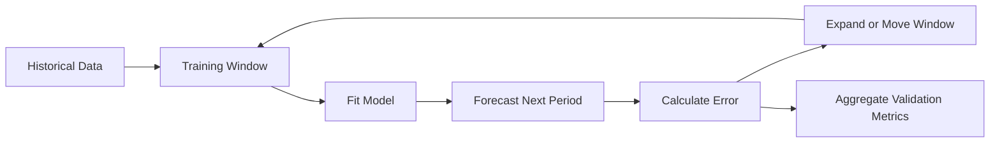

Walk-forward validation is more realistic because it reproduces repeated forecasting in chronological order.

---

## 17. Expanding and Sliding Windows

### 17.1 Expanding Window

The training set grows over time.

```text
Fold 1: [1 2 3 4]             -> [5]
Fold 2: [1 2 3 4 5]           -> [6]
Fold 3: [1 2 3 4 5 6]         -> [7]
```

Advantages:

* Uses all available historical information
* Appropriate when older data remains relevant

---

### 17.2 Sliding Window

The training set keeps a fixed length.

```text
Fold 1: [1 2 3 4] -> [5]
Fold 2: [2 3 4 5] -> [6]
Fold 3: [3 4 5 6] -> [7]
```

Advantages:

* Reduces the influence of outdated observations
* Useful when the data-generating process changes over time

---

## 18. Forecast Evaluation Metrics

Let:

* (y_t) be the actual value
* (\hat{y}_t) be the predicted value
* (e_t = y_t - \hat{y}_t) be the forecast error

### 18.1 Mean Absolute Error

$$
\text{MAE} = \frac{1}{n} \sum_{t=1}^{n} |y_t-\hat{y}_t|
$$

Advantages:

* Easy to interpret
* Uses the same unit as the target
* Less sensitive to extreme errors than RMSE

---

### 18.2 Root Mean Squared Error

$$
\text{RMSE} = \sqrt{ \frac{1}{n} \sum_{t=1}^{n} (y_t-\hat{y}_t)^2 }
$$

Advantages:

* Penalizes large errors more strongly
* Useful when large mistakes are especially costly

---

### 18.3 Mean Absolute Percentage Error

$$
\text{MAPE} = \frac{100}{n} \sum_{t=1}^{n} \left| \frac{y_t-\hat{y}_t}{y_t} \right|
$$

Limitations:

* Undefined when (y_t=0)
* Unstable when actual values are close to zero
* Can create asymmetric penalties

---

### 18.4 Weighted Absolute Percentage Error

$$
\text{WAPE} = \frac{ \sum_{t=1}^{n}|y_t-\hat{y}_t| }{ \sum_{t=1}^{n}|y_t| } \times 100
$$

WAPE is often useful for evaluating aggregate demand forecasts.

---

### 18.5 Mean Absolute Scaled Error

$$
\text{MASE} = \frac{ \frac{1}{n} \sum_{t=1}^{n}|y_t-\hat{y}_t| }{ \frac{1}{T-1} \sum_{t=2}^{T}|y_t-y_{t-1}| }
$$

Interpretation:

* (\text{MASE}<1): better than the naive baseline
* (\text{MASE}>1): worse than the naive baseline

Metric selection should reflect the real cost of forecast errors.

---

## 19. End-to-End Time Series Workflow

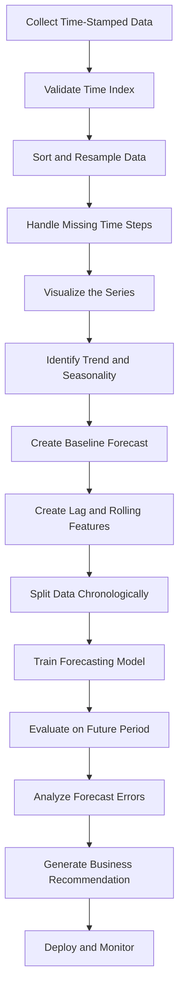

A robust forecasting project should begin with data validation and a baseline, not immediately with a complex model.

---

## 20. Practical Python Demo

The following example creates synthetic daily sales data with trend, weekly seasonality, and random noise.

```python
import numpy as np
import pandas as pd
import matplotlib.pyplot as plt
from sklearn.metrics import mean_absolute_error, mean_squared_error

rng = np.random.default_rng(42)

dates = pd.date_range(
    start="2025-01-01",
    periods=240,
    freq="D",
)

trend = np.linspace(100, 180, len(dates))

weekly_pattern = np.array([
    -10,  # Monday
    -5,   # Tuesday
    0,    # Wednesday
    4,    # Thursday
    10,   # Friday
    25,   # Saturday
    18,   # Sunday
])

seasonality = np.array([
    weekly_pattern[date.dayofweek]
    for date in dates
])

noise = rng.normal(
    loc=0,
    scale=8,
    size=len(dates),
)

sales = trend + seasonality + noise

df = pd.DataFrame({
    "date": dates,
    "sales": sales,
})

df = df.set_index("date")

print(df.head())
```

### Plot the Series

```python
fig, ax = plt.subplots(figsize=(12, 5))

ax.plot(df.index, df["sales"])
ax.set_title("Daily Sales")
ax.set_xlabel("Date")
ax.set_ylabel("Sales")

plt.tight_layout()
plt.show()
```

---

## 21. Add Rolling Statistics

```python
df["rolling_mean_7"] = (
    df["sales"]
    .rolling(window=7)
    .mean()
)

df["rolling_std_7"] = (
    df["sales"]
    .rolling(window=7)
    .std()
)
```

Plot the original series and rolling mean:

```python
fig, ax = plt.subplots(figsize=(12, 5))

ax.plot(
    df.index,
    df["sales"],
    label="Daily sales",
    alpha=0.6,
)

ax.plot(
    df.index,
    df["rolling_mean_7"],
    label="7-day rolling mean",
)

ax.set_title("Daily Sales and Rolling Mean")
ax.set_xlabel("Date")
ax.set_ylabel("Sales")
ax.legend()

plt.tight_layout()
plt.show()
```

The rolling mean makes the long-term trend easier to see by reducing daily noise.

---

## 22. Create Lag Features

```python
df["lag_1"] = df["sales"].shift(1)
df["lag_7"] = df["sales"].shift(7)
df["lag_14"] = df["sales"].shift(14)

df["previous_7_day_mean"] = (
    df["sales"]
    .shift(1)
    .rolling(window=7)
    .mean()
)
```

The `shift(1)` is important because it prevents the current target from leaking into the rolling feature.

---

## 23. Create a Chronological Split

Use the final 30 days as the test set.

```python
test_size = 30

train = df.iloc[:-test_size].copy()
test = df.iloc[-test_size:].copy()

print("Training period:")
print(train.index.min(), "to", train.index.max())

print("\nTesting period:")
print(test.index.min(), "to", test.index.max())
```

The training period occurs entirely before the testing period.

---

## 24. Evaluate Baseline Forecasts

### 24.1 Naive Baseline

```python
test["naive_forecast"] = test["lag_1"]
```

### 24.2 Seasonal Naive Baseline

```python
test["seasonal_naive_forecast"] = test["lag_7"]
```

### 24.3 Seven-Day Moving-Average Baseline

```python
test["moving_average_forecast"] = test["previous_7_day_mean"]
```

### Evaluation Function

```python
def evaluate_forecast(
    actual: pd.Series,
    predicted: pd.Series,
) -> dict[str, float]:
    valid = actual.notna() & predicted.notna()

    y_true = actual.loc[valid]
    y_pred = predicted.loc[valid]

    mae = mean_absolute_error(y_true, y_pred)
    rmse = mean_squared_error(
        y_true,
        y_pred,
    ) ** 0.5

    return {
        "MAE": mae,
        "RMSE": rmse,
    }
```

Compare the baselines:

```python
results = {
    "Naive": evaluate_forecast(
        test["sales"],
        test["naive_forecast"],
    ),
    "Seasonal Naive": evaluate_forecast(
        test["sales"],
        test["seasonal_naive_forecast"],
    ),
    "Moving Average": evaluate_forecast(
        test["sales"],
        test["moving_average_forecast"],
    ),
}

results_df = (
    pd.DataFrame(results)
    .T
    .sort_values("MAE")
)

print(results_df)
```

Because the synthetic data contains weekly seasonality, the seasonal naive baseline may perform very well.

---

## 25. Visualize the Forecast

```python
fig, ax = plt.subplots(figsize=(12, 5))

ax.plot(
    test.index,
    test["sales"],
    label="Actual",
)

ax.plot(
    test.index,
    test["seasonal_naive_forecast"],
    label="Seasonal naive forecast",
)

ax.set_title("Actual Sales vs. Seasonal Naive Forecast")
ax.set_xlabel("Date")
ax.set_ylabel("Sales")
ax.legend()

plt.tight_layout()
plt.show()
```

A forecast should be evaluated both numerically and visually.

A metric may hide problems such as:

* Systematic underprediction
* Missed demand peaks
* Delayed reaction to changes
* Poor weekend performance
* Errors concentrated in important periods

---

## 26. Forecast Error Analysis

The residual or forecast error is:

$$
e_t = y_t - \hat{y}_t
$$

Create forecast errors:

```python
test["forecast_error"] = (
    test["sales"]
    - test["seasonal_naive_forecast"]
)
```

Plot errors over time:

```python
fig, ax = plt.subplots(figsize=(12, 4))

ax.plot(
    test.index,
    test["forecast_error"],
)

ax.axhline(
    y=0,
    linestyle="--",
)

ax.set_title("Forecast Errors Over Time")
ax.set_xlabel("Date")
ax.set_ylabel("Error")

plt.tight_layout()
plt.show()
```

A useful model should produce errors that:

* Have an average close to zero
* Do not show a clear trend
* Do not retain strong seasonality
* Do not become increasingly variable
* Do not contain unexplained systematic patterns

If errors remain structured, the model has not captured all available information.

---

## 27. Common Time Series Models

| Model                    | Main Idea                             | Typical Use                       |
| ------------------------ | ------------------------------------- | --------------------------------- |
| Naive                    | Use the latest value                  | Simple benchmark                  |
| Seasonal naive           | Use the same previous season          | Strong regular seasonality        |
| Moving average           | Average recent observations           | Smooth short-term noise           |
| Exponential smoothing    | Weight recent values more strongly    | Level, trend, and seasonality     |
| ARIMA                    | Model lags and differenced series     | Classical univariate forecasting  |
| SARIMA                   | ARIMA with seasonal structure         | Seasonal univariate series        |
| Linear regression        | Use lag and calendar features         | Interpretable feature-based model |
| Random forest            | Learn nonlinear feature relationships | Structured lag features           |
| Gradient boosting        | Powerful tabular forecasting          | Business forecasting              |
| Prophet-style model      | Trend, holidays, and seasonality      | Business time series              |
| Recurrent neural network | Model temporal sequences              | Complex sequential patterns       |
| Temporal transformer     | Learn long-range dependencies         | Large and multivariate datasets   |

Model complexity should be justified by measurable improvement over a strong baseline.

---

## 28. Time Series Feature Engineering

### 28.1 Calendar Features

Useful calendar variables include:

```python
df["day_of_week"] = df.index.dayofweek
df["day_of_month"] = df.index.day
df["month"] = df.index.month
df["quarter"] = df.index.quarter
df["is_weekend"] = (
    df.index.dayofweek >= 5
).astype(int)
```

Additional features may include:

* Public holidays
* Payday periods
* School holidays
* Promotion periods
* Product launches
* Weather conditions
* Special events

---

### 28.2 Lag Features

```python
for lag in [1, 2, 3, 7, 14, 28]:
    df[f"lag_{lag}"] = df["sales"].shift(lag)
```

---

### 28.3 Rolling Features

```python
for window in [7, 14, 28]:
    shifted_sales = df["sales"].shift(1)

    df[f"rolling_mean_{window}"] = (
        shifted_sales
        .rolling(window)
        .mean()
    )

    df[f"rolling_std_{window}"] = (
        shifted_sales
        .rolling(window)
        .std()
    )
```

---

### 28.4 Change Features

```python
df["difference_1"] = df["sales"].diff(1)
df["difference_7"] = df["sales"].diff(7)
df["percentage_change_1"] = df["sales"].pct_change(1)
```

These features describe recent movement rather than absolute level.

---

## 29. Data Leakage in Time Series

Time series leakage occurs when information unavailable at prediction time enters the model.

### Leakage Example 1: Random Split

```python
from sklearn.model_selection import train_test_split

X_train, X_test, y_train, y_test = train_test_split(
    X,
    y,
    test_size=0.2,
    shuffle=True,
)
```

This is usually unsafe for forecasting because future observations may enter the training set.

---

### Leakage Example 2: Unshifted Rolling Mean

```python
df["rolling_mean_7"] = (
    df["sales"]
    .rolling(7)
    .mean()
)
```

This feature includes the current target value.

A safer version is:

```python
df["rolling_mean_7"] = (
    df["sales"]
    .shift(1)
    .rolling(7)
    .mean()
)
```

---

### Leakage Example 3: Future External Variables

Suppose tomorrow's actual weather is used to forecast tomorrow's sales. This is valid only if the actual weather value is genuinely available at prediction time.

Otherwise, the model should use:

* A weather forecast
* A historical average
* A scenario-based estimate

Every feature should be evaluated using one question:

> Would this exact value be available when the prediction is generated?

---

## 30. Missing Values in Time Series

Missing timestamps and missing measurements are different problems.

### Missing Timestamp

A date or time interval is absent from the index.

Example:

```text
10:00
11:00
13:00
```

The 12:00 timestamp is missing.

### Missing Measurement

The timestamp exists, but its value is missing.

```text
10:00    14.2
11:00    NaN
12:00    14.8
```

Possible strategies include:

* Forward fill
* Backward fill
* Linear interpolation
* Seasonal interpolation
* Model-based imputation
* Leave missing
* Add a missing-value indicator

The method must reflect the meaning of the data. For example, missing sales and zero sales are not necessarily the same.

---

## 31. Resampling

Time series data may need to be converted to another frequency.

### Daily to Weekly

```python
weekly_sales = (
    df["sales"]
    .resample("W")
    .sum()
)
```

### Hourly to Daily Average

```python
daily_average = (
    hourly_df["temperature"]
    .resample("D")
    .mean()
)
```

The aggregation function depends on the variable:

| Variable          | Common Aggregation     |
| ----------------- | ---------------------- |
| Sales             | Sum                    |
| Temperature       | Mean                   |
| Maximum CPU usage | Maximum                |
| Inventory level   | Last observation       |
| Number of events  | Count                  |
| Price             | Open, high, low, close |

Incorrect aggregation can change the meaning of the series.

---

## 32. Business Example: Sales Forecasting

Suppose a retailer wants to forecast sales for the next seven days.

### Inputs

* Historical daily sales
* Day of week
* Public holidays
* Promotions
* Product price
* Weather forecast
* Inventory level

### Workflow

```text
Historical sales
      ↓
Validate timestamps and missing periods
      ↓
Plot trend and weekly seasonality
      ↓
Create seasonal naive baseline
      ↓
Create lag and rolling features
      ↓
Train model using past observations
      ↓
Evaluate on later periods
      ↓
Forecast the next seven days
      ↓
Recommend inventory and staffing levels
```

### Possible Business Output

```text
Forecast:
Expected demand will increase by approximately 18% this weekend.

Recommendation:
Increase inventory for the top three products and schedule
additional staff between 17:00 and 21:00 on Saturday.
```

The forecast is valuable only when it leads to an operational decision.

---

## 33. Time Series in an AI and Data Science Workflow

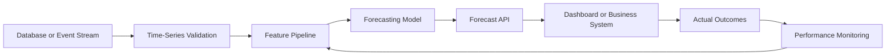

A production forecasting system may include:

* Scheduled data ingestion
* Feature generation
* Model training
* Model registry
* Batch forecasting
* Real-time inference
* Forecast storage
* Monitoring
* Automatic retraining
* Drift detection

---

## 34. Model Monitoring

Forecasting performance may deteriorate because:

* Customer behavior changes
* Seasonality shifts
* Product prices change
* New competitors appear
* Data pipelines fail
* External conditions change
* The target distribution changes

Useful monitoring metrics include:

* MAE by day
* RMSE by forecast horizon
* WAPE by product
* Forecast bias
* Missing input rate
* Feature drift
* Prediction interval coverage
* Baseline comparison

Forecast bias can be estimated as:

$$
\text{Bias} = \frac{1}{n} \sum_{t=1}^{n} (\hat{y}_t-y_t)
$$

A positive bias means systematic overprediction under this definition. A negative bias means systematic underprediction.

Always document the sign convention because some teams define forecast error in the opposite direction.

---

## 35. Common Mistakes

### 35.1 Randomly Shuffling Time Series Data

This mixes past and future information and creates unrealistic evaluation results.

### 35.2 Ignoring the Baseline

A complicated model may appear accurate but still perform worse than using last week's value.

### 35.3 Using Future Information

Unshifted rolling statistics, future promotions, or actual future weather can create leakage.

### 35.4 Ignoring Missing Time Intervals

Missing timestamps can distort rolling statistics and seasonal analysis.

### 35.5 Assuming Every Pattern Is Seasonal

Some repeating-looking patterns may be temporary cycles or random coincidence.

### 35.6 Evaluating Only One Period

A model may perform well during one month and fail during holidays or demand peaks.

### 35.7 Optimizing Only a Global Average Metric

A good overall MAE may hide poor performance for important products, regions, or peak periods.

### 35.8 Ignoring Forecast Horizon

A model that performs well one day ahead may perform poorly thirty days ahead.

### 35.9 Treating Forecasts as Certain

Forecasts should include uncertainty, especially for long horizons.

### 35.10 Building a Model Without a Decision

A technically accurate forecast has limited value if no business process uses it.

---

## 36. Practical Exercise

Use a small time series dataset such as:

* Daily sales
* Website traffic
* Electricity consumption
* Temperature
* Cryptocurrency price
* Server response time
* Number of application users

Complete the following tasks:

1. Parse the timestamp column.
2. Sort observations chronologically.
3. Check for duplicate timestamps.
4. Check for missing time intervals.
5. Plot the raw series.
6. Describe its trend.
7. Identify possible seasonality.
8. Create lag-1 and lag-7 features.
9. Create a seven-period rolling mean.
10. Reserve the final 20% of observations as the test set.
11. Create a naive forecast.
12. Create a seasonal naive forecast.
13. Calculate MAE and RMSE.
14. Plot actual values against forecasts.
15. Write one business recommendation.

---

## 37. Suggested Notebook Structure

```text
01. Problem Definition
02. Dataset Description
03. Time Index Validation
04. Missing-Value Analysis
05. Exploratory Visualization
06. Trend and Seasonality Analysis
07. Baseline Forecasts
08. Feature Engineering
09. Temporal Train/Test Split
10. Model Training
11. Forecast Evaluation
12. Error Analysis
13. Business Recommendation
14. Assumptions and Limitations
```

---

## 38. Reflection Questions

1. Why is observation order important in time series data?
2. What is the difference between trend and seasonality?
3. How does seasonality differ from a business cycle?
4. What does a lag feature represent?
5. Why can an unshifted rolling mean cause leakage?
6. Why should a time series not normally be split randomly?
7. When is a seasonal naive forecast appropriate?
8. What does autocorrelation at lag 7 suggest for daily data?
9. Why might forecasting accuracy decrease at longer horizons?
10. What real decision will use the forecast?

---

## 39. Completion Checklist

* [ ] I can explain time series data in one or two minutes.
* [ ] I can distinguish trend, seasonality, cycles, and noise.
* [ ] I understand lagged observations.
* [ ] I can calculate a rolling statistic.
* [ ] I understand autocorrelation conceptually.
* [ ] I can explain why random splitting causes leakage.
* [ ] I can create a chronological train/test split.
* [ ] I can implement naive and seasonal naive baselines.
* [ ] I can evaluate forecasts with MAE and RMSE.
* [ ] I can identify at least one assumption or limitation.
* [ ] I have created a notebook, chart, model, API, or portfolio note.
* [ ] I can connect the forecast to a business decision.

---

## 40. Related Outcome

Model relationships and time-dependent data using:

* Regression
* Residual diagnostics
* Lag features
* Rolling statistics
* Autocorrelation
* Stationarity
* ARIMA
* Forecast evaluation
* Production monitoring

---

## 41. Related Project

### Mini Project: Sales Forecasting

Build a daily sales forecasting workflow containing:

1. Time-index validation
2. Trend visualization
3. Weekly seasonality analysis
4. Lag and rolling features
5. Naive baseline
6. Seasonal naive baseline
7. Chronological train/test split
8. Optional ARIMA or machine learning model
9. MAE and RMSE comparison
10. Forecast visualization
11. Business recommendation

### Suggested Portfolio Artifacts

* Jupyter notebook
* Forecasting report
* Interactive dashboard
* REST forecasting API
* Dockerized forecasting service
* Scheduled batch prediction pipeline
* Model monitoring dashboard

---

## 42. Key Takeaways

1. Time series observations are ordered and often dependent.
2. Common components include trend, seasonality, cycles, and noise.
3. Lagged observations and rolling statistics summarize historical behavior.
4. Autocorrelation measures relationships between observations separated by time.
5. Temporal order must be preserved during training and evaluation.
6. Random train/test splitting can produce future-data leakage.
7. Simple baselines are essential for determining whether a model adds value.
8. Seasonal naive forecasts can be extremely strong when seasonality is stable.
9. Forecast performance should be evaluated across multiple historical periods.
10. A forecast becomes valuable when it supports a real decision.

---

## 43. Summary

**Time Series Basics** provides the foundation for working with data observed over time.

A complete time series workflow is:

```text
Time-stamped data
      ↓
Validate chronological structure
      ↓
Identify trend, seasonality and anomalies
      ↓
Create lag and rolling features
      ↓
Build simple baselines
      ↓
Split data chronologically
      ↓
Train and evaluate forecasting models
      ↓
Analyze forecast errors
      ↓
Generate a business recommendation
      ↓
Deploy and monitor performance
```

Do not stop after learning the definitions. Turn the lesson into a practical artifact such as a notebook, chart, forecasting model, API, Docker service, dashboard, or portfolio report.
````

### 2. `01 - AI & Dữ liệu/01 - AI Engineering & LLM/Ai-engineer/Khóa-1/Resources/llm_engineering/week4/community-contributions/ai_stock_trading/README.md`

Nguồn: `01 - AI & Dữ liệu/01 - AI Engineering & LLM/Ai-engineer/Khóa-1/Resources/llm_engineering/week4/community-contributions/ai_stock_trading/README.md`

````markdown
# 📈 AI Stock Trading & Sharia Compliance Platform

A comprehensive **Streamlit-based** web application that provides AI-powered stock analysis with Islamic Sharia compliance assessment. This professional-grade platform combines real-time financial data from USA and Egyptian markets, advanced technical analysis, and institutional-quality AI-driven insights to help users make informed investment decisions while adhering to Islamic finance principles.

## 📸 Application Screenshots

### Home View

*Main application interface with market selection and stock input*

### Chat Interface

*Interactive chat for trading advice, Sharia compliance, and stock analysis*

### Dashboard View

*Comprehensive dashboard with KPIs, charts, and real-time metrics*

## 🎯 Key Features

### 📊 **Comprehensive Stock Analysis**
- Real-time data fetching from multiple markets (USA, Egypt)
- Advanced technical indicators (RSI, MACD, Bollinger Bands, Moving Averages)
- Risk assessment and volatility analysis
- Performance metrics across multiple time periods

### 🤖 **AI-Powered Trading Decisions**
- GPT-4 powered investment recommendations
- Buy/Hold/Sell signals with confidence scores
- Price targets and stop-loss suggestions
- Algorithmic + AI combined decision making

### ☪️ **Sharia Compliance Checking**
- Islamic finance principles assessment
- Halal/Haram rulings with detailed reasoning
- Business activity and financial ratio screening
- Alternative investment suggestions

### 💬 **Natural Language Interface**
- Interactive chat interface for stock discussions
- Ask questions in plain English
- Context-aware responses about selected stocks
- Quick action buttons for common queries

### 📈 **Interactive Dashboards**
- Comprehensive metrics dashboard
- Multiple chart types (Price, Performance, Risk, Trading Signals)
- Real-time data visualization with Plotly
- Exportable analysis reports
- Real-time price charts with volume data
- Professional matplotlib-based visualizations
- Price statistics and performance metrics
- Responsive chart interface

### 🖥️ **Professional Interface**
- Clean, modern Streamlit web interface
- Multi-market support (USA & Egyptian stocks)
- Interactive chat interface with context awareness
- Real-time KPI dashboard with currency formatting
- Quick action buttons for common analysis tasks

## 🚀 Quick Start

### Prerequisites

Ensure you have Python 3.8+ installed on your system.

### Installation

1. **Clone or download this project**
```bash
git clone <repository-url>
cd ai_stock_trading
```

2. **Install dependencies**
```bash
pip install -r requirements.txt
```

3. **Set up environment variables**
Create a `.env` file in the project root:
```bash
OPENAI_API_KEY=your-api-key-here
```

### Running the Application

1. **Launch the Streamlit app**
```bash
streamlit run main_app.py
```

2. **Access the web interface** at `http://localhost:8501`

3. **Select your market** (USA or Egypt) from the sidebar

4. **Enter a stock symbol** and start analyzing!

## 📖 How to Use

1. **Select Market**: Choose between USA or Egypt from the sidebar
2. **Enter Stock Symbol**: Input a ticker (e.g., AAPL for USA, ABUK.CA for Egypt)
3. **View Dashboard**: See real-time KPIs, price charts, and key metrics
4. **Use Chat Interface**: Ask questions or request specific analysis:
   - "Give me trading advice for AAPL"
   - "Is this stock Sharia compliant?"
   - "What's the price target?"
5. **Review Professional Analysis**:
   - **Trading Recommendations**: Institutional-grade BUY/HOLD/SELL advice
   - **Sharia Compliance**: Comprehensive Islamic finance screening
   - **Technical Analysis**: Advanced indicators and risk assessment

### Example Tickers to Try

#### USA Market
| Ticker | Company | Sector | Expected Sharia Status |
|--------|---------|--------|-----------------------|
| **AAPL** | Apple Inc. | Technology | ✅ Likely Halal |
| **MSFT** | Microsoft Corp. | Technology | ✅ Likely Halal |
| **GOOGL** | Alphabet Inc. | Technology | ✅ Likely Halal |
| **JNJ** | Johnson & Johnson | Healthcare | ✅ Likely Halal |
| **BAC** | Bank of America | Banking | ❌ Likely Haram |
| **JPM** | JPMorgan Chase | Banking | ❌ Likely Haram |

#### Egypt Market
| Ticker | Company | Sector | Expected Sharia Status |
|--------|---------|--------|-----------------------|
| **ABUK.CA** | Abu Qir Fertilizers | Industrial | ✅ Likely Halal |
| **ETEL.CA** | Egyptian Telecom | Telecom | ✅ Likely Halal |
| **HRHO.CA** | Hassan Allam Holding | Construction | ✅ Likely Halal |
| **CIB.CA** | Commercial Intl Bank | Banking | ❌ Likely Haram |

## 🔧 Technical Implementation

### Modular Architecture

The platform is built with a clean, modular architecture using separate tool modules:

#### 1. **Stock Fetching Module** (`tools/fetching.py`)
- **Multi-Market Support**: USA (75+ stocks) and Egypt (50+ stocks) with proper currency handling
- **Real-Time Data**: Uses yfinance API with robust error handling
- **Currency Formatting**: Automatic USD/EGP formatting based on market
- **Stock Info Enrichment**: Company details, market cap, sector classification

#### 2. **Technical Analysis Module** (`tools/analysis.py`)
- **Advanced Indicators**: RSI, MACD, Bollinger Bands, Moving Averages
- **Risk Metrics**: Volatility analysis, Sharpe ratio, maximum drawdown
- **Performance Analysis**: Multi-timeframe returns and trend analysis
- **Professional Calculations**: Annualized metrics and statistical analysis

#### 3. **Trading Decisions Module** (`tools/trading_decisions.py`)
- **Institutional-Grade AI**: Senior analyst persona with 15+ years experience
- **Professional Standards**: BUY/HOLD/SELL with confidence, price targets, stop-loss
- **Risk Management**: Risk-reward ratios, time horizons, risk assessment
- **Robust JSON Parsing**: Handles malformed AI responses with fallback logic

#### 4. **Sharia Compliance Module** (`tools/sharia_compliance.py`)
- **Comprehensive Screening**: Business activities, financial ratios, trading practices
- **AAOIFI Standards**: Debt-to-assets < 33%, interest income < 5%
- **Prohibited Activities**: 50+ categories including banking, gambling, alcohol
- **User-Triggered Analysis**: Only shows when specifically requested

#### 5. **Charting Module** (`tools/charting.py`)
- **Professional Visualizations**: Plotly-based interactive charts
- **Multiple Chart Types**: Price, volume, technical indicators
- **Responsive Design**: Mobile-friendly chart rendering
- **Export Capabilities**: PNG/HTML export functionality

#### 6. **Main Application** (`main_app.py`)
- **Streamlit Interface**: Modern, responsive web application
- **Chat Integration**: Context-aware conversational interface
- **Real-Time KPIs**: Live dashboard with key metrics
- **Session Management**: Persistent data across user interactions

### AI Integration

The platform leverages OpenAI's GPT-4o-mini with specialized prompts:

#### Trading Analysis Prompts
- **Senior Analyst Persona**: 15+ years institutional experience
- **Professional Standards**: Risk-reward ratios, logical price targets
- **Structured Output**: JSON format with validation and error handling
- **Technical Focus**: Based on RSI, MACD, trend analysis, volume patterns

#### Sharia Compliance Prompts
- **Islamic Scholar Approach**: Follows AAOIFI and DSN standards
- **Comprehensive Screening**: Business activities, financial ratios, trading practices
- **Scholarly Reasoning**: Detailed justification with Islamic finance principles
- **Confidence Scoring**: Quantified certainty levels for rulings

## 📊 Sample Analysis Output

### Trade Recommendation Example
```
RECOMMENDATION: BUY

Based on the analysis of AAPL:
• 1Y return of +15.2% shows strong performance
• Volatility of 24.3% indicates manageable risk
• Recent 1M return of +5.8% shows positive momentum
• Strong volume indicates healthy trading activity

Key factors supporting BUY decision:
- Consistent positive returns across timeframes
- Volatility within acceptable range for tech stocks
- Strong market position and fundamentals
```

### Sharia Assessment Example
```json
{
  "ruling": "HALAL",
  "confidence": 85,
  "justification": "Apple Inc. primarily operates in technology hardware and software, which are permissible under Islamic law. The company's main revenue sources (iPhone, Mac, services) do not involve prohibited activities such as gambling, alcohol, or interest-based banking."
}
```

## ⚠️ Important Disclaimers

### Financial Disclaimer
- **This tool is for educational purposes only**
- **Not professional financial advice**
- **Past performance does not guarantee future results**
- **Consult qualified financial advisors before making investment decisions**

### Sharia Compliance Disclaimer
- **Consult qualified Islamic scholars for authoritative rulings**
- **AI assessments are preliminary and may have limitations**
- **Consider multiple sources for Sharia compliance verification**
- **Individual scholarly interpretations may vary**

### Technical Limitations
- **Data accuracy depends on yfinance API availability**
- **OpenAI API calls consume credits/tokens**
- **Network connectivity required for real-time data**
- **Analysis speed depends on API response times**

## 🔧 Customization

### Adding New Analysis Periods
```python
periods = ["1mo", "3mo", "6mo", "1y", "2y", "5y"]  # Modify as needed
```

### Modifying Sharia Criteria
```python
# Update the Sharia assessment prompt with additional criteria
prompt = f"""
Additional criteria:
- Debt-to-market cap ratio analysis
- Revenue source breakdown
- ESG factors consideration
"""
```

### Styling the Interface
```python
demo = create_interface()
demo.launch(theme="huggingface")  # Try different themes
```

## 📚 Dependencies

- **yfinance**: Real-time financial data
- **openai**: AI-powered analysis
- **pandas**: Data manipulation
- **matplotlib**: Chart generation
- **gradio**: Web interface
- **requests**: HTTP requests
- **beautifulsoup4**: Web scraping
- **numpy**: Numerical computations

## 🤝 Contributing

Contributions are welcome! Please feel free to submit issues, feature requests, or pull requests.

### Areas for Enhancement
- Additional technical indicators
- More sophisticated Sharia screening
- Portfolio analysis features
- Historical backtesting
- Mobile-responsive design

### 🔮 Future Work: MCP Integration

We plan to implement a **Model Context Protocol (MCP) layer** to make all trading tools accessible as standardized MCP tools:

#### Planned MCP Tools:
- **`stock_fetcher`** - Real-time market data retrieval for USA/Egypt markets
- **`technical_analyzer`** - Advanced technical analysis with 20+ indicators
- **`sharia_checker`** - Islamic finance compliance screening
- **`trading_advisor`** - AI-powered institutional-grade recommendations
- **`risk_assessor`** - Portfolio risk analysis and management
- **`chart_generator`** - Professional financial visualizations

#### Benefits of MCP Integration:
- **Standardized Interface**: Consistent tool access across different AI systems
- **Interoperability**: Easy integration with other MCP-compatible platforms
- **Scalability**: Modular architecture for adding new financial tools
- **Reusability**: Tools can be used independently or combined
- **Professional Integration**: Compatible with institutional trading platforms

This will enable the platform to serve as a comprehensive financial analysis toolkit that can be integrated into various AI-powered trading systems and workflows.

## 📄 License

This project is for educational purposes. Please ensure compliance with:
- OpenAI API usage terms
- Yahoo Finance data usage policies
- Local financial regulations
- Islamic finance guidelines

## 🙏 Acknowledgments

- **yfinance** for providing free financial data API
- **OpenAI** for GPT-4o-mini language model
- **Gradio** for the intuitive web interface framework
- **Islamic finance scholars** for Sharia compliance frameworks

---

**Made with ❤️ for the Muslim tech community and ethical investing enthusiasts**

*"And Allah knows best" - وَاللَّهُ أَعْلَمُ* 
````

### 3. `01 - AI & Dữ liệu/02 - Data Science, Analytics & ML/bi-analyst-roadmap/BI-Analyst-Roadmap-Course/00 - Roadmap.sh BI Analyst Official/Module 04 - Statistics Basics - Thong ke co ban/01-VariablesAndData-CorrelationAnalysis/003 - Correlation Analysis.md`

Nguồn: `01 - AI & Dữ liệu/02 - Data Science, Analytics & ML/bi-analyst-roadmap/BI-Analyst-Roadmap-Course/00 - Roadmap.sh BI Analyst Official/Module 04 - Statistics Basics - Thong ke co ban/01-VariablesAndData-CorrelationAnalysis/003 - Correlation Analysis.md`

````markdown
# 003 - Correlation Analysis

**Module:** Module 04 - Statistics Basics - Thống kê cơ bản  
**Roadmap item:** 4.3  
**Loại nội dung:** Statistics basics  
**Thời lượng gợi ý:** 45-75 phút

---

## 1. Tóm tắt
Correlation vs Causation

Với BI Analyst, **Correlation Analysis** cần được gắn với một câu hỏi kinh doanh rõ: ai cần quyết định, dữ liệu nào được dùng, metric nào quan trọng và insight sẽ dẫn tới hành động nào.

## 2. Mục tiêu học tập
- Giải thích được **Correlation Analysis** bằng ngôn ngữ dễ hiểu cho stakeholder không chuyên về dữ liệu.
- Biết cách áp dụng chủ đề này trong phân tích, dashboard, reporting hoặc portfolio BI.
- Tạo được một artifact nhỏ có thể review: SQL query, dashboard note, KPI definition, analysis brief hoặc executive summary.

## 3. Nội dung roadmap
- Correlation vs Causation
- Hệ số tương quan
- Phân tích mối quan hệ giữa biến

## 4. Ứng dụng trong công việc BI Analyst
- Bắt đầu từ business question trước khi chọn chart, query hoặc tool.
- Kiểm tra data quality, định nghĩa metric và bối cảnh trước khi kết luận.
- Chuyển kết quả phân tích thành recommendation, risk hoặc next action rõ ràng.

## 5. Bài tập thực hành
Tạo một dataset nhỏ, tính descriptive statistics và viết nhận xét tránh nhầm correlation với causation.

Sau đó viết 5-7 dòng trả lời: insight nào có thể giúp stakeholder ra quyết định tốt hơn?

## 6. Artifact nên tạo
- Statistics cheat sheet and hypothesis testing note
- Một ví dụ từ dashboard, SQL query, spreadsheet, BI tool hoặc business report
- Checklist chất lượng: dữ liệu đúng, metric rõ, chart dễ hiểu, recommendation có hành động

## 7. Câu hỏi tự kiểm tra
- Business question của bài này là gì?
- Dữ liệu có đủ đúng, đủ mới và đủ chi tiết để kết luận không?
- Metric/chart/query nào dễ bị hiểu sai?
- Insight cuối cùng dẫn tới quyết định hoặc hành động nào?

## 8. Tổng kết
**Correlation Analysis** là một phần trong năng lực biến dữ liệu thành quyết định. Hãy kết thúc bài học bằng artifact có thể đưa vào dashboard, report hoặc portfolio BI Analyst.
````

### 4. `01 - AI & Dữ liệu/02 - Data Science, Analytics & ML/ai-data-scientist-roadmap/AI-Data-Scientist-Roadmap-Course/00 - Roadmap.sh AI Data Scientist Official/03 - Machine Learning and Deep Learning/Module 06 - Machine Learning/06-Select/033 - Model Selection.md`

Nguồn: `01 - AI & Dữ liệu/02 - Data Science, Analytics & ML/ai-data-scientist-roadmap/AI-Data-Scientist-Roadmap-Course/00 - Roadmap.sh AI Data Scientist Official/03 - Machine Learning and Deep Learning/Module 06 - Machine Learning/06-Select/033 - Model Selection.md`

````markdown
# 033 - Model Selection

**Course:** 03 - Machine Learning and Deep Learning
**Module:** Module 06 - Machine Learning
**Content Group:** Feature Engineering
**Roadmap Source:** Machine Learning / Feature Engineering
**Lesson Type:** Machine Learning
**Order in Module:** 033
**Suggested Duration:** 26 minutes

---

## 1. Summary

**Model Selection** is the process of comparing candidate machine learning models and choosing the one that best satisfies the technical and business requirements of a problem.

The goal is not simply to choose the model with the highest score. A good model should also be:

* Reliable on unseen data
* Appropriate for the business objective
* Resistant to overfitting
* Fast enough for production
* Easy enough to maintain
* Explainable when required
* Compatible with available data and infrastructure

A typical model-selection process compares:

* A simple baseline
* Several model families
* Different feature sets
* Different hyperparameters
* Multiple evaluation metrics
* Training and inference costs
* Model stability across validation folds

The central question is:

> Which model provides the best balance between predictive performance, complexity, reliability, and business value?

---

## 2. Learning Objectives

After completing this lesson, you should be able to:

* Explain model selection in your own words.
* Distinguish model selection from model training and hyperparameter tuning.
* Establish an appropriate baseline.
* Choose evaluation metrics based on the business problem.
* Compare multiple model families fairly.
* Use validation sets and cross-validation correctly.
* Recognize underfitting and overfitting.
* Avoid data leakage during model comparison.
* Select models using both technical and operational criteria.
* Build a reproducible model-selection pipeline.
* Document experiments and justify the final model choice.

---

## 3. What Is Model Selection?

Suppose you want to predict house prices.

Possible candidate models include:

```text
Mean-price baseline
Linear Regression
Ridge Regression
Decision Tree
Random Forest
Gradient Boosting
XGBoost
Neural Network
```

Each model has different properties.

| Model             | Strength                   | Limitation                          |
| ----------------- | -------------------------- | ----------------------------------- |
| Linear Regression | Fast and interpretable     | Assumes mostly linear relationships |
| Decision Tree     | Easy to visualize          | Can overfit                         |
| Random Forest     | Strong general performance | Larger and less interpretable       |
| Gradient Boosting | High predictive power      | Requires careful tuning             |
| Neural Network    | Can model complex patterns | Requires more data and computation  |

Model selection compares these candidates under the same experimental conditions.

Formally, suppose the candidate model set is:

$$
\mathcal{M} = {M_1, M_2, \ldots, M_k}
$$

The selected model is:

$$
M^* = \arg\max_{M_i \in \mathcal{M}} \text{Score}(M_i)
$$

For an error metric such as MAE or RMSE, the objective becomes:

$$
M^* = \arg\min_{M_i \in \mathcal{M}} \text{Error}(M_i)
$$

In practice, model selection is usually a multi-objective decision:

$$
M^* = f( \text{performance}, \text{latency}, \text{cost}, \text{stability}, \text{interpretability} )
$$

---

## 4. Model Selection in the Machine Learning Workflow


A good workflow separates:

* Model development
* Model comparison
* Final unbiased evaluation

The test set should not be used repeatedly during model selection.

---

## 5. Model Selection vs. Related Concepts

### 5.1 Model Training

Model training estimates model parameters from data.

For Linear Regression, training learns coefficients:

$$
\hat{y} = w_0 + w_1x_1 + \cdots + w_px_p
$$

The learned values (w_0, w_1, \ldots, w_p) are model parameters.

---

### 5.2 Hyperparameter Tuning

Hyperparameters are settings chosen before or during training.

Examples include:

```text
Random Forest:
- number of trees
- maximum depth
- minimum samples per leaf

XGBoost:
- learning rate
- maximum depth
- number of estimators

KNN:
- number of neighbors
- distance metric
```

Hyperparameter tuning searches for the best configuration of one model family.

---

### 5.3 Model Selection

Model selection can include comparing:

* Different model families
* Different preprocessing strategies
* Different feature sets
* Different hyperparameters
* Different decision thresholds

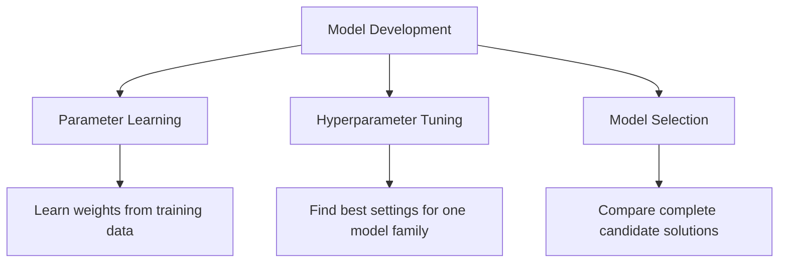

---

## 6. Start with the Business Problem

Before comparing models, define the actual decision the model will support.

Examples:

| Problem                | Prediction             | Business Decision           |
| ---------------------- | ---------------------- | --------------------------- |
| House price prediction | Estimated sale price   | Pricing and investment      |
| Customer churn         | Probability of leaving | Retention campaign          |
| Fraud detection        | Probability of fraud   | Block or review transaction |
| Medical screening      | Disease risk           | Request further examination |
| Demand forecasting     | Future demand          | Inventory planning          |

A technically strong model can still fail if it solves the wrong problem.

Important questions include:

* What decision will use the prediction?
* What is the cost of a false positive?
* What is the cost of a false negative?
* How quickly must predictions be produced?
* Does the model need to be explainable?
* How frequently will it be retrained?
* Which data will be available at inference time?

---

## 7. Establishing a Baseline

A baseline is a simple reference model used to judge whether a more complex model provides meaningful improvement.

Without a baseline, a score has little context.

---

### 7.1 Regression Baselines

A common regression baseline predicts the training-set mean:

$$
\hat{y}_i = \bar{y}_{\text{train}}
$$

Another option is the median:

$$
\hat{y}_i = \text{median}(y_{\text{train}})
$$

The median is often more robust to outliers.

```python
from sklearn.dummy import DummyRegressor
from sklearn.metrics import mean_absolute_error

baseline = DummyRegressor(strategy="median")
baseline.fit(X_train, y_train)

predictions = baseline.predict(X_valid)

mae = mean_absolute_error(y_valid, predictions)

print("Baseline MAE:", mae)
```

---

### 7.2 Classification Baselines

Common classification baselines include:

* Predict the majority class
* Predict according to class frequencies
* Predict randomly
* Use a simple rule-based system

```python
from sklearn.dummy import DummyClassifier
from sklearn.metrics import classification_report

baseline = DummyClassifier(
    strategy="most_frequent"
)

baseline.fit(X_train, y_train)

predictions = baseline.predict(X_valid)

print(classification_report(y_valid, predictions))
```

---

### 7.3 Why the Baseline Matters

Suppose a classification model achieves:

```text
Accuracy = 92%
```

This may appear strong.

However, if 95% of the data belongs to one class, a majority-class baseline achieves:

```text
Accuracy = 95%
```

The trained model is therefore worse than the baseline.

---

## 8. Train, Validation, and Test Sets

A dataset is commonly divided into three parts.

| Dataset        | Purpose                                 |
| -------------- | --------------------------------------- |
| Training set   | Fit model parameters                    |
| Validation set | Compare models and tune hyperparameters |
| Test set       | Perform final unbiased evaluation       |

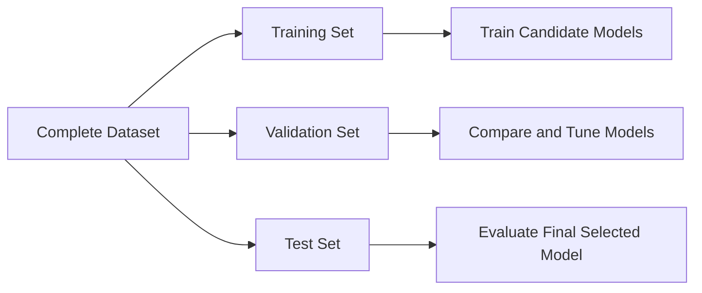

A common split is:

```text
Training:   70%
Validation: 15%
Test:       15%
```

The exact proportions depend on dataset size.

---

### Python Example

```python
from sklearn.model_selection import train_test_split

X_train_temp, X_test, y_train_temp, y_test = train_test_split(
    X,
    y,
    test_size=0.15,
    random_state=42
)

validation_ratio = 0.15 / 0.85

X_train, X_valid, y_train, y_valid = train_test_split(
    X_train_temp,
    y_train_temp,
    test_size=validation_ratio,
    random_state=42
)

print("Training samples:", len(X_train))
print("Validation samples:", len(X_valid))
print("Test samples:", len(X_test))
```

For classification, preserve the class distribution using stratification:

```python
X_train, X_test, y_train, y_test = train_test_split(
    X,
    y,
    test_size=0.20,
    stratify=y,
    random_state=42
)
```

---

## 9. Cross-Validation

A single validation split may produce unstable results.

Cross-validation evaluates a model using multiple train-validation partitions.

In (k)-fold cross-validation:

1. Divide the training data into (k) folds.
2. Train on (k-1) folds.
3. Validate on the remaining fold.
4. Repeat until every fold has been used for validation.
5. Average the scores.

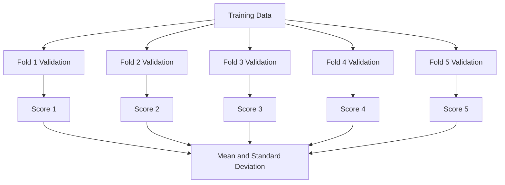

The average cross-validation score is:

$$
\bar{s} = \frac{1}{k} \sum_{i=1}^{k}s_i
$$

The standard deviation is:

$$
\sigma_s = \sqrt{ \frac{1}{k} \sum_{i=1}^{k}(s_i-\bar{s})^2 }
$$

A model with a slightly lower average score but much lower variation may be more reliable.

---

### Python Example

```python
from sklearn.model_selection import cross_validate
from sklearn.ensemble import RandomForestRegressor

model = RandomForestRegressor(
    n_estimators=300,
    random_state=42,
    n_jobs=-1
)

scores = cross_validate(
    estimator=model,
    X=X_train,
    y=y_train,
    cv=5,
    scoring={
        "mae": "neg_mean_absolute_error",
        "r2": "r2"
    },
    return_train_score=True,
    n_jobs=-1
)

mean_validation_mae = -scores["test_mae"].mean()
std_validation_mae = scores["test_mae"].std()

print("Mean validation MAE:", mean_validation_mae)
print("MAE standard deviation:", std_validation_mae)
```

---

## 10. Choosing the Correct Validation Strategy

Standard random cross-validation is not appropriate for every dataset.

### 10.1 Stratified Cross-Validation

Use stratification when classification classes are imbalanced.

```python
from sklearn.model_selection import StratifiedKFold

cv = StratifiedKFold(
    n_splits=5,
    shuffle=True,
    random_state=42
)
```

---

### 10.2 Group-Based Cross-Validation

Use group-based splitting when samples from the same entity must not appear in both training and validation sets.

Examples:

* Multiple transactions from the same customer
* Multiple images from the same patient
* Multiple records from the same machine
* Multiple observations from the same household

```python
from sklearn.model_selection import GroupKFold

cv = GroupKFold(n_splits=5)

for train_index, valid_index in cv.split(
    X,
    y,
    groups=customer_ids
):
    X_fold_train = X.iloc[train_index]
    X_fold_valid = X.iloc[valid_index]
```

---

### 10.3 Time-Series Validation

Future observations must not be used to predict the past.

Incorrect:

```text
Randomly mix 2022, 2023, and 2024 data
```

Correct:

```text
Train: January–June
Validate: July

Train: January–July
Validate: August

Train: January–August
Validate: September
```

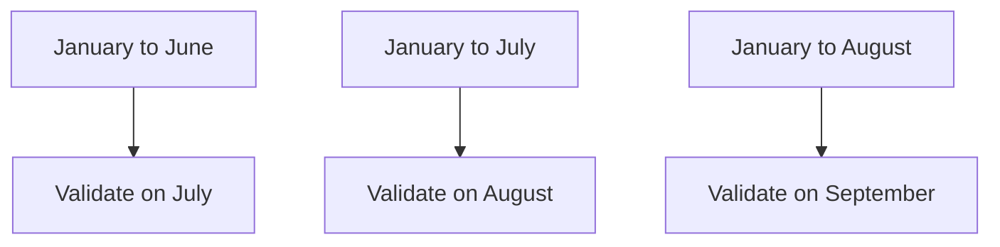

```python
from sklearn.model_selection import TimeSeriesSplit

cv = TimeSeriesSplit(n_splits=5)
```

---

## 11. Choosing Evaluation Metrics

A model should be selected using metrics that reflect the business objective.

---

## 11.1 Classification Metrics

### Accuracy

$$
\text{Accuracy} = \frac{TP+TN}{TP+TN+FP+FN}
$$

Accuracy is useful when:

* Classes are reasonably balanced.
* False positives and false negatives have similar costs.

---

### Precision

$$
\text{Precision} = \frac{TP}{TP+FP}
$$

Use precision when false positives are expensive.

Example:

```text
Do not incorrectly block legitimate financial transactions.
```

---

### Recall

$$
\text{Recall} = \frac{TP}{TP+FN}
$$

Use recall when false negatives are expensive.

Example:

```text
Detect as many fraudulent transactions as possible.
```

---

### F1-Score

$$
F_1 = 2 \cdot \frac{ \text{Precision}\cdot\text{Recall} }{ \text{Precision}+\text{Recall} }
$$

Use F1-score when precision and recall both matter.

---

### ROC-AUC

ROC-AUC evaluates how well the model ranks positive examples above negative examples across thresholds.

It is useful for comparing ranking performance, but may appear optimistic on highly imbalanced datasets.

---

### PR-AUC

Precision-Recall AUC is often more informative for rare positive classes.

Examples:

* Fraud detection
* Disease detection
* Equipment failure
* Rare-event detection

---

### Log Loss

Log loss evaluates the quality of predicted probabilities:

$$
-\frac{1}{n} \sum_{i=1}^{n} \left[ y_i\log(p_i) + (1-y_i)\log(1-p_i) \right]
$$

It penalizes confident incorrect predictions strongly.

---

## 11.2 Regression Metrics

### Mean Absolute Error

$$
MAE = \frac{1}{n} \sum_{i=1}^{n}|y_i-\hat{y}_i|
$$

MAE is easy to interpret because it uses the same unit as the target.

---

### Mean Squared Error

$$
MSE = \frac{1}{n} \sum_{i=1}^{n}(y_i-\hat{y}_i)^2
$$

MSE gives greater weight to large errors.

---

### Root Mean Squared Error

$$
RMSE = \sqrt{ \frac{1}{n} \sum_{i=1}^{n}(y_i-\hat{y}_i)^2 }
$$

RMSE has the same unit as the target while strongly penalizing large errors.

---

### R-Squared

$$
R^2 = 1- \frac{ \sum_{i=1}^{n}(y_i-\hat{y}_i)^2 }{ \sum_{i=1}^{n}(y_i-\bar{y})^2 }
$$

(R^2) measures how much variance is explained relative to a mean baseline.

---

## 12. Underfitting and Overfitting

Model selection must balance bias and variance.

---

### 12.1 Underfitting

A model underfits when it is too simple to learn the important patterns.

Typical signs:

```text
Training performance: poor
Validation performance: poor
```

Examples:

* Linear model for a strongly nonlinear relationship
* Very shallow decision tree
* Excessively strong regularization

---

### 12.2 Overfitting

A model overfits when it learns training-specific noise.

Typical signs:

```text
Training performance: excellent
Validation performance: poor
```

Examples:

* Very deep decision tree
* Too many polynomial features
* Excessively complex neural network
* Hyperparameter search that overuses one validation set

---

### 12.3 Good Generalization

```text
Training performance: strong
Validation performance: similarly strong
```

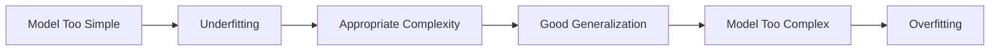

---

## 13. Bias-Variance Trade-Off

Prediction error can be viewed conceptually as:

$$
\text{Expected Error} = \text{Bias}^2 + \text{Variance} + \text{Irreducible Noise}
$$

### High Bias

The model makes overly simple assumptions.

```text
Likely result: underfitting
```

### High Variance

The model changes too much when the training data changes.

```text
Likely result: overfitting
```

The selected model should provide a reasonable balance.

---

## 14. Comparing Candidate Models

A fair comparison requires:

* The same training data
* The same validation folds
* The same preprocessing rules
* The same feature availability
* The same evaluation metric
* Reproducible random seeds
* Similar tuning effort

Example candidate models for regression:

```python
from sklearn.linear_model import LinearRegression, Ridge
from sklearn.ensemble import (
    RandomForestRegressor,
    GradientBoostingRegressor
)

models = {
    "linear_regression": LinearRegression(),
    "ridge": Ridge(alpha=1.0),
    "random_forest": RandomForestRegressor(
        n_estimators=300,
        random_state=42,
        n_jobs=-1
    ),
    "gradient_boosting": GradientBoostingRegressor(
        random_state=42
    )
}
```

---

## 15. Practical Model Comparison

```python
import pandas as pd

from sklearn.model_selection import cross_validate, KFold
from sklearn.pipeline import Pipeline
from sklearn.impute import SimpleImputer
from sklearn.preprocessing import StandardScaler
from sklearn.linear_model import LinearRegression, Ridge
from sklearn.ensemble import (
    RandomForestRegressor,
    GradientBoostingRegressor
)

models = {
    "linear_regression": LinearRegression(),
    "ridge": Ridge(alpha=1.0),
    "random_forest": RandomForestRegressor(
        n_estimators=300,
        random_state=42,
        n_jobs=-1
    ),
    "gradient_boosting": GradientBoostingRegressor(
        random_state=42
    )
}

cv = KFold(
    n_splits=5,
    shuffle=True,
    random_state=42
)

results = []

for model_name, model in models.items():
    pipeline = Pipeline([
        (
            "imputer",
            SimpleImputer(strategy="median")
        ),
        (
            "scaler",
            StandardScaler()
        ),
        (
            "model",
            model
        )
    ])

    scores = cross_validate(
        pipeline,
        X_train,
        y_train,
        cv=cv,
        scoring={
            "mae": "neg_mean_absolute_error",
            "rmse": "neg_root_mean_squared_error",
            "r2": "r2"
        },
        return_train_score=True,
        n_jobs=-1
    )

    results.append({
        "model": model_name,
        "train_mae": -scores["train_mae"].mean(),
        "validation_mae": -scores["test_mae"].mean(),
        "validation_mae_std": scores["test_mae"].std(),
        "validation_rmse": -scores["test_rmse"].mean(),
        "validation_r2": scores["test_r2"].mean()
    })

results_table = (
    pd.DataFrame(results)
    .sort_values("validation_mae")
)

print(results_table)
```

### Important Note

Scaling is essential for models such as:

* Linear Regression with regularization
* Logistic Regression
* Support Vector Machines
* K-Nearest Neighbors
* Neural Networks

Tree-based models usually do not require scaling. A real comparison may therefore use separate preprocessing pipelines for different model families.

---

## 16. Using a Column Transformer

Datasets often contain both numerical and categorical features.

```python
from sklearn.compose import ColumnTransformer
from sklearn.pipeline import Pipeline
from sklearn.preprocessing import (
    OneHotEncoder,
    StandardScaler
)
from sklearn.impute import SimpleImputer
from sklearn.linear_model import Ridge

numeric_features = [
    "area",
    "bedrooms",
    "bathrooms",
    "building_age"
]

categorical_features = [
    "location",
    "property_type"
]

numeric_pipeline = Pipeline([
    (
        "imputer",
        SimpleImputer(strategy="median")
    ),
    (
        "scaler",
        StandardScaler()
    )
])

categorical_pipeline = Pipeline([
    (
        "imputer",
        SimpleImputer(strategy="most_frequent")
    ),
    (
        "encoder",
        OneHotEncoder(
            handle_unknown="ignore"
        )
    )
])

preprocessor = ColumnTransformer([
    (
        "numeric",
        numeric_pipeline,
        numeric_features
    ),
    (
        "categorical",
        categorical_pipeline,
        categorical_features
    )
])

model_pipeline = Pipeline([
    (
        "preprocessor",
        preprocessor
    ),
    (
        "model",
        Ridge(alpha=1.0)
    )
])

model_pipeline.fit(X_train, y_train)
```

Using pipelines ensures that preprocessing is learned only from training data.

---

## 17. Hyperparameter Tuning

After identifying promising model families, tune their hyperparameters.

Common search strategies include:

* Grid Search
* Random Search
* Bayesian Optimization
* Successive Halving
* Optuna-style optimization

---

### 17.1 Grid Search

Grid Search evaluates every specified combination.

```python
from sklearn.model_selection import GridSearchCV
from sklearn.ensemble import RandomForestRegressor

pipeline = Pipeline([
    (
        "preprocessor",
        preprocessor
    ),
    (
        "model",
        RandomForestRegressor(
            random_state=42,
            n_jobs=-1
        )
    )
])

parameter_grid = {
    "model__n_estimators": [100, 300],
    "model__max_depth": [None, 10, 20],
    "model__min_samples_leaf": [1, 3, 5]
}

search = GridSearchCV(
    estimator=pipeline,
    param_grid=parameter_grid,
    scoring="neg_mean_absolute_error",
    cv=5,
    n_jobs=-1
)

search.fit(X_train, y_train)

print("Best parameters:", search.best_params_)
print("Best CV MAE:", -search.best_score_)
```

Grid Search can become expensive when many hyperparameters are included.

---

### 17.2 Random Search

Random Search evaluates randomly sampled combinations.

```python
from sklearn.model_selection import RandomizedSearchCV

parameter_distributions = {
    "model__n_estimators": [100, 200, 300, 500],
    "model__max_depth": [None, 5, 10, 20, 30],
    "model__min_samples_leaf": [1, 2, 3, 5, 10],
    "model__max_features": [
        "sqrt",
        "log2",
        None
    ]
}

search = RandomizedSearchCV(
    estimator=pipeline,
    param_distributions=parameter_distributions,
    n_iter=20,
    scoring="neg_mean_absolute_error",
    cv=5,
    random_state=42,
    n_jobs=-1
)

search.fit(X_train, y_train)
```

Random Search is often more efficient when the search space is large.

---

## 18. Nested Cross-Validation

When datasets are small, the same cross-validation process can accidentally be used both for tuning and performance estimation.

Nested cross-validation separates these tasks.

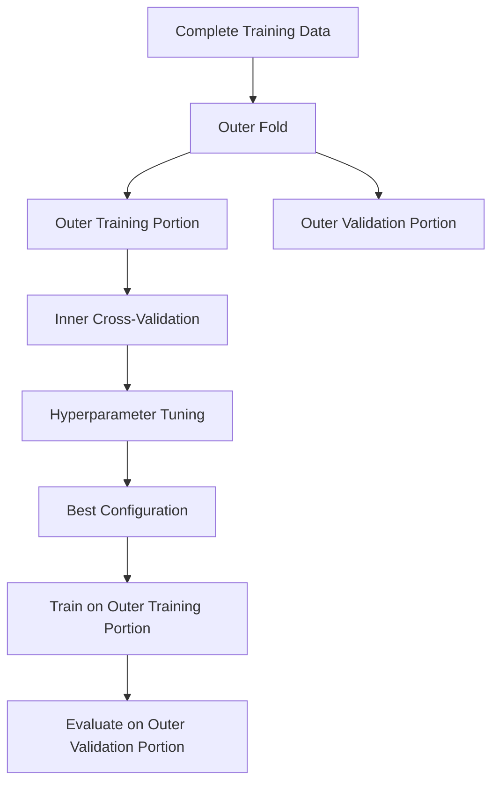

The inner loop tunes hyperparameters.

The outer loop estimates generalization performance.

Nested cross-validation is useful when:

* The dataset is small.
* Hyperparameter tuning is extensive.
* A reliable comparison is required.
* Model-selection bias is a concern.

---

## 19. Model Selection for Classification

Possible candidate models include:

```text
Dummy Classifier
Logistic Regression
Decision Tree
Random Forest
Support Vector Machine
Gradient Boosting
XGBoost
Neural Network
```

### Example

```python
import pandas as pd

from sklearn.model_selection import (
    StratifiedKFold,
    cross_validate
)
from sklearn.pipeline import Pipeline
from sklearn.preprocessing import StandardScaler
from sklearn.linear_model import LogisticRegression
from sklearn.ensemble import (
    RandomForestClassifier,
    GradientBoostingClassifier
)
from sklearn.svm import SVC

models = {
    "logistic_regression": LogisticRegression(
        max_iter=3000,
        class_weight="balanced"
    ),
    "random_forest": RandomForestClassifier(
        n_estimators=300,
        class_weight="balanced",
        random_state=42,
        n_jobs=-1
    ),
    "gradient_boosting": GradientBoostingClassifier(
        random_state=42
    ),
    "svm": SVC(
        probability=True,
        class_weight="balanced",
        random_state=42
    )
}

cv = StratifiedKFold(
    n_splits=5,
    shuffle=True,
    random_state=42
)

results = []

for model_name, model in models.items():
    pipeline = Pipeline([
        (
            "scaler",
            StandardScaler()
        ),
        (
            "model",
            model
        )
    ])

    scores = cross_validate(
        pipeline,
        X_train,
        y_train,
        cv=cv,
        scoring={
            "precision": "precision",
            "recall": "recall",
            "f1": "f1",
            "roc_auc": "roc_auc"
        },
        n_jobs=-1
    )

    results.append({
        "model": model_name,
        "precision": scores["test_precision"].mean(),
        "recall": scores["test_recall"].mean(),
        "f1": scores["test_f1"].mean(),
        "roc_auc": scores["test_roc_auc"].mean()
    })

comparison = (
    pd.DataFrame(results)
    .sort_values("f1", ascending=False)
)

print(comparison)
```

---

## 20. Model Selection for Regression

Possible candidate models include:

```text
Dummy Regressor
Linear Regression
Ridge
Lasso
Decision Tree
Random Forest
Gradient Boosting
XGBoost
Neural Network
```

Models should be compared using relevant metrics such as:

* MAE
* RMSE
* (R^2)
* Training time
* Prediction latency
* Model size

Example comparison table:

| Model             | CV MAE | CV RMSE | CV (R^2) | Training Time |
| ----------------- | -----: | ------: | -------: | ------------: |
| Median baseline   | 48,200 |  72,400 |    -0.01 |        0.01 s |
| Linear Regression | 31,100 |  47,300 |     0.69 |        0.04 s |
| Random Forest     | 22,600 |  35,700 |     0.82 |        3.80 s |
| Gradient Boosting | 21,900 |  34,800 |     0.84 |        1.90 s |

The Gradient Boosting model has the best average performance, but the final decision should still consider deployment requirements.

---

## 21. Model Selection for Unsupervised Learning

Model selection is more difficult in unsupervised learning because there may be no ground-truth target.

For clustering, compare:

* K-Means
* Hierarchical Clustering
* DBSCAN
* Gaussian Mixture Models

Possible evaluation criteria include:

* Silhouette score
* Davies-Bouldin score
* Calinski-Harabasz score
* Cluster stability
* Business usefulness
* Interpretability

### Silhouette Score

For sample (i):

$$
s(i) = \frac{b(i)-a(i)} {\max(a(i),b(i))}
$$

where:

* (a(i)) is the average distance to samples in the same cluster.
* (b(i)) is the average distance to the nearest other cluster.

The score ranges from (-1) to (1).

Higher values generally indicate better separation.

```python
from sklearn.cluster import KMeans
from sklearn.metrics import silhouette_score

results = []

for number_of_clusters in range(2, 11):
    model = KMeans(
        n_clusters=number_of_clusters,
        random_state=42,
        n_init="auto"
    )

    labels = model.fit_predict(X_scaled)

    score = silhouette_score(
        X_scaled,
        labels
    )

    results.append({
        "clusters": number_of_clusters,
        "silhouette_score": score
    })

print(pd.DataFrame(results))
```

A high internal clustering score does not guarantee that the clusters are useful for the business.

---

## 22. Decision Threshold Selection

For binary classification, the default probability threshold is commonly:

$$
0.5
$$

However, the best threshold depends on business costs.

```text
Probability >= threshold → positive class
Probability < threshold  → negative class
```

A fraud-detection system may lower the threshold to increase recall.

A system that automatically blocks customers may raise the threshold to increase precision.

---

### Python Example

```python
import numpy as np

from sklearn.metrics import (
    precision_score,
    recall_score,
    f1_score
)

probabilities = model.predict_proba(X_valid)[:, 1]

threshold_results = []

for threshold in np.arange(0.10, 0.91, 0.05):
    predictions = (
        probabilities >= threshold
    ).astype(int)

    threshold_results.append({
        "threshold": threshold,
        "precision": precision_score(
            y_valid,
            predictions,
            zero_division=0
        ),
        "recall": recall_score(
            y_valid,
            predictions,
            zero_division=0
        ),
        "f1": f1_score(
            y_valid,
            predictions,
            zero_division=0
        )
    })

threshold_table = pd.DataFrame(
    threshold_results
)

print(threshold_table)
```

Threshold selection is part of selecting the complete prediction system, not only the underlying algorithm.

---

## 23. Probability Calibration

Two models can have similar accuracy but different probability quality.

Example:

```text
Model A predicts 0.90 and is correct about 90% of the time.
Model B predicts 0.90 and is correct only 65% of the time.
```

Model A is better calibrated.

Calibration matters when probabilities are used for:

* Risk ranking
* Pricing
* Medical decisions
* Resource allocation
* Expected-value calculations

Possible calibration methods include:

* Platt scaling
* Isotonic regression
* Sigmoid calibration

```python
from sklearn.calibration import CalibratedClassifierCV

calibrated_model = CalibratedClassifierCV(
    estimator=base_model,
    method="isotonic",
    cv=5
)

calibrated_model.fit(X_train, y_train)
```

---

## 24. Error Analysis

Aggregate metrics do not explain where a model fails.

After comparing candidate models, inspect:

* False positives
* False negatives
* Largest regression errors
* Performance across important subgroups
* Errors across time periods
* Errors on rare cases
* Differences between model predictions

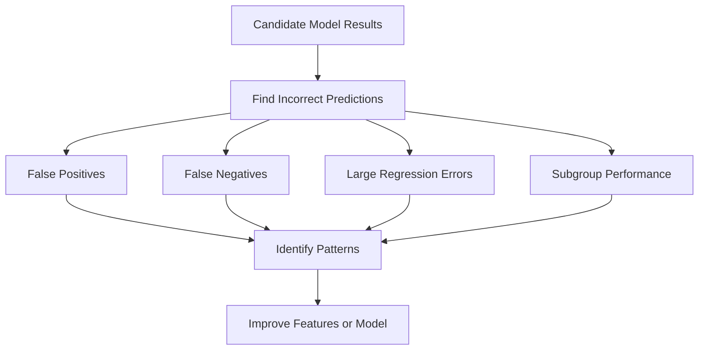

---

### Regression Error Analysis

```python
error_table = X_valid.copy()

error_table["actual"] = y_valid
error_table["prediction"] = predictions
error_table["absolute_error"] = (
    error_table["actual"]
    - error_table["prediction"]
).abs()

largest_errors = error_table.sort_values(
    "absolute_error",
    ascending=False
).head(20)

print(largest_errors)
```

---

### Classification Error Analysis

```python
error_table = X_valid.copy()

error_table["actual"] = y_valid
error_table["prediction"] = predictions
error_table["probability"] = probabilities

false_positives = error_table[
    (error_table["actual"] == 0)
    & (error_table["prediction"] == 1)
]

false_negatives = error_table[
    (error_table["actual"] == 1)
    & (error_table["prediction"] == 0)
]
```

---

## 25. Subgroup Evaluation

A model may perform well overall but poorly for an important group.

Examples of groups include:

* Geographic region
* Product category
* Customer segment
* Device type
* Time period
* Price range
* New versus existing customers

Example:

| Segment       | Samples |    MAE |
| ------------- | ------: | -----: |
| Apartments    |   2,100 | 18,400 |
| Townhouses    |     900 | 24,700 |
| Luxury houses |     300 | 61,900 |

The overall MAE may hide poor performance on luxury properties.

Model selection should consider whether the model is reliable for the groups that matter most.

---

## 26. Statistical and Practical Significance

A small metric difference may not justify selecting a more complex model.

Example:

| Model               | Mean CV F1 | Prediction Latency |
| ------------------- | ---------: | -----------------: |
| Logistic Regression |      0.841 |               3 ms |
| Gradient Boosting   |      0.846 |              48 ms |

The improvement is:

$$
0.846 - 0.841 = 0.005
$$

This may not justify:

* Sixteen times higher latency
* More difficult explanations
* Increased maintenance
* More complex deployment

The final choice should consider whether the improvement is practically meaningful.

---

## 27. Operational Selection Criteria

Predictive performance is only one dimension.

A production model may also be evaluated using:

| Criterion         | Question                                      |
| ----------------- | --------------------------------------------- |
| Inference latency | Can the model respond quickly enough?         |
| Throughput        | How many predictions can it process?          |
| Model size        | Can it fit on the target device?              |
| Training cost     | How expensive is retraining?                  |
| Feature cost      | Are required data sources expensive?          |
| Interpretability  | Can predictions be explained?                 |
| Maintainability   | Can the team support the model?               |
| Stability         | Does performance vary across time or folds?   |
| Fairness          | Does it perform consistently across groups?   |
| Privacy           | Does it require sensitive information?        |
| Robustness        | How does it handle missing or unusual inputs? |

---

## 28. Multi-Criteria Model Selection

A weighted decision score can be used when several criteria matter.

$$
S(M) = w_pP(M) - w_lL(M) - w_cC(M) + w_iI(M) + w_sS_t(M)
$$

where:

* (P(M)): predictive performance
* (L(M)): latency
* (C(M)): cost
* (I(M)): interpretability
* (S_t(M)): stability
* (w): business-defined weights

Example decision table:

| Model               | Accuracy | Latency | Explainability | Cost   | Decision               |
| ------------------- | -------: | ------: | -------------- | ------ | ---------------------- |
| Logistic Regression |     0.88 |     Low | High           | Low    | Strong candidate       |
| Random Forest       |     0.91 |  Medium | Medium         | Medium | Strong candidate       |
| Neural Network      |     0.92 |    High | Low            | High   | Reject for current use |

The highest-scoring model is not always the most appropriate production model.

---

## 29. Data Leakage During Model Selection

Data leakage occurs when information from outside the training process influences model development.

Common sources include:

* Scaling the complete dataset before splitting
* Imputing missing values using the complete dataset
* Selecting features using all labels
* Tuning models on the test set
* Including post-outcome variables
* Mixing the same customer across train and validation
* Randomly splitting time-series data

---

### Incorrect Workflow


This process produces overly optimistic results.

---

### Correct Workflow


---

## 30. Repeated Test-Set Evaluation

Every time the test set influences a model decision, it becomes part of the training process.

Incorrect process:

```text
Evaluate model A on test set
Change features
Evaluate model B on test set
Tune hyperparameters
Evaluate model C on test set
Select the best test result
```

The test result is no longer unbiased.

Correct process:

```text
Use training and validation data for all decisions
Freeze the final pipeline
Evaluate once on the test set
```

---

## 31. Reproducible Experiments

A model-selection experiment should record:

* Dataset version
* Feature version
* Split strategy
* Random seed
* Preprocessing pipeline
* Model type
* Hyperparameters
* Validation metric
* Training time
* Inference latency
* Model artifact version
* Notes and assumptions

Example experiment table:

| Run | Features   | Model             | Parameters | CV MAE | CV Std | Notes       |
| --- | ---------- | ----------------- | ---------- | -----: | -----: | ----------- |
| 001 | Raw        | Linear Regression | Default    | 31,400 |  1,200 | Baseline    |
| 002 | Engineered | Random Forest     | 300 trees  | 22,300 |    950 | Strong      |
| 003 | Selected   | XGBoost           | depth 6    | 21,700 |    910 | Best score  |
| 004 | Selected   | Ridge             | alpha 1.0  | 27,900 |    700 | Most stable |

---

## 32. End-to-End Model-Selection Example

```python
import time
import pandas as pd

from sklearn.model_selection import (
    train_test_split,
    KFold,
    cross_validate
)
from sklearn.pipeline import Pipeline
from sklearn.impute import SimpleImputer
from sklearn.preprocessing import StandardScaler
from sklearn.dummy import DummyRegressor
from sklearn.linear_model import (
    LinearRegression,
    Ridge
)
from sklearn.ensemble import (
    RandomForestRegressor,
    GradientBoostingRegressor
)
from sklearn.metrics import (
    mean_absolute_error,
    mean_squared_error,
    r2_score
)

# Split the dataset before model development
X_train, X_test, y_train, y_test = train_test_split(
    X,
    y,
    test_size=0.20,
    random_state=42
)

models = {
    "median_baseline": DummyRegressor(
        strategy="median"
    ),
    "linear_regression": LinearRegression(),
    "ridge": Ridge(alpha=1.0),
    "random_forest": RandomForestRegressor(
        n_estimators=300,
        random_state=42,
        n_jobs=-1
    ),
    "gradient_boosting": GradientBoostingRegressor(
        random_state=42
    )
}

cv = KFold(
    n_splits=5,
    shuffle=True,
    random_state=42
)

experiment_results = []

for model_name, model in models.items():
    pipeline = Pipeline([
        (
            "imputer",
            SimpleImputer(strategy="median")
        ),
        (
            "scaler",
            StandardScaler()
        ),
        (
            "model",
            model
        )
    ])

    start_time = time.perf_counter()

    scores = cross_validate(
        pipeline,
        X_train,
        y_train,
        cv=cv,
        scoring={
            "mae": "neg_mean_absolute_error",
            "rmse": "neg_root_mean_squared_error",
            "r2": "r2"
        },
        n_jobs=-1,
        return_train_score=True
    )

    elapsed_time = (
        time.perf_counter() - start_time
    )

    experiment_results.append({
        "model": model_name,
        "train_mae": -scores[
            "train_mae"
        ].mean(),
        "validation_mae": -scores[
            "test_mae"
        ].mean(),
        "validation_mae_std": scores[
            "test_mae"
        ].std(),
        "validation_rmse": -scores[
            "test_rmse"
        ].mean(),
        "validation_r2": scores[
            "test_r2"
        ].mean(),
        "cv_time_seconds": elapsed_time
    })

comparison_table = (
    pd.DataFrame(experiment_results)
    .sort_values("validation_mae")
)

print(comparison_table)

# Select the model based on validation results
best_model = Pipeline([
    (
        "imputer",
        SimpleImputer(strategy="median")
    ),
    (
        "scaler",
        StandardScaler()
    ),
    (
        "model",
        GradientBoostingRegressor(
            random_state=42
        )
    )
])

# Retrain the selected pipeline on all training data
best_model.fit(X_train, y_train)

# Final test evaluation
test_predictions = best_model.predict(X_test)

test_mae = mean_absolute_error(
    y_test,
    test_predictions
)

test_rmse = mean_squared_error(
    y_test,
    test_predictions
) ** 0.5

test_r2 = r2_score(
    y_test,
    test_predictions
)

print("Final test MAE:", test_mae)
print("Final test RMSE:", test_rmse)
print("Final test R-squared:", test_r2)
```

---

## 33. Recommended Model-Selection Strategy

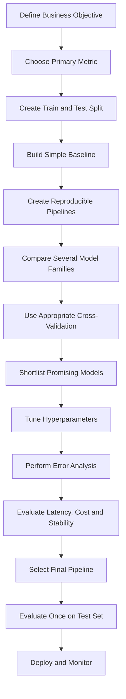

Recommended steps:

1. Define the business decision.
2. Choose one primary evaluation metric.
3. Define secondary metrics and constraints.
4. Reserve a final test set.
5. Build a simple baseline.
6. Create consistent preprocessing pipelines.
7. Compare several reasonable model families.
8. Use an appropriate cross-validation strategy.
9. Tune only promising models.
10. Analyze errors and subgroup performance.
11. Measure latency, size, and cost.
12. Select the complete model pipeline.
13. Evaluate once on the test set.
14. Document the decision and assumptions.
15. Deploy and monitor production performance.

---

## 34. Common Mistakes

### 34.1 Choosing the Model with the Best Training Score

A high training score may indicate overfitting.

Always evaluate on unseen validation data.

---

### 34.2 Using the Wrong Metric

Accuracy may be misleading for imbalanced classification.

(R^2) may not communicate actual prediction error in business units.

Choose metrics based on the decision being supported.

---

### 34.3 Selecting a Complex Model Without a Baseline

A complex model should demonstrate meaningful improvement over a simple baseline.

Complexity alone is not evidence of quality.

---

### 34.4 Tuning on the Test Set

The test set must remain independent of model-development decisions.

---

### 34.5 Applying Preprocessing Before Cross-Validation

This can leak information across folds.

Place preprocessing inside a pipeline.

---

### 34.6 Comparing Models on Different Data Splits

Candidate models should use the same validation folds.

Otherwise, score differences may come from the data split rather than the model.

---

### 34.7 Ignoring Score Variability

Compare both the average score and standard deviation.

```text
Model A: F1 = 0.84 ± 0.01
Model B: F1 = 0.85 ± 0.08
```

Model A may be more reliable despite a slightly lower mean score.

---

### 34.8 Ignoring Inference Requirements

A model that takes five seconds per prediction may be unsuitable for a real-time API.

---

### 34.9 Ignoring Feature Availability

A model cannot use a feature that does not exist at prediction time.

---

### 34.10 Selecting Models Only from One Family

Comparing only several Random Forest configurations is hyperparameter tuning, not broad model-family comparison.

Include models with different assumptions.

---

### 34.11 Tuning Every Candidate Extensively

First perform a coarse comparison.

Tune only the most promising candidates to avoid unnecessary cost.

---

### 34.12 Ignoring Error Analysis

Two models with the same aggregate metric may fail on different samples.

Review whether the errors are acceptable for the business.

---

## 35. Practical Exercise

### Dataset

Use a house-price dataset containing variables such as:

```text
area
bedrooms
bathrooms
floors
location
property_type
building_age
distance_to_city_center
school_score
crime_rate
garage
sale_price
```

---

### Task 1: Define the Objective

Write down:

* The prediction target
* The primary business metric
* The cost of large errors
* The expected inference environment

Example:

```text
Goal:
Predict sale price before a property is listed.

Primary metric:
MAE because it is easy to interpret in currency.

Secondary metric:
RMSE because large errors are especially costly.
```

---

### Task 2: Build a Baseline

Train a `DummyRegressor` using:

* Mean prediction
* Median prediction

Record MAE, RMSE, and (R^2).

---

### Task 3: Compare Candidate Models

Train at least:

* Linear Regression
* Ridge Regression
* Random Forest
* Gradient Boosting or XGBoost

Use the same five-fold cross-validation splits.

---

### Task 4: Tune Promising Models

Tune one linear model and one tree-based model.

Possible hyperparameters:

```text
Ridge:
- alpha

Random Forest:
- n_estimators
- max_depth
- min_samples_leaf

XGBoost:
- learning_rate
- max_depth
- n_estimators
- subsample
```

---

### Task 5: Create an Experiment Table

| Experiment | Model             | Features | CV MAE | CV RMSE | CV (R^2) | Training Time |
| ---------- | ----------------- | -------: | -----: | ------: | -------: | ------------: |
| Baseline   | Median            |        0 |        |         |          |               |
| Model 1    | Linear Regression |          |        |         |          |               |
| Model 2    | Ridge             |          |        |         |          |               |
| Model 3    | Random Forest     |          |        |         |          |               |
| Model 4    | XGBoost           |          |        |         |          |               |

---

### Task 6: Perform Error Analysis

Inspect:

* The ten largest absolute errors
* Errors by property type
* Errors by price range
* Errors by location
* Differences between the two strongest models

---

### Task 7: Select the Final Model

Write a short decision statement:

```text
The selected model is Gradient Boosting because it achieved the
lowest cross-validation MAE, remained stable across folds, and
met the required prediction-latency limit.

Random Forest achieved similar performance but produced a larger
model and slower inference.

Linear Regression remains the interpretability baseline.
```

---

## 36. Mini-Project Integration

## Project: House Price Prediction

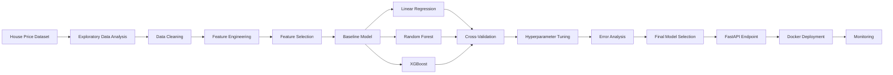

Suggested portfolio artifacts:

* Jupyter Notebook
* Data-quality report
* Feature-engineering documentation
* Cross-validation comparison table
* Hyperparameter-search results
* Error-analysis chart
* Model-selection decision report
* Saved model pipeline
* FastAPI prediction endpoint
* Docker image
* Model card

---

## 37. Model-Selection Decision Template

Use the following template in a notebook or portfolio report:

```text
Business objective:
Primary evaluation metric:
Secondary metrics:
Validation strategy:
Baseline model:
Candidate models:
Selected feature set:
Best cross-validation result:
Cross-validation variability:
Training time:
Prediction latency:
Interpretability requirement:
Known limitations:
Selected model:
Reason for selection:
Final test result:
Next experiment:
```

---

## 38. Completion Checklist

* [ ] I can explain model selection in one or two minutes.
* [ ] I understand the difference between training, tuning, and selection.
* [ ] I can build a simple baseline.
* [ ] I can create train, validation, and test sets correctly.
* [ ] I can use cross-validation for model comparison.
* [ ] I can choose a metric based on the business problem.
* [ ] I can identify underfitting and overfitting.
* [ ] I can compare multiple model families fairly.
* [ ] I can place preprocessing inside a pipeline.
* [ ] I understand why the test set should not guide model development.
* [ ] I can perform basic hyperparameter tuning.
* [ ] I can analyze false positives, false negatives, or large errors.
* [ ] I can evaluate training time and inference latency.
* [ ] I can justify the final model using technical and business criteria.
* [ ] I have created a notebook, chart, model, API, or portfolio note.
* [ ] I have documented at least one caveat or assumption.

---

## 39. Key Takeaways

1. **Model selection chooses the complete machine learning solution, not only an algorithm.**

2. **Always begin with a simple and meaningful baseline.**

3. **Use training data to fit parameters, validation data to make decisions, and the test set for final evaluation.**

4. **Cross-validation provides a more reliable comparison than one validation split.**

5. **The validation strategy must match the data structure.**

6. **Choose metrics according to business costs and objectives.**

7. **A high training score does not guarantee good generalization.**

8. **Compare candidate models using the same data, folds, and preprocessing rules.**

9. **Place preprocessing, feature selection, and modeling inside a pipeline to prevent leakage.**

10. **The model with the highest score is not always the best production model.**

11. **Latency, cost, interpretability, stability, fairness, and maintainability also matter.**

12. **Error analysis is necessary before accepting the final model.**

13. **The test set should be evaluated only after the complete pipeline has been selected.**

---

## 40. Related Outcome

Train, compare, and evaluate supervised and unsupervised machine learning models with thoughtful feature engineering and reliable model-selection practices.

---

## 41. Related Project

**Mini Project:** House Price Prediction with:

* Exploratory Data Analysis
* Data Cleaning
* Feature Engineering
* Feature Selection
* Baseline Modeling
* Linear Regression
* Random Forest
* XGBoost
* Cross-Validation
* Hyperparameter Tuning
* Metric Comparison
* Error Analysis
* Final Model Selection
* API Deployment

---

## 42. Conclusion

**Model Selection** is a critical stage in the AI and Data Scientist workflow.

Its purpose is not merely to find the algorithm with the highest validation score. Its purpose is to select a complete solution that:

* Solves the correct business problem
* Generalizes to unseen data
* Improves meaningfully over a baseline
* Uses appropriate features and metrics
* Avoids data leakage
* Produces acceptable errors
* Meets production constraints
* Can be monitored and maintained

A successful model-selection process should answer:

```text
Which candidate models were compared?
Which validation strategy was used?
Which metric represented the business objective?
How stable were the results?
What kinds of errors did each model make?
Why was the final model selected?
Will it work reliably in production?
```

Turn this lesson into a practical artifact such as a notebook, experiment table, evaluation dashboard, trained pipeline, model card, FastAPI service, Docker deployment, or portfolio case study.
````

### 5. `01 - AI & Dữ liệu/02 - Data Science, Analytics & ML/machine-learning-roadmap/Machine-Learning-Roadmap-Course/00 - Roadmap.sh Machine Learning Official/04 - Evaluation, Workflow and Deep Learning/Module 11 - Model Evaluation/01-WhatIsModel-BiasVarianceTradeoff/002 - Generalization.md`

Nguồn: `01 - AI & Dữ liệu/02 - Data Science, Analytics & ML/machine-learning-roadmap/Machine-Learning-Roadmap-Course/00 - Roadmap.sh Machine Learning Official/04 - Evaluation, Workflow and Deep Learning/Module 11 - Model Evaluation/01-WhatIsModel-BiasVarianceTradeoff/002 - Generalization.md`

````markdown
# 002 - Generalization

**Hoc phan:** 04 - Evaluation, Workflow and Deep Learning
**Module:** Module 11 - Model Evaluation
**Nhom noi dung:** Evaluation Basics
**Nguon roadmap:** Model Evaluation / Evaluation Basics
**Loai bai:** evaluation
**Thu tu trong module:** 002
**Thoi luong goi y:** 30 phut

---

## 1. Tom tat

Bai nay giai thich **Generalization** trong boi canh Machine Learning Engineer Roadmap 2026. Sau bai hoc, ban nen biet topic nay nam o dau trong quy trinh ML, lien quan den data, feature, model, training, evaluation, deployment hoac portfolio nhu the nao.

## 2. Muc tieu hoc tap

- Giai thich duoc Generalization bang ngon ngu cua ban.
- Nhan biet topic nay anh huong den model quality, generalization, interpretability, cost hoac production risk nao.
- Ap dung vao mot artifact nho: notebook, script, metric table, chart, diagram, model report hoac README.

## 3. Khai niem chinh

- Generalization is part of the Evaluation Basics topic in the Machine Learning roadmap.
- Learn it by connecting the definition, the dataset assumption, the model behavior and the evaluation impact.
- An ML Engineer should know where this concept appears in an end-to-end training workflow.

## 4. Thuc hanh

1. Calculate the metric or validation result on a small prediction table.
2. Explain when this metric is helpful and when it is misleading.
3. Connect the result to a decision: keep, tune, reject or investigate the model.

## 5. Bai tap

Calculate the metric or validation method on a model result and explain the decision it supports.

## 6. Checklist hoan thanh

- [ ] Co dinh nghia ngan gon.
- [ ] Co vi du trong bai toan ML.
- [ ] Co artifact nho de dua vao portfolio.
- [ ] Co ghi chu ve leakage, metric, overfitting, interpretability hoac production risk neu lien quan.

## 7. Ghi chu san xuat

Khi dua vao production, hay hoi: du lieu moi co giong train data khong, metric co phu hop business cost khong, model co drift khong, prediction co giai thich duoc khong va pipeline co tai lap duoc tu raw data den model artifact khong.
````
