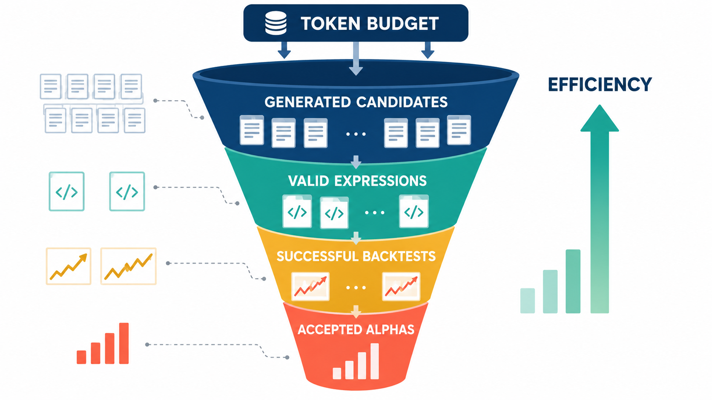
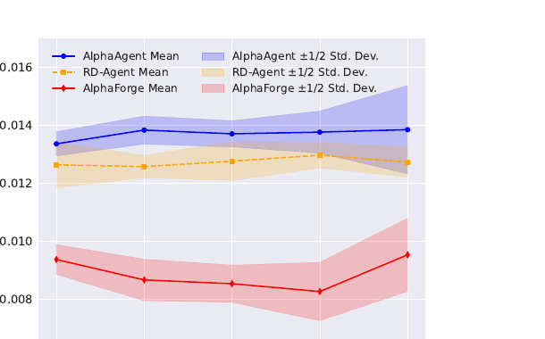
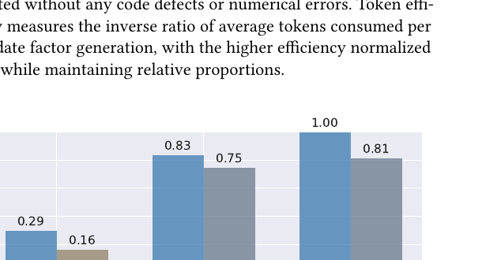
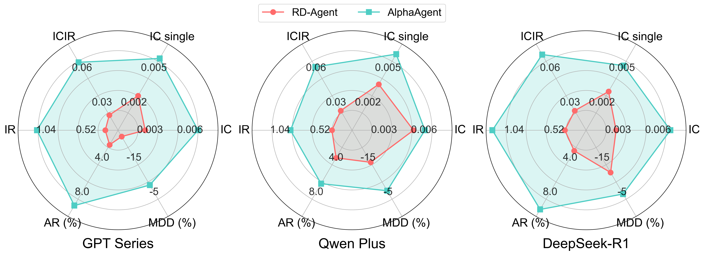
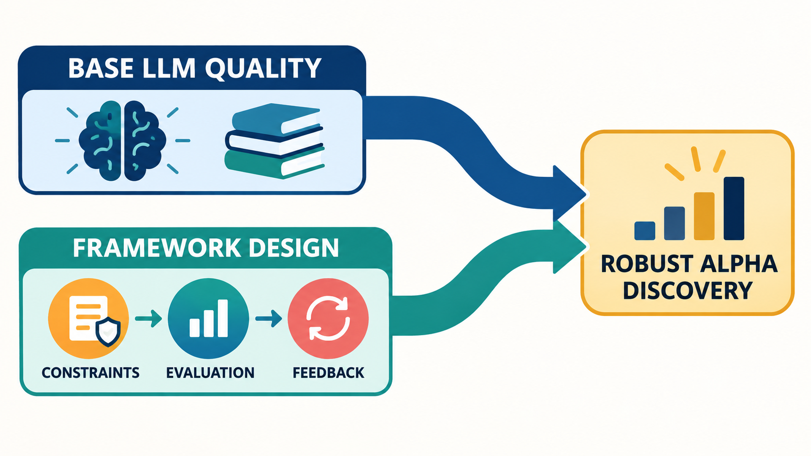
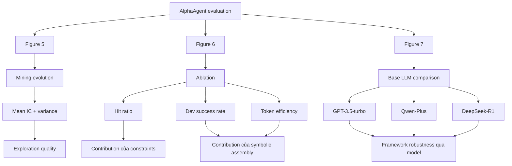

# Bài 08 - Mining Efficiency, Ablation và ảnh hưởng của Base LLM

## 1. Tóm tắt

Một hệ thống alpha mining tốt không chỉ cần tạo ra một vài factor có backtest mạnh. Nó còn phải **tìm được candidate tốt với tần suất đủ cao, tạo expression có thể thực thi ổn định và sử dụng tài nguyên LLM hợp lý**. Vì vậy, sau khi đánh giá predictive performance và alpha decay, cần tiếp tục trả lời ba câu hỏi:

```text
Quá trình mining có thực sự khám phá được candidate tốt?
                    ↓
Các component của framework đóng góp bao nhiêu?
                    ↓
Kết quả đến từ framework hay chỉ vì base LLM mạnh?
```

Ba nhóm thực nghiệm giải quyết ba câu hỏi này:

```text
Figure 5
→ IC evolution qua các vòng mining
→ kiểm tra chất lượng và độ đa dạng của exploration

Figure 6
→ Ablation study
→ tách đóng góp của factor constraints và symbolic assembly

Figure 7
→ Base LLM comparison
→ kiểm tra ảnh hưởng của GPT-3.5-turbo, Qwen-Plus và DeepSeek-R1
```

Trong thí nghiệm ablation, AlphaAgent đạt `hit ratio = 0.29`, so với `0.16` khi bỏ factor modeling constraints; mức chênh lệch này được diễn giải là cải thiện khoảng **81%**. Khi symbolic assembly bị loại bỏ, `dev success rate` giảm từ `0.83` xuống `0.75`, còn `token efficiency` giảm từ `1.00` xuống `0.81`. 

Kết quả so sánh base LLM cho thấy chất lượng model nền vẫn ảnh hưởng tới kết quả cuối. Tuy nhiên, đó là một tầng ảnh hưởng khác với thiết kế framework: regularization, symbolic representation và feedback loop vẫn quyết định cách năng lực của LLM được biến thành một quy trình alpha mining có kiểm soát. 

## 2. Mục tiêu học tập

Sau bài học, người học có thể:

* giải thích được `mining efficiency` trong bối cảnh alpha mining;
* phân biệt được mean IC với variance của tập candidate;
* giải thích được trade-off giữa `exploration` và `exploitation`;
* đọc đúng Figure 5 về IC evolution qua các round;
* giải thích được mục đích của một `ablation study`;
* phân biệt `hit ratio`, `dev success rate` và `token efficiency`;
* tính và diễn giải mức cải thiện tương đối của hit ratio;
* giải thích được symbolic assembly ảnh hưởng đến executability và token efficiency như thế nào;
* phân biệt được tác động của framework với tác động của base LLM;
* đọc đúng kết quả so sánh giữa GPT-3.5-turbo, Qwen-Plus và DeepSeek-R1;
* giải thích được ý nghĩa cơ bản của Student's t-test và `p-value`;
* tránh diễn giải `p < 0.05` thành xác suất một phương pháp “đúng”;
* phân tích kết quả ablation theo đúng phạm vi của protocol thực nghiệm.

## 3. Mining Efficiency là gì?


*Hình minh họa: từ token budget, hệ thống lọc generated candidates thành valid expressions, successful backtests và accepted alphas.*

Trong alpha mining, mục tiêu không phải gọi LLM một lần và hy vọng nhận được factor tốt.

Quá trình thường mang tính lặp:

```text
Hypothesis
    ↓
Sinh candidate
    ↓
Kiểm tra factor
    ↓
Backtest
    ↓
Đánh giá
    ↓
Feedback
    ↓
Hypothesis / factor tiếp theo
```

Mỗi vòng đều tiêu tốn:

* số lần gọi model;
* token;
* thời gian backtest;
* tài nguyên tính toán;
* công sức sửa candidate lỗi.

Do đó, hai hệ thống tạo được cùng 10 factor tốt nhưng một hệ thống cần 100 candidate còn hệ thống kia cần 1.000 candidate không có cùng mining efficiency.

Có thể hình dung hiệu quả khai phá theo nhiều chiều:

| Khía cạnh             | Câu hỏi                                                  |
| --------------------- | -------------------------------------------------------- |
| Candidate quality     | Factor được sinh có predictive signal tốt không?         |
| Hit rate              | Bao nhiêu candidate thực sự đạt tiêu chuẩn mong muốn?    |
| Executability         | Bao nhiêu candidate chạy thành công?                     |
| Diversity             | Candidate có khám phá nhiều vùng của search space không? |
| Token efficiency      | Cần bao nhiêu token để tạo một candidate hữu ích?        |
| Iterative improvement | Các vòng sau có tận dụng feedback tốt hơn không?         |

Một hệ thống alpha mining vì thế có thể thất bại ngay cả khi đôi lúc tạo được một factor rất mạnh. Nếu phần lớn candidate còn lại vô dụng, lỗi hoặc quá tốn tài nguyên, quá trình mining vẫn kém hiệu quả.

## 4. IC Evolution qua các vòng mining



Figure 5 theo dõi sự thay đổi của `IC` trong năm vòng evolution trên CSI 500. Kết quả được dùng để so sánh AlphaAgent với RD-Agent và AlphaForge. 

Ở đây cần phân biệt hai đại lượng:

```text
Mean IC
→ chất lượng trung bình của candidate

Variance của IC
→ candidate phân tán quanh mean nhiều đến đâu
```

Một hệ thống có mean IC cao nhưng variance lớn có thể đang tạo:

```text
một số factor rất tốt
+
một số factor yếu
```

Trong khi hệ thống variance thấp có thể tạo candidate đồng nhất hơn.

Không thể kết luận hệ thống tốt hay xấu chỉ từ variance.

## 5. Mean và Variance

Giả sử một round tạo năm candidate.

Hệ thống A:

```text
IC:
0.019
0.020
0.021
0.020
0.020
```

Các candidate rất gần nhau.

Hệ thống B:

```text
IC:
-0.005
0.010
0.025
0.040
0.055
```

B có dispersion lớn hơn.

Mean được tính:

$$
\bar{x}
=
\frac{1}{n}
\sum_{i=1}^{n}x_i
$$

Variance có thể biểu diễn:

$$
Var(X)
=
\frac{1}{n}
\sum_{i=1}^{n}
(x_i-\bar{x})^2
$$

Variance nhỏ nghĩa candidate tập trung quanh mean.

Variance lớn nghĩa candidate phân tán hơn.

Trong alpha mining, hai tình huống này có thể mang ý nghĩa hoàn toàn khác nhau:

```text
Variance thấp
→ search ổn định
hoặc
→ candidate quá đồng nhất

Variance cao
→ exploration đa dạng
hoặc
→ quá trình sinh không ổn định
```

Do đó, variance chỉ có ý nghĩa khi được đọc cùng `mean IC`, hit ratio, failure rate và xu hướng qua nhiều round. 

## 6. Exploration và Exploitation

Alpha mining là một search problem nên luôn tồn tại trade-off giữa hai hành vi.

**Exploitation** tập trung khai thác những vùng đã biết là có tiềm năng:

```text
Một factor family hoạt động tốt
        ↓
Sinh nhiều biến thể gần nó
        ↓
Candidate khá ổn định
```

Ưu điểm là xác suất sinh candidate hợp lý có thể cao.

Nhưng nếu exploitation quá mạnh:

```text
Candidate ngày càng giống nhau
        ↓
Search space bị thu hẹp
        ↓
Khó tìm market inefficiency mới
        ↓
Nguy cơ homogenization / crowding
```

**Exploration** cố tình mở rộng search space:

```text
Thử cấu trúc mới
        ↓
Candidate đa dạng hơn
        ↓
Khả năng tìm vùng alpha mới tăng
```

Đổi lại, exploration có thể sinh nhiều candidate yếu hơn.

Một hệ thống tốt không tối đa hóa một phía mà phải cân bằng:

$$
Exploration
\longleftrightarrow
Exploitation
$$

## 7. Vì sao variance tăng chưa chắc là điều xấu?

Figure 5 cho thấy RD-Agent có variance nhỏ hơn và candidate đồng nhất hơn, trong khi AlphaAgent có average IC cao hơn trong các round được minh họa; variance của AlphaAgent tăng theo round và được liên hệ với exploration rộng hơn dưới tác động của originality constraint. 

Điều này không nên được đọc thành:

> Variance càng lớn càng tốt.

Cách đọc đúng hơn là:

```text
Variance tăng
      ↓
Có thể candidate đang khác nhau hơn
      ↓
Kiểm tra tiếp:
mean IC có tốt?
hit ratio có tăng?
failure rate có kiểm soát?
```

Nếu cả diversity lẫn candidate quality đều cải thiện, variance cao hơn có thể phản ánh exploration hữu ích.

Nếu variance tăng nhưng:

```text
mean IC ↓
hit ratio ↓
dev success ↓
```

thì đó có thể chỉ là noise.

Do đó:

```text
Diversity
≠
Randomness vô kiểm soát
```

## 8. Originality Regularization và Search Diversity

Originality constraint của AlphaAgent được thiết kế để ngăn candidate mới quá giống các alpha đã tồn tại.

Khi similarity penalty tác động, hệ thống khó tiếp tục sinh những biến thể gần như giống hệt cùng một family:

```text
Candidate hiện tại
        ↓
Similarity với alpha zoo cao
        ↓
Bị penalize
        ↓
Agent phải tìm cấu trúc khác
        ↓
Search space được mở rộng
```

Điều này tạo một liên kết giữa bài học regularization và mining efficiency:

```text
Originality enforcement
        ↓
Candidate ít homogenized hơn
        ↓
Exploration rộng hơn
        ↓
Có cơ hội tìm alpha khác biệt hơn
```

Nhưng originality không tự động bảo đảm predictive quality. Một expression hoàn toàn mới vẫn có thể không có signal. Vì vậy novelty phải luôn được kết hợp với empirical evaluation.

## 9. Ablation Study là gì?

**Ablation study** là một dạng thí nghiệm đối chứng trong đó một component được loại bỏ hoặc thay đổi, trong khi các thành phần khác được cố gắng giữ nhất quán.

Mục tiêu là trả lời:

> Component này có thực sự đóng góp vào kết quả của hệ thống không?

Ví dụ:

```text
AlphaAgent đầy đủ
        ↓
Hit ratio = 0.29
```

so với:

```text
AlphaAgent
- factor modeling constraints
        ↓
Hit ratio = 0.16
```

Nếu hai cấu hình chỉ khác ở nhóm constraint đó, sự suy giảm cung cấp bằng chứng rằng constraint đang đóng góp vào kết quả trong protocol thử nghiệm. 

Ablation vì vậy mạnh hơn việc chỉ nói:

> Component này có vẻ quan trọng.

Nó biến nhận định thành một phép so sánh có thể đo lường.

## 10. Ablation không chứng minh quan hệ nhân quả tuyệt đối

Giả sử:

```text
Full system       = A
System - component = B
```

và:

$$
A>B
$$

Có thể kết luận hợp lý:

> Component bị loại có đóng góp tích cực trong thiết lập thực nghiệm này.

Nhưng không nên kết luận:

> Component đó luôn tạo improvement trong mọi dataset, mọi model và mọi hệ thống.

Kết quả còn phụ thuộc vào:

```text
Dataset
Model
Prompt
Randomness
Evaluation metric
Number of rounds
Implementation
Interaction giữa các component
```

Một ablation tốt vì vậy cần ghi rõ:

* thành phần nào bị bỏ;
* metric nào thay đổi;
* protocol nào được giữ;
* dữ liệu nào được sử dụng;
* số lần chạy hoặc evolution round.

## 11. Thiết kế Ablation của AlphaAgent



Ablation được thực hiện qua **100 vòng evolution**, chia giữa CSI 500 và S&P 500. Ba metric chính được dùng là:

```text
Hit ratio
Dev success rate
Token efficiency
```


Ba metric này đại diện cho ba vấn đề khác nhau:

```text
Hit ratio
→ tìm được factor tốt thường xuyên đến đâu?

Dev success rate
→ candidate có thực sự chạy được không?

Token efficiency
→ chi phí LLM để sinh candidate có hợp lý không?
```

Không nên gộp chúng thành một khái niệm chung như “accuracy”, bởi mỗi metric đo một failure mode khác nhau.

## 12. Hit Ratio

`Hit ratio` là tỷ lệ candidate đạt tiêu chuẩn return đủ cao theo threshold được sử dụng trong thí nghiệm.

Có thể biểu diễn:

$$
HitRatio
=
\frac{N_{\text{successful alpha}}}
{N_{\text{generated candidate}}}
$$

Ví dụ:

```text
100 candidate
29 candidate đạt threshold
```

thì:

$$
HitRatio
=
\frac{29}{100}
=
0.29
$$

Hit ratio không trả lời:

> Candidate tốt nhất có return bao nhiêu?

Nó trả lời:

> Quá trình mining tạo candidate đạt tiêu chuẩn với tần suất bao nhiêu?

Đây là metric phù hợp để đánh giá **search efficiency**.

## 13. Kết quả Hit Ratio

AlphaAgent đầy đủ đạt:

$$
HitRatio_{full}=0.29
$$

Trong khi cấu hình bỏ factor modeling constraints đạt:

$$
HitRatio_{w/o\ constraints}=0.16
$$


Absolute improvement là:

$$
0.29-0.16=0.13
$$

Relative improvement so với baseline `0.16` là:

$$
\frac{0.29-0.16}{0.16}
=
0.8125
$$

hay:

$$
81.25\%
$$

được làm tròn thành khoảng:

$$
81\%
$$

Đây là lý do mức tăng từ `0.16` lên `0.29` được mô tả là **81% improvement**.

Cần phân biệt:

```text
Tăng 0.13 điểm tuyệt đối
```

với:

```text
Tăng khoảng 81% tương đối
```

Hai cách diễn đạt không giống nhau.

## 14. Factor Modeling Constraints đang kiểm tra điều gì?

Khi bỏ factor modeling constraints và hit ratio giảm, ablation này kiểm tra vai trò của các ràng buộc đối với quá trình factor generation.

Những constraint đã được nghiên cứu gồm:

```text
Complexity control
+
Originality
+
Hypothesis alignment
```

Ý nghĩa của kết quả không phải rằng constraint làm mọi candidate mạnh hơn.

Nó cho thấy trong quá trình mining:

```text
Constraint
    ↓
Search được định hướng tốt hơn
    ↓
Ít candidate vô ích hơn
    ↓
Tỷ lệ candidate đạt threshold tăng
```

Regularization vì thế không chỉ là công cụ giảm alpha decay ở đầu ra cuối. Nó còn có thể làm **quá trình tìm alpha hiệu quả hơn**.

## 15. Development Success Rate

Một factor chưa có giá trị sử dụng nếu expression không thể thực thi.

`Dev success rate` đo tỷ lệ candidate chạy thành công mà không gặp lỗi code hoặc numerical. 

Có thể biểu diễn:

$$
DevSuccessRate
=
\frac{N_{\text{executable candidate}}}
{N_{\text{candidate}}}
$$

Các lỗi có thể khiến candidate thất bại bao gồm:

```text
Operator không hợp lệ
Parameter không hợp lệ
Feature không tồn tại
Division numerical error
Expression malformed
Data incompatibility
Execution failure
```

Một factor về mặt ý tưởng rất tốt nhưng không chạy được vẫn không thể được đưa vào backtest chính xác.

## 16. Symbolic Assembly và Executability

AlphaAgent dùng Operator Library và AST thay cho việc phụ thuộc hoàn toàn vào code tự do.

Khi symbolic assembly được sử dụng:

```text
Operator đã chuẩn hóa
        ↓
Expression được lắp theo cấu trúc
        ↓
AST có thể validate
        ↓
Ít lỗi implementation hơn
```

Kết quả ablation cho thấy:

$$
DevSuccessRate_{AlphaAgent}=0.83
$$

so với:

$$
DevSuccessRate_{w/o\ symbolic}=0.75
$$

khi symbolic assembly bị loại bỏ. 

Absolute difference:

$$
0.83-0.75=0.08
$$

tức tăng 8 điểm phần trăm trong protocol này.

Điều này củng cố vai trò của representation có cấu trúc:

```text
LLM không phải tự sinh implementation tùy ý
                    ↓
Output dễ validate hơn
                    ↓
Tỷ lệ candidate thực thi thành công cao hơn
```

## 17. Token Efficiency

LLM-based alpha mining còn có một loại chi phí khác: **token usage**.

Nếu hai framework tạo cùng số candidate có chất lượng tương đương nhưng một framework cần nhiều token hơn đáng kể, quá trình đó kém hiệu quả hơn về mặt tài nguyên.

Token efficiency trong thiết lập này được xây dựng từ nghịch đảo của average token usage trên mỗi candidate và được normalize để giá trị lớn hơn biểu diễn hiệu quả tốt hơn. 

Do đó:

```text
Token efficiency cao
→ trung bình cần ít token hơn theo cách chuẩn hóa được dùng

Token efficiency thấp
→ chi phí token trên candidate cao hơn
```

Không nên diễn giải:

```text
Token efficiency cao
→ model reasoning tốt hơn ở từng token
```

Metric chỉ đo hiệu quả tài nguyên theo định nghĩa thực nghiệm.

## 18. Symbolic Assembly và Token Efficiency

Kết quả:

$$
TokenEfficiency_{AlphaAgent}=1.00
$$

so với:

$$
TokenEfficiency_{w/o\ symbolic}=0.81
$$


Symbolic assembly có thể giúp giảm gánh nặng generation vì LLM không cần mô tả hoặc viết nhiều implementation cấp thấp.

Thay vì:

```text
Hypothesis
    ↓
LLM viết toàn bộ code
    ↓
LLM sửa lỗi
    ↓
LLM viết lại code
```

hệ thống có thể hoạt động theo:

```text
Hypothesis
    ↓
Chọn operator
    ↓
Gán parameter
    ↓
Lắp symbolic expression
    ↓
Validate
```

Representation càng có cấu trúc, số lượng token phải dùng cho những phần boilerplate hoặc debugging có thể giảm.

## 19. Ba metric Ablation phải được đọc cùng nhau

Kết quả chính có thể đặt cạnh nhau:

| Metric           | AlphaAgent đầy đủ |                      Ablation liên quan |
| ---------------- | ----------------: | --------------------------------------: |
| Hit ratio        |              0.29 | 0.16 khi bỏ factor modeling constraints |
| Dev success rate |              0.83 |           0.75 khi bỏ symbolic assembly |
| Token efficiency |              1.00 |           0.81 khi bỏ symbolic assembly |


Mỗi chênh lệch kể một phần câu chuyện:

```text
0.29 vs 0.16
→ constraints hỗ trợ chất lượng mining

0.83 vs 0.75
→ symbolic assembly hỗ trợ executability

1.00 vs 0.81
→ symbolic assembly hỗ trợ resource efficiency
```

Nhờ đó, Figure 6 không chỉ cho biết full system tốt hơn. Nó giúp xác định **component nào đóng góp vào loại hiệu quả nào**.

## 20. Một component có thể cải thiện nhiều metric

Trong một multi-component system, tác động không nhất thiết độc lập hoàn toàn.

Ví dụ symbolic assembly trực tiếp giúp executability, nhưng cũng có thể gián tiếp ảnh hưởng:

```text
Candidate dễ chạy
        ↓
Ít vòng sửa lỗi
        ↓
Token ít hơn
        ↓
Mining nhanh hơn
```

Tương tự, originality constraints có thể:

```text
Tăng diversity
        ↓
Mở rộng exploration
        ↓
Tăng xác suất tìm candidate mới
        ↓
Ảnh hưởng hit ratio
```

Do đó, không nên hiểu ablation như thể mỗi component chỉ được phép tác động đúng một metric.

## 21. Base LLM là một biến thực nghiệm riêng



AlphaAgent được thử với ba base LLM:

* `GPT-3.5-turbo`;
* `Qwen-Plus`;
* `DeepSeek-R1`.


Thay base LLM giúp trả lời câu hỏi:

> Framework có phụ thuộc hoàn toàn vào một model cụ thể hay không?

Đây là câu hỏi khác với ablation.

Ablation:

```text
Giữ model
↓
thay component framework
```

Base-model comparison:

```text
Giữ framework
↓
thay foundational LLM
```

Hai loại experiment kiểm tra hai nguồn variation khác nhau.

## 22. Base LLM ảnh hưởng Alpha Mining như thế nào?

Trong AlphaAgent, LLM tham gia nhiều nhiệm vụ mang tính semantic và reasoning.

Năng lực model có thể ảnh hưởng tới:

```text
Hiểu market hypothesis
        ↓
Chọn operator phù hợp
        ↓
Gán parameter
        ↓
Viết description
        ↓
Giữ semantic alignment
        ↓
Sửa candidate theo feedback
```

Do đó, khi nâng base model, hệ thống có thể tạo factor tốt hơn dù architecture không đổi.

Nhưng điều đó không có nghĩa:

```text
Base LLM mạnh
→ framework không còn cần thiết
```

Một LLM mạnh vẫn có thể:

* lặp lại factor phổ biến;
* sinh expression quá phức tạp;
* sai operator;
* tối ưu quá mức historical metric;
* lệch hypothesis;
* sinh output khó thực thi.

Framework và model giải quyết những lớp vấn đề khác nhau.

## 23. Kết quả với DeepSeek-R1

Trong ba base LLM được thử trên S&P 500, `DeepSeek-R1` đạt kết quả tốt nhất theo radar comparison được trình bày, với:

$$
ICIR=0.0615
$$

$$
AR=9.19\%
$$

$$
MDD=-6.50\%
$$


Ba metric này cần được đọc riêng.

`ICIR = 0.0615` phản ánh mức predictive stability theo định nghĩa ICIR.

`AR = 9.19%` phản ánh annualized performance.

`MDD = -6.50%` phản ánh mức drawdown sâu nhất trong backtest tương ứng.

Việc DeepSeek-R1 mạnh hơn trong các metric được hiển thị cho thấy base LLM vẫn là một yếu tố ảnh hưởng tới chất lượng của framework.

## 24. Hai tầng tác động


*Hình minh họa: chất lượng base LLM và framework design là hai nguồn tác động khác nhau cùng hướng tới robust alpha discovery.*

Kết quả có thể được phân tách thành:

```text
Tầng 1: Framework

Regularization
Symbolic assembly
Feedback loop
Agent workflow
Evaluation
```

và:

```text
Tầng 2: Base LLM

Language understanding
Financial reasoning
Instruction following
Expression construction
Self-correction
```

Một cách biểu diễn khái niệm:

$$
Quality
=
FrameworkEffect
+
ModelEffect
+
Interaction
$$

Đây không phải một decomposition số học được đo trực tiếp trong experiment, mà là cách tư duy để tránh nhầm hai loại ảnh hưởng.

Một framework tốt có thể nâng hiệu quả sử dụng model.

Một model mạnh có thể nâng chất lượng output trong cùng framework.

Hai điều này có thể cùng đúng. 

## 25. Không nên so model và framework bằng một câu hỏi duy nhất

Giả sử:

```text
AlphaAgent + Model A
```

tốt hơn:

```text
RD-Agent + Model B
```

Ta chưa biết improvement đến từ:

```text
Framework?
Model?
Cả hai?
Tương tác giữa chúng?
```

Một experiment tốt cần tạo những comparison có kiểm soát.

Ví dụ:

```text
AlphaAgent + GPT-3.5
vs
RD-Agent + GPT-3.5
```

giúp kiểm tra framework khi model được giữ cố định.

Sau đó:

```text
AlphaAgent + GPT-3.5
AlphaAgent + Qwen-Plus
AlphaAgent + DeepSeek-R1
```

giúp kiểm tra base LLM khi framework giữ nguyên.

Đây là logic quan trọng để đọc Figure 7.

## 26. Student's t-test trong so sánh IC

Để đánh giá liệu chênh lệch IC quan sát được có đủ bằng chứng thống kê hay không, có thể sử dụng **Student's t-test**.

Ở mức trực giác:

$$
t
\approx
\frac{
\text{chênh lệch mean quan sát được}
}{
\text{độ không chắc chắn của chênh lệch}
}
$$

Nếu hai nhóm có mean rất khác nhưng dữ liệu cực kỳ nhiễu, bằng chứng chưa chắc mạnh.

Ngược lại, một chênh lệch nhỏ nhưng rất nhất quán qua nhiều quan sát có thể tạo statistic đáng kể.

Null hypothesis thường được đặt theo hướng:

$$
H_0:
\mu_A-\mu_B=0
$$

tức chưa có bằng chứng về khác biệt mean trong quantity đang xét.

## 27. P-value là gì?

`p-value` trả lời một câu hỏi có điều kiện:

> Nếu null hypothesis đúng, xác suất quan sát một kết quả ít nhất cực đoan như kết quả hiện tại là bao nhiêu?

Nó **không** có nghĩa:

```text
p = 0.03
→ xác suất H0 đúng là 3%
```

và cũng không có nghĩa:

```text
p = 0.03
→ xác suất AlphaAgent đúng là 97%
```

Đó là hai cách diễn giải sai phổ biến.

Nếu dùng threshold:

$$
\alpha=0.05
$$

và:

$$
p<0.05
$$

thì kết quả thường được xem là có đủ bằng chứng để bác bỏ \(H_0\) theo criterion đã đặt.

Nhưng `p-value` không cho biết effect lớn đến đâu và không thay thế việc xem effect size hoặc stability. 

## 28. Kết quả t-test giữa AlphaAgent và RD-Agent

Các `p-value` được ghi nhận khi so sánh IC giữa AlphaAgent và RD-Agent dưới từng base LLM:

| Base LLM      | p-value |
| ------------- | ------: |
| GPT-3.5-turbo |  0.0311 |
| Qwen-Plus     |  0.0109 |
| DeepSeek-R1   |  0.0382 |

Tất cả đều:

$$
p<0.05
$$


Theo ngưỡng `0.05`, các kết quả cung cấp bằng chứng thống kê chống lại giả thuyết không về việc mean IC không khác nhau trong các comparison tương ứng.

Điều quan trọng là kết luận đúng phạm vi:

```text
Kết quả hỗ trợ khác biệt IC
trong experiment được thiết kế
```

không phải:

```text
AlphaAgent chắc chắn tốt hơn
trong mọi dataset và mọi lần chạy
```

## 29. Statistical Significance không đồng nghĩa Practical Significance

Giả sử hai hệ thống có:

```text
Mean IC A = 0.0200
Mean IC B = 0.0201
```

và nhờ sample rất lớn:

```text
p < 0.05
```

Khác biệt vẫn có thể quá nhỏ để mang ý nghĩa thực tế.

Ngược lại, một effect tương đối lớn có thể chưa đạt statistical significance nếu:

* sample quá nhỏ;
* variance quá cao;
* số lần chạy ít.

Do đó cần đọc:

```text
p-value
+
effect size
+
metric value
+
variance
+
sample size
+
economic significance
```

Thay vì dùng duy nhất một ngưỡng `0.05`.

## 30. Phụ thuộc thời gian và giới hạn của t-test

Financial data thường không hoàn toàn độc lập.

Ví dụ:

```text
IC hôm nay
```

có thể có quan hệ với:

```text
IC ngày mai
```

do market regime và factor behavior có persistence.

Nếu một statistical test giả định observations độc lập nhưng dữ liệu thực có autocorrelation, độ không chắc chắn ước lượng được có thể không phản ánh hoàn toàn cấu trúc dữ liệu.

Ngoài ra, khi thử rất nhiều hypothesis hoặc comparison, xác suất xuất hiện một số `p-value` nhỏ do ngẫu nhiên cũng tăng.

Vì vậy, statistical test nên được đọc cùng:

```text
Time-series structure
Number of comparisons
Effect size
Performance persistence
Economic metrics
```

Đây là lý do một `p < 0.05` không thể thay thế toàn bộ empirical evaluation.

## 31. Figure 5, Figure 6 và Figure 7 trả lời ba câu hỏi khác nhau

Ba figure có thể được đặt vào một logic thống nhất:



Figure 5 tập trung vào **quá trình search**.

Figure 6 tập trung vào **đóng góp của component**.

Figure 7 tập trung vào **ảnh hưởng của model nền**.

Ba lớp này bổ sung cho nhau chứ không thay thế nhau.

## 32. Một cách đọc Figure 5

Khi đọc IC evolution, hãy đi theo thứ tự:

```text
Mean IC
   ↓
Candidate trung bình có tốt không?

Variance
   ↓
Candidate có đa dạng không?

Evolution round
   ↓
Các đặc điểm trên thay đổi như thế nào?

Comparison
   ↓
Framework khác hành xử ra sao?
```

Không nên chỉ nhìn:

```text
Variance AlphaAgent lớn hơn
```

rồi kết luận:

```text
AlphaAgent kém ổn định hơn
```

hoặc:

```text
AlphaAgent tốt hơn vì variance lớn
```

Cần đọc đồng thời cả mean và các efficiency metric.

## 33. Một cách đọc Figure 6

Khi đọc ablation:

```text
Component bị bỏ là gì?
        ↓
Metric nào thay đổi?
        ↓
Thay đổi bao nhiêu?
        ↓
Absolute hay relative difference?
        ↓
Component có vai trò gì trong architecture?
```

Ví dụ:

```text
Bỏ factor constraints
        ↓
Hit ratio 0.29 → 0.16
        ↓
Chất lượng search giảm
```

Trong khi:

```text
Bỏ symbolic assembly
        ↓
Dev success 0.83 → 0.75
Token efficiency 1.00 → 0.81
        ↓
Khả năng thực thi và efficiency giảm
```

Đây là cách nối numerical result với architectural function.

## 34. Một cách đọc Figure 7

Khi thay base LLM, cần giữ trong đầu:

```text
Framework giống nhau
Model khác nhau
```

Sau đó hỏi:

```text
Metric nào thay đổi?
Model nào tốt hơn?
Improvement có nhất quán?
Framework có còn tạo advantage qua nhiều model?
```

Nếu AlphaAgent vẫn có lợi thế khi chạy với nhiều base LLM, điều đó hỗ trợ nhận định rằng framework đóng vai trò riêng ngoài năng lực model nền.

Nếu một model mạnh hơn tiếp tục nâng performance, điều đó cho thấy base LLM vẫn là một biến quan trọng.

Hai kết luận không mâu thuẫn.

## 35. Từ Experiment đến thiết kế hệ thống

Các kết quả gợi ra một principle quan trọng khi xây agentic AI system:

```text
Model tốt
≠
System tốt
```

Một model mạnh chỉ là một thành phần.

Chất lượng hệ thống còn phụ thuộc:

```text
Representation
Constraints
Evaluation
Feedback
Search strategy
Error handling
Resource efficiency
```

AlphaAgent minh họa điều này khá rõ:

```text
Base LLM
    ↓
Năng lực reasoning và generation

Framework
    ↓
Định hình cách năng lực đó được sử dụng

Evaluation
    ↓
Loại candidate không đạt

Feedback
    ↓
Hướng dẫn vòng tiếp theo
```

Đây cũng là lý do production AI thường cần evaluation harness thay vì chỉ thay model và quan sát output bằng mắt.

## 36. Những cách diễn giải dễ sai

**Sai lầm 1: Variance cao luôn tốt.**

Không đúng. Variance cao có thể phản ánh diversity hữu ích hoặc instability.

**Sai lầm 2: Variance thấp luôn tốt.**

Không đúng. Candidate quá đồng nhất có thể là dấu hiệu search space bị thu hẹp.

**Sai lầm 3: Hit ratio 0.29 nghĩa average return bằng 29%.**

Không đúng. Đây là tỷ lệ candidate đạt threshold, không phải return.

**Sai lầm 4: Tăng từ 0.16 lên 0.29 là tăng 13%.**

Nếu nói chênh lệch tuyệt đối thì là `0.13`, tức 13 điểm phần trăm. Mức tăng tương đối khoảng `81%`.

**Sai lầm 5: Dev success rate đo predictive quality.**

Không. Nó đo khả năng candidate thực thi thành công.

**Sai lầm 6: Token efficiency cao nghĩa LLM thông minh hơn.**

Không. Metric phản ánh token usage theo cách normalization được sử dụng.

**Sai lầm 7: DeepSeek-R1 tốt nhất nghĩa framework không quan trọng.**

Không. Base LLM và framework là hai biến khác nhau.

**Sai lầm 8: p < 0.05 nghĩa xác suất AlphaAgent tốt hơn là trên 95%.**

Không đúng về mặt diễn giải thống kê.

**Sai lầm 9: Statistical significance đồng nghĩa economic significance.**

Không. Một difference có thể statistically significant nhưng quá nhỏ về mặt practical effect.

**Sai lầm 10: Ablation chứng minh component luôn cần thiết trong mọi hệ thống.**

Không. Nó chỉ cung cấp bằng chứng trong protocol được thử nghiệm.

## 37. Thực hành củng cố

Cho hai phiên bản hệ thống:

| Metric           | Full system | Ablated system |
| ---------------- | ----------: | -------------: |
| Hit ratio        |        0.30 |           0.20 |
| Dev success rate |        0.85 |           0.70 |
| Token efficiency |        1.00 |           0.80 |

Hãy thực hiện các nhiệm vụ sau:

1. Tính absolute improvement của hit ratio.
2. Tính relative improvement của hit ratio.
3. Giải thích vì sao hit ratio không phải average return.
4. Tính absolute improvement của dev success rate.
5. Nếu ablation duy nhất là bỏ symbolic assembly, kết quả nào hỗ trợ trực tiếp nhất vai trò của symbolic representation?
6. Nếu candidate variance tăng nhưng mean IC và hit ratio cùng tăng, vì sao chưa nên xem variance tăng là failure?
7. Nếu variance tăng nhưng dev success rate giảm mạnh, cần thận trọng với diễn giải nào?
8. Nếu thay base LLM nhưng giữ framework cố định, experiment đang kiểm tra biến nào?
9. Nếu `p = 0.03`, hãy giải thích chính xác điều có thể và không thể kết luận.

## 38. Bài tập phân tích một hệ thống Agent

Giả sử một alpha-mining agent có kết quả:

```text
Model A:
Hit ratio = 0.20
Dev success = 0.93
Token efficiency = 0.95

Model B:
Hit ratio = 0.31
Dev success = 0.81
Token efficiency = 0.60
```

Không có một model nào thắng trên mọi chiều.

Hãy phân tích:

1. Model nào tạo candidate đạt threshold thường xuyên hơn?
2. Model nào đáng tin hơn về executability?
3. Model nào tiết kiệm token hơn?
4. Có thể tuyên bố Model B tốt hơn toàn diện không?
5. Nếu chi phí inference là constraint production quan trọng, cần bổ sung metric nào?
6. Nếu mục tiêu nghiên cứu là khám phá candidate hiếm nhưng rất mạnh, cách đánh đổi giữa hai model có thể thay đổi thế nào?

Mục tiêu của bài tập là luyện cách đọc **multi-dimensional evaluation** thay vì rút toàn bộ quality về một con số.

## 39. Câu hỏi tự kiểm tra

1. Mining efficiency khác final portfolio performance ở điểm nào?
2. Mean IC và variance IC trả lời hai câu hỏi khác nhau như thế nào?
3. Vì sao variance thấp có thể là dấu hiệu exploitation quá mạnh?
4. Originality regularization có thể làm exploration thay đổi như thế nào?
5. Ablation study được dùng để trả lời câu hỏi gì?
6. Hit ratio được định nghĩa theo trực giác như thế nào?
7. Vì sao tăng từ `0.16` lên `0.29` được gọi là khoảng `81% improvement`?
8. Dev success rate đo điều gì?
9. Symbolic assembly có thể cải thiện dev success rate bằng cơ chế nào?
10. Token efficiency đo khía cạnh gì của alpha mining?
11. Vì sao token efficiency không phải metric trực tiếp của reasoning quality?
12. Figure 5, Figure 6 và Figure 7 trả lời ba nhóm câu hỏi khác nhau nào?
13. Vì sao cần thay base LLM trong experiment?
14. DeepSeek-R1 đạt những metric nổi bật nào trên S&P 500?
15. Framework strength và base LLM strength khác nhau ở đâu?
16. Student's t-test được dùng để kiểm tra loại khác biệt nào?
17. `p-value < 0.05` nên được diễn giải như thế nào?
18. Vì sao `p-value` không cho biết effect size?
19. Statistical significance và practical significance khác nhau ra sao?
20. Tại sao kết quả ablation luôn phải được gắn với protocol thực nghiệm?

## 40. Tổng kết

Mining efficiency mở rộng cách đánh giá AlphaAgent từ câu hỏi:

```text
Factor cuối cùng có tốt không?
```

sang:

```text
Hệ thống tìm factor tốt
nhanh, ổn định và tiết kiệm
đến mức nào?
```

Figure 5 cho thấy quá trình evolution của candidate trên CSI 500. AlphaAgent có average IC cao hơn RD-Agent và AlphaForge trong các vòng được minh họa, đồng thời variance tăng qua các round; đặc điểm này được diễn giải trong mối liên hệ với exploration rộng hơn chứ không đơn giản là instability. 

Figure 6 sử dụng ablation để tách đóng góp của các component. Với factor modeling constraints:

$$
HitRatio:
0.16
\rightarrow
0.29
$$

tương ứng mức cải thiện tương đối khoảng:

$$
81\%
$$

Khi symbolic assembly được giữ lại:

$$
DevSuccess:
0.75
\rightarrow
0.83
$$

và:

$$
TokenEfficiency:
0.81
\rightarrow
1.00
$$


Figure 7 tiếp tục cho thấy base LLM vẫn ảnh hưởng tới performance. Trong ba model được thử:

```text
GPT-3.5-turbo
Qwen-Plus
DeepSeek-R1
```

DeepSeek-R1 đạt kết quả nổi bật trên S&P 500 với:

$$
ICIR=0.0615
$$

$$
AR=9.19\%
$$

$$
MDD=-6.50\%
$$


Các Student's t-test khi so sánh IC giữa AlphaAgent và RD-Agent cho:

$$
p_{GPT-3.5}=0.0311
$$

$$
p_{Qwen}=0.0109
$$

$$
p_{DeepSeek}=0.0382
$$

đều nhỏ hơn `0.05` trong thiết lập được sử dụng. 

Toàn bộ bài học có thể cô đọng thành hai tầng:

```text
Base LLM
→ quyết định phần năng lực reasoning / generation

Framework
→ quyết định cách năng lực đó được
   ràng buộc, tổ chức, kiểm tra và cải tiến
```

và ba lớp evaluation:

```text
Mining evolution
→ candidate có tốt và đa dạng?

Ablation
→ component nào thực sự đóng góp?

Base LLM comparison
→ kết quả thay đổi thế nào khi model nền thay đổi?
```

Một hệ thống alpha mining mạnh vì vậy không chỉ là một LLM mạnh. Nó là sự kết hợp giữa **model capability**, **search strategy**, **regularization**, **symbolic representation**, **evaluation** và **feedback loop**. Các kết quả Figure 5–7 cung cấp bằng chứng thực nghiệm cho từng lớp trong thiết lập được thử nghiệm, nhưng mọi kết luận vẫn phải được giới hạn trong protocol tương ứng thay vì mở rộng thành bảo đảm cho mọi thị trường hoặc mọi cấu hình.
