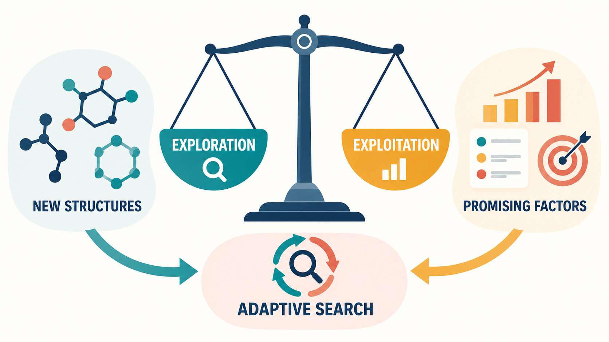
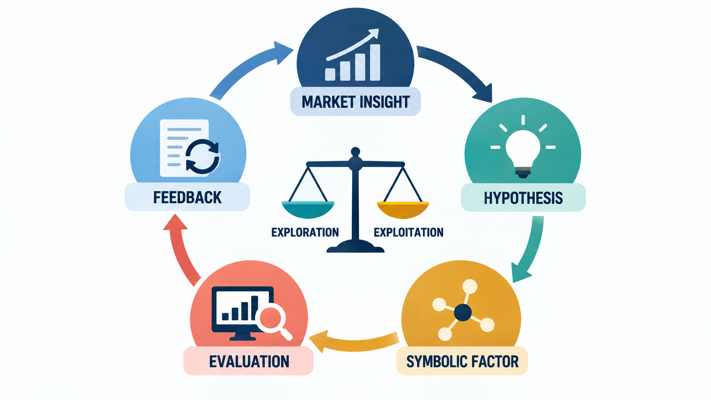
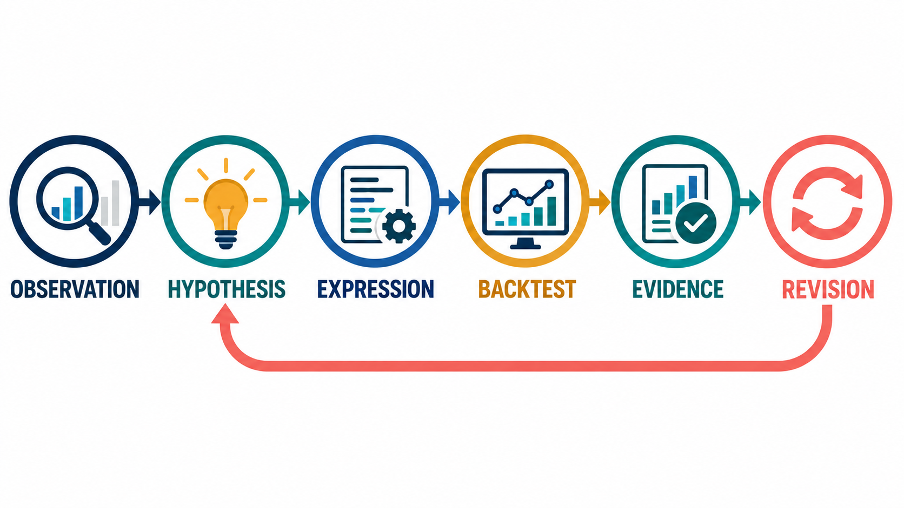
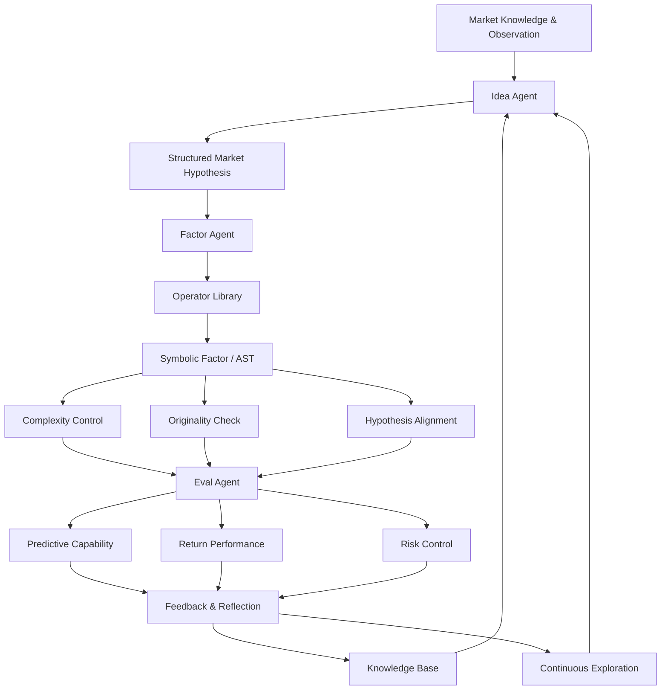

# Bài 09 - Hàm ý, tổng kết và ôn tập

## 1. Tóm tắt

Alpha mining không phải bài toán “tìm một công thức tốt rồi dừng lại”. Thị trường liên tục thay đổi, participant thích nghi với nhau và những statistical pattern được khai thác rộng rãi có thể dần mất lợi thế. Vì vậy, một hệ thống alpha mining bền vững cần hướng tới **continuous exploration**: tiếp tục tìm kiếm, đánh giá và cập nhật các nguồn alpha mới thay vì chỉ khai thác những factor family đã quen thuộc. 

AlphaAgent tổ chức quá trình đó thành một workflow có nhiều lớp:

```text
Market knowledge / observation
            ↓
         Idea Agent
            ↓
     Market hypothesis h
            ↓
        Factor Agent
            ↓
     Candidate factor f
            ↓
┌────────────────────────────┐
│ Regularization             │
│ - Originality              │
│ - Hypothesis alignment     │
│ - Complexity control       │
└────────────────────────────┘
            ↓
         Eval Agent
            ↓
 Predictive / Return / Risk
            ↓
    Feedback + Reflection
            ↓
       Vòng tiếp theo
```

Các thành phần cốt lõi gồm LLM-driven agents, originality enforcement, complexity control, hypothesis alignment, Operator Library, AST, backtest và feedback loop. Mục tiêu không phải sinh thật nhiều formula, mà xây dựng một **constrained discovery process** nhằm giảm nguy cơ overfitting, factor crowding và alpha decay. 

Bài học cuối này kết nối toàn bộ kiến thức thành một bức tranh thống nhất: từ alpha factor, alpha decay, search space, symbolic factor, agent workflow, regularization, backtest, ablation cho tới continuous exploration.

## 2. Mục tiêu học tập

Sau bài học, người học có thể:

* giải thích được alpha factor, alpha mining và alpha decay;
* phân biệt overfitting/p-hacking với factor crowding;
* giải thích vì sao GP, RL và LLM thuần túy đều có những giới hạn khi khai phá alpha;
* mô tả được vai trò của market hypothesis trong factor generation;
* giải thích được Operator Library và AST;
* phân biệt leaf node với internal node;
* mô tả được vai trò của alpha zoo trong originality evaluation;
* giải thích được complexity control, originality enforcement và hypothesis alignment;
* mô tả được vai trò của Idea Agent, Factor Agent và Eval Agent;
* giải thích được feedback loop và việc ghi lại failure mode;
* phân biệt exploration với exploitation;
* giải thích được continuous exploration;
* đọc được ý nghĩa của ablation study và base LLM comparison;
* nhìn AlphaAgent như một scientific workflow thay vì chỉ là một LLM sinh formula;
* tổng hợp toàn bộ quy trình alpha discovery thành một hệ thống hoàn chỉnh.

## 3. Bức tranh tổng thể của bài toán Alpha Mining

Một **alpha factor** là một quantitative feature hoặc expression tạo tín hiệu có khả năng dự báo future return.

Ở mức khái niệm:

$$
f(X_t)\rightarrow r_{t+1}
$$

Trong đó:

* \(X_t\) là dữ liệu có thể quan sát tại thời điểm \(t\);
* \(f\) là factor;
* \(f(X_t)\) là factor score;
* \(r_{t+1}\) là future return cần dự báo.

Alpha mining là quá trình tìm một factor \(f\) hữu ích trong không gian rất lớn các candidate expression.

```text
Raw features
    ↓
Operator + Parameter
    ↓
Candidate expression
    ↓
Factor score
    ↓
Predictive evaluation
    ↓
Portfolio evaluation
```

Vấn đề nằm ở chỗ search space này rất lớn, rời rạc và không thể thử hết trong thời gian hữu hạn. 

Do đó, alpha mining thực chất là một **search problem có constraint**.

## 4. Vì sao Alpha Decay là vấn đề trung tâm?

**Alpha decay** là sự suy giảm predictive power hoặc economic value của alpha theo thời gian.

Hai nguyên nhân quan trọng là:

```text
Overfitting / p-hacking
        +
Factor crowding
```


Overfitting xảy ra khi factor phù hợp quá mức với historical data nhưng không generalize tốt.

Factor crowding xảy ra khi nhiều participant cùng khai thác những signal tương tự, làm inefficiency bị hấp thụ vào giá và giảm cơ hội tạo excess return.

Có thể hình dung:

```text
Factor mới
   ↓
Nhiều người phát hiện
   ↓
Nhiều strategy sử dụng
   ↓
Market phản ứng sớm hơn
   ↓
Signal yếu dần
   ↓
Alpha decay
```

Vì vậy, bài toán không chỉ là:

```text
Factor có backtest tốt không?
```

mà còn là:

```text
Factor có đủ khác biệt?
Factor có rationale?
Factor có quá phức tạp?
Signal có tồn tại ngoài mẫu?
Signal có duy trì theo thời gian?
```

## 5. Alpha Mining là một bài toán Search

Có thể so sánh alpha mining với Genetic Programming.

Trong GP, một candidate có thể là một expression được biểu diễn bằng cây:

```text
        +
       / \
      *   x
     / \
    x   2
```

Quá trình tiến hóa thường gồm:

```text
Khởi tạo
   ↓
Đánh giá fitness
   ↓
Selection
   ↓
Crossover / Mutation
   ↓
Candidate mới
   ↓
Đánh giá lại
```

AlphaAgent không sử dụng chính quy trình GP này làm toàn bộ cơ chế sinh factor, nhưng hai bài toán có điểm chung quan trọng: đều phải tìm một cấu trúc tốt trong một **large structured search space**.

Sự khác biệt đáng chú ý là AlphaAgent đưa thêm market knowledge và hypothesis vào generation thay vì tìm kiếm chỉ dựa trên biến đổi cấu trúc và historical fitness. 

## 6. Exploration và Exploitation


*Hình minh họa: exploration tìm cấu trúc mới, exploitation tận dụng factor triển vọng; adaptive search cần cân bằng cả hai.*

Mọi search process đều phải cân bằng hai xu hướng.

**Exploitation** tận dụng những vùng search space đã biết có hiệu quả:

```text
Factor family tốt
      ↓
Sinh biến thể gần nó
      ↓
Tăng khả năng tìm candidate khá tốt
```

**Exploration** tìm kiếm những vùng mới:

```text
Hypothesis mới
      ↓
Cấu trúc mới
      ↓
Factor mới
      ↓
Khả năng tìm nguồn alpha chưa crowded
```

Trong một thị trường thay đổi:

```text
Exploitation quá mạnh
        ↓
Candidate homogenization
        ↓
Factor similarity tăng
        ↓
Crowding risk tăng
```

Nhưng exploration không kiểm soát cũng nguy hiểm:

```text
Exploration quá tự do
        ↓
Random expression
        ↓
Nhiều candidate vô nghĩa
        ↓
P-hacking / search noise
```

Bởi vậy AlphaAgent cần:

$$
\text{Exploration}
+
\text{Constraints}
+
\text{Evaluation}
$$

thay vì chỉ “tạo càng nhiều factor càng tốt”.

## 7. Tối ưu Alpha là một bài toán đa mục tiêu

Factor quality không thể được thu gọn về một metric duy nhất.

Một candidate có thể:

```text
IC cao
nhưng
complexity rất lớn
```

Candidate khác có thể:

```text
rất original
nhưng
không có predictive evidence
```

Candidate thứ ba:

```text
dễ thực thi
nhưng
không khớp market hypothesis
```

Do đó, việc lựa chọn factor mang tính đa mục tiêu:

```text
                    Predictive effectiveness
                            ↓
Originality → Candidate cân bằng ← Complexity
                            ↑
       Alignment + Stability + Executability
```

Các weight, threshold và filtering rule dùng để cân bằng những mục tiêu này đều là một phần của experimental protocol và cần được kiểm soát nhất quán. 

## 8. Regularized Objective

Một cách biểu diễn tổng quát là:

$$
f^*
=
\arg\max_{f\in\mathcal F}
\left[
\mathcal L(f(X),y)
-
\lambda\mathcal R_g(f,h)
\right]
$$

Trong đó:

* \(\mathcal F\): factor search space;
* \(\mathcal L\): predictive effectiveness;
* \(h\): market hypothesis;
* \(\mathcal R_g\): regularization;
* \(\lambda\): mức đánh đổi giữa predictive performance và regularization.

Regularization giúp thay đổi câu hỏi từ:

```text
Factor nào có historical metric cao nhất?
```

sang:

```text
Factor nào dự báo tốt
+
có rationale
+
đủ original
+
không quá phức tạp
+
có khả năng tồn tại ngoài mẫu?
```

Ba cơ chế regularization cốt lõi là **originality**, **hypothesis alignment** và **complexity control**. 

## 9. Complexity Control

Complexity control hạn chế những candidate có cấu trúc quá phức tạp hoặc quá nhiều free parameter.

Ví dụ:

```text
SMA($close, 20)
```

so với:

```text
RANK(
    TS_MIN(
        SMA(
            DIV(
                $close,
                SMA($volume, 17)
            ),
            23
        ),
        11
    )
)
```

Expression thứ hai có nhiều operator, parameter và dependency hơn.

Complexity quá lớn tạo thêm degrees of freedom:

```text
Nhiều operator
      +
Nhiều parameter
      +
Nhiều raw feature
      ↓
Nhiều cách fit historical noise
      ↓
Overfitting risk tăng
```

Mục tiêu không phải luôn chọn factor ngắn nhất, mà là tránh **unnecessary complexity**.

## 10. Originality Enforcement

LLM có xu hướng sử dụng lại những financial pattern quen thuộc như:

```text
Momentum
Value
Size
RSI
Moving Average
```

Một candidate mới vì thế có thể chỉ là biến thể cú pháp của một factor đã tồn tại.

AlphaAgent sử dụng **alpha zoo** làm tập tham chiếu.

Factor được biểu diễn bằng AST rồi so sánh theo cấu trúc để tìm similarity.

```text
Candidate AST
     ↓
So với alpha zoo
     ↓
Tìm common structure
     ↓
Similarity cao?
     ↓
Originality penalty
```

Alpha zoo vì vậy đóng vai trò là tập factor tham chiếu để đo novelty và similarity. 

## 11. Operator Library và AST

Operator Library chuẩn hóa primitive operation mà factor được phép sử dụng.

Ví dụ:

```text
SMA
TS_MIN
TS_MAX
RANK
ADD
SUB
DIV
```

Thay vì để LLM sinh code tùy ý:

```text
Market hypothesis
      ↓
LLM tự viết implementation
```

hệ thống có thể dùng:

```text
Market hypothesis
      ↓
Chọn operator
      ↓
Gán feature
      ↓
Gán parameter
      ↓
Lắp expression
      ↓
AST
```

Trong AST:

```text
Leaf node
→ raw feature / terminal

Internal node
→ operator
```


Ví dụ:

```text
        DIV
       /   \
     SMA   SMA
    /  \   /  \
volume 5 volume 20
```

Cấu trúc này có thể được dùng cho:

* validation;
* execution;
* complexity measurement;
* structural similarity;
* originality checking.

Operator Library vì thế là cầu nối giữa **natural-language hypothesis** và **executable symbolic factor**. 

## 12. Hypothesis-Factor Alignment

Một factor đáng tin không chỉ cần chạy được.

Nó còn phải thực hiện đúng market idea mà nó tuyên bố đại diện.

AlphaAgent kiểm tra hai cầu nối:

```text
Hypothesis
    ↕
Description
    ↕
Expression
```

Cụ thể:

```text
Hypothesis ↔ Description
Description ↔ Expression
```


Nếu hypothesis nói về liquidity nhưng expression hoàn toàn không triển khai liquidity-related mechanism, factor có semantic mismatch dù backtest có thể tốt.

Do đó:

```text
Executable
≠
Semantically aligned
```

Một factor phải vừa **chạy đúng**, vừa **đo đúng điều nó tuyên bố đo**.

## 13. Idea Agent

Idea Agent biến market knowledge và observation thành market hypothesis có cấu trúc.

Hypothesis sử dụng bốn thành phần:

```text
Observation
Knowledge
Justification
Specification
```


Điểm quan trọng là Idea Agent không chỉ phát ra một câu kiểu:

```text
"Hãy thử momentum."
```

Nó tạo một hypothesis đủ có cấu trúc để Factor Agent có thể tiếp tục operationalize thành symbolic factor.

Chuỗi vai trò là:

```text
Market information
       ↓
Idea Agent
       ↓
Structured hypothesis
       ↓
Factor Agent
```

Idea Agent chịu trách nhiệm ở tầng **ý tưởng và market reasoning**, không phải tầng backtest.

## 14. Factor Agent

Factor Agent nhận hypothesis và biến nó thành candidate factor.

Có thể hình dung:

```text
Hypothesis
    ↓
Concept decomposition
    ↓
Operator selection
    ↓
Feature selection
    ↓
Parameter assignment
    ↓
Symbolic expression
```

Một điểm quan trọng là Factor Agent không chỉ học từ successful candidate.

Khi candidate thất bại, failure mode được ghi lại trong knowledge base để giúp tránh lặp lại cùng lỗi ở những vòng sau. 

Ví dụ:

```text
Candidate
    ↓
Invalid operator
    ↓
Evaluation failure
    ↓
Ghi failure mode
    ↓
Knowledge base
    ↓
Vòng sau tránh lỗi tương tự
```

Feedback như vậy trở thành **actionable memory**, thay vì chỉ là log để lưu trữ.

## 15. Eval Agent

Eval Agent kiểm tra candidate sau khi factor được sinh.

Ba nhóm đánh giá lớn là:

```text
Predictive capability
Return performance
Risk control
```


Có thể đặt chúng vào pipeline:

```text
Candidate factor
      ↓
Predictive capability
      ↓
Có signal không?

Candidate factor
      ↓
Return performance
      ↓
Có economic payoff không?

Candidate factor
      ↓
Risk control
      ↓
Strategy chịu risk thế nào?
```

Điều này ngăn việc đánh giá một factor chỉ bằng một con số đơn lẻ.

## 16. Feedback Loop

AlphaAgent không kết thúc sau một lần evaluation.

Kết quả được đưa ngược về vòng kế tiếp:

```text
Generate
   ↓
Evaluate
   ↓
Success / Failure
   ↓
Feedback
   ↓
Update knowledge
   ↓
Generate next candidate
```

Feedback tốt phải đủ cụ thể để hành động.

Ví dụ:

```text
"Factor không tốt"
```

ít hữu ích hơn:

```text
Expression dùng operator không hợp lệ.
Hypothesis alignment thấp.
AST similarity quá cao với alpha zoo.
```

Feedback có cấu trúc giúp system xác định **phần nào cần thay đổi** ở vòng tiếp theo.

## 17. Continuous Exploration


*Hình minh họa: từ market insight đến hypothesis, symbolic factor, evaluation và feedback trong một vòng khám phá liên tục.*

Thị trường không đứng yên.

Participant quan sát lẫn nhau, competition tăng và những pattern được khai thác rộng có thể mất lợi thế.

Do đó:

```text
Find alpha
   ↓
Deploy
   ↓
Stop forever
```

không phải chiến lược phù hợp với một môi trường adaptive.

Continuous exploration hướng tới:

```text
Theo dõi decay
      ↓
Lưu success + failure
      ↓
Tạo hypothesis mới
      ↓
Sinh factor mới
      ↓
Out-of-sample evaluation
      ↓
Theo dõi stability
      ↓
Lặp lại
```


Continuous exploration là một trong những hàm ý quan trọng nhất của toàn bộ framework.

## 18. Continuous Exploration không đồng nghĩa liên tục khai thác Test Set

Đây là điểm cần đặc biệt chú ý.

Nếu mỗi vòng đều:

```text
Sinh factor
    ↓
Xem test performance
    ↓
Sửa factor
    ↓
Xem lại cùng test
    ↓
Tiếp tục sửa
```

thì test set đã trở thành training signal.

Sau đủ nhiều vòng:

```text
Continuous exploration
        ↓
Continuous test-set exploitation
        ↓
P-hacking
```

Do đó continuous exploration vẫn cần:

* temporal data split;
* data governance;
* protocol logging;
* validation phù hợp;
* out-of-sample evaluation đủ độc lập.

Nếu không, một framework chống p-hacking lại có thể tự biến exploration thành p-hacking lặp lại. 

## 19. AlphaAgent như một Scientific Workflow


*Hình minh họa: observation được chuyển thành hypothesis, expression, backtest và evidence; revision tạo vòng nghiên cứu tiếp theo.*

Có thể diễn giải toàn bộ quá trình như một scientific workflow.

| Thành phần         | Vai trò                                   |
| ------------------ | ----------------------------------------- |
| Market observation | Quan sát hiện tượng                       |
| Market hypothesis  | Đề xuất giải thích hoặc cơ chế            |
| Factor expression  | Operationalize hypothesis                 |
| Backtest           | Đo kết quả thực nghiệm                    |
| Evaluation         | Kiểm tra predictive power, return và risk |
| Feedback           | Sửa hypothesis hoặc implementation        |
| Next round         | Tiếp tục exploration                      |

Một workflow đáng tin cần:

1. nêu rõ observation và economic rationale;
2. xác định expression và constraint;
3. tách train, validation và test theo thời gian;
4. lưu cả negative result và failure mode;
5. so sánh với baseline trong cùng protocol;
6. kiểm tra stability, risk và transaction cost;
7. giới hạn kết luận trong phạm vi dữ liệu đã kiểm tra. 

Tự động hóa scientific discovery không làm mất nhu cầu thiết kế thí nghiệm. Ngược lại, automation càng mạnh thì experimental discipline càng quan trọng.

## 20. AlphaAgent như một Agent có hợp đồng rõ ràng

Có thể nhìn AlphaAgent như một hệ thống trong đó mỗi component có trách nhiệm riêng:

```text
LLM
→ diễn giải và generation

Symbolic layer
→ grammar và representation

Evaluator
→ empirical evidence

Memory / Knowledge base
→ lịch sử success và failure

Orchestrator
→ điều khiển vòng lặp
```

Mỗi thành phần cần có contract rõ về:

```text
Input
Output
Failure
Stop condition
```


Ví dụ, nếu không có stop condition:

```text
Generate
→ fail
→ retry
→ fail
→ retry
→ ...
```

agent có thể lặp vô hạn, làm tăng latency và token cost.

Một workflow có kiểm soát cần biết khi nào phải:

```text
Continue
Retry
Revise
Reject
Stop
```

## 21. Vì sao mỗi lớp đều cần thiết?

Nếu loại từng lớp, những failure mode khác nhau xuất hiện.

```text
LLM không constraint
→ expression dễ lệch hoặc không ổn định

Không có symbolic layer
→ implementation error tăng

Không có originality
→ factor repetition và crowding tăng

Không có temporal evaluation
→ performance dễ bị đánh giá quá lạc quan

Không lưu failure mode
→ agent dễ lặp cùng lỗi

Không có feedback
→ các vòng mining không thực sự học

Không có stop condition
→ workflow có thể loop và lãng phí tài nguyên
```

Sức mạnh của AlphaAgent vì thế nằm ở **sự phối hợp của nhiều lớp**, không phải một trick đơn lẻ.

## 22. Ablation Study giúp kiểm chứng kiến trúc

Ablation study loại một component rồi đo sự thay đổi của hệ thống.

Một kết quả quan trọng là:

$$
HitRatio_{full}=0.29
$$

so với:

$$
HitRatio_{without\ constraints}=0.16
$$


Relative improvement của full system là:

$$
\frac{0.29-0.16}{0.16}
=
0.8125
\approx81\%
$$

Kết quả này hỗ trợ vai trò của factor modeling constraints trong protocol thử nghiệm.

Điểm cần nhớ là:

```text
Ablation result
→ bằng chứng component có đóng góp

không phải

Ablation result
→ component luôn tốt trong mọi hệ thống
```

## 23. Base LLM mạnh hơn có thay thế Framework không?

Không.

Base LLM mạnh hơn có thể cải thiện:

```text
Hypothesis understanding
Financial reasoning
Operator selection
Instruction following
Self-correction
```

Nhưng framework tiếp tục chịu trách nhiệm cho:

```text
Search strategy
Regularization
Symbolic assembly
Evaluation
Feedback
Memory
Stop condition
```

Bởi vậy:

```text
Base LLM capability
        +
Framework design
        ↓
System quality
```

Base LLM và framework không phải hai lựa chọn thay thế nhau.

Trong comparison được tổng hợp, base LLM ảnh hưởng tới chất lượng factor, nhưng AlphaAgent vẫn thể hiện improvement so với RD-Agent trên các model variant được kiểm tra. 

## 24. Luận điểm trung tâm của toàn bộ AlphaAgent

Có thể cô đọng toàn bộ framework thành một chuỗi:



Sơ đồ cho thấy AlphaAgent không phải:

```text
LLM
→ Formula
```

mà là:

```text
Knowledge
→ Hypothesis
→ Symbolic factor
→ Regularization
→ Evaluation
→ Feedback
→ Memory
→ Continuous exploration
```

Đây là cách một raw language model được biến thành một **constrained scientific discovery workflow**. 

## 25. Các khái niệm cần phân biệt

| Khái niệm              | Ý nghĩa chính                                            |
| ---------------------- | -------------------------------------------------------- |
| Alpha factor           | Quantitative signal dùng để dự báo return                |
| Alpha mining           | Quá trình tìm kiếm alpha factor                          |
| Alpha decay            | Predictive power hoặc economic value giảm theo thời gian |
| Overfitting            | Fit historical data quá mức                              |
| P-hacking              | Thử quá nhiều candidate rồi giữ kết quả ngẫu nhiên tốt   |
| Factor crowding        | Nhiều participant cùng dùng signal tương tự              |
| Exploration            | Tìm vùng search space mới                                |
| Exploitation           | Khai thác vùng đã biết có hiệu quả                       |
| Operator Library       | Tập primitive operation chuẩn hóa                        |
| AST                    | Cấu trúc cây của symbolic expression                     |
| Alpha zoo              | Tập factor tham chiếu để đo similarity                   |
| Complexity control     | Hạn chế unnecessary complexity                           |
| Originality            | Khuyến khích factor khác alpha đã tồn tại                |
| Alignment              | Kiểm tra hypothesis, description và expression nhất quán |
| Feedback loop          | Dùng evaluation để cải thiện vòng sau                    |
| Continuous exploration | Tiếp tục tìm alpha mới khi thị trường thay đổi           |
| Ablation               | Loại component để đo đóng góp của nó                     |
| Base LLM               | Model nền cung cấp reasoning và generation               |

## 26. Một ví dụ xuyên suốt toàn bộ Workflow

Giả sử hệ thống quan sát thấy:

```text
Volume giảm dần
+
Intraday price range co hẹp
```

Idea Agent xây một market hypothesis có cấu trúc.

Factor Agent operationalize hypothesis:

```text
Observation
    ↓
Volume contraction
Range contraction
    ↓
Chọn:
$volume
$high
$low
    ↓
Chọn rolling operators
    ↓
Gán window
    ↓
Symbolic expression
```

Candidate được parse thành AST.

Sau đó regularization kiểm tra:

```text
Expression quá dài?
        ↓
Complexity

Quá giống alpha cũ?
        ↓
Originality

Có thực sự đo contraction?
        ↓
Alignment
```

Eval Agent tiếp tục kiểm tra:

```text
IC / RankIC
        ↓
Predictive capability

AR / IR
        ↓
Return performance

MDD
        ↓
Risk control
```

Nếu candidate thất bại:

```text
Failure mode
    ↓
Knowledge base
    ↓
Factor Agent nhận feedback
    ↓
Candidate mới
```

Nếu candidate thành công, kết quả cũng được lưu để định hướng exploration sau này.

Đây là một vòng discovery hoàn chỉnh chứ không phải một lần sinh formula.

## 27. Những cách hiểu dễ sai

**Sai lầm 1: Alpha mining chỉ là tìm formula có IC cao nhất.**

Không đúng. Generalization, originality, complexity, alignment, risk và persistence đều quan trọng.

**Sai lầm 2: LLM có financial knowledge thì không cần constraint.**

Không đúng. LLM vẫn có thể quay lại các factor phổ biến hoặc tạo expression không phù hợp.

**Sai lầm 3: Originality càng cao thì factor càng tốt.**

Không đúng. Một random factor có thể rất original nhưng không có signal.

**Sai lầm 4: Expression chạy được thì hypothesis đúng.**

Không đúng. Executability và semantic alignment là hai tiêu chí khác nhau.

**Sai lầm 5: Continuous exploration nghĩa dùng test set liên tục.**

Không đúng. Điều đó có thể biến thành p-hacking.

**Sai lầm 6: Backtest tốt chứng minh factor không decay.**

Không đủ. Cần xem stability theo thời gian và out-of-sample behavior.

**Sai lầm 7: Base LLM mạnh có thể thay toàn bộ framework.**

Không đúng. Model capability không thay thế search control, regularization, evaluation và feedback.

**Sai lầm 8: Chỉ lưu successful factor là đủ.**

Không đúng. Failure mode cũng là knowledge quan trọng để tránh lặp lỗi.

**Sai lầm 9: Automation loại bỏ nhu cầu scientific methodology.**

Không đúng. Automated discovery vẫn cần experimental discipline.

**Sai lầm 10: AlphaAgent đơn giản là LLM sinh công thức tài chính.**

Không đúng. Nó là một multi-stage discovery workflow với symbolic constraints và empirical feedback.

## 28. Bài tập tổng hợp

Giả sử một candidate factor có đặc điểm:

```text
IC khá cao
AST rất dài
12 free parameters
Similarity cao với một alpha phổ biến
Description nói về liquidity
Expression chỉ dùng close price
Backtest tốt trên validation
Performance giảm nhanh trên test
```

Hãy xác định:

1. Candidate có vấn đề complexity nào?
2. Candidate có vấn đề originality nào?
3. Candidate có vấn đề hypothesis alignment nào?
4. Test performance giảm nhanh gợi ý hiện tượng gì?
5. Vì sao IC validation cao chưa đủ để giữ factor?
6. Feedback nào nên được đưa về Factor Agent?
7. Knowledge base nên lưu failure mode nào?
8. Exploration ở vòng sau nên thay đổi theo hướng nào?
9. Có nên tiếp tục tuning trên cùng test set không? Vì sao?

## 29. Mười lăm câu hỏi ôn tập

1. Alpha factor là gì?
2. Alpha decay là gì?
3. Hai nguyên nhân chính gây alpha decay là gì?
4. Vì sao GP hoặc RL có thể overfit historical performance?
5. Vì sao LLM không có constraint có thể làm factor crowding nghiêm trọng hơn?
6. Ba regularization mechanism của AlphaAgent là gì?
7. Operator Library giải quyết vấn đề gì?
8. Leaf node và internal node trong AST đại diện cho gì?
9. Alpha zoo có vai trò gì?
10. Consistency score kiểm tra hai alignment nào?
11. Market hypothesis của Idea Agent gồm bốn thành phần nào?
12. Factor Agent học từ failed case như thế nào?
13. Eval Agent đánh giá ba nhóm metric lớn nào?
14. Kết quả ablation nào cho thấy factor modeling constraints hữu ích?
15. Base LLM mạnh hơn có làm framework design trở nên không cần thiết không?

## 30. Đáp án ôn tập

1. **Alpha factor** là quantitative feature hoặc expression tạo tín hiệu dự báo future return.

2. **Alpha decay** là sự suy giảm predictive power hoặc economic alpha theo thời gian.

3. Hai nguyên nhân chính là **overfitting/p-hacking** và **factor crowding**.

4. GP hoặc RL có thể tối ưu historical metric rất mạnh nhưng thiếu regularization hoặc economic rationale, từ đó tìm ra những candidate khớp historical noise hơn là signal bền vững.

5. LLM không constraint có thể liên tục quay lại những factor quen thuộc như momentum, value, size hoặc RSI, làm candidate homogenization và crowding tăng.

6. Ba regularization mechanism là **originality enforcement**, **hypothesis alignment** và **complexity control**. 

7. Operator Library chuẩn hóa primitive operation và tạo cầu nối từ hypothesis sang executable symbolic factor.

8. Trong AST, **leaf node** biểu diễn raw feature hoặc terminal; **internal node** biểu diễn operator.

9. Alpha zoo là tập factor tham chiếu dùng để đánh giá novelty hoặc structural similarity của candidate.

10. Consistency kiểm tra hai cầu nối: **hypothesis ↔ description** và **description ↔ expression**.

11. Bốn thành phần là **Observation, Knowledge, Justification, Specification**.

12. Failed case được chuyển thành failure mode và lưu vào knowledge base để Factor Agent tránh lặp lỗi tương tự ở vòng sau.

13. Ba nhóm lớn là **predictive capability, return performance và risk control**.

14. Hit ratio của AlphaAgent đầy đủ là `0.29`, so với `0.16` khi bỏ factor modeling constraints. 

15. **Không.** Base LLM mạnh hơn có thể nâng reasoning và factor quality, nhưng framework vẫn cần để kiểm soát search, regularization, symbolic representation, evaluation và feedback. Các comparison với nhiều base LLM cho thấy hai tầng tác động này có thể đồng thời tồn tại. 

## 31. Sơ đồ ghi nhớ cuối khóa

```text
                         ALPHA MINING
                              │
               ┌──────────────┴──────────────┐
               │                             │
          Search problem                Alpha decay
               │                             │
       Exploration ↔ Exploitation      ┌─────┴─────┐
               │                       │           │
               │                  Overfitting   Crowding
               │
               ▼
          Market knowledge
               │
               ▼
           Idea Agent
               │
               ▼
      Structured hypothesis
               │
               ▼
          Factor Agent
               │
               ▼
      Operator Library + AST
               │
       ┌───────┼──────────┐
       │       │          │
       ▼       ▼          ▼
 Complexity Originality Alignment
       │       │          │
       └───────┼──────────┘
               ▼
           Eval Agent
               │
       ┌───────┼──────────┐
       │       │          │
       ▼       ▼          ▼
 Predictive  Return      Risk
       │       │          │
       └───────┼──────────┘
               ▼
       Feedback / Reflection
               │
               ▼
          Knowledge Base
               │
               ▼
      Continuous Exploration
               │
               └──────────────→ Idea Agent
```

## 32. Tổng kết

Luận điểm quan trọng nhất là alpha discovery phải được xem như một **quá trình thích nghi liên tục**, không phải một bài toán một lần.

Trong thị trường cạnh tranh:

```text
Pattern được phát hiện
        ↓
Pattern được khai thác
        ↓
Participant thích nghi
        ↓
Market efficiency tăng
        ↓
Alpha có thể decay
```

Vì vậy hệ thống cần:

```text
Continuous exploration
        +
Controlled exploitation
        +
Regularization
        +
Out-of-sample evaluation
        +
Feedback
        +
Memory
```

Continuous exploration không có nghĩa liên tục tối ưu trên cùng test set. Mỗi vòng vẫn phải bảo vệ tính độc lập của evaluation để tránh biến quá trình exploration thành p-hacking. 

AlphaAgent tổ chức quá trình discovery thành chuỗi:

```text
Market knowledge
        ↓
Idea Agent
        ↓
Hypothesis
        ↓
Factor Agent
        ↓
Operator Library + AST
        ↓
Regularization
        ↓
Eval Agent
        ↓
Backtest + Stability + Risk
        ↓
Feedback
        ↓
Knowledge Base
        ↓
Continuous Exploration
```

Các constraint về **originality, hypothesis alignment và complexity** giúp kiểm soát loại candidate được tạo ra; symbolic representation giúp factor dễ validation và comparison hơn; evaluator cung cấp empirical evidence; feedback và memory biến failure thành thông tin cho những vòng sau. 

Ở góc nhìn rộng hơn, AlphaAgent có thể được hiểu như một scientific workflow:

```text
Observation
    ↓
Hypothesis
    ↓
Operationalization
    ↓
Experiment
    ↓
Evidence
    ↓
Revision
    ↓
New hypothesis
```

Một workflow đáng tin phải lưu cả success lẫn failure, sử dụng temporal split hợp lý, so sánh với baseline, kiểm tra stability, risk và transaction cost, đồng thời giới hạn kết luận trong phạm vi dữ liệu đã đánh giá. 

Điểm cần ghi nhớ cuối cùng là:

```text
AlphaAgent
≠
LLM sinh thật nhiều formula

AlphaAgent
=
Knowledge-driven search
+
Symbolic factor construction
+
Regularization
+
Empirical evaluation
+
Feedback
+
Continuous exploration
```

Mục tiêu cuối cùng không phải tạo ra candidate có historical metric cao nhất tại một thời điểm, mà xây dựng một quy trình có khả năng **liên tục khám phá những factor có predictive evidence, financial rationale, structural originality và khả năng duy trì giá trị tốt hơn khi thị trường thay đổi**.
