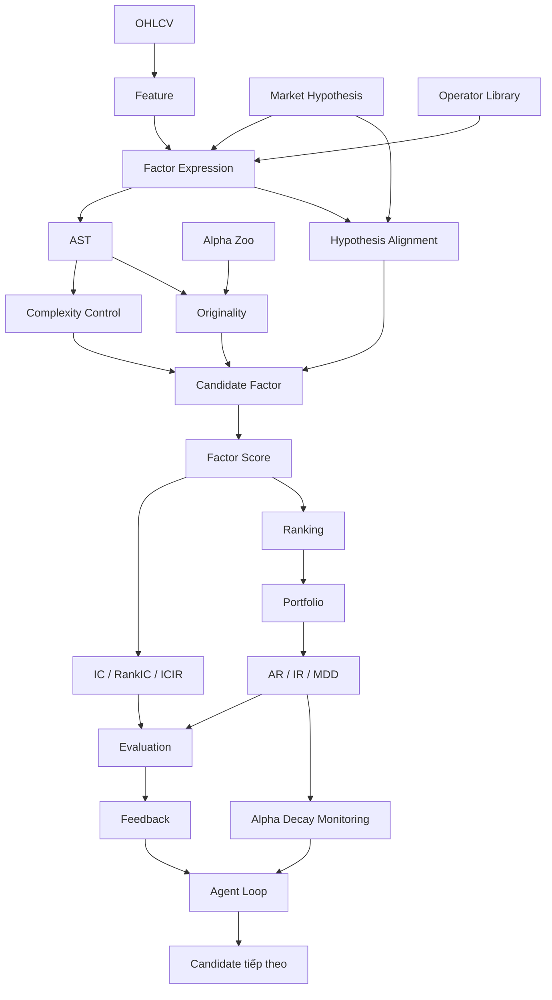

# Glossary - AlphaAgent

## 1. Cách sử dụng Glossary

Glossary này dùng làm **bảng tra cứu nhanh cho toàn bộ khóa AlphaAgent**. Thay vì học từng thuật ngữ như những định nghĩa rời rạc, nên đặt chúng vào pipeline chung:

```text
Dữ liệu OHLCV
    ↓
Return và Feature
    ↓
Factor Expression
    ↓
Score và Ranking
    ↓
Portfolio
    ↓
Predictive / Return / Risk Metrics
    ↓
Alpha Decay
    ↓
Agent Loop và Feedback
```

Các thuật ngữ cốt lõi trải từ alpha factor, alpha decay và market hypothesis đến AST, originality, IC, IR, MDD và các metric mining efficiency. 

Khi gặp một thuật ngữ, nên tự hỏi bốn câu:

1. Nó thuộc dữ liệu, factor representation, evaluation hay agent workflow?
2. Nó đo hoặc kiểm soát điều gì?
3. Nó xuất hiện ở bước nào của pipeline?
4. Nếu giá trị của nó không tốt, hệ thống cần sửa candidate, loại candidate hay chỉ ghi nhận để phân tích?

## 2. Dữ liệu, Return và Prediction

| Thuật ngữ         | Ý nghĩa                                                                                               |
| ----------------- | ----------------------------------------------------------------------------------------------------- |
| **OHLCV**         | Nhóm raw market data gồm `open`, `high`, `low`, `close`, `volume`.                                    |
| **Open**          | Giá mở cửa của một tài sản trong một trading period.                                                  |
| **High**          | Giá cao nhất trong trading period.                                                                    |
| **Low**           | Giá thấp nhất trong trading period.                                                                   |
| **Close**         | Giá đóng cửa của trading period.                                                                      |
| **Volume**        | Khối lượng được giao dịch trong trading period.                                                       |
| **Return**        | Mức thay đổi giá của tài sản giữa hai thời điểm.                                                      |
| **Future return** | Return xảy ra sau thời điểm factor được tính; thường đóng vai trò prediction target.                  |
| **Feature**       | Thông tin đầu vào có sẵn tại thời điểm prediction, có thể là raw data hoặc biến được tạo từ raw data. |
| **Target**        | Giá trị mà model hoặc factor cần dự báo, chẳng hạn next-day return.                                   |
| **Factor score**  | Giá trị mà một alpha factor tạo ra cho một asset tại một thời điểm.                                   |
| **Ranking**       | Sắp xếp các asset dựa trên factor score hoặc predicted return.                                        |
| **Portfolio**     | Tập hợp position được xây dựng từ prediction hoặc ranking để đánh giá economic performance.           |
| **Data leakage**  | Hiện tượng thông tin chưa tồn tại tại prediction time bị đưa vào feature hoặc training process.       |

Feature phải tồn tại tại thời điểm prediction, trong khi target nằm ở tương lai. Nếu future return lọt vào feature, kết quả đánh giá có thể bị leakage. 

## 3. Alpha và Alpha Mining

| Thuật ngữ                | Ý nghĩa                                                                                                            |
| ------------------------ | ------------------------------------------------------------------------------------------------------------------ |
| **Alpha / Alpha factor** | Tín hiệu, feature hoặc biểu thức định lượng được sử dụng để dự báo future return.                                  |
| **Alpha mining**         | Quá trình tìm kiếm và đánh giá các alpha factor trong một search space lớn.                                        |
| **Alpha decay**          | Sự suy giảm predictive power hoặc excess return của alpha theo thời gian.                                          |
| **Market inefficiency**  | Một pattern hoặc cơ chế thị trường tạo cơ hội để thông tin trong dữ liệu có predictive value.                      |
| **Market hypothesis**    | Giả thuyết về một market inefficiency dùng để định hướng quá trình factor generation.                              |
| **Factor crowding**      | Nhiều market participant khai thác tín hiệu tương tự, làm lợi thế của factor suy giảm.                             |
| **P-hacking**            | Thử quá nhiều candidate hoặc cấu hình cho đến khi tìm thấy kết quả trông tốt nhưng có thể chỉ là spurious pattern. |

Có thể ghi nhớ quan hệ:

```text
Market inefficiency
        ↓
Market hypothesis
        ↓
Alpha factor
        ↓
Predictive signal
        ↓
Nhiều participant cùng khai thác
        ↓
Factor crowding
        ↓
Alpha decay
```

Các khái niệm alpha mining, alpha decay, factor crowding và p-hacking tạo thành nhóm thuật ngữ trung tâm để hiểu bài toán mà AlphaAgent hướng tới giải quyết. 

## 4. Search Space

| Thuật ngữ                  | Ý nghĩa                                                                              |
| -------------------------- | ------------------------------------------------------------------------------------ |
| **Search space**           | Tập tất cả factor expression mà quá trình mining có khả năng sinh và đánh giá.       |
| **Candidate factor**       | Một factor đang được đề xuất và chưa nhất thiết được chấp nhận.                      |
| **Exploration**            | Khám phá những vùng mới của search space để tìm factor khác biệt.                    |
| **Exploitation**           | Tiếp tục khai thác những factor family hoặc vùng search đã cho kết quả tốt.          |
| **Continuous exploration** | Tiếp tục tìm và đánh giá nguồn alpha mới khi thị trường và hiệu quả factor thay đổi. |
| **Spurious pattern**       | Pattern có vẻ predictive trên historical data nhưng không phản ánh signal bền vững.  |

Một alpha-mining system phải cân bằng:

$$
Exploration
\longleftrightarrow
Exploitation
$$

Exploration quá ít có thể khiến search tập trung vào những pattern cũ. Exploration không kiểm soát lại có thể làm số lượng spurious candidate tăng.

## 5. Factor Expression và Symbolic Representation

| Thuật ngữ             | Ý nghĩa                                                                                                      |
| --------------------- | ------------------------------------------------------------------------------------------------------------ |
| **Factor expression** | Biểu thức định lượng nhận market features và tạo factor score.                                               |
| **Operator**          | Primitive operation được dùng để xây dựng factor, chẳng hạn moving average hoặc rolling minimum.             |
| **Operator Library**  | Tập các primitive operation được chuẩn hóa để lắp ráp factor.                                                |
| **Parameter**         | Giá trị điều khiển operator, chẳng hạn rolling window `5`, `10`, `20`.                                       |
| **Symbolic factor**   | Factor được biểu diễn bằng các feature, operator và parameter có cấu trúc thay vì implementation code tự do. |
| **AST**               | `Abstract Syntax Tree` — biểu diễn factor expression dưới dạng cây cú pháp.                                  |
| **Leaf node**         | Nút lá trong AST, thường biểu diễn raw feature, constant hoặc terminal.                                      |
| **Internal node**     | Nút bên trong AST, biểu diễn operator hoặc computation.                                                      |
| **Subtree**           | Một nhánh của AST gồm một node cùng toàn bộ descendants của nó.                                              |
| **Symbolic length**   | Đại lượng phản ánh độ dài hoặc độ phức tạp cấu trúc của factor expression.                                   |

Operator Library chuẩn hóa vocabulary dùng để xây factor, còn AST lưu dependency giữa các phép tính. 

Ví dụ:

```text
Expression:
SMA($volume, 5) / SMA($volume, 20)
```

có thể biểu diễn:

```text
          DIV
         /   \
       SMA   SMA
      /  \   /  \
 volume   5 volume 20
```

Trong cây:

```text
Leaf
→ volume, 5, 20

Internal node
→ SMA, DIV
```

## 6. Regularization

| Thuật ngữ                   | Ý nghĩa                                                                                                           |
| --------------------------- | ----------------------------------------------------------------------------------------------------------------- |
| **Regularization**          | Cơ chế đưa thêm constraint hoặc penalty vào quá trình lựa chọn factor để tránh chỉ tối ưu historical performance. |
| **Complexity control**      | Hạn chế candidate có biểu thức hoặc parameter phức tạp quá mức cần thiết.                                         |
| **Originality**             | Mức độ factor mới khác những factor đã tồn tại.                                                                   |
| **Originality enforcement** | Cơ chế khuyến khích candidate không lặp lại cấu trúc alpha cũ.                                                    |
| **Hypothesis alignment**    | Mức độ factor thực sự triển khai đúng market hypothesis.                                                          |
| **Alpha zoo**               | Tập alpha đã tồn tại dùng làm reference khi đánh giá similarity và novelty.                                       |
| **Structural similarity**   | Mức độ giống nhau giữa hai factor xét theo cấu trúc expression hoặc AST.                                          |
| **Common subtree**          | Phần cấu trúc cây xuất hiện chung trong hai factor và có thể được dùng để đánh giá similarity.                    |

Ba hướng regularization chính có thể ghi nhớ:

```text
Complexity
→ Factor có quá phức tạp không?

Originality
→ Factor có đang lặp lại alpha cũ không?

Alignment
→ Factor có thực sự triển khai hypothesis không?
```

`Originality` là thuộc tính của candidate, trong khi `alpha zoo` là tập reference để so sánh candidate với các alpha đã có. 

## 7. Predictive Metrics

| Thuật ngữ                                            | Ý nghĩa                                                                                               |
| ---------------------------------------------------- | ----------------------------------------------------------------------------------------------------- |
| **IC — Information Coefficient**                     | Correlation giữa factor/predicted score và actual future return.                                      |
| **RankIC**                                           | Correlation dựa trên thứ hạng giữa score và future return.                                            |
| **ICIR — Information Coefficient Information Ratio** | Chỉ số phản ánh độ ổn định của IC, thường dựa trên quan hệ giữa mean IC và standard deviation của IC. |
| **Correlation**                                      | Đại lượng mô tả mức độ hai biến thay đổi liên hệ với nhau.                                            |
| **Predictive capability**                            | Khả năng factor chứa tín hiệu hữu ích để dự báo future return.                                        |

IC và RankIC thuộc tầng **predictive evaluation**, không phải trực tiếp là portfolio return.

Có thể nhớ:

```text
Factor score
     ↓
so với
     ↓
Future return
     ↓
IC / RankIC
```

Các metric IC, RankIC và ICIR được dùng để mô tả predictive signal và độ ổn định của nó. 

## 8. Portfolio và Risk Metrics

| Thuật ngữ                  | Ý nghĩa                                                         |
| -------------------------- | --------------------------------------------------------------- |
| **AR — Annualized Return** | Annualized excess return của strategy trong thiết lập đánh giá. |
| **IR — Information Ratio** | Risk-adjusted excess return ratio.                              |
| **MDD — Maximum Drawdown** | Mức suy giảm lớn nhất của portfolio từ peak xuống trough.       |
| **Excess return**          | Phần return của strategy vượt benchmark.                        |
| **Transaction cost**       | Chi phí phát sinh khi thực hiện giao dịch.                      |
| **Turnover**               | Mức độ thay đổi position của portfolio qua thời gian.           |
| **Risk control**           | Nhóm đánh giá và cơ chế kiểm soát rủi ro của strategy.          |

AR, IR và MDD thuộc tầng **portfolio evaluation**, trong khi IC và RankIC thuộc tầng predictive evaluation. 

Sự khác biệt quan trọng:

```text
IC
→ score có dự báo future return không?

AR
→ portfolio tạo annualized excess return bao nhiêu?

IR
→ excess return tốt thế nào so với risk?

MDD
→ portfolio từng giảm sâu nhất bao nhiêu?
```

## 9. IC và Return

`IC` và `return` rất dễ bị đánh đồng nhưng chúng nằm ở hai bước khác nhau.

```text
Factor
  ↓
Score
  ↓
IC với future return
  ↓
Prediction / Ranking
  ↓
Portfolio rule
  ↓
Trading
  ↓
Return
```

IC cao không đảm bảo AR cao.

Một factor có predictive relationship tốt vẫn có thể tạo portfolio performance kém nếu:

```text
Turnover cao
+
Transaction cost lớn
+
Portfolio rule không phù hợp
+
Execution kém
```

Sự phân biệt giữa IC và return là một trong những điểm quan trọng khi đọc kết quả AlphaAgent. 

## 10. Mining Efficiency Metrics

| Thuật ngữ             | Ý nghĩa                                                                                                |
| --------------------- | ------------------------------------------------------------------------------------------------------ |
| **Mining efficiency** | Mức hiệu quả của quá trình tìm candidate xét theo chất lượng, khả năng thực thi và tài nguyên sử dụng. |
| **Hit ratio**         | Tỷ lệ candidate đạt ngưỡng return được định nghĩa trong ablation experiment.                           |
| **Dev success rate**  | Tỷ lệ factor thực thi thành công mà không gặp code hoặc numerical failure.                             |
| **Token efficiency**  | Hiệu quả sinh candidate xét theo lượng token được sử dụng.                                             |
| **Candidate quality** | Mức chất lượng của candidate theo criteria đánh giá của pipeline.                                      |
| **Executability**     | Khả năng expression được parse và thực thi thành công.                                                 |

Ba metric efficiency không đo cùng một thứ:

```text
Hit ratio
→ Search có tìm candidate đạt yêu cầu thường xuyên không?

Dev success rate
→ Candidate có chạy được không?

Token efficiency
→ Quá trình sinh candidate tốn token tới mức nào?
```

Các định nghĩa cốt lõi của ba metric này được dùng để tách search quality, executability và resource efficiency. 

## 11. Agent và Feedback

| Thuật ngữ         | Ý nghĩa                                                                                              |
| ----------------- | ---------------------------------------------------------------------------------------------------- |
| **Agent loop**    | Chu trình trong đó agent nhận context, tạo action/candidate, quan sát kết quả và tiếp tục hoặc dừng. |
| **Feedback**      | Thông tin đánh giá được đưa trở lại quá trình generation để sửa hoặc định hướng vòng tiếp theo.      |
| **Reward**        | Tín hiệu số thường dùng trong Reinforcement Learning để đánh giá action hoặc state transition.       |
| **Failure mode**  | Loại lỗi hoặc kiểu thất bại được xác định để hệ thống có thể tránh lặp lại.                          |
| **Feedback loop** | Quá trình evaluation → feedback → revision → generation lặp lại qua nhiều vòng.                      |

Cần đặc biệt phân biệt `feedback` với `reward`.

```text
Feedback
→ thông tin dùng để sửa quá trình search

Reward
→ tín hiệu số trong RL
```

Một agent có thể sử dụng feedback mà không đồng nghĩa với việc policy đang được huấn luyện bằng Reinforcement Learning. 

## 12. Ba cặp thuật ngữ dễ nhầm

### 12.1. Feature và Target

**Feature** là thông tin được phép sử dụng tại prediction time.

**Target** là kết quả mà hệ thống cần dự báo.

```text
Feature tại t
      ↓
Prediction
      ↓
Target tại t + 1
```

Nếu target tương lai đi ngược vào feature:

```text
Future information
      ↓
Feature
      ↓
Data leakage
```

### 12.2. IC và Return

**IC** đo predictive relationship.

**Return** đo economic outcome.

```text
IC cao
≠
AR chắc chắn cao
```

### 12.3. Feedback và Reward

**Feedback** có thể là qualitative hoặc structured evaluation:

```text
AST quá phức tạp
Similarity quá cao
Expression không đúng hypothesis
```

**Reward** thường là một scalar:

```text
reward = 0.73
```

Hai khái niệm có thể cùng xuất hiện trong agentic systems nhưng không nên coi là đồng nghĩa. 

## 13. Bản đồ thuật ngữ AlphaAgent



Sơ đồ có thể đọc từ trái sang phải theo logic:

```text
Data
→ Factor
→ Representation
→ Regularization
→ Score
→ Evaluation
→ Portfolio
→ Feedback
```

## 14. Bảng tra cứu nhanh

| Thuật ngữ              | Nhóm              | Ghi nhớ nhanh                          |
| ---------------------- | ----------------- | -------------------------------------- |
| `Alpha factor`         | Alpha mining      | Signal định lượng dự báo future return |
| `Alpha mining`         | Search            | Tìm kiếm alpha factor                  |
| `Alpha decay`          | Stability         | Alpha suy yếu theo thời gian           |
| `Factor crowding`      | Market            | Nhiều người dùng cùng signal           |
| `P-hacking`            | Evaluation risk   | Search quá mức tạo spurious result     |
| `Market hypothesis`    | Reasoning         | Giả thuyết định hướng factor           |
| `Operator Library`     | Representation    | Vocabulary chuẩn hóa của factor        |
| `AST`                  | Representation    | Cây cấu trúc của expression            |
| `Alpha zoo`            | Originality       | Reference set của alpha cũ             |
| `Originality`          | Regularization    | Candidate khác alpha cũ tới đâu        |
| `Hypothesis alignment` | Regularization    | Factor có đúng hypothesis không        |
| `Symbolic length`      | Complexity        | Độ dài cấu trúc expression             |
| `IC`                   | Prediction        | Correlation score–future return        |
| `RankIC`               | Prediction        | Correlation dựa trên ranking           |
| `ICIR`                 | Stability         | Độ ổn định của IC                      |
| `AR`                   | Portfolio         | Annualized excess return               |
| `IR`                   | Portfolio         | Risk-adjusted excess return            |
| `MDD`                  | Risk              | Maximum drawdown                       |
| `Hit ratio`            | Mining efficiency | Tỷ lệ candidate đạt threshold          |
| `Dev success rate`     | Mining efficiency | Tỷ lệ candidate chạy thành công        |
| `Token efficiency`     | Resource          | Hiệu quả sử dụng token                 |
| `Feature`              | Data              | Input có sẵn khi prediction            |
| `Target`               | Prediction        | Kết quả tương lai cần dự báo           |
| `Feedback`             | Agent             | Thông tin sửa vòng tiếp theo           |
| `Reward`               | RL                | Tín hiệu số đánh giá                   |
| `Data leakage`         | Evaluation risk   | Future information lọt vào predictor   |

## 15. Chuỗi ghi nhớ toàn khóa

Có thể ghi nhớ toàn bộ hệ thống bằng một chuỗi duy nhất:

```text
OHLCV
  ↓
Feature
  ↓
Market Hypothesis
  ↓
Operator Library
  ↓
Factor Expression
  ↓
AST
  ↓
Complexity + Originality + Alignment
  ↓
Candidate Factor
  ↓
Factor Score
  ↓
IC / RankIC / ICIR
  ↓
Ranking
  ↓
Portfolio
  ↓
AR / IR / MDD
  ↓
Alpha Decay Monitoring
  ↓
Feedback
  ↓
Agent Loop
  ↓
Candidate tiếp theo
```

Glossary vì vậy không nên được học như một danh sách từ riêng biệt. Mỗi thuật ngữ đại diện cho **một vị trí hoặc một chức năng trong pipeline AlphaAgent**: dữ liệu tạo feature, factor tạo score, evaluator đo predictive và portfolio outcome, còn feedback đưa kết quả trở lại vòng khai phá tiếp theo. 
