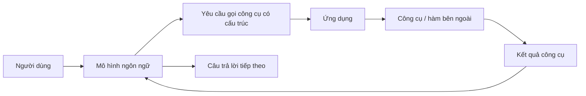

# 001 - Giới thiệu về Function Calling

## 1. Tóm tắt

`Function Calling`, còn được gọi là `Tool Calling`, là cơ chế cho phép mô hình ngôn ngữ tạo ra một yêu cầu gọi công cụ theo cấu trúc thay vì chỉ sinh văn bản tự do.

Trong các agent dựa trên kiểu nhắc `ReAct`, mô hình thường phải tự tạo ra các đoạn văn bản biểu diễn hành động và tham số. Ứng dụng sau đó phải phân tích phần văn bản này để xác định công cụ cần gọi. Cách làm đó có thể hoạt động, nhưng dễ bị lỗi nếu mô hình thay đổi định dạng hoặc tạo ra nội dung không đúng mẫu mong đợi.

Function Calling giải quyết vấn đề này bằng cách đưa quyết định gọi công cụ vào một phần có cấu trúc của phản hồi mô hình. Thông tin thường bao gồm tên công cụ và các đối số cần truyền vào công cụ, nhờ đó ứng dụng có thể xử lý kết quả ổn định hơn.

## 2. Mục tiêu học tập

Sau bài này, người học có thể:

- Giải thích được lý do Function Calling phù hợp hơn việc phân tích hành động từ văn bản tự do trong các agent.
- Mô tả được vai trò của JSON hoặc dữ liệu có cấu trúc trong quá trình gọi công cụ.
- Phân biệt được nhiệm vụ của mô hình với nhiệm vụ của ứng dụng khi thực thi công cụ.
- Mô tả được luồng cơ bản từ yêu cầu người dùng đến việc gọi công cụ và tiếp tục xử lý kết quả.

## 3. Vấn đề của cách gọi công cụ bằng văn bản tự do

Một agent có thể được xây dựng bằng cách yêu cầu mô hình tạo ra chuỗi văn bản theo một quy ước nhất định, chẳng hạn:

```text
Action: get_weather
Action Input: Paris
```

Ứng dụng sau đó tìm các trường như `Action` và `Action Input`, phân tích chúng rồi thực thi công cụ tương ứng.

Vấn đề là đầu ra của mô hình vẫn là văn bản tự do. Chỉ một thay đổi nhỏ về cách định dạng cũng có thể làm bộ phân tích thất bại. Ví dụ:

```text
Use tool get_weather for Paris.
```

Con người vẫn hiểu ý nghĩa, nhưng chương trình đang chờ đúng cấu trúc `Action:` có thể không còn đọc được kết quả.

Nếu hệ thống dựa vào biểu thức chính quy hoặc các quy tắc phân tích chuỗi, độ ổn định của toàn bộ agent phụ thuộc mạnh vào việc mô hình có tuân thủ chính xác định dạng văn bản hay không.

## 4. Function Calling thay đổi điều gì?

Với Function Calling, ứng dụng không yêu cầu mô hình tự mô phỏng một giao thức gọi công cụ bằng văn bản. Thay vào đó, ứng dụng cung cấp cho mô hình mô tả có cấu trúc về các công cụ mà nó có thể sử dụng.

Một định nghĩa công cụ thường cần mô tả ít nhất:

- tên công cụ;
- mục đích của công cụ;
- các tham số cần truyền vào;
- kiểu hoặc cấu trúc của từng tham số.

Khi nhận thấy cần dùng công cụ, mô hình có thể trả về một yêu cầu gọi công cụ dưới dạng dữ liệu có cấu trúc, ví dụ về mặt khái niệm:

```json
{
  "name": "get_current_weather",
  "arguments": {
    "location": "Paris",
    "unit": "celsius"
  }
}
```

Điểm quan trọng không phải là hình thức JSON cụ thể của từng nhà cung cấp, mà là việc tên công cụ và đối số được đặt trong một cấu trúc có thể đọc bằng máy.

Ứng dụng có thể lấy các trường này trực tiếp thay vì cố đoán ý định từ một đoạn văn bản.

## 5. Luồng thực thi cơ bản



Mô hình không tự thực thi hàm chỉ vì nó tạo ra một Function Call. Mô hình tạo ra **yêu cầu gọi công cụ**. Ứng dụng mới là thành phần đọc yêu cầu đó, xác định hàm tương ứng và thực thi nó.

Sau khi công cụ trả về kết quả, ứng dụng có thể gửi kết quả trở lại mô hình để mô hình tiếp tục tạo câu trả lời hoặc quyết định bước tiếp theo.

## 6. Vì sao cách tiếp cận này đáng tin cậy hơn?

Function Calling tách rõ hai loại thông tin:

- nội dung hội thoại dành cho con người;
- dữ liệu điều khiển dành cho chương trình.

Nhờ đó, hệ thống không còn phải phụ thuộc quá nhiều vào một mẫu văn bản tự do rồi phân tích bằng biểu thức chính quy.

So sánh đơn giản:

| Cách tiếp cận | Đầu ra chính | Cách ứng dụng đọc hành động | Rủi ro |
| --- | --- | --- | --- |
| Prompt kiểu `ReAct` | Văn bản | Parse chuỗi hoặc regex | Dễ lỗi khi định dạng thay đổi |
| Function Calling | Dữ liệu có cấu trúc | Đọc trường tên công cụ và đối số | Ổn định hơn cho tích hợp chương trình |

Điều này đặc biệt quan trọng khi xây dựng agent có nhiều công cụ hoặc cần vận hành ổn định trong ứng dụng thực tế.

## 7. Vai trò của nhà cung cấp mô hình

Khả năng Function Calling được hỗ trợ ở cấp mô hình và giao diện của nhà cung cấp. Các nhà cung cấp lớn có thể biểu diễn tool call theo cách khác nhau, nhưng tư tưởng chung vẫn giống nhau:

1. Ứng dụng khai báo các công cụ có thể dùng.
2. Mô hình nhận yêu cầu của người dùng.
3. Mô hình quyết định có cần gọi công cụ hay không.
4. Nếu cần, mô hình trả về tên công cụ và đối số theo cấu trúc.
5. Ứng dụng thực thi công cụ.
6. Kết quả được đưa trở lại quy trình xử lý.

Vì vậy, khi sử dụng framework như LangChain hoặc LangGraph, developer thường làm việc với một lớp trừu tượng chung, nhưng vẫn cần nhớ rằng định dạng và khả năng cụ thể phụ thuộc vào nhà cung cấp mô hình phía dưới.

## 8. Điểm cần ghi nhớ

`Function Calling` và `Tool Calling` thường được dùng để chỉ cùng một nhóm cơ chế: cho phép mô hình lựa chọn và yêu cầu sử dụng công cụ bên ngoài.

Ba điểm cốt lõi của bài này là:

1. Không nên phụ thuộc vào văn bản tự do nếu chương trình cần đọc chính xác tên hành động và tham số.
2. Function Calling đưa quyết định gọi công cụ về dạng dữ liệu có cấu trúc, dễ phân tích hơn.
3. Mô hình tạo yêu cầu gọi công cụ; ứng dụng mới là thành phần thực sự thực thi công cụ.

## 9. Tổng kết

Function Calling là bước chuyển từ việc điều khiển agent bằng các quy ước văn bản sang một giao diện có cấu trúc giữa mô hình và ứng dụng.

Thay vì yêu cầu mô hình luôn tạo đúng một mẫu `ReAct` rồi phân tích mẫu đó bằng regex, ứng dụng có thể nhận trực tiếp tên công cụ và đối số trong phần dữ liệu dành riêng cho tool call.

Cơ chế này tạo nền tảng ổn định hơn để xây dựng các agent có khả năng sử dụng công cụ, gọi API và tiếp tục xử lý kết quả qua nhiều bước.
