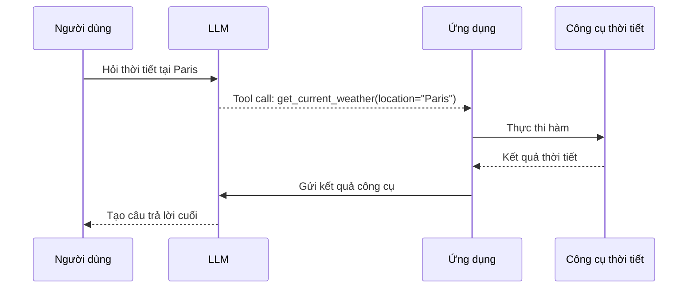
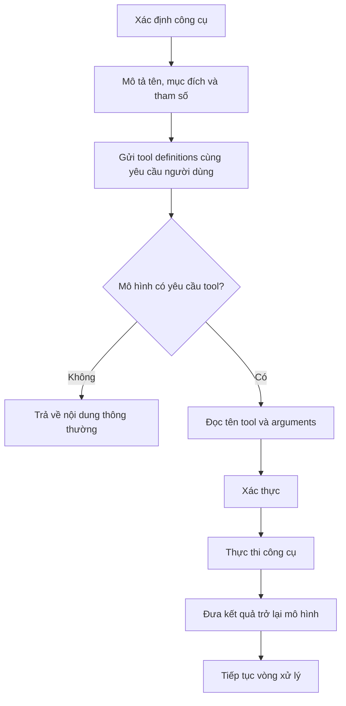

# 002 - Hiểu Function Calling dành cho LLM

## 1. Tóm tắt

Function Calling là khả năng cho phép mô hình ngôn ngữ tạo ra một yêu cầu gọi hàm hoặc công cụ theo cấu trúc. Thay vì chỉ trả về văn bản, mô hình có thể chỉ định công cụ cần sử dụng cùng các đối số tương ứng.

Cơ chế này phục vụ hai mục đích quan trọng:

- kết nối LLM với công cụ hoặc hệ thống bên ngoài;
- nhận đầu ra có cấu trúc để ứng dụng có thể xử lý trực tiếp.

Function Calling không đồng nghĩa với việc mô hình tự thực thi hàm. Mô hình lựa chọn công cụ và tạo dữ liệu gọi hàm; phần thực thi vẫn do ứng dụng đảm nhiệm.

## 2. Mục tiêu học tập

Sau bài này, người học có thể:

- Giải thích được Function Calling là gì và cách nó khác với sinh văn bản thông thường.
- Mô tả được một Function Calling specification gồm tên, mô tả và tham số.
- Phân tích được toàn bộ vòng đời của một tool call từ yêu cầu người dùng đến khi có câu trả lời cuối.
- Giải thích được hai nhóm ứng dụng chính của Function Calling.
- So sánh được Function Calling với prompt kiểu `ReAct` về khả năng phân tích đầu ra.
- Nhận diện được lợi ích và giới hạn của Function Calling trong quá trình xây dựng agent.

## 3. Function Calling là gì?

Trong chế độ sinh văn bản thông thường, LLM nhận đầu vào và trả về một chuỗi nội dung dành cho người dùng.

Ví dụ:

```text
Thời tiết tại Paris hiện đang...
```

Khi ứng dụng cần mô hình điều khiển một công cụ, văn bản tự do không phải lúc nào cũng là giao diện phù hợp. Chương trình cần biết chính xác:

- công cụ nào được chọn;
- tham số nào phải truyền;
- giá trị của từng tham số là gì.

Function Calling cho phép mô hình biểu diễn quyết định đó bằng một cấu trúc rõ ràng.

Ví dụ khái niệm:

```json
{
  "name": "get_current_weather",
  "arguments": {
    "location": "Paris",
    "unit": "celsius"
  }
}
```

Ứng dụng có thể lấy trực tiếp trường `name` và `arguments`, sau đó ánh xạ chúng tới hàm thật trong hệ thống.

## 4. Function Calling specification

Để mô hình có thể lựa chọn công cụ, developer cần cung cấp mô tả về các công cụ có sẵn.

Một specification thường biểu diễn các thành phần:

| Thành phần | Vai trò |
| --- | --- |
| Tên hàm | Định danh công cụ mà mô hình có thể lựa chọn |
| Mô tả | Giải thích công cụ dùng để làm gì |
| Tham số | Các dữ liệu đầu vào mà công cụ cần |
| Kiểu dữ liệu / ràng buộc | Giúp mô hình tạo đối số phù hợp với cấu trúc mong muốn |

Ví dụ về mặt khái niệm:

```json
{
  "name": "get_current_weather",
  "description": "Lấy thông tin thời tiết hiện tại tại một địa điểm.",
  "parameters": {
    "location": "string",
    "unit": "string"
  }
}
```

Đây không phải là định dạng bắt buộc cho mọi nhà cung cấp. Mỗi nền tảng có thể có schema cụ thể khác nhau. Điều quan trọng là mô hình nhận được một hợp đồng đủ rõ để biết công cụ nào tồn tại và các đối số cần có.

## 5. Từ yêu cầu người dùng đến tool call

Giả sử ứng dụng cung cấp công cụ `get_current_weather` và người dùng hỏi:

```text
Thời tiết ở Paris hiện tại như thế nào?
```

Quy trình có thể diễn ra như sau.



Điểm cần phân biệt là LLM không trực tiếp truy cập hàm trong chương trình. Nó tạo ra một yêu cầu có cấu trúc. Ứng dụng chịu trách nhiệm xác thực yêu cầu, thực thi công cụ và chuyển kết quả trở lại quy trình.

## 6. Vì sao Function Calling phát triển từ nhu cầu của agent?

Một agent cần lặp lại chu trình:

```text
Nhận nhiệm vụ
→ quyết định hành động
→ thực hiện hành động
→ quan sát kết quả
→ quyết định bước tiếp theo
```

Prompt kiểu `ReAct` có thể mô tả chu trình này bằng văn bản. Ví dụ, mô hình sinh ra phần hành động rồi ứng dụng parse chuỗi để tìm tên công cụ.

Cách tiếp cận đó hữu ích để minh họa tư duy agent, nhưng khi ứng dụng phụ thuộc vào định dạng văn bản chính xác, chỉ một thay đổi nhỏ cũng có thể gây lỗi.

Function Calling chuyển phần **quyết định hành động dành cho máy đọc** sang một giao diện có cấu trúc hơn. Điều này làm giảm nhu cầu phải suy luận từ câu chữ hoặc dùng regex để khôi phục tên công cụ và đối số.

## 7. Hai khả năng quan trọng của Function Calling

### 7.1. Kết nối LLM với công cụ bên ngoài

Đây là trường hợp điển hình của agent.

LLM có thể lựa chọn một công cụ như:

- lấy thông tin thời tiết;
- truy vấn cơ sở dữ liệu;
- gọi API;
- tìm kiếm dữ liệu;
- thực hiện một chức năng trong ứng dụng.

Sau khi mô hình tạo tool call, ứng dụng thực thi công cụ tương ứng.

### 7.2. Tạo đầu ra có cấu trúc

Cùng cơ chế mô tả schema cũng có thể được tận dụng để yêu cầu mô hình trích xuất thông tin theo các trường xác định.

Ví dụ, thay vì nhận:

```text
Người dùng tên An, 22 tuổi và sống tại Hà Nội.
```

ứng dụng có thể cần dạng:

```json
{
  "name": "An",
  "age": 22,
  "city": "Hà Nội"
}
```

Dữ liệu có cấu trúc như vậy thuận lợi hơn khi cần đưa kết quả tiếp vào chương trình.

Trong hệ sinh thái Python, một schema có cấu trúc cũng có thể được ánh xạ vào các mô hình dữ liệu như `Pydantic`, tùy cách framework và ứng dụng được thiết kế.

## 8. Lợi ích chính

### 8.1. Dễ phân tích bằng chương trình

Tên hàm và đối số được biểu diễn rõ ràng thay vì phải suy ra từ một đoạn văn.

Điều này giúp giảm phụ thuộc vào:

- regex;
- từ khóa tự đặt;
- định dạng văn bản do prompt quy định;
- các bước làm sạch chuỗi.

### 8.2. Tách nội dung hội thoại khỏi lệnh điều khiển

Câu trả lời dành cho người dùng và yêu cầu dành cho ứng dụng là hai loại dữ liệu khác nhau.

Function Calling tạo ra ranh giới rõ hơn giữa:

```text
Natural-language response
```

và:

```text
Machine-readable tool request
```

Sự tách biệt này giúp kiến trúc agent dễ kiểm soát hơn.

### 8.3. Phù hợp với quy trình nhiều công cụ

Khi số lượng công cụ tăng lên, việc để mô hình trả về tên công cụ và đối số theo schema thuận lợi hơn việc định nghĩa nhiều mẫu văn bản rồi xây bộ parser riêng cho từng trường hợp.

## 9. Giới hạn và điểm cần thận trọng

Function Calling làm đầu ra dễ xử lý hơn, nhưng không có nghĩa mọi tool call đều đúng về mặt nghiệp vụ.

Mô hình vẫn có thể:

- chọn công cụ không phù hợp;
- tạo giá trị tham số chưa chính xác;
- thiếu dữ liệu cần thiết;
- yêu cầu một thao tác mà ứng dụng không nên tự động thực hiện.

Vì vậy, ứng dụng vẫn cần kiểm tra dữ liệu và kiểm soát quyền thực thi trước khi gọi công cụ.

Một giới hạn khác là developer thường chỉ nhận được **quyết định cuối cùng** như tên công cụ và đối số, chứ không nên dựa vào việc mô hình cung cấp toàn bộ chuỗi suy luận nội bộ để giải thích quyết định.

Khi cần debug, nên quan sát các dữ liệu có thể kiểm tra được như:

- yêu cầu ban đầu của người dùng;
- danh sách công cụ đã cung cấp;
- tool call mà mô hình tạo ra;
- đối số;
- kết quả công cụ;
- lỗi xác thực hoặc lỗi thực thi.

## 10. Function Calling và ReAct

Hai khái niệm này không hoàn toàn đồng nhất.

`ReAct` mô tả một kiểu tổ chức hành vi agent xoay quanh quá trình suy luận, hành động và quan sát. Function Calling cung cấp một cơ chế có cấu trúc để biểu diễn bước gọi công cụ.

Có thể hình dung:

```text
ReAct
├── mô tả logic Reason → Act → Observe
└── có thể dùng văn bản để biểu diễn hành động

Function Calling
├── biểu diễn yêu cầu gọi công cụ theo cấu trúc
└── giúp ứng dụng đọc tên công cụ và đối số trực tiếp
```

Trong một hệ thống agent hiện đại, developer có thể vẫn áp dụng vòng lặp kiểu agent, nhưng sử dụng Function Calling để truyền quyết định công cụ thay vì phụ thuộc vào một định dạng hành động dạng văn bản.

## 11. Khác biệt giữa các nhà cung cấp

Khả năng gọi công cụ phụ thuộc vào mô hình và API đang sử dụng. Không nên giả định mọi mô hình đều hỗ trợ cùng một giao diện hoặc cùng một mức độ chức năng.

Các nhà cung cấp có thể khác nhau về:

- cách khai báo tool;
- schema tham số;
- vị trí tool call trong phản hồi;
- cách biểu diễn nhiều tool call;
- cách gửi kết quả công cụ trở lại mô hình.

Framework có thể giúp chuẩn hóa một phần khác biệt này, nhưng khi xây dựng hệ thống thực tế vẫn cần kiểm tra đặc tả của provider và model đang dùng.

## 12. Quy trình thiết kế cơ bản

Khi xây dựng một chức năng sử dụng tool calling, có thể tư duy theo chuỗi sau:



Trong đó bước xác thực trước khi thực thi đặc biệt quan trọng vì đầu ra có cấu trúc không đồng nghĩa với đầu ra luôn hợp lệ về mặt nghiệp vụ.

## 13. Tổng kết

Function Calling cung cấp một giao diện có cấu trúc giữa LLM và ứng dụng.

Thay vì để chương trình phân tích một đoạn văn bản để đoán hành động, mô hình có thể tạo ra tên công cụ và đối số theo một schema đã định nghĩa. Ứng dụng sau đó xác thực, thực thi công cụ và đưa kết quả trở lại mô hình nếu cần.

Hai ứng dụng quan trọng nhất là:

1. kết nối mô hình với các công cụ bên ngoài;
2. lấy dữ liệu có cấu trúc để tiếp tục xử lý trong chương trình.

So với cách dựa vào văn bản tự do và regex, Function Calling cung cấp nền tảng phù hợp hơn cho các luồng agent cần tích hợp công cụ một cách có cấu trúc và dễ kiểm soát.
