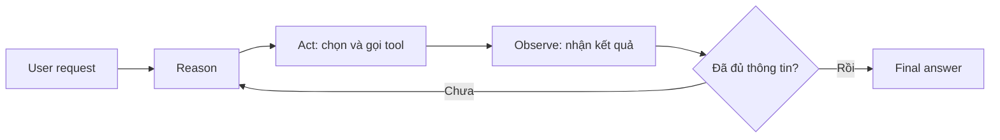

# Bài 001 — AI Agent là gì? Tổng quan cấp cao

## 1. Tóm tắt

AI Agent là một hệ thống phần mềm sử dụng mô hình ngôn ngữ lớn, hay LLM, như thành phần suy luận để **quyết định hành động tiếp theo** và sau đó thực hiện hành động đó thông qua các công cụ được cung cấp. Điểm khác biệt quan trọng so với một chain thông thường nằm ở luồng điều khiển: chain thường có các bước đã được lập trình trước, còn agent có thể lựa chọn động bước hoặc công cụ cần dùng dựa trên nhiệm vụ hiện tại.

## 2. Mục tiêu học tập

Sau bài này, người học có thể:

- giải thích vai trò của LLM trong một AI Agent;
- phân biệt agent với chain dựa trên quyền quyết định luồng thực thi;
- mô tả vai trò của tool trong việc mở rộng khả năng của LLM;
- mô tả vòng lặp cơ bản của kiến trúc ReAct;
- giải thích ở mức khái niệm vai trò của LangChain và LangGraph trong việc xây dựng agent.

## 3. Agent và chain khác nhau ở đâu?

Trong một chain truyền thống, developer xác định trước thứ tự xử lý. LLM có thể xuất hiện ở một hoặc nhiều bước, chẳng hạn để tóm tắt văn bản hoặc sinh nội dung, nhưng LLM không phải thành phần quyết định toàn bộ hệ thống sẽ làm gì tiếp theo.

```text
Input
  ↓
Bước A đã định trước
  ↓
LLM
  ↓
Bước B đã định trước
  ↓
Output
```

Với agent, LLM được sử dụng như một **reasoning engine**. Dựa trên yêu cầu của người dùng và những tool hiện có, LLM có thể quyết định:

- có cần gọi tool hay không;
- nên gọi tool nào;
- cần truyền đối số gì cho tool;
- sau khi nhận kết quả từ tool, đã đủ thông tin để trả lời hay cần tiếp tục hành động.

Khác biệt cốt lõi có thể tóm tắt như sau:

| Khía cạnh | Chain | Agent |
| --- | --- | --- |
| Luồng xử lý | Chủ yếu được mã hóa trước | Có thể được quyết định động |
| Vai trò của LLM | Xử lý một bước cụ thể | Suy luận và chọn hành động tiếp theo |
| Tool | Có thể được gọi ở bước cố định | Được LLM lựa chọn khi cần |
| Số bước | Thường xác định trước | Có thể thay đổi theo nhiệm vụ |

## 4. Tool mở rộng khả năng của LLM

Một LLM tự thân chủ yếu xử lý dữ liệu đầu vào và sinh đầu ra theo năng lực của mô hình. Agent trở nên hữu ích hơn khi LLM được trang bị tool để tương tác với các hệ thống bên ngoài.

Tool có thể đại diện cho nhiều hành động khác nhau, chẳng hạn:

- gọi một API;
- tìm kiếm trên web;
- đọc dữ liệu từ cơ sở dữ liệu;
- chạy một hàm Python;
- thực thi một đoạn mã đã được developer chuẩn bị.

Điểm quan trọng là developer vẫn định nghĩa **những khả năng được phép** thông qua tool. LLM không tự có quyền truy cập mọi hệ thống; nó chỉ có thể lựa chọn trong tập công cụ được cung cấp.

## 5. Kiến trúc ReAct

ReAct là cách tiếp cận kết hợp **reasoning** và **acting**. Thay vì chỉ sinh một câu trả lời ngay lập tức, agent có thể suy luận về nhiệm vụ, chọn hành động, quan sát kết quả rồi tiếp tục vòng lặp cho đến khi có đủ thông tin.



Trong thực tế, phần “Act” được thể hiện bằng tool call. Kết quả của tool trở thành quan sát mới để LLM sử dụng trong vòng suy luận tiếp theo.

## 6. LangChain và LangGraph trong bức tranh agent

LangChain cung cấp các abstraction để khai báo model, tool và tạo agent. LangGraph cung cấp cơ chế thực thi theo dạng graph, phù hợp với quy trình nhiều bước, có trạng thái và có thể kéo dài qua nhiều lượt xử lý.

Ở mức khái niệm, người học chỉ cần ghi nhớ:

```text
LLM          → quyết định
Tool         → thực hiện hành động
Agent runtime→ điều phối vòng lặp
State        → lưu thông tin cần thiết giữa các bước
```

Agent vì thế không chỉ là một lần gọi LLM. Nó là một hệ thống phối hợp giữa model, tool và runtime thực thi.

## 7. Mô hình tư duy quan trọng

Khi đánh giá một hệ thống có phải agent hay không, hãy đặt câu hỏi:

> Ai là thành phần quyết định bước tiếp theo?

Nếu toàn bộ các bước đã được developer cố định trước, hệ thống gần với chain. Nếu LLM có quyền lựa chọn hành động dựa trên tình huống hiện tại, hệ thống mang tính agentic rõ ràng hơn.

## 8. Tổng kết

AI Agent sử dụng LLM không chỉ để sinh nội dung mà còn để quyết định hành động. Tool cung cấp khả năng tương tác với thế giới bên ngoài, còn runtime chịu trách nhiệm thực thi các tool và đưa kết quả trở lại cho LLM. ReAct mô tả vòng lặp suy luận — hành động — quan sát, tạo nền tảng cho search agent và các agent phức tạp hơn.
