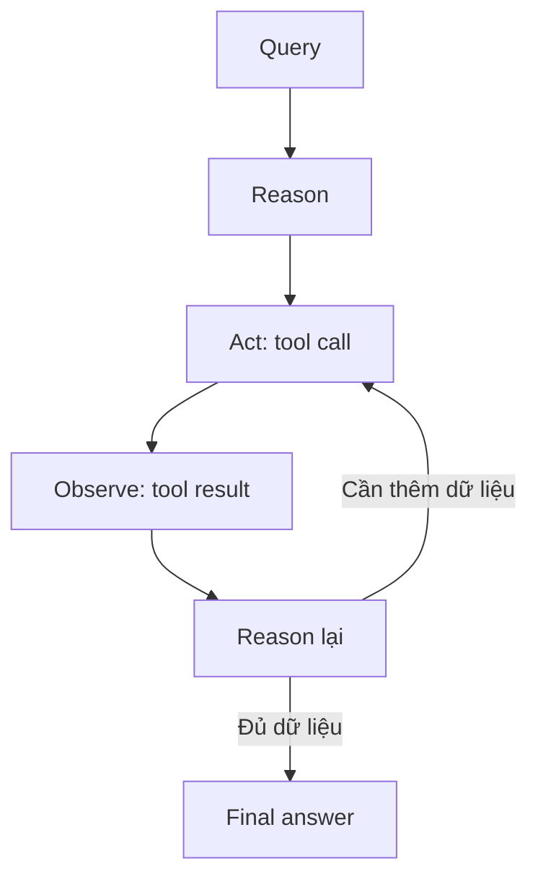

# Bài 003 — Từ Chain đến ReAct Agent

## 1. Tóm tắt

ReAct Agent mở rộng cách xây dựng ứng dụng LLM từ một chuỗi bước cố định sang một vòng lặp trong đó model có thể suy luận, chọn tool, quan sát kết quả rồi tiếp tục. Sự thay đổi quan trọng không phải là thêm nhiều lệnh gọi LLM, mà là chuyển một phần quyền điều phối luồng thực thi cho LLM.

## 2. Mục tiêu học tập

Sau bài này, người học có thể:

- giải thích vì sao một chain cố định không phù hợp với mọi truy vấn;
- mô tả cấu trúc Reason → Act → Observe của ReAct;
- phân biệt quyết định của LLM với phần thực thi của runtime;
- mô tả cách LangChain/LangGraph hỗ trợ agent nhiều bước.

## 3. Từ luồng cố định đến luồng động

Một chain phù hợp khi bài toán có quy trình rõ ràng và ít thay đổi. Ví dụ, một pipeline luôn tóm tắt văn bản rồi lưu kết quả không cần LLM quyết định bước tiếp theo.

Search agent lại khác. Có truy vấn cần tìm kiếm web, có truy vấn không cần. Một truy vấn đơn giản có thể chỉ cần một tool call, trong khi truy vấn rộng hơn có thể cần nhiều lần tìm kiếm.

Do đó, thay vì mã hóa cứng:

```text
Luôn tìm kiếm → luôn tổng hợp → trả lời
```

agent có thể vận hành theo:

```text
Đọc yêu cầu → quyết định → hành động nếu cần → quan sát → quyết định tiếp
```

## 4. Vòng lặp ReAct

ReAct kết hợp hai hoạt động:

- **Reason**: LLM đánh giá nhiệm vụ và quyết định bước tiếp theo.
- **Act**: hệ thống thực hiện hành động thông qua tool.

Sau hành động, kết quả được đưa trở lại như một **observation**. LLM tiếp tục suy luận dựa trên thông tin mới.



Điểm cần ghi nhớ là LLM **chọn** hành động, còn runtime của agent **thực thi** hành động.

## 5. Tool là giao diện giữa reasoning và hành động

LLM không trực tiếp tự gọi API hoặc truy cập cơ sở dữ liệu. Developer cung cấp các tool với tên, mô tả, kiểu đối số và logic thực thi. Dựa trên metadata đó, model có thể chọn tool phù hợp.

Ví dụ với search agent:

```text
Reason: cần dữ liệu tuyển dụng mới
Act: gọi search tool với truy vấn phù hợp
Observe: nhận danh sách kết quả và URL
Reason: đánh giá đã đủ ba vị trí chưa
```

Nếu chưa đủ, agent có thể tạo truy vấn khác và lặp lại.

## 6. Vai trò của LangChain và LangGraph

LangChain cung cấp giao diện để tạo agent từ model và tool. LangGraph cung cấp runtime dạng graph phía dưới để quản lý các bước và trạng thái của quá trình thực thi.

Nhờ đó, developer không cần tự viết toàn bộ vòng lặp orchestration cho mỗi agent. Tuy nhiên, vẫn cần hiểu luồng dữ liệu để có thể debug và kiểm soát hệ thống.

## 7. Khi nào ReAct hữu ích?

ReAct phù hợp khi:

- không thể biết trước chính xác số bước cần thực hiện;
- model cần lựa chọn giữa nhiều tool;
- kết quả của một hành động quyết định hành động tiếp theo;
- nhiệm vụ cần lặp lại cho đến khi đủ thông tin.

Nếu quy trình hoàn toàn cố định và có thể biểu diễn rõ bằng pipeline, chain đơn giản có thể dễ kiểm soát hơn.

## 8. Tổng kết

Sự chuyển dịch từ chain sang ReAct Agent là sự chuyển dịch từ **control flow do developer định sẵn** sang **control flow có phần được LLM quyết định động**. ReAct tổ chức hành vi đó thành vòng Reason → Act → Observe, còn LangChain/LangGraph cung cấp cơ chế để triển khai và điều phối vòng lặp này.
