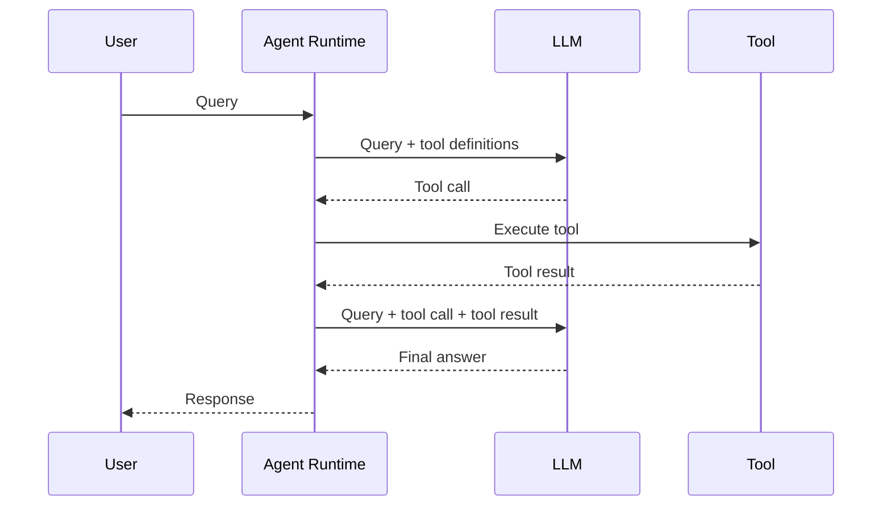

# Bài 006 — Từ truy vấn đến câu trả lời: vòng thực thi của LangChain Agent

## 1. Tóm tắt

Một lần `agent.invoke()` có thể chứa nhiều bước bên trong. Với truy vấn cần tool, agent thường tạo chuỗi message gồm: message người dùng, AI message chứa tool call, tool message chứa kết quả thực thi và AI message cuối cùng. Quan sát chuỗi này giúp biến agent từ một “hộp đen” thành một quy trình có thể debug.

## 2. Mục tiêu học tập

Sau bài này, người học có thể:

- đọc cấu trúc `messages` trong kết quả agent;
- phân biệt `HumanMessage`, AI message chứa tool call và tool result;
- giải thích sự khác nhau giữa LLM quyết định và runtime thực thi;
- mô tả hai lần gọi LLM trong một vòng tool-use đơn giản;
- sử dụng trace để hiểu execution flow.

## 3. Kết quả của `agent.invoke()`

Khi chạy agent với câu hỏi về thời tiết Tokyo, kết quả không chỉ chứa câu trả lời cuối. Nó có thể là một dictionary chứa danh sách message hình thành trong toàn bộ quá trình.

Một chuỗi điển hình:

```text
1. HumanMessage
2. AIMessage có tool call
3. ToolMessage chứa tool result
4. AIMessage chứa final answer
```

Message đầu tiên biểu diễn input của người dùng. Message cuối cùng là câu trả lời của agent. Các message ở giữa cho biết agent đã làm gì để đi từ input đến output.

## 4. Lần gọi LLM đầu tiên: quyết định hành động

Runtime gửi cho model:

- câu hỏi của người dùng;
- metadata của các tool mà model có thể sử dụng.

Model đánh giá câu hỏi “What is the weather in Tokyo?” và quyết định dùng tool `search` với một query phù hợp.

```text
Input + Tool metadata
        ↓
       LLM
        ↓
Tool call: search(query="weather in Tokyo")
```

Ở bước này, model chưa chạy hàm `search`. Nó chỉ tạo quyết định có cấu trúc.

## 5. Runtime thực thi tool

Sau khi nhận tool call, agent runtime gọi hàm thật:

```python
search(query="weather in Tokyo")
```

Trong ví dụ ban đầu, tool trả về chuỗi tĩnh:

```text
The weather in Tokyo is sunny.
```

Kết quả này được đóng gói thành một tool message để đưa trở lại lịch sử thực thi.

## 6. Lần gọi LLM thứ hai: tổng hợp câu trả lời

Runtime gọi model lần nữa với nhiều context hơn:

- user message ban đầu;
- tool call mà model đã tạo;
- kết quả tool vừa thực thi.

Lúc này model đã có dữ liệu cần thiết nên có thể tạo final answer mà không cần gọi tool thêm.



## 7. LLM và agent runtime là hai vai trò khác nhau

Đây là điểm rất quan trọng:

- **LLM** chọn tool và argument.
- **Agent runtime** đọc quyết định đó và thực thi tool.
- **Tool** trả dữ liệu.
- **LLM** dùng dữ liệu mới để quyết định tiếp hoặc trả lời.

Nếu có nhiều vòng lặp, runtime tiếp tục điều phối cho đến khi model không yêu cầu tool nữa và trả final answer.

## 8. LangGraph và trace

Execution của agent được tổ chức bằng graph runtime ở phía dưới. Khi tracing được bật, LangSmith cho phép quan sát từng node/lần gọi:

- input của model;
- danh sách tool được gửi cho model;
- tool call model tạo;
- argument của tool;
- output của tool;
- final response.

Trace đặc biệt hữu ích khi agent tạo kết quả sai vì có thể xác định lỗi nằm ở quyết định của model, ở tool hay ở dữ liệu trả về.

## 9. Đọc agent bằng message history

Có thể xem message history như nhật ký của vòng lặp agent:

| Message | Ý nghĩa |
| --- | --- |
| HumanMessage | Yêu cầu ban đầu |
| AIMessage + tool call | Quyết định của model |
| ToolMessage | Kết quả hành động |
| AIMessage cuối | Câu trả lời sau khi có observation |

Cách đọc này sẽ tiếp tục hữu ích khi agent sử dụng nhiều tool call hơn trong bài Tavily.

## 10. Tổng kết

Một agent không “tự nhiên biết” câu trả lời. Runtime tạo vòng trao đổi giữa LLM và tool. LLM quyết định, runtime thực thi, tool cung cấp observation, rồi LLM tổng hợp hoặc tiếp tục. Hiểu chuỗi message là nền tảng để debug mọi agent nhiều bước.
