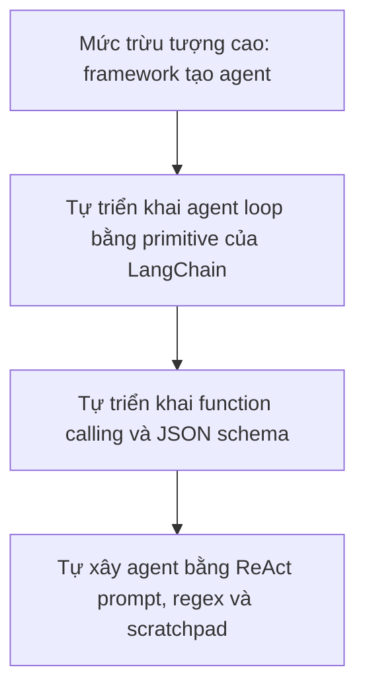

# 001 - Kiến trúc cốt lõi của AI Agent: bóc tách từng lớp

## 1. Tóm tắt

Một AI agent có thể được tạo rất nhanh khi framework che giấu phần lớn cơ chế bên trong: cung cấp mô hình, cung cấp các công cụ và để framework điều phối việc sử dụng chúng. Cách tiếp cận này thuận tiện, nhưng nếu chỉ dừng ở mức đó thì rất khó hiểu chính xác agent đã suy luận, chọn công cụ và lặp lại quá trình xử lý như thế nào.

Phần học này đi theo hướng ngược lại: bắt đầu từ mức trừu tượng cao, sau đó lần lượt loại bỏ từng lớp che giấu cho đến khi có thể nhìn thấy vòng lặp agent, cơ chế gọi hàm và cuối cùng là cách xây dựng một agent kiểu ReAct gần như từ đầu.

## 2. Mục tiêu học tập

Sau bài này, người học có thể:

- Giải thích vì sao cần bóc tách các lớp trừu tượng khi học kiến trúc AI agent.
- Mô tả ba mức triển khai agent từ framework cấp cao đến triển khai thủ công.
- Phân biệt vai trò của vòng lặp agent, function calling và ReAct prompt.
- Giải thích giá trị của LangChain trong việc giảm mã lặp lại và tạo giao diện thống nhất giữa các mô hình.
- Xác định yêu cầu tối thiểu của mô hình khi thực hành các phiên bản có function calling.

## 3. Vấn đề của mức trừu tượng cao

Ở mức đầu tiên, framework có thể xử lý gần như toàn bộ quy trình. Developer chỉ cần cung cấp:

- một mô hình ngôn ngữ;
- danh sách công cụ;
- yêu cầu của người dùng.

Agent sau đó có thể quyết định sử dụng công cụ, chẳng hạn một công cụ tìm kiếm, mà developer chưa cần tự viết toàn bộ cơ chế điều phối bên dưới.

Cách này hiệu quả để xây nhanh, nhưng che giấu các câu hỏi quan trọng:

- Agent lặp lại quá trình suy luận bằng cách nào?
- Khi nào mô hình quyết định gọi công cụ?
- Kết quả công cụ được đưa trở lại mô hình ra sao?
- Framework đã tự động hóa phần nào?
- Nếu bỏ framework, ta phải tự triển khai những thành phần nào?

Mục tiêu của phần học là trả lời lần lượt các câu hỏi đó.

## 4. Ba lớp triển khai cần bóc tách

Quá trình học được tổ chức theo ba mức triển khai.

| Mức | Cách triển khai | Thành phần chính | Điều cần quan sát |
| --- | --- | --- | --- |
| 1 | Dùng các abstraction cơ bản của LangChain | Agent loop, function calling, tool, chat model, tool message | Cách vòng lặp agent vận hành |
| 2 | Tự triển khai function calling | Vòng lặp thủ công, JSON schema, gọi công cụ | Framework đã làm thay những gì |
| 3 | Tự xây agent không dựa vào function calling | ReAct prompt, biểu thức chính quy, scratchpad | Cơ chế agent ở mức thấp hơn |

Luồng bóc tách có thể hình dung như sau:

Mỗi bước loại bỏ một lớp tiện ích. Khi đó, những phần trước đây được framework xử lý tự động sẽ trở nên quan sát được.

## 5. Lớp 1: tự triển khai vòng lặp agent

Lớp đầu tiên vẫn sử dụng LangChain nhưng không giao toàn bộ agent cho một hàm cấp cao. Trọng tâm là tự nhìn thấy vòng lặp điều phối.

Về bản chất, agent sẽ chạy trong một vòng lặp kiểu `while` cho đến khi nhiệm vụ hoàn tất. Trong mỗi vòng, hệ thống cần xác định mô hình muốn:

- gọi một công cụ; hoặc
- kết thúc và trả lời người dùng.

Ở mức này, LangChain vẫn cung cấp các abstraction giúp giảm mã lặp lại, đặc biệt quanh mô hình chat, công cụ và thông điệp liên quan đến công cụ.

## 6. Lớp 2: tự triển khai function calling

Sau khi hiểu vòng lặp agent, bước tiếp theo là giữ logic tương tự nhưng giảm thêm abstraction.

Thay vì dựa vào framework để định nghĩa và chuyển đổi cấu trúc gọi công cụ, ta tự viết các schema JSON cần thiết và tự điều phối việc thực thi.

Mục tiêu của bước này không phải loại bỏ LangChain vì LangChain không cần thiết. Ngược lại, khi tự làm phần việc này, người học có thể thấy rõ giá trị mà framework mang lại:

- giảm mã lặp lại;
- cung cấp giao diện thống nhất;
- giúp chuyển đổi mô hình dễ hơn;
- hạn chế việc phải sửa nhiều mã khi thay nhà cung cấp hoặc mô hình.

Đây là một yếu tố quan trọng khi xây agent cần tính linh hoạt.

## 7. Lớp 3: agent ReAct không dựa vào function calling

Lớp sâu hơn loại bỏ cả function calling.

Agent được xây bằng ba thành phần chính:

- `ReAct prompt`: hướng dẫn mô hình suy luận và biểu diễn hành động theo một định dạng có thể xử lý;
- biểu thức chính quy: đọc phần đầu ra mà mô hình tạo ra;
- `scratchpad`: lưu lại các bước trước đó để mô hình tiếp tục suy luận dựa trên lịch sử.

Ở mức này, người học có thể quan sát trực tiếp cách một agent kiểu ReAct tổ chức chu trình suy luận và hành động mà không phụ thuộc vào cơ chế function calling của mô hình.

## 8. Vì sao cần thực hành trực tiếp

Phần kiến trúc agent khó hiểu nếu chỉ đọc hoặc xem mô tả. Cách học được nhấn mạnh là:

1. viết mã;
2. chạy mã;
3. xem log hoặc trace;
4. đối chiếu từng quyết định của mô hình với công cụ đã được gọi;
5. lặp lại cho đến khi hiểu được luồng xử lý.

Việc quan sát log đặc biệt quan trọng vì agent là một hệ thống có nhiều bước trung gian. Chỉ nhìn câu trả lời cuối cùng sẽ che mất phần lớn cơ chế cần học.

## 9. Mô hình sử dụng trong phần học

Phần thực hành có thể dùng mô hình chạy cục bộ qua Ollama hoặc mô hình từ nhà cung cấp khác. Với các phiên bản dựa trên function calling, điều kiện quan trọng là mô hình phải hỗ trợ khả năng gọi hàm hoặc gọi công cụ.

Mục tiêu không phải phụ thuộc vào một mô hình duy nhất, mà là hiểu kiến trúc đủ rõ để có thể thay đổi mô hình mà không làm thay đổi toàn bộ thiết kế agent.

## 10. Tổng kết

Kiến trúc agent trở nên dễ hiểu hơn khi được bóc tách theo từng lớp. Bắt đầu từ một agent do framework điều phối, ta lần lượt đi xuống vòng lặp agent, function calling thủ công và cuối cùng là ReAct prompt cùng scratchpad.

Cách học này giúp phân biệt rõ hai vấn đề: **agent thực sự hoạt động như thế nào** và **framework đang giúp developer ở đâu**. Đây là nền tảng để tiếp tục xây agent thương mại điện tử trong các bài tiếp theo.
