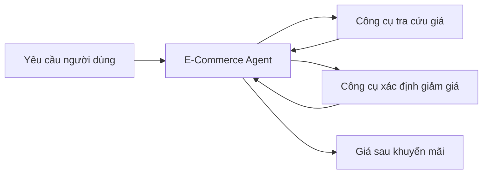

# 002 - Xây dựng E-Commerce Agent: bài toán và kiến trúc

## 1. Tóm tắt

Bài toán thực hành của phần này là một AI agent dành cho cửa hàng thương mại điện tử bán các sản phẩm phần cứng như tai nghe, bàn phím và laptop.

Agent nhận yêu cầu của người dùng, tra cứu giá sản phẩm, xác định mức giảm giá theo hạng khuyến mãi và trả về giá sau khi áp dụng khuyến mãi. Phiên bản đầu tiên được cố ý giữ nhỏ gọn để tập trung vào cơ chế agent thay vì nghiệp vụ phức tạp.

## 2. Mục tiêu học tập

Sau bài này, người học có thể:

- Mô tả chính xác nhiệm vụ của E-Commerce Agent.
- Xác định hai công cụ mà agent cần sử dụng.
- Giải thích dữ liệu nào đến từ yêu cầu người dùng và dữ liệu nào cần lấy qua công cụ.
- Mô tả luồng từ yêu cầu đến giá cuối cùng.
- Chuẩn bị mô hình bài toán cho phần ReAct và agent loop ở các bài sau.

## 3. Bài toán thương mại điện tử

Giả sử một cửa hàng có các sản phẩm phần cứng như:

- tai nghe;
- bàn phím;
- laptop.

Cửa hàng có chương trình khuyến mãi theo nhiều hạng, chẳng hạn:

- đồng;
- bạc;
- vàng.

Mỗi hạng tương ứng với một tỷ lệ giảm giá khác nhau. Trong nội dung hiện có, mức **đồng** được xác định là giảm **15%**; tỷ lệ cụ thể của các hạng còn lại chưa được cung cấp.

Yêu cầu đặt ra là xây một chương trình tự động có thể nhận câu hỏi của người dùng và trả về giá của sản phẩm sau khi áp dụng mức khuyến mãi phù hợp.

## 4. Hai công cụ cốt lõi

Agent được thiết kế với hai công cụ.

### 4.1. Công cụ tra cứu giá

Công cụ thứ nhất nhận thông tin sản phẩm và trả về giá tương ứng.

Về mặt khái niệm:

```text
product
   ↓
Tra cứu giá
   ↓
product_price
```

Ví dụ, khi người dùng hỏi về laptop, agent cần lấy được giá laptop trước khi có thể tính giá sau giảm.

### 4.2. Công cụ xác định giảm giá

Công cụ thứ hai nhận hạng khuyến mãi và trả về tỷ lệ giảm tương ứng.

```text
discount_tier
   ↓
Tra cứu mức giảm
   ↓
discount_rate
```

Với hạng đồng:

```text
discount_rate = 15%
```

Nếu giá gốc được ký hiệu là `P`, giá sau mức giảm đồng có thể biểu diễn là:

```text
P × (1 - 0.15)
```

Bài học chưa cung cấp giá cụ thể của từng sản phẩm, vì vậy không cần gán một con số giả định cho `P`.

## 5. Luồng xử lý ở mức bài toán

Ở mức khái niệm, agent cần kết hợp thông tin từ hai nguồn:



Điểm quan trọng là người dùng không phải tự gọi từng công cụ. Agent chịu trách nhiệm quyết định cần lấy thông tin nào để hoàn thành yêu cầu.

Cơ chế agent ra quyết định và lặp lại việc gọi công cụ sẽ được làm rõ bằng ReAct loop.

## 6. Tại sao chọn bài toán nhỏ

Một agent thương mại điện tử thực tế có thể chứa nhiều nghiệp vụ hơn, nhưng ở đây hệ thống chỉ cần hai công cụ. Cách giới hạn phạm vi này giúp quan sát rõ:

- đầu vào của agent;
- quyết định gọi công cụ;
- kết quả trả về từ công cụ;
- cách nhiều kết quả được kết hợp để tạo câu trả lời cuối.

Nếu bài toán quá lớn ngay từ đầu, các chi tiết nghiệp vụ có thể che lấp cơ chế agent cần học.

## 7. Quan hệ với abstraction cấp cao

Nếu dùng một abstraction tạo agent cấp cao, developer có thể cung cấp:

- mô hình ngôn ngữ;
- danh sách hai công cụ;
- yêu cầu của người dùng.

Framework sau đó xử lý phần lớn điều phối.

Trong phần này, mục tiêu là triển khai phiên bản gọn nhẹ hơn và dần quan sát những gì diễn ra bên dưới abstraction đó.

## 8. Tổng kết

E-Commerce Agent là bài toán thực hành xuyên suốt: nhận yêu cầu, tra cứu giá, xác định mức giảm và trả về giá cuối cùng.

Hai công cụ nhỏ tạo ra một môi trường đủ đơn giản để học sâu về agent loop. Khi chuyển sang ReAct, ta sẽ thấy agent không chỉ “gọi hai hàm”, mà phải quyết định **gọi công cụ nào, ở vòng nào và khi nào đã có đủ thông tin để dừng**.
