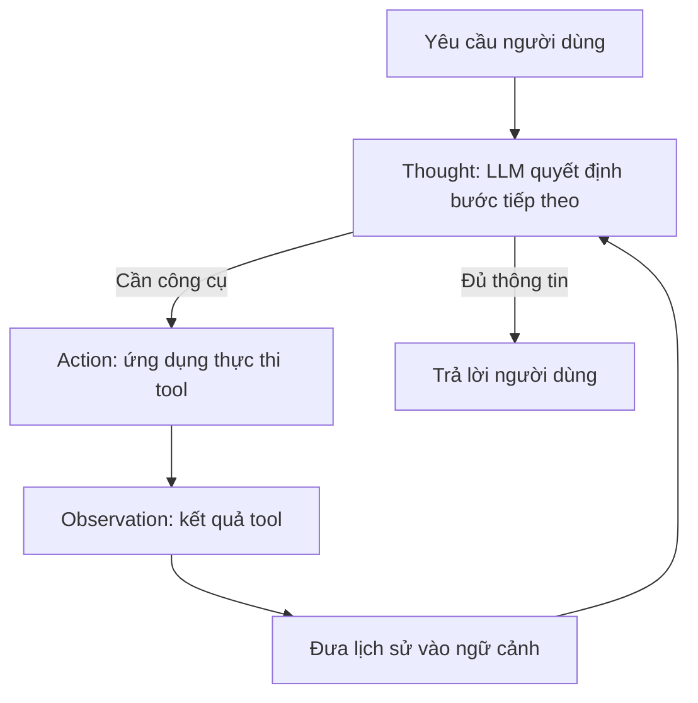

# 003 - Lý thuyết ReAct và Agent Loop

## 1. Tóm tắt

ReAct loop, còn được gọi trong bài học là agent loop, là cơ chế lặp giúp agent kết hợp suy luận của mô hình ngôn ngữ với hành động thực tế thông qua công cụ.

Mỗi vòng lặp xoay quanh ba khái niệm:

- **Thought**: mô hình quyết định bước tiếp theo;
- **Action**: ứng dụng thực thi công cụ mà mô hình yêu cầu;
- **Observation**: kết quả công cụ được đưa trở lại ngữ cảnh.

Chu trình tiếp tục cho đến khi mô hình xác định rằng không cần gọi thêm công cụ và có thể trả về câu trả lời cuối cùng.

## 2. Mục tiêu học tập

Sau bài này, người học có thể:

- Giải thích cấu trúc của ReAct loop.
- Phân biệt `Thought`, `Action` và `Observation`.
- Mô tả vai trò của LLM và vai trò của ứng dụng host.
- Giải thích vì sao lịch sử các bước trước phải được đưa trở lại mô hình.
- Mô phỏng nhiều vòng lặp cho bài toán E-Commerce Agent.
- Xác định điều kiện dừng của agent loop.

## 3. ReAct loop là gì

ReAct kết hợp hai hoạt động:

- suy luận để xác định cần làm gì tiếp theo;
- hành động để lấy thêm thông tin từ môi trường hoặc công cụ.

Trong bài toán E-Commerce Agent, người dùng có thể hỏi giá cuối cùng của một laptop sau khi áp dụng một hạng giảm giá. Agent chưa có sẵn toàn bộ dữ liệu cần thiết, nên phải lần lượt thu thập thông tin qua công cụ.

Cấu trúc tổng quát:



## 4. Thought: bước quyết định của mô hình

Ở bước `Thought`, yêu cầu người dùng cùng ngữ cảnh hiện tại được gửi tới LLM.

Ngữ cảnh cần cho mô hình biết:

- nhiệm vụ hiện tại;
- thông tin chung của agent;
- những công cụ agent được phép sử dụng;
- lịch sử các bước đã diễn ra.

Dựa trên dữ liệu này, mô hình quyết định một trong hai hướng:

1. yêu cầu gọi một công cụ;
2. kết thúc và trả về câu trả lời.

Điểm quan trọng là LLM **ra quyết định**, nhưng không tự thực thi mã công cụ trong ứng dụng.

## 5. Action: ứng dụng thực thi quyết định

Nếu LLM quyết định cần một công cụ, kết quả của bước suy luận phải chỉ ra:

- công cụ hoặc hàm cần gọi;
- các tham số cần truyền.

Ứng dụng agent nhận quyết định đó và thực thi công cụ tương ứng.

Ví dụ ở vòng đầu tiên, agent có thể xác định rằng nó cần giá của `laptop`. Ứng dụng sau đó gọi công cụ tra cứu giá với sản phẩm này.

Phân tách trách nhiệm như vậy rất quan trọng:

| Thành phần | Trách nhiệm |
| --- | --- |
| LLM | Chọn bước tiếp theo và công cụ cần dùng |
| Ứng dụng | Thực thi công cụ thật |
| Công cụ | Trả về dữ liệu quan sát được |

## 6. Observation: đưa kết quả trở lại vòng lặp

Kết quả trả về từ công cụ được gọi là `Observation`.

Observation không phải là điểm kết thúc mặc định. Nó trở thành dữ liệu mới cho lần suy luận tiếp theo.

Ví dụ:

```text
Yêu cầu người dùng
      ↓
Thought
      ↓
Action: lấy giá laptop
      ↓
Observation: giá laptop
      ↓
Thought tiếp theo
```

LLM chỉ có thể tận dụng observation nếu kết quả này được đưa trở lại ngữ cảnh của nó.

## 7. Scratchpad và lịch sử xử lý

Sau mỗi action, hệ thống cần lưu lại những gì đã xảy ra. Lịch sử này đóng vai trò như một `scratchpad` cho agent.

Nó có thể chứa:

- yêu cầu ban đầu;
- quyết định gọi công cụ;
- tham số đã dùng;
- observation nhận được;
- các bước tiếp theo.

Trong lần lặp kế tiếp, toàn bộ phần liên quan của lịch sử được gửi lại cho mô hình. Nhờ vậy, LLM biết nó đã làm gì và còn thiếu thông tin nào.

Nếu không duy trì lịch sử, mỗi vòng lặp sẽ gần như bắt đầu lại từ đầu.

## 8. Ba vòng lặp trong ví dụ E-Commerce Agent

Ví dụ trong bài học có thể được hiểu theo ba vòng.

### 8.1. Vòng 1: lấy giá sản phẩm

Agent nhận câu hỏi của người dùng và thấy rằng cần biết giá laptop.

```text
Thought → cần giá sản phẩm
Action → gọi công cụ lấy giá với product = laptop
Observation → nhận giá laptop
```

### 8.2. Vòng 2: áp dụng mức giảm giá

Lịch sử vòng 1 được đưa trở lại LLM. Bây giờ agent đã biết giá sản phẩm và có thể tiếp tục xử lý hạng giảm giá.

```text
Thought → cần xác định hoặc áp dụng mức giảm
Action → gọi công cụ giảm giá
Observation → nhận giá sau khi xử lý giảm giá
```

### 8.3. Vòng 3: kết thúc

Toàn bộ lịch sử cùng các observation được gửi lại LLM.

Lúc này mô hình có đủ dữ liệu nên không cần yêu cầu công cụ mới. Agent trả về câu trả lời cuối cùng cho người dùng.

## 9. Agent loop dưới dạng thuật toán

Có thể biểu diễn cơ chế ở mức khái niệm như sau:

```python
while True:
    decision = ask_llm_with_history()

    if decision.is_final_answer:
        return decision.final_answer

    observation = execute_tool(
        decision.tool_name,
        decision.tool_arguments,
    )

    append_to_history(decision, observation)
```

Đây không phải API cụ thể của một framework. Nó chỉ thể hiện cấu trúc logic của vòng lặp:

1. hỏi LLM;
2. nếu đủ thông tin thì dừng;
3. nếu cần công cụ thì thực thi;
4. lưu observation;
5. lặp lại.

## 10. Điều kiện dừng

Vòng lặp không dừng chỉ vì một công cụ đã chạy xong.

Nó dừng khi LLM quyết định rằng không cần thực thi thêm công cụ và đã có thể tạo câu trả lời cuối cùng.

Vì vậy, cấu trúc của agent không phải là một chuỗi hàm cố định. Số vòng lặp phụ thuộc vào thông tin mà mô hình cần để hoàn thành nhiệm vụ.

## 11. Tổng kết

ReAct loop có thể được hiểu bằng một chu trình đơn giản:

```text
Thought → Action → Observation → Thought → ...
```

LLM chịu trách nhiệm quyết định. Ứng dụng chịu trách nhiệm thực thi. Observation được đưa trở lại lịch sử để mô hình tiếp tục suy luận.

Khi mô hình có đủ thông tin, nó không tạo action mới mà trả về kết quả. Đây là cơ chế cốt lõi cần nắm trước khi tự triển khai agent loop bằng code.
