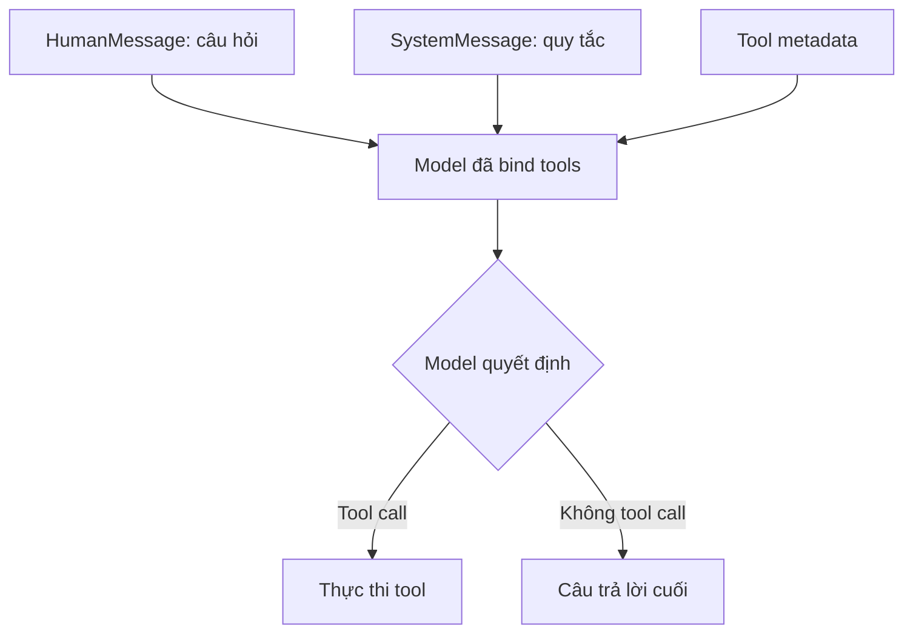

# 002 - Tool Binding and Defensive Prompting

## 1. Tóm tắt

Sau khi đã định nghĩa tool, model cần biết những tool nào đang khả dụng và trong trường hợp nào phải sử dụng chúng. Bài này xây dựng hai thành phần của `run_agent()`: bind tool vào chat model và thiết kế system prompt phòng thủ để giảm việc model tự đoán giá, tự tính giảm giá hoặc tự chọn cấp khuyến mãi khi người dùng chưa cung cấp.

## 2. Mục tiêu học tập

Sau bài này, người học có thể:

- xây dựng danh sách tool và ánh xạ tên tool sang callable tương ứng;
- giải thích cơ chế `bind_tools()`;
- tạo message history ban đầu gồm system message và human message;
- viết các ràng buộc phòng thủ cho một agent dùng tool;
- giải thích vì sao prompt không thay thế validation nhưng vẫn giúp giảm lỗi hành vi của model.

## 3. Tạo danh sách tool và `tool_map`

Hai tool `get_product_price` và `apply_discount` được gom vào một danh sách. Danh sách này phục vụ việc bind metadata của tool vào model.

Agent cũng cần một cơ chế để chuyển tên tool do LLM trả về thành đối tượng Python có thể thực thi. Vì vậy ứng dụng xây dựng một dictionary có dạng:

```text
tên tool → đối tượng tool
```

Có thể hình dung:

```python
tools = [get_product_price, apply_discount]
tool_map = {tool.name: tool for tool in tools}
```

`tool_map` không quyết định tool nào phải chạy. Model đưa ra quyết định đó. Dictionary chỉ thực hiện bước ánh xạ từ tên trong tool call sang callable tương ứng ở phía ứng dụng.

## 4. Bind tool vào model

Model được khởi tạo bằng `init_chat_model()`, sau đó danh sách tool được gắn vào model bằng `bind_tools()`.

```python
model_with_tools = model.bind_tools(tools)
```

Từ thời điểm này, mỗi lần ứng dụng gọi model đã bind tool, thông tin mô tả các tool sẽ được gửi kèm theo request ở định dạng phù hợp với provider.

Cơ chế này chỉ hoạt động khi chat model hỗ trợ function/tool calling. Nếu provider hoặc model không hỗ trợ khả năng đó, chỉ việc có danh sách tool trong Python không đủ để tạo agent kiểu này.

## 5. Vai trò của lớp trừu tượng LangChain

Một lợi ích lớn của cách tiếp cận này là logic agent không phải phụ thuộc chặt vào một class model cụ thể. Khi provider khác cũng hỗ trợ tool calling và integration package tương ứng đã được cài đặt, phần lớn vòng lặp agent có thể giữ nguyên.

Điều đó giúp tách hai mối quan tâm:

```text
Logic agent
    │
    ├── message history
    ├── tool selection
    ├── tool execution
    └── stop condition

Provider/model
    │
    └── được khởi tạo qua lớp trừu tượng chat model
```

Tính linh hoạt này sẽ được kiểm tra rõ hơn trong bài Model Switch.

## 6. Message history ban đầu

Trước vòng lặp, agent tạo danh sách message gồm hai phần:

1. `SystemMessage`: mô tả vai trò và các quy tắc bắt buộc.
2. `HumanMessage`: chứa câu hỏi thực tế của người dùng.

Trong trường hợp mẫu, agent đóng vai trò trợ lý mua sắm có quyền truy cập catalog sản phẩm và công cụ giảm giá.

## 7. Defensive prompting

### 7.1. Không đoán giá sản phẩm

Quy tắc đầu tiên yêu cầu agent không được tự đoán hoặc giả định giá của sản phẩm. Muốn có giá, agent phải gọi `get_product_price`.

Mục tiêu của quy tắc này là buộc dữ liệu nghiệp vụ đi qua nguồn xác định thay vì đến từ kiến thức hoặc suy đoán của model.

### 7.2. Chỉ giảm giá sau khi đã có giá từ tool

Agent chỉ được gọi `apply_discount` sau khi đã nhận được giá từ `get_product_price`. Giá truyền sang tool giảm giá phải là giá vừa quan sát được từ tool tra cứu.

Quy tắc này bảo vệ thứ tự xử lý:

```text
Không hợp lệ:
Model tự tạo giá → apply_discount

Hợp lệ:
get_product_price → giá thực tế → apply_discount
```

### 7.3. Không tự tính giảm giá

Agent được yêu cầu không tự thực hiện phép tính giảm giá bằng nội dung do LLM tạo ra. Khi cần tính giá cuối, phải gọi `apply_discount`.

Nhờ đó, phép tính được giao cho code xác định và trace thể hiện rõ cả bước tính toán.

### 7.4. Không tự chọn cấp giảm giá

Nếu người dùng không chỉ định cấp khuyến mãi, agent phải hỏi lại thay vì tự chọn Đồng, Bạc hoặc Vàng.

Đây là nguyên tắc quan trọng đối với agent nói chung: khi một tham số nghiệp vụ cần thiết còn thiếu, hỏi lại thường an toàn hơn tự lấp giá trị.

## 8. Vì sao cần defensive prompting

Trong thử nghiệm của bài học, model cục bộ Qwen3 1.7B đôi khi có thể tạo ra giá sản phẩm thay vì bắt buộc lấy giá qua tool. Các quy tắc phòng thủ được bổ sung sau khi quan sát hành vi này trong quá trình thử nghiệm.

Điều cần rút ra không phải là mọi lỗi đều có thể sửa bằng prompt. Defensive prompting chỉ là một lớp kiểm soát hành vi. Hệ thống production vẫn cần validation ở phía code, kiểm tra argument và cơ chế xử lý lỗi phù hợp.

Tuy nhiên, system prompt rõ ràng giúp model hiểu ranh giới trách nhiệm:

- LLM quyết định bước tiếp theo;
- tool cung cấp dữ liệu hoặc phép tính xác định;
- agent không được tự thay thế dữ liệu mà tool chịu trách nhiệm cung cấp.

## 9. Cấu trúc logic sau bài này

Sau khi hoàn thành tool binding và prompt phòng thủ, `run_agent()` đã có các thành phần đầu vào cần thiết cho vòng lặp ReAct:



Sơ đồ mới dừng ở mức quyết định. Bài tiếp theo sẽ triển khai đầy đủ phần lặp, quan sát và cập nhật message history.

## 10. Tổng kết

`bind_tools()` giúp model nhận schema của các tool, còn `tool_map` giúp ứng dụng chuyển tên tool thành callable để thực thi. System prompt phòng thủ đặt ra các nguyên tắc: không đoán giá, không tự tính giảm giá, chỉ dùng giá do tool trả về và phải hỏi lại khi thiếu cấp khuyến mãi.

Hai thành phần này tạo điều kiện để vòng lặp ReAct hoạt động có kiểm soát hơn trong bài tiếp theo.
