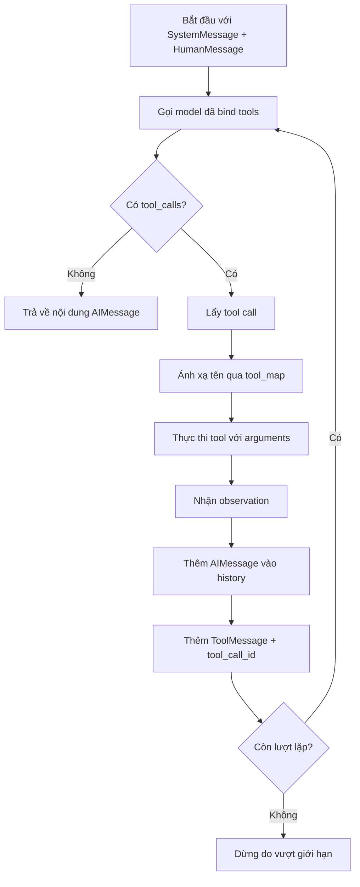

# 003 - Understanding the ReAct Agent Loop in LangChain

## 1. Tóm tắt

Bài này triển khai thủ công một vòng lặp ReAct bằng các object của LangChain. Mỗi vòng lặp gửi toàn bộ message history cho model, kiểm tra xem model muốn gọi tool hay đã có câu trả lời cuối cùng, thực thi tool khi cần, rồi thêm cả quyết định của model và kết quả tool trở lại history.

Khi nhìn rõ chu trình này, agent không còn là một “hộp đen”. Nó trở thành một state machine nhỏ gồm model call, tool call, observation, cập nhật trạng thái và điều kiện dừng.

## 2. Mục tiêu học tập

Sau bài này, người học có thể:

- mô tả từng trạng thái trong một vòng lặp ReAct;
- phân biệt phản hồi chứa `tool_calls` với phản hồi cuối cùng;
- trích xuất tên tool, arguments và tool call ID;
- thực thi tool thông qua `tool_map`;
- thêm AI message và `ToolMessage` vào lịch sử;
- giải thích vai trò của tool call ID;
- triển khai điều kiện dừng theo câu trả lời cuối hoặc giới hạn số vòng lặp;
- đọc trace để tái dựng chuỗi quyết định của agent.

## 3. Mô hình tổng quát của vòng lặp

Agent lặp lại cùng một chu trình cho đến khi model không còn yêu cầu tool hoặc chạm giới hạn số lần lặp.



Đây là phần lõi của agent loop được triển khai trong section.

## 4. Bước 1: gọi model

Trong mỗi iteration, ứng dụng gọi model đã bind tools với toàn bộ danh sách message hiện tại.

Kết quả là một AI message. AI message có hai dạng quan trọng:

- chứa `tool_calls`: model muốn ứng dụng thực thi một hoặc nhiều tool;
- không có `tool_calls`: model cho rằng đã đủ thông tin để trả lời người dùng.

Do đó, `tool_calls` trở thành tín hiệu điều khiển của vòng lặp.

## 5. Bước 2: phát hiện câu trả lời cuối cùng

Nếu danh sách `tool_calls` rỗng, vòng lặp không còn công việc bên ngoài nào phải thực hiện. Nội dung của AI message được xem là câu trả lời cuối cùng và hàm `run_agent()` trả về nội dung đó.

Điều kiện dừng này quan trọng hơn việc đếm một số bước cố định. Agent có thể kết thúc sau một lần gọi model hoặc sau nhiều vòng tùy theo bài toán.

## 6. Bước 3: xử lý tool call

### 6.1. Giới hạn của ví dụ

Các LLM hiện đại có thể trả về nhiều tool call trong cùng một phản hồi. Để giữ ví dụ dễ quan sát, triển khai của bài chỉ xử lý tool call đầu tiên.

Đây là một quyết định đơn giản hóa, không phải giới hạn khái niệm của ReAct.

### 6.2. Dữ liệu cần trích xuất

Từ tool call, agent lấy ba thông tin:

- tên tool;
- dictionary arguments;
- tool call ID.

Tên tool dùng để truy cập `tool_map`. Arguments được truyền vào tool. Tool call ID được giữ lại để nối kết observation với đúng yêu cầu tool trong message history và trace.

## 7. Bước 4: thực thi tool và tạo observation

Tên tool được dùng làm khóa trong `tool_map` để lấy đối tượng tool tương ứng. Tool sau đó được thực thi với các arguments model đã cung cấp.

Có thể biểu diễn logic ở mức khái niệm như sau:

```python
tool_name = tool_call["name"]
tool_args = tool_call["args"]
tool_id = tool_call["id"]

tool_fn = tool_map[tool_name]
observation = tool_fn.invoke(tool_args)
```

`observation` là kết quả thực tế của tool. Đây là dữ liệu cần được đưa trở lại model ở vòng kế tiếp.

Nếu tên tool không tồn tại trong `tool_map`, ứng dụng phải coi đó là lỗi thay vì cố tiếp tục với một callable không xác định.

## 8. Bước 5: cập nhật lịch sử

Sau khi tool chạy xong, chỉ lưu observation là chưa đủ. Agent phải giữ cả quyết định tool call của AI và kết quả thực thi tool.

Message history được bổ sung theo thứ tự:

1. AI message vừa trả về, trong đó có tool call.
2. `ToolMessage` chứa observation và tool call ID tương ứng.

Ở lần gọi model tiếp theo, LLM nhận lại toàn bộ các bước đã diễn ra. Nhờ đó nó biết:

- đã yêu cầu tool nào;
- tool được gọi với argument gì;
- tool đã trả về kết quả gì;
- bước tiếp theo cần làm là gì.

Đây chính là trạng thái làm việc của agent trong vòng lặp.

## 9. Ví dụ: laptop và ưu đãi vàng

Trong lần chạy minh họa, người dùng yêu cầu giá laptop sau khi áp dụng ưu đãi vàng.

Agent tiến hành theo ba vòng:

### 9.1. Iteration 1

Model chọn `get_product_price` với sản phẩm `laptop`. Tool trả về giá `1299`.

Kết quả này được thêm vào message history dưới dạng observation.

### 9.2. Iteration 2

Model đã biết giá `1299`, nên chọn `apply_discount` với giá vừa nhận được và cấp Vàng.

Cấp Vàng giảm 23%, do đó phép tính xác định của tool là:

```text
1299 × (1 - 23 / 100) = 1000.23
```

Kết quả tool tiếp tục được thêm vào history.

### 9.3. Iteration 3

Model không yêu cầu tool mới. Đây là tín hiệu rằng vòng lặp đã hoàn tất và nội dung AI message trở thành câu trả lời cuối cùng.

Ví dụ này cho thấy ReAct agent không cần lập sẵn toàn bộ kế hoạch bằng code. Ứng dụng cung cấp tool và state; model quyết định tool nào cần dùng ở từng vòng dựa trên history hiện tại.

## 10. Giới hạn số vòng lặp

Nếu model liên tục yêu cầu tool mà không bao giờ tạo câu trả lời cuối, agent không được chạy vô hạn.

Sau khi chạm `MAX_ITERATIONS`, triển khai dừng và báo rằng đã đạt giới hạn tối đa. Đây là một guardrail ở cấp orchestration, độc lập với system prompt.

Trong hệ thống lớn hơn, nhánh lỗi này có thể được mở rộng để ghi log, trả lỗi có cấu trúc, kích hoạt fallback hoặc yêu cầu người dùng cung cấp thêm thông tin.

## 11. Đọc trace để hiểu agent

LangSmith giúp quan sát cùng một lần chạy theo thứ tự thực tế:

```text
Model call
→ get_product_price
→ Model call
→ apply_discount
→ Model call
→ Final answer
```

Trace hiển thị message input, tool call, tool arguments, output của tool và phản hồi model. Tool call ID giúp nối đúng observation với tool request tương ứng.

Trong lần chạy minh họa của bài, toàn bộ trace mất khoảng 11 giây và sử dụng khoảng 2.4k token. Các con số này chỉ mô tả lần chạy được trình bày, không phải benchmark chung cho kiến trúc ReAct.

## 12. Agent loop đang giải quyết vấn đề gì

Vòng lặp thủ công này làm lộ ra những công việc mà agent framework thường che đi:

- chuẩn hóa message;
- gửi tool schema;
- nhận tool call;
- ánh xạ tên tool sang code;
- thực thi tool;
- đưa observation trở lại model;
- duy trì lịch sử;
- dừng khi có final answer;
- chặn vòng lặp vô hạn;
- ghi trace.

Hiểu rõ các bước này là nền tảng để đánh giá một abstraction cấp cao hơn có đang phù hợp với hệ thống hay không.

## 13. Tổng kết

Một ReAct agent có thể được hiểu như vòng lặp giữa **reasoning của model**, **action qua tool** và **observation từ môi trường**. LangChain cung cấp các object chuẩn hóa cho model, tool và message, nhưng logic điều khiển vẫn có thể được triển khai thủ công để quan sát đầy đủ cơ chế bên dưới.

Khi model không còn tool call, agent trả lời. Khi còn tool call, agent thực thi tool, đưa kết quả trở lại history và tiếp tục. Khi vượt giới hạn iteration, agent dừng an toàn.
